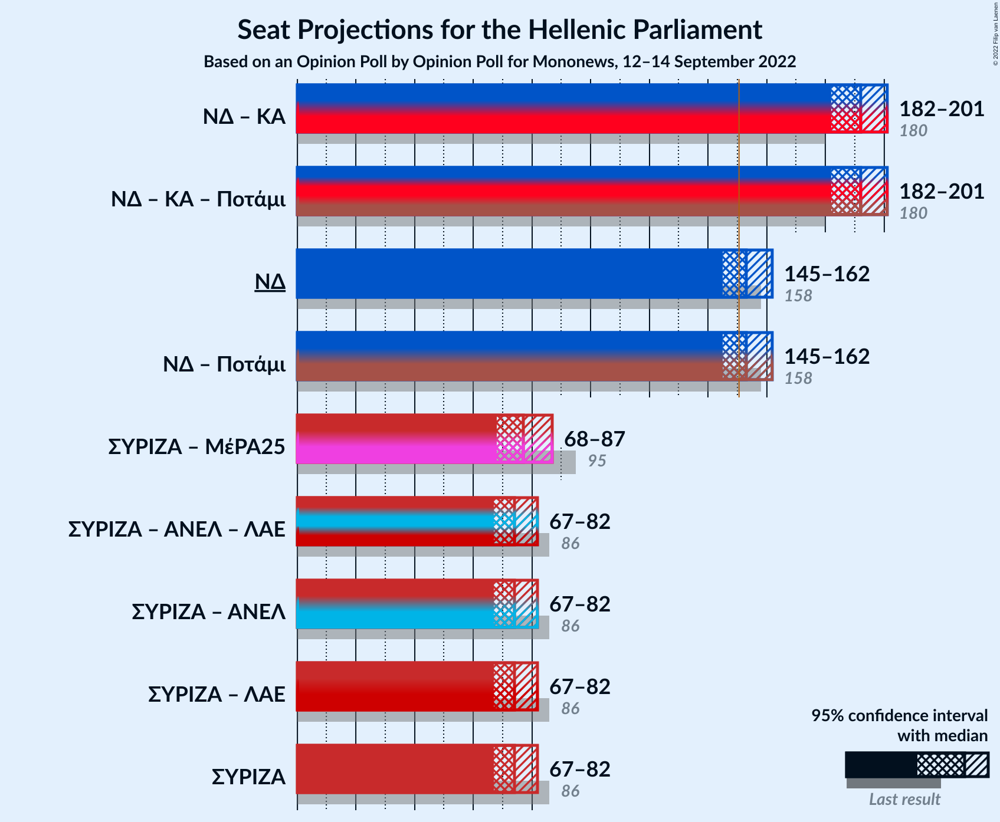

# Opinion Poll by Opinion Poll for Mononews, 12–14 September 2022

<a href="#voting-intentions">Voting Intentions</a> | <a href="#seats">Seats</a> | <a href="#coalitions">Coalitions</a> | <a href="#technical-information">Technical Information</a>

## Voting Intentions

### Confidence Intervals

| Party | Last Result | Poll Result | 80% Confidence Interval | 90% Confidence Interval | 95% Confidence Interval | 99% Confidence Interval |
|:-----:|:-----------:|:-----------:|:-----------------------:|:-----------------------:|:-----------------------:|:-----------------------:|
| Νέα Δημοκρατία | 39.8% | 38.3% | 36.4–40.3% |35.8–40.9% |35.4–41.4% |34.5–42.4% |
| Συνασπισμός Ριζοσπαστικής Αριστεράς | 31.5% | 27.5% | 25.7–29.4% |25.2–29.9% |24.8–30.3% |24.0–31.2% |
| Κίνημα Αλλαγής | 8.1% | 14.1% | 12.8–15.7% |12.4–16.1% |12.1–16.4% |11.5–17.2% |
| Κομμουνιστικό Κόμμα Ελλάδας | 5.3% | 5.8% | 4.9–6.8% |4.7–7.1% |4.5–7.4% |4.1–7.9% |
| Ελληνική Λύση | 3.7% | 5.7% | 4.8–6.7% |4.6–7.0% |4.4–7.3% |4.0–7.8% |
| Μέτωπο Ευρωπαϊκής Ρεαλιστικής Ανυπακοής | 3.4% | 2.7% | 2.1–3.5% |2.0–3.7% |1.8–3.9% |1.6–4.3% |

*Note:* The poll result column reflects the actual value used in the calculations. Published results may vary slightly, and in addition be rounded to fewer digits.

## Seats

### Confidence Intervals

| Party | Last Result | Median | 80% Confidence Interval | 90% Confidence Interval | 95% Confidence Interval | 99% Confidence Interval |
|:-----:|:-----------:|:------:|:-----------------------:|:-----------------------:|:-----------------------:|:-----------------------:|
| <a href="#νέα-δημοκρατία">Νέα Δημοκρατία</a> | 158 | 153 | 148–159 |146–161 |145–162 |142–165 |
| <a href="#συνασπισμός-ριζοσπαστικής-αριστεράς">Συνασπισμός Ριζοσπαστικής Αριστεράς</a> | 86 | 74 | 69–79 |68–81 |67–82 |64–85 |
| <a href="#κίνημα-αλλαγής">Κίνημα Αλλαγής</a> | 22 | 38 | 35–42 |33–43 |33–44 |31–46 |
| <a href="#κομμουνιστικό-κόμμα-ελλάδας">Κομμουνιστικό Κόμμα Ελλάδας</a> | 15 | 16 | 13–18 |13–19 |12–20 |11–21 |
| <a href="#ελληνική-λύση">Ελληνική Λύση</a> | 10 | 15 | 13–18 |12–19 |12–20 |11–21 |
| <a href="#μέτωπο-ευρωπαϊκής-ρεαλιστικής-ανυπακοής">Μέτωπο Ευρωπαϊκής Ρεαλιστικής Ανυπακοής</a> | 9 | 0 | 0–9 |0–10 |0–10 |0–11 |

### Νέα Δημοκρατία

*For a full overview of the results for this party, see the [Νέα Δημοκρατία](party-νέαδημοκρατία.html) page.*

| Number of Seats | Probability | Accumulated | Special Marks |
|:---------------:|:-----------:|:-----------:|:-------------:|
| 139 | 0% | 100% |  |
| 140 | 0.1% | 99.9% |  |
| 141 | 0.2% | 99.9% |  |
| 142 | 0.3% | 99.7% |  |
| 143 | 0.6% | 99.4% |  |
| 144 | 0.9% | 98.8% |  |
| 145 | 1.5% | 98% |  |
| 146 | 2% | 96% |  |
| 147 | 3% | 94% |  |
| 148 | 4% | 91% |  |
| 149 | 6% | 87% |  |
| 150 | 6% | 81% |  |
| 151 | 8% | 75% | Majority |
| 152 | 8% | 66% |  |
| 153 | 9% | 58% | Median |
| 154 | 9% | 49% |  |
| 155 | 8% | 40% |  |
| 156 | 7% | 32% |  |
| 157 | 7% | 25% |  |
| 158 | 5% | 18% | Last Result |
| 159 | 4% | 12% |  |
| 160 | 3% | 8% |  |
| 161 | 2% | 5% |  |
| 162 | 1.4% | 3% |  |
| 163 | 0.8% | 2% |  |
| 164 | 0.5% | 1.0% |  |
| 165 | 0.3% | 0.5% |  |
| 166 | 0.1% | 0.3% |  |
| 167 | 0.1% | 0.1% |  |
| 168 | 0% | 0.1% |  |
| 169 | 0% | 0% |  |

### Συνασπισμός Ριζοσπαστικής Αριστεράς

*For a full overview of the results for this party, see the [Συνασπισμός Ριζοσπαστικής Αριστεράς](party-συνασπισμόςριζοσπαστικήςαριστεράς.html) page.*

| Number of Seats | Probability | Accumulated | Special Marks |
|:---------------:|:-----------:|:-----------:|:-------------:|
| 62 | 0.1% | 100% |  |
| 63 | 0.2% | 99.9% |  |
| 64 | 0.3% | 99.7% |  |
| 65 | 0.6% | 99.4% |  |
| 66 | 1.2% | 98.8% |  |
| 67 | 2% | 98% |  |
| 68 | 3% | 96% |  |
| 69 | 4% | 93% |  |
| 70 | 7% | 89% |  |
| 71 | 7% | 82% |  |
| 72 | 8% | 75% |  |
| 73 | 10% | 66% |  |
| 74 | 9% | 56% | Median |
| 75 | 9% | 47% |  |
| 76 | 10% | 37% |  |
| 77 | 8% | 28% |  |
| 78 | 6% | 20% |  |
| 79 | 5% | 14% |  |
| 80 | 3% | 9% |  |
| 81 | 2% | 6% |  |
| 82 | 2% | 3% |  |
| 83 | 0.8% | 2% |  |
| 84 | 0.5% | 1.0% |  |
| 85 | 0.3% | 0.5% |  |
| 86 | 0.1% | 0.2% | Last Result |
| 87 | 0.1% | 0.1% |  |
| 88 | 0% | 0% |  |

### Κίνημα Αλλαγής

*For a full overview of the results for this party, see the [Κίνημα Αλλαγής](party-κίνημααλλαγής.html) page.*

| Number of Seats | Probability | Accumulated | Special Marks |
|:---------------:|:-----------:|:-----------:|:-------------:|
| 22 | 0% | 100% | Last Result |
| 23 | 0% | 100% |  |
| 24 | 0% | 100% |  |
| 25 | 0% | 100% |  |
| 26 | 0% | 100% |  |
| 27 | 0% | 100% |  |
| 28 | 0% | 100% |  |
| 29 | 0.1% | 100% |  |
| 30 | 0.2% | 99.9% |  |
| 31 | 0.7% | 99.7% |  |
| 32 | 1.5% | 99.0% |  |
| 33 | 3% | 98% |  |
| 34 | 4% | 95% |  |
| 35 | 7% | 91% |  |
| 36 | 10% | 83% |  |
| 37 | 13% | 73% |  |
| 38 | 13% | 59% | Median |
| 39 | 12% | 46% |  |
| 40 | 10% | 34% |  |
| 41 | 9% | 24% |  |
| 42 | 6% | 15% |  |
| 43 | 4% | 9% |  |
| 44 | 2% | 5% |  |
| 45 | 1.1% | 2% |  |
| 46 | 0.5% | 1.0% |  |
| 47 | 0.3% | 0.5% |  |
| 48 | 0.1% | 0.2% |  |
| 49 | 0% | 0.1% |  |
| 50 | 0% | 0% |  |

### Κομμουνιστικό Κόμμα Ελλάδας

*For a full overview of the results for this party, see the [Κομμουνιστικό Κόμμα Ελλάδας](party-κομμουνιστικόκόμμαελλάδας.html) page.*

| Number of Seats | Probability | Accumulated | Special Marks |
|:---------------:|:-----------:|:-----------:|:-------------:|
| 10 | 0.2% | 100% |  |
| 11 | 0.8% | 99.8% |  |
| 12 | 3% | 99.0% |  |
| 13 | 8% | 96% |  |
| 14 | 15% | 88% |  |
| 15 | 19% | 73% | Last Result |
| 16 | 19% | 54% | Median |
| 17 | 15% | 35% |  |
| 18 | 10% | 20% |  |
| 19 | 6% | 10% |  |
| 20 | 3% | 4% |  |
| 21 | 1.0% | 1.4% |  |
| 22 | 0.3% | 0.5% |  |
| 23 | 0.1% | 0.1% |  |
| 24 | 0% | 0% |  |

### Ελληνική Λύση

*For a full overview of the results for this party, see the [Ελληνική Λύση](party-ελληνικήλύση.html) page.*

| Number of Seats | Probability | Accumulated | Special Marks |
|:---------------:|:-----------:|:-----------:|:-------------:|
| 10 | 0.2% | 100% | Last Result |
| 11 | 1.2% | 99.7% |  |
| 12 | 4% | 98.5% |  |
| 13 | 10% | 94% |  |
| 14 | 16% | 84% |  |
| 15 | 20% | 69% | Median |
| 16 | 19% | 49% |  |
| 17 | 14% | 30% |  |
| 18 | 9% | 16% |  |
| 19 | 5% | 8% |  |
| 20 | 2% | 3% |  |
| 21 | 0.7% | 1.0% |  |
| 22 | 0.2% | 0.3% |  |
| 23 | 0.1% | 0.1% |  |
| 24 | 0% | 0% |  |

### Μέτωπο Ευρωπαϊκής Ρεαλιστικής Ανυπακοής

*For a full overview of the results for this party, see the [Μέτωπο Ευρωπαϊκής Ρεαλιστικής Ανυπακοής](party-μέτωποευρωπαϊκήςρεαλιστικήςανυπακοής.html) page.*

| Number of Seats | Probability | Accumulated | Special Marks |
|:---------------:|:-----------:|:-----------:|:-------------:|
| 0 | 69% | 100% | Median |
| 1 | 0% | 31% |  |
| 2 | 0% | 31% |  |
| 3 | 0% | 31% |  |
| 4 | 0% | 31% |  |
| 5 | 0% | 31% |  |
| 6 | 0% | 31% |  |
| 7 | 0% | 31% |  |
| 8 | 11% | 31% |  |
| 9 | 12% | 19% | Last Result |
| 10 | 5% | 7% |  |
| 11 | 1.4% | 2% |  |
| 12 | 0.3% | 0.4% |  |
| 13 | 0.1% | 0.1% |  |
| 14 | 0% | 0% |  |

## Coalitions

### Confidence Intervals

| Coalition | Last Result | Median | Majority? | 80% Confidence Interval | 90% Confidence Interval | 95% Confidence Interval | 99% Confidence Interval |
|:---------:|:-----------:|:------:|:---------:|:-----------------------:|:-----------------------:|:-----------------------:|:-----------------------:|
| Νέα Δημοκρατία – Κίνημα Αλλαγής | 180 | 192 | 100% | 186–198 | 184–199 | 182–201 | 180–203 |
| Νέα Δημοκρατία | 158 | 153 | 75% | 148–159 | 146–161 | 145–162 | 142–165 |
| Συνασπισμός Ριζοσπαστικής Αριστεράς – Μέτωπο Ευρωπαϊκής Ρεαλιστικής Ανυπακοής | 95 | 77 | 0% | 71–83 | 70–85 | 68–87 | 66–89 |
| Συνασπισμός Ριζοσπαστικής Αριστεράς | 86 | 74 | 0% | 69–79 | 68–81 | 67–82 | 64–85 |

### Νέα Δημοκρατία – Κίνημα Αλλαγής

| Number of Seats | Probability | Accumulated | Special Marks |
|:---------------:|:-----------:|:-----------:|:-------------:|
| 176 | 0% | 100% |  |
| 177 | 0.1% | 99.9% |  |
| 178 | 0.1% | 99.9% |  |
| 179 | 0.2% | 99.7% |  |
| 180 | 0.5% | 99.5% | Last Result |
| 181 | 0.6% | 99.1% |  |
| 182 | 1.0% | 98% |  |
| 183 | 2% | 97% |  |
| 184 | 2% | 96% |  |
| 185 | 3% | 93% |  |
| 186 | 4% | 90% |  |
| 187 | 5% | 86% |  |
| 188 | 6% | 81% |  |
| 189 | 7% | 76% |  |
| 190 | 8% | 69% |  |
| 191 | 9% | 61% | Median |
| 192 | 8% | 52% |  |
| 193 | 8% | 44% |  |
| 194 | 7% | 36% |  |
| 195 | 7% | 29% |  |
| 196 | 6% | 22% |  |
| 197 | 5% | 16% |  |
| 198 | 4% | 11% |  |
| 199 | 3% | 7% |  |
| 200 | 2% | 4% |  |
| 201 | 1.2% | 3% |  |
| 202 | 0.7% | 2% |  |
| 203 | 0.4% | 0.8% |  |
| 204 | 0.2% | 0.4% |  |
| 205 | 0.1% | 0.2% |  |
| 206 | 0% | 0.1% |  |
| 207 | 0% | 0% |  |

### Νέα Δημοκρατία

| Number of Seats | Probability | Accumulated | Special Marks |
|:---------------:|:-----------:|:-----------:|:-------------:|
| 139 | 0% | 100% |  |
| 140 | 0.1% | 99.9% |  |
| 141 | 0.2% | 99.9% |  |
| 142 | 0.3% | 99.7% |  |
| 143 | 0.6% | 99.4% |  |
| 144 | 0.9% | 98.8% |  |
| 145 | 1.5% | 98% |  |
| 146 | 2% | 96% |  |
| 147 | 3% | 94% |  |
| 148 | 4% | 91% |  |
| 149 | 6% | 87% |  |
| 150 | 6% | 81% |  |
| 151 | 8% | 75% | Majority |
| 152 | 8% | 66% |  |
| 153 | 9% | 58% | Median |
| 154 | 9% | 49% |  |
| 155 | 8% | 40% |  |
| 156 | 7% | 32% |  |
| 157 | 7% | 25% |  |
| 158 | 5% | 18% | Last Result |
| 159 | 4% | 12% |  |
| 160 | 3% | 8% |  |
| 161 | 2% | 5% |  |
| 162 | 1.4% | 3% |  |
| 163 | 0.8% | 2% |  |
| 164 | 0.5% | 1.0% |  |
| 165 | 0.3% | 0.5% |  |
| 166 | 0.1% | 0.3% |  |
| 167 | 0.1% | 0.1% |  |
| 168 | 0% | 0.1% |  |
| 169 | 0% | 0% |  |

### Συνασπισμός Ριζοσπαστικής Αριστεράς – Μέτωπο Ευρωπαϊκής Ρεαλιστικής Ανυπακοής

| Number of Seats | Probability | Accumulated | Special Marks |
|:---------------:|:-----------:|:-----------:|:-------------:|
| 63 | 0% | 100% |  |
| 64 | 0.1% | 99.9% |  |
| 65 | 0.2% | 99.9% |  |
| 66 | 0.4% | 99.6% |  |
| 67 | 0.8% | 99.3% |  |
| 68 | 1.3% | 98.5% |  |
| 69 | 2% | 97% |  |
| 70 | 3% | 95% |  |
| 71 | 4% | 92% |  |
| 72 | 5% | 87% |  |
| 73 | 7% | 82% |  |
| 74 | 7% | 75% | Median |
| 75 | 8% | 68% |  |
| 76 | 9% | 60% |  |
| 77 | 7% | 51% |  |
| 78 | 8% | 44% |  |
| 79 | 7% | 36% |  |
| 80 | 6% | 29% |  |
| 81 | 6% | 23% |  |
| 82 | 5% | 18% |  |
| 83 | 3% | 13% |  |
| 84 | 4% | 10% |  |
| 85 | 2% | 6% |  |
| 86 | 1.3% | 4% |  |
| 87 | 1.3% | 3% |  |
| 88 | 0.6% | 1.4% |  |
| 89 | 0.4% | 0.8% |  |
| 90 | 0.2% | 0.5% |  |
| 91 | 0.1% | 0.2% |  |
| 92 | 0% | 0.1% |  |
| 93 | 0% | 0.1% |  |
| 94 | 0% | 0% |  |
| 95 | 0% | 0% | Last Result |

### Συνασπισμός Ριζοσπαστικής Αριστεράς

| Number of Seats | Probability | Accumulated | Special Marks |
|:---------------:|:-----------:|:-----------:|:-------------:|
| 62 | 0.1% | 100% |  |
| 63 | 0.2% | 99.9% |  |
| 64 | 0.3% | 99.7% |  |
| 65 | 0.6% | 99.4% |  |
| 66 | 1.2% | 98.8% |  |
| 67 | 2% | 98% |  |
| 68 | 3% | 96% |  |
| 69 | 4% | 93% |  |
| 70 | 7% | 89% |  |
| 71 | 7% | 82% |  |
| 72 | 8% | 75% |  |
| 73 | 10% | 66% |  |
| 74 | 9% | 56% | Median |
| 75 | 9% | 47% |  |
| 76 | 10% | 37% |  |
| 77 | 8% | 28% |  |
| 78 | 6% | 20% |  |
| 79 | 5% | 14% |  |
| 80 | 3% | 9% |  |
| 81 | 2% | 6% |  |
| 82 | 2% | 3% |  |
| 83 | 0.8% | 2% |  |
| 84 | 0.5% | 1.0% |  |
| 85 | 0.3% | 0.5% |  |
| 86 | 0.1% | 0.2% | Last Result |
| 87 | 0.1% | 0.1% |  |
| 88 | 0% | 0% |  |

## Technical Information

### Opinion Poll

+ **Polling firm:** Opinion Poll
+ **Commissioner(s):** Mononews
+ **Fieldwork period:** 12–14 September 2022

### Calculations

+ **Sample size:** 1004
+ **Simulations done:** 1,048,576
+ **Error estimate:** 1.19%

