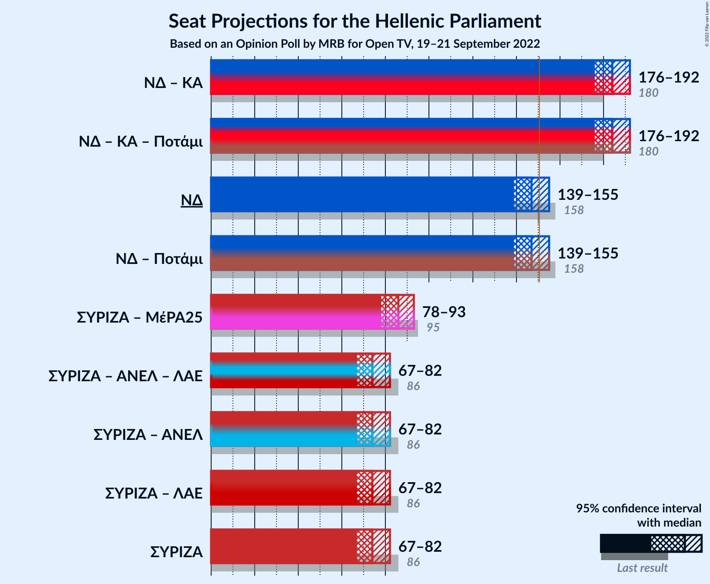

# Opinion Poll by MRB for Open TV, 19–21 September 2022

<a href="#voting-intentions">Voting Intentions</a> | <a href="#seats">Seats</a> | <a href="#coalitions">Coalitions</a> | <a href="#technical-information">Technical Information</a>

## Voting Intentions

### Confidence Intervals

| Party | Last Result | Poll Result | 80% Confidence Interval | 90% Confidence Interval | 95% Confidence Interval | 99% Confidence Interval |
|:-----:|:-----------:|:-----------:|:-----------------------:|:-----------------------:|:-----------------------:|:-----------------------:|
| Νέα Δημοκρατία | 39.8% | 35.7% | 33.8–37.7% |33.2–38.2% |32.8–38.7% |31.9–39.7% |
| Συνασπισμός Ριζοσπαστικής Αριστεράς | 31.5% | 27.2% | 25.5–29.1% |25.0–29.6% |24.5–30.1% |23.7–31.0% |
| Κίνημα Αλλαγής | 8.1% | 13.4% | 12.1–14.9% |11.7–15.3% |11.4–15.7% |10.8–16.4% |
| Κομμουνιστικό Κόμμα Ελλάδας | 5.3% | 6.1% | 5.2–7.2% |5.0–7.5% |4.8–7.8% |4.4–8.3% |
| Ελληνική Λύση | 3.7% | 5.0% | 4.2–6.0% |4.0–6.3% |3.8–6.5% |3.5–7.1% |
| Μέτωπο Ευρωπαϊκής Ρεαλιστικής Ανυπακοής | 3.4% | 4.2% | 3.5–5.1% |3.3–5.4% |3.1–5.6% |2.8–6.1% |

*Note:* The poll result column reflects the actual value used in the calculations. Published results may vary slightly, and in addition be rounded to fewer digits.

## Seats

### Confidence Intervals

| Party | Last Result | Median | 80% Confidence Interval | 90% Confidence Interval | 95% Confidence Interval | 99% Confidence Interval |
|:-----:|:-----------:|:------:|:-----------------------:|:-----------------------:|:-----------------------:|:-----------------------:|
| <a href="#νέα-δημοκρατία">Νέα Δημοκρατία</a> | 158 | 147 | 142–152 |140–154 |139–155 |137–158 |
| <a href="#συνασπισμός-ριζοσπαστικής-αριστεράς">Συνασπισμός Ριζοσπαστικής Αριστεράς</a> | 86 | 74 | 69–79 |68–80 |67–82 |65–84 |
| <a href="#κίνημα-αλλαγής">Κίνημα Αλλαγής</a> | 22 | 36 | 33–40 |32–41 |31–43 |29–44 |
| <a href="#κομμουνιστικό-κόμμα-ελλάδας">Κομμουνιστικό Κόμμα Ελλάδας</a> | 15 | 17 | 14–20 |14–20 |13–21 |12–23 |
| <a href="#ελληνική-λύση">Ελληνική Λύση</a> | 10 | 14 | 12–16 |11–17 |10–18 |9–19 |
| <a href="#μέτωπο-ευρωπαϊκής-ρεαλιστικής-ανυπακοής">Μέτωπο Ευρωπαϊκής Ρεαλιστικής Ανυπακοής</a> | 9 | 12 | 9–14 |9–15 |8–15 |0–17 |

### Νέα Δημοκρατία

*For a full overview of the results for this party, see the [Νέα Δημοκρατία](party-νέαδημοκρατία.html) page.*

| Number of Seats | Probability | Accumulated | Special Marks |
|:---------------:|:-----------:|:-----------:|:-------------:|
| 133 | 0% | 100% |  |
| 134 | 0% | 99.9% |  |
| 135 | 0.1% | 99.9% |  |
| 136 | 0.2% | 99.8% |  |
| 137 | 0.4% | 99.6% |  |
| 138 | 0.7% | 99.2% |  |
| 139 | 1.3% | 98% |  |
| 140 | 2% | 97% |  |
| 141 | 3% | 95% |  |
| 142 | 5% | 92% |  |
| 143 | 6% | 87% |  |
| 144 | 7% | 81% |  |
| 145 | 10% | 74% |  |
| 146 | 9% | 65% |  |
| 147 | 10% | 56% | Median |
| 148 | 9% | 46% |  |
| 149 | 9% | 37% |  |
| 150 | 7% | 28% |  |
| 151 | 6% | 21% | Majority |
| 152 | 5% | 14% |  |
| 153 | 3% | 9% |  |
| 154 | 3% | 6% |  |
| 155 | 1.5% | 4% |  |
| 156 | 1.0% | 2% |  |
| 157 | 0.5% | 1.1% |  |
| 158 | 0.3% | 0.6% | Last Result |
| 159 | 0.2% | 0.3% |  |
| 160 | 0.1% | 0.2% |  |
| 161 | 0% | 0.1% |  |
| 162 | 0% | 0% |  |

### Συνασπισμός Ριζοσπαστικής Αριστεράς

*For a full overview of the results for this party, see the [Συνασπισμός Ριζοσπαστικής Αριστεράς](party-συνασπισμόςριζοσπαστικήςαριστεράς.html) page.*

| Number of Seats | Probability | Accumulated | Special Marks |
|:---------------:|:-----------:|:-----------:|:-------------:|
| 62 | 0% | 100% |  |
| 63 | 0.1% | 99.9% |  |
| 64 | 0.3% | 99.8% |  |
| 65 | 0.5% | 99.5% |  |
| 66 | 1.1% | 99.0% |  |
| 67 | 2% | 98% |  |
| 68 | 3% | 96% |  |
| 69 | 4% | 93% |  |
| 70 | 6% | 89% |  |
| 71 | 7% | 83% |  |
| 72 | 9% | 75% |  |
| 73 | 11% | 66% |  |
| 74 | 11% | 55% | Median |
| 75 | 10% | 45% |  |
| 76 | 9% | 35% |  |
| 77 | 8% | 26% |  |
| 78 | 6% | 18% |  |
| 79 | 4% | 12% |  |
| 80 | 3% | 8% |  |
| 81 | 2% | 5% |  |
| 82 | 1.3% | 3% |  |
| 83 | 0.7% | 1.4% |  |
| 84 | 0.4% | 0.7% |  |
| 85 | 0.2% | 0.4% |  |
| 86 | 0.1% | 0.2% | Last Result |
| 87 | 0% | 0.1% |  |
| 88 | 0% | 0.1% |  |
| 89 | 0% | 0% |  |

### Κίνημα Αλλαγής

*For a full overview of the results for this party, see the [Κίνημα Αλλαγής](party-κίνημααλλαγής.html) page.*

| Number of Seats | Probability | Accumulated | Special Marks |
|:---------------:|:-----------:|:-----------:|:-------------:|
| 22 | 0% | 100% | Last Result |
| 23 | 0% | 100% |  |
| 24 | 0% | 100% |  |
| 25 | 0% | 100% |  |
| 26 | 0% | 100% |  |
| 27 | 0% | 100% |  |
| 28 | 0.1% | 100% |  |
| 29 | 0.4% | 99.9% |  |
| 30 | 1.0% | 99.5% |  |
| 31 | 2% | 98.5% |  |
| 32 | 4% | 96% |  |
| 33 | 7% | 92% |  |
| 34 | 9% | 85% |  |
| 35 | 12% | 76% |  |
| 36 | 14% | 63% | Median |
| 37 | 14% | 50% |  |
| 38 | 11% | 36% |  |
| 39 | 9% | 24% |  |
| 40 | 6% | 16% |  |
| 41 | 4% | 9% |  |
| 42 | 2% | 5% |  |
| 43 | 1.4% | 3% |  |
| 44 | 0.7% | 1.1% |  |
| 45 | 0.3% | 0.5% |  |
| 46 | 0.1% | 0.2% |  |
| 47 | 0% | 0.1% |  |
| 48 | 0% | 0% |  |

### Κομμουνιστικό Κόμμα Ελλάδας

*For a full overview of the results for this party, see the [Κομμουνιστικό Κόμμα Ελλάδας](party-κομμουνιστικόκόμμαελλάδας.html) page.*

| Number of Seats | Probability | Accumulated | Special Marks |
|:---------------:|:-----------:|:-----------:|:-------------:|
| 11 | 0.2% | 100% |  |
| 12 | 1.1% | 99.8% |  |
| 13 | 3% | 98.7% |  |
| 14 | 8% | 96% |  |
| 15 | 14% | 87% | Last Result |
| 16 | 17% | 73% |  |
| 17 | 19% | 55% | Median |
| 18 | 17% | 37% |  |
| 19 | 9% | 20% |  |
| 20 | 6% | 10% |  |
| 21 | 3% | 4% |  |
| 22 | 1.0% | 2% |  |
| 23 | 0.4% | 0.5% |  |
| 24 | 0.1% | 0.2% |  |
| 25 | 0% | 0% |  |

### Ελληνική Λύση

*For a full overview of the results for this party, see the [Ελληνική Λύση](party-ελληνικήλύση.html) page.*

| Number of Seats | Probability | Accumulated | Special Marks |
|:---------------:|:-----------:|:-----------:|:-------------:|
| 8 | 0% | 100% |  |
| 9 | 0.5% | 99.9% |  |
| 10 | 2% | 99.4% | Last Result |
| 11 | 7% | 97% |  |
| 12 | 14% | 90% |  |
| 13 | 20% | 76% |  |
| 14 | 21% | 56% | Median |
| 15 | 17% | 36% |  |
| 16 | 11% | 19% |  |
| 17 | 5% | 8% |  |
| 18 | 2% | 3% |  |
| 19 | 0.8% | 1.1% |  |
| 20 | 0.2% | 0.3% |  |
| 21 | 0.1% | 0.1% |  |
| 22 | 0% | 0% |  |

### Μέτωπο Ευρωπαϊκής Ρεαλιστικής Ανυπακοής

*For a full overview of the results for this party, see the [Μέτωπο Ευρωπαϊκής Ρεαλιστικής Ανυπακοής](party-μέτωποευρωπαϊκήςρεαλιστικήςανυπακοής.html) page.*

| Number of Seats | Probability | Accumulated | Special Marks |
|:---------------:|:-----------:|:-----------:|:-------------:|
| 0 | 2% | 100% |  |
| 1 | 0% | 98% |  |
| 2 | 0% | 98% |  |
| 3 | 0% | 98% |  |
| 4 | 0% | 98% |  |
| 5 | 0% | 98% |  |
| 6 | 0% | 98% |  |
| 7 | 0% | 98% |  |
| 8 | 1.0% | 98% |  |
| 9 | 8% | 97% | Last Result |
| 10 | 16% | 90% |  |
| 11 | 22% | 74% |  |
| 12 | 21% | 52% | Median |
| 13 | 15% | 30% |  |
| 14 | 9% | 15% |  |
| 15 | 4% | 6% |  |
| 16 | 1.3% | 2% |  |
| 17 | 0.4% | 0.6% |  |
| 18 | 0.1% | 0.1% |  |
| 19 | 0% | 0% |  |

## Coalitions

### Confidence Intervals

| Coalition | Last Result | Median | Majority? | 80% Confidence Interval | 90% Confidence Interval | 95% Confidence Interval | 99% Confidence Interval |
|:---------:|:-----------:|:------:|:---------:|:-----------------------:|:-----------------------:|:-----------------------:|:-----------------------:|
| Νέα Δημοκρατία – Κίνημα Αλλαγής | 180 | 184 | 100% | 178–189 | 177–191 | 176–192 | 173–195 |
| Νέα Δημοκρατία | 158 | 147 | 21% | 142–152 | 140–154 | 139–155 | 137–158 |
| Συνασπισμός Ριζοσπαστικής Αριστεράς – Μέτωπο Ευρωπαϊκής Ρεαλιστικής Ανυπακοής | 95 | 86 | 0% | 81–91 | 79–92 | 78–93 | 75–96 |
| Συνασπισμός Ριζοσπαστικής Αριστεράς | 86 | 74 | 0% | 69–79 | 68–80 | 67–82 | 65–84 |

### Νέα Δημοκρατία – Κίνημα Αλλαγής

| Number of Seats | Probability | Accumulated | Special Marks |
|:---------------:|:-----------:|:-----------:|:-------------:|
| 169 | 0% | 100% |  |
| 170 | 0% | 99.9% |  |
| 171 | 0.1% | 99.9% |  |
| 172 | 0.2% | 99.8% |  |
| 173 | 0.3% | 99.6% |  |
| 174 | 0.6% | 99.3% |  |
| 175 | 1.1% | 98.7% |  |
| 176 | 2% | 98% |  |
| 177 | 3% | 96% |  |
| 178 | 4% | 93% |  |
| 179 | 5% | 89% |  |
| 180 | 7% | 84% | Last Result |
| 181 | 8% | 78% |  |
| 182 | 9% | 70% |  |
| 183 | 11% | 61% | Median |
| 184 | 8% | 51% |  |
| 185 | 10% | 43% |  |
| 186 | 8% | 33% |  |
| 187 | 7% | 25% |  |
| 188 | 5% | 18% |  |
| 189 | 4% | 12% |  |
| 190 | 3% | 8% |  |
| 191 | 2% | 5% |  |
| 192 | 1.2% | 3% |  |
| 193 | 0.7% | 2% |  |
| 194 | 0.5% | 1.1% |  |
| 195 | 0.3% | 0.6% |  |
| 196 | 0.2% | 0.3% |  |
| 197 | 0.1% | 0.2% |  |
| 198 | 0% | 0.1% |  |
| 199 | 0% | 0% |  |

### Νέα Δημοκρατία

| Number of Seats | Probability | Accumulated | Special Marks |
|:---------------:|:-----------:|:-----------:|:-------------:|
| 133 | 0% | 100% |  |
| 134 | 0% | 99.9% |  |
| 135 | 0.1% | 99.9% |  |
| 136 | 0.2% | 99.8% |  |
| 137 | 0.4% | 99.6% |  |
| 138 | 0.7% | 99.2% |  |
| 139 | 1.3% | 98% |  |
| 140 | 2% | 97% |  |
| 141 | 3% | 95% |  |
| 142 | 5% | 92% |  |
| 143 | 6% | 87% |  |
| 144 | 7% | 81% |  |
| 145 | 10% | 74% |  |
| 146 | 9% | 65% |  |
| 147 | 10% | 56% | Median |
| 148 | 9% | 46% |  |
| 149 | 9% | 37% |  |
| 150 | 7% | 28% |  |
| 151 | 6% | 21% | Majority |
| 152 | 5% | 14% |  |
| 153 | 3% | 9% |  |
| 154 | 3% | 6% |  |
| 155 | 1.5% | 4% |  |
| 156 | 1.0% | 2% |  |
| 157 | 0.5% | 1.1% |  |
| 158 | 0.3% | 0.6% | Last Result |
| 159 | 0.2% | 0.3% |  |
| 160 | 0.1% | 0.2% |  |
| 161 | 0% | 0.1% |  |
| 162 | 0% | 0% |  |

### Συνασπισμός Ριζοσπαστικής Αριστεράς – Μέτωπο Ευρωπαϊκής Ρεαλιστικής Ανυπακοής

| Number of Seats | Probability | Accumulated | Special Marks |
|:---------------:|:-----------:|:-----------:|:-------------:|
| 70 | 0% | 100% |  |
| 71 | 0% | 99.9% |  |
| 72 | 0.1% | 99.9% |  |
| 73 | 0.1% | 99.8% |  |
| 74 | 0.2% | 99.7% |  |
| 75 | 0.4% | 99.6% |  |
| 76 | 0.6% | 99.2% |  |
| 77 | 0.9% | 98.6% |  |
| 78 | 2% | 98% |  |
| 79 | 3% | 96% |  |
| 80 | 3% | 93% |  |
| 81 | 5% | 90% |  |
| 82 | 6% | 85% |  |
| 83 | 7% | 79% |  |
| 84 | 11% | 71% |  |
| 85 | 9% | 60% |  |
| 86 | 9% | 51% | Median |
| 87 | 10% | 42% |  |
| 88 | 7% | 32% |  |
| 89 | 7% | 24% |  |
| 90 | 7% | 17% |  |
| 91 | 4% | 10% |  |
| 92 | 3% | 7% |  |
| 93 | 2% | 4% |  |
| 94 | 1.0% | 2% |  |
| 95 | 0.7% | 1.4% | Last Result |
| 96 | 0.3% | 0.7% |  |
| 97 | 0.2% | 0.3% |  |
| 98 | 0.1% | 0.2% |  |
| 99 | 0% | 0.1% |  |
| 100 | 0% | 0.1% |  |
| 101 | 0% | 0% |  |

### Συνασπισμός Ριζοσπαστικής Αριστεράς

| Number of Seats | Probability | Accumulated | Special Marks |
|:---------------:|:-----------:|:-----------:|:-------------:|
| 62 | 0% | 100% |  |
| 63 | 0.1% | 99.9% |  |
| 64 | 0.3% | 99.8% |  |
| 65 | 0.5% | 99.5% |  |
| 66 | 1.1% | 99.0% |  |
| 67 | 2% | 98% |  |
| 68 | 3% | 96% |  |
| 69 | 4% | 93% |  |
| 70 | 6% | 89% |  |
| 71 | 7% | 83% |  |
| 72 | 9% | 75% |  |
| 73 | 11% | 66% |  |
| 74 | 11% | 55% | Median |
| 75 | 10% | 45% |  |
| 76 | 9% | 35% |  |
| 77 | 8% | 26% |  |
| 78 | 6% | 18% |  |
| 79 | 4% | 12% |  |
| 80 | 3% | 8% |  |
| 81 | 2% | 5% |  |
| 82 | 1.3% | 3% |  |
| 83 | 0.7% | 1.4% |  |
| 84 | 0.4% | 0.7% |  |
| 85 | 0.2% | 0.4% |  |
| 86 | 0.1% | 0.2% | Last Result |
| 87 | 0% | 0.1% |  |
| 88 | 0% | 0.1% |  |
| 89 | 0% | 0% |  |

## Technical Information

### Opinion Poll

+ **Polling firm:** MRB
+ **Commissioner(s):** Open TV
+ **Fieldwork period:** 19–21 September 2022

### Calculations

+ **Sample size:** 1000
+ **Simulations done:** 1,048,576
+ **Error estimate:** 0.53%

