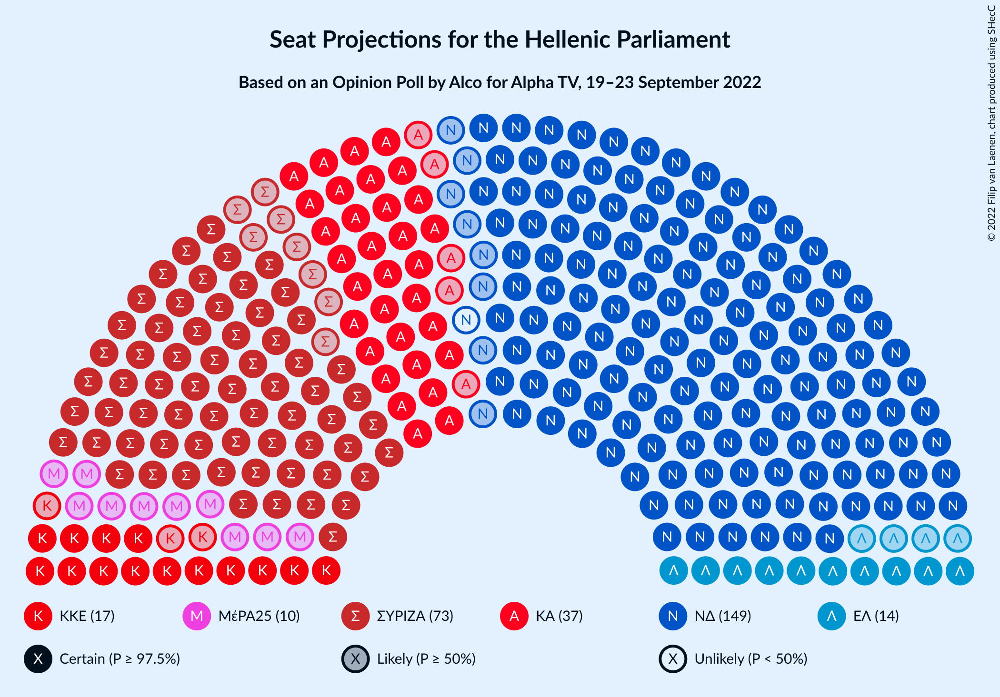
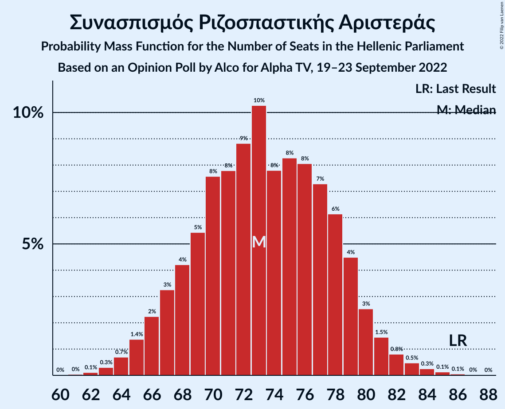

# Opinion Poll by Alco for Alpha TV, 19–23 September 2022

<a href="#voting-intentions">Voting Intentions</a> | <a href="#seats">Seats</a> | <a href="#coalitions">Coalitions</a> | <a href="#technical-information">Technical Information</a>

## Voting Intentions

### Confidence Intervals

| Party | Last Result | Poll Result | 80% Confidence Interval | 90% Confidence Interval | 95% Confidence Interval | 99% Confidence Interval |
|:-----:|:-----------:|:-----------:|:-----------------------:|:-----------------------:|:-----------------------:|:-----------------------:|
| Νέα Δημοκρατία | 39.8% | 35.9% | 33.9–37.8% |33.4–38.4% |33.0–38.9% |32.0–39.8% |
| Συνασπισμός Ριζοσπαστικής Αριστεράς | 31.5% | 26.7% | 24.9–28.5% |24.4–29.1% |24.0–29.5% |23.2–30.4% |
| Κίνημα Αλλαγής | 8.1% | 13.6% | 12.3–15.1% |11.9–15.5% |11.6–15.9% |11.0–16.6% |
| Κομμουνιστικό Κόμμα Ελλάδας | 5.3% | 6.3% | 5.4–7.4% |5.2–7.7% |4.9–8.0% |4.6–8.5% |
| Ελληνική Λύση | 3.7% | 5.0% | 4.2–6.0% |4.0–6.3% |3.8–6.5% |3.5–7.0% |
| Μέτωπο Ευρωπαϊκής Ρεαλιστικής Ανυπακοής | 3.4% | 3.7% | 3.0–4.6% |2.9–4.8% |2.7–5.1% |2.4–5.5% |

*Note:* The poll result column reflects the actual value used in the calculations. Published results may vary slightly, and in addition be rounded to fewer digits.

## Seats

### Confidence Intervals

| Party | Last Result | Median | 80% Confidence Interval | 90% Confidence Interval | 95% Confidence Interval | 99% Confidence Interval |
|:-----:|:-----------:|:------:|:-----------------------:|:-----------------------:|:-----------------------:|:-----------------------:|
| <a href="#νέα-δημοκρατία">Νέα Δημοκρατία</a> | 158 | 148 | 143–154 |141–155 |140–157 |138–160 |
| <a href="#συνασπισμός-ριζοσπαστικής-αριστεράς">Συνασπισμός Ριζοσπαστικής Αριστεράς</a> | 86 | 73 | 68–79 |67–80 |65–81 |64–83 |
| <a href="#κίνημα-αλλαγής">Κίνημα Αλλαγής</a> | 22 | 37 | 34–41 |33–42 |32–44 |30–46 |
| <a href="#κομμουνιστικό-κόμμα-ελλάδας">Κομμουνιστικό Κόμμα Ελλάδας</a> | 15 | 17 | 15–20 |14–21 |14–22 |12–23 |
| <a href="#ελληνική-λύση">Ελληνική Λύση</a> | 10 | 14 | 11–16 |11–17 |10–18 |9–19 |
| <a href="#μέτωπο-ευρωπαϊκής-ρεαλιστικής-ανυπακοής">Μέτωπο Ευρωπαϊκής Ρεαλιστικής Ανυπακοής</a> | 9 | 10 | 8–12 |0–13 |0–14 |0–15 |

### Νέα Δημοκρατία

*For a full overview of the results for this party, see the [Νέα Δημοκρατία](party-νέαδημοκρατία.html) page.*

| Number of Seats | Probability | Accumulated | Special Marks |
|:---------------:|:-----------:|:-----------:|:-------------:|
| 135 | 0% | 100% |  |
| 136 | 0.1% | 99.9% |  |
| 137 | 0.2% | 99.8% |  |
| 138 | 0.4% | 99.6% |  |
| 139 | 0.8% | 99.1% |  |
| 140 | 1.4% | 98% |  |
| 141 | 2% | 97% |  |
| 142 | 3% | 95% |  |
| 143 | 5% | 91% |  |
| 144 | 6% | 87% |  |
| 145 | 8% | 81% |  |
| 146 | 8% | 73% |  |
| 147 | 9% | 65% |  |
| 148 | 9% | 56% | Median |
| 149 | 9% | 47% |  |
| 150 | 9% | 38% |  |
| 151 | 7% | 29% | Majority |
| 152 | 6% | 22% |  |
| 153 | 5% | 16% |  |
| 154 | 4% | 11% |  |
| 155 | 3% | 7% |  |
| 156 | 2% | 5% |  |
| 157 | 1.2% | 3% |  |
| 158 | 0.8% | 2% | Last Result |
| 159 | 0.4% | 1.0% |  |
| 160 | 0.3% | 0.6% |  |
| 161 | 0.2% | 0.3% |  |
| 162 | 0.1% | 0.2% |  |
| 163 | 0.1% | 0.1% |  |
| 164 | 0% | 0% |  |

### Συνασπισμός Ριζοσπαστικής Αριστεράς

*For a full overview of the results for this party, see the [Συνασπισμός Ριζοσπαστικής Αριστεράς](party-συνασπισμόςριζοσπαστικήςαριστεράς.html) page.*

| Number of Seats | Probability | Accumulated | Special Marks |
|:---------------:|:-----------:|:-----------:|:-------------:|
| 61 | 0% | 100% |  |
| 62 | 0.1% | 99.9% |  |
| 63 | 0.3% | 99.8% |  |
| 64 | 0.7% | 99.5% |  |
| 65 | 1.4% | 98.8% |  |
| 66 | 2% | 97% |  |
| 67 | 3% | 95% |  |
| 68 | 4% | 92% |  |
| 69 | 5% | 88% |  |
| 70 | 8% | 82% |  |
| 71 | 8% | 75% |  |
| 72 | 9% | 67% |  |
| 73 | 10% | 58% | Median |
| 74 | 8% | 48% |  |
| 75 | 8% | 40% |  |
| 76 | 8% | 32% |  |
| 77 | 7% | 24% |  |
| 78 | 6% | 16% |  |
| 79 | 4% | 10% |  |
| 80 | 3% | 6% |  |
| 81 | 1.5% | 3% |  |
| 82 | 0.8% | 2% |  |
| 83 | 0.5% | 1.0% |  |
| 84 | 0.3% | 0.5% |  |
| 85 | 0.1% | 0.2% |  |
| 86 | 0.1% | 0.1% | Last Result |
| 87 | 0% | 0.1% |  |
| 88 | 0% | 0% |  |

### Κίνημα Αλλαγής

*For a full overview of the results for this party, see the [Κίνημα Αλλαγής](party-κίνημααλλαγής.html) page.*

| Number of Seats | Probability | Accumulated | Special Marks |
|:---------------:|:-----------:|:-----------:|:-------------:|
| 22 | 0% | 100% | Last Result |
| 23 | 0% | 100% |  |
| 24 | 0% | 100% |  |
| 25 | 0% | 100% |  |
| 26 | 0% | 100% |  |
| 27 | 0% | 100% |  |
| 28 | 0% | 100% |  |
| 29 | 0.2% | 99.9% |  |
| 30 | 0.6% | 99.8% |  |
| 31 | 1.0% | 99.2% |  |
| 32 | 3% | 98% |  |
| 33 | 4% | 95% |  |
| 34 | 7% | 91% |  |
| 35 | 11% | 84% |  |
| 36 | 10% | 73% |  |
| 37 | 17% | 63% | Median |
| 38 | 9% | 46% |  |
| 39 | 13% | 37% |  |
| 40 | 9% | 24% |  |
| 41 | 6% | 15% |  |
| 42 | 5% | 10% |  |
| 43 | 2% | 4% |  |
| 44 | 2% | 3% |  |
| 45 | 0.5% | 1.1% |  |
| 46 | 0.3% | 0.5% |  |
| 47 | 0.2% | 0.2% |  |
| 48 | 0% | 0.1% |  |
| 49 | 0% | 0% |  |

### Κομμουνιστικό Κόμμα Ελλάδας

*For a full overview of the results for this party, see the [Κομμουνιστικό Κόμμα Ελλάδας](party-κομμουνιστικόκόμμαελλάδας.html) page.*

| Number of Seats | Probability | Accumulated | Special Marks |
|:---------------:|:-----------:|:-----------:|:-------------:|
| 11 | 0.1% | 100% |  |
| 12 | 0.4% | 99.9% |  |
| 13 | 2% | 99.5% |  |
| 14 | 5% | 98% |  |
| 15 | 10% | 93% | Last Result |
| 16 | 16% | 82% |  |
| 17 | 18% | 66% | Median |
| 18 | 17% | 48% |  |
| 19 | 14% | 31% |  |
| 20 | 9% | 17% |  |
| 21 | 5% | 8% |  |
| 22 | 2% | 3% |  |
| 23 | 0.9% | 1.3% |  |
| 24 | 0.3% | 0.5% |  |
| 25 | 0.1% | 0.1% |  |
| 26 | 0% | 0% |  |

### Ελληνική Λύση

*For a full overview of the results for this party, see the [Ελληνική Λύση](party-ελληνικήλύση.html) page.*

| Number of Seats | Probability | Accumulated | Special Marks |
|:---------------:|:-----------:|:-----------:|:-------------:|
| 8 | 0% | 100% |  |
| 9 | 0.5% | 99.9% |  |
| 10 | 2% | 99.5% | Last Result |
| 11 | 7% | 97% |  |
| 12 | 13% | 90% |  |
| 13 | 19% | 77% |  |
| 14 | 21% | 58% | Median |
| 15 | 17% | 37% |  |
| 16 | 10% | 19% |  |
| 17 | 6% | 10% |  |
| 18 | 2% | 4% |  |
| 19 | 0.9% | 1.3% |  |
| 20 | 0.3% | 0.4% |  |
| 21 | 0.1% | 0.1% |  |
| 22 | 0% | 0% |  |

### Μέτωπο Ευρωπαϊκής Ρεαλιστικής Ανυπακοής

*For a full overview of the results for this party, see the [Μέτωπο Ευρωπαϊκής Ρεαλιστικής Ανυπακοής](party-μέτωποευρωπαϊκήςρεαλιστικήςανυπακοής.html) page.*

| Number of Seats | Probability | Accumulated | Special Marks |
|:---------------:|:-----------:|:-----------:|:-------------:|
| 0 | 10% | 100% |  |
| 1 | 0% | 90% |  |
| 2 | 0% | 90% |  |
| 3 | 0% | 90% |  |
| 4 | 0% | 90% |  |
| 5 | 0% | 90% |  |
| 6 | 0% | 90% |  |
| 7 | 0% | 90% |  |
| 8 | 3% | 90% |  |
| 9 | 20% | 87% | Last Result |
| 10 | 24% | 67% | Median |
| 11 | 21% | 44% |  |
| 12 | 13% | 23% |  |
| 13 | 6% | 10% |  |
| 14 | 3% | 4% |  |
| 15 | 0.8% | 1.1% |  |
| 16 | 0.2% | 0.3% |  |
| 17 | 0% | 0.1% |  |
| 18 | 0% | 0% |  |

## Coalitions

### Confidence Intervals

| Coalition | Last Result | Median | Majority? | 80% Confidence Interval | 90% Confidence Interval | 95% Confidence Interval | 99% Confidence Interval |
|:---------:|:-----------:|:------:|:---------:|:-----------------------:|:-----------------------:|:-----------------------:|:-----------------------:|
| Νέα Δημοκρατία – Κίνημα Αλλαγής | 180 | 186 | 100% | 180–191 | 178–193 | 177–195 | 175–198 |
| Νέα Δημοκρατία | 158 | 148 | 29% | 143–154 | 141–155 | 140–157 | 138–160 |
| Συνασπισμός Ριζοσπαστικής Αριστεράς – Μέτωπο Ευρωπαϊκής Ρεαλιστικής Ανυπακοής | 95 | 83 | 0% | 77–89 | 75–90 | 73–91 | 70–94 |
| Συνασπισμός Ριζοσπαστικής Αριστεράς | 86 | 73 | 0% | 68–79 | 67–80 | 65–81 | 64–83 |

### Νέα Δημοκρατία – Κίνημα Αλλαγής

| Number of Seats | Probability | Accumulated | Special Marks |
|:---------------:|:-----------:|:-----------:|:-------------:|
| 172 | 0.1% | 100% |  |
| 173 | 0.1% | 99.9% |  |
| 174 | 0.2% | 99.8% |  |
| 175 | 0.4% | 99.6% |  |
| 176 | 0.8% | 99.1% |  |
| 177 | 2% | 98% |  |
| 178 | 2% | 97% |  |
| 179 | 3% | 95% |  |
| 180 | 4% | 92% | Last Result |
| 181 | 5% | 87% |  |
| 182 | 7% | 83% |  |
| 183 | 7% | 75% |  |
| 184 | 9% | 68% |  |
| 185 | 9% | 59% | Median |
| 186 | 8% | 50% |  |
| 187 | 9% | 42% |  |
| 188 | 7% | 33% |  |
| 189 | 7% | 27% |  |
| 190 | 6% | 20% |  |
| 191 | 5% | 14% |  |
| 192 | 3% | 9% |  |
| 193 | 2% | 7% |  |
| 194 | 2% | 5% |  |
| 195 | 1.1% | 3% |  |
| 196 | 0.7% | 2% |  |
| 197 | 0.6% | 1.3% |  |
| 198 | 0.4% | 0.7% |  |
| 199 | 0.2% | 0.4% |  |
| 200 | 0.1% | 0.2% |  |
| 201 | 0.1% | 0.1% |  |
| 202 | 0% | 0.1% |  |
| 203 | 0% | 0% |  |

### Νέα Δημοκρατία

| Number of Seats | Probability | Accumulated | Special Marks |
|:---------------:|:-----------:|:-----------:|:-------------:|
| 135 | 0% | 100% |  |
| 136 | 0.1% | 99.9% |  |
| 137 | 0.2% | 99.8% |  |
| 138 | 0.4% | 99.6% |  |
| 139 | 0.8% | 99.1% |  |
| 140 | 1.4% | 98% |  |
| 141 | 2% | 97% |  |
| 142 | 3% | 95% |  |
| 143 | 5% | 91% |  |
| 144 | 6% | 87% |  |
| 145 | 8% | 81% |  |
| 146 | 8% | 73% |  |
| 147 | 9% | 65% |  |
| 148 | 9% | 56% | Median |
| 149 | 9% | 47% |  |
| 150 | 9% | 38% |  |
| 151 | 7% | 29% | Majority |
| 152 | 6% | 22% |  |
| 153 | 5% | 16% |  |
| 154 | 4% | 11% |  |
| 155 | 3% | 7% |  |
| 156 | 2% | 5% |  |
| 157 | 1.2% | 3% |  |
| 158 | 0.8% | 2% | Last Result |
| 159 | 0.4% | 1.0% |  |
| 160 | 0.3% | 0.6% |  |
| 161 | 0.2% | 0.3% |  |
| 162 | 0.1% | 0.2% |  |
| 163 | 0.1% | 0.1% |  |
| 164 | 0% | 0% |  |

### Συνασπισμός Ριζοσπαστικής Αριστεράς – Μέτωπο Ευρωπαϊκής Ρεαλιστικής Ανυπακοής

| Number of Seats | Probability | Accumulated | Special Marks |
|:---------------:|:-----------:|:-----------:|:-------------:|
| 66 | 0% | 100% |  |
| 67 | 0.1% | 99.9% |  |
| 68 | 0.1% | 99.9% |  |
| 69 | 0.1% | 99.7% |  |
| 70 | 0.3% | 99.6% |  |
| 71 | 0.4% | 99.4% |  |
| 72 | 0.6% | 99.0% |  |
| 73 | 0.9% | 98% |  |
| 74 | 1.2% | 97% |  |
| 75 | 1.5% | 96% |  |
| 76 | 3% | 95% |  |
| 77 | 4% | 92% |  |
| 78 | 5% | 88% |  |
| 79 | 5% | 84% |  |
| 80 | 7% | 78% |  |
| 81 | 8% | 71% |  |
| 82 | 9% | 63% |  |
| 83 | 8% | 54% | Median |
| 84 | 8% | 46% |  |
| 85 | 8% | 38% |  |
| 86 | 8% | 30% |  |
| 87 | 6% | 22% |  |
| 88 | 5% | 16% |  |
| 89 | 4% | 11% |  |
| 90 | 3% | 7% |  |
| 91 | 2% | 4% |  |
| 92 | 1.0% | 2% |  |
| 93 | 0.6% | 1.1% |  |
| 94 | 0.3% | 0.5% |  |
| 95 | 0.1% | 0.2% | Last Result |
| 96 | 0.1% | 0.1% |  |
| 97 | 0% | 0% |  |

### Συνασπισμός Ριζοσπαστικής Αριστεράς

| Number of Seats | Probability | Accumulated | Special Marks |
|:---------------:|:-----------:|:-----------:|:-------------:|
| 61 | 0% | 100% |  |
| 62 | 0.1% | 99.9% |  |
| 63 | 0.3% | 99.8% |  |
| 64 | 0.7% | 99.5% |  |
| 65 | 1.4% | 98.8% |  |
| 66 | 2% | 97% |  |
| 67 | 3% | 95% |  |
| 68 | 4% | 92% |  |
| 69 | 5% | 88% |  |
| 70 | 8% | 82% |  |
| 71 | 8% | 75% |  |
| 72 | 9% | 67% |  |
| 73 | 10% | 58% | Median |
| 74 | 8% | 48% |  |
| 75 | 8% | 40% |  |
| 76 | 8% | 32% |  |
| 77 | 7% | 24% |  |
| 78 | 6% | 16% |  |
| 79 | 4% | 10% |  |
| 80 | 3% | 6% |  |
| 81 | 1.5% | 3% |  |
| 82 | 0.8% | 2% |  |
| 83 | 0.5% | 1.0% |  |
| 84 | 0.3% | 0.5% |  |
| 85 | 0.1% | 0.2% |  |
| 86 | 0.1% | 0.1% | Last Result |
| 87 | 0% | 0.1% |  |
| 88 | 0% | 0% |  |

## Technical Information

### Opinion Poll

+ **Polling firm:** Alco
+ **Commissioner(s):** Alpha TV
+ **Fieldwork period:** 19–23 September 2022

### Calculations

+ **Sample size:** 1001
+ **Simulations done:** 1,048,576
+ **Error estimate:** 1.28%

