# Opinion Poll by Palmos Analysis for The Caller, 20–23 September 2022

<a href="#voting-intentions">Voting Intentions</a> | <a href="#seats">Seats</a> | <a href="#coalitions">Coalitions</a> | <a href="#technical-information">Technical Information</a>

## Voting Intentions

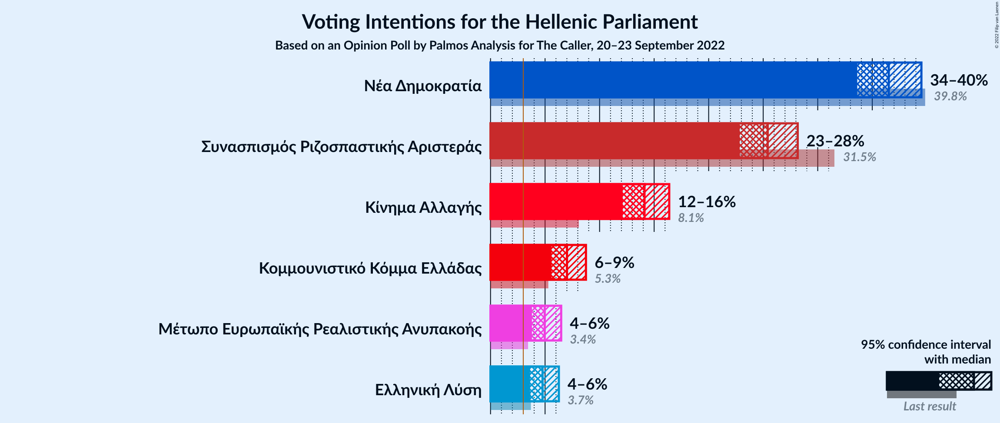

### Confidence Intervals

| Party | Last Result | Poll Result | 80% Confidence Interval | 90% Confidence Interval | 95% Confidence Interval | 99% Confidence Interval |
|:-----:|:-----------:|:-----------:|:-----------------------:|:-----------------------:|:-----------------------:|:-----------------------:|
| Νέα Δημοκρατία | 39.8% | 36.5% | 34.6–38.5% |34.1–39.0% |33.6–39.5% |32.7–40.5% |
| Συνασπισμός Ριζοσπαστικής Αριστεράς | 31.5% | 25.4% | 23.7–27.2% |23.2–27.7% |22.8–28.2% |22.1–29.1% |
| Κίνημα Αλλαγής | 8.1% | 14.1% | 12.8–15.6% |12.4–16.0% |12.1–16.4% |11.5–17.1% |
| Κομμουνιστικό Κόμμα Ελλάδας | 5.3% | 7.0% | 6.1–8.1% |5.8–8.5% |5.6–8.7% |5.2–9.3% |
| Μέτωπο Ευρωπαϊκής Ρεαλιστικής Ανυπακοής | 3.4% | 5.0% | 4.2–6.0% |4.0–6.2% |3.8–6.5% |3.5–7.0% |
| Ελληνική Λύση | 3.7% | 4.8% | 4.0–5.7% |3.8–6.0% |3.6–6.3% |3.3–6.8% |

*Note:* The poll result column reflects the actual value used in the calculations. Published results may vary slightly, and in addition be rounded to fewer digits.

## Seats

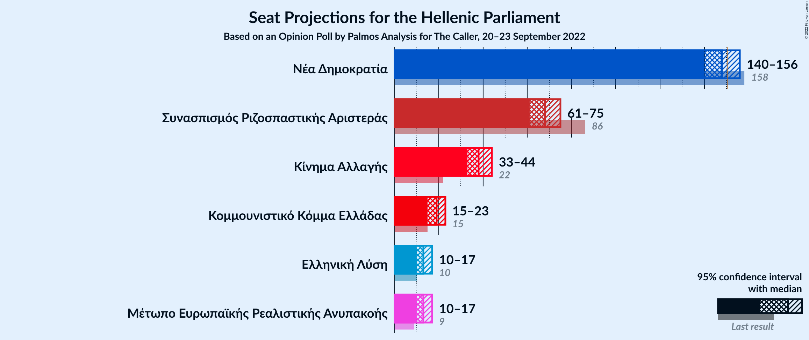

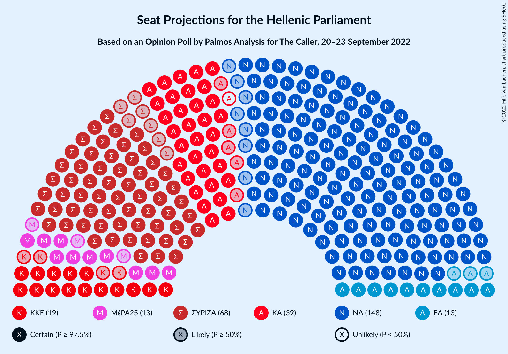

### Confidence Intervals

| Party | Last Result | Median | 80% Confidence Interval | 90% Confidence Interval | 95% Confidence Interval | 99% Confidence Interval |
|:-----:|:-----------:|:------:|:-----------------------:|:-----------------------:|:-----------------------:|:-----------------------:|
| <a href="#νέα-δημοκρατία">Νέα Δημοκρατία</a> | 158 | 148 | 143–153 |142–155 |140–156 |138–158 |
| <a href="#συνασπισμός-ριζοσπαστικής-αριστεράς">Συνασπισμός Ριζοσπαστικής Αριστεράς</a> | 86 | 68 | 64–73 |62–74 |61–75 |59–78 |
| <a href="#κίνημα-αλλαγής">Κίνημα Αλλαγής</a> | 22 | 38 | 34–42 |33–43 |33–44 |31–46 |
| <a href="#κομμουνιστικό-κόμμα-ελλάδας">Κομμουνιστικό Κόμμα Ελλάδας</a> | 15 | 19 | 16–22 |16–23 |15–23 |14–25 |
| <a href="#μέτωπο-ευρωπαϊκής-ρεαλιστικής-ανυπακοής">Μέτωπο Ευρωπαϊκής Ρεαλιστικής Ανυπακοής</a> | 9 | 13 | 11–16 |11–17 |10–17 |9–19 |
| <a href="#ελληνική-λύση">Ελληνική Λύση</a> | 10 | 13 | 11–15 |10–16 |10–17 |9–18 |

### Νέα Δημοκρατία

*For a full overview of the results for this party, see the [Νέα Δημοκρατία](party-νέαδημοκρατία.html) page.*

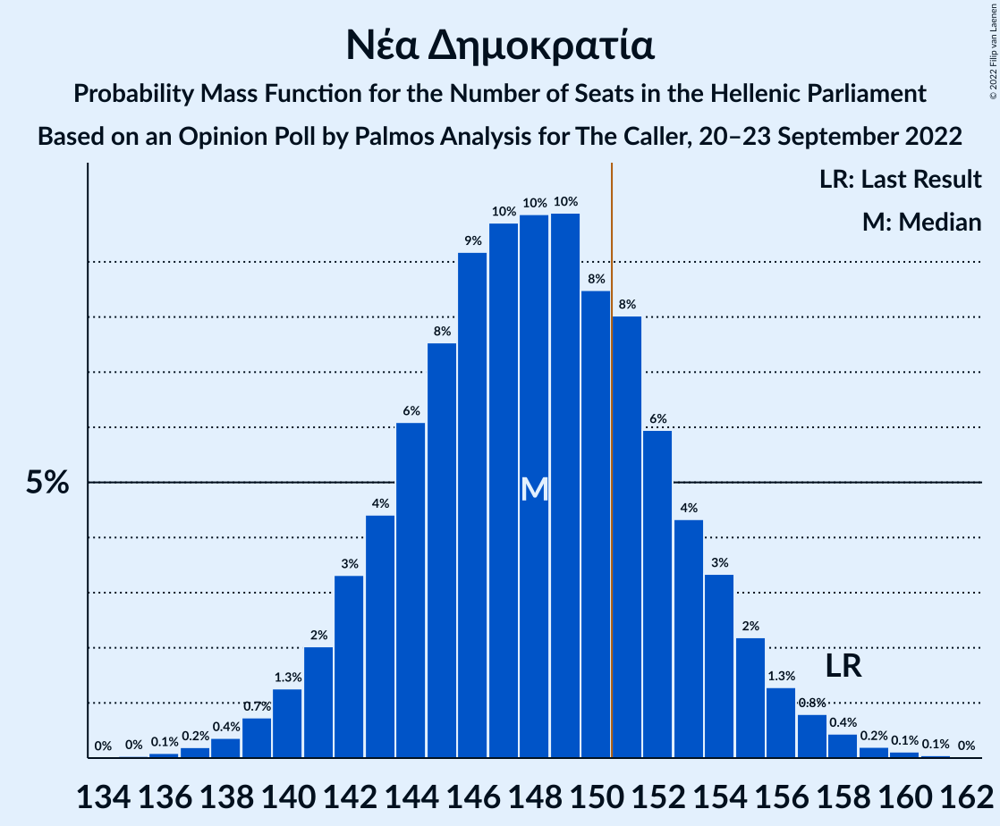

| Number of Seats | Probability | Accumulated | Special Marks |
|:---------------:|:-----------:|:-----------:|:-------------:|
| 135 | 0% | 100% |  |
| 136 | 0.1% | 99.9% |  |
| 137 | 0.2% | 99.8% |  |
| 138 | 0.4% | 99.7% |  |
| 139 | 0.7% | 99.3% |  |
| 140 | 1.3% | 98.6% |  |
| 141 | 2% | 97% |  |
| 142 | 3% | 95% |  |
| 143 | 4% | 92% |  |
| 144 | 6% | 88% |  |
| 145 | 8% | 81% |  |
| 146 | 9% | 74% |  |
| 147 | 10% | 65% |  |
| 148 | 10% | 55% | Median |
| 149 | 10% | 45% |  |
| 150 | 8% | 35% |  |
| 151 | 8% | 27% | Majority |
| 152 | 6% | 19% |  |
| 153 | 4% | 13% |  |
| 154 | 3% | 8% |  |
| 155 | 2% | 5% |  |
| 156 | 1.3% | 3% |  |
| 157 | 0.8% | 2% |  |
| 158 | 0.4% | 0.8% | Last Result |
| 159 | 0.2% | 0.4% |  |
| 160 | 0.1% | 0.2% |  |
| 161 | 0.1% | 0.1% |  |
| 162 | 0% | 0% |  |

### Συνασπισμός Ριζοσπαστικής Αριστεράς

*For a full overview of the results for this party, see the [Συνασπισμός Ριζοσπαστικής Αριστεράς](party-συνασπισμόςριζοσπαστικήςαριστεράς.html) page.*

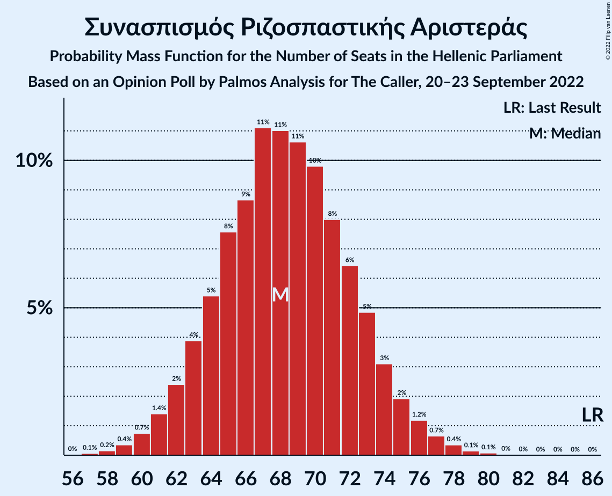

| Number of Seats | Probability | Accumulated | Special Marks |
|:---------------:|:-----------:|:-----------:|:-------------:|
| 57 | 0.1% | 100% |  |
| 58 | 0.2% | 99.9% |  |
| 59 | 0.4% | 99.7% |  |
| 60 | 0.7% | 99.4% |  |
| 61 | 1.4% | 98.6% |  |
| 62 | 2% | 97% |  |
| 63 | 4% | 95% |  |
| 64 | 5% | 91% |  |
| 65 | 8% | 86% |  |
| 66 | 9% | 78% |  |
| 67 | 11% | 69% |  |
| 68 | 11% | 58% | Median |
| 69 | 11% | 47% |  |
| 70 | 10% | 37% |  |
| 71 | 8% | 27% |  |
| 72 | 6% | 19% |  |
| 73 | 5% | 12% |  |
| 74 | 3% | 7% |  |
| 75 | 2% | 4% |  |
| 76 | 1.2% | 2% |  |
| 77 | 0.7% | 1.3% |  |
| 78 | 0.4% | 0.6% |  |
| 79 | 0.1% | 0.3% |  |
| 80 | 0.1% | 0.1% |  |
| 81 | 0% | 0.1% |  |
| 82 | 0% | 0% |  |
| 83 | 0% | 0% |  |
| 84 | 0% | 0% |  |
| 85 | 0% | 0% |  |
| 86 | 0% | 0% | Last Result |

### Κίνημα Αλλαγής

*For a full overview of the results for this party, see the [Κίνημα Αλλαγής](party-κίνημααλλαγής.html) page.*

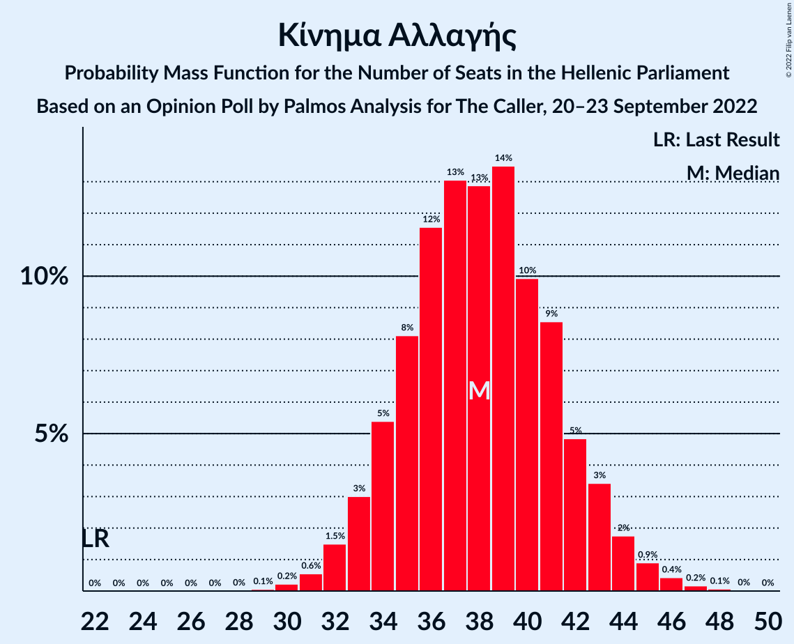

| Number of Seats | Probability | Accumulated | Special Marks |
|:---------------:|:-----------:|:-----------:|:-------------:|
| 22 | 0% | 100% | Last Result |
| 23 | 0% | 100% |  |
| 24 | 0% | 100% |  |
| 25 | 0% | 100% |  |
| 26 | 0% | 100% |  |
| 27 | 0% | 100% |  |
| 28 | 0% | 100% |  |
| 29 | 0.1% | 100% |  |
| 30 | 0.2% | 99.9% |  |
| 31 | 0.6% | 99.7% |  |
| 32 | 1.5% | 99.1% |  |
| 33 | 3% | 98% |  |
| 34 | 5% | 95% |  |
| 35 | 8% | 89% |  |
| 36 | 12% | 81% |  |
| 37 | 13% | 70% |  |
| 38 | 13% | 57% | Median |
| 39 | 14% | 44% |  |
| 40 | 10% | 30% |  |
| 41 | 9% | 20% |  |
| 42 | 5% | 12% |  |
| 43 | 3% | 7% |  |
| 44 | 2% | 3% |  |
| 45 | 0.9% | 2% |  |
| 46 | 0.4% | 0.7% |  |
| 47 | 0.2% | 0.3% |  |
| 48 | 0.1% | 0.1% |  |
| 49 | 0% | 0% |  |

### Κομμουνιστικό Κόμμα Ελλάδας

*For a full overview of the results for this party, see the [Κομμουνιστικό Κόμμα Ελλάδας](party-κομμουνιστικόκόμμαελλάδας.html) page.*

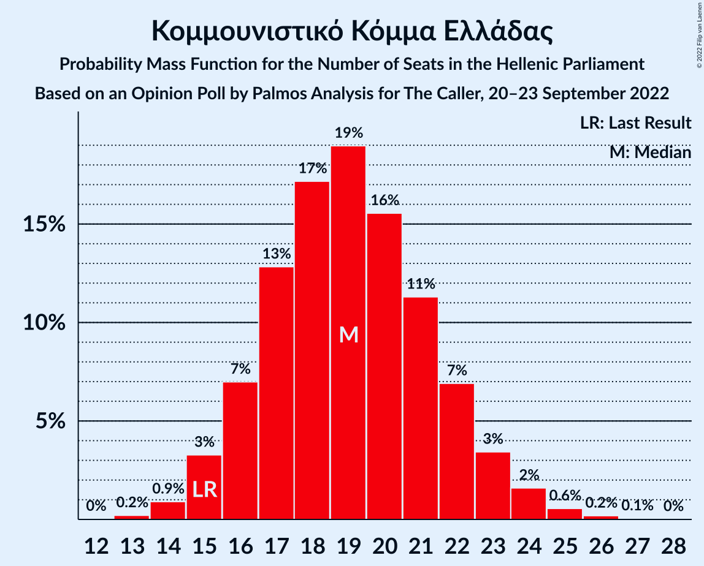

| Number of Seats | Probability | Accumulated | Special Marks |
|:---------------:|:-----------:|:-----------:|:-------------:|
| 13 | 0.2% | 100% |  |
| 14 | 0.9% | 99.8% |  |
| 15 | 3% | 98.9% | Last Result |
| 16 | 7% | 96% |  |
| 17 | 13% | 89% |  |
| 18 | 17% | 76% |  |
| 19 | 19% | 59% | Median |
| 20 | 16% | 40% |  |
| 21 | 11% | 24% |  |
| 22 | 7% | 13% |  |
| 23 | 3% | 6% |  |
| 24 | 2% | 2% |  |
| 25 | 0.6% | 0.8% |  |
| 26 | 0.2% | 0.3% |  |
| 27 | 0.1% | 0.1% |  |
| 28 | 0% | 0% |  |

### Μέτωπο Ευρωπαϊκής Ρεαλιστικής Ανυπακοής

*For a full overview of the results for this party, see the [Μέτωπο Ευρωπαϊκής Ρεαλιστικής Ανυπακοής](party-μέτωποευρωπαϊκήςρεαλιστικήςανυπακοής.html) page.*

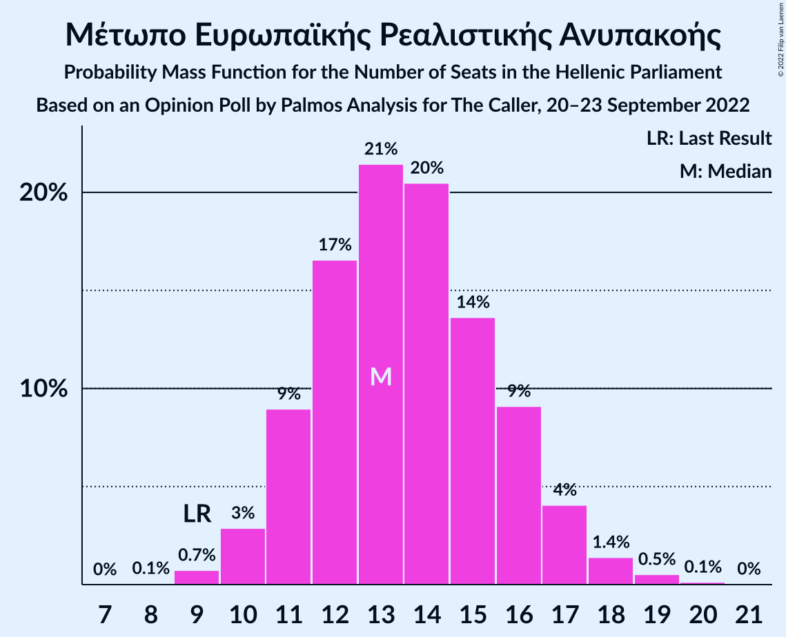

| Number of Seats | Probability | Accumulated | Special Marks |
|:---------------:|:-----------:|:-----------:|:-------------:|
| 8 | 0.1% | 100% |  |
| 9 | 0.7% | 99.9% | Last Result |
| 10 | 3% | 99.2% |  |
| 11 | 9% | 96% |  |
| 12 | 17% | 87% |  |
| 13 | 21% | 71% | Median |
| 14 | 20% | 49% |  |
| 15 | 14% | 29% |  |
| 16 | 9% | 15% |  |
| 17 | 4% | 6% |  |
| 18 | 1.4% | 2% |  |
| 19 | 0.5% | 0.7% |  |
| 20 | 0.1% | 0.2% |  |
| 21 | 0% | 0% |  |

### Ελληνική Λύση

*For a full overview of the results for this party, see the [Ελληνική Λύση](party-ελληνικήλύση.html) page.*

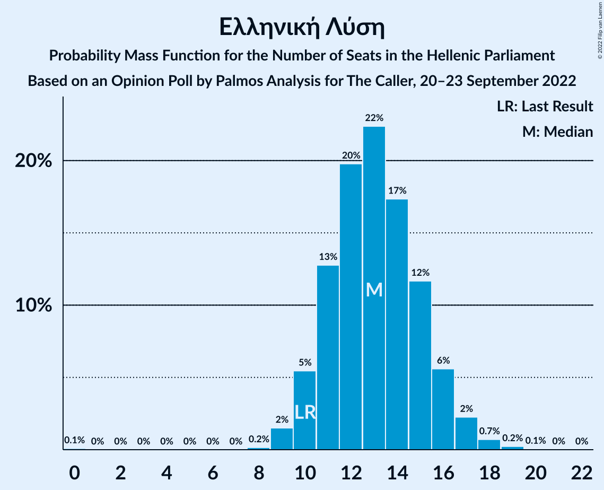

| Number of Seats | Probability | Accumulated | Special Marks |
|:---------------:|:-----------:|:-----------:|:-------------:|
| 0 | 0.1% | 100% |  |
| 1 | 0% | 99.9% |  |
| 2 | 0% | 99.9% |  |
| 3 | 0% | 99.9% |  |
| 4 | 0% | 99.9% |  |
| 5 | 0% | 99.9% |  |
| 6 | 0% | 99.9% |  |
| 7 | 0% | 99.9% |  |
| 8 | 0.2% | 99.9% |  |
| 9 | 2% | 99.8% |  |
| 10 | 5% | 98% | Last Result |
| 11 | 13% | 93% |  |
| 12 | 20% | 80% |  |
| 13 | 22% | 60% | Median |
| 14 | 17% | 38% |  |
| 15 | 12% | 21% |  |
| 16 | 6% | 9% |  |
| 17 | 2% | 3% |  |
| 18 | 0.7% | 1.0% |  |
| 19 | 0.2% | 0.3% |  |
| 20 | 0.1% | 0.1% |  |
| 21 | 0% | 0% |  |

## Coalitions

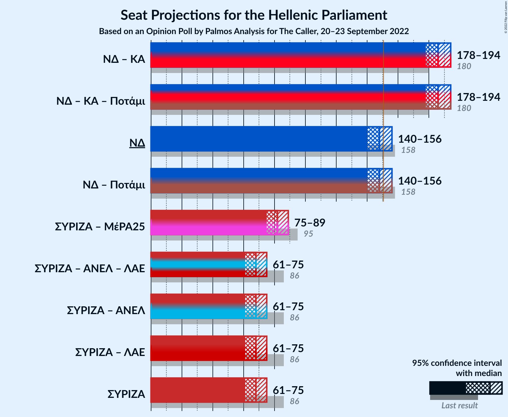

### Confidence Intervals

| Coalition | Last Result | Median | Majority? | 80% Confidence Interval | 90% Confidence Interval | 95% Confidence Interval | 99% Confidence Interval |
|:---------:|:-----------:|:------:|:---------:|:-----------------------:|:-----------------------:|:-----------------------:|:-----------------------:|
| Νέα Δημοκρατία – Κίνημα Αλλαγής | 180 | 186 | 100% | 181–191 | 179–193 | 178–194 | 176–197 |
| Νέα Δημοκρατία | 158 | 148 | 27% | 143–153 | 142–155 | 140–156 | 138–158 |
| Συνασπισμός Ριζοσπαστικής Αριστεράς – Μέτωπο Ευρωπαϊκής Ρεαλιστικής Ανυπακοής | 95 | 82 | 0% | 77–87 | 76–88 | 75–89 | 72–92 |
| Συνασπισμός Ριζοσπαστικής Αριστεράς | 86 | 68 | 0% | 64–73 | 62–74 | 61–75 | 59–78 |

### Νέα Δημοκρατία – Κίνημα Αλλαγής

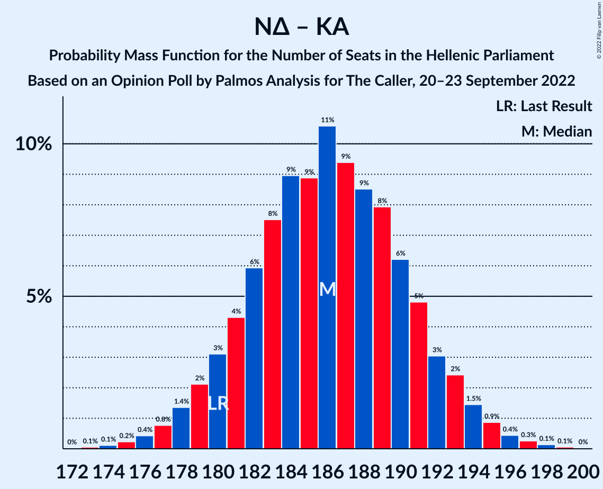

| Number of Seats | Probability | Accumulated | Special Marks |
|:---------------:|:-----------:|:-----------:|:-------------:|
| 173 | 0.1% | 100% |  |
| 174 | 0.1% | 99.9% |  |
| 175 | 0.2% | 99.8% |  |
| 176 | 0.4% | 99.6% |  |
| 177 | 0.8% | 99.1% |  |
| 178 | 1.4% | 98% |  |
| 179 | 2% | 97% |  |
| 180 | 3% | 95% | Last Result |
| 181 | 4% | 92% |  |
| 182 | 6% | 87% |  |
| 183 | 8% | 82% |  |
| 184 | 9% | 74% |  |
| 185 | 9% | 65% |  |
| 186 | 11% | 56% | Median |
| 187 | 9% | 46% |  |
| 188 | 9% | 36% |  |
| 189 | 8% | 28% |  |
| 190 | 6% | 20% |  |
| 191 | 5% | 14% |  |
| 192 | 3% | 9% |  |
| 193 | 2% | 6% |  |
| 194 | 1.5% | 3% |  |
| 195 | 0.9% | 2% |  |
| 196 | 0.4% | 0.9% |  |
| 197 | 0.3% | 0.5% |  |
| 198 | 0.1% | 0.2% |  |
| 199 | 0.1% | 0.1% |  |
| 200 | 0% | 0% |  |

### Νέα Δημοκρατία

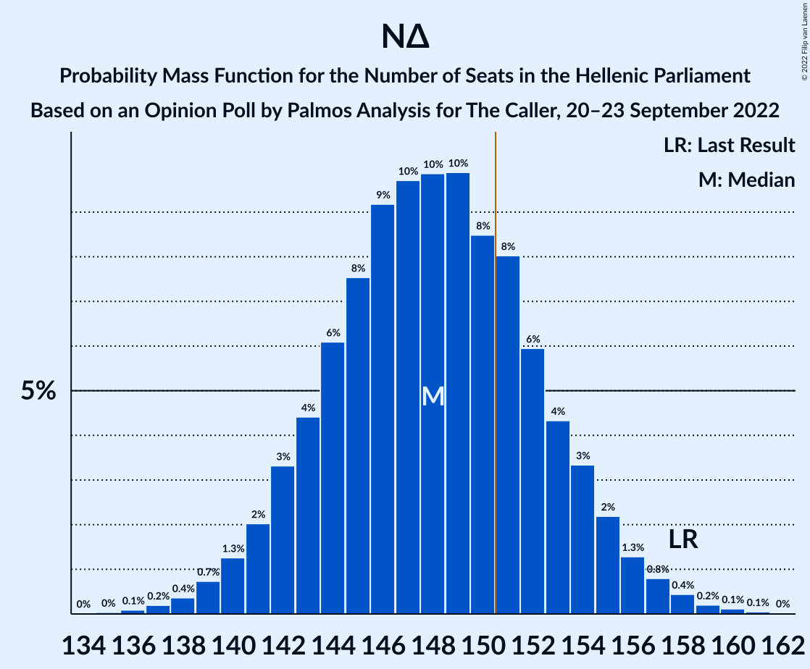

| Number of Seats | Probability | Accumulated | Special Marks |
|:---------------:|:-----------:|:-----------:|:-------------:|
| 135 | 0% | 100% |  |
| 136 | 0.1% | 99.9% |  |
| 137 | 0.2% | 99.8% |  |
| 138 | 0.4% | 99.7% |  |
| 139 | 0.7% | 99.3% |  |
| 140 | 1.3% | 98.6% |  |
| 141 | 2% | 97% |  |
| 142 | 3% | 95% |  |
| 143 | 4% | 92% |  |
| 144 | 6% | 88% |  |
| 145 | 8% | 81% |  |
| 146 | 9% | 74% |  |
| 147 | 10% | 65% |  |
| 148 | 10% | 55% | Median |
| 149 | 10% | 45% |  |
| 150 | 8% | 35% |  |
| 151 | 8% | 27% | Majority |
| 152 | 6% | 19% |  |
| 153 | 4% | 13% |  |
| 154 | 3% | 8% |  |
| 155 | 2% | 5% |  |
| 156 | 1.3% | 3% |  |
| 157 | 0.8% | 2% |  |
| 158 | 0.4% | 0.8% | Last Result |
| 159 | 0.2% | 0.4% |  |
| 160 | 0.1% | 0.2% |  |
| 161 | 0.1% | 0.1% |  |
| 162 | 0% | 0% |  |

### Συνασπισμός Ριζοσπαστικής Αριστεράς – Μέτωπο Ευρωπαϊκής Ρεαλιστικής Ανυπακοής

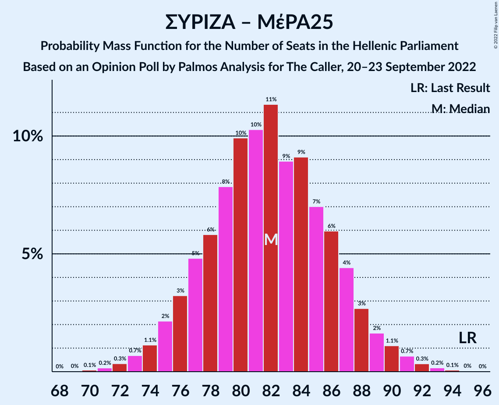

| Number of Seats | Probability | Accumulated | Special Marks |
|:---------------:|:-----------:|:-----------:|:-------------:|
| 70 | 0.1% | 100% |  |
| 71 | 0.2% | 99.9% |  |
| 72 | 0.3% | 99.7% |  |
| 73 | 0.7% | 99.4% |  |
| 74 | 1.1% | 98.7% |  |
| 75 | 2% | 98% |  |
| 76 | 3% | 95% |  |
| 77 | 5% | 92% |  |
| 78 | 6% | 87% |  |
| 79 | 8% | 82% |  |
| 80 | 10% | 74% |  |
| 81 | 10% | 64% | Median |
| 82 | 11% | 53% |  |
| 83 | 9% | 42% |  |
| 84 | 9% | 33% |  |
| 85 | 7% | 24% |  |
| 86 | 6% | 17% |  |
| 87 | 4% | 11% |  |
| 88 | 3% | 7% |  |
| 89 | 2% | 4% |  |
| 90 | 1.1% | 2% |  |
| 91 | 0.7% | 1.3% |  |
| 92 | 0.3% | 0.6% |  |
| 93 | 0.2% | 0.3% |  |
| 94 | 0.1% | 0.1% |  |
| 95 | 0% | 0.1% | Last Result |
| 96 | 0% | 0% |  |

### Συνασπισμός Ριζοσπαστικής Αριστεράς

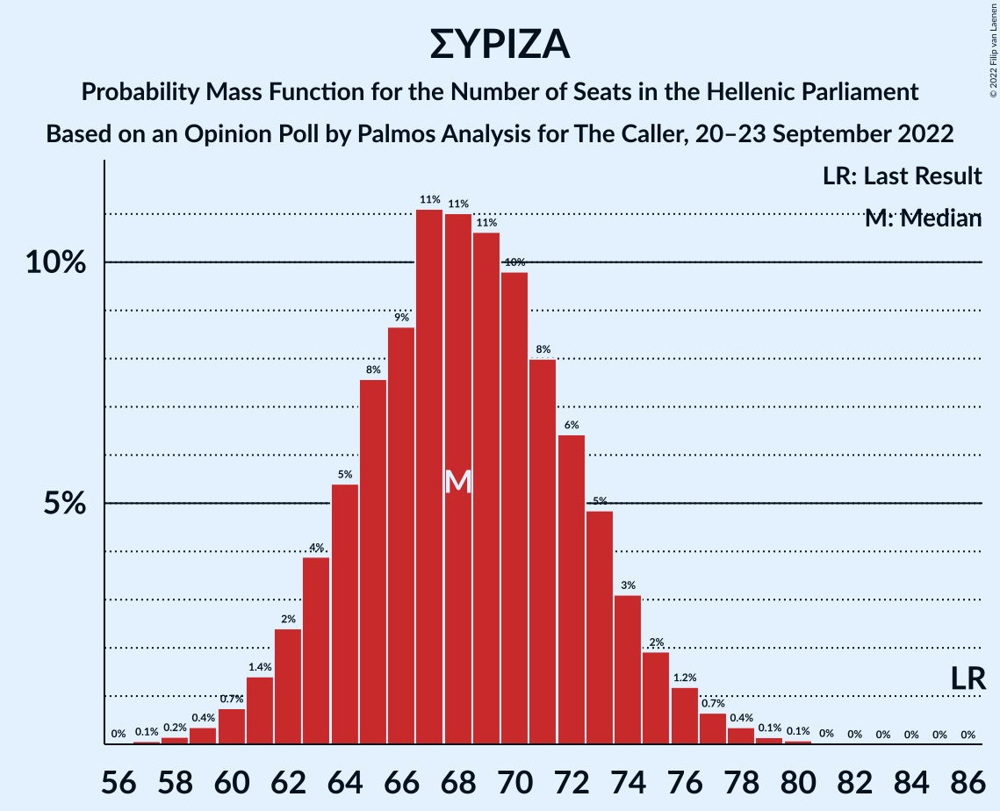

| Number of Seats | Probability | Accumulated | Special Marks |
|:---------------:|:-----------:|:-----------:|:-------------:|
| 57 | 0.1% | 100% |  |
| 58 | 0.2% | 99.9% |  |
| 59 | 0.4% | 99.7% |  |
| 60 | 0.7% | 99.4% |  |
| 61 | 1.4% | 98.6% |  |
| 62 | 2% | 97% |  |
| 63 | 4% | 95% |  |
| 64 | 5% | 91% |  |
| 65 | 8% | 86% |  |
| 66 | 9% | 78% |  |
| 67 | 11% | 69% |  |
| 68 | 11% | 58% | Median |
| 69 | 11% | 47% |  |
| 70 | 10% | 37% |  |
| 71 | 8% | 27% |  |
| 72 | 6% | 19% |  |
| 73 | 5% | 12% |  |
| 74 | 3% | 7% |  |
| 75 | 2% | 4% |  |
| 76 | 1.2% | 2% |  |
| 77 | 0.7% | 1.3% |  |
| 78 | 0.4% | 0.6% |  |
| 79 | 0.1% | 0.3% |  |
| 80 | 0.1% | 0.1% |  |
| 81 | 0% | 0.1% |  |
| 82 | 0% | 0% |  |
| 83 | 0% | 0% |  |
| 84 | 0% | 0% |  |
| 85 | 0% | 0% |  |
| 86 | 0% | 0% | Last Result |

## Technical Information

### Opinion Poll

+ **Polling firm:** Palmos Analysis
+ **Commissioner(s):** The Caller
+ **Fieldwork period:** 20–23 September 2022

### Calculations

+ **Sample size:** 1027
+ **Simulations done:** 1,048,576
+ **Error estimate:** 0.73%

