# Opinion Poll by Marc for ANT1, 20–24 September 2022

<a href="#voting-intentions">Voting Intentions</a> | <a href="#seats">Seats</a> | <a href="#coalitions">Coalitions</a> | <a href="#technical-information">Technical Information</a>

## Voting Intentions

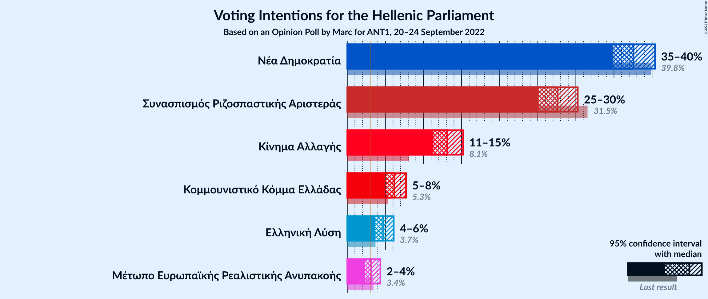

### Confidence Intervals

| Party | Last Result | Poll Result | 80% Confidence Interval | 90% Confidence Interval | 95% Confidence Interval | 99% Confidence Interval |
|:-----:|:-----------:|:-----------:|:-----------------------:|:-----------------------:|:-----------------------:|:-----------------------:|
| Νέα Δημοκρατία | 39.8% | 37.6% | 35.8–39.4% |35.3–39.9% |34.8–40.4% |34.0–41.3% |
| Συνασπισμός Ριζοσπαστικής Αριστεράς | 31.5% | 27.6% | 26.0–29.3% |25.5–29.8% |25.1–30.3% |24.4–31.1% |
| Κίνημα Αλλαγής | 8.1% | 13.1% | 11.9–14.5% |11.6–14.9% |11.3–15.2% |10.7–15.9% |
| Κομμουνιστικό Κόμμα Ελλάδας | 5.3% | 6.2% | 5.3–7.2% |5.1–7.5% |4.9–7.7% |4.6–8.2% |
| Ελληνική Λύση | 3.7% | 4.7% | 4.0–5.6% |3.8–5.9% |3.6–6.1% |3.3–6.6% |
| Μέτωπο Ευρωπαϊκής Ρεαλιστικής Ανυπακοής | 3.4% | 3.2% | 2.6–3.9% |2.4–4.2% |2.3–4.3% |2.1–4.7% |

*Note:* The poll result column reflects the actual value used in the calculations. Published results may vary slightly, and in addition be rounded to fewer digits.

## Seats

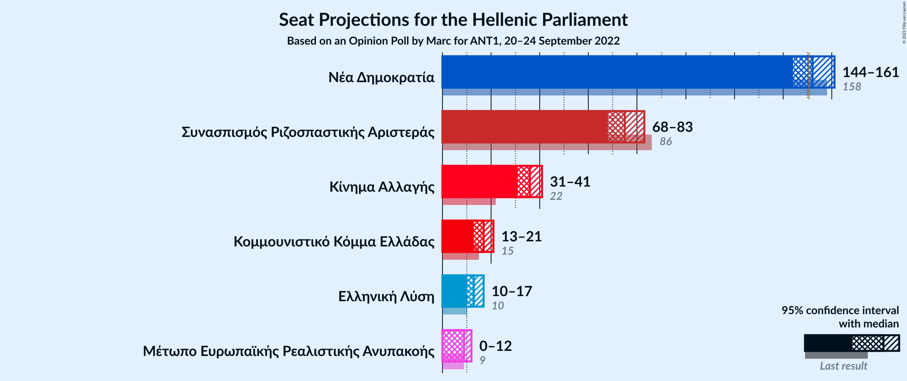

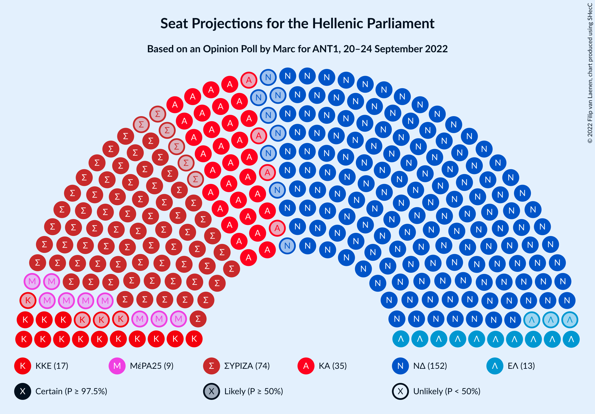

### Confidence Intervals

| Party | Last Result | Median | 80% Confidence Interval | 90% Confidence Interval | 95% Confidence Interval | 99% Confidence Interval |
|:-----:|:-----------:|:------:|:-----------------------:|:-----------------------:|:-----------------------:|:-----------------------:|
| <a href="#νέα-δημοκρατία">Νέα Δημοκρατία</a> | 158 | 152 | 147–158 |146–159 |144–161 |142–163 |
| <a href="#συνασπισμός-ριζοσπαστικής-αριστεράς">Συνασπισμός Ριζοσπαστικής Αριστεράς</a> | 86 | 75 | 71–80 |69–82 |68–83 |66–85 |
| <a href="#κίνημα-αλλαγής">Κίνημα Αλλαγής</a> | 22 | 36 | 32–39 |31–41 |31–41 |29–43 |
| <a href="#κομμουνιστικό-κόμμα-ελλάδας">Κομμουνιστικό Κόμμα Ελλάδας</a> | 15 | 17 | 15–20 |14–20 |13–21 |12–22 |
| <a href="#ελληνική-λύση">Ελληνική Λύση</a> | 10 | 13 | 11–15 |10–16 |10–17 |9–18 |
| <a href="#μέτωπο-ευρωπαϊκής-ρεαλιστικής-ανυπακοής">Μέτωπο Ευρωπαϊκής Ρεαλιστικής Ανυπακοής</a> | 9 | 9 | 0–11 |0–11 |0–12 |0–13 |

### Νέα Δημοκρατία

*For a full overview of the results for this party, see the [Νέα Δημοκρατία](party-νέαδημοκρατία.html) page.*

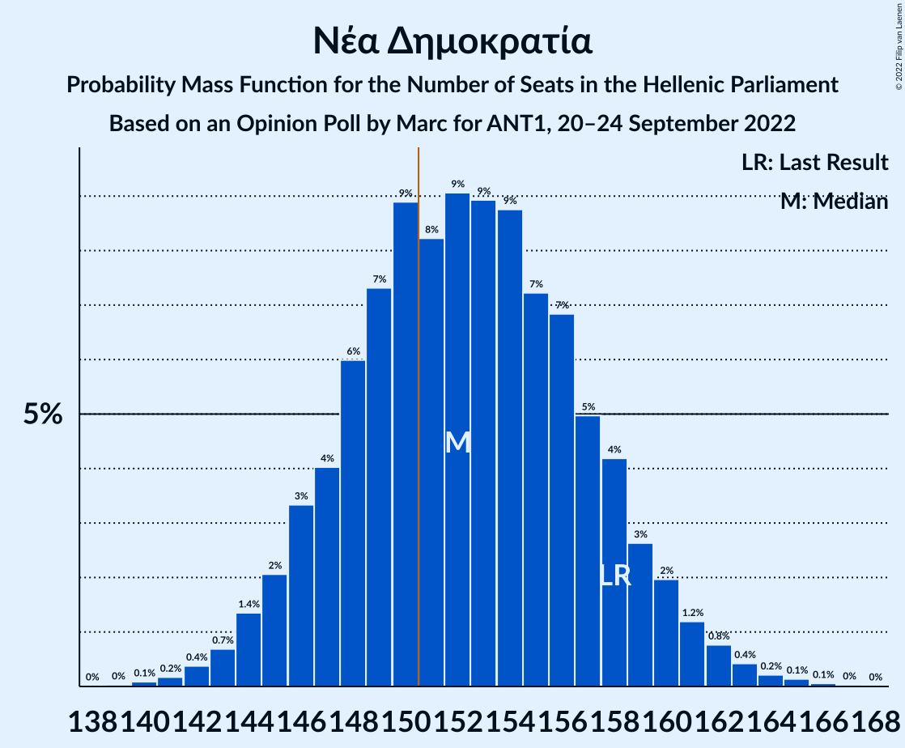

| Number of Seats | Probability | Accumulated | Special Marks |
|:---------------:|:-----------:|:-----------:|:-------------:|
| 139 | 0% | 100% |  |
| 140 | 0.1% | 99.9% |  |
| 141 | 0.2% | 99.9% |  |
| 142 | 0.4% | 99.7% |  |
| 143 | 0.7% | 99.3% |  |
| 144 | 1.4% | 98.6% |  |
| 145 | 2% | 97% |  |
| 146 | 3% | 95% |  |
| 147 | 4% | 92% |  |
| 148 | 6% | 88% |  |
| 149 | 7% | 82% |  |
| 150 | 9% | 75% |  |
| 151 | 8% | 66% | Majority |
| 152 | 9% | 57% | Median |
| 153 | 9% | 48% |  |
| 154 | 9% | 39% |  |
| 155 | 7% | 31% |  |
| 156 | 7% | 23% |  |
| 157 | 5% | 17% |  |
| 158 | 4% | 12% | Last Result |
| 159 | 3% | 7% |  |
| 160 | 2% | 5% |  |
| 161 | 1.2% | 3% |  |
| 162 | 0.8% | 2% |  |
| 163 | 0.4% | 0.9% |  |
| 164 | 0.2% | 0.5% |  |
| 165 | 0.1% | 0.2% |  |
| 166 | 0.1% | 0.1% |  |
| 167 | 0% | 0.1% |  |
| 168 | 0% | 0% |  |

### Συνασπισμός Ριζοσπαστικής Αριστεράς

*For a full overview of the results for this party, see the [Συνασπισμός Ριζοσπαστικής Αριστεράς](party-συνασπισμόςριζοσπαστικήςαριστεράς.html) page.*

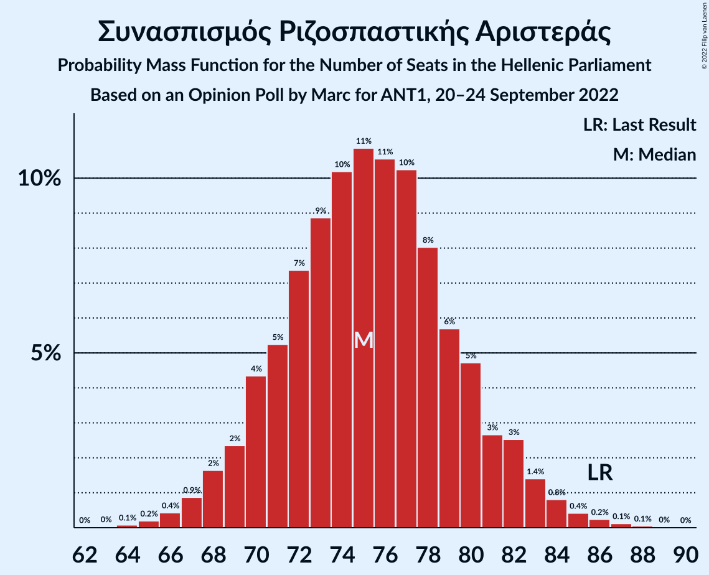

| Number of Seats | Probability | Accumulated | Special Marks |
|:---------------:|:-----------:|:-----------:|:-------------:|
| 64 | 0.1% | 100% |  |
| 65 | 0.2% | 99.9% |  |
| 66 | 0.4% | 99.7% |  |
| 67 | 0.9% | 99.3% |  |
| 68 | 2% | 98% |  |
| 69 | 2% | 97% |  |
| 70 | 4% | 94% |  |
| 71 | 5% | 90% |  |
| 72 | 7% | 85% |  |
| 73 | 9% | 77% |  |
| 74 | 10% | 69% |  |
| 75 | 11% | 58% | Median |
| 76 | 11% | 48% |  |
| 77 | 10% | 37% |  |
| 78 | 8% | 27% |  |
| 79 | 6% | 19% |  |
| 80 | 5% | 13% |  |
| 81 | 3% | 8% |  |
| 82 | 3% | 6% |  |
| 83 | 1.4% | 3% |  |
| 84 | 0.8% | 2% |  |
| 85 | 0.4% | 0.9% |  |
| 86 | 0.2% | 0.5% | Last Result |
| 87 | 0.1% | 0.2% |  |
| 88 | 0.1% | 0.1% |  |
| 89 | 0% | 0% |  |

### Κίνημα Αλλαγής

*For a full overview of the results for this party, see the [Κίνημα Αλλαγής](party-κίνημααλλαγής.html) page.*

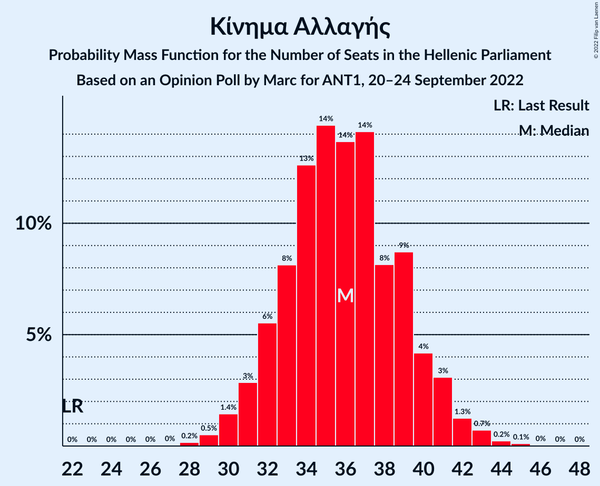

| Number of Seats | Probability | Accumulated | Special Marks |
|:---------------:|:-----------:|:-----------:|:-------------:|
| 22 | 0% | 100% | Last Result |
| 23 | 0% | 100% |  |
| 24 | 0% | 100% |  |
| 25 | 0% | 100% |  |
| 26 | 0% | 100% |  |
| 27 | 0% | 100% |  |
| 28 | 0.2% | 99.9% |  |
| 29 | 0.5% | 99.8% |  |
| 30 | 1.4% | 99.3% |  |
| 31 | 3% | 98% |  |
| 32 | 6% | 95% |  |
| 33 | 8% | 89% |  |
| 34 | 13% | 81% |  |
| 35 | 14% | 69% |  |
| 36 | 14% | 54% | Median |
| 37 | 14% | 41% |  |
| 38 | 8% | 27% |  |
| 39 | 9% | 18% |  |
| 40 | 4% | 10% |  |
| 41 | 3% | 5% |  |
| 42 | 1.3% | 2% |  |
| 43 | 0.7% | 1.1% |  |
| 44 | 0.2% | 0.4% |  |
| 45 | 0.1% | 0.2% |  |
| 46 | 0% | 0.1% |  |
| 47 | 0% | 0% |  |

### Κομμουνιστικό Κόμμα Ελλάδας

*For a full overview of the results for this party, see the [Κομμουνιστικό Κόμμα Ελλάδας](party-κομμουνιστικόκόμμαελλάδας.html) page.*

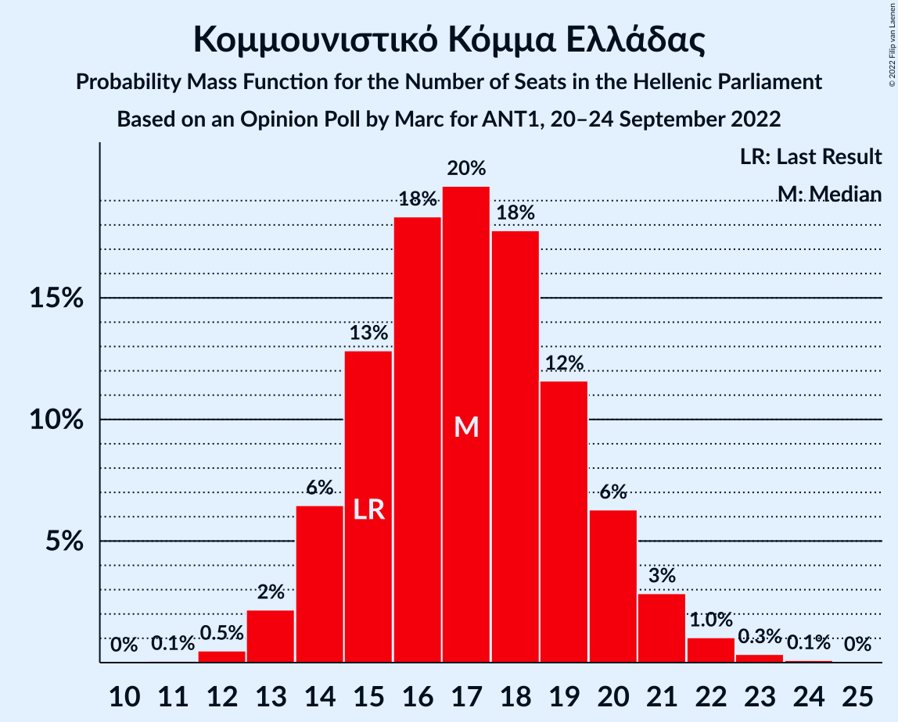

| Number of Seats | Probability | Accumulated | Special Marks |
|:---------------:|:-----------:|:-----------:|:-------------:|
| 11 | 0.1% | 100% |  |
| 12 | 0.5% | 99.9% |  |
| 13 | 2% | 99.4% |  |
| 14 | 6% | 97% |  |
| 15 | 13% | 91% | Last Result |
| 16 | 18% | 78% |  |
| 17 | 20% | 60% | Median |
| 18 | 18% | 40% |  |
| 19 | 12% | 22% |  |
| 20 | 6% | 11% |  |
| 21 | 3% | 4% |  |
| 22 | 1.0% | 2% |  |
| 23 | 0.3% | 0.5% |  |
| 24 | 0.1% | 0.1% |  |
| 25 | 0% | 0% |  |

### Ελληνική Λύση

*For a full overview of the results for this party, see the [Ελληνική Λύση](party-ελληνικήλύση.html) page.*

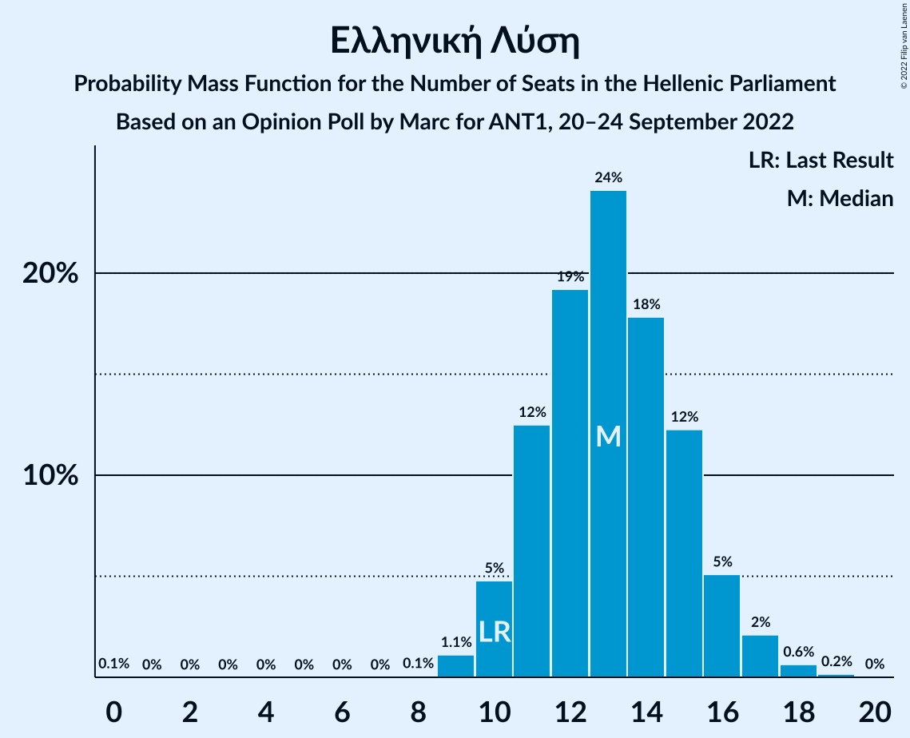

| Number of Seats | Probability | Accumulated | Special Marks |
|:---------------:|:-----------:|:-----------:|:-------------:|
| 0 | 0.1% | 100% |  |
| 1 | 0% | 99.9% |  |
| 2 | 0% | 99.9% |  |
| 3 | 0% | 99.9% |  |
| 4 | 0% | 99.9% |  |
| 5 | 0% | 99.9% |  |
| 6 | 0% | 99.9% |  |
| 7 | 0% | 99.9% |  |
| 8 | 0.1% | 99.9% |  |
| 9 | 1.1% | 99.9% |  |
| 10 | 5% | 98.7% | Last Result |
| 11 | 12% | 94% |  |
| 12 | 19% | 81% |  |
| 13 | 24% | 62% | Median |
| 14 | 18% | 38% |  |
| 15 | 12% | 20% |  |
| 16 | 5% | 8% |  |
| 17 | 2% | 3% |  |
| 18 | 0.6% | 0.8% |  |
| 19 | 0.2% | 0.2% |  |
| 20 | 0% | 0% |  |

### Μέτωπο Ευρωπαϊκής Ρεαλιστικής Ανυπακοής

*For a full overview of the results for this party, see the [Μέτωπο Ευρωπαϊκής Ρεαλιστικής Ανυπακοής](party-μέτωποευρωπαϊκήςρεαλιστικήςανυπακοής.html) page.*

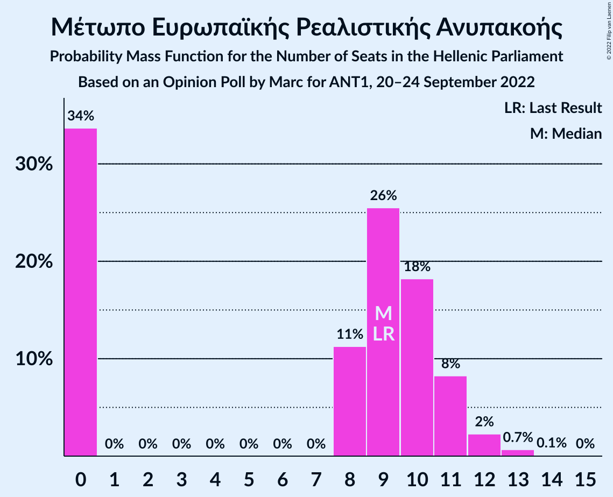

| Number of Seats | Probability | Accumulated | Special Marks |
|:---------------:|:-----------:|:-----------:|:-------------:|
| 0 | 34% | 100% |  |
| 1 | 0% | 66% |  |
| 2 | 0% | 66% |  |
| 3 | 0% | 66% |  |
| 4 | 0% | 66% |  |
| 5 | 0% | 66% |  |
| 6 | 0% | 66% |  |
| 7 | 0% | 66% |  |
| 8 | 11% | 66% |  |
| 9 | 26% | 55% | Last Result, Median |
| 10 | 18% | 30% |  |
| 11 | 8% | 11% |  |
| 12 | 2% | 3% |  |
| 13 | 0.7% | 0.8% |  |
| 14 | 0.1% | 0.1% |  |
| 15 | 0% | 0% |  |

## Coalitions

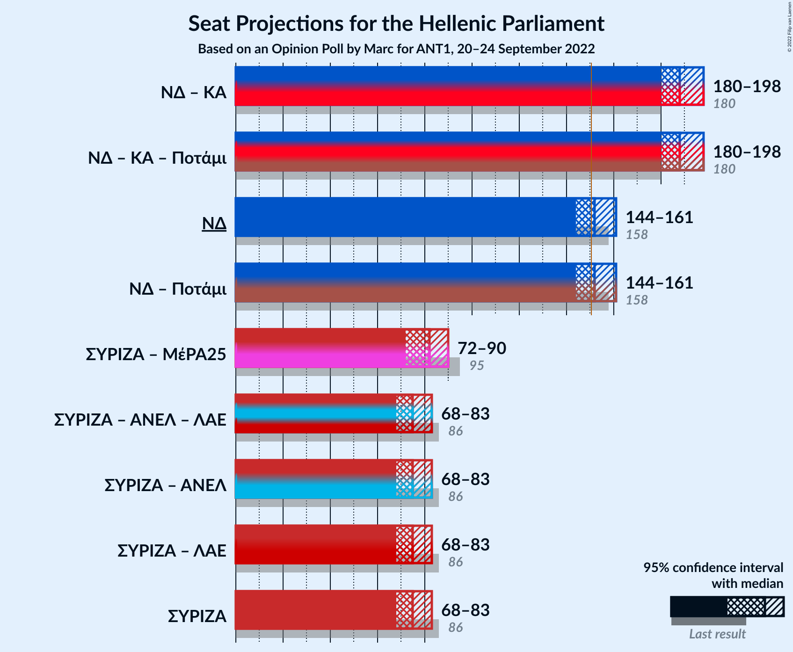

### Confidence Intervals

| Coalition | Last Result | Median | Majority? | 80% Confidence Interval | 90% Confidence Interval | 95% Confidence Interval | 99% Confidence Interval |
|:---------:|:-----------:|:------:|:---------:|:-----------------------:|:-----------------------:|:-----------------------:|:-----------------------:|
| Νέα Δημοκρατία – Κίνημα Αλλαγής | 180 | 188 | 100% | 182–194 | 181–196 | 180–198 | 177–200 |
| Νέα Δημοκρατία | 158 | 152 | 66% | 147–158 | 146–159 | 144–161 | 142–163 |
| Συνασπισμός Ριζοσπαστικής Αριστεράς – Μέτωπο Ευρωπαϊκής Ρεαλιστικής Ανυπακοής | 95 | 82 | 0% | 75–88 | 74–89 | 72–90 | 70–93 |
| Συνασπισμός Ριζοσπαστικής Αριστεράς | 86 | 75 | 0% | 71–80 | 69–82 | 68–83 | 66–85 |

### Νέα Δημοκρατία – Κίνημα Αλλαγής

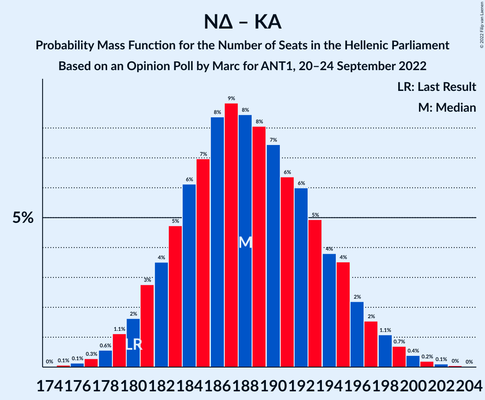

| Number of Seats | Probability | Accumulated | Special Marks |
|:---------------:|:-----------:|:-----------:|:-------------:|
| 175 | 0.1% | 100% |  |
| 176 | 0.1% | 99.9% |  |
| 177 | 0.3% | 99.8% |  |
| 178 | 0.6% | 99.5% |  |
| 179 | 1.1% | 98.9% |  |
| 180 | 2% | 98% | Last Result |
| 181 | 3% | 96% |  |
| 182 | 4% | 93% |  |
| 183 | 5% | 90% |  |
| 184 | 6% | 85% |  |
| 185 | 7% | 79% |  |
| 186 | 8% | 72% |  |
| 187 | 9% | 64% |  |
| 188 | 8% | 55% | Median |
| 189 | 8% | 46% |  |
| 190 | 7% | 38% |  |
| 191 | 6% | 31% |  |
| 192 | 6% | 25% |  |
| 193 | 5% | 19% |  |
| 194 | 4% | 14% |  |
| 195 | 4% | 10% |  |
| 196 | 2% | 6% |  |
| 197 | 2% | 4% |  |
| 198 | 1.1% | 3% |  |
| 199 | 0.7% | 1.5% |  |
| 200 | 0.4% | 0.8% |  |
| 201 | 0.2% | 0.4% |  |
| 202 | 0.1% | 0.2% |  |
| 203 | 0% | 0.1% |  |
| 204 | 0% | 0% |  |

### Νέα Δημοκρατία

| Number of Seats | Probability | Accumulated | Special Marks |
|:---------------:|:-----------:|:-----------:|:-------------:|
| 139 | 0% | 100% |  |
| 140 | 0.1% | 99.9% |  |
| 141 | 0.2% | 99.9% |  |
| 142 | 0.4% | 99.7% |  |
| 143 | 0.7% | 99.3% |  |
| 144 | 1.4% | 98.6% |  |
| 145 | 2% | 97% |  |
| 146 | 3% | 95% |  |
| 147 | 4% | 92% |  |
| 148 | 6% | 88% |  |
| 149 | 7% | 82% |  |
| 150 | 9% | 75% |  |
| 151 | 8% | 66% | Majority |
| 152 | 9% | 57% | Median |
| 153 | 9% | 48% |  |
| 154 | 9% | 39% |  |
| 155 | 7% | 31% |  |
| 156 | 7% | 23% |  |
| 157 | 5% | 17% |  |
| 158 | 4% | 12% | Last Result |
| 159 | 3% | 7% |  |
| 160 | 2% | 5% |  |
| 161 | 1.2% | 3% |  |
| 162 | 0.8% | 2% |  |
| 163 | 0.4% | 0.9% |  |
| 164 | 0.2% | 0.5% |  |
| 165 | 0.1% | 0.2% |  |
| 166 | 0.1% | 0.1% |  |
| 167 | 0% | 0.1% |  |
| 168 | 0% | 0% |  |

### Συνασπισμός Ριζοσπαστικής Αριστεράς – Μέτωπο Ευρωπαϊκής Ρεαλιστικής Ανυπακοής

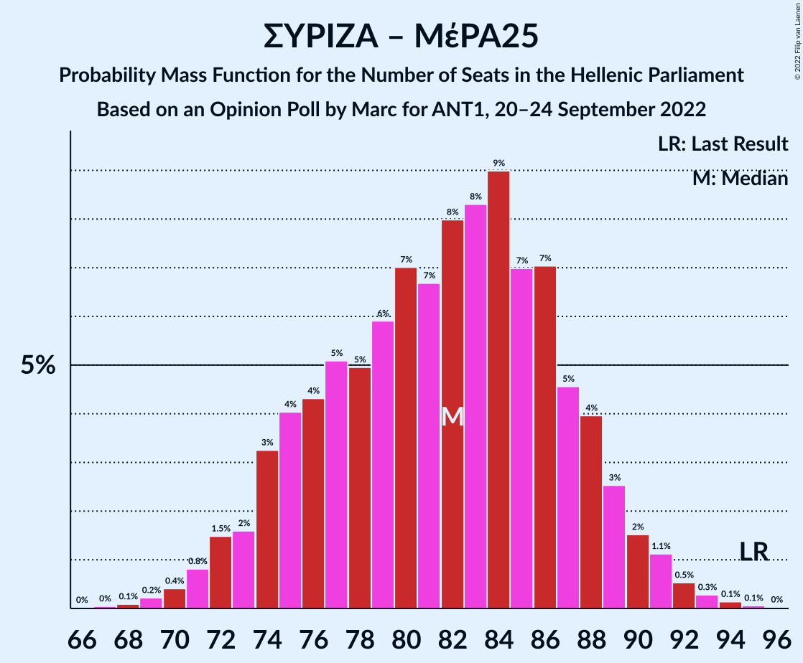

| Number of Seats | Probability | Accumulated | Special Marks |
|:---------------:|:-----------:|:-----------:|:-------------:|
| 67 | 0% | 100% |  |
| 68 | 0.1% | 99.9% |  |
| 69 | 0.2% | 99.8% |  |
| 70 | 0.4% | 99.6% |  |
| 71 | 0.8% | 99.2% |  |
| 72 | 1.5% | 98% |  |
| 73 | 2% | 97% |  |
| 74 | 3% | 95% |  |
| 75 | 4% | 92% |  |
| 76 | 4% | 88% |  |
| 77 | 5% | 84% |  |
| 78 | 5% | 79% |  |
| 79 | 6% | 74% |  |
| 80 | 7% | 68% |  |
| 81 | 7% | 61% |  |
| 82 | 8% | 54% |  |
| 83 | 8% | 46% |  |
| 84 | 9% | 38% | Median |
| 85 | 7% | 29% |  |
| 86 | 7% | 22% |  |
| 87 | 5% | 15% |  |
| 88 | 4% | 10% |  |
| 89 | 3% | 6% |  |
| 90 | 2% | 4% |  |
| 91 | 1.1% | 2% |  |
| 92 | 0.5% | 1.0% |  |
| 93 | 0.3% | 0.5% |  |
| 94 | 0.1% | 0.2% |  |
| 95 | 0.1% | 0.1% | Last Result |
| 96 | 0% | 0% |  |

### Συνασπισμός Ριζοσπαστικής Αριστεράς

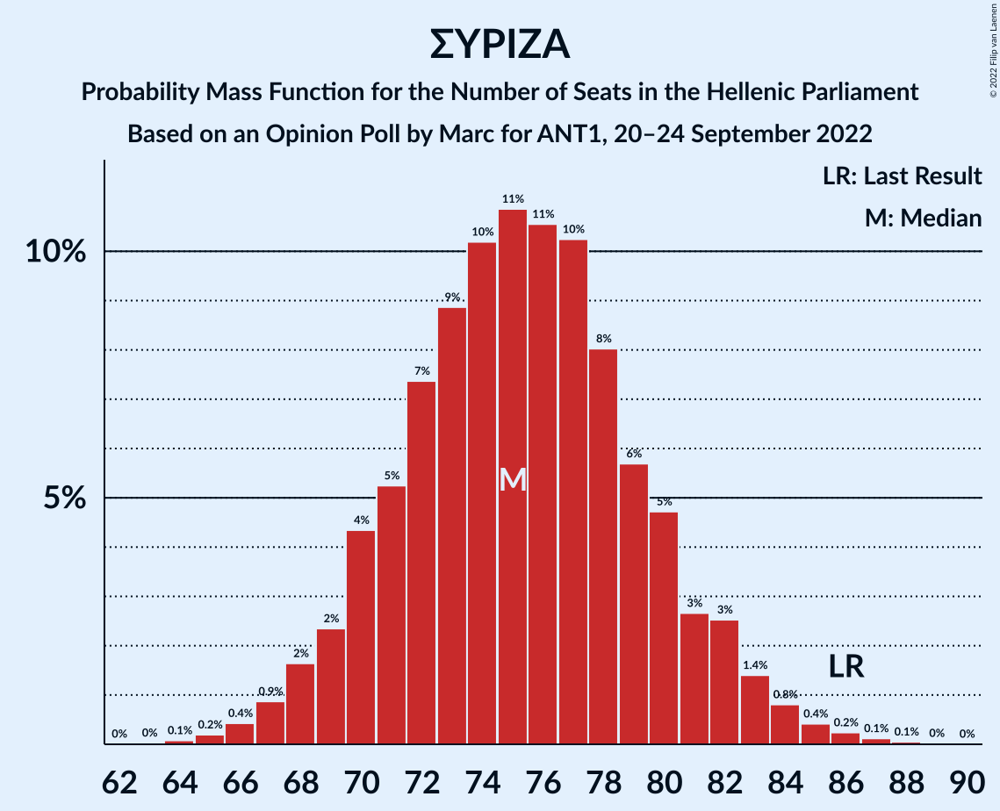

| Number of Seats | Probability | Accumulated | Special Marks |
|:---------------:|:-----------:|:-----------:|:-------------:|
| 64 | 0.1% | 100% |  |
| 65 | 0.2% | 99.9% |  |
| 66 | 0.4% | 99.7% |  |
| 67 | 0.9% | 99.3% |  |
| 68 | 2% | 98% |  |
| 69 | 2% | 97% |  |
| 70 | 4% | 94% |  |
| 71 | 5% | 90% |  |
| 72 | 7% | 85% |  |
| 73 | 9% | 77% |  |
| 74 | 10% | 69% |  |
| 75 | 11% | 58% | Median |
| 76 | 11% | 48% |  |
| 77 | 10% | 37% |  |
| 78 | 8% | 27% |  |
| 79 | 6% | 19% |  |
| 80 | 5% | 13% |  |
| 81 | 3% | 8% |  |
| 82 | 3% | 6% |  |
| 83 | 1.4% | 3% |  |
| 84 | 0.8% | 2% |  |
| 85 | 0.4% | 0.9% |  |
| 86 | 0.2% | 0.5% | Last Result |
| 87 | 0.1% | 0.2% |  |
| 88 | 0.1% | 0.1% |  |
| 89 | 0% | 0% |  |

## Technical Information

### Opinion Poll

+ **Polling firm:** Marc
+ **Commissioner(s):** ANT1
+ **Fieldwork period:** 20–24 September 2022

### Calculations

+ **Sample size:** 1166
+ **Simulations done:** 1,048,576
+ **Error estimate:** 0.75%

