# Opinion Poll by Metron Analysis for Mega TV, 22–26 September 2022

<a href="#voting-intentions">Voting Intentions</a> | <a href="#seats">Seats</a> | <a href="#coalitions">Coalitions</a> | <a href="#technical-information">Technical Information</a>

## Voting Intentions

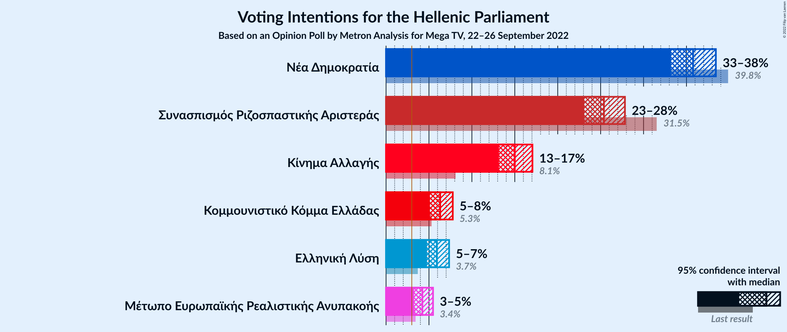

### Confidence Intervals

| Party | Last Result | Poll Result | 80% Confidence Interval | 90% Confidence Interval | 95% Confidence Interval | 99% Confidence Interval |
|:-----:|:-----------:|:-----------:|:-----------------------:|:-----------------------:|:-----------------------:|:-----------------------:|
| Νέα Δημοκρατία | 39.8% | 35.8% | 34.1–37.5% |33.6–38.0% |33.2–38.4% |32.4–39.3% |
| Συνασπισμός Ριζοσπαστικής Αριστεράς | 31.5% | 25.4% | 23.9–27.0% |23.5–27.4% |23.1–27.8% |22.4–28.6% |
| Κίνημα Αλλαγής | 8.1% | 15.0% | 13.8–16.3% |13.4–16.7% |13.2–17.1% |12.6–17.7% |
| Κομμουνιστικό Κόμμα Ελλάδας | 5.3% | 6.3% | 5.5–7.3% |5.3–7.5% |5.1–7.8% |4.8–8.2% |
| Ελληνική Λύση | 3.7% | 5.9% | 5.2–6.9% |4.9–7.1% |4.8–7.3% |4.4–7.8% |
| Μέτωπο Ευρωπαϊκής Ρεαλιστικής Ανυπακοής | 3.4% | 4.2% | 3.6–5.0% |3.4–5.3% |3.3–5.5% |3.0–5.9% |

*Note:* The poll result column reflects the actual value used in the calculations. Published results may vary slightly, and in addition be rounded to fewer digits.

## Seats

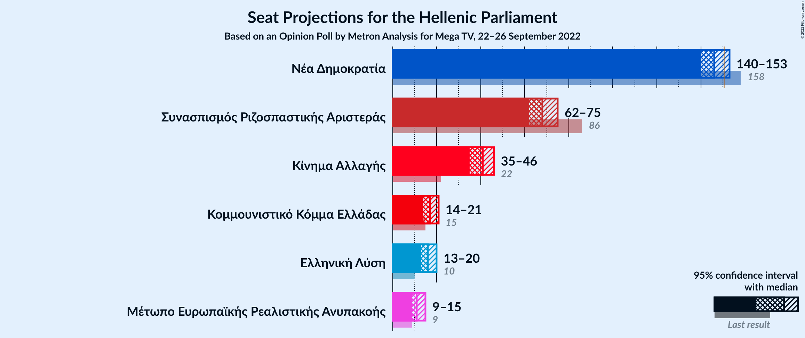

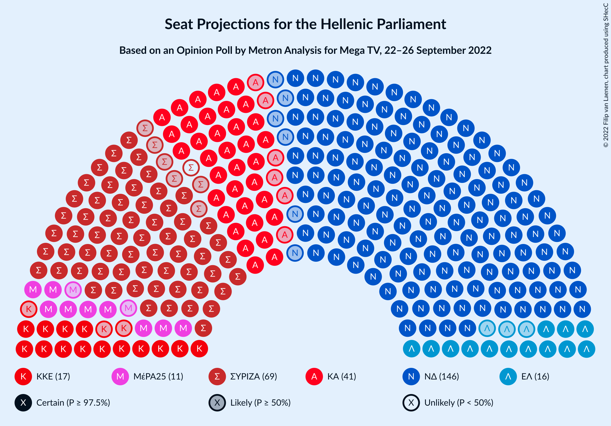

### Confidence Intervals

| Party | Last Result | Median | 80% Confidence Interval | 90% Confidence Interval | 95% Confidence Interval | 99% Confidence Interval |
|:-----:|:-----------:|:------:|:-----------------------:|:-----------------------:|:-----------------------:|:-----------------------:|
| <a href="#νέα-δημοκρατία">Νέα Δημοκρατία</a> | 158 | 146 | 142–151 |141–152 |140–153 |137–155 |
| <a href="#συνασπισμός-ριζοσπαστικής-αριστεράς">Συνασπισμός Ριζοσπαστικής Αριστεράς</a> | 86 | 68 | 64–73 |63–74 |62–75 |60–77 |
| <a href="#κίνημα-αλλαγής">Κίνημα Αλλαγής</a> | 22 | 41 | 37–44 |36–45 |35–46 |34–48 |
| <a href="#κομμουνιστικό-κόμμα-ελλάδας">Κομμουνιστικό Κόμμα Ελλάδας</a> | 15 | 17 | 15–19 |14–20 |14–21 |13–22 |
| <a href="#ελληνική-λύση">Ελληνική Λύση</a> | 10 | 16 | 14–18 |13–19 |13–20 |12–21 |
| <a href="#μέτωπο-ευρωπαϊκής-ρεαλιστικής-ανυπακοής">Μέτωπο Ευρωπαϊκής Ρεαλιστικής Ανυπακοής</a> | 9 | 11 | 10–14 |9–14 |9–15 |0–16 |

### Νέα Δημοκρατία

*For a full overview of the results for this party, see the [Νέα Δημοκρατία](party-νέαδημοκρατία.html) page.*

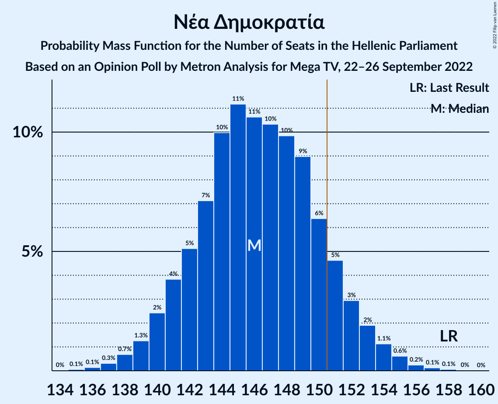

| Number of Seats | Probability | Accumulated | Special Marks |
|:---------------:|:-----------:|:-----------:|:-------------:|
| 135 | 0.1% | 100% |  |
| 136 | 0.1% | 99.9% |  |
| 137 | 0.3% | 99.8% |  |
| 138 | 0.7% | 99.5% |  |
| 139 | 1.3% | 98.8% |  |
| 140 | 2% | 98% |  |
| 141 | 4% | 95% |  |
| 142 | 5% | 91% |  |
| 143 | 7% | 86% |  |
| 144 | 10% | 79% |  |
| 145 | 11% | 69% |  |
| 146 | 11% | 58% | Median |
| 147 | 10% | 47% |  |
| 148 | 10% | 37% |  |
| 149 | 9% | 27% |  |
| 150 | 6% | 18% |  |
| 151 | 5% | 12% | Majority |
| 152 | 3% | 7% |  |
| 153 | 2% | 4% |  |
| 154 | 1.1% | 2% |  |
| 155 | 0.6% | 1.1% |  |
| 156 | 0.2% | 0.5% |  |
| 157 | 0.1% | 0.2% |  |
| 158 | 0.1% | 0.1% | Last Result |
| 159 | 0% | 0% |  |

### Συνασπισμός Ριζοσπαστικής Αριστεράς

*For a full overview of the results for this party, see the [Συνασπισμός Ριζοσπαστικής Αριστεράς](party-συνασπισμόςριζοσπαστικήςαριστεράς.html) page.*

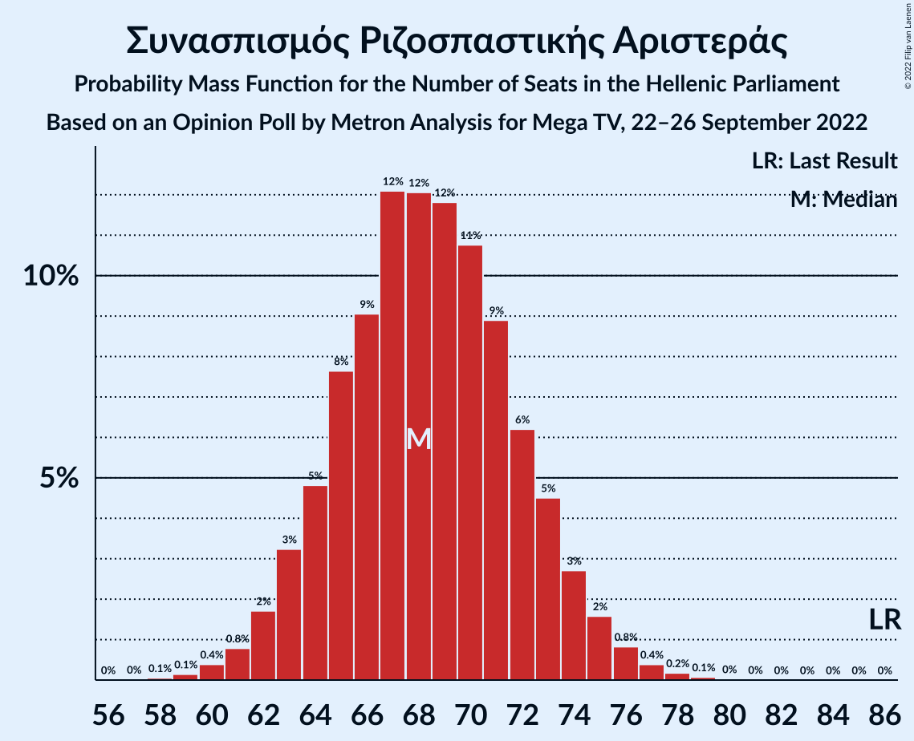

| Number of Seats | Probability | Accumulated | Special Marks |
|:---------------:|:-----------:|:-----------:|:-------------:|
| 58 | 0.1% | 100% |  |
| 59 | 0.1% | 99.9% |  |
| 60 | 0.4% | 99.8% |  |
| 61 | 0.8% | 99.4% |  |
| 62 | 2% | 98.6% |  |
| 63 | 3% | 97% |  |
| 64 | 5% | 94% |  |
| 65 | 8% | 89% |  |
| 66 | 9% | 81% |  |
| 67 | 12% | 72% |  |
| 68 | 12% | 60% | Median |
| 69 | 12% | 48% |  |
| 70 | 11% | 36% |  |
| 71 | 9% | 25% |  |
| 72 | 6% | 17% |  |
| 73 | 5% | 10% |  |
| 74 | 3% | 6% |  |
| 75 | 2% | 3% |  |
| 76 | 0.8% | 2% |  |
| 77 | 0.4% | 0.7% |  |
| 78 | 0.2% | 0.3% |  |
| 79 | 0.1% | 0.1% |  |
| 80 | 0% | 0% |  |
| 81 | 0% | 0% |  |
| 82 | 0% | 0% |  |
| 83 | 0% | 0% |  |
| 84 | 0% | 0% |  |
| 85 | 0% | 0% |  |
| 86 | 0% | 0% | Last Result |

### Κίνημα Αλλαγής

*For a full overview of the results for this party, see the [Κίνημα Αλλαγής](party-κίνημααλλαγής.html) page.*

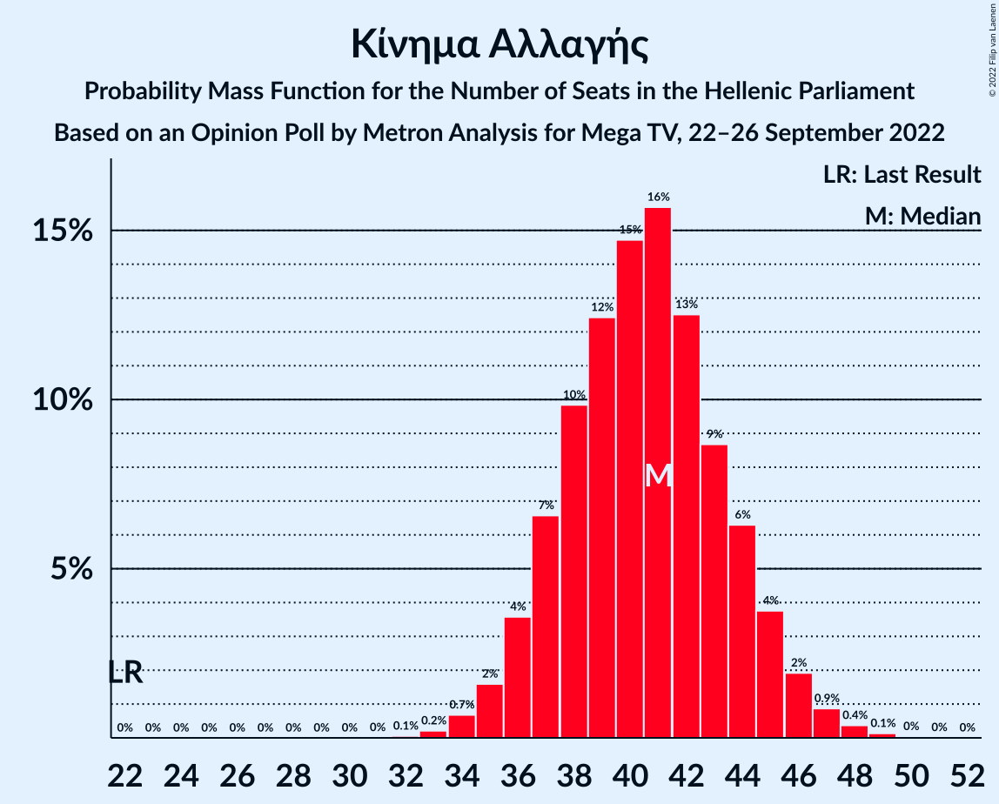

| Number of Seats | Probability | Accumulated | Special Marks |
|:---------------:|:-----------:|:-----------:|:-------------:|
| 22 | 0% | 100% | Last Result |
| 23 | 0% | 100% |  |
| 24 | 0% | 100% |  |
| 25 | 0% | 100% |  |
| 26 | 0% | 100% |  |
| 27 | 0% | 100% |  |
| 28 | 0% | 100% |  |
| 29 | 0% | 100% |  |
| 30 | 0% | 100% |  |
| 31 | 0% | 100% |  |
| 32 | 0.1% | 100% |  |
| 33 | 0.2% | 99.9% |  |
| 34 | 0.7% | 99.7% |  |
| 35 | 2% | 99.0% |  |
| 36 | 4% | 97% |  |
| 37 | 7% | 94% |  |
| 38 | 10% | 87% |  |
| 39 | 12% | 77% |  |
| 40 | 15% | 65% |  |
| 41 | 16% | 50% | Median |
| 42 | 13% | 35% |  |
| 43 | 9% | 22% |  |
| 44 | 6% | 13% |  |
| 45 | 4% | 7% |  |
| 46 | 2% | 3% |  |
| 47 | 0.9% | 1.4% |  |
| 48 | 0.4% | 0.6% |  |
| 49 | 0.1% | 0.2% |  |
| 50 | 0% | 0.1% |  |
| 51 | 0% | 0% |  |

### Κομμουνιστικό Κόμμα Ελλάδας

*For a full overview of the results for this party, see the [Κομμουνιστικό Κόμμα Ελλάδας](party-κομμουνιστικόκόμμαελλάδας.html) page.*

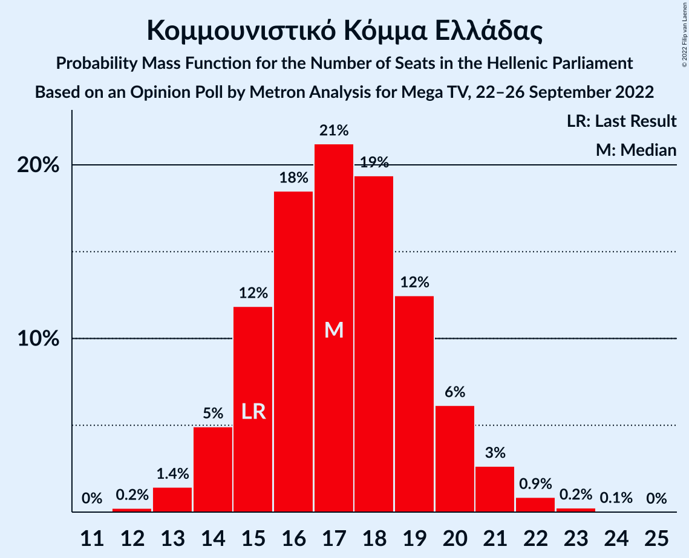

| Number of Seats | Probability | Accumulated | Special Marks |
|:---------------:|:-----------:|:-----------:|:-------------:|
| 12 | 0.2% | 100% |  |
| 13 | 1.4% | 99.7% |  |
| 14 | 5% | 98% |  |
| 15 | 12% | 93% | Last Result |
| 16 | 18% | 82% |  |
| 17 | 21% | 63% | Median |
| 18 | 19% | 42% |  |
| 19 | 12% | 22% |  |
| 20 | 6% | 10% |  |
| 21 | 3% | 4% |  |
| 22 | 0.9% | 1.2% |  |
| 23 | 0.2% | 0.3% |  |
| 24 | 0.1% | 0.1% |  |
| 25 | 0% | 0% |  |

### Ελληνική Λύση

*For a full overview of the results for this party, see the [Ελληνική Λύση](party-ελληνικήλύση.html) page.*

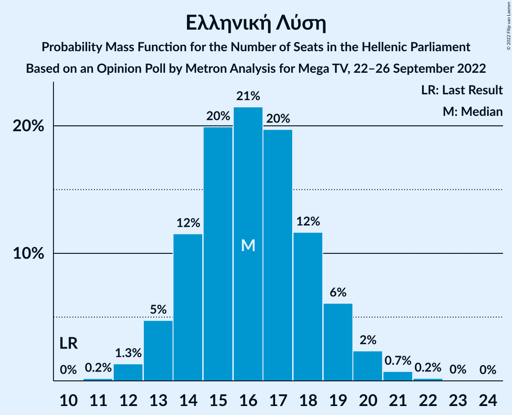

| Number of Seats | Probability | Accumulated | Special Marks |
|:---------------:|:-----------:|:-----------:|:-------------:|
| 10 | 0% | 100% | Last Result |
| 11 | 0.2% | 100% |  |
| 12 | 1.3% | 99.8% |  |
| 13 | 5% | 98% |  |
| 14 | 12% | 94% |  |
| 15 | 20% | 82% |  |
| 16 | 21% | 62% | Median |
| 17 | 20% | 41% |  |
| 18 | 12% | 21% |  |
| 19 | 6% | 9% |  |
| 20 | 2% | 3% |  |
| 21 | 0.7% | 1.0% |  |
| 22 | 0.2% | 0.2% |  |
| 23 | 0% | 0.1% |  |
| 24 | 0% | 0% |  |

### Μέτωπο Ευρωπαϊκής Ρεαλιστικής Ανυπακοής

*For a full overview of the results for this party, see the [Μέτωπο Ευρωπαϊκής Ρεαλιστικής Ανυπακοής](party-μέτωποευρωπαϊκήςρεαλιστικήςανυπακοής.html) page.*

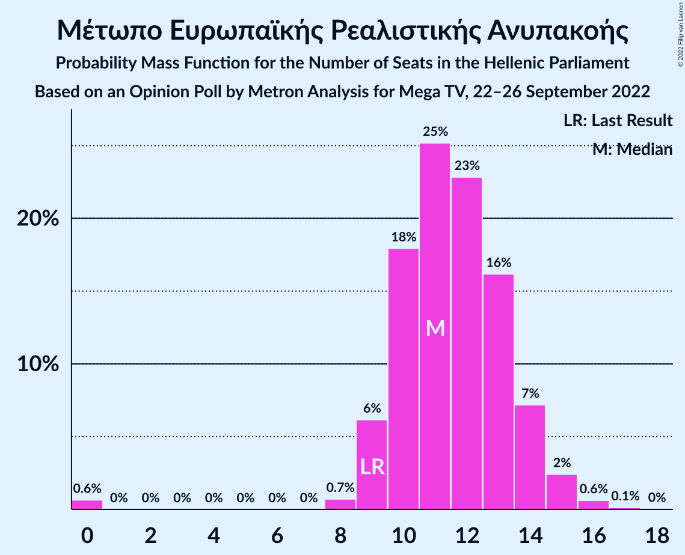

| Number of Seats | Probability | Accumulated | Special Marks |
|:---------------:|:-----------:|:-----------:|:-------------:|
| 0 | 0.6% | 100% |  |
| 1 | 0% | 99.4% |  |
| 2 | 0% | 99.4% |  |
| 3 | 0% | 99.4% |  |
| 4 | 0% | 99.4% |  |
| 5 | 0% | 99.4% |  |
| 6 | 0% | 99.4% |  |
| 7 | 0% | 99.4% |  |
| 8 | 0.7% | 99.4% |  |
| 9 | 6% | 98.6% | Last Result |
| 10 | 18% | 92% |  |
| 11 | 25% | 75% | Median |
| 12 | 23% | 49% |  |
| 13 | 16% | 27% |  |
| 14 | 7% | 10% |  |
| 15 | 2% | 3% |  |
| 16 | 0.6% | 0.8% |  |
| 17 | 0.1% | 0.2% |  |
| 18 | 0% | 0% |  |

## Coalitions

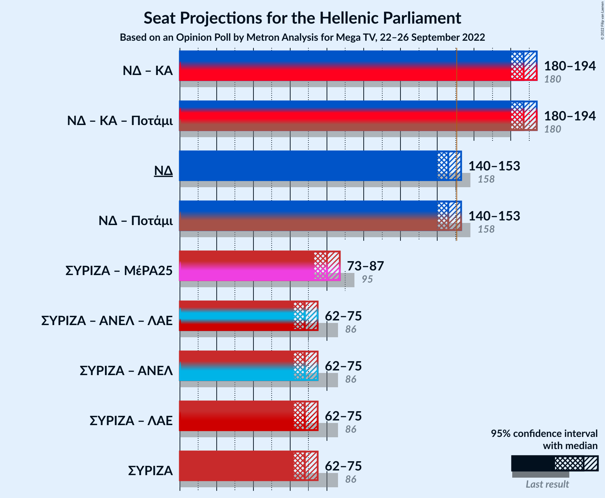

### Confidence Intervals

| Coalition | Last Result | Median | Majority? | 80% Confidence Interval | 90% Confidence Interval | 95% Confidence Interval | 99% Confidence Interval |
|:---------:|:-----------:|:------:|:---------:|:-----------------------:|:-----------------------:|:-----------------------:|:-----------------------:|
| Νέα Δημοκρατία – Κίνημα Αλλαγής | 180 | 187 | 100% | 182–191 | 181–193 | 180–194 | 178–197 |
| Νέα Δημοκρατία | 158 | 146 | 12% | 142–151 | 141–152 | 140–153 | 137–155 |
| Συνασπισμός Ριζοσπαστικής Αριστεράς – Μέτωπο Ευρωπαϊκής Ρεαλιστικής Ανυπακοής | 95 | 80 | 0% | 76–84 | 74–85 | 73–87 | 71–89 |
| Συνασπισμός Ριζοσπαστικής Αριστεράς | 86 | 68 | 0% | 64–73 | 63–74 | 62–75 | 60–77 |

### Νέα Δημοκρατία – Κίνημα Αλλαγής

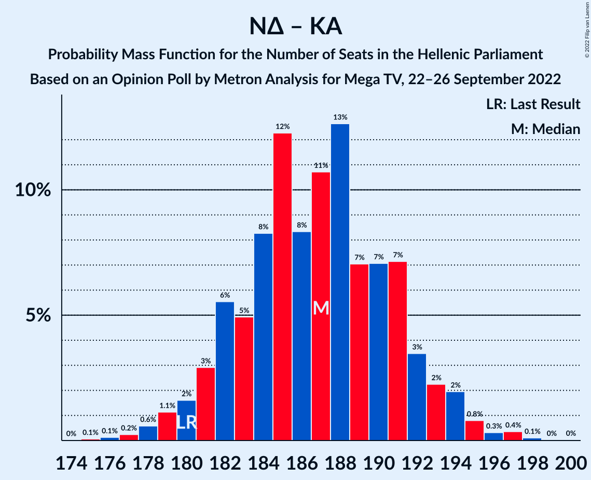

| Number of Seats | Probability | Accumulated | Special Marks |
|:---------------:|:-----------:|:-----------:|:-------------:|
| 175 | 0.1% | 100% |  |
| 176 | 0.1% | 99.9% |  |
| 177 | 0.2% | 99.8% |  |
| 178 | 0.6% | 99.5% |  |
| 179 | 1.1% | 99.0% |  |
| 180 | 2% | 98% | Last Result |
| 181 | 3% | 96% |  |
| 182 | 6% | 93% |  |
| 183 | 5% | 88% |  |
| 184 | 8% | 83% |  |
| 185 | 12% | 75% |  |
| 186 | 8% | 62% |  |
| 187 | 11% | 54% | Median |
| 188 | 13% | 43% |  |
| 189 | 7% | 31% |  |
| 190 | 7% | 24% |  |
| 191 | 7% | 16% |  |
| 192 | 3% | 9% |  |
| 193 | 2% | 6% |  |
| 194 | 2% | 4% |  |
| 195 | 0.8% | 2% |  |
| 196 | 0.3% | 0.9% |  |
| 197 | 0.4% | 0.5% |  |
| 198 | 0.1% | 0.2% |  |
| 199 | 0% | 0.1% |  |
| 200 | 0% | 0% |  |

### Νέα Δημοκρατία

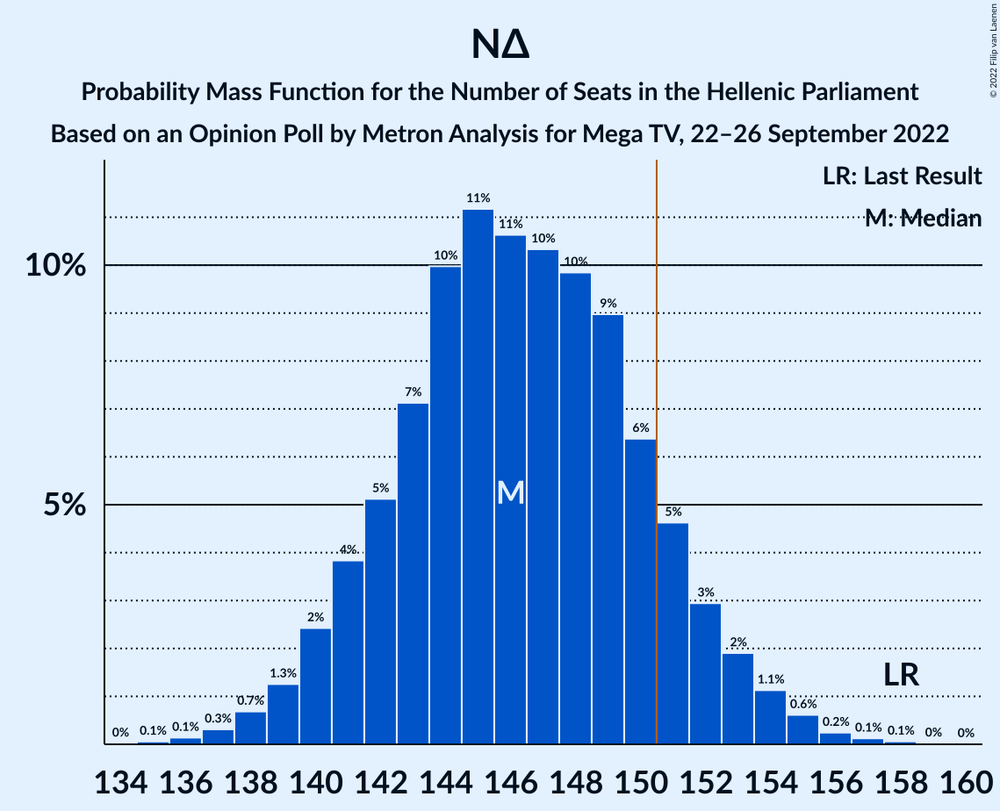

| Number of Seats | Probability | Accumulated | Special Marks |
|:---------------:|:-----------:|:-----------:|:-------------:|
| 135 | 0.1% | 100% |  |
| 136 | 0.1% | 99.9% |  |
| 137 | 0.3% | 99.8% |  |
| 138 | 0.7% | 99.5% |  |
| 139 | 1.3% | 98.8% |  |
| 140 | 2% | 98% |  |
| 141 | 4% | 95% |  |
| 142 | 5% | 91% |  |
| 143 | 7% | 86% |  |
| 144 | 10% | 79% |  |
| 145 | 11% | 69% |  |
| 146 | 11% | 58% | Median |
| 147 | 10% | 47% |  |
| 148 | 10% | 37% |  |
| 149 | 9% | 27% |  |
| 150 | 6% | 18% |  |
| 151 | 5% | 12% | Majority |
| 152 | 3% | 7% |  |
| 153 | 2% | 4% |  |
| 154 | 1.1% | 2% |  |
| 155 | 0.6% | 1.1% |  |
| 156 | 0.2% | 0.5% |  |
| 157 | 0.1% | 0.2% |  |
| 158 | 0.1% | 0.1% | Last Result |
| 159 | 0% | 0% |  |

### Συνασπισμός Ριζοσπαστικής Αριστεράς – Μέτωπο Ευρωπαϊκής Ρεαλιστικής Ανυπακοής

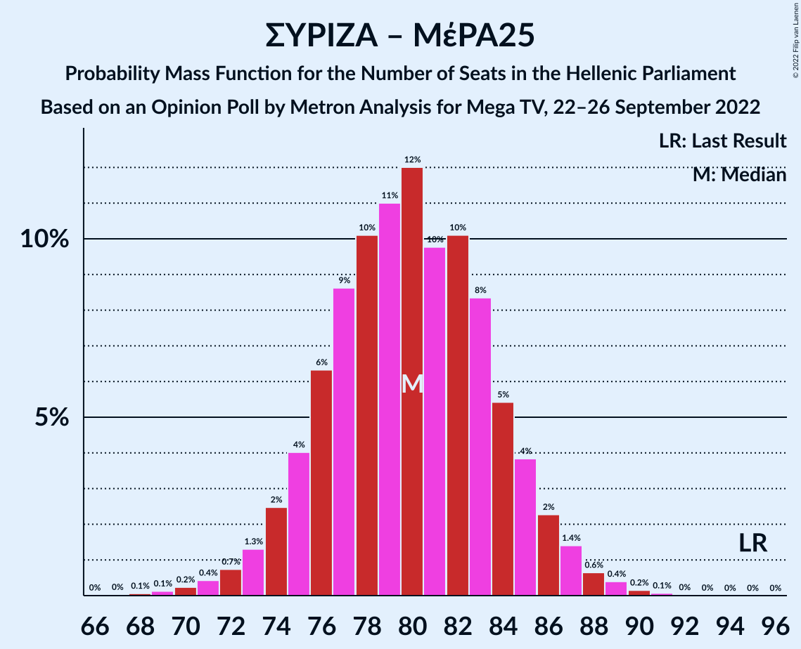

| Number of Seats | Probability | Accumulated | Special Marks |
|:---------------:|:-----------:|:-----------:|:-------------:|
| 67 | 0% | 100% |  |
| 68 | 0.1% | 99.9% |  |
| 69 | 0.1% | 99.9% |  |
| 70 | 0.2% | 99.8% |  |
| 71 | 0.4% | 99.5% |  |
| 72 | 0.7% | 99.1% |  |
| 73 | 1.3% | 98% |  |
| 74 | 2% | 97% |  |
| 75 | 4% | 95% |  |
| 76 | 6% | 91% |  |
| 77 | 9% | 84% |  |
| 78 | 10% | 76% |  |
| 79 | 11% | 65% | Median |
| 80 | 12% | 54% |  |
| 81 | 10% | 42% |  |
| 82 | 10% | 33% |  |
| 83 | 8% | 23% |  |
| 84 | 5% | 14% |  |
| 85 | 4% | 9% |  |
| 86 | 2% | 5% |  |
| 87 | 1.4% | 3% |  |
| 88 | 0.6% | 1.3% |  |
| 89 | 0.4% | 0.7% |  |
| 90 | 0.2% | 0.3% |  |
| 91 | 0.1% | 0.1% |  |
| 92 | 0% | 0% |  |
| 93 | 0% | 0% |  |
| 94 | 0% | 0% |  |
| 95 | 0% | 0% | Last Result |

### Συνασπισμός Ριζοσπαστικής Αριστεράς

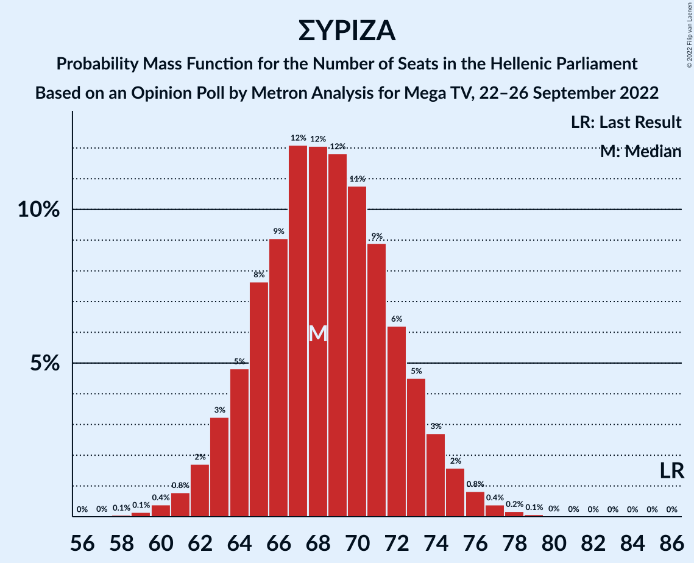

| Number of Seats | Probability | Accumulated | Special Marks |
|:---------------:|:-----------:|:-----------:|:-------------:|
| 58 | 0.1% | 100% |  |
| 59 | 0.1% | 99.9% |  |
| 60 | 0.4% | 99.8% |  |
| 61 | 0.8% | 99.4% |  |
| 62 | 2% | 98.6% |  |
| 63 | 3% | 97% |  |
| 64 | 5% | 94% |  |
| 65 | 8% | 89% |  |
| 66 | 9% | 81% |  |
| 67 | 12% | 72% |  |
| 68 | 12% | 60% | Median |
| 69 | 12% | 48% |  |
| 70 | 11% | 36% |  |
| 71 | 9% | 25% |  |
| 72 | 6% | 17% |  |
| 73 | 5% | 10% |  |
| 74 | 3% | 6% |  |
| 75 | 2% | 3% |  |
| 76 | 0.8% | 2% |  |
| 77 | 0.4% | 0.7% |  |
| 78 | 0.2% | 0.3% |  |
| 79 | 0.1% | 0.1% |  |
| 80 | 0% | 0% |  |
| 81 | 0% | 0% |  |
| 82 | 0% | 0% |  |
| 83 | 0% | 0% |  |
| 84 | 0% | 0% |  |
| 85 | 0% | 0% |  |
| 86 | 0% | 0% | Last Result |

## Technical Information

### Opinion Poll

+ **Polling firm:** Metron Analysis
+ **Commissioner(s):** Mega TV
+ **Fieldwork period:** 22–26 September 2022

### Calculations

+ **Sample size:** 1300
+ **Simulations done:** 1,048,576
+ **Error estimate:** 0.47%

