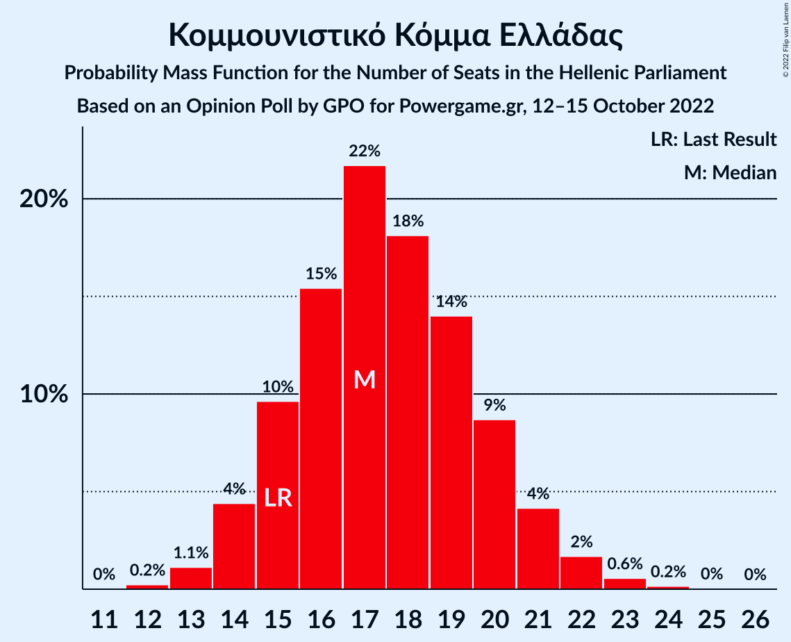

# Opinion Poll by GPO for Powergame.gr, 12–15 October 2022

<a href="#voting-intentions">Voting Intentions</a> | <a href="#seats">Seats</a> | <a href="#coalitions">Coalitions</a> | <a href="#technical-information">Technical Information</a>

## Voting Intentions

### Confidence Intervals

| Party | Last Result | Poll Result | 80% Confidence Interval | 90% Confidence Interval | 95% Confidence Interval | 99% Confidence Interval |
|:-----:|:-----------:|:-----------:|:-----------------------:|:-----------------------:|:-----------------------:|:-----------------------:|
| Νέα Δημοκρατία | 39.8% | 37.6% | 35.8–39.4% |35.3–39.9% |34.9–40.4% |34.0–41.2% |
| Συνασπισμός Ριζοσπαστικής Αριστεράς | 31.5% | 29.4% | 27.8–31.2% |27.3–31.6% |26.9–32.1% |26.1–32.9% |
| Κίνημα Αλλαγής | 8.1% | 11.8% | 10.7–13.1% |10.4–13.5% |10.1–13.8% |9.6–14.4% |
| Κομμουνιστικό Κόμμα Ελλάδας | 5.3% | 6.3% | 5.5–7.3% |5.3–7.6% |5.1–7.9% |4.7–8.4% |
| Ελληνική Λύση | 3.7% | 4.4% | 3.7–5.3% |3.6–5.5% |3.4–5.7% |3.1–6.2% |
| Μέτωπο Ευρωπαϊκής Ρεαλιστικής Ανυπακοής | 3.4% | 3.0% | 2.5–3.7% |2.3–3.9% |2.2–4.1% |1.9–4.5% |

*Note:* The poll result column reflects the actual value used in the calculations. Published results may vary slightly, and in addition be rounded to fewer digits.

## Seats

### Confidence Intervals

| Party | Last Result | Median | 80% Confidence Interval | 90% Confidence Interval | 95% Confidence Interval | 99% Confidence Interval |
|:-----:|:-----------:|:------:|:-----------------------:|:-----------------------:|:-----------------------:|:-----------------------:|
| <a href="#νέα-δημοκρατία">Νέα Δημοκρατία</a> | 158 | 153 | 147–158 |146–160 |145–161 |142–163 |
| <a href="#συνασπισμός-ριζοσπαστικής-αριστεράς">Συνασπισμός Ριζοσπαστικής Αριστεράς</a> | 86 | 80 | 75–85 |74–87 |73–88 |71–90 |
| <a href="#κίνημα-αλλαγής">Κίνημα Αλλαγής</a> | 22 | 32 | 29–36 |28–37 |27–38 |26–40 |
| <a href="#κομμουνιστικό-κόμμα-ελλάδας">Κομμουνιστικό Κόμμα Ελλάδας</a> | 15 | 17 | 15–20 |14–21 |14–21 |13–23 |
| <a href="#ελληνική-λύση">Ελληνική Λύση</a> | 10 | 12 | 10–14 |10–15 |9–16 |8–17 |
| <a href="#μέτωπο-ευρωπαϊκής-ρεαλιστικής-ανυπακοής">Μέτωπο Ευρωπαϊκής Ρεαλιστικής Ανυπακοής</a> | 9 | 8 | 0–10 |0–11 |0–11 |0–12 |

### Νέα Δημοκρατία

*For a full overview of the results for this party, see the [Νέα Δημοκρατία](party-νέαδημοκρατία.html) page.*

| Number of Seats | Probability | Accumulated | Special Marks |
|:---------------:|:-----------:|:-----------:|:-------------:|
| 139 | 0% | 100% |  |
| 140 | 0.1% | 99.9% |  |
| 141 | 0.2% | 99.9% |  |
| 142 | 0.3% | 99.7% |  |
| 143 | 0.7% | 99.4% |  |
| 144 | 1.1% | 98.7% |  |
| 145 | 2% | 98% |  |
| 146 | 3% | 96% |  |
| 147 | 4% | 93% |  |
| 148 | 5% | 89% |  |
| 149 | 7% | 84% |  |
| 150 | 8% | 77% |  |
| 151 | 10% | 69% | Majority |
| 152 | 9% | 59% |  |
| 153 | 10% | 51% | Median |
| 154 | 8% | 40% |  |
| 155 | 8% | 32% |  |
| 156 | 6% | 24% |  |
| 157 | 6% | 18% |  |
| 158 | 4% | 12% | Last Result |
| 159 | 3% | 8% |  |
| 160 | 2% | 5% |  |
| 161 | 1.4% | 3% |  |
| 162 | 0.8% | 2% |  |
| 163 | 0.5% | 0.9% |  |
| 164 | 0.2% | 0.5% |  |
| 165 | 0.1% | 0.2% |  |
| 166 | 0.1% | 0.1% |  |
| 167 | 0% | 0% |  |

### Συνασπισμός Ριζοσπαστικής Αριστεράς

*For a full overview of the results for this party, see the [Συνασπισμός Ριζοσπαστικής Αριστεράς](party-συνασπισμόςριζοσπαστικήςαριστεράς.html) page.*

| Number of Seats | Probability | Accumulated | Special Marks |
|:---------------:|:-----------:|:-----------:|:-------------:|
| 68 | 0% | 100% |  |
| 69 | 0.1% | 99.9% |  |
| 70 | 0.2% | 99.8% |  |
| 71 | 0.5% | 99.6% |  |
| 72 | 0.9% | 99.2% |  |
| 73 | 2% | 98% |  |
| 74 | 2% | 97% |  |
| 75 | 5% | 94% |  |
| 76 | 5% | 89% |  |
| 77 | 7% | 84% |  |
| 78 | 9% | 77% |  |
| 79 | 10% | 68% |  |
| 80 | 10% | 58% | Median |
| 81 | 10% | 48% |  |
| 82 | 9% | 37% |  |
| 83 | 8% | 28% |  |
| 84 | 7% | 21% |  |
| 85 | 5% | 14% |  |
| 86 | 4% | 9% | Last Result |
| 87 | 2% | 5% |  |
| 88 | 1.5% | 3% |  |
| 89 | 0.8% | 2% |  |
| 90 | 0.5% | 1.0% |  |
| 91 | 0.3% | 0.5% |  |
| 92 | 0.1% | 0.2% |  |
| 93 | 0% | 0.1% |  |
| 94 | 0% | 0.1% |  |
| 95 | 0% | 0% |  |

### Κίνημα Αλλαγής

*For a full overview of the results for this party, see the [Κίνημα Αλλαγής](party-κίνημααλλαγής.html) page.*

| Number of Seats | Probability | Accumulated | Special Marks |
|:---------------:|:-----------:|:-----------:|:-------------:|
| 22 | 0% | 100% | Last Result |
| 23 | 0% | 100% |  |
| 24 | 0% | 100% |  |
| 25 | 0.1% | 100% |  |
| 26 | 0.5% | 99.8% |  |
| 27 | 2% | 99.3% |  |
| 28 | 4% | 97% |  |
| 29 | 6% | 94% |  |
| 30 | 8% | 87% |  |
| 31 | 15% | 79% |  |
| 32 | 18% | 65% | Median |
| 33 | 15% | 47% |  |
| 34 | 9% | 31% |  |
| 35 | 9% | 22% |  |
| 36 | 7% | 13% |  |
| 37 | 4% | 7% |  |
| 38 | 1.5% | 3% |  |
| 39 | 0.5% | 1.1% |  |
| 40 | 0.3% | 0.5% |  |
| 41 | 0.2% | 0.2% |  |
| 42 | 0% | 0.1% |  |
| 43 | 0% | 0% |  |

### Κομμουνιστικό Κόμμα Ελλάδας

*For a full overview of the results for this party, see the [Κομμουνιστικό Κόμμα Ελλάδας](party-κομμουνιστικόκόμμαελλάδας.html) page.*

| Number of Seats | Probability | Accumulated | Special Marks |
|:---------------:|:-----------:|:-----------:|:-------------:|
| 12 | 0.2% | 100% |  |
| 13 | 1.1% | 99.7% |  |
| 14 | 4% | 98.6% |  |
| 15 | 10% | 94% | Last Result |
| 16 | 15% | 85% |  |
| 17 | 22% | 69% | Median |
| 18 | 18% | 47% |  |
| 19 | 14% | 29% |  |
| 20 | 9% | 15% |  |
| 21 | 4% | 7% |  |
| 22 | 2% | 2% |  |
| 23 | 0.6% | 0.8% |  |
| 24 | 0.2% | 0.2% |  |
| 25 | 0% | 0.1% |  |
| 26 | 0% | 0% |  |

### Ελληνική Λύση

*For a full overview of the results for this party, see the [Ελληνική Λύση](party-ελληνικήλύση.html) page.*

| Number of Seats | Probability | Accumulated | Special Marks |
|:---------------:|:-----------:|:-----------:|:-------------:|
| 0 | 0.3% | 100% |  |
| 1 | 0% | 99.7% |  |
| 2 | 0% | 99.7% |  |
| 3 | 0% | 99.7% |  |
| 4 | 0% | 99.7% |  |
| 5 | 0% | 99.7% |  |
| 6 | 0% | 99.7% |  |
| 7 | 0% | 99.7% |  |
| 8 | 0.3% | 99.7% |  |
| 9 | 3% | 99.4% |  |
| 10 | 10% | 96% | Last Result |
| 11 | 19% | 86% |  |
| 12 | 25% | 67% | Median |
| 13 | 20% | 42% |  |
| 14 | 13% | 22% |  |
| 15 | 6% | 9% |  |
| 16 | 2% | 3% |  |
| 17 | 0.7% | 0.8% |  |
| 18 | 0.1% | 0.2% |  |
| 19 | 0% | 0% |  |

### Μέτωπο Ευρωπαϊκής Ρεαλιστικής Ανυπακοής

*For a full overview of the results for this party, see the [Μέτωπο Ευρωπαϊκής Ρεαλιστικής Ανυπακοής](party-μέτωποευρωπαϊκήςρεαλιστικήςανυπακοής.html) page.*

| Number of Seats | Probability | Accumulated | Special Marks |
|:---------------:|:-----------:|:-----------:|:-------------:|
| 0 | 47% | 100% |  |
| 1 | 0% | 53% |  |
| 2 | 0% | 53% |  |
| 3 | 0% | 53% |  |
| 4 | 0% | 53% |  |
| 5 | 0% | 53% |  |
| 6 | 0% | 53% |  |
| 7 | 0% | 53% |  |
| 8 | 12% | 53% | Median |
| 9 | 23% | 41% | Last Result |
| 10 | 12% | 18% |  |
| 11 | 4% | 6% |  |
| 12 | 1.2% | 1.4% |  |
| 13 | 0.2% | 0.2% |  |
| 14 | 0% | 0% |  |

## Coalitions

### Confidence Intervals

| Coalition | Last Result | Median | Majority? | 80% Confidence Interval | 90% Confidence Interval | 95% Confidence Interval | 99% Confidence Interval |
|:---------:|:-----------:|:------:|:---------:|:-----------------------:|:-----------------------:|:-----------------------:|:-----------------------:|
| Νέα Δημοκρατία – Κίνημα Αλλαγής | 180 | 185 | 100% | 179–191 | 178–192 | 176–194 | 174–197 |
| Νέα Δημοκρατία | 158 | 153 | 69% | 147–158 | 146–160 | 145–161 | 142–163 |
| Συνασπισμός Ριζοσπαστικής Αριστεράς – Μέτωπο Ευρωπαϊκής Ρεαλιστικής Ανυπακοής | 95 | 85 | 0% | 79–91 | 77–93 | 76–94 | 74–97 |
| Συνασπισμός Ριζοσπαστικής Αριστεράς | 86 | 80 | 0% | 75–85 | 74–87 | 73–88 | 71–90 |

### Νέα Δημοκρατία – Κίνημα Αλλαγής

| Number of Seats | Probability | Accumulated | Special Marks |
|:---------------:|:-----------:|:-----------:|:-------------:|
| 171 | 0% | 100% |  |
| 172 | 0.1% | 99.9% |  |
| 173 | 0.2% | 99.8% |  |
| 174 | 0.4% | 99.6% |  |
| 175 | 0.7% | 99.2% |  |
| 176 | 1.1% | 98.5% |  |
| 177 | 2% | 97% |  |
| 178 | 3% | 96% |  |
| 179 | 4% | 93% |  |
| 180 | 5% | 89% | Last Result |
| 181 | 6% | 84% |  |
| 182 | 7% | 78% |  |
| 183 | 8% | 71% |  |
| 184 | 8% | 63% |  |
| 185 | 10% | 55% | Median |
| 186 | 8% | 45% |  |
| 187 | 7% | 37% |  |
| 188 | 8% | 30% |  |
| 189 | 5% | 22% |  |
| 190 | 5% | 17% |  |
| 191 | 4% | 12% |  |
| 192 | 3% | 8% |  |
| 193 | 2% | 5% |  |
| 194 | 1.3% | 3% |  |
| 195 | 0.9% | 2% |  |
| 196 | 0.4% | 1.0% |  |
| 197 | 0.3% | 0.5% |  |
| 198 | 0.1% | 0.2% |  |
| 199 | 0.1% | 0.1% |  |
| 200 | 0% | 0.1% |  |
| 201 | 0% | 0% |  |

### Νέα Δημοκρατία

| Number of Seats | Probability | Accumulated | Special Marks |
|:---------------:|:-----------:|:-----------:|:-------------:|
| 139 | 0% | 100% |  |
| 140 | 0.1% | 99.9% |  |
| 141 | 0.2% | 99.9% |  |
| 142 | 0.3% | 99.7% |  |
| 143 | 0.7% | 99.4% |  |
| 144 | 1.1% | 98.7% |  |
| 145 | 2% | 98% |  |
| 146 | 3% | 96% |  |
| 147 | 4% | 93% |  |
| 148 | 5% | 89% |  |
| 149 | 7% | 84% |  |
| 150 | 8% | 77% |  |
| 151 | 10% | 69% | Majority |
| 152 | 9% | 59% |  |
| 153 | 10% | 51% | Median |
| 154 | 8% | 40% |  |
| 155 | 8% | 32% |  |
| 156 | 6% | 24% |  |
| 157 | 6% | 18% |  |
| 158 | 4% | 12% | Last Result |
| 159 | 3% | 8% |  |
| 160 | 2% | 5% |  |
| 161 | 1.4% | 3% |  |
| 162 | 0.8% | 2% |  |
| 163 | 0.5% | 0.9% |  |
| 164 | 0.2% | 0.5% |  |
| 165 | 0.1% | 0.2% |  |
| 166 | 0.1% | 0.1% |  |
| 167 | 0% | 0% |  |

### Συνασπισμός Ριζοσπαστικής Αριστεράς – Μέτωπο Ευρωπαϊκής Ρεαλιστικής Ανυπακοής

| Number of Seats | Probability | Accumulated | Special Marks |
|:---------------:|:-----------:|:-----------:|:-------------:|
| 71 | 0% | 100% |  |
| 72 | 0.1% | 99.9% |  |
| 73 | 0.2% | 99.8% |  |
| 74 | 0.4% | 99.6% |  |
| 75 | 0.9% | 99.2% |  |
| 76 | 1.2% | 98% |  |
| 77 | 2% | 97% |  |
| 78 | 3% | 95% |  |
| 79 | 4% | 92% |  |
| 80 | 5% | 88% |  |
| 81 | 6% | 83% |  |
| 82 | 6% | 77% |  |
| 83 | 7% | 71% |  |
| 84 | 8% | 64% |  |
| 85 | 8% | 56% |  |
| 86 | 8% | 48% |  |
| 87 | 8% | 41% |  |
| 88 | 7% | 32% | Median |
| 89 | 7% | 25% |  |
| 90 | 5% | 19% |  |
| 91 | 5% | 14% |  |
| 92 | 3% | 9% |  |
| 93 | 2% | 6% |  |
| 94 | 1.4% | 3% |  |
| 95 | 1.0% | 2% | Last Result |
| 96 | 0.5% | 1.1% |  |
| 97 | 0.3% | 0.5% |  |
| 98 | 0.1% | 0.3% |  |
| 99 | 0.1% | 0.1% |  |
| 100 | 0% | 0.1% |  |
| 101 | 0% | 0% |  |

### Συνασπισμός Ριζοσπαστικής Αριστεράς

| Number of Seats | Probability | Accumulated | Special Marks |
|:---------------:|:-----------:|:-----------:|:-------------:|
| 68 | 0% | 100% |  |
| 69 | 0.1% | 99.9% |  |
| 70 | 0.2% | 99.8% |  |
| 71 | 0.5% | 99.6% |  |
| 72 | 0.9% | 99.2% |  |
| 73 | 2% | 98% |  |
| 74 | 2% | 97% |  |
| 75 | 5% | 94% |  |
| 76 | 5% | 89% |  |
| 77 | 7% | 84% |  |
| 78 | 9% | 77% |  |
| 79 | 10% | 68% |  |
| 80 | 10% | 58% | Median |
| 81 | 10% | 48% |  |
| 82 | 9% | 37% |  |
| 83 | 8% | 28% |  |
| 84 | 7% | 21% |  |
| 85 | 5% | 14% |  |
| 86 | 4% | 9% | Last Result |
| 87 | 2% | 5% |  |
| 88 | 1.5% | 3% |  |
| 89 | 0.8% | 2% |  |
| 90 | 0.5% | 1.0% |  |
| 91 | 0.3% | 0.5% |  |
| 92 | 0.1% | 0.2% |  |
| 93 | 0% | 0.1% |  |
| 94 | 0% | 0.1% |  |
| 95 | 0% | 0% |  |

## Technical Information

### Opinion Poll

+ **Polling firm:** GPO
+ **Commissioner(s):** Powergame.gr
+ **Fieldwork period:** 12–15 October 2022

### Calculations

+ **Sample size:** 1200
+ **Simulations done:** 1,048,576
+ **Error estimate:** 0.23%

