# Opinion Poll by Interview for Politic.gr, 13–19 October 2022

<a href="#voting-intentions">Voting Intentions</a> | <a href="#seats">Seats</a> | <a href="#coalitions">Coalitions</a> | <a href="#technical-information">Technical Information</a>

## Voting Intentions

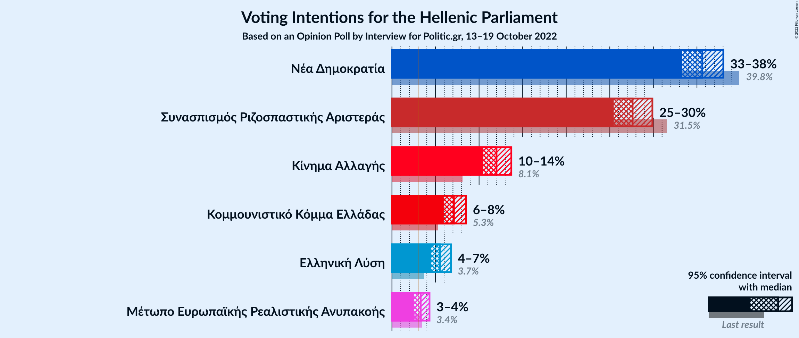

### Confidence Intervals

| Party | Last Result | Poll Result | 80% Confidence Interval | 90% Confidence Interval | 95% Confidence Interval | 99% Confidence Interval |
|:-----:|:-----------:|:-----------:|:-----------------------:|:-----------------------:|:-----------------------:|:-----------------------:|
| Νέα Δημοκρατία | 39.8% | 35.6% | 34.1–37.2% |33.7–37.6% |33.3–38.0% |32.6–38.8% |
| Συνασπισμός Ριζοσπαστικής Αριστεράς | 31.5% | 27.6% | 26.2–29.1% |25.8–29.5% |25.5–29.9% |24.8–30.6% |
| Κίνημα Αλλαγής | 8.1% | 12.0% | 11.0–13.1% |10.7–13.4% |10.5–13.7% |10.0–14.3% |
| Κομμουνιστικό Κόμμα Ελλάδας | 5.3% | 7.1% | 6.3–8.0% |6.1–8.3% |5.9–8.5% |5.6–8.9% |
| Ελληνική Λύση | 3.7% | 5.5% | 4.8–6.3% |4.6–6.6% |4.5–6.8% |4.2–7.2% |
| Μέτωπο Ευρωπαϊκής Ρεαλιστικής Ανυπακοής | 3.4% | 3.3% | 2.8–4.0% |2.6–4.1% |2.5–4.3% |2.3–4.6% |

*Note:* The poll result column reflects the actual value used in the calculations. Published results may vary slightly, and in addition be rounded to fewer digits.

## Seats

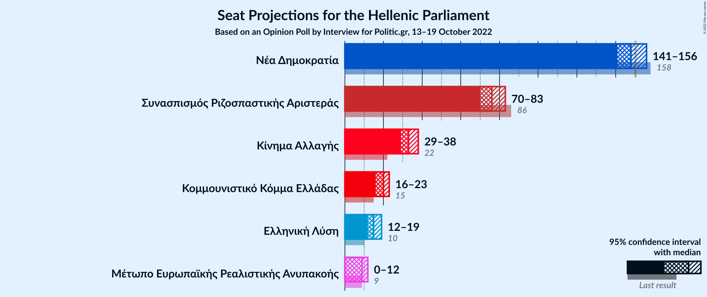

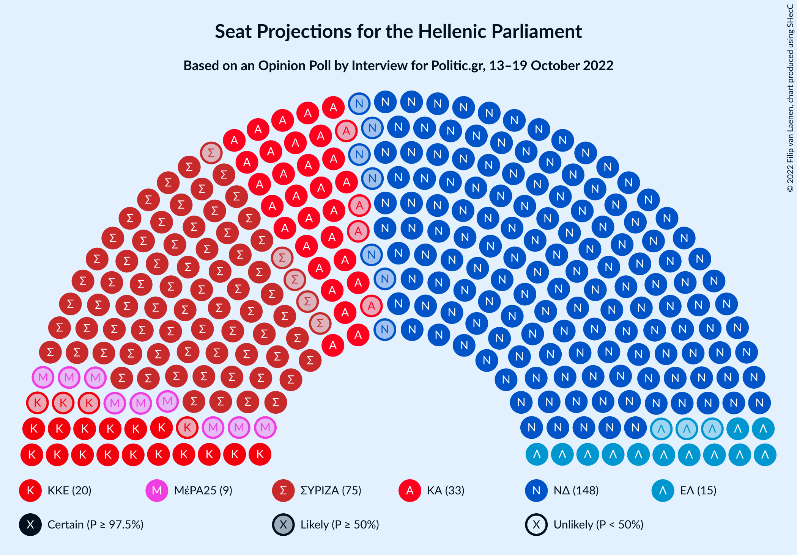

### Confidence Intervals

| Party | Last Result | Median | 80% Confidence Interval | 90% Confidence Interval | 95% Confidence Interval | 99% Confidence Interval |
|:-----:|:-----------:|:------:|:-----------------------:|:-----------------------:|:-----------------------:|:-----------------------:|
| <a href="#νέα-δημοκρατία">Νέα Δημοκρατία</a> | 158 | 148 | 143–153 |142–154 |141–156 |139–158 |
| <a href="#συνασπισμός-ριζοσπαστικής-αριστεράς">Συνασπισμός Ριζοσπαστικής Αριστεράς</a> | 86 | 76 | 72–80 |71–82 |70–83 |68–85 |
| <a href="#κίνημα-αλλαγής">Κίνημα Αλλαγής</a> | 22 | 33 | 30–36 |29–37 |29–38 |28–39 |
| <a href="#κομμουνιστικό-κόμμα-ελλάδας">Κομμουνιστικό Κόμμα Ελλάδας</a> | 15 | 20 | 17–22 |17–23 |16–23 |15–25 |
| <a href="#ελληνική-λύση">Ελληνική Λύση</a> | 10 | 15 | 13–17 |13–18 |12–19 |12–20 |
| <a href="#μέτωπο-ευρωπαϊκής-ρεαλιστικής-ανυπακοής">Μέτωπο Ευρωπαϊκής Ρεαλιστικής Ανυπακοής</a> | 9 | 9 | 0–11 |0–11 |0–12 |0–13 |

### Νέα Δημοκρατία

*For a full overview of the results for this party, see the [Νέα Δημοκρατία](party-νέαδημοκρατία.html) page.*

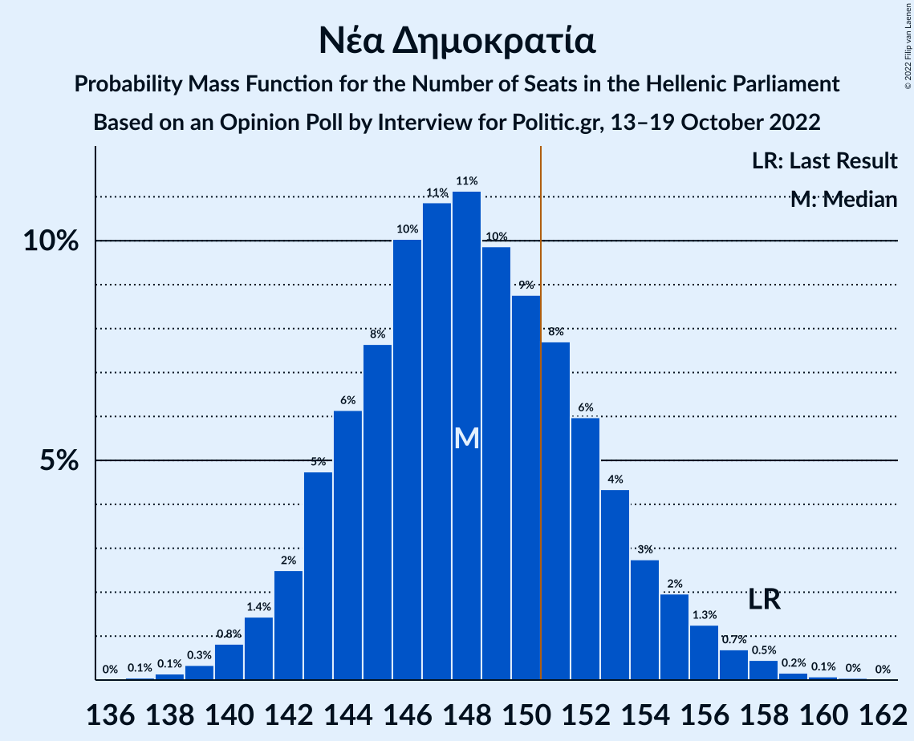

| Number of Seats | Probability | Accumulated | Special Marks |
|:---------------:|:-----------:|:-----------:|:-------------:|
| 137 | 0.1% | 100% |  |
| 138 | 0.1% | 99.9% |  |
| 139 | 0.3% | 99.8% |  |
| 140 | 0.8% | 99.4% |  |
| 141 | 1.4% | 98.6% |  |
| 142 | 2% | 97% |  |
| 143 | 5% | 95% |  |
| 144 | 6% | 90% |  |
| 145 | 8% | 84% |  |
| 146 | 10% | 76% |  |
| 147 | 11% | 66% |  |
| 148 | 11% | 55% | Median |
| 149 | 10% | 44% |  |
| 150 | 9% | 34% |  |
| 151 | 8% | 25% | Majority |
| 152 | 6% | 18% |  |
| 153 | 4% | 12% |  |
| 154 | 3% | 7% |  |
| 155 | 2% | 5% |  |
| 156 | 1.3% | 3% |  |
| 157 | 0.7% | 1.5% |  |
| 158 | 0.5% | 0.8% | Last Result |
| 159 | 0.2% | 0.3% |  |
| 160 | 0.1% | 0.1% |  |
| 161 | 0% | 0.1% |  |
| 162 | 0% | 0% |  |

### Συνασπισμός Ριζοσπαστικής Αριστεράς

*For a full overview of the results for this party, see the [Συνασπισμός Ριζοσπαστικής Αριστεράς](party-συνασπισμόςριζοσπαστικήςαριστεράς.html) page.*

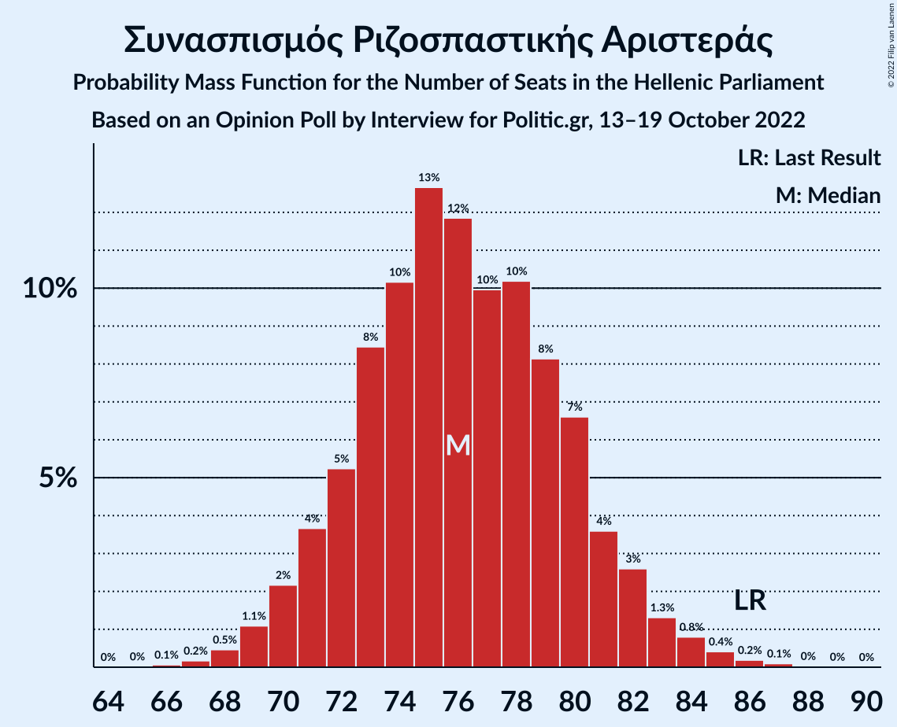

| Number of Seats | Probability | Accumulated | Special Marks |
|:---------------:|:-----------:|:-----------:|:-------------:|
| 66 | 0.1% | 100% |  |
| 67 | 0.2% | 99.9% |  |
| 68 | 0.5% | 99.7% |  |
| 69 | 1.1% | 99.3% |  |
| 70 | 2% | 98% |  |
| 71 | 4% | 96% |  |
| 72 | 5% | 92% |  |
| 73 | 8% | 87% |  |
| 74 | 10% | 79% |  |
| 75 | 13% | 68% |  |
| 76 | 12% | 56% | Median |
| 77 | 10% | 44% |  |
| 78 | 10% | 34% |  |
| 79 | 8% | 24% |  |
| 80 | 7% | 16% |  |
| 81 | 4% | 9% |  |
| 82 | 3% | 5% |  |
| 83 | 1.3% | 3% |  |
| 84 | 0.8% | 2% |  |
| 85 | 0.4% | 0.8% |  |
| 86 | 0.2% | 0.3% | Last Result |
| 87 | 0.1% | 0.1% |  |
| 88 | 0% | 0.1% |  |
| 89 | 0% | 0% |  |

### Κίνημα Αλλαγής

*For a full overview of the results for this party, see the [Κίνημα Αλλαγής](party-κίνημααλλαγής.html) page.*

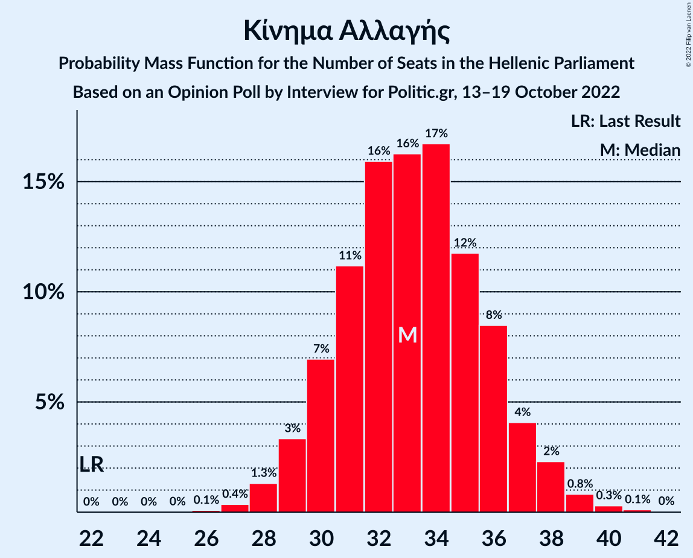

| Number of Seats | Probability | Accumulated | Special Marks |
|:---------------:|:-----------:|:-----------:|:-------------:|
| 22 | 0% | 100% | Last Result |
| 23 | 0% | 100% |  |
| 24 | 0% | 100% |  |
| 25 | 0% | 100% |  |
| 26 | 0.1% | 100% |  |
| 27 | 0.4% | 99.9% |  |
| 28 | 1.3% | 99.5% |  |
| 29 | 3% | 98% |  |
| 30 | 7% | 95% |  |
| 31 | 11% | 88% |  |
| 32 | 16% | 77% |  |
| 33 | 16% | 61% | Median |
| 34 | 17% | 45% |  |
| 35 | 12% | 28% |  |
| 36 | 8% | 16% |  |
| 37 | 4% | 8% |  |
| 38 | 2% | 4% |  |
| 39 | 0.8% | 1.3% |  |
| 40 | 0.3% | 0.4% |  |
| 41 | 0.1% | 0.1% |  |
| 42 | 0% | 0% |  |

### Κομμουνιστικό Κόμμα Ελλάδας

*For a full overview of the results for this party, see the [Κομμουνιστικό Κόμμα Ελλάδας](party-κομμουνιστικόκόμμαελλάδας.html) page.*

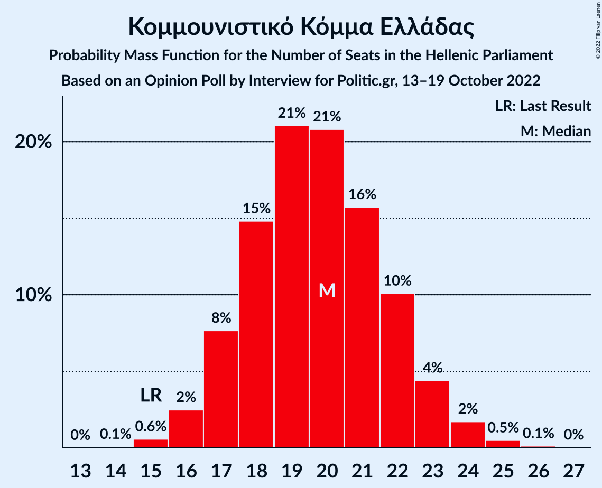

| Number of Seats | Probability | Accumulated | Special Marks |
|:---------------:|:-----------:|:-----------:|:-------------:|
| 14 | 0.1% | 100% |  |
| 15 | 0.6% | 99.9% | Last Result |
| 16 | 2% | 99.4% |  |
| 17 | 8% | 97% |  |
| 18 | 15% | 89% |  |
| 19 | 21% | 74% |  |
| 20 | 21% | 53% | Median |
| 21 | 16% | 33% |  |
| 22 | 10% | 17% |  |
| 23 | 4% | 7% |  |
| 24 | 2% | 2% |  |
| 25 | 0.5% | 0.6% |  |
| 26 | 0.1% | 0.2% |  |
| 27 | 0% | 0% |  |

### Ελληνική Λύση

*For a full overview of the results for this party, see the [Ελληνική Λύση](party-ελληνικήλύση.html) page.*

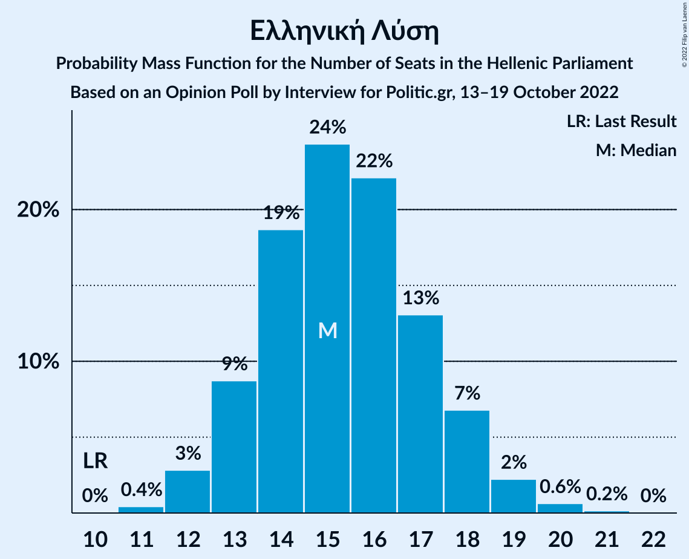

| Number of Seats | Probability | Accumulated | Special Marks |
|:---------------:|:-----------:|:-----------:|:-------------:|
| 10 | 0% | 100% | Last Result |
| 11 | 0.4% | 100% |  |
| 12 | 3% | 99.5% |  |
| 13 | 9% | 97% |  |
| 14 | 19% | 88% |  |
| 15 | 24% | 69% | Median |
| 16 | 22% | 45% |  |
| 17 | 13% | 23% |  |
| 18 | 7% | 10% |  |
| 19 | 2% | 3% |  |
| 20 | 0.6% | 0.8% |  |
| 21 | 0.2% | 0.2% |  |
| 22 | 0% | 0% |  |

### Μέτωπο Ευρωπαϊκής Ρεαλιστικής Ανυπακοής

*For a full overview of the results for this party, see the [Μέτωπο Ευρωπαϊκής Ρεαλιστικής Ανυπακοής](party-μέτωποευρωπαϊκήςρεαλιστικήςανυπακοής.html) page.*

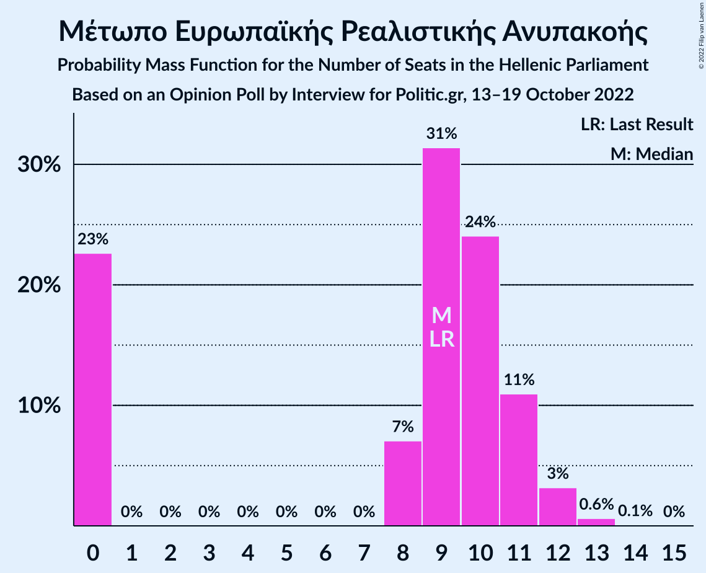

| Number of Seats | Probability | Accumulated | Special Marks |
|:---------------:|:-----------:|:-----------:|:-------------:|
| 0 | 23% | 100% |  |
| 1 | 0% | 77% |  |
| 2 | 0% | 77% |  |
| 3 | 0% | 77% |  |
| 4 | 0% | 77% |  |
| 5 | 0% | 77% |  |
| 6 | 0% | 77% |  |
| 7 | 0% | 77% |  |
| 8 | 7% | 77% |  |
| 9 | 31% | 70% | Last Result, Median |
| 10 | 24% | 39% |  |
| 11 | 11% | 15% |  |
| 12 | 3% | 4% |  |
| 13 | 0.6% | 0.7% |  |
| 14 | 0.1% | 0.1% |  |
| 15 | 0% | 0% |  |

## Coalitions

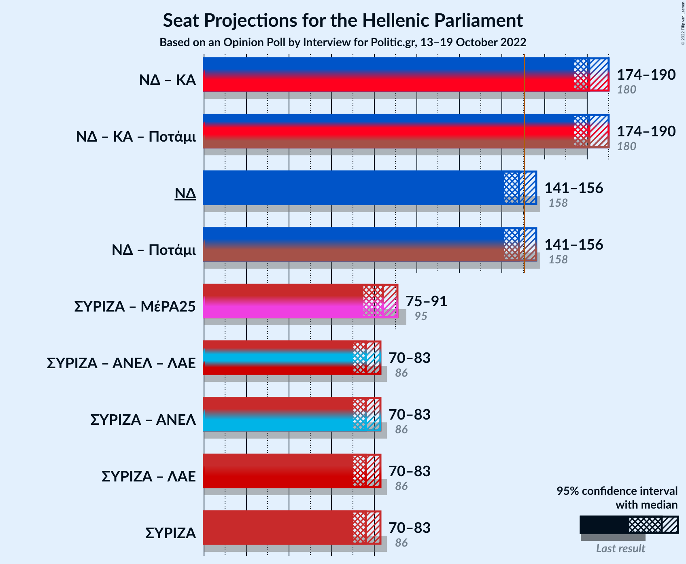

### Confidence Intervals

| Coalition | Last Result | Median | Majority? | 80% Confidence Interval | 90% Confidence Interval | 95% Confidence Interval | 99% Confidence Interval |
|:---------:|:-----------:|:------:|:---------:|:-----------------------:|:-----------------------:|:-----------------------:|:-----------------------:|
| Νέα Δημοκρατία – Κίνημα Αλλαγής | 180 | 181 | 100% | 176–187 | 175–188 | 174–190 | 172–192 |
| Νέα Δημοκρατία | 158 | 148 | 25% | 143–153 | 142–154 | 141–156 | 139–158 |
| Συνασπισμός Ριζοσπαστικής Αριστεράς – Μέτωπο Ευρωπαϊκής Ρεαλιστικής Ανυπακοής | 95 | 84 | 0% | 78–89 | 76–90 | 75–91 | 72–93 |
| Συνασπισμός Ριζοσπαστικής Αριστεράς | 86 | 76 | 0% | 72–80 | 71–82 | 70–83 | 68–85 |

### Νέα Δημοκρατία – Κίνημα Αλλαγής

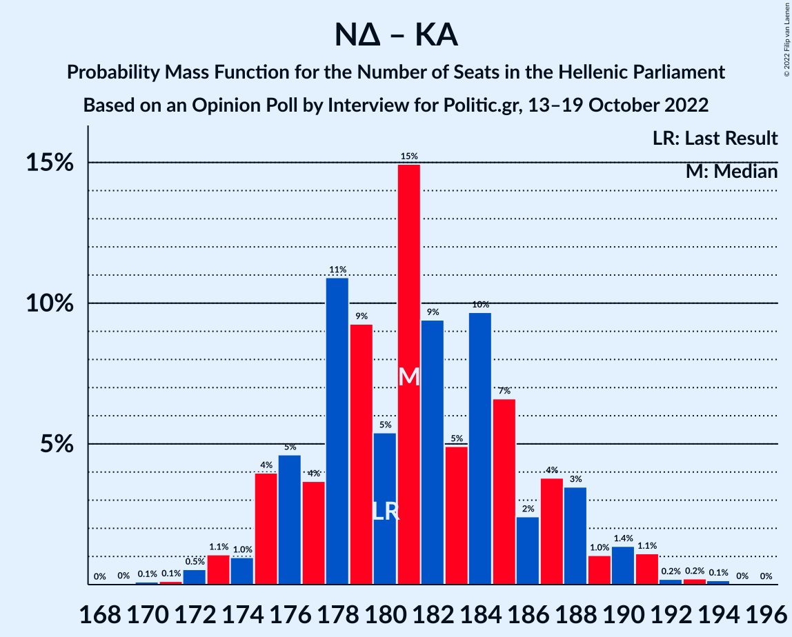

| Number of Seats | Probability | Accumulated | Special Marks |
|:---------------:|:-----------:|:-----------:|:-------------:|
| 169 | 0% | 100% |  |
| 170 | 0.1% | 99.9% |  |
| 171 | 0.1% | 99.8% |  |
| 172 | 0.5% | 99.7% |  |
| 173 | 1.1% | 99.2% |  |
| 174 | 1.0% | 98% |  |
| 175 | 4% | 97% |  |
| 176 | 5% | 93% |  |
| 177 | 4% | 89% |  |
| 178 | 11% | 85% |  |
| 179 | 9% | 74% |  |
| 180 | 5% | 65% | Last Result |
| 181 | 15% | 59% | Median |
| 182 | 9% | 44% |  |
| 183 | 5% | 35% |  |
| 184 | 10% | 30% |  |
| 185 | 7% | 20% |  |
| 186 | 2% | 14% |  |
| 187 | 4% | 11% |  |
| 188 | 3% | 8% |  |
| 189 | 1.0% | 4% |  |
| 190 | 1.4% | 3% |  |
| 191 | 1.1% | 2% |  |
| 192 | 0.2% | 0.6% |  |
| 193 | 0.2% | 0.4% |  |
| 194 | 0.1% | 0.2% |  |
| 195 | 0% | 0.1% |  |
| 196 | 0% | 0% |  |

### Νέα Δημοκρατία

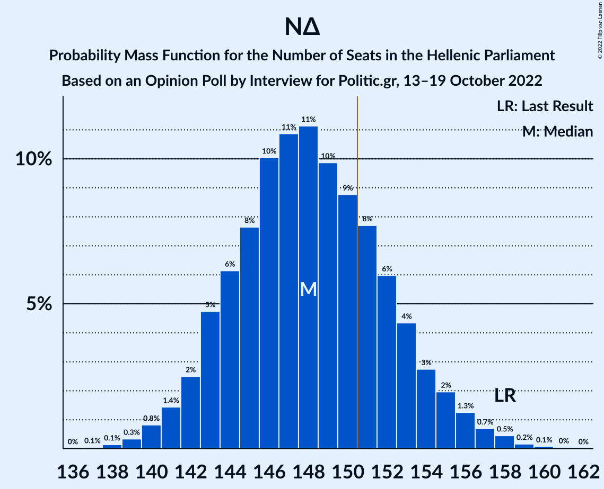

| Number of Seats | Probability | Accumulated | Special Marks |
|:---------------:|:-----------:|:-----------:|:-------------:|
| 137 | 0.1% | 100% |  |
| 138 | 0.1% | 99.9% |  |
| 139 | 0.3% | 99.8% |  |
| 140 | 0.8% | 99.4% |  |
| 141 | 1.4% | 98.6% |  |
| 142 | 2% | 97% |  |
| 143 | 5% | 95% |  |
| 144 | 6% | 90% |  |
| 145 | 8% | 84% |  |
| 146 | 10% | 76% |  |
| 147 | 11% | 66% |  |
| 148 | 11% | 55% | Median |
| 149 | 10% | 44% |  |
| 150 | 9% | 34% |  |
| 151 | 8% | 25% | Majority |
| 152 | 6% | 18% |  |
| 153 | 4% | 12% |  |
| 154 | 3% | 7% |  |
| 155 | 2% | 5% |  |
| 156 | 1.3% | 3% |  |
| 157 | 0.7% | 1.5% |  |
| 158 | 0.5% | 0.8% | Last Result |
| 159 | 0.2% | 0.3% |  |
| 160 | 0.1% | 0.1% |  |
| 161 | 0% | 0.1% |  |
| 162 | 0% | 0% |  |

### Συνασπισμός Ριζοσπαστικής Αριστεράς – Μέτωπο Ευρωπαϊκής Ρεαλιστικής Ανυπακοής

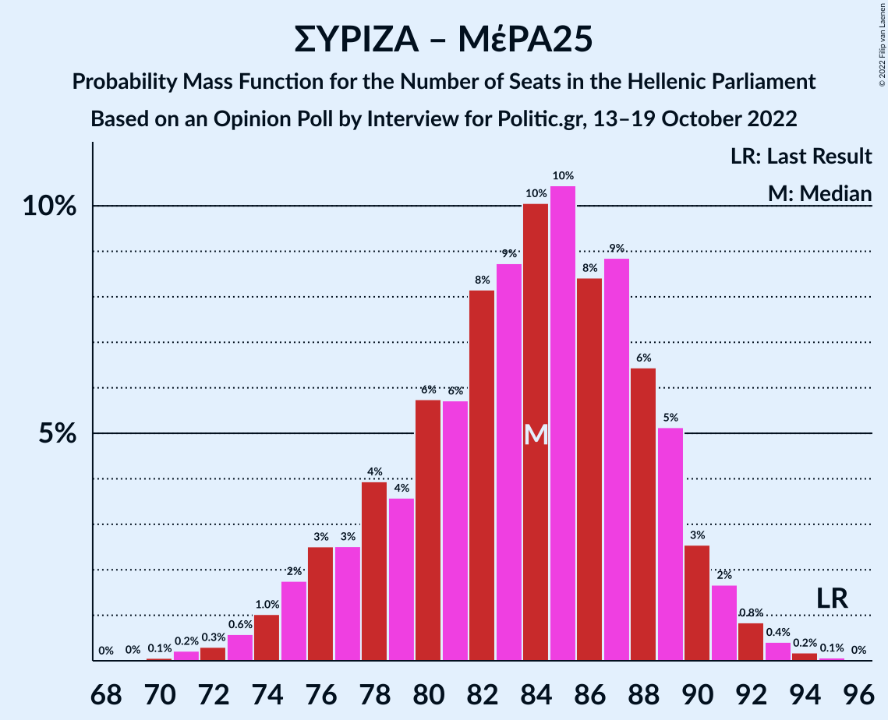

| Number of Seats | Probability | Accumulated | Special Marks |
|:---------------:|:-----------:|:-----------:|:-------------:|
| 70 | 0.1% | 100% |  |
| 71 | 0.2% | 99.9% |  |
| 72 | 0.3% | 99.7% |  |
| 73 | 0.6% | 99.4% |  |
| 74 | 1.0% | 98.8% |  |
| 75 | 2% | 98% |  |
| 76 | 3% | 96% |  |
| 77 | 3% | 94% |  |
| 78 | 4% | 91% |  |
| 79 | 4% | 87% |  |
| 80 | 6% | 83% |  |
| 81 | 6% | 78% |  |
| 82 | 8% | 72% |  |
| 83 | 9% | 64% |  |
| 84 | 10% | 55% |  |
| 85 | 10% | 45% | Median |
| 86 | 8% | 35% |  |
| 87 | 9% | 26% |  |
| 88 | 6% | 17% |  |
| 89 | 5% | 11% |  |
| 90 | 3% | 6% |  |
| 91 | 2% | 3% |  |
| 92 | 0.8% | 2% |  |
| 93 | 0.4% | 0.7% |  |
| 94 | 0.2% | 0.3% |  |
| 95 | 0.1% | 0.1% | Last Result |
| 96 | 0% | 0% |  |

### Συνασπισμός Ριζοσπαστικής Αριστεράς

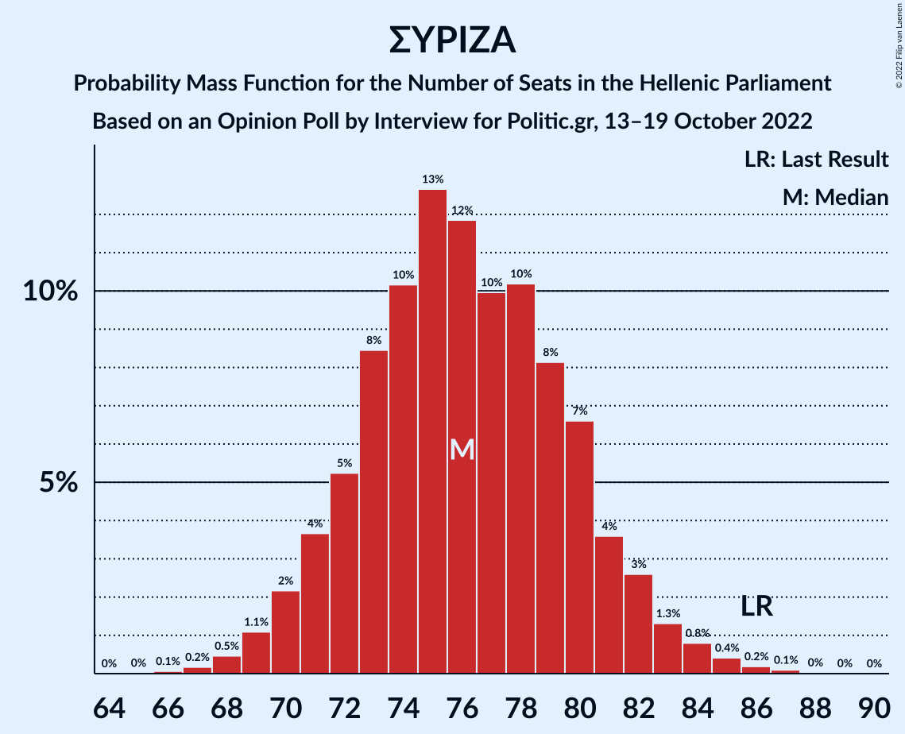

| Number of Seats | Probability | Accumulated | Special Marks |
|:---------------:|:-----------:|:-----------:|:-------------:|
| 66 | 0.1% | 100% |  |
| 67 | 0.2% | 99.9% |  |
| 68 | 0.5% | 99.7% |  |
| 69 | 1.1% | 99.3% |  |
| 70 | 2% | 98% |  |
| 71 | 4% | 96% |  |
| 72 | 5% | 92% |  |
| 73 | 8% | 87% |  |
| 74 | 10% | 79% |  |
| 75 | 13% | 68% |  |
| 76 | 12% | 56% | Median |
| 77 | 10% | 44% |  |
| 78 | 10% | 34% |  |
| 79 | 8% | 24% |  |
| 80 | 7% | 16% |  |
| 81 | 4% | 9% |  |
| 82 | 3% | 5% |  |
| 83 | 1.3% | 3% |  |
| 84 | 0.8% | 2% |  |
| 85 | 0.4% | 0.8% |  |
| 86 | 0.2% | 0.3% | Last Result |
| 87 | 0.1% | 0.1% |  |
| 88 | 0% | 0.1% |  |
| 89 | 0% | 0% |  |

## Technical Information

### Opinion Poll

+ **Polling firm:** Interview
+ **Commissioner(s):** Politic.gr
+ **Fieldwork period:** 13–19 October 2022

### Calculations

+ **Sample size:** 1575
+ **Simulations done:** 1,048,576
+ **Error estimate:** 0.40%

