# Opinion Poll by Marc for ANT1, 18–22 October 2022

<a href="#voting-intentions">Voting Intentions</a> | <a href="#seats">Seats</a> | <a href="#coalitions">Coalitions</a> | <a href="#technical-information">Technical Information</a>

## Voting Intentions

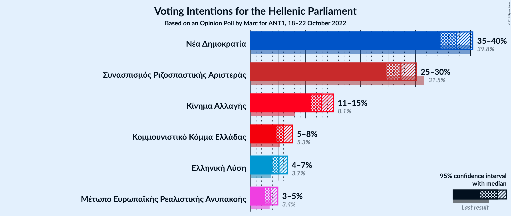

### Confidence Intervals

| Party | Last Result | Poll Result | 80% Confidence Interval | 90% Confidence Interval | 95% Confidence Interval | 99% Confidence Interval |
|:-----:|:-----------:|:-----------:|:-----------------------:|:-----------------------:|:-----------------------:|:-----------------------:|
| Νέα Δημοκρατία | 39.8% | 37.4% | 35.5–39.4% |35.0–39.9% |34.5–40.4% |33.7–41.4% |
| Συνασπισμός Ριζοσπαστικής Αριστεράς | 31.5% | 27.3% | 25.6–29.2% |25.1–29.7% |24.7–30.1% |23.9–31.0% |
| Κίνημα Αλλαγής | 8.1% | 12.9% | 11.6–14.3% |11.3–14.7% |11.0–15.0% |10.4–15.7% |
| Κομμουνιστικό Κόμμα Ελλάδας | 5.3% | 6.0% | 5.2–7.1% |4.9–7.3% |4.7–7.6% |4.3–8.1% |
| Ελληνική Λύση | 3.7% | 5.1% | 4.4–6.1% |4.1–6.4% |4.0–6.7% |3.6–7.2% |
| Μέτωπο Ευρωπαϊκής Ρεαλιστικής Ανυπακοής | 3.4% | 3.6% | 3.0–4.5% |2.8–4.7% |2.6–4.9% |2.4–5.4% |

*Note:* The poll result column reflects the actual value used in the calculations. Published results may vary slightly, and in addition be rounded to fewer digits.

## Seats

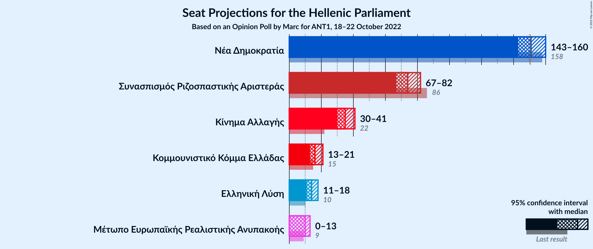

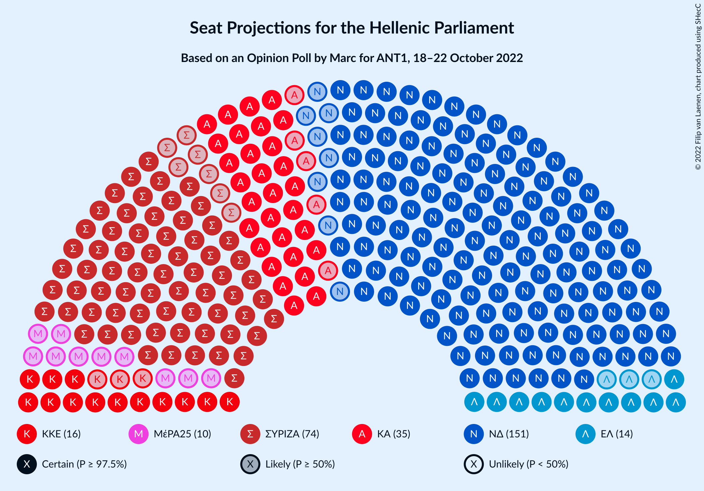

### Confidence Intervals

| Party | Last Result | Median | 80% Confidence Interval | 90% Confidence Interval | 95% Confidence Interval | 99% Confidence Interval |
|:-----:|:-----------:|:------:|:-----------------------:|:-----------------------:|:-----------------------:|:-----------------------:|
| <a href="#νέα-δημοκρατία">Νέα Δημοκρατία</a> | 158 | 151 | 146–157 |145–158 |143–160 |141–162 |
| <a href="#συνασπισμός-ριζοσπαστικής-αριστεράς">Συνασπισμός Ριζοσπαστικής Αριστεράς</a> | 86 | 74 | 69–79 |68–80 |67–82 |64–84 |
| <a href="#κίνημα-αλλαγής">Κίνημα Αλλαγής</a> | 22 | 35 | 31–39 |30–40 |30–41 |28–43 |
| <a href="#κομμουνιστικό-κόμμα-ελλάδας">Κομμουνιστικό Κόμμα Ελλάδας</a> | 15 | 16 | 14–19 |13–20 |13–21 |12–22 |
| <a href="#ελληνική-λύση">Ελληνική Λύση</a> | 10 | 14 | 12–17 |11–17 |11–18 |10–19 |
| <a href="#μέτωπο-ευρωπαϊκής-ρεαλιστικής-ανυπακοής">Μέτωπο Ευρωπαϊκής Ρεαλιστικής Ανυπακοής</a> | 9 | 10 | 0–12 |0–13 |0–13 |0–14 |

### Νέα Δημοκρατία

*For a full overview of the results for this party, see the [Νέα Δημοκρατία](party-νέαδημοκρατία.html) page.*

| Number of Seats | Probability | Accumulated | Special Marks |
|:---------------:|:-----------:|:-----------:|:-------------:|
| 138 | 0% | 100% |  |
| 139 | 0.1% | 99.9% |  |
| 140 | 0.2% | 99.8% |  |
| 141 | 0.4% | 99.6% |  |
| 142 | 0.7% | 99.2% |  |
| 143 | 1.3% | 98% |  |
| 144 | 2% | 97% |  |
| 145 | 3% | 95% |  |
| 146 | 4% | 92% |  |
| 147 | 6% | 88% |  |
| 148 | 8% | 82% |  |
| 149 | 8% | 74% |  |
| 150 | 10% | 66% |  |
| 151 | 10% | 56% | Median, Majority |
| 152 | 9% | 46% |  |
| 153 | 9% | 37% |  |
| 154 | 7% | 28% |  |
| 155 | 6% | 21% |  |
| 156 | 5% | 16% |  |
| 157 | 3% | 11% |  |
| 158 | 3% | 8% | Last Result |
| 159 | 2% | 5% |  |
| 160 | 1.1% | 3% |  |
| 161 | 0.9% | 2% |  |
| 162 | 0.4% | 0.8% |  |
| 163 | 0.2% | 0.4% |  |
| 164 | 0.1% | 0.2% |  |
| 165 | 0% | 0.1% |  |
| 166 | 0% | 0.1% |  |
| 167 | 0% | 0% |  |

### Συνασπισμός Ριζοσπαστικής Αριστεράς

*For a full overview of the results for this party, see the [Συνασπισμός Ριζοσπαστικής Αριστεράς](party-συνασπισμόςριζοσπαστικήςαριστεράς.html) page.*

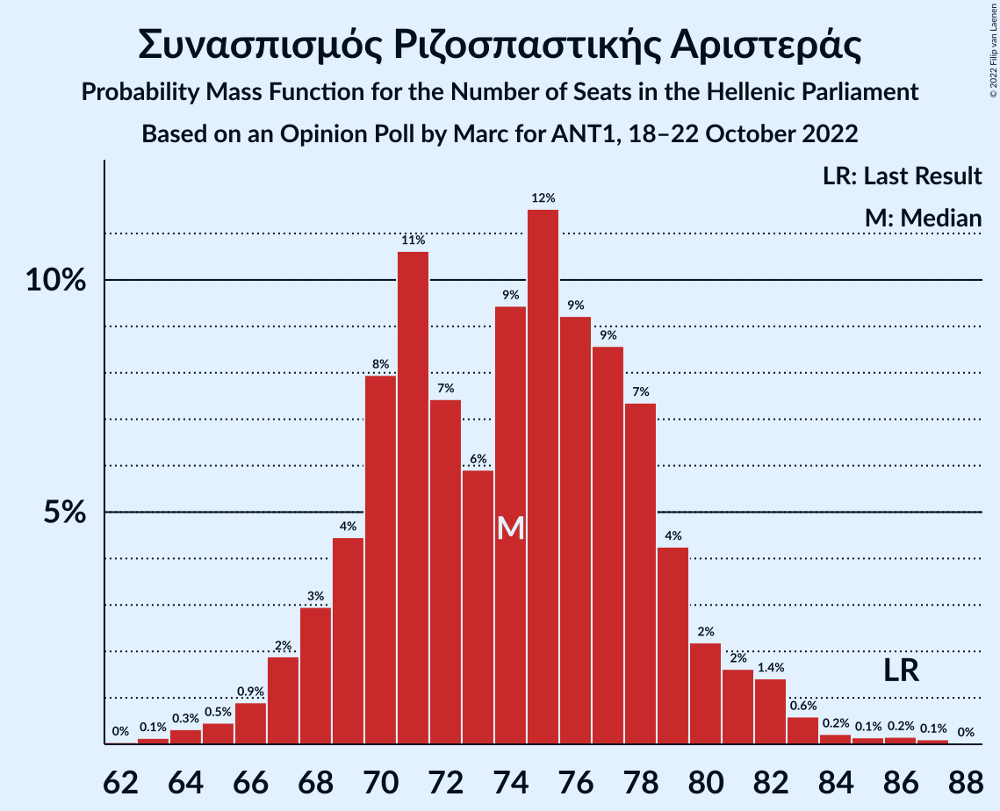

| Number of Seats | Probability | Accumulated | Special Marks |
|:---------------:|:-----------:|:-----------:|:-------------:|
| 62 | 0% | 100% |  |
| 63 | 0.1% | 99.9% |  |
| 64 | 0.3% | 99.8% |  |
| 65 | 0.5% | 99.5% |  |
| 66 | 0.9% | 99.0% |  |
| 67 | 2% | 98% |  |
| 68 | 3% | 96% |  |
| 69 | 4% | 93% |  |
| 70 | 8% | 89% |  |
| 71 | 11% | 81% |  |
| 72 | 7% | 70% |  |
| 73 | 6% | 63% |  |
| 74 | 9% | 57% | Median |
| 75 | 12% | 47% |  |
| 76 | 9% | 36% |  |
| 77 | 9% | 27% |  |
| 78 | 7% | 18% |  |
| 79 | 4% | 11% |  |
| 80 | 2% | 6% |  |
| 81 | 2% | 4% |  |
| 82 | 1.4% | 3% |  |
| 83 | 0.6% | 1.3% |  |
| 84 | 0.2% | 0.7% |  |
| 85 | 0.1% | 0.5% |  |
| 86 | 0.2% | 0.3% | Last Result |
| 87 | 0.1% | 0.1% |  |
| 88 | 0% | 0% |  |

### Κίνημα Αλλαγής

*For a full overview of the results for this party, see the [Κίνημα Αλλαγής](party-κίνημααλλαγής.html) page.*

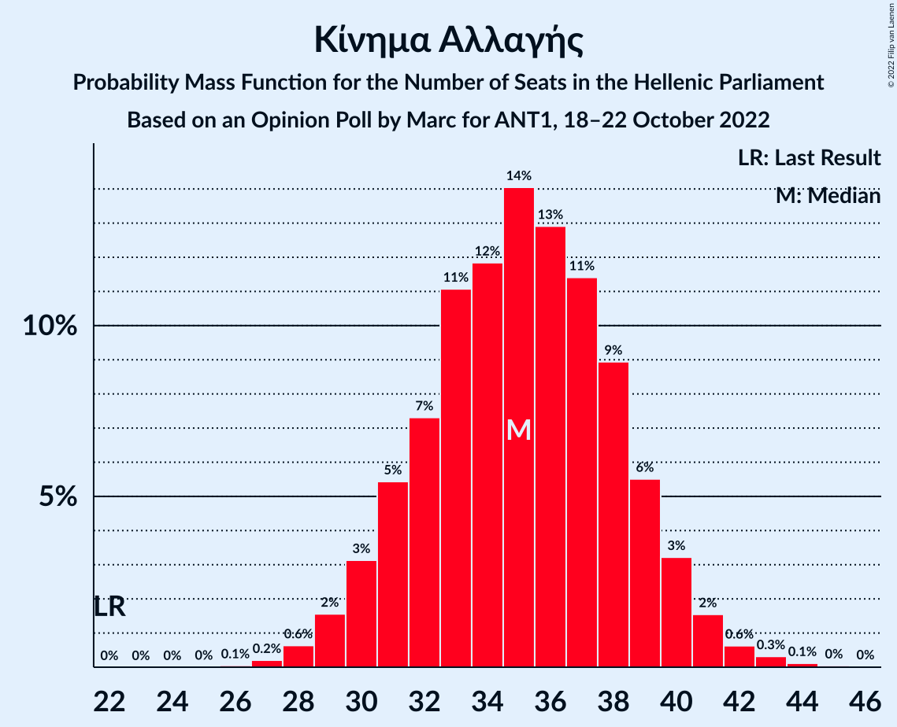

| Number of Seats | Probability | Accumulated | Special Marks |
|:---------------:|:-----------:|:-----------:|:-------------:|
| 22 | 0% | 100% | Last Result |
| 23 | 0% | 100% |  |
| 24 | 0% | 100% |  |
| 25 | 0% | 100% |  |
| 26 | 0.1% | 100% |  |
| 27 | 0.2% | 99.9% |  |
| 28 | 0.6% | 99.7% |  |
| 29 | 2% | 99.1% |  |
| 30 | 3% | 98% |  |
| 31 | 5% | 94% |  |
| 32 | 7% | 89% |  |
| 33 | 11% | 82% |  |
| 34 | 12% | 71% |  |
| 35 | 14% | 59% | Median |
| 36 | 13% | 45% |  |
| 37 | 11% | 32% |  |
| 38 | 9% | 20% |  |
| 39 | 6% | 11% |  |
| 40 | 3% | 6% |  |
| 41 | 2% | 3% |  |
| 42 | 0.6% | 1.1% |  |
| 43 | 0.3% | 0.5% |  |
| 44 | 0.1% | 0.2% |  |
| 45 | 0% | 0.1% |  |
| 46 | 0% | 0% |  |

### Κομμουνιστικό Κόμμα Ελλάδας

*For a full overview of the results for this party, see the [Κομμουνιστικό Κόμμα Ελλάδας](party-κομμουνιστικόκόμμαελλάδας.html) page.*

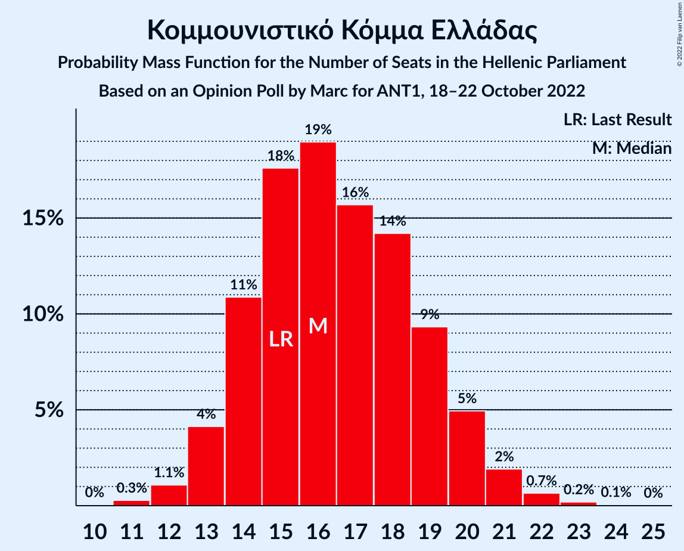

| Number of Seats | Probability | Accumulated | Special Marks |
|:---------------:|:-----------:|:-----------:|:-------------:|
| 11 | 0.3% | 100% |  |
| 12 | 1.1% | 99.7% |  |
| 13 | 4% | 98.6% |  |
| 14 | 11% | 94% |  |
| 15 | 18% | 84% | Last Result |
| 16 | 19% | 66% | Median |
| 17 | 16% | 47% |  |
| 18 | 14% | 31% |  |
| 19 | 9% | 17% |  |
| 20 | 5% | 8% |  |
| 21 | 2% | 3% |  |
| 22 | 0.7% | 0.9% |  |
| 23 | 0.2% | 0.3% |  |
| 24 | 0.1% | 0.1% |  |
| 25 | 0% | 0% |  |

### Ελληνική Λύση

*For a full overview of the results for this party, see the [Ελληνική Λύση](party-ελληνικήλύση.html) page.*

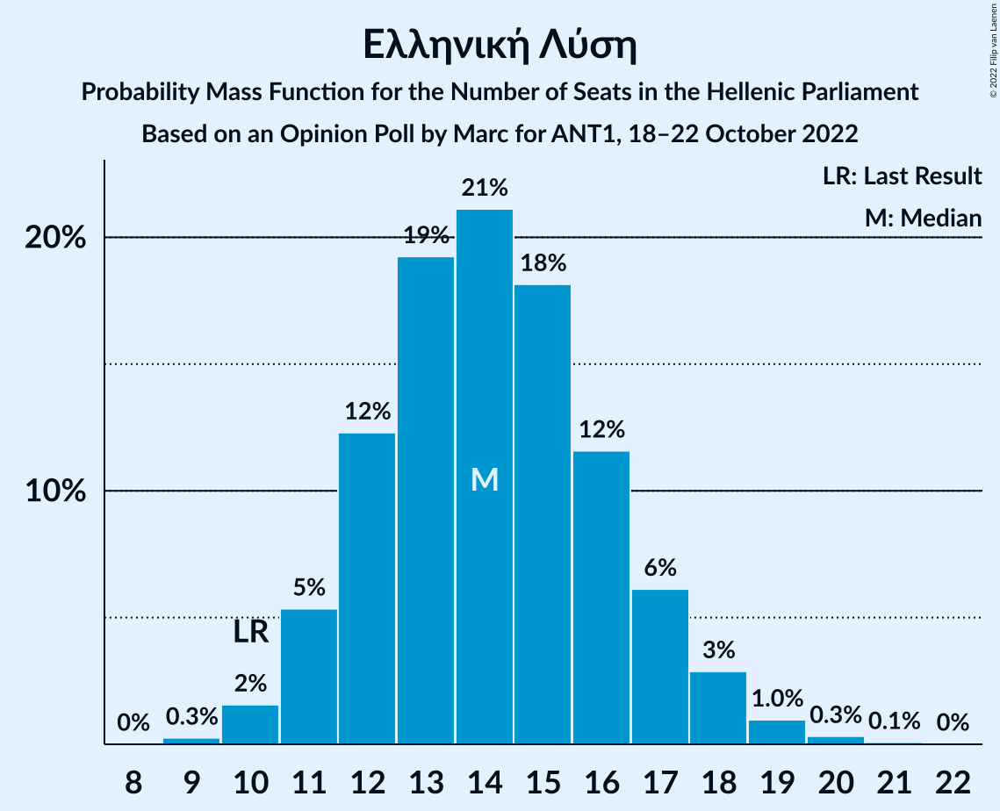

| Number of Seats | Probability | Accumulated | Special Marks |
|:---------------:|:-----------:|:-----------:|:-------------:|
| 9 | 0.3% | 100% |  |
| 10 | 2% | 99.7% | Last Result |
| 11 | 5% | 98% |  |
| 12 | 12% | 93% |  |
| 13 | 19% | 81% |  |
| 14 | 21% | 61% | Median |
| 15 | 18% | 40% |  |
| 16 | 12% | 22% |  |
| 17 | 6% | 10% |  |
| 18 | 3% | 4% |  |
| 19 | 1.0% | 1.4% |  |
| 20 | 0.3% | 0.4% |  |
| 21 | 0.1% | 0.1% |  |
| 22 | 0% | 0% |  |

### Μέτωπο Ευρωπαϊκής Ρεαλιστικής Ανυπακοής

*For a full overview of the results for this party, see the [Μέτωπο Ευρωπαϊκής Ρεαλιστικής Ανυπακοής](party-μέτωποευρωπαϊκήςρεαλιστικήςανυπακοής.html) page.*

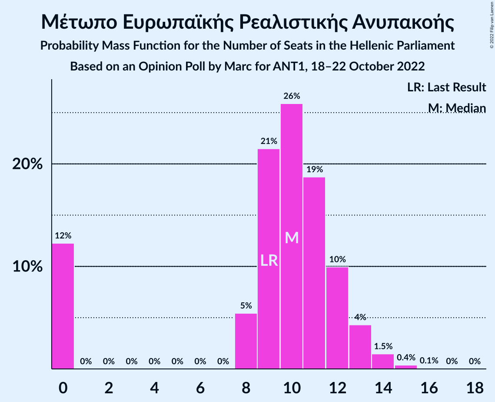

| Number of Seats | Probability | Accumulated | Special Marks |
|:---------------:|:-----------:|:-----------:|:-------------:|
| 0 | 12% | 100% |  |
| 1 | 0% | 88% |  |
| 2 | 0% | 88% |  |
| 3 | 0% | 88% |  |
| 4 | 0% | 88% |  |
| 5 | 0% | 88% |  |
| 6 | 0% | 88% |  |
| 7 | 0% | 88% |  |
| 8 | 5% | 88% |  |
| 9 | 21% | 82% | Last Result |
| 10 | 26% | 61% | Median |
| 11 | 19% | 35% |  |
| 12 | 10% | 16% |  |
| 13 | 4% | 6% |  |
| 14 | 1.5% | 2% |  |
| 15 | 0.4% | 0.5% |  |
| 16 | 0.1% | 0.1% |  |
| 17 | 0% | 0% |  |

## Coalitions

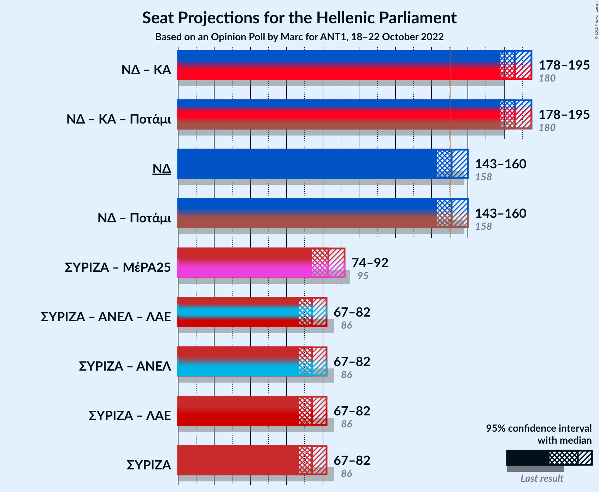

### Confidence Intervals

| Coalition | Last Result | Median | Majority? | 80% Confidence Interval | 90% Confidence Interval | 95% Confidence Interval | 99% Confidence Interval |
|:---------:|:-----------:|:------:|:---------:|:-----------------------:|:-----------------------:|:-----------------------:|:-----------------------:|
| Νέα Δημοκρατία – Κίνημα Αλλαγής | 180 | 186 | 100% | 181–192 | 179–194 | 178–195 | 176–198 |
| Νέα Δημοκρατία | 158 | 151 | 56% | 146–157 | 145–158 | 143–160 | 141–162 |
| Συνασπισμός Ριζοσπαστικής Αριστεράς – Μέτωπο Ευρωπαϊκής Ρεαλιστικής Ανυπακοής | 95 | 83 | 0% | 77–88 | 75–90 | 74–92 | 71–94 |
| Συνασπισμός Ριζοσπαστικής Αριστεράς | 86 | 74 | 0% | 69–79 | 68–80 | 67–82 | 64–84 |

### Νέα Δημοκρατία – Κίνημα Αλλαγής

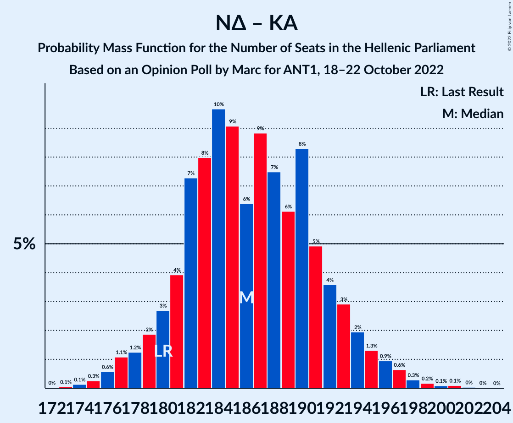

| Number of Seats | Probability | Accumulated | Special Marks |
|:---------------:|:-----------:|:-----------:|:-------------:|
| 173 | 0.1% | 100% |  |
| 174 | 0.1% | 99.9% |  |
| 175 | 0.3% | 99.8% |  |
| 176 | 0.6% | 99.5% |  |
| 177 | 1.1% | 98.9% |  |
| 178 | 1.2% | 98% |  |
| 179 | 2% | 97% |  |
| 180 | 3% | 95% | Last Result |
| 181 | 4% | 92% |  |
| 182 | 7% | 88% |  |
| 183 | 8% | 81% |  |
| 184 | 10% | 73% |  |
| 185 | 9% | 63% |  |
| 186 | 6% | 54% | Median |
| 187 | 9% | 48% |  |
| 188 | 7% | 39% |  |
| 189 | 6% | 31% |  |
| 190 | 8% | 25% |  |
| 191 | 5% | 17% |  |
| 192 | 4% | 12% |  |
| 193 | 3% | 8% |  |
| 194 | 2% | 6% |  |
| 195 | 1.3% | 4% |  |
| 196 | 0.9% | 2% |  |
| 197 | 0.6% | 1.4% |  |
| 198 | 0.3% | 0.7% |  |
| 199 | 0.2% | 0.4% |  |
| 200 | 0.1% | 0.3% |  |
| 201 | 0.1% | 0.2% |  |
| 202 | 0% | 0.1% |  |
| 203 | 0% | 0% |  |

### Νέα Δημοκρατία

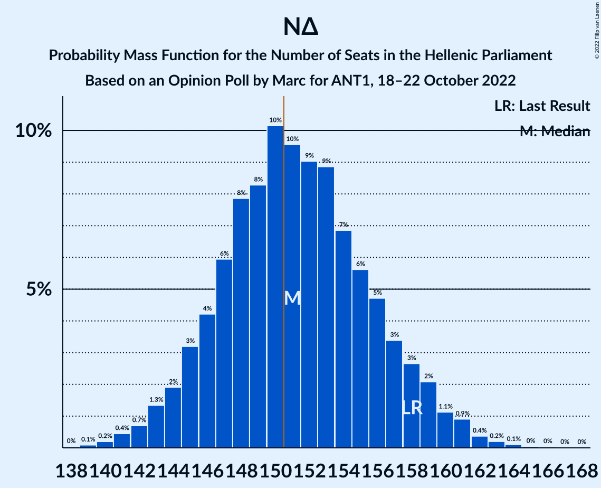

| Number of Seats | Probability | Accumulated | Special Marks |
|:---------------:|:-----------:|:-----------:|:-------------:|
| 138 | 0% | 100% |  |
| 139 | 0.1% | 99.9% |  |
| 140 | 0.2% | 99.8% |  |
| 141 | 0.4% | 99.6% |  |
| 142 | 0.7% | 99.2% |  |
| 143 | 1.3% | 98% |  |
| 144 | 2% | 97% |  |
| 145 | 3% | 95% |  |
| 146 | 4% | 92% |  |
| 147 | 6% | 88% |  |
| 148 | 8% | 82% |  |
| 149 | 8% | 74% |  |
| 150 | 10% | 66% |  |
| 151 | 10% | 56% | Median, Majority |
| 152 | 9% | 46% |  |
| 153 | 9% | 37% |  |
| 154 | 7% | 28% |  |
| 155 | 6% | 21% |  |
| 156 | 5% | 16% |  |
| 157 | 3% | 11% |  |
| 158 | 3% | 8% | Last Result |
| 159 | 2% | 5% |  |
| 160 | 1.1% | 3% |  |
| 161 | 0.9% | 2% |  |
| 162 | 0.4% | 0.8% |  |
| 163 | 0.2% | 0.4% |  |
| 164 | 0.1% | 0.2% |  |
| 165 | 0% | 0.1% |  |
| 166 | 0% | 0.1% |  |
| 167 | 0% | 0% |  |

### Συνασπισμός Ριζοσπαστικής Αριστεράς – Μέτωπο Ευρωπαϊκής Ρεαλιστικής Ανυπακοής

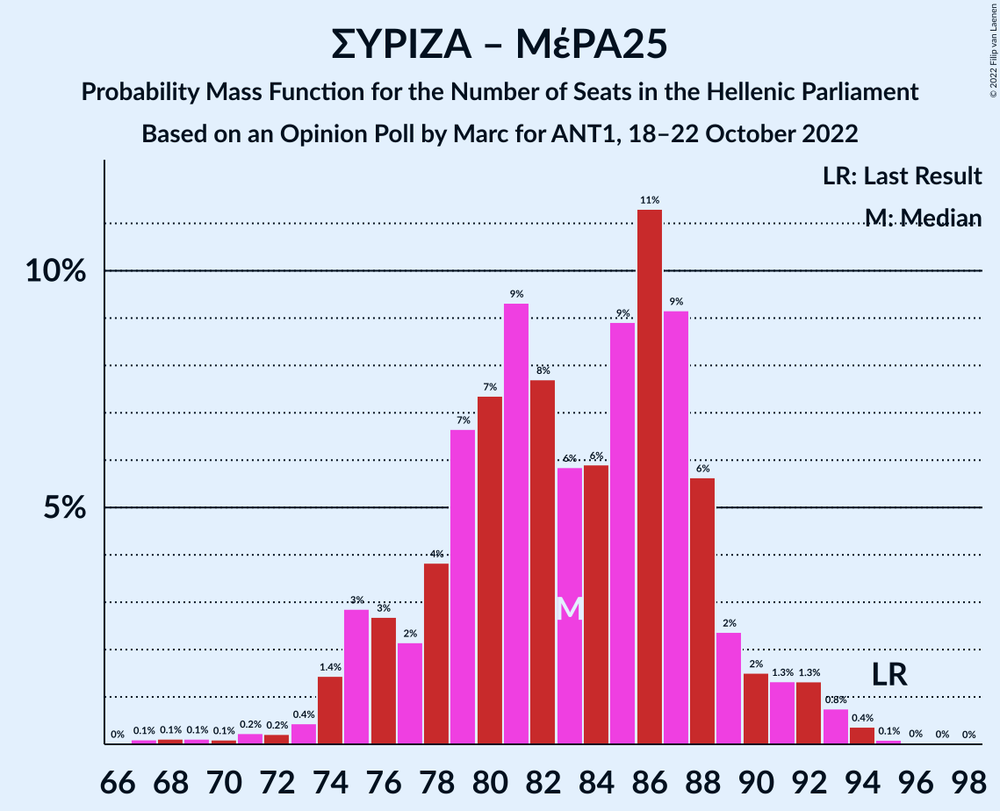

| Number of Seats | Probability | Accumulated | Special Marks |
|:---------------:|:-----------:|:-----------:|:-------------:|
| 67 | 0.1% | 100% |  |
| 68 | 0.1% | 99.9% |  |
| 69 | 0.1% | 99.7% |  |
| 70 | 0.1% | 99.6% |  |
| 71 | 0.2% | 99.5% |  |
| 72 | 0.2% | 99.3% |  |
| 73 | 0.4% | 99.1% |  |
| 74 | 1.4% | 98.6% |  |
| 75 | 3% | 97% |  |
| 76 | 3% | 94% |  |
| 77 | 2% | 92% |  |
| 78 | 4% | 89% |  |
| 79 | 7% | 86% |  |
| 80 | 7% | 79% |  |
| 81 | 9% | 72% |  |
| 82 | 8% | 62% |  |
| 83 | 6% | 55% |  |
| 84 | 6% | 49% | Median |
| 85 | 9% | 43% |  |
| 86 | 11% | 34% |  |
| 87 | 9% | 23% |  |
| 88 | 6% | 13% |  |
| 89 | 2% | 8% |  |
| 90 | 2% | 5% |  |
| 91 | 1.3% | 4% |  |
| 92 | 1.3% | 3% |  |
| 93 | 0.8% | 1.3% |  |
| 94 | 0.4% | 0.6% |  |
| 95 | 0.1% | 0.2% | Last Result |
| 96 | 0% | 0.1% |  |
| 97 | 0% | 0.1% |  |
| 98 | 0% | 0% |  |

### Συνασπισμός Ριζοσπαστικής Αριστεράς

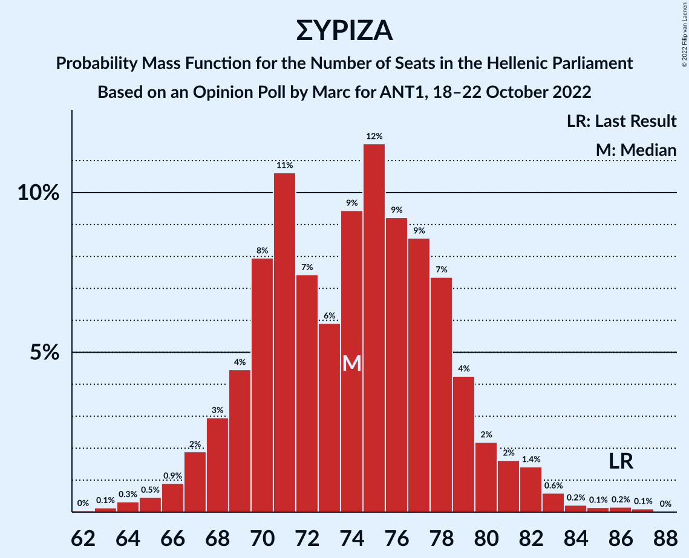

| Number of Seats | Probability | Accumulated | Special Marks |
|:---------------:|:-----------:|:-----------:|:-------------:|
| 62 | 0% | 100% |  |
| 63 | 0.1% | 99.9% |  |
| 64 | 0.3% | 99.8% |  |
| 65 | 0.5% | 99.5% |  |
| 66 | 0.9% | 99.0% |  |
| 67 | 2% | 98% |  |
| 68 | 3% | 96% |  |
| 69 | 4% | 93% |  |
| 70 | 8% | 89% |  |
| 71 | 11% | 81% |  |
| 72 | 7% | 70% |  |
| 73 | 6% | 63% |  |
| 74 | 9% | 57% | Median |
| 75 | 12% | 47% |  |
| 76 | 9% | 36% |  |
| 77 | 9% | 27% |  |
| 78 | 7% | 18% |  |
| 79 | 4% | 11% |  |
| 80 | 2% | 6% |  |
| 81 | 2% | 4% |  |
| 82 | 1.4% | 3% |  |
| 83 | 0.6% | 1.3% |  |
| 84 | 0.2% | 0.7% |  |
| 85 | 0.1% | 0.5% |  |
| 86 | 0.2% | 0.3% | Last Result |
| 87 | 0.1% | 0.1% |  |
| 88 | 0% | 0% |  |

## Technical Information

### Opinion Poll

+ **Polling firm:** Marc
+ **Commissioner(s):** ANT1
+ **Fieldwork period:** 18–22 October 2022

### Calculations

+ **Sample size:** 1050
+ **Simulations done:** 1,048,576
+ **Error estimate:** 1.13%

