# Opinion Poll by Metron Analysis for Mega TV, 16–22 November 2022

<a href="#voting-intentions">Voting Intentions</a> | <a href="#seats">Seats</a> | <a href="#coalitions">Coalitions</a> | <a href="#technical-information">Technical Information</a>

## Voting Intentions

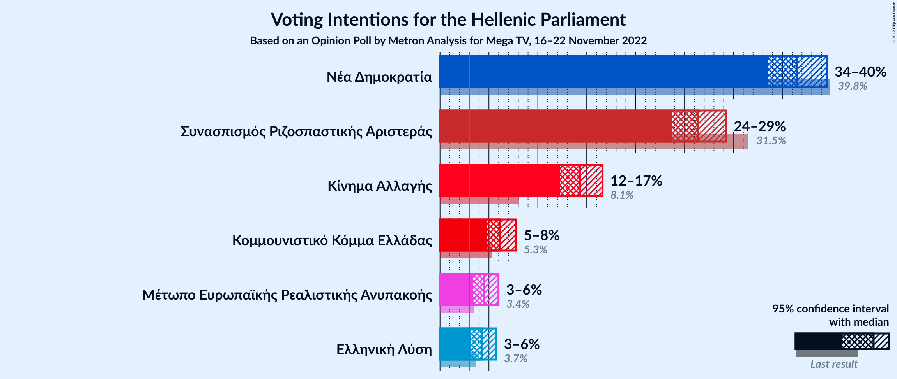

### Confidence Intervals

| Party | Last Result | Poll Result | 80% Confidence Interval | 90% Confidence Interval | 95% Confidence Interval | 99% Confidence Interval |
|:-----:|:-----------:|:-----------:|:-----------------------:|:-----------------------:|:-----------------------:|:-----------------------:|
| Νέα Δημοκρατία | 39.8% | 36.5% | 34.6–38.5% |34.0–39.0% |33.6–39.5% |32.7–40.5% |
| Συνασπισμός Ριζοσπαστικής Αριστεράς | 31.5% | 26.4% | 24.7–28.2% |24.2–28.8% |23.8–29.2% |22.9–30.1% |
| Κίνημα Αλλαγής | 8.1% | 14.3% | 13.0–15.8% |12.6–16.2% |12.3–16.6% |11.6–17.4% |
| Κομμουνιστικό Κόμμα Ελλάδας | 5.3% | 6.1% | 5.2–7.2% |5.0–7.5% |4.8–7.8% |4.4–8.3% |
| Μέτωπο Ευρωπαϊκής Ρεαλιστικής Ανυπακοής | 3.4% | 4.5% | 3.8–5.5% |3.6–5.7% |3.4–6.0% |3.0–6.5% |
| Ελληνική Λύση | 3.7% | 4.3% | 3.6–5.2% |3.4–5.5% |3.2–5.7% |2.9–6.2% |

*Note:* The poll result column reflects the actual value used in the calculations. Published results may vary slightly, and in addition be rounded to fewer digits.

## Seats

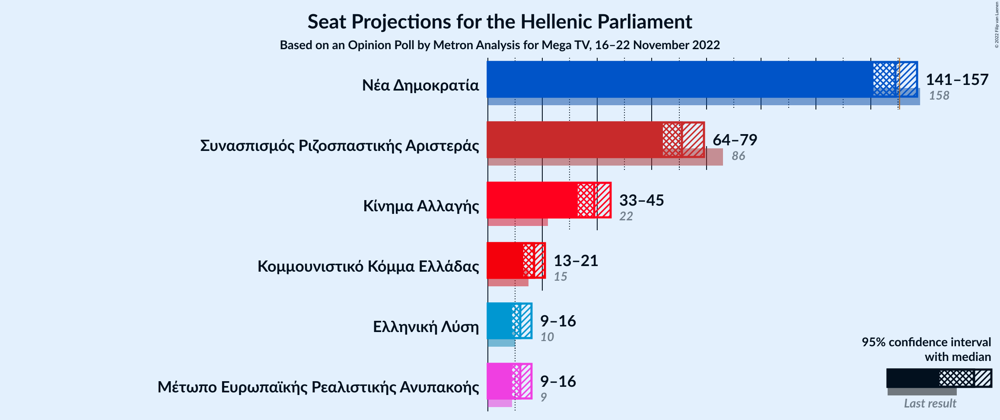

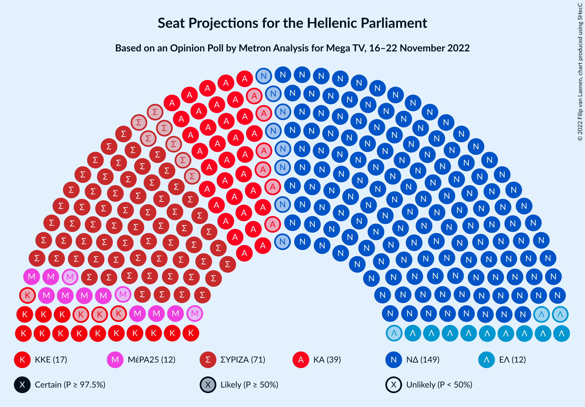

### Confidence Intervals

| Party | Last Result | Median | 80% Confidence Interval | 90% Confidence Interval | 95% Confidence Interval | 99% Confidence Interval |
|:-----:|:-----------:|:------:|:-----------------------:|:-----------------------:|:-----------------------:|:-----------------------:|
| <a href="#νέα-δημοκρατία">Νέα Δημοκρατία</a> | 158 | 149 | 144–154 |142–155 |141–157 |138–159 |
| <a href="#συνασπισμός-ριζοσπαστικής-αριστεράς">Συνασπισμός Ριζοσπαστικής Αριστεράς</a> | 86 | 71 | 67–76 |66–78 |64–79 |62–81 |
| <a href="#κίνημα-αλλαγής">Κίνημα Αλλαγής</a> | 22 | 39 | 35–43 |34–44 |33–45 |32–47 |
| <a href="#κομμουνιστικό-κόμμα-ελλάδας">Κομμουνιστικό Κόμμα Ελλάδας</a> | 15 | 17 | 14–19 |13–20 |13–21 |12–22 |
| <a href="#μέτωπο-ευρωπαϊκής-ρεαλιστικής-ανυπακοής">Μέτωπο Ευρωπαϊκής Ρεαλιστικής Ανυπακοής</a> | 9 | 12 | 10–15 |10–16 |9–16 |8–17 |
| <a href="#ελληνική-λύση">Ελληνική Λύση</a> | 10 | 12 | 10–14 |9–15 |9–16 |0–17 |

### Νέα Δημοκρατία

*For a full overview of the results for this party, see the [Νέα Δημοκρατία](party-νέαδημοκρατία.html) page.*

| Number of Seats | Probability | Accumulated | Special Marks |
|:---------------:|:-----------:|:-----------:|:-------------:|
| 136 | 0.1% | 100% |  |
| 137 | 0.1% | 99.9% |  |
| 138 | 0.3% | 99.7% |  |
| 139 | 0.5% | 99.4% |  |
| 140 | 0.9% | 98.9% |  |
| 141 | 1.5% | 98% |  |
| 142 | 2% | 97% |  |
| 143 | 3% | 94% |  |
| 144 | 5% | 91% |  |
| 145 | 6% | 86% |  |
| 146 | 8% | 80% |  |
| 147 | 8% | 72% |  |
| 148 | 9% | 64% |  |
| 149 | 10% | 55% | Median |
| 150 | 9% | 44% |  |
| 151 | 9% | 35% | Majority |
| 152 | 7% | 27% |  |
| 153 | 6% | 19% |  |
| 154 | 5% | 13% |  |
| 155 | 3% | 8% |  |
| 156 | 2% | 5% |  |
| 157 | 1.3% | 3% |  |
| 158 | 0.8% | 2% | Last Result |
| 159 | 0.4% | 0.8% |  |
| 160 | 0.2% | 0.4% |  |
| 161 | 0.1% | 0.2% |  |
| 162 | 0.1% | 0.1% |  |
| 163 | 0% | 0.1% |  |
| 164 | 0% | 0% |  |

### Συνασπισμός Ριζοσπαστικής Αριστεράς

*For a full overview of the results for this party, see the [Συνασπισμός Ριζοσπαστικής Αριστεράς](party-συνασπισμόςριζοσπαστικήςαριστεράς.html) page.*

| Number of Seats | Probability | Accumulated | Special Marks |
|:---------------:|:-----------:|:-----------:|:-------------:|
| 60 | 0.1% | 100% |  |
| 61 | 0.2% | 99.9% |  |
| 62 | 0.4% | 99.7% |  |
| 63 | 0.8% | 99.3% |  |
| 64 | 1.3% | 98.6% |  |
| 65 | 2% | 97% |  |
| 66 | 4% | 95% |  |
| 67 | 5% | 91% |  |
| 68 | 7% | 86% |  |
| 69 | 8% | 79% |  |
| 70 | 11% | 71% |  |
| 71 | 11% | 60% | Median |
| 72 | 11% | 49% |  |
| 73 | 10% | 39% |  |
| 74 | 8% | 29% |  |
| 75 | 7% | 21% |  |
| 76 | 5% | 14% |  |
| 77 | 3% | 9% |  |
| 78 | 2% | 6% |  |
| 79 | 2% | 3% |  |
| 80 | 0.9% | 2% |  |
| 81 | 0.5% | 0.9% |  |
| 82 | 0.3% | 0.5% |  |
| 83 | 0.1% | 0.2% |  |
| 84 | 0.1% | 0.1% |  |
| 85 | 0% | 0% |  |
| 86 | 0% | 0% | Last Result |

### Κίνημα Αλλαγής

*For a full overview of the results for this party, see the [Κίνημα Αλλαγής](party-κίνημααλλαγής.html) page.*

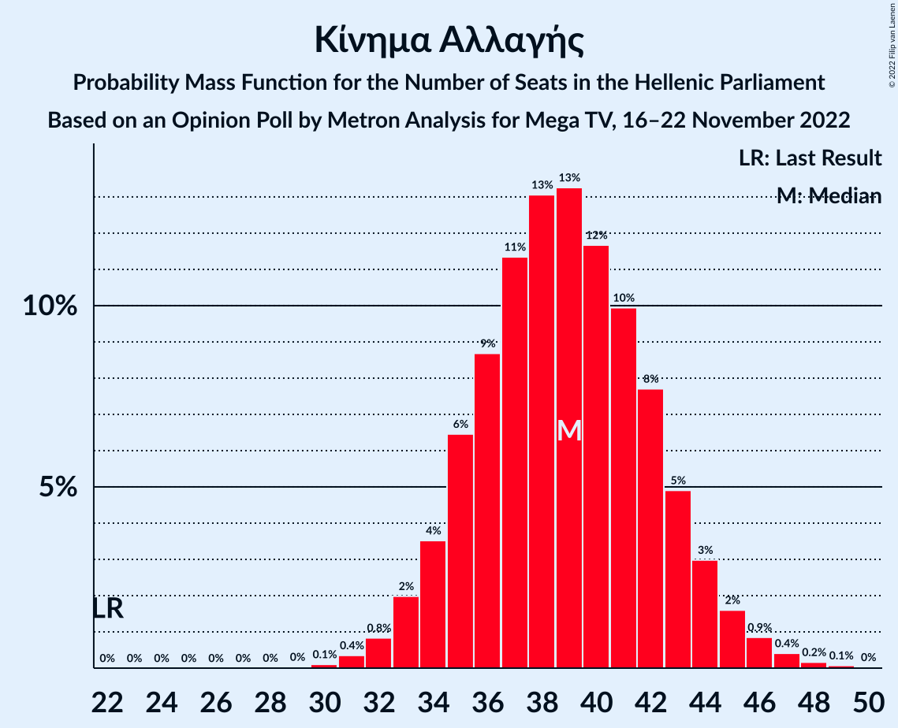

| Number of Seats | Probability | Accumulated | Special Marks |
|:---------------:|:-----------:|:-----------:|:-------------:|
| 22 | 0% | 100% | Last Result |
| 23 | 0% | 100% |  |
| 24 | 0% | 100% |  |
| 25 | 0% | 100% |  |
| 26 | 0% | 100% |  |
| 27 | 0% | 100% |  |
| 28 | 0% | 100% |  |
| 29 | 0% | 100% |  |
| 30 | 0.1% | 100% |  |
| 31 | 0.4% | 99.9% |  |
| 32 | 0.8% | 99.5% |  |
| 33 | 2% | 98.7% |  |
| 34 | 4% | 97% |  |
| 35 | 6% | 93% |  |
| 36 | 9% | 87% |  |
| 37 | 11% | 78% |  |
| 38 | 13% | 67% |  |
| 39 | 13% | 54% | Median |
| 40 | 12% | 40% |  |
| 41 | 10% | 29% |  |
| 42 | 8% | 19% |  |
| 43 | 5% | 11% |  |
| 44 | 3% | 6% |  |
| 45 | 2% | 3% |  |
| 46 | 0.9% | 2% |  |
| 47 | 0.4% | 0.7% |  |
| 48 | 0.2% | 0.3% |  |
| 49 | 0.1% | 0.1% |  |
| 50 | 0% | 0% |  |

### Κομμουνιστικό Κόμμα Ελλάδας

*For a full overview of the results for this party, see the [Κομμουνιστικό Κόμμα Ελλάδας](party-κομμουνιστικόκόμμαελλάδας.html) page.*

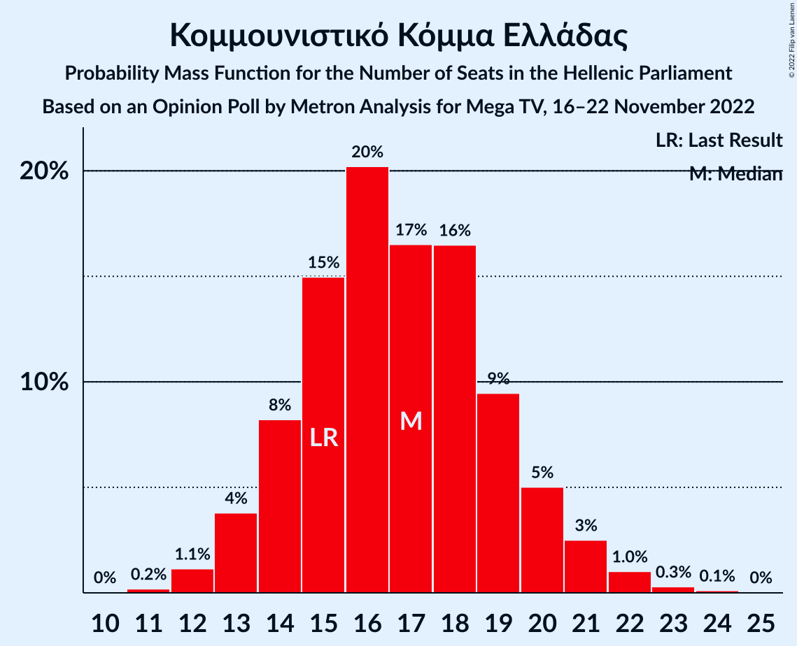

| Number of Seats | Probability | Accumulated | Special Marks |
|:---------------:|:-----------:|:-----------:|:-------------:|
| 11 | 0.2% | 100% |  |
| 12 | 1.1% | 99.8% |  |
| 13 | 4% | 98.6% |  |
| 14 | 8% | 95% |  |
| 15 | 15% | 87% | Last Result |
| 16 | 20% | 72% |  |
| 17 | 17% | 51% | Median |
| 18 | 16% | 35% |  |
| 19 | 9% | 18% |  |
| 20 | 5% | 9% |  |
| 21 | 3% | 4% |  |
| 22 | 1.0% | 1.5% |  |
| 23 | 0.3% | 0.4% |  |
| 24 | 0.1% | 0.1% |  |
| 25 | 0% | 0% |  |

### Μέτωπο Ευρωπαϊκής Ρεαλιστικής Ανυπακοής

*For a full overview of the results for this party, see the [Μέτωπο Ευρωπαϊκής Ρεαλιστικής Ανυπακοής](party-μέτωποευρωπαϊκήςρεαλιστικήςανυπακοής.html) page.*

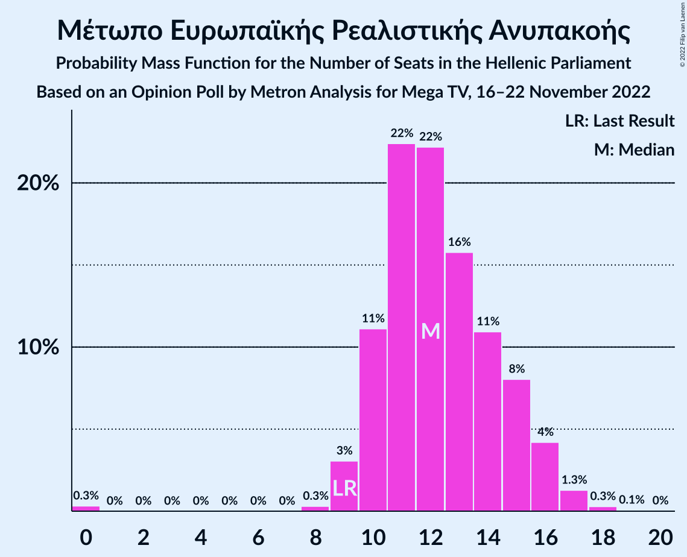

| Number of Seats | Probability | Accumulated | Special Marks |
|:---------------:|:-----------:|:-----------:|:-------------:|
| 0 | 0.3% | 100% |  |
| 1 | 0% | 99.7% |  |
| 2 | 0% | 99.7% |  |
| 3 | 0% | 99.7% |  |
| 4 | 0% | 99.7% |  |
| 5 | 0% | 99.7% |  |
| 6 | 0% | 99.7% |  |
| 7 | 0% | 99.7% |  |
| 8 | 0.3% | 99.7% |  |
| 9 | 3% | 99.4% | Last Result |
| 10 | 11% | 96% |  |
| 11 | 22% | 85% |  |
| 12 | 22% | 63% | Median |
| 13 | 16% | 41% |  |
| 14 | 11% | 25% |  |
| 15 | 8% | 14% |  |
| 16 | 4% | 6% |  |
| 17 | 1.3% | 2% |  |
| 18 | 0.3% | 0.4% |  |
| 19 | 0.1% | 0.1% |  |
| 20 | 0% | 0% |  |

### Ελληνική Λύση

*For a full overview of the results for this party, see the [Ελληνική Λύση](party-ελληνικήλύση.html) page.*

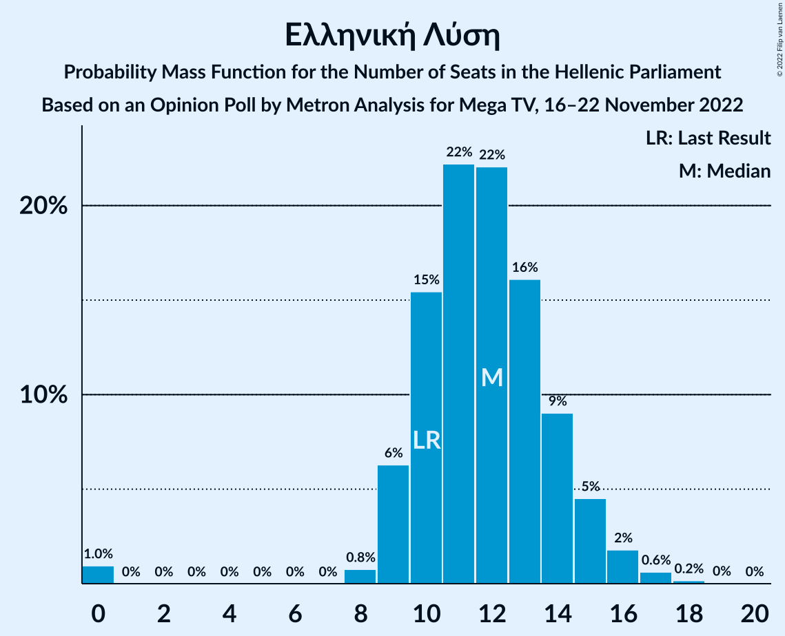

| Number of Seats | Probability | Accumulated | Special Marks |
|:---------------:|:-----------:|:-----------:|:-------------:|
| 0 | 1.0% | 100% |  |
| 1 | 0% | 99.0% |  |
| 2 | 0% | 99.0% |  |
| 3 | 0% | 99.0% |  |
| 4 | 0% | 99.0% |  |
| 5 | 0% | 99.0% |  |
| 6 | 0% | 99.0% |  |
| 7 | 0% | 99.0% |  |
| 8 | 0.8% | 99.0% |  |
| 9 | 6% | 98% |  |
| 10 | 15% | 92% | Last Result |
| 11 | 22% | 77% |  |
| 12 | 22% | 54% | Median |
| 13 | 16% | 32% |  |
| 14 | 9% | 16% |  |
| 15 | 5% | 7% |  |
| 16 | 2% | 3% |  |
| 17 | 0.6% | 0.8% |  |
| 18 | 0.2% | 0.2% |  |
| 19 | 0% | 0% |  |

## Coalitions

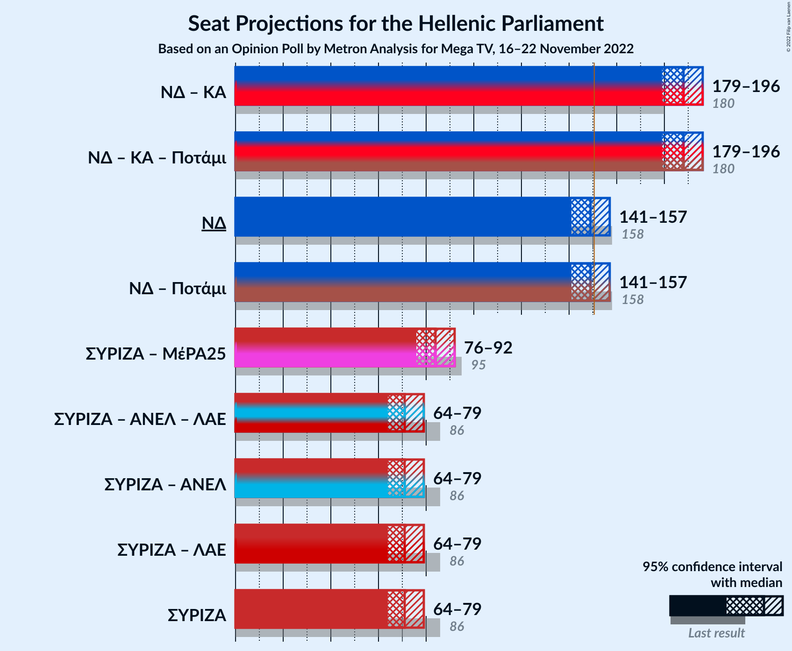

### Confidence Intervals

| Coalition | Last Result | Median | Majority? | 80% Confidence Interval | 90% Confidence Interval | 95% Confidence Interval | 99% Confidence Interval |
|:---------:|:-----------:|:------:|:---------:|:-----------------------:|:-----------------------:|:-----------------------:|:-----------------------:|
| Νέα Δημοκρατία – Κίνημα Αλλαγής | 180 | 188 | 100% | 182–193 | 181–194 | 179–196 | 177–199 |
| Νέα Δημοκρατία | 158 | 149 | 35% | 144–154 | 142–155 | 141–157 | 138–159 |
| Συνασπισμός Ριζοσπαστικής Αριστεράς – Μέτωπο Ευρωπαϊκής Ρεαλιστικής Ανυπακοής | 95 | 84 | 0% | 79–89 | 77–90 | 76–92 | 74–94 |
| Συνασπισμός Ριζοσπαστικής Αριστεράς | 86 | 71 | 0% | 67–76 | 66–78 | 64–79 | 62–81 |

### Νέα Δημοκρατία – Κίνημα Αλλαγής

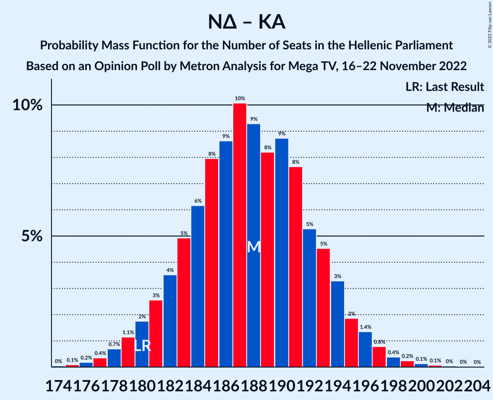

| Number of Seats | Probability | Accumulated | Special Marks |
|:---------------:|:-----------:|:-----------:|:-------------:|
| 174 | 0% | 100% |  |
| 175 | 0.1% | 99.9% |  |
| 176 | 0.2% | 99.8% |  |
| 177 | 0.4% | 99.6% |  |
| 178 | 0.7% | 99.3% |  |
| 179 | 1.1% | 98.6% |  |
| 180 | 2% | 97% | Last Result |
| 181 | 3% | 96% |  |
| 182 | 4% | 93% |  |
| 183 | 5% | 90% |  |
| 184 | 6% | 85% |  |
| 185 | 8% | 79% |  |
| 186 | 9% | 71% |  |
| 187 | 10% | 62% |  |
| 188 | 9% | 52% | Median |
| 189 | 8% | 43% |  |
| 190 | 9% | 34% |  |
| 191 | 8% | 26% |  |
| 192 | 5% | 18% |  |
| 193 | 5% | 13% |  |
| 194 | 3% | 8% |  |
| 195 | 2% | 5% |  |
| 196 | 1.4% | 3% |  |
| 197 | 0.8% | 2% |  |
| 198 | 0.4% | 0.9% |  |
| 199 | 0.2% | 0.5% |  |
| 200 | 0.1% | 0.3% |  |
| 201 | 0.1% | 0.2% |  |
| 202 | 0% | 0.1% |  |
| 203 | 0% | 0% |  |

### Νέα Δημοκρατία

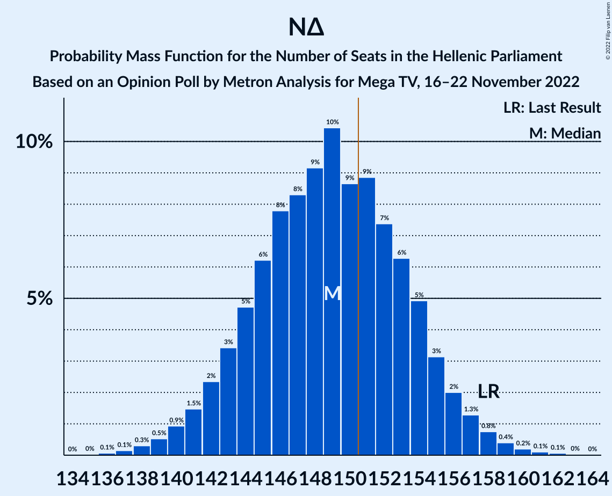

| Number of Seats | Probability | Accumulated | Special Marks |
|:---------------:|:-----------:|:-----------:|:-------------:|
| 136 | 0.1% | 100% |  |
| 137 | 0.1% | 99.9% |  |
| 138 | 0.3% | 99.7% |  |
| 139 | 0.5% | 99.4% |  |
| 140 | 0.9% | 98.9% |  |
| 141 | 1.5% | 98% |  |
| 142 | 2% | 97% |  |
| 143 | 3% | 94% |  |
| 144 | 5% | 91% |  |
| 145 | 6% | 86% |  |
| 146 | 8% | 80% |  |
| 147 | 8% | 72% |  |
| 148 | 9% | 64% |  |
| 149 | 10% | 55% | Median |
| 150 | 9% | 44% |  |
| 151 | 9% | 35% | Majority |
| 152 | 7% | 27% |  |
| 153 | 6% | 19% |  |
| 154 | 5% | 13% |  |
| 155 | 3% | 8% |  |
| 156 | 2% | 5% |  |
| 157 | 1.3% | 3% |  |
| 158 | 0.8% | 2% | Last Result |
| 159 | 0.4% | 0.8% |  |
| 160 | 0.2% | 0.4% |  |
| 161 | 0.1% | 0.2% |  |
| 162 | 0.1% | 0.1% |  |
| 163 | 0% | 0.1% |  |
| 164 | 0% | 0% |  |

### Συνασπισμός Ριζοσπαστικής Αριστεράς – Μέτωπο Ευρωπαϊκής Ρεαλιστικής Ανυπακοής

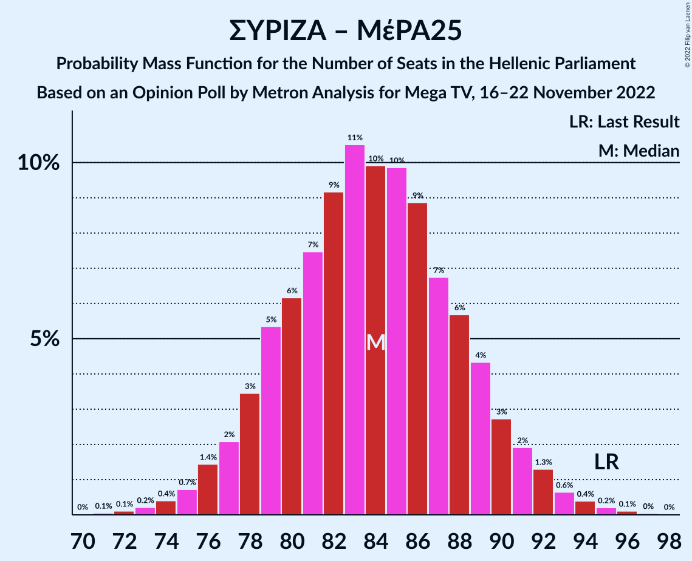

| Number of Seats | Probability | Accumulated | Special Marks |
|:---------------:|:-----------:|:-----------:|:-------------:|
| 70 | 0% | 100% |  |
| 71 | 0.1% | 99.9% |  |
| 72 | 0.1% | 99.9% |  |
| 73 | 0.2% | 99.8% |  |
| 74 | 0.4% | 99.6% |  |
| 75 | 0.7% | 99.2% |  |
| 76 | 1.4% | 98% |  |
| 77 | 2% | 97% |  |
| 78 | 3% | 95% |  |
| 79 | 5% | 91% |  |
| 80 | 6% | 86% |  |
| 81 | 7% | 80% |  |
| 82 | 9% | 72% |  |
| 83 | 11% | 63% | Median |
| 84 | 10% | 53% |  |
| 85 | 10% | 43% |  |
| 86 | 9% | 33% |  |
| 87 | 7% | 24% |  |
| 88 | 6% | 17% |  |
| 89 | 4% | 12% |  |
| 90 | 3% | 7% |  |
| 91 | 2% | 5% |  |
| 92 | 1.3% | 3% |  |
| 93 | 0.6% | 1.4% |  |
| 94 | 0.4% | 0.8% |  |
| 95 | 0.2% | 0.4% | Last Result |
| 96 | 0.1% | 0.2% |  |
| 97 | 0% | 0.1% |  |
| 98 | 0% | 0% |  |

### Συνασπισμός Ριζοσπαστικής Αριστεράς

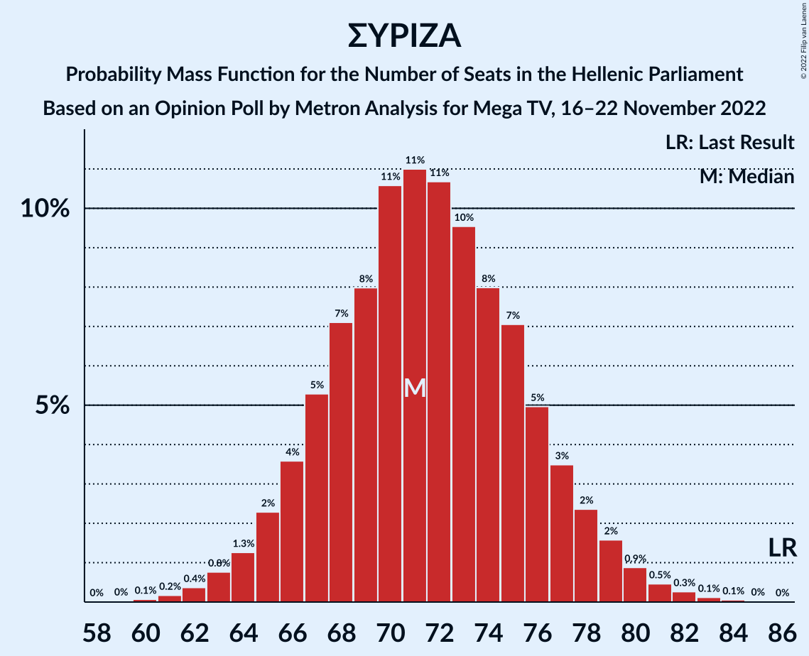

| Number of Seats | Probability | Accumulated | Special Marks |
|:---------------:|:-----------:|:-----------:|:-------------:|
| 60 | 0.1% | 100% |  |
| 61 | 0.2% | 99.9% |  |
| 62 | 0.4% | 99.7% |  |
| 63 | 0.8% | 99.3% |  |
| 64 | 1.3% | 98.6% |  |
| 65 | 2% | 97% |  |
| 66 | 4% | 95% |  |
| 67 | 5% | 91% |  |
| 68 | 7% | 86% |  |
| 69 | 8% | 79% |  |
| 70 | 11% | 71% |  |
| 71 | 11% | 60% | Median |
| 72 | 11% | 49% |  |
| 73 | 10% | 39% |  |
| 74 | 8% | 29% |  |
| 75 | 7% | 21% |  |
| 76 | 5% | 14% |  |
| 77 | 3% | 9% |  |
| 78 | 2% | 6% |  |
| 79 | 2% | 3% |  |
| 80 | 0.9% | 2% |  |
| 81 | 0.5% | 0.9% |  |
| 82 | 0.3% | 0.5% |  |
| 83 | 0.1% | 0.2% |  |
| 84 | 0.1% | 0.1% |  |
| 85 | 0% | 0% |  |
| 86 | 0% | 0% | Last Result |

## Technical Information

### Opinion Poll

+ **Polling firm:** Metron Analysis
+ **Commissioner(s):** Mega TV
+ **Fieldwork period:** 16–22 November 2022

### Calculations

+ **Sample size:** 1000
+ **Simulations done:** 1,048,576
+ **Error estimate:** 0.49%

