# Opinion Poll by Marc for ANT1, 22–27 November 2022

<a href="#voting-intentions">Voting Intentions</a> | <a href="#seats">Seats</a> | <a href="#coalitions">Coalitions</a> | <a href="#technical-information">Technical Information</a>

## Voting Intentions

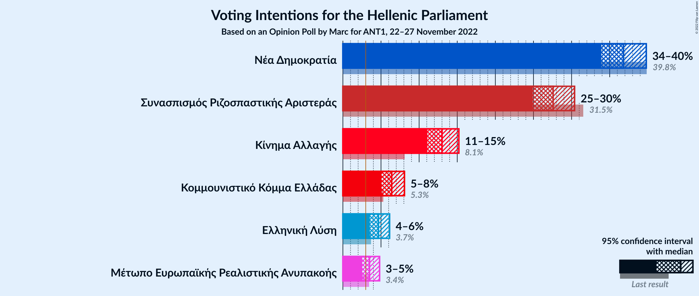

### Confidence Intervals

| Party | Last Result | Poll Result | 80% Confidence Interval | 90% Confidence Interval | 95% Confidence Interval | 99% Confidence Interval |
|:-----:|:-----------:|:-----------:|:-----------------------:|:-----------------------:|:-----------------------:|:-----------------------:|
| Νέα Δημοκρατία | 39.8% | 36.8% | 34.9–38.8% |34.4–39.3% |33.9–39.8% |33.0–40.7% |
| Συνασπισμός Ριζοσπαστικής Αριστεράς | 31.5% | 27.6% | 25.8–29.4% |25.3–29.9% |24.9–30.4% |24.1–31.3% |
| Κίνημα Αλλαγής | 8.1% | 13.0% | 11.8–14.4% |11.4–14.9% |11.1–15.2% |10.5–15.9% |
| Κομμουνιστικό Κόμμα Ελλάδας | 5.3% | 6.4% | 5.5–7.5% |5.3–7.8% |5.1–8.1% |4.7–8.6% |
| Ελληνική Λύση | 3.7% | 4.7% | 3.9–5.6% |3.7–5.9% |3.5–6.1% |3.2–6.6% |
| Μέτωπο Ευρωπαϊκής Ρεαλιστικής Ανυπακοής | 3.4% | 3.5% | 2.9–4.3% |2.7–4.6% |2.5–4.8% |2.3–5.2% |

*Note:* The poll result column reflects the actual value used in the calculations. Published results may vary slightly, and in addition be rounded to fewer digits.

## Seats

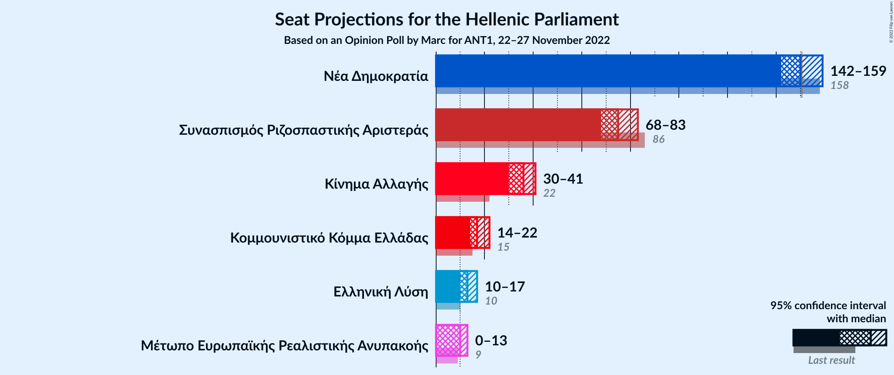

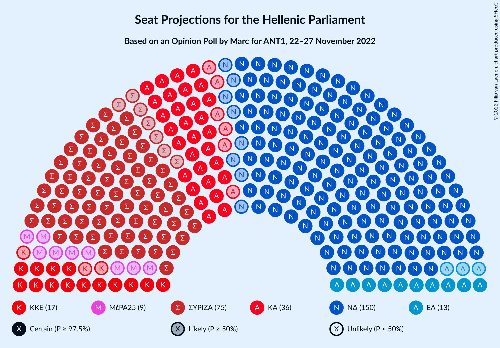

### Confidence Intervals

| Party | Last Result | Median | 80% Confidence Interval | 90% Confidence Interval | 95% Confidence Interval | 99% Confidence Interval |
|:-----:|:-----------:|:------:|:-----------------------:|:-----------------------:|:-----------------------:|:-----------------------:|
| <a href="#νέα-δημοκρατία">Νέα Δημοκρατία</a> | 158 | 150 | 145–156 |143–157 |142–159 |140–162 |
| <a href="#συνασπισμός-ριζοσπαστικής-αριστεράς">Συνασπισμός Ριζοσπαστικής Αριστεράς</a> | 86 | 75 | 70–80 |69–82 |68–83 |65–86 |
| <a href="#κίνημα-αλλαγής">Κίνημα Αλλαγής</a> | 22 | 36 | 32–39 |31–40 |30–41 |29–43 |
| <a href="#κομμουνιστικό-κόμμα-ελλάδας">Κομμουνιστικό Κόμμα Ελλάδας</a> | 15 | 17 | 15–21 |15–21 |14–22 |13–23 |
| <a href="#ελληνική-λύση">Ελληνική Λύση</a> | 10 | 13 | 11–15 |10–16 |10–17 |9–18 |
| <a href="#μέτωπο-ευρωπαϊκής-ρεαλιστικής-ανυπακοής">Μέτωπο Ευρωπαϊκής Ρεαλιστικής Ανυπακοής</a> | 9 | 10 | 0–12 |0–12 |0–13 |0–14 |

### Νέα Δημοκρατία

*For a full overview of the results for this party, see the [Νέα Δημοκρατία](party-νέαδημοκρατία.html) page.*

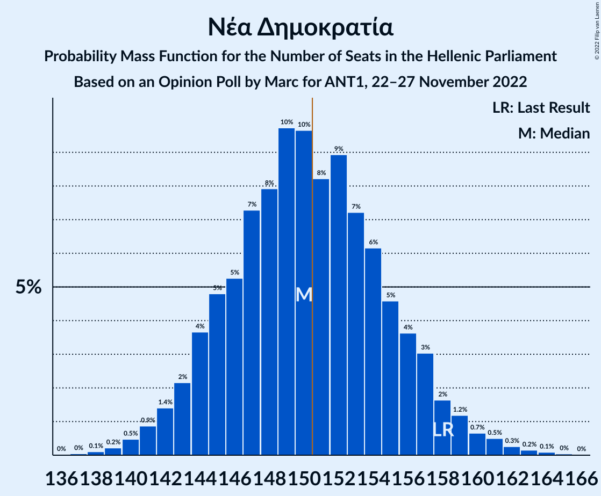

| Number of Seats | Probability | Accumulated | Special Marks |
|:---------------:|:-----------:|:-----------:|:-------------:|
| 137 | 0% | 100% |  |
| 138 | 0.1% | 99.9% |  |
| 139 | 0.2% | 99.8% |  |
| 140 | 0.5% | 99.6% |  |
| 141 | 0.9% | 99.1% |  |
| 142 | 1.4% | 98% |  |
| 143 | 2% | 97% |  |
| 144 | 4% | 95% |  |
| 145 | 5% | 91% |  |
| 146 | 5% | 86% |  |
| 147 | 7% | 81% |  |
| 148 | 8% | 74% |  |
| 149 | 10% | 66% |  |
| 150 | 10% | 56% | Median |
| 151 | 8% | 46% | Majority |
| 152 | 9% | 38% |  |
| 153 | 7% | 29% |  |
| 154 | 6% | 22% |  |
| 155 | 5% | 16% |  |
| 156 | 4% | 11% |  |
| 157 | 3% | 8% |  |
| 158 | 2% | 5% | Last Result |
| 159 | 1.2% | 3% |  |
| 160 | 0.7% | 2% |  |
| 161 | 0.5% | 1.1% |  |
| 162 | 0.3% | 0.6% |  |
| 163 | 0.2% | 0.3% |  |
| 164 | 0.1% | 0.2% |  |
| 165 | 0% | 0.1% |  |
| 166 | 0% | 0% |  |

### Συνασπισμός Ριζοσπαστικής Αριστεράς

*For a full overview of the results for this party, see the [Συνασπισμός Ριζοσπαστικής Αριστεράς](party-συνασπισμόςριζοσπαστικήςαριστεράς.html) page.*

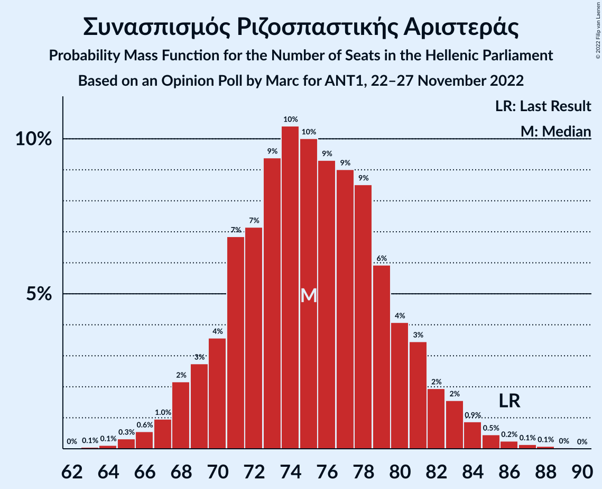

| Number of Seats | Probability | Accumulated | Special Marks |
|:---------------:|:-----------:|:-----------:|:-------------:|
| 63 | 0.1% | 100% |  |
| 64 | 0.1% | 99.9% |  |
| 65 | 0.3% | 99.8% |  |
| 66 | 0.6% | 99.5% |  |
| 67 | 1.0% | 98.9% |  |
| 68 | 2% | 98% |  |
| 69 | 3% | 96% |  |
| 70 | 4% | 93% |  |
| 71 | 7% | 89% |  |
| 72 | 7% | 83% |  |
| 73 | 9% | 75% |  |
| 74 | 10% | 66% |  |
| 75 | 10% | 56% | Median |
| 76 | 9% | 46% |  |
| 77 | 9% | 36% |  |
| 78 | 9% | 27% |  |
| 79 | 6% | 19% |  |
| 80 | 4% | 13% |  |
| 81 | 3% | 9% |  |
| 82 | 2% | 5% |  |
| 83 | 2% | 3% |  |
| 84 | 0.9% | 2% |  |
| 85 | 0.5% | 1.0% |  |
| 86 | 0.2% | 0.5% | Last Result |
| 87 | 0.1% | 0.3% |  |
| 88 | 0.1% | 0.1% |  |
| 89 | 0% | 0.1% |  |
| 90 | 0% | 0% |  |

### Κίνημα Αλλαγής

*For a full overview of the results for this party, see the [Κίνημα Αλλαγής](party-κίνημααλλαγής.html) page.*

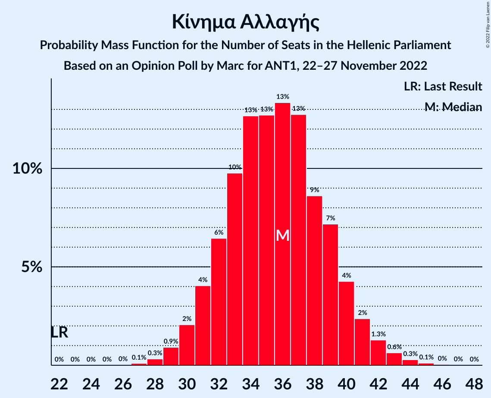

| Number of Seats | Probability | Accumulated | Special Marks |
|:---------------:|:-----------:|:-----------:|:-------------:|
| 22 | 0% | 100% | Last Result |
| 23 | 0% | 100% |  |
| 24 | 0% | 100% |  |
| 25 | 0% | 100% |  |
| 26 | 0% | 100% |  |
| 27 | 0.1% | 100% |  |
| 28 | 0.3% | 99.9% |  |
| 29 | 0.9% | 99.5% |  |
| 30 | 2% | 98.6% |  |
| 31 | 4% | 97% |  |
| 32 | 6% | 93% |  |
| 33 | 10% | 86% |  |
| 34 | 13% | 76% |  |
| 35 | 13% | 64% |  |
| 36 | 13% | 51% | Median |
| 37 | 13% | 38% |  |
| 38 | 9% | 25% |  |
| 39 | 7% | 16% |  |
| 40 | 4% | 9% |  |
| 41 | 2% | 5% |  |
| 42 | 1.3% | 2% |  |
| 43 | 0.6% | 1.1% |  |
| 44 | 0.3% | 0.5% |  |
| 45 | 0.1% | 0.2% |  |
| 46 | 0% | 0.1% |  |
| 47 | 0% | 0% |  |

### Κομμουνιστικό Κόμμα Ελλάδας

*For a full overview of the results for this party, see the [Κομμουνιστικό Κόμμα Ελλάδας](party-κομμουνιστικόκόμμαελλάδας.html) page.*

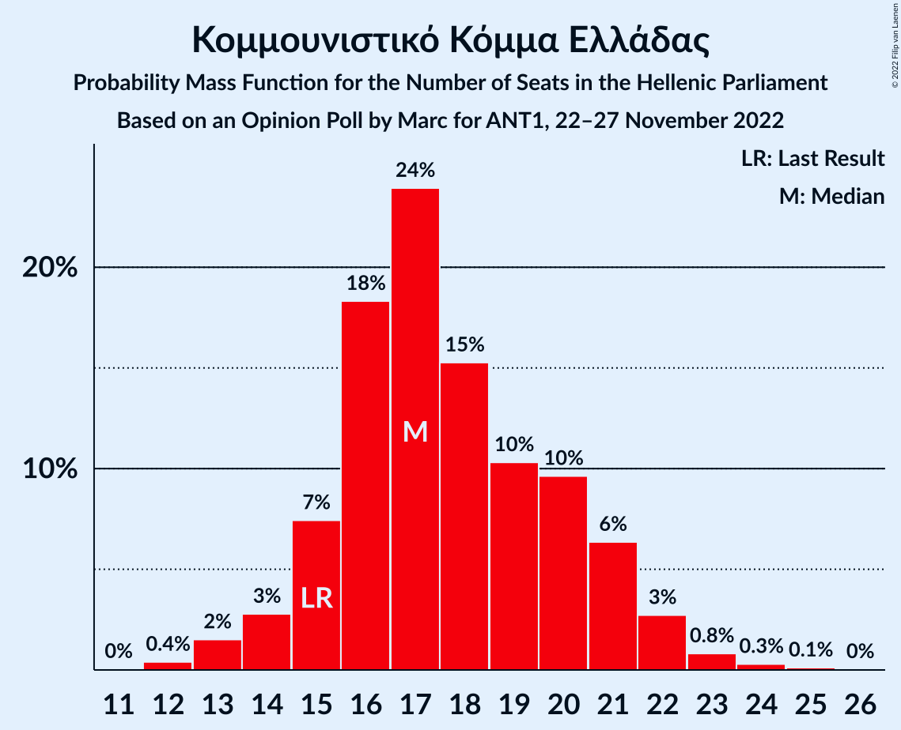

| Number of Seats | Probability | Accumulated | Special Marks |
|:---------------:|:-----------:|:-----------:|:-------------:|
| 12 | 0.4% | 100% |  |
| 13 | 2% | 99.6% |  |
| 14 | 3% | 98% |  |
| 15 | 7% | 95% | Last Result |
| 16 | 18% | 88% |  |
| 17 | 24% | 70% | Median |
| 18 | 15% | 46% |  |
| 19 | 10% | 30% |  |
| 20 | 10% | 20% |  |
| 21 | 6% | 10% |  |
| 22 | 3% | 4% |  |
| 23 | 0.8% | 1.3% |  |
| 24 | 0.3% | 0.5% |  |
| 25 | 0.1% | 0.2% |  |
| 26 | 0% | 0% |  |

### Ελληνική Λύση

*For a full overview of the results for this party, see the [Ελληνική Λύση](party-ελληνικήλύση.html) page.*

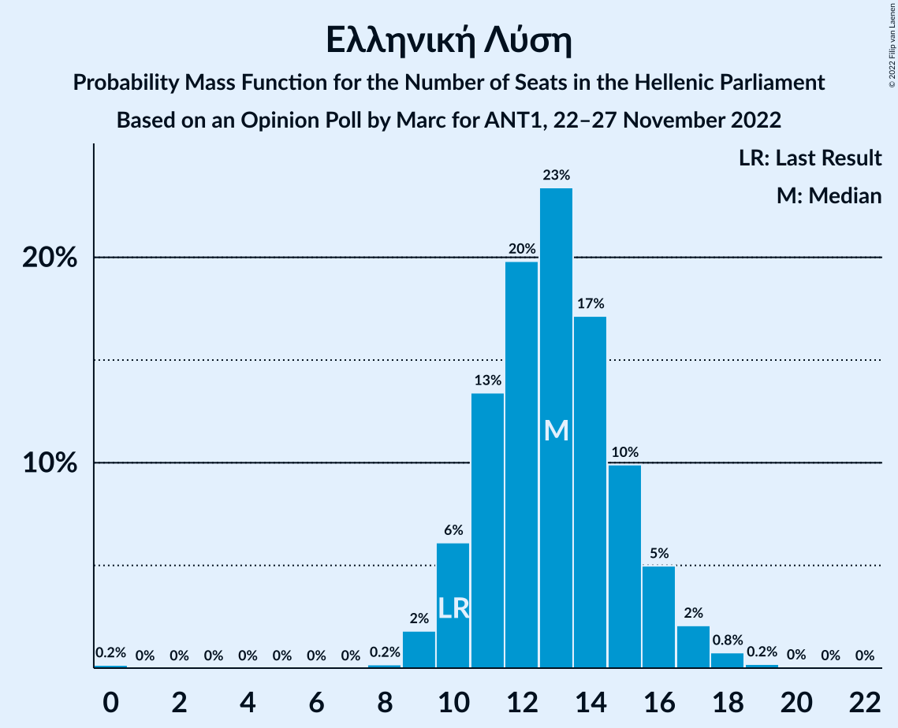

| Number of Seats | Probability | Accumulated | Special Marks |
|:---------------:|:-----------:|:-----------:|:-------------:|
| 0 | 0.2% | 100% |  |
| 1 | 0% | 99.8% |  |
| 2 | 0% | 99.8% |  |
| 3 | 0% | 99.8% |  |
| 4 | 0% | 99.8% |  |
| 5 | 0% | 99.8% |  |
| 6 | 0% | 99.8% |  |
| 7 | 0% | 99.8% |  |
| 8 | 0.2% | 99.8% |  |
| 9 | 2% | 99.7% |  |
| 10 | 6% | 98% | Last Result |
| 11 | 13% | 92% |  |
| 12 | 20% | 78% |  |
| 13 | 23% | 59% | Median |
| 14 | 17% | 35% |  |
| 15 | 10% | 18% |  |
| 16 | 5% | 8% |  |
| 17 | 2% | 3% |  |
| 18 | 0.8% | 1.0% |  |
| 19 | 0.2% | 0.3% |  |
| 20 | 0% | 0.1% |  |
| 21 | 0% | 0% |  |

### Μέτωπο Ευρωπαϊκής Ρεαλιστικής Ανυπακοής

*For a full overview of the results for this party, see the [Μέτωπο Ευρωπαϊκής Ρεαλιστικής Ανυπακοής](party-μέτωποευρωπαϊκήςρεαλιστικήςανυπακοής.html) page.*

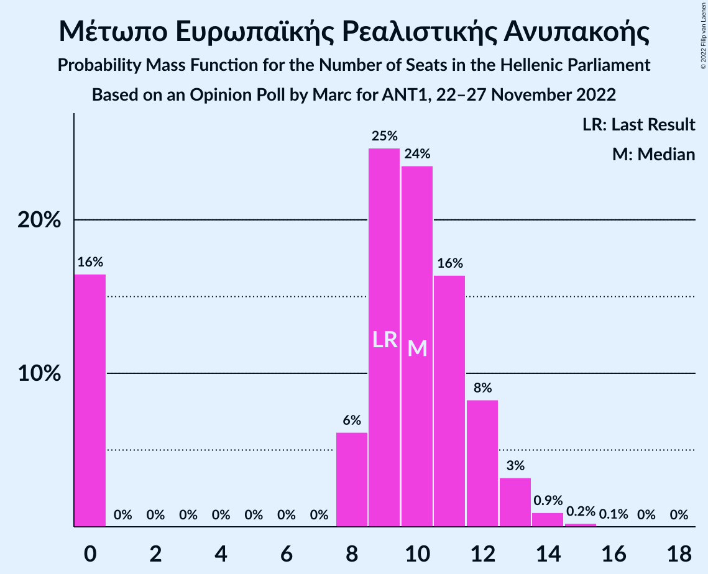

| Number of Seats | Probability | Accumulated | Special Marks |
|:---------------:|:-----------:|:-----------:|:-------------:|
| 0 | 16% | 100% |  |
| 1 | 0% | 84% |  |
| 2 | 0% | 84% |  |
| 3 | 0% | 84% |  |
| 4 | 0% | 84% |  |
| 5 | 0% | 84% |  |
| 6 | 0% | 84% |  |
| 7 | 0% | 84% |  |
| 8 | 6% | 84% |  |
| 9 | 25% | 77% | Last Result |
| 10 | 24% | 53% | Median |
| 11 | 16% | 29% |  |
| 12 | 8% | 13% |  |
| 13 | 3% | 4% |  |
| 14 | 0.9% | 1.2% |  |
| 15 | 0.2% | 0.3% |  |
| 16 | 0.1% | 0.1% |  |
| 17 | 0% | 0% |  |

## Coalitions

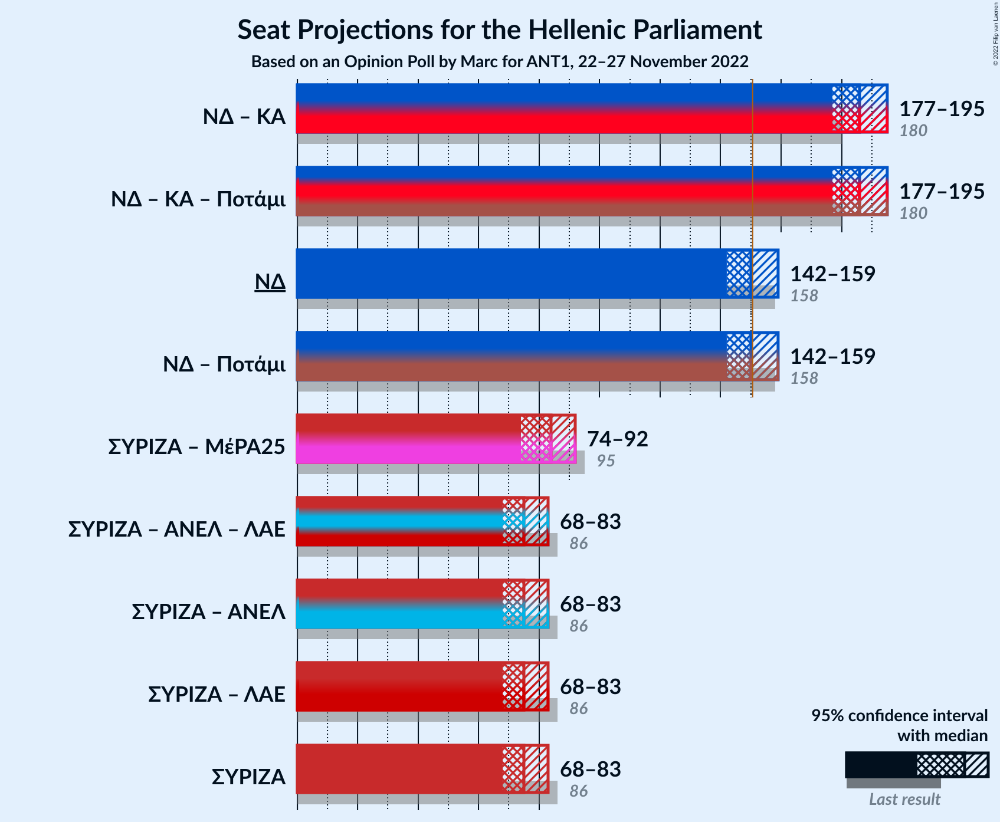

### Confidence Intervals

| Coalition | Last Result | Median | Majority? | 80% Confidence Interval | 90% Confidence Interval | 95% Confidence Interval | 99% Confidence Interval |
|:---------:|:-----------:|:------:|:---------:|:-----------------------:|:-----------------------:|:-----------------------:|:-----------------------:|
| Νέα Δημοκρατία – Κίνημα Αλλαγής | 180 | 186 | 100% | 180–192 | 179–193 | 177–195 | 175–198 |
| Νέα Δημοκρατία | 158 | 150 | 46% | 145–156 | 143–157 | 142–159 | 140–162 |
| Συνασπισμός Ριζοσπαστικής Αριστεράς – Μέτωπο Ευρωπαϊκής Ρεαλιστικής Ανυπακοής | 95 | 84 | 0% | 78–89 | 76–91 | 74–92 | 71–94 |
| Συνασπισμός Ριζοσπαστικής Αριστεράς | 86 | 75 | 0% | 70–80 | 69–82 | 68–83 | 65–86 |

### Νέα Δημοκρατία – Κίνημα Αλλαγής

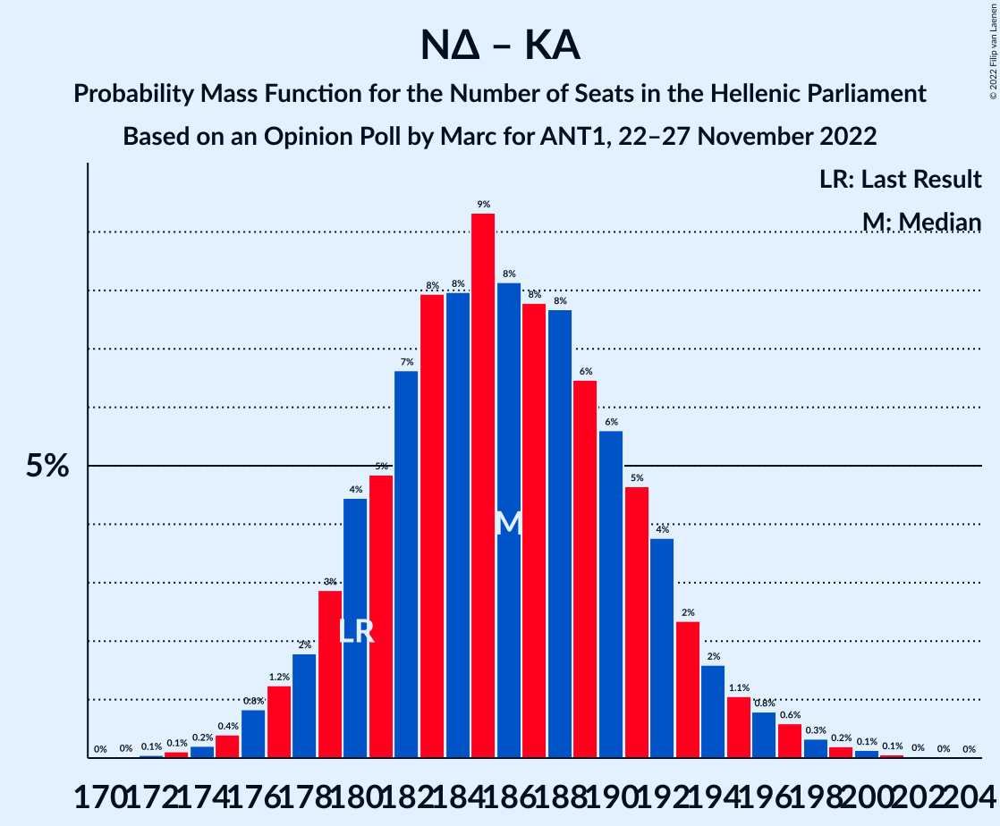

| Number of Seats | Probability | Accumulated | Special Marks |
|:---------------:|:-----------:|:-----------:|:-------------:|
| 172 | 0.1% | 100% |  |
| 173 | 0.1% | 99.9% |  |
| 174 | 0.2% | 99.8% |  |
| 175 | 0.4% | 99.6% |  |
| 176 | 0.8% | 99.2% |  |
| 177 | 1.2% | 98% |  |
| 178 | 2% | 97% |  |
| 179 | 3% | 95% |  |
| 180 | 4% | 92% | Last Result |
| 181 | 5% | 88% |  |
| 182 | 7% | 83% |  |
| 183 | 8% | 77% |  |
| 184 | 8% | 69% |  |
| 185 | 9% | 61% |  |
| 186 | 8% | 51% | Median |
| 187 | 8% | 43% |  |
| 188 | 8% | 35% |  |
| 189 | 6% | 28% |  |
| 190 | 6% | 21% |  |
| 191 | 5% | 16% |  |
| 192 | 4% | 11% |  |
| 193 | 2% | 7% |  |
| 194 | 2% | 5% |  |
| 195 | 1.1% | 3% |  |
| 196 | 0.8% | 2% |  |
| 197 | 0.6% | 1.4% |  |
| 198 | 0.3% | 0.8% |  |
| 199 | 0.2% | 0.5% |  |
| 200 | 0.1% | 0.3% |  |
| 201 | 0.1% | 0.1% |  |
| 202 | 0% | 0.1% |  |
| 203 | 0% | 0% |  |

### Νέα Δημοκρατία

| Number of Seats | Probability | Accumulated | Special Marks |
|:---------------:|:-----------:|:-----------:|:-------------:|
| 137 | 0% | 100% |  |
| 138 | 0.1% | 99.9% |  |
| 139 | 0.2% | 99.8% |  |
| 140 | 0.5% | 99.6% |  |
| 141 | 0.9% | 99.1% |  |
| 142 | 1.4% | 98% |  |
| 143 | 2% | 97% |  |
| 144 | 4% | 95% |  |
| 145 | 5% | 91% |  |
| 146 | 5% | 86% |  |
| 147 | 7% | 81% |  |
| 148 | 8% | 74% |  |
| 149 | 10% | 66% |  |
| 150 | 10% | 56% | Median |
| 151 | 8% | 46% | Majority |
| 152 | 9% | 38% |  |
| 153 | 7% | 29% |  |
| 154 | 6% | 22% |  |
| 155 | 5% | 16% |  |
| 156 | 4% | 11% |  |
| 157 | 3% | 8% |  |
| 158 | 2% | 5% | Last Result |
| 159 | 1.2% | 3% |  |
| 160 | 0.7% | 2% |  |
| 161 | 0.5% | 1.1% |  |
| 162 | 0.3% | 0.6% |  |
| 163 | 0.2% | 0.3% |  |
| 164 | 0.1% | 0.2% |  |
| 165 | 0% | 0.1% |  |
| 166 | 0% | 0% |  |

### Συνασπισμός Ριζοσπαστικής Αριστεράς – Μέτωπο Ευρωπαϊκής Ρεαλιστικής Ανυπακοής

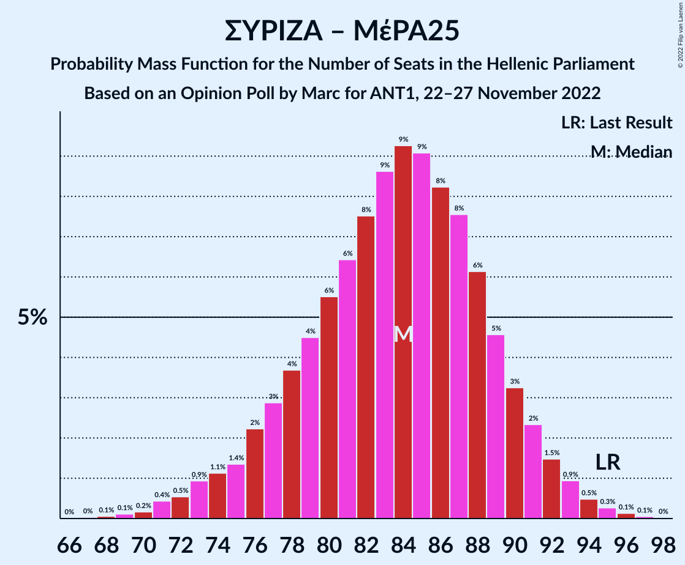

| Number of Seats | Probability | Accumulated | Special Marks |
|:---------------:|:-----------:|:-----------:|:-------------:|
| 67 | 0% | 100% |  |
| 68 | 0.1% | 99.9% |  |
| 69 | 0.1% | 99.9% |  |
| 70 | 0.2% | 99.8% |  |
| 71 | 0.4% | 99.6% |  |
| 72 | 0.5% | 99.2% |  |
| 73 | 0.9% | 98.6% |  |
| 74 | 1.1% | 98% |  |
| 75 | 1.4% | 97% |  |
| 76 | 2% | 95% |  |
| 77 | 3% | 93% |  |
| 78 | 4% | 90% |  |
| 79 | 4% | 86% |  |
| 80 | 6% | 82% |  |
| 81 | 6% | 76% |  |
| 82 | 8% | 70% |  |
| 83 | 9% | 62% |  |
| 84 | 9% | 54% |  |
| 85 | 9% | 45% | Median |
| 86 | 8% | 35% |  |
| 87 | 8% | 27% |  |
| 88 | 6% | 20% |  |
| 89 | 5% | 14% |  |
| 90 | 3% | 9% |  |
| 91 | 2% | 6% |  |
| 92 | 1.5% | 3% |  |
| 93 | 0.9% | 2% |  |
| 94 | 0.5% | 1.0% |  |
| 95 | 0.3% | 0.5% | Last Result |
| 96 | 0.1% | 0.2% |  |
| 97 | 0.1% | 0.1% |  |
| 98 | 0% | 0% |  |

### Συνασπισμός Ριζοσπαστικής Αριστεράς

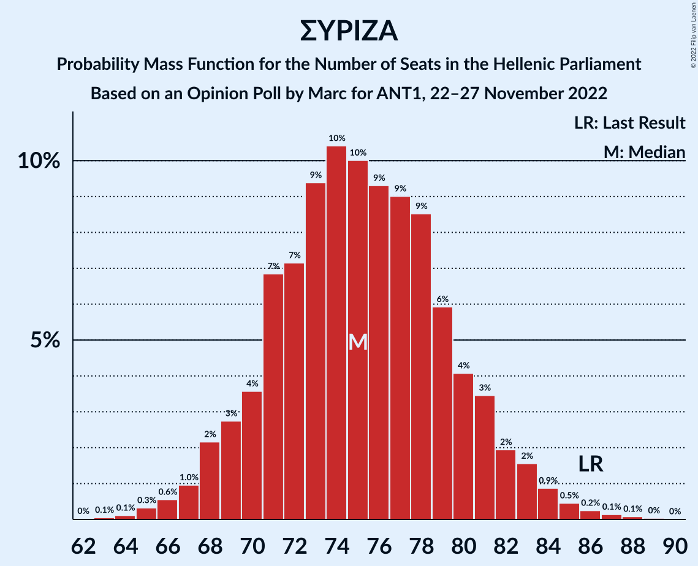

| Number of Seats | Probability | Accumulated | Special Marks |
|:---------------:|:-----------:|:-----------:|:-------------:|
| 63 | 0.1% | 100% |  |
| 64 | 0.1% | 99.9% |  |
| 65 | 0.3% | 99.8% |  |
| 66 | 0.6% | 99.5% |  |
| 67 | 1.0% | 98.9% |  |
| 68 | 2% | 98% |  |
| 69 | 3% | 96% |  |
| 70 | 4% | 93% |  |
| 71 | 7% | 89% |  |
| 72 | 7% | 83% |  |
| 73 | 9% | 75% |  |
| 74 | 10% | 66% |  |
| 75 | 10% | 56% | Median |
| 76 | 9% | 46% |  |
| 77 | 9% | 36% |  |
| 78 | 9% | 27% |  |
| 79 | 6% | 19% |  |
| 80 | 4% | 13% |  |
| 81 | 3% | 9% |  |
| 82 | 2% | 5% |  |
| 83 | 2% | 3% |  |
| 84 | 0.9% | 2% |  |
| 85 | 0.5% | 1.0% |  |
| 86 | 0.2% | 0.5% | Last Result |
| 87 | 0.1% | 0.3% |  |
| 88 | 0.1% | 0.1% |  |
| 89 | 0% | 0.1% |  |
| 90 | 0% | 0% |  |

## Technical Information

### Opinion Poll

+ **Polling firm:** Marc
+ **Commissioner(s):** ANT1
+ **Fieldwork period:** 22–27 November 2022

### Calculations

+ **Sample size:** 1030
+ **Simulations done:** 1,048,576
+ **Error estimate:** 0.52%

