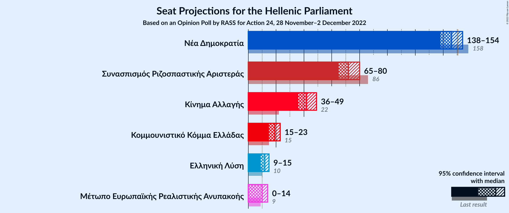
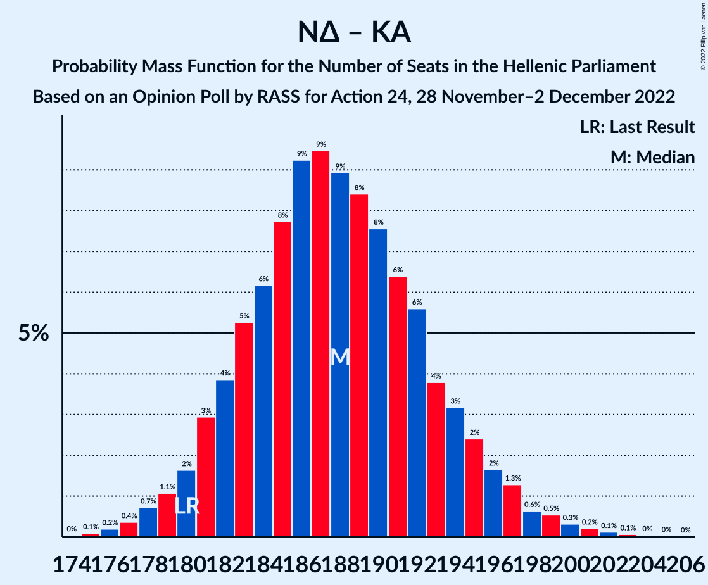

# Opinion Poll by RASS for Action 24, 28 November–2 December 2022

<a href="#voting-intentions">Voting Intentions</a> | <a href="#seats">Seats</a> | <a href="#coalitions">Coalitions</a> | <a href="#technical-information">Technical Information</a>

## Voting Intentions

### Confidence Intervals

| Party | Last Result | Poll Result | 80% Confidence Interval | 90% Confidence Interval | 95% Confidence Interval | 99% Confidence Interval |
|:-----:|:-----------:|:-----------:|:-----------------------:|:-----------------------:|:-----------------------:|:-----------------------:|
| Νέα Δημοκρατία | 39.8% | 35.5% | 33.6–37.5% |33.1–38.1% |32.6–38.5% |31.7–39.5% |
| Συνασπισμός Ριζοσπαστικής Αριστεράς | 31.5% | 26.7% | 25.0–28.6% |24.5–29.1% |24.1–29.6% |23.3–30.5% |
| Κίνημα Αλλαγής | 8.1% | 15.7% | 14.3–17.2% |13.9–17.7% |13.5–18.1% |12.9–18.8% |
| Κομμουνιστικό Κόμμα Ελλάδας | 5.3% | 7.0% | 6.1–8.1% |5.8–8.5% |5.6–8.7% |5.1–9.3% |
| Ελληνική Λύση | 3.7% | 4.3% | 3.6–5.2% |3.4–5.5% |3.2–5.7% |2.9–6.2% |
| Μέτωπο Ευρωπαϊκής Ρεαλιστικής Ανυπακοής | 3.4% | 3.7% | 3.0–4.6% |2.8–4.8% |2.7–5.1% |2.4–5.5% |

*Note:* The poll result column reflects the actual value used in the calculations. Published results may vary slightly, and in addition be rounded to fewer digits.

## Seats

### Confidence Intervals

| Party | Last Result | Median | 80% Confidence Interval | 90% Confidence Interval | 95% Confidence Interval | 99% Confidence Interval |
|:-----:|:-----------:|:------:|:-----------------------:|:-----------------------:|:-----------------------:|:-----------------------:|
| <a href="#νέα-δημοκρατία">Νέα Δημοκρατία</a> | 158 | 146 | 140–151 |139–152 |138–154 |135–157 |
| <a href="#συνασπισμός-ριζοσπαστικής-αριστεράς">Συνασπισμός Ριζοσπαστικής Αριστεράς</a> | 86 | 72 | 67–77 |66–78 |65–80 |63–82 |
| <a href="#κίνημα-αλλαγής">Κίνημα Αλλαγής</a> | 22 | 42 | 38–46 |37–48 |36–49 |35–51 |
| <a href="#κομμουνιστικό-κόμμα-ελλάδας">Κομμουνιστικό Κόμμα Ελλάδας</a> | 15 | 19 | 16–22 |16–23 |15–23 |14–25 |
| <a href="#ελληνική-λύση">Ελληνική Λύση</a> | 10 | 12 | 10–14 |9–15 |9–15 |0–17 |
| <a href="#μέτωπο-ευρωπαϊκής-ρεαλιστικής-ανυπακοής">Μέτωπο Ευρωπαϊκής Ρεαλιστικής Ανυπακοής</a> | 9 | 10 | 8–12 |0–13 |0–14 |0–15 |

### Νέα Δημοκρατία

*For a full overview of the results for this party, see the [Νέα Δημοκρατία](party-νέαδημοκρατία.html) page.*

| Number of Seats | Probability | Accumulated | Special Marks |
|:---------------:|:-----------:|:-----------:|:-------------:|
| 132 | 0% | 100% |  |
| 133 | 0.1% | 99.9% |  |
| 134 | 0.2% | 99.9% |  |
| 135 | 0.3% | 99.7% |  |
| 136 | 0.7% | 99.4% |  |
| 137 | 1.1% | 98.7% |  |
| 138 | 2% | 98% |  |
| 139 | 3% | 96% |  |
| 140 | 4% | 93% |  |
| 141 | 6% | 89% |  |
| 142 | 7% | 83% |  |
| 143 | 7% | 76% |  |
| 144 | 8% | 69% |  |
| 145 | 10% | 60% |  |
| 146 | 11% | 50% | Median |
| 147 | 9% | 40% |  |
| 148 | 7% | 31% |  |
| 149 | 6% | 23% |  |
| 150 | 5% | 17% |  |
| 151 | 4% | 12% | Majority |
| 152 | 3% | 8% |  |
| 153 | 2% | 5% |  |
| 154 | 1.1% | 3% |  |
| 155 | 0.8% | 2% |  |
| 156 | 0.5% | 1.1% |  |
| 157 | 0.3% | 0.6% |  |
| 158 | 0.1% | 0.3% | Last Result |
| 159 | 0.1% | 0.2% |  |
| 160 | 0% | 0.1% |  |
| 161 | 0% | 0% |  |

### Συνασπισμός Ριζοσπαστικής Αριστεράς

*For a full overview of the results for this party, see the [Συνασπισμός Ριζοσπαστικής Αριστεράς](party-συνασπισμόςριζοσπαστικήςαριστεράς.html) page.*

| Number of Seats | Probability | Accumulated | Special Marks |
|:---------------:|:-----------:|:-----------:|:-------------:|
| 60 | 0.1% | 100% |  |
| 61 | 0.1% | 99.9% |  |
| 62 | 0.3% | 99.8% |  |
| 63 | 0.5% | 99.5% |  |
| 64 | 1.2% | 99.0% |  |
| 65 | 2% | 98% |  |
| 66 | 3% | 96% |  |
| 67 | 4% | 93% |  |
| 68 | 7% | 89% |  |
| 69 | 8% | 82% |  |
| 70 | 10% | 74% |  |
| 71 | 10% | 64% |  |
| 72 | 10% | 54% | Median |
| 73 | 10% | 45% |  |
| 74 | 9% | 34% |  |
| 75 | 8% | 25% |  |
| 76 | 5% | 17% |  |
| 77 | 4% | 12% |  |
| 78 | 3% | 7% |  |
| 79 | 2% | 5% |  |
| 80 | 1.1% | 3% |  |
| 81 | 0.8% | 2% |  |
| 82 | 0.4% | 0.9% |  |
| 83 | 0.2% | 0.5% |  |
| 84 | 0.1% | 0.2% |  |
| 85 | 0.1% | 0.1% |  |
| 86 | 0% | 0.1% | Last Result |
| 87 | 0% | 0% |  |

### Κίνημα Αλλαγής

*For a full overview of the results for this party, see the [Κίνημα Αλλαγής](party-κίνημααλλαγής.html) page.*

| Number of Seats | Probability | Accumulated | Special Marks |
|:---------------:|:-----------:|:-----------:|:-------------:|
| 22 | 0% | 100% | Last Result |
| 23 | 0% | 100% |  |
| 24 | 0% | 100% |  |
| 25 | 0% | 100% |  |
| 26 | 0% | 100% |  |
| 27 | 0% | 100% |  |
| 28 | 0% | 100% |  |
| 29 | 0% | 100% |  |
| 30 | 0% | 100% |  |
| 31 | 0% | 100% |  |
| 32 | 0% | 100% |  |
| 33 | 0.1% | 100% |  |
| 34 | 0.3% | 99.9% |  |
| 35 | 0.8% | 99.6% |  |
| 36 | 2% | 98.8% |  |
| 37 | 3% | 97% |  |
| 38 | 5% | 94% |  |
| 39 | 8% | 89% |  |
| 40 | 11% | 81% |  |
| 41 | 12% | 70% |  |
| 42 | 11% | 58% | Median |
| 43 | 12% | 47% |  |
| 44 | 12% | 35% |  |
| 45 | 9% | 23% |  |
| 46 | 5% | 15% |  |
| 47 | 4% | 9% |  |
| 48 | 2% | 5% |  |
| 49 | 2% | 3% |  |
| 50 | 0.7% | 1.3% |  |
| 51 | 0.3% | 0.6% |  |
| 52 | 0.1% | 0.2% |  |
| 53 | 0.1% | 0.1% |  |
| 54 | 0% | 0% |  |

### Κομμουνιστικό Κόμμα Ελλάδας

*For a full overview of the results for this party, see the [Κομμουνιστικό Κόμμα Ελλάδας](party-κομμουνιστικόκόμμαελλάδας.html) page.*

| Number of Seats | Probability | Accumulated | Special Marks |
|:---------------:|:-----------:|:-----------:|:-------------:|
| 13 | 0.2% | 100% |  |
| 14 | 1.1% | 99.7% |  |
| 15 | 3% | 98.6% | Last Result |
| 16 | 8% | 96% |  |
| 17 | 11% | 87% |  |
| 18 | 19% | 76% |  |
| 19 | 16% | 57% | Median |
| 20 | 17% | 41% |  |
| 21 | 11% | 24% |  |
| 22 | 7% | 13% |  |
| 23 | 4% | 6% |  |
| 24 | 1.3% | 2% |  |
| 25 | 0.8% | 1.1% |  |
| 26 | 0.2% | 0.3% |  |
| 27 | 0.1% | 0.1% |  |
| 28 | 0% | 0% |  |

### Ελληνική Λύση

*For a full overview of the results for this party, see the [Ελληνική Λύση](party-ελληνικήλύση.html) page.*

| Number of Seats | Probability | Accumulated | Special Marks |
|:---------------:|:-----------:|:-----------:|:-------------:|
| 0 | 1.0% | 100% |  |
| 1 | 0% | 99.0% |  |
| 2 | 0% | 99.0% |  |
| 3 | 0% | 99.0% |  |
| 4 | 0% | 99.0% |  |
| 5 | 0% | 99.0% |  |
| 6 | 0% | 99.0% |  |
| 7 | 0% | 99.0% |  |
| 8 | 1.3% | 99.0% |  |
| 9 | 6% | 98% |  |
| 10 | 15% | 91% | Last Result |
| 11 | 22% | 77% |  |
| 12 | 22% | 55% | Median |
| 13 | 17% | 33% |  |
| 14 | 9% | 16% |  |
| 15 | 4% | 7% |  |
| 16 | 2% | 2% |  |
| 17 | 0.5% | 0.7% |  |
| 18 | 0.1% | 0.2% |  |
| 19 | 0% | 0% |  |

### Μέτωπο Ευρωπαϊκής Ρεαλιστικής Ανυπακοής

*For a full overview of the results for this party, see the [Μέτωπο Ευρωπαϊκής Ρεαλιστικής Ανυπακοής](party-μέτωποευρωπαϊκήςρεαλιστικήςανυπακοής.html) page.*

| Number of Seats | Probability | Accumulated | Special Marks |
|:---------------:|:-----------:|:-----------:|:-------------:|
| 0 | 9% | 100% |  |
| 1 | 0% | 91% |  |
| 2 | 0% | 91% |  |
| 3 | 0% | 91% |  |
| 4 | 0% | 91% |  |
| 5 | 0% | 91% |  |
| 6 | 0% | 91% |  |
| 7 | 0% | 91% |  |
| 8 | 5% | 91% |  |
| 9 | 21% | 85% | Last Result |
| 10 | 26% | 64% | Median |
| 11 | 19% | 38% |  |
| 12 | 11% | 19% |  |
| 13 | 6% | 8% |  |
| 14 | 2% | 3% |  |
| 15 | 0.5% | 0.7% |  |
| 16 | 0.1% | 0.2% |  |
| 17 | 0% | 0% |  |

## Coalitions

### Confidence Intervals

| Coalition | Last Result | Median | Majority? | 80% Confidence Interval | 90% Confidence Interval | 95% Confidence Interval | 99% Confidence Interval |
|:---------:|:-----------:|:------:|:---------:|:-----------------------:|:-----------------------:|:-----------------------:|:-----------------------:|
| Νέα Δημοκρατία – Κίνημα Αλλαγής | 180 | 188 | 100% | 182–194 | 181–195 | 179–197 | 177–200 |
| Νέα Δημοκρατία | 158 | 146 | 12% | 140–151 | 139–152 | 138–154 | 135–157 |
| Συνασπισμός Ριζοσπαστικής Αριστεράς – Μέτωπο Ευρωπαϊκής Ρεαλιστικής Ανυπακοής | 95 | 82 | 0% | 76–87 | 74–88 | 72–90 | 69–92 |
| Συνασπισμός Ριζοσπαστικής Αριστεράς | 86 | 72 | 0% | 67–77 | 66–78 | 65–80 | 63–82 |

### Νέα Δημοκρατία – Κίνημα Αλλαγής

| Number of Seats | Probability | Accumulated | Special Marks |
|:---------------:|:-----------:|:-----------:|:-------------:|
| 174 | 0% | 100% |  |
| 175 | 0.1% | 99.9% |  |
| 176 | 0.2% | 99.8% |  |
| 177 | 0.4% | 99.6% |  |
| 178 | 0.7% | 99.3% |  |
| 179 | 1.1% | 98.5% |  |
| 180 | 2% | 97% | Last Result |
| 181 | 3% | 96% |  |
| 182 | 4% | 93% |  |
| 183 | 5% | 89% |  |
| 184 | 6% | 84% |  |
| 185 | 8% | 78% |  |
| 186 | 9% | 70% |  |
| 187 | 9% | 61% |  |
| 188 | 9% | 51% | Median |
| 189 | 8% | 42% |  |
| 190 | 8% | 34% |  |
| 191 | 6% | 26% |  |
| 192 | 6% | 20% |  |
| 193 | 4% | 14% |  |
| 194 | 3% | 10% |  |
| 195 | 2% | 7% |  |
| 196 | 2% | 5% |  |
| 197 | 1.3% | 3% |  |
| 198 | 0.6% | 2% |  |
| 199 | 0.5% | 1.3% |  |
| 200 | 0.3% | 0.8% |  |
| 201 | 0.2% | 0.5% |  |
| 202 | 0.1% | 0.3% |  |
| 203 | 0.1% | 0.1% |  |
| 204 | 0% | 0.1% |  |
| 205 | 0% | 0% |  |

### Νέα Δημοκρατία

| Number of Seats | Probability | Accumulated | Special Marks |
|:---------------:|:-----------:|:-----------:|:-------------:|
| 132 | 0% | 100% |  |
| 133 | 0.1% | 99.9% |  |
| 134 | 0.2% | 99.9% |  |
| 135 | 0.3% | 99.7% |  |
| 136 | 0.7% | 99.4% |  |
| 137 | 1.1% | 98.7% |  |
| 138 | 2% | 98% |  |
| 139 | 3% | 96% |  |
| 140 | 4% | 93% |  |
| 141 | 6% | 89% |  |
| 142 | 7% | 83% |  |
| 143 | 7% | 76% |  |
| 144 | 8% | 69% |  |
| 145 | 10% | 60% |  |
| 146 | 11% | 50% | Median |
| 147 | 9% | 40% |  |
| 148 | 7% | 31% |  |
| 149 | 6% | 23% |  |
| 150 | 5% | 17% |  |
| 151 | 4% | 12% | Majority |
| 152 | 3% | 8% |  |
| 153 | 2% | 5% |  |
| 154 | 1.1% | 3% |  |
| 155 | 0.8% | 2% |  |
| 156 | 0.5% | 1.1% |  |
| 157 | 0.3% | 0.6% |  |
| 158 | 0.1% | 0.3% | Last Result |
| 159 | 0.1% | 0.2% |  |
| 160 | 0% | 0.1% |  |
| 161 | 0% | 0% |  |

### Συνασπισμός Ριζοσπαστικής Αριστεράς – Μέτωπο Ευρωπαϊκής Ρεαλιστικής Ανυπακοής

| Number of Seats | Probability | Accumulated | Special Marks |
|:---------------:|:-----------:|:-----------:|:-------------:|
| 65 | 0% | 100% |  |
| 66 | 0.1% | 99.9% |  |
| 67 | 0.1% | 99.9% |  |
| 68 | 0.2% | 99.8% |  |
| 69 | 0.4% | 99.5% |  |
| 70 | 0.4% | 99.1% |  |
| 71 | 0.8% | 98.7% |  |
| 72 | 0.9% | 98% |  |
| 73 | 2% | 97% |  |
| 74 | 2% | 95% |  |
| 75 | 2% | 93% |  |
| 76 | 3% | 91% |  |
| 77 | 5% | 88% |  |
| 78 | 6% | 83% |  |
| 79 | 7% | 77% |  |
| 80 | 10% | 70% |  |
| 81 | 9% | 60% |  |
| 82 | 10% | 52% | Median |
| 83 | 10% | 42% |  |
| 84 | 8% | 32% |  |
| 85 | 7% | 24% |  |
| 86 | 6% | 17% |  |
| 87 | 4% | 11% |  |
| 88 | 3% | 7% |  |
| 89 | 2% | 4% |  |
| 90 | 1.2% | 3% |  |
| 91 | 0.7% | 1.4% |  |
| 92 | 0.3% | 0.7% |  |
| 93 | 0.2% | 0.4% |  |
| 94 | 0.1% | 0.2% |  |
| 95 | 0% | 0.1% | Last Result |
| 96 | 0% | 0% |  |

### Συνασπισμός Ριζοσπαστικής Αριστεράς

| Number of Seats | Probability | Accumulated | Special Marks |
|:---------------:|:-----------:|:-----------:|:-------------:|
| 60 | 0.1% | 100% |  |
| 61 | 0.1% | 99.9% |  |
| 62 | 0.3% | 99.8% |  |
| 63 | 0.5% | 99.5% |  |
| 64 | 1.2% | 99.0% |  |
| 65 | 2% | 98% |  |
| 66 | 3% | 96% |  |
| 67 | 4% | 93% |  |
| 68 | 7% | 89% |  |
| 69 | 8% | 82% |  |
| 70 | 10% | 74% |  |
| 71 | 10% | 64% |  |
| 72 | 10% | 54% | Median |
| 73 | 10% | 45% |  |
| 74 | 9% | 34% |  |
| 75 | 8% | 25% |  |
| 76 | 5% | 17% |  |
| 77 | 4% | 12% |  |
| 78 | 3% | 7% |  |
| 79 | 2% | 5% |  |
| 80 | 1.1% | 3% |  |
| 81 | 0.8% | 2% |  |
| 82 | 0.4% | 0.9% |  |
| 83 | 0.2% | 0.5% |  |
| 84 | 0.1% | 0.2% |  |
| 85 | 0.1% | 0.1% |  |
| 86 | 0% | 0.1% | Last Result |
| 87 | 0% | 0% |  |

## Technical Information

### Opinion Poll

+ **Polling firm:** RASS
+ **Commissioner(s):** Action 24
+ **Fieldwork period:** 28 November–2 December 2022

### Calculations

+ **Sample size:** 1002
+ **Simulations done:** 1,048,576
+ **Error estimate:** 0.50%

