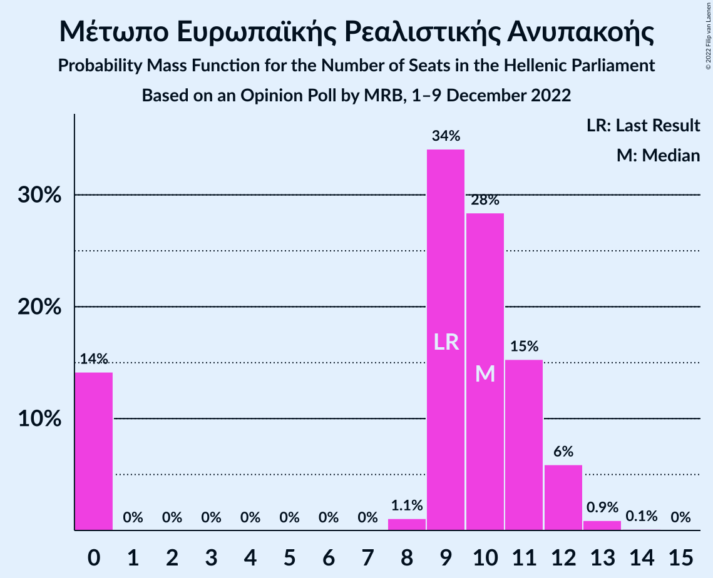

# Opinion Poll by MRB, 1–9 December 2022

<a href="#voting-intentions">Voting Intentions</a> | <a href="#seats">Seats</a> | <a href="#coalitions">Coalitions</a> | <a href="#technical-information">Technical Information</a>

## Voting Intentions

### Confidence Intervals

| Party | Last Result | Poll Result | 80% Confidence Interval | 90% Confidence Interval | 95% Confidence Interval | 99% Confidence Interval |
|:-----:|:-----------:|:-----------:|:-----------------------:|:-----------------------:|:-----------------------:|:-----------------------:|
| Νέα Δημοκρατία | 39.8% | 33.5% | 32.2–34.9% |31.8–35.3% |31.5–35.6% |30.8–36.3% |
| Συνασπισμός Ριζοσπαστικής Αριστεράς | 31.5% | 27.2% | 25.9–28.5% |25.6–28.9% |25.3–29.2% |24.7–29.8% |
| Κίνημα Αλλαγής | 8.1% | 13.3% | 12.4–14.3% |12.1–14.6% |11.9–14.9% |11.4–15.4% |
| Κομμουνιστικό Κόμμα Ελλάδας | 5.3% | 6.0% | 5.4–6.7% |5.2–7.0% |5.0–7.1% |4.8–7.5% |
| Ελληνική Λύση | 3.7% | 5.3% | 4.7–6.0% |4.5–6.2% |4.4–6.4% |4.1–6.7% |
| Μέτωπο Ευρωπαϊκής Ρεαλιστικής Ανυπακοής | 3.4% | 3.4% | 2.9–4.0% |2.8–4.1% |2.7–4.3% |2.5–4.6% |

*Note:* The poll result column reflects the actual value used in the calculations. Published results may vary slightly, and in addition be rounded to fewer digits.

## Seats

### Confidence Intervals

| Party | Last Result | Median | 80% Confidence Interval | 90% Confidence Interval | 95% Confidence Interval | 99% Confidence Interval |
|:-----:|:-----------:|:------:|:-----------------------:|:-----------------------:|:-----------------------:|:-----------------------:|
| <a href="#νέα-δημοκρατία">Νέα Δημοκρατία</a> | 158 | 144 | 141–149 |140–150 |139–152 |137–154 |
| <a href="#συνασπισμός-ριζοσπαστικής-αριστεράς">Συνασπισμός Ριζοσπαστικής Αριστεράς</a> | 86 | 77 | 73–81 |72–82 |71–83 |70–85 |
| <a href="#κίνημα-αλλαγής">Κίνημα Αλλαγής</a> | 22 | 38 | 35–41 |34–42 |34–42 |32–44 |
| <a href="#κομμουνιστικό-κόμμα-ελλάδας">Κομμουνιστικό Κόμμα Ελλάδας</a> | 15 | 17 | 15–19 |15–20 |14–20 |13–21 |
| <a href="#ελληνική-λύση">Ελληνική Λύση</a> | 10 | 15 | 13–17 |13–18 |12–18 |12–19 |
| <a href="#μέτωπο-ευρωπαϊκής-ρεαλιστικής-ανυπακοής">Μέτωπο Ευρωπαϊκής Ρεαλιστικής Ανυπακοής</a> | 9 | 10 | 0–11 |0–12 |0–12 |0–13 |

### Νέα Δημοκρατία

*For a full overview of the results for this party, see the [Νέα Δημοκρατία](party-νέαδημοκρατία.html) page.*

| Number of Seats | Probability | Accumulated | Special Marks |
|:---------------:|:-----------:|:-----------:|:-------------:|
| 135 | 0.1% | 100% |  |
| 136 | 0.2% | 99.9% |  |
| 137 | 0.5% | 99.7% |  |
| 138 | 1.2% | 99.2% |  |
| 139 | 3% | 98% |  |
| 140 | 4% | 95% |  |
| 141 | 7% | 91% |  |
| 142 | 9% | 84% |  |
| 143 | 12% | 75% |  |
| 144 | 13% | 63% | Median |
| 145 | 13% | 50% |  |
| 146 | 11% | 37% |  |
| 147 | 9% | 26% |  |
| 148 | 6% | 18% |  |
| 149 | 4% | 12% |  |
| 150 | 3% | 8% |  |
| 151 | 2% | 5% | Majority |
| 152 | 1.4% | 3% |  |
| 153 | 0.8% | 1.4% |  |
| 154 | 0.4% | 0.7% |  |
| 155 | 0.2% | 0.3% |  |
| 156 | 0.1% | 0.1% |  |
| 157 | 0% | 0% |  |
| 158 | 0% | 0% | Last Result |

### Συνασπισμός Ριζοσπαστικής Αριστεράς

*For a full overview of the results for this party, see the [Συνασπισμός Ριζοσπαστικής Αριστεράς](party-συνασπισμόςριζοσπαστικήςαριστεράς.html) page.*

| Number of Seats | Probability | Accumulated | Special Marks |
|:---------------:|:-----------:|:-----------:|:-------------:|
| 68 | 0.1% | 100% |  |
| 69 | 0.3% | 99.9% |  |
| 70 | 0.9% | 99.5% |  |
| 71 | 2% | 98.6% |  |
| 72 | 4% | 97% |  |
| 73 | 6% | 93% |  |
| 74 | 9% | 87% |  |
| 75 | 11% | 77% |  |
| 76 | 13% | 66% |  |
| 77 | 14% | 53% | Median |
| 78 | 12% | 40% |  |
| 79 | 10% | 28% |  |
| 80 | 7% | 18% |  |
| 81 | 5% | 11% |  |
| 82 | 3% | 6% |  |
| 83 | 2% | 3% |  |
| 84 | 0.7% | 1.4% |  |
| 85 | 0.4% | 0.7% |  |
| 86 | 0.2% | 0.3% | Last Result |
| 87 | 0.1% | 0.1% |  |
| 88 | 0% | 0.1% |  |
| 89 | 0% | 0% |  |

### Κίνημα Αλλαγής

*For a full overview of the results for this party, see the [Κίνημα Αλλαγής](party-κίνημααλλαγής.html) page.*

| Number of Seats | Probability | Accumulated | Special Marks |
|:---------------:|:-----------:|:-----------:|:-------------:|
| 22 | 0% | 100% | Last Result |
| 23 | 0% | 100% |  |
| 24 | 0% | 100% |  |
| 25 | 0% | 100% |  |
| 26 | 0% | 100% |  |
| 27 | 0% | 100% |  |
| 28 | 0% | 100% |  |
| 29 | 0% | 100% |  |
| 30 | 0% | 100% |  |
| 31 | 0.1% | 100% |  |
| 32 | 0.6% | 99.8% |  |
| 33 | 2% | 99.3% |  |
| 34 | 4% | 98% |  |
| 35 | 9% | 93% |  |
| 36 | 13% | 85% |  |
| 37 | 17% | 72% |  |
| 38 | 18% | 55% | Median |
| 39 | 15% | 37% |  |
| 40 | 11% | 22% |  |
| 41 | 6% | 11% |  |
| 42 | 3% | 5% |  |
| 43 | 1.5% | 2% |  |
| 44 | 0.5% | 0.7% |  |
| 45 | 0.2% | 0.2% |  |
| 46 | 0% | 0% |  |

### Κομμουνιστικό Κόμμα Ελλάδας

*For a full overview of the results for this party, see the [Κομμουνιστικό Κόμμα Ελλάδας](party-κομμουνιστικόκόμμαελλάδας.html) page.*

| Number of Seats | Probability | Accumulated | Special Marks |
|:---------------:|:-----------:|:-----------:|:-------------:|
| 12 | 0.1% | 100% |  |
| 13 | 0.7% | 99.9% |  |
| 14 | 4% | 99.3% |  |
| 15 | 12% | 95% | Last Result |
| 16 | 22% | 84% |  |
| 17 | 25% | 62% | Median |
| 18 | 20% | 36% |  |
| 19 | 11% | 17% |  |
| 20 | 4% | 6% |  |
| 21 | 1.3% | 2% |  |
| 22 | 0.3% | 0.3% |  |
| 23 | 0% | 0.1% |  |
| 24 | 0% | 0% |  |

### Ελληνική Λύση

*For a full overview of the results for this party, see the [Ελληνική Λύση](party-ελληνικήλύση.html) page.*

| Number of Seats | Probability | Accumulated | Special Marks |
|:---------------:|:-----------:|:-----------:|:-------------:|
| 10 | 0% | 100% | Last Result |
| 11 | 0.4% | 100% |  |
| 12 | 3% | 99.6% |  |
| 13 | 10% | 96% |  |
| 14 | 18% | 86% |  |
| 15 | 23% | 68% | Median |
| 16 | 23% | 45% |  |
| 17 | 15% | 22% |  |
| 18 | 5% | 7% |  |
| 19 | 1.3% | 2% |  |
| 20 | 0.2% | 0.2% |  |
| 21 | 0% | 0% |  |

### Μέτωπο Ευρωπαϊκής Ρεαλιστικής Ανυπακοής

*For a full overview of the results for this party, see the [Μέτωπο Ευρωπαϊκής Ρεαλιστικής Ανυπακοής](party-μέτωποευρωπαϊκήςρεαλιστικήςανυπακοής.html) page.*

| Number of Seats | Probability | Accumulated | Special Marks |
|:---------------:|:-----------:|:-----------:|:-------------:|
| 0 | 14% | 100% |  |
| 1 | 0% | 86% |  |
| 2 | 0% | 86% |  |
| 3 | 0% | 86% |  |
| 4 | 0% | 86% |  |
| 5 | 0% | 86% |  |
| 6 | 0% | 86% |  |
| 7 | 0% | 86% |  |
| 8 | 1.1% | 86% |  |
| 9 | 34% | 85% | Last Result |
| 10 | 28% | 51% | Median |
| 11 | 15% | 22% |  |
| 12 | 6% | 7% |  |
| 13 | 0.9% | 1.0% |  |
| 14 | 0.1% | 0.1% |  |
| 15 | 0% | 0% |  |

## Coalitions

### Confidence Intervals

| Coalition | Last Result | Median | Majority? | 80% Confidence Interval | 90% Confidence Interval | 95% Confidence Interval | 99% Confidence Interval |
|:---------:|:-----------:|:------:|:---------:|:-----------------------:|:-----------------------:|:-----------------------:|:-----------------------:|
| Νέα Δημοκρατία – Κίνημα Αλλαγής | 180 | 182 | 100% | 178–187 | 177–189 | 176–191 | 174–193 |
| Νέα Δημοκρατία | 158 | 144 | 5% | 141–149 | 140–150 | 139–152 | 137–154 |
| Συνασπισμός Ριζοσπαστικής Αριστεράς – Μέτωπο Ευρωπαϊκής Ρεαλιστικής Ανυπακοής | 95 | 86 | 0% | 80–90 | 78–91 | 77–92 | 74–94 |
| Συνασπισμός Ριζοσπαστικής Αριστεράς | 86 | 77 | 0% | 73–81 | 72–82 | 71–83 | 70–85 |

### Νέα Δημοκρατία – Κίνημα Αλλαγής

| Number of Seats | Probability | Accumulated | Special Marks |
|:---------------:|:-----------:|:-----------:|:-------------:|
| 172 | 0.1% | 100% |  |
| 173 | 0.2% | 99.9% |  |
| 174 | 0.5% | 99.7% |  |
| 175 | 0.9% | 99.2% |  |
| 176 | 2% | 98% |  |
| 177 | 4% | 96% |  |
| 178 | 6% | 93% |  |
| 179 | 7% | 87% |  |
| 180 | 10% | 80% | Last Result |
| 181 | 12% | 70% |  |
| 182 | 12% | 58% | Median |
| 183 | 11% | 46% |  |
| 184 | 9% | 35% |  |
| 185 | 8% | 26% |  |
| 186 | 5% | 19% |  |
| 187 | 4% | 13% |  |
| 188 | 3% | 9% |  |
| 189 | 2% | 6% |  |
| 190 | 1.3% | 4% |  |
| 191 | 1.4% | 3% |  |
| 192 | 0.7% | 1.3% |  |
| 193 | 0.3% | 0.6% |  |
| 194 | 0.2% | 0.3% |  |
| 195 | 0.1% | 0.1% |  |
| 196 | 0% | 0% |  |

### Νέα Δημοκρατία

| Number of Seats | Probability | Accumulated | Special Marks |
|:---------------:|:-----------:|:-----------:|:-------------:|
| 135 | 0.1% | 100% |  |
| 136 | 0.2% | 99.9% |  |
| 137 | 0.5% | 99.7% |  |
| 138 | 1.2% | 99.2% |  |
| 139 | 3% | 98% |  |
| 140 | 4% | 95% |  |
| 141 | 7% | 91% |  |
| 142 | 9% | 84% |  |
| 143 | 12% | 75% |  |
| 144 | 13% | 63% | Median |
| 145 | 13% | 50% |  |
| 146 | 11% | 37% |  |
| 147 | 9% | 26% |  |
| 148 | 6% | 18% |  |
| 149 | 4% | 12% |  |
| 150 | 3% | 8% |  |
| 151 | 2% | 5% | Majority |
| 152 | 1.4% | 3% |  |
| 153 | 0.8% | 1.4% |  |
| 154 | 0.4% | 0.7% |  |
| 155 | 0.2% | 0.3% |  |
| 156 | 0.1% | 0.1% |  |
| 157 | 0% | 0% |  |
| 158 | 0% | 0% | Last Result |

### Συνασπισμός Ριζοσπαστικής Αριστεράς – Μέτωπο Ευρωπαϊκής Ρεαλιστικής Ανυπακοής

| Number of Seats | Probability | Accumulated | Special Marks |
|:---------------:|:-----------:|:-----------:|:-------------:|
| 72 | 0.1% | 100% |  |
| 73 | 0.1% | 99.9% |  |
| 74 | 0.4% | 99.8% |  |
| 75 | 0.7% | 99.4% |  |
| 76 | 1.1% | 98.6% |  |
| 77 | 2% | 98% |  |
| 78 | 2% | 96% |  |
| 79 | 3% | 94% |  |
| 80 | 3% | 91% |  |
| 81 | 4% | 88% |  |
| 82 | 5% | 85% |  |
| 83 | 7% | 80% |  |
| 84 | 10% | 73% |  |
| 85 | 10% | 63% |  |
| 86 | 12% | 52% |  |
| 87 | 11% | 40% | Median |
| 88 | 9% | 29% |  |
| 89 | 8% | 20% |  |
| 90 | 5% | 12% |  |
| 91 | 4% | 7% |  |
| 92 | 2% | 3% |  |
| 93 | 1.0% | 2% |  |
| 94 | 0.4% | 0.6% |  |
| 95 | 0.1% | 0.2% | Last Result |
| 96 | 0.1% | 0.1% |  |
| 97 | 0% | 0% |  |

### Συνασπισμός Ριζοσπαστικής Αριστεράς

| Number of Seats | Probability | Accumulated | Special Marks |
|:---------------:|:-----------:|:-----------:|:-------------:|
| 68 | 0.1% | 100% |  |
| 69 | 0.3% | 99.9% |  |
| 70 | 0.9% | 99.5% |  |
| 71 | 2% | 98.6% |  |
| 72 | 4% | 97% |  |
| 73 | 6% | 93% |  |
| 74 | 9% | 87% |  |
| 75 | 11% | 77% |  |
| 76 | 13% | 66% |  |
| 77 | 14% | 53% | Median |
| 78 | 12% | 40% |  |
| 79 | 10% | 28% |  |
| 80 | 7% | 18% |  |
| 81 | 5% | 11% |  |
| 82 | 3% | 6% |  |
| 83 | 2% | 3% |  |
| 84 | 0.7% | 1.4% |  |
| 85 | 0.4% | 0.7% |  |
| 86 | 0.2% | 0.3% | Last Result |
| 87 | 0.1% | 0.1% |  |
| 88 | 0% | 0.1% |  |
| 89 | 0% | 0% |  |

## Technical Information

### Opinion Poll

+ **Polling firm:** MRB
+ **Commissioner(s):** —
+ **Fieldwork period:** 1–9 December 2022

### Calculations

+ **Sample size:** 2000
+ **Simulations done:** 1,048,576
+ **Error estimate:** 0.82%

