# Opinion Poll by Interview for Politic.gr, 15–19 December 2022

<a href="#voting-intentions">Voting Intentions</a> | <a href="#seats">Seats</a> | <a href="#coalitions">Coalitions</a> | <a href="#technical-information">Technical Information</a>

## Voting Intentions

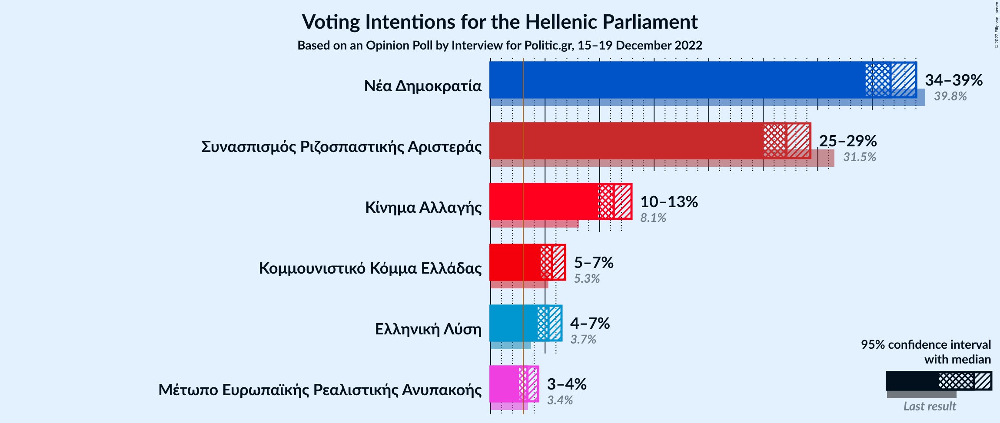

### Confidence Intervals

| Party | Last Result | Poll Result | 80% Confidence Interval | 90% Confidence Interval | 95% Confidence Interval | 99% Confidence Interval |
|:-----:|:-----------:|:-----------:|:-----------------------:|:-----------------------:|:-----------------------:|:-----------------------:|
| Νέα Δημοκρατία | 39.8% | 36.7% | 35.2–38.2% |34.8–38.7% |34.4–39.0% |33.7–39.8% |
| Συνασπισμός Ριζοσπαστικής Αριστεράς | 31.5% | 27.1% | 25.8–28.6% |25.4–29.0% |25.0–29.3% |24.4–30.0% |
| Κίνημα Αλλαγής | 8.1% | 11.3% | 10.3–12.4% |10.1–12.7% |9.9–12.9% |9.4–13.4% |
| Κομμουνιστικό Κόμμα Ελλάδας | 5.3% | 5.6% | 5.0–6.4% |4.8–6.6% |4.6–6.8% |4.3–7.2% |
| Ελληνική Λύση | 3.7% | 5.3% | 4.7–6.1% |4.5–6.3% |4.3–6.5% |4.0–6.9% |
| Μέτωπο Ευρωπαϊκής Ρεαλιστικής Ανυπακοής | 3.4% | 3.4% | 2.9–4.0% |2.7–4.2% |2.6–4.4% |2.4–4.7% |

*Note:* The poll result column reflects the actual value used in the calculations. Published results may vary slightly, and in addition be rounded to fewer digits.

## Seats

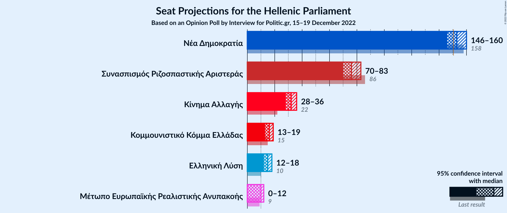

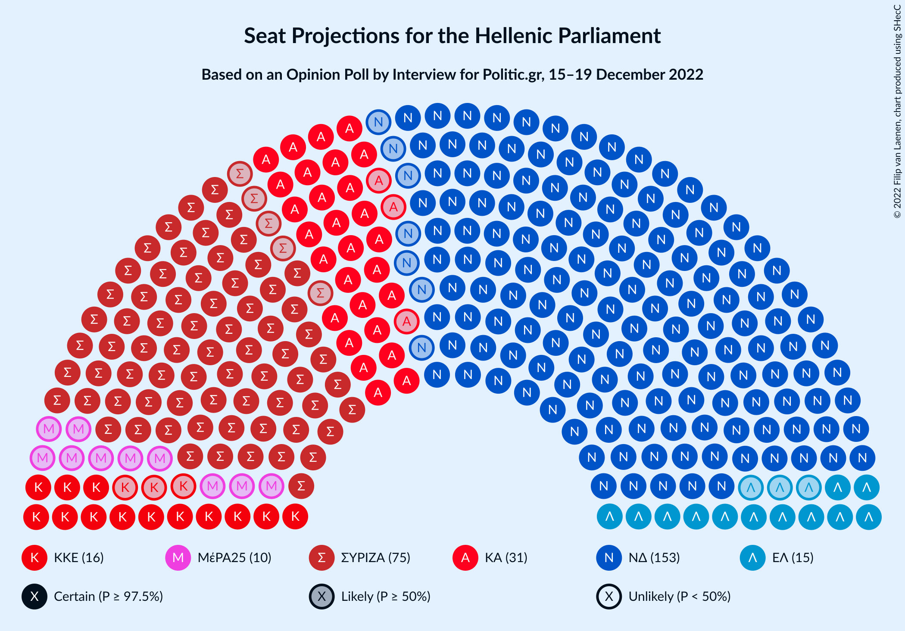

### Confidence Intervals

| Party | Last Result | Median | 80% Confidence Interval | 90% Confidence Interval | 95% Confidence Interval | 99% Confidence Interval |
|:-----:|:-----------:|:------:|:-----------------------:|:-----------------------:|:-----------------------:|:-----------------------:|
| <a href="#νέα-δημοκρατία">Νέα Δημοκρατία</a> | 158 | 153 | 148–158 |147–159 |146–160 |144–163 |
| <a href="#συνασπισμός-ριζοσπαστικής-αριστεράς">Συνασπισμός Ριζοσπαστικής Αριστεράς</a> | 86 | 76 | 72–80 |71–82 |70–83 |68–85 |
| <a href="#κίνημα-αλλαγής">Κίνημα Αλλαγής</a> | 22 | 32 | 29–35 |28–36 |28–36 |26–38 |
| <a href="#κομμουνιστικό-κόμμα-ελλάδας">Κομμουνιστικό Κόμμα Ελλάδας</a> | 15 | 16 | 14–18 |13–19 |13–19 |12–20 |
| <a href="#ελληνική-λύση">Ελληνική Λύση</a> | 10 | 15 | 13–17 |13–18 |12–18 |11–19 |
| <a href="#μέτωπο-ευρωπαϊκής-ρεαλιστικής-ανυπακοής">Μέτωπο Ευρωπαϊκής Ρεαλιστικής Ανυπακοής</a> | 9 | 10 | 0–11 |0–12 |0–12 |0–13 |

### Νέα Δημοκρατία

*For a full overview of the results for this party, see the [Νέα Δημοκρατία](party-νέαδημοκρατία.html) page.*

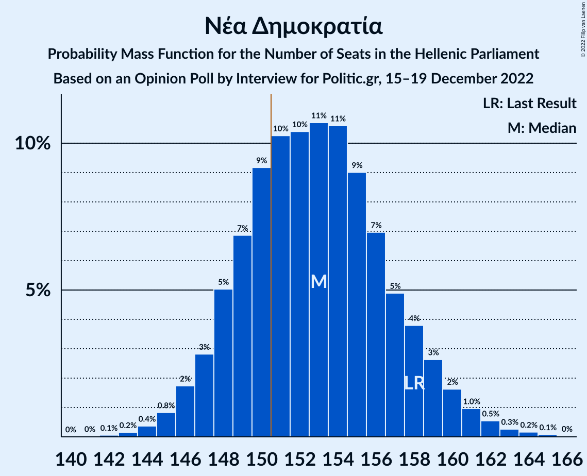

| Number of Seats | Probability | Accumulated | Special Marks |
|:---------------:|:-----------:|:-----------:|:-------------:|
| 142 | 0.1% | 100% |  |
| 143 | 0.2% | 99.9% |  |
| 144 | 0.4% | 99.8% |  |
| 145 | 0.8% | 99.4% |  |
| 146 | 2% | 98.6% |  |
| 147 | 3% | 97% |  |
| 148 | 5% | 94% |  |
| 149 | 7% | 89% |  |
| 150 | 9% | 82% |  |
| 151 | 10% | 73% | Majority |
| 152 | 10% | 63% |  |
| 153 | 11% | 52% | Median |
| 154 | 11% | 42% |  |
| 155 | 9% | 31% |  |
| 156 | 7% | 22% |  |
| 157 | 5% | 15% |  |
| 158 | 4% | 10% | Last Result |
| 159 | 3% | 6% |  |
| 160 | 2% | 4% |  |
| 161 | 1.0% | 2% |  |
| 162 | 0.5% | 1.1% |  |
| 163 | 0.3% | 0.6% |  |
| 164 | 0.2% | 0.3% |  |
| 165 | 0.1% | 0.1% |  |
| 166 | 0% | 0% |  |

### Συνασπισμός Ριζοσπαστικής Αριστεράς

*For a full overview of the results for this party, see the [Συνασπισμός Ριζοσπαστικής Αριστεράς](party-συνασπισμόςριζοσπαστικήςαριστεράς.html) page.*

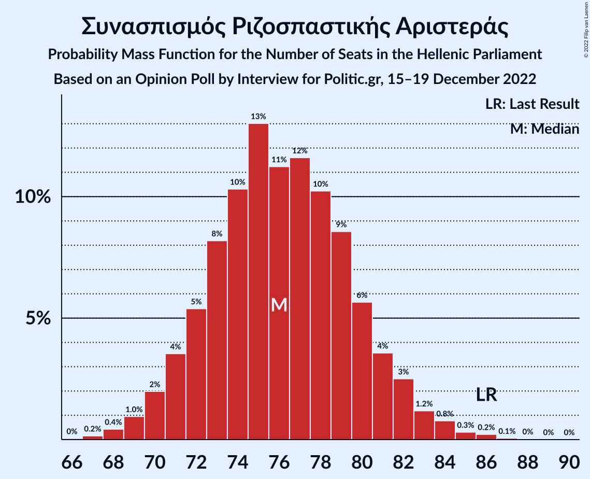

| Number of Seats | Probability | Accumulated | Special Marks |
|:---------------:|:-----------:|:-----------:|:-------------:|
| 66 | 0% | 100% |  |
| 67 | 0.2% | 99.9% |  |
| 68 | 0.4% | 99.8% |  |
| 69 | 1.0% | 99.3% |  |
| 70 | 2% | 98% |  |
| 71 | 4% | 96% |  |
| 72 | 5% | 93% |  |
| 73 | 8% | 87% |  |
| 74 | 10% | 79% |  |
| 75 | 13% | 69% |  |
| 76 | 11% | 56% | Median |
| 77 | 12% | 45% |  |
| 78 | 10% | 33% |  |
| 79 | 9% | 23% |  |
| 80 | 6% | 14% |  |
| 81 | 4% | 9% |  |
| 82 | 3% | 5% |  |
| 83 | 1.2% | 3% |  |
| 84 | 0.8% | 1.4% |  |
| 85 | 0.3% | 0.6% |  |
| 86 | 0.2% | 0.3% | Last Result |
| 87 | 0.1% | 0.1% |  |
| 88 | 0% | 0.1% |  |
| 89 | 0% | 0% |  |

### Κίνημα Αλλαγής

*For a full overview of the results for this party, see the [Κίνημα Αλλαγής](party-κίνημααλλαγής.html) page.*

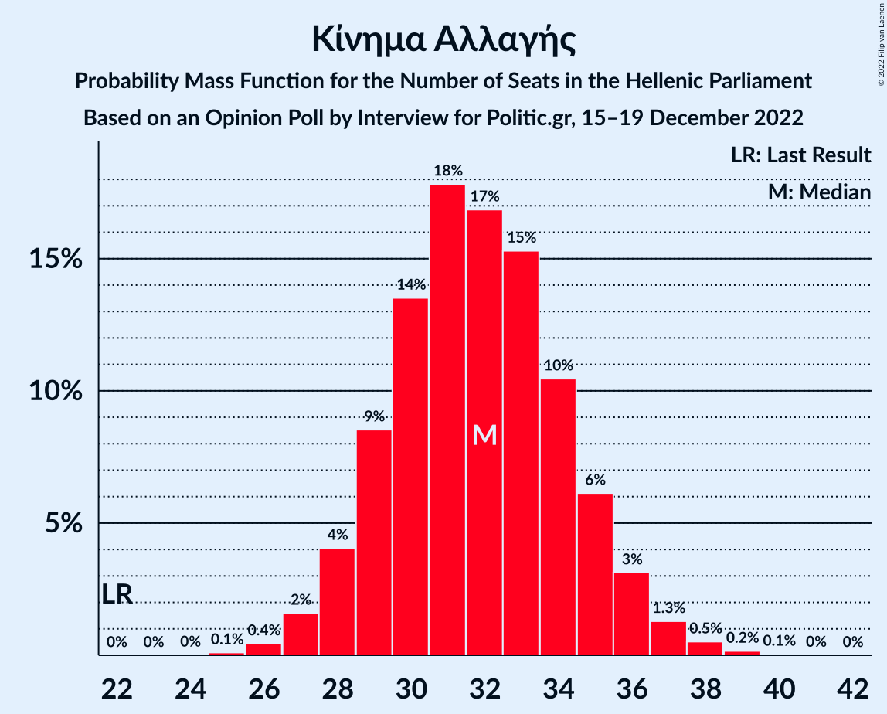

| Number of Seats | Probability | Accumulated | Special Marks |
|:---------------:|:-----------:|:-----------:|:-------------:|
| 22 | 0% | 100% | Last Result |
| 23 | 0% | 100% |  |
| 24 | 0% | 100% |  |
| 25 | 0.1% | 100% |  |
| 26 | 0.4% | 99.9% |  |
| 27 | 2% | 99.4% |  |
| 28 | 4% | 98% |  |
| 29 | 9% | 94% |  |
| 30 | 14% | 85% |  |
| 31 | 18% | 72% |  |
| 32 | 17% | 54% | Median |
| 33 | 15% | 37% |  |
| 34 | 10% | 22% |  |
| 35 | 6% | 11% |  |
| 36 | 3% | 5% |  |
| 37 | 1.3% | 2% |  |
| 38 | 0.5% | 0.7% |  |
| 39 | 0.2% | 0.2% |  |
| 40 | 0.1% | 0.1% |  |
| 41 | 0% | 0% |  |

### Κομμουνιστικό Κόμμα Ελλάδας

*For a full overview of the results for this party, see the [Κομμουνιστικό Κόμμα Ελλάδας](party-κομμουνιστικόκόμμαελλάδας.html) page.*

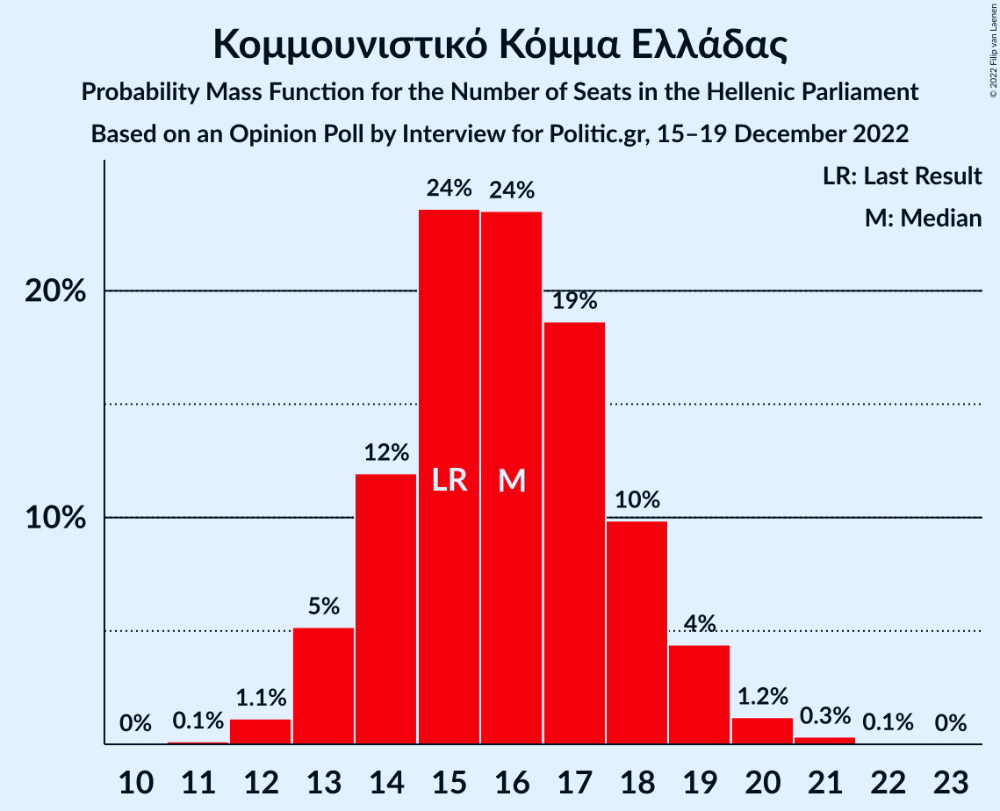

| Number of Seats | Probability | Accumulated | Special Marks |
|:---------------:|:-----------:|:-----------:|:-------------:|
| 11 | 0.1% | 100% |  |
| 12 | 1.1% | 99.9% |  |
| 13 | 5% | 98.7% |  |
| 14 | 12% | 94% |  |
| 15 | 24% | 82% | Last Result |
| 16 | 24% | 58% | Median |
| 17 | 19% | 34% |  |
| 18 | 10% | 16% |  |
| 19 | 4% | 6% |  |
| 20 | 1.2% | 2% |  |
| 21 | 0.3% | 0.4% |  |
| 22 | 0.1% | 0.1% |  |
| 23 | 0% | 0% |  |

### Ελληνική Λύση

*For a full overview of the results for this party, see the [Ελληνική Λύση](party-ελληνικήλύση.html) page.*

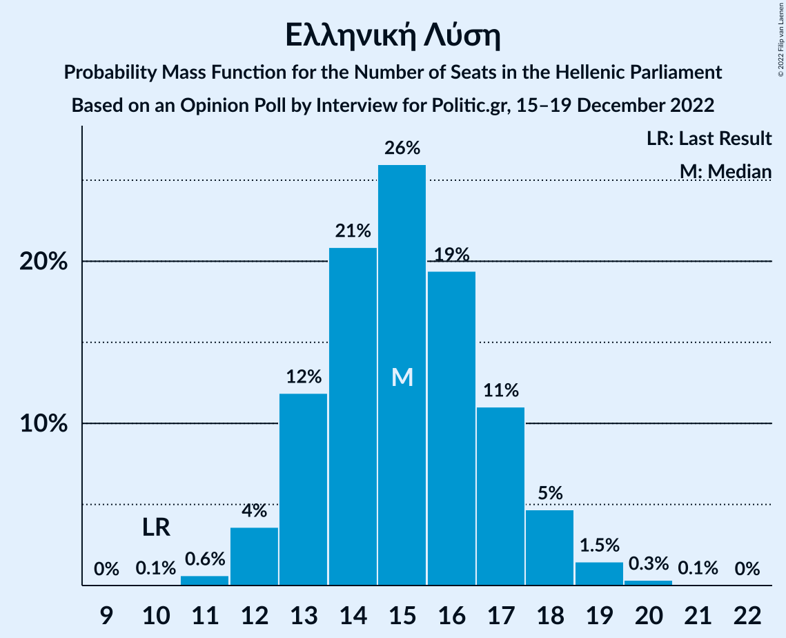

| Number of Seats | Probability | Accumulated | Special Marks |
|:---------------:|:-----------:|:-----------:|:-------------:|
| 10 | 0.1% | 100% | Last Result |
| 11 | 0.6% | 99.9% |  |
| 12 | 4% | 99.3% |  |
| 13 | 12% | 96% |  |
| 14 | 21% | 84% |  |
| 15 | 26% | 63% | Median |
| 16 | 19% | 37% |  |
| 17 | 11% | 18% |  |
| 18 | 5% | 7% |  |
| 19 | 1.5% | 2% |  |
| 20 | 0.3% | 0.4% |  |
| 21 | 0.1% | 0.1% |  |
| 22 | 0% | 0% |  |

### Μέτωπο Ευρωπαϊκής Ρεαλιστικής Ανυπακοής

*For a full overview of the results for this party, see the [Μέτωπο Ευρωπαϊκής Ρεαλιστικής Ανυπακοής](party-μέτωποευρωπαϊκήςρεαλιστικήςανυπακοής.html) page.*

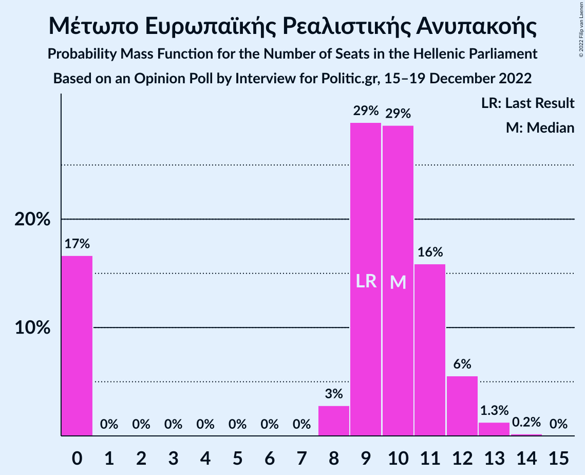

| Number of Seats | Probability | Accumulated | Special Marks |
|:---------------:|:-----------:|:-----------:|:-------------:|
| 0 | 17% | 100% |  |
| 1 | 0% | 83% |  |
| 2 | 0% | 83% |  |
| 3 | 0% | 83% |  |
| 4 | 0% | 83% |  |
| 5 | 0% | 83% |  |
| 6 | 0% | 83% |  |
| 7 | 0% | 83% |  |
| 8 | 3% | 83% |  |
| 9 | 29% | 81% | Last Result |
| 10 | 29% | 52% | Median |
| 11 | 16% | 23% |  |
| 12 | 6% | 7% |  |
| 13 | 1.3% | 1.5% |  |
| 14 | 0.2% | 0.2% |  |
| 15 | 0% | 0% |  |

## Coalitions

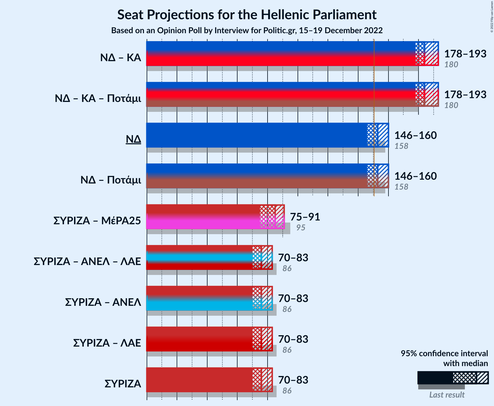

### Confidence Intervals

| Coalition | Last Result | Median | Majority? | 80% Confidence Interval | 90% Confidence Interval | 95% Confidence Interval | 99% Confidence Interval |
|:---------:|:-----------:|:------:|:---------:|:-----------------------:|:-----------------------:|:-----------------------:|:-----------------------:|
| Νέα Δημοκρατία – Κίνημα Αλλαγής | 180 | 184 | 100% | 180–190 | 179–191 | 178–193 | 176–196 |
| Νέα Δημοκρατία | 158 | 153 | 73% | 148–158 | 147–159 | 146–160 | 144–163 |
| Συνασπισμός Ριζοσπαστικής Αριστεράς – Μέτωπο Ευρωπαϊκής Ρεαλιστικής Ανυπακοής | 95 | 85 | 0% | 79–89 | 77–90 | 75–91 | 73–93 |
| Συνασπισμός Ριζοσπαστικής Αριστεράς | 86 | 76 | 0% | 72–80 | 71–82 | 70–83 | 68–85 |

### Νέα Δημοκρατία – Κίνημα Αλλαγής

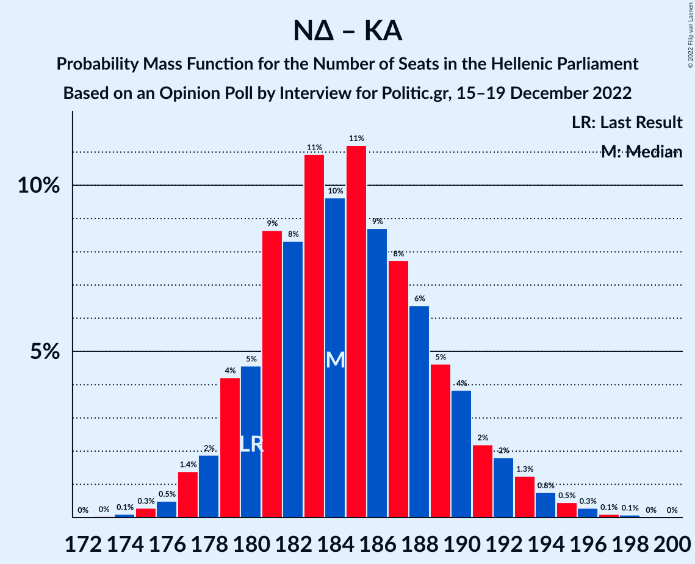

| Number of Seats | Probability | Accumulated | Special Marks |
|:---------------:|:-----------:|:-----------:|:-------------:|
| 173 | 0% | 100% |  |
| 174 | 0.1% | 99.9% |  |
| 175 | 0.3% | 99.8% |  |
| 176 | 0.5% | 99.5% |  |
| 177 | 1.4% | 99.0% |  |
| 178 | 2% | 98% |  |
| 179 | 4% | 96% |  |
| 180 | 5% | 92% | Last Result |
| 181 | 9% | 87% |  |
| 182 | 8% | 78% |  |
| 183 | 11% | 70% |  |
| 184 | 10% | 59% |  |
| 185 | 11% | 49% | Median |
| 186 | 9% | 38% |  |
| 187 | 8% | 30% |  |
| 188 | 6% | 22% |  |
| 189 | 5% | 15% |  |
| 190 | 4% | 11% |  |
| 191 | 2% | 7% |  |
| 192 | 2% | 5% |  |
| 193 | 1.3% | 3% |  |
| 194 | 0.8% | 2% |  |
| 195 | 0.5% | 1.0% |  |
| 196 | 0.3% | 0.5% |  |
| 197 | 0.1% | 0.2% |  |
| 198 | 0.1% | 0.1% |  |
| 199 | 0% | 0% |  |

### Νέα Δημοκρατία

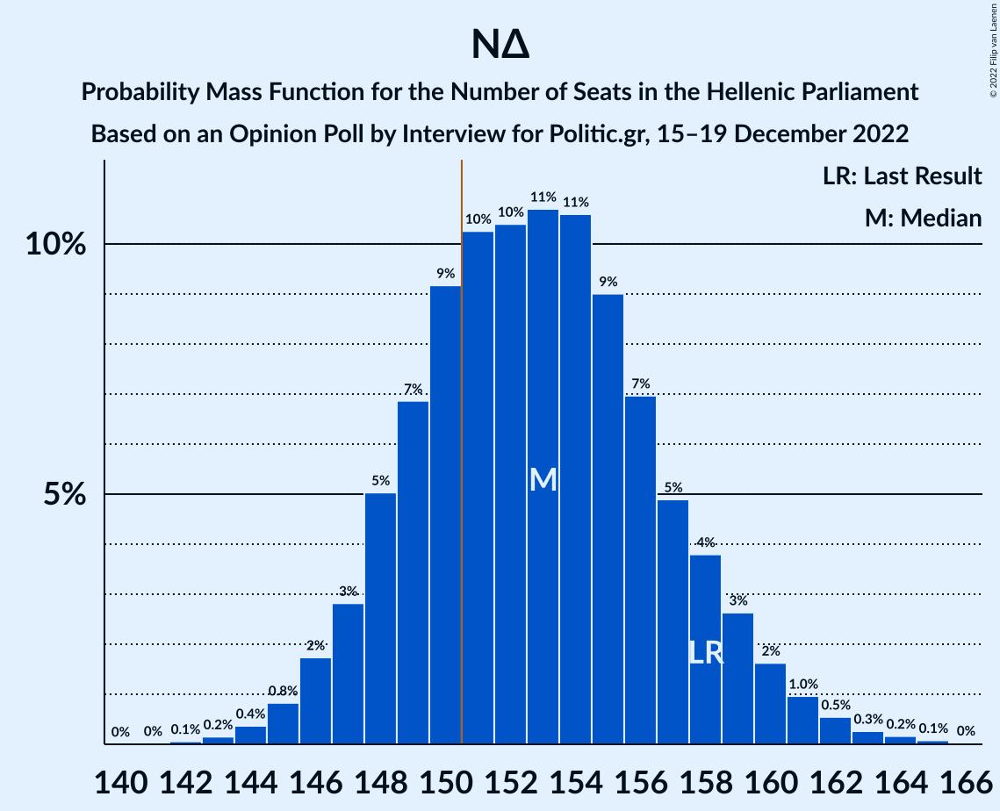

| Number of Seats | Probability | Accumulated | Special Marks |
|:---------------:|:-----------:|:-----------:|:-------------:|
| 142 | 0.1% | 100% |  |
| 143 | 0.2% | 99.9% |  |
| 144 | 0.4% | 99.8% |  |
| 145 | 0.8% | 99.4% |  |
| 146 | 2% | 98.6% |  |
| 147 | 3% | 97% |  |
| 148 | 5% | 94% |  |
| 149 | 7% | 89% |  |
| 150 | 9% | 82% |  |
| 151 | 10% | 73% | Majority |
| 152 | 10% | 63% |  |
| 153 | 11% | 52% | Median |
| 154 | 11% | 42% |  |
| 155 | 9% | 31% |  |
| 156 | 7% | 22% |  |
| 157 | 5% | 15% |  |
| 158 | 4% | 10% | Last Result |
| 159 | 3% | 6% |  |
| 160 | 2% | 4% |  |
| 161 | 1.0% | 2% |  |
| 162 | 0.5% | 1.1% |  |
| 163 | 0.3% | 0.6% |  |
| 164 | 0.2% | 0.3% |  |
| 165 | 0.1% | 0.1% |  |
| 166 | 0% | 0% |  |

### Συνασπισμός Ριζοσπαστικής Αριστεράς – Μέτωπο Ευρωπαϊκής Ρεαλιστικής Ανυπακοής

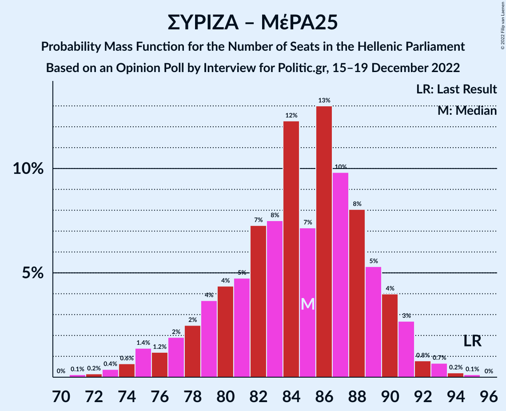

| Number of Seats | Probability | Accumulated | Special Marks |
|:---------------:|:-----------:|:-----------:|:-------------:|
| 71 | 0.1% | 100% |  |
| 72 | 0.2% | 99.8% |  |
| 73 | 0.4% | 99.7% |  |
| 74 | 0.6% | 99.3% |  |
| 75 | 1.4% | 98.6% |  |
| 76 | 1.2% | 97% |  |
| 77 | 2% | 96% |  |
| 78 | 2% | 94% |  |
| 79 | 4% | 92% |  |
| 80 | 4% | 88% |  |
| 81 | 5% | 84% |  |
| 82 | 7% | 79% |  |
| 83 | 8% | 72% |  |
| 84 | 12% | 64% |  |
| 85 | 7% | 52% |  |
| 86 | 13% | 45% | Median |
| 87 | 10% | 32% |  |
| 88 | 8% | 22% |  |
| 89 | 5% | 14% |  |
| 90 | 4% | 9% |  |
| 91 | 3% | 5% |  |
| 92 | 0.8% | 2% |  |
| 93 | 0.7% | 1.0% |  |
| 94 | 0.2% | 0.4% |  |
| 95 | 0.1% | 0.2% | Last Result |
| 96 | 0% | 0% |  |

### Συνασπισμός Ριζοσπαστικής Αριστεράς

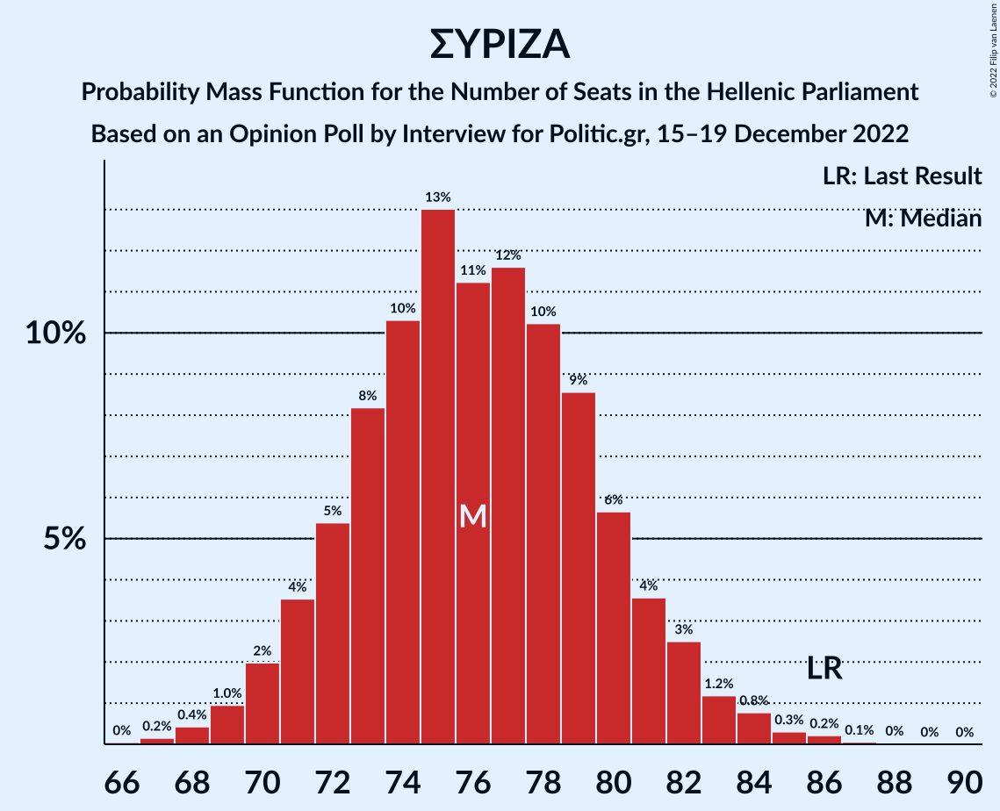

| Number of Seats | Probability | Accumulated | Special Marks |
|:---------------:|:-----------:|:-----------:|:-------------:|
| 66 | 0% | 100% |  |
| 67 | 0.2% | 99.9% |  |
| 68 | 0.4% | 99.8% |  |
| 69 | 1.0% | 99.3% |  |
| 70 | 2% | 98% |  |
| 71 | 4% | 96% |  |
| 72 | 5% | 93% |  |
| 73 | 8% | 87% |  |
| 74 | 10% | 79% |  |
| 75 | 13% | 69% |  |
| 76 | 11% | 56% | Median |
| 77 | 12% | 45% |  |
| 78 | 10% | 33% |  |
| 79 | 9% | 23% |  |
| 80 | 6% | 14% |  |
| 81 | 4% | 9% |  |
| 82 | 3% | 5% |  |
| 83 | 1.2% | 3% |  |
| 84 | 0.8% | 1.4% |  |
| 85 | 0.3% | 0.6% |  |
| 86 | 0.2% | 0.3% | Last Result |
| 87 | 0.1% | 0.1% |  |
| 88 | 0% | 0.1% |  |
| 89 | 0% | 0% |  |

## Technical Information

### Opinion Poll

+ **Polling firm:** Interview
+ **Commissioner(s):** Politic.gr
+ **Fieldwork period:** 15–19 December 2022

### Calculations

+ **Sample size:** 1655
+ **Simulations done:** 1,048,576
+ **Error estimate:** 0.72%

