# Opinion Poll by Pulse RC for ΣΚΑΪ, 18–19 December 2022

<a href="#voting-intentions">Voting Intentions</a> | <a href="#seats">Seats</a> | <a href="#coalitions">Coalitions</a> | <a href="#technical-information">Technical Information</a>

## Voting Intentions

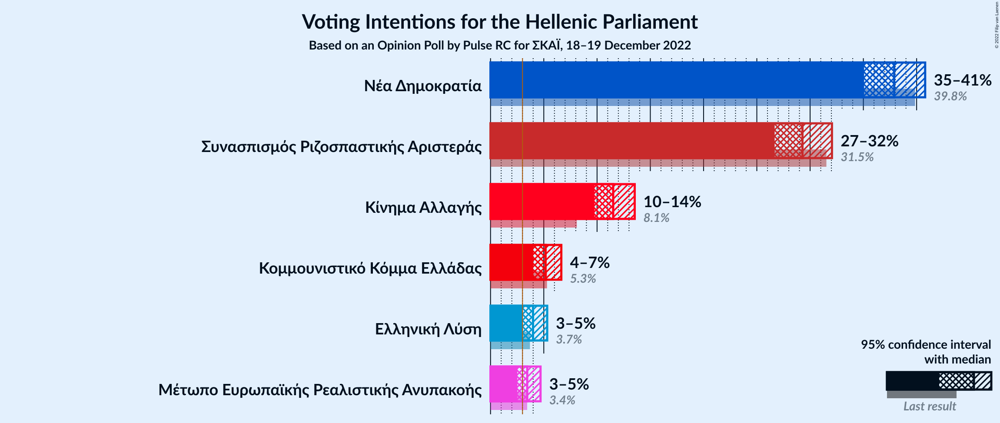

### Confidence Intervals

| Party | Last Result | Poll Result | 80% Confidence Interval | 90% Confidence Interval | 95% Confidence Interval | 99% Confidence Interval |
|:-----:|:-----------:|:-----------:|:-----------------------:|:-----------------------:|:-----------------------:|:-----------------------:|
| Νέα Δημοκρατία | 39.8% | 37.9% | 36.0–39.8% |35.5–40.3% |35.1–40.8% |34.2–41.7% |
| Συνασπισμός Ριζοσπαστικής Αριστεράς | 31.5% | 29.3% | 27.6–31.1% |27.1–31.6% |26.7–32.1% |25.9–32.9% |
| Κίνημα Αλλαγής | 8.1% | 11.5% | 10.4–12.8% |10.0–13.2% |9.8–13.5% |9.2–14.2% |
| Κομμουνιστικό Κόμμα Ελλάδας | 5.3% | 5.2% | 4.4–6.1% |4.2–6.4% |4.0–6.6% |3.7–7.1% |
| Ελληνική Λύση | 3.7% | 4.0% | 3.3–4.9% |3.1–5.1% |3.0–5.3% |2.7–5.8% |
| Μέτωπο Ευρωπαϊκής Ρεαλιστικής Ανυπακοής | 3.4% | 3.4% | 2.8–4.3% |2.7–4.5% |2.5–4.7% |2.3–5.1% |

*Note:* The poll result column reflects the actual value used in the calculations. Published results may vary slightly, and in addition be rounded to fewer digits.

## Seats

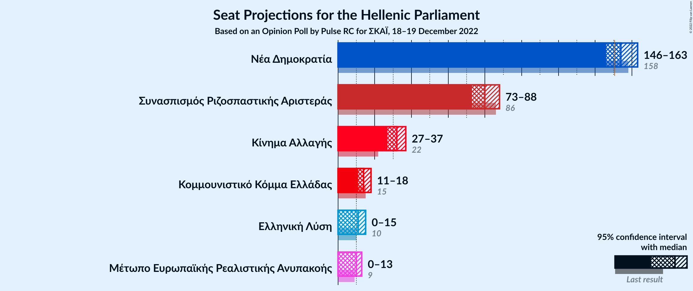

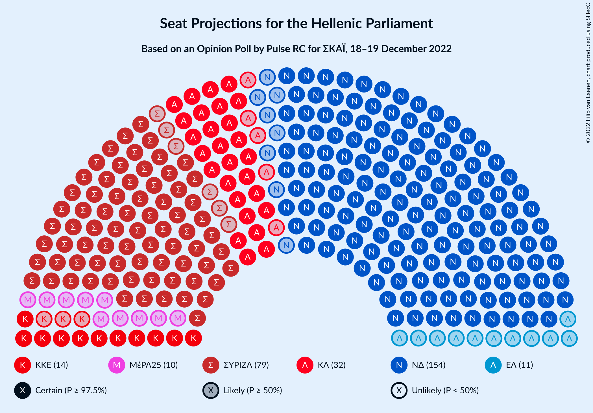

### Confidence Intervals

| Party | Last Result | Median | 80% Confidence Interval | 90% Confidence Interval | 95% Confidence Interval | 99% Confidence Interval |
|:-----:|:-----------:|:------:|:-----------------------:|:-----------------------:|:-----------------------:|:-----------------------:|
| <a href="#νέα-δημοκρατία">Νέα Δημοκρατία</a> | 158 | 154 | 149–160 |147–161 |146–163 |144–166 |
| <a href="#συνασπισμός-ριζοσπαστικής-αριστεράς">Συνασπισμός Ριζοσπαστικής Αριστεράς</a> | 86 | 80 | 75–85 |74–87 |73–88 |71–92 |
| <a href="#κίνημα-αλλαγής">Κίνημα Αλλαγής</a> | 22 | 32 | 28–35 |28–36 |27–37 |25–39 |
| <a href="#κομμουνιστικό-κόμμα-ελλάδας">Κομμουνιστικό Κόμμα Ελλάδας</a> | 15 | 14 | 12–17 |11–18 |11–18 |10–20 |
| <a href="#ελληνική-λύση">Ελληνική Λύση</a> | 10 | 11 | 9–13 |9–14 |0–15 |0–16 |
| <a href="#μέτωπο-ευρωπαϊκής-ρεαλιστικής-ανυπακοής">Μέτωπο Ευρωπαϊκής Ρεαλιστικής Ανυπακοής</a> | 9 | 10 | 0–12 |0–12 |0–13 |0–14 |

### Νέα Δημοκρατία

*For a full overview of the results for this party, see the [Νέα Δημοκρατία](party-νέαδημοκρατία.html) page.*

| Number of Seats | Probability | Accumulated | Special Marks |
|:---------------:|:-----------:|:-----------:|:-------------:|
| 141 | 0.1% | 100% |  |
| 142 | 0.1% | 99.9% |  |
| 143 | 0.3% | 99.8% |  |
| 144 | 0.5% | 99.5% |  |
| 145 | 0.9% | 99.0% |  |
| 146 | 1.5% | 98% |  |
| 147 | 2% | 97% |  |
| 148 | 3% | 94% |  |
| 149 | 5% | 91% |  |
| 150 | 6% | 86% |  |
| 151 | 8% | 80% | Majority |
| 152 | 8% | 72% |  |
| 153 | 10% | 64% |  |
| 154 | 9% | 54% | Median |
| 155 | 9% | 45% |  |
| 156 | 8% | 36% |  |
| 157 | 7% | 27% |  |
| 158 | 5% | 20% | Last Result |
| 159 | 4% | 15% |  |
| 160 | 3% | 11% |  |
| 161 | 2% | 7% |  |
| 162 | 2% | 5% |  |
| 163 | 1.2% | 3% |  |
| 164 | 0.7% | 2% |  |
| 165 | 0.5% | 1.1% |  |
| 166 | 0.3% | 0.6% |  |
| 167 | 0.1% | 0.3% |  |
| 168 | 0.1% | 0.2% |  |
| 169 | 0.1% | 0.1% |  |
| 170 | 0% | 0% |  |

### Συνασπισμός Ριζοσπαστικής Αριστεράς

*For a full overview of the results for this party, see the [Συνασπισμός Ριζοσπαστικής Αριστεράς](party-συνασπισμόςριζοσπαστικήςαριστεράς.html) page.*

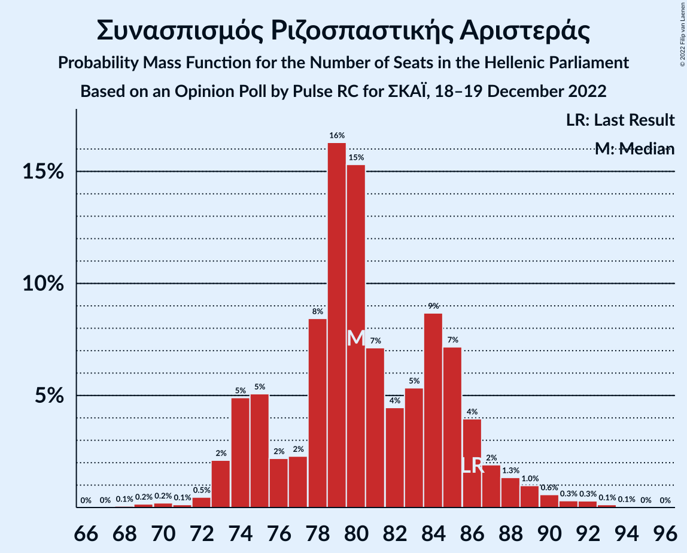

| Number of Seats | Probability | Accumulated | Special Marks |
|:---------------:|:-----------:|:-----------:|:-------------:|
| 68 | 0.1% | 100% |  |
| 69 | 0.2% | 99.9% |  |
| 70 | 0.2% | 99.8% |  |
| 71 | 0.1% | 99.6% |  |
| 72 | 0.5% | 99.4% |  |
| 73 | 2% | 99.0% |  |
| 74 | 5% | 97% |  |
| 75 | 5% | 92% |  |
| 76 | 2% | 87% |  |
| 77 | 2% | 85% |  |
| 78 | 8% | 82% |  |
| 79 | 16% | 74% |  |
| 80 | 15% | 58% | Median |
| 81 | 7% | 42% |  |
| 82 | 4% | 35% |  |
| 83 | 5% | 31% |  |
| 84 | 9% | 25% |  |
| 85 | 7% | 17% |  |
| 86 | 4% | 10% | Last Result |
| 87 | 2% | 6% |  |
| 88 | 1.3% | 4% |  |
| 89 | 1.0% | 2% |  |
| 90 | 0.6% | 1.4% |  |
| 91 | 0.3% | 0.8% |  |
| 92 | 0.3% | 0.5% |  |
| 93 | 0.1% | 0.2% |  |
| 94 | 0.1% | 0.1% |  |
| 95 | 0% | 0% |  |

### Κίνημα Αλλαγής

*For a full overview of the results for this party, see the [Κίνημα Αλλαγής](party-κίνημααλλαγής.html) page.*

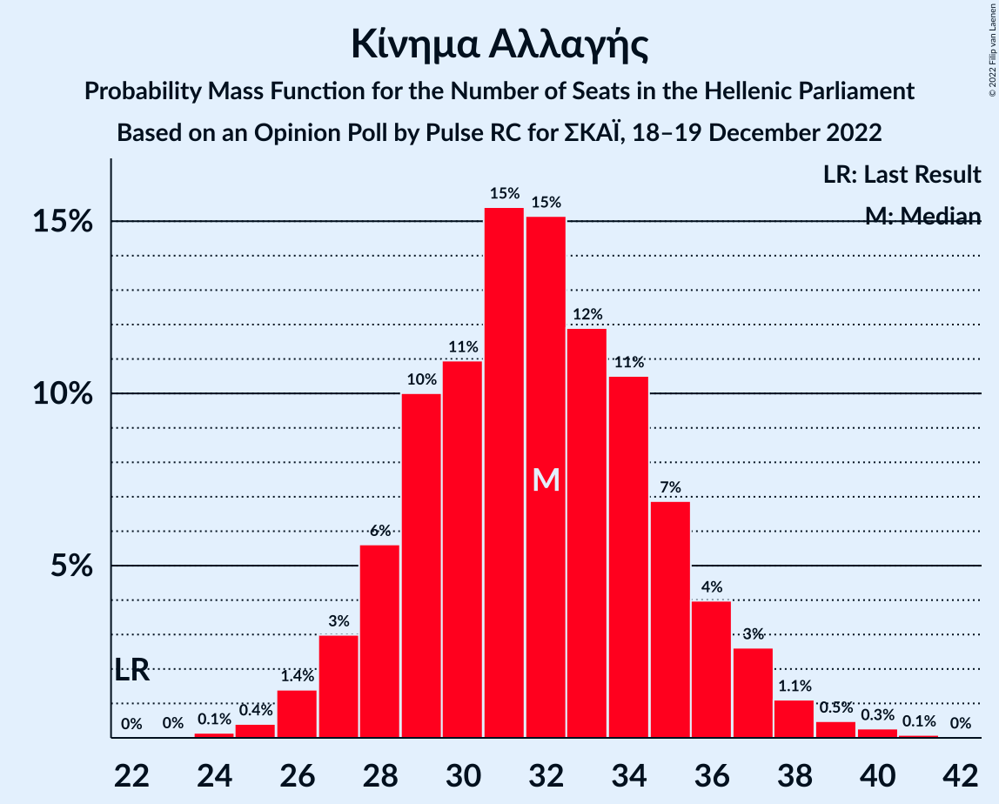

| Number of Seats | Probability | Accumulated | Special Marks |
|:---------------:|:-----------:|:-----------:|:-------------:|
| 22 | 0% | 100% | Last Result |
| 23 | 0% | 100% |  |
| 24 | 0.1% | 100% |  |
| 25 | 0.4% | 99.8% |  |
| 26 | 1.4% | 99.4% |  |
| 27 | 3% | 98% |  |
| 28 | 6% | 95% |  |
| 29 | 10% | 89% |  |
| 30 | 11% | 79% |  |
| 31 | 15% | 68% |  |
| 32 | 15% | 53% | Median |
| 33 | 12% | 38% |  |
| 34 | 11% | 26% |  |
| 35 | 7% | 15% |  |
| 36 | 4% | 9% |  |
| 37 | 3% | 5% |  |
| 38 | 1.1% | 2% |  |
| 39 | 0.5% | 0.9% |  |
| 40 | 0.3% | 0.4% |  |
| 41 | 0.1% | 0.1% |  |
| 42 | 0% | 0% |  |

### Κομμουνιστικό Κόμμα Ελλάδας

*For a full overview of the results for this party, see the [Κομμουνιστικό Κόμμα Ελλάδας](party-κομμουνιστικόκόμμαελλάδας.html) page.*

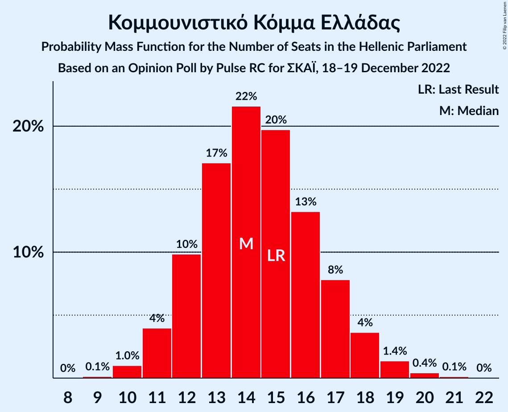

| Number of Seats | Probability | Accumulated | Special Marks |
|:---------------:|:-----------:|:-----------:|:-------------:|
| 9 | 0.1% | 100% |  |
| 10 | 1.0% | 99.9% |  |
| 11 | 4% | 98.9% |  |
| 12 | 10% | 95% |  |
| 13 | 17% | 85% |  |
| 14 | 22% | 68% | Median |
| 15 | 20% | 46% | Last Result |
| 16 | 13% | 27% |  |
| 17 | 8% | 13% |  |
| 18 | 4% | 6% |  |
| 19 | 1.4% | 2% |  |
| 20 | 0.4% | 0.6% |  |
| 21 | 0.1% | 0.2% |  |
| 22 | 0% | 0% |  |

### Ελληνική Λύση

*For a full overview of the results for this party, see the [Ελληνική Λύση](party-ελληνικήλύση.html) page.*

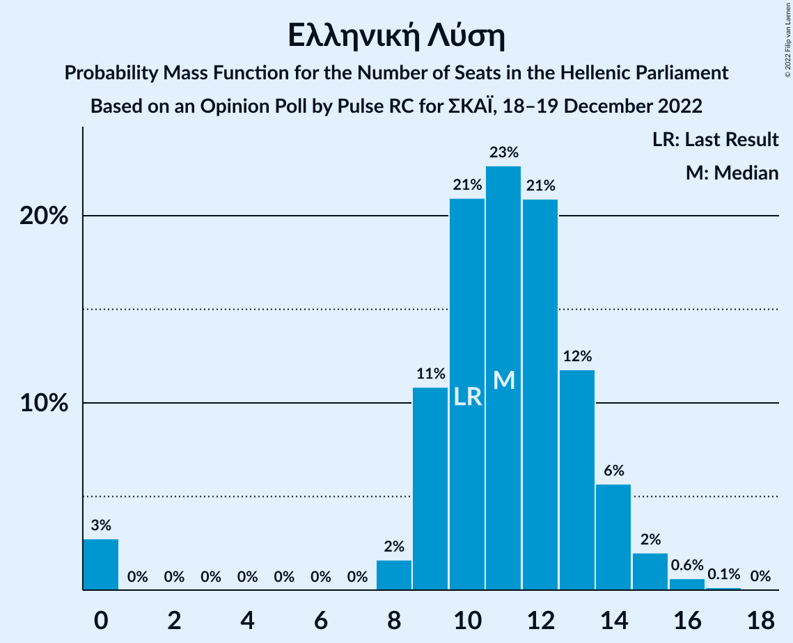

| Number of Seats | Probability | Accumulated | Special Marks |
|:---------------:|:-----------:|:-----------:|:-------------:|
| 0 | 3% | 100% |  |
| 1 | 0% | 97% |  |
| 2 | 0% | 97% |  |
| 3 | 0% | 97% |  |
| 4 | 0% | 97% |  |
| 5 | 0% | 97% |  |
| 6 | 0% | 97% |  |
| 7 | 0% | 97% |  |
| 8 | 2% | 97% |  |
| 9 | 11% | 96% |  |
| 10 | 21% | 85% | Last Result |
| 11 | 23% | 64% | Median |
| 12 | 21% | 41% |  |
| 13 | 12% | 20% |  |
| 14 | 6% | 8% |  |
| 15 | 2% | 3% |  |
| 16 | 0.6% | 0.8% |  |
| 17 | 0.1% | 0.2% |  |
| 18 | 0% | 0% |  |

### Μέτωπο Ευρωπαϊκής Ρεαλιστικής Ανυπακοής

*For a full overview of the results for this party, see the [Μέτωπο Ευρωπαϊκής Ρεαλιστικής Ανυπακοής](party-μέτωποευρωπαϊκήςρεαλιστικήςανυπακοής.html) page.*

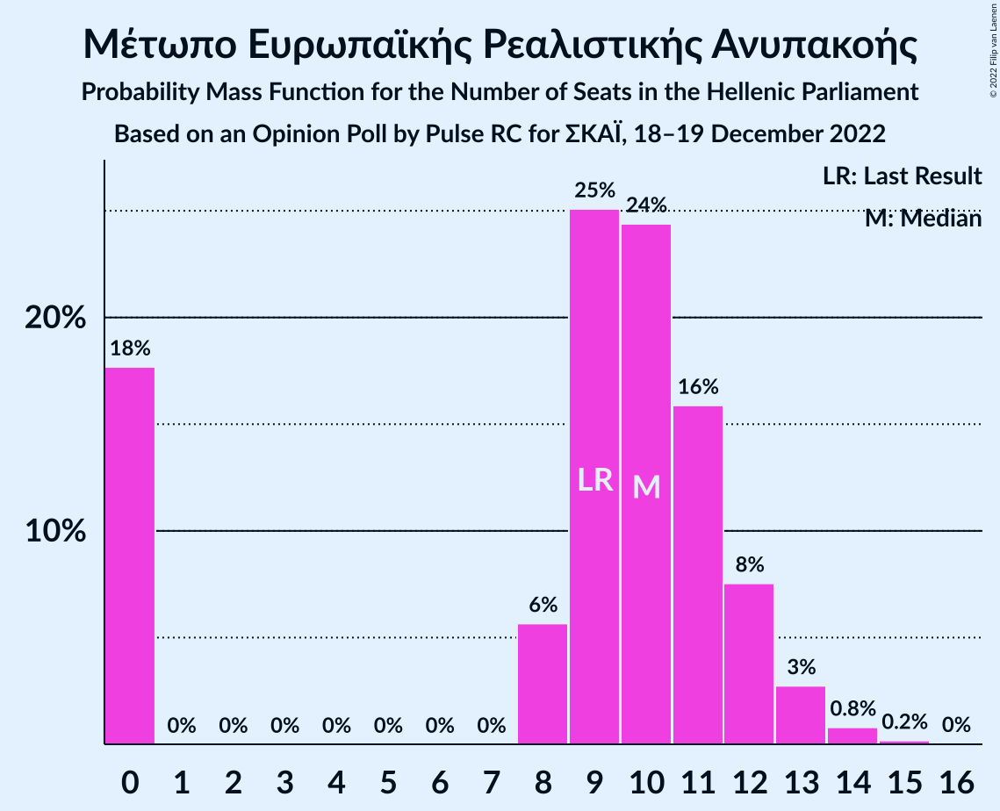

| Number of Seats | Probability | Accumulated | Special Marks |
|:---------------:|:-----------:|:-----------:|:-------------:|
| 0 | 18% | 100% |  |
| 1 | 0% | 82% |  |
| 2 | 0% | 82% |  |
| 3 | 0% | 82% |  |
| 4 | 0% | 82% |  |
| 5 | 0% | 82% |  |
| 6 | 0% | 82% |  |
| 7 | 0% | 82% |  |
| 8 | 6% | 82% |  |
| 9 | 25% | 77% | Last Result |
| 10 | 24% | 52% | Median |
| 11 | 16% | 27% |  |
| 12 | 8% | 11% |  |
| 13 | 3% | 4% |  |
| 14 | 0.8% | 1.0% |  |
| 15 | 0.2% | 0.2% |  |
| 16 | 0% | 0% |  |

## Coalitions

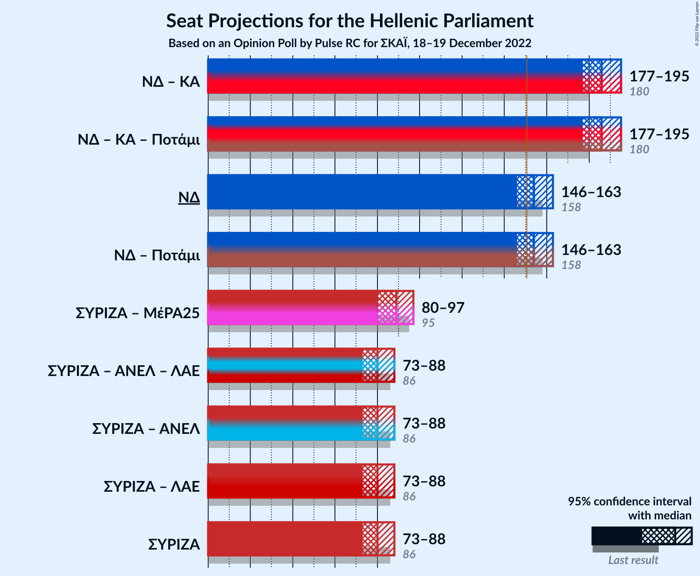

### Confidence Intervals

| Coalition | Last Result | Median | Majority? | 80% Confidence Interval | 90% Confidence Interval | 95% Confidence Interval | 99% Confidence Interval |
|:---------:|:-----------:|:------:|:---------:|:-----------------------:|:-----------------------:|:-----------------------:|:-----------------------:|
| Νέα Δημοκρατία – Κίνημα Αλλαγής | 180 | 186 | 100% | 180–192 | 179–194 | 177–195 | 175–199 |
| Νέα Δημοκρατία | 158 | 154 | 80% | 149–160 | 147–161 | 146–163 | 144–166 |
| Συνασπισμός Ριζοσπαστικής Αριστεράς – Μέτωπο Ευρωπαϊκής Ρεαλιστικής Ανυπακοής | 95 | 89 | 0% | 82–95 | 81–96 | 80–97 | 76–100 |
| Συνασπισμός Ριζοσπαστικής Αριστεράς | 86 | 80 | 0% | 75–85 | 74–87 | 73–88 | 71–92 |

### Νέα Δημοκρατία – Κίνημα Αλλαγής

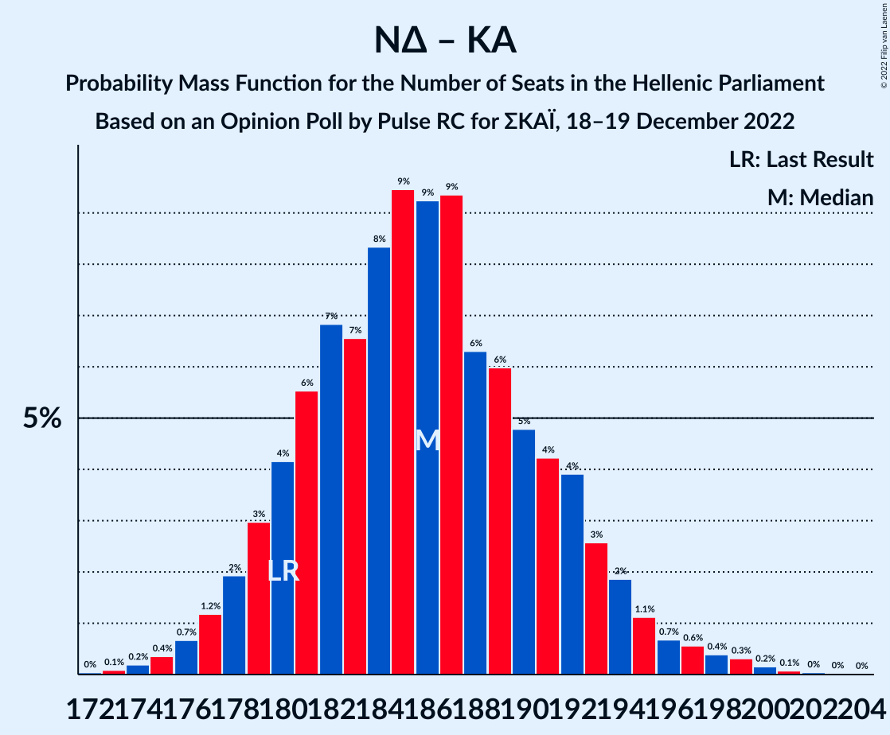

| Number of Seats | Probability | Accumulated | Special Marks |
|:---------------:|:-----------:|:-----------:|:-------------:|
| 172 | 0% | 100% |  |
| 173 | 0.1% | 99.9% |  |
| 174 | 0.2% | 99.8% |  |
| 175 | 0.4% | 99.6% |  |
| 176 | 0.7% | 99.3% |  |
| 177 | 1.2% | 98.6% |  |
| 178 | 2% | 97% |  |
| 179 | 3% | 96% |  |
| 180 | 4% | 93% | Last Result |
| 181 | 6% | 88% |  |
| 182 | 7% | 83% |  |
| 183 | 7% | 76% |  |
| 184 | 8% | 69% |  |
| 185 | 9% | 61% |  |
| 186 | 9% | 52% | Median |
| 187 | 9% | 42% |  |
| 188 | 6% | 33% |  |
| 189 | 6% | 27% |  |
| 190 | 5% | 21% |  |
| 191 | 4% | 16% |  |
| 192 | 4% | 12% |  |
| 193 | 3% | 8% |  |
| 194 | 2% | 5% |  |
| 195 | 1.1% | 3% |  |
| 196 | 0.7% | 2% |  |
| 197 | 0.6% | 2% |  |
| 198 | 0.4% | 1.0% |  |
| 199 | 0.3% | 0.6% |  |
| 200 | 0.2% | 0.3% |  |
| 201 | 0.1% | 0.2% |  |
| 202 | 0% | 0.1% |  |
| 203 | 0% | 0.1% |  |
| 204 | 0% | 0% |  |

### Νέα Δημοκρατία

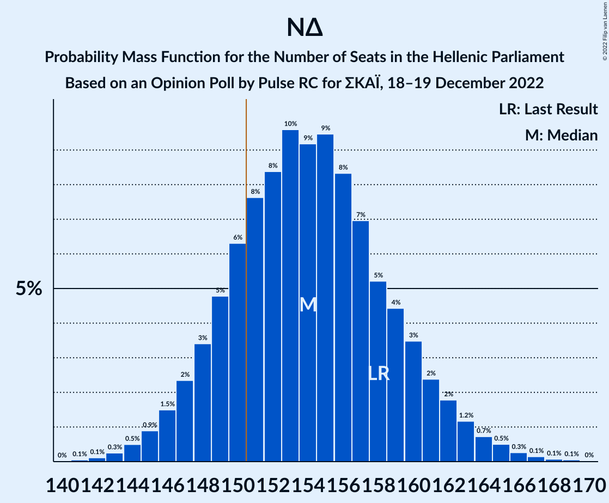

| Number of Seats | Probability | Accumulated | Special Marks |
|:---------------:|:-----------:|:-----------:|:-------------:|
| 141 | 0.1% | 100% |  |
| 142 | 0.1% | 99.9% |  |
| 143 | 0.3% | 99.8% |  |
| 144 | 0.5% | 99.5% |  |
| 145 | 0.9% | 99.0% |  |
| 146 | 1.5% | 98% |  |
| 147 | 2% | 97% |  |
| 148 | 3% | 94% |  |
| 149 | 5% | 91% |  |
| 150 | 6% | 86% |  |
| 151 | 8% | 80% | Majority |
| 152 | 8% | 72% |  |
| 153 | 10% | 64% |  |
| 154 | 9% | 54% | Median |
| 155 | 9% | 45% |  |
| 156 | 8% | 36% |  |
| 157 | 7% | 27% |  |
| 158 | 5% | 20% | Last Result |
| 159 | 4% | 15% |  |
| 160 | 3% | 11% |  |
| 161 | 2% | 7% |  |
| 162 | 2% | 5% |  |
| 163 | 1.2% | 3% |  |
| 164 | 0.7% | 2% |  |
| 165 | 0.5% | 1.1% |  |
| 166 | 0.3% | 0.6% |  |
| 167 | 0.1% | 0.3% |  |
| 168 | 0.1% | 0.2% |  |
| 169 | 0.1% | 0.1% |  |
| 170 | 0% | 0% |  |

### Συνασπισμός Ριζοσπαστικής Αριστεράς – Μέτωπο Ευρωπαϊκής Ρεαλιστικής Ανυπακοής

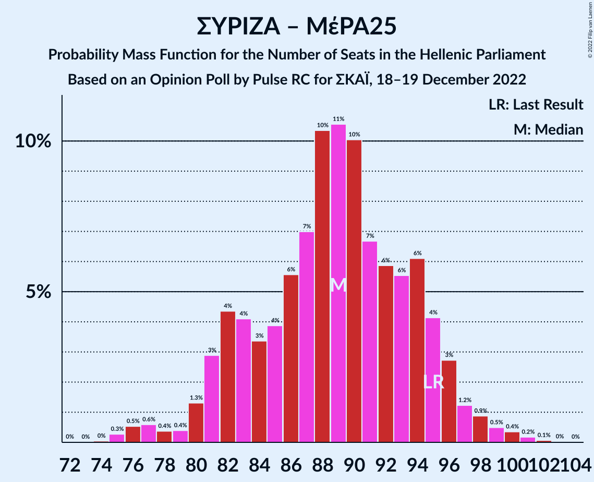

| Number of Seats | Probability | Accumulated | Special Marks |
|:---------------:|:-----------:|:-----------:|:-------------:|
| 73 | 0% | 100% |  |
| 74 | 0% | 99.9% |  |
| 75 | 0.3% | 99.9% |  |
| 76 | 0.5% | 99.6% |  |
| 77 | 0.6% | 99.1% |  |
| 78 | 0.4% | 98.5% |  |
| 79 | 0.4% | 98% |  |
| 80 | 1.3% | 98% |  |
| 81 | 3% | 96% |  |
| 82 | 4% | 94% |  |
| 83 | 4% | 89% |  |
| 84 | 3% | 85% |  |
| 85 | 4% | 82% |  |
| 86 | 6% | 78% |  |
| 87 | 7% | 72% |  |
| 88 | 10% | 65% |  |
| 89 | 11% | 55% |  |
| 90 | 10% | 44% | Median |
| 91 | 7% | 34% |  |
| 92 | 6% | 28% |  |
| 93 | 6% | 22% |  |
| 94 | 6% | 16% |  |
| 95 | 4% | 10% | Last Result |
| 96 | 3% | 6% |  |
| 97 | 1.2% | 3% |  |
| 98 | 0.9% | 2% |  |
| 99 | 0.5% | 1.2% |  |
| 100 | 0.4% | 0.7% |  |
| 101 | 0.2% | 0.3% |  |
| 102 | 0.1% | 0.1% |  |
| 103 | 0% | 0.1% |  |
| 104 | 0% | 0% |  |

### Συνασπισμός Ριζοσπαστικής Αριστεράς

| Number of Seats | Probability | Accumulated | Special Marks |
|:---------------:|:-----------:|:-----------:|:-------------:|
| 68 | 0.1% | 100% |  |
| 69 | 0.2% | 99.9% |  |
| 70 | 0.2% | 99.8% |  |
| 71 | 0.1% | 99.6% |  |
| 72 | 0.5% | 99.4% |  |
| 73 | 2% | 99.0% |  |
| 74 | 5% | 97% |  |
| 75 | 5% | 92% |  |
| 76 | 2% | 87% |  |
| 77 | 2% | 85% |  |
| 78 | 8% | 82% |  |
| 79 | 16% | 74% |  |
| 80 | 15% | 58% | Median |
| 81 | 7% | 42% |  |
| 82 | 4% | 35% |  |
| 83 | 5% | 31% |  |
| 84 | 9% | 25% |  |
| 85 | 7% | 17% |  |
| 86 | 4% | 10% | Last Result |
| 87 | 2% | 6% |  |
| 88 | 1.3% | 4% |  |
| 89 | 1.0% | 2% |  |
| 90 | 0.6% | 1.4% |  |
| 91 | 0.3% | 0.8% |  |
| 92 | 0.3% | 0.5% |  |
| 93 | 0.1% | 0.2% |  |
| 94 | 0.1% | 0.1% |  |
| 95 | 0% | 0% |  |

## Technical Information

### Opinion Poll

+ **Polling firm:** Pulse RC
+ **Commissioner(s):** ΣΚΑΪ
+ **Fieldwork period:** 18–19 December 2022

### Calculations

+ **Sample size:** 1103
+ **Simulations done:** 1,048,576
+ **Error estimate:** 0.44%

