# Opinion Poll by Marc for Πρώτο ΘΕΜΑ, 16–21 December 2022

<a href="#voting-intentions">Voting Intentions</a> | <a href="#seats">Seats</a> | <a href="#coalitions">Coalitions</a> | <a href="#technical-information">Technical Information</a>

## Voting Intentions

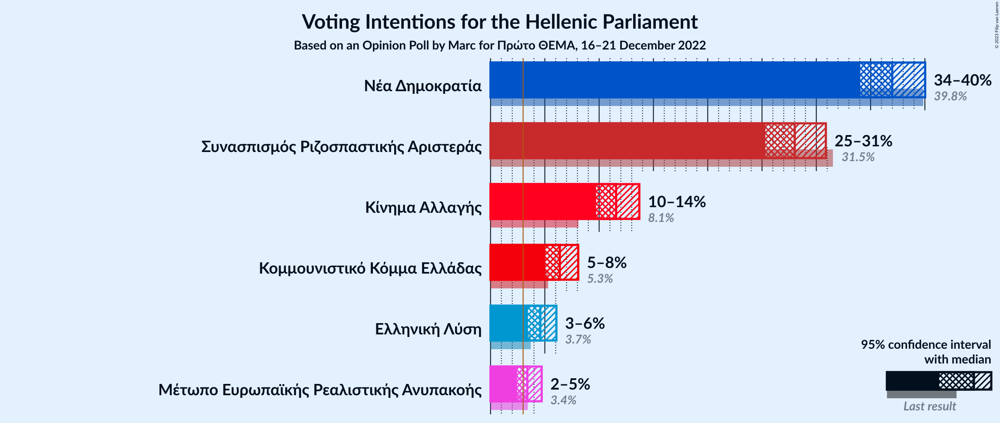

### Confidence Intervals

| Party | Last Result | Poll Result | 80% Confidence Interval | 90% Confidence Interval | 95% Confidence Interval | 99% Confidence Interval |
|:-----:|:-----------:|:-----------:|:-----------------------:|:-----------------------:|:-----------------------:|:-----------------------:|
| Νέα Δημοκρατία | 39.8% | 37.0% | 35.1–39.0% |34.5–39.5% |34.0–40.0% |33.1–41.0% |
| Συνασπισμός Ριζοσπαστικής Αριστεράς | 31.5% | 28.0% | 26.2–29.9% |25.7–30.4% |25.3–30.9% |24.5–31.8% |
| Κίνημα Αλλαγής | 8.1% | 11.6% | 10.3–13.0% |10.0–13.4% |9.7–13.7% |9.2–14.4% |
| Κομμουνιστικό Κόμμα Ελλάδας | 5.3% | 6.4% | 5.5–7.5% |5.2–7.8% |5.0–8.1% |4.6–8.6% |
| Ελληνική Λύση | 3.7% | 4.6% | 3.8–5.5% |3.6–5.8% |3.4–6.1% |3.1–6.6% |
| Μέτωπο Ευρωπαϊκής Ρεαλιστικής Ανυπακοής | 3.4% | 3.4% | 2.8–4.3% |2.6–4.5% |2.4–4.7% |2.2–5.2% |

*Note:* The poll result column reflects the actual value used in the calculations. Published results may vary slightly, and in addition be rounded to fewer digits.

## Seats

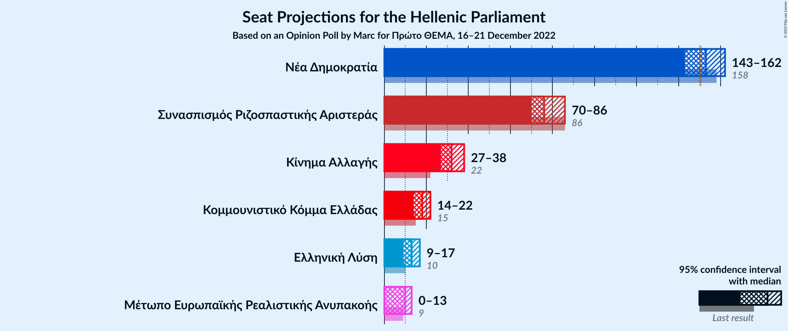

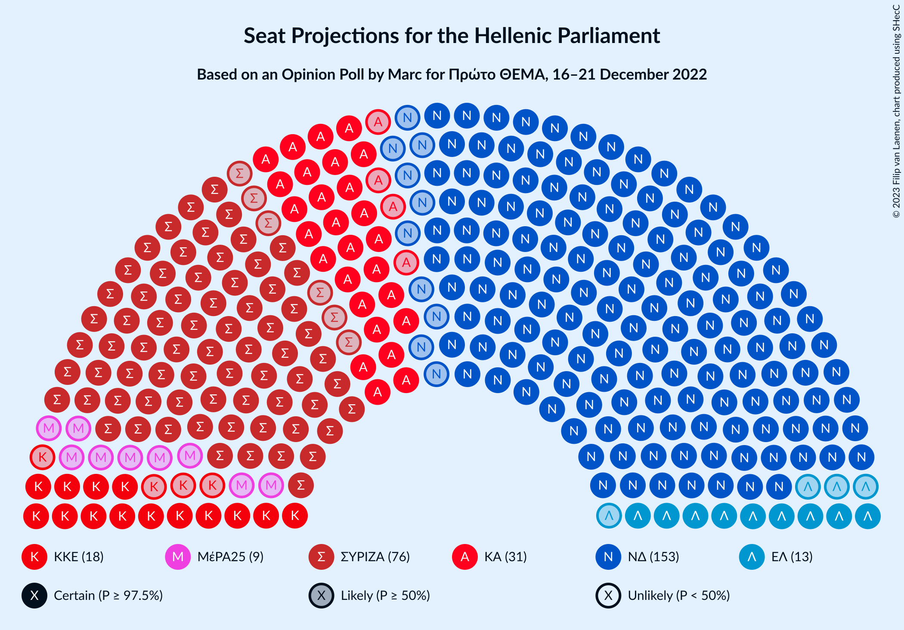

### Confidence Intervals

| Party | Last Result | Median | 80% Confidence Interval | 90% Confidence Interval | 95% Confidence Interval | 99% Confidence Interval |
|:-----:|:-----------:|:------:|:-----------------------:|:-----------------------:|:-----------------------:|:-----------------------:|
| <a href="#νέα-δημοκρατία">Νέα Δημοκρατία</a> | 158 | 153 | 146–158 |144–160 |143–162 |141–164 |
| <a href="#συνασπισμός-ριζοσπαστικής-αριστεράς">Συνασπισμός Ριζοσπαστικής Αριστεράς</a> | 86 | 76 | 72–83 |70–85 |70–86 |67–89 |
| <a href="#κίνημα-αλλαγής">Κίνημα Αλλαγής</a> | 22 | 32 | 28–36 |27–37 |27–38 |25–40 |
| <a href="#κομμουνιστικό-κόμμα-ελλάδας">Κομμουνιστικό Κόμμα Ελλάδας</a> | 15 | 18 | 15–21 |14–22 |14–22 |13–24 |
| <a href="#ελληνική-λύση">Ελληνική Λύση</a> | 10 | 13 | 10–15 |10–16 |9–17 |9–18 |
| <a href="#μέτωπο-ευρωπαϊκής-ρεαλιστικής-ανυπακοής">Μέτωπο Ευρωπαϊκής Ρεαλιστικής Ανυπακοής</a> | 9 | 10 | 0–12 |0–12 |0–13 |0–14 |

### Νέα Δημοκρατία

*For a full overview of the results for this party, see the [Νέα Δημοκρατία](party-νέαδημοκρατία.html) page.*

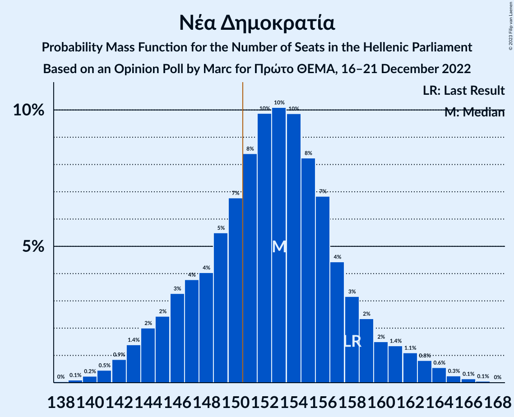

| Number of Seats | Probability | Accumulated | Special Marks |
|:---------------:|:-----------:|:-----------:|:-------------:|
| 138 | 0% | 100% |  |
| 139 | 0.1% | 99.9% |  |
| 140 | 0.2% | 99.8% |  |
| 141 | 0.5% | 99.6% |  |
| 142 | 0.9% | 99.1% |  |
| 143 | 1.4% | 98% |  |
| 144 | 2% | 97% |  |
| 145 | 2% | 95% |  |
| 146 | 3% | 92% |  |
| 147 | 4% | 89% |  |
| 148 | 4% | 85% |  |
| 149 | 5% | 81% |  |
| 150 | 7% | 76% |  |
| 151 | 8% | 69% | Majority |
| 152 | 10% | 61% |  |
| 153 | 10% | 51% | Median |
| 154 | 10% | 41% |  |
| 155 | 8% | 31% |  |
| 156 | 7% | 23% |  |
| 157 | 4% | 16% |  |
| 158 | 3% | 11% | Last Result |
| 159 | 2% | 8% |  |
| 160 | 2% | 6% |  |
| 161 | 1.4% | 4% |  |
| 162 | 1.1% | 3% |  |
| 163 | 0.8% | 2% |  |
| 164 | 0.6% | 1.0% |  |
| 165 | 0.3% | 0.5% |  |
| 166 | 0.1% | 0.2% |  |
| 167 | 0.1% | 0.1% |  |
| 168 | 0% | 0% |  |

### Συνασπισμός Ριζοσπαστικής Αριστεράς

*For a full overview of the results for this party, see the [Συνασπισμός Ριζοσπαστικής Αριστεράς](party-συνασπισμόςριζοσπαστικήςαριστεράς.html) page.*

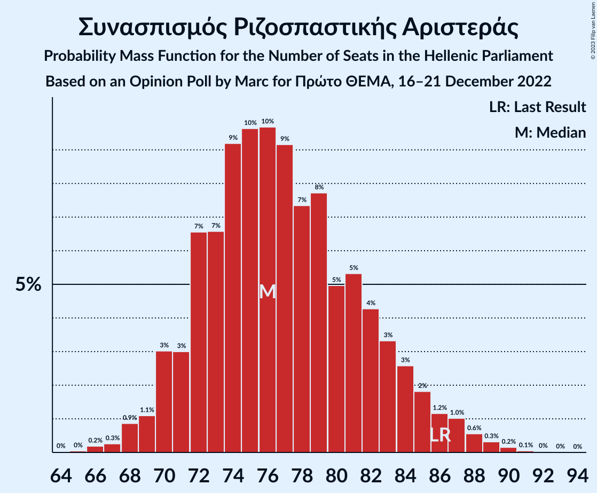

| Number of Seats | Probability | Accumulated | Special Marks |
|:---------------:|:-----------:|:-----------:|:-------------:|
| 65 | 0% | 100% |  |
| 66 | 0.2% | 99.9% |  |
| 67 | 0.3% | 99.7% |  |
| 68 | 0.9% | 99.5% |  |
| 69 | 1.1% | 98.6% |  |
| 70 | 3% | 98% |  |
| 71 | 3% | 94% |  |
| 72 | 7% | 91% |  |
| 73 | 7% | 85% |  |
| 74 | 9% | 78% |  |
| 75 | 10% | 69% |  |
| 76 | 10% | 60% | Median |
| 77 | 9% | 50% |  |
| 78 | 7% | 41% |  |
| 79 | 8% | 33% |  |
| 80 | 5% | 26% |  |
| 81 | 5% | 21% |  |
| 82 | 4% | 15% |  |
| 83 | 3% | 11% |  |
| 84 | 3% | 8% |  |
| 85 | 2% | 5% |  |
| 86 | 1.2% | 3% | Last Result |
| 87 | 1.0% | 2% |  |
| 88 | 0.6% | 1.2% |  |
| 89 | 0.3% | 0.6% |  |
| 90 | 0.2% | 0.3% |  |
| 91 | 0.1% | 0.1% |  |
| 92 | 0% | 0.1% |  |
| 93 | 0% | 0% |  |

### Κίνημα Αλλαγής

*For a full overview of the results for this party, see the [Κίνημα Αλλαγής](party-κίνημααλλαγής.html) page.*

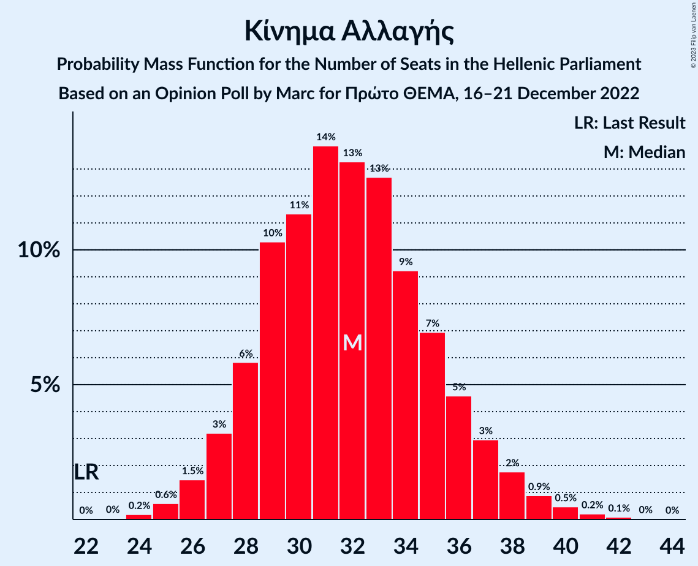

| Number of Seats | Probability | Accumulated | Special Marks |
|:---------------:|:-----------:|:-----------:|:-------------:|
| 22 | 0% | 100% | Last Result |
| 23 | 0% | 100% |  |
| 24 | 0.2% | 99.9% |  |
| 25 | 0.6% | 99.8% |  |
| 26 | 1.5% | 99.2% |  |
| 27 | 3% | 98% |  |
| 28 | 6% | 94% |  |
| 29 | 10% | 89% |  |
| 30 | 11% | 78% |  |
| 31 | 14% | 67% |  |
| 32 | 13% | 53% | Median |
| 33 | 13% | 40% |  |
| 34 | 9% | 27% |  |
| 35 | 7% | 18% |  |
| 36 | 5% | 11% |  |
| 37 | 3% | 6% |  |
| 38 | 2% | 3% |  |
| 39 | 0.9% | 2% |  |
| 40 | 0.5% | 0.8% |  |
| 41 | 0.2% | 0.3% |  |
| 42 | 0.1% | 0.1% |  |
| 43 | 0% | 0% |  |

### Κομμουνιστικό Κόμμα Ελλάδας

*For a full overview of the results for this party, see the [Κομμουνιστικό Κόμμα Ελλάδας](party-κομμουνιστικόκόμμαελλάδας.html) page.*

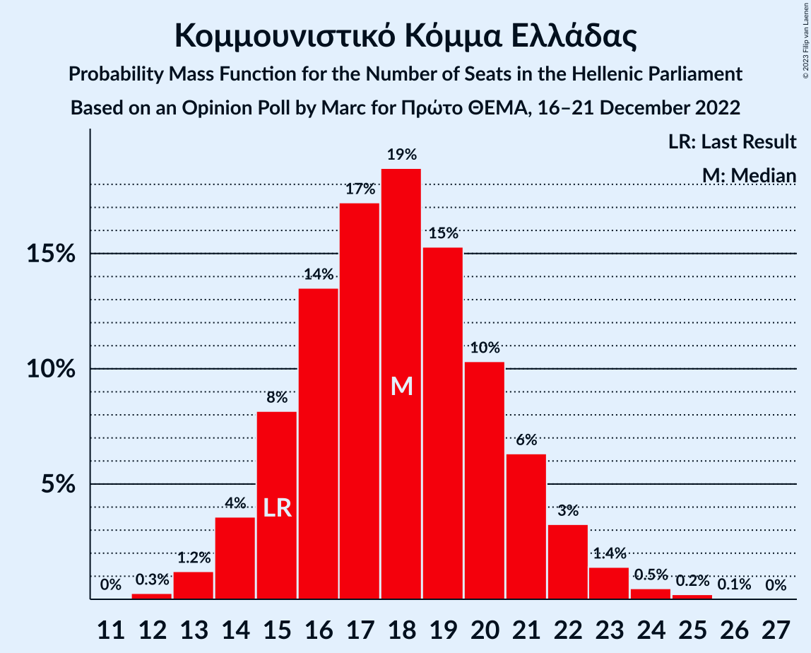

| Number of Seats | Probability | Accumulated | Special Marks |
|:---------------:|:-----------:|:-----------:|:-------------:|
| 12 | 0.3% | 100% |  |
| 13 | 1.2% | 99.7% |  |
| 14 | 4% | 98% |  |
| 15 | 8% | 95% | Last Result |
| 16 | 14% | 87% |  |
| 17 | 17% | 73% |  |
| 18 | 19% | 56% | Median |
| 19 | 15% | 37% |  |
| 20 | 10% | 22% |  |
| 21 | 6% | 12% |  |
| 22 | 3% | 5% |  |
| 23 | 1.4% | 2% |  |
| 24 | 0.5% | 0.8% |  |
| 25 | 0.2% | 0.3% |  |
| 26 | 0.1% | 0.1% |  |
| 27 | 0% | 0% |  |

### Ελληνική Λύση

*For a full overview of the results for this party, see the [Ελληνική Λύση](party-ελληνικήλύση.html) page.*

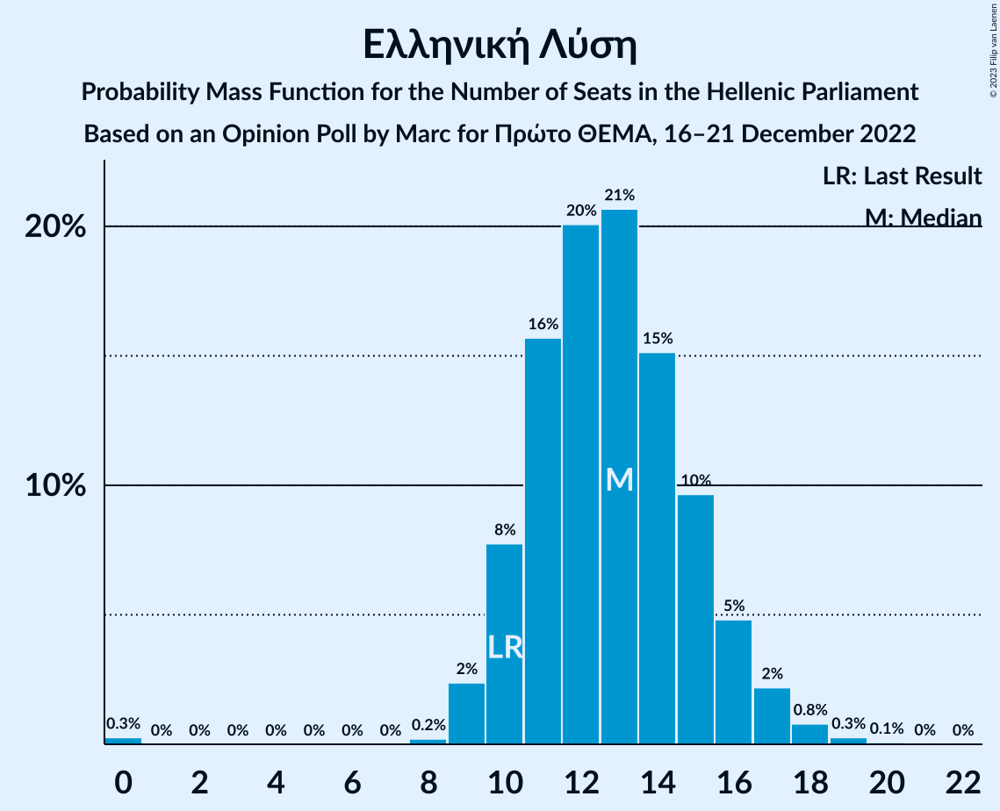

| Number of Seats | Probability | Accumulated | Special Marks |
|:---------------:|:-----------:|:-----------:|:-------------:|
| 0 | 0.3% | 100% |  |
| 1 | 0% | 99.7% |  |
| 2 | 0% | 99.7% |  |
| 3 | 0% | 99.7% |  |
| 4 | 0% | 99.7% |  |
| 5 | 0% | 99.7% |  |
| 6 | 0% | 99.7% |  |
| 7 | 0% | 99.7% |  |
| 8 | 0.2% | 99.7% |  |
| 9 | 2% | 99.5% |  |
| 10 | 8% | 97% | Last Result |
| 11 | 16% | 89% |  |
| 12 | 20% | 74% |  |
| 13 | 21% | 54% | Median |
| 14 | 15% | 33% |  |
| 15 | 10% | 18% |  |
| 16 | 5% | 8% |  |
| 17 | 2% | 3% |  |
| 18 | 0.8% | 1.2% |  |
| 19 | 0.3% | 0.4% |  |
| 20 | 0.1% | 0.1% |  |
| 21 | 0% | 0% |  |

### Μέτωπο Ευρωπαϊκής Ρεαλιστικής Ανυπακοής

*For a full overview of the results for this party, see the [Μέτωπο Ευρωπαϊκής Ρεαλιστικής Ανυπακοής](party-μέτωποευρωπαϊκήςρεαλιστικήςανυπακοής.html) page.*

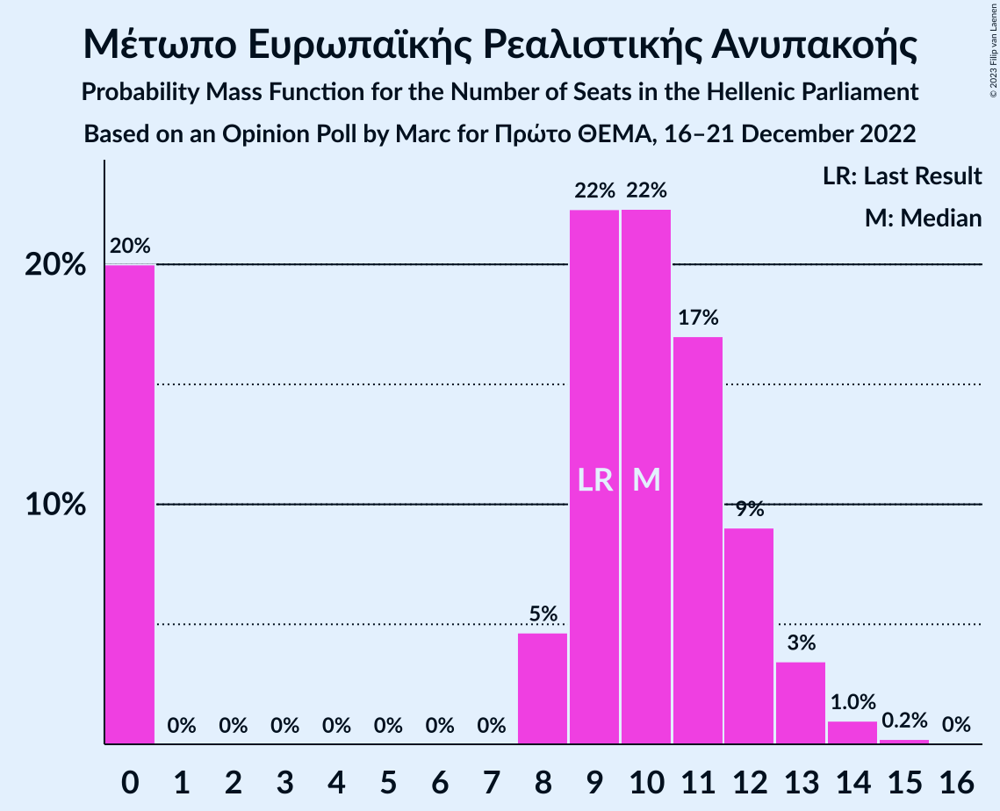

| Number of Seats | Probability | Accumulated | Special Marks |
|:---------------:|:-----------:|:-----------:|:-------------:|
| 0 | 20% | 100% |  |
| 1 | 0% | 80% |  |
| 2 | 0% | 80% |  |
| 3 | 0% | 80% |  |
| 4 | 0% | 80% |  |
| 5 | 0% | 80% |  |
| 6 | 0% | 80% |  |
| 7 | 0% | 80% |  |
| 8 | 5% | 80% |  |
| 9 | 22% | 75% | Last Result |
| 10 | 22% | 53% | Median |
| 11 | 17% | 31% |  |
| 12 | 9% | 14% |  |
| 13 | 3% | 5% |  |
| 14 | 1.0% | 1.2% |  |
| 15 | 0.2% | 0.3% |  |
| 16 | 0% | 0% |  |

## Coalitions

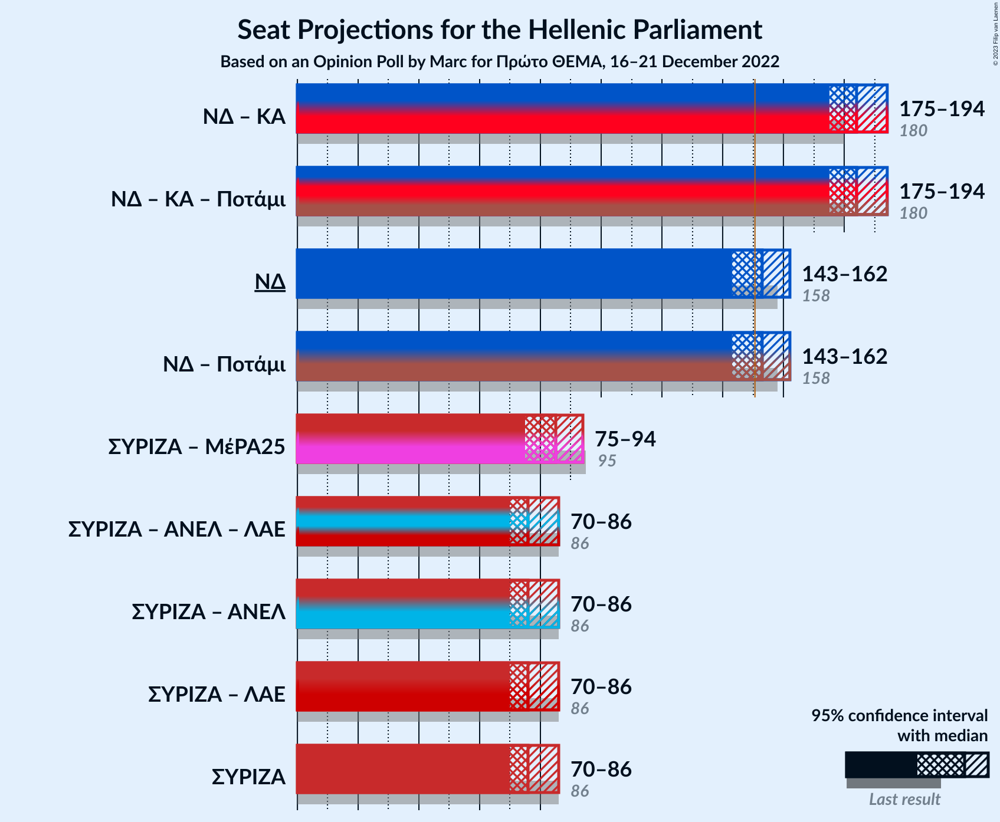

### Confidence Intervals

| Coalition | Last Result | Median | Majority? | 80% Confidence Interval | 90% Confidence Interval | 95% Confidence Interval | 99% Confidence Interval |
|:---------:|:-----------:|:------:|:---------:|:-----------------------:|:-----------------------:|:-----------------------:|:-----------------------:|
| Νέα Δημοκρατία – Κίνημα Αλλαγής | 180 | 184 | 100% | 178–190 | 177–192 | 175–194 | 173–197 |
| Νέα Δημοκρατία | 158 | 153 | 69% | 146–158 | 144–160 | 143–162 | 141–164 |
| Συνασπισμός Ριζοσπαστικής Αριστεράς – Μέτωπο Ευρωπαϊκής Ρεαλιστικής Ανυπακοής | 95 | 85 | 0% | 79–91 | 77–92 | 75–94 | 72–97 |
| Συνασπισμός Ριζοσπαστικής Αριστεράς | 86 | 76 | 0% | 72–83 | 70–85 | 70–86 | 67–89 |

### Νέα Δημοκρατία – Κίνημα Αλλαγής

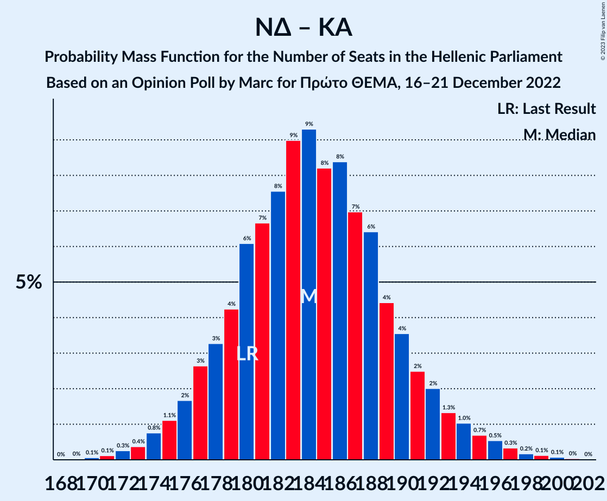

| Number of Seats | Probability | Accumulated | Special Marks |
|:---------------:|:-----------:|:-----------:|:-------------:|
| 169 | 0% | 100% |  |
| 170 | 0.1% | 99.9% |  |
| 171 | 0.1% | 99.9% |  |
| 172 | 0.3% | 99.8% |  |
| 173 | 0.4% | 99.5% |  |
| 174 | 0.8% | 99.1% |  |
| 175 | 1.1% | 98% |  |
| 176 | 2% | 97% |  |
| 177 | 3% | 96% |  |
| 178 | 3% | 93% |  |
| 179 | 4% | 90% |  |
| 180 | 6% | 85% | Last Result |
| 181 | 7% | 79% |  |
| 182 | 8% | 73% |  |
| 183 | 9% | 65% |  |
| 184 | 9% | 56% |  |
| 185 | 8% | 47% | Median |
| 186 | 8% | 39% |  |
| 187 | 7% | 30% |  |
| 188 | 6% | 23% |  |
| 189 | 4% | 17% |  |
| 190 | 4% | 12% |  |
| 191 | 2% | 9% |  |
| 192 | 2% | 6% |  |
| 193 | 1.3% | 4% |  |
| 194 | 1.0% | 3% |  |
| 195 | 0.7% | 2% |  |
| 196 | 0.5% | 1.3% |  |
| 197 | 0.3% | 0.8% |  |
| 198 | 0.2% | 0.4% |  |
| 199 | 0.1% | 0.3% |  |
| 200 | 0.1% | 0.1% |  |
| 201 | 0% | 0.1% |  |
| 202 | 0% | 0% |  |

### Νέα Δημοκρατία

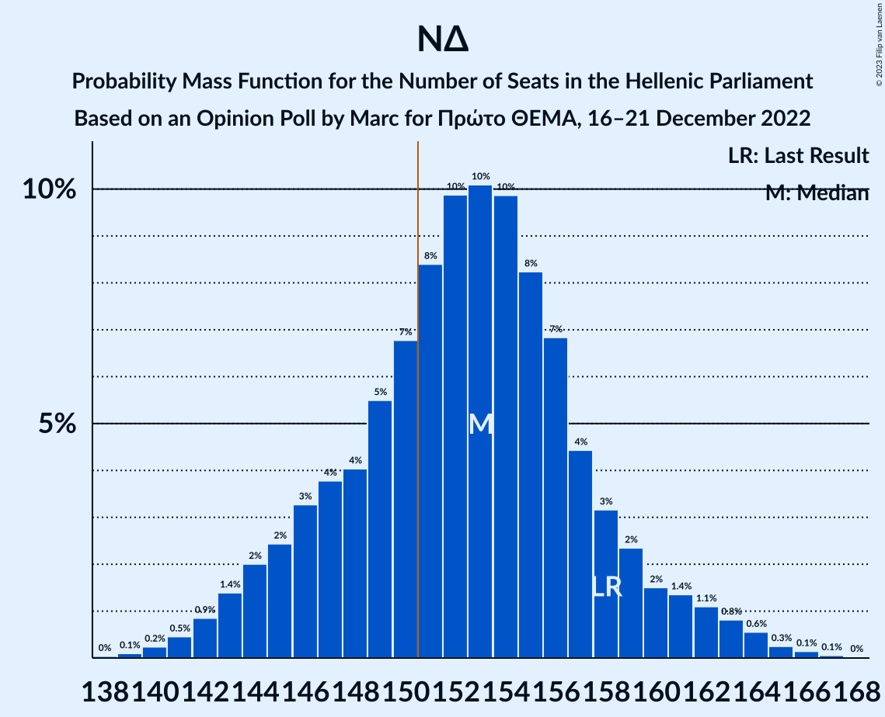

| Number of Seats | Probability | Accumulated | Special Marks |
|:---------------:|:-----------:|:-----------:|:-------------:|
| 138 | 0% | 100% |  |
| 139 | 0.1% | 99.9% |  |
| 140 | 0.2% | 99.8% |  |
| 141 | 0.5% | 99.6% |  |
| 142 | 0.9% | 99.1% |  |
| 143 | 1.4% | 98% |  |
| 144 | 2% | 97% |  |
| 145 | 2% | 95% |  |
| 146 | 3% | 92% |  |
| 147 | 4% | 89% |  |
| 148 | 4% | 85% |  |
| 149 | 5% | 81% |  |
| 150 | 7% | 76% |  |
| 151 | 8% | 69% | Majority |
| 152 | 10% | 61% |  |
| 153 | 10% | 51% | Median |
| 154 | 10% | 41% |  |
| 155 | 8% | 31% |  |
| 156 | 7% | 23% |  |
| 157 | 4% | 16% |  |
| 158 | 3% | 11% | Last Result |
| 159 | 2% | 8% |  |
| 160 | 2% | 6% |  |
| 161 | 1.4% | 4% |  |
| 162 | 1.1% | 3% |  |
| 163 | 0.8% | 2% |  |
| 164 | 0.6% | 1.0% |  |
| 165 | 0.3% | 0.5% |  |
| 166 | 0.1% | 0.2% |  |
| 167 | 0.1% | 0.1% |  |
| 168 | 0% | 0% |  |

### Συνασπισμός Ριζοσπαστικής Αριστεράς – Μέτωπο Ευρωπαϊκής Ρεαλιστικής Ανυπακοής

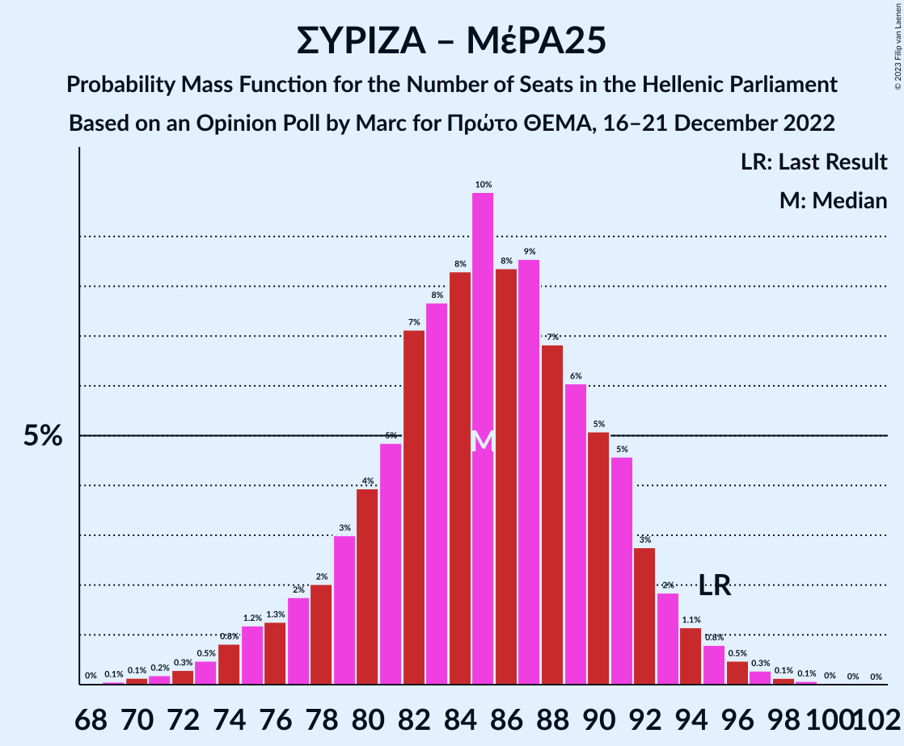

| Number of Seats | Probability | Accumulated | Special Marks |
|:---------------:|:-----------:|:-----------:|:-------------:|
| 69 | 0.1% | 100% |  |
| 70 | 0.1% | 99.9% |  |
| 71 | 0.2% | 99.8% |  |
| 72 | 0.3% | 99.6% |  |
| 73 | 0.5% | 99.3% |  |
| 74 | 0.8% | 98.8% |  |
| 75 | 1.2% | 98% |  |
| 76 | 1.3% | 97% |  |
| 77 | 2% | 96% |  |
| 78 | 2% | 94% |  |
| 79 | 3% | 92% |  |
| 80 | 4% | 89% |  |
| 81 | 5% | 85% |  |
| 82 | 7% | 80% |  |
| 83 | 8% | 73% |  |
| 84 | 8% | 65% |  |
| 85 | 10% | 57% |  |
| 86 | 8% | 47% | Median |
| 87 | 9% | 39% |  |
| 88 | 7% | 30% |  |
| 89 | 6% | 23% |  |
| 90 | 5% | 17% |  |
| 91 | 5% | 12% |  |
| 92 | 3% | 8% |  |
| 93 | 2% | 5% |  |
| 94 | 1.1% | 3% |  |
| 95 | 0.8% | 2% | Last Result |
| 96 | 0.5% | 1.0% |  |
| 97 | 0.3% | 0.5% |  |
| 98 | 0.1% | 0.3% |  |
| 99 | 0.1% | 0.1% |  |
| 100 | 0% | 0.1% |  |
| 101 | 0% | 0% |  |

### Συνασπισμός Ριζοσπαστικής Αριστεράς

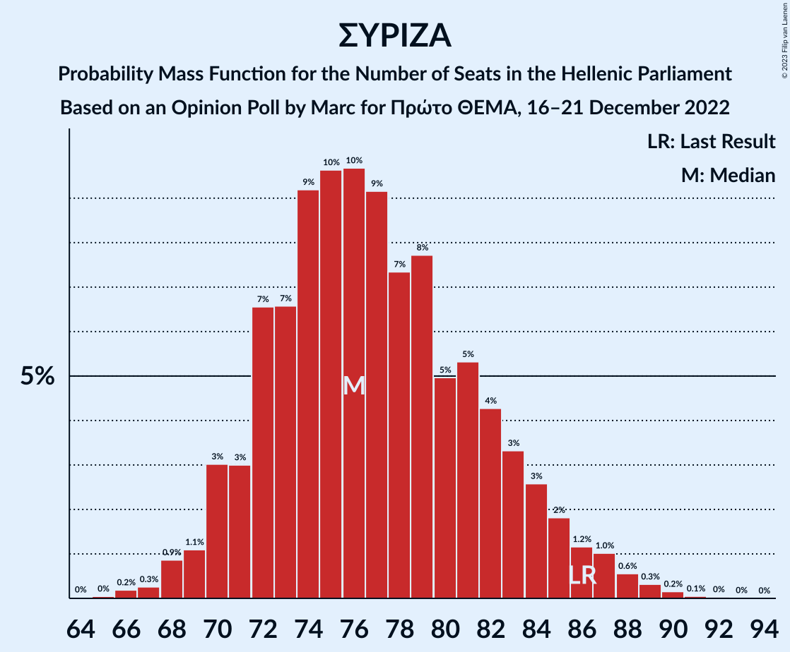

| Number of Seats | Probability | Accumulated | Special Marks |
|:---------------:|:-----------:|:-----------:|:-------------:|
| 65 | 0% | 100% |  |
| 66 | 0.2% | 99.9% |  |
| 67 | 0.3% | 99.7% |  |
| 68 | 0.9% | 99.5% |  |
| 69 | 1.1% | 98.6% |  |
| 70 | 3% | 98% |  |
| 71 | 3% | 94% |  |
| 72 | 7% | 91% |  |
| 73 | 7% | 85% |  |
| 74 | 9% | 78% |  |
| 75 | 10% | 69% |  |
| 76 | 10% | 60% | Median |
| 77 | 9% | 50% |  |
| 78 | 7% | 41% |  |
| 79 | 8% | 33% |  |
| 80 | 5% | 26% |  |
| 81 | 5% | 21% |  |
| 82 | 4% | 15% |  |
| 83 | 3% | 11% |  |
| 84 | 3% | 8% |  |
| 85 | 2% | 5% |  |
| 86 | 1.2% | 3% | Last Result |
| 87 | 1.0% | 2% |  |
| 88 | 0.6% | 1.2% |  |
| 89 | 0.3% | 0.6% |  |
| 90 | 0.2% | 0.3% |  |
| 91 | 0.1% | 0.1% |  |
| 92 | 0% | 0.1% |  |
| 93 | 0% | 0% |  |

## Technical Information

### Opinion Poll

+ **Polling firm:** Marc
+ **Commissioner(s):** Πρώτο ΘΕΜΑ
+ **Fieldwork period:** 16–21 December 2022

### Calculations

+ **Sample size:** 1003
+ **Simulations done:** 1,048,576
+ **Error estimate:** 0.59%

