# Opinion Poll by Opinion Poll for The TOC, 11–13 January 2023

<a href="#voting-intentions">Voting Intentions</a> | <a href="#seats">Seats</a> | <a href="#coalitions">Coalitions</a> | <a href="#technical-information">Technical Information</a>

## Voting Intentions

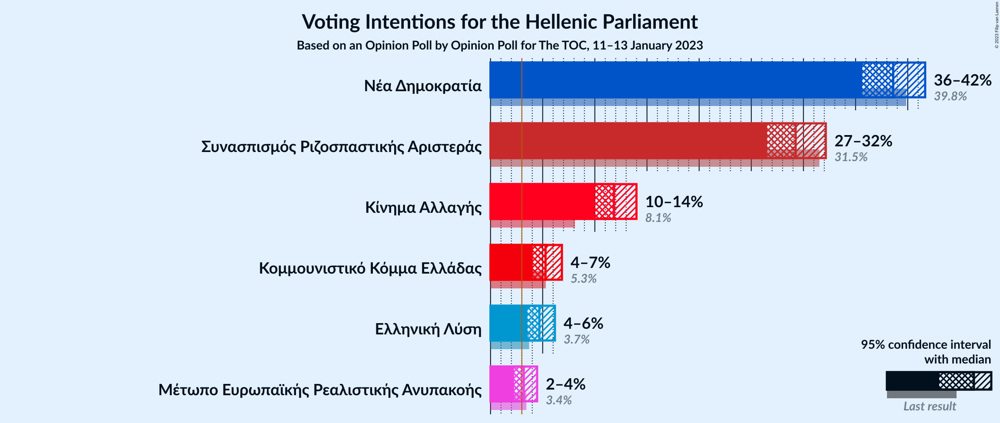

### Confidence Intervals

| Party | Last Result | Poll Result | 80% Confidence Interval | 90% Confidence Interval | 95% Confidence Interval | 99% Confidence Interval |
|:-----:|:-----------:|:-----------:|:-----------------------:|:-----------------------:|:-----------------------:|:-----------------------:|
| Νέα Δημοκρατία | 39.8% | 38.6% | 36.7–40.6% |36.1–41.2% |35.6–41.7% |34.7–42.6% |
| Συνασπισμός Ριζοσπαστικής Αριστεράς | 31.5% | 29.3% | 27.5–31.2% |26.9–31.7% |26.5–32.1% |25.7–33.1% |
| Κίνημα Αλλαγής | 8.1% | 11.8% | 10.6–13.2% |10.3–13.6% |10.0–14.0% |9.4–14.7% |
| Κομμουνιστικό Κόμμα Ελλάδας | 5.3% | 5.3% | 4.5–6.3% |4.2–6.6% |4.1–6.8% |3.7–7.4% |
| Ελληνική Λύση | 3.7% | 4.7% | 3.9–5.7% |3.7–5.9% |3.5–6.2% |3.2–6.7% |
| Μέτωπο Ευρωπαϊκής Ρεαλιστικής Ανυπακοής | 3.4% | 3.2% | 2.6–4.0% |2.4–4.3% |2.3–4.5% |2.0–4.9% |

*Note:* The poll result column reflects the actual value used in the calculations. Published results may vary slightly, and in addition be rounded to fewer digits.

## Seats

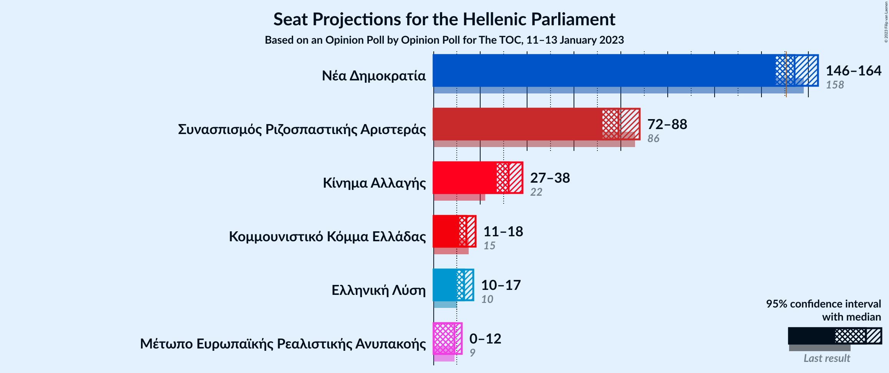

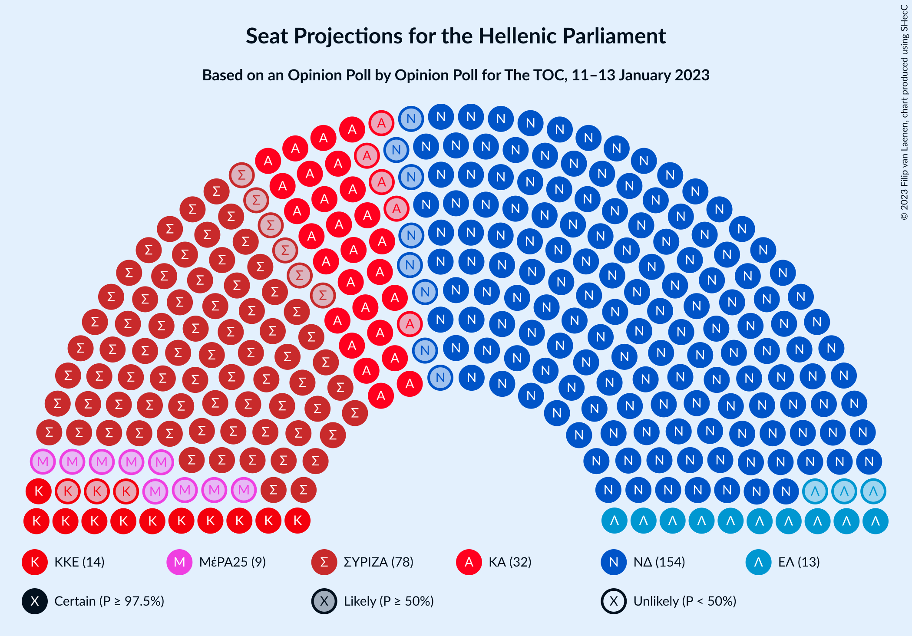

### Confidence Intervals

| Party | Last Result | Median | 80% Confidence Interval | 90% Confidence Interval | 95% Confidence Interval | 99% Confidence Interval |
|:-----:|:-----------:|:------:|:-----------------------:|:-----------------------:|:-----------------------:|:-----------------------:|
| <a href="#νέα-δημοκρατία">Νέα Δημοκρατία</a> | 158 | 154 | 149–160 |147–162 |146–164 |144–167 |
| <a href="#συνασπισμός-ριζοσπαστικής-αριστεράς">Συνασπισμός Ριζοσπαστικής Αριστεράς</a> | 86 | 79 | 74–85 |73–86 |72–88 |69–90 |
| <a href="#κίνημα-αλλαγής">Κίνημα Αλλαγής</a> | 22 | 32 | 29–36 |28–37 |27–38 |25–40 |
| <a href="#κομμουνιστικό-κόμμα-ελλάδας">Κομμουνιστικό Κόμμα Ελλάδας</a> | 15 | 14 | 12–17 |11–18 |11–18 |10–20 |
| <a href="#ελληνική-λύση">Ελληνική Λύση</a> | 10 | 13 | 11–15 |10–16 |10–17 |9–18 |
| <a href="#μέτωπο-ευρωπαϊκής-ρεαλιστικής-ανυπακοής">Μέτωπο Ευρωπαϊκής Ρεαλιστικής Ανυπακοής</a> | 9 | 9 | 0–11 |0–11 |0–12 |0–13 |

### Νέα Δημοκρατία

*For a full overview of the results for this party, see the [Νέα Δημοκρατία](party-νέαδημοκρατία.html) page.*

| Number of Seats | Probability | Accumulated | Special Marks |
|:---------------:|:-----------:|:-----------:|:-------------:|
| 141 | 0.1% | 100% |  |
| 142 | 0.1% | 99.9% |  |
| 143 | 0.3% | 99.8% |  |
| 144 | 0.5% | 99.5% |  |
| 145 | 0.9% | 99.0% |  |
| 146 | 2% | 98% |  |
| 147 | 2% | 96% |  |
| 148 | 4% | 94% |  |
| 149 | 4% | 91% |  |
| 150 | 6% | 86% |  |
| 151 | 7% | 80% | Majority |
| 152 | 9% | 73% |  |
| 153 | 8% | 64% |  |
| 154 | 10% | 56% | Median |
| 155 | 8% | 46% |  |
| 156 | 8% | 38% |  |
| 157 | 7% | 30% |  |
| 158 | 6% | 23% | Last Result |
| 159 | 4% | 17% |  |
| 160 | 3% | 13% |  |
| 161 | 3% | 9% |  |
| 162 | 2% | 6% |  |
| 163 | 2% | 4% |  |
| 164 | 1.0% | 3% |  |
| 165 | 0.7% | 2% |  |
| 166 | 0.4% | 0.9% |  |
| 167 | 0.2% | 0.5% |  |
| 168 | 0.1% | 0.3% |  |
| 169 | 0.1% | 0.1% |  |
| 170 | 0% | 0.1% |  |
| 171 | 0% | 0% |  |

### Συνασπισμός Ριζοσπαστικής Αριστεράς

*For a full overview of the results for this party, see the [Συνασπισμός Ριζοσπαστικής Αριστεράς](party-συνασπισμόςριζοσπαστικήςαριστεράς.html) page.*

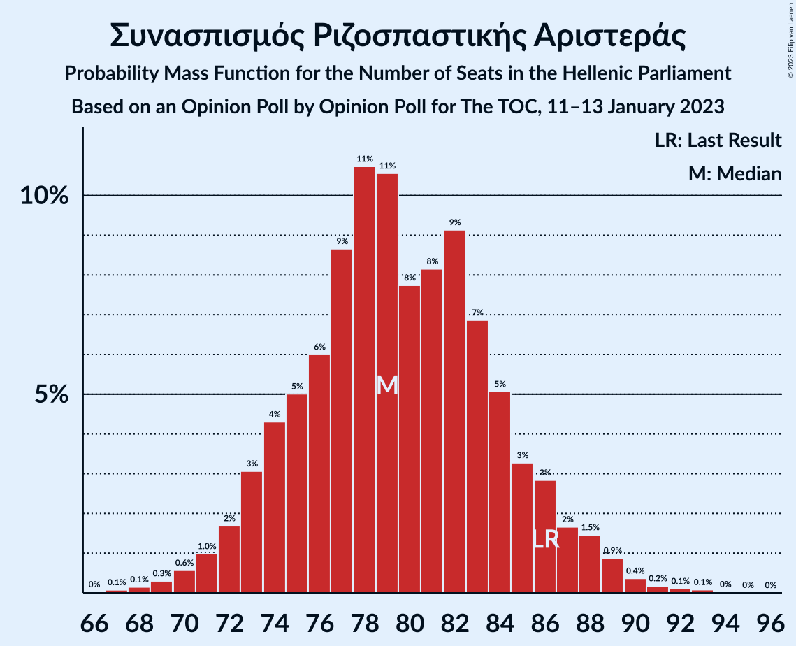

| Number of Seats | Probability | Accumulated | Special Marks |
|:---------------:|:-----------:|:-----------:|:-------------:|
| 67 | 0.1% | 100% |  |
| 68 | 0.1% | 99.9% |  |
| 69 | 0.3% | 99.7% |  |
| 70 | 0.6% | 99.4% |  |
| 71 | 1.0% | 98.9% |  |
| 72 | 2% | 98% |  |
| 73 | 3% | 96% |  |
| 74 | 4% | 93% |  |
| 75 | 5% | 89% |  |
| 76 | 6% | 84% |  |
| 77 | 9% | 78% |  |
| 78 | 11% | 69% |  |
| 79 | 11% | 58% | Median |
| 80 | 8% | 48% |  |
| 81 | 8% | 40% |  |
| 82 | 9% | 32% |  |
| 83 | 7% | 23% |  |
| 84 | 5% | 16% |  |
| 85 | 3% | 11% |  |
| 86 | 3% | 8% | Last Result |
| 87 | 2% | 5% |  |
| 88 | 1.5% | 3% |  |
| 89 | 0.9% | 2% |  |
| 90 | 0.4% | 0.8% |  |
| 91 | 0.2% | 0.4% |  |
| 92 | 0.1% | 0.2% |  |
| 93 | 0.1% | 0.1% |  |
| 94 | 0% | 0.1% |  |
| 95 | 0% | 0% |  |

### Κίνημα Αλλαγής

*For a full overview of the results for this party, see the [Κίνημα Αλλαγής](party-κίνημααλλαγής.html) page.*

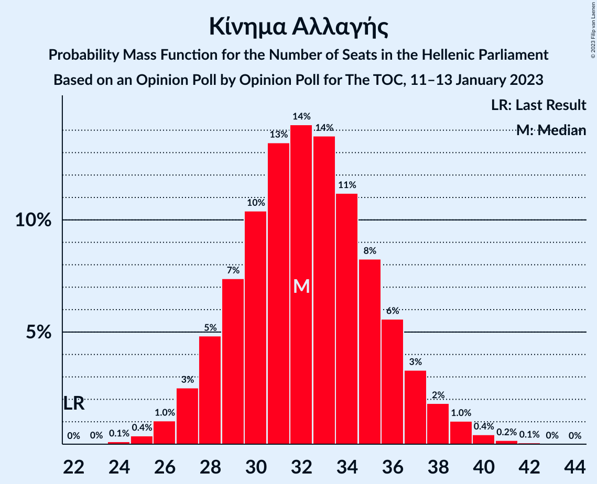

| Number of Seats | Probability | Accumulated | Special Marks |
|:---------------:|:-----------:|:-----------:|:-------------:|
| 22 | 0% | 100% | Last Result |
| 23 | 0% | 100% |  |
| 24 | 0.1% | 100% |  |
| 25 | 0.4% | 99.9% |  |
| 26 | 1.0% | 99.5% |  |
| 27 | 3% | 98% |  |
| 28 | 5% | 96% |  |
| 29 | 7% | 91% |  |
| 30 | 10% | 84% |  |
| 31 | 13% | 73% |  |
| 32 | 14% | 60% | Median |
| 33 | 14% | 46% |  |
| 34 | 11% | 32% |  |
| 35 | 8% | 21% |  |
| 36 | 6% | 12% |  |
| 37 | 3% | 7% |  |
| 38 | 2% | 4% |  |
| 39 | 1.0% | 2% |  |
| 40 | 0.4% | 0.7% |  |
| 41 | 0.2% | 0.3% |  |
| 42 | 0.1% | 0.1% |  |
| 43 | 0% | 0% |  |

### Κομμουνιστικό Κόμμα Ελλάδας

*For a full overview of the results for this party, see the [Κομμουνιστικό Κόμμα Ελλάδας](party-κομμουνιστικόκόμμαελλάδας.html) page.*

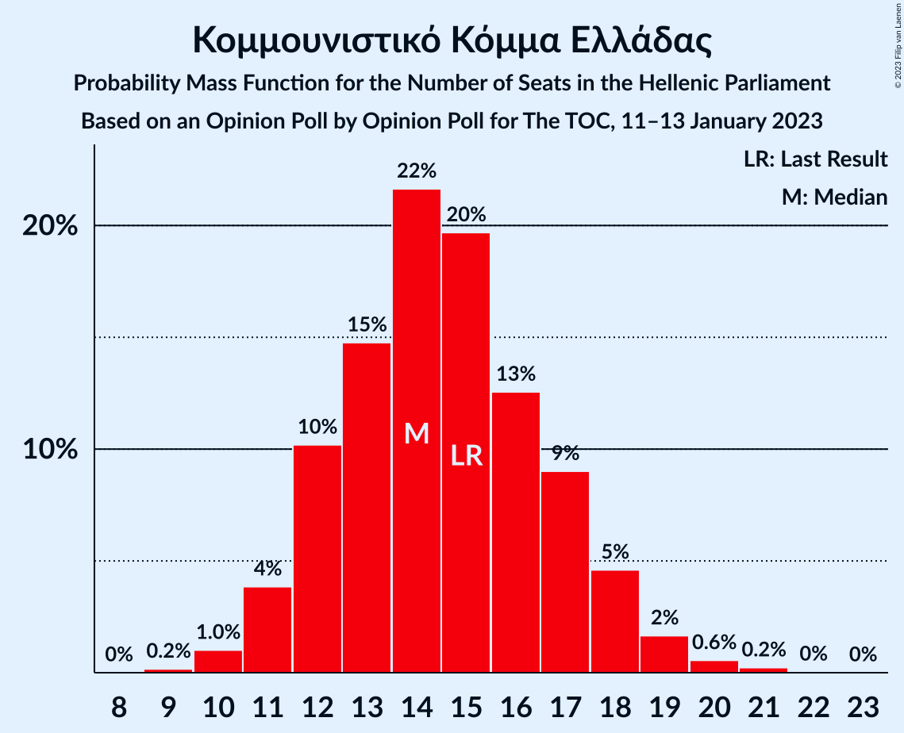

| Number of Seats | Probability | Accumulated | Special Marks |
|:---------------:|:-----------:|:-----------:|:-------------:|
| 9 | 0.2% | 100% |  |
| 10 | 1.0% | 99.8% |  |
| 11 | 4% | 98.8% |  |
| 12 | 10% | 95% |  |
| 13 | 15% | 85% |  |
| 14 | 22% | 70% | Median |
| 15 | 20% | 48% | Last Result |
| 16 | 13% | 29% |  |
| 17 | 9% | 16% |  |
| 18 | 5% | 7% |  |
| 19 | 2% | 2% |  |
| 20 | 0.6% | 0.8% |  |
| 21 | 0.2% | 0.3% |  |
| 22 | 0% | 0.1% |  |
| 23 | 0% | 0% |  |

### Ελληνική Λύση

*For a full overview of the results for this party, see the [Ελληνική Λύση](party-ελληνικήλύση.html) page.*

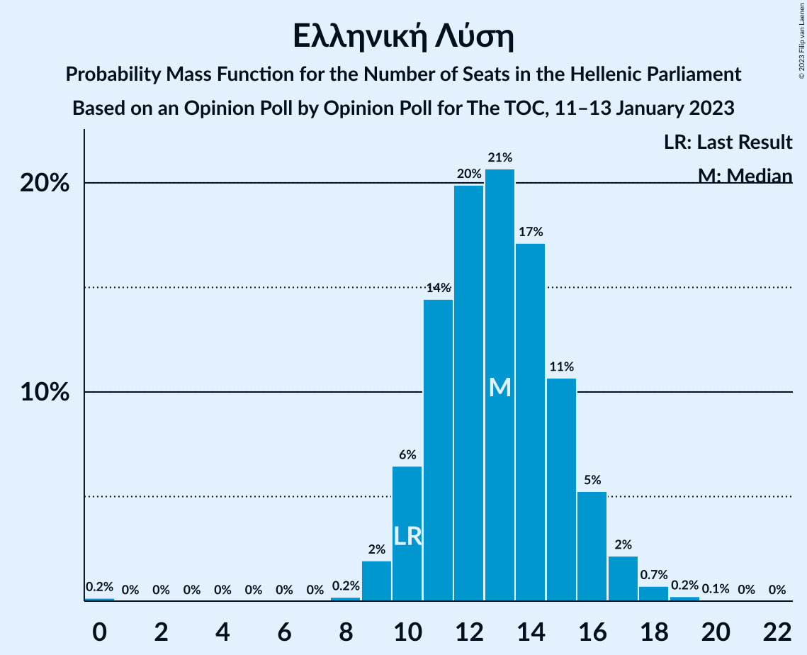

| Number of Seats | Probability | Accumulated | Special Marks |
|:---------------:|:-----------:|:-----------:|:-------------:|
| 0 | 0.2% | 100% |  |
| 1 | 0% | 99.8% |  |
| 2 | 0% | 99.8% |  |
| 3 | 0% | 99.8% |  |
| 4 | 0% | 99.8% |  |
| 5 | 0% | 99.8% |  |
| 6 | 0% | 99.8% |  |
| 7 | 0% | 99.8% |  |
| 8 | 0.2% | 99.8% |  |
| 9 | 2% | 99.7% |  |
| 10 | 6% | 98% | Last Result |
| 11 | 14% | 91% |  |
| 12 | 20% | 77% |  |
| 13 | 21% | 57% | Median |
| 14 | 17% | 36% |  |
| 15 | 11% | 19% |  |
| 16 | 5% | 8% |  |
| 17 | 2% | 3% |  |
| 18 | 0.7% | 1.0% |  |
| 19 | 0.2% | 0.3% |  |
| 20 | 0.1% | 0.1% |  |
| 21 | 0% | 0% |  |

### Μέτωπο Ευρωπαϊκής Ρεαλιστικής Ανυπακοής

*For a full overview of the results for this party, see the [Μέτωπο Ευρωπαϊκής Ρεαλιστικής Ανυπακοής](party-μέτωποευρωπαϊκήςρεαλιστικήςανυπακοής.html) page.*

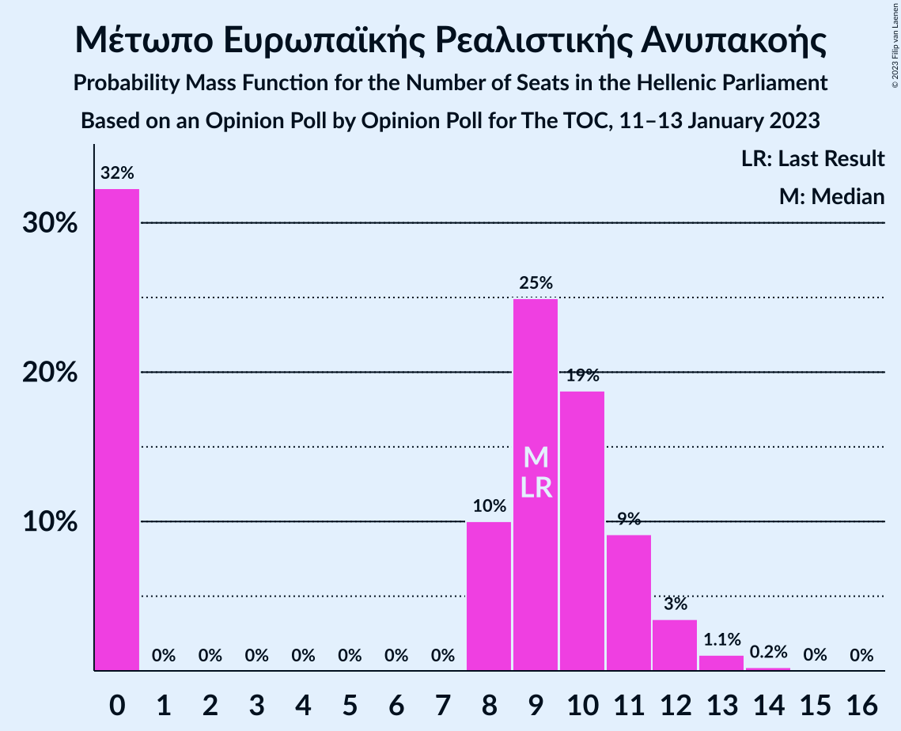

| Number of Seats | Probability | Accumulated | Special Marks |
|:---------------:|:-----------:|:-----------:|:-------------:|
| 0 | 32% | 100% |  |
| 1 | 0% | 68% |  |
| 2 | 0% | 68% |  |
| 3 | 0% | 68% |  |
| 4 | 0% | 68% |  |
| 5 | 0% | 68% |  |
| 6 | 0% | 68% |  |
| 7 | 0% | 68% |  |
| 8 | 10% | 68% |  |
| 9 | 25% | 58% | Last Result, Median |
| 10 | 19% | 33% |  |
| 11 | 9% | 14% |  |
| 12 | 3% | 5% |  |
| 13 | 1.1% | 1.4% |  |
| 14 | 0.2% | 0.3% |  |
| 15 | 0% | 0.1% |  |
| 16 | 0% | 0% |  |

## Coalitions

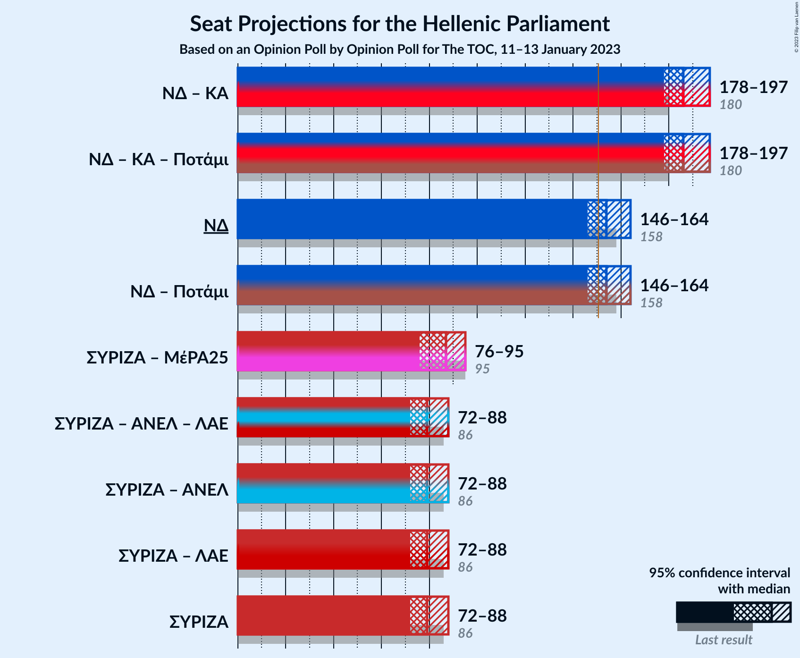

### Confidence Intervals

| Coalition | Last Result | Median | Majority? | 80% Confidence Interval | 90% Confidence Interval | 95% Confidence Interval | 99% Confidence Interval |
|:---------:|:-----------:|:------:|:---------:|:-----------------------:|:-----------------------:|:-----------------------:|:-----------------------:|
| Νέα Δημοκρατία – Κίνημα Αλλαγής | 180 | 186 | 100% | 181–193 | 179–195 | 178–197 | 175–199 |
| Νέα Δημοκρατία | 158 | 154 | 80% | 149–160 | 147–162 | 146–164 | 144–167 |
| Συνασπισμός Ριζοσπαστικής Αριστεράς – Μέτωπο Ευρωπαϊκής Ρεαλιστικής Ανυπακοής | 95 | 87 | 0% | 79–92 | 77–94 | 76–95 | 73–98 |
| Συνασπισμός Ριζοσπαστικής Αριστεράς | 86 | 79 | 0% | 74–85 | 73–86 | 72–88 | 69–90 |

### Νέα Δημοκρατία – Κίνημα Αλλαγής

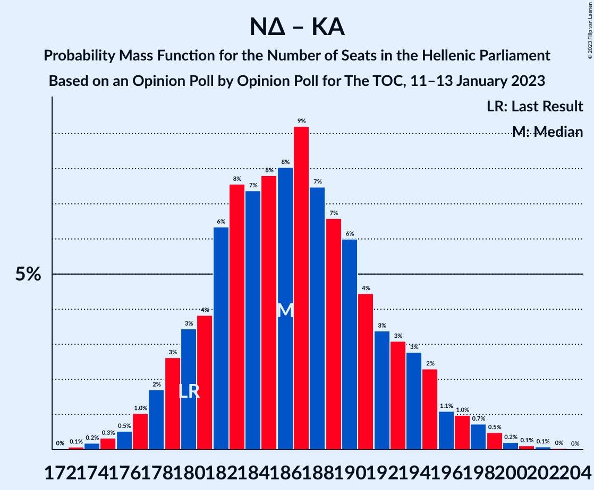

| Number of Seats | Probability | Accumulated | Special Marks |
|:---------------:|:-----------:|:-----------:|:-------------:|
| 172 | 0% | 100% |  |
| 173 | 0.1% | 99.9% |  |
| 174 | 0.2% | 99.9% |  |
| 175 | 0.3% | 99.7% |  |
| 176 | 0.5% | 99.3% |  |
| 177 | 1.0% | 98.8% |  |
| 178 | 2% | 98% |  |
| 179 | 3% | 96% |  |
| 180 | 3% | 93% | Last Result |
| 181 | 4% | 90% |  |
| 182 | 6% | 86% |  |
| 183 | 8% | 80% |  |
| 184 | 7% | 72% |  |
| 185 | 8% | 65% |  |
| 186 | 8% | 57% | Median |
| 187 | 9% | 49% |  |
| 188 | 7% | 40% |  |
| 189 | 7% | 32% |  |
| 190 | 6% | 26% |  |
| 191 | 4% | 20% |  |
| 192 | 3% | 15% |  |
| 193 | 3% | 12% |  |
| 194 | 3% | 9% |  |
| 195 | 2% | 6% |  |
| 196 | 1.1% | 4% |  |
| 197 | 1.0% | 3% |  |
| 198 | 0.7% | 2% |  |
| 199 | 0.5% | 1.0% |  |
| 200 | 0.2% | 0.5% |  |
| 201 | 0.1% | 0.3% |  |
| 202 | 0.1% | 0.2% |  |
| 203 | 0% | 0.1% |  |
| 204 | 0% | 0% |  |

### Νέα Δημοκρατία

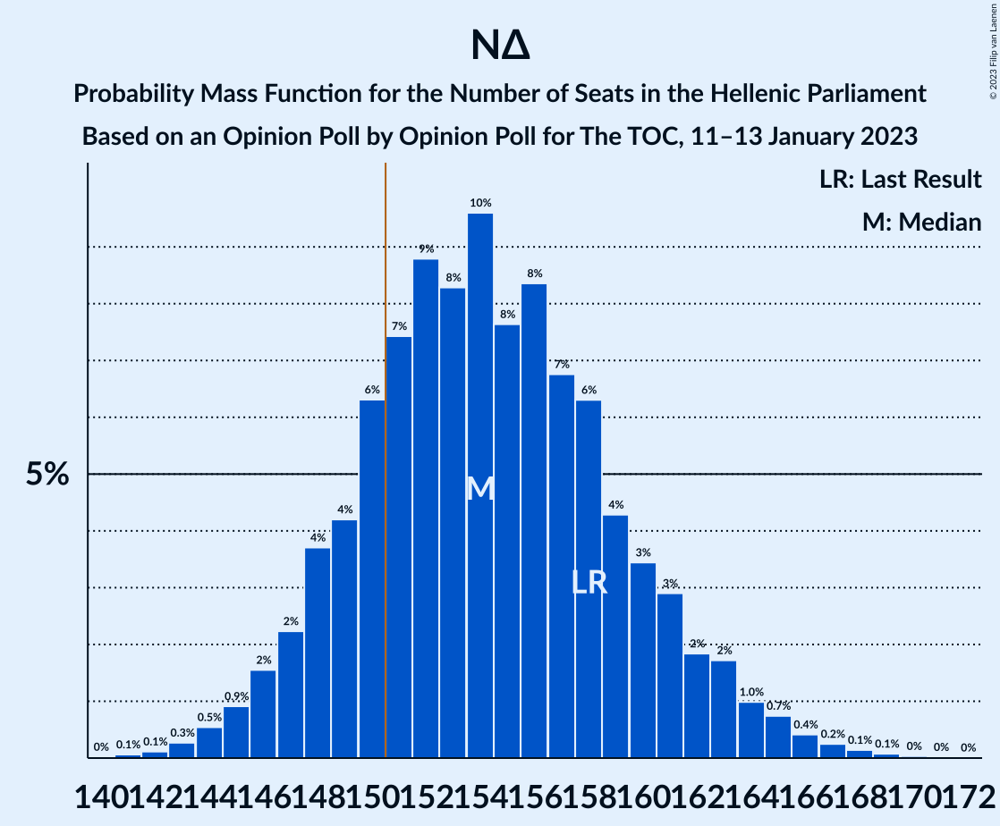

| Number of Seats | Probability | Accumulated | Special Marks |
|:---------------:|:-----------:|:-----------:|:-------------:|
| 141 | 0.1% | 100% |  |
| 142 | 0.1% | 99.9% |  |
| 143 | 0.3% | 99.8% |  |
| 144 | 0.5% | 99.5% |  |
| 145 | 0.9% | 99.0% |  |
| 146 | 2% | 98% |  |
| 147 | 2% | 96% |  |
| 148 | 4% | 94% |  |
| 149 | 4% | 91% |  |
| 150 | 6% | 86% |  |
| 151 | 7% | 80% | Majority |
| 152 | 9% | 73% |  |
| 153 | 8% | 64% |  |
| 154 | 10% | 56% | Median |
| 155 | 8% | 46% |  |
| 156 | 8% | 38% |  |
| 157 | 7% | 30% |  |
| 158 | 6% | 23% | Last Result |
| 159 | 4% | 17% |  |
| 160 | 3% | 13% |  |
| 161 | 3% | 9% |  |
| 162 | 2% | 6% |  |
| 163 | 2% | 4% |  |
| 164 | 1.0% | 3% |  |
| 165 | 0.7% | 2% |  |
| 166 | 0.4% | 0.9% |  |
| 167 | 0.2% | 0.5% |  |
| 168 | 0.1% | 0.3% |  |
| 169 | 0.1% | 0.1% |  |
| 170 | 0% | 0.1% |  |
| 171 | 0% | 0% |  |

### Συνασπισμός Ριζοσπαστικής Αριστεράς – Μέτωπο Ευρωπαϊκής Ρεαλιστικής Ανυπακοής

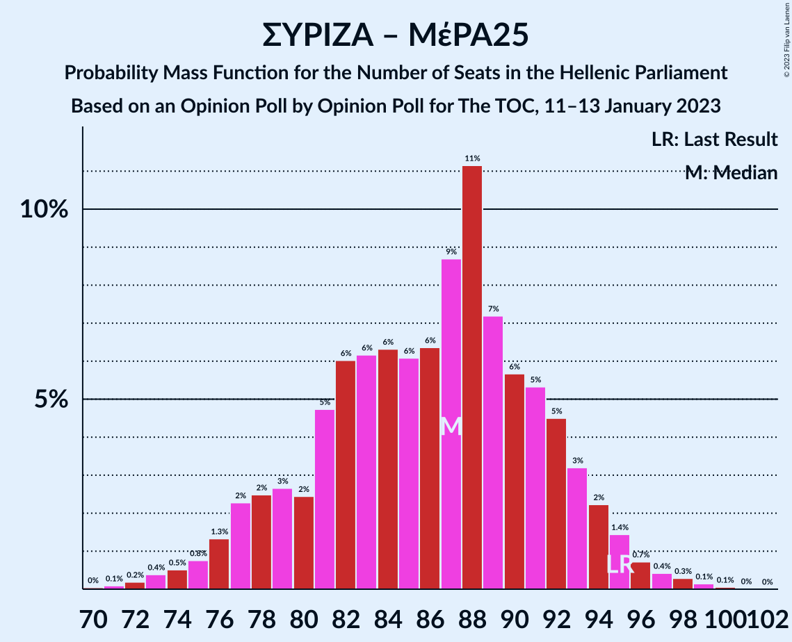

| Number of Seats | Probability | Accumulated | Special Marks |
|:---------------:|:-----------:|:-----------:|:-------------:|
| 70 | 0% | 100% |  |
| 71 | 0.1% | 99.9% |  |
| 72 | 0.2% | 99.8% |  |
| 73 | 0.4% | 99.6% |  |
| 74 | 0.5% | 99.3% |  |
| 75 | 0.8% | 98.7% |  |
| 76 | 1.3% | 98% |  |
| 77 | 2% | 97% |  |
| 78 | 2% | 94% |  |
| 79 | 3% | 92% |  |
| 80 | 2% | 89% |  |
| 81 | 5% | 87% |  |
| 82 | 6% | 82% |  |
| 83 | 6% | 76% |  |
| 84 | 6% | 70% |  |
| 85 | 6% | 64% |  |
| 86 | 6% | 57% |  |
| 87 | 9% | 51% |  |
| 88 | 11% | 42% | Median |
| 89 | 7% | 31% |  |
| 90 | 6% | 24% |  |
| 91 | 5% | 18% |  |
| 92 | 5% | 13% |  |
| 93 | 3% | 9% |  |
| 94 | 2% | 5% |  |
| 95 | 1.4% | 3% | Last Result |
| 96 | 0.7% | 2% |  |
| 97 | 0.4% | 1.0% |  |
| 98 | 0.3% | 0.5% |  |
| 99 | 0.1% | 0.2% |  |
| 100 | 0.1% | 0.1% |  |
| 101 | 0% | 0% |  |

### Συνασπισμός Ριζοσπαστικής Αριστεράς

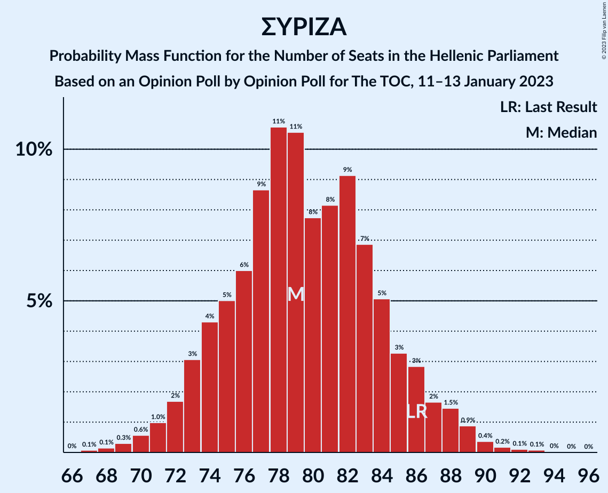

| Number of Seats | Probability | Accumulated | Special Marks |
|:---------------:|:-----------:|:-----------:|:-------------:|
| 67 | 0.1% | 100% |  |
| 68 | 0.1% | 99.9% |  |
| 69 | 0.3% | 99.7% |  |
| 70 | 0.6% | 99.4% |  |
| 71 | 1.0% | 98.9% |  |
| 72 | 2% | 98% |  |
| 73 | 3% | 96% |  |
| 74 | 4% | 93% |  |
| 75 | 5% | 89% |  |
| 76 | 6% | 84% |  |
| 77 | 9% | 78% |  |
| 78 | 11% | 69% |  |
| 79 | 11% | 58% | Median |
| 80 | 8% | 48% |  |
| 81 | 8% | 40% |  |
| 82 | 9% | 32% |  |
| 83 | 7% | 23% |  |
| 84 | 5% | 16% |  |
| 85 | 3% | 11% |  |
| 86 | 3% | 8% | Last Result |
| 87 | 2% | 5% |  |
| 88 | 1.5% | 3% |  |
| 89 | 0.9% | 2% |  |
| 90 | 0.4% | 0.8% |  |
| 91 | 0.2% | 0.4% |  |
| 92 | 0.1% | 0.2% |  |
| 93 | 0.1% | 0.1% |  |
| 94 | 0% | 0.1% |  |
| 95 | 0% | 0% |  |

## Technical Information

### Opinion Poll

+ **Polling firm:** Opinion Poll
+ **Commissioner(s):** The TOC
+ **Fieldwork period:** 11–13 January 2023

### Calculations

+ **Sample size:** 1005
+ **Simulations done:** 1,048,576
+ **Error estimate:** 0.62%

