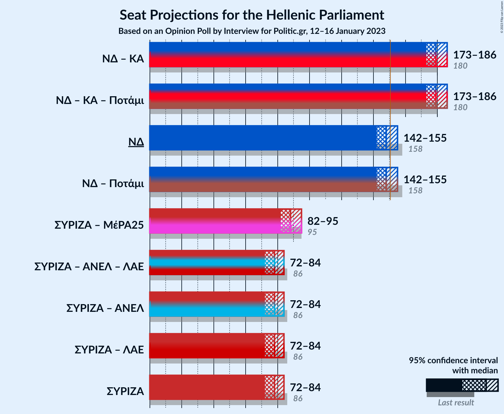

# Opinion Poll by Interview for Politic.gr, 12–16 January 2023

<a href="#voting-intentions">Voting Intentions</a> | <a href="#seats">Seats</a> | <a href="#coalitions">Coalitions</a> | <a href="#technical-information">Technical Information</a>

## Voting Intentions

### Confidence Intervals

| Party | Last Result | Poll Result | 80% Confidence Interval | 90% Confidence Interval | 95% Confidence Interval | 99% Confidence Interval |
|:-----:|:-----------:|:-----------:|:-----------------------:|:-----------------------:|:-----------------------:|:-----------------------:|
| Νέα Δημοκρατία | 39.8% | 36.0% | 34.5–37.5% |34.1–38.0% |33.7–38.3% |33.0–39.1% |
| Συνασπισμός Ριζοσπαστικής Αριστεράς | 31.5% | 28.4% | 27.0–29.9% |26.6–30.3% |26.3–30.6% |25.7–31.3% |
| Κίνημα Αλλαγής | 8.1% | 11.2% | 10.3–12.3% |10.0–12.6% |9.8–12.8% |9.4–13.4% |
| Κομμουνιστικό Κόμμα Ελλάδας | 5.3% | 6.7% | 6.0–7.5% |5.8–7.8% |5.6–8.0% |5.3–8.4% |
| Ελληνική Λύση | 3.7% | 5.0% | 4.4–5.8% |4.2–6.0% |4.1–6.2% |3.8–6.6% |
| Μέτωπο Ευρωπαϊκής Ρεαλιστικής Ανυπακοής | 3.4% | 3.9% | 3.3–4.6% |3.2–4.8% |3.0–4.9% |2.8–5.3% |

*Note:* The poll result column reflects the actual value used in the calculations. Published results may vary slightly, and in addition be rounded to fewer digits.

## Seats

### Confidence Intervals

| Party | Last Result | Median | 80% Confidence Interval | 90% Confidence Interval | 95% Confidence Interval | 99% Confidence Interval |
|:-----:|:-----------:|:------:|:-----------------------:|:-----------------------:|:-----------------------:|:-----------------------:|
| <a href="#νέα-δημοκρατία">Νέα Δημοκρατία</a> | 158 | 148 | 145–153 |143–154 |142–155 |141–157 |
| <a href="#συνασπισμός-ριζοσπαστικής-αριστεράς">Συνασπισμός Ριζοσπαστικής Αριστεράς</a> | 86 | 78 | 74–82 |73–83 |72–84 |70–86 |
| <a href="#κίνημα-αλλαγής">Κίνημα Αλλαγής</a> | 22 | 31 | 28–34 |27–34 |27–35 |26–36 |
| <a href="#κομμουνιστικό-κόμμα-ελλάδας">Κομμουνιστικό Κόμμα Ελλάδας</a> | 15 | 18 | 16–21 |16–21 |15–22 |14–23 |
| <a href="#ελληνική-λύση">Ελληνική Λύση</a> | 10 | 14 | 12–16 |12–16 |11–17 |10–18 |
| <a href="#μέτωπο-ευρωπαϊκής-ρεαλιστικής-ανυπακοής">Μέτωπο Ευρωπαϊκής Ρεαλιστικής Ανυπακοής</a> | 9 | 11 | 9–12 |9–13 |8–13 |0–14 |

### Νέα Δημοκρατία

*For a full overview of the results for this party, see the [Νέα Δημοκρατία](party-νέαδημοκρατία.html) page.*

| Number of Seats | Probability | Accumulated | Special Marks |
|:---------------:|:-----------:|:-----------:|:-------------:|
| 138 | 0% | 100% |  |
| 139 | 0.1% | 99.9% |  |
| 140 | 0.3% | 99.8% |  |
| 141 | 0.7% | 99.5% |  |
| 142 | 2% | 98.8% |  |
| 143 | 3% | 97% |  |
| 144 | 4% | 94% |  |
| 145 | 7% | 90% |  |
| 146 | 9% | 83% |  |
| 147 | 12% | 74% |  |
| 148 | 13% | 62% | Median |
| 149 | 11% | 49% |  |
| 150 | 11% | 37% |  |
| 151 | 9% | 26% | Majority |
| 152 | 7% | 17% |  |
| 153 | 4% | 10% |  |
| 154 | 3% | 6% |  |
| 155 | 2% | 3% |  |
| 156 | 0.9% | 2% |  |
| 157 | 0.4% | 0.7% |  |
| 158 | 0.2% | 0.3% | Last Result |
| 159 | 0.1% | 0.1% |  |
| 160 | 0% | 0.1% |  |
| 161 | 0% | 0% |  |

### Συνασπισμός Ριζοσπαστικής Αριστεράς

*For a full overview of the results for this party, see the [Συνασπισμός Ριζοσπαστικής Αριστεράς](party-συνασπισμόςριζοσπαστικήςαριστεράς.html) page.*

| Number of Seats | Probability | Accumulated | Special Marks |
|:---------------:|:-----------:|:-----------:|:-------------:|
| 68 | 0.1% | 100% |  |
| 69 | 0.1% | 99.9% |  |
| 70 | 0.4% | 99.8% |  |
| 71 | 1.0% | 99.4% |  |
| 72 | 2% | 98% |  |
| 73 | 4% | 96% |  |
| 74 | 6% | 93% |  |
| 75 | 9% | 87% |  |
| 76 | 12% | 78% |  |
| 77 | 13% | 66% |  |
| 78 | 12% | 52% | Median |
| 79 | 11% | 40% |  |
| 80 | 11% | 29% |  |
| 81 | 8% | 18% |  |
| 82 | 5% | 10% |  |
| 83 | 3% | 6% |  |
| 84 | 2% | 3% |  |
| 85 | 0.9% | 1.4% |  |
| 86 | 0.4% | 0.6% | Last Result |
| 87 | 0.1% | 0.2% |  |
| 88 | 0.1% | 0.1% |  |
| 89 | 0% | 0% |  |

### Κίνημα Αλλαγής

*For a full overview of the results for this party, see the [Κίνημα Αλλαγής](party-κίνημααλλαγής.html) page.*

| Number of Seats | Probability | Accumulated | Special Marks |
|:---------------:|:-----------:|:-----------:|:-------------:|
| 22 | 0% | 100% | Last Result |
| 23 | 0% | 100% |  |
| 24 | 0.1% | 100% |  |
| 25 | 0.3% | 99.9% |  |
| 26 | 1.2% | 99.6% |  |
| 27 | 4% | 98% |  |
| 28 | 8% | 94% |  |
| 29 | 14% | 87% |  |
| 30 | 16% | 72% |  |
| 31 | 20% | 56% | Median |
| 32 | 15% | 36% |  |
| 33 | 11% | 21% |  |
| 34 | 6% | 11% |  |
| 35 | 3% | 4% |  |
| 36 | 1.1% | 2% |  |
| 37 | 0.4% | 0.5% |  |
| 38 | 0.1% | 0.1% |  |
| 39 | 0% | 0% |  |

### Κομμουνιστικό Κόμμα Ελλάδας

*For a full overview of the results for this party, see the [Κομμουνιστικό Κόμμα Ελλάδας](party-κομμουνιστικόκόμμαελλάδας.html) page.*

| Number of Seats | Probability | Accumulated | Special Marks |
|:---------------:|:-----------:|:-----------:|:-------------:|
| 13 | 0.1% | 100% |  |
| 14 | 0.6% | 99.9% |  |
| 15 | 3% | 99.3% | Last Result |
| 16 | 9% | 97% |  |
| 17 | 18% | 88% |  |
| 18 | 22% | 70% | Median |
| 19 | 22% | 48% |  |
| 20 | 14% | 25% |  |
| 21 | 7% | 11% |  |
| 22 | 3% | 4% |  |
| 23 | 0.8% | 1.0% |  |
| 24 | 0.2% | 0.2% |  |
| 25 | 0% | 0% |  |

### Ελληνική Λύση

*For a full overview of the results for this party, see the [Ελληνική Λύση](party-ελληνικήλύση.html) page.*

| Number of Seats | Probability | Accumulated | Special Marks |
|:---------------:|:-----------:|:-----------:|:-------------:|
| 10 | 0.7% | 100% | Last Result |
| 11 | 4% | 99.3% |  |
| 12 | 14% | 95% |  |
| 13 | 23% | 81% |  |
| 14 | 26% | 59% | Median |
| 15 | 19% | 33% |  |
| 16 | 10% | 14% |  |
| 17 | 3% | 4% |  |
| 18 | 0.8% | 1.0% |  |
| 19 | 0.1% | 0.2% |  |
| 20 | 0% | 0% |  |

### Μέτωπο Ευρωπαϊκής Ρεαλιστικής Ανυπακοής

*For a full overview of the results for this party, see the [Μέτωπο Ευρωπαϊκής Ρεαλιστικής Ανυπακοής](party-μέτωποευρωπαϊκήςρεαλιστικήςανυπακοής.html) page.*

| Number of Seats | Probability | Accumulated | Special Marks |
|:---------------:|:-----------:|:-----------:|:-------------:|
| 0 | 2% | 100% |  |
| 1 | 0% | 98% |  |
| 2 | 0% | 98% |  |
| 3 | 0% | 98% |  |
| 4 | 0% | 98% |  |
| 5 | 0% | 98% |  |
| 6 | 0% | 98% |  |
| 7 | 0% | 98% |  |
| 8 | 2% | 98% |  |
| 9 | 13% | 97% | Last Result |
| 10 | 28% | 84% |  |
| 11 | 28% | 56% | Median |
| 12 | 18% | 27% |  |
| 13 | 7% | 9% |  |
| 14 | 2% | 2% |  |
| 15 | 0.3% | 0.4% |  |
| 16 | 0% | 0.1% |  |
| 17 | 0% | 0% |  |

## Coalitions

### Confidence Intervals

| Coalition | Last Result | Median | Majority? | 80% Confidence Interval | 90% Confidence Interval | 95% Confidence Interval | 99% Confidence Interval |
|:---------:|:-----------:|:------:|:---------:|:-----------------------:|:-----------------------:|:-----------------------:|:-----------------------:|
| Νέα Δημοκρατία – Κίνημα Αλλαγής | 180 | 179 | 100% | 175–183 | 174–185 | 173–186 | 171–188 |
| Νέα Δημοκρατία | 158 | 148 | 26% | 145–153 | 143–154 | 142–155 | 141–157 |
| Συνασπισμός Ριζοσπαστικής Αριστεράς – Μέτωπο Ευρωπαϊκής Ρεαλιστικής Ανυπακοής | 95 | 88 | 0% | 84–92 | 83–93 | 82–95 | 79–97 |
| Συνασπισμός Ριζοσπαστικής Αριστεράς | 86 | 78 | 0% | 74–82 | 73–83 | 72–84 | 70–86 |

### Νέα Δημοκρατία – Κίνημα Αλλαγής

| Number of Seats | Probability | Accumulated | Special Marks |
|:---------------:|:-----------:|:-----------:|:-------------:|
| 169 | 0.1% | 100% |  |
| 170 | 0.2% | 99.9% |  |
| 171 | 0.5% | 99.7% |  |
| 172 | 1.0% | 99.2% |  |
| 173 | 2% | 98% |  |
| 174 | 3% | 96% |  |
| 175 | 5% | 93% |  |
| 176 | 8% | 88% |  |
| 177 | 10% | 80% |  |
| 178 | 12% | 70% |  |
| 179 | 11% | 59% | Median |
| 180 | 11% | 48% | Last Result |
| 181 | 11% | 36% |  |
| 182 | 10% | 25% |  |
| 183 | 6% | 15% |  |
| 184 | 4% | 10% |  |
| 185 | 3% | 6% |  |
| 186 | 1.5% | 3% |  |
| 187 | 0.9% | 2% |  |
| 188 | 0.5% | 0.9% |  |
| 189 | 0.2% | 0.4% |  |
| 190 | 0.1% | 0.2% |  |
| 191 | 0.1% | 0.1% |  |
| 192 | 0% | 0% |  |

### Νέα Δημοκρατία

| Number of Seats | Probability | Accumulated | Special Marks |
|:---------------:|:-----------:|:-----------:|:-------------:|
| 138 | 0% | 100% |  |
| 139 | 0.1% | 99.9% |  |
| 140 | 0.3% | 99.8% |  |
| 141 | 0.7% | 99.5% |  |
| 142 | 2% | 98.8% |  |
| 143 | 3% | 97% |  |
| 144 | 4% | 94% |  |
| 145 | 7% | 90% |  |
| 146 | 9% | 83% |  |
| 147 | 12% | 74% |  |
| 148 | 13% | 62% | Median |
| 149 | 11% | 49% |  |
| 150 | 11% | 37% |  |
| 151 | 9% | 26% | Majority |
| 152 | 7% | 17% |  |
| 153 | 4% | 10% |  |
| 154 | 3% | 6% |  |
| 155 | 2% | 3% |  |
| 156 | 0.9% | 2% |  |
| 157 | 0.4% | 0.7% |  |
| 158 | 0.2% | 0.3% | Last Result |
| 159 | 0.1% | 0.1% |  |
| 160 | 0% | 0.1% |  |
| 161 | 0% | 0% |  |

### Συνασπισμός Ριζοσπαστικής Αριστεράς – Μέτωπο Ευρωπαϊκής Ρεαλιστικής Ανυπακοής

| Number of Seats | Probability | Accumulated | Special Marks |
|:---------------:|:-----------:|:-----------:|:-------------:|
| 75 | 0% | 100% |  |
| 76 | 0% | 99.9% |  |
| 77 | 0.1% | 99.9% |  |
| 78 | 0.2% | 99.8% |  |
| 79 | 0.3% | 99.6% |  |
| 80 | 0.5% | 99.3% |  |
| 81 | 0.8% | 98.8% |  |
| 82 | 2% | 98% |  |
| 83 | 3% | 96% |  |
| 84 | 4% | 94% |  |
| 85 | 6% | 90% |  |
| 86 | 10% | 83% |  |
| 87 | 12% | 73% |  |
| 88 | 13% | 62% |  |
| 89 | 12% | 49% | Median |
| 90 | 11% | 37% |  |
| 91 | 9% | 25% |  |
| 92 | 7% | 16% |  |
| 93 | 4% | 9% |  |
| 94 | 2% | 5% |  |
| 95 | 1.5% | 3% | Last Result |
| 96 | 0.6% | 1.1% |  |
| 97 | 0.3% | 0.5% |  |
| 98 | 0.1% | 0.2% |  |
| 99 | 0% | 0.1% |  |
| 100 | 0% | 0% |  |

### Συνασπισμός Ριζοσπαστικής Αριστεράς

| Number of Seats | Probability | Accumulated | Special Marks |
|:---------------:|:-----------:|:-----------:|:-------------:|
| 68 | 0.1% | 100% |  |
| 69 | 0.1% | 99.9% |  |
| 70 | 0.4% | 99.8% |  |
| 71 | 1.0% | 99.4% |  |
| 72 | 2% | 98% |  |
| 73 | 4% | 96% |  |
| 74 | 6% | 93% |  |
| 75 | 9% | 87% |  |
| 76 | 12% | 78% |  |
| 77 | 13% | 66% |  |
| 78 | 12% | 52% | Median |
| 79 | 11% | 40% |  |
| 80 | 11% | 29% |  |
| 81 | 8% | 18% |  |
| 82 | 5% | 10% |  |
| 83 | 3% | 6% |  |
| 84 | 2% | 3% |  |
| 85 | 0.9% | 1.4% |  |
| 86 | 0.4% | 0.6% | Last Result |
| 87 | 0.1% | 0.2% |  |
| 88 | 0.1% | 0.1% |  |
| 89 | 0% | 0% |  |

## Technical Information

### Opinion Poll

+ **Polling firm:** Interview
+ **Commissioner(s):** Politic.gr
+ **Fieldwork period:** 12–16 January 2023

### Calculations

+ **Sample size:** 1675
+ **Simulations done:** 1,048,576
+ **Error estimate:** 0.78%

