# Opinion Poll by Metron Analysis for Mega TV, 11–17 January 2023

<a href="#voting-intentions">Voting Intentions</a> | <a href="#seats">Seats</a> | <a href="#coalitions">Coalitions</a> | <a href="#technical-information">Technical Information</a>

## Voting Intentions

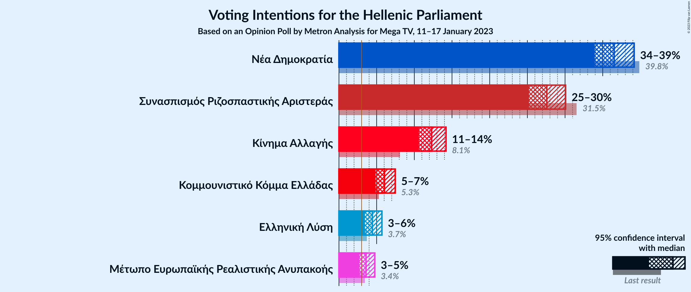

### Confidence Intervals

| Party | Last Result | Poll Result | 80% Confidence Interval | 90% Confidence Interval | 95% Confidence Interval | 99% Confidence Interval |
|:-----:|:-----------:|:-----------:|:-----------------------:|:-----------------------:|:-----------------------:|:-----------------------:|
| Νέα Δημοκρατία | 39.8% | 36.5% | 34.8–38.3% |34.4–38.7% |33.9–39.2% |33.2–40.0% |
| Συνασπισμός Ριζοσπαστικής Αριστεράς | 31.5% | 27.6% | 26.0–29.2% |25.6–29.7% |25.2–30.1% |24.5–30.9% |
| Κίνημα Αλλαγής | 8.1% | 12.3% | 11.2–13.5% |10.9–13.9% |10.6–14.2% |10.1–14.8% |
| Κομμουνιστικό Κόμμα Ελλάδας | 5.3% | 6.0% | 5.3–7.0% |5.0–7.2% |4.9–7.5% |4.5–7.9% |
| Ελληνική Λύση | 3.7% | 4.4% | 3.8–5.3% |3.6–5.5% |3.4–5.7% |3.2–6.1% |
| Μέτωπο Ευρωπαϊκής Ρεαλιστικής Ανυπακοής | 3.4% | 3.6% | 3.0–4.3% |2.9–4.6% |2.7–4.8% |2.5–5.1% |

*Note:* The poll result column reflects the actual value used in the calculations. Published results may vary slightly, and in addition be rounded to fewer digits.

## Seats

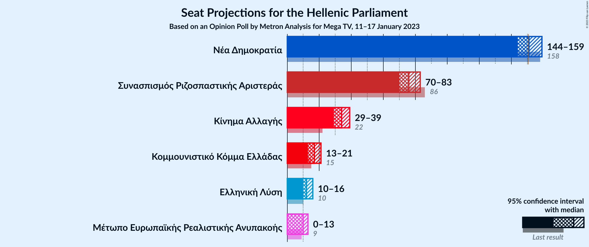

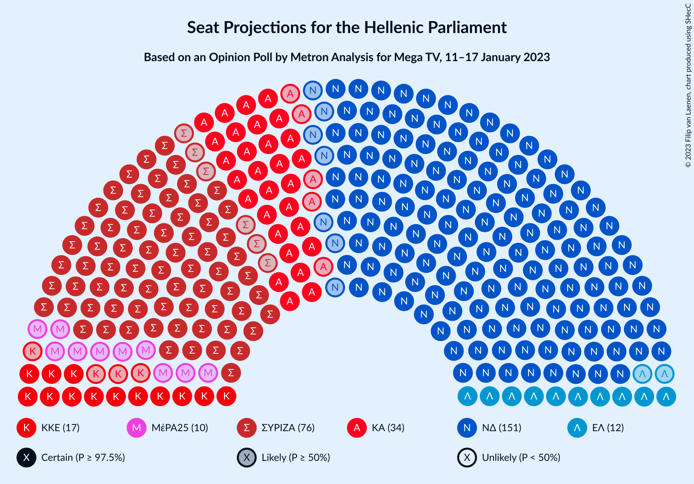

### Confidence Intervals

| Party | Last Result | Median | 80% Confidence Interval | 90% Confidence Interval | 95% Confidence Interval | 99% Confidence Interval |
|:-----:|:-----------:|:------:|:-----------------------:|:-----------------------:|:-----------------------:|:-----------------------:|
| <a href="#νέα-δημοκρατία">Νέα Δημοκρατία</a> | 158 | 151 | 146–156 |145–157 |144–159 |142–161 |
| <a href="#συνασπισμός-ριζοσπαστικής-αριστεράς">Συνασπισμός Ριζοσπαστικής Αριστεράς</a> | 86 | 76 | 72–81 |71–82 |70–83 |68–86 |
| <a href="#κίνημα-αλλαγής">Κίνημα Αλλαγής</a> | 22 | 34 | 31–37 |30–38 |29–39 |28–41 |
| <a href="#κομμουνιστικό-κόμμα-ελλάδας">Κομμουνιστικό Κόμμα Ελλάδας</a> | 15 | 17 | 15–19 |14–20 |13–21 |12–22 |
| <a href="#ελληνική-λύση">Ελληνική Λύση</a> | 10 | 12 | 10–15 |10–15 |10–16 |9–17 |
| <a href="#μέτωπο-ευρωπαϊκής-ρεαλιστικής-ανυπακοής">Μέτωπο Ευρωπαϊκής Ρεαλιστικής Ανυπακοής</a> | 9 | 10 | 8–12 |0–13 |0–13 |0–14 |

### Νέα Δημοκρατία

*For a full overview of the results for this party, see the [Νέα Δημοκρατία](party-νέαδημοκρατία.html) page.*

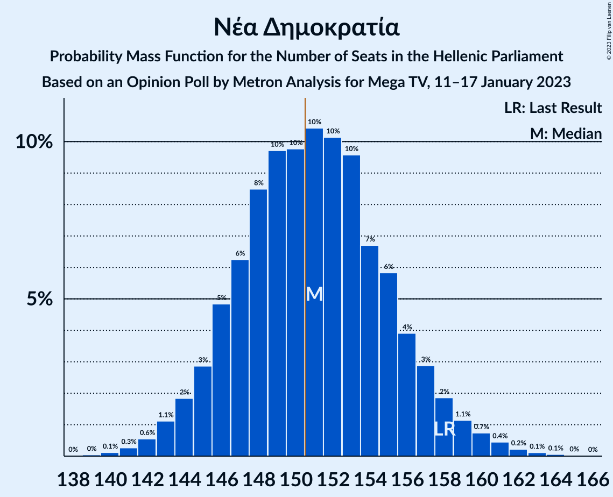

| Number of Seats | Probability | Accumulated | Special Marks |
|:---------------:|:-----------:|:-----------:|:-------------:|
| 139 | 0% | 100% |  |
| 140 | 0.1% | 99.9% |  |
| 141 | 0.3% | 99.8% |  |
| 142 | 0.6% | 99.5% |  |
| 143 | 1.1% | 99.0% |  |
| 144 | 2% | 98% |  |
| 145 | 3% | 96% |  |
| 146 | 5% | 93% |  |
| 147 | 6% | 88% |  |
| 148 | 8% | 82% |  |
| 149 | 10% | 74% |  |
| 150 | 10% | 64% |  |
| 151 | 10% | 54% | Median, Majority |
| 152 | 10% | 44% |  |
| 153 | 10% | 34% |  |
| 154 | 7% | 24% |  |
| 155 | 6% | 17% |  |
| 156 | 4% | 11% |  |
| 157 | 3% | 8% |  |
| 158 | 2% | 5% | Last Result |
| 159 | 1.1% | 3% |  |
| 160 | 0.7% | 2% |  |
| 161 | 0.4% | 0.9% |  |
| 162 | 0.2% | 0.4% |  |
| 163 | 0.1% | 0.2% |  |
| 164 | 0.1% | 0.1% |  |
| 165 | 0% | 0.1% |  |
| 166 | 0% | 0% |  |

### Συνασπισμός Ριζοσπαστικής Αριστεράς

*For a full overview of the results for this party, see the [Συνασπισμός Ριζοσπαστικής Αριστεράς](party-συνασπισμόςριζοσπαστικήςαριστεράς.html) page.*

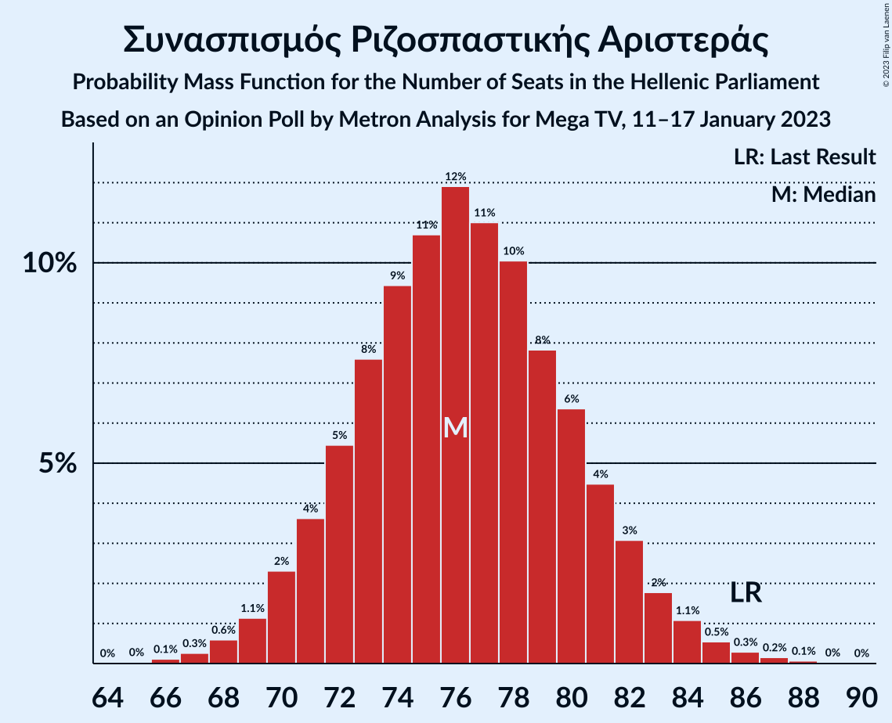

| Number of Seats | Probability | Accumulated | Special Marks |
|:---------------:|:-----------:|:-----------:|:-------------:|
| 65 | 0% | 100% |  |
| 66 | 0.1% | 99.9% |  |
| 67 | 0.3% | 99.8% |  |
| 68 | 0.6% | 99.6% |  |
| 69 | 1.1% | 99.0% |  |
| 70 | 2% | 98% |  |
| 71 | 4% | 96% |  |
| 72 | 5% | 92% |  |
| 73 | 8% | 86% |  |
| 74 | 9% | 79% |  |
| 75 | 11% | 69% |  |
| 76 | 12% | 59% | Median |
| 77 | 11% | 47% |  |
| 78 | 10% | 36% |  |
| 79 | 8% | 26% |  |
| 80 | 6% | 18% |  |
| 81 | 4% | 12% |  |
| 82 | 3% | 7% |  |
| 83 | 2% | 4% |  |
| 84 | 1.1% | 2% |  |
| 85 | 0.5% | 1.1% |  |
| 86 | 0.3% | 0.6% | Last Result |
| 87 | 0.2% | 0.3% |  |
| 88 | 0.1% | 0.1% |  |
| 89 | 0% | 0.1% |  |
| 90 | 0% | 0% |  |

### Κίνημα Αλλαγής

*For a full overview of the results for this party, see the [Κίνημα Αλλαγής](party-κίνημααλλαγής.html) page.*

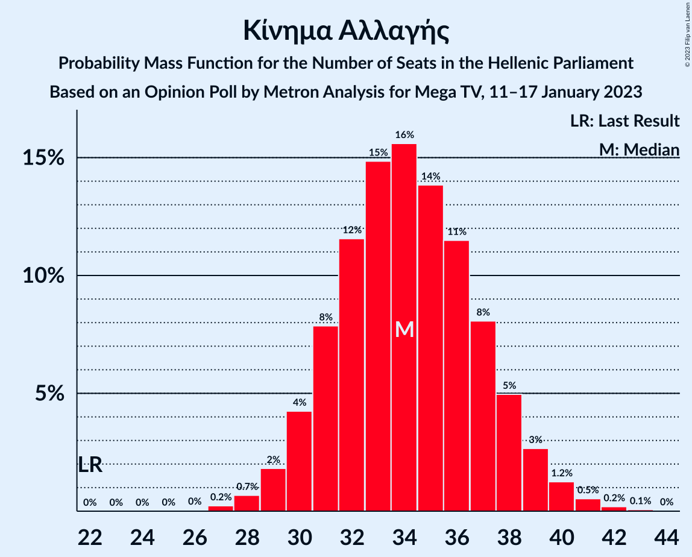

| Number of Seats | Probability | Accumulated | Special Marks |
|:---------------:|:-----------:|:-----------:|:-------------:|
| 22 | 0% | 100% | Last Result |
| 23 | 0% | 100% |  |
| 24 | 0% | 100% |  |
| 25 | 0% | 100% |  |
| 26 | 0% | 100% |  |
| 27 | 0.2% | 99.9% |  |
| 28 | 0.7% | 99.7% |  |
| 29 | 2% | 99.0% |  |
| 30 | 4% | 97% |  |
| 31 | 8% | 93% |  |
| 32 | 12% | 85% |  |
| 33 | 15% | 74% |  |
| 34 | 16% | 59% | Median |
| 35 | 14% | 43% |  |
| 36 | 11% | 29% |  |
| 37 | 8% | 18% |  |
| 38 | 5% | 10% |  |
| 39 | 3% | 5% |  |
| 40 | 1.2% | 2% |  |
| 41 | 0.5% | 0.8% |  |
| 42 | 0.2% | 0.3% |  |
| 43 | 0.1% | 0.1% |  |
| 44 | 0% | 0% |  |

### Κομμουνιστικό Κόμμα Ελλάδας

*For a full overview of the results for this party, see the [Κομμουνιστικό Κόμμα Ελλάδας](party-κομμουνιστικόκόμμαελλάδας.html) page.*

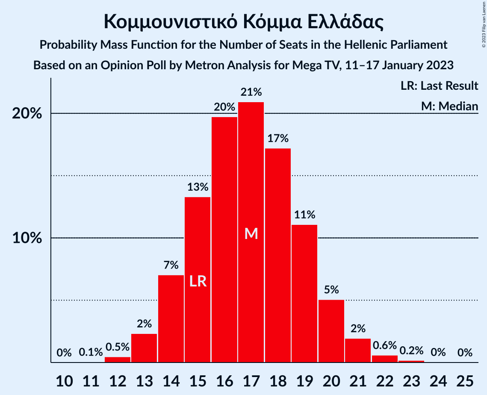

| Number of Seats | Probability | Accumulated | Special Marks |
|:---------------:|:-----------:|:-----------:|:-------------:|
| 11 | 0.1% | 100% |  |
| 12 | 0.5% | 99.9% |  |
| 13 | 2% | 99.5% |  |
| 14 | 7% | 97% |  |
| 15 | 13% | 90% | Last Result |
| 16 | 20% | 77% |  |
| 17 | 21% | 57% | Median |
| 18 | 17% | 36% |  |
| 19 | 11% | 19% |  |
| 20 | 5% | 8% |  |
| 21 | 2% | 3% |  |
| 22 | 0.6% | 0.8% |  |
| 23 | 0.2% | 0.2% |  |
| 24 | 0% | 0.1% |  |
| 25 | 0% | 0% |  |

### Ελληνική Λύση

*For a full overview of the results for this party, see the [Ελληνική Λύση](party-ελληνικήλύση.html) page.*

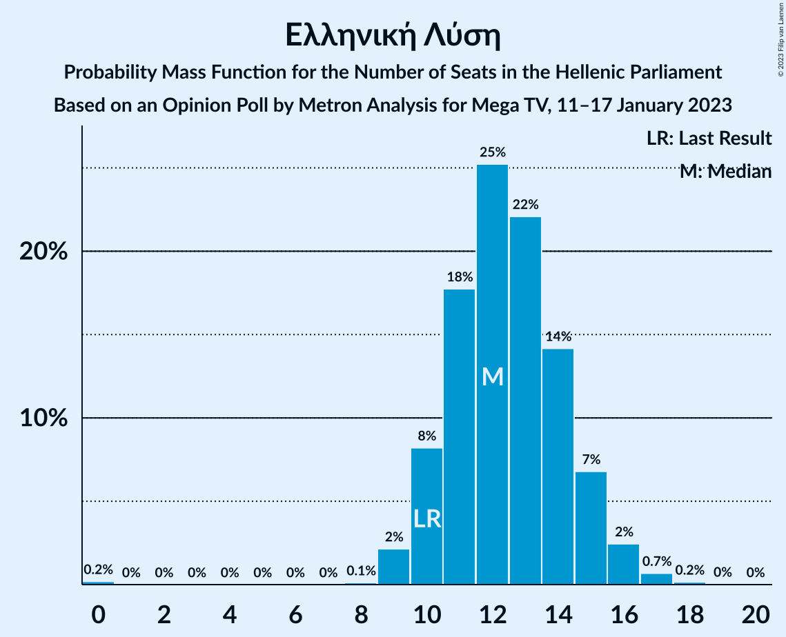

| Number of Seats | Probability | Accumulated | Special Marks |
|:---------------:|:-----------:|:-----------:|:-------------:|
| 0 | 0.2% | 100% |  |
| 1 | 0% | 99.8% |  |
| 2 | 0% | 99.8% |  |
| 3 | 0% | 99.8% |  |
| 4 | 0% | 99.8% |  |
| 5 | 0% | 99.8% |  |
| 6 | 0% | 99.8% |  |
| 7 | 0% | 99.8% |  |
| 8 | 0.1% | 99.8% |  |
| 9 | 2% | 99.7% |  |
| 10 | 8% | 98% | Last Result |
| 11 | 18% | 89% |  |
| 12 | 25% | 72% | Median |
| 13 | 22% | 46% |  |
| 14 | 14% | 24% |  |
| 15 | 7% | 10% |  |
| 16 | 2% | 3% |  |
| 17 | 0.7% | 0.9% |  |
| 18 | 0.2% | 0.2% |  |
| 19 | 0% | 0% |  |

### Μέτωπο Ευρωπαϊκής Ρεαλιστικής Ανυπακοής

*For a full overview of the results for this party, see the [Μέτωπο Ευρωπαϊκής Ρεαλιστικής Ανυπακοής](party-μέτωποευρωπαϊκήςρεαλιστικήςανυπακοής.html) page.*

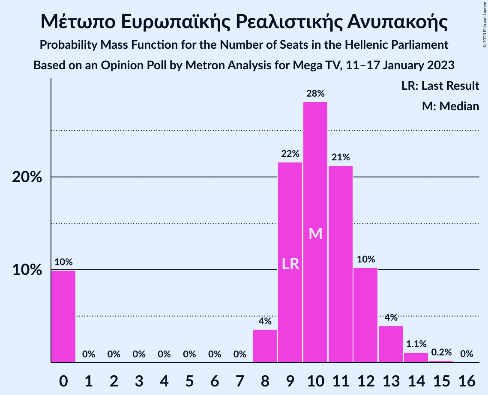

| Number of Seats | Probability | Accumulated | Special Marks |
|:---------------:|:-----------:|:-----------:|:-------------:|
| 0 | 10% | 100% |  |
| 1 | 0% | 90% |  |
| 2 | 0% | 90% |  |
| 3 | 0% | 90% |  |
| 4 | 0% | 90% |  |
| 5 | 0% | 90% |  |
| 6 | 0% | 90% |  |
| 7 | 0% | 90% |  |
| 8 | 4% | 90% |  |
| 9 | 22% | 86% | Last Result |
| 10 | 28% | 65% | Median |
| 11 | 21% | 37% |  |
| 12 | 10% | 16% |  |
| 13 | 4% | 5% |  |
| 14 | 1.1% | 1.4% |  |
| 15 | 0.2% | 0.3% |  |
| 16 | 0% | 0% |  |

## Coalitions

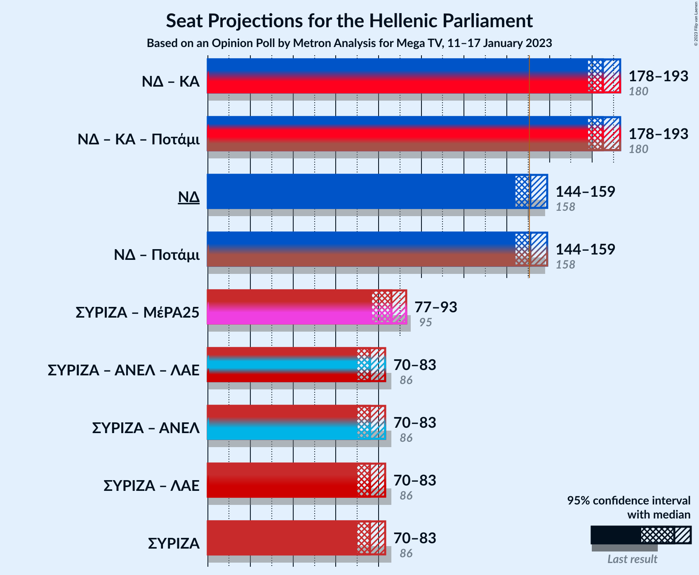

### Confidence Intervals

| Coalition | Last Result | Median | Majority? | 80% Confidence Interval | 90% Confidence Interval | 95% Confidence Interval | 99% Confidence Interval |
|:---------:|:-----------:|:------:|:---------:|:-----------------------:|:-----------------------:|:-----------------------:|:-----------------------:|
| Νέα Δημοκρατία – Κίνημα Αλλαγής | 180 | 185 | 100% | 180–190 | 179–192 | 178–193 | 175–196 |
| Νέα Δημοκρατία | 158 | 151 | 54% | 146–156 | 145–157 | 144–159 | 142–161 |
| Συνασπισμός Ριζοσπαστικής Αριστεράς – Μέτωπο Ευρωπαϊκής Ρεαλιστικής Ανυπακοής | 95 | 86 | 0% | 80–90 | 78–92 | 77–93 | 73–95 |
| Συνασπισμός Ριζοσπαστικής Αριστεράς | 86 | 76 | 0% | 72–81 | 71–82 | 70–83 | 68–86 |

### Νέα Δημοκρατία – Κίνημα Αλλαγής

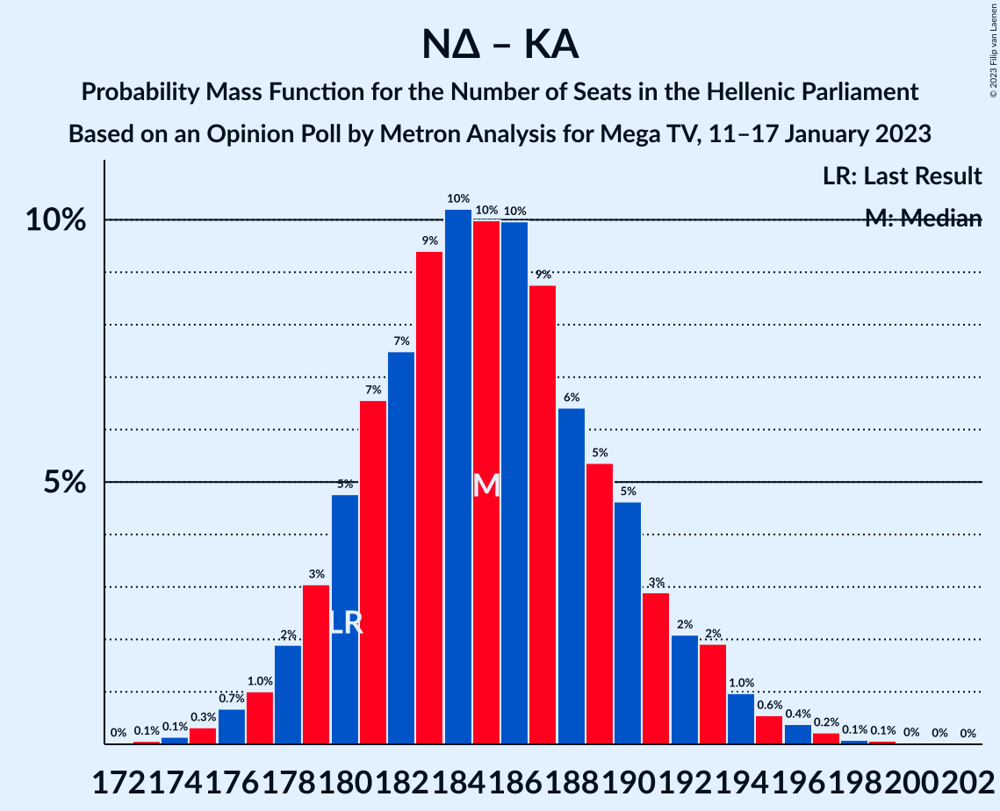

| Number of Seats | Probability | Accumulated | Special Marks |
|:---------------:|:-----------:|:-----------:|:-------------:|
| 173 | 0.1% | 100% |  |
| 174 | 0.1% | 99.9% |  |
| 175 | 0.3% | 99.8% |  |
| 176 | 0.7% | 99.4% |  |
| 177 | 1.0% | 98.8% |  |
| 178 | 2% | 98% |  |
| 179 | 3% | 96% |  |
| 180 | 5% | 93% | Last Result |
| 181 | 7% | 88% |  |
| 182 | 7% | 81% |  |
| 183 | 9% | 74% |  |
| 184 | 10% | 65% |  |
| 185 | 10% | 54% | Median |
| 186 | 10% | 44% |  |
| 187 | 9% | 34% |  |
| 188 | 6% | 26% |  |
| 189 | 5% | 19% |  |
| 190 | 5% | 14% |  |
| 191 | 3% | 9% |  |
| 192 | 2% | 6% |  |
| 193 | 2% | 4% |  |
| 194 | 1.0% | 2% |  |
| 195 | 0.6% | 1.4% |  |
| 196 | 0.4% | 0.8% |  |
| 197 | 0.2% | 0.4% |  |
| 198 | 0.1% | 0.2% |  |
| 199 | 0.1% | 0.1% |  |
| 200 | 0% | 0.1% |  |
| 201 | 0% | 0% |  |

### Νέα Δημοκρατία

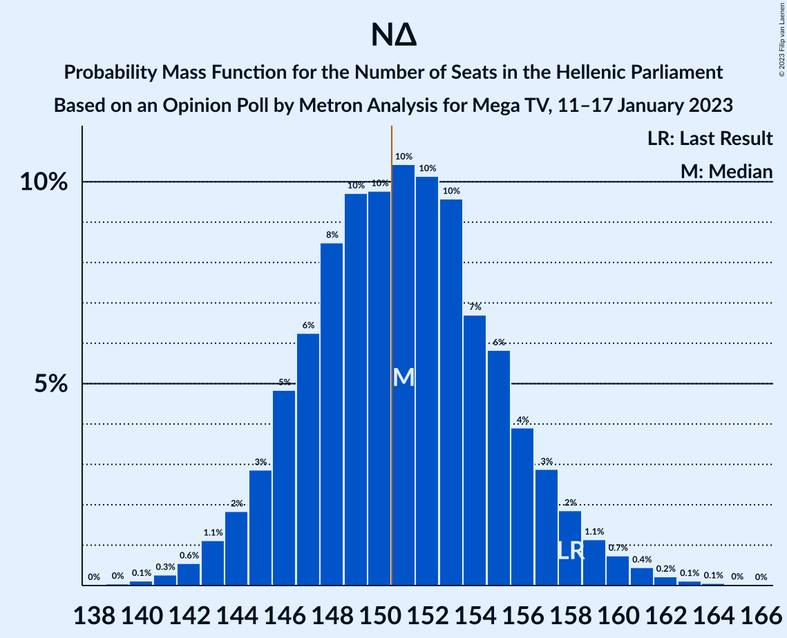

| Number of Seats | Probability | Accumulated | Special Marks |
|:---------------:|:-----------:|:-----------:|:-------------:|
| 139 | 0% | 100% |  |
| 140 | 0.1% | 99.9% |  |
| 141 | 0.3% | 99.8% |  |
| 142 | 0.6% | 99.5% |  |
| 143 | 1.1% | 99.0% |  |
| 144 | 2% | 98% |  |
| 145 | 3% | 96% |  |
| 146 | 5% | 93% |  |
| 147 | 6% | 88% |  |
| 148 | 8% | 82% |  |
| 149 | 10% | 74% |  |
| 150 | 10% | 64% |  |
| 151 | 10% | 54% | Median, Majority |
| 152 | 10% | 44% |  |
| 153 | 10% | 34% |  |
| 154 | 7% | 24% |  |
| 155 | 6% | 17% |  |
| 156 | 4% | 11% |  |
| 157 | 3% | 8% |  |
| 158 | 2% | 5% | Last Result |
| 159 | 1.1% | 3% |  |
| 160 | 0.7% | 2% |  |
| 161 | 0.4% | 0.9% |  |
| 162 | 0.2% | 0.4% |  |
| 163 | 0.1% | 0.2% |  |
| 164 | 0.1% | 0.1% |  |
| 165 | 0% | 0.1% |  |
| 166 | 0% | 0% |  |

### Συνασπισμός Ριζοσπαστικής Αριστεράς – Μέτωπο Ευρωπαϊκής Ρεαλιστικής Ανυπακοής

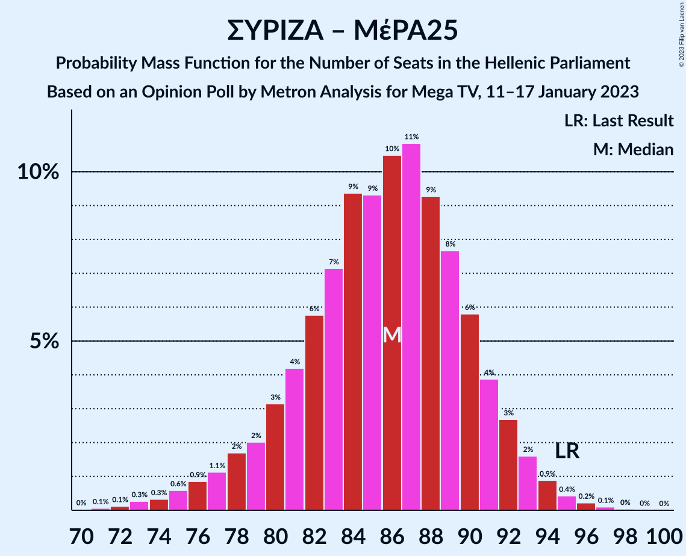

| Number of Seats | Probability | Accumulated | Special Marks |
|:---------------:|:-----------:|:-----------:|:-------------:|
| 71 | 0.1% | 100% |  |
| 72 | 0.1% | 99.9% |  |
| 73 | 0.3% | 99.8% |  |
| 74 | 0.3% | 99.5% |  |
| 75 | 0.6% | 99.2% |  |
| 76 | 0.9% | 98.6% |  |
| 77 | 1.1% | 98% |  |
| 78 | 2% | 97% |  |
| 79 | 2% | 95% |  |
| 80 | 3% | 93% |  |
| 81 | 4% | 90% |  |
| 82 | 6% | 86% |  |
| 83 | 7% | 80% |  |
| 84 | 9% | 73% |  |
| 85 | 9% | 63% |  |
| 86 | 10% | 54% | Median |
| 87 | 11% | 43% |  |
| 88 | 9% | 33% |  |
| 89 | 8% | 23% |  |
| 90 | 6% | 16% |  |
| 91 | 4% | 10% |  |
| 92 | 3% | 6% |  |
| 93 | 2% | 3% |  |
| 94 | 0.9% | 2% |  |
| 95 | 0.4% | 0.8% | Last Result |
| 96 | 0.2% | 0.4% |  |
| 97 | 0.1% | 0.2% |  |
| 98 | 0% | 0.1% |  |
| 99 | 0% | 0% |  |

### Συνασπισμός Ριζοσπαστικής Αριστεράς

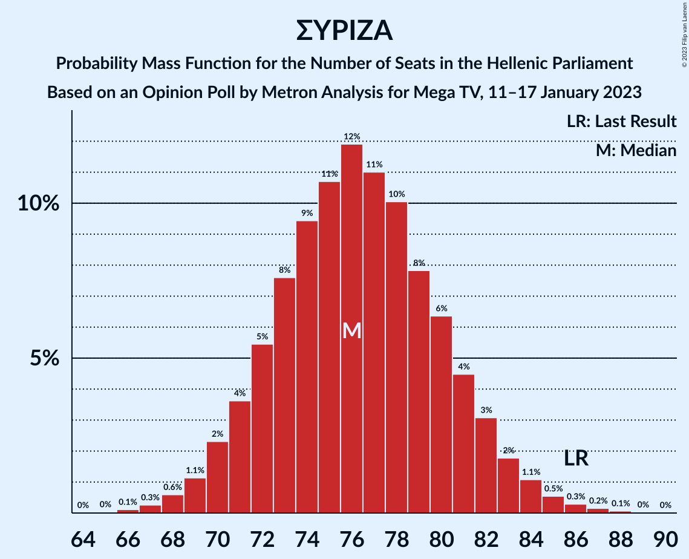

| Number of Seats | Probability | Accumulated | Special Marks |
|:---------------:|:-----------:|:-----------:|:-------------:|
| 65 | 0% | 100% |  |
| 66 | 0.1% | 99.9% |  |
| 67 | 0.3% | 99.8% |  |
| 68 | 0.6% | 99.6% |  |
| 69 | 1.1% | 99.0% |  |
| 70 | 2% | 98% |  |
| 71 | 4% | 96% |  |
| 72 | 5% | 92% |  |
| 73 | 8% | 86% |  |
| 74 | 9% | 79% |  |
| 75 | 11% | 69% |  |
| 76 | 12% | 59% | Median |
| 77 | 11% | 47% |  |
| 78 | 10% | 36% |  |
| 79 | 8% | 26% |  |
| 80 | 6% | 18% |  |
| 81 | 4% | 12% |  |
| 82 | 3% | 7% |  |
| 83 | 2% | 4% |  |
| 84 | 1.1% | 2% |  |
| 85 | 0.5% | 1.1% |  |
| 86 | 0.3% | 0.6% | Last Result |
| 87 | 0.2% | 0.3% |  |
| 88 | 0.1% | 0.1% |  |
| 89 | 0% | 0.1% |  |
| 90 | 0% | 0% |  |

## Technical Information

### Opinion Poll

+ **Polling firm:** Metron Analysis
+ **Commissioner(s):** Mega TV
+ **Fieldwork period:** 11–17 January 2023

### Calculations

+ **Sample size:** 1309
+ **Simulations done:** 1,048,576
+ **Error estimate:** 0.37%

