# Opinion Poll by Prorata for Attica TV, 19–23 January 2023

<a href="#voting-intentions">Voting Intentions</a> | <a href="#seats">Seats</a> | <a href="#coalitions">Coalitions</a> | <a href="#technical-information">Technical Information</a>

## Voting Intentions

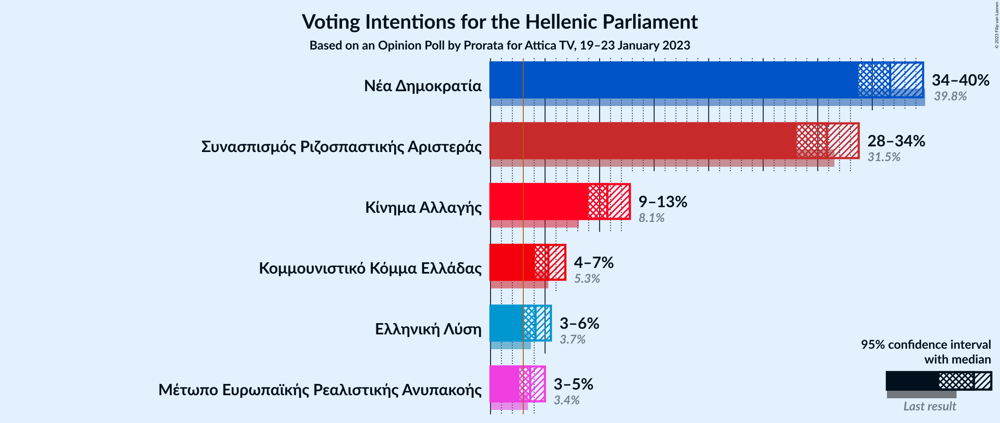

### Confidence Intervals

| Party | Last Result | Poll Result | 80% Confidence Interval | 90% Confidence Interval | 95% Confidence Interval | 99% Confidence Interval |
|:-----:|:-----------:|:-----------:|:-----------------------:|:-----------------------:|:-----------------------:|:-----------------------:|
| Νέα Δημοκρατία | 39.8% | 36.6% | 34.7–38.6% |34.2–39.2% |33.7–39.7% |32.8–40.6% |
| Συνασπισμός Ριζοσπαστικής Αριστεράς | 31.5% | 30.8% | 29.0–32.8% |28.5–33.3% |28.1–33.8% |27.2–34.7% |
| Κίνημα Αλλαγής | 8.1% | 10.7% | 9.6–12.1% |9.2–12.4% |8.9–12.8% |8.4–13.4% |
| Κομμουνιστικό Κόμμα Ελλάδας | 5.3% | 5.3% | 4.5–6.3% |4.3–6.6% |4.1–6.9% |3.7–7.4% |
| Ελληνική Λύση | 3.7% | 4.1% | 3.4–5.0% |3.2–5.3% |3.1–5.5% |2.8–6.0% |
| Μέτωπο Ευρωπαϊκής Ρεαλιστικής Ανυπακοής | 3.4% | 3.6% | 3.0–4.5% |2.8–4.8% |2.7–5.0% |2.4–5.4% |

*Note:* The poll result column reflects the actual value used in the calculations. Published results may vary slightly, and in addition be rounded to fewer digits.

## Seats

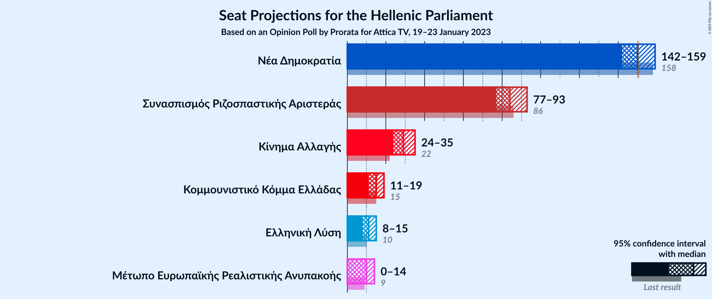

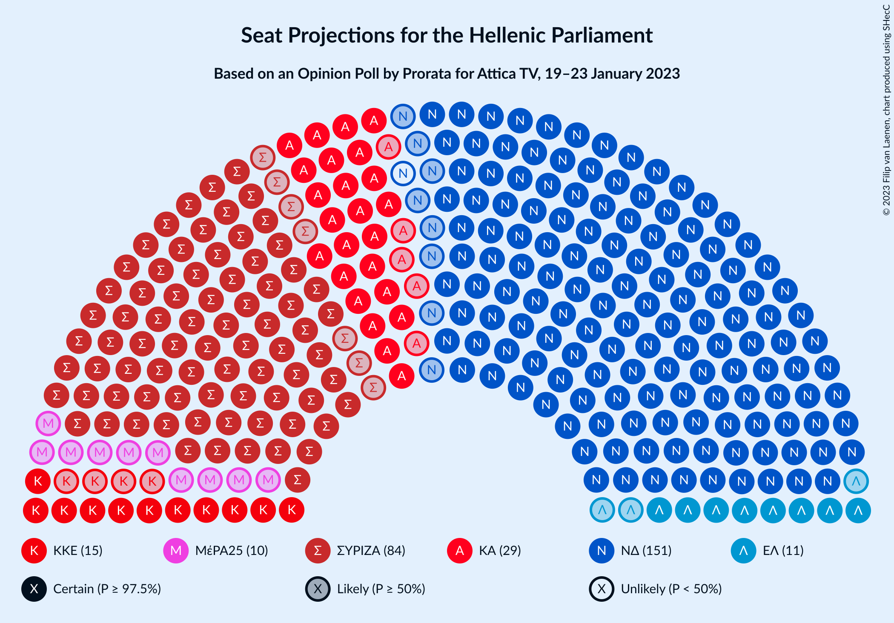

### Confidence Intervals

| Party | Last Result | Median | 80% Confidence Interval | 90% Confidence Interval | 95% Confidence Interval | 99% Confidence Interval |
|:-----:|:-----------:|:------:|:-----------------------:|:-----------------------:|:-----------------------:|:-----------------------:|
| <a href="#νέα-δημοκρατία">Νέα Δημοκρατία</a> | 158 | 150 | 145–156 |144–158 |142–159 |91–162 |
| <a href="#συνασπισμός-ριζοσπαστικής-αριστεράς">Συνασπισμός Ριζοσπαστικής Αριστεράς</a> | 86 | 84 | 79–90 |78–91 |77–93 |75–144 |
| <a href="#κίνημα-αλλαγής">Κίνημα Αλλαγής</a> | 22 | 29 | 26–33 |25–34 |24–35 |23–37 |
| <a href="#κομμουνιστικό-κόμμα-ελλάδας">Κομμουνιστικό Κόμμα Ελλάδας</a> | 15 | 15 | 12–17 |12–18 |11–19 |10–20 |
| <a href="#ελληνική-λύση">Ελληνική Λύση</a> | 10 | 11 | 9–14 |9–15 |8–15 |0–16 |
| <a href="#μέτωπο-ευρωπαϊκής-ρεαλιστικής-ανυπακοής">Μέτωπο Ευρωπαϊκής Ρεαλιστικής Ανυπακοής</a> | 9 | 10 | 0–12 |0–13 |0–14 |0–15 |

### Νέα Δημοκρατία

*For a full overview of the results for this party, see the [Νέα Δημοκρατία](party-νέαδημοκρατία.html) page.*

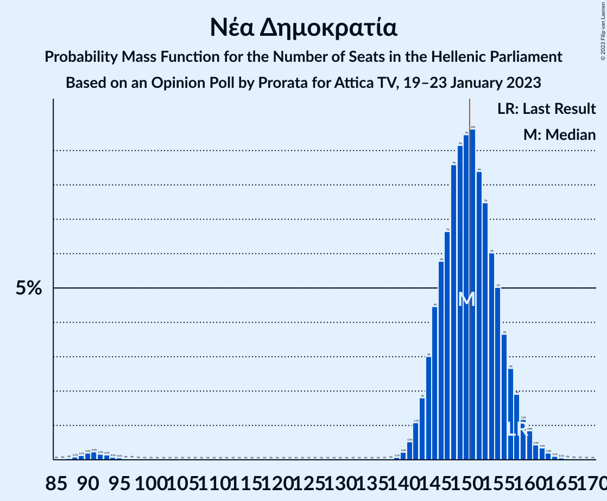

| Number of Seats | Probability | Accumulated | Special Marks |
|:---------------:|:-----------:|:-----------:|:-------------:|
| 87 | 0% | 100% |  |
| 88 | 0.1% | 99.9% |  |
| 89 | 0.1% | 99.9% |  |
| 90 | 0.2% | 99.7% |  |
| 91 | 0.2% | 99.5% |  |
| 92 | 0.2% | 99.3% |  |
| 93 | 0.1% | 99.1% |  |
| 94 | 0.1% | 99.0% |  |
| 95 | 0.1% | 98.9% |  |
| 96 | 0% | 98.9% |  |
| 97 | 0% | 98.8% |  |
| 98 | 0% | 98.8% |  |
| 99 | 0% | 98.8% |  |
| 100 | 0% | 98.8% |  |
| 101 | 0% | 98.8% |  |
| 102 | 0% | 98.8% |  |
| 103 | 0% | 98.8% |  |
| 104 | 0% | 98.8% |  |
| 105 | 0% | 98.8% |  |
| 106 | 0% | 98.8% |  |
| 107 | 0% | 98.8% |  |
| 108 | 0% | 98.8% |  |
| 109 | 0% | 98.8% |  |
| 110 | 0% | 98.8% |  |
| 111 | 0% | 98.8% |  |
| 112 | 0% | 98.8% |  |
| 113 | 0% | 98.8% |  |
| 114 | 0% | 98.8% |  |
| 115 | 0% | 98.8% |  |
| 116 | 0% | 98.8% |  |
| 117 | 0% | 98.8% |  |
| 118 | 0% | 98.8% |  |
| 119 | 0% | 98.8% |  |
| 120 | 0% | 98.8% |  |
| 121 | 0% | 98.8% |  |
| 122 | 0% | 98.8% |  |
| 123 | 0% | 98.8% |  |
| 124 | 0% | 98.8% |  |
| 125 | 0% | 98.8% |  |
| 126 | 0% | 98.8% |  |
| 127 | 0% | 98.8% |  |
| 128 | 0% | 98.8% |  |
| 129 | 0% | 98.8% |  |
| 130 | 0% | 98.8% |  |
| 131 | 0% | 98.8% |  |
| 132 | 0% | 98.8% |  |
| 133 | 0% | 98.8% |  |
| 134 | 0% | 98.8% |  |
| 135 | 0% | 98.8% |  |
| 136 | 0% | 98.8% |  |
| 137 | 0% | 98.8% |  |
| 138 | 0% | 98.8% |  |
| 139 | 0.1% | 98.8% |  |
| 140 | 0.2% | 98.7% |  |
| 141 | 0.5% | 98% |  |
| 142 | 1.1% | 98% |  |
| 143 | 2% | 97% |  |
| 144 | 3% | 95% |  |
| 145 | 4% | 92% |  |
| 146 | 6% | 88% |  |
| 147 | 7% | 82% |  |
| 148 | 9% | 75% |  |
| 149 | 9% | 67% |  |
| 150 | 9% | 57% | Median |
| 151 | 10% | 48% | Majority |
| 152 | 8% | 38% |  |
| 153 | 7% | 30% |  |
| 154 | 6% | 22% |  |
| 155 | 5% | 16% |  |
| 156 | 4% | 11% |  |
| 157 | 3% | 8% |  |
| 158 | 2% | 5% | Last Result |
| 159 | 1.2% | 3% |  |
| 160 | 0.8% | 2% |  |
| 161 | 0.4% | 1.2% |  |
| 162 | 0.3% | 0.8% |  |
| 163 | 0.2% | 0.4% |  |
| 164 | 0.1% | 0.2% |  |
| 165 | 0.1% | 0.1% |  |
| 166 | 0% | 0.1% |  |
| 167 | 0% | 0% |  |

### Συνασπισμός Ριζοσπαστικής Αριστεράς

*For a full overview of the results for this party, see the [Συνασπισμός Ριζοσπαστικής Αριστεράς](party-συνασπισμόςριζοσπαστικήςαριστεράς.html) page.*

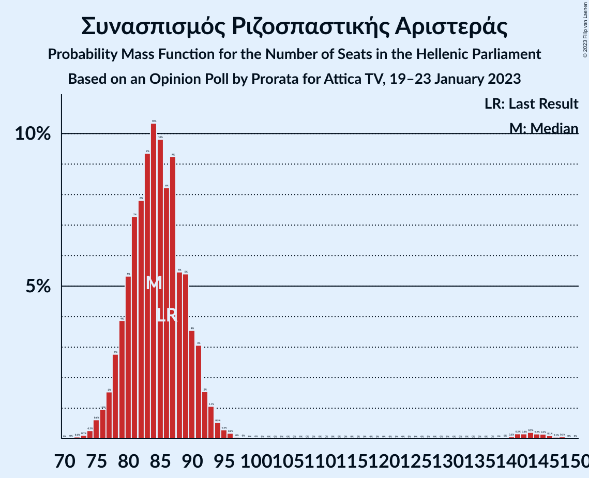

| Number of Seats | Probability | Accumulated | Special Marks |
|:---------------:|:-----------:|:-----------:|:-------------:|
| 72 | 0.1% | 100% |  |
| 73 | 0.1% | 99.9% |  |
| 74 | 0.3% | 99.8% |  |
| 75 | 0.6% | 99.5% |  |
| 76 | 1.0% | 98.9% |  |
| 77 | 2% | 98% |  |
| 78 | 3% | 96% |  |
| 79 | 4% | 94% |  |
| 80 | 5% | 90% |  |
| 81 | 7% | 84% |  |
| 82 | 8% | 77% |  |
| 83 | 9% | 69% |  |
| 84 | 10% | 60% | Median |
| 85 | 10% | 50% |  |
| 86 | 8% | 40% | Last Result |
| 87 | 9% | 32% |  |
| 88 | 5% | 22% |  |
| 89 | 5% | 17% |  |
| 90 | 4% | 12% |  |
| 91 | 3% | 8% |  |
| 92 | 2% | 5% |  |
| 93 | 1.1% | 3% |  |
| 94 | 0.5% | 2% |  |
| 95 | 0.3% | 2% |  |
| 96 | 0.2% | 1.5% |  |
| 97 | 0% | 1.3% |  |
| 98 | 0% | 1.2% |  |
| 99 | 0% | 1.2% |  |
| 100 | 0% | 1.2% |  |
| 101 | 0% | 1.2% |  |
| 102 | 0% | 1.2% |  |
| 103 | 0% | 1.2% |  |
| 104 | 0% | 1.2% |  |
| 105 | 0% | 1.2% |  |
| 106 | 0% | 1.2% |  |
| 107 | 0% | 1.2% |  |
| 108 | 0% | 1.2% |  |
| 109 | 0% | 1.2% |  |
| 110 | 0% | 1.2% |  |
| 111 | 0% | 1.2% |  |
| 112 | 0% | 1.2% |  |
| 113 | 0% | 1.2% |  |
| 114 | 0% | 1.2% |  |
| 115 | 0% | 1.2% |  |
| 116 | 0% | 1.2% |  |
| 117 | 0% | 1.2% |  |
| 118 | 0% | 1.2% |  |
| 119 | 0% | 1.2% |  |
| 120 | 0% | 1.2% |  |
| 121 | 0% | 1.2% |  |
| 122 | 0% | 1.2% |  |
| 123 | 0% | 1.2% |  |
| 124 | 0% | 1.2% |  |
| 125 | 0% | 1.2% |  |
| 126 | 0% | 1.2% |  |
| 127 | 0% | 1.2% |  |
| 128 | 0% | 1.2% |  |
| 129 | 0% | 1.2% |  |
| 130 | 0% | 1.2% |  |
| 131 | 0% | 1.2% |  |
| 132 | 0% | 1.2% |  |
| 133 | 0% | 1.2% |  |
| 134 | 0% | 1.2% |  |
| 135 | 0% | 1.2% |  |
| 136 | 0% | 1.2% |  |
| 137 | 0% | 1.2% |  |
| 138 | 0% | 1.2% |  |
| 139 | 0% | 1.2% |  |
| 140 | 0.1% | 1.2% |  |
| 141 | 0.2% | 1.1% |  |
| 142 | 0.2% | 0.9% |  |
| 143 | 0.2% | 0.8% |  |
| 144 | 0.2% | 0.6% |  |
| 145 | 0.1% | 0.4% |  |
| 146 | 0.1% | 0.3% |  |
| 147 | 0.1% | 0.2% |  |
| 148 | 0.1% | 0.1% |  |
| 149 | 0% | 0.1% |  |
| 150 | 0% | 0% |  |

### Κίνημα Αλλαγής

*For a full overview of the results for this party, see the [Κίνημα Αλλαγής](party-κίνημααλλαγής.html) page.*

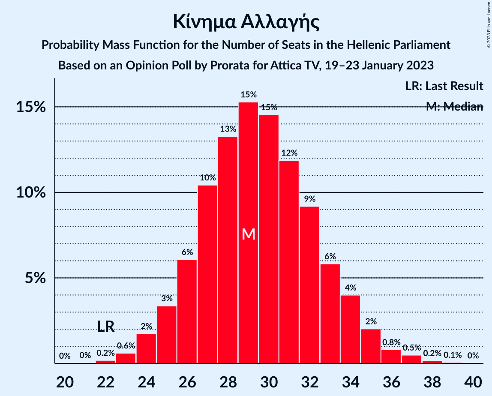

| Number of Seats | Probability | Accumulated | Special Marks |
|:---------------:|:-----------:|:-----------:|:-------------:|
| 21 | 0% | 100% |  |
| 22 | 0.2% | 99.9% | Last Result |
| 23 | 0.6% | 99.8% |  |
| 24 | 2% | 99.2% |  |
| 25 | 3% | 97% |  |
| 26 | 6% | 94% |  |
| 27 | 10% | 88% |  |
| 28 | 13% | 78% |  |
| 29 | 15% | 64% | Median |
| 30 | 15% | 49% |  |
| 31 | 12% | 34% |  |
| 32 | 9% | 23% |  |
| 33 | 6% | 13% |  |
| 34 | 4% | 8% |  |
| 35 | 2% | 4% |  |
| 36 | 0.8% | 2% |  |
| 37 | 0.5% | 0.7% |  |
| 38 | 0.2% | 0.3% |  |
| 39 | 0.1% | 0.1% |  |
| 40 | 0% | 0% |  |

### Κομμουνιστικό Κόμμα Ελλάδας

*For a full overview of the results for this party, see the [Κομμουνιστικό Κόμμα Ελλάδας](party-κομμουνιστικόκόμμαελλάδας.html) page.*

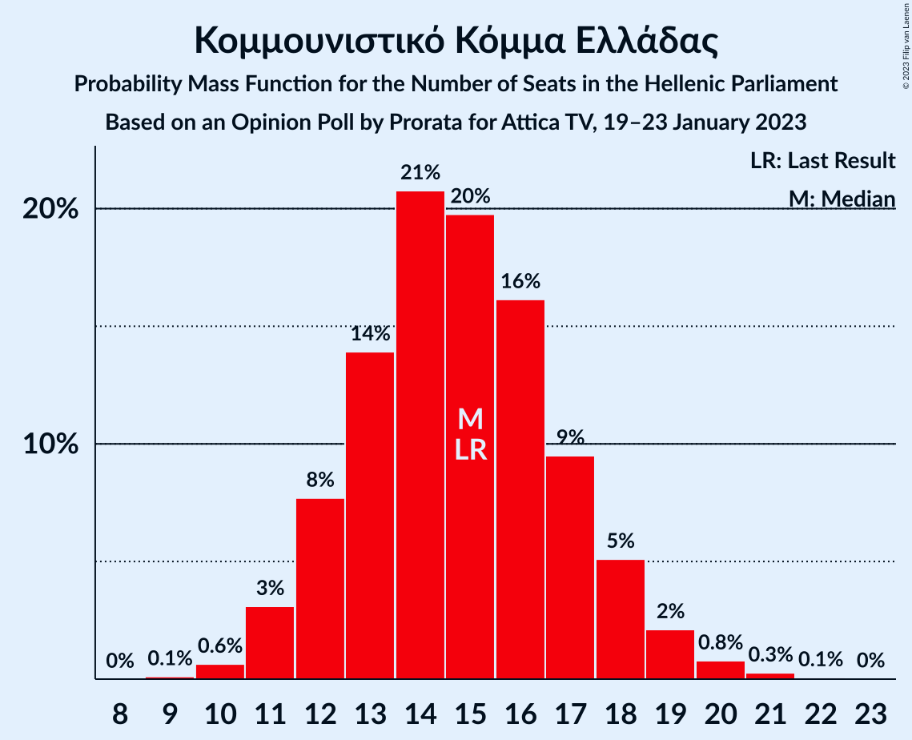

| Number of Seats | Probability | Accumulated | Special Marks |
|:---------------:|:-----------:|:-----------:|:-------------:|
| 9 | 0.1% | 100% |  |
| 10 | 0.6% | 99.9% |  |
| 11 | 3% | 99.2% |  |
| 12 | 8% | 96% |  |
| 13 | 14% | 88% |  |
| 14 | 21% | 75% |  |
| 15 | 20% | 54% | Last Result, Median |
| 16 | 16% | 34% |  |
| 17 | 9% | 18% |  |
| 18 | 5% | 8% |  |
| 19 | 2% | 3% |  |
| 20 | 0.8% | 1.1% |  |
| 21 | 0.3% | 0.4% |  |
| 22 | 0.1% | 0.1% |  |
| 23 | 0% | 0% |  |

### Ελληνική Λύση

*For a full overview of the results for this party, see the [Ελληνική Λύση](party-ελληνικήλύση.html) page.*

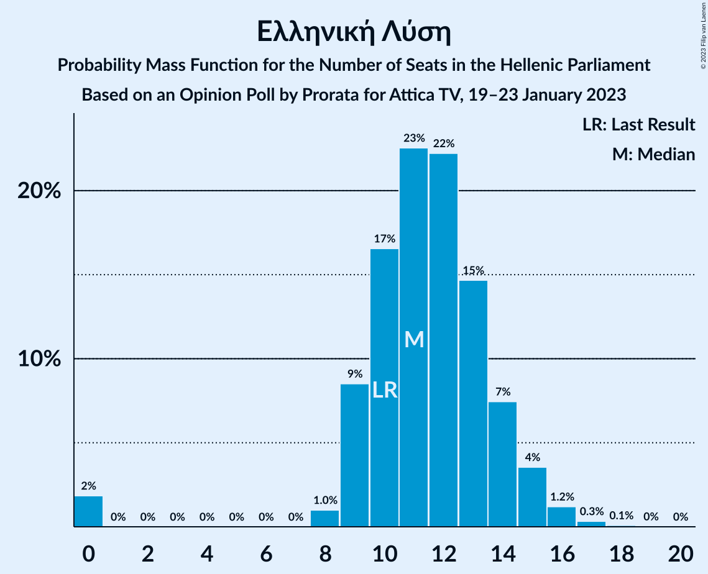

| Number of Seats | Probability | Accumulated | Special Marks |
|:---------------:|:-----------:|:-----------:|:-------------:|
| 0 | 2% | 100% |  |
| 1 | 0% | 98% |  |
| 2 | 0% | 98% |  |
| 3 | 0% | 98% |  |
| 4 | 0% | 98% |  |
| 5 | 0% | 98% |  |
| 6 | 0% | 98% |  |
| 7 | 0% | 98% |  |
| 8 | 1.0% | 98% |  |
| 9 | 9% | 97% |  |
| 10 | 17% | 89% | Last Result |
| 11 | 23% | 72% | Median |
| 12 | 22% | 50% |  |
| 13 | 15% | 27% |  |
| 14 | 7% | 13% |  |
| 15 | 4% | 5% |  |
| 16 | 1.2% | 2% |  |
| 17 | 0.3% | 0.4% |  |
| 18 | 0.1% | 0.1% |  |
| 19 | 0% | 0% |  |

### Μέτωπο Ευρωπαϊκής Ρεαλιστικής Ανυπακοής

*For a full overview of the results for this party, see the [Μέτωπο Ευρωπαϊκής Ρεαλιστικής Ανυπακοής](party-μέτωποευρωπαϊκήςρεαλιστικήςανυπακοής.html) page.*

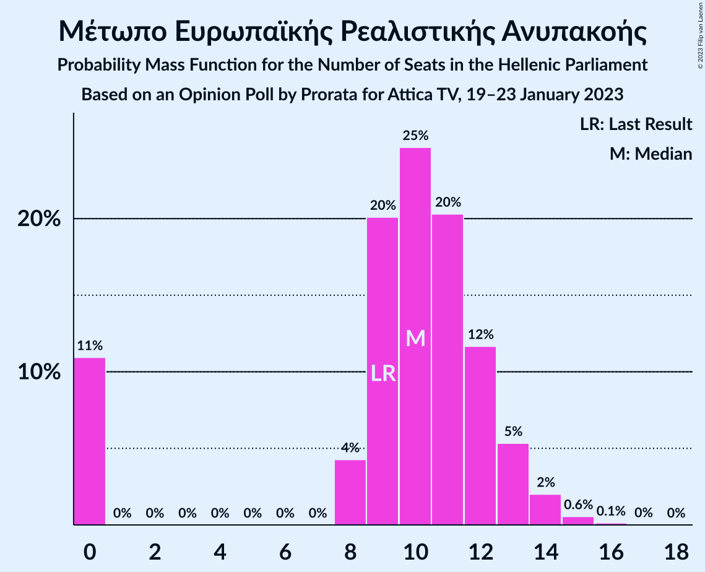

| Number of Seats | Probability | Accumulated | Special Marks |
|:---------------:|:-----------:|:-----------:|:-------------:|
| 0 | 11% | 100% |  |
| 1 | 0% | 89% |  |
| 2 | 0% | 89% |  |
| 3 | 0% | 89% |  |
| 4 | 0% | 89% |  |
| 5 | 0% | 89% |  |
| 6 | 0% | 89% |  |
| 7 | 0% | 89% |  |
| 8 | 4% | 89% |  |
| 9 | 20% | 85% | Last Result |
| 10 | 25% | 65% | Median |
| 11 | 20% | 40% |  |
| 12 | 12% | 20% |  |
| 13 | 5% | 8% |  |
| 14 | 2% | 3% |  |
| 15 | 0.6% | 0.7% |  |
| 16 | 0.1% | 0.2% |  |
| 17 | 0% | 0% |  |

## Coalitions

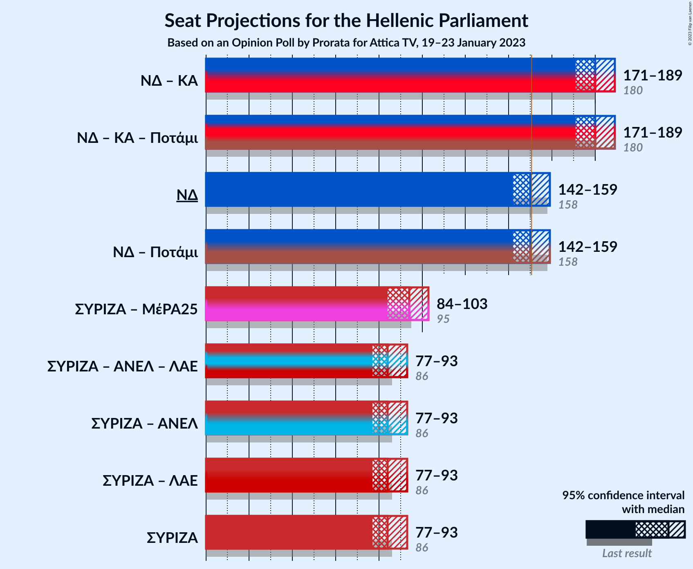

### Confidence Intervals

| Coalition | Last Result | Median | Majority? | 80% Confidence Interval | 90% Confidence Interval | 95% Confidence Interval | 99% Confidence Interval |
|:---------:|:-----------:|:------:|:---------:|:-----------------------:|:-----------------------:|:-----------------------:|:-----------------------:|
| Νέα Δημοκρατία – Κίνημα Αλλαγής | 180 | 180 | 98.8% | 174–186 | 173–188 | 171–189 | 120–193 |
| Νέα Δημοκρατία | 158 | 150 | 48% | 145–156 | 144–158 | 142–159 | 91–162 |
| Συνασπισμός Ριζοσπαστικής Αριστεράς – Μέτωπο Ευρωπαϊκής Ρεαλιστικής Ανυπακοής | 95 | 94 | 1.0% | 88–100 | 86–101 | 84–103 | 81–154 |
| Συνασπισμός Ριζοσπαστικής Αριστεράς | 86 | 84 | 0% | 79–90 | 78–91 | 77–93 | 75–144 |

### Νέα Δημοκρατία – Κίνημα Αλλαγής

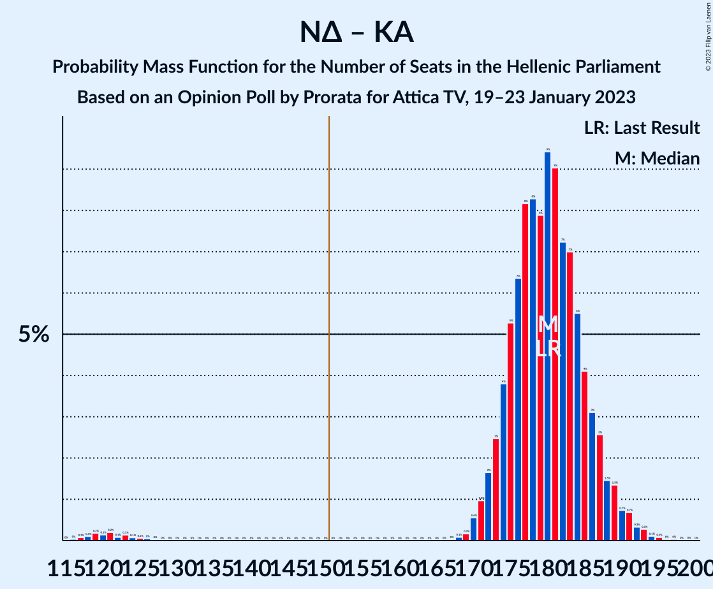

| Number of Seats | Probability | Accumulated | Special Marks |
|:---------------:|:-----------:|:-----------:|:-------------:|
| 116 | 0% | 100% |  |
| 117 | 0.1% | 99.9% |  |
| 118 | 0.1% | 99.9% |  |
| 119 | 0.2% | 99.8% |  |
| 120 | 0.1% | 99.6% |  |
| 121 | 0.2% | 99.4% |  |
| 122 | 0.1% | 99.2% |  |
| 123 | 0.1% | 99.2% |  |
| 124 | 0.1% | 99.0% |  |
| 125 | 0.1% | 98.9% |  |
| 126 | 0% | 98.9% |  |
| 127 | 0% | 98.8% |  |
| 128 | 0% | 98.8% |  |
| 129 | 0% | 98.8% |  |
| 130 | 0% | 98.8% |  |
| 131 | 0% | 98.8% |  |
| 132 | 0% | 98.8% |  |
| 133 | 0% | 98.8% |  |
| 134 | 0% | 98.8% |  |
| 135 | 0% | 98.8% |  |
| 136 | 0% | 98.8% |  |
| 137 | 0% | 98.8% |  |
| 138 | 0% | 98.8% |  |
| 139 | 0% | 98.8% |  |
| 140 | 0% | 98.8% |  |
| 141 | 0% | 98.8% |  |
| 142 | 0% | 98.8% |  |
| 143 | 0% | 98.8% |  |
| 144 | 0% | 98.8% |  |
| 145 | 0% | 98.8% |  |
| 146 | 0% | 98.8% |  |
| 147 | 0% | 98.8% |  |
| 148 | 0% | 98.8% |  |
| 149 | 0% | 98.8% |  |
| 150 | 0% | 98.8% |  |
| 151 | 0% | 98.8% | Majority |
| 152 | 0% | 98.8% |  |
| 153 | 0% | 98.8% |  |
| 154 | 0% | 98.8% |  |
| 155 | 0% | 98.8% |  |
| 156 | 0% | 98.8% |  |
| 157 | 0% | 98.8% |  |
| 158 | 0% | 98.8% |  |
| 159 | 0% | 98.8% |  |
| 160 | 0% | 98.8% |  |
| 161 | 0% | 98.8% |  |
| 162 | 0% | 98.8% |  |
| 163 | 0% | 98.8% |  |
| 164 | 0% | 98.8% |  |
| 165 | 0% | 98.8% |  |
| 166 | 0% | 98.8% |  |
| 167 | 0% | 98.8% |  |
| 168 | 0.1% | 98.8% |  |
| 169 | 0.2% | 98.7% |  |
| 170 | 0.6% | 98.5% |  |
| 171 | 1.0% | 98% |  |
| 172 | 2% | 97% |  |
| 173 | 2% | 95% |  |
| 174 | 4% | 93% |  |
| 175 | 5% | 89% |  |
| 176 | 6% | 84% |  |
| 177 | 8% | 77% |  |
| 178 | 8% | 69% |  |
| 179 | 8% | 61% | Median |
| 180 | 9% | 53% | Last Result |
| 181 | 9% | 44% |  |
| 182 | 7% | 35% |  |
| 183 | 7% | 27% |  |
| 184 | 6% | 20% |  |
| 185 | 4% | 15% |  |
| 186 | 3% | 11% |  |
| 187 | 3% | 8% |  |
| 188 | 1.5% | 5% |  |
| 189 | 1.3% | 4% |  |
| 190 | 0.7% | 2% |  |
| 191 | 0.7% | 2% |  |
| 192 | 0.3% | 0.9% |  |
| 193 | 0.3% | 0.6% |  |
| 194 | 0.1% | 0.3% |  |
| 195 | 0.1% | 0.2% |  |
| 196 | 0% | 0.1% |  |
| 197 | 0% | 0.1% |  |
| 198 | 0% | 0% |  |

### Νέα Δημοκρατία

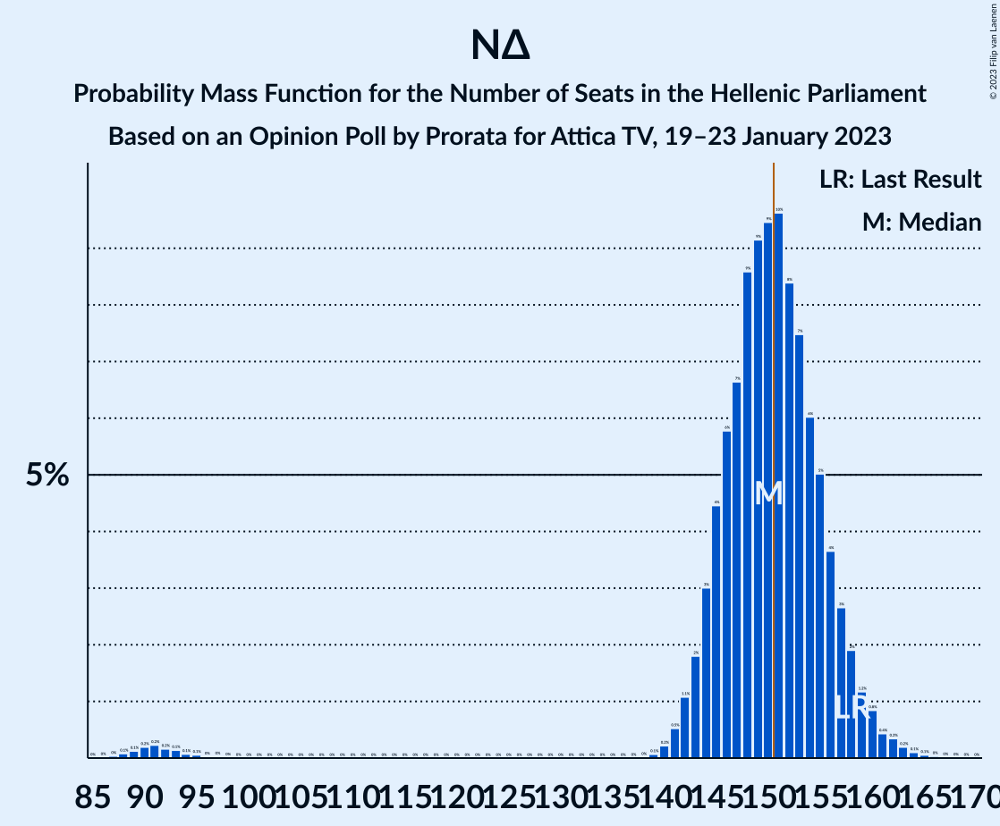

| Number of Seats | Probability | Accumulated | Special Marks |
|:---------------:|:-----------:|:-----------:|:-------------:|
| 87 | 0% | 100% |  |
| 88 | 0.1% | 99.9% |  |
| 89 | 0.1% | 99.9% |  |
| 90 | 0.2% | 99.7% |  |
| 91 | 0.2% | 99.5% |  |
| 92 | 0.2% | 99.3% |  |
| 93 | 0.1% | 99.1% |  |
| 94 | 0.1% | 99.0% |  |
| 95 | 0.1% | 98.9% |  |
| 96 | 0% | 98.9% |  |
| 97 | 0% | 98.8% |  |
| 98 | 0% | 98.8% |  |
| 99 | 0% | 98.8% |  |
| 100 | 0% | 98.8% |  |
| 101 | 0% | 98.8% |  |
| 102 | 0% | 98.8% |  |
| 103 | 0% | 98.8% |  |
| 104 | 0% | 98.8% |  |
| 105 | 0% | 98.8% |  |
| 106 | 0% | 98.8% |  |
| 107 | 0% | 98.8% |  |
| 108 | 0% | 98.8% |  |
| 109 | 0% | 98.8% |  |
| 110 | 0% | 98.8% |  |
| 111 | 0% | 98.8% |  |
| 112 | 0% | 98.8% |  |
| 113 | 0% | 98.8% |  |
| 114 | 0% | 98.8% |  |
| 115 | 0% | 98.8% |  |
| 116 | 0% | 98.8% |  |
| 117 | 0% | 98.8% |  |
| 118 | 0% | 98.8% |  |
| 119 | 0% | 98.8% |  |
| 120 | 0% | 98.8% |  |
| 121 | 0% | 98.8% |  |
| 122 | 0% | 98.8% |  |
| 123 | 0% | 98.8% |  |
| 124 | 0% | 98.8% |  |
| 125 | 0% | 98.8% |  |
| 126 | 0% | 98.8% |  |
| 127 | 0% | 98.8% |  |
| 128 | 0% | 98.8% |  |
| 129 | 0% | 98.8% |  |
| 130 | 0% | 98.8% |  |
| 131 | 0% | 98.8% |  |
| 132 | 0% | 98.8% |  |
| 133 | 0% | 98.8% |  |
| 134 | 0% | 98.8% |  |
| 135 | 0% | 98.8% |  |
| 136 | 0% | 98.8% |  |
| 137 | 0% | 98.8% |  |
| 138 | 0% | 98.8% |  |
| 139 | 0.1% | 98.8% |  |
| 140 | 0.2% | 98.7% |  |
| 141 | 0.5% | 98% |  |
| 142 | 1.1% | 98% |  |
| 143 | 2% | 97% |  |
| 144 | 3% | 95% |  |
| 145 | 4% | 92% |  |
| 146 | 6% | 88% |  |
| 147 | 7% | 82% |  |
| 148 | 9% | 75% |  |
| 149 | 9% | 67% |  |
| 150 | 9% | 57% | Median |
| 151 | 10% | 48% | Majority |
| 152 | 8% | 38% |  |
| 153 | 7% | 30% |  |
| 154 | 6% | 22% |  |
| 155 | 5% | 16% |  |
| 156 | 4% | 11% |  |
| 157 | 3% | 8% |  |
| 158 | 2% | 5% | Last Result |
| 159 | 1.2% | 3% |  |
| 160 | 0.8% | 2% |  |
| 161 | 0.4% | 1.2% |  |
| 162 | 0.3% | 0.8% |  |
| 163 | 0.2% | 0.4% |  |
| 164 | 0.1% | 0.2% |  |
| 165 | 0.1% | 0.1% |  |
| 166 | 0% | 0.1% |  |
| 167 | 0% | 0% |  |

### Συνασπισμός Ριζοσπαστικής Αριστεράς – Μέτωπο Ευρωπαϊκής Ρεαλιστικής Ανυπακοής

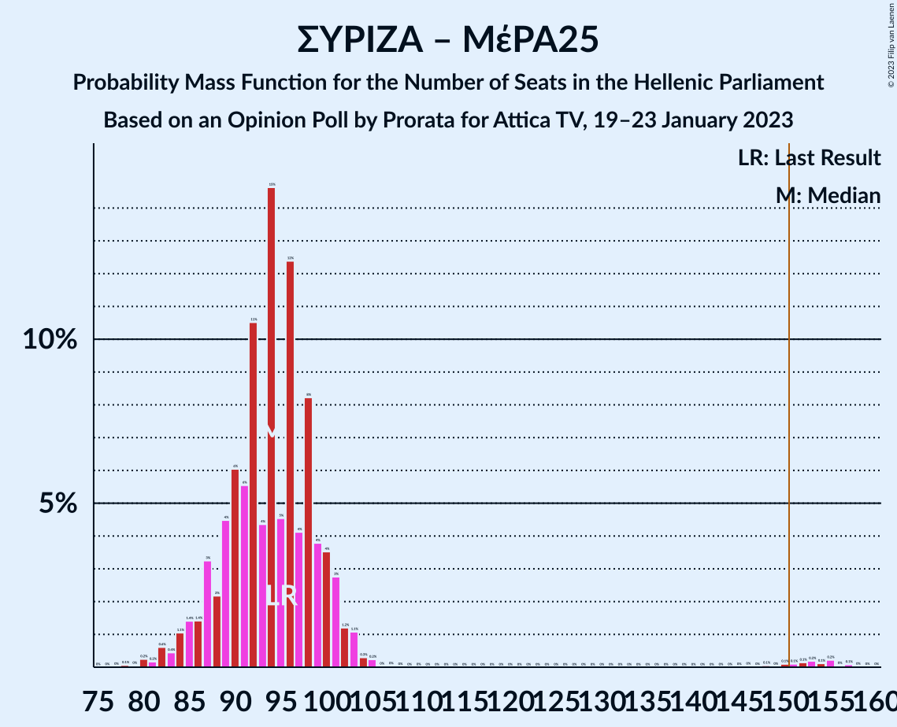

| Number of Seats | Probability | Accumulated | Special Marks |
|:---------------:|:-----------:|:-----------:|:-------------:|
| 78 | 0.1% | 100% |  |
| 79 | 0% | 99.9% |  |
| 80 | 0.2% | 99.8% |  |
| 81 | 0.2% | 99.6% |  |
| 82 | 0.6% | 99.4% |  |
| 83 | 0.4% | 98.8% |  |
| 84 | 1.1% | 98% |  |
| 85 | 1.4% | 97% |  |
| 86 | 1.4% | 96% |  |
| 87 | 3% | 94% |  |
| 88 | 2% | 91% |  |
| 89 | 4% | 89% |  |
| 90 | 6% | 85% |  |
| 91 | 6% | 79% |  |
| 92 | 11% | 73% |  |
| 93 | 4% | 62% |  |
| 94 | 15% | 58% | Median |
| 95 | 5% | 43% | Last Result |
| 96 | 12% | 39% |  |
| 97 | 4% | 27% |  |
| 98 | 8% | 22% |  |
| 99 | 4% | 14% |  |
| 100 | 4% | 10% |  |
| 101 | 3% | 7% |  |
| 102 | 1.2% | 4% |  |
| 103 | 1.1% | 3% |  |
| 104 | 0.3% | 2% |  |
| 105 | 0.2% | 2% |  |
| 106 | 0% | 1.3% |  |
| 107 | 0% | 1.3% |  |
| 108 | 0% | 1.2% |  |
| 109 | 0% | 1.2% |  |
| 110 | 0% | 1.2% |  |
| 111 | 0% | 1.2% |  |
| 112 | 0% | 1.2% |  |
| 113 | 0% | 1.2% |  |
| 114 | 0% | 1.2% |  |
| 115 | 0% | 1.2% |  |
| 116 | 0% | 1.2% |  |
| 117 | 0% | 1.2% |  |
| 118 | 0% | 1.2% |  |
| 119 | 0% | 1.2% |  |
| 120 | 0% | 1.2% |  |
| 121 | 0% | 1.2% |  |
| 122 | 0% | 1.2% |  |
| 123 | 0% | 1.2% |  |
| 124 | 0% | 1.2% |  |
| 125 | 0% | 1.2% |  |
| 126 | 0% | 1.2% |  |
| 127 | 0% | 1.2% |  |
| 128 | 0% | 1.2% |  |
| 129 | 0% | 1.2% |  |
| 130 | 0% | 1.2% |  |
| 131 | 0% | 1.2% |  |
| 132 | 0% | 1.2% |  |
| 133 | 0% | 1.2% |  |
| 134 | 0% | 1.2% |  |
| 135 | 0% | 1.2% |  |
| 136 | 0% | 1.2% |  |
| 137 | 0% | 1.2% |  |
| 138 | 0% | 1.2% |  |
| 139 | 0% | 1.2% |  |
| 140 | 0% | 1.2% |  |
| 141 | 0% | 1.2% |  |
| 142 | 0% | 1.2% |  |
| 143 | 0% | 1.2% |  |
| 144 | 0% | 1.2% |  |
| 145 | 0% | 1.2% |  |
| 146 | 0% | 1.2% |  |
| 147 | 0% | 1.2% |  |
| 148 | 0.1% | 1.1% |  |
| 149 | 0% | 1.1% |  |
| 150 | 0.1% | 1.1% |  |
| 151 | 0.1% | 1.0% | Majority |
| 152 | 0.1% | 0.9% |  |
| 153 | 0.2% | 0.7% |  |
| 154 | 0.1% | 0.5% |  |
| 155 | 0.2% | 0.4% |  |
| 156 | 0% | 0.2% |  |
| 157 | 0.1% | 0.1% |  |
| 158 | 0% | 0.1% |  |
| 159 | 0% | 0% |  |

### Συνασπισμός Ριζοσπαστικής Αριστεράς

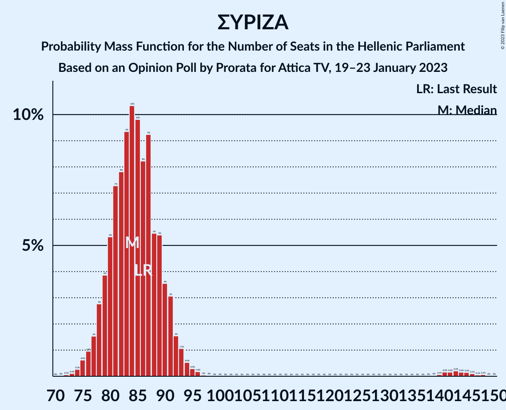

| Number of Seats | Probability | Accumulated | Special Marks |
|:---------------:|:-----------:|:-----------:|:-------------:|
| 72 | 0.1% | 100% |  |
| 73 | 0.1% | 99.9% |  |
| 74 | 0.3% | 99.8% |  |
| 75 | 0.6% | 99.5% |  |
| 76 | 1.0% | 98.9% |  |
| 77 | 2% | 98% |  |
| 78 | 3% | 96% |  |
| 79 | 4% | 94% |  |
| 80 | 5% | 90% |  |
| 81 | 7% | 84% |  |
| 82 | 8% | 77% |  |
| 83 | 9% | 69% |  |
| 84 | 10% | 60% | Median |
| 85 | 10% | 50% |  |
| 86 | 8% | 40% | Last Result |
| 87 | 9% | 32% |  |
| 88 | 5% | 22% |  |
| 89 | 5% | 17% |  |
| 90 | 4% | 12% |  |
| 91 | 3% | 8% |  |
| 92 | 2% | 5% |  |
| 93 | 1.1% | 3% |  |
| 94 | 0.5% | 2% |  |
| 95 | 0.3% | 2% |  |
| 96 | 0.2% | 1.5% |  |
| 97 | 0% | 1.3% |  |
| 98 | 0% | 1.2% |  |
| 99 | 0% | 1.2% |  |
| 100 | 0% | 1.2% |  |
| 101 | 0% | 1.2% |  |
| 102 | 0% | 1.2% |  |
| 103 | 0% | 1.2% |  |
| 104 | 0% | 1.2% |  |
| 105 | 0% | 1.2% |  |
| 106 | 0% | 1.2% |  |
| 107 | 0% | 1.2% |  |
| 108 | 0% | 1.2% |  |
| 109 | 0% | 1.2% |  |
| 110 | 0% | 1.2% |  |
| 111 | 0% | 1.2% |  |
| 112 | 0% | 1.2% |  |
| 113 | 0% | 1.2% |  |
| 114 | 0% | 1.2% |  |
| 115 | 0% | 1.2% |  |
| 116 | 0% | 1.2% |  |
| 117 | 0% | 1.2% |  |
| 118 | 0% | 1.2% |  |
| 119 | 0% | 1.2% |  |
| 120 | 0% | 1.2% |  |
| 121 | 0% | 1.2% |  |
| 122 | 0% | 1.2% |  |
| 123 | 0% | 1.2% |  |
| 124 | 0% | 1.2% |  |
| 125 | 0% | 1.2% |  |
| 126 | 0% | 1.2% |  |
| 127 | 0% | 1.2% |  |
| 128 | 0% | 1.2% |  |
| 129 | 0% | 1.2% |  |
| 130 | 0% | 1.2% |  |
| 131 | 0% | 1.2% |  |
| 132 | 0% | 1.2% |  |
| 133 | 0% | 1.2% |  |
| 134 | 0% | 1.2% |  |
| 135 | 0% | 1.2% |  |
| 136 | 0% | 1.2% |  |
| 137 | 0% | 1.2% |  |
| 138 | 0% | 1.2% |  |
| 139 | 0% | 1.2% |  |
| 140 | 0.1% | 1.2% |  |
| 141 | 0.2% | 1.1% |  |
| 142 | 0.2% | 0.9% |  |
| 143 | 0.2% | 0.8% |  |
| 144 | 0.2% | 0.6% |  |
| 145 | 0.1% | 0.4% |  |
| 146 | 0.1% | 0.3% |  |
| 147 | 0.1% | 0.2% |  |
| 148 | 0.1% | 0.1% |  |
| 149 | 0% | 0.1% |  |
| 150 | 0% | 0% |  |

## Technical Information

### Opinion Poll

+ **Polling firm:** Prorata
+ **Commissioner(s):** Attica TV
+ **Fieldwork period:** 19–23 January 2023

### Calculations

+ **Sample size:** 1018
+ **Simulations done:** 1,048,576
+ **Error estimate:** 0.84%

