# Opinion Poll by Pulse RC for ΣΚΑΪ, 19–23 January 2023

<a href="#voting-intentions">Voting Intentions</a> | <a href="#seats">Seats</a> | <a href="#coalitions">Coalitions</a> | <a href="#technical-information">Technical Information</a>

## Voting Intentions

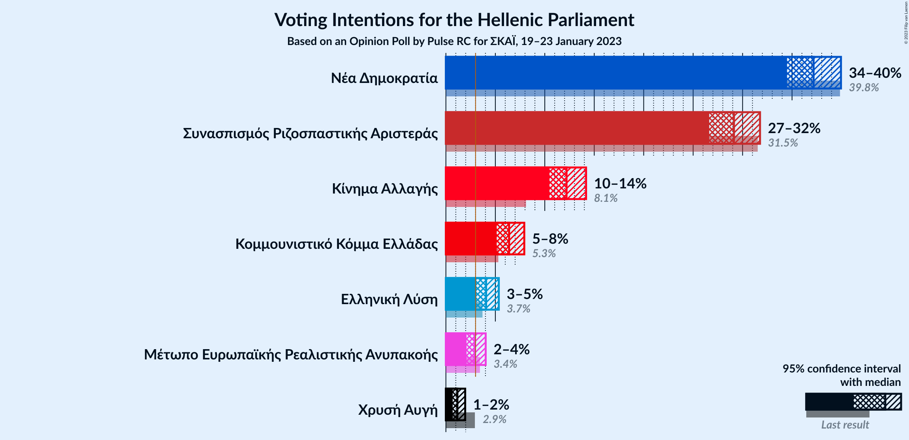

### Confidence Intervals

| Party | Last Result | Poll Result | 80% Confidence Interval | 90% Confidence Interval | 95% Confidence Interval | 99% Confidence Interval |
|:-----:|:-----------:|:-----------:|:-----------------------:|:-----------------------:|:-----------------------:|:-----------------------:|
| Νέα Δημοκρατία | 39.8% | 37.2% | 35.4–39.0% |34.9–39.5% |34.5–39.9% |33.7–40.8% |
| Συνασπισμός Ριζοσπαστικής Αριστεράς | 31.5% | 29.1% | 27.5–30.8% |27.0–31.3% |26.6–31.8% |25.8–32.6% |
| Κίνημα Αλλαγής | 8.1% | 12.2% | 11.1–13.5% |10.7–13.9% |10.5–14.2% |9.9–14.8% |
| Κομμουνιστικό Κόμμα Ελλάδας | 5.3% | 6.4% | 5.6–7.4% |5.3–7.7% |5.1–7.9% |4.8–8.4% |
| Ελληνική Λύση | 3.7% | 4.1% | 3.4–4.9% |3.2–5.1% |3.1–5.3% |2.8–5.8% |
| Μέτωπο Ευρωπαϊκής Ρεαλιστικής Ανυπακοής | 3.4% | 2.9% | 2.4–3.6% |2.2–3.8% |2.1–4.0% |1.9–4.4% |
| Χρυσή Αυγή | 2.9% | 1.2% | 0.9–1.7% |0.8–1.8% |0.7–2.0% |0.6–2.2% |

*Note:* The poll result column reflects the actual value used in the calculations. Published results may vary slightly, and in addition be rounded to fewer digits.

## Seats

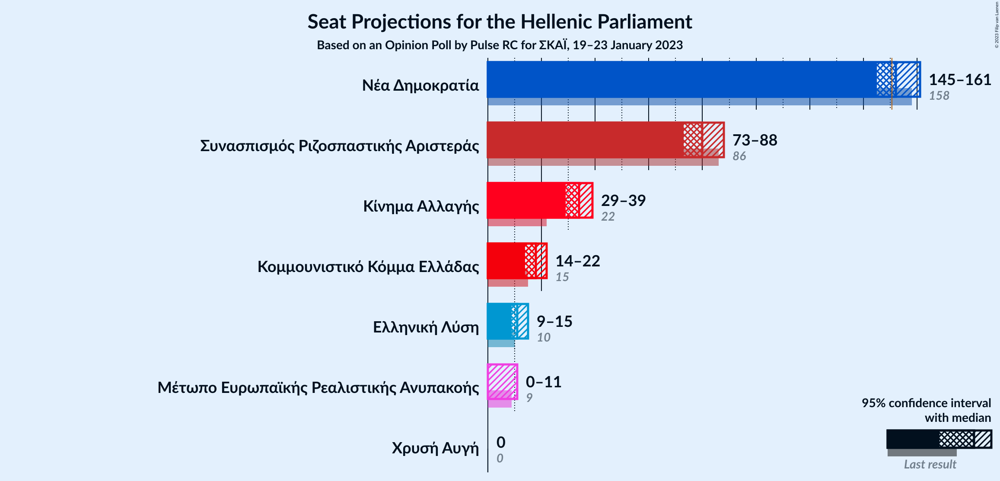

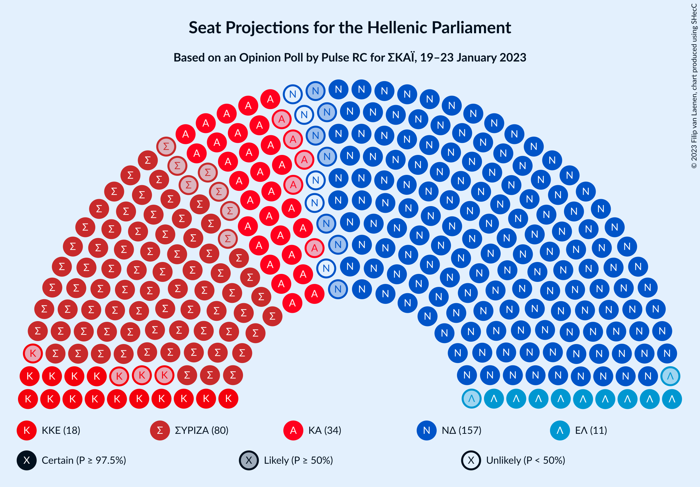

### Confidence Intervals

| Party | Last Result | Median | 80% Confidence Interval | 90% Confidence Interval | 95% Confidence Interval | 99% Confidence Interval |
|:-----:|:-----------:|:------:|:-----------------------:|:-----------------------:|:-----------------------:|:-----------------------:|
| <a href="#νέα-δημοκρατία">Νέα Δημοκρατία</a> | 158 | 152 | 147–158 |146–160 |145–161 |142–163 |
| <a href="#συνασπισμός-ριζοσπαστικής-αριστεράς">Συνασπισμός Ριζοσπαστικής Αριστεράς</a> | 86 | 80 | 76–85 |74–87 |73–88 |71–90 |
| <a href="#κίνημα-αλλαγής">Κίνημα Αλλαγής</a> | 22 | 34 | 30–37 |29–38 |29–39 |27–41 |
| <a href="#κομμουνιστικό-κόμμα-ελλάδας">Κομμουνιστικό Κόμμα Ελλάδας</a> | 15 | 18 | 15–20 |15–21 |14–22 |13–23 |
| <a href="#ελληνική-λύση">Ελληνική Λύση</a> | 10 | 11 | 10–13 |9–14 |9–15 |0–16 |
| <a href="#μέτωπο-ευρωπαϊκής-ρεαλιστικής-ανυπακοής">Μέτωπο Ευρωπαϊκής Ρεαλιστικής Ανυπακοής</a> | 9 | 0 | 0–10 |0–10 |0–11 |0–12 |
| <a href="#χρυσή-αυγή">Χρυσή Αυγή</a> | 0 | 0 | 0 |0 |0 |0 |

### Νέα Δημοκρατία

*For a full overview of the results for this party, see the [Νέα Δημοκρατία](party-νέαδημοκρατία.html) page.*

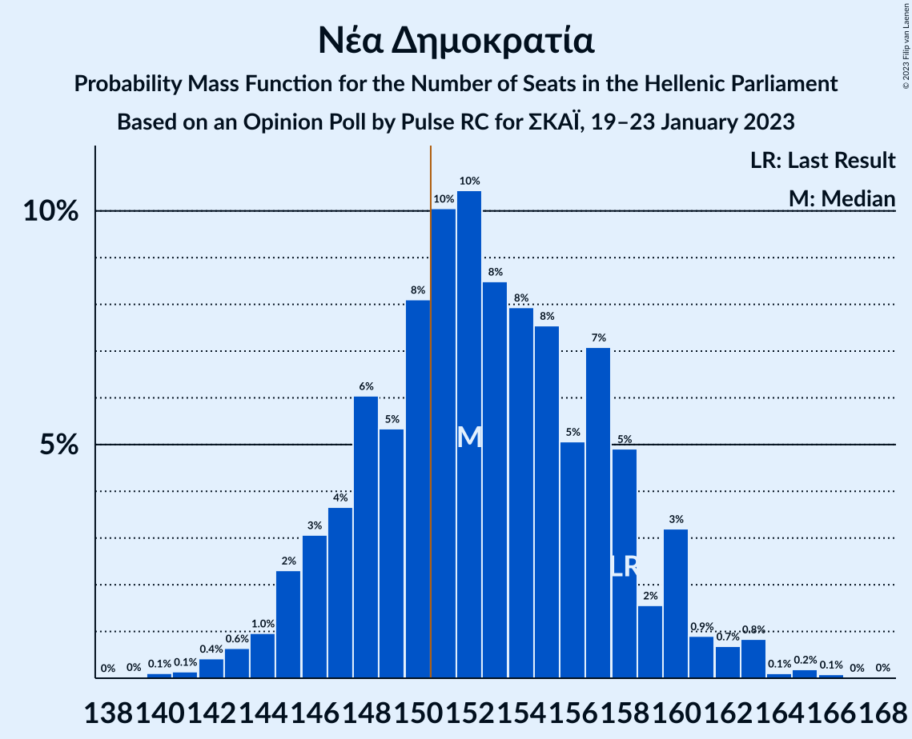

| Number of Seats | Probability | Accumulated | Special Marks |
|:---------------:|:-----------:|:-----------:|:-------------:|
| 139 | 0% | 100% |  |
| 140 | 0.1% | 99.9% |  |
| 141 | 0.1% | 99.8% |  |
| 142 | 0.4% | 99.7% |  |
| 143 | 0.6% | 99.3% |  |
| 144 | 1.0% | 98.6% |  |
| 145 | 2% | 98% |  |
| 146 | 3% | 95% |  |
| 147 | 4% | 92% |  |
| 148 | 6% | 89% |  |
| 149 | 5% | 83% |  |
| 150 | 8% | 77% |  |
| 151 | 10% | 69% | Majority |
| 152 | 10% | 59% | Median |
| 153 | 8% | 49% |  |
| 154 | 8% | 40% |  |
| 155 | 8% | 32% |  |
| 156 | 5% | 25% |  |
| 157 | 7% | 20% |  |
| 158 | 5% | 13% | Last Result |
| 159 | 2% | 8% |  |
| 160 | 3% | 6% |  |
| 161 | 0.9% | 3% |  |
| 162 | 0.7% | 2% |  |
| 163 | 0.8% | 1.3% |  |
| 164 | 0.1% | 0.4% |  |
| 165 | 0.2% | 0.3% |  |
| 166 | 0.1% | 0.1% |  |
| 167 | 0% | 0% |  |

### Συνασπισμός Ριζοσπαστικής Αριστεράς

*For a full overview of the results for this party, see the [Συνασπισμός Ριζοσπαστικής Αριστεράς](party-συνασπισμόςριζοσπαστικήςαριστεράς.html) page.*

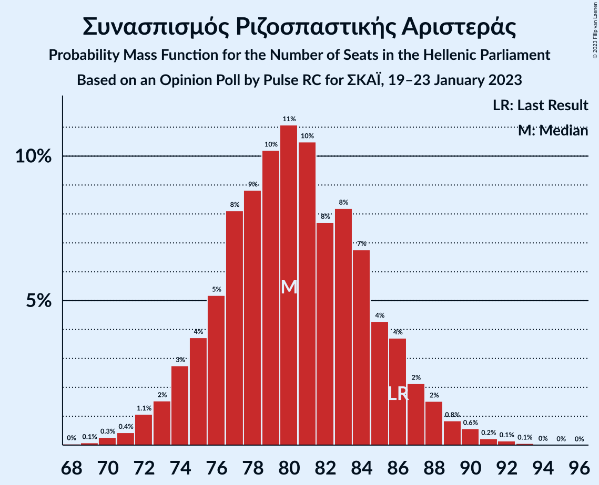

| Number of Seats | Probability | Accumulated | Special Marks |
|:---------------:|:-----------:|:-----------:|:-------------:|
| 68 | 0% | 100% |  |
| 69 | 0.1% | 99.9% |  |
| 70 | 0.3% | 99.9% |  |
| 71 | 0.4% | 99.6% |  |
| 72 | 1.1% | 99.2% |  |
| 73 | 2% | 98% |  |
| 74 | 3% | 97% |  |
| 75 | 4% | 94% |  |
| 76 | 5% | 90% |  |
| 77 | 8% | 85% |  |
| 78 | 9% | 77% |  |
| 79 | 10% | 68% |  |
| 80 | 11% | 58% | Median |
| 81 | 10% | 47% |  |
| 82 | 8% | 36% |  |
| 83 | 8% | 28% |  |
| 84 | 7% | 20% |  |
| 85 | 4% | 14% |  |
| 86 | 4% | 9% | Last Result |
| 87 | 2% | 6% |  |
| 88 | 2% | 3% |  |
| 89 | 0.8% | 2% |  |
| 90 | 0.6% | 1.1% |  |
| 91 | 0.2% | 0.5% |  |
| 92 | 0.1% | 0.3% |  |
| 93 | 0.1% | 0.1% |  |
| 94 | 0% | 0.1% |  |
| 95 | 0% | 0% |  |

### Κίνημα Αλλαγής

*For a full overview of the results for this party, see the [Κίνημα Αλλαγής](party-κίνημααλλαγής.html) page.*

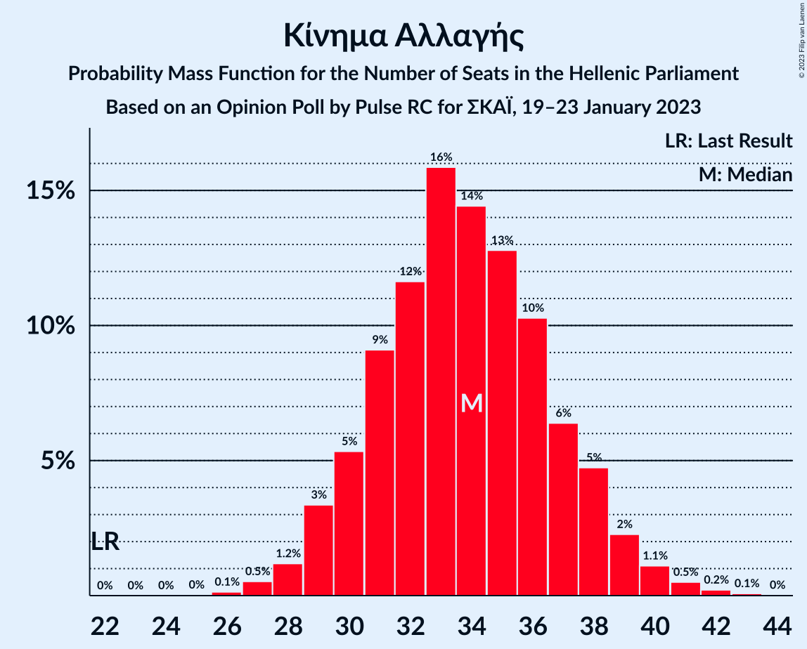

| Number of Seats | Probability | Accumulated | Special Marks |
|:---------------:|:-----------:|:-----------:|:-------------:|
| 22 | 0% | 100% | Last Result |
| 23 | 0% | 100% |  |
| 24 | 0% | 100% |  |
| 25 | 0% | 100% |  |
| 26 | 0.1% | 100% |  |
| 27 | 0.5% | 99.8% |  |
| 28 | 1.2% | 99.3% |  |
| 29 | 3% | 98% |  |
| 30 | 5% | 95% |  |
| 31 | 9% | 89% |  |
| 32 | 12% | 80% |  |
| 33 | 16% | 69% |  |
| 34 | 14% | 53% | Median |
| 35 | 13% | 38% |  |
| 36 | 10% | 26% |  |
| 37 | 6% | 15% |  |
| 38 | 5% | 9% |  |
| 39 | 2% | 4% |  |
| 40 | 1.1% | 2% |  |
| 41 | 0.5% | 0.8% |  |
| 42 | 0.2% | 0.3% |  |
| 43 | 0.1% | 0.1% |  |
| 44 | 0% | 0% |  |

### Κομμουνιστικό Κόμμα Ελλάδας

*For a full overview of the results for this party, see the [Κομμουνιστικό Κόμμα Ελλάδας](party-κομμουνιστικόκόμμαελλάδας.html) page.*

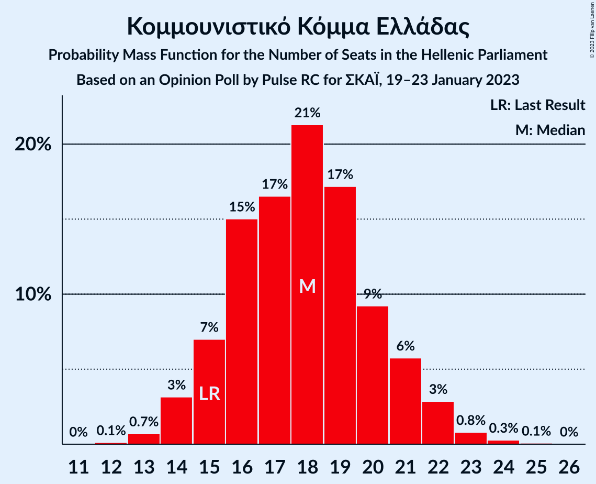

| Number of Seats | Probability | Accumulated | Special Marks |
|:---------------:|:-----------:|:-----------:|:-------------:|
| 12 | 0.1% | 100% |  |
| 13 | 0.7% | 99.9% |  |
| 14 | 3% | 99.2% |  |
| 15 | 7% | 96% | Last Result |
| 16 | 15% | 89% |  |
| 17 | 17% | 74% |  |
| 18 | 21% | 57% | Median |
| 19 | 17% | 36% |  |
| 20 | 9% | 19% |  |
| 21 | 6% | 10% |  |
| 22 | 3% | 4% |  |
| 23 | 0.8% | 1.2% |  |
| 24 | 0.3% | 0.4% |  |
| 25 | 0.1% | 0.1% |  |
| 26 | 0% | 0% |  |

### Ελληνική Λύση

*For a full overview of the results for this party, see the [Ελληνική Λύση](party-ελληνικήλύση.html) page.*

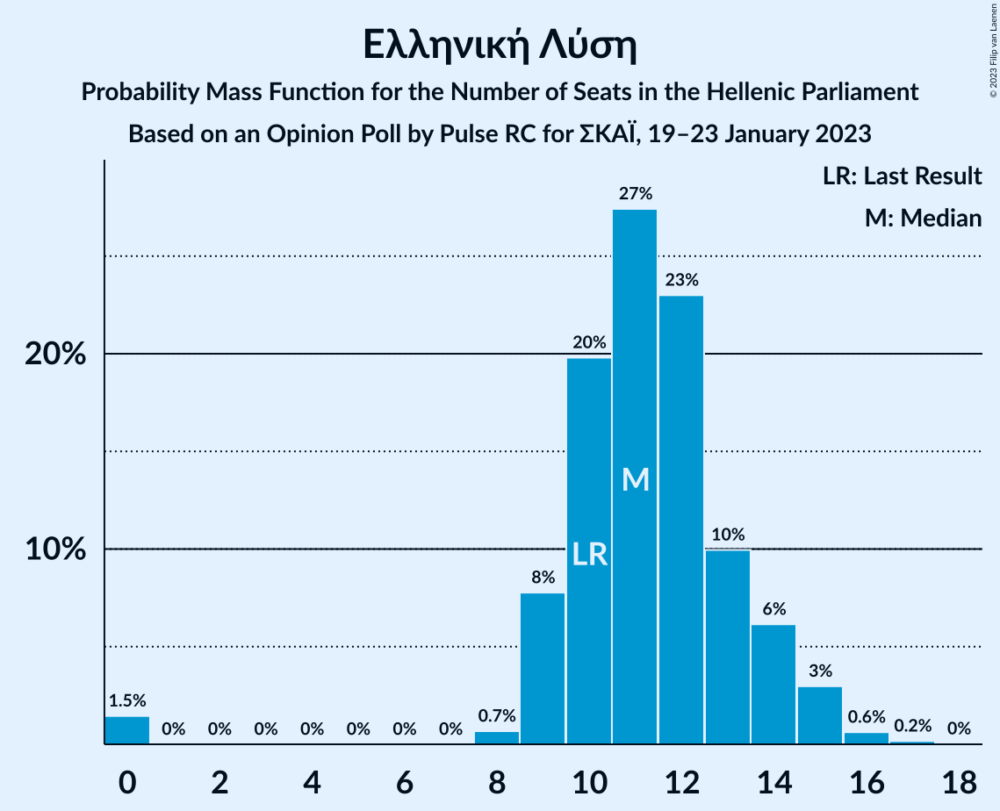

| Number of Seats | Probability | Accumulated | Special Marks |
|:---------------:|:-----------:|:-----------:|:-------------:|
| 0 | 1.5% | 100% |  |
| 1 | 0% | 98.5% |  |
| 2 | 0% | 98.5% |  |
| 3 | 0% | 98.5% |  |
| 4 | 0% | 98.5% |  |
| 5 | 0% | 98.5% |  |
| 6 | 0% | 98.5% |  |
| 7 | 0% | 98.5% |  |
| 8 | 0.7% | 98.5% |  |
| 9 | 8% | 98% |  |
| 10 | 20% | 90% | Last Result |
| 11 | 27% | 70% | Median |
| 12 | 23% | 43% |  |
| 13 | 10% | 20% |  |
| 14 | 6% | 10% |  |
| 15 | 3% | 4% |  |
| 16 | 0.6% | 0.8% |  |
| 17 | 0.2% | 0.2% |  |
| 18 | 0% | 0% |  |

### Μέτωπο Ευρωπαϊκής Ρεαλιστικής Ανυπακοής

*For a full overview of the results for this party, see the [Μέτωπο Ευρωπαϊκής Ρεαλιστικής Ανυπακοής](party-μέτωποευρωπαϊκήςρεαλιστικήςανυπακοής.html) page.*

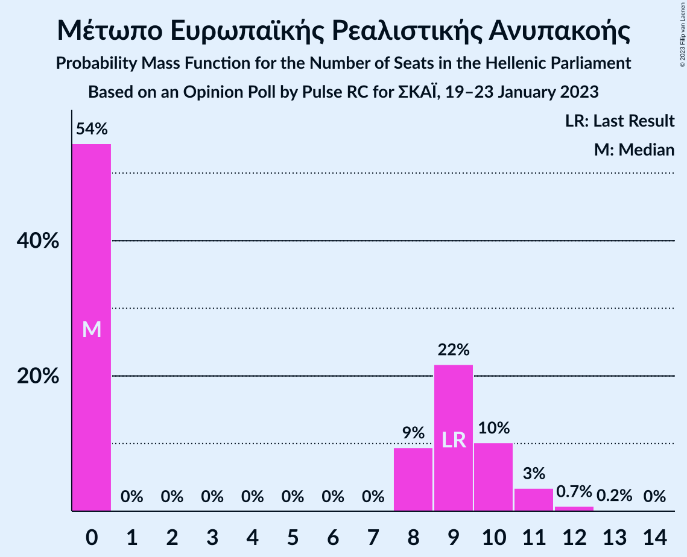

| Number of Seats | Probability | Accumulated | Special Marks |
|:---------------:|:-----------:|:-----------:|:-------------:|
| 0 | 54% | 100% | Median |
| 1 | 0% | 46% |  |
| 2 | 0% | 46% |  |
| 3 | 0% | 46% |  |
| 4 | 0% | 46% |  |
| 5 | 0% | 46% |  |
| 6 | 0% | 46% |  |
| 7 | 0% | 46% |  |
| 8 | 9% | 46% |  |
| 9 | 22% | 36% | Last Result |
| 10 | 10% | 14% |  |
| 11 | 3% | 4% |  |
| 12 | 0.7% | 0.9% |  |
| 13 | 0.2% | 0.2% |  |
| 14 | 0% | 0% |  |

### Χρυσή Αυγή

*For a full overview of the results for this party, see the [Χρυσή Αυγή](party-χρυσήαυγή.html) page.*

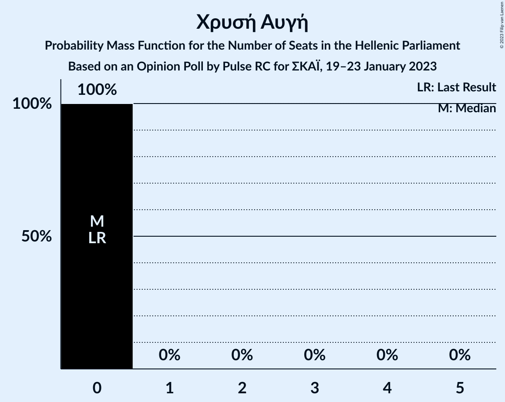

| Number of Seats | Probability | Accumulated | Special Marks |
|:---------------:|:-----------:|:-----------:|:-------------:|
| 0 | 100% | 100% | Last Result, Median |

## Coalitions

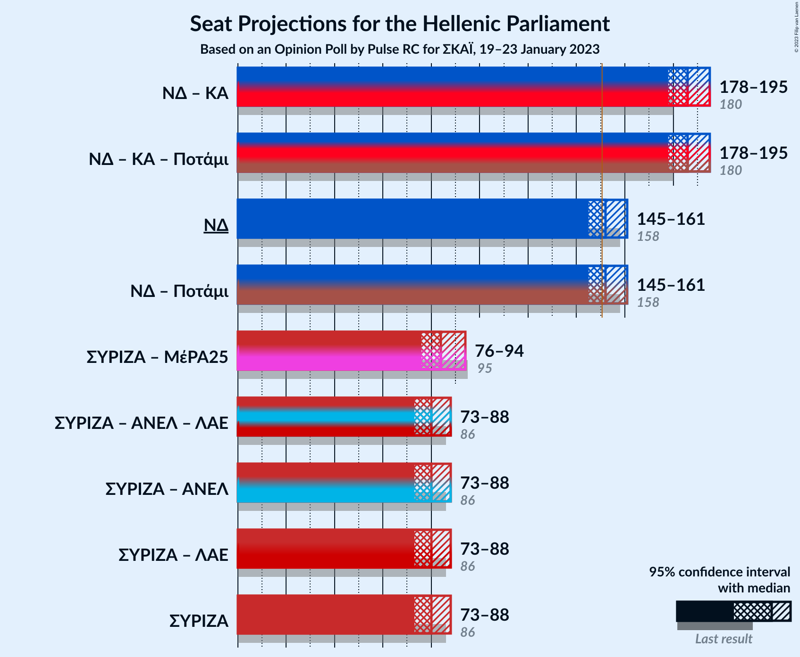

### Confidence Intervals

| Coalition | Last Result | Median | Majority? | 80% Confidence Interval | 90% Confidence Interval | 95% Confidence Interval | 99% Confidence Interval |
|:---------:|:-----------:|:------:|:---------:|:-----------------------:|:-----------------------:|:-----------------------:|:-----------------------:|
| Νέα Δημοκρατία – Κίνημα Αλλαγής | 180 | 186 | 100% | 180–192 | 179–194 | 178–195 | 175–198 |
| Νέα Δημοκρατία | 158 | 152 | 69% | 147–158 | 146–160 | 145–161 | 142–163 |
| Συνασπισμός Ριζοσπαστικής Αριστεράς – Μέτωπο Ευρωπαϊκής Ρεαλιστικής Ανυπακοής | 95 | 84 | 0% | 78–91 | 77–92 | 76–94 | 74–96 |
| Συνασπισμός Ριζοσπαστικής Αριστεράς | 86 | 80 | 0% | 76–85 | 74–87 | 73–88 | 71–90 |

### Νέα Δημοκρατία – Κίνημα Αλλαγής

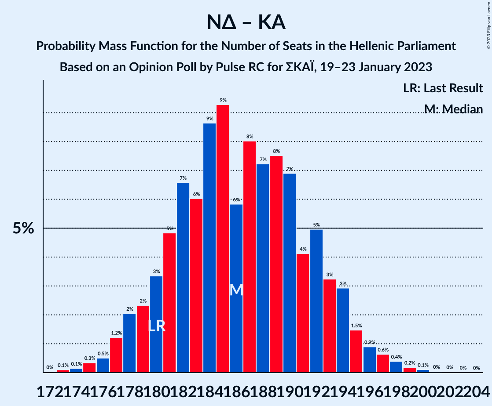

| Number of Seats | Probability | Accumulated | Special Marks |
|:---------------:|:-----------:|:-----------:|:-------------:|
| 172 | 0% | 100% |  |
| 173 | 0.1% | 99.9% |  |
| 174 | 0.1% | 99.8% |  |
| 175 | 0.3% | 99.7% |  |
| 176 | 0.5% | 99.3% |  |
| 177 | 1.2% | 98.8% |  |
| 178 | 2% | 98% |  |
| 179 | 2% | 96% |  |
| 180 | 3% | 93% | Last Result |
| 181 | 5% | 90% |  |
| 182 | 7% | 85% |  |
| 183 | 6% | 78% |  |
| 184 | 9% | 72% |  |
| 185 | 9% | 64% |  |
| 186 | 6% | 55% | Median |
| 187 | 8% | 49% |  |
| 188 | 7% | 41% |  |
| 189 | 8% | 33% |  |
| 190 | 7% | 26% |  |
| 191 | 4% | 19% |  |
| 192 | 5% | 15% |  |
| 193 | 3% | 10% |  |
| 194 | 3% | 7% |  |
| 195 | 1.5% | 4% |  |
| 196 | 0.9% | 2% |  |
| 197 | 0.6% | 1.4% |  |
| 198 | 0.4% | 0.8% |  |
| 199 | 0.2% | 0.4% |  |
| 200 | 0.1% | 0.2% |  |
| 201 | 0% | 0.1% |  |
| 202 | 0% | 0.1% |  |
| 203 | 0% | 0% |  |

### Νέα Δημοκρατία

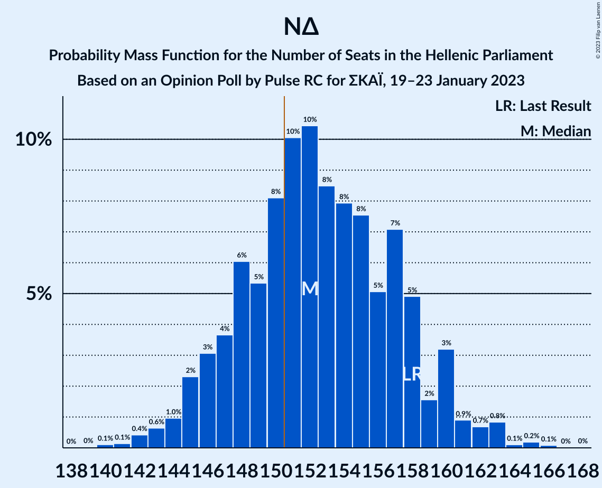

| Number of Seats | Probability | Accumulated | Special Marks |
|:---------------:|:-----------:|:-----------:|:-------------:|
| 139 | 0% | 100% |  |
| 140 | 0.1% | 99.9% |  |
| 141 | 0.1% | 99.8% |  |
| 142 | 0.4% | 99.7% |  |
| 143 | 0.6% | 99.3% |  |
| 144 | 1.0% | 98.6% |  |
| 145 | 2% | 98% |  |
| 146 | 3% | 95% |  |
| 147 | 4% | 92% |  |
| 148 | 6% | 89% |  |
| 149 | 5% | 83% |  |
| 150 | 8% | 77% |  |
| 151 | 10% | 69% | Majority |
| 152 | 10% | 59% | Median |
| 153 | 8% | 49% |  |
| 154 | 8% | 40% |  |
| 155 | 8% | 32% |  |
| 156 | 5% | 25% |  |
| 157 | 7% | 20% |  |
| 158 | 5% | 13% | Last Result |
| 159 | 2% | 8% |  |
| 160 | 3% | 6% |  |
| 161 | 0.9% | 3% |  |
| 162 | 0.7% | 2% |  |
| 163 | 0.8% | 1.3% |  |
| 164 | 0.1% | 0.4% |  |
| 165 | 0.2% | 0.3% |  |
| 166 | 0.1% | 0.1% |  |
| 167 | 0% | 0% |  |

### Συνασπισμός Ριζοσπαστικής Αριστεράς – Μέτωπο Ευρωπαϊκής Ρεαλιστικής Ανυπακοής

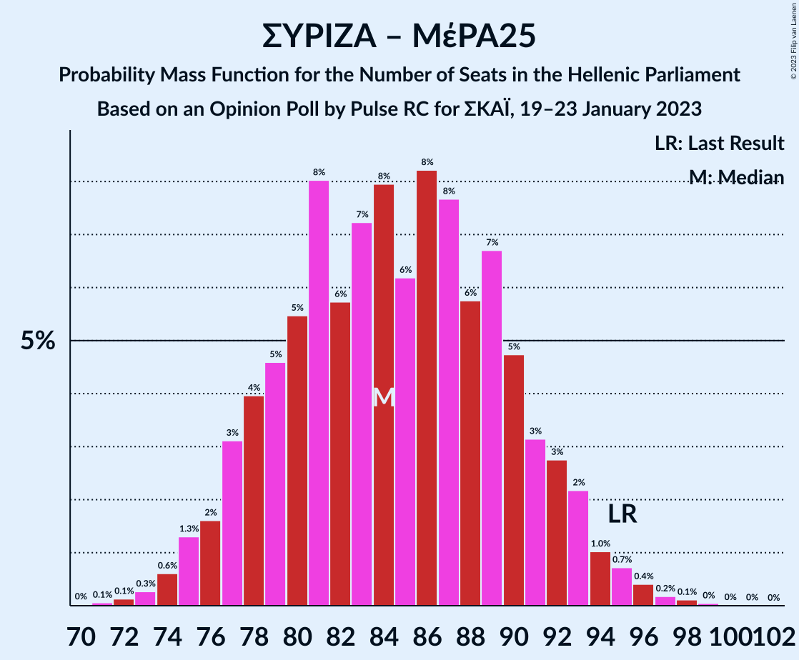

| Number of Seats | Probability | Accumulated | Special Marks |
|:---------------:|:-----------:|:-----------:|:-------------:|
| 71 | 0.1% | 100% |  |
| 72 | 0.1% | 99.9% |  |
| 73 | 0.3% | 99.8% |  |
| 74 | 0.6% | 99.5% |  |
| 75 | 1.3% | 98.9% |  |
| 76 | 2% | 98% |  |
| 77 | 3% | 96% |  |
| 78 | 4% | 93% |  |
| 79 | 5% | 89% |  |
| 80 | 5% | 84% | Median |
| 81 | 8% | 79% |  |
| 82 | 6% | 71% |  |
| 83 | 7% | 65% |  |
| 84 | 8% | 58% |  |
| 85 | 6% | 50% |  |
| 86 | 8% | 44% |  |
| 87 | 8% | 35% |  |
| 88 | 6% | 28% |  |
| 89 | 7% | 22% |  |
| 90 | 5% | 15% |  |
| 91 | 3% | 11% |  |
| 92 | 3% | 7% |  |
| 93 | 2% | 5% |  |
| 94 | 1.0% | 3% |  |
| 95 | 0.7% | 2% | Last Result |
| 96 | 0.4% | 0.8% |  |
| 97 | 0.2% | 0.4% |  |
| 98 | 0.1% | 0.2% |  |
| 99 | 0% | 0.1% |  |
| 100 | 0% | 0.1% |  |
| 101 | 0% | 0% |  |

### Συνασπισμός Ριζοσπαστικής Αριστεράς

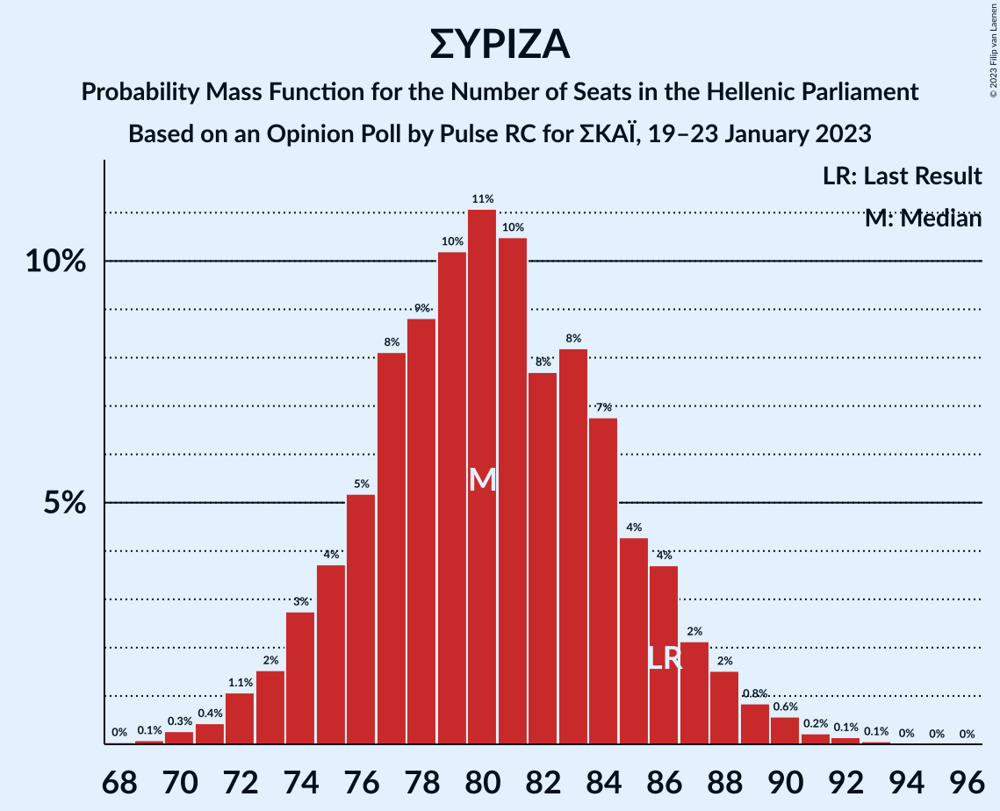

| Number of Seats | Probability | Accumulated | Special Marks |
|:---------------:|:-----------:|:-----------:|:-------------:|
| 68 | 0% | 100% |  |
| 69 | 0.1% | 99.9% |  |
| 70 | 0.3% | 99.9% |  |
| 71 | 0.4% | 99.6% |  |
| 72 | 1.1% | 99.2% |  |
| 73 | 2% | 98% |  |
| 74 | 3% | 97% |  |
| 75 | 4% | 94% |  |
| 76 | 5% | 90% |  |
| 77 | 8% | 85% |  |
| 78 | 9% | 77% |  |
| 79 | 10% | 68% |  |
| 80 | 11% | 58% | Median |
| 81 | 10% | 47% |  |
| 82 | 8% | 36% |  |
| 83 | 8% | 28% |  |
| 84 | 7% | 20% |  |
| 85 | 4% | 14% |  |
| 86 | 4% | 9% | Last Result |
| 87 | 2% | 6% |  |
| 88 | 2% | 3% |  |
| 89 | 0.8% | 2% |  |
| 90 | 0.6% | 1.1% |  |
| 91 | 0.2% | 0.5% |  |
| 92 | 0.1% | 0.3% |  |
| 93 | 0.1% | 0.1% |  |
| 94 | 0% | 0.1% |  |
| 95 | 0% | 0% |  |

## Technical Information

### Opinion Poll

+ **Polling firm:** Pulse RC
+ **Commissioner(s):** ΣΚΑΪ
+ **Fieldwork period:** 19–23 January 2023

### Calculations

+ **Sample size:** 1205
+ **Simulations done:** 1,048,576
+ **Error estimate:** 0.52%

