# Opinion Poll by GPO for Star TV, 20–24 January 2023

<a href="#voting-intentions">Voting Intentions</a> | <a href="#seats">Seats</a> | <a href="#coalitions">Coalitions</a> | <a href="#technical-information">Technical Information</a>

## Voting Intentions

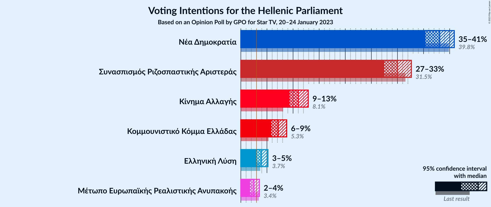

### Confidence Intervals

| Party | Last Result | Poll Result | 80% Confidence Interval | 90% Confidence Interval | 95% Confidence Interval | 99% Confidence Interval |
|:-----:|:-----------:|:-----------:|:-----------------------:|:-----------------------:|:-----------------------:|:-----------------------:|
| Νέα Δημοκρατία | 39.8% | 38.1% | 36.3–39.9% |35.8–40.4% |35.4–40.9% |34.5–41.7% |
| Συνασπισμός Ριζοσπαστικής Αριστεράς | 31.5% | 30.0% | 28.3–31.7% |27.9–32.2% |27.5–32.7% |26.7–33.5% |
| Κίνημα Αλλαγής | 8.1% | 11.0% | 9.9–12.2% |9.6–12.6% |9.3–12.9% |8.9–13.5% |
| Κομμουνιστικό Κόμμα Ελλάδας | 5.3% | 7.2% | 6.3–8.2% |6.1–8.5% |5.8–8.8% |5.4–9.3% |
| Ελληνική Λύση | 3.7% | 3.9% | 3.3–4.7% |3.1–5.0% |3.0–5.2% |2.7–5.6% |
| Μέτωπο Ευρωπαϊκής Ρεαλιστικής Ανυπακοής | 3.4% | 2.5% | 2.0–3.2% |1.9–3.4% |1.8–3.6% |1.5–3.9% |

*Note:* The poll result column reflects the actual value used in the calculations. Published results may vary slightly, and in addition be rounded to fewer digits.

## Seats

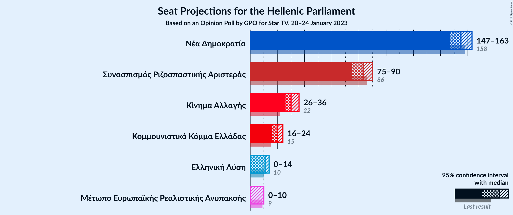

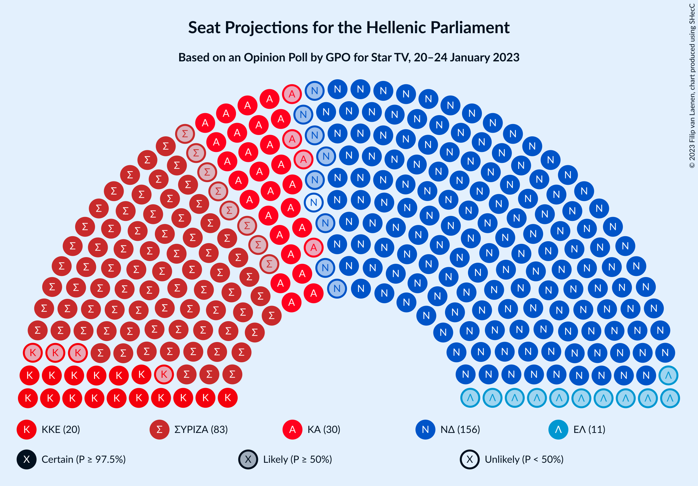

### Confidence Intervals

| Party | Last Result | Median | 80% Confidence Interval | 90% Confidence Interval | 95% Confidence Interval | 99% Confidence Interval |
|:-----:|:-----------:|:------:|:-----------------------:|:-----------------------:|:-----------------------:|:-----------------------:|
| <a href="#νέα-δημοκρατία">Νέα Δημοκρατία</a> | 158 | 155 | 150–160 |148–162 |147–163 |144–165 |
| <a href="#συνασπισμός-ριζοσπαστικής-αριστεράς">Συνασπισμός Ριζοσπαστικής Αριστεράς</a> | 86 | 83 | 78–87 |77–89 |75–90 |73–93 |
| <a href="#κίνημα-αλλαγής">Κίνημα Αλλαγής</a> | 22 | 30 | 27–34 |26–35 |26–36 |24–37 |
| <a href="#κομμουνιστικό-κόμμα-ελλάδας">Κομμουνιστικό Κόμμα Ελλάδας</a> | 15 | 20 | 17–23 |17–23 |16–24 |15–26 |
| <a href="#ελληνική-λύση">Ελληνική Λύση</a> | 10 | 11 | 9–13 |9–14 |0–14 |0–15 |
| <a href="#μέτωπο-ευρωπαϊκής-ρεαλιστικής-ανυπακοής">Μέτωπο Ευρωπαϊκής Ρεαλιστικής Ανυπακοής</a> | 9 | 0 | 0–9 |0–9 |0–10 |0–10 |

### Νέα Δημοκρατία

*For a full overview of the results for this party, see the [Νέα Δημοκρατία](party-νέαδημοκρατία.html) page.*

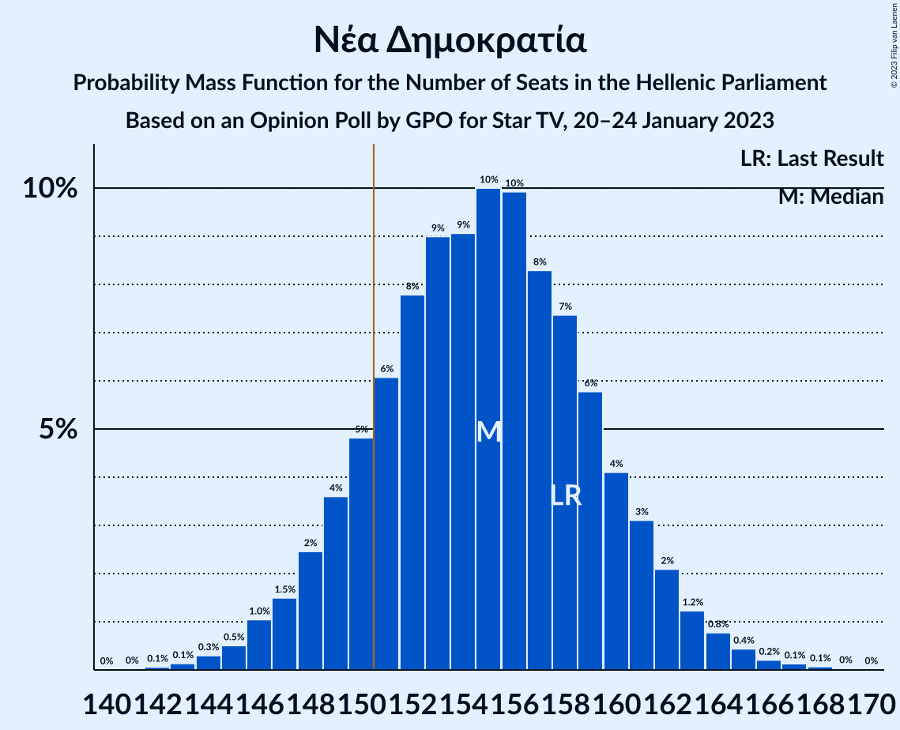

| Number of Seats | Probability | Accumulated | Special Marks |
|:---------------:|:-----------:|:-----------:|:-------------:|
| 141 | 0% | 100% |  |
| 142 | 0.1% | 99.9% |  |
| 143 | 0.1% | 99.9% |  |
| 144 | 0.3% | 99.7% |  |
| 145 | 0.5% | 99.4% |  |
| 146 | 1.0% | 98.9% |  |
| 147 | 1.5% | 98% |  |
| 148 | 2% | 96% |  |
| 149 | 4% | 94% |  |
| 150 | 5% | 90% |  |
| 151 | 6% | 85% | Majority |
| 152 | 8% | 79% |  |
| 153 | 9% | 72% |  |
| 154 | 9% | 63% |  |
| 155 | 10% | 54% | Median |
| 156 | 10% | 44% |  |
| 157 | 8% | 34% |  |
| 158 | 7% | 25% | Last Result |
| 159 | 6% | 18% |  |
| 160 | 4% | 12% |  |
| 161 | 3% | 8% |  |
| 162 | 2% | 5% |  |
| 163 | 1.2% | 3% |  |
| 164 | 0.8% | 2% |  |
| 165 | 0.4% | 0.9% |  |
| 166 | 0.2% | 0.5% |  |
| 167 | 0.1% | 0.3% |  |
| 168 | 0.1% | 0.1% |  |
| 169 | 0% | 0.1% |  |
| 170 | 0% | 0% |  |

### Συνασπισμός Ριζοσπαστικής Αριστεράς

*For a full overview of the results for this party, see the [Συνασπισμός Ριζοσπαστικής Αριστεράς](party-συνασπισμόςριζοσπαστικήςαριστεράς.html) page.*

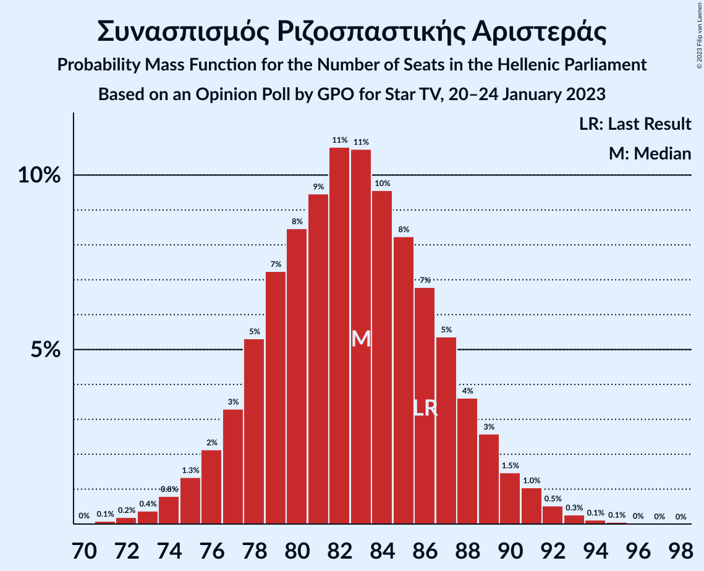

| Number of Seats | Probability | Accumulated | Special Marks |
|:---------------:|:-----------:|:-----------:|:-------------:|
| 70 | 0% | 100% |  |
| 71 | 0.1% | 99.9% |  |
| 72 | 0.2% | 99.9% |  |
| 73 | 0.4% | 99.7% |  |
| 74 | 0.8% | 99.3% |  |
| 75 | 1.3% | 98% |  |
| 76 | 2% | 97% |  |
| 77 | 3% | 95% |  |
| 78 | 5% | 92% |  |
| 79 | 7% | 86% |  |
| 80 | 8% | 79% |  |
| 81 | 9% | 71% |  |
| 82 | 11% | 61% |  |
| 83 | 11% | 50% | Median |
| 84 | 10% | 40% |  |
| 85 | 8% | 30% |  |
| 86 | 7% | 22% | Last Result |
| 87 | 5% | 15% |  |
| 88 | 4% | 10% |  |
| 89 | 3% | 6% |  |
| 90 | 1.5% | 4% |  |
| 91 | 1.0% | 2% |  |
| 92 | 0.5% | 1.0% |  |
| 93 | 0.3% | 0.5% |  |
| 94 | 0.1% | 0.3% |  |
| 95 | 0.1% | 0.1% |  |
| 96 | 0% | 0.1% |  |
| 97 | 0% | 0.1% |  |
| 98 | 0% | 0% |  |

### Κίνημα Αλλαγής

*For a full overview of the results for this party, see the [Κίνημα Αλλαγής](party-κίνημααλλαγής.html) page.*

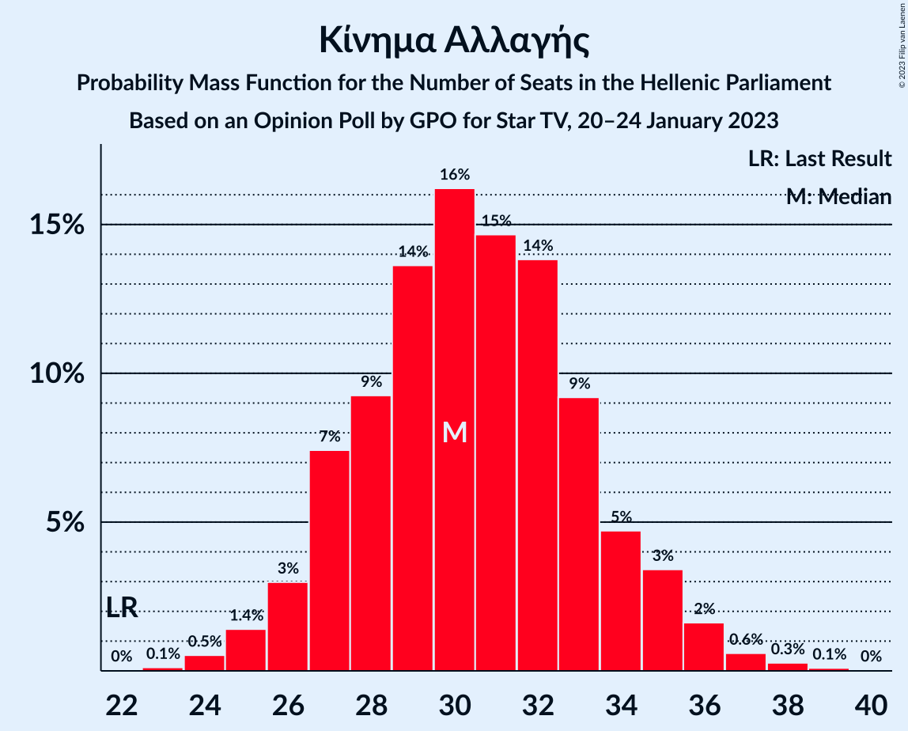

| Number of Seats | Probability | Accumulated | Special Marks |
|:---------------:|:-----------:|:-----------:|:-------------:|
| 22 | 0% | 100% | Last Result |
| 23 | 0.1% | 100% |  |
| 24 | 0.5% | 99.9% |  |
| 25 | 1.4% | 99.3% |  |
| 26 | 3% | 98% |  |
| 27 | 7% | 95% |  |
| 28 | 9% | 88% |  |
| 29 | 14% | 78% |  |
| 30 | 16% | 65% | Median |
| 31 | 15% | 48% |  |
| 32 | 14% | 34% |  |
| 33 | 9% | 20% |  |
| 34 | 5% | 11% |  |
| 35 | 3% | 6% |  |
| 36 | 2% | 3% |  |
| 37 | 0.6% | 1.0% |  |
| 38 | 0.3% | 0.4% |  |
| 39 | 0.1% | 0.1% |  |
| 40 | 0% | 0% |  |

### Κομμουνιστικό Κόμμα Ελλάδας

*For a full overview of the results for this party, see the [Κομμουνιστικό Κόμμα Ελλάδας](party-κομμουνιστικόκόμμαελλάδας.html) page.*

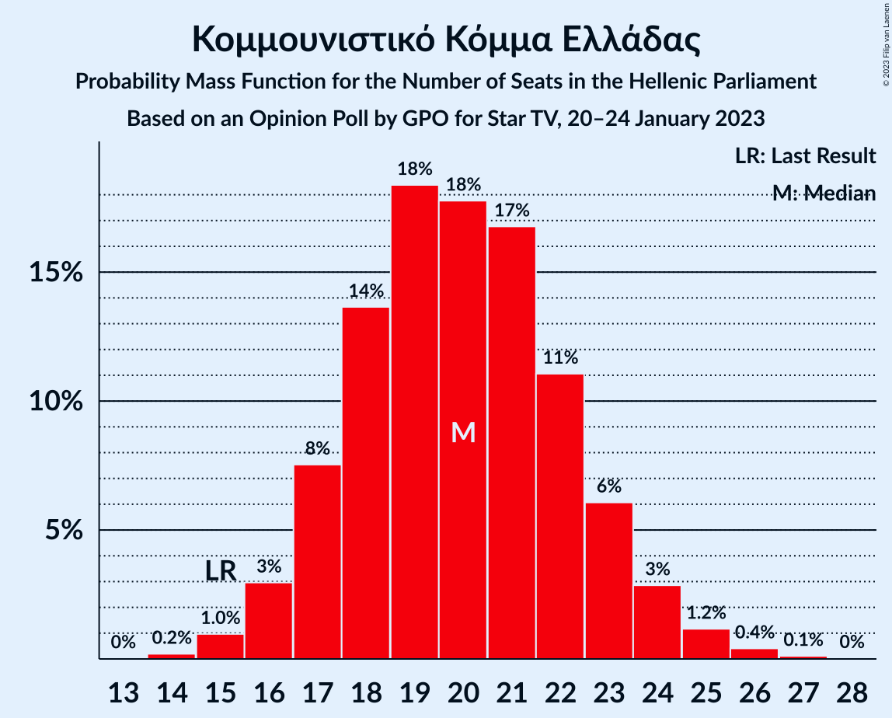

| Number of Seats | Probability | Accumulated | Special Marks |
|:---------------:|:-----------:|:-----------:|:-------------:|
| 14 | 0.2% | 100% |  |
| 15 | 1.0% | 99.8% | Last Result |
| 16 | 3% | 98.8% |  |
| 17 | 8% | 96% |  |
| 18 | 14% | 88% |  |
| 19 | 18% | 75% |  |
| 20 | 18% | 56% | Median |
| 21 | 17% | 38% |  |
| 22 | 11% | 22% |  |
| 23 | 6% | 11% |  |
| 24 | 3% | 5% |  |
| 25 | 1.2% | 2% |  |
| 26 | 0.4% | 0.6% |  |
| 27 | 0.1% | 0.2% |  |
| 28 | 0% | 0% |  |

### Ελληνική Λύση

*For a full overview of the results for this party, see the [Ελληνική Λύση](party-ελληνικήλύση.html) page.*

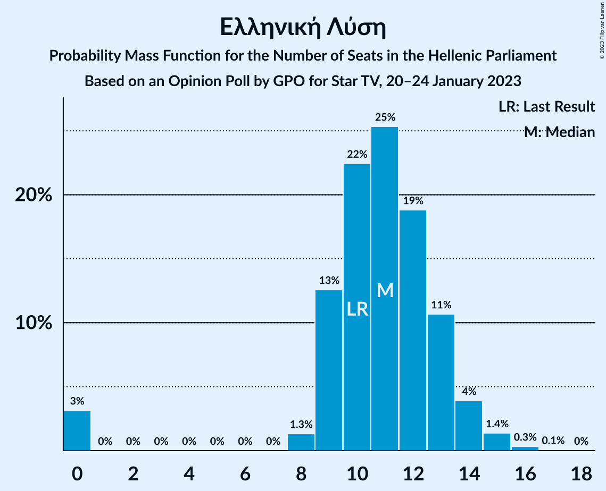

| Number of Seats | Probability | Accumulated | Special Marks |
|:---------------:|:-----------:|:-----------:|:-------------:|
| 0 | 3% | 100% |  |
| 1 | 0% | 97% |  |
| 2 | 0% | 97% |  |
| 3 | 0% | 97% |  |
| 4 | 0% | 97% |  |
| 5 | 0% | 97% |  |
| 6 | 0% | 97% |  |
| 7 | 0% | 97% |  |
| 8 | 1.3% | 97% |  |
| 9 | 13% | 96% |  |
| 10 | 22% | 83% | Last Result |
| 11 | 25% | 61% | Median |
| 12 | 19% | 35% |  |
| 13 | 11% | 16% |  |
| 14 | 4% | 6% |  |
| 15 | 1.4% | 2% |  |
| 16 | 0.3% | 0.4% |  |
| 17 | 0.1% | 0.1% |  |
| 18 | 0% | 0% |  |

### Μέτωπο Ευρωπαϊκής Ρεαλιστικής Ανυπακοής

*For a full overview of the results for this party, see the [Μέτωπο Ευρωπαϊκής Ρεαλιστικής Ανυπακοής](party-μέτωποευρωπαϊκήςρεαλιστικήςανυπακοής.html) page.*

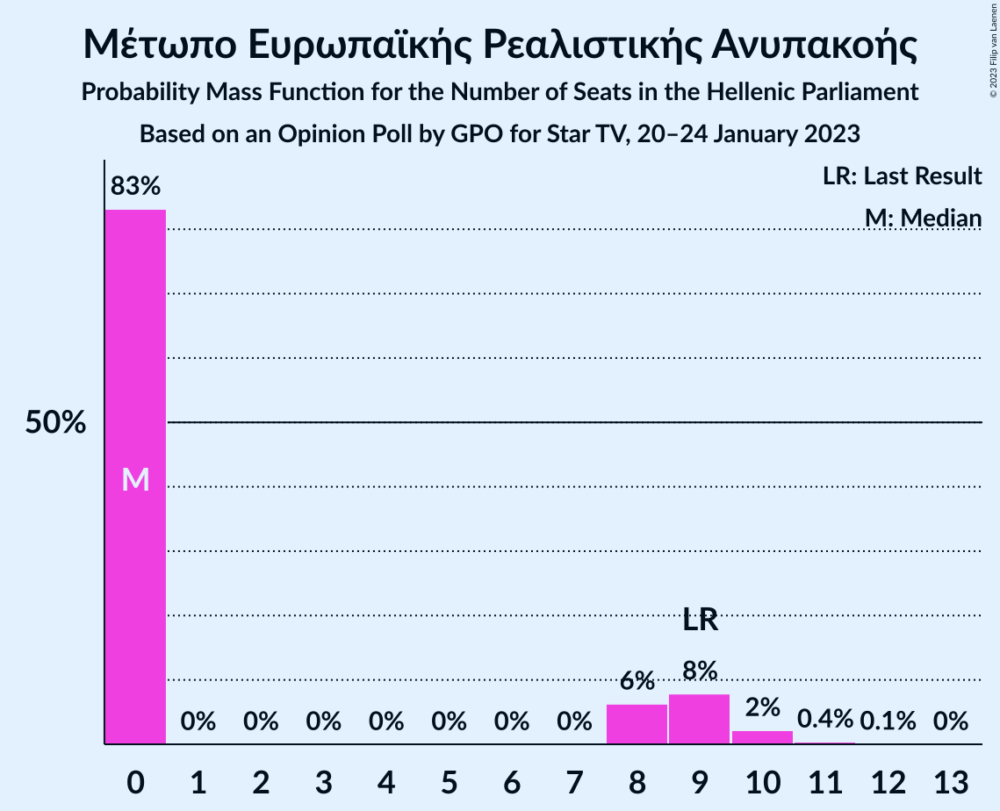

| Number of Seats | Probability | Accumulated | Special Marks |
|:---------------:|:-----------:|:-----------:|:-------------:|
| 0 | 83% | 100% | Median |
| 1 | 0% | 17% |  |
| 2 | 0% | 17% |  |
| 3 | 0% | 17% |  |
| 4 | 0% | 17% |  |
| 5 | 0% | 17% |  |
| 6 | 0% | 17% |  |
| 7 | 0% | 17% |  |
| 8 | 6% | 17% |  |
| 9 | 8% | 11% | Last Result |
| 10 | 2% | 3% |  |
| 11 | 0.4% | 0.5% |  |
| 12 | 0.1% | 0.1% |  |
| 13 | 0% | 0% |  |

## Coalitions

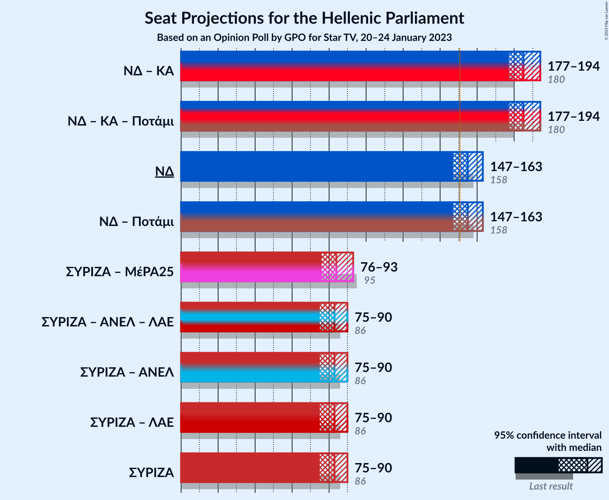

### Confidence Intervals

| Coalition | Last Result | Median | Majority? | 80% Confidence Interval | 90% Confidence Interval | 95% Confidence Interval | 99% Confidence Interval |
|:---------:|:-----------:|:------:|:---------:|:-----------------------:|:-----------------------:|:-----------------------:|:-----------------------:|
| Νέα Δημοκρατία – Κίνημα Αλλαγής | 180 | 185 | 100% | 180–191 | 178–192 | 177–194 | 174–197 |
| Νέα Δημοκρατία | 158 | 155 | 85% | 150–160 | 148–162 | 147–163 | 144–165 |
| Συνασπισμός Ριζοσπαστικής Αριστεράς – Μέτωπο Ευρωπαϊκής Ρεαλιστικής Ανυπακοής | 95 | 84 | 0% | 79–90 | 78–91 | 76–93 | 74–96 |
| Συνασπισμός Ριζοσπαστικής Αριστεράς | 86 | 83 | 0% | 78–87 | 77–89 | 75–90 | 73–93 |

### Νέα Δημοκρατία – Κίνημα Αλλαγής

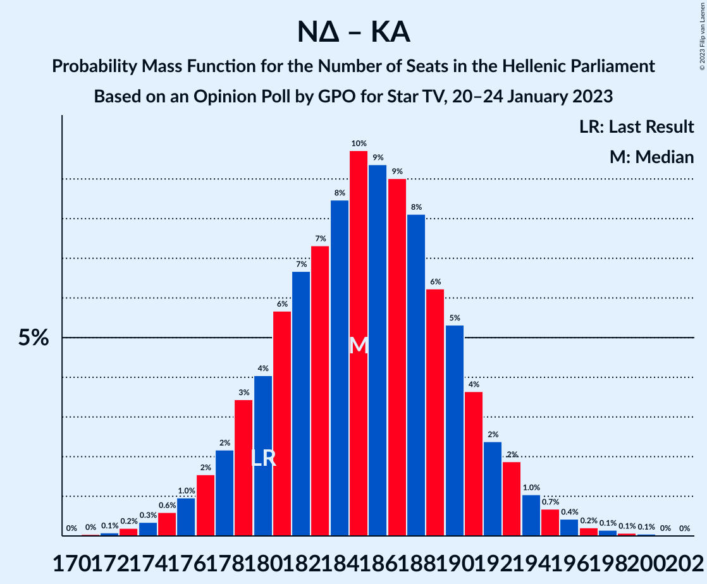

| Number of Seats | Probability | Accumulated | Special Marks |
|:---------------:|:-----------:|:-----------:|:-------------:|
| 170 | 0% | 100% |  |
| 171 | 0% | 99.9% |  |
| 172 | 0.1% | 99.9% |  |
| 173 | 0.2% | 99.8% |  |
| 174 | 0.3% | 99.6% |  |
| 175 | 0.6% | 99.3% |  |
| 176 | 1.0% | 98.7% |  |
| 177 | 2% | 98% |  |
| 178 | 2% | 96% |  |
| 179 | 3% | 94% |  |
| 180 | 4% | 91% | Last Result |
| 181 | 6% | 86% |  |
| 182 | 7% | 81% |  |
| 183 | 7% | 74% |  |
| 184 | 8% | 67% |  |
| 185 | 10% | 58% | Median |
| 186 | 9% | 49% |  |
| 187 | 9% | 39% |  |
| 188 | 8% | 30% |  |
| 189 | 6% | 22% |  |
| 190 | 5% | 16% |  |
| 191 | 4% | 11% |  |
| 192 | 2% | 7% |  |
| 193 | 2% | 5% |  |
| 194 | 1.0% | 3% |  |
| 195 | 0.7% | 2% |  |
| 196 | 0.4% | 1.0% |  |
| 197 | 0.2% | 0.5% |  |
| 198 | 0.1% | 0.3% |  |
| 199 | 0.1% | 0.2% |  |
| 200 | 0.1% | 0.1% |  |
| 201 | 0% | 0% |  |

### Νέα Δημοκρατία

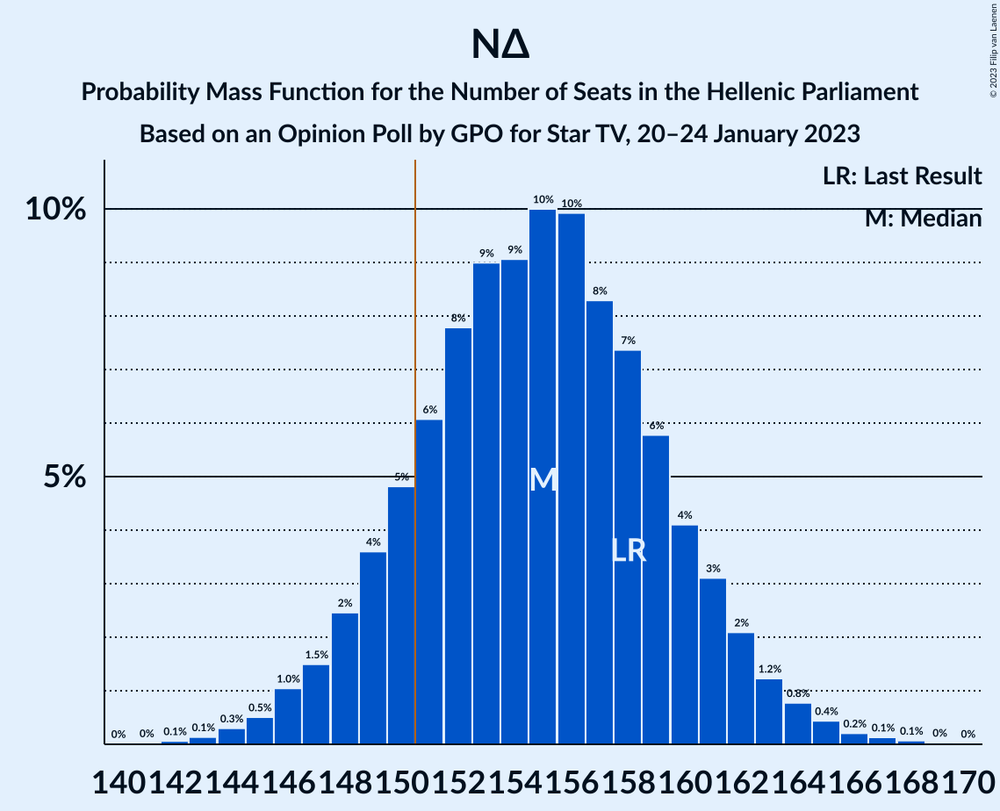

| Number of Seats | Probability | Accumulated | Special Marks |
|:---------------:|:-----------:|:-----------:|:-------------:|
| 141 | 0% | 100% |  |
| 142 | 0.1% | 99.9% |  |
| 143 | 0.1% | 99.9% |  |
| 144 | 0.3% | 99.7% |  |
| 145 | 0.5% | 99.4% |  |
| 146 | 1.0% | 98.9% |  |
| 147 | 1.5% | 98% |  |
| 148 | 2% | 96% |  |
| 149 | 4% | 94% |  |
| 150 | 5% | 90% |  |
| 151 | 6% | 85% | Majority |
| 152 | 8% | 79% |  |
| 153 | 9% | 72% |  |
| 154 | 9% | 63% |  |
| 155 | 10% | 54% | Median |
| 156 | 10% | 44% |  |
| 157 | 8% | 34% |  |
| 158 | 7% | 25% | Last Result |
| 159 | 6% | 18% |  |
| 160 | 4% | 12% |  |
| 161 | 3% | 8% |  |
| 162 | 2% | 5% |  |
| 163 | 1.2% | 3% |  |
| 164 | 0.8% | 2% |  |
| 165 | 0.4% | 0.9% |  |
| 166 | 0.2% | 0.5% |  |
| 167 | 0.1% | 0.3% |  |
| 168 | 0.1% | 0.1% |  |
| 169 | 0% | 0.1% |  |
| 170 | 0% | 0% |  |

### Συνασπισμός Ριζοσπαστικής Αριστεράς – Μέτωπο Ευρωπαϊκής Ρεαλιστικής Ανυπακοής

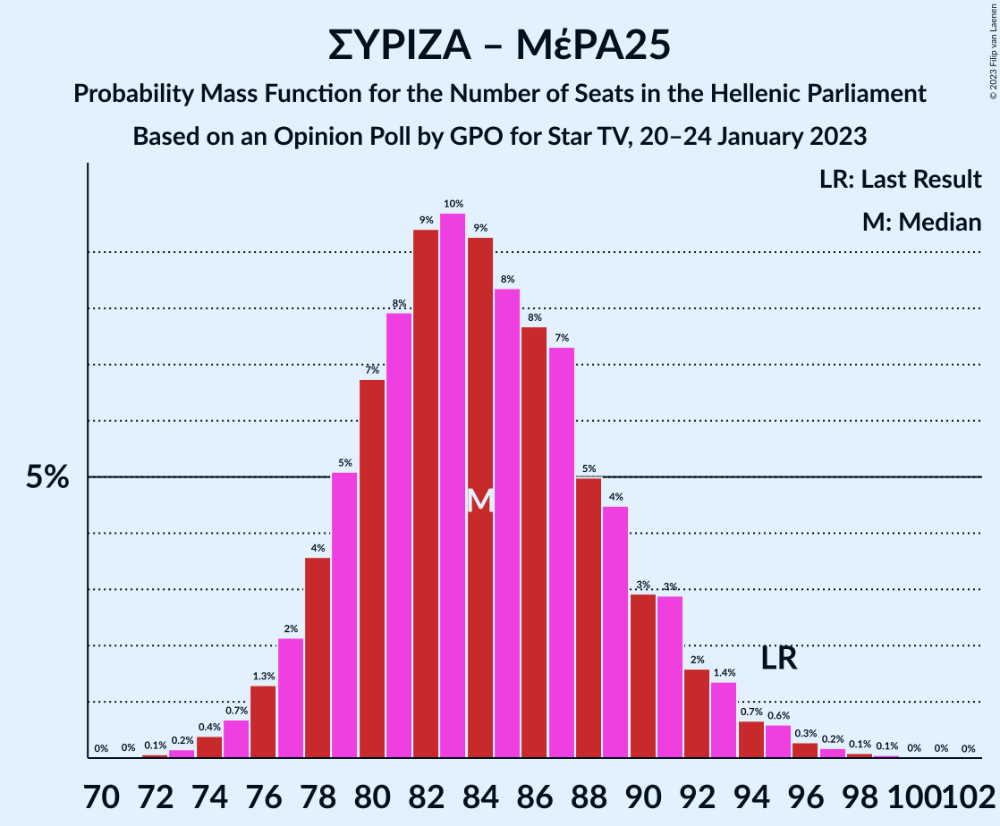

| Number of Seats | Probability | Accumulated | Special Marks |
|:---------------:|:-----------:|:-----------:|:-------------:|
| 72 | 0.1% | 100% |  |
| 73 | 0.2% | 99.9% |  |
| 74 | 0.4% | 99.7% |  |
| 75 | 0.7% | 99.3% |  |
| 76 | 1.3% | 98.7% |  |
| 77 | 2% | 97% |  |
| 78 | 4% | 95% |  |
| 79 | 5% | 92% |  |
| 80 | 7% | 87% |  |
| 81 | 8% | 80% |  |
| 82 | 9% | 72% |  |
| 83 | 10% | 62% | Median |
| 84 | 9% | 53% |  |
| 85 | 8% | 44% |  |
| 86 | 8% | 35% |  |
| 87 | 7% | 27% |  |
| 88 | 5% | 20% |  |
| 89 | 4% | 15% |  |
| 90 | 3% | 11% |  |
| 91 | 3% | 8% |  |
| 92 | 2% | 5% |  |
| 93 | 1.4% | 3% |  |
| 94 | 0.7% | 2% |  |
| 95 | 0.6% | 1.3% | Last Result |
| 96 | 0.3% | 0.7% |  |
| 97 | 0.2% | 0.4% |  |
| 98 | 0.1% | 0.2% |  |
| 99 | 0.1% | 0.1% |  |
| 100 | 0% | 0.1% |  |
| 101 | 0% | 0.1% |  |
| 102 | 0% | 0% |  |

### Συνασπισμός Ριζοσπαστικής Αριστεράς

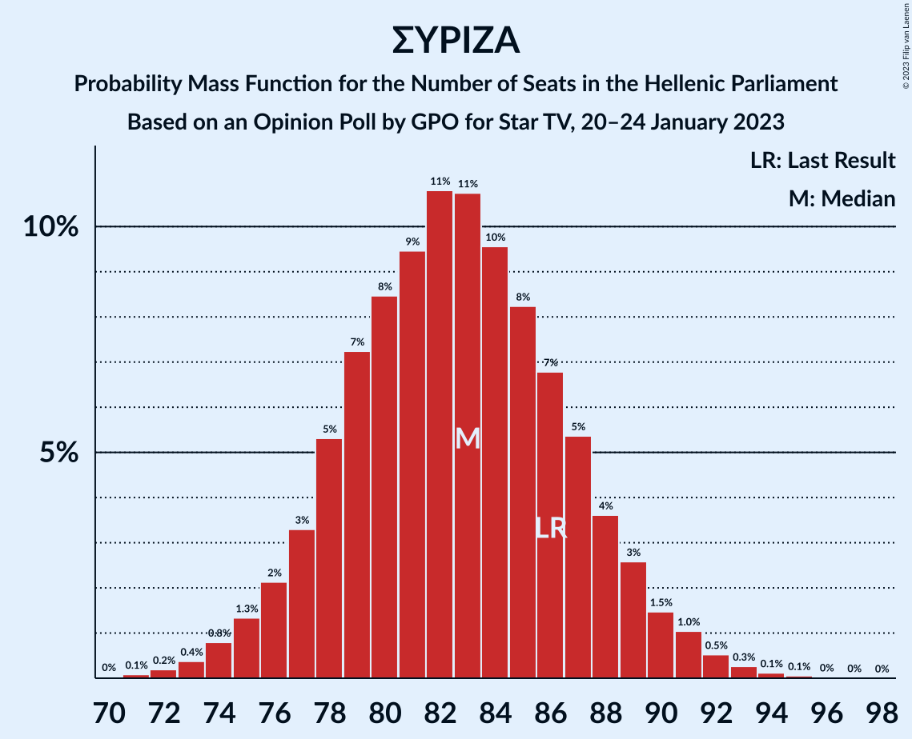

| Number of Seats | Probability | Accumulated | Special Marks |
|:---------------:|:-----------:|:-----------:|:-------------:|
| 70 | 0% | 100% |  |
| 71 | 0.1% | 99.9% |  |
| 72 | 0.2% | 99.9% |  |
| 73 | 0.4% | 99.7% |  |
| 74 | 0.8% | 99.3% |  |
| 75 | 1.3% | 98% |  |
| 76 | 2% | 97% |  |
| 77 | 3% | 95% |  |
| 78 | 5% | 92% |  |
| 79 | 7% | 86% |  |
| 80 | 8% | 79% |  |
| 81 | 9% | 71% |  |
| 82 | 11% | 61% |  |
| 83 | 11% | 50% | Median |
| 84 | 10% | 40% |  |
| 85 | 8% | 30% |  |
| 86 | 7% | 22% | Last Result |
| 87 | 5% | 15% |  |
| 88 | 4% | 10% |  |
| 89 | 3% | 6% |  |
| 90 | 1.5% | 4% |  |
| 91 | 1.0% | 2% |  |
| 92 | 0.5% | 1.0% |  |
| 93 | 0.3% | 0.5% |  |
| 94 | 0.1% | 0.3% |  |
| 95 | 0.1% | 0.1% |  |
| 96 | 0% | 0.1% |  |
| 97 | 0% | 0.1% |  |
| 98 | 0% | 0% |  |

## Technical Information

### Opinion Poll

+ **Polling firm:** GPO
+ **Commissioner(s):** Star TV
+ **Fieldwork period:** 20–24 January 2023

### Calculations

+ **Sample size:** 1200
+ **Simulations done:** 1,048,576
+ **Error estimate:** 0.56%

