# Opinion Poll by Marc for ANT1, 24–31 January 2023

<a href="#voting-intentions">Voting Intentions</a> | <a href="#seats">Seats</a> | <a href="#coalitions">Coalitions</a> | <a href="#technical-information">Technical Information</a>

## Voting Intentions

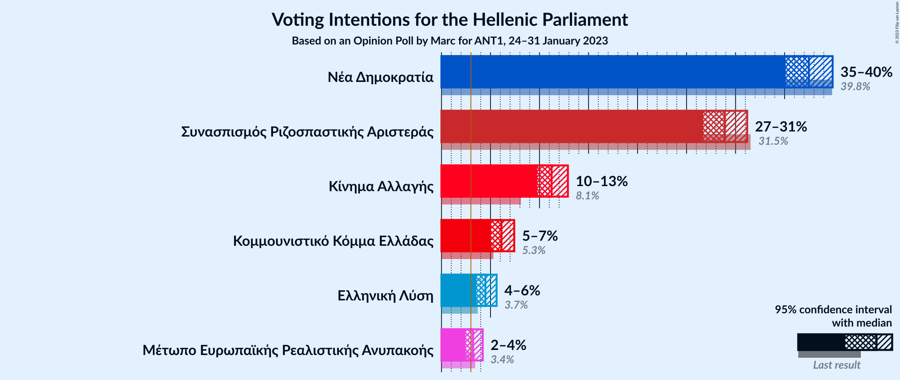

### Confidence Intervals

| Party | Last Result | Poll Result | 80% Confidence Interval | 90% Confidence Interval | 95% Confidence Interval | 99% Confidence Interval |
|:-----:|:-----------:|:-----------:|:-----------------------:|:-----------------------:|:-----------------------:|:-----------------------:|
| Νέα Δημοκρατία | 39.8% | 37.5% | 35.9–39.1% |35.5–39.5% |35.1–39.9% |34.4–40.6% |
| Συνασπισμός Ριζοσπαστικής Αριστεράς | 31.5% | 28.9% | 27.5–30.4% |27.1–30.8% |26.7–31.2% |26.0–31.9% |
| Κίνημα Αλλαγής | 8.1% | 11.2% | 10.3–12.3% |10.0–12.6% |9.8–12.9% |9.3–13.4% |
| Κομμουνιστικό Κόμμα Ελλάδας | 5.3% | 6.1% | 5.4–7.0% |5.2–7.2% |5.0–7.4% |4.7–7.8% |
| Ελληνική Λύση | 3.7% | 4.5% | 3.9–5.2% |3.7–5.4% |3.6–5.6% |3.3–6.0% |
| Μέτωπο Ευρωπαϊκής Ρεαλιστικής Ανυπακοής | 3.4% | 3.2% | 2.7–3.9% |2.6–4.1% |2.5–4.2% |2.2–4.5% |

*Note:* The poll result column reflects the actual value used in the calculations. Published results may vary slightly, and in addition be rounded to fewer digits.

## Seats

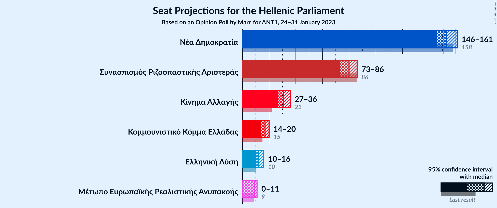

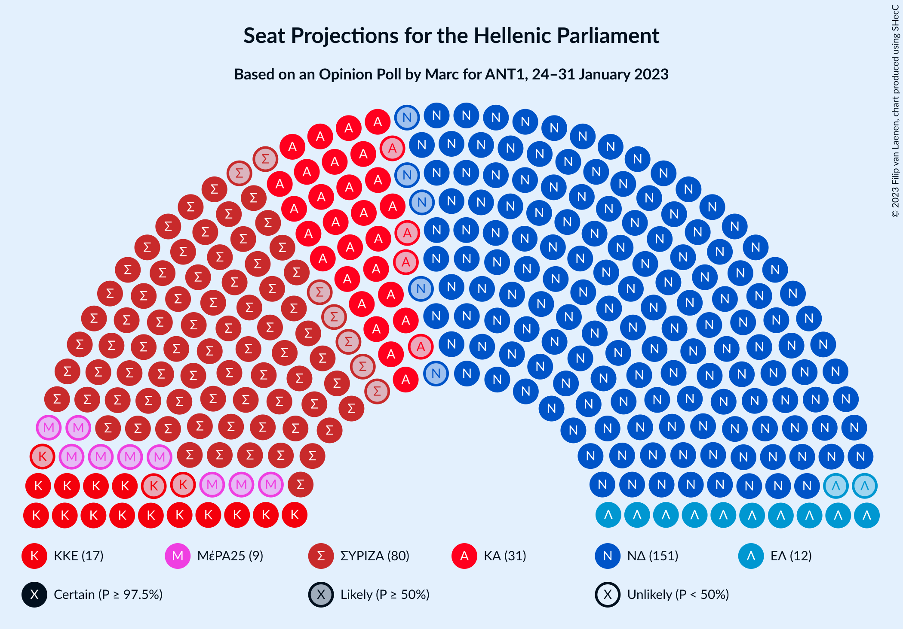

### Confidence Intervals

| Party | Last Result | Median | 80% Confidence Interval | 90% Confidence Interval | 95% Confidence Interval | 99% Confidence Interval |
|:-----:|:-----------:|:------:|:-----------------------:|:-----------------------:|:-----------------------:|:-----------------------:|
| <a href="#νέα-δημοκρατία">Νέα Δημοκρατία</a> | 158 | 153 | 149–158 |147–159 |146–161 |144–163 |
| <a href="#συνασπισμός-ριζοσπαστικής-αριστεράς">Συνασπισμός Ριζοσπαστικής Αριστεράς</a> | 86 | 80 | 75–84 |74–85 |73–86 |71–89 |
| <a href="#κίνημα-αλλαγής">Κίνημα Αλλαγής</a> | 22 | 31 | 28–34 |27–35 |27–36 |26–37 |
| <a href="#κομμουνιστικό-κόμμα-ελλάδας">Κομμουνιστικό Κόμμα Ελλάδας</a> | 15 | 17 | 15–19 |14–20 |14–20 |13–22 |
| <a href="#ελληνική-λύση">Ελληνική Λύση</a> | 10 | 12 | 11–14 |10–15 |10–16 |9–17 |
| <a href="#μέτωπο-ευρωπαϊκής-ρεαλιστικής-ανυπακοής">Μέτωπο Ευρωπαϊκής Ρεαλιστικής Ανυπακοής</a> | 9 | 9 | 0–11 |0–11 |0–11 |0–12 |

### Νέα Δημοκρατία

*For a full overview of the results for this party, see the [Νέα Δημοκρατία](party-νέαδημοκρατία.html) page.*

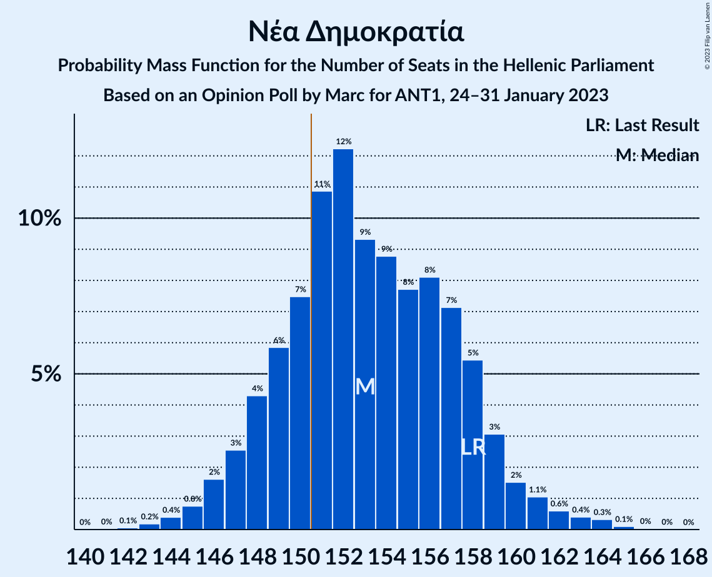

| Number of Seats | Probability | Accumulated | Special Marks |
|:---------------:|:-----------:|:-----------:|:-------------:|
| 142 | 0.1% | 100% |  |
| 143 | 0.2% | 99.9% |  |
| 144 | 0.4% | 99.7% |  |
| 145 | 0.8% | 99.3% |  |
| 146 | 2% | 98.6% |  |
| 147 | 3% | 97% |  |
| 148 | 4% | 94% |  |
| 149 | 6% | 90% |  |
| 150 | 7% | 84% |  |
| 151 | 11% | 77% | Majority |
| 152 | 12% | 66% |  |
| 153 | 9% | 54% | Median |
| 154 | 9% | 44% |  |
| 155 | 8% | 36% |  |
| 156 | 8% | 28% |  |
| 157 | 7% | 20% |  |
| 158 | 5% | 13% | Last Result |
| 159 | 3% | 7% |  |
| 160 | 2% | 4% |  |
| 161 | 1.1% | 3% |  |
| 162 | 0.6% | 1.5% |  |
| 163 | 0.4% | 0.9% |  |
| 164 | 0.3% | 0.5% |  |
| 165 | 0.1% | 0.2% |  |
| 166 | 0% | 0.1% |  |
| 167 | 0% | 0% |  |

### Συνασπισμός Ριζοσπαστικής Αριστεράς

*For a full overview of the results for this party, see the [Συνασπισμός Ριζοσπαστικής Αριστεράς](party-συνασπισμόςριζοσπαστικήςαριστεράς.html) page.*

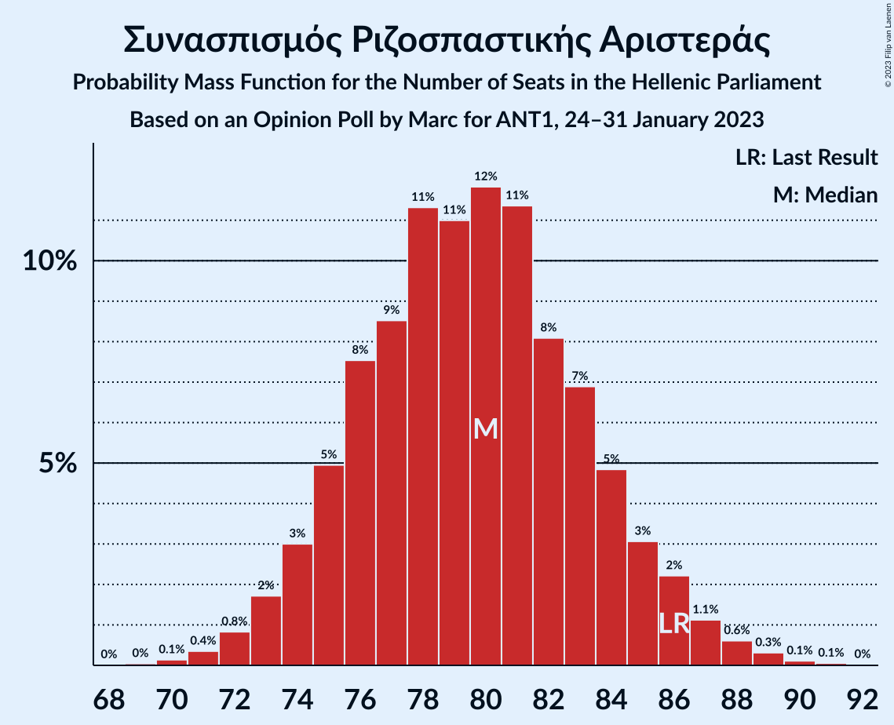

| Number of Seats | Probability | Accumulated | Special Marks |
|:---------------:|:-----------:|:-----------:|:-------------:|
| 69 | 0% | 100% |  |
| 70 | 0.1% | 99.9% |  |
| 71 | 0.4% | 99.8% |  |
| 72 | 0.8% | 99.4% |  |
| 73 | 2% | 98.6% |  |
| 74 | 3% | 97% |  |
| 75 | 5% | 94% |  |
| 76 | 8% | 89% |  |
| 77 | 9% | 81% |  |
| 78 | 11% | 73% |  |
| 79 | 11% | 62% |  |
| 80 | 12% | 51% | Median |
| 81 | 11% | 39% |  |
| 82 | 8% | 27% |  |
| 83 | 7% | 19% |  |
| 84 | 5% | 12% |  |
| 85 | 3% | 8% |  |
| 86 | 2% | 4% | Last Result |
| 87 | 1.1% | 2% |  |
| 88 | 0.6% | 1.1% |  |
| 89 | 0.3% | 0.5% |  |
| 90 | 0.1% | 0.2% |  |
| 91 | 0.1% | 0.1% |  |
| 92 | 0% | 0% |  |

### Κίνημα Αλλαγής

*For a full overview of the results for this party, see the [Κίνημα Αλλαγής](party-κίνημααλλαγής.html) page.*

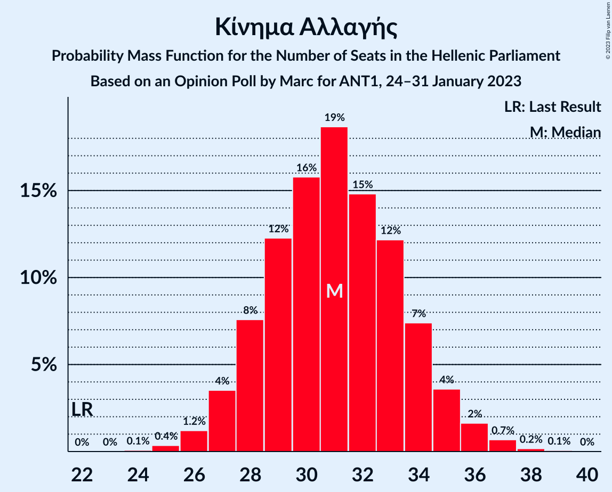

| Number of Seats | Probability | Accumulated | Special Marks |
|:---------------:|:-----------:|:-----------:|:-------------:|
| 22 | 0% | 100% | Last Result |
| 23 | 0% | 100% |  |
| 24 | 0.1% | 100% |  |
| 25 | 0.4% | 99.9% |  |
| 26 | 1.2% | 99.6% |  |
| 27 | 4% | 98% |  |
| 28 | 8% | 95% |  |
| 29 | 12% | 87% |  |
| 30 | 16% | 75% |  |
| 31 | 19% | 59% | Median |
| 32 | 15% | 41% |  |
| 33 | 12% | 26% |  |
| 34 | 7% | 14% |  |
| 35 | 4% | 6% |  |
| 36 | 2% | 3% |  |
| 37 | 0.7% | 0.9% |  |
| 38 | 0.2% | 0.3% |  |
| 39 | 0.1% | 0.1% |  |
| 40 | 0% | 0% |  |

### Κομμουνιστικό Κόμμα Ελλάδας

*For a full overview of the results for this party, see the [Κομμουνιστικό Κόμμα Ελλάδας](party-κομμουνιστικόκόμμαελλάδας.html) page.*

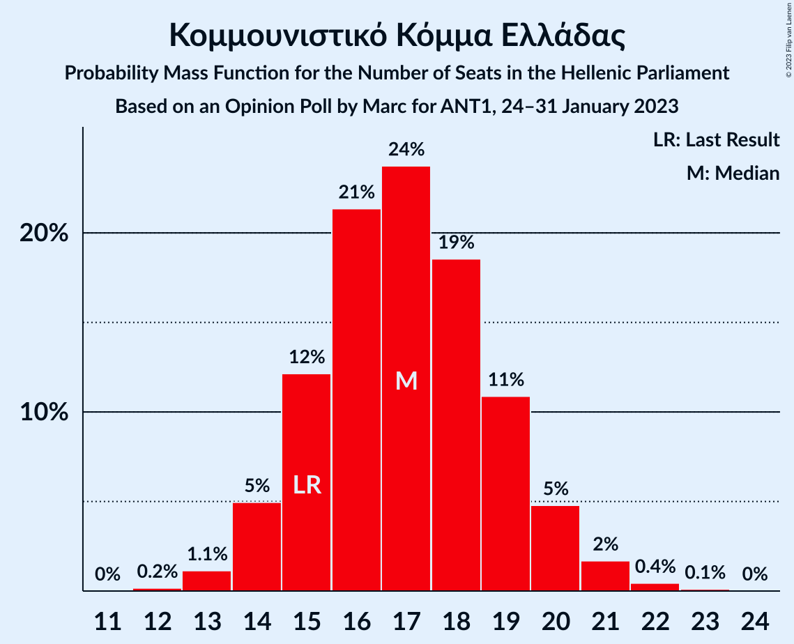

| Number of Seats | Probability | Accumulated | Special Marks |
|:---------------:|:-----------:|:-----------:|:-------------:|
| 12 | 0.2% | 100% |  |
| 13 | 1.1% | 99.8% |  |
| 14 | 5% | 98.7% |  |
| 15 | 12% | 94% | Last Result |
| 16 | 21% | 82% |  |
| 17 | 24% | 60% | Median |
| 18 | 19% | 36% |  |
| 19 | 11% | 18% |  |
| 20 | 5% | 7% |  |
| 21 | 2% | 2% |  |
| 22 | 0.4% | 0.6% |  |
| 23 | 0.1% | 0.1% |  |
| 24 | 0% | 0% |  |

### Ελληνική Λύση

*For a full overview of the results for this party, see the [Ελληνική Λύση](party-ελληνικήλύση.html) page.*

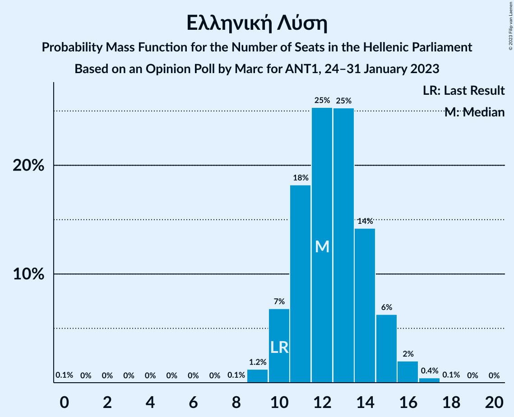

| Number of Seats | Probability | Accumulated | Special Marks |
|:---------------:|:-----------:|:-----------:|:-------------:|
| 0 | 0.1% | 100% |  |
| 1 | 0% | 99.9% |  |
| 2 | 0% | 99.9% |  |
| 3 | 0% | 99.9% |  |
| 4 | 0% | 99.9% |  |
| 5 | 0% | 99.9% |  |
| 6 | 0% | 99.9% |  |
| 7 | 0% | 99.9% |  |
| 8 | 0.1% | 99.9% |  |
| 9 | 1.2% | 99.9% |  |
| 10 | 7% | 98.7% | Last Result |
| 11 | 18% | 92% |  |
| 12 | 25% | 74% | Median |
| 13 | 25% | 48% |  |
| 14 | 14% | 23% |  |
| 15 | 6% | 9% |  |
| 16 | 2% | 3% |  |
| 17 | 0.4% | 0.5% |  |
| 18 | 0.1% | 0.1% |  |
| 19 | 0% | 0% |  |

### Μέτωπο Ευρωπαϊκής Ρεαλιστικής Ανυπακοής

*For a full overview of the results for this party, see the [Μέτωπο Ευρωπαϊκής Ρεαλιστικής Ανυπακοής](party-μέτωποευρωπαϊκήςρεαλιστικήςανυπακοής.html) page.*

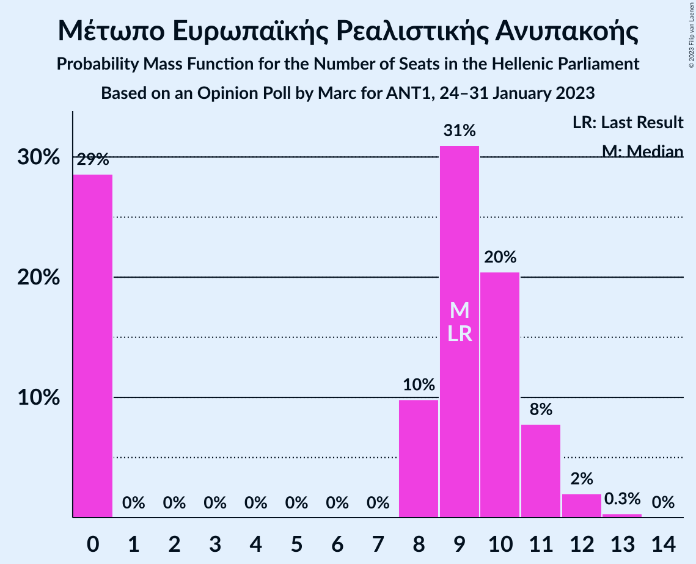

| Number of Seats | Probability | Accumulated | Special Marks |
|:---------------:|:-----------:|:-----------:|:-------------:|
| 0 | 29% | 100% |  |
| 1 | 0% | 71% |  |
| 2 | 0% | 71% |  |
| 3 | 0% | 71% |  |
| 4 | 0% | 71% |  |
| 5 | 0% | 71% |  |
| 6 | 0% | 71% |  |
| 7 | 0% | 71% |  |
| 8 | 10% | 71% |  |
| 9 | 31% | 62% | Last Result, Median |
| 10 | 20% | 31% |  |
| 11 | 8% | 10% |  |
| 12 | 2% | 2% |  |
| 13 | 0.3% | 0.4% |  |
| 14 | 0% | 0% |  |

## Coalitions

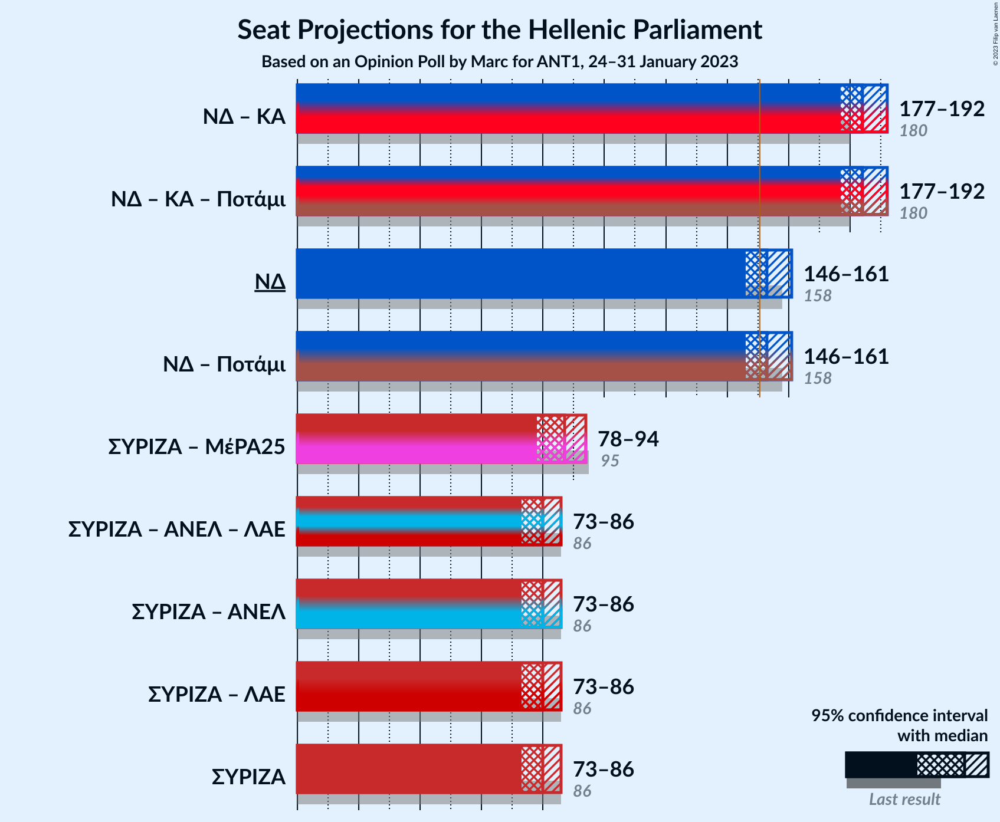

### Confidence Intervals

| Coalition | Last Result | Median | Majority? | 80% Confidence Interval | 90% Confidence Interval | 95% Confidence Interval | 99% Confidence Interval |
|:---------:|:-----------:|:------:|:---------:|:-----------------------:|:-----------------------:|:-----------------------:|:-----------------------:|
| Νέα Δημοκρατία – Κίνημα Αλλαγής | 180 | 184 | 100% | 179–189 | 178–191 | 177–192 | 175–195 |
| Νέα Δημοκρατία | 158 | 153 | 77% | 149–158 | 147–159 | 146–161 | 144–163 |
| Συνασπισμός Ριζοσπαστικής Αριστεράς – Μέτωπο Ευρωπαϊκής Ρεαλιστικής Ανυπακοής | 95 | 87 | 0% | 80–91 | 79–93 | 78–94 | 75–96 |
| Συνασπισμός Ριζοσπαστικής Αριστεράς | 86 | 80 | 0% | 75–84 | 74–85 | 73–86 | 71–89 |

### Νέα Δημοκρατία – Κίνημα Αλλαγής

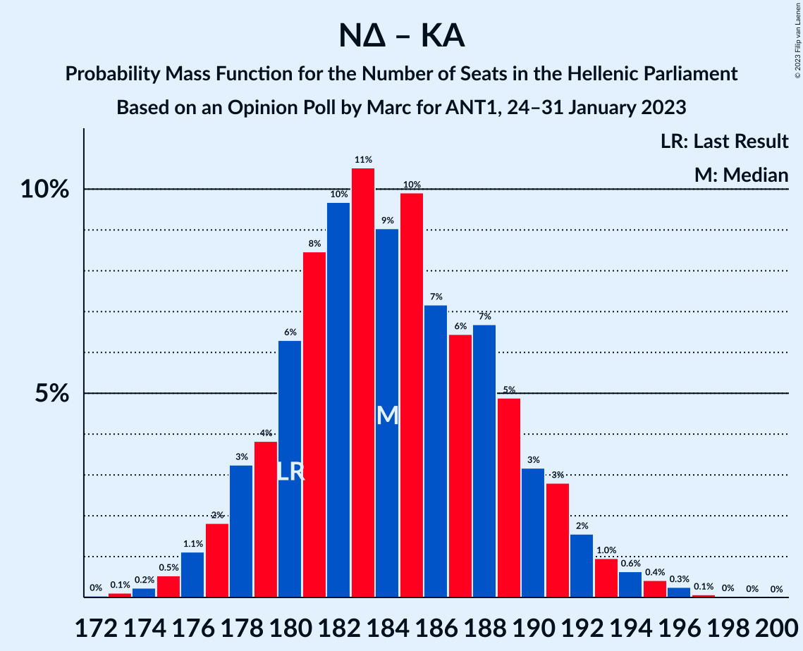

| Number of Seats | Probability | Accumulated | Special Marks |
|:---------------:|:-----------:|:-----------:|:-------------:|
| 172 | 0% | 100% |  |
| 173 | 0.1% | 99.9% |  |
| 174 | 0.2% | 99.8% |  |
| 175 | 0.5% | 99.6% |  |
| 176 | 1.1% | 99.1% |  |
| 177 | 2% | 98% |  |
| 178 | 3% | 96% |  |
| 179 | 4% | 93% |  |
| 180 | 6% | 89% | Last Result |
| 181 | 8% | 83% |  |
| 182 | 10% | 74% |  |
| 183 | 11% | 65% |  |
| 184 | 9% | 54% | Median |
| 185 | 10% | 45% |  |
| 186 | 7% | 35% |  |
| 187 | 6% | 28% |  |
| 188 | 7% | 22% |  |
| 189 | 5% | 15% |  |
| 190 | 3% | 10% |  |
| 191 | 3% | 7% |  |
| 192 | 2% | 4% |  |
| 193 | 1.0% | 2% |  |
| 194 | 0.6% | 1.4% |  |
| 195 | 0.4% | 0.8% |  |
| 196 | 0.3% | 0.4% |  |
| 197 | 0.1% | 0.1% |  |
| 198 | 0% | 0.1% |  |
| 199 | 0% | 0% |  |

### Νέα Δημοκρατία

| Number of Seats | Probability | Accumulated | Special Marks |
|:---------------:|:-----------:|:-----------:|:-------------:|
| 142 | 0.1% | 100% |  |
| 143 | 0.2% | 99.9% |  |
| 144 | 0.4% | 99.7% |  |
| 145 | 0.8% | 99.3% |  |
| 146 | 2% | 98.6% |  |
| 147 | 3% | 97% |  |
| 148 | 4% | 94% |  |
| 149 | 6% | 90% |  |
| 150 | 7% | 84% |  |
| 151 | 11% | 77% | Majority |
| 152 | 12% | 66% |  |
| 153 | 9% | 54% | Median |
| 154 | 9% | 44% |  |
| 155 | 8% | 36% |  |
| 156 | 8% | 28% |  |
| 157 | 7% | 20% |  |
| 158 | 5% | 13% | Last Result |
| 159 | 3% | 7% |  |
| 160 | 2% | 4% |  |
| 161 | 1.1% | 3% |  |
| 162 | 0.6% | 1.5% |  |
| 163 | 0.4% | 0.9% |  |
| 164 | 0.3% | 0.5% |  |
| 165 | 0.1% | 0.2% |  |
| 166 | 0% | 0.1% |  |
| 167 | 0% | 0% |  |

### Συνασπισμός Ριζοσπαστικής Αριστεράς – Μέτωπο Ευρωπαϊκής Ρεαλιστικής Ανυπακοής

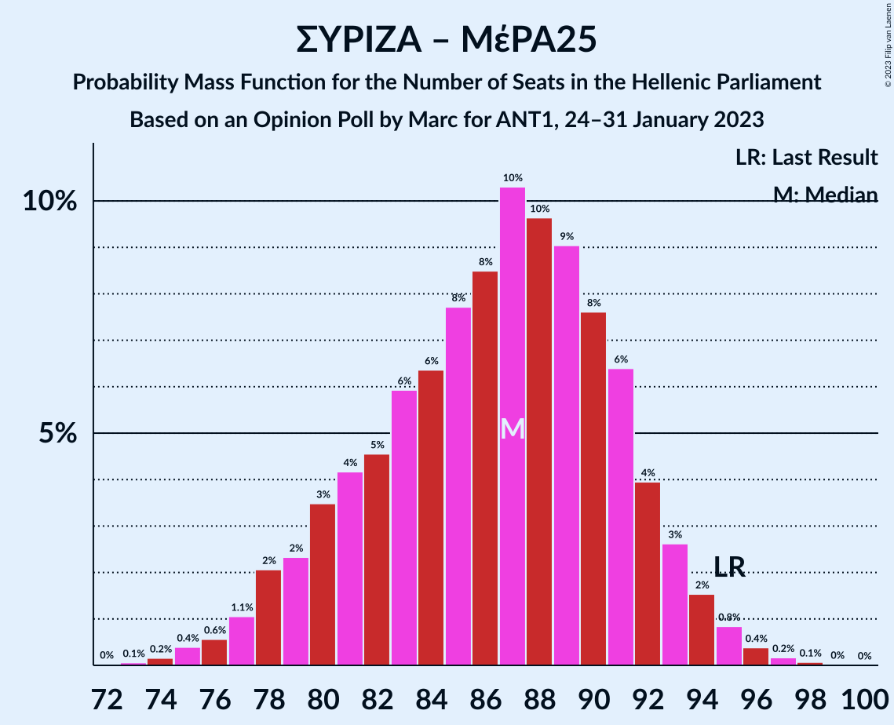

| Number of Seats | Probability | Accumulated | Special Marks |
|:---------------:|:-----------:|:-----------:|:-------------:|
| 73 | 0.1% | 100% |  |
| 74 | 0.2% | 99.9% |  |
| 75 | 0.4% | 99.7% |  |
| 76 | 0.6% | 99.3% |  |
| 77 | 1.1% | 98.8% |  |
| 78 | 2% | 98% |  |
| 79 | 2% | 96% |  |
| 80 | 3% | 93% |  |
| 81 | 4% | 90% |  |
| 82 | 5% | 86% |  |
| 83 | 6% | 81% |  |
| 84 | 6% | 75% |  |
| 85 | 8% | 69% |  |
| 86 | 8% | 61% |  |
| 87 | 10% | 53% |  |
| 88 | 10% | 42% |  |
| 89 | 9% | 33% | Median |
| 90 | 8% | 24% |  |
| 91 | 6% | 16% |  |
| 92 | 4% | 10% |  |
| 93 | 3% | 6% |  |
| 94 | 2% | 3% |  |
| 95 | 0.8% | 2% | Last Result |
| 96 | 0.4% | 0.7% |  |
| 97 | 0.2% | 0.3% |  |
| 98 | 0.1% | 0.1% |  |
| 99 | 0% | 0% |  |

### Συνασπισμός Ριζοσπαστικής Αριστεράς

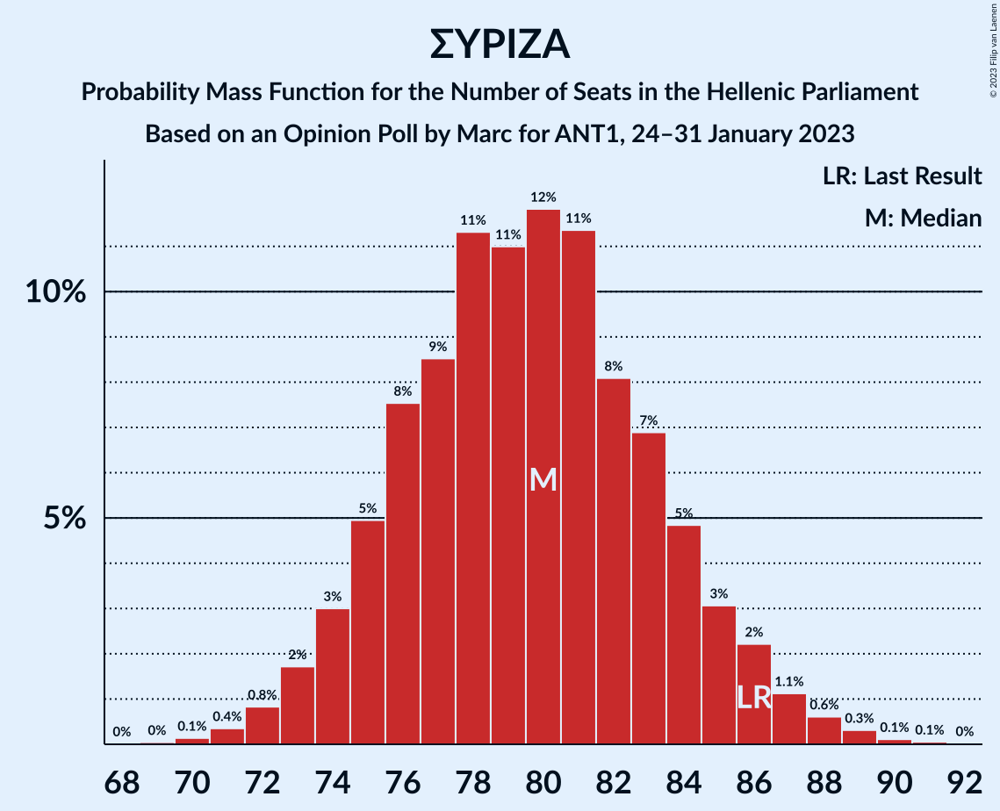

| Number of Seats | Probability | Accumulated | Special Marks |
|:---------------:|:-----------:|:-----------:|:-------------:|
| 69 | 0% | 100% |  |
| 70 | 0.1% | 99.9% |  |
| 71 | 0.4% | 99.8% |  |
| 72 | 0.8% | 99.4% |  |
| 73 | 2% | 98.6% |  |
| 74 | 3% | 97% |  |
| 75 | 5% | 94% |  |
| 76 | 8% | 89% |  |
| 77 | 9% | 81% |  |
| 78 | 11% | 73% |  |
| 79 | 11% | 62% |  |
| 80 | 12% | 51% | Median |
| 81 | 11% | 39% |  |
| 82 | 8% | 27% |  |
| 83 | 7% | 19% |  |
| 84 | 5% | 12% |  |
| 85 | 3% | 8% |  |
| 86 | 2% | 4% | Last Result |
| 87 | 1.1% | 2% |  |
| 88 | 0.6% | 1.1% |  |
| 89 | 0.3% | 0.5% |  |
| 90 | 0.1% | 0.2% |  |
| 91 | 0.1% | 0.1% |  |
| 92 | 0% | 0% |  |

## Technical Information

### Opinion Poll

+ **Polling firm:** Marc
+ **Commissioner(s):** ANT1
+ **Fieldwork period:** 24–31 January 2023

### Calculations

+ **Sample size:** 1585
+ **Simulations done:** 1,048,576
+ **Error estimate:** 1.11%

