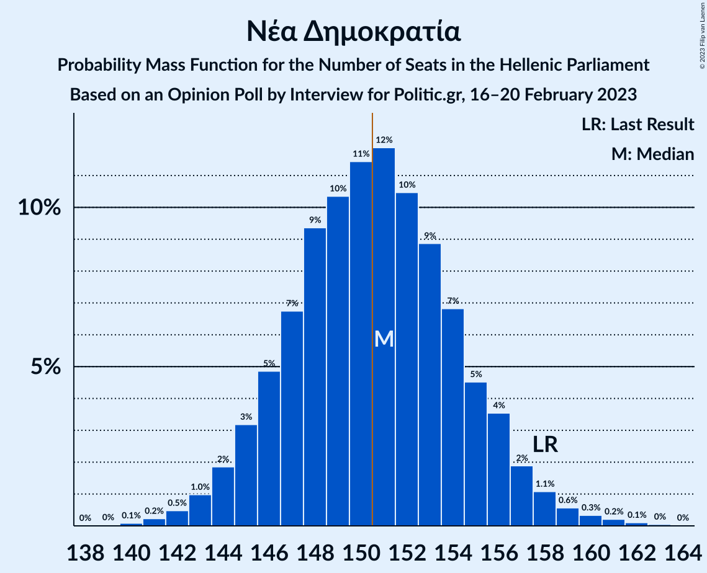

# Opinion Poll by Interview for Politic.gr, 16–20 February 2023

<a href="#voting-intentions">Voting Intentions</a> | <a href="#seats">Seats</a> | <a href="#coalitions">Coalitions</a> | <a href="#technical-information">Technical Information</a>

## Voting Intentions

### Confidence Intervals

| Party | Last Result | Poll Result | 80% Confidence Interval | 90% Confidence Interval | 95% Confidence Interval | 99% Confidence Interval |
|:-----:|:-----------:|:-----------:|:-----------------------:|:-----------------------:|:-----------------------:|:-----------------------:|
| Νέα Δημοκρατία | 39.8% | 36.6% | 35.0–38.2% |34.6–38.7% |34.2–39.1% |33.5–39.9% |
| Συνασπισμός Ριζοσπαστικής Αριστεράς | 31.5% | 29.2% | 27.7–30.7% |27.3–31.1% |26.9–31.5% |26.2–32.3% |
| Κίνημα Αλλαγής | 8.1% | 11.0% | 10.0–12.1% |9.8–12.5% |9.5–12.7% |9.1–13.3% |
| Κομμουνιστικό Κόμμα Ελλάδας | 5.3% | 5.5% | 4.8–6.4% |4.6–6.6% |4.5–6.8% |4.2–7.2% |
| Ελληνική Λύση | 3.7% | 4.9% | 4.3–5.7% |4.1–5.9% |3.9–6.1% |3.6–6.5% |
| Μέτωπο Ευρωπαϊκής Ρεαλιστικής Ανυπακοής | 3.4% | 3.7% | 3.2–4.4% |3.0–4.6% |2.9–4.8% |2.6–5.2% |

*Note:* The poll result column reflects the actual value used in the calculations. Published results may vary slightly, and in addition be rounded to fewer digits.

## Seats

### Confidence Intervals

| Party | Last Result | Median | 80% Confidence Interval | 90% Confidence Interval | 95% Confidence Interval | 99% Confidence Interval |
|:-----:|:-----------:|:------:|:-----------------------:|:-----------------------:|:-----------------------:|:-----------------------:|
| <a href="#νέα-δημοκρατία">Νέα Δημοκρατία</a> | 158 | 151 | 146–155 |145–156 |144–157 |142–160 |
| <a href="#συνασπισμός-ριζοσπαστικής-αριστεράς">Συνασπισμός Ριζοσπαστικής Αριστεράς</a> | 86 | 80 | 76–84 |75–86 |74–87 |72–89 |
| <a href="#κίνημα-αλλαγής">Κίνημα Αλλαγής</a> | 22 | 30 | 28–33 |27–34 |26–35 |25–36 |
| <a href="#κομμουνιστικό-κόμμα-ελλάδας">Κομμουνιστικό Κόμμα Ελλάδας</a> | 15 | 15 | 13–17 |13–18 |12–19 |11–20 |
| <a href="#ελληνική-λύση">Ελληνική Λύση</a> | 10 | 14 | 12–16 |11–16 |11–17 |10–18 |
| <a href="#μέτωπο-ευρωπαϊκής-ρεαλιστικής-ανυπακοής">Μέτωπο Ευρωπαϊκής Ρεαλιστικής Ανυπακοής</a> | 9 | 10 | 9–12 |0–13 |0–13 |0–14 |

### Νέα Δημοκρατία

*For a full overview of the results for this party, see the [Νέα Δημοκρατία](party-νέαδημοκρατία.html) page.*

| Number of Seats | Probability | Accumulated | Special Marks |
|:---------------:|:-----------:|:-----------:|:-------------:|
| 139 | 0% | 100% |  |
| 140 | 0.1% | 99.9% |  |
| 141 | 0.2% | 99.9% |  |
| 142 | 0.5% | 99.6% |  |
| 143 | 1.0% | 99.1% |  |
| 144 | 2% | 98% |  |
| 145 | 3% | 96% |  |
| 146 | 5% | 93% |  |
| 147 | 7% | 88% |  |
| 148 | 9% | 82% |  |
| 149 | 10% | 72% |  |
| 150 | 11% | 62% |  |
| 151 | 12% | 50% | Median, Majority |
| 152 | 10% | 38% |  |
| 153 | 9% | 28% |  |
| 154 | 7% | 19% |  |
| 155 | 5% | 12% |  |
| 156 | 4% | 8% |  |
| 157 | 2% | 4% |  |
| 158 | 1.1% | 2% | Last Result |
| 159 | 0.6% | 1.3% |  |
| 160 | 0.3% | 0.7% |  |
| 161 | 0.2% | 0.4% |  |
| 162 | 0.1% | 0.2% |  |
| 163 | 0% | 0.1% |  |
| 164 | 0% | 0% |  |

### Συνασπισμός Ριζοσπαστικής Αριστεράς

*For a full overview of the results for this party, see the [Συνασπισμός Ριζοσπαστικής Αριστεράς](party-συνασπισμόςριζοσπαστικήςαριστεράς.html) page.*

| Number of Seats | Probability | Accumulated | Special Marks |
|:---------------:|:-----------:|:-----------:|:-------------:|
| 70 | 0.1% | 100% |  |
| 71 | 0.2% | 99.9% |  |
| 72 | 0.5% | 99.7% |  |
| 73 | 1.0% | 99.2% |  |
| 74 | 2% | 98% |  |
| 75 | 4% | 96% |  |
| 76 | 6% | 93% |  |
| 77 | 8% | 87% |  |
| 78 | 10% | 79% |  |
| 79 | 12% | 69% |  |
| 80 | 12% | 57% | Median |
| 81 | 13% | 45% |  |
| 82 | 10% | 33% |  |
| 83 | 8% | 23% |  |
| 84 | 6% | 15% |  |
| 85 | 4% | 9% |  |
| 86 | 2% | 5% | Last Result |
| 87 | 1.4% | 3% |  |
| 88 | 0.8% | 1.4% |  |
| 89 | 0.3% | 0.6% |  |
| 90 | 0.2% | 0.3% |  |
| 91 | 0.1% | 0.1% |  |
| 92 | 0% | 0.1% |  |
| 93 | 0% | 0% |  |

### Κίνημα Αλλαγής

*For a full overview of the results for this party, see the [Κίνημα Αλλαγής](party-κίνημααλλαγής.html) page.*

| Number of Seats | Probability | Accumulated | Special Marks |
|:---------------:|:-----------:|:-----------:|:-------------:|
| 22 | 0% | 100% | Last Result |
| 23 | 0% | 100% |  |
| 24 | 0.2% | 100% |  |
| 25 | 0.8% | 99.7% |  |
| 26 | 2% | 98.9% |  |
| 27 | 6% | 97% |  |
| 28 | 10% | 91% |  |
| 29 | 15% | 80% |  |
| 30 | 17% | 65% | Median |
| 31 | 17% | 48% |  |
| 32 | 13% | 31% |  |
| 33 | 10% | 18% |  |
| 34 | 5% | 8% |  |
| 35 | 2% | 4% |  |
| 36 | 0.9% | 1.4% |  |
| 37 | 0.3% | 0.5% |  |
| 38 | 0.1% | 0.1% |  |
| 39 | 0% | 0% |  |

### Κομμουνιστικό Κόμμα Ελλάδας

*For a full overview of the results for this party, see the [Κομμουνιστικό Κόμμα Ελλάδας](party-κομμουνιστικόκόμμαελλάδας.html) page.*

| Number of Seats | Probability | Accumulated | Special Marks |
|:---------------:|:-----------:|:-----------:|:-------------:|
| 10 | 0% | 100% |  |
| 11 | 0.5% | 99.9% |  |
| 12 | 3% | 99.4% |  |
| 13 | 10% | 97% |  |
| 14 | 19% | 86% |  |
| 15 | 25% | 68% | Last Result, Median |
| 16 | 20% | 43% |  |
| 17 | 14% | 22% |  |
| 18 | 6% | 9% |  |
| 19 | 2% | 3% |  |
| 20 | 0.6% | 0.8% |  |
| 21 | 0.1% | 0.2% |  |
| 22 | 0% | 0% |  |

### Ελληνική Λύση

*For a full overview of the results for this party, see the [Ελληνική Λύση](party-ελληνικήλύση.html) page.*

| Number of Seats | Probability | Accumulated | Special Marks |
|:---------------:|:-----------:|:-----------:|:-------------:|
| 9 | 0.1% | 100% |  |
| 10 | 1.2% | 99.8% | Last Result |
| 11 | 6% | 98.7% |  |
| 12 | 16% | 93% |  |
| 13 | 23% | 76% |  |
| 14 | 25% | 54% | Median |
| 15 | 17% | 29% |  |
| 16 | 7% | 11% |  |
| 17 | 3% | 4% |  |
| 18 | 0.9% | 1.1% |  |
| 19 | 0.1% | 0.2% |  |
| 20 | 0% | 0% |  |

### Μέτωπο Ευρωπαϊκής Ρεαλιστικής Ανυπακοής

*For a full overview of the results for this party, see the [Μέτωπο Ευρωπαϊκής Ρεαλιστικής Ανυπακοής](party-μέτωποευρωπαϊκήςρεαλιστικήςανυπακοής.html) page.*

| Number of Seats | Probability | Accumulated | Special Marks |
|:---------------:|:-----------:|:-----------:|:-------------:|
| 0 | 5% | 100% |  |
| 1 | 0% | 95% |  |
| 2 | 0% | 95% |  |
| 3 | 0% | 95% |  |
| 4 | 0% | 95% |  |
| 5 | 0% | 95% |  |
| 6 | 0% | 95% |  |
| 7 | 0% | 95% |  |
| 8 | 3% | 95% |  |
| 9 | 19% | 92% | Last Result |
| 10 | 28% | 73% | Median |
| 11 | 24% | 45% |  |
| 12 | 14% | 21% |  |
| 13 | 5% | 7% |  |
| 14 | 1.3% | 2% |  |
| 15 | 0.2% | 0.3% |  |
| 16 | 0% | 0% |  |

## Coalitions

### Confidence Intervals

| Coalition | Last Result | Median | Majority? | 80% Confidence Interval | 90% Confidence Interval | 95% Confidence Interval | 99% Confidence Interval |
|:---------:|:-----------:|:------:|:---------:|:-----------------------:|:-----------------------:|:-----------------------:|:-----------------------:|
| Νέα Δημοκρατία – Κίνημα Αλλαγής | 180 | 181 | 100% | 177–186 | 175–187 | 174–188 | 172–191 |
| Νέα Δημοκρατία | 158 | 151 | 50% | 146–155 | 145–156 | 144–157 | 142–160 |
| Συνασπισμός Ριζοσπαστικής Αριστεράς – Μέτωπο Ευρωπαϊκής Ρεαλιστικής Ανυπακοής | 95 | 90 | 0% | 86–95 | 84–96 | 82–97 | 79–99 |
| Συνασπισμός Ριζοσπαστικής Αριστεράς | 86 | 80 | 0% | 76–84 | 75–86 | 74–87 | 72–89 |

### Νέα Δημοκρατία – Κίνημα Αλλαγής

| Number of Seats | Probability | Accumulated | Special Marks |
|:---------------:|:-----------:|:-----------:|:-------------:|
| 169 | 0% | 100% |  |
| 170 | 0.1% | 99.9% |  |
| 171 | 0.2% | 99.9% |  |
| 172 | 0.4% | 99.6% |  |
| 173 | 0.8% | 99.2% |  |
| 174 | 2% | 98% |  |
| 175 | 3% | 97% |  |
| 176 | 4% | 94% |  |
| 177 | 7% | 90% |  |
| 178 | 8% | 83% |  |
| 179 | 9% | 75% |  |
| 180 | 11% | 66% | Last Result |
| 181 | 12% | 55% | Median |
| 182 | 11% | 43% |  |
| 183 | 9% | 32% |  |
| 184 | 7% | 23% |  |
| 185 | 6% | 17% |  |
| 186 | 5% | 10% |  |
| 187 | 2% | 6% |  |
| 188 | 2% | 4% |  |
| 189 | 1.1% | 2% |  |
| 190 | 0.5% | 1.3% |  |
| 191 | 0.3% | 0.8% |  |
| 192 | 0.3% | 0.5% |  |
| 193 | 0.1% | 0.2% |  |
| 194 | 0.1% | 0.1% |  |
| 195 | 0% | 0.1% |  |
| 196 | 0% | 0% |  |

### Νέα Δημοκρατία

| Number of Seats | Probability | Accumulated | Special Marks |
|:---------------:|:-----------:|:-----------:|:-------------:|
| 139 | 0% | 100% |  |
| 140 | 0.1% | 99.9% |  |
| 141 | 0.2% | 99.9% |  |
| 142 | 0.5% | 99.6% |  |
| 143 | 1.0% | 99.1% |  |
| 144 | 2% | 98% |  |
| 145 | 3% | 96% |  |
| 146 | 5% | 93% |  |
| 147 | 7% | 88% |  |
| 148 | 9% | 82% |  |
| 149 | 10% | 72% |  |
| 150 | 11% | 62% |  |
| 151 | 12% | 50% | Median, Majority |
| 152 | 10% | 38% |  |
| 153 | 9% | 28% |  |
| 154 | 7% | 19% |  |
| 155 | 5% | 12% |  |
| 156 | 4% | 8% |  |
| 157 | 2% | 4% |  |
| 158 | 1.1% | 2% | Last Result |
| 159 | 0.6% | 1.3% |  |
| 160 | 0.3% | 0.7% |  |
| 161 | 0.2% | 0.4% |  |
| 162 | 0.1% | 0.2% |  |
| 163 | 0% | 0.1% |  |
| 164 | 0% | 0% |  |

### Συνασπισμός Ριζοσπαστικής Αριστεράς – Μέτωπο Ευρωπαϊκής Ρεαλιστικής Ανυπακοής

| Number of Seats | Probability | Accumulated | Special Marks |
|:---------------:|:-----------:|:-----------:|:-------------:|
| 76 | 0% | 100% |  |
| 77 | 0.1% | 99.9% |  |
| 78 | 0.1% | 99.8% |  |
| 79 | 0.3% | 99.7% |  |
| 80 | 0.4% | 99.4% |  |
| 81 | 0.7% | 99.0% |  |
| 82 | 0.9% | 98% |  |
| 83 | 1.3% | 97% |  |
| 84 | 2% | 96% |  |
| 85 | 3% | 93% |  |
| 86 | 6% | 90% |  |
| 87 | 7% | 85% |  |
| 88 | 9% | 78% |  |
| 89 | 10% | 69% |  |
| 90 | 11% | 58% | Median |
| 91 | 13% | 48% |  |
| 92 | 10% | 35% |  |
| 93 | 9% | 25% |  |
| 94 | 6% | 17% |  |
| 95 | 4% | 10% | Last Result |
| 96 | 3% | 6% |  |
| 97 | 2% | 3% |  |
| 98 | 0.8% | 2% |  |
| 99 | 0.4% | 0.7% |  |
| 100 | 0.2% | 0.3% |  |
| 101 | 0.1% | 0.1% |  |
| 102 | 0% | 0% |  |

### Συνασπισμός Ριζοσπαστικής Αριστεράς

| Number of Seats | Probability | Accumulated | Special Marks |
|:---------------:|:-----------:|:-----------:|:-------------:|
| 70 | 0.1% | 100% |  |
| 71 | 0.2% | 99.9% |  |
| 72 | 0.5% | 99.7% |  |
| 73 | 1.0% | 99.2% |  |
| 74 | 2% | 98% |  |
| 75 | 4% | 96% |  |
| 76 | 6% | 93% |  |
| 77 | 8% | 87% |  |
| 78 | 10% | 79% |  |
| 79 | 12% | 69% |  |
| 80 | 12% | 57% | Median |
| 81 | 13% | 45% |  |
| 82 | 10% | 33% |  |
| 83 | 8% | 23% |  |
| 84 | 6% | 15% |  |
| 85 | 4% | 9% |  |
| 86 | 2% | 5% | Last Result |
| 87 | 1.4% | 3% |  |
| 88 | 0.8% | 1.4% |  |
| 89 | 0.3% | 0.6% |  |
| 90 | 0.2% | 0.3% |  |
| 91 | 0.1% | 0.1% |  |
| 92 | 0% | 0.1% |  |
| 93 | 0% | 0% |  |

## Technical Information

### Opinion Poll

+ **Polling firm:** Interview
+ **Commissioner(s):** Politic.gr
+ **Fieldwork period:** 16–20 February 2023

### Calculations

+ **Sample size:** 1505
+ **Simulations done:** 1,048,576
+ **Error estimate:** 0.46%

