# Opinion Poll by MRB for Open TV, 6–13 March 2023

<a href="#voting-intentions">Voting Intentions</a> | <a href="#seats">Seats</a> | <a href="#coalitions">Coalitions</a> | <a href="#technical-information">Technical Information</a>

## Voting Intentions

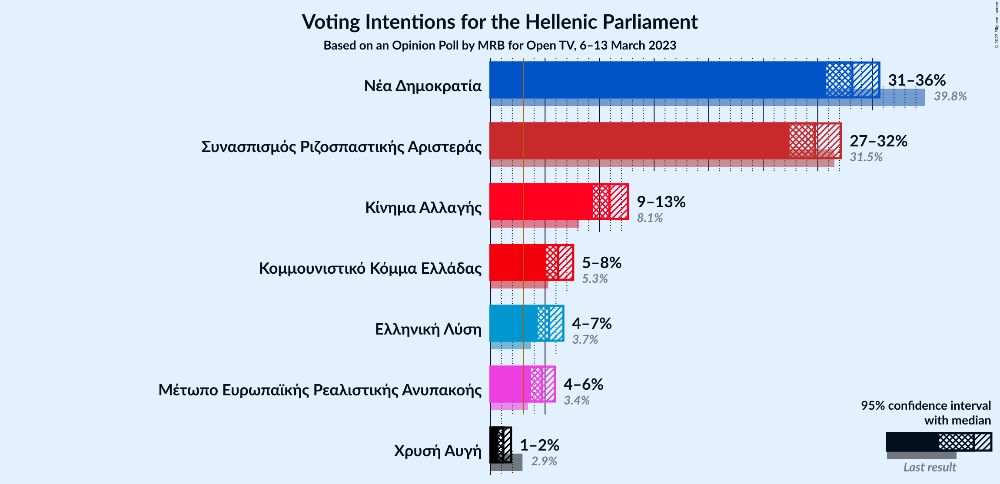

### Confidence Intervals

| Party | Last Result | Poll Result | 80% Confidence Interval | 90% Confidence Interval | 95% Confidence Interval | 99% Confidence Interval |
|:-----:|:-----------:|:-----------:|:-----------------------:|:-----------------------:|:-----------------------:|:-----------------------:|
| Νέα Δημοκρατία | 39.8% | 33.2% | 31.6–34.8% |31.2–35.3% |30.8–35.7% |30.1–36.4% |
| Συνασπισμός Ριζοσπαστικής Αριστεράς | 31.5% | 29.7% | 28.2–31.3% |27.8–31.7% |27.4–32.1% |26.7–32.9% |
| Κίνημα Αλλαγής | 8.1% | 10.9% | 9.9–12.0% |9.6–12.3% |9.4–12.6% |8.9–13.2% |
| Κομμουνιστικό Κόμμα Ελλάδας | 5.3% | 6.2% | 5.5–7.1% |5.2–7.3% |5.1–7.6% |4.7–8.0% |
| Ελληνική Λύση | 3.7% | 5.4% | 4.7–6.2% |4.5–6.5% |4.3–6.7% |4.0–7.1% |
| Μέτωπο Ευρωπαϊκής Ρεαλιστικής Ανυπακοής | 3.4% | 4.7% | 4.0–5.5% |3.9–5.7% |3.7–5.9% |3.4–6.3% |
| Χρυσή Αυγή | 2.9% | 1.2% | 0.9–1.6% |0.8–1.8% |0.7–1.9% |0.6–2.1% |

*Note:* The poll result column reflects the actual value used in the calculations. Published results may vary slightly, and in addition be rounded to fewer digits.

## Seats

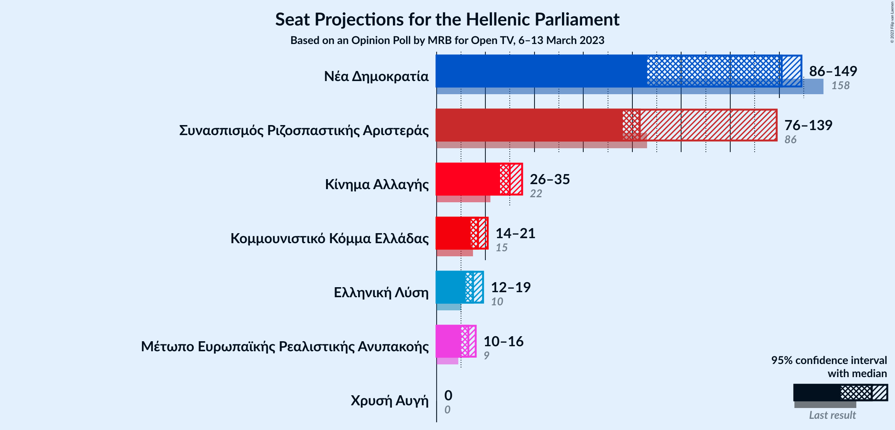

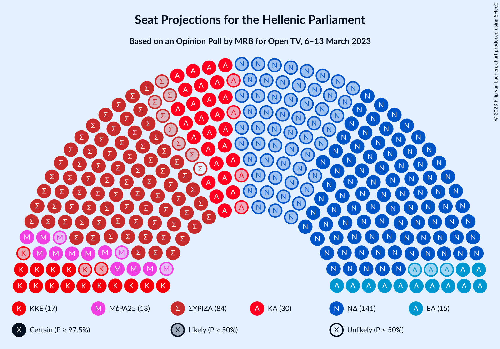

### Confidence Intervals

| Party | Last Result | Median | 80% Confidence Interval | 90% Confidence Interval | 95% Confidence Interval | 99% Confidence Interval |
|:-----:|:-----------:|:------:|:-----------------------:|:-----------------------:|:-----------------------:|:-----------------------:|
| <a href="#νέα-δημοκρατία">Νέα Δημοκρατία</a> | 158 | 141 | 137–146 |88–147 |86–149 |84–151 |
| <a href="#συνασπισμός-ριζοσπαστικής-αριστεράς">Συνασπισμός Ριζοσπαστικής Αριστεράς</a> | 86 | 83 | 78–86 |77–136 |76–139 |75–141 |
| <a href="#κίνημα-αλλαγής">Κίνημα Αλλαγής</a> | 22 | 30 | 27–33 |27–34 |26–35 |25–36 |
| <a href="#κομμουνιστικό-κόμμα-ελλάδας">Κομμουνιστικό Κόμμα Ελλάδας</a> | 15 | 17 | 15–20 |15–20 |14–21 |13–22 |
| <a href="#ελληνική-λύση">Ελληνική Λύση</a> | 10 | 15 | 13–17 |12–18 |12–19 |11–20 |
| <a href="#μέτωπο-ευρωπαϊκής-ρεαλιστικής-ανυπακοής">Μέτωπο Ευρωπαϊκής Ρεαλιστικής Ανυπακοής</a> | 9 | 13 | 11–15 |11–16 |10–16 |10–17 |
| <a href="#χρυσή-αυγή">Χρυσή Αυγή</a> | 0 | 0 | 0 |0 |0 |0 |

### Νέα Δημοκρατία

*For a full overview of the results for this party, see the [Νέα Δημοκρατία](party-νέαδημοκρατία.html) page.*

| Number of Seats | Probability | Accumulated | Special Marks |
|:---------------:|:-----------:|:-----------:|:-------------:|
| 81 | 0% | 100% |  |
| 82 | 0.2% | 99.9% |  |
| 83 | 0.2% | 99.7% |  |
| 84 | 0.7% | 99.5% |  |
| 85 | 1.1% | 98.8% |  |
| 86 | 1.0% | 98% |  |
| 87 | 1.0% | 97% |  |
| 88 | 1.0% | 96% |  |
| 89 | 0.6% | 95% |  |
| 90 | 0% | 94% |  |
| 91 | 0% | 94% |  |
| 92 | 0% | 94% |  |
| 93 | 0% | 94% |  |
| 94 | 0% | 94% |  |
| 95 | 0% | 94% |  |
| 96 | 0% | 94% |  |
| 97 | 0% | 94% |  |
| 98 | 0% | 94% |  |
| 99 | 0% | 94% |  |
| 100 | 0% | 94% |  |
| 101 | 0% | 94% |  |
| 102 | 0% | 94% |  |
| 103 | 0% | 94% |  |
| 104 | 0% | 94% |  |
| 105 | 0% | 94% |  |
| 106 | 0% | 94% |  |
| 107 | 0% | 94% |  |
| 108 | 0% | 94% |  |
| 109 | 0% | 94% |  |
| 110 | 0% | 94% |  |
| 111 | 0% | 94% |  |
| 112 | 0% | 94% |  |
| 113 | 0% | 94% |  |
| 114 | 0% | 94% |  |
| 115 | 0% | 94% |  |
| 116 | 0% | 94% |  |
| 117 | 0% | 94% |  |
| 118 | 0% | 94% |  |
| 119 | 0% | 94% |  |
| 120 | 0% | 94% |  |
| 121 | 0% | 94% |  |
| 122 | 0% | 94% |  |
| 123 | 0% | 94% |  |
| 124 | 0% | 94% |  |
| 125 | 0% | 94% |  |
| 126 | 0% | 94% |  |
| 127 | 0% | 94% |  |
| 128 | 0% | 94% |  |
| 129 | 0% | 94% |  |
| 130 | 0% | 94% |  |
| 131 | 0% | 94% |  |
| 132 | 0% | 94% |  |
| 133 | 0% | 94% |  |
| 134 | 0.2% | 94% |  |
| 135 | 0.4% | 94% |  |
| 136 | 2% | 93% |  |
| 137 | 3% | 92% |  |
| 138 | 6% | 89% |  |
| 139 | 8% | 83% |  |
| 140 | 12% | 75% |  |
| 141 | 15% | 63% | Median |
| 142 | 9% | 48% |  |
| 143 | 13% | 40% |  |
| 144 | 6% | 27% |  |
| 145 | 10% | 21% |  |
| 146 | 3% | 11% |  |
| 147 | 4% | 9% |  |
| 148 | 1.4% | 4% |  |
| 149 | 2% | 3% |  |
| 150 | 0.4% | 1.1% |  |
| 151 | 0.6% | 0.7% | Majority |
| 152 | 0.1% | 0.2% |  |
| 153 | 0.1% | 0.1% |  |
| 154 | 0% | 0% |  |
| 155 | 0% | 0% |  |
| 156 | 0% | 0% |  |
| 157 | 0% | 0% |  |
| 158 | 0% | 0% | Last Result |

### Συνασπισμός Ριζοσπαστικής Αριστεράς

*For a full overview of the results for this party, see the [Συνασπισμός Ριζοσπαστικής Αριστεράς](party-συνασπισμόςριζοσπαστικήςαριστεράς.html) page.*

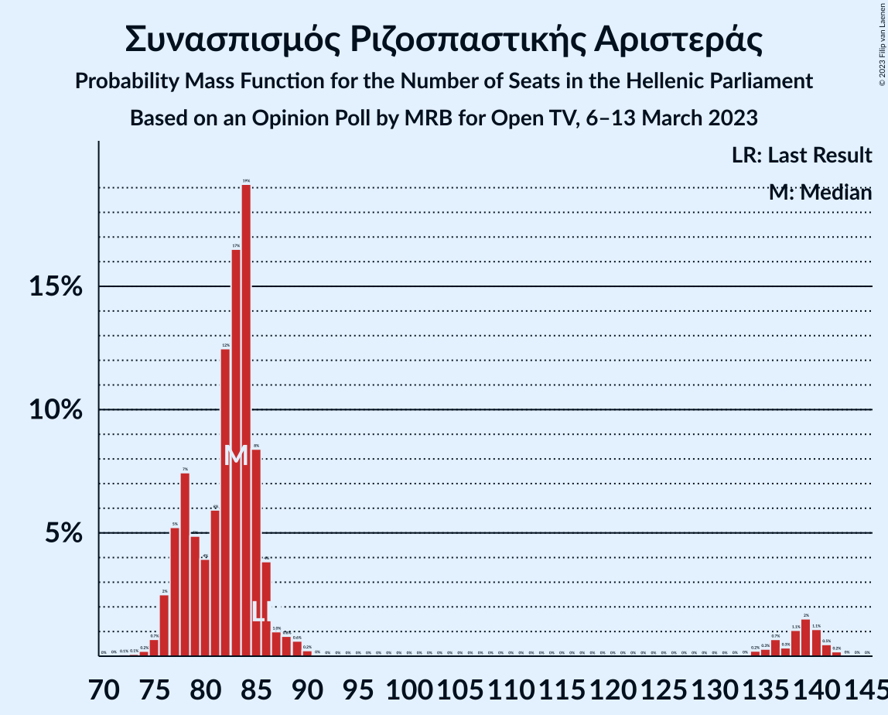

| Number of Seats | Probability | Accumulated | Special Marks |
|:---------------:|:-----------:|:-----------:|:-------------:|
| 72 | 0.1% | 100% |  |
| 73 | 0.1% | 99.9% |  |
| 74 | 0.2% | 99.8% |  |
| 75 | 0.7% | 99.6% |  |
| 76 | 2% | 98.9% |  |
| 77 | 5% | 96% |  |
| 78 | 7% | 91% |  |
| 79 | 5% | 84% |  |
| 80 | 4% | 79% |  |
| 81 | 6% | 75% |  |
| 82 | 12% | 69% |  |
| 83 | 17% | 57% | Median |
| 84 | 19% | 40% |  |
| 85 | 8% | 21% |  |
| 86 | 4% | 12% | Last Result |
| 87 | 1.0% | 9% |  |
| 88 | 0.8% | 8% |  |
| 89 | 0.6% | 7% |  |
| 90 | 0.2% | 6% |  |
| 91 | 0% | 6% |  |
| 92 | 0% | 6% |  |
| 93 | 0% | 6% |  |
| 94 | 0% | 6% |  |
| 95 | 0% | 6% |  |
| 96 | 0% | 6% |  |
| 97 | 0% | 6% |  |
| 98 | 0% | 6% |  |
| 99 | 0% | 6% |  |
| 100 | 0% | 6% |  |
| 101 | 0% | 6% |  |
| 102 | 0% | 6% |  |
| 103 | 0% | 6% |  |
| 104 | 0% | 6% |  |
| 105 | 0% | 6% |  |
| 106 | 0% | 6% |  |
| 107 | 0% | 6% |  |
| 108 | 0% | 6% |  |
| 109 | 0% | 6% |  |
| 110 | 0% | 6% |  |
| 111 | 0% | 6% |  |
| 112 | 0% | 6% |  |
| 113 | 0% | 6% |  |
| 114 | 0% | 6% |  |
| 115 | 0% | 6% |  |
| 116 | 0% | 6% |  |
| 117 | 0% | 6% |  |
| 118 | 0% | 6% |  |
| 119 | 0% | 6% |  |
| 120 | 0% | 6% |  |
| 121 | 0% | 6% |  |
| 122 | 0% | 6% |  |
| 123 | 0% | 6% |  |
| 124 | 0% | 6% |  |
| 125 | 0% | 6% |  |
| 126 | 0% | 6% |  |
| 127 | 0% | 6% |  |
| 128 | 0% | 6% |  |
| 129 | 0% | 6% |  |
| 130 | 0% | 6% |  |
| 131 | 0% | 6% |  |
| 132 | 0% | 6% |  |
| 133 | 0% | 6% |  |
| 134 | 0.2% | 6% |  |
| 135 | 0.3% | 6% |  |
| 136 | 0.7% | 5% |  |
| 137 | 0.3% | 5% |  |
| 138 | 1.1% | 4% |  |
| 139 | 2% | 3% |  |
| 140 | 1.1% | 2% |  |
| 141 | 0.5% | 0.7% |  |
| 142 | 0.2% | 0.2% |  |
| 143 | 0% | 0.1% |  |
| 144 | 0% | 0% |  |

### Κίνημα Αλλαγής

*For a full overview of the results for this party, see the [Κίνημα Αλλαγής](party-κίνημααλλαγής.html) page.*

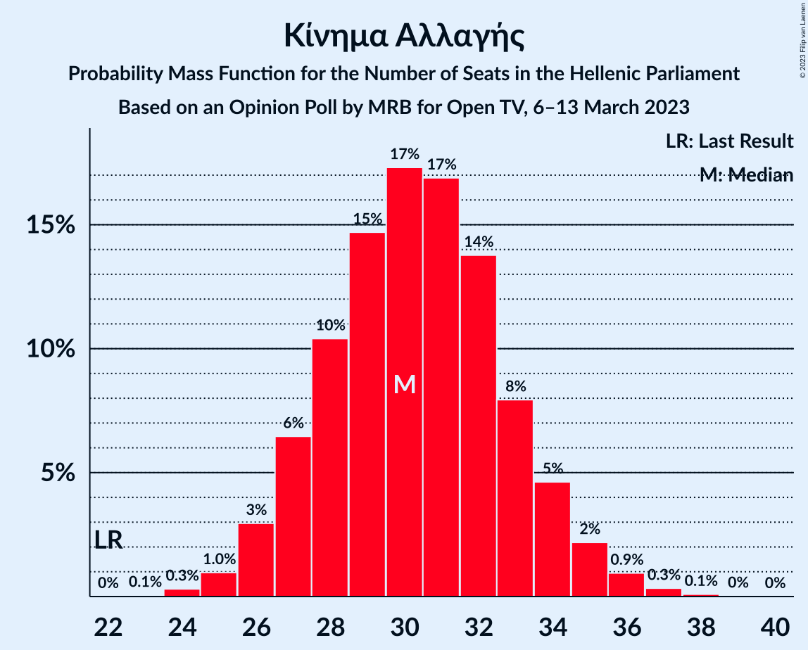

| Number of Seats | Probability | Accumulated | Special Marks |
|:---------------:|:-----------:|:-----------:|:-------------:|
| 22 | 0% | 100% | Last Result |
| 23 | 0.1% | 100% |  |
| 24 | 0.3% | 99.9% |  |
| 25 | 1.0% | 99.6% |  |
| 26 | 3% | 98.7% |  |
| 27 | 6% | 96% |  |
| 28 | 10% | 89% |  |
| 29 | 15% | 79% |  |
| 30 | 17% | 64% | Median |
| 31 | 17% | 47% |  |
| 32 | 14% | 30% |  |
| 33 | 8% | 16% |  |
| 34 | 5% | 8% |  |
| 35 | 2% | 4% |  |
| 36 | 0.9% | 1.4% |  |
| 37 | 0.3% | 0.5% |  |
| 38 | 0.1% | 0.1% |  |
| 39 | 0% | 0% |  |

### Κομμουνιστικό Κόμμα Ελλάδας

*For a full overview of the results for this party, see the [Κομμουνιστικό Κόμμα Ελλάδας](party-κομμουνιστικόκόμμαελλάδας.html) page.*

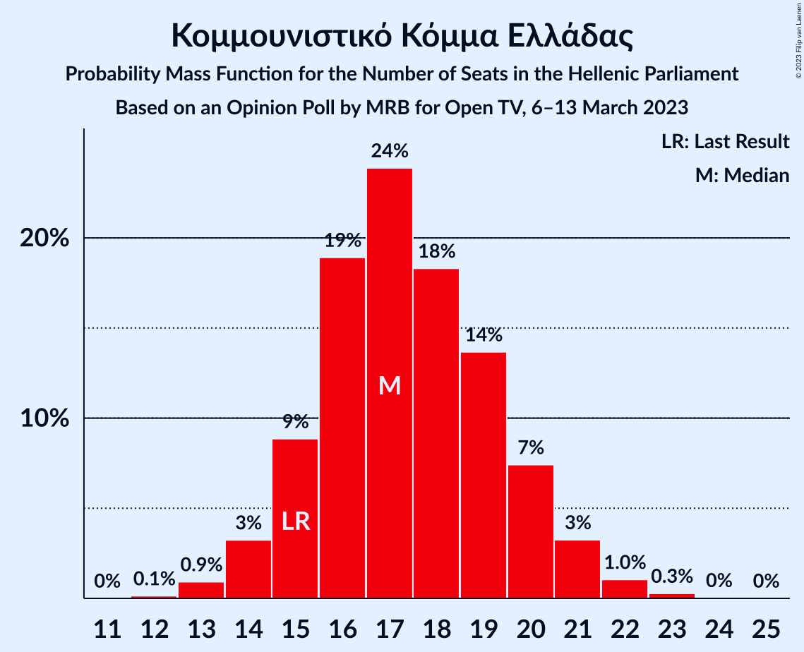

| Number of Seats | Probability | Accumulated | Special Marks |
|:---------------:|:-----------:|:-----------:|:-------------:|
| 12 | 0.1% | 100% |  |
| 13 | 0.9% | 99.8% |  |
| 14 | 3% | 98.9% |  |
| 15 | 9% | 96% | Last Result |
| 16 | 19% | 87% |  |
| 17 | 24% | 68% | Median |
| 18 | 18% | 44% |  |
| 19 | 14% | 26% |  |
| 20 | 7% | 12% |  |
| 21 | 3% | 5% |  |
| 22 | 1.0% | 1.4% |  |
| 23 | 0.3% | 0.3% |  |
| 24 | 0% | 0.1% |  |
| 25 | 0% | 0% |  |

### Ελληνική Λύση

*For a full overview of the results for this party, see the [Ελληνική Λύση](party-ελληνικήλύση.html) page.*

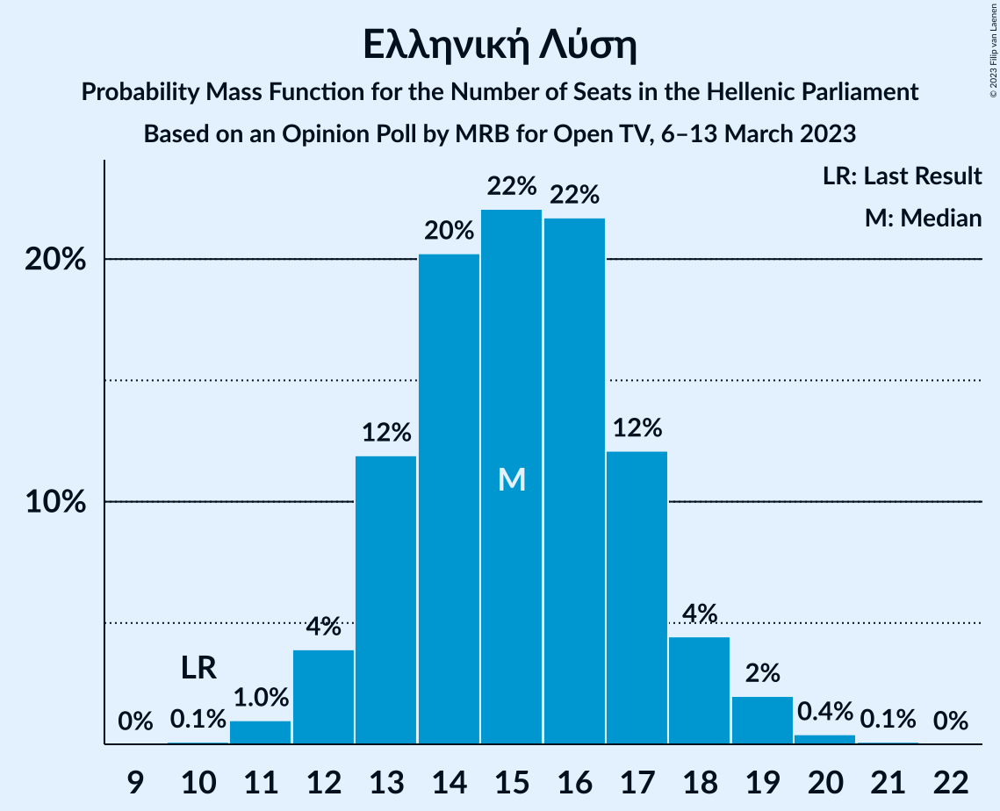

| Number of Seats | Probability | Accumulated | Special Marks |
|:---------------:|:-----------:|:-----------:|:-------------:|
| 10 | 0.1% | 100% | Last Result |
| 11 | 1.0% | 99.9% |  |
| 12 | 4% | 98.9% |  |
| 13 | 12% | 95% |  |
| 14 | 20% | 83% |  |
| 15 | 22% | 63% | Median |
| 16 | 22% | 41% |  |
| 17 | 12% | 19% |  |
| 18 | 4% | 7% |  |
| 19 | 2% | 3% |  |
| 20 | 0.4% | 0.5% |  |
| 21 | 0.1% | 0.1% |  |
| 22 | 0% | 0% |  |

### Μέτωπο Ευρωπαϊκής Ρεαλιστικής Ανυπακοής

*For a full overview of the results for this party, see the [Μέτωπο Ευρωπαϊκής Ρεαλιστικής Ανυπακοής](party-μέτωποευρωπαϊκήςρεαλιστικήςανυπακοής.html) page.*

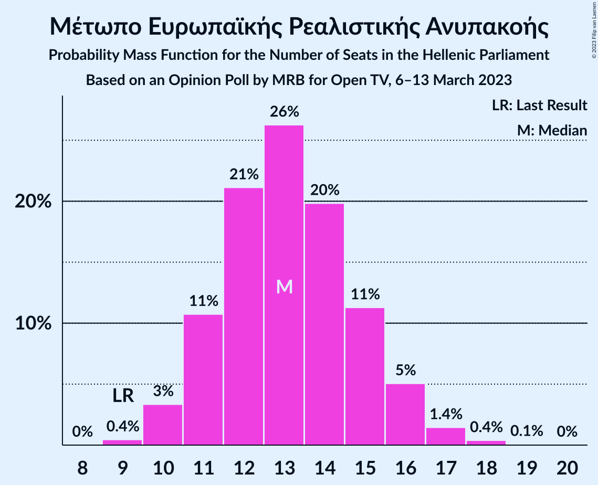

| Number of Seats | Probability | Accumulated | Special Marks |
|:---------------:|:-----------:|:-----------:|:-------------:|
| 9 | 0.4% | 100% | Last Result |
| 10 | 3% | 99.5% |  |
| 11 | 11% | 96% |  |
| 12 | 21% | 85% |  |
| 13 | 26% | 64% | Median |
| 14 | 20% | 38% |  |
| 15 | 11% | 18% |  |
| 16 | 5% | 7% |  |
| 17 | 1.4% | 2% |  |
| 18 | 0.4% | 0.5% |  |
| 19 | 0.1% | 0.1% |  |
| 20 | 0% | 0% |  |

### Χρυσή Αυγή

*For a full overview of the results for this party, see the [Χρυσή Αυγή](party-χρυσήαυγή.html) page.*

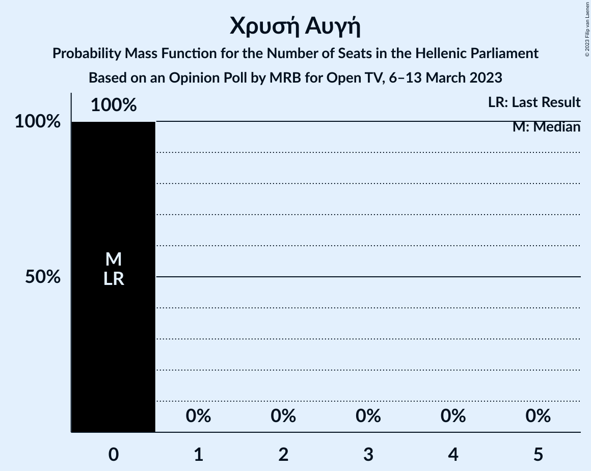

| Number of Seats | Probability | Accumulated | Special Marks |
|:---------------:|:-----------:|:-----------:|:-------------:|
| 0 | 100% | 100% | Last Result, Median |

## Coalitions

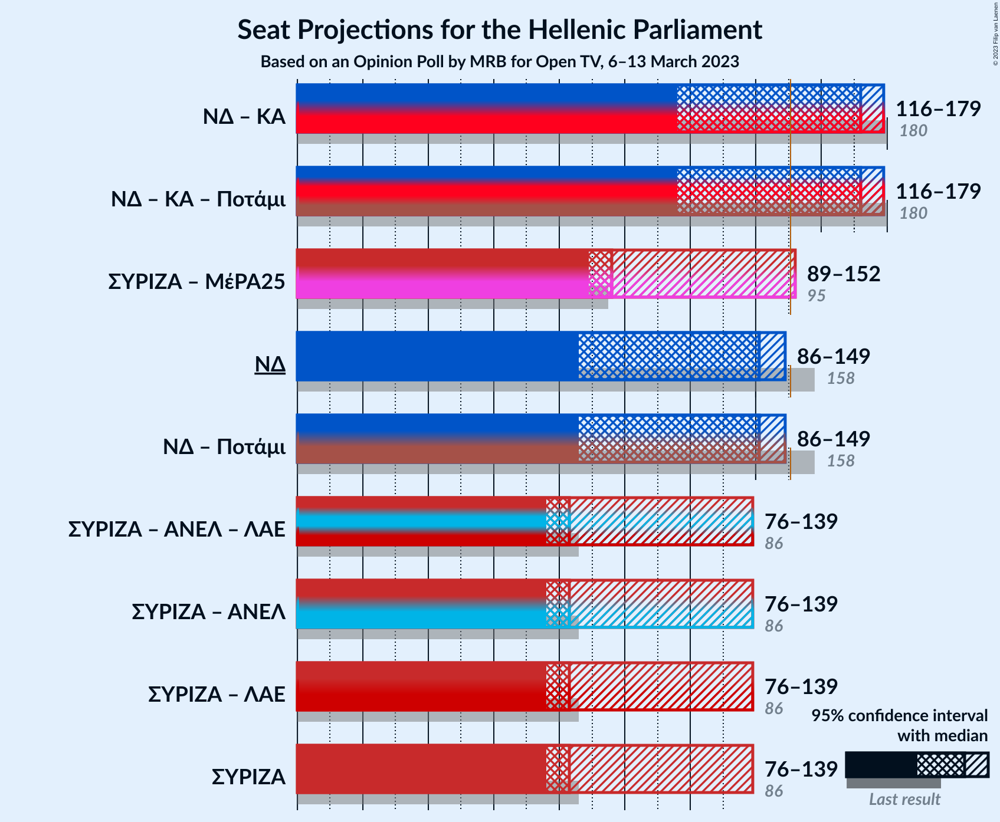

### Confidence Intervals

| Coalition | Last Result | Median | Majority? | 80% Confidence Interval | 90% Confidence Interval | 95% Confidence Interval | 99% Confidence Interval |
|:---------:|:-----------:|:------:|:---------:|:-----------------------:|:-----------------------:|:-----------------------:|:-----------------------:|
| Νέα Δημοκρατία – Κίνημα Αλλαγής | 180 | 172 | 94% | 167–176 | 118–178 | 116–179 | 113–181 |
| Συνασπισμός Ριζοσπαστικής Αριστεράς – Μέτωπο Ευρωπαϊκής Ρεαλιστικής Ανυπακοής | 95 | 96 | 4% | 91–100 | 90–150 | 89–152 | 87–154 |
| Νέα Δημοκρατία | 158 | 141 | 0.7% | 137–146 | 88–147 | 86–149 | 84–151 |
| Συνασπισμός Ριζοσπαστικής Αριστεράς | 86 | 83 | 0% | 78–86 | 77–136 | 76–139 | 75–141 |

### Νέα Δημοκρατία – Κίνημα Αλλαγής

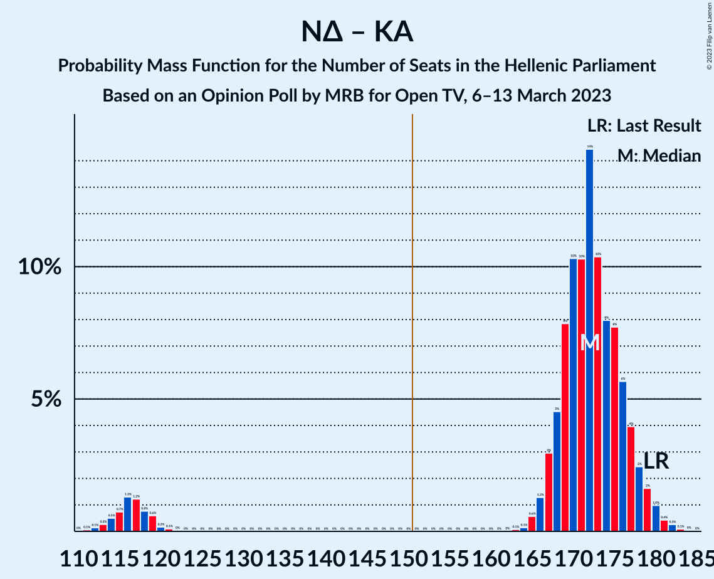

| Number of Seats | Probability | Accumulated | Special Marks |
|:---------------:|:-----------:|:-----------:|:-------------:|
| 111 | 0.1% | 100% |  |
| 112 | 0.1% | 99.9% |  |
| 113 | 0.3% | 99.8% |  |
| 114 | 0.5% | 99.5% |  |
| 115 | 0.7% | 99.0% |  |
| 116 | 1.3% | 98% |  |
| 117 | 1.2% | 97% |  |
| 118 | 0.8% | 96% |  |
| 119 | 0.6% | 95% |  |
| 120 | 0.2% | 94% |  |
| 121 | 0.1% | 94% |  |
| 122 | 0% | 94% |  |
| 123 | 0% | 94% |  |
| 124 | 0% | 94% |  |
| 125 | 0% | 94% |  |
| 126 | 0% | 94% |  |
| 127 | 0% | 94% |  |
| 128 | 0% | 94% |  |
| 129 | 0% | 94% |  |
| 130 | 0% | 94% |  |
| 131 | 0% | 94% |  |
| 132 | 0% | 94% |  |
| 133 | 0% | 94% |  |
| 134 | 0% | 94% |  |
| 135 | 0% | 94% |  |
| 136 | 0% | 94% |  |
| 137 | 0% | 94% |  |
| 138 | 0% | 94% |  |
| 139 | 0% | 94% |  |
| 140 | 0% | 94% |  |
| 141 | 0% | 94% |  |
| 142 | 0% | 94% |  |
| 143 | 0% | 94% |  |
| 144 | 0% | 94% |  |
| 145 | 0% | 94% |  |
| 146 | 0% | 94% |  |
| 147 | 0% | 94% |  |
| 148 | 0% | 94% |  |
| 149 | 0% | 94% |  |
| 150 | 0% | 94% |  |
| 151 | 0% | 94% | Majority |
| 152 | 0% | 94% |  |
| 153 | 0% | 94% |  |
| 154 | 0% | 94% |  |
| 155 | 0% | 94% |  |
| 156 | 0% | 94% |  |
| 157 | 0% | 94% |  |
| 158 | 0% | 94% |  |
| 159 | 0% | 94% |  |
| 160 | 0% | 94% |  |
| 161 | 0% | 94% |  |
| 162 | 0% | 94% |  |
| 163 | 0.1% | 94% |  |
| 164 | 0.1% | 94% |  |
| 165 | 0.6% | 94% |  |
| 166 | 1.3% | 93% |  |
| 167 | 3% | 92% |  |
| 168 | 5% | 89% |  |
| 169 | 8% | 84% |  |
| 170 | 10% | 77% |  |
| 171 | 10% | 66% | Median |
| 172 | 14% | 56% |  |
| 173 | 10% | 42% |  |
| 174 | 8% | 31% |  |
| 175 | 8% | 23% |  |
| 176 | 6% | 16% |  |
| 177 | 4% | 10% |  |
| 178 | 2% | 6% |  |
| 179 | 2% | 3% |  |
| 180 | 1.0% | 2% | Last Result |
| 181 | 0.4% | 0.8% |  |
| 182 | 0.3% | 0.4% |  |
| 183 | 0.1% | 0.1% |  |
| 184 | 0% | 0.1% |  |
| 185 | 0% | 0% |  |

### Συνασπισμός Ριζοσπαστικής Αριστεράς – Μέτωπο Ευρωπαϊκής Ρεαλιστικής Ανυπακοής

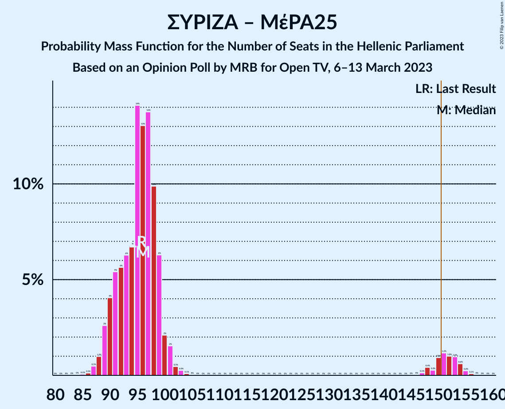

| Number of Seats | Probability | Accumulated | Special Marks |
|:---------------:|:-----------:|:-----------:|:-------------:|
| 84 | 0% | 100% |  |
| 85 | 0.1% | 99.9% |  |
| 86 | 0.1% | 99.9% |  |
| 87 | 0.5% | 99.8% |  |
| 88 | 1.0% | 99.3% |  |
| 89 | 3% | 98% |  |
| 90 | 4% | 96% |  |
| 91 | 5% | 92% |  |
| 92 | 6% | 86% |  |
| 93 | 6% | 81% |  |
| 94 | 7% | 74% |  |
| 95 | 14% | 68% | Last Result |
| 96 | 13% | 53% | Median |
| 97 | 14% | 40% |  |
| 98 | 10% | 27% |  |
| 99 | 6% | 17% |  |
| 100 | 2% | 10% |  |
| 101 | 2% | 8% |  |
| 102 | 0.5% | 7% |  |
| 103 | 0.3% | 6% |  |
| 104 | 0.1% | 6% |  |
| 105 | 0% | 6% |  |
| 106 | 0% | 6% |  |
| 107 | 0% | 6% |  |
| 108 | 0% | 6% |  |
| 109 | 0% | 6% |  |
| 110 | 0% | 6% |  |
| 111 | 0% | 6% |  |
| 112 | 0% | 6% |  |
| 113 | 0% | 6% |  |
| 114 | 0% | 6% |  |
| 115 | 0% | 6% |  |
| 116 | 0% | 6% |  |
| 117 | 0% | 6% |  |
| 118 | 0% | 6% |  |
| 119 | 0% | 6% |  |
| 120 | 0% | 6% |  |
| 121 | 0% | 6% |  |
| 122 | 0% | 6% |  |
| 123 | 0% | 6% |  |
| 124 | 0% | 6% |  |
| 125 | 0% | 6% |  |
| 126 | 0% | 6% |  |
| 127 | 0% | 6% |  |
| 128 | 0% | 6% |  |
| 129 | 0% | 6% |  |
| 130 | 0% | 6% |  |
| 131 | 0% | 6% |  |
| 132 | 0% | 6% |  |
| 133 | 0% | 6% |  |
| 134 | 0% | 6% |  |
| 135 | 0% | 6% |  |
| 136 | 0% | 6% |  |
| 137 | 0% | 6% |  |
| 138 | 0% | 6% |  |
| 139 | 0% | 6% |  |
| 140 | 0% | 6% |  |
| 141 | 0% | 6% |  |
| 142 | 0% | 6% |  |
| 143 | 0% | 6% |  |
| 144 | 0% | 6% |  |
| 145 | 0% | 6% |  |
| 146 | 0% | 6% |  |
| 147 | 0.1% | 6% |  |
| 148 | 0.4% | 6% |  |
| 149 | 0.3% | 5% |  |
| 150 | 0.9% | 5% |  |
| 151 | 1.2% | 4% | Majority |
| 152 | 1.0% | 3% |  |
| 153 | 1.0% | 2% |  |
| 154 | 0.6% | 1.0% |  |
| 155 | 0.2% | 0.4% |  |
| 156 | 0.1% | 0.1% |  |
| 157 | 0% | 0% |  |

### Νέα Δημοκρατία

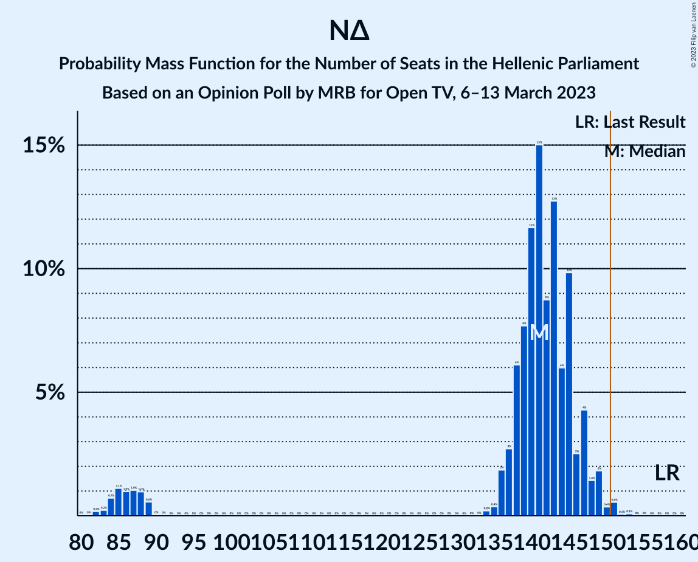

| Number of Seats | Probability | Accumulated | Special Marks |
|:---------------:|:-----------:|:-----------:|:-------------:|
| 81 | 0% | 100% |  |
| 82 | 0.2% | 99.9% |  |
| 83 | 0.2% | 99.7% |  |
| 84 | 0.7% | 99.5% |  |
| 85 | 1.1% | 98.8% |  |
| 86 | 1.0% | 98% |  |
| 87 | 1.0% | 97% |  |
| 88 | 1.0% | 96% |  |
| 89 | 0.6% | 95% |  |
| 90 | 0% | 94% |  |
| 91 | 0% | 94% |  |
| 92 | 0% | 94% |  |
| 93 | 0% | 94% |  |
| 94 | 0% | 94% |  |
| 95 | 0% | 94% |  |
| 96 | 0% | 94% |  |
| 97 | 0% | 94% |  |
| 98 | 0% | 94% |  |
| 99 | 0% | 94% |  |
| 100 | 0% | 94% |  |
| 101 | 0% | 94% |  |
| 102 | 0% | 94% |  |
| 103 | 0% | 94% |  |
| 104 | 0% | 94% |  |
| 105 | 0% | 94% |  |
| 106 | 0% | 94% |  |
| 107 | 0% | 94% |  |
| 108 | 0% | 94% |  |
| 109 | 0% | 94% |  |
| 110 | 0% | 94% |  |
| 111 | 0% | 94% |  |
| 112 | 0% | 94% |  |
| 113 | 0% | 94% |  |
| 114 | 0% | 94% |  |
| 115 | 0% | 94% |  |
| 116 | 0% | 94% |  |
| 117 | 0% | 94% |  |
| 118 | 0% | 94% |  |
| 119 | 0% | 94% |  |
| 120 | 0% | 94% |  |
| 121 | 0% | 94% |  |
| 122 | 0% | 94% |  |
| 123 | 0% | 94% |  |
| 124 | 0% | 94% |  |
| 125 | 0% | 94% |  |
| 126 | 0% | 94% |  |
| 127 | 0% | 94% |  |
| 128 | 0% | 94% |  |
| 129 | 0% | 94% |  |
| 130 | 0% | 94% |  |
| 131 | 0% | 94% |  |
| 132 | 0% | 94% |  |
| 133 | 0% | 94% |  |
| 134 | 0.2% | 94% |  |
| 135 | 0.4% | 94% |  |
| 136 | 2% | 93% |  |
| 137 | 3% | 92% |  |
| 138 | 6% | 89% |  |
| 139 | 8% | 83% |  |
| 140 | 12% | 75% |  |
| 141 | 15% | 63% | Median |
| 142 | 9% | 48% |  |
| 143 | 13% | 40% |  |
| 144 | 6% | 27% |  |
| 145 | 10% | 21% |  |
| 146 | 3% | 11% |  |
| 147 | 4% | 9% |  |
| 148 | 1.4% | 4% |  |
| 149 | 2% | 3% |  |
| 150 | 0.4% | 1.1% |  |
| 151 | 0.6% | 0.7% | Majority |
| 152 | 0.1% | 0.2% |  |
| 153 | 0.1% | 0.1% |  |
| 154 | 0% | 0% |  |
| 155 | 0% | 0% |  |
| 156 | 0% | 0% |  |
| 157 | 0% | 0% |  |
| 158 | 0% | 0% | Last Result |

### Συνασπισμός Ριζοσπαστικής Αριστεράς

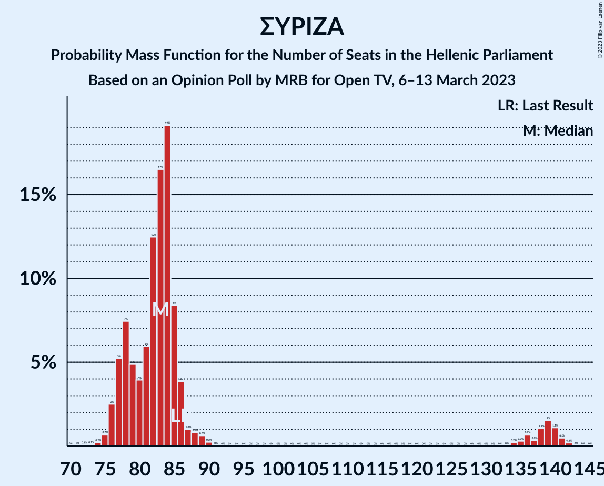

| Number of Seats | Probability | Accumulated | Special Marks |
|:---------------:|:-----------:|:-----------:|:-------------:|
| 72 | 0.1% | 100% |  |
| 73 | 0.1% | 99.9% |  |
| 74 | 0.2% | 99.8% |  |
| 75 | 0.7% | 99.6% |  |
| 76 | 2% | 98.9% |  |
| 77 | 5% | 96% |  |
| 78 | 7% | 91% |  |
| 79 | 5% | 84% |  |
| 80 | 4% | 79% |  |
| 81 | 6% | 75% |  |
| 82 | 12% | 69% |  |
| 83 | 17% | 57% | Median |
| 84 | 19% | 40% |  |
| 85 | 8% | 21% |  |
| 86 | 4% | 12% | Last Result |
| 87 | 1.0% | 9% |  |
| 88 | 0.8% | 8% |  |
| 89 | 0.6% | 7% |  |
| 90 | 0.2% | 6% |  |
| 91 | 0% | 6% |  |
| 92 | 0% | 6% |  |
| 93 | 0% | 6% |  |
| 94 | 0% | 6% |  |
| 95 | 0% | 6% |  |
| 96 | 0% | 6% |  |
| 97 | 0% | 6% |  |
| 98 | 0% | 6% |  |
| 99 | 0% | 6% |  |
| 100 | 0% | 6% |  |
| 101 | 0% | 6% |  |
| 102 | 0% | 6% |  |
| 103 | 0% | 6% |  |
| 104 | 0% | 6% |  |
| 105 | 0% | 6% |  |
| 106 | 0% | 6% |  |
| 107 | 0% | 6% |  |
| 108 | 0% | 6% |  |
| 109 | 0% | 6% |  |
| 110 | 0% | 6% |  |
| 111 | 0% | 6% |  |
| 112 | 0% | 6% |  |
| 113 | 0% | 6% |  |
| 114 | 0% | 6% |  |
| 115 | 0% | 6% |  |
| 116 | 0% | 6% |  |
| 117 | 0% | 6% |  |
| 118 | 0% | 6% |  |
| 119 | 0% | 6% |  |
| 120 | 0% | 6% |  |
| 121 | 0% | 6% |  |
| 122 | 0% | 6% |  |
| 123 | 0% | 6% |  |
| 124 | 0% | 6% |  |
| 125 | 0% | 6% |  |
| 126 | 0% | 6% |  |
| 127 | 0% | 6% |  |
| 128 | 0% | 6% |  |
| 129 | 0% | 6% |  |
| 130 | 0% | 6% |  |
| 131 | 0% | 6% |  |
| 132 | 0% | 6% |  |
| 133 | 0% | 6% |  |
| 134 | 0.2% | 6% |  |
| 135 | 0.3% | 6% |  |
| 136 | 0.7% | 5% |  |
| 137 | 0.3% | 5% |  |
| 138 | 1.1% | 4% |  |
| 139 | 2% | 3% |  |
| 140 | 1.1% | 2% |  |
| 141 | 0.5% | 0.7% |  |
| 142 | 0.2% | 0.2% |  |
| 143 | 0% | 0.1% |  |
| 144 | 0% | 0% |  |

## Technical Information

### Opinion Poll

+ **Polling firm:** MRB
+ **Commissioner(s):** Open TV
+ **Fieldwork period:** 6–13 March 2023

### Calculations

+ **Sample size:** 1450
+ **Simulations done:** 1,048,576
+ **Error estimate:** 0.43%

