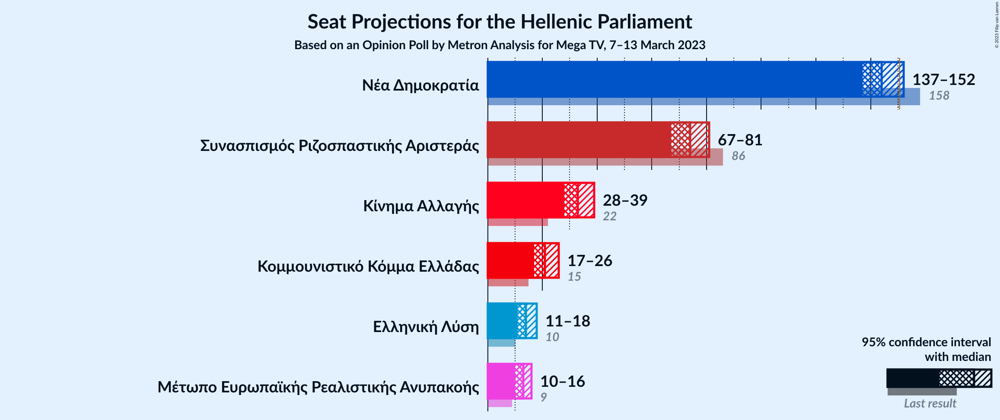
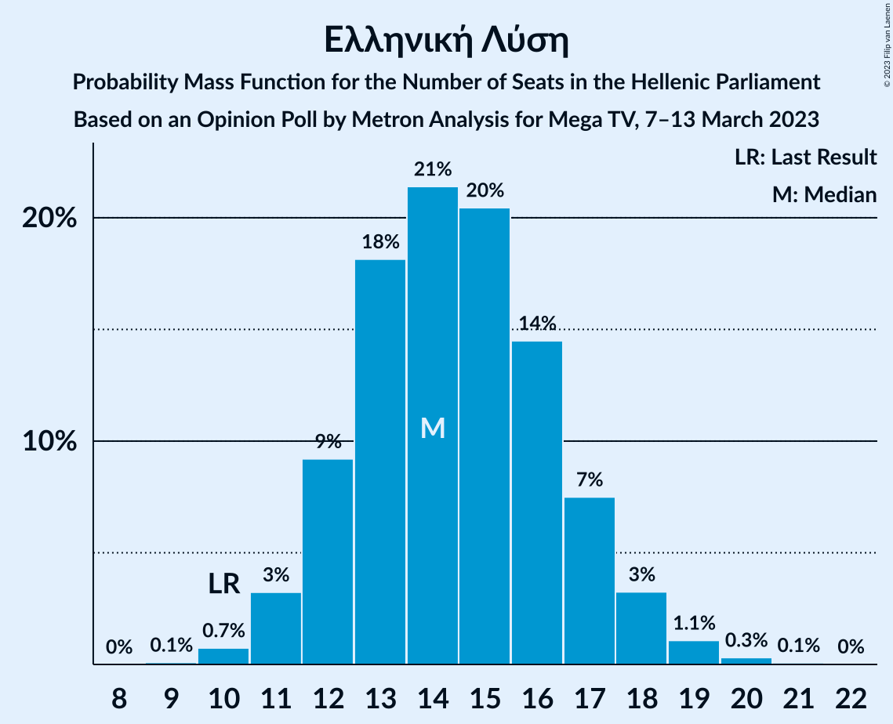
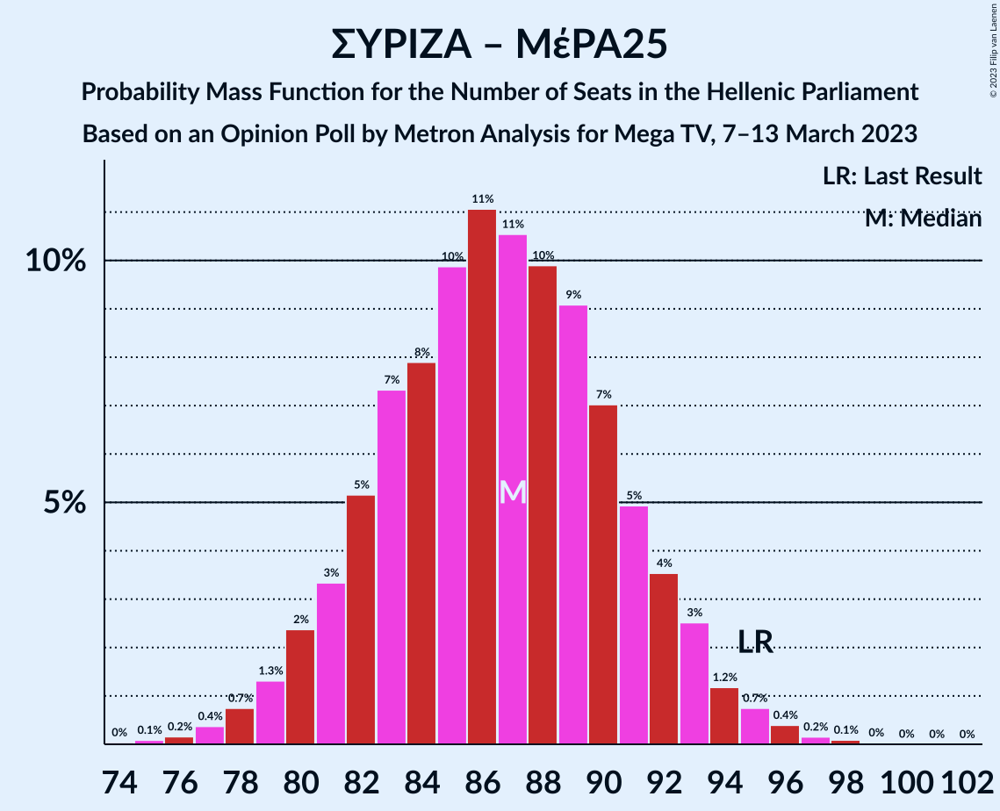

# Opinion Poll by Metron Analysis for Mega TV, 7–13 March 2023

<a href="#voting-intentions">Voting Intentions</a> | <a href="#seats">Seats</a> | <a href="#coalitions">Coalitions</a> | <a href="#technical-information">Technical Information</a>

## Voting Intentions

### Confidence Intervals

| Party | Last Result | Poll Result | 80% Confidence Interval | 90% Confidence Interval | 95% Confidence Interval | 99% Confidence Interval |
|:-----:|:-----------:|:-----------:|:-----------------------:|:-----------------------:|:-----------------------:|:-----------------------:|
| Νέα Δημοκρατία | 39.8% | 33.7% | 32.0–35.5% |31.5–36.0% |31.1–36.5% |30.3–37.3% |
| Συνασπισμός Ριζοσπαστικής Αριστεράς | 31.5% | 26.3% | 24.7–28.0% |24.3–28.5% |23.9–28.9% |23.2–29.7% |
| Κίνημα Αλλαγής | 8.1% | 11.8% | 10.7–13.1% |10.4–13.5% |10.1–13.8% |9.6–14.4% |
| Κομμουνιστικό Κόμμα Ελλάδας | 5.3% | 7.6% | 6.7–8.7% |6.4–8.9% |6.2–9.2% |5.8–9.8% |
| Ελληνική Λύση | 3.7% | 5.1% | 4.3–6.0% |4.1–6.2% |4.0–6.5% |3.6–6.9% |
| Μέτωπο Ευρωπαϊκής Ρεαλιστικής Ανυπακοής | 3.4% | 4.5% | 3.8–5.4% |3.6–5.6% |3.5–5.8% |3.2–6.3% |

*Note:* The poll result column reflects the actual value used in the calculations. Published results may vary slightly, and in addition be rounded to fewer digits.

## Seats

### Confidence Intervals

| Party | Last Result | Median | 80% Confidence Interval | 90% Confidence Interval | 95% Confidence Interval | 99% Confidence Interval |
|:-----:|:-----------:|:------:|:-----------------------:|:-----------------------:|:-----------------------:|:-----------------------:|
| <a href="#νέα-δημοκρατία">Νέα Δημοκρατία</a> | 158 | 144 | 140–149 |138–151 |137–152 |135–154 |
| <a href="#συνασπισμός-ριζοσπαστικής-αριστεράς">Συνασπισμός Ριζοσπαστικής Αριστεράς</a> | 86 | 74 | 69–78 |68–79 |67–81 |65–83 |
| <a href="#κίνημα-αλλαγής">Κίνημα Αλλαγής</a> | 22 | 33 | 30–37 |29–38 |28–39 |27–40 |
| <a href="#κομμουνιστικό-κόμμα-ελλάδας">Κομμουνιστικό Κόμμα Ελλάδας</a> | 15 | 21 | 19–24 |18–25 |17–26 |16–27 |
| <a href="#ελληνική-λύση">Ελληνική Λύση</a> | 10 | 14 | 12–17 |12–17 |11–18 |10–19 |
| <a href="#μέτωπο-ευρωπαϊκής-ρεαλιστικής-ανυπακοής">Μέτωπο Ευρωπαϊκής Ρεαλιστικής Ανυπακοής</a> | 9 | 13 | 11–15 |10–16 |10–16 |9–18 |

### Νέα Δημοκρατία

*For a full overview of the results for this party, see the [Νέα Δημοκρατία](party-νέαδημοκρατία.html) page.*

| Number of Seats | Probability | Accumulated | Special Marks |
|:---------------:|:-----------:|:-----------:|:-------------:|
| 131 | 0% | 100% |  |
| 132 | 0% | 99.9% |  |
| 133 | 0.1% | 99.9% |  |
| 134 | 0.2% | 99.9% |  |
| 135 | 0.4% | 99.7% |  |
| 136 | 0.8% | 99.3% |  |
| 137 | 1.4% | 98% |  |
| 138 | 2% | 97% |  |
| 139 | 4% | 95% |  |
| 140 | 6% | 91% |  |
| 141 | 9% | 86% |  |
| 142 | 10% | 77% |  |
| 143 | 11% | 67% |  |
| 144 | 10% | 57% | Median |
| 145 | 10% | 47% |  |
| 146 | 9% | 37% |  |
| 147 | 8% | 28% |  |
| 148 | 6% | 20% |  |
| 149 | 5% | 14% |  |
| 150 | 3% | 9% |  |
| 151 | 2% | 6% | Majority |
| 152 | 2% | 3% |  |
| 153 | 0.9% | 2% |  |
| 154 | 0.4% | 0.7% |  |
| 155 | 0.2% | 0.3% |  |
| 156 | 0.1% | 0.2% |  |
| 157 | 0% | 0.1% |  |
| 158 | 0% | 0% | Last Result |

### Συνασπισμός Ριζοσπαστικής Αριστεράς

*For a full overview of the results for this party, see the [Συνασπισμός Ριζοσπαστικής Αριστεράς](party-συνασπισμόςριζοσπαστικήςαριστεράς.html) page.*

| Number of Seats | Probability | Accumulated | Special Marks |
|:---------------:|:-----------:|:-----------:|:-------------:|
| 63 | 0.1% | 100% |  |
| 64 | 0.2% | 99.9% |  |
| 65 | 0.5% | 99.7% |  |
| 66 | 1.0% | 99.2% |  |
| 67 | 2% | 98% |  |
| 68 | 3% | 96% |  |
| 69 | 5% | 93% |  |
| 70 | 7% | 89% |  |
| 71 | 8% | 82% |  |
| 72 | 10% | 74% |  |
| 73 | 11% | 64% |  |
| 74 | 12% | 53% | Median |
| 75 | 11% | 42% |  |
| 76 | 10% | 31% |  |
| 77 | 8% | 21% |  |
| 78 | 5% | 14% |  |
| 79 | 4% | 8% |  |
| 80 | 2% | 5% |  |
| 81 | 1.3% | 3% |  |
| 82 | 0.7% | 1.4% |  |
| 83 | 0.4% | 0.7% |  |
| 84 | 0.2% | 0.3% |  |
| 85 | 0.1% | 0.2% |  |
| 86 | 0% | 0.1% | Last Result |
| 87 | 0% | 0.1% |  |
| 88 | 0% | 0% |  |

### Κίνημα Αλλαγής

*For a full overview of the results for this party, see the [Κίνημα Αλλαγής](party-κίνημααλλαγής.html) page.*

| Number of Seats | Probability | Accumulated | Special Marks |
|:---------------:|:-----------:|:-----------:|:-------------:|
| 22 | 0% | 100% | Last Result |
| 23 | 0% | 100% |  |
| 24 | 0% | 100% |  |
| 25 | 0.1% | 100% |  |
| 26 | 0.2% | 99.9% |  |
| 27 | 0.7% | 99.7% |  |
| 28 | 2% | 99.0% |  |
| 29 | 4% | 97% |  |
| 30 | 7% | 93% |  |
| 31 | 11% | 86% |  |
| 32 | 14% | 75% |  |
| 33 | 16% | 62% | Median |
| 34 | 15% | 46% |  |
| 35 | 12% | 31% |  |
| 36 | 8% | 19% |  |
| 37 | 5% | 11% |  |
| 38 | 3% | 6% |  |
| 39 | 2% | 3% |  |
| 40 | 0.6% | 1.0% |  |
| 41 | 0.3% | 0.4% |  |
| 42 | 0.1% | 0.1% |  |
| 43 | 0% | 0% |  |

### Κομμουνιστικό Κόμμα Ελλάδας

*For a full overview of the results for this party, see the [Κομμουνιστικό Κόμμα Ελλάδας](party-κομμουνιστικόκόμμαελλάδας.html) page.*

| Number of Seats | Probability | Accumulated | Special Marks |
|:---------------:|:-----------:|:-----------:|:-------------:|
| 15 | 0.1% | 100% | Last Result |
| 16 | 0.6% | 99.9% |  |
| 17 | 2% | 99.3% |  |
| 18 | 5% | 97% |  |
| 19 | 10% | 92% |  |
| 20 | 16% | 82% |  |
| 21 | 17% | 66% | Median |
| 22 | 19% | 48% |  |
| 23 | 13% | 30% |  |
| 24 | 8% | 16% |  |
| 25 | 5% | 8% |  |
| 26 | 2% | 3% |  |
| 27 | 0.8% | 1.2% |  |
| 28 | 0.3% | 0.4% |  |
| 29 | 0.1% | 0.1% |  |
| 30 | 0% | 0% |  |

### Ελληνική Λύση

*For a full overview of the results for this party, see the [Ελληνική Λύση](party-ελληνικήλύση.html) page.*

| Number of Seats | Probability | Accumulated | Special Marks |
|:---------------:|:-----------:|:-----------:|:-------------:|
| 9 | 0.1% | 100% |  |
| 10 | 0.7% | 99.9% | Last Result |
| 11 | 3% | 99.2% |  |
| 12 | 9% | 96% |  |
| 13 | 18% | 87% |  |
| 14 | 21% | 69% | Median |
| 15 | 20% | 47% |  |
| 16 | 14% | 27% |  |
| 17 | 7% | 12% |  |
| 18 | 3% | 5% |  |
| 19 | 1.1% | 1.5% |  |
| 20 | 0.3% | 0.4% |  |
| 21 | 0.1% | 0.1% |  |
| 22 | 0% | 0% |  |

### Μέτωπο Ευρωπαϊκής Ρεαλιστικής Ανυπακοής

*For a full overview of the results for this party, see the [Μέτωπο Ευρωπαϊκής Ρεαλιστικής Ανυπακοής](party-μέτωποευρωπαϊκήςρεαλιστικήςανυπακοής.html) page.*

| Number of Seats | Probability | Accumulated | Special Marks |
|:---------------:|:-----------:|:-----------:|:-------------:|
| 0 | 0.2% | 100% |  |
| 1 | 0% | 99.8% |  |
| 2 | 0% | 99.8% |  |
| 3 | 0% | 99.8% |  |
| 4 | 0% | 99.8% |  |
| 5 | 0% | 99.8% |  |
| 6 | 0% | 99.8% |  |
| 7 | 0% | 99.8% |  |
| 8 | 0% | 99.8% |  |
| 9 | 1.4% | 99.8% | Last Result |
| 10 | 6% | 98% |  |
| 11 | 16% | 92% |  |
| 12 | 22% | 77% |  |
| 13 | 22% | 55% | Median |
| 14 | 18% | 33% |  |
| 15 | 9% | 15% |  |
| 16 | 4% | 6% |  |
| 17 | 1.5% | 2% |  |
| 18 | 0.4% | 0.6% |  |
| 19 | 0.1% | 0.1% |  |
| 20 | 0% | 0% |  |

## Coalitions

### Confidence Intervals

| Coalition | Last Result | Median | Majority? | 80% Confidence Interval | 90% Confidence Interval | 95% Confidence Interval | 99% Confidence Interval |
|:---------:|:-----------:|:------:|:---------:|:-----------------------:|:-----------------------:|:-----------------------:|:-----------------------:|
| Νέα Δημοκρατία – Κίνημα Αλλαγής | 180 | 178 | 100% | 173–183 | 171–184 | 170–185 | 168–188 |
| Νέα Δημοκρατία | 158 | 144 | 6% | 140–149 | 138–151 | 137–152 | 135–154 |
| Συνασπισμός Ριζοσπαστικής Αριστεράς – Μέτωπο Ευρωπαϊκής Ρεαλιστικής Ανυπακοής | 95 | 87 | 0% | 82–91 | 80–93 | 79–94 | 77–96 |
| Συνασπισμός Ριζοσπαστικής Αριστεράς | 86 | 74 | 0% | 69–78 | 68–79 | 67–81 | 65–83 |

### Νέα Δημοκρατία – Κίνημα Αλλαγής

| Number of Seats | Probability | Accumulated | Special Marks |
|:---------------:|:-----------:|:-----------:|:-------------:|
| 163 | 0% | 100% |  |
| 164 | 0% | 99.9% |  |
| 165 | 0% | 99.9% |  |
| 166 | 0.1% | 99.9% |  |
| 167 | 0.2% | 99.8% |  |
| 168 | 0.4% | 99.6% |  |
| 169 | 0.9% | 99.2% |  |
| 170 | 1.3% | 98% |  |
| 171 | 2% | 97% |  |
| 172 | 4% | 95% |  |
| 173 | 5% | 91% |  |
| 174 | 8% | 86% |  |
| 175 | 8% | 79% |  |
| 176 | 10% | 71% |  |
| 177 | 10% | 61% | Median |
| 178 | 10% | 51% |  |
| 179 | 10% | 41% |  |
| 180 | 8% | 31% | Last Result |
| 181 | 7% | 23% |  |
| 182 | 5% | 16% |  |
| 183 | 4% | 10% |  |
| 184 | 3% | 6% |  |
| 185 | 1.5% | 4% |  |
| 186 | 1.1% | 2% |  |
| 187 | 0.5% | 1.1% |  |
| 188 | 0.3% | 0.5% |  |
| 189 | 0.1% | 0.3% |  |
| 190 | 0.1% | 0.1% |  |
| 191 | 0% | 0.1% |  |
| 192 | 0% | 0% |  |

### Νέα Δημοκρατία

| Number of Seats | Probability | Accumulated | Special Marks |
|:---------------:|:-----------:|:-----------:|:-------------:|
| 131 | 0% | 100% |  |
| 132 | 0% | 99.9% |  |
| 133 | 0.1% | 99.9% |  |
| 134 | 0.2% | 99.9% |  |
| 135 | 0.4% | 99.7% |  |
| 136 | 0.8% | 99.3% |  |
| 137 | 1.4% | 98% |  |
| 138 | 2% | 97% |  |
| 139 | 4% | 95% |  |
| 140 | 6% | 91% |  |
| 141 | 9% | 86% |  |
| 142 | 10% | 77% |  |
| 143 | 11% | 67% |  |
| 144 | 10% | 57% | Median |
| 145 | 10% | 47% |  |
| 146 | 9% | 37% |  |
| 147 | 8% | 28% |  |
| 148 | 6% | 20% |  |
| 149 | 5% | 14% |  |
| 150 | 3% | 9% |  |
| 151 | 2% | 6% | Majority |
| 152 | 2% | 3% |  |
| 153 | 0.9% | 2% |  |
| 154 | 0.4% | 0.7% |  |
| 155 | 0.2% | 0.3% |  |
| 156 | 0.1% | 0.2% |  |
| 157 | 0% | 0.1% |  |
| 158 | 0% | 0% | Last Result |

### Συνασπισμός Ριζοσπαστικής Αριστεράς – Μέτωπο Ευρωπαϊκής Ρεαλιστικής Ανυπακοής

| Number of Seats | Probability | Accumulated | Special Marks |
|:---------------:|:-----------:|:-----------:|:-------------:|
| 74 | 0% | 100% |  |
| 75 | 0.1% | 99.9% |  |
| 76 | 0.2% | 99.8% |  |
| 77 | 0.4% | 99.7% |  |
| 78 | 0.7% | 99.3% |  |
| 79 | 1.3% | 98.6% |  |
| 80 | 2% | 97% |  |
| 81 | 3% | 95% |  |
| 82 | 5% | 92% |  |
| 83 | 7% | 86% |  |
| 84 | 8% | 79% |  |
| 85 | 10% | 71% |  |
| 86 | 11% | 61% |  |
| 87 | 11% | 50% | Median |
| 88 | 10% | 40% |  |
| 89 | 9% | 30% |  |
| 90 | 7% | 21% |  |
| 91 | 5% | 14% |  |
| 92 | 4% | 9% |  |
| 93 | 3% | 5% |  |
| 94 | 1.2% | 3% |  |
| 95 | 0.7% | 1.5% | Last Result |
| 96 | 0.4% | 0.7% |  |
| 97 | 0.2% | 0.3% |  |
| 98 | 0.1% | 0.2% |  |
| 99 | 0% | 0.1% |  |
| 100 | 0% | 0.1% |  |
| 101 | 0% | 0% |  |

### Συνασπισμός Ριζοσπαστικής Αριστεράς

| Number of Seats | Probability | Accumulated | Special Marks |
|:---------------:|:-----------:|:-----------:|:-------------:|
| 63 | 0.1% | 100% |  |
| 64 | 0.2% | 99.9% |  |
| 65 | 0.5% | 99.7% |  |
| 66 | 1.0% | 99.2% |  |
| 67 | 2% | 98% |  |
| 68 | 3% | 96% |  |
| 69 | 5% | 93% |  |
| 70 | 7% | 89% |  |
| 71 | 8% | 82% |  |
| 72 | 10% | 74% |  |
| 73 | 11% | 64% |  |
| 74 | 12% | 53% | Median |
| 75 | 11% | 42% |  |
| 76 | 10% | 31% |  |
| 77 | 8% | 21% |  |
| 78 | 5% | 14% |  |
| 79 | 4% | 8% |  |
| 80 | 2% | 5% |  |
| 81 | 1.3% | 3% |  |
| 82 | 0.7% | 1.4% |  |
| 83 | 0.4% | 0.7% |  |
| 84 | 0.2% | 0.3% |  |
| 85 | 0.1% | 0.2% |  |
| 86 | 0% | 0.1% | Last Result |
| 87 | 0% | 0.1% |  |
| 88 | 0% | 0% |  |

## Technical Information

### Opinion Poll

+ **Polling firm:** Metron Analysis
+ **Commissioner(s):** Mega TV
+ **Fieldwork period:** 7–13 March 2023

### Calculations

+ **Sample size:** 1201
+ **Simulations done:** 1,048,576
+ **Error estimate:** 0.79%

