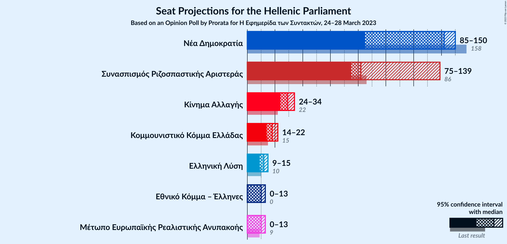
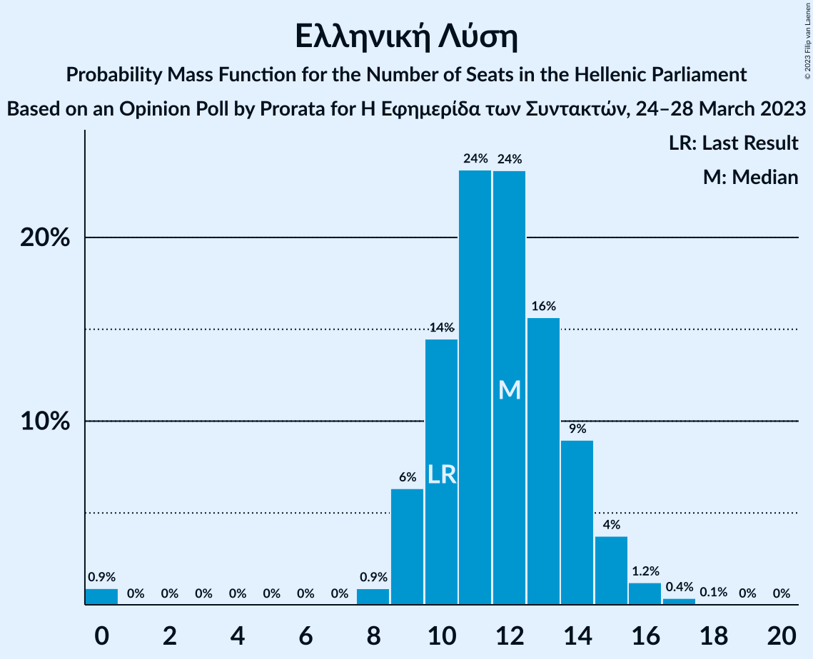
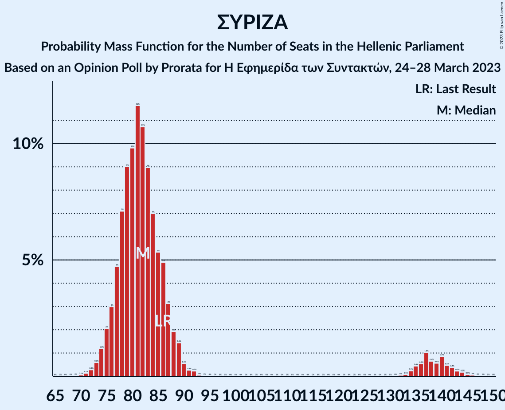

# Opinion Poll by Prorata for Η Εφημερίδα των Συντακτών, 24–28 March 2023

<a href="#voting-intentions">Voting Intentions</a> | <a href="#seats">Seats</a> | <a href="#coalitions">Coalitions</a> | <a href="#technical-information">Technical Information</a>

## Voting Intentions

### Confidence Intervals

| Party | Last Result | Poll Result | 80% Confidence Interval | 90% Confidence Interval | 95% Confidence Interval | 99% Confidence Interval |
|:-----:|:-----------:|:-----------:|:-----------------------:|:-----------------------:|:-----------------------:|:-----------------------:|
| Νέα Δημοκρατία | 39.8% | 33.9% | 32.1–35.8% |31.6–36.3% |31.2–36.8% |30.3–37.7% |
| Συνασπισμός Ριζοσπαστικής Αριστεράς | 31.5% | 30.4% | 28.7–32.3% |28.2–32.8% |27.7–33.2% |26.9–34.1% |
| Κίνημα Αλλαγής | 8.1% | 10.7% | 9.6–12.0% |9.3–12.4% |9.0–12.7% |8.5–13.3% |
| Κομμουνιστικό Κόμμα Ελλάδας | 5.3% | 6.5% | 5.7–7.6% |5.4–7.9% |5.2–8.2% |4.8–8.7% |
| Ελληνική Λύση | 3.7% | 4.2% | 3.6–5.1% |3.4–5.4% |3.2–5.6% |2.9–6.1% |
| Μέτωπο Ευρωπαϊκής Ρεαλιστικής Ανυπακοής | 3.4% | 3.6% | 3.0–4.4% |2.8–4.7% |2.6–4.9% |2.4–5.3% |
| Εθνικό Κόμμα – Έλληνες | 0.0% | 3.6% | 3.0–4.4% |2.8–4.7% |2.6–4.9% |2.4–5.3% |

*Note:* The poll result column reflects the actual value used in the calculations. Published results may vary slightly, and in addition be rounded to fewer digits.

## Seats

### Confidence Intervals

| Party | Last Result | Median | 80% Confidence Interval | 90% Confidence Interval | 95% Confidence Interval | 99% Confidence Interval |
|:-----:|:-----------:|:------:|:-----------------------:|:-----------------------:|:-----------------------:|:-----------------------:|
| <a href="#νέα-δημοκρατία">Νέα Δημοκρατία</a> | 158 | 142 | 136–147 |89–148 |85–150 |81–153 |
| <a href="#συνασπισμός-ριζοσπαστικής-αριστεράς">Συνασπισμός Ριζοσπαστικής Αριστεράς</a> | 86 | 82 | 77–88 |76–136 |75–139 |72–143 |
| <a href="#κίνημα-αλλαγής">Κίνημα Αλλαγής</a> | 22 | 29 | 26–32 |25–33 |24–34 |23–36 |
| <a href="#κομμουνιστικό-κόμμα-ελλάδας">Κομμουνιστικό Κόμμα Ελλάδας</a> | 15 | 18 | 15–20 |15–21 |14–22 |13–24 |
| <a href="#ελληνική-λύση">Ελληνική Λύση</a> | 10 | 12 | 10–14 |9–15 |9–15 |0–16 |
| <a href="#μέτωπο-ευρωπαϊκής-ρεαλιστικής-ανυπακοής">Μέτωπο Ευρωπαϊκής Ρεαλιστικής Ανυπακοής</a> | 9 | 10 | 0–12 |0–13 |0–13 |0–14 |
| <a href="#εθνικό-κόμμα-–-έλληνες">Εθνικό Κόμμα – Έλληνες</a> | 0 | 10 | 0–12 |0–13 |0–13 |0–14 |

### Νέα Δημοκρατία

*For a full overview of the results for this party, see the [Νέα Δημοκρατία](party-νέαδημοκρατία.html) page.*

| Number of Seats | Probability | Accumulated | Special Marks |
|:---------------:|:-----------:|:-----------:|:-------------:|
| 79 | 0.1% | 100% |  |
| 80 | 0.1% | 99.9% |  |
| 81 | 0.3% | 99.8% |  |
| 82 | 0.4% | 99.5% |  |
| 83 | 0.6% | 99.1% |  |
| 84 | 0.9% | 98.5% |  |
| 85 | 1.1% | 98% |  |
| 86 | 0.5% | 97% |  |
| 87 | 0.4% | 96% |  |
| 88 | 0.6% | 96% |  |
| 89 | 0.4% | 95% |  |
| 90 | 0.2% | 95% |  |
| 91 | 0.1% | 94% |  |
| 92 | 0% | 94% |  |
| 93 | 0% | 94% |  |
| 94 | 0% | 94% |  |
| 95 | 0% | 94% |  |
| 96 | 0% | 94% |  |
| 97 | 0% | 94% |  |
| 98 | 0% | 94% |  |
| 99 | 0% | 94% |  |
| 100 | 0% | 94% |  |
| 101 | 0% | 94% |  |
| 102 | 0% | 94% |  |
| 103 | 0% | 94% |  |
| 104 | 0% | 94% |  |
| 105 | 0% | 94% |  |
| 106 | 0% | 94% |  |
| 107 | 0% | 94% |  |
| 108 | 0% | 94% |  |
| 109 | 0% | 94% |  |
| 110 | 0% | 94% |  |
| 111 | 0% | 94% |  |
| 112 | 0% | 94% |  |
| 113 | 0% | 94% |  |
| 114 | 0% | 94% |  |
| 115 | 0% | 94% |  |
| 116 | 0% | 94% |  |
| 117 | 0% | 94% |  |
| 118 | 0% | 94% |  |
| 119 | 0% | 94% |  |
| 120 | 0% | 94% |  |
| 121 | 0% | 94% |  |
| 122 | 0% | 94% |  |
| 123 | 0% | 94% |  |
| 124 | 0% | 94% |  |
| 125 | 0% | 94% |  |
| 126 | 0% | 94% |  |
| 127 | 0% | 94% |  |
| 128 | 0% | 94% |  |
| 129 | 0% | 94% |  |
| 130 | 0% | 94% |  |
| 131 | 0% | 94% |  |
| 132 | 0.1% | 94% |  |
| 133 | 0.2% | 94% |  |
| 134 | 0.5% | 94% |  |
| 135 | 2% | 93% |  |
| 136 | 4% | 91% |  |
| 137 | 4% | 88% |  |
| 138 | 6% | 84% |  |
| 139 | 8% | 78% |  |
| 140 | 9% | 70% |  |
| 141 | 9% | 60% |  |
| 142 | 9% | 52% | Median |
| 143 | 10% | 42% |  |
| 144 | 9% | 32% |  |
| 145 | 6% | 23% |  |
| 146 | 5% | 16% |  |
| 147 | 4% | 11% |  |
| 148 | 3% | 7% |  |
| 149 | 2% | 4% |  |
| 150 | 1.1% | 3% |  |
| 151 | 0.7% | 2% | Majority |
| 152 | 0.4% | 0.9% |  |
| 153 | 0.2% | 0.5% |  |
| 154 | 0.2% | 0.3% |  |
| 155 | 0.1% | 0.1% |  |
| 156 | 0% | 0.1% |  |
| 157 | 0% | 0% |  |
| 158 | 0% | 0% | Last Result |

### Συνασπισμός Ριζοσπαστικής Αριστεράς

*For a full overview of the results for this party, see the [Συνασπισμός Ριζοσπαστικής Αριστεράς](party-συνασπισμόςριζοσπαστικήςαριστεράς.html) page.*

| Number of Seats | Probability | Accumulated | Special Marks |
|:---------------:|:-----------:|:-----------:|:-------------:|
| 70 | 0.1% | 100% |  |
| 71 | 0.1% | 99.9% |  |
| 72 | 0.3% | 99.8% |  |
| 73 | 0.6% | 99.5% |  |
| 74 | 1.2% | 98.9% |  |
| 75 | 2% | 98% |  |
| 76 | 3% | 96% |  |
| 77 | 5% | 93% |  |
| 78 | 7% | 88% |  |
| 79 | 9% | 81% |  |
| 80 | 10% | 72% |  |
| 81 | 12% | 62% |  |
| 82 | 11% | 50% | Median |
| 83 | 9% | 40% |  |
| 84 | 7% | 31% |  |
| 85 | 5% | 24% |  |
| 86 | 5% | 18% | Last Result |
| 87 | 3% | 13% |  |
| 88 | 2% | 10% |  |
| 89 | 1.4% | 8% |  |
| 90 | 0.5% | 7% |  |
| 91 | 0.3% | 6% |  |
| 92 | 0.2% | 6% |  |
| 93 | 0% | 6% |  |
| 94 | 0% | 6% |  |
| 95 | 0% | 6% |  |
| 96 | 0% | 6% |  |
| 97 | 0% | 6% |  |
| 98 | 0% | 6% |  |
| 99 | 0% | 6% |  |
| 100 | 0% | 6% |  |
| 101 | 0% | 6% |  |
| 102 | 0% | 6% |  |
| 103 | 0% | 6% |  |
| 104 | 0% | 6% |  |
| 105 | 0% | 6% |  |
| 106 | 0% | 6% |  |
| 107 | 0% | 6% |  |
| 108 | 0% | 6% |  |
| 109 | 0% | 6% |  |
| 110 | 0% | 6% |  |
| 111 | 0% | 6% |  |
| 112 | 0% | 6% |  |
| 113 | 0% | 6% |  |
| 114 | 0% | 6% |  |
| 115 | 0% | 6% |  |
| 116 | 0% | 6% |  |
| 117 | 0% | 6% |  |
| 118 | 0% | 6% |  |
| 119 | 0% | 6% |  |
| 120 | 0% | 6% |  |
| 121 | 0% | 6% |  |
| 122 | 0% | 6% |  |
| 123 | 0% | 6% |  |
| 124 | 0% | 6% |  |
| 125 | 0% | 6% |  |
| 126 | 0% | 6% |  |
| 127 | 0% | 6% |  |
| 128 | 0% | 6% |  |
| 129 | 0% | 6% |  |
| 130 | 0% | 6% |  |
| 131 | 0% | 6% |  |
| 132 | 0% | 6% |  |
| 133 | 0.1% | 6% |  |
| 134 | 0.2% | 6% |  |
| 135 | 0.4% | 5% |  |
| 136 | 0.5% | 5% |  |
| 137 | 1.0% | 4% |  |
| 138 | 0.6% | 3% |  |
| 139 | 0.6% | 3% |  |
| 140 | 0.9% | 2% |  |
| 141 | 0.5% | 1.4% |  |
| 142 | 0.4% | 0.9% |  |
| 143 | 0.2% | 0.6% |  |
| 144 | 0.2% | 0.3% |  |
| 145 | 0.1% | 0.2% |  |
| 146 | 0% | 0.1% |  |
| 147 | 0% | 0% |  |

### Κίνημα Αλλαγής

*For a full overview of the results for this party, see the [Κίνημα Αλλαγής](party-κίνημααλλαγής.html) page.*

| Number of Seats | Probability | Accumulated | Special Marks |
|:---------------:|:-----------:|:-----------:|:-------------:|
| 21 | 0.1% | 100% |  |
| 22 | 0.3% | 99.9% | Last Result |
| 23 | 0.9% | 99.7% |  |
| 24 | 2% | 98.8% |  |
| 25 | 5% | 97% |  |
| 26 | 8% | 92% |  |
| 27 | 13% | 83% |  |
| 28 | 15% | 71% |  |
| 29 | 15% | 56% | Median |
| 30 | 13% | 41% |  |
| 31 | 12% | 28% |  |
| 32 | 7% | 16% |  |
| 33 | 4% | 9% |  |
| 34 | 2% | 4% |  |
| 35 | 1.3% | 2% |  |
| 36 | 0.5% | 0.8% |  |
| 37 | 0.2% | 0.3% |  |
| 38 | 0.1% | 0.1% |  |
| 39 | 0% | 0% |  |

### Κομμουνιστικό Κόμμα Ελλάδας

*For a full overview of the results for this party, see the [Κομμουνιστικό Κόμμα Ελλάδας](party-κομμουνιστικόκόμμαελλάδας.html) page.*

| Number of Seats | Probability | Accumulated | Special Marks |
|:---------------:|:-----------:|:-----------:|:-------------:|
| 12 | 0.2% | 100% |  |
| 13 | 0.9% | 99.8% |  |
| 14 | 3% | 99.0% |  |
| 15 | 8% | 96% | Last Result |
| 16 | 12% | 88% |  |
| 17 | 16% | 75% |  |
| 18 | 19% | 59% | Median |
| 19 | 19% | 40% |  |
| 20 | 12% | 22% |  |
| 21 | 5% | 9% |  |
| 22 | 3% | 4% |  |
| 23 | 1.1% | 2% |  |
| 24 | 0.4% | 0.6% |  |
| 25 | 0.1% | 0.2% |  |
| 26 | 0% | 0% |  |

### Ελληνική Λύση

*For a full overview of the results for this party, see the [Ελληνική Λύση](party-ελληνικήλύση.html) page.*

| Number of Seats | Probability | Accumulated | Special Marks |
|:---------------:|:-----------:|:-----------:|:-------------:|
| 0 | 0.9% | 100% |  |
| 1 | 0% | 99.1% |  |
| 2 | 0% | 99.1% |  |
| 3 | 0% | 99.1% |  |
| 4 | 0% | 99.1% |  |
| 5 | 0% | 99.1% |  |
| 6 | 0% | 99.1% |  |
| 7 | 0% | 99.1% |  |
| 8 | 0.9% | 99.1% |  |
| 9 | 6% | 98% |  |
| 10 | 14% | 92% | Last Result |
| 11 | 24% | 77% |  |
| 12 | 24% | 54% | Median |
| 13 | 16% | 30% |  |
| 14 | 9% | 14% |  |
| 15 | 4% | 5% |  |
| 16 | 1.2% | 2% |  |
| 17 | 0.4% | 0.5% |  |
| 18 | 0.1% | 0.1% |  |
| 19 | 0% | 0% |  |

### Μέτωπο Ευρωπαϊκής Ρεαλιστικής Ανυπακοής

*For a full overview of the results for this party, see the [Μέτωπο Ευρωπαϊκής Ρεαλιστικής Ανυπακοής](party-μέτωποευρωπαϊκήςρεαλιστικήςανυπακοής.html) page.*

| Number of Seats | Probability | Accumulated | Special Marks |
|:---------------:|:-----------:|:-----------:|:-------------:|
| 0 | 11% | 100% |  |
| 1 | 0% | 89% |  |
| 2 | 0% | 89% |  |
| 3 | 0% | 89% |  |
| 4 | 0% | 89% |  |
| 5 | 0% | 89% |  |
| 6 | 0% | 89% |  |
| 7 | 0% | 89% |  |
| 8 | 0.6% | 89% |  |
| 9 | 30% | 89% | Last Result |
| 10 | 35% | 59% | Median |
| 11 | 10% | 24% |  |
| 12 | 8% | 14% |  |
| 13 | 5% | 6% |  |
| 14 | 0.8% | 1.0% |  |
| 15 | 0.1% | 0.2% |  |
| 16 | 0.1% | 0.1% |  |
| 17 | 0% | 0% |  |

### Εθνικό Κόμμα – Έλληνες

*For a full overview of the results for this party, see the [Εθνικό Κόμμα – Έλληνες](party-εθνικόκόμμα–έλληνες.html) page.*

| Number of Seats | Probability | Accumulated | Special Marks |
|:---------------:|:-----------:|:-----------:|:-------------:|
| 0 | 14% | 100% | Last Result |
| 1 | 0% | 86% |  |
| 2 | 0% | 86% |  |
| 3 | 0% | 86% |  |
| 4 | 0% | 86% |  |
| 5 | 0% | 86% |  |
| 6 | 0% | 86% |  |
| 7 | 0% | 86% |  |
| 8 | 4% | 86% |  |
| 9 | 22% | 82% |  |
| 10 | 26% | 60% | Median |
| 11 | 17% | 34% |  |
| 12 | 10% | 16% |  |
| 13 | 4% | 6% |  |
| 14 | 1.5% | 2% |  |
| 15 | 0.3% | 0.4% |  |
| 16 | 0.1% | 0.1% |  |
| 17 | 0% | 0% |  |

## Coalitions

### Confidence Intervals

| Coalition | Last Result | Median | Majority? | 80% Confidence Interval | 90% Confidence Interval | 95% Confidence Interval | 99% Confidence Interval |
|:---------:|:-----------:|:------:|:---------:|:-----------------------:|:-----------------------:|:-----------------------:|:-----------------------:|
| Νέα Δημοκρατία – Κίνημα Αλλαγής | 180 | 171 | 94% | 164–177 | 118–178 | 114–180 | 110–183 |
| Νέα Δημοκρατία | 158 | 142 | 2% | 136–147 | 89–148 | 85–150 | 81–153 |
| Συνασπισμός Ριζοσπαστικής Αριστεράς – Μέτωπο Ευρωπαϊκής Ρεαλιστικής Ανυπακοής | 95 | 91 | 1.4% | 86–97 | 84–144 | 82–148 | 79–153 |
| Συνασπισμός Ριζοσπαστικής Αριστεράς | 86 | 82 | 0% | 77–88 | 76–136 | 75–139 | 72–143 |

### Νέα Δημοκρατία – Κίνημα Αλλαγής

| Number of Seats | Probability | Accumulated | Special Marks |
|:---------------:|:-----------:|:-----------:|:-------------:|
| 107 | 0.1% | 100% |  |
| 108 | 0.1% | 99.9% |  |
| 109 | 0.2% | 99.8% |  |
| 110 | 0.4% | 99.6% |  |
| 111 | 0.3% | 99.3% |  |
| 112 | 0.8% | 98.9% |  |
| 113 | 0.4% | 98% |  |
| 114 | 0.8% | 98% |  |
| 115 | 0.5% | 97% |  |
| 116 | 0.7% | 96% |  |
| 117 | 0.4% | 96% |  |
| 118 | 0.5% | 95% |  |
| 119 | 0.3% | 95% |  |
| 120 | 0.2% | 95% |  |
| 121 | 0.1% | 94% |  |
| 122 | 0% | 94% |  |
| 123 | 0% | 94% |  |
| 124 | 0% | 94% |  |
| 125 | 0% | 94% |  |
| 126 | 0% | 94% |  |
| 127 | 0% | 94% |  |
| 128 | 0% | 94% |  |
| 129 | 0% | 94% |  |
| 130 | 0% | 94% |  |
| 131 | 0% | 94% |  |
| 132 | 0% | 94% |  |
| 133 | 0% | 94% |  |
| 134 | 0% | 94% |  |
| 135 | 0% | 94% |  |
| 136 | 0% | 94% |  |
| 137 | 0% | 94% |  |
| 138 | 0% | 94% |  |
| 139 | 0% | 94% |  |
| 140 | 0% | 94% |  |
| 141 | 0% | 94% |  |
| 142 | 0% | 94% |  |
| 143 | 0% | 94% |  |
| 144 | 0% | 94% |  |
| 145 | 0% | 94% |  |
| 146 | 0% | 94% |  |
| 147 | 0% | 94% |  |
| 148 | 0% | 94% |  |
| 149 | 0% | 94% |  |
| 150 | 0% | 94% |  |
| 151 | 0% | 94% | Majority |
| 152 | 0% | 94% |  |
| 153 | 0% | 94% |  |
| 154 | 0% | 94% |  |
| 155 | 0% | 94% |  |
| 156 | 0% | 94% |  |
| 157 | 0% | 94% |  |
| 158 | 0% | 94% |  |
| 159 | 0% | 94% |  |
| 160 | 0.1% | 94% |  |
| 161 | 0.2% | 94% |  |
| 162 | 0.7% | 94% |  |
| 163 | 1.0% | 93% |  |
| 164 | 3% | 92% |  |
| 165 | 3% | 89% |  |
| 166 | 6% | 86% |  |
| 167 | 5% | 80% |  |
| 168 | 8% | 75% |  |
| 169 | 10% | 68% |  |
| 170 | 7% | 58% |  |
| 171 | 13% | 51% | Median |
| 172 | 6% | 38% |  |
| 173 | 8% | 32% |  |
| 174 | 5% | 24% |  |
| 175 | 5% | 19% |  |
| 176 | 4% | 14% |  |
| 177 | 3% | 10% |  |
| 178 | 3% | 7% |  |
| 179 | 1.3% | 4% |  |
| 180 | 1.4% | 3% | Last Result |
| 181 | 0.5% | 2% |  |
| 182 | 0.4% | 1.0% |  |
| 183 | 0.2% | 0.6% |  |
| 184 | 0.2% | 0.4% |  |
| 185 | 0.1% | 0.2% |  |
| 186 | 0.1% | 0.1% |  |
| 187 | 0% | 0.1% |  |
| 188 | 0% | 0% |  |

### Νέα Δημοκρατία

| Number of Seats | Probability | Accumulated | Special Marks |
|:---------------:|:-----------:|:-----------:|:-------------:|
| 79 | 0.1% | 100% |  |
| 80 | 0.1% | 99.9% |  |
| 81 | 0.3% | 99.8% |  |
| 82 | 0.4% | 99.5% |  |
| 83 | 0.6% | 99.1% |  |
| 84 | 0.9% | 98.5% |  |
| 85 | 1.1% | 98% |  |
| 86 | 0.5% | 97% |  |
| 87 | 0.4% | 96% |  |
| 88 | 0.6% | 96% |  |
| 89 | 0.4% | 95% |  |
| 90 | 0.2% | 95% |  |
| 91 | 0.1% | 94% |  |
| 92 | 0% | 94% |  |
| 93 | 0% | 94% |  |
| 94 | 0% | 94% |  |
| 95 | 0% | 94% |  |
| 96 | 0% | 94% |  |
| 97 | 0% | 94% |  |
| 98 | 0% | 94% |  |
| 99 | 0% | 94% |  |
| 100 | 0% | 94% |  |
| 101 | 0% | 94% |  |
| 102 | 0% | 94% |  |
| 103 | 0% | 94% |  |
| 104 | 0% | 94% |  |
| 105 | 0% | 94% |  |
| 106 | 0% | 94% |  |
| 107 | 0% | 94% |  |
| 108 | 0% | 94% |  |
| 109 | 0% | 94% |  |
| 110 | 0% | 94% |  |
| 111 | 0% | 94% |  |
| 112 | 0% | 94% |  |
| 113 | 0% | 94% |  |
| 114 | 0% | 94% |  |
| 115 | 0% | 94% |  |
| 116 | 0% | 94% |  |
| 117 | 0% | 94% |  |
| 118 | 0% | 94% |  |
| 119 | 0% | 94% |  |
| 120 | 0% | 94% |  |
| 121 | 0% | 94% |  |
| 122 | 0% | 94% |  |
| 123 | 0% | 94% |  |
| 124 | 0% | 94% |  |
| 125 | 0% | 94% |  |
| 126 | 0% | 94% |  |
| 127 | 0% | 94% |  |
| 128 | 0% | 94% |  |
| 129 | 0% | 94% |  |
| 130 | 0% | 94% |  |
| 131 | 0% | 94% |  |
| 132 | 0.1% | 94% |  |
| 133 | 0.2% | 94% |  |
| 134 | 0.5% | 94% |  |
| 135 | 2% | 93% |  |
| 136 | 4% | 91% |  |
| 137 | 4% | 88% |  |
| 138 | 6% | 84% |  |
| 139 | 8% | 78% |  |
| 140 | 9% | 70% |  |
| 141 | 9% | 60% |  |
| 142 | 9% | 52% | Median |
| 143 | 10% | 42% |  |
| 144 | 9% | 32% |  |
| 145 | 6% | 23% |  |
| 146 | 5% | 16% |  |
| 147 | 4% | 11% |  |
| 148 | 3% | 7% |  |
| 149 | 2% | 4% |  |
| 150 | 1.1% | 3% |  |
| 151 | 0.7% | 2% | Majority |
| 152 | 0.4% | 0.9% |  |
| 153 | 0.2% | 0.5% |  |
| 154 | 0.2% | 0.3% |  |
| 155 | 0.1% | 0.1% |  |
| 156 | 0% | 0.1% |  |
| 157 | 0% | 0% |  |
| 158 | 0% | 0% | Last Result |

### Συνασπισμός Ριζοσπαστικής Αριστεράς – Μέτωπο Ευρωπαϊκής Ρεαλιστικής Ανυπακοής

| Number of Seats | Probability | Accumulated | Special Marks |
|:---------------:|:-----------:|:-----------:|:-------------:|
| 75 | 0% | 100% |  |
| 76 | 0.1% | 99.9% |  |
| 77 | 0.1% | 99.9% |  |
| 78 | 0.2% | 99.8% |  |
| 79 | 0.3% | 99.6% |  |
| 80 | 0.4% | 99.2% |  |
| 81 | 0.7% | 98.8% |  |
| 82 | 1.1% | 98% |  |
| 83 | 2% | 97% |  |
| 84 | 2% | 95% |  |
| 85 | 3% | 93% |  |
| 86 | 4% | 91% |  |
| 87 | 6% | 86% |  |
| 88 | 7% | 80% |  |
| 89 | 8% | 73% |  |
| 90 | 10% | 65% |  |
| 91 | 12% | 55% |  |
| 92 | 10% | 43% | Median |
| 93 | 9% | 34% |  |
| 94 | 6% | 25% |  |
| 95 | 4% | 19% | Last Result |
| 96 | 4% | 15% |  |
| 97 | 2% | 11% |  |
| 98 | 1.3% | 9% |  |
| 99 | 1.1% | 8% |  |
| 100 | 0.3% | 7% |  |
| 101 | 0.3% | 6% |  |
| 102 | 0.1% | 6% |  |
| 103 | 0% | 6% |  |
| 104 | 0% | 6% |  |
| 105 | 0% | 6% |  |
| 106 | 0% | 6% |  |
| 107 | 0% | 6% |  |
| 108 | 0% | 6% |  |
| 109 | 0% | 6% |  |
| 110 | 0% | 6% |  |
| 111 | 0% | 6% |  |
| 112 | 0% | 6% |  |
| 113 | 0% | 6% |  |
| 114 | 0% | 6% |  |
| 115 | 0% | 6% |  |
| 116 | 0% | 6% |  |
| 117 | 0% | 6% |  |
| 118 | 0% | 6% |  |
| 119 | 0% | 6% |  |
| 120 | 0% | 6% |  |
| 121 | 0% | 6% |  |
| 122 | 0% | 6% |  |
| 123 | 0% | 6% |  |
| 124 | 0% | 6% |  |
| 125 | 0% | 6% |  |
| 126 | 0% | 6% |  |
| 127 | 0% | 6% |  |
| 128 | 0% | 6% |  |
| 129 | 0% | 6% |  |
| 130 | 0% | 6% |  |
| 131 | 0% | 6% |  |
| 132 | 0% | 6% |  |
| 133 | 0% | 6% |  |
| 134 | 0% | 6% |  |
| 135 | 0% | 6% |  |
| 136 | 0% | 6% |  |
| 137 | 0% | 6% |  |
| 138 | 0% | 6% |  |
| 139 | 0.1% | 6% |  |
| 140 | 0.2% | 6% |  |
| 141 | 0.1% | 5% |  |
| 142 | 0.1% | 5% |  |
| 143 | 0.1% | 5% |  |
| 144 | 0.2% | 5% |  |
| 145 | 0.4% | 5% |  |
| 146 | 0.5% | 5% |  |
| 147 | 0.9% | 4% |  |
| 148 | 0.6% | 3% |  |
| 149 | 0.6% | 2% |  |
| 150 | 0.5% | 2% |  |
| 151 | 0.4% | 1.4% | Majority |
| 152 | 0.4% | 0.9% |  |
| 153 | 0.2% | 0.5% |  |
| 154 | 0.1% | 0.3% |  |
| 155 | 0.1% | 0.1% |  |
| 156 | 0% | 0.1% |  |
| 157 | 0% | 0% |  |

### Συνασπισμός Ριζοσπαστικής Αριστεράς

| Number of Seats | Probability | Accumulated | Special Marks |
|:---------------:|:-----------:|:-----------:|:-------------:|
| 70 | 0.1% | 100% |  |
| 71 | 0.1% | 99.9% |  |
| 72 | 0.3% | 99.8% |  |
| 73 | 0.6% | 99.5% |  |
| 74 | 1.2% | 98.9% |  |
| 75 | 2% | 98% |  |
| 76 | 3% | 96% |  |
| 77 | 5% | 93% |  |
| 78 | 7% | 88% |  |
| 79 | 9% | 81% |  |
| 80 | 10% | 72% |  |
| 81 | 12% | 62% |  |
| 82 | 11% | 50% | Median |
| 83 | 9% | 40% |  |
| 84 | 7% | 31% |  |
| 85 | 5% | 24% |  |
| 86 | 5% | 18% | Last Result |
| 87 | 3% | 13% |  |
| 88 | 2% | 10% |  |
| 89 | 1.4% | 8% |  |
| 90 | 0.5% | 7% |  |
| 91 | 0.3% | 6% |  |
| 92 | 0.2% | 6% |  |
| 93 | 0% | 6% |  |
| 94 | 0% | 6% |  |
| 95 | 0% | 6% |  |
| 96 | 0% | 6% |  |
| 97 | 0% | 6% |  |
| 98 | 0% | 6% |  |
| 99 | 0% | 6% |  |
| 100 | 0% | 6% |  |
| 101 | 0% | 6% |  |
| 102 | 0% | 6% |  |
| 103 | 0% | 6% |  |
| 104 | 0% | 6% |  |
| 105 | 0% | 6% |  |
| 106 | 0% | 6% |  |
| 107 | 0% | 6% |  |
| 108 | 0% | 6% |  |
| 109 | 0% | 6% |  |
| 110 | 0% | 6% |  |
| 111 | 0% | 6% |  |
| 112 | 0% | 6% |  |
| 113 | 0% | 6% |  |
| 114 | 0% | 6% |  |
| 115 | 0% | 6% |  |
| 116 | 0% | 6% |  |
| 117 | 0% | 6% |  |
| 118 | 0% | 6% |  |
| 119 | 0% | 6% |  |
| 120 | 0% | 6% |  |
| 121 | 0% | 6% |  |
| 122 | 0% | 6% |  |
| 123 | 0% | 6% |  |
| 124 | 0% | 6% |  |
| 125 | 0% | 6% |  |
| 126 | 0% | 6% |  |
| 127 | 0% | 6% |  |
| 128 | 0% | 6% |  |
| 129 | 0% | 6% |  |
| 130 | 0% | 6% |  |
| 131 | 0% | 6% |  |
| 132 | 0% | 6% |  |
| 133 | 0.1% | 6% |  |
| 134 | 0.2% | 6% |  |
| 135 | 0.4% | 5% |  |
| 136 | 0.5% | 5% |  |
| 137 | 1.0% | 4% |  |
| 138 | 0.6% | 3% |  |
| 139 | 0.6% | 3% |  |
| 140 | 0.9% | 2% |  |
| 141 | 0.5% | 1.4% |  |
| 142 | 0.4% | 0.9% |  |
| 143 | 0.2% | 0.6% |  |
| 144 | 0.2% | 0.3% |  |
| 145 | 0.1% | 0.2% |  |
| 146 | 0% | 0.1% |  |
| 147 | 0% | 0% |  |

## Technical Information

### Opinion Poll

+ **Polling firm:** Prorata
+ **Commissioner(s):** Η Εφημερίδα των Συντακτών
+ **Fieldwork period:** 24–28 March 2023

### Calculations

+ **Sample size:** 1085
+ **Simulations done:** 1,048,576
+ **Error estimate:** 0.69%

