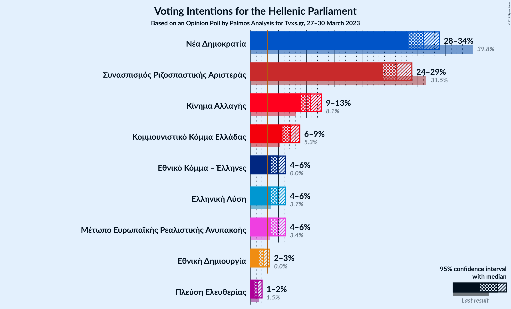
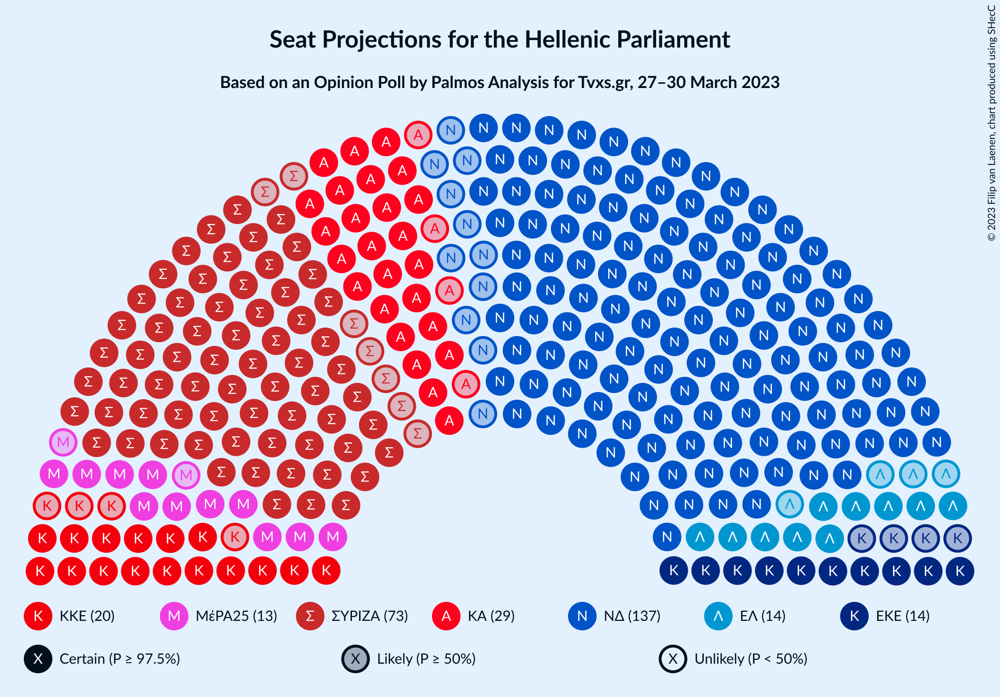
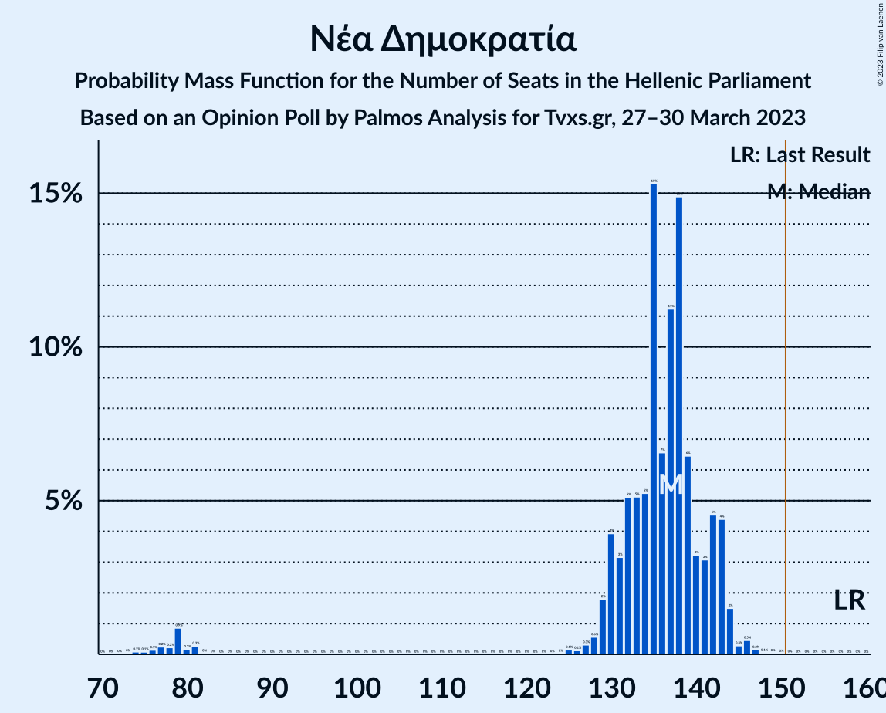
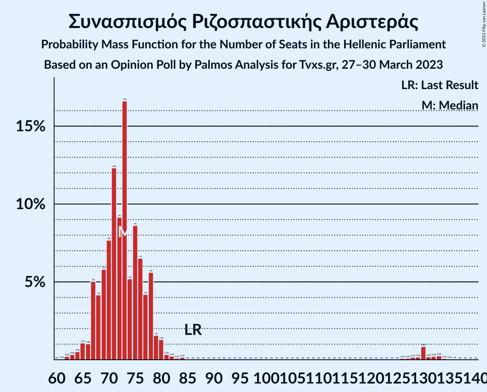
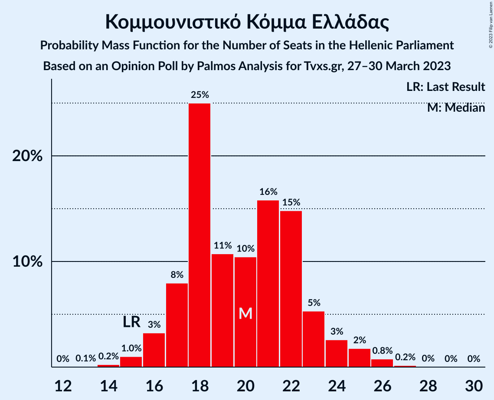
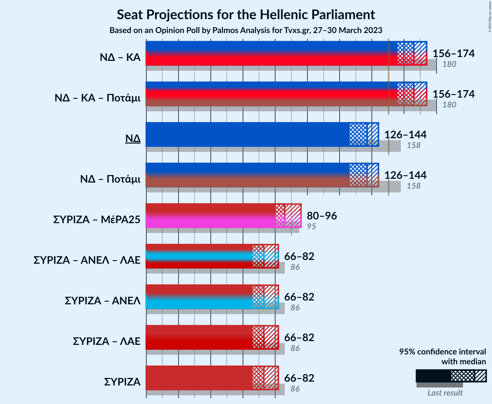
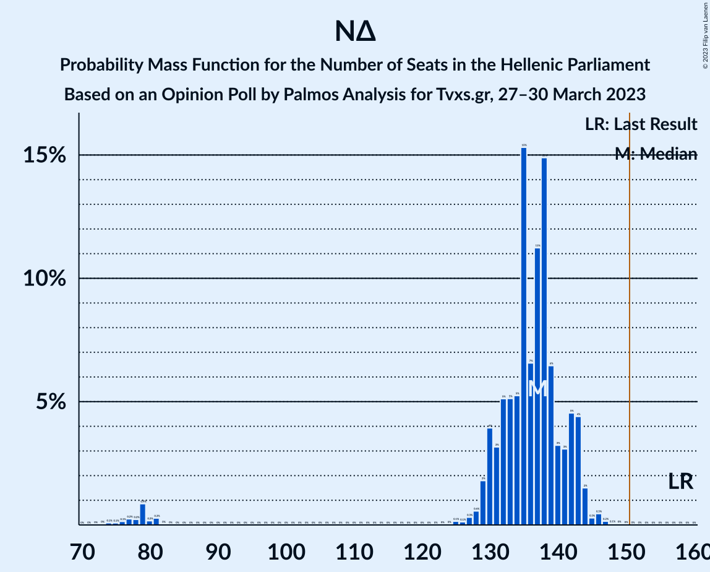
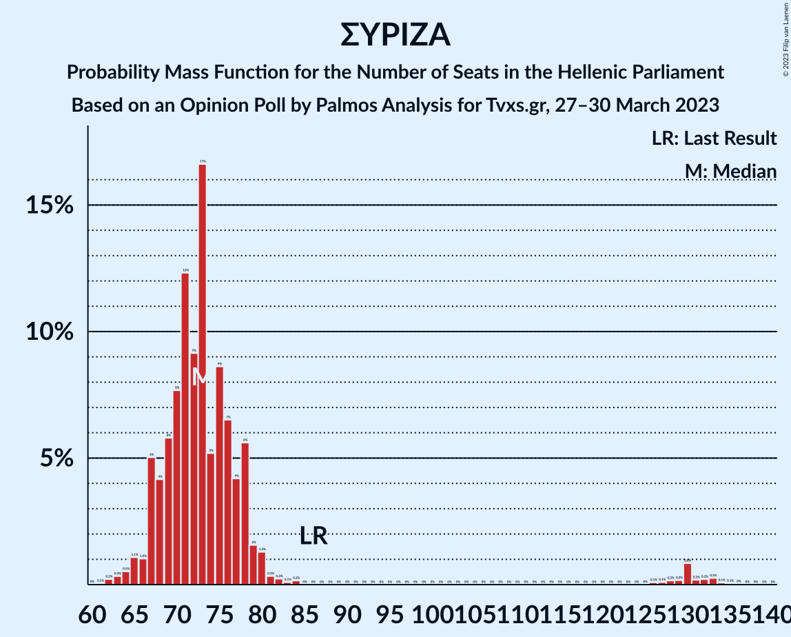

# Opinion Poll by Palmos Analysis for Tvxs.gr, 27–30 March 2023

<a href="#voting-intentions">Voting Intentions</a> | <a href="#seats">Seats</a> | <a href="#coalitions">Coalitions</a> | <a href="#technical-information">Technical Information</a>

## Voting Intentions

### Confidence Intervals

| Party | Last Result | Poll Result | 80% Confidence Interval | 90% Confidence Interval | 95% Confidence Interval | 99% Confidence Interval |
|:-----:|:-----------:|:-----------:|:-----------------------:|:-----------------------:|:-----------------------:|:-----------------------:|
| Νέα Δημοκρατία | 39.8% | 31.0% | 29.3–32.9% |28.8–33.4% |28.3–33.9% |27.5–34.8% |
| Συνασπισμός Ριζοσπαστικής Αριστεράς | 31.5% | 26.2% | 24.6–28.0% |24.1–28.5% |23.7–28.9% |22.9–29.8% |
| Κίνημα Αλλαγής | 8.1% | 10.7% | 9.6–12.0% |9.3–12.4% |9.0–12.7% |8.5–13.4% |
| Κομμουνιστικό Κόμμα Ελλάδας | 5.3% | 7.1% | 6.2–8.2% |5.9–8.5% |5.7–8.8% |5.3–9.4% |
| Ελληνική Λύση | 3.7% | 4.8% | 4.1–5.7% |3.9–6.0% |3.7–6.2% |3.4–6.7% |
| Μέτωπο Ευρωπαϊκής Ρεαλιστικής Ανυπακοής | 3.4% | 4.8% | 4.1–5.7% |3.9–6.0% |3.7–6.2% |3.4–6.7% |
| Πλεύση Ελευθερίας | 1.5% | 1.2% | 0.9–1.8% |0.8–1.9% |0.7–2.0% |0.6–2.3% |

*Note:* The poll result column reflects the actual value used in the calculations. Published results may vary slightly, and in addition be rounded to fewer digits.

## Seats

### Confidence Intervals

| Party | Last Result | Median | 80% Confidence Interval | 90% Confidence Interval | 95% Confidence Interval | 99% Confidence Interval |
|:-----:|:-----------:|:------:|:-----------------------:|:-----------------------:|:-----------------------:|:-----------------------:|
| <a href="#νέα-δημοκρατία">Νέα Δημοκρατία</a> | 158 | 141 | 136–147 |135–148 |133–149 |82–152 |
| <a href="#συνασπισμός-ριζοσπαστικής-αριστεράς">Συνασπισμός Ριζοσπαστικής Αριστεράς</a> | 86 | 77 | 72–82 |71–84 |70–85 |68–137 |
| <a href="#κίνημα-αλλαγής">Κίνημα Αλλαγής</a> | 22 | 32 | 28–35 |27–36 |26–37 |25–39 |
| <a href="#κομμουνιστικό-κόμμα-ελλάδας">Κομμουνιστικό Κόμμα Ελλάδας</a> | 15 | 21 | 18–24 |17–25 |17–26 |16–28 |
| <a href="#ελληνική-λύση">Ελληνική Λύση</a> | 10 | 14 | 12–17 |11–18 |11–19 |10–20 |
| <a href="#μέτωπο-ευρωπαϊκής-ρεαλιστικής-ανυπακοής">Μέτωπο Ευρωπαϊκής Ρεαλιστικής Ανυπακοής</a> | 9 | 14 | 12–17 |11–18 |11–18 |10–20 |
| <a href="#πλεύση-ελευθερίας">Πλεύση Ελευθερίας</a> | 0 | 0 | 0 |0 |0 |0 |

### Νέα Δημοκρατία

*For a full overview of the results for this party, see the [Νέα Δημοκρατία](party-νέαδημοκρατία.html) page.*

| Number of Seats | Probability | Accumulated | Special Marks |
|:---------------:|:-----------:|:-----------:|:-------------:|
| 78 | 0% | 100% |  |
| 79 | 0.1% | 99.9% |  |
| 80 | 0.1% | 99.9% |  |
| 81 | 0.2% | 99.7% |  |
| 82 | 0.3% | 99.5% |  |
| 83 | 0.3% | 99.2% |  |
| 84 | 0.2% | 98.9% |  |
| 85 | 0.2% | 98.7% |  |
| 86 | 0.2% | 98.6% |  |
| 87 | 0% | 98% |  |
| 88 | 0% | 98% |  |
| 89 | 0% | 98% |  |
| 90 | 0% | 98% |  |
| 91 | 0% | 98% |  |
| 92 | 0% | 98% |  |
| 93 | 0% | 98% |  |
| 94 | 0% | 98% |  |
| 95 | 0% | 98% |  |
| 96 | 0% | 98% |  |
| 97 | 0% | 98% |  |
| 98 | 0% | 98% |  |
| 99 | 0% | 98% |  |
| 100 | 0% | 98% |  |
| 101 | 0% | 98% |  |
| 102 | 0% | 98% |  |
| 103 | 0% | 98% |  |
| 104 | 0% | 98% |  |
| 105 | 0% | 98% |  |
| 106 | 0% | 98% |  |
| 107 | 0% | 98% |  |
| 108 | 0% | 98% |  |
| 109 | 0% | 98% |  |
| 110 | 0% | 98% |  |
| 111 | 0% | 98% |  |
| 112 | 0% | 98% |  |
| 113 | 0% | 98% |  |
| 114 | 0% | 98% |  |
| 115 | 0% | 98% |  |
| 116 | 0% | 98% |  |
| 117 | 0% | 98% |  |
| 118 | 0% | 98% |  |
| 119 | 0% | 98% |  |
| 120 | 0% | 98% |  |
| 121 | 0% | 98% |  |
| 122 | 0% | 98% |  |
| 123 | 0% | 98% |  |
| 124 | 0% | 98% |  |
| 125 | 0% | 98% |  |
| 126 | 0% | 98% |  |
| 127 | 0% | 98% |  |
| 128 | 0% | 98% |  |
| 129 | 0% | 98% |  |
| 130 | 0% | 98% |  |
| 131 | 0.1% | 98% |  |
| 132 | 0.4% | 98% |  |
| 133 | 0.9% | 98% |  |
| 134 | 2% | 97% |  |
| 135 | 3% | 95% |  |
| 136 | 4% | 93% |  |
| 137 | 6% | 89% |  |
| 138 | 7% | 83% |  |
| 139 | 8% | 76% |  |
| 140 | 9% | 68% |  |
| 141 | 10% | 59% | Median |
| 142 | 10% | 48% |  |
| 143 | 9% | 38% |  |
| 144 | 8% | 29% |  |
| 145 | 6% | 21% |  |
| 146 | 5% | 15% |  |
| 147 | 4% | 10% |  |
| 148 | 3% | 6% |  |
| 149 | 2% | 4% |  |
| 150 | 1.0% | 2% |  |
| 151 | 0.5% | 1.1% | Majority |
| 152 | 0.3% | 0.6% |  |
| 153 | 0.1% | 0.3% |  |
| 154 | 0.1% | 0.1% |  |
| 155 | 0% | 0.1% |  |
| 156 | 0% | 0% |  |
| 157 | 0% | 0% |  |
| 158 | 0% | 0% | Last Result |

### Συνασπισμός Ριζοσπαστικής Αριστεράς

*For a full overview of the results for this party, see the [Συνασπισμός Ριζοσπαστικής Αριστεράς](party-συνασπισμόςριζοσπαστικήςαριστεράς.html) page.*

| Number of Seats | Probability | Accumulated | Special Marks |
|:---------------:|:-----------:|:-----------:|:-------------:|
| 65 | 0.1% | 100% |  |
| 66 | 0.1% | 99.9% |  |
| 67 | 0.2% | 99.8% |  |
| 68 | 0.5% | 99.6% |  |
| 69 | 1.0% | 99.0% |  |
| 70 | 2% | 98% |  |
| 71 | 3% | 96% |  |
| 72 | 4% | 93% |  |
| 73 | 6% | 89% |  |
| 74 | 8% | 83% |  |
| 75 | 8% | 75% |  |
| 76 | 10% | 67% |  |
| 77 | 11% | 57% | Median |
| 78 | 9% | 46% |  |
| 79 | 9% | 37% |  |
| 80 | 8% | 27% |  |
| 81 | 6% | 19% |  |
| 82 | 4% | 13% |  |
| 83 | 4% | 9% |  |
| 84 | 2% | 5% |  |
| 85 | 1.0% | 3% |  |
| 86 | 0.6% | 2% | Last Result |
| 87 | 0.1% | 2% |  |
| 88 | 0.1% | 2% |  |
| 89 | 0% | 2% |  |
| 90 | 0% | 2% |  |
| 91 | 0% | 2% |  |
| 92 | 0% | 2% |  |
| 93 | 0% | 2% |  |
| 94 | 0% | 2% |  |
| 95 | 0% | 2% |  |
| 96 | 0% | 2% |  |
| 97 | 0% | 2% |  |
| 98 | 0% | 2% |  |
| 99 | 0% | 2% |  |
| 100 | 0% | 2% |  |
| 101 | 0% | 2% |  |
| 102 | 0% | 2% |  |
| 103 | 0% | 2% |  |
| 104 | 0% | 2% |  |
| 105 | 0% | 2% |  |
| 106 | 0% | 2% |  |
| 107 | 0% | 2% |  |
| 108 | 0% | 2% |  |
| 109 | 0% | 2% |  |
| 110 | 0% | 2% |  |
| 111 | 0% | 2% |  |
| 112 | 0% | 2% |  |
| 113 | 0% | 2% |  |
| 114 | 0% | 2% |  |
| 115 | 0% | 2% |  |
| 116 | 0% | 2% |  |
| 117 | 0% | 2% |  |
| 118 | 0% | 2% |  |
| 119 | 0% | 2% |  |
| 120 | 0% | 2% |  |
| 121 | 0% | 2% |  |
| 122 | 0% | 2% |  |
| 123 | 0% | 2% |  |
| 124 | 0% | 2% |  |
| 125 | 0% | 2% |  |
| 126 | 0% | 2% |  |
| 127 | 0% | 2% |  |
| 128 | 0% | 2% |  |
| 129 | 0% | 2% |  |
| 130 | 0% | 2% |  |
| 131 | 0% | 2% |  |
| 132 | 0.1% | 2% |  |
| 133 | 0.2% | 1.4% |  |
| 134 | 0.2% | 1.2% |  |
| 135 | 0.2% | 1.0% |  |
| 136 | 0.3% | 0.8% |  |
| 137 | 0.2% | 0.5% |  |
| 138 | 0.2% | 0.3% |  |
| 139 | 0.1% | 0.2% |  |
| 140 | 0% | 0.1% |  |
| 141 | 0% | 0% |  |

### Κίνημα Αλλαγής

*For a full overview of the results for this party, see the [Κίνημα Αλλαγής](party-κίνημααλλαγής.html) page.*

| Number of Seats | Probability | Accumulated | Special Marks |
|:---------------:|:-----------:|:-----------:|:-------------:|
| 22 | 0% | 100% | Last Result |
| 23 | 0.1% | 100% |  |
| 24 | 0.2% | 99.9% |  |
| 25 | 0.7% | 99.7% |  |
| 26 | 2% | 99.0% |  |
| 27 | 3% | 97% |  |
| 28 | 7% | 94% |  |
| 29 | 11% | 88% |  |
| 30 | 12% | 77% |  |
| 31 | 14% | 65% |  |
| 32 | 15% | 51% | Median |
| 33 | 10% | 36% |  |
| 34 | 12% | 26% |  |
| 35 | 6% | 14% |  |
| 36 | 4% | 8% |  |
| 37 | 2% | 4% |  |
| 38 | 1.3% | 2% |  |
| 39 | 0.5% | 0.8% |  |
| 40 | 0.2% | 0.3% |  |
| 41 | 0.1% | 0.1% |  |
| 42 | 0% | 0.1% |  |
| 43 | 0% | 0% |  |

### Κομμουνιστικό Κόμμα Ελλάδας

*For a full overview of the results for this party, see the [Κομμουνιστικό Κόμμα Ελλάδας](party-κομμουνιστικόκόμμαελλάδας.html) page.*

| Number of Seats | Probability | Accumulated | Special Marks |
|:---------------:|:-----------:|:-----------:|:-------------:|
| 14 | 0.1% | 100% |  |
| 15 | 0.4% | 99.9% | Last Result |
| 16 | 1.4% | 99.5% |  |
| 17 | 4% | 98% |  |
| 18 | 8% | 95% |  |
| 19 | 12% | 87% |  |
| 20 | 15% | 75% |  |
| 21 | 17% | 59% | Median |
| 22 | 16% | 43% |  |
| 23 | 12% | 27% |  |
| 24 | 7% | 14% |  |
| 25 | 4% | 7% |  |
| 26 | 2% | 3% |  |
| 27 | 0.9% | 1.4% |  |
| 28 | 0.4% | 0.5% |  |
| 29 | 0.1% | 0.2% |  |
| 30 | 0% | 0% |  |

### Ελληνική Λύση

*For a full overview of the results for this party, see the [Ελληνική Λύση](party-ελληνικήλύση.html) page.*

| Number of Seats | Probability | Accumulated | Special Marks |
|:---------------:|:-----------:|:-----------:|:-------------:|
| 0 | 0.1% | 100% |  |
| 1 | 0% | 99.9% |  |
| 2 | 0% | 99.9% |  |
| 3 | 0% | 99.9% |  |
| 4 | 0% | 99.9% |  |
| 5 | 0% | 99.9% |  |
| 6 | 0% | 99.9% |  |
| 7 | 0% | 99.9% |  |
| 8 | 0% | 99.9% |  |
| 9 | 0.2% | 99.9% |  |
| 10 | 2% | 99.7% | Last Result |
| 11 | 4% | 98% |  |
| 12 | 9% | 94% |  |
| 13 | 15% | 85% |  |
| 14 | 24% | 70% | Median |
| 15 | 21% | 46% |  |
| 16 | 11% | 25% |  |
| 17 | 7% | 14% |  |
| 18 | 4% | 7% |  |
| 19 | 2% | 3% |  |
| 20 | 0.5% | 0.6% |  |
| 21 | 0.1% | 0.2% |  |
| 22 | 0% | 0% |  |

### Μέτωπο Ευρωπαϊκής Ρεαλιστικής Ανυπακοής

*For a full overview of the results for this party, see the [Μέτωπο Ευρωπαϊκής Ρεαλιστικής Ανυπακοής](party-μέτωποευρωπαϊκήςρεαλιστικήςανυπακοής.html) page.*

| Number of Seats | Probability | Accumulated | Special Marks |
|:---------------:|:-----------:|:-----------:|:-------------:|
| 0 | 0.1% | 100% |  |
| 1 | 0% | 99.9% |  |
| 2 | 0% | 99.9% |  |
| 3 | 0% | 99.9% |  |
| 4 | 0% | 99.9% |  |
| 5 | 0% | 99.9% |  |
| 6 | 0% | 99.9% |  |
| 7 | 0% | 99.9% |  |
| 8 | 0% | 99.9% |  |
| 9 | 0.2% | 99.9% | Last Result |
| 10 | 1.4% | 99.7% |  |
| 11 | 5% | 98% |  |
| 12 | 11% | 94% |  |
| 13 | 17% | 83% |  |
| 14 | 20% | 65% | Median |
| 15 | 19% | 45% |  |
| 16 | 13% | 27% |  |
| 17 | 8% | 14% |  |
| 18 | 4% | 6% |  |
| 19 | 1.4% | 2% |  |
| 20 | 0.5% | 0.7% |  |
| 21 | 0.1% | 0.2% |  |
| 22 | 0% | 0.1% |  |
| 23 | 0% | 0% |  |

### Πλεύση Ελευθερίας

*For a full overview of the results for this party, see the [Πλεύση Ελευθερίας](party-πλεύσηελευθερίας.html) page.*

| Number of Seats | Probability | Accumulated | Special Marks |
|:---------------:|:-----------:|:-----------:|:-------------:|
| 0 | 100% | 100% | Last Result, Median |

## Coalitions

### Confidence Intervals

| Coalition | Last Result | Median | Majority? | 80% Confidence Interval | 90% Confidence Interval | 95% Confidence Interval | 99% Confidence Interval |
|:---------:|:-----------:|:------:|:---------:|:-----------------------:|:-----------------------:|:-----------------------:|:-----------------------:|
| Νέα Δημοκρατία – Κίνημα Αλλαγής | 180 | 173 | 98% | 167–178 | 166–180 | 164–181 | 113–184 |
| Νέα Δημοκρατία | 158 | 141 | 1.1% | 136–147 | 135–148 | 133–149 | 82–152 |
| Συνασπισμός Ριζοσπαστικής Αριστεράς – Μέτωπο Ευρωπαϊκής Ρεαλιστικής Ανυπακοής | 95 | 91 | 0.7% | 86–97 | 85–98 | 83–100 | 82–151 |
| Συνασπισμός Ριζοσπαστικής Αριστεράς | 86 | 77 | 0% | 72–82 | 71–84 | 70–85 | 68–137 |

### Νέα Δημοκρατία – Κίνημα Αλλαγής

| Number of Seats | Probability | Accumulated | Special Marks |
|:---------------:|:-----------:|:-----------:|:-------------:|
| 109 | 0% | 100% |  |
| 110 | 0% | 99.9% |  |
| 111 | 0% | 99.9% |  |
| 112 | 0.1% | 99.8% |  |
| 113 | 0.3% | 99.7% |  |
| 114 | 0.3% | 99.4% |  |
| 115 | 0.1% | 99.1% |  |
| 116 | 0.2% | 99.0% |  |
| 117 | 0.2% | 98.8% |  |
| 118 | 0.1% | 98.5% |  |
| 119 | 0% | 98% |  |
| 120 | 0% | 98% |  |
| 121 | 0% | 98% |  |
| 122 | 0% | 98% |  |
| 123 | 0% | 98% |  |
| 124 | 0% | 98% |  |
| 125 | 0% | 98% |  |
| 126 | 0% | 98% |  |
| 127 | 0% | 98% |  |
| 128 | 0% | 98% |  |
| 129 | 0% | 98% |  |
| 130 | 0% | 98% |  |
| 131 | 0% | 98% |  |
| 132 | 0% | 98% |  |
| 133 | 0% | 98% |  |
| 134 | 0% | 98% |  |
| 135 | 0% | 98% |  |
| 136 | 0% | 98% |  |
| 137 | 0% | 98% |  |
| 138 | 0% | 98% |  |
| 139 | 0% | 98% |  |
| 140 | 0% | 98% |  |
| 141 | 0% | 98% |  |
| 142 | 0% | 98% |  |
| 143 | 0% | 98% |  |
| 144 | 0% | 98% |  |
| 145 | 0% | 98% |  |
| 146 | 0% | 98% |  |
| 147 | 0% | 98% |  |
| 148 | 0% | 98% |  |
| 149 | 0% | 98% |  |
| 150 | 0% | 98% |  |
| 151 | 0% | 98% | Majority |
| 152 | 0% | 98% |  |
| 153 | 0% | 98% |  |
| 154 | 0% | 98% |  |
| 155 | 0% | 98% |  |
| 156 | 0% | 98% |  |
| 157 | 0% | 98% |  |
| 158 | 0% | 98% |  |
| 159 | 0% | 98% |  |
| 160 | 0% | 98% |  |
| 161 | 0% | 98% |  |
| 162 | 0.2% | 98% |  |
| 163 | 0.4% | 98% |  |
| 164 | 0.4% | 98% |  |
| 165 | 0.5% | 97% |  |
| 166 | 3% | 97% |  |
| 167 | 4% | 94% |  |
| 168 | 2% | 90% |  |
| 169 | 5% | 88% |  |
| 170 | 12% | 83% |  |
| 171 | 10% | 71% |  |
| 172 | 3% | 61% |  |
| 173 | 11% | 58% | Median |
| 174 | 16% | 47% |  |
| 175 | 6% | 31% |  |
| 176 | 4% | 25% |  |
| 177 | 7% | 21% |  |
| 178 | 7% | 14% |  |
| 179 | 1.4% | 7% |  |
| 180 | 1.4% | 6% | Last Result |
| 181 | 2% | 4% |  |
| 182 | 1.3% | 2% |  |
| 183 | 0.3% | 0.9% |  |
| 184 | 0.3% | 0.6% |  |
| 185 | 0.2% | 0.3% |  |
| 186 | 0.1% | 0.1% |  |
| 187 | 0% | 0% |  |

### Νέα Δημοκρατία

| Number of Seats | Probability | Accumulated | Special Marks |
|:---------------:|:-----------:|:-----------:|:-------------:|
| 78 | 0% | 100% |  |
| 79 | 0.1% | 99.9% |  |
| 80 | 0.1% | 99.9% |  |
| 81 | 0.2% | 99.7% |  |
| 82 | 0.3% | 99.5% |  |
| 83 | 0.3% | 99.2% |  |
| 84 | 0.2% | 98.9% |  |
| 85 | 0.2% | 98.7% |  |
| 86 | 0.2% | 98.6% |  |
| 87 | 0% | 98% |  |
| 88 | 0% | 98% |  |
| 89 | 0% | 98% |  |
| 90 | 0% | 98% |  |
| 91 | 0% | 98% |  |
| 92 | 0% | 98% |  |
| 93 | 0% | 98% |  |
| 94 | 0% | 98% |  |
| 95 | 0% | 98% |  |
| 96 | 0% | 98% |  |
| 97 | 0% | 98% |  |
| 98 | 0% | 98% |  |
| 99 | 0% | 98% |  |
| 100 | 0% | 98% |  |
| 101 | 0% | 98% |  |
| 102 | 0% | 98% |  |
| 103 | 0% | 98% |  |
| 104 | 0% | 98% |  |
| 105 | 0% | 98% |  |
| 106 | 0% | 98% |  |
| 107 | 0% | 98% |  |
| 108 | 0% | 98% |  |
| 109 | 0% | 98% |  |
| 110 | 0% | 98% |  |
| 111 | 0% | 98% |  |
| 112 | 0% | 98% |  |
| 113 | 0% | 98% |  |
| 114 | 0% | 98% |  |
| 115 | 0% | 98% |  |
| 116 | 0% | 98% |  |
| 117 | 0% | 98% |  |
| 118 | 0% | 98% |  |
| 119 | 0% | 98% |  |
| 120 | 0% | 98% |  |
| 121 | 0% | 98% |  |
| 122 | 0% | 98% |  |
| 123 | 0% | 98% |  |
| 124 | 0% | 98% |  |
| 125 | 0% | 98% |  |
| 126 | 0% | 98% |  |
| 127 | 0% | 98% |  |
| 128 | 0% | 98% |  |
| 129 | 0% | 98% |  |
| 130 | 0% | 98% |  |
| 131 | 0.1% | 98% |  |
| 132 | 0.4% | 98% |  |
| 133 | 0.9% | 98% |  |
| 134 | 2% | 97% |  |
| 135 | 3% | 95% |  |
| 136 | 4% | 93% |  |
| 137 | 6% | 89% |  |
| 138 | 7% | 83% |  |
| 139 | 8% | 76% |  |
| 140 | 9% | 68% |  |
| 141 | 10% | 59% | Median |
| 142 | 10% | 48% |  |
| 143 | 9% | 38% |  |
| 144 | 8% | 29% |  |
| 145 | 6% | 21% |  |
| 146 | 5% | 15% |  |
| 147 | 4% | 10% |  |
| 148 | 3% | 6% |  |
| 149 | 2% | 4% |  |
| 150 | 1.0% | 2% |  |
| 151 | 0.5% | 1.1% | Majority |
| 152 | 0.3% | 0.6% |  |
| 153 | 0.1% | 0.3% |  |
| 154 | 0.1% | 0.1% |  |
| 155 | 0% | 0.1% |  |
| 156 | 0% | 0% |  |
| 157 | 0% | 0% |  |
| 158 | 0% | 0% | Last Result |

### Συνασπισμός Ριζοσπαστικής Αριστεράς – Μέτωπο Ευρωπαϊκής Ρεαλιστικής Ανυπακοής

| Number of Seats | Probability | Accumulated | Special Marks |
|:---------------:|:-----------:|:-----------:|:-------------:|
| 79 | 0.1% | 100% |  |
| 80 | 0.1% | 99.8% |  |
| 81 | 0.2% | 99.7% |  |
| 82 | 0.4% | 99.5% |  |
| 83 | 2% | 99.2% |  |
| 84 | 1.2% | 97% |  |
| 85 | 2% | 96% |  |
| 86 | 6% | 94% |  |
| 87 | 5% | 88% |  |
| 88 | 4% | 83% |  |
| 89 | 6% | 79% |  |
| 90 | 19% | 73% |  |
| 91 | 5% | 54% | Median |
| 92 | 6% | 49% |  |
| 93 | 12% | 43% |  |
| 94 | 12% | 31% |  |
| 95 | 4% | 20% | Last Result |
| 96 | 3% | 16% |  |
| 97 | 7% | 13% |  |
| 98 | 2% | 6% |  |
| 99 | 0.9% | 4% |  |
| 100 | 0.9% | 3% |  |
| 101 | 0.7% | 2% |  |
| 102 | 0.1% | 2% |  |
| 103 | 0% | 2% |  |
| 104 | 0% | 2% |  |
| 105 | 0% | 2% |  |
| 106 | 0% | 2% |  |
| 107 | 0% | 2% |  |
| 108 | 0% | 2% |  |
| 109 | 0% | 2% |  |
| 110 | 0% | 2% |  |
| 111 | 0% | 2% |  |
| 112 | 0% | 2% |  |
| 113 | 0% | 2% |  |
| 114 | 0% | 2% |  |
| 115 | 0% | 2% |  |
| 116 | 0% | 2% |  |
| 117 | 0% | 2% |  |
| 118 | 0% | 2% |  |
| 119 | 0% | 2% |  |
| 120 | 0% | 2% |  |
| 121 | 0% | 2% |  |
| 122 | 0% | 2% |  |
| 123 | 0% | 2% |  |
| 124 | 0% | 2% |  |
| 125 | 0% | 2% |  |
| 126 | 0% | 2% |  |
| 127 | 0% | 2% |  |
| 128 | 0% | 2% |  |
| 129 | 0% | 2% |  |
| 130 | 0% | 2% |  |
| 131 | 0% | 2% |  |
| 132 | 0% | 2% |  |
| 133 | 0% | 2% |  |
| 134 | 0% | 2% |  |
| 135 | 0% | 2% |  |
| 136 | 0% | 2% |  |
| 137 | 0% | 2% |  |
| 138 | 0% | 2% |  |
| 139 | 0% | 2% |  |
| 140 | 0% | 2% |  |
| 141 | 0% | 2% |  |
| 142 | 0% | 2% |  |
| 143 | 0% | 2% |  |
| 144 | 0% | 2% |  |
| 145 | 0% | 2% |  |
| 146 | 0.1% | 2% |  |
| 147 | 0.1% | 1.5% |  |
| 148 | 0.2% | 1.4% |  |
| 149 | 0.2% | 1.2% |  |
| 150 | 0.3% | 1.0% |  |
| 151 | 0.4% | 0.7% | Majority |
| 152 | 0.1% | 0.3% |  |
| 153 | 0% | 0.2% |  |
| 154 | 0.1% | 0.2% |  |
| 155 | 0% | 0.1% |  |
| 156 | 0% | 0% |  |

### Συνασπισμός Ριζοσπαστικής Αριστεράς

| Number of Seats | Probability | Accumulated | Special Marks |
|:---------------:|:-----------:|:-----------:|:-------------:|
| 65 | 0.1% | 100% |  |
| 66 | 0.1% | 99.9% |  |
| 67 | 0.2% | 99.8% |  |
| 68 | 0.5% | 99.6% |  |
| 69 | 1.0% | 99.0% |  |
| 70 | 2% | 98% |  |
| 71 | 3% | 96% |  |
| 72 | 4% | 93% |  |
| 73 | 6% | 89% |  |
| 74 | 8% | 83% |  |
| 75 | 8% | 75% |  |
| 76 | 10% | 67% |  |
| 77 | 11% | 57% | Median |
| 78 | 9% | 46% |  |
| 79 | 9% | 37% |  |
| 80 | 8% | 27% |  |
| 81 | 6% | 19% |  |
| 82 | 4% | 13% |  |
| 83 | 4% | 9% |  |
| 84 | 2% | 5% |  |
| 85 | 1.0% | 3% |  |
| 86 | 0.6% | 2% | Last Result |
| 87 | 0.1% | 2% |  |
| 88 | 0.1% | 2% |  |
| 89 | 0% | 2% |  |
| 90 | 0% | 2% |  |
| 91 | 0% | 2% |  |
| 92 | 0% | 2% |  |
| 93 | 0% | 2% |  |
| 94 | 0% | 2% |  |
| 95 | 0% | 2% |  |
| 96 | 0% | 2% |  |
| 97 | 0% | 2% |  |
| 98 | 0% | 2% |  |
| 99 | 0% | 2% |  |
| 100 | 0% | 2% |  |
| 101 | 0% | 2% |  |
| 102 | 0% | 2% |  |
| 103 | 0% | 2% |  |
| 104 | 0% | 2% |  |
| 105 | 0% | 2% |  |
| 106 | 0% | 2% |  |
| 107 | 0% | 2% |  |
| 108 | 0% | 2% |  |
| 109 | 0% | 2% |  |
| 110 | 0% | 2% |  |
| 111 | 0% | 2% |  |
| 112 | 0% | 2% |  |
| 113 | 0% | 2% |  |
| 114 | 0% | 2% |  |
| 115 | 0% | 2% |  |
| 116 | 0% | 2% |  |
| 117 | 0% | 2% |  |
| 118 | 0% | 2% |  |
| 119 | 0% | 2% |  |
| 120 | 0% | 2% |  |
| 121 | 0% | 2% |  |
| 122 | 0% | 2% |  |
| 123 | 0% | 2% |  |
| 124 | 0% | 2% |  |
| 125 | 0% | 2% |  |
| 126 | 0% | 2% |  |
| 127 | 0% | 2% |  |
| 128 | 0% | 2% |  |
| 129 | 0% | 2% |  |
| 130 | 0% | 2% |  |
| 131 | 0% | 2% |  |
| 132 | 0.1% | 2% |  |
| 133 | 0.2% | 1.4% |  |
| 134 | 0.2% | 1.2% |  |
| 135 | 0.2% | 1.0% |  |
| 136 | 0.3% | 0.8% |  |
| 137 | 0.2% | 0.5% |  |
| 138 | 0.2% | 0.3% |  |
| 139 | 0.1% | 0.2% |  |
| 140 | 0% | 0.1% |  |
| 141 | 0% | 0% |  |

## Technical Information

### Opinion Poll

+ **Polling firm:** Palmos Analysis
+ **Commissioner(s):** Tvxs.gr
+ **Fieldwork period:** 27–30 March 2023

### Calculations

+ **Sample size:** 1083
+ **Simulations done:** 1,048,576
+ **Error estimate:** 0.84%

