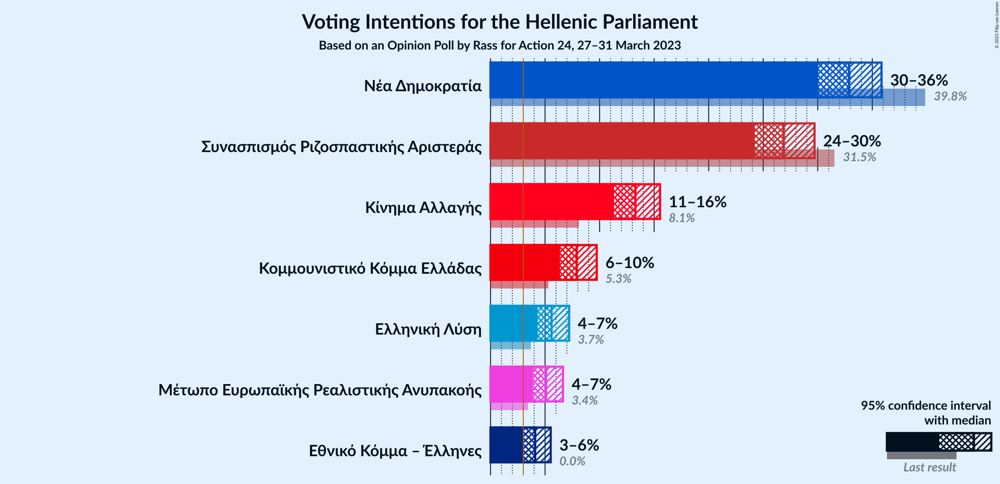
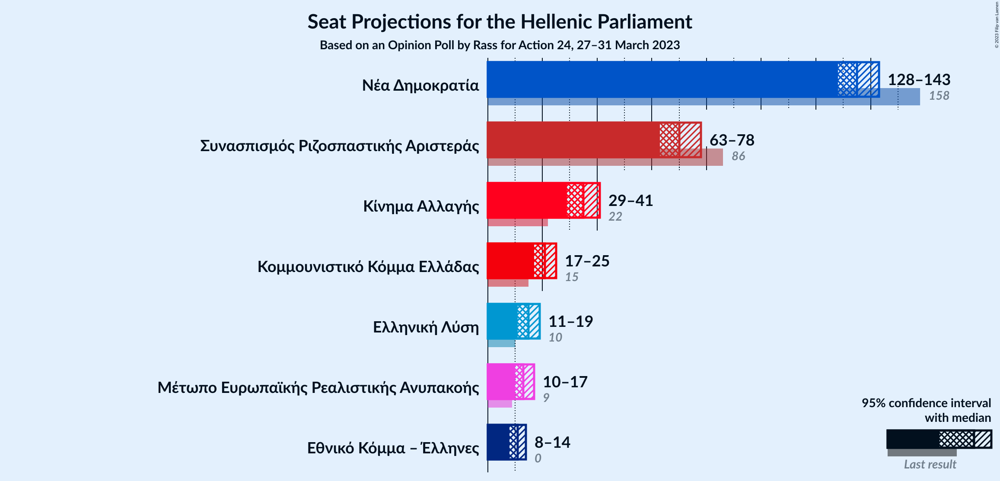
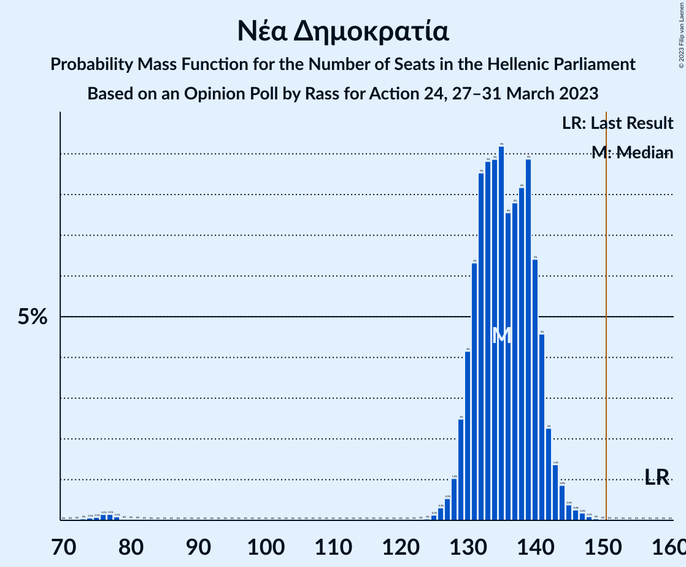
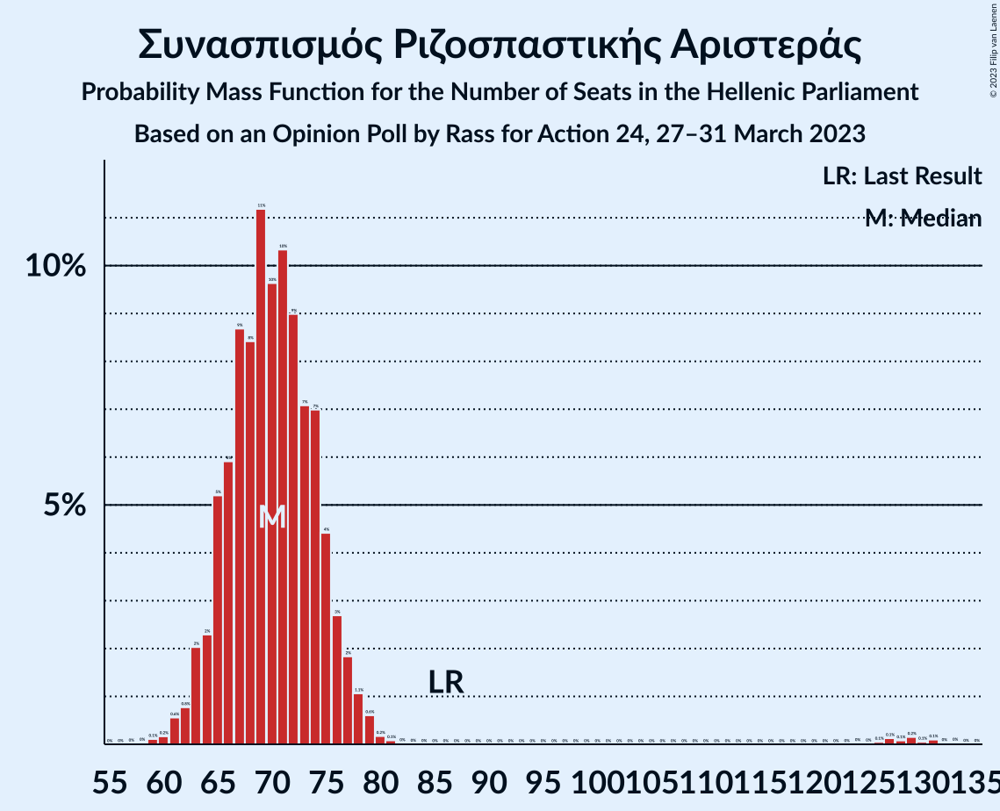
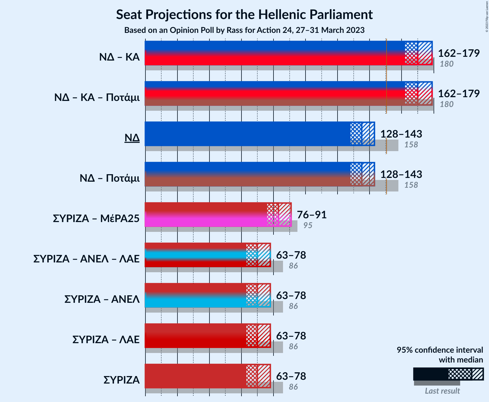
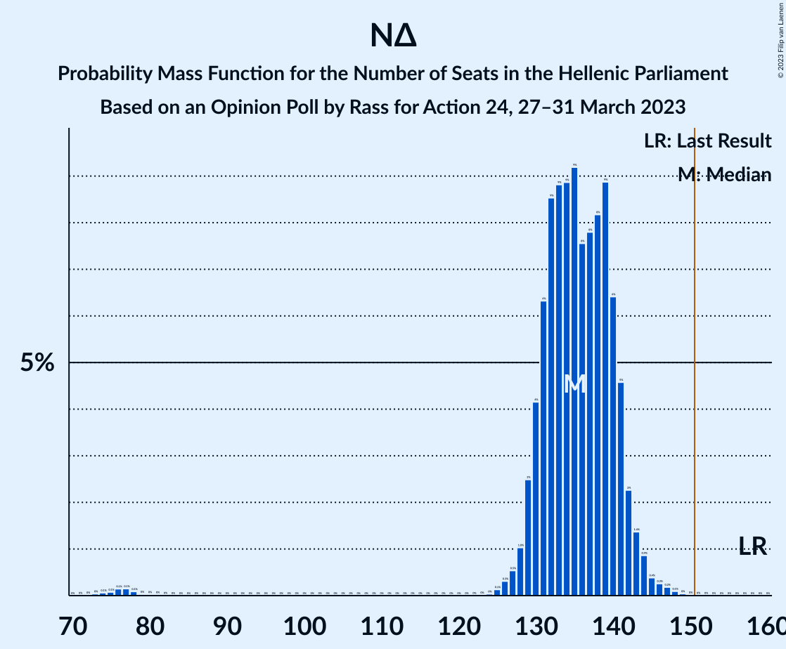

# Opinion Poll by Rass for Action 24, 27–31 March 2023

<a href="#voting-intentions">Voting Intentions</a> | <a href="#seats">Seats</a> | <a href="#coalitions">Coalitions</a> | <a href="#technical-information">Technical Information</a>

## Voting Intentions

### Confidence Intervals

| Party | Last Result | Poll Result | 80% Confidence Interval | 90% Confidence Interval | 95% Confidence Interval | 99% Confidence Interval |
|:-----:|:-----------:|:-----------:|:-----------------------:|:-----------------------:|:-----------------------:|:-----------------------:|
| Νέα Δημοκρατία | 39.8% | 32.9% | 31.0–34.8% |30.5–35.4% |30.0–35.8% |29.1–36.8% |
| Συνασπισμός Ριζοσπαστικής Αριστεράς | 31.5% | 26.9% | 25.1–28.7% |24.6–29.2% |24.2–29.7% |23.4–30.6% |
| Κίνημα Αλλαγής | 8.1% | 13.3% | 12.0–14.8% |11.6–15.2% |11.3–15.5% |10.7–16.3% |
| Κομμουνιστικό Κόμμα Ελλάδας | 5.3% | 7.9% | 6.9–9.1% |6.6–9.4% |6.4–9.7% |5.9–10.3% |
| Ελληνική Λύση | 3.7% | 5.6% | 4.8–6.6% |4.5–6.9% |4.3–7.2% |4.0–7.7% |
| Μέτωπο Ευρωπαϊκής Ρεαλιστικής Ανυπακοής | 3.4% | 5.1% | 4.3–6.1% |4.1–6.4% |3.9–6.6% |3.6–7.2% |
| Εθνικό Κόμμα – Έλληνες | 0.0% | 4.1% | 3.4–5.0% |3.2–5.3% |3.0–5.5% |2.7–6.0% |

*Note:* The poll result column reflects the actual value used in the calculations. Published results may vary slightly, and in addition be rounded to fewer digits.

## Seats

### Confidence Intervals

| Party | Last Result | Median | 80% Confidence Interval | 90% Confidence Interval | 95% Confidence Interval | 99% Confidence Interval |
|:-----:|:-----------:|:------:|:-----------------------:|:-----------------------:|:-----------------------:|:-----------------------:|
| <a href="#νέα-δημοκρατία">Νέα Δημοκρατία</a> | 158 | 135 | 131–141 |129–142 |128–143 |78–146 |
| <a href="#συνασπισμός-ριζοσπαστικής-αριστεράς">Συνασπισμός Ριζοσπαστικής Αριστεράς</a> | 86 | 70 | 65–75 |64–76 |63–78 |61–127 |
| <a href="#κίνημα-αλλαγής">Κίνημα Αλλαγής</a> | 22 | 35 | 31–39 |30–40 |29–41 |28–42 |
| <a href="#κομμουνιστικό-κόμμα-ελλάδας">Κομμουνιστικό Κόμμα Ελλάδας</a> | 15 | 21 | 18–24 |17–25 |17–25 |15–27 |
| <a href="#ελληνική-λύση">Ελληνική Λύση</a> | 10 | 15 | 12–17 |12–18 |11–19 |10–20 |
| <a href="#μέτωπο-ευρωπαϊκής-ρεαλιστικής-ανυπακοής">Μέτωπο Ευρωπαϊκής Ρεαλιστικής Ανυπακοής</a> | 9 | 13 | 11–16 |11–17 |10–17 |9–19 |
| <a href="#εθνικό-κόμμα-–-έλληνες">Εθνικό Κόμμα – Έλληνες</a> | 0 | 11 | 9–13 |8–14 |8–14 |0–16 |

### Νέα Δημοκρατία

*For a full overview of the results for this party, see the [Νέα Δημοκρατία](party-νέαδημοκρατία.html) page.*

| Number of Seats | Probability | Accumulated | Special Marks |
|:---------------:|:-----------:|:-----------:|:-------------:|
| 73 | 0% | 100% |  |
| 74 | 0.1% | 99.9% |  |
| 75 | 0.1% | 99.9% |  |
| 76 | 0.1% | 99.8% |  |
| 77 | 0.1% | 99.7% |  |
| 78 | 0.1% | 99.5% |  |
| 79 | 0% | 99.4% |  |
| 80 | 0% | 99.4% |  |
| 81 | 0% | 99.4% |  |
| 82 | 0% | 99.3% |  |
| 83 | 0% | 99.3% |  |
| 84 | 0% | 99.3% |  |
| 85 | 0% | 99.3% |  |
| 86 | 0% | 99.3% |  |
| 87 | 0% | 99.3% |  |
| 88 | 0% | 99.3% |  |
| 89 | 0% | 99.3% |  |
| 90 | 0% | 99.3% |  |
| 91 | 0% | 99.3% |  |
| 92 | 0% | 99.3% |  |
| 93 | 0% | 99.3% |  |
| 94 | 0% | 99.3% |  |
| 95 | 0% | 99.3% |  |
| 96 | 0% | 99.3% |  |
| 97 | 0% | 99.3% |  |
| 98 | 0% | 99.3% |  |
| 99 | 0% | 99.3% |  |
| 100 | 0% | 99.3% |  |
| 101 | 0% | 99.3% |  |
| 102 | 0% | 99.3% |  |
| 103 | 0% | 99.3% |  |
| 104 | 0% | 99.3% |  |
| 105 | 0% | 99.3% |  |
| 106 | 0% | 99.3% |  |
| 107 | 0% | 99.3% |  |
| 108 | 0% | 99.3% |  |
| 109 | 0% | 99.3% |  |
| 110 | 0% | 99.3% |  |
| 111 | 0% | 99.3% |  |
| 112 | 0% | 99.3% |  |
| 113 | 0% | 99.3% |  |
| 114 | 0% | 99.3% |  |
| 115 | 0% | 99.3% |  |
| 116 | 0% | 99.3% |  |
| 117 | 0% | 99.3% |  |
| 118 | 0% | 99.3% |  |
| 119 | 0% | 99.3% |  |
| 120 | 0% | 99.3% |  |
| 121 | 0% | 99.3% |  |
| 122 | 0% | 99.3% |  |
| 123 | 0% | 99.3% |  |
| 124 | 0% | 99.3% |  |
| 125 | 0.1% | 99.3% |  |
| 126 | 0.3% | 99.1% |  |
| 127 | 0.5% | 98.8% |  |
| 128 | 1.0% | 98% |  |
| 129 | 2% | 97% |  |
| 130 | 4% | 95% |  |
| 131 | 6% | 91% |  |
| 132 | 9% | 84% |  |
| 133 | 9% | 76% |  |
| 134 | 9% | 67% |  |
| 135 | 9% | 58% | Median |
| 136 | 8% | 49% |  |
| 137 | 8% | 41% |  |
| 138 | 8% | 34% |  |
| 139 | 9% | 25% |  |
| 140 | 6% | 16% |  |
| 141 | 5% | 10% |  |
| 142 | 2% | 5% |  |
| 143 | 1.4% | 3% |  |
| 144 | 0.9% | 2% |  |
| 145 | 0.4% | 1.0% |  |
| 146 | 0.3% | 0.6% |  |
| 147 | 0.2% | 0.3% |  |
| 148 | 0.1% | 0.2% |  |
| 149 | 0% | 0.1% |  |
| 150 | 0% | 0% |  |
| 151 | 0% | 0% | Majority |
| 152 | 0% | 0% |  |
| 153 | 0% | 0% |  |
| 154 | 0% | 0% |  |
| 155 | 0% | 0% |  |
| 156 | 0% | 0% |  |
| 157 | 0% | 0% |  |
| 158 | 0% | 0% | Last Result |

### Συνασπισμός Ριζοσπαστικής Αριστεράς

*For a full overview of the results for this party, see the [Συνασπισμός Ριζοσπαστικής Αριστεράς](party-συνασπισμόςριζοσπαστικήςαριστεράς.html) page.*

| Number of Seats | Probability | Accumulated | Special Marks |
|:---------------:|:-----------:|:-----------:|:-------------:|
| 59 | 0.1% | 100% |  |
| 60 | 0.2% | 99.8% |  |
| 61 | 0.6% | 99.7% |  |
| 62 | 0.8% | 99.1% |  |
| 63 | 2% | 98% |  |
| 64 | 2% | 96% |  |
| 65 | 5% | 94% |  |
| 66 | 6% | 89% |  |
| 67 | 9% | 83% |  |
| 68 | 8% | 74% |  |
| 69 | 11% | 66% |  |
| 70 | 10% | 55% | Median |
| 71 | 10% | 45% |  |
| 72 | 9% | 35% |  |
| 73 | 7% | 26% |  |
| 74 | 7% | 19% |  |
| 75 | 4% | 12% |  |
| 76 | 3% | 7% |  |
| 77 | 2% | 4% |  |
| 78 | 1.1% | 3% |  |
| 79 | 0.6% | 2% |  |
| 80 | 0.2% | 1.0% |  |
| 81 | 0.1% | 0.8% |  |
| 82 | 0% | 0.7% |  |
| 83 | 0% | 0.7% |  |
| 84 | 0% | 0.7% |  |
| 85 | 0% | 0.7% |  |
| 86 | 0% | 0.7% | Last Result |
| 87 | 0% | 0.7% |  |
| 88 | 0% | 0.7% |  |
| 89 | 0% | 0.7% |  |
| 90 | 0% | 0.7% |  |
| 91 | 0% | 0.7% |  |
| 92 | 0% | 0.7% |  |
| 93 | 0% | 0.7% |  |
| 94 | 0% | 0.7% |  |
| 95 | 0% | 0.7% |  |
| 96 | 0% | 0.7% |  |
| 97 | 0% | 0.7% |  |
| 98 | 0% | 0.7% |  |
| 99 | 0% | 0.7% |  |
| 100 | 0% | 0.7% |  |
| 101 | 0% | 0.7% |  |
| 102 | 0% | 0.7% |  |
| 103 | 0% | 0.7% |  |
| 104 | 0% | 0.7% |  |
| 105 | 0% | 0.7% |  |
| 106 | 0% | 0.7% |  |
| 107 | 0% | 0.7% |  |
| 108 | 0% | 0.7% |  |
| 109 | 0% | 0.7% |  |
| 110 | 0% | 0.7% |  |
| 111 | 0% | 0.7% |  |
| 112 | 0% | 0.7% |  |
| 113 | 0% | 0.7% |  |
| 114 | 0% | 0.7% |  |
| 115 | 0% | 0.7% |  |
| 116 | 0% | 0.7% |  |
| 117 | 0% | 0.7% |  |
| 118 | 0% | 0.7% |  |
| 119 | 0% | 0.7% |  |
| 120 | 0% | 0.7% |  |
| 121 | 0% | 0.7% |  |
| 122 | 0% | 0.7% |  |
| 123 | 0% | 0.7% |  |
| 124 | 0% | 0.7% |  |
| 125 | 0% | 0.6% |  |
| 126 | 0.1% | 0.6% |  |
| 127 | 0.1% | 0.6% |  |
| 128 | 0.1% | 0.5% |  |
| 129 | 0.2% | 0.4% |  |
| 130 | 0.1% | 0.2% |  |
| 131 | 0.1% | 0.2% |  |
| 132 | 0% | 0.1% |  |
| 133 | 0% | 0% |  |

### Κίνημα Αλλαγής

*For a full overview of the results for this party, see the [Κίνημα Αλλαγής](party-κίνημααλλαγής.html) page.*

| Number of Seats | Probability | Accumulated | Special Marks |
|:---------------:|:-----------:|:-----------:|:-------------:|
| 22 | 0% | 100% | Last Result |
| 23 | 0% | 100% |  |
| 24 | 0% | 100% |  |
| 25 | 0% | 100% |  |
| 26 | 0.1% | 100% |  |
| 27 | 0.2% | 99.9% |  |
| 28 | 0.7% | 99.7% |  |
| 29 | 2% | 99.1% |  |
| 30 | 4% | 97% |  |
| 31 | 6% | 94% |  |
| 32 | 11% | 88% |  |
| 33 | 13% | 77% |  |
| 34 | 12% | 64% |  |
| 35 | 14% | 52% | Median |
| 36 | 11% | 38% |  |
| 37 | 9% | 27% |  |
| 38 | 8% | 18% |  |
| 39 | 5% | 10% |  |
| 40 | 3% | 5% |  |
| 41 | 2% | 3% |  |
| 42 | 0.7% | 1.1% |  |
| 43 | 0.3% | 0.4% |  |
| 44 | 0.1% | 0.1% |  |
| 45 | 0% | 0.1% |  |
| 46 | 0% | 0% |  |

### Κομμουνιστικό Κόμμα Ελλάδας

*For a full overview of the results for this party, see the [Κομμουνιστικό Κόμμα Ελλάδας](party-κομμουνιστικόκόμμαελλάδας.html) page.*

| Number of Seats | Probability | Accumulated | Special Marks |
|:---------------:|:-----------:|:-----------:|:-------------:|
| 14 | 0.1% | 100% |  |
| 15 | 0.4% | 99.9% | Last Result |
| 16 | 2% | 99.5% |  |
| 17 | 5% | 98% |  |
| 18 | 9% | 93% |  |
| 19 | 14% | 84% |  |
| 20 | 18% | 70% |  |
| 21 | 16% | 52% | Median |
| 22 | 15% | 36% |  |
| 23 | 11% | 22% |  |
| 24 | 6% | 11% |  |
| 25 | 3% | 5% |  |
| 26 | 1.3% | 2% |  |
| 27 | 0.5% | 0.8% |  |
| 28 | 0.2% | 0.3% |  |
| 29 | 0.1% | 0.1% |  |
| 30 | 0% | 0% |  |

### Ελληνική Λύση

*For a full overview of the results for this party, see the [Ελληνική Λύση](party-ελληνικήλύση.html) page.*

| Number of Seats | Probability | Accumulated | Special Marks |
|:---------------:|:-----------:|:-----------:|:-------------:|
| 9 | 0.1% | 100% |  |
| 10 | 0.6% | 99.9% | Last Result |
| 11 | 3% | 99.3% |  |
| 12 | 8% | 97% |  |
| 13 | 18% | 88% |  |
| 14 | 19% | 70% |  |
| 15 | 17% | 51% | Median |
| 16 | 14% | 33% |  |
| 17 | 10% | 20% |  |
| 18 | 7% | 10% |  |
| 19 | 2% | 3% |  |
| 20 | 0.7% | 0.9% |  |
| 21 | 0.2% | 0.3% |  |
| 22 | 0.1% | 0.1% |  |
| 23 | 0% | 0% |  |

### Μέτωπο Ευρωπαϊκής Ρεαλιστικής Ανυπακοής

*For a full overview of the results for this party, see the [Μέτωπο Ευρωπαϊκής Ρεαλιστικής Ανυπακοής](party-μέτωποευρωπαϊκήςρεαλιστικήςανυπακοής.html) page.*

| Number of Seats | Probability | Accumulated | Special Marks |
|:---------------:|:-----------:|:-----------:|:-------------:|
| 8 | 0.1% | 100% |  |
| 9 | 0.7% | 99.9% | Last Result |
| 10 | 4% | 99.2% |  |
| 11 | 9% | 95% |  |
| 12 | 17% | 86% |  |
| 13 | 22% | 69% | Median |
| 14 | 19% | 47% |  |
| 15 | 15% | 28% |  |
| 16 | 7% | 13% |  |
| 17 | 4% | 6% |  |
| 18 | 1.4% | 2% |  |
| 19 | 0.4% | 0.6% |  |
| 20 | 0.1% | 0.1% |  |
| 21 | 0% | 0% |  |

### Εθνικό Κόμμα – Έλληνες

*For a full overview of the results for this party, see the [Εθνικό Κόμμα – Έλληνες](party-εθνικόκόμμα–έλληνες.html) page.*

| Number of Seats | Probability | Accumulated | Special Marks |
|:---------------:|:-----------:|:-----------:|:-------------:|
| 0 | 2% | 100% | Last Result |
| 1 | 0% | 98% |  |
| 2 | 0% | 98% |  |
| 3 | 0% | 98% |  |
| 4 | 0% | 98% |  |
| 5 | 0% | 98% |  |
| 6 | 0% | 98% |  |
| 7 | 0% | 98% |  |
| 8 | 4% | 98% |  |
| 9 | 14% | 94% |  |
| 10 | 23% | 80% |  |
| 11 | 22% | 58% | Median |
| 12 | 18% | 35% |  |
| 13 | 11% | 17% |  |
| 14 | 4% | 7% |  |
| 15 | 2% | 2% |  |
| 16 | 0.5% | 0.6% |  |
| 17 | 0.1% | 0.1% |  |
| 18 | 0% | 0% |  |

## Coalitions

### Confidence Intervals

| Coalition | Last Result | Median | Majority? | 80% Confidence Interval | 90% Confidence Interval | 95% Confidence Interval | 99% Confidence Interval |
|:---------:|:-----------:|:------:|:---------:|:-----------------------:|:-----------------------:|:-----------------------:|:-----------------------:|
| Νέα Δημοκρατία – Κίνημα Αλλαγής | 180 | 170 | 99.3% | 165–176 | 164–177 | 162–179 | 113–181 |
| Νέα Δημοκρατία | 158 | 135 | 0% | 131–141 | 129–142 | 128–143 | 78–146 |
| Συνασπισμός Ριζοσπαστικής Αριστεράς – Μέτωπο Ευρωπαϊκής Ρεαλιστικής Ανυπακοής | 95 | 83 | 0% | 79–88 | 77–90 | 76–91 | 74–141 |
| Συνασπισμός Ριζοσπαστικής Αριστεράς | 86 | 70 | 0% | 65–75 | 64–76 | 63–78 | 61–127 |

### Νέα Δημοκρατία – Κίνημα Αλλαγής

| Number of Seats | Probability | Accumulated | Special Marks |
|:---------------:|:-----------:|:-----------:|:-------------:|
| 107 | 0% | 100% |  |
| 108 | 0% | 99.9% |  |
| 109 | 0.1% | 99.9% |  |
| 110 | 0.1% | 99.8% |  |
| 111 | 0.1% | 99.8% |  |
| 112 | 0.1% | 99.7% |  |
| 113 | 0.1% | 99.6% |  |
| 114 | 0.1% | 99.5% |  |
| 115 | 0% | 99.4% |  |
| 116 | 0% | 99.4% |  |
| 117 | 0% | 99.4% |  |
| 118 | 0% | 99.3% |  |
| 119 | 0% | 99.3% |  |
| 120 | 0% | 99.3% |  |
| 121 | 0% | 99.3% |  |
| 122 | 0% | 99.3% |  |
| 123 | 0% | 99.3% |  |
| 124 | 0% | 99.3% |  |
| 125 | 0% | 99.3% |  |
| 126 | 0% | 99.3% |  |
| 127 | 0% | 99.3% |  |
| 128 | 0% | 99.3% |  |
| 129 | 0% | 99.3% |  |
| 130 | 0% | 99.3% |  |
| 131 | 0% | 99.3% |  |
| 132 | 0% | 99.3% |  |
| 133 | 0% | 99.3% |  |
| 134 | 0% | 99.3% |  |
| 135 | 0% | 99.3% |  |
| 136 | 0% | 99.3% |  |
| 137 | 0% | 99.3% |  |
| 138 | 0% | 99.3% |  |
| 139 | 0% | 99.3% |  |
| 140 | 0% | 99.3% |  |
| 141 | 0% | 99.3% |  |
| 142 | 0% | 99.3% |  |
| 143 | 0% | 99.3% |  |
| 144 | 0% | 99.3% |  |
| 145 | 0% | 99.3% |  |
| 146 | 0% | 99.3% |  |
| 147 | 0% | 99.3% |  |
| 148 | 0% | 99.3% |  |
| 149 | 0% | 99.3% |  |
| 150 | 0% | 99.3% |  |
| 151 | 0% | 99.3% | Majority |
| 152 | 0% | 99.3% |  |
| 153 | 0% | 99.3% |  |
| 154 | 0% | 99.3% |  |
| 155 | 0% | 99.3% |  |
| 156 | 0% | 99.3% |  |
| 157 | 0% | 99.3% |  |
| 158 | 0.1% | 99.3% |  |
| 159 | 0.1% | 99.2% |  |
| 160 | 0.3% | 99.1% |  |
| 161 | 0.6% | 98.8% |  |
| 162 | 1.4% | 98% |  |
| 163 | 2% | 97% |  |
| 164 | 3% | 95% |  |
| 165 | 5% | 92% |  |
| 166 | 5% | 87% |  |
| 167 | 8% | 82% |  |
| 168 | 7% | 74% |  |
| 169 | 11% | 67% |  |
| 170 | 9% | 56% | Median |
| 171 | 8% | 47% |  |
| 172 | 9% | 39% |  |
| 173 | 9% | 30% |  |
| 174 | 5% | 21% |  |
| 175 | 6% | 16% |  |
| 176 | 3% | 10% |  |
| 177 | 3% | 7% |  |
| 178 | 2% | 4% |  |
| 179 | 1.1% | 3% |  |
| 180 | 0.7% | 1.5% | Last Result |
| 181 | 0.4% | 0.8% |  |
| 182 | 0.2% | 0.4% |  |
| 183 | 0.1% | 0.2% |  |
| 184 | 0.1% | 0.1% |  |
| 185 | 0% | 0.1% |  |
| 186 | 0% | 0% |  |

### Νέα Δημοκρατία

| Number of Seats | Probability | Accumulated | Special Marks |
|:---------------:|:-----------:|:-----------:|:-------------:|
| 73 | 0% | 100% |  |
| 74 | 0.1% | 99.9% |  |
| 75 | 0.1% | 99.9% |  |
| 76 | 0.1% | 99.8% |  |
| 77 | 0.1% | 99.7% |  |
| 78 | 0.1% | 99.5% |  |
| 79 | 0% | 99.4% |  |
| 80 | 0% | 99.4% |  |
| 81 | 0% | 99.4% |  |
| 82 | 0% | 99.3% |  |
| 83 | 0% | 99.3% |  |
| 84 | 0% | 99.3% |  |
| 85 | 0% | 99.3% |  |
| 86 | 0% | 99.3% |  |
| 87 | 0% | 99.3% |  |
| 88 | 0% | 99.3% |  |
| 89 | 0% | 99.3% |  |
| 90 | 0% | 99.3% |  |
| 91 | 0% | 99.3% |  |
| 92 | 0% | 99.3% |  |
| 93 | 0% | 99.3% |  |
| 94 | 0% | 99.3% |  |
| 95 | 0% | 99.3% |  |
| 96 | 0% | 99.3% |  |
| 97 | 0% | 99.3% |  |
| 98 | 0% | 99.3% |  |
| 99 | 0% | 99.3% |  |
| 100 | 0% | 99.3% |  |
| 101 | 0% | 99.3% |  |
| 102 | 0% | 99.3% |  |
| 103 | 0% | 99.3% |  |
| 104 | 0% | 99.3% |  |
| 105 | 0% | 99.3% |  |
| 106 | 0% | 99.3% |  |
| 107 | 0% | 99.3% |  |
| 108 | 0% | 99.3% |  |
| 109 | 0% | 99.3% |  |
| 110 | 0% | 99.3% |  |
| 111 | 0% | 99.3% |  |
| 112 | 0% | 99.3% |  |
| 113 | 0% | 99.3% |  |
| 114 | 0% | 99.3% |  |
| 115 | 0% | 99.3% |  |
| 116 | 0% | 99.3% |  |
| 117 | 0% | 99.3% |  |
| 118 | 0% | 99.3% |  |
| 119 | 0% | 99.3% |  |
| 120 | 0% | 99.3% |  |
| 121 | 0% | 99.3% |  |
| 122 | 0% | 99.3% |  |
| 123 | 0% | 99.3% |  |
| 124 | 0% | 99.3% |  |
| 125 | 0.1% | 99.3% |  |
| 126 | 0.3% | 99.1% |  |
| 127 | 0.5% | 98.8% |  |
| 128 | 1.0% | 98% |  |
| 129 | 2% | 97% |  |
| 130 | 4% | 95% |  |
| 131 | 6% | 91% |  |
| 132 | 9% | 84% |  |
| 133 | 9% | 76% |  |
| 134 | 9% | 67% |  |
| 135 | 9% | 58% | Median |
| 136 | 8% | 49% |  |
| 137 | 8% | 41% |  |
| 138 | 8% | 34% |  |
| 139 | 9% | 25% |  |
| 140 | 6% | 16% |  |
| 141 | 5% | 10% |  |
| 142 | 2% | 5% |  |
| 143 | 1.4% | 3% |  |
| 144 | 0.9% | 2% |  |
| 145 | 0.4% | 1.0% |  |
| 146 | 0.3% | 0.6% |  |
| 147 | 0.2% | 0.3% |  |
| 148 | 0.1% | 0.2% |  |
| 149 | 0% | 0.1% |  |
| 150 | 0% | 0% |  |
| 151 | 0% | 0% | Majority |
| 152 | 0% | 0% |  |
| 153 | 0% | 0% |  |
| 154 | 0% | 0% |  |
| 155 | 0% | 0% |  |
| 156 | 0% | 0% |  |
| 157 | 0% | 0% |  |
| 158 | 0% | 0% | Last Result |

### Συνασπισμός Ριζοσπαστικής Αριστεράς – Μέτωπο Ευρωπαϊκής Ρεαλιστικής Ανυπακοής

| Number of Seats | Probability | Accumulated | Special Marks |
|:---------------:|:-----------:|:-----------:|:-------------:|
| 71 | 0% | 100% |  |
| 72 | 0.1% | 99.9% |  |
| 73 | 0.2% | 99.8% |  |
| 74 | 0.5% | 99.6% |  |
| 75 | 0.9% | 99.2% |  |
| 76 | 1.4% | 98% |  |
| 77 | 3% | 97% |  |
| 78 | 4% | 94% |  |
| 79 | 5% | 90% |  |
| 80 | 8% | 85% |  |
| 81 | 7% | 77% |  |
| 82 | 9% | 70% |  |
| 83 | 12% | 61% | Median |
| 84 | 9% | 49% |  |
| 85 | 9% | 40% |  |
| 86 | 7% | 30% |  |
| 87 | 8% | 23% |  |
| 88 | 5% | 15% |  |
| 89 | 3% | 10% |  |
| 90 | 3% | 7% |  |
| 91 | 1.4% | 4% |  |
| 92 | 0.8% | 2% |  |
| 93 | 0.5% | 2% |  |
| 94 | 0.2% | 1.1% |  |
| 95 | 0.1% | 0.9% | Last Result |
| 96 | 0% | 0.7% |  |
| 97 | 0% | 0.7% |  |
| 98 | 0% | 0.7% |  |
| 99 | 0% | 0.7% |  |
| 100 | 0% | 0.7% |  |
| 101 | 0% | 0.7% |  |
| 102 | 0% | 0.7% |  |
| 103 | 0% | 0.7% |  |
| 104 | 0% | 0.7% |  |
| 105 | 0% | 0.7% |  |
| 106 | 0% | 0.7% |  |
| 107 | 0% | 0.7% |  |
| 108 | 0% | 0.7% |  |
| 109 | 0% | 0.7% |  |
| 110 | 0% | 0.7% |  |
| 111 | 0% | 0.7% |  |
| 112 | 0% | 0.7% |  |
| 113 | 0% | 0.7% |  |
| 114 | 0% | 0.7% |  |
| 115 | 0% | 0.7% |  |
| 116 | 0% | 0.7% |  |
| 117 | 0% | 0.7% |  |
| 118 | 0% | 0.7% |  |
| 119 | 0% | 0.7% |  |
| 120 | 0% | 0.7% |  |
| 121 | 0% | 0.7% |  |
| 122 | 0% | 0.7% |  |
| 123 | 0% | 0.7% |  |
| 124 | 0% | 0.7% |  |
| 125 | 0% | 0.7% |  |
| 126 | 0% | 0.7% |  |
| 127 | 0% | 0.7% |  |
| 128 | 0% | 0.7% |  |
| 129 | 0% | 0.7% |  |
| 130 | 0% | 0.7% |  |
| 131 | 0% | 0.7% |  |
| 132 | 0% | 0.7% |  |
| 133 | 0% | 0.7% |  |
| 134 | 0% | 0.7% |  |
| 135 | 0% | 0.7% |  |
| 136 | 0% | 0.7% |  |
| 137 | 0% | 0.7% |  |
| 138 | 0% | 0.7% |  |
| 139 | 0.1% | 0.6% |  |
| 140 | 0.1% | 0.6% |  |
| 141 | 0.1% | 0.5% |  |
| 142 | 0.1% | 0.4% |  |
| 143 | 0.1% | 0.3% |  |
| 144 | 0.1% | 0.2% |  |
| 145 | 0.1% | 0.1% |  |
| 146 | 0% | 0.1% |  |
| 147 | 0% | 0% |  |

### Συνασπισμός Ριζοσπαστικής Αριστεράς

| Number of Seats | Probability | Accumulated | Special Marks |
|:---------------:|:-----------:|:-----------:|:-------------:|
| 59 | 0.1% | 100% |  |
| 60 | 0.2% | 99.8% |  |
| 61 | 0.6% | 99.7% |  |
| 62 | 0.8% | 99.1% |  |
| 63 | 2% | 98% |  |
| 64 | 2% | 96% |  |
| 65 | 5% | 94% |  |
| 66 | 6% | 89% |  |
| 67 | 9% | 83% |  |
| 68 | 8% | 74% |  |
| 69 | 11% | 66% |  |
| 70 | 10% | 55% | Median |
| 71 | 10% | 45% |  |
| 72 | 9% | 35% |  |
| 73 | 7% | 26% |  |
| 74 | 7% | 19% |  |
| 75 | 4% | 12% |  |
| 76 | 3% | 7% |  |
| 77 | 2% | 4% |  |
| 78 | 1.1% | 3% |  |
| 79 | 0.6% | 2% |  |
| 80 | 0.2% | 1.0% |  |
| 81 | 0.1% | 0.8% |  |
| 82 | 0% | 0.7% |  |
| 83 | 0% | 0.7% |  |
| 84 | 0% | 0.7% |  |
| 85 | 0% | 0.7% |  |
| 86 | 0% | 0.7% | Last Result |
| 87 | 0% | 0.7% |  |
| 88 | 0% | 0.7% |  |
| 89 | 0% | 0.7% |  |
| 90 | 0% | 0.7% |  |
| 91 | 0% | 0.7% |  |
| 92 | 0% | 0.7% |  |
| 93 | 0% | 0.7% |  |
| 94 | 0% | 0.7% |  |
| 95 | 0% | 0.7% |  |
| 96 | 0% | 0.7% |  |
| 97 | 0% | 0.7% |  |
| 98 | 0% | 0.7% |  |
| 99 | 0% | 0.7% |  |
| 100 | 0% | 0.7% |  |
| 101 | 0% | 0.7% |  |
| 102 | 0% | 0.7% |  |
| 103 | 0% | 0.7% |  |
| 104 | 0% | 0.7% |  |
| 105 | 0% | 0.7% |  |
| 106 | 0% | 0.7% |  |
| 107 | 0% | 0.7% |  |
| 108 | 0% | 0.7% |  |
| 109 | 0% | 0.7% |  |
| 110 | 0% | 0.7% |  |
| 111 | 0% | 0.7% |  |
| 112 | 0% | 0.7% |  |
| 113 | 0% | 0.7% |  |
| 114 | 0% | 0.7% |  |
| 115 | 0% | 0.7% |  |
| 116 | 0% | 0.7% |  |
| 117 | 0% | 0.7% |  |
| 118 | 0% | 0.7% |  |
| 119 | 0% | 0.7% |  |
| 120 | 0% | 0.7% |  |
| 121 | 0% | 0.7% |  |
| 122 | 0% | 0.7% |  |
| 123 | 0% | 0.7% |  |
| 124 | 0% | 0.7% |  |
| 125 | 0% | 0.6% |  |
| 126 | 0.1% | 0.6% |  |
| 127 | 0.1% | 0.6% |  |
| 128 | 0.1% | 0.5% |  |
| 129 | 0.2% | 0.4% |  |
| 130 | 0.1% | 0.2% |  |
| 131 | 0.1% | 0.2% |  |
| 132 | 0% | 0.1% |  |
| 133 | 0% | 0% |  |

## Technical Information

### Opinion Poll

+ **Polling firm:** Rass
+ **Commissioner(s):** Action 24
+ **Fieldwork period:** 27–31 March 2023

### Calculations

+ **Sample size:** 1001
+ **Simulations done:** 1,048,576
+ **Error estimate:** 0.93%

