# Opinion Poll by MRB for Open TV, 24–26 April 2023

<a href="#voting-intentions">Voting Intentions</a> | <a href="#seats">Seats</a> | <a href="#coalitions">Coalitions</a> | <a href="#technical-information">Technical Information</a>

## Voting Intentions

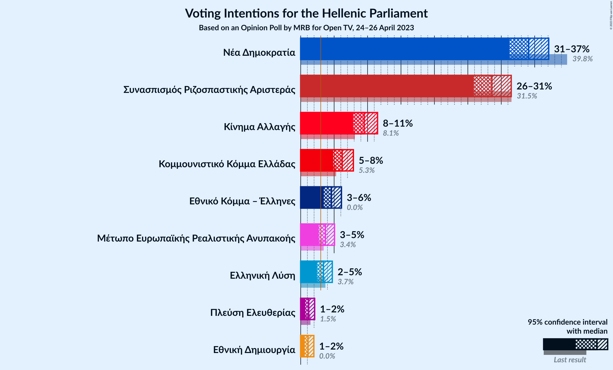

### Confidence Intervals

| Party | Last Result | Poll Result | 80% Confidence Interval | 90% Confidence Interval | 95% Confidence Interval | 99% Confidence Interval |
|:-----:|:-----------:|:-----------:|:-----------------------:|:-----------------------:|:-----------------------:|:-----------------------:|
| Νέα Δημοκρατία | 39.8% | 34.1% | 32.2–36.1% |31.7–36.6% |31.2–37.1% |30.3–38.1% |
| Συνασπισμός Ριζοσπαστικής Αριστεράς | 31.5% | 28.6% | 26.8–30.5% |26.3–31.0% |25.9–31.5% |25.0–32.4% |
| Κίνημα Αλλαγής | 8.1% | 9.5% | 8.4–10.8% |8.1–11.2% |7.8–11.5% |7.3–12.1% |
| Κομμουνιστικό Κόμμα Ελλάδας | 5.3% | 6.2% | 5.3–7.3% |5.1–7.6% |4.9–7.9% |4.5–8.4% |
| Εθνικό Κόμμα – Έλληνες | 0.0% | 4.6% | 3.9–5.6% |3.6–5.9% |3.5–6.1% |3.1–6.6% |
| Μέτωπο Ευρωπαϊκής Ρεαλιστικής Ανυπακοής | 3.4% | 3.7% | 3.0–4.6% |2.9–4.8% |2.7–5.1% |2.4–5.5% |
| Ελληνική Λύση | 3.7% | 3.4% | 2.8–4.3% |2.6–4.5% |2.4–4.7% |2.2–5.2% |
| Πλεύση Ελευθερίας | 1.5% | 1.2% | 0.9–1.8% |0.8–1.9% |0.7–2.1% |0.5–2.4% |
| Εθνική Δημιουργία | 0.0% | 1.1% | 0.8–1.7% |0.7–1.8% |0.6–2.0% |0.5–2.3% |

*Note:* The poll result column reflects the actual value used in the calculations. Published results may vary slightly, and in addition be rounded to fewer digits.

## Seats

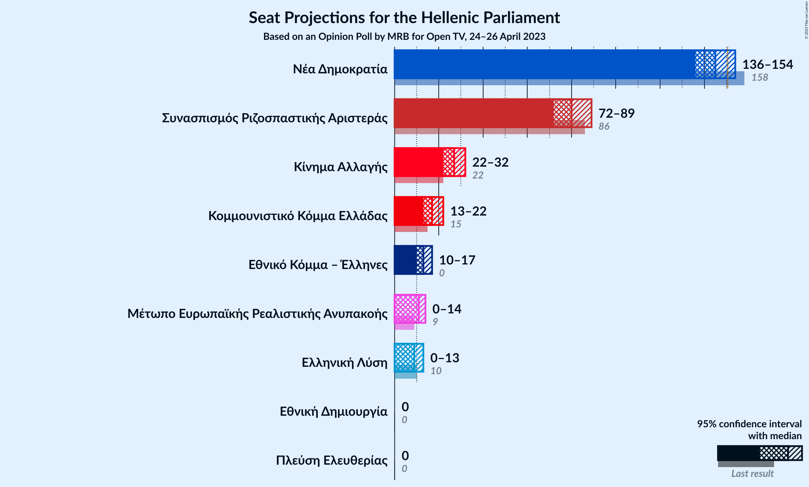

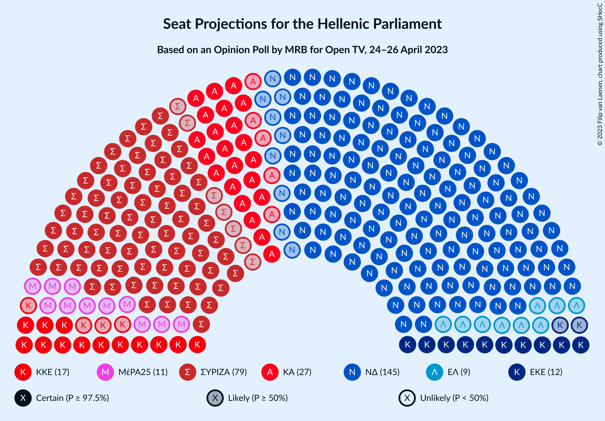

### Confidence Intervals

| Party | Last Result | Median | 80% Confidence Interval | 90% Confidence Interval | 95% Confidence Interval | 99% Confidence Interval |
|:-----:|:-----------:|:------:|:-----------------------:|:-----------------------:|:-----------------------:|:-----------------------:|
| <a href="#νέα-δημοκρατία">Νέα Δημοκρατία</a> | 158 | 145 | 139–151 |138–152 |136–154 |86–157 |
| <a href="#συνασπισμός-ριζοσπαστικής-αριστεράς">Συνασπισμός Ριζοσπαστικής Αριστεράς</a> | 86 | 80 | 74–85 |73–87 |72–89 |70–140 |
| <a href="#κίνημα-αλλαγής">Κίνημα Αλλαγής</a> | 22 | 27 | 23–30 |22–31 |22–32 |20–34 |
| <a href="#κομμουνιστικό-κόμμα-ελλάδας">Κομμουνιστικό Κόμμα Ελλάδας</a> | 15 | 17 | 16–21 |14–21 |13–22 |12–23 |
| <a href="#εθνικό-κόμμα-–-έλληνες">Εθνικό Κόμμα – Έλληνες</a> | 0 | 13 | 11–15 |10–16 |10–17 |9–18 |
| <a href="#μέτωπο-ευρωπαϊκής-ρεαλιστικής-ανυπακοής">Μέτωπο Ευρωπαϊκής Ρεαλιστικής Ανυπακοής</a> | 9 | 11 | 8–13 |0–14 |0–14 |0–15 |
| <a href="#ελληνική-λύση">Ελληνική Λύση</a> | 10 | 9 | 0–12 |0–13 |0–13 |0–14 |
| <a href="#πλεύση-ελευθερίας">Πλεύση Ελευθερίας</a> | 0 | 0 | 0 |0 |0 |0 |
| <a href="#εθνική-δημιουργία">Εθνική Δημιουργία</a> | 0 | 0 | 0 |0 |0 |0 |

### Νέα Δημοκρατία

*For a full overview of the results for this party, see the [Νέα Δημοκρατία](party-νέαδημοκρατία.html) page.*

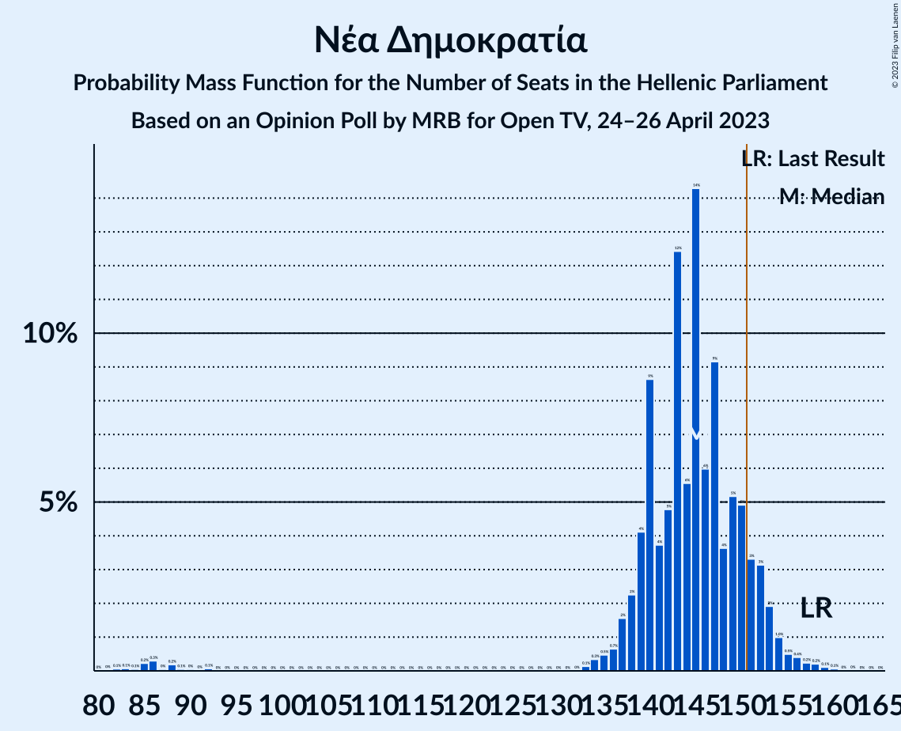

| Number of Seats | Probability | Accumulated | Special Marks |
|:---------------:|:-----------:|:-----------:|:-------------:|
| 81 | 0% | 100% |  |
| 82 | 0.1% | 99.9% |  |
| 83 | 0.1% | 99.9% |  |
| 84 | 0.1% | 99.8% |  |
| 85 | 0.2% | 99.8% |  |
| 86 | 0.3% | 99.5% |  |
| 87 | 0% | 99.2% |  |
| 88 | 0.2% | 99.2% |  |
| 89 | 0.1% | 99.0% |  |
| 90 | 0% | 98.9% |  |
| 91 | 0% | 98.9% |  |
| 92 | 0.1% | 98.9% |  |
| 93 | 0% | 98.8% |  |
| 94 | 0% | 98.8% |  |
| 95 | 0% | 98.8% |  |
| 96 | 0% | 98.8% |  |
| 97 | 0% | 98.8% |  |
| 98 | 0% | 98.8% |  |
| 99 | 0% | 98.8% |  |
| 100 | 0% | 98.8% |  |
| 101 | 0% | 98.8% |  |
| 102 | 0% | 98.8% |  |
| 103 | 0% | 98.8% |  |
| 104 | 0% | 98.8% |  |
| 105 | 0% | 98.8% |  |
| 106 | 0% | 98.8% |  |
| 107 | 0% | 98.8% |  |
| 108 | 0% | 98.8% |  |
| 109 | 0% | 98.8% |  |
| 110 | 0% | 98.8% |  |
| 111 | 0% | 98.8% |  |
| 112 | 0% | 98.8% |  |
| 113 | 0% | 98.8% |  |
| 114 | 0% | 98.8% |  |
| 115 | 0% | 98.8% |  |
| 116 | 0% | 98.8% |  |
| 117 | 0% | 98.8% |  |
| 118 | 0% | 98.8% |  |
| 119 | 0% | 98.8% |  |
| 120 | 0% | 98.8% |  |
| 121 | 0% | 98.8% |  |
| 122 | 0% | 98.8% |  |
| 123 | 0% | 98.8% |  |
| 124 | 0% | 98.8% |  |
| 125 | 0% | 98.8% |  |
| 126 | 0% | 98.8% |  |
| 127 | 0% | 98.8% |  |
| 128 | 0% | 98.8% |  |
| 129 | 0% | 98.8% |  |
| 130 | 0% | 98.8% |  |
| 131 | 0% | 98.8% |  |
| 132 | 0% | 98.8% |  |
| 133 | 0.1% | 98.8% |  |
| 134 | 0.3% | 98.6% |  |
| 135 | 0.5% | 98% |  |
| 136 | 0.7% | 98% |  |
| 137 | 2% | 97% |  |
| 138 | 2% | 96% |  |
| 139 | 4% | 93% |  |
| 140 | 9% | 89% |  |
| 141 | 4% | 81% |  |
| 142 | 5% | 77% |  |
| 143 | 12% | 72% |  |
| 144 | 6% | 60% |  |
| 145 | 14% | 54% | Median |
| 146 | 6% | 40% |  |
| 147 | 9% | 34% |  |
| 148 | 4% | 25% |  |
| 149 | 5% | 21% |  |
| 150 | 5% | 16% |  |
| 151 | 3% | 11% | Majority |
| 152 | 3% | 8% |  |
| 153 | 2% | 4% |  |
| 154 | 1.0% | 3% |  |
| 155 | 0.5% | 2% |  |
| 156 | 0.4% | 1.1% |  |
| 157 | 0.2% | 0.7% |  |
| 158 | 0.2% | 0.4% | Last Result |
| 159 | 0.1% | 0.2% |  |
| 160 | 0.1% | 0.1% |  |
| 161 | 0% | 0% |  |

### Συνασπισμός Ριζοσπαστικής Αριστεράς

*For a full overview of the results for this party, see the [Συνασπισμός Ριζοσπαστικής Αριστεράς](party-συνασπισμόςριζοσπαστικήςαριστεράς.html) page.*

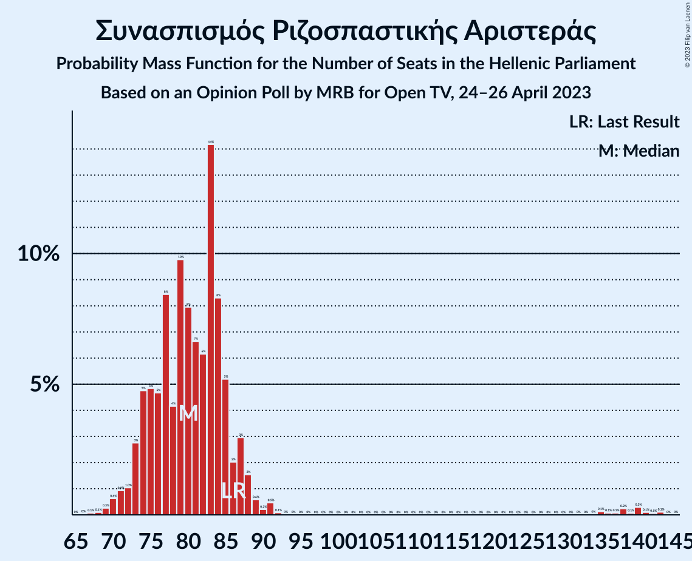

| Number of Seats | Probability | Accumulated | Special Marks |
|:---------------:|:-----------:|:-----------:|:-------------:|
| 67 | 0.1% | 100% |  |
| 68 | 0.1% | 99.9% |  |
| 69 | 0.3% | 99.8% |  |
| 70 | 0.6% | 99.5% |  |
| 71 | 0.9% | 98.9% |  |
| 72 | 1.0% | 98% |  |
| 73 | 3% | 97% |  |
| 74 | 5% | 94% |  |
| 75 | 5% | 89% |  |
| 76 | 5% | 85% |  |
| 77 | 8% | 80% |  |
| 78 | 4% | 71% |  |
| 79 | 10% | 67% |  |
| 80 | 8% | 58% | Median |
| 81 | 7% | 50% |  |
| 82 | 6% | 43% |  |
| 83 | 14% | 37% |  |
| 84 | 8% | 23% |  |
| 85 | 5% | 14% |  |
| 86 | 2% | 9% | Last Result |
| 87 | 3% | 7% |  |
| 88 | 2% | 4% |  |
| 89 | 0.6% | 3% |  |
| 90 | 0.2% | 2% |  |
| 91 | 0.5% | 2% |  |
| 92 | 0.1% | 1.3% |  |
| 93 | 0% | 1.2% |  |
| 94 | 0% | 1.2% |  |
| 95 | 0% | 1.2% |  |
| 96 | 0% | 1.2% |  |
| 97 | 0% | 1.2% |  |
| 98 | 0% | 1.2% |  |
| 99 | 0% | 1.2% |  |
| 100 | 0% | 1.2% |  |
| 101 | 0% | 1.2% |  |
| 102 | 0% | 1.2% |  |
| 103 | 0% | 1.2% |  |
| 104 | 0% | 1.2% |  |
| 105 | 0% | 1.2% |  |
| 106 | 0% | 1.2% |  |
| 107 | 0% | 1.2% |  |
| 108 | 0% | 1.2% |  |
| 109 | 0% | 1.2% |  |
| 110 | 0% | 1.2% |  |
| 111 | 0% | 1.2% |  |
| 112 | 0% | 1.2% |  |
| 113 | 0% | 1.2% |  |
| 114 | 0% | 1.2% |  |
| 115 | 0% | 1.2% |  |
| 116 | 0% | 1.2% |  |
| 117 | 0% | 1.2% |  |
| 118 | 0% | 1.2% |  |
| 119 | 0% | 1.2% |  |
| 120 | 0% | 1.2% |  |
| 121 | 0% | 1.2% |  |
| 122 | 0% | 1.2% |  |
| 123 | 0% | 1.2% |  |
| 124 | 0% | 1.2% |  |
| 125 | 0% | 1.2% |  |
| 126 | 0% | 1.2% |  |
| 127 | 0% | 1.2% |  |
| 128 | 0% | 1.2% |  |
| 129 | 0% | 1.2% |  |
| 130 | 0% | 1.2% |  |
| 131 | 0% | 1.2% |  |
| 132 | 0% | 1.2% |  |
| 133 | 0% | 1.2% |  |
| 134 | 0% | 1.2% |  |
| 135 | 0.1% | 1.2% |  |
| 136 | 0.1% | 1.0% |  |
| 137 | 0.1% | 1.0% |  |
| 138 | 0.2% | 0.9% |  |
| 139 | 0.1% | 0.7% |  |
| 140 | 0.3% | 0.6% |  |
| 141 | 0.1% | 0.3% |  |
| 142 | 0.1% | 0.2% |  |
| 143 | 0.1% | 0.1% |  |
| 144 | 0% | 0% |  |

### Κίνημα Αλλαγής

*For a full overview of the results for this party, see the [Κίνημα Αλλαγής](party-κίνημααλλαγής.html) page.*

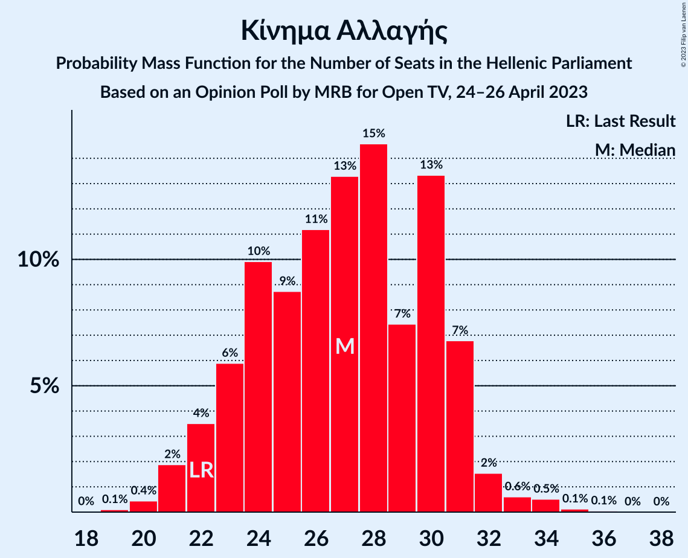

| Number of Seats | Probability | Accumulated | Special Marks |
|:---------------:|:-----------:|:-----------:|:-------------:|
| 19 | 0.1% | 100% |  |
| 20 | 0.4% | 99.9% |  |
| 21 | 2% | 99.4% |  |
| 22 | 4% | 98% | Last Result |
| 23 | 6% | 94% |  |
| 24 | 10% | 88% |  |
| 25 | 9% | 78% |  |
| 26 | 11% | 69% |  |
| 27 | 13% | 58% | Median |
| 28 | 15% | 45% |  |
| 29 | 7% | 30% |  |
| 30 | 13% | 23% |  |
| 31 | 7% | 10% |  |
| 32 | 2% | 3% |  |
| 33 | 0.6% | 1.3% |  |
| 34 | 0.5% | 0.7% |  |
| 35 | 0.1% | 0.2% |  |
| 36 | 0.1% | 0.1% |  |
| 37 | 0% | 0% |  |

### Κομμουνιστικό Κόμμα Ελλάδας

*For a full overview of the results for this party, see the [Κομμουνιστικό Κόμμα Ελλάδας](party-κομμουνιστικόκόμμαελλάδας.html) page.*

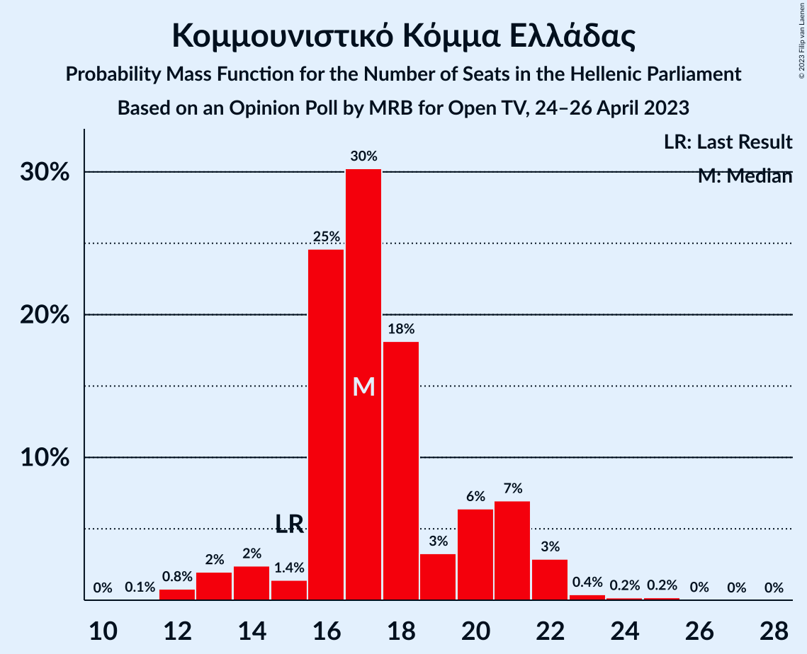

| Number of Seats | Probability | Accumulated | Special Marks |
|:---------------:|:-----------:|:-----------:|:-------------:|
| 11 | 0.1% | 100% |  |
| 12 | 0.8% | 99.9% |  |
| 13 | 2% | 99.1% |  |
| 14 | 2% | 97% |  |
| 15 | 1.4% | 95% | Last Result |
| 16 | 25% | 93% |  |
| 17 | 30% | 69% | Median |
| 18 | 18% | 39% |  |
| 19 | 3% | 20% |  |
| 20 | 6% | 17% |  |
| 21 | 7% | 11% |  |
| 22 | 3% | 4% |  |
| 23 | 0.4% | 0.8% |  |
| 24 | 0.2% | 0.4% |  |
| 25 | 0.2% | 0.2% |  |
| 26 | 0% | 0.1% |  |
| 27 | 0% | 0% |  |

### Εθνικό Κόμμα – Έλληνες

*For a full overview of the results for this party, see the [Εθνικό Κόμμα – Έλληνες](party-εθνικόκόμμα–έλληνες.html) page.*

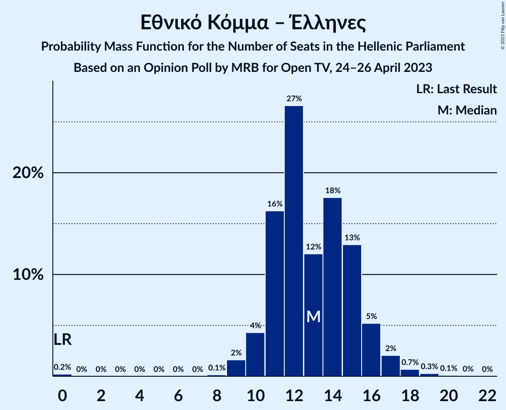

| Number of Seats | Probability | Accumulated | Special Marks |
|:---------------:|:-----------:|:-----------:|:-------------:|
| 0 | 0.2% | 100% | Last Result |
| 1 | 0% | 99.8% |  |
| 2 | 0% | 99.8% |  |
| 3 | 0% | 99.8% |  |
| 4 | 0% | 99.8% |  |
| 5 | 0% | 99.8% |  |
| 6 | 0% | 99.8% |  |
| 7 | 0% | 99.8% |  |
| 8 | 0.1% | 99.8% |  |
| 9 | 2% | 99.6% |  |
| 10 | 4% | 98% |  |
| 11 | 16% | 94% |  |
| 12 | 27% | 77% |  |
| 13 | 12% | 51% | Median |
| 14 | 18% | 39% |  |
| 15 | 13% | 21% |  |
| 16 | 5% | 8% |  |
| 17 | 2% | 3% |  |
| 18 | 0.7% | 1.1% |  |
| 19 | 0.3% | 0.4% |  |
| 20 | 0.1% | 0.1% |  |
| 21 | 0% | 0% |  |

### Μέτωπο Ευρωπαϊκής Ρεαλιστικής Ανυπακοής

*For a full overview of the results for this party, see the [Μέτωπο Ευρωπαϊκής Ρεαλιστικής Ανυπακοής](party-μέτωποευρωπαϊκήςρεαλιστικήςανυπακοής.html) page.*

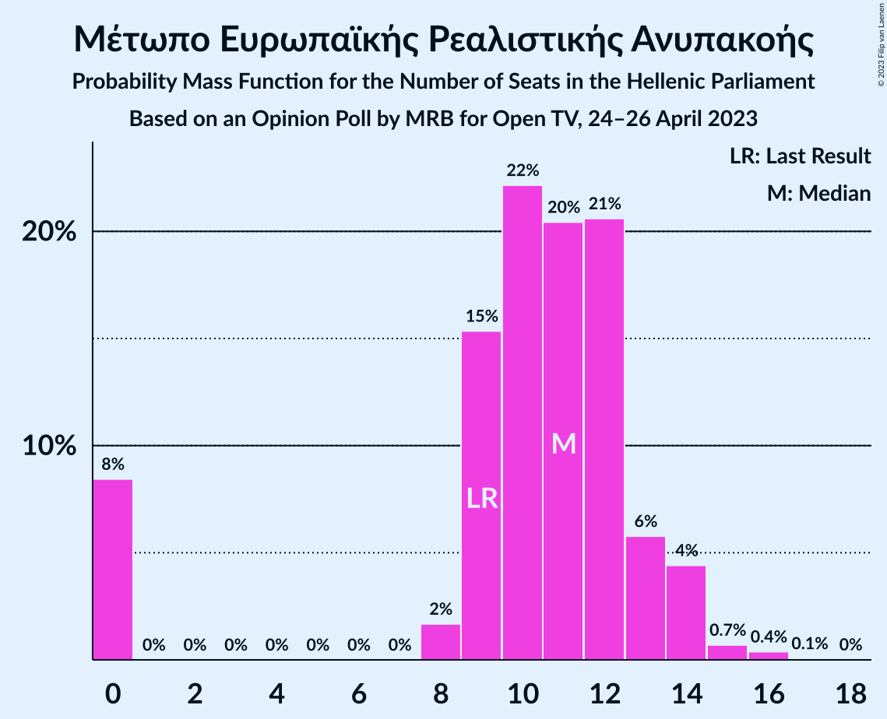

| Number of Seats | Probability | Accumulated | Special Marks |
|:---------------:|:-----------:|:-----------:|:-------------:|
| 0 | 8% | 100% |  |
| 1 | 0% | 92% |  |
| 2 | 0% | 92% |  |
| 3 | 0% | 92% |  |
| 4 | 0% | 92% |  |
| 5 | 0% | 92% |  |
| 6 | 0% | 92% |  |
| 7 | 0% | 92% |  |
| 8 | 2% | 92% |  |
| 9 | 15% | 90% | Last Result |
| 10 | 22% | 75% |  |
| 11 | 20% | 52% | Median |
| 12 | 21% | 32% |  |
| 13 | 6% | 11% |  |
| 14 | 4% | 6% |  |
| 15 | 0.7% | 1.2% |  |
| 16 | 0.4% | 0.5% |  |
| 17 | 0.1% | 0.1% |  |
| 18 | 0% | 0% |  |

### Ελληνική Λύση

*For a full overview of the results for this party, see the [Ελληνική Λύση](party-ελληνικήλύση.html) page.*

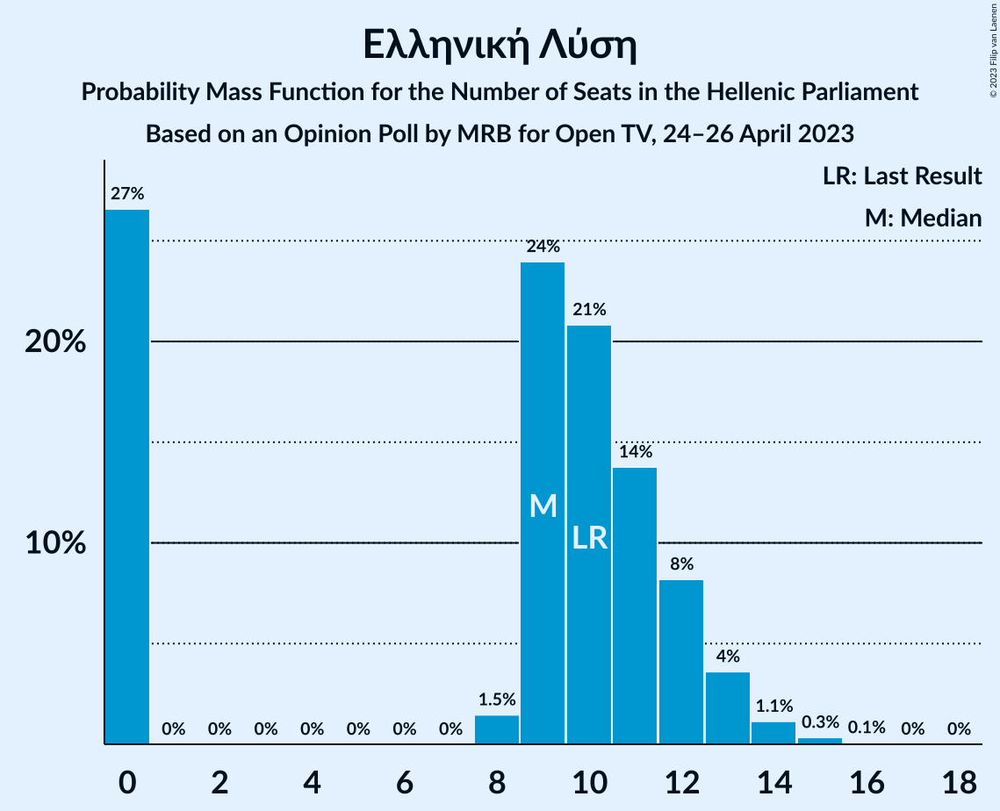

| Number of Seats | Probability | Accumulated | Special Marks |
|:---------------:|:-----------:|:-----------:|:-------------:|
| 0 | 27% | 100% |  |
| 1 | 0% | 73% |  |
| 2 | 0% | 73% |  |
| 3 | 0% | 73% |  |
| 4 | 0% | 73% |  |
| 5 | 0% | 73% |  |
| 6 | 0% | 73% |  |
| 7 | 0% | 73% |  |
| 8 | 1.5% | 73% |  |
| 9 | 24% | 72% | Median |
| 10 | 21% | 48% | Last Result |
| 11 | 14% | 27% |  |
| 12 | 8% | 13% |  |
| 13 | 4% | 5% |  |
| 14 | 1.1% | 2% |  |
| 15 | 0.3% | 0.4% |  |
| 16 | 0.1% | 0.1% |  |
| 17 | 0% | 0% |  |

### Πλεύση Ελευθερίας

*For a full overview of the results for this party, see the [Πλεύση Ελευθερίας](party-πλεύσηελευθερίας.html) page.*

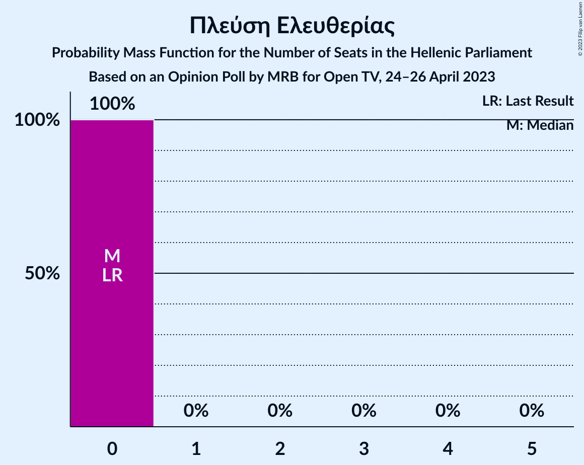

| Number of Seats | Probability | Accumulated | Special Marks |
|:---------------:|:-----------:|:-----------:|:-------------:|
| 0 | 100% | 100% | Last Result, Median |

### Εθνική Δημιουργία

*For a full overview of the results for this party, see the [Εθνική Δημιουργία](party-εθνικήδημιουργία.html) page.*

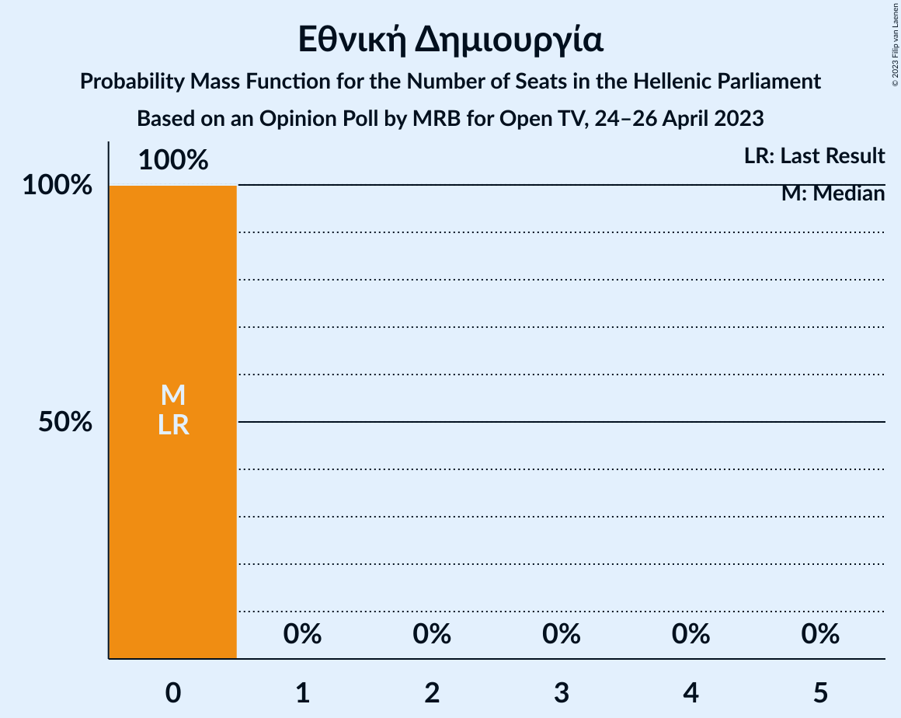

| Number of Seats | Probability | Accumulated | Special Marks |
|:---------------:|:-----------:|:-----------:|:-------------:|
| 0 | 100% | 100% | Last Result, Median |

## Coalitions

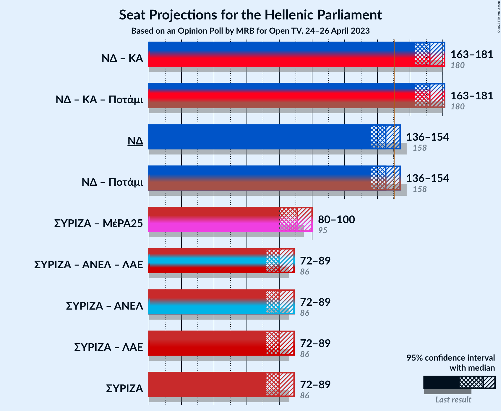

### Confidence Intervals

| Coalition | Last Result | Median | Majority? | 80% Confidence Interval | 90% Confidence Interval | 95% Confidence Interval | 99% Confidence Interval |
|:---------:|:-----------:|:------:|:---------:|:-----------------------:|:-----------------------:|:-----------------------:|:-----------------------:|
| Νέα Δημοκρατία – Κίνημα Αλλαγής | 180 | 172 | 98.8% | 166–178 | 164–180 | 163–181 | 112–185 |
| Νέα Δημοκρατία | 158 | 145 | 11% | 139–151 | 138–152 | 136–154 | 86–157 |
| Συνασπισμός Ριζοσπαστικής Αριστεράς – Μέτωπο Ευρωπαϊκής Ρεαλιστικής Ανυπακοής | 95 | 91 | 0.4% | 84–95 | 82–98 | 80–100 | 75–150 |
| Συνασπισμός Ριζοσπαστικής Αριστεράς | 86 | 80 | 0% | 74–85 | 73–87 | 72–89 | 70–140 |

### Νέα Δημοκρατία – Κίνημα Αλλαγής

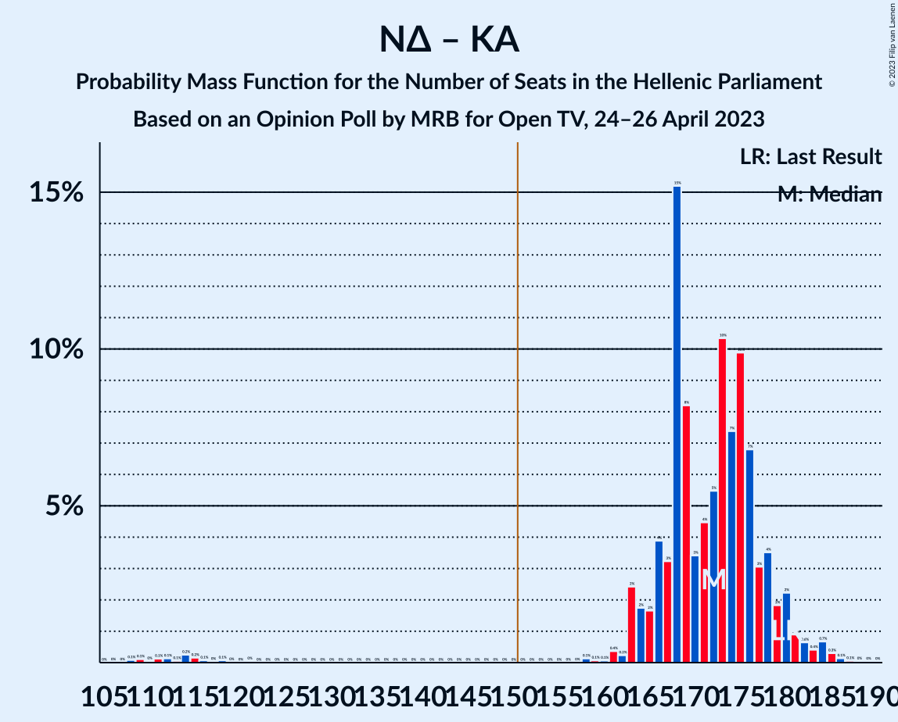

| Number of Seats | Probability | Accumulated | Special Marks |
|:---------------:|:-----------:|:-----------:|:-------------:|
| 108 | 0.1% | 100% |  |
| 109 | 0.1% | 99.9% |  |
| 110 | 0% | 99.8% |  |
| 111 | 0.1% | 99.7% |  |
| 112 | 0.1% | 99.6% |  |
| 113 | 0.1% | 99.5% |  |
| 114 | 0.2% | 99.4% |  |
| 115 | 0.2% | 99.2% |  |
| 116 | 0.1% | 99.0% |  |
| 117 | 0% | 99.0% |  |
| 118 | 0.1% | 98.9% |  |
| 119 | 0% | 98.9% |  |
| 120 | 0% | 98.8% |  |
| 121 | 0% | 98.8% |  |
| 122 | 0% | 98.8% |  |
| 123 | 0% | 98.8% |  |
| 124 | 0% | 98.8% |  |
| 125 | 0% | 98.8% |  |
| 126 | 0% | 98.8% |  |
| 127 | 0% | 98.8% |  |
| 128 | 0% | 98.8% |  |
| 129 | 0% | 98.8% |  |
| 130 | 0% | 98.8% |  |
| 131 | 0% | 98.8% |  |
| 132 | 0% | 98.8% |  |
| 133 | 0% | 98.8% |  |
| 134 | 0% | 98.8% |  |
| 135 | 0% | 98.8% |  |
| 136 | 0% | 98.8% |  |
| 137 | 0% | 98.8% |  |
| 138 | 0% | 98.8% |  |
| 139 | 0% | 98.8% |  |
| 140 | 0% | 98.8% |  |
| 141 | 0% | 98.8% |  |
| 142 | 0% | 98.8% |  |
| 143 | 0% | 98.8% |  |
| 144 | 0% | 98.8% |  |
| 145 | 0% | 98.8% |  |
| 146 | 0% | 98.8% |  |
| 147 | 0% | 98.8% |  |
| 148 | 0% | 98.8% |  |
| 149 | 0% | 98.8% |  |
| 150 | 0% | 98.8% |  |
| 151 | 0% | 98.8% | Majority |
| 152 | 0% | 98.8% |  |
| 153 | 0% | 98.8% |  |
| 154 | 0% | 98.8% |  |
| 155 | 0% | 98.8% |  |
| 156 | 0% | 98.8% |  |
| 157 | 0% | 98.8% |  |
| 158 | 0.1% | 98.8% |  |
| 159 | 0.1% | 98.7% |  |
| 160 | 0.1% | 98.6% |  |
| 161 | 0.4% | 98.5% |  |
| 162 | 0.2% | 98% |  |
| 163 | 2% | 98% |  |
| 164 | 2% | 96% |  |
| 165 | 2% | 94% |  |
| 166 | 4% | 92% |  |
| 167 | 3% | 88% |  |
| 168 | 15% | 85% |  |
| 169 | 8% | 70% |  |
| 170 | 3% | 62% |  |
| 171 | 4% | 58% |  |
| 172 | 5% | 54% | Median |
| 173 | 10% | 48% |  |
| 174 | 7% | 38% |  |
| 175 | 10% | 31% |  |
| 176 | 7% | 21% |  |
| 177 | 3% | 14% |  |
| 178 | 4% | 11% |  |
| 179 | 2% | 7% |  |
| 180 | 2% | 5% | Last Result |
| 181 | 0.9% | 3% |  |
| 182 | 0.6% | 2% |  |
| 183 | 0.4% | 2% |  |
| 184 | 0.7% | 1.3% |  |
| 185 | 0.3% | 0.6% |  |
| 186 | 0.1% | 0.3% |  |
| 187 | 0.1% | 0.2% |  |
| 188 | 0% | 0.1% |  |
| 189 | 0% | 0.1% |  |
| 190 | 0% | 0% |  |

### Νέα Δημοκρατία

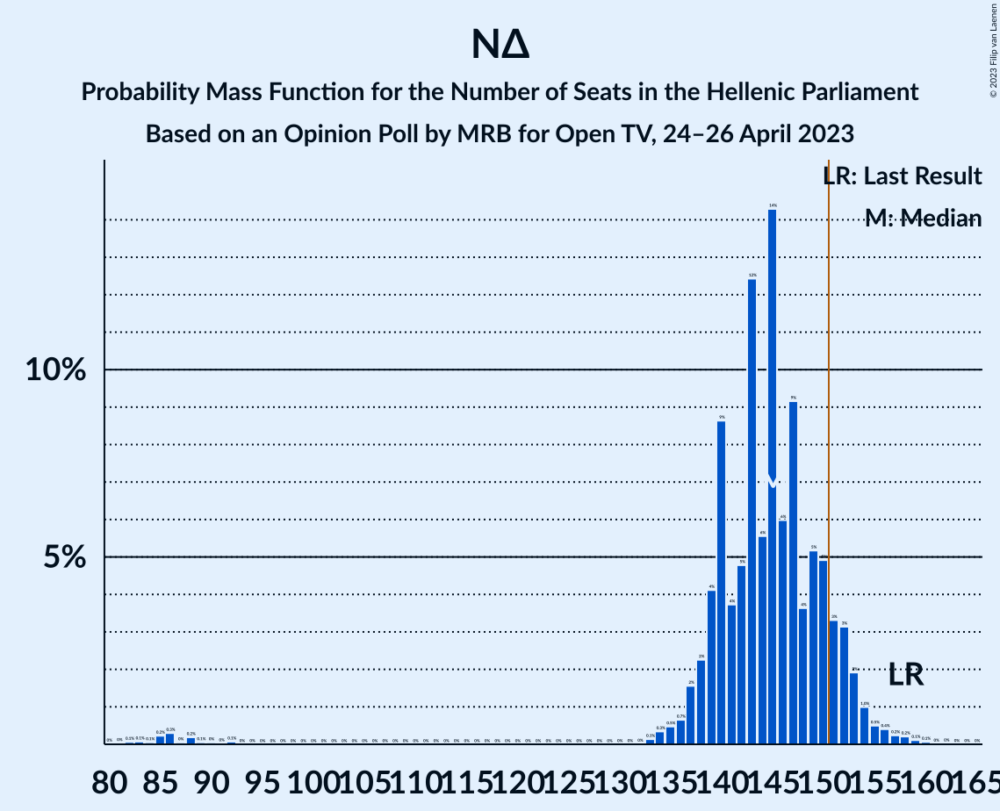

| Number of Seats | Probability | Accumulated | Special Marks |
|:---------------:|:-----------:|:-----------:|:-------------:|
| 81 | 0% | 100% |  |
| 82 | 0.1% | 99.9% |  |
| 83 | 0.1% | 99.9% |  |
| 84 | 0.1% | 99.8% |  |
| 85 | 0.2% | 99.8% |  |
| 86 | 0.3% | 99.5% |  |
| 87 | 0% | 99.2% |  |
| 88 | 0.2% | 99.2% |  |
| 89 | 0.1% | 99.0% |  |
| 90 | 0% | 98.9% |  |
| 91 | 0% | 98.9% |  |
| 92 | 0.1% | 98.9% |  |
| 93 | 0% | 98.8% |  |
| 94 | 0% | 98.8% |  |
| 95 | 0% | 98.8% |  |
| 96 | 0% | 98.8% |  |
| 97 | 0% | 98.8% |  |
| 98 | 0% | 98.8% |  |
| 99 | 0% | 98.8% |  |
| 100 | 0% | 98.8% |  |
| 101 | 0% | 98.8% |  |
| 102 | 0% | 98.8% |  |
| 103 | 0% | 98.8% |  |
| 104 | 0% | 98.8% |  |
| 105 | 0% | 98.8% |  |
| 106 | 0% | 98.8% |  |
| 107 | 0% | 98.8% |  |
| 108 | 0% | 98.8% |  |
| 109 | 0% | 98.8% |  |
| 110 | 0% | 98.8% |  |
| 111 | 0% | 98.8% |  |
| 112 | 0% | 98.8% |  |
| 113 | 0% | 98.8% |  |
| 114 | 0% | 98.8% |  |
| 115 | 0% | 98.8% |  |
| 116 | 0% | 98.8% |  |
| 117 | 0% | 98.8% |  |
| 118 | 0% | 98.8% |  |
| 119 | 0% | 98.8% |  |
| 120 | 0% | 98.8% |  |
| 121 | 0% | 98.8% |  |
| 122 | 0% | 98.8% |  |
| 123 | 0% | 98.8% |  |
| 124 | 0% | 98.8% |  |
| 125 | 0% | 98.8% |  |
| 126 | 0% | 98.8% |  |
| 127 | 0% | 98.8% |  |
| 128 | 0% | 98.8% |  |
| 129 | 0% | 98.8% |  |
| 130 | 0% | 98.8% |  |
| 131 | 0% | 98.8% |  |
| 132 | 0% | 98.8% |  |
| 133 | 0.1% | 98.8% |  |
| 134 | 0.3% | 98.6% |  |
| 135 | 0.5% | 98% |  |
| 136 | 0.7% | 98% |  |
| 137 | 2% | 97% |  |
| 138 | 2% | 96% |  |
| 139 | 4% | 93% |  |
| 140 | 9% | 89% |  |
| 141 | 4% | 81% |  |
| 142 | 5% | 77% |  |
| 143 | 12% | 72% |  |
| 144 | 6% | 60% |  |
| 145 | 14% | 54% | Median |
| 146 | 6% | 40% |  |
| 147 | 9% | 34% |  |
| 148 | 4% | 25% |  |
| 149 | 5% | 21% |  |
| 150 | 5% | 16% |  |
| 151 | 3% | 11% | Majority |
| 152 | 3% | 8% |  |
| 153 | 2% | 4% |  |
| 154 | 1.0% | 3% |  |
| 155 | 0.5% | 2% |  |
| 156 | 0.4% | 1.1% |  |
| 157 | 0.2% | 0.7% |  |
| 158 | 0.2% | 0.4% | Last Result |
| 159 | 0.1% | 0.2% |  |
| 160 | 0.1% | 0.1% |  |
| 161 | 0% | 0% |  |

### Συνασπισμός Ριζοσπαστικής Αριστεράς – Μέτωπο Ευρωπαϊκής Ρεαλιστικής Ανυπακοής

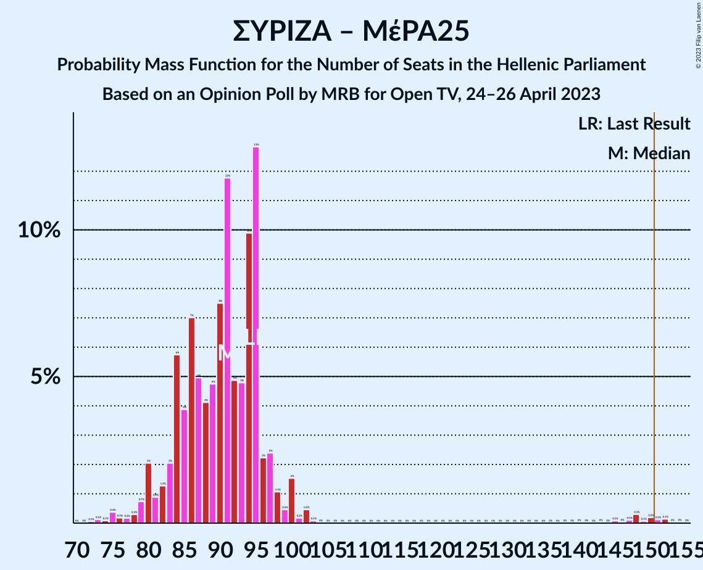

| Number of Seats | Probability | Accumulated | Special Marks |
|:---------------:|:-----------:|:-----------:|:-------------:|
| 72 | 0.1% | 100% |  |
| 73 | 0.1% | 99.9% |  |
| 74 | 0.1% | 99.8% |  |
| 75 | 0.4% | 99.7% |  |
| 76 | 0.2% | 99.4% |  |
| 77 | 0.2% | 99.2% |  |
| 78 | 0.3% | 99.0% |  |
| 79 | 0.7% | 98.7% |  |
| 80 | 2% | 98% |  |
| 81 | 0.9% | 96% |  |
| 82 | 1.3% | 95% |  |
| 83 | 2% | 94% |  |
| 84 | 6% | 92% |  |
| 85 | 4% | 86% |  |
| 86 | 7% | 82% |  |
| 87 | 5% | 75% |  |
| 88 | 4% | 70% |  |
| 89 | 5% | 66% |  |
| 90 | 8% | 61% |  |
| 91 | 12% | 54% | Median |
| 92 | 5% | 42% |  |
| 93 | 5% | 37% |  |
| 94 | 10% | 32% |  |
| 95 | 13% | 22% | Last Result |
| 96 | 2% | 10% |  |
| 97 | 2% | 7% |  |
| 98 | 1.1% | 5% |  |
| 99 | 0.5% | 4% |  |
| 100 | 2% | 3% |  |
| 101 | 0.2% | 2% |  |
| 102 | 0.5% | 2% |  |
| 103 | 0.1% | 1.3% |  |
| 104 | 0% | 1.2% |  |
| 105 | 0% | 1.2% |  |
| 106 | 0% | 1.2% |  |
| 107 | 0% | 1.2% |  |
| 108 | 0% | 1.2% |  |
| 109 | 0% | 1.2% |  |
| 110 | 0% | 1.2% |  |
| 111 | 0% | 1.2% |  |
| 112 | 0% | 1.2% |  |
| 113 | 0% | 1.2% |  |
| 114 | 0% | 1.2% |  |
| 115 | 0% | 1.2% |  |
| 116 | 0% | 1.2% |  |
| 117 | 0% | 1.2% |  |
| 118 | 0% | 1.2% |  |
| 119 | 0% | 1.2% |  |
| 120 | 0% | 1.2% |  |
| 121 | 0% | 1.2% |  |
| 122 | 0% | 1.2% |  |
| 123 | 0% | 1.2% |  |
| 124 | 0% | 1.2% |  |
| 125 | 0% | 1.2% |  |
| 126 | 0% | 1.2% |  |
| 127 | 0% | 1.2% |  |
| 128 | 0% | 1.2% |  |
| 129 | 0% | 1.2% |  |
| 130 | 0% | 1.2% |  |
| 131 | 0% | 1.2% |  |
| 132 | 0% | 1.2% |  |
| 133 | 0% | 1.2% |  |
| 134 | 0% | 1.2% |  |
| 135 | 0% | 1.2% |  |
| 136 | 0% | 1.2% |  |
| 137 | 0% | 1.2% |  |
| 138 | 0% | 1.2% |  |
| 139 | 0% | 1.2% |  |
| 140 | 0% | 1.2% |  |
| 141 | 0% | 1.2% |  |
| 142 | 0% | 1.2% |  |
| 143 | 0% | 1.1% |  |
| 144 | 0% | 1.1% |  |
| 145 | 0.1% | 1.1% |  |
| 146 | 0% | 1.0% |  |
| 147 | 0.1% | 1.0% |  |
| 148 | 0.3% | 0.9% |  |
| 149 | 0.1% | 0.6% |  |
| 150 | 0.2% | 0.5% |  |
| 151 | 0.1% | 0.4% | Majority |
| 152 | 0.1% | 0.2% |  |
| 153 | 0% | 0.1% |  |
| 154 | 0% | 0.1% |  |
| 155 | 0% | 0% |  |

### Συνασπισμός Ριζοσπαστικής Αριστεράς

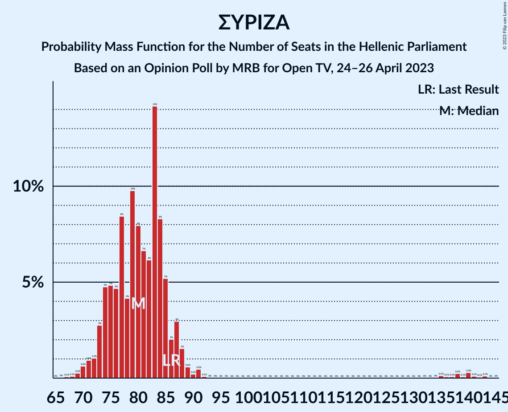

| Number of Seats | Probability | Accumulated | Special Marks |
|:---------------:|:-----------:|:-----------:|:-------------:|
| 67 | 0.1% | 100% |  |
| 68 | 0.1% | 99.9% |  |
| 69 | 0.3% | 99.8% |  |
| 70 | 0.6% | 99.5% |  |
| 71 | 0.9% | 98.9% |  |
| 72 | 1.0% | 98% |  |
| 73 | 3% | 97% |  |
| 74 | 5% | 94% |  |
| 75 | 5% | 89% |  |
| 76 | 5% | 85% |  |
| 77 | 8% | 80% |  |
| 78 | 4% | 71% |  |
| 79 | 10% | 67% |  |
| 80 | 8% | 58% | Median |
| 81 | 7% | 50% |  |
| 82 | 6% | 43% |  |
| 83 | 14% | 37% |  |
| 84 | 8% | 23% |  |
| 85 | 5% | 14% |  |
| 86 | 2% | 9% | Last Result |
| 87 | 3% | 7% |  |
| 88 | 2% | 4% |  |
| 89 | 0.6% | 3% |  |
| 90 | 0.2% | 2% |  |
| 91 | 0.5% | 2% |  |
| 92 | 0.1% | 1.3% |  |
| 93 | 0% | 1.2% |  |
| 94 | 0% | 1.2% |  |
| 95 | 0% | 1.2% |  |
| 96 | 0% | 1.2% |  |
| 97 | 0% | 1.2% |  |
| 98 | 0% | 1.2% |  |
| 99 | 0% | 1.2% |  |
| 100 | 0% | 1.2% |  |
| 101 | 0% | 1.2% |  |
| 102 | 0% | 1.2% |  |
| 103 | 0% | 1.2% |  |
| 104 | 0% | 1.2% |  |
| 105 | 0% | 1.2% |  |
| 106 | 0% | 1.2% |  |
| 107 | 0% | 1.2% |  |
| 108 | 0% | 1.2% |  |
| 109 | 0% | 1.2% |  |
| 110 | 0% | 1.2% |  |
| 111 | 0% | 1.2% |  |
| 112 | 0% | 1.2% |  |
| 113 | 0% | 1.2% |  |
| 114 | 0% | 1.2% |  |
| 115 | 0% | 1.2% |  |
| 116 | 0% | 1.2% |  |
| 117 | 0% | 1.2% |  |
| 118 | 0% | 1.2% |  |
| 119 | 0% | 1.2% |  |
| 120 | 0% | 1.2% |  |
| 121 | 0% | 1.2% |  |
| 122 | 0% | 1.2% |  |
| 123 | 0% | 1.2% |  |
| 124 | 0% | 1.2% |  |
| 125 | 0% | 1.2% |  |
| 126 | 0% | 1.2% |  |
| 127 | 0% | 1.2% |  |
| 128 | 0% | 1.2% |  |
| 129 | 0% | 1.2% |  |
| 130 | 0% | 1.2% |  |
| 131 | 0% | 1.2% |  |
| 132 | 0% | 1.2% |  |
| 133 | 0% | 1.2% |  |
| 134 | 0% | 1.2% |  |
| 135 | 0.1% | 1.2% |  |
| 136 | 0.1% | 1.0% |  |
| 137 | 0.1% | 1.0% |  |
| 138 | 0.2% | 0.9% |  |
| 139 | 0.1% | 0.7% |  |
| 140 | 0.3% | 0.6% |  |
| 141 | 0.1% | 0.3% |  |
| 142 | 0.1% | 0.2% |  |
| 143 | 0.1% | 0.1% |  |
| 144 | 0% | 0% |  |

## Technical Information

### Opinion Poll

+ **Polling firm:** MRB
+ **Commissioner(s):** Open TV
+ **Fieldwork period:** 24–26 April 2023

### Calculations

+ **Sample size:** 1000
+ **Simulations done:** 1,048,576
+ **Error estimate:** 1.51%

