# Opinion Poll by Interview for Politic.gr, 27–30 April 2023

<a href="#voting-intentions">Voting Intentions</a> | <a href="#seats">Seats</a> | <a href="#coalitions">Coalitions</a> | <a href="#technical-information">Technical Information</a>

## Voting Intentions

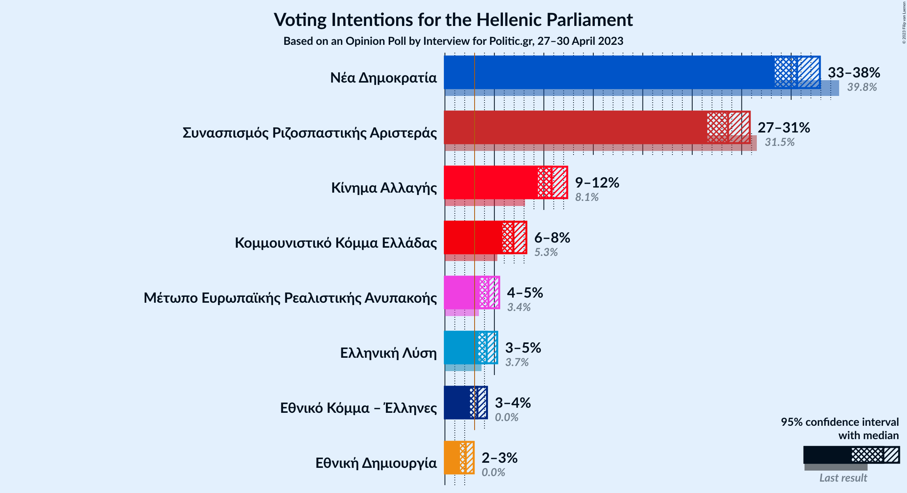

### Confidence Intervals

| Party | Last Result | Poll Result | 80% Confidence Interval | 90% Confidence Interval | 95% Confidence Interval | 99% Confidence Interval |
|:-----:|:-----------:|:-----------:|:-----------------------:|:-----------------------:|:-----------------------:|:-----------------------:|
| Νέα Δημοκρατία | 39.8% | 35.6% | 34.1–37.1% |33.7–37.5% |33.3–37.9% |32.7–38.6% |
| Συνασπισμός Ριζοσπαστικής Αριστεράς | 31.5% | 28.6% | 27.2–30.1% |26.9–30.5% |26.5–30.8% |25.9–31.5% |
| Κίνημα Αλλαγής | 8.1% | 10.8% | 9.9–11.8% |9.6–12.1% |9.4–12.4% |9.0–12.9% |
| Κομμουνιστικό Κόμμα Ελλάδας | 5.3% | 6.9% | 6.2–7.8% |6.0–8.0% |5.8–8.2% |5.5–8.7% |
| Μέτωπο Ευρωπαϊκής Ρεαλιστικής Ανυπακοής | 3.4% | 4.4% | 3.8–5.1% |3.7–5.3% |3.5–5.5% |3.3–5.8% |
| Ελληνική Λύση | 3.7% | 4.2% | 3.7–4.9% |3.5–5.1% |3.4–5.3% |3.1–5.6% |
| Εθνικό Κόμμα – Έλληνες | 0.0% | 3.3% | 2.8–3.9% |2.7–4.1% |2.5–4.3% |2.3–4.6% |
| Εθνική Δημιουργία | 0.0% | 2.1% | 1.7–2.6% |1.6–2.8% |1.5–2.9% |1.4–3.2% |

*Note:* The poll result column reflects the actual value used in the calculations. Published results may vary slightly, and in addition be rounded to fewer digits.

## Seats

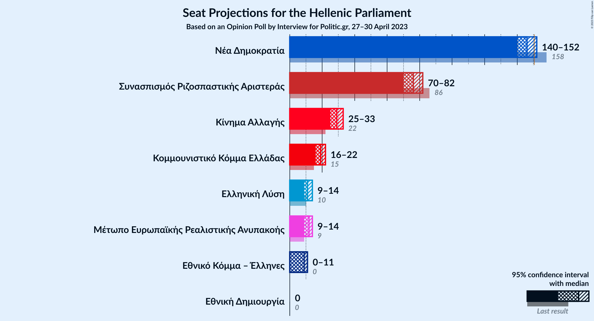

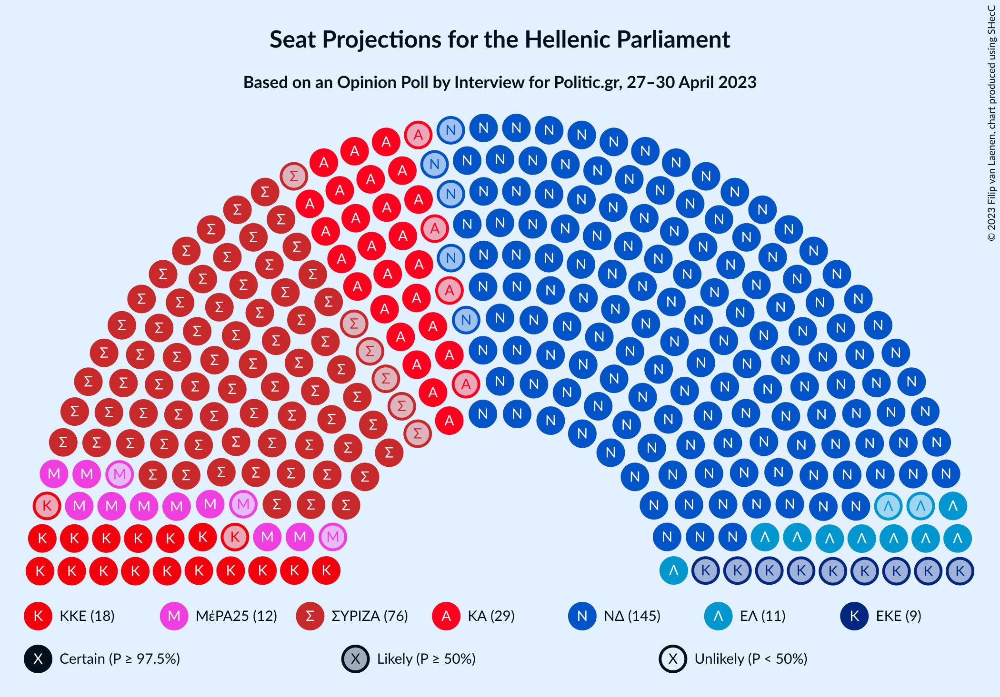

### Confidence Intervals

| Party | Last Result | Median | 80% Confidence Interval | 90% Confidence Interval | 95% Confidence Interval | 99% Confidence Interval |
|:-----:|:-----------:|:------:|:-----------------------:|:-----------------------:|:-----------------------:|:-----------------------:|
| <a href="#νέα-δημοκρατία">Νέα Δημοκρατία</a> | 158 | 146 | 142–150 |141–151 |140–152 |137–155 |
| <a href="#συνασπισμός-ριζοσπαστικής-αριστεράς">Συνασπισμός Ριζοσπαστικής Αριστεράς</a> | 86 | 76 | 72–80 |71–81 |70–82 |69–84 |
| <a href="#κίνημα-αλλαγής">Κίνημα Αλλαγής</a> | 22 | 29 | 26–31 |26–32 |25–33 |24–34 |
| <a href="#κομμουνιστικό-κόμμα-ελλάδας">Κομμουνιστικό Κόμμα Ελλάδας</a> | 15 | 19 | 17–21 |16–21 |16–22 |15–23 |
| <a href="#μέτωπο-ευρωπαϊκής-ρεαλιστικής-ανυπακοής">Μέτωπο Ευρωπαϊκής Ρεαλιστικής Ανυπακοής</a> | 9 | 12 | 10–13 |10–14 |9–14 |9–15 |
| <a href="#ελληνική-λύση">Ελληνική Λύση</a> | 10 | 11 | 10–13 |9–13 |9–14 |8–15 |
| <a href="#εθνικό-κόμμα-–-έλληνες">Εθνικό Κόμμα – Έλληνες</a> | 0 | 9 | 0–11 |0–11 |0–11 |0–12 |
| <a href="#εθνική-δημιουργία">Εθνική Δημιουργία</a> | 0 | 0 | 0 |0 |0 |0–8 |

### Νέα Δημοκρατία

*For a full overview of the results for this party, see the [Νέα Δημοκρατία](party-νέαδημοκρατία.html) page.*

| Number of Seats | Probability | Accumulated | Special Marks |
|:---------------:|:-----------:|:-----------:|:-------------:|
| 135 | 0.1% | 100% |  |
| 136 | 0.2% | 99.9% |  |
| 137 | 0.3% | 99.7% |  |
| 138 | 0.6% | 99.4% |  |
| 139 | 1.2% | 98.8% |  |
| 140 | 2% | 98% |  |
| 141 | 5% | 95% |  |
| 142 | 5% | 91% |  |
| 143 | 7% | 85% |  |
| 144 | 11% | 78% |  |
| 145 | 16% | 67% |  |
| 146 | 11% | 51% | Median |
| 147 | 9% | 39% |  |
| 148 | 12% | 30% |  |
| 149 | 7% | 18% |  |
| 150 | 4% | 12% |  |
| 151 | 3% | 7% | Majority |
| 152 | 2% | 4% |  |
| 153 | 1.1% | 2% |  |
| 154 | 0.4% | 1.0% |  |
| 155 | 0.2% | 0.5% |  |
| 156 | 0.2% | 0.3% |  |
| 157 | 0.1% | 0.2% |  |
| 158 | 0% | 0.1% | Last Result |
| 159 | 0% | 0% |  |

### Συνασπισμός Ριζοσπαστικής Αριστεράς

*For a full overview of the results for this party, see the [Συνασπισμός Ριζοσπαστικής Αριστεράς](party-συνασπισμόςριζοσπαστικήςαριστεράς.html) page.*

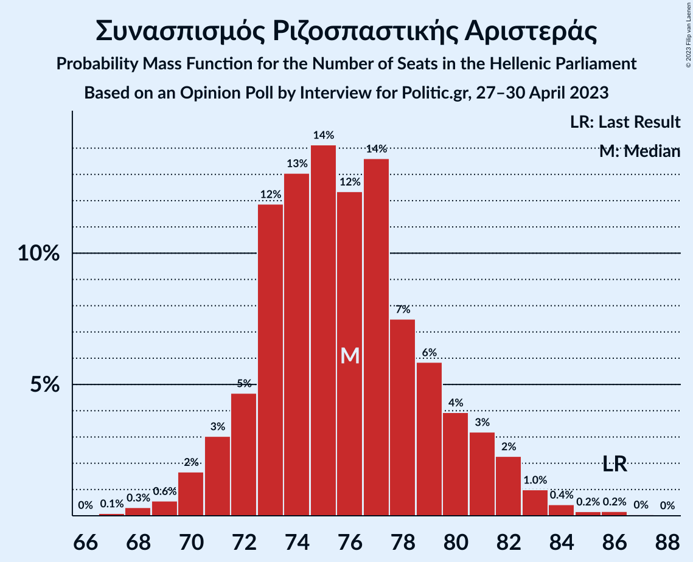

| Number of Seats | Probability | Accumulated | Special Marks |
|:---------------:|:-----------:|:-----------:|:-------------:|
| 67 | 0.1% | 100% |  |
| 68 | 0.3% | 99.9% |  |
| 69 | 0.6% | 99.5% |  |
| 70 | 2% | 99.0% |  |
| 71 | 3% | 97% |  |
| 72 | 5% | 94% |  |
| 73 | 12% | 90% |  |
| 74 | 13% | 78% |  |
| 75 | 14% | 65% |  |
| 76 | 12% | 51% | Median |
| 77 | 14% | 38% |  |
| 78 | 7% | 25% |  |
| 79 | 6% | 17% |  |
| 80 | 4% | 11% |  |
| 81 | 3% | 7% |  |
| 82 | 2% | 4% |  |
| 83 | 1.0% | 2% |  |
| 84 | 0.4% | 0.9% |  |
| 85 | 0.2% | 0.4% |  |
| 86 | 0.2% | 0.3% | Last Result |
| 87 | 0% | 0.1% |  |
| 88 | 0% | 0% |  |

### Κίνημα Αλλαγής

*For a full overview of the results for this party, see the [Κίνημα Αλλαγής](party-κίνημααλλαγής.html) page.*

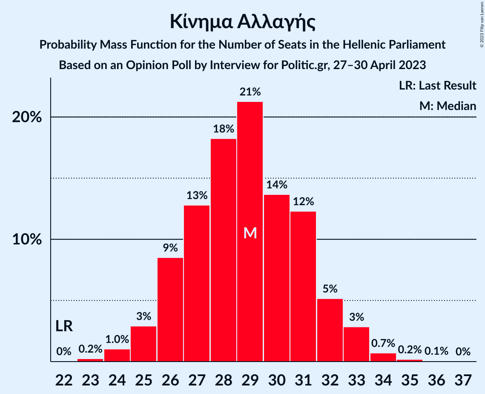

| Number of Seats | Probability | Accumulated | Special Marks |
|:---------------:|:-----------:|:-----------:|:-------------:|
| 22 | 0% | 100% | Last Result |
| 23 | 0.2% | 100% |  |
| 24 | 1.0% | 99.7% |  |
| 25 | 3% | 98.7% |  |
| 26 | 9% | 96% |  |
| 27 | 13% | 87% |  |
| 28 | 18% | 74% |  |
| 29 | 21% | 56% | Median |
| 30 | 14% | 35% |  |
| 31 | 12% | 21% |  |
| 32 | 5% | 9% |  |
| 33 | 3% | 4% |  |
| 34 | 0.7% | 1.0% |  |
| 35 | 0.2% | 0.3% |  |
| 36 | 0.1% | 0.1% |  |
| 37 | 0% | 0% |  |

### Κομμουνιστικό Κόμμα Ελλάδας

*For a full overview of the results for this party, see the [Κομμουνιστικό Κόμμα Ελλάδας](party-κομμουνιστικόκόμμαελλάδας.html) page.*

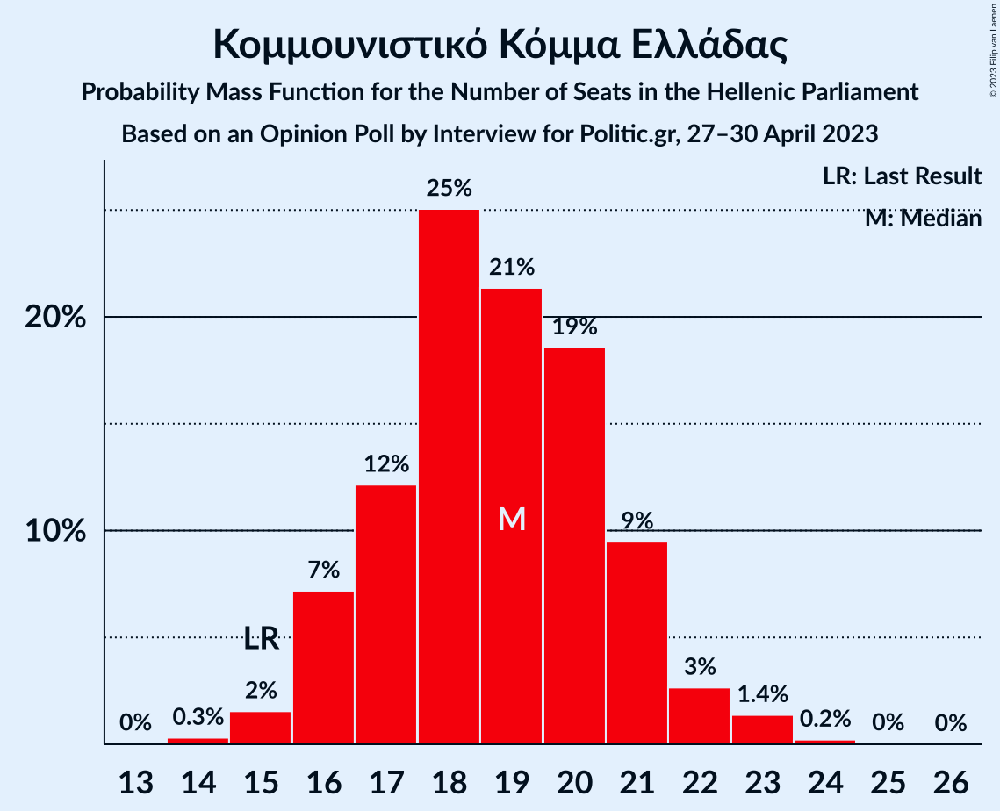

| Number of Seats | Probability | Accumulated | Special Marks |
|:---------------:|:-----------:|:-----------:|:-------------:|
| 14 | 0.3% | 100% |  |
| 15 | 2% | 99.6% | Last Result |
| 16 | 7% | 98% |  |
| 17 | 12% | 91% |  |
| 18 | 25% | 79% |  |
| 19 | 21% | 54% | Median |
| 20 | 19% | 32% |  |
| 21 | 9% | 14% |  |
| 22 | 3% | 4% |  |
| 23 | 1.4% | 2% |  |
| 24 | 0.2% | 0.3% |  |
| 25 | 0% | 0.1% |  |
| 26 | 0% | 0% |  |

### Μέτωπο Ευρωπαϊκής Ρεαλιστικής Ανυπακοής

*For a full overview of the results for this party, see the [Μέτωπο Ευρωπαϊκής Ρεαλιστικής Ανυπακοής](party-μέτωποευρωπαϊκήςρεαλιστικήςανυπακοής.html) page.*

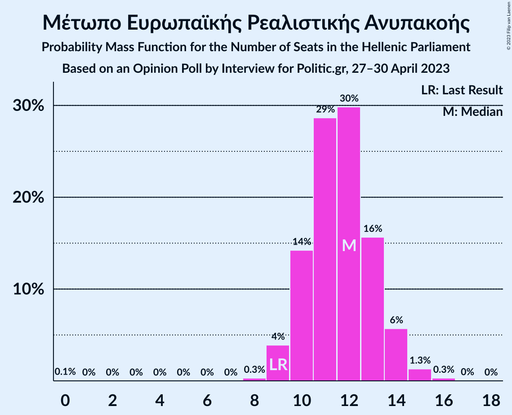

| Number of Seats | Probability | Accumulated | Special Marks |
|:---------------:|:-----------:|:-----------:|:-------------:|
| 0 | 0.1% | 100% |  |
| 1 | 0% | 99.9% |  |
| 2 | 0% | 99.9% |  |
| 3 | 0% | 99.9% |  |
| 4 | 0% | 99.9% |  |
| 5 | 0% | 99.9% |  |
| 6 | 0% | 99.9% |  |
| 7 | 0% | 99.9% |  |
| 8 | 0.3% | 99.9% |  |
| 9 | 4% | 99.6% | Last Result |
| 10 | 14% | 96% |  |
| 11 | 29% | 81% |  |
| 12 | 30% | 53% | Median |
| 13 | 16% | 23% |  |
| 14 | 6% | 7% |  |
| 15 | 1.3% | 2% |  |
| 16 | 0.3% | 0.4% |  |
| 17 | 0% | 0% |  |

### Ελληνική Λύση

*For a full overview of the results for this party, see the [Ελληνική Λύση](party-ελληνικήλύση.html) page.*

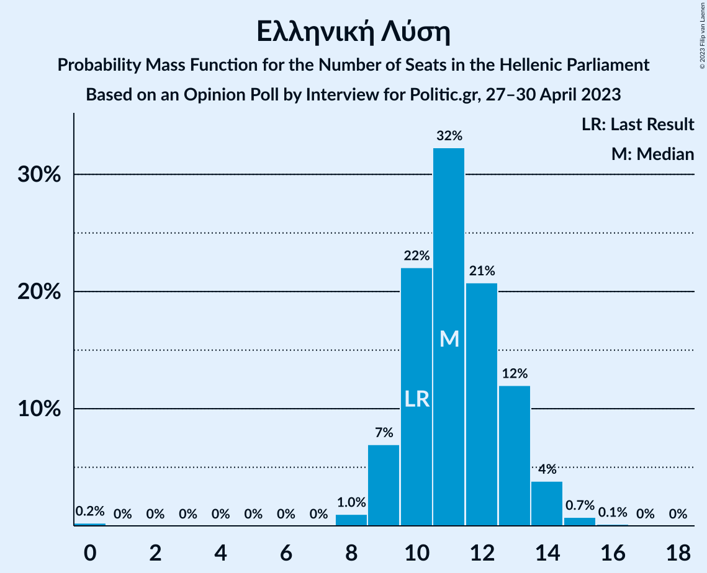

| Number of Seats | Probability | Accumulated | Special Marks |
|:---------------:|:-----------:|:-----------:|:-------------:|
| 0 | 0.2% | 100% |  |
| 1 | 0% | 99.8% |  |
| 2 | 0% | 99.8% |  |
| 3 | 0% | 99.8% |  |
| 4 | 0% | 99.8% |  |
| 5 | 0% | 99.8% |  |
| 6 | 0% | 99.8% |  |
| 7 | 0% | 99.8% |  |
| 8 | 1.0% | 99.8% |  |
| 9 | 7% | 98.8% |  |
| 10 | 22% | 92% | Last Result |
| 11 | 32% | 70% | Median |
| 12 | 21% | 37% |  |
| 13 | 12% | 17% |  |
| 14 | 4% | 5% |  |
| 15 | 0.7% | 0.9% |  |
| 16 | 0.1% | 0.2% |  |
| 17 | 0% | 0% |  |

### Εθνικό Κόμμα – Έλληνες

*For a full overview of the results for this party, see the [Εθνικό Κόμμα – Έλληνες](party-εθνικόκόμμα–έλληνες.html) page.*

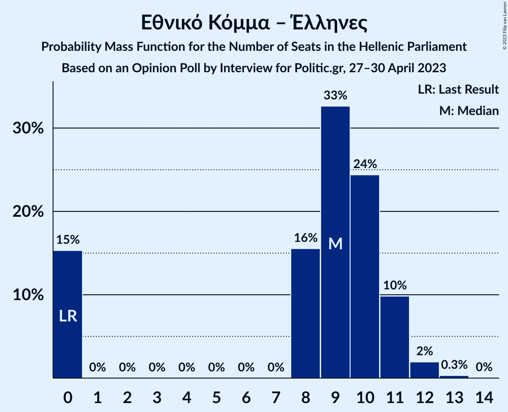

| Number of Seats | Probability | Accumulated | Special Marks |
|:---------------:|:-----------:|:-----------:|:-------------:|
| 0 | 15% | 100% | Last Result |
| 1 | 0% | 85% |  |
| 2 | 0% | 85% |  |
| 3 | 0% | 85% |  |
| 4 | 0% | 85% |  |
| 5 | 0% | 85% |  |
| 6 | 0% | 85% |  |
| 7 | 0% | 85% |  |
| 8 | 16% | 85% |  |
| 9 | 33% | 69% | Median |
| 10 | 24% | 37% |  |
| 11 | 10% | 12% |  |
| 12 | 2% | 2% |  |
| 13 | 0.3% | 0.3% |  |
| 14 | 0% | 0% |  |

### Εθνική Δημιουργία

*For a full overview of the results for this party, see the [Εθνική Δημιουργία](party-εθνικήδημιουργία.html) page.*

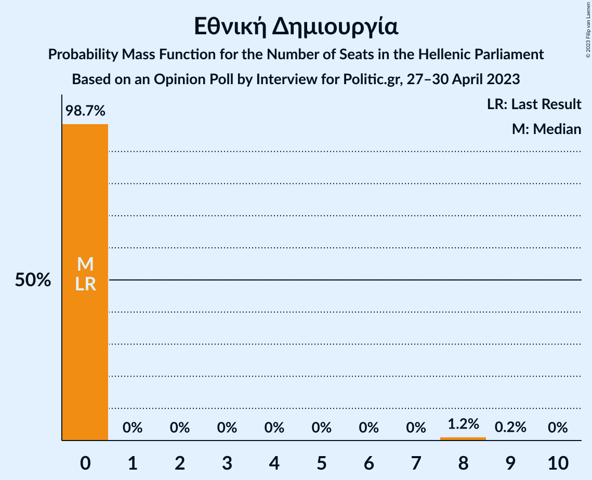

| Number of Seats | Probability | Accumulated | Special Marks |
|:---------------:|:-----------:|:-----------:|:-------------:|
| 0 | 98.7% | 100% | Last Result, Median |
| 1 | 0% | 1.3% |  |
| 2 | 0% | 1.3% |  |
| 3 | 0% | 1.3% |  |
| 4 | 0% | 1.3% |  |
| 5 | 0% | 1.3% |  |
| 6 | 0% | 1.3% |  |
| 7 | 0% | 1.3% |  |
| 8 | 1.2% | 1.3% |  |
| 9 | 0.2% | 0.2% |  |
| 10 | 0% | 0% |  |

## Coalitions

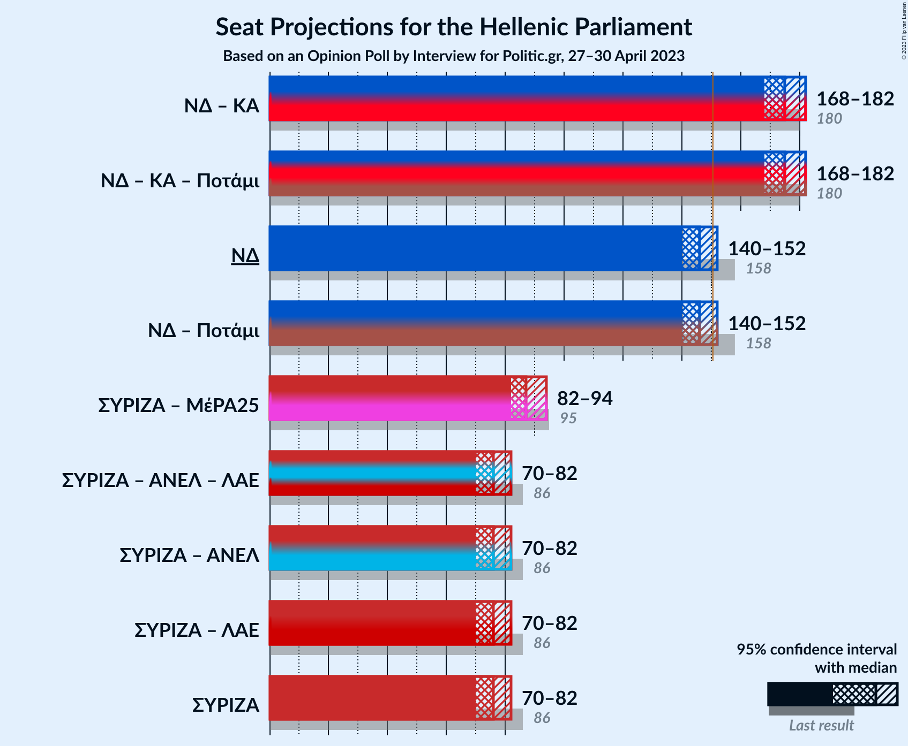

### Confidence Intervals

| Coalition | Last Result | Median | Majority? | 80% Confidence Interval | 90% Confidence Interval | 95% Confidence Interval | 99% Confidence Interval |
|:---------:|:-----------:|:------:|:---------:|:-----------------------:|:-----------------------:|:-----------------------:|:-----------------------:|
| Νέα Δημοκρατία – Κίνημα Αλλαγής | 180 | 175 | 100% | 170–179 | 169–180 | 168–182 | 166–185 |
| Νέα Δημοκρατία | 158 | 146 | 7% | 142–150 | 141–151 | 140–152 | 137–155 |
| Συνασπισμός Ριζοσπαστικής Αριστεράς – Μέτωπο Ευρωπαϊκής Ρεαλιστικής Ανυπακοής | 95 | 87 | 0% | 84–92 | 83–93 | 82–94 | 80–97 |
| Συνασπισμός Ριζοσπαστικής Αριστεράς | 86 | 76 | 0% | 72–80 | 71–81 | 70–82 | 69–84 |

### Νέα Δημοκρατία – Κίνημα Αλλαγής

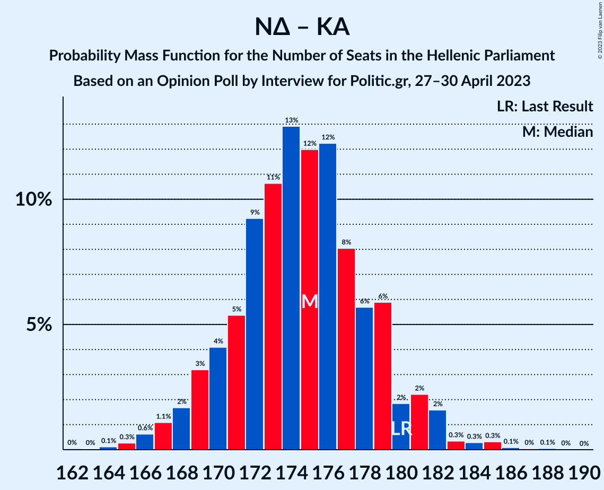

| Number of Seats | Probability | Accumulated | Special Marks |
|:---------------:|:-----------:|:-----------:|:-------------:|
| 162 | 0% | 100% |  |
| 163 | 0% | 99.9% |  |
| 164 | 0.1% | 99.9% |  |
| 165 | 0.3% | 99.8% |  |
| 166 | 0.6% | 99.5% |  |
| 167 | 1.1% | 98.9% |  |
| 168 | 2% | 98% |  |
| 169 | 3% | 96% |  |
| 170 | 4% | 93% |  |
| 171 | 5% | 89% |  |
| 172 | 9% | 83% |  |
| 173 | 11% | 74% |  |
| 174 | 13% | 64% |  |
| 175 | 12% | 51% | Median |
| 176 | 12% | 39% |  |
| 177 | 8% | 26% |  |
| 178 | 6% | 18% |  |
| 179 | 6% | 13% |  |
| 180 | 2% | 7% | Last Result |
| 181 | 2% | 5% |  |
| 182 | 2% | 3% |  |
| 183 | 0.3% | 1.2% |  |
| 184 | 0.3% | 0.8% |  |
| 185 | 0.3% | 0.5% |  |
| 186 | 0.1% | 0.2% |  |
| 187 | 0% | 0.1% |  |
| 188 | 0.1% | 0.1% |  |
| 189 | 0% | 0% |  |

### Νέα Δημοκρατία

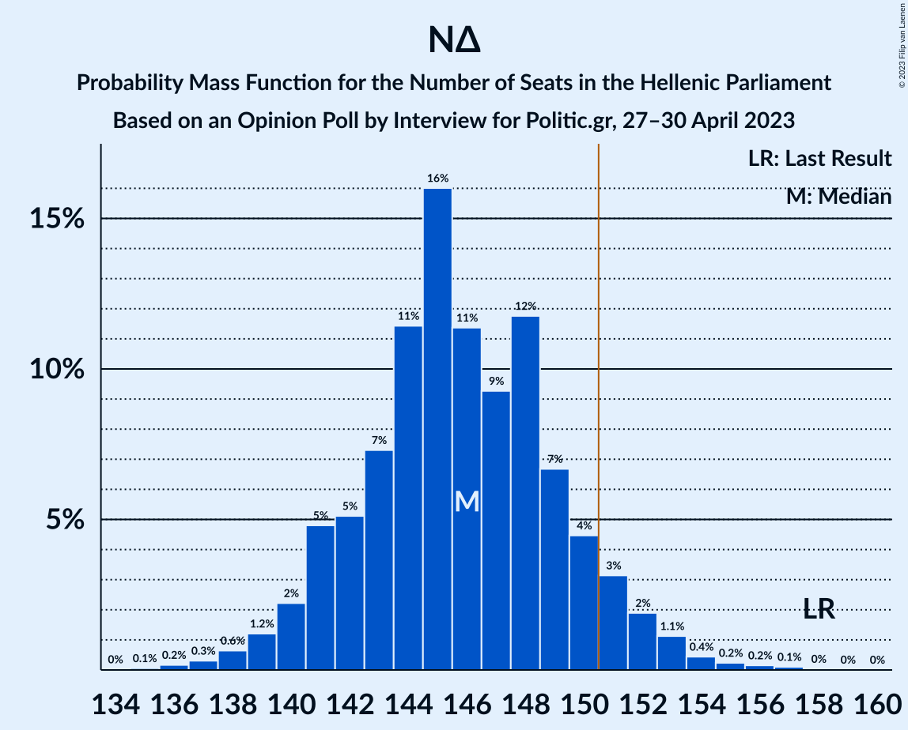

| Number of Seats | Probability | Accumulated | Special Marks |
|:---------------:|:-----------:|:-----------:|:-------------:|
| 135 | 0.1% | 100% |  |
| 136 | 0.2% | 99.9% |  |
| 137 | 0.3% | 99.7% |  |
| 138 | 0.6% | 99.4% |  |
| 139 | 1.2% | 98.8% |  |
| 140 | 2% | 98% |  |
| 141 | 5% | 95% |  |
| 142 | 5% | 91% |  |
| 143 | 7% | 85% |  |
| 144 | 11% | 78% |  |
| 145 | 16% | 67% |  |
| 146 | 11% | 51% | Median |
| 147 | 9% | 39% |  |
| 148 | 12% | 30% |  |
| 149 | 7% | 18% |  |
| 150 | 4% | 12% |  |
| 151 | 3% | 7% | Majority |
| 152 | 2% | 4% |  |
| 153 | 1.1% | 2% |  |
| 154 | 0.4% | 1.0% |  |
| 155 | 0.2% | 0.5% |  |
| 156 | 0.2% | 0.3% |  |
| 157 | 0.1% | 0.2% |  |
| 158 | 0% | 0.1% | Last Result |
| 159 | 0% | 0% |  |

### Συνασπισμός Ριζοσπαστικής Αριστεράς – Μέτωπο Ευρωπαϊκής Ρεαλιστικής Ανυπακοής

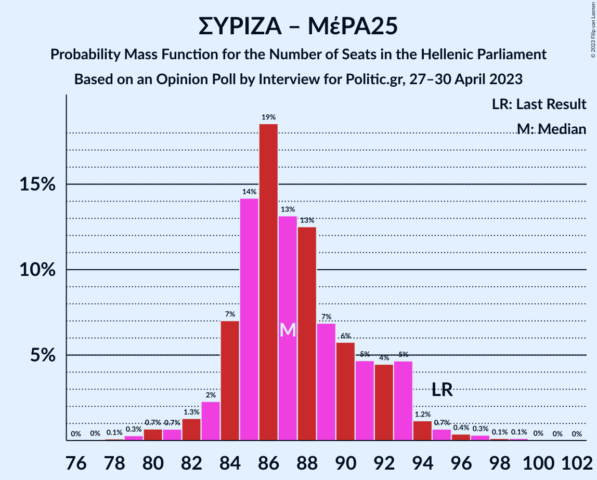

| Number of Seats | Probability | Accumulated | Special Marks |
|:---------------:|:-----------:|:-----------:|:-------------:|
| 77 | 0% | 100% |  |
| 78 | 0.1% | 99.9% |  |
| 79 | 0.3% | 99.8% |  |
| 80 | 0.7% | 99.6% |  |
| 81 | 0.7% | 98.9% |  |
| 82 | 1.3% | 98% |  |
| 83 | 2% | 97% |  |
| 84 | 7% | 95% |  |
| 85 | 14% | 88% |  |
| 86 | 19% | 73% |  |
| 87 | 13% | 55% |  |
| 88 | 13% | 42% | Median |
| 89 | 7% | 29% |  |
| 90 | 6% | 22% |  |
| 91 | 5% | 17% |  |
| 92 | 4% | 12% |  |
| 93 | 5% | 7% |  |
| 94 | 1.2% | 3% |  |
| 95 | 0.7% | 2% | Last Result |
| 96 | 0.4% | 1.0% |  |
| 97 | 0.3% | 0.6% |  |
| 98 | 0.1% | 0.3% |  |
| 99 | 0.1% | 0.2% |  |
| 100 | 0% | 0.1% |  |
| 101 | 0% | 0% |  |

### Συνασπισμός Ριζοσπαστικής Αριστεράς

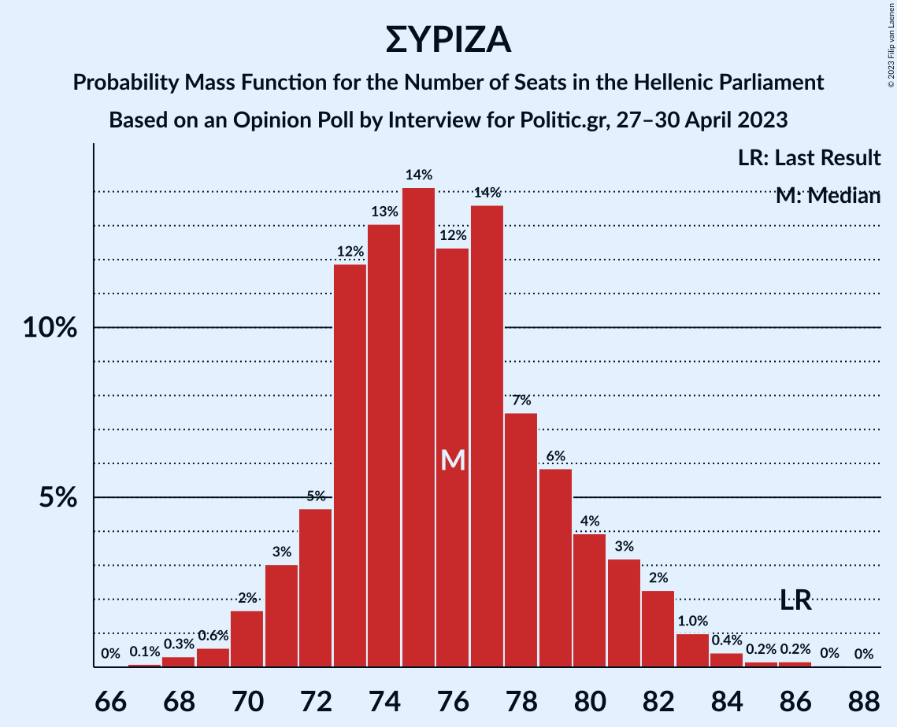

| Number of Seats | Probability | Accumulated | Special Marks |
|:---------------:|:-----------:|:-----------:|:-------------:|
| 67 | 0.1% | 100% |  |
| 68 | 0.3% | 99.9% |  |
| 69 | 0.6% | 99.5% |  |
| 70 | 2% | 99.0% |  |
| 71 | 3% | 97% |  |
| 72 | 5% | 94% |  |
| 73 | 12% | 90% |  |
| 74 | 13% | 78% |  |
| 75 | 14% | 65% |  |
| 76 | 12% | 51% | Median |
| 77 | 14% | 38% |  |
| 78 | 7% | 25% |  |
| 79 | 6% | 17% |  |
| 80 | 4% | 11% |  |
| 81 | 3% | 7% |  |
| 82 | 2% | 4% |  |
| 83 | 1.0% | 2% |  |
| 84 | 0.4% | 0.9% |  |
| 85 | 0.2% | 0.4% |  |
| 86 | 0.2% | 0.3% | Last Result |
| 87 | 0% | 0.1% |  |
| 88 | 0% | 0% |  |

## Technical Information

### Opinion Poll

+ **Polling firm:** Interview
+ **Commissioner(s):** Politic.gr
+ **Fieldwork period:** 27–30 April 2023

### Calculations

+ **Sample size:** 1705
+ **Simulations done:** 1,048,576
+ **Error estimate:** 1.45%

