# Opinion Poll by Metron Analysis for Mega TV, 25 April–5 May 2023

<a href="#voting-intentions">Voting Intentions</a> | <a href="#seats">Seats</a> | <a href="#coalitions">Coalitions</a> | <a href="#technical-information">Technical Information</a>

## Voting Intentions

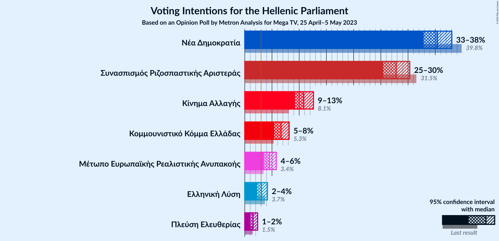

### Confidence Intervals

| Party | Last Result | Poll Result | 80% Confidence Interval | 90% Confidence Interval | 95% Confidence Interval | 99% Confidence Interval |
|:-----:|:-----------:|:-----------:|:-----------------------:|:-----------------------:|:-----------------------:|:-----------------------:|
| Νέα Δημοκρατία | 39.8% | 35.4% | 33.7–37.1% |33.3–37.6% |32.8–38.0% |32.1–38.9% |
| Συνασπισμός Ριζοσπαστικής Αριστεράς | 31.5% | 27.8% | 26.3–29.4% |25.8–29.9% |25.5–30.3% |24.7–31.1% |
| Κίνημα Αλλαγής | 8.1% | 10.8% | 9.8–12.0% |9.5–12.3% |9.2–12.6% |8.7–13.2% |
| Κομμουνιστικό Κόμμα Ελλάδας | 5.3% | 6.7% | 5.9–7.6% |5.6–7.9% |5.4–8.2% |5.1–8.6% |
| Μέτωπο Ευρωπαϊκής Ρεαλιστικής Ανυπακοής | 3.4% | 4.5% | 3.9–5.3% |3.7–5.6% |3.5–5.8% |3.2–6.2% |
| Ελληνική Λύση | 3.7% | 3.1% | 2.5–3.8% |2.4–4.0% |2.3–4.2% |2.0–4.5% |
| Πλεύση Ελευθερίας | 1.5% | 1.5% | 1.2–2.1% |1.1–2.2% |1.0–2.4% |0.8–2.7% |

*Note:* The poll result column reflects the actual value used in the calculations. Published results may vary slightly, and in addition be rounded to fewer digits.

## Seats

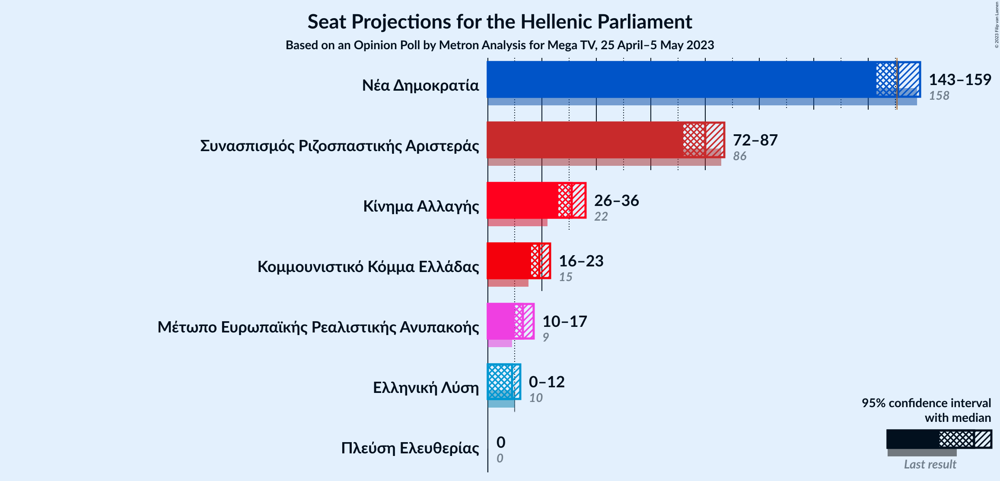

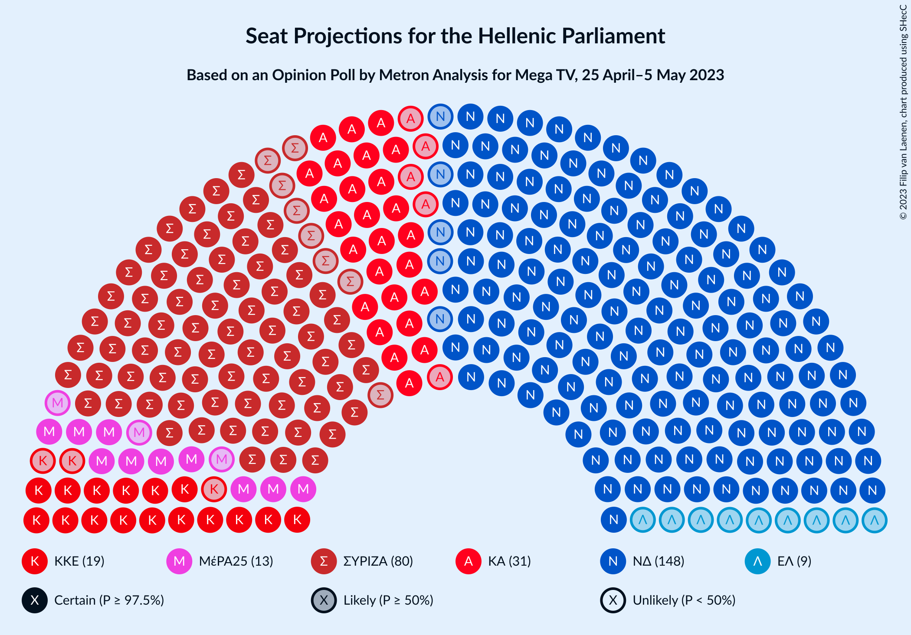

### Confidence Intervals

| Party | Last Result | Median | 80% Confidence Interval | 90% Confidence Interval | 95% Confidence Interval | 99% Confidence Interval |
|:-----:|:-----------:|:------:|:-----------------------:|:-----------------------:|:-----------------------:|:-----------------------:|
| <a href="#νέα-δημοκρατία">Νέα Δημοκρατία</a> | 158 | 151 | 146–157 |145–158 |143–159 |141–162 |
| <a href="#συνασπισμός-ριζοσπαστικής-αριστεράς">Συνασπισμός Ριζοσπαστικής Αριστεράς</a> | 86 | 80 | 75–84 |74–86 |72–87 |70–90 |
| <a href="#κίνημα-αλλαγής">Κίνημα Αλλαγής</a> | 22 | 31 | 28–34 |27–35 |26–36 |25–38 |
| <a href="#κομμουνιστικό-κόμμα-ελλάδας">Κομμουνιστικό Κόμμα Ελλάδας</a> | 15 | 19 | 17–22 |16–23 |16–23 |14–25 |
| <a href="#μέτωπο-ευρωπαϊκής-ρεαλιστικής-ανυπακοής">Μέτωπο Ευρωπαϊκής Ρεαλιστικής Ανυπακοής</a> | 9 | 13 | 11–15 |10–16 |10–17 |9–18 |
| <a href="#ελληνική-λύση">Ελληνική Λύση</a> | 10 | 9 | 0–11 |0–11 |0–12 |0–13 |
| <a href="#πλεύση-ελευθερίας">Πλεύση Ελευθερίας</a> | 0 | 0 | 0 |0 |0 |0 |

### Νέα Δημοκρατία

*For a full overview of the results for this party, see the [Νέα Δημοκρατία](party-νέαδημοκρατία.html) page.*

| Number of Seats | Probability | Accumulated | Special Marks |
|:---------------:|:-----------:|:-----------:|:-------------:|
| 138 | 0% | 100% |  |
| 139 | 0.1% | 99.9% |  |
| 140 | 0.1% | 99.8% |  |
| 141 | 0.5% | 99.7% |  |
| 142 | 0.6% | 99.3% |  |
| 143 | 1.4% | 98.7% |  |
| 144 | 2% | 97% |  |
| 145 | 4% | 95% |  |
| 146 | 4% | 91% |  |
| 147 | 6% | 87% |  |
| 148 | 8% | 81% |  |
| 149 | 7% | 73% |  |
| 150 | 11% | 66% |  |
| 151 | 7% | 55% | Median, Majority |
| 152 | 10% | 49% |  |
| 153 | 8% | 38% |  |
| 154 | 8% | 31% |  |
| 155 | 7% | 23% |  |
| 156 | 5% | 16% |  |
| 157 | 5% | 12% |  |
| 158 | 2% | 7% | Last Result |
| 159 | 2% | 5% |  |
| 160 | 1.1% | 2% |  |
| 161 | 0.6% | 1.3% |  |
| 162 | 0.4% | 0.8% |  |
| 163 | 0.1% | 0.3% |  |
| 164 | 0.1% | 0.2% |  |
| 165 | 0% | 0.1% |  |
| 166 | 0% | 0% |  |

### Συνασπισμός Ριζοσπαστικής Αριστεράς

*For a full overview of the results for this party, see the [Συνασπισμός Ριζοσπαστικής Αριστεράς](party-συνασπισμόςριζοσπαστικήςαριστεράς.html) page.*

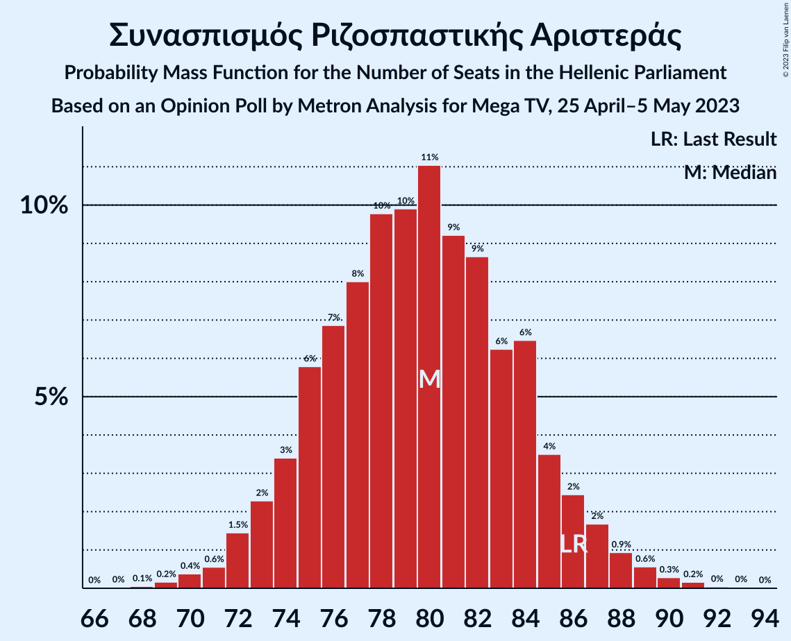

| Number of Seats | Probability | Accumulated | Special Marks |
|:---------------:|:-----------:|:-----------:|:-------------:|
| 68 | 0.1% | 100% |  |
| 69 | 0.2% | 99.9% |  |
| 70 | 0.4% | 99.7% |  |
| 71 | 0.6% | 99.4% |  |
| 72 | 1.5% | 98.8% |  |
| 73 | 2% | 97% |  |
| 74 | 3% | 95% |  |
| 75 | 6% | 92% |  |
| 76 | 7% | 86% |  |
| 77 | 8% | 79% |  |
| 78 | 10% | 71% |  |
| 79 | 10% | 61% |  |
| 80 | 11% | 51% | Median |
| 81 | 9% | 40% |  |
| 82 | 9% | 31% |  |
| 83 | 6% | 22% |  |
| 84 | 6% | 16% |  |
| 85 | 4% | 10% |  |
| 86 | 2% | 6% | Last Result |
| 87 | 2% | 4% |  |
| 88 | 0.9% | 2% |  |
| 89 | 0.6% | 1.1% |  |
| 90 | 0.3% | 0.6% |  |
| 91 | 0.2% | 0.3% |  |
| 92 | 0% | 0.1% |  |
| 93 | 0% | 0.1% |  |
| 94 | 0% | 0% |  |

### Κίνημα Αλλαγής

*For a full overview of the results for this party, see the [Κίνημα Αλλαγής](party-κίνημααλλαγής.html) page.*

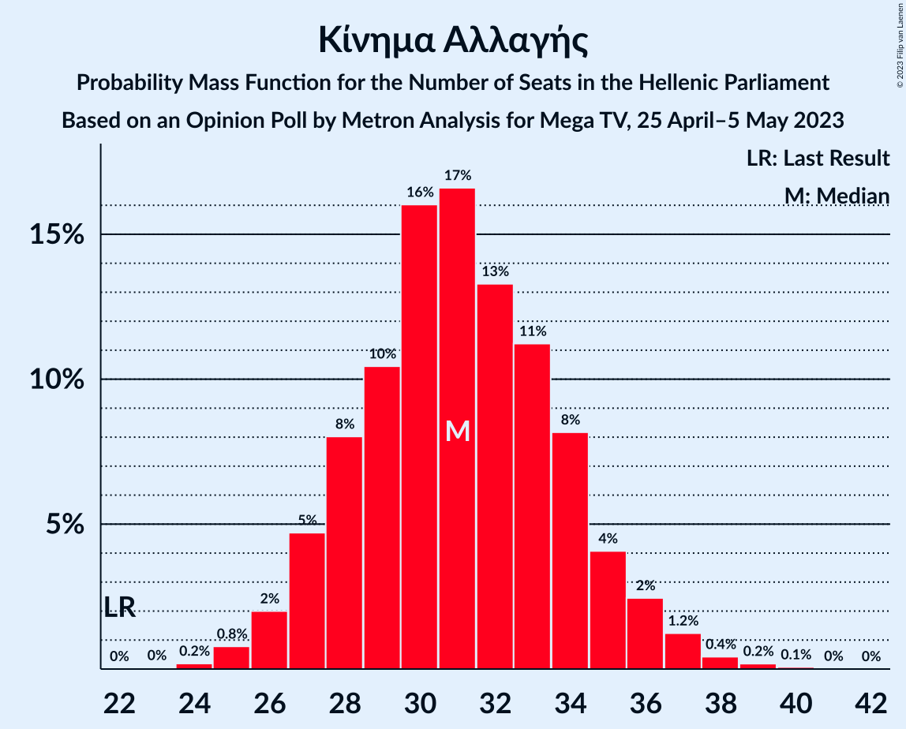

| Number of Seats | Probability | Accumulated | Special Marks |
|:---------------:|:-----------:|:-----------:|:-------------:|
| 22 | 0% | 100% | Last Result |
| 23 | 0% | 100% |  |
| 24 | 0.2% | 99.9% |  |
| 25 | 0.8% | 99.8% |  |
| 26 | 2% | 99.0% |  |
| 27 | 5% | 97% |  |
| 28 | 8% | 92% |  |
| 29 | 10% | 84% |  |
| 30 | 16% | 74% |  |
| 31 | 17% | 58% | Median |
| 32 | 13% | 41% |  |
| 33 | 11% | 28% |  |
| 34 | 8% | 17% |  |
| 35 | 4% | 8% |  |
| 36 | 2% | 4% |  |
| 37 | 1.2% | 2% |  |
| 38 | 0.4% | 0.7% |  |
| 39 | 0.2% | 0.3% |  |
| 40 | 0.1% | 0.1% |  |
| 41 | 0% | 0% |  |

### Κομμουνιστικό Κόμμα Ελλάδας

*For a full overview of the results for this party, see the [Κομμουνιστικό Κόμμα Ελλάδας](party-κομμουνιστικόκόμμαελλάδας.html) page.*

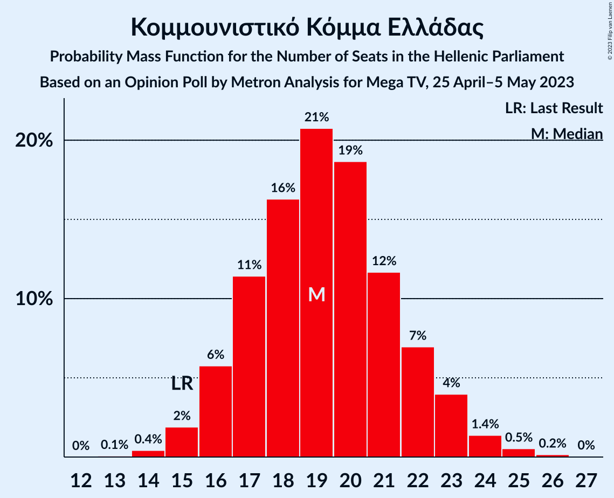

| Number of Seats | Probability | Accumulated | Special Marks |
|:---------------:|:-----------:|:-----------:|:-------------:|
| 13 | 0.1% | 100% |  |
| 14 | 0.4% | 99.9% |  |
| 15 | 2% | 99.5% | Last Result |
| 16 | 6% | 98% |  |
| 17 | 11% | 92% |  |
| 18 | 16% | 80% |  |
| 19 | 21% | 64% | Median |
| 20 | 19% | 43% |  |
| 21 | 12% | 25% |  |
| 22 | 7% | 13% |  |
| 23 | 4% | 6% |  |
| 24 | 1.4% | 2% |  |
| 25 | 0.5% | 0.7% |  |
| 26 | 0.2% | 0.2% |  |
| 27 | 0% | 0% |  |

### Μέτωπο Ευρωπαϊκής Ρεαλιστικής Ανυπακοής

*For a full overview of the results for this party, see the [Μέτωπο Ευρωπαϊκής Ρεαλιστικής Ανυπακοής](party-μέτωποευρωπαϊκήςρεαλιστικήςανυπακοής.html) page.*

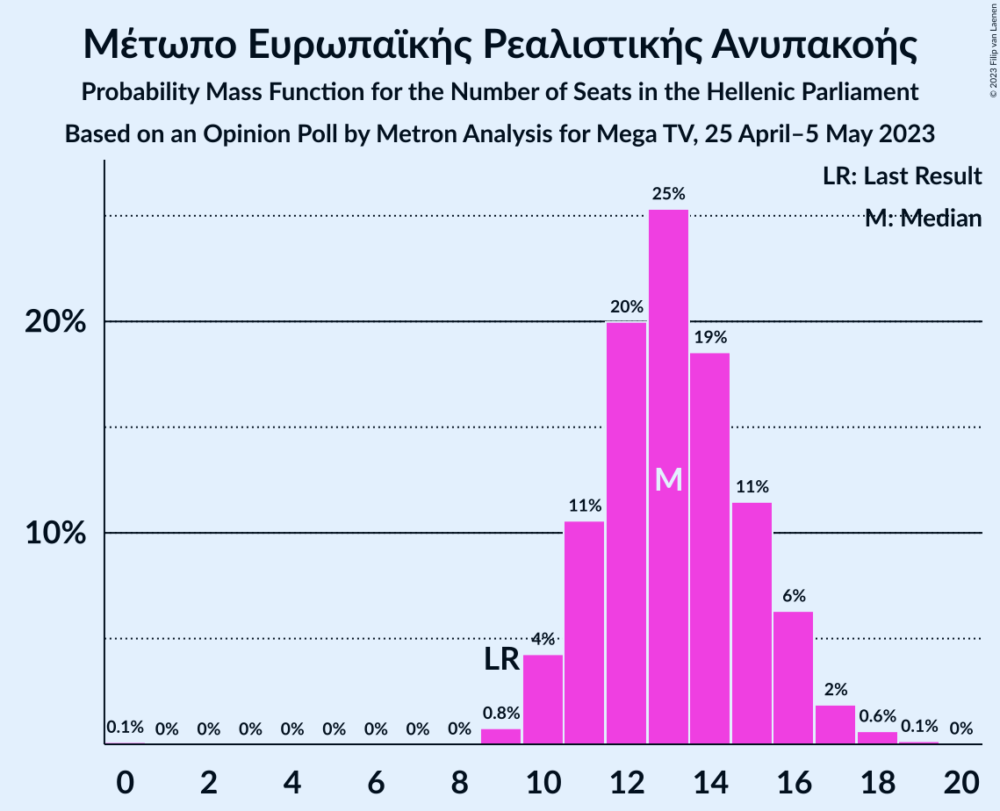

| Number of Seats | Probability | Accumulated | Special Marks |
|:---------------:|:-----------:|:-----------:|:-------------:|
| 0 | 0.1% | 100% |  |
| 1 | 0% | 99.9% |  |
| 2 | 0% | 99.9% |  |
| 3 | 0% | 99.9% |  |
| 4 | 0% | 99.9% |  |
| 5 | 0% | 99.9% |  |
| 6 | 0% | 99.9% |  |
| 7 | 0% | 99.9% |  |
| 8 | 0% | 99.9% |  |
| 9 | 0.8% | 99.9% | Last Result |
| 10 | 4% | 99.1% |  |
| 11 | 11% | 95% |  |
| 12 | 20% | 84% |  |
| 13 | 25% | 64% | Median |
| 14 | 19% | 39% |  |
| 15 | 11% | 20% |  |
| 16 | 6% | 9% |  |
| 17 | 2% | 3% |  |
| 18 | 0.6% | 0.8% |  |
| 19 | 0.1% | 0.2% |  |
| 20 | 0% | 0% |  |

### Ελληνική Λύση

*For a full overview of the results for this party, see the [Ελληνική Λύση](party-ελληνικήλύση.html) page.*

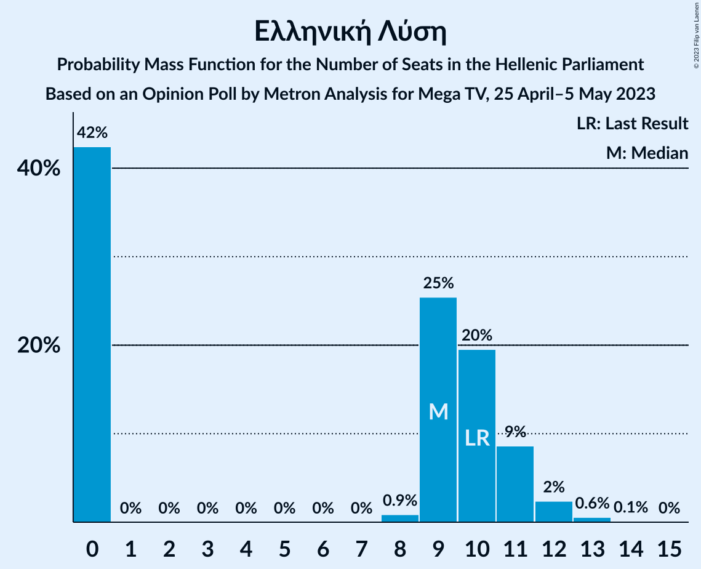

| Number of Seats | Probability | Accumulated | Special Marks |
|:---------------:|:-----------:|:-----------:|:-------------:|
| 0 | 42% | 100% |  |
| 1 | 0% | 58% |  |
| 2 | 0% | 58% |  |
| 3 | 0% | 58% |  |
| 4 | 0% | 58% |  |
| 5 | 0% | 58% |  |
| 6 | 0% | 58% |  |
| 7 | 0% | 58% |  |
| 8 | 0.9% | 58% |  |
| 9 | 25% | 57% | Median |
| 10 | 20% | 31% | Last Result |
| 11 | 9% | 12% |  |
| 12 | 2% | 3% |  |
| 13 | 0.6% | 0.7% |  |
| 14 | 0.1% | 0.1% |  |
| 15 | 0% | 0% |  |

### Πλεύση Ελευθερίας

*For a full overview of the results for this party, see the [Πλεύση Ελευθερίας](party-πλεύσηελευθερίας.html) page.*

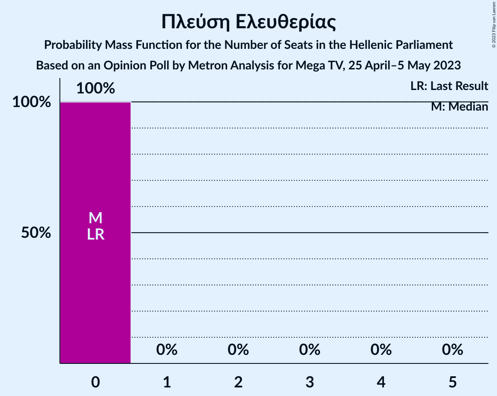

| Number of Seats | Probability | Accumulated | Special Marks |
|:---------------:|:-----------:|:-----------:|:-------------:|
| 0 | 100% | 100% | Last Result, Median |

## Coalitions

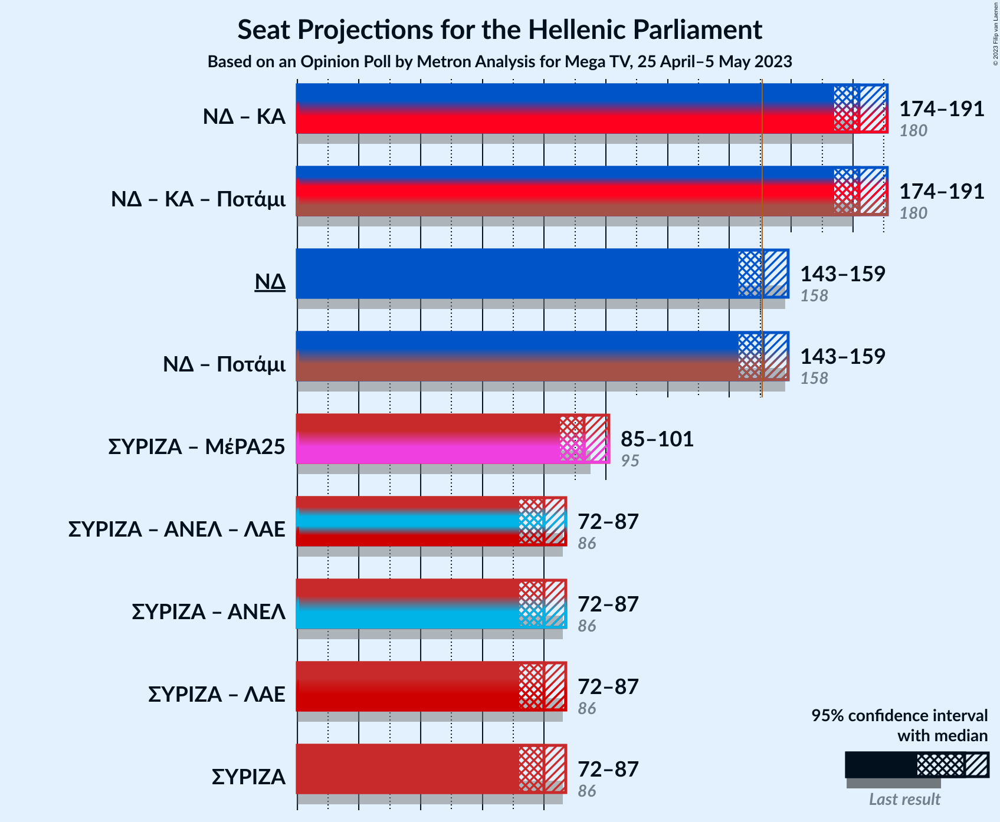

### Confidence Intervals

| Coalition | Last Result | Median | Majority? | 80% Confidence Interval | 90% Confidence Interval | 95% Confidence Interval | 99% Confidence Interval |
|:---------:|:-----------:|:------:|:---------:|:-----------------------:|:-----------------------:|:-----------------------:|:-----------------------:|
| Νέα Δημοκρατία – Κίνημα Αλλαγής | 180 | 182 | 100% | 176–188 | 175–190 | 174–191 | 172–194 |
| Νέα Δημοκρατία | 158 | 151 | 55% | 146–157 | 145–158 | 143–159 | 141–162 |
| Συνασπισμός Ριζοσπαστικής Αριστεράς – Μέτωπο Ευρωπαϊκής Ρεαλιστικής Ανυπακοής | 95 | 93 | 0% | 88–98 | 86–100 | 85–101 | 83–103 |
| Συνασπισμός Ριζοσπαστικής Αριστεράς | 86 | 80 | 0% | 75–84 | 74–86 | 72–87 | 70–90 |

### Νέα Δημοκρατία – Κίνημα Αλλαγής

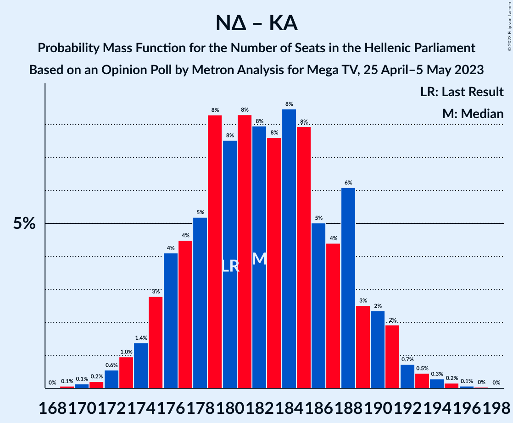

| Number of Seats | Probability | Accumulated | Special Marks |
|:---------------:|:-----------:|:-----------:|:-------------:|
| 168 | 0% | 100% |  |
| 169 | 0.1% | 99.9% |  |
| 170 | 0.1% | 99.9% |  |
| 171 | 0.2% | 99.7% |  |
| 172 | 0.6% | 99.5% |  |
| 173 | 1.0% | 99.0% |  |
| 174 | 1.4% | 98% |  |
| 175 | 3% | 97% |  |
| 176 | 4% | 94% |  |
| 177 | 4% | 90% |  |
| 178 | 5% | 85% |  |
| 179 | 8% | 80% |  |
| 180 | 8% | 72% | Last Result |
| 181 | 8% | 64% |  |
| 182 | 8% | 56% | Median |
| 183 | 8% | 48% |  |
| 184 | 8% | 40% |  |
| 185 | 8% | 32% |  |
| 186 | 5% | 24% |  |
| 187 | 4% | 19% |  |
| 188 | 6% | 15% |  |
| 189 | 3% | 9% |  |
| 190 | 2% | 6% |  |
| 191 | 2% | 4% |  |
| 192 | 0.7% | 2% |  |
| 193 | 0.5% | 1.0% |  |
| 194 | 0.3% | 0.6% |  |
| 195 | 0.2% | 0.3% |  |
| 196 | 0.1% | 0.1% |  |
| 197 | 0% | 0.1% |  |
| 198 | 0% | 0% |  |

### Νέα Δημοκρατία

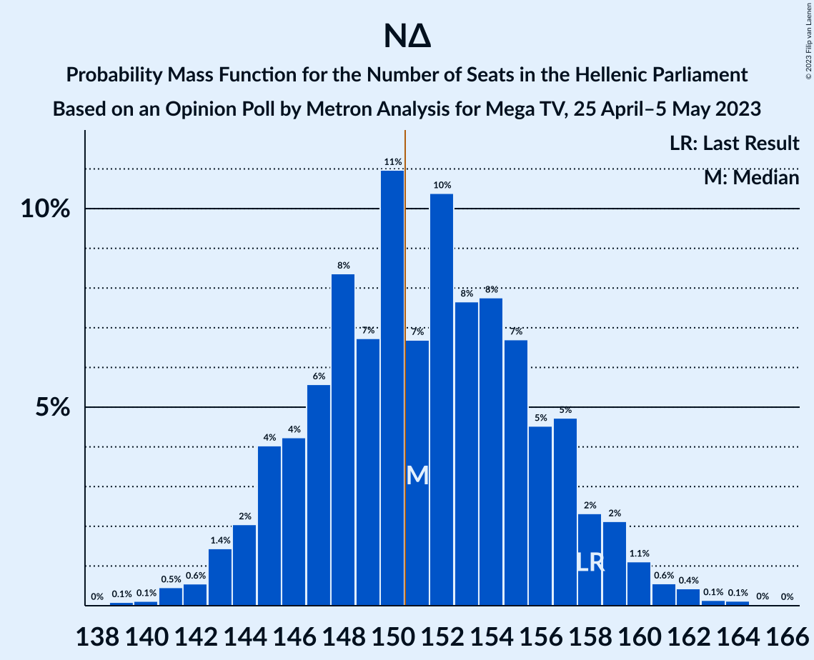

| Number of Seats | Probability | Accumulated | Special Marks |
|:---------------:|:-----------:|:-----------:|:-------------:|
| 138 | 0% | 100% |  |
| 139 | 0.1% | 99.9% |  |
| 140 | 0.1% | 99.8% |  |
| 141 | 0.5% | 99.7% |  |
| 142 | 0.6% | 99.3% |  |
| 143 | 1.4% | 98.7% |  |
| 144 | 2% | 97% |  |
| 145 | 4% | 95% |  |
| 146 | 4% | 91% |  |
| 147 | 6% | 87% |  |
| 148 | 8% | 81% |  |
| 149 | 7% | 73% |  |
| 150 | 11% | 66% |  |
| 151 | 7% | 55% | Median, Majority |
| 152 | 10% | 49% |  |
| 153 | 8% | 38% |  |
| 154 | 8% | 31% |  |
| 155 | 7% | 23% |  |
| 156 | 5% | 16% |  |
| 157 | 5% | 12% |  |
| 158 | 2% | 7% | Last Result |
| 159 | 2% | 5% |  |
| 160 | 1.1% | 2% |  |
| 161 | 0.6% | 1.3% |  |
| 162 | 0.4% | 0.8% |  |
| 163 | 0.1% | 0.3% |  |
| 164 | 0.1% | 0.2% |  |
| 165 | 0% | 0.1% |  |
| 166 | 0% | 0% |  |

### Συνασπισμός Ριζοσπαστικής Αριστεράς – Μέτωπο Ευρωπαϊκής Ρεαλιστικής Ανυπακοής

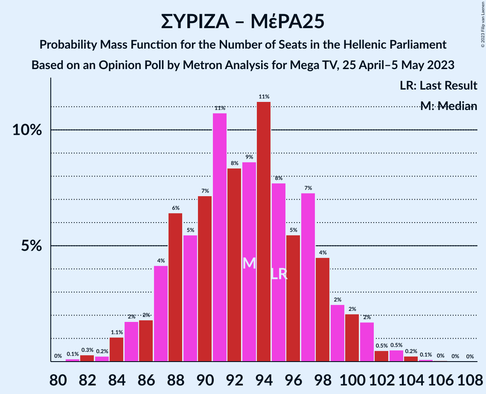

| Number of Seats | Probability | Accumulated | Special Marks |
|:---------------:|:-----------:|:-----------:|:-------------:|
| 80 | 0% | 100% |  |
| 81 | 0.1% | 99.9% |  |
| 82 | 0.3% | 99.8% |  |
| 83 | 0.2% | 99.5% |  |
| 84 | 1.1% | 99.3% |  |
| 85 | 2% | 98% |  |
| 86 | 2% | 97% |  |
| 87 | 4% | 95% |  |
| 88 | 6% | 91% |  |
| 89 | 5% | 84% |  |
| 90 | 7% | 79% |  |
| 91 | 11% | 72% |  |
| 92 | 8% | 61% |  |
| 93 | 9% | 52% | Median |
| 94 | 11% | 44% |  |
| 95 | 8% | 33% | Last Result |
| 96 | 5% | 25% |  |
| 97 | 7% | 19% |  |
| 98 | 4% | 12% |  |
| 99 | 2% | 8% |  |
| 100 | 2% | 5% |  |
| 101 | 2% | 3% |  |
| 102 | 0.5% | 1.4% |  |
| 103 | 0.5% | 0.9% |  |
| 104 | 0.2% | 0.4% |  |
| 105 | 0.1% | 0.2% |  |
| 106 | 0% | 0.1% |  |
| 107 | 0% | 0.1% |  |
| 108 | 0% | 0% |  |

### Συνασπισμός Ριζοσπαστικής Αριστεράς

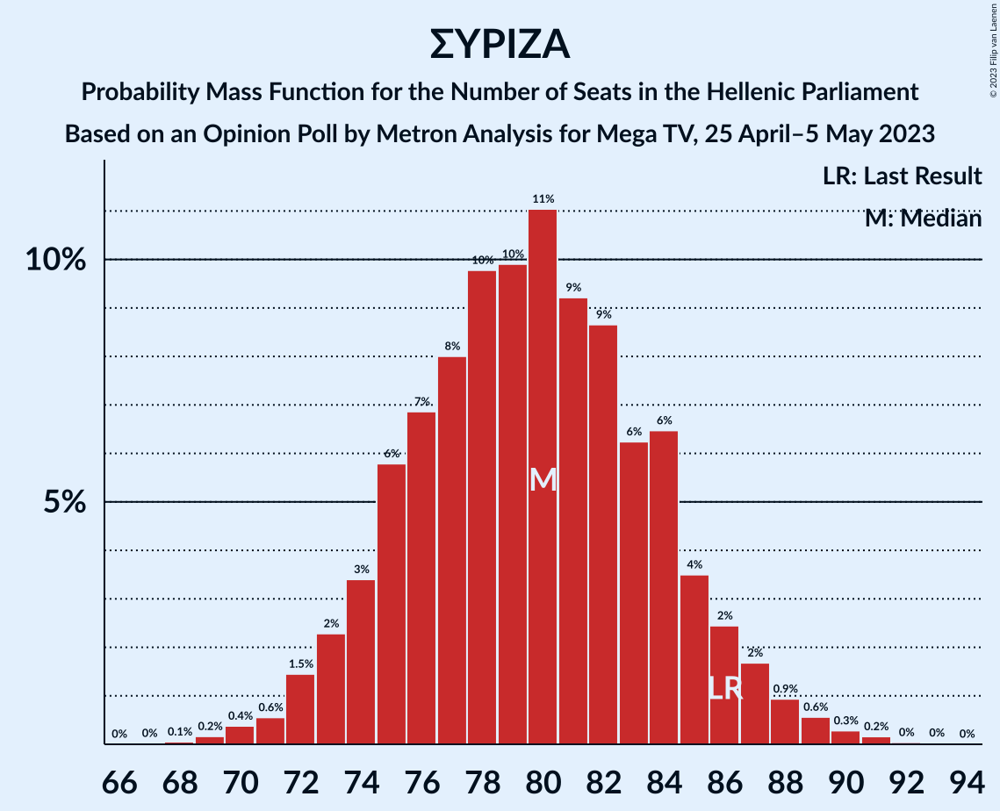

| Number of Seats | Probability | Accumulated | Special Marks |
|:---------------:|:-----------:|:-----------:|:-------------:|
| 68 | 0.1% | 100% |  |
| 69 | 0.2% | 99.9% |  |
| 70 | 0.4% | 99.7% |  |
| 71 | 0.6% | 99.4% |  |
| 72 | 1.5% | 98.8% |  |
| 73 | 2% | 97% |  |
| 74 | 3% | 95% |  |
| 75 | 6% | 92% |  |
| 76 | 7% | 86% |  |
| 77 | 8% | 79% |  |
| 78 | 10% | 71% |  |
| 79 | 10% | 61% |  |
| 80 | 11% | 51% | Median |
| 81 | 9% | 40% |  |
| 82 | 9% | 31% |  |
| 83 | 6% | 22% |  |
| 84 | 6% | 16% |  |
| 85 | 4% | 10% |  |
| 86 | 2% | 6% | Last Result |
| 87 | 2% | 4% |  |
| 88 | 0.9% | 2% |  |
| 89 | 0.6% | 1.1% |  |
| 90 | 0.3% | 0.6% |  |
| 91 | 0.2% | 0.3% |  |
| 92 | 0% | 0.1% |  |
| 93 | 0% | 0.1% |  |
| 94 | 0% | 0% |  |

## Technical Information

### Opinion Poll

+ **Polling firm:** Metron Analysis
+ **Commissioner(s):** Mega TV
+ **Fieldwork period:** 25 April–5 May 2023

### Calculations

+ **Sample size:** 1305
+ **Simulations done:** 1,048,576
+ **Error estimate:** 0.79%

