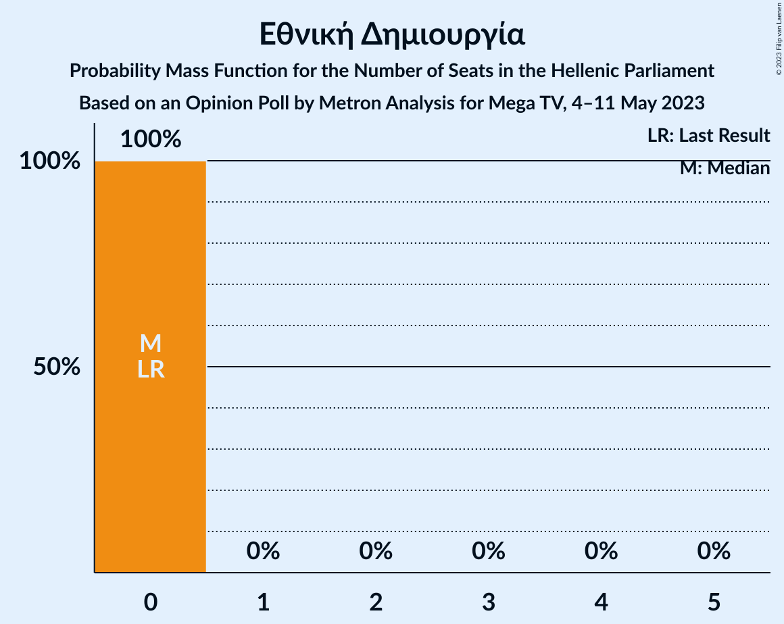

# Opinion Poll by Metron Analysis for Mega TV, 4–11 May 2023

<a href="#voting-intentions">Voting Intentions</a> | <a href="#seats">Seats</a> | <a href="#coalitions">Coalitions</a> | <a href="#technical-information">Technical Information</a>

## Voting Intentions

### Confidence Intervals

| Party | Last Result | Poll Result | 80% Confidence Interval | 90% Confidence Interval | 95% Confidence Interval | 99% Confidence Interval |
|:-----:|:-----------:|:-----------:|:-----------------------:|:-----------------------:|:-----------------------:|:-----------------------:|
| Νέα Δημοκρατία | 39.8% | 36.1% | 34.8–37.5% |34.4–37.9% |34.1–38.2% |33.4–38.9% |
| Συνασπισμός Ριζοσπαστικής Αριστεράς | 31.5% | 28.0% | 26.7–29.3% |26.4–29.6% |26.1–29.9% |25.5–30.6% |
| Κίνημα Αλλαγής | 8.1% | 10.3% | 9.5–11.2% |9.3–11.5% |9.1–11.7% |8.7–12.1% |
| Κομμουνιστικό Κόμμα Ελλάδας | 5.3% | 7.3% | 6.6–8.1% |6.4–8.3% |6.3–8.5% |6.0–8.9% |
| Μέτωπο Ευρωπαϊκής Ρεαλιστικής Ανυπακοής | 3.4% | 4.4% | 3.9–5.1% |3.7–5.2% |3.6–5.4% |3.4–5.7% |
| Ελληνική Λύση | 3.7% | 3.3% | 2.8–3.8% |2.7–4.0% |2.6–4.1% |2.4–4.4% |
| Πλεύση Ελευθερίας | 1.5% | 2.4% | 2.0–2.9% |1.9–3.0% |1.8–3.2% |1.7–3.4% |
| Εθνική Δημιουργία | 0.0% | 1.3% | 1.0–1.7% |0.9–1.8% |0.9–1.9% |0.8–2.1% |

*Note:* The poll result column reflects the actual value used in the calculations. Published results may vary slightly, and in addition be rounded to fewer digits.

## Seats

### Confidence Intervals

| Party | Last Result | Median | 80% Confidence Interval | 90% Confidence Interval | 95% Confidence Interval | 99% Confidence Interval |
|:-----:|:-----------:|:------:|:-----------------------:|:-----------------------:|:-----------------------:|:-----------------------:|
| <a href="#νέα-δημοκρατία">Νέα Δημοκρατία</a> | 158 | 151 | 147–156 |146–157 |145–158 |143–160 |
| <a href="#συνασπισμός-ριζοσπαστικής-αριστεράς">Συνασπισμός Ριζοσπαστικής Αριστεράς</a> | 86 | 79 | 75–82 |74–84 |73–85 |71–87 |
| <a href="#κίνημα-αλλαγής">Κίνημα Αλλαγής</a> | 22 | 29 | 27–32 |26–32 |25–33 |24–34 |
| <a href="#κομμουνιστικό-κόμμα-ελλάδας">Κομμουνιστικό Κόμμα Ελλάδας</a> | 15 | 21 | 19–23 |18–23 |18–24 |17–25 |
| <a href="#μέτωπο-ευρωπαϊκής-ρεαλιστικής-ανυπακοής">Μέτωπο Ευρωπαϊκής Ρεαλιστικής Ανυπακοής</a> | 9 | 13 | 11–14 |11–15 |10–15 |10–16 |
| <a href="#ελληνική-λύση">Ελληνική Λύση</a> | 10 | 9 | 0–11 |0–11 |0–11 |0–12 |
| <a href="#πλεύση-ελευθερίας">Πλεύση Ελευθερίας</a> | 0 | 0 | 0 |0–8 |0–9 |0–9 |
| <a href="#εθνική-δημιουργία">Εθνική Δημιουργία</a> | 0 | 0 | 0 |0 |0 |0 |

### Νέα Δημοκρατία

*For a full overview of the results for this party, see the [Νέα Δημοκρατία](party-νέαδημοκρατία.html) page.*

| Number of Seats | Probability | Accumulated | Special Marks |
|:---------------:|:-----------:|:-----------:|:-------------:|
| 141 | 0.1% | 100% |  |
| 142 | 0.3% | 99.9% |  |
| 143 | 0.4% | 99.6% |  |
| 144 | 1.4% | 99.2% |  |
| 145 | 2% | 98% |  |
| 146 | 3% | 96% |  |
| 147 | 6% | 93% |  |
| 148 | 5% | 86% |  |
| 149 | 13% | 81% |  |
| 150 | 10% | 68% |  |
| 151 | 12% | 58% | Median, Majority |
| 152 | 11% | 46% |  |
| 153 | 8% | 34% |  |
| 154 | 8% | 27% |  |
| 155 | 7% | 19% |  |
| 156 | 3% | 12% |  |
| 157 | 5% | 8% |  |
| 158 | 1.2% | 3% | Last Result |
| 159 | 1.3% | 2% |  |
| 160 | 0.2% | 0.7% |  |
| 161 | 0.2% | 0.4% |  |
| 162 | 0.1% | 0.2% |  |
| 163 | 0% | 0.1% |  |
| 164 | 0% | 0% |  |

### Συνασπισμός Ριζοσπαστικής Αριστεράς

*For a full overview of the results for this party, see the [Συνασπισμός Ριζοσπαστικής Αριστεράς](party-συνασπισμόςριζοσπαστικήςαριστεράς.html) page.*

| Number of Seats | Probability | Accumulated | Special Marks |
|:---------------:|:-----------:|:-----------:|:-------------:|
| 69 | 0.1% | 100% |  |
| 70 | 0.2% | 99.9% |  |
| 71 | 0.7% | 99.7% |  |
| 72 | 1.1% | 99.0% |  |
| 73 | 2% | 98% |  |
| 74 | 5% | 96% |  |
| 75 | 11% | 91% |  |
| 76 | 11% | 80% |  |
| 77 | 9% | 69% |  |
| 78 | 8% | 59% |  |
| 79 | 7% | 51% | Median |
| 80 | 15% | 45% |  |
| 81 | 11% | 30% |  |
| 82 | 10% | 19% |  |
| 83 | 3% | 9% |  |
| 84 | 3% | 5% |  |
| 85 | 1.1% | 3% |  |
| 86 | 0.7% | 1.5% | Last Result |
| 87 | 0.4% | 0.8% |  |
| 88 | 0.3% | 0.3% |  |
| 89 | 0.1% | 0.1% |  |
| 90 | 0% | 0% |  |

### Κίνημα Αλλαγής

*For a full overview of the results for this party, see the [Κίνημα Αλλαγής](party-κίνημααλλαγής.html) page.*

| Number of Seats | Probability | Accumulated | Special Marks |
|:---------------:|:-----------:|:-----------:|:-------------:|
| 22 | 0% | 100% | Last Result |
| 23 | 0.1% | 100% |  |
| 24 | 0.5% | 99.9% |  |
| 25 | 2% | 99.4% |  |
| 26 | 5% | 97% |  |
| 27 | 11% | 92% |  |
| 28 | 20% | 81% |  |
| 29 | 25% | 60% | Median |
| 30 | 17% | 36% |  |
| 31 | 8% | 19% |  |
| 32 | 7% | 11% |  |
| 33 | 3% | 4% |  |
| 34 | 0.7% | 1.1% |  |
| 35 | 0.3% | 0.4% |  |
| 36 | 0.1% | 0.1% |  |
| 37 | 0% | 0% |  |

### Κομμουνιστικό Κόμμα Ελλάδας

*For a full overview of the results for this party, see the [Κομμουνιστικό Κόμμα Ελλάδας](party-κομμουνιστικόκόμμαελλάδας.html) page.*

| Number of Seats | Probability | Accumulated | Special Marks |
|:---------------:|:-----------:|:-----------:|:-------------:|
| 15 | 0% | 100% | Last Result |
| 16 | 0.3% | 100% |  |
| 17 | 2% | 99.7% |  |
| 18 | 8% | 98% |  |
| 19 | 18% | 90% |  |
| 20 | 22% | 72% |  |
| 21 | 21% | 50% | Median |
| 22 | 16% | 29% |  |
| 23 | 9% | 13% |  |
| 24 | 3% | 4% |  |
| 25 | 1.0% | 1.3% |  |
| 26 | 0.2% | 0.3% |  |
| 27 | 0% | 0% |  |

### Μέτωπο Ευρωπαϊκής Ρεαλιστικής Ανυπακοής

*For a full overview of the results for this party, see the [Μέτωπο Ευρωπαϊκής Ρεαλιστικής Ανυπακοής](party-μέτωποευρωπαϊκήςρεαλιστικήςανυπακοής.html) page.*

| Number of Seats | Probability | Accumulated | Special Marks |
|:---------------:|:-----------:|:-----------:|:-------------:|
| 9 | 0.5% | 100% | Last Result |
| 10 | 4% | 99.5% |  |
| 11 | 16% | 95% |  |
| 12 | 26% | 79% |  |
| 13 | 33% | 53% | Median |
| 14 | 14% | 20% |  |
| 15 | 5% | 6% |  |
| 16 | 1.4% | 2% |  |
| 17 | 0.2% | 0.2% |  |
| 18 | 0% | 0% |  |

### Ελληνική Λύση

*For a full overview of the results for this party, see the [Ελληνική Λύση](party-ελληνικήλύση.html) page.*

| Number of Seats | Probability | Accumulated | Special Marks |
|:---------------:|:-----------:|:-----------:|:-------------:|
| 0 | 22% | 100% |  |
| 1 | 0% | 78% |  |
| 2 | 0% | 78% |  |
| 3 | 0% | 78% |  |
| 4 | 0% | 78% |  |
| 5 | 0% | 78% |  |
| 6 | 0% | 78% |  |
| 7 | 0% | 78% |  |
| 8 | 2% | 78% |  |
| 9 | 38% | 76% | Median |
| 10 | 27% | 38% | Last Result |
| 11 | 9% | 12% |  |
| 12 | 2% | 2% |  |
| 13 | 0.3% | 0.3% |  |
| 14 | 0% | 0% |  |

### Πλεύση Ελευθερίας

*For a full overview of the results for this party, see the [Πλεύση Ελευθερίας](party-πλεύσηελευθερίας.html) page.*

| Number of Seats | Probability | Accumulated | Special Marks |
|:---------------:|:-----------:|:-----------:|:-------------:|
| 0 | 94% | 100% | Last Result, Median |
| 1 | 0% | 6% |  |
| 2 | 0% | 6% |  |
| 3 | 0% | 6% |  |
| 4 | 0% | 6% |  |
| 5 | 0% | 6% |  |
| 6 | 0% | 6% |  |
| 7 | 0% | 6% |  |
| 8 | 2% | 6% |  |
| 9 | 3% | 4% |  |
| 10 | 0.4% | 0.4% |  |
| 11 | 0% | 0% |  |

### Εθνική Δημιουργία

*For a full overview of the results for this party, see the [Εθνική Δημιουργία](party-εθνικήδημιουργία.html) page.*

| Number of Seats | Probability | Accumulated | Special Marks |
|:---------------:|:-----------:|:-----------:|:-------------:|
| 0 | 100% | 100% | Last Result, Median |

## Coalitions

### Confidence Intervals

| Coalition | Last Result | Median | Majority? | 80% Confidence Interval | 90% Confidence Interval | 95% Confidence Interval | 99% Confidence Interval |
|:---------:|:-----------:|:------:|:---------:|:-----------------------:|:-----------------------:|:-----------------------:|:-----------------------:|
| Νέα Δημοκρατία – Κίνημα Αλλαγής | 180 | 180 | 100% | 176–185 | 174–187 | 173–188 | 171–190 |
| Νέα Δημοκρατία | 158 | 151 | 58% | 147–156 | 146–157 | 145–158 | 143–160 |
| Συνασπισμός Ριζοσπαστικής Αριστεράς – Μέτωπο Ευρωπαϊκής Ρεαλιστικής Ανυπακοής | 95 | 91 | 0% | 87–95 | 86–97 | 85–97 | 83–100 |
| Συνασπισμός Ριζοσπαστικής Αριστεράς | 86 | 79 | 0% | 75–82 | 74–84 | 73–85 | 71–87 |

### Νέα Δημοκρατία – Κίνημα Αλλαγής

| Number of Seats | Probability | Accumulated | Special Marks |
|:---------------:|:-----------:|:-----------:|:-------------:|
| 169 | 0.1% | 100% |  |
| 170 | 0.2% | 99.9% |  |
| 171 | 0.4% | 99.7% |  |
| 172 | 0.8% | 99.3% |  |
| 173 | 1.1% | 98% |  |
| 174 | 3% | 97% |  |
| 175 | 4% | 95% |  |
| 176 | 5% | 91% |  |
| 177 | 9% | 86% |  |
| 178 | 9% | 76% |  |
| 179 | 12% | 68% |  |
| 180 | 10% | 56% | Last Result, Median |
| 181 | 11% | 46% |  |
| 182 | 6% | 35% |  |
| 183 | 8% | 28% |  |
| 184 | 5% | 20% |  |
| 185 | 5% | 15% |  |
| 186 | 4% | 10% |  |
| 187 | 2% | 6% |  |
| 188 | 2% | 3% |  |
| 189 | 0.5% | 1.2% |  |
| 190 | 0.3% | 0.7% |  |
| 191 | 0.2% | 0.4% |  |
| 192 | 0.1% | 0.2% |  |
| 193 | 0% | 0.1% |  |
| 194 | 0% | 0% |  |

### Νέα Δημοκρατία

| Number of Seats | Probability | Accumulated | Special Marks |
|:---------------:|:-----------:|:-----------:|:-------------:|
| 141 | 0.1% | 100% |  |
| 142 | 0.3% | 99.9% |  |
| 143 | 0.4% | 99.6% |  |
| 144 | 1.4% | 99.2% |  |
| 145 | 2% | 98% |  |
| 146 | 3% | 96% |  |
| 147 | 6% | 93% |  |
| 148 | 5% | 86% |  |
| 149 | 13% | 81% |  |
| 150 | 10% | 68% |  |
| 151 | 12% | 58% | Median, Majority |
| 152 | 11% | 46% |  |
| 153 | 8% | 34% |  |
| 154 | 8% | 27% |  |
| 155 | 7% | 19% |  |
| 156 | 3% | 12% |  |
| 157 | 5% | 8% |  |
| 158 | 1.2% | 3% | Last Result |
| 159 | 1.3% | 2% |  |
| 160 | 0.2% | 0.7% |  |
| 161 | 0.2% | 0.4% |  |
| 162 | 0.1% | 0.2% |  |
| 163 | 0% | 0.1% |  |
| 164 | 0% | 0% |  |

### Συνασπισμός Ριζοσπαστικής Αριστεράς – Μέτωπο Ευρωπαϊκής Ρεαλιστικής Ανυπακοής

| Number of Seats | Probability | Accumulated | Special Marks |
|:---------------:|:-----------:|:-----------:|:-------------:|
| 81 | 0.1% | 100% |  |
| 82 | 0.3% | 99.9% |  |
| 83 | 0.8% | 99.6% |  |
| 84 | 0.6% | 98.8% |  |
| 85 | 0.9% | 98% |  |
| 86 | 7% | 97% |  |
| 87 | 7% | 90% |  |
| 88 | 5% | 83% |  |
| 89 | 10% | 79% |  |
| 90 | 14% | 69% |  |
| 91 | 10% | 55% |  |
| 92 | 4% | 45% | Median |
| 93 | 15% | 41% |  |
| 94 | 15% | 26% |  |
| 95 | 2% | 11% | Last Result |
| 96 | 3% | 9% |  |
| 97 | 4% | 6% |  |
| 98 | 1.3% | 2% |  |
| 99 | 0.2% | 1.0% |  |
| 100 | 0.4% | 0.8% |  |
| 101 | 0.3% | 0.4% |  |
| 102 | 0.1% | 0.1% |  |
| 103 | 0% | 0% |  |

### Συνασπισμός Ριζοσπαστικής Αριστεράς

| Number of Seats | Probability | Accumulated | Special Marks |
|:---------------:|:-----------:|:-----------:|:-------------:|
| 69 | 0.1% | 100% |  |
| 70 | 0.2% | 99.9% |  |
| 71 | 0.7% | 99.7% |  |
| 72 | 1.1% | 99.0% |  |
| 73 | 2% | 98% |  |
| 74 | 5% | 96% |  |
| 75 | 11% | 91% |  |
| 76 | 11% | 80% |  |
| 77 | 9% | 69% |  |
| 78 | 8% | 59% |  |
| 79 | 7% | 51% | Median |
| 80 | 15% | 45% |  |
| 81 | 11% | 30% |  |
| 82 | 10% | 19% |  |
| 83 | 3% | 9% |  |
| 84 | 3% | 5% |  |
| 85 | 1.1% | 3% |  |
| 86 | 0.7% | 1.5% | Last Result |
| 87 | 0.4% | 0.8% |  |
| 88 | 0.3% | 0.3% |  |
| 89 | 0.1% | 0.1% |  |
| 90 | 0% | 0% |  |

## Technical Information

### Opinion Poll

+ **Polling firm:** Metron Analysis
+ **Commissioner(s):** Mega TV
+ **Fieldwork period:** 4–11 May 2023

### Calculations

+ **Sample size:** 2105
+ **Simulations done:** 1,048,576
+ **Error estimate:** 0.94%

