# Opinion Poll by Alco for Alpha TV, 11–16 May 2023

<a href="#voting-intentions">Voting Intentions</a> | <a href="#seats">Seats</a> | <a href="#coalitions">Coalitions</a> | <a href="#technical-information">Technical Information</a>

## Voting Intentions

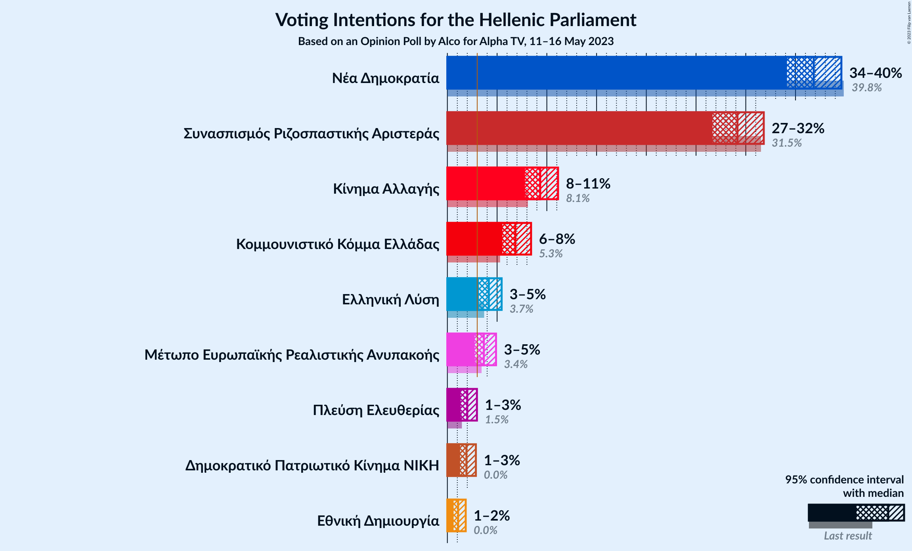

### Confidence Intervals

| Party | Last Result | Poll Result | 80% Confidence Interval | 90% Confidence Interval | 95% Confidence Interval | 99% Confidence Interval |
|:-----:|:-----------:|:-----------:|:-----------------------:|:-----------------------:|:-----------------------:|:-----------------------:|
| Νέα Δημοκρατία | 39.8% | 36.8% | 35.1–38.7% |34.6–39.2% |34.1–39.6% |33.3–40.5% |
| Συνασπισμός Ριζοσπαστικής Αριστεράς | 31.5% | 29.2% | 27.5–30.9% |27.1–31.4% |26.7–31.8% |25.9–32.6% |
| Κίνημα Αλλαγής | 8.1% | 9.3% | 8.3–10.5% |8.0–10.8% |7.8–11.1% |7.4–11.7% |
| Κομμουνιστικό Κόμμα Ελλάδας | 5.3% | 6.8% | 6.0–7.9% |5.7–8.2% |5.5–8.4% |5.2–8.9% |
| Ελληνική Λύση | 3.7% | 4.2% | 3.5–5.0% |3.3–5.2% |3.2–5.5% |2.9–5.9% |
| Μέτωπο Ευρωπαϊκής Ρεαλιστικής Ανυπακοής | 3.4% | 3.7% | 3.0–4.5% |2.9–4.7% |2.7–4.9% |2.5–5.3% |
| Πλεύση Ελευθερίας | 1.5% | 2.0% | 1.6–2.6% |1.4–2.8% |1.3–3.0% |1.2–3.3% |
| Δημοκρατικό Πατριωτικό Κίνημα ΝΙΚΗ | 0.0% | 1.9% | 1.5–2.5% |1.4–2.7% |1.3–2.9% |1.1–3.2% |
| Εθνική Δημιουργία | 0.0% | 1.1% | 0.8–1.6% |0.7–1.7% |0.6–1.8% |0.5–2.1% |

*Note:* The poll result column reflects the actual value used in the calculations. Published results may vary slightly, and in addition be rounded to fewer digits.

## Seats

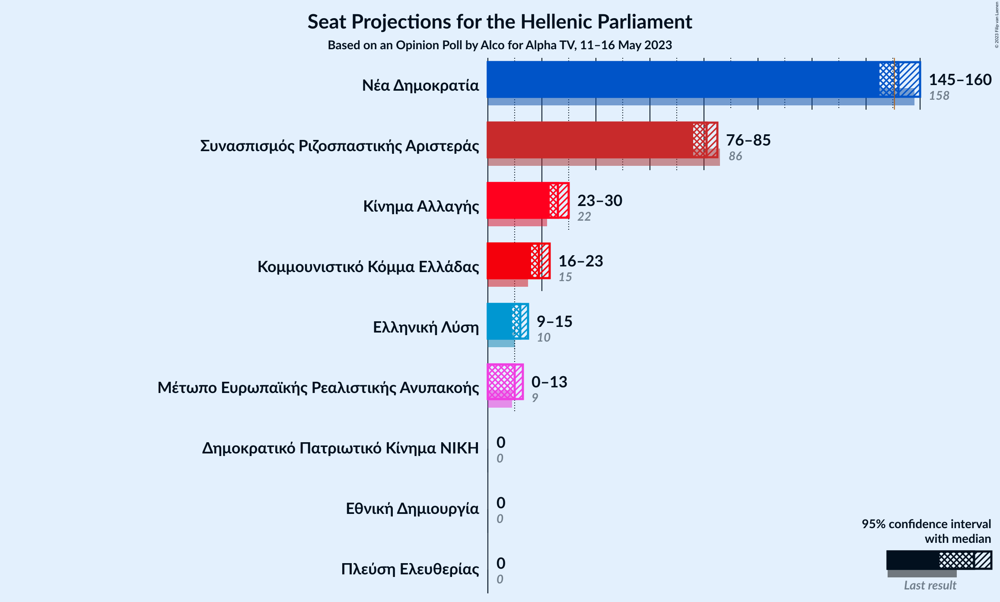

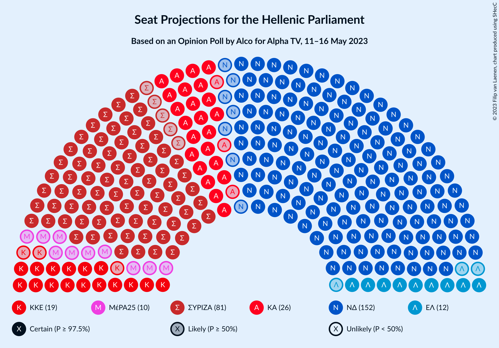

### Confidence Intervals

| Party | Last Result | Median | 80% Confidence Interval | 90% Confidence Interval | 95% Confidence Interval | 99% Confidence Interval |
|:-----:|:-----------:|:------:|:-----------------------:|:-----------------------:|:-----------------------:|:-----------------------:|
| <a href="#νέα-δημοκρατία">Νέα Δημοκρατία</a> | 158 | 152 | 147–158 |147–158 |145–160 |143–163 |
| <a href="#συνασπισμός-ριζοσπαστικής-αριστεράς">Συνασπισμός Ριζοσπαστικής Αριστεράς</a> | 86 | 81 | 78–83 |77–84 |76–85 |75–87 |
| <a href="#κίνημα-αλλαγής">Κίνημα Αλλαγής</a> | 22 | 26 | 24–28 |23–30 |23–30 |21–32 |
| <a href="#κομμουνιστικό-κόμμα-ελλάδας">Κομμουνιστικό Κόμμα Ελλάδας</a> | 15 | 19 | 17–21 |16–22 |16–23 |14–25 |
| <a href="#ελληνική-λύση">Ελληνική Λύση</a> | 10 | 12 | 10–14 |9–14 |9–15 |0–16 |
| <a href="#μέτωπο-ευρωπαϊκής-ρεαλιστικής-ανυπακοής">Μέτωπο Ευρωπαϊκής Ρεαλιστικής Ανυπακοής</a> | 9 | 10 | 9–12 |0–13 |0–13 |0–15 |
| <a href="#πλεύση-ελευθερίας">Πλεύση Ελευθερίας</a> | 0 | 0 | 0 |0 |0 |0–9 |
| <a href="#δημοκρατικό-πατριωτικό-κίνημα-νικη">Δημοκρατικό Πατριωτικό Κίνημα ΝΙΚΗ</a> | 0 | 0 | 0 |0 |0 |0–8 |
| <a href="#εθνική-δημιουργία">Εθνική Δημιουργία</a> | 0 | 0 | 0 |0 |0 |0 |

### Νέα Δημοκρατία

*For a full overview of the results for this party, see the [Νέα Δημοκρατία](party-νέαδημοκρατία.html) page.*

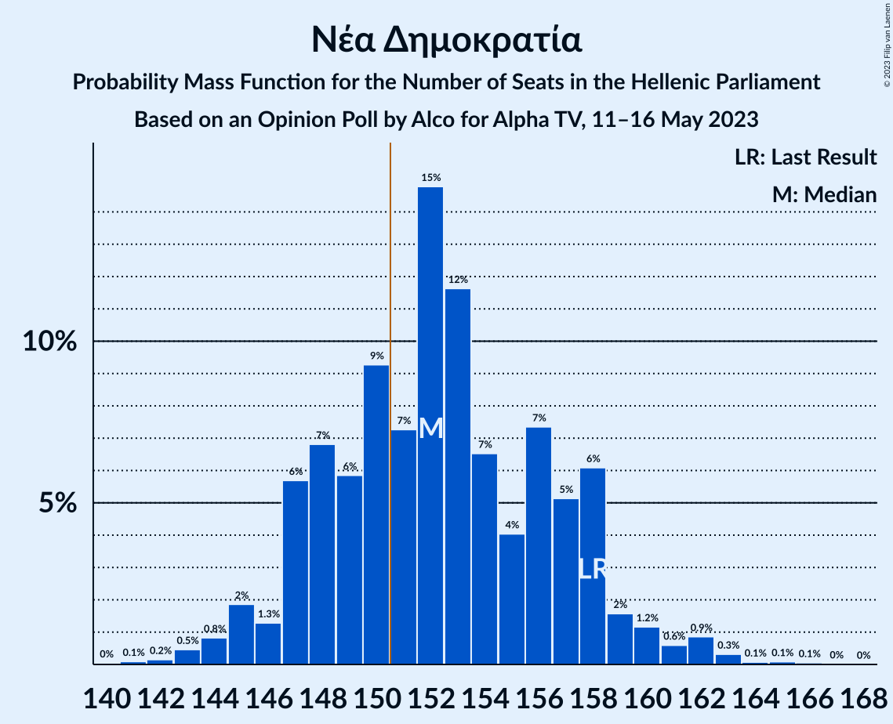

| Number of Seats | Probability | Accumulated | Special Marks |
|:---------------:|:-----------:|:-----------:|:-------------:|
| 140 | 0% | 100% |  |
| 141 | 0.1% | 99.9% |  |
| 142 | 0.2% | 99.8% |  |
| 143 | 0.5% | 99.7% |  |
| 144 | 0.8% | 99.2% |  |
| 145 | 2% | 98% |  |
| 146 | 1.3% | 97% |  |
| 147 | 6% | 95% |  |
| 148 | 7% | 90% |  |
| 149 | 6% | 83% |  |
| 150 | 9% | 77% |  |
| 151 | 7% | 68% | Majority |
| 152 | 15% | 60% | Median |
| 153 | 12% | 46% |  |
| 154 | 7% | 34% |  |
| 155 | 4% | 27% |  |
| 156 | 7% | 23% |  |
| 157 | 5% | 16% |  |
| 158 | 6% | 11% | Last Result |
| 159 | 2% | 5% |  |
| 160 | 1.2% | 3% |  |
| 161 | 0.6% | 2% |  |
| 162 | 0.9% | 1.4% |  |
| 163 | 0.3% | 0.6% |  |
| 164 | 0.1% | 0.2% |  |
| 165 | 0.1% | 0.2% |  |
| 166 | 0.1% | 0.1% |  |
| 167 | 0% | 0% |  |

### Συνασπισμός Ριζοσπαστικής Αριστεράς

*For a full overview of the results for this party, see the [Συνασπισμός Ριζοσπαστικής Αριστεράς](party-συνασπισμόςριζοσπαστικήςαριστεράς.html) page.*

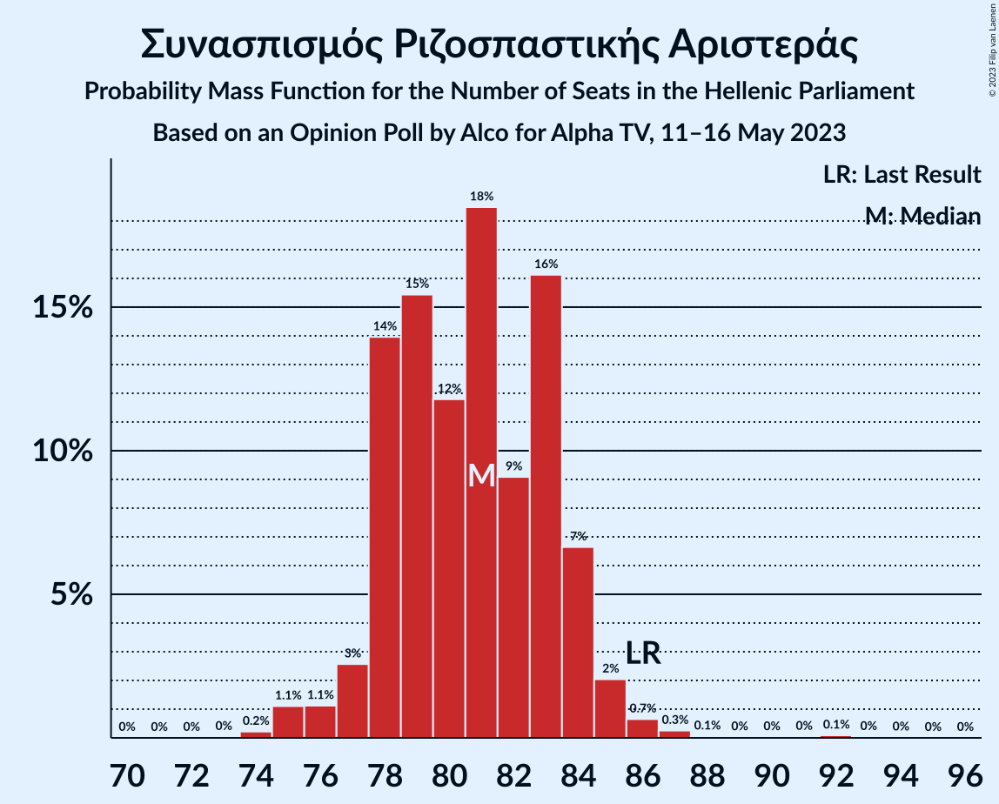

| Number of Seats | Probability | Accumulated | Special Marks |
|:---------------:|:-----------:|:-----------:|:-------------:|
| 71 | 0% | 100% |  |
| 72 | 0% | 99.9% |  |
| 73 | 0% | 99.9% |  |
| 74 | 0.2% | 99.9% |  |
| 75 | 1.1% | 99.7% |  |
| 76 | 1.1% | 98.6% |  |
| 77 | 3% | 97% |  |
| 78 | 14% | 95% |  |
| 79 | 15% | 81% |  |
| 80 | 12% | 65% |  |
| 81 | 18% | 54% | Median |
| 82 | 9% | 35% |  |
| 83 | 16% | 26% |  |
| 84 | 7% | 10% |  |
| 85 | 2% | 3% |  |
| 86 | 0.7% | 1.3% | Last Result |
| 87 | 0.3% | 0.6% |  |
| 88 | 0.1% | 0.4% |  |
| 89 | 0% | 0.3% |  |
| 90 | 0% | 0.3% |  |
| 91 | 0% | 0.3% |  |
| 92 | 0.1% | 0.2% |  |
| 93 | 0% | 0.1% |  |
| 94 | 0% | 0.1% |  |
| 95 | 0% | 0% |  |

### Κίνημα Αλλαγής

*For a full overview of the results for this party, see the [Κίνημα Αλλαγής](party-κίνημααλλαγής.html) page.*

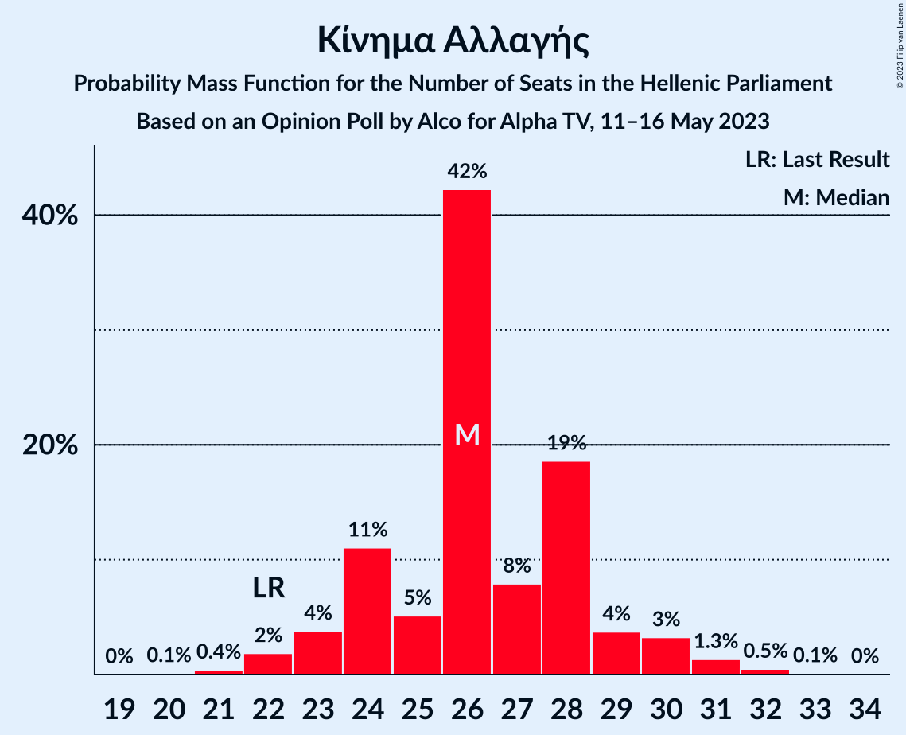

| Number of Seats | Probability | Accumulated | Special Marks |
|:---------------:|:-----------:|:-----------:|:-------------:|
| 20 | 0.1% | 100% |  |
| 21 | 0.4% | 99.9% |  |
| 22 | 2% | 99.5% | Last Result |
| 23 | 4% | 98% |  |
| 24 | 11% | 94% |  |
| 25 | 5% | 83% |  |
| 26 | 42% | 78% | Median |
| 27 | 8% | 35% |  |
| 28 | 19% | 28% |  |
| 29 | 4% | 9% |  |
| 30 | 3% | 5% |  |
| 31 | 1.3% | 2% |  |
| 32 | 0.5% | 0.6% |  |
| 33 | 0.1% | 0.1% |  |
| 34 | 0% | 0% |  |

### Κομμουνιστικό Κόμμα Ελλάδας

*For a full overview of the results for this party, see the [Κομμουνιστικό Κόμμα Ελλάδας](party-κομμουνιστικόκόμμαελλάδας.html) page.*

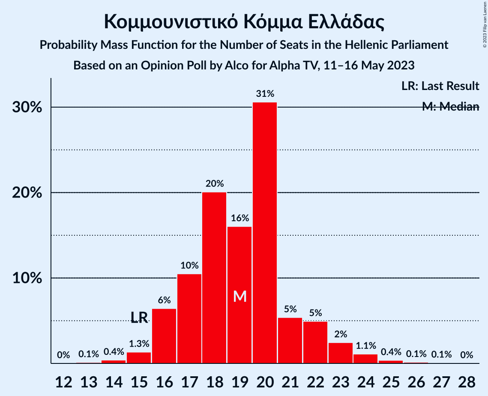

| Number of Seats | Probability | Accumulated | Special Marks |
|:---------------:|:-----------:|:-----------:|:-------------:|
| 13 | 0.1% | 100% |  |
| 14 | 0.4% | 99.9% |  |
| 15 | 1.3% | 99.5% | Last Result |
| 16 | 6% | 98% |  |
| 17 | 10% | 92% |  |
| 18 | 20% | 81% |  |
| 19 | 16% | 61% | Median |
| 20 | 31% | 45% |  |
| 21 | 5% | 14% |  |
| 22 | 5% | 9% |  |
| 23 | 2% | 4% |  |
| 24 | 1.1% | 2% |  |
| 25 | 0.4% | 0.6% |  |
| 26 | 0.1% | 0.2% |  |
| 27 | 0.1% | 0.1% |  |
| 28 | 0% | 0% |  |

### Ελληνική Λύση

*For a full overview of the results for this party, see the [Ελληνική Λύση](party-ελληνικήλύση.html) page.*

| Number of Seats | Probability | Accumulated | Special Marks |
|:---------------:|:-----------:|:-----------:|:-------------:|
| 0 | 0.9% | 100% |  |
| 1 | 0% | 99.1% |  |
| 2 | 0% | 99.1% |  |
| 3 | 0% | 99.1% |  |
| 4 | 0% | 99.1% |  |
| 5 | 0% | 99.1% |  |
| 6 | 0% | 99.1% |  |
| 7 | 0% | 99.1% |  |
| 8 | 0.2% | 99.1% |  |
| 9 | 9% | 98.9% |  |
| 10 | 14% | 90% | Last Result |
| 11 | 19% | 76% |  |
| 12 | 17% | 57% | Median |
| 13 | 23% | 40% |  |
| 14 | 13% | 17% |  |
| 15 | 3% | 4% |  |
| 16 | 0.8% | 1.1% |  |
| 17 | 0.2% | 0.3% |  |
| 18 | 0.1% | 0.1% |  |
| 19 | 0% | 0% |  |

### Μέτωπο Ευρωπαϊκής Ρεαλιστικής Ανυπακοής

*For a full overview of the results for this party, see the [Μέτωπο Ευρωπαϊκής Ρεαλιστικής Ανυπακοής](party-μέτωποευρωπαϊκήςρεαλιστικήςανυπακοής.html) page.*

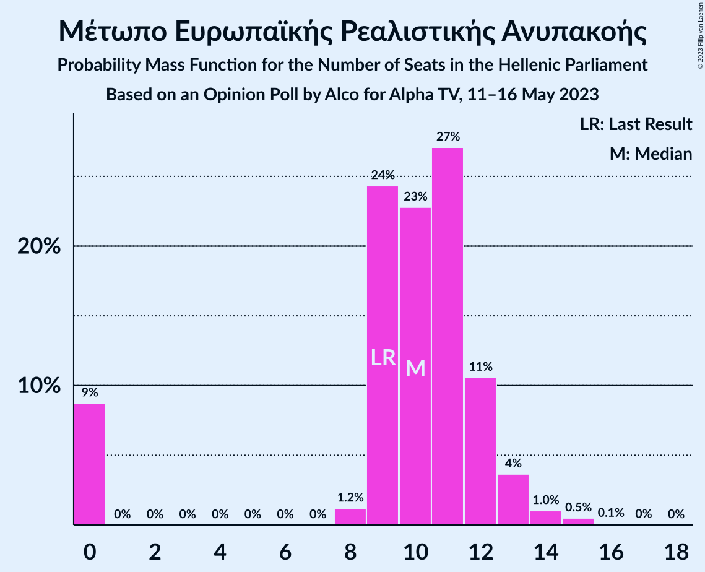

| Number of Seats | Probability | Accumulated | Special Marks |
|:---------------:|:-----------:|:-----------:|:-------------:|
| 0 | 9% | 100% |  |
| 1 | 0% | 91% |  |
| 2 | 0% | 91% |  |
| 3 | 0% | 91% |  |
| 4 | 0% | 91% |  |
| 5 | 0% | 91% |  |
| 6 | 0% | 91% |  |
| 7 | 0% | 91% |  |
| 8 | 1.2% | 91% |  |
| 9 | 24% | 90% | Last Result |
| 10 | 23% | 66% | Median |
| 11 | 27% | 43% |  |
| 12 | 11% | 16% |  |
| 13 | 4% | 5% |  |
| 14 | 1.0% | 2% |  |
| 15 | 0.5% | 0.6% |  |
| 16 | 0.1% | 0.1% |  |
| 17 | 0% | 0% |  |

### Πλεύση Ελευθερίας

*For a full overview of the results for this party, see the [Πλεύση Ελευθερίας](party-πλεύσηελευθερίας.html) page.*

| Number of Seats | Probability | Accumulated | Special Marks |
|:---------------:|:-----------:|:-----------:|:-------------:|
| 0 | 98% | 100% | Last Result, Median |
| 1 | 0% | 2% |  |
| 2 | 0% | 2% |  |
| 3 | 0% | 2% |  |
| 4 | 0% | 2% |  |
| 5 | 0% | 2% |  |
| 6 | 0% | 2% |  |
| 7 | 0% | 2% |  |
| 8 | 1.2% | 2% |  |
| 9 | 0.9% | 1.1% |  |
| 10 | 0.1% | 0.1% |  |
| 11 | 0% | 0% |  |

### Δημοκρατικό Πατριωτικό Κίνημα ΝΙΚΗ

*For a full overview of the results for this party, see the [Δημοκρατικό Πατριωτικό Κίνημα ΝΙΚΗ](party-δημοκρατικόπατριωτικόκίνημανικη.html) page.*

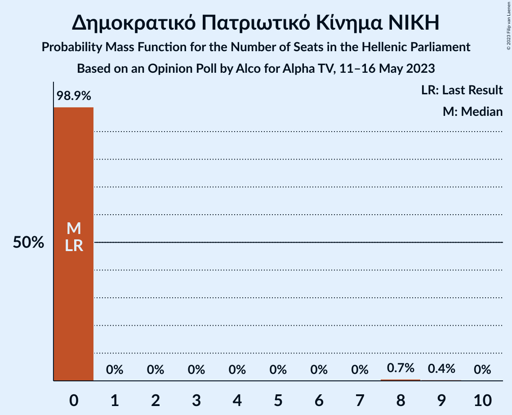

| Number of Seats | Probability | Accumulated | Special Marks |
|:---------------:|:-----------:|:-----------:|:-------------:|
| 0 | 98.9% | 100% | Last Result, Median |
| 1 | 0% | 1.1% |  |
| 2 | 0% | 1.1% |  |
| 3 | 0% | 1.1% |  |
| 4 | 0% | 1.1% |  |
| 5 | 0% | 1.1% |  |
| 6 | 0% | 1.1% |  |
| 7 | 0% | 1.1% |  |
| 8 | 0.7% | 1.1% |  |
| 9 | 0.4% | 0.4% |  |
| 10 | 0% | 0% |  |

### Εθνική Δημιουργία

*For a full overview of the results for this party, see the [Εθνική Δημιουργία](party-εθνικήδημιουργία.html) page.*

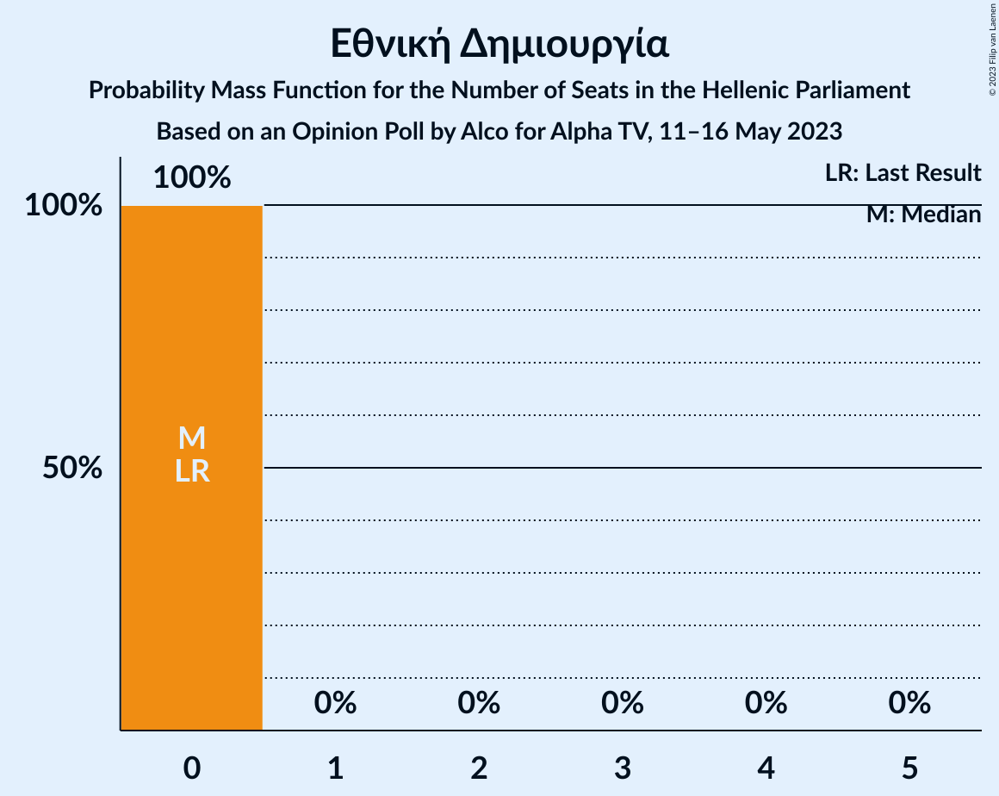

| Number of Seats | Probability | Accumulated | Special Marks |
|:---------------:|:-----------:|:-----------:|:-------------:|
| 0 | 100% | 100% | Last Result, Median |

## Coalitions

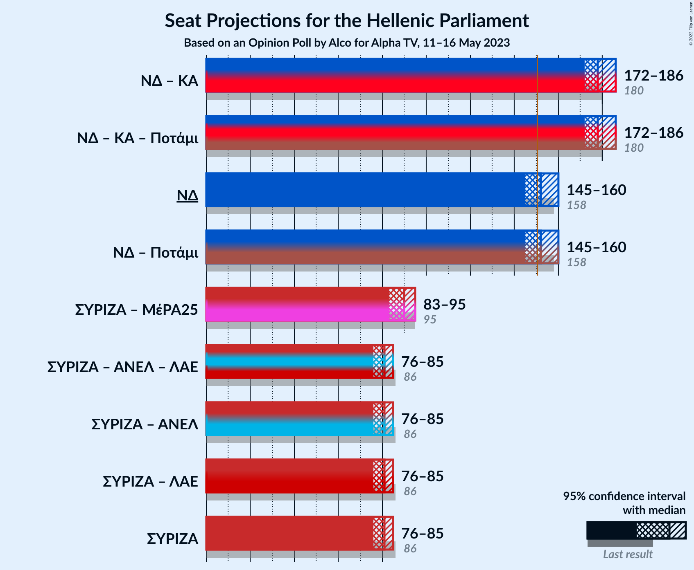

### Confidence Intervals

| Coalition | Last Result | Median | Majority? | 80% Confidence Interval | 90% Confidence Interval | 95% Confidence Interval | 99% Confidence Interval |
|:---------:|:-----------:|:------:|:---------:|:-----------------------:|:-----------------------:|:-----------------------:|:-----------------------:|
| Νέα Δημοκρατία – Κίνημα Αλλαγής | 180 | 178 | 100% | 175–184 | 173–185 | 172–186 | 170–188 |
| Νέα Δημοκρατία | 158 | 152 | 68% | 147–158 | 147–158 | 145–160 | 143–163 |
| Συνασπισμός Ριζοσπαστικής Αριστεράς – Μέτωπο Ευρωπαϊκής Ρεαλιστικής Ανυπακοής | 95 | 90 | 0% | 86–94 | 83–95 | 83–95 | 80–97 |
| Συνασπισμός Ριζοσπαστικής Αριστεράς | 86 | 81 | 0% | 78–83 | 77–84 | 76–85 | 75–87 |

### Νέα Δημοκρατία – Κίνημα Αλλαγής

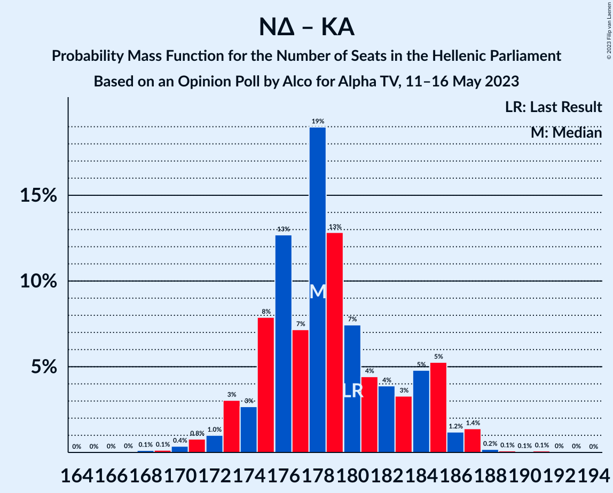

| Number of Seats | Probability | Accumulated | Special Marks |
|:---------------:|:-----------:|:-----------:|:-------------:|
| 165 | 0% | 100% |  |
| 166 | 0% | 99.9% |  |
| 167 | 0% | 99.9% |  |
| 168 | 0.1% | 99.9% |  |
| 169 | 0.1% | 99.8% |  |
| 170 | 0.4% | 99.6% |  |
| 171 | 0.8% | 99.3% |  |
| 172 | 1.0% | 98% |  |
| 173 | 3% | 97% |  |
| 174 | 3% | 94% |  |
| 175 | 8% | 92% |  |
| 176 | 13% | 84% |  |
| 177 | 7% | 71% |  |
| 178 | 19% | 64% | Median |
| 179 | 13% | 45% |  |
| 180 | 7% | 32% | Last Result |
| 181 | 4% | 25% |  |
| 182 | 4% | 20% |  |
| 183 | 3% | 16% |  |
| 184 | 5% | 13% |  |
| 185 | 5% | 8% |  |
| 186 | 1.2% | 3% |  |
| 187 | 1.4% | 2% |  |
| 188 | 0.2% | 0.5% |  |
| 189 | 0.1% | 0.3% |  |
| 190 | 0.1% | 0.2% |  |
| 191 | 0.1% | 0.2% |  |
| 192 | 0% | 0.1% |  |
| 193 | 0% | 0.1% |  |
| 194 | 0% | 0% |  |

### Νέα Δημοκρατία

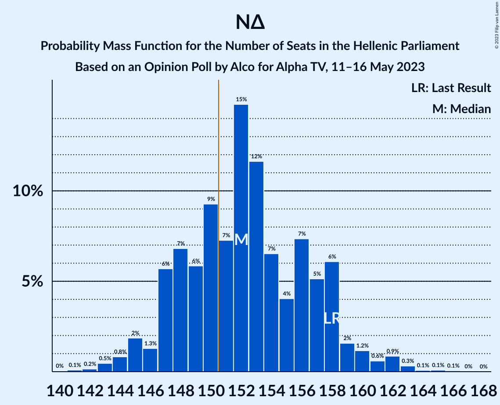

| Number of Seats | Probability | Accumulated | Special Marks |
|:---------------:|:-----------:|:-----------:|:-------------:|
| 140 | 0% | 100% |  |
| 141 | 0.1% | 99.9% |  |
| 142 | 0.2% | 99.8% |  |
| 143 | 0.5% | 99.7% |  |
| 144 | 0.8% | 99.2% |  |
| 145 | 2% | 98% |  |
| 146 | 1.3% | 97% |  |
| 147 | 6% | 95% |  |
| 148 | 7% | 90% |  |
| 149 | 6% | 83% |  |
| 150 | 9% | 77% |  |
| 151 | 7% | 68% | Majority |
| 152 | 15% | 60% | Median |
| 153 | 12% | 46% |  |
| 154 | 7% | 34% |  |
| 155 | 4% | 27% |  |
| 156 | 7% | 23% |  |
| 157 | 5% | 16% |  |
| 158 | 6% | 11% | Last Result |
| 159 | 2% | 5% |  |
| 160 | 1.2% | 3% |  |
| 161 | 0.6% | 2% |  |
| 162 | 0.9% | 1.4% |  |
| 163 | 0.3% | 0.6% |  |
| 164 | 0.1% | 0.2% |  |
| 165 | 0.1% | 0.2% |  |
| 166 | 0.1% | 0.1% |  |
| 167 | 0% | 0% |  |

### Συνασπισμός Ριζοσπαστικής Αριστεράς – Μέτωπο Ευρωπαϊκής Ρεαλιστικής Ανυπακοής

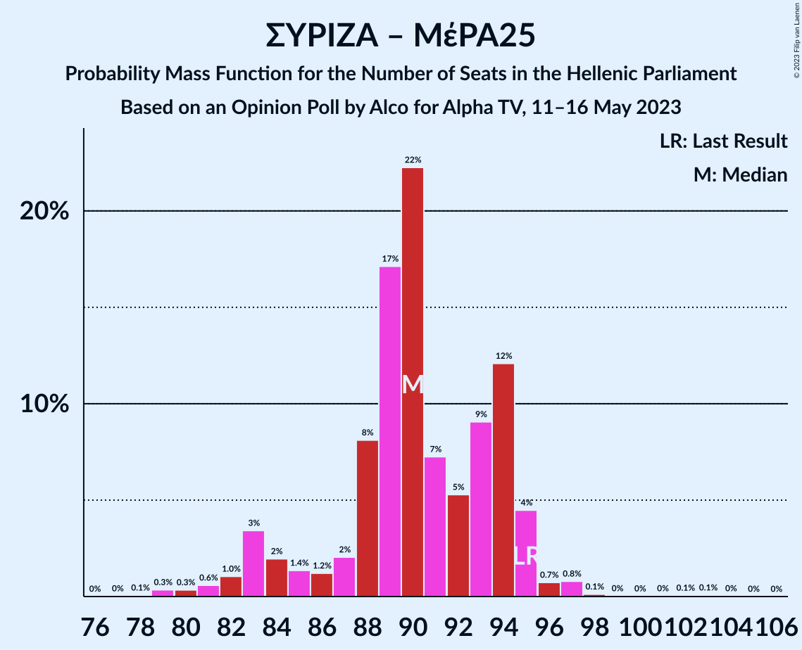

| Number of Seats | Probability | Accumulated | Special Marks |
|:---------------:|:-----------:|:-----------:|:-------------:|
| 78 | 0.1% | 100% |  |
| 79 | 0.3% | 99.9% |  |
| 80 | 0.3% | 99.5% |  |
| 81 | 0.6% | 99.2% |  |
| 82 | 1.0% | 98.6% |  |
| 83 | 3% | 98% |  |
| 84 | 2% | 94% |  |
| 85 | 1.4% | 92% |  |
| 86 | 1.2% | 91% |  |
| 87 | 2% | 90% |  |
| 88 | 8% | 88% |  |
| 89 | 17% | 79% |  |
| 90 | 22% | 62% |  |
| 91 | 7% | 40% | Median |
| 92 | 5% | 33% |  |
| 93 | 9% | 28% |  |
| 94 | 12% | 18% |  |
| 95 | 4% | 6% | Last Result |
| 96 | 0.7% | 2% |  |
| 97 | 0.8% | 1.2% |  |
| 98 | 0.1% | 0.4% |  |
| 99 | 0% | 0.3% |  |
| 100 | 0% | 0.2% |  |
| 101 | 0% | 0.2% |  |
| 102 | 0.1% | 0.2% |  |
| 103 | 0.1% | 0.1% |  |
| 104 | 0% | 0.1% |  |
| 105 | 0% | 0% |  |

### Συνασπισμός Ριζοσπαστικής Αριστεράς

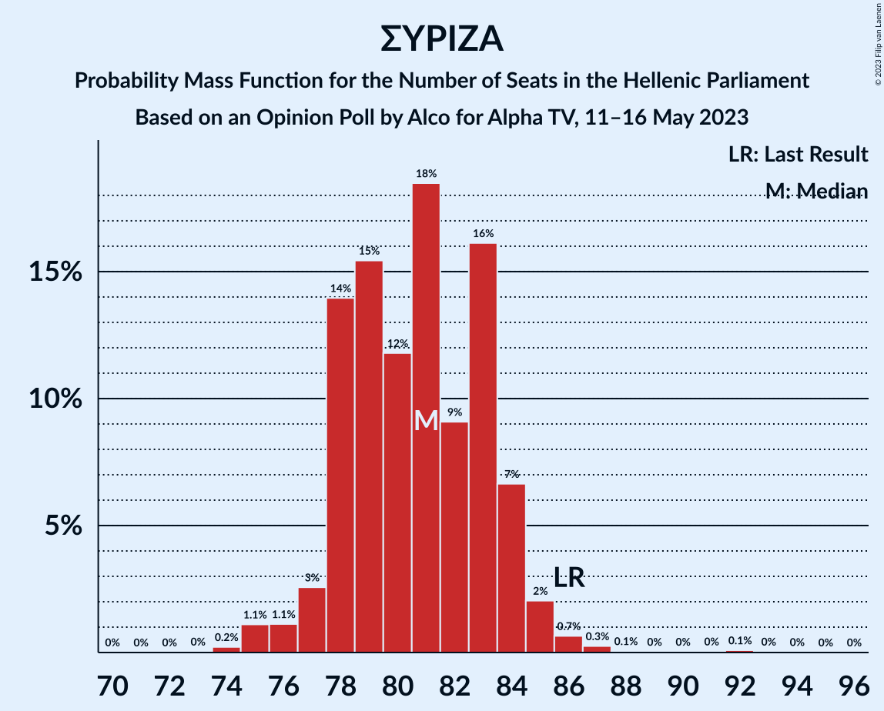

| Number of Seats | Probability | Accumulated | Special Marks |
|:---------------:|:-----------:|:-----------:|:-------------:|
| 71 | 0% | 100% |  |
| 72 | 0% | 99.9% |  |
| 73 | 0% | 99.9% |  |
| 74 | 0.2% | 99.9% |  |
| 75 | 1.1% | 99.7% |  |
| 76 | 1.1% | 98.6% |  |
| 77 | 3% | 97% |  |
| 78 | 14% | 95% |  |
| 79 | 15% | 81% |  |
| 80 | 12% | 65% |  |
| 81 | 18% | 54% | Median |
| 82 | 9% | 35% |  |
| 83 | 16% | 26% |  |
| 84 | 7% | 10% |  |
| 85 | 2% | 3% |  |
| 86 | 0.7% | 1.3% | Last Result |
| 87 | 0.3% | 0.6% |  |
| 88 | 0.1% | 0.4% |  |
| 89 | 0% | 0.3% |  |
| 90 | 0% | 0.3% |  |
| 91 | 0% | 0.3% |  |
| 92 | 0.1% | 0.2% |  |
| 93 | 0% | 0.1% |  |
| 94 | 0% | 0.1% |  |
| 95 | 0% | 0% |  |

## Technical Information

### Opinion Poll

+ **Polling firm:** Alco
+ **Commissioner(s):** Alpha TV
+ **Fieldwork period:** 11–16 May 2023

### Calculations

+ **Sample size:** 1200
+ **Simulations done:** 1,048,576
+ **Error estimate:** 0.90%

