# Opinion Poll by Interview for Politic.gr, 12–17 May 2023

<a href="#voting-intentions">Voting Intentions</a> | <a href="#seats">Seats</a> | <a href="#coalitions">Coalitions</a> | <a href="#technical-information">Technical Information</a>

## Voting Intentions

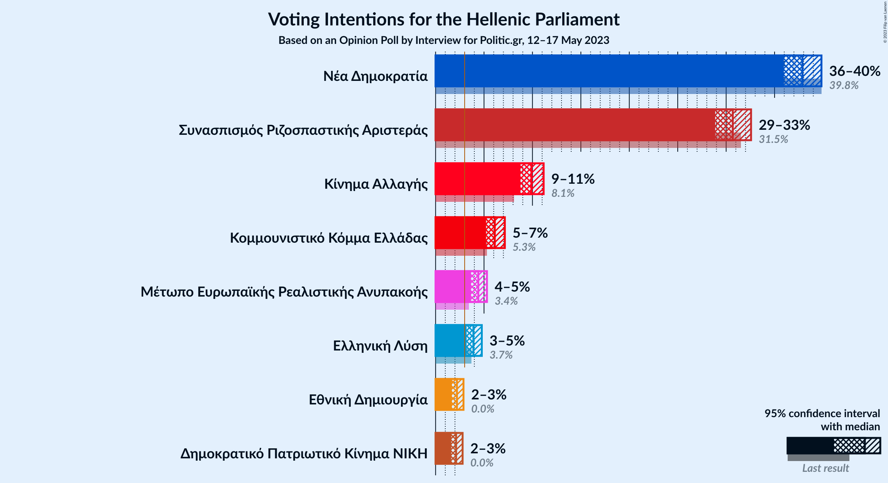

### Confidence Intervals

| Party | Last Result | Poll Result | 80% Confidence Interval | 90% Confidence Interval | 95% Confidence Interval | 99% Confidence Interval |
|:-----:|:-----------:|:-----------:|:-----------------------:|:-----------------------:|:-----------------------:|:-----------------------:|
| Νέα Δημοκρατία | 39.8% | 37.9% | 36.6–39.2% |36.3–39.5% |36.0–39.8% |35.4–40.5% |
| Συνασπισμός Ριζοσπαστικής Αριστεράς | 31.5% | 30.7% | 29.5–31.9% |29.2–32.3% |28.9–32.6% |28.3–33.2% |
| Κίνημα Αλλαγής | 8.1% | 9.9% | 9.1–10.7% |8.9–11.0% |8.8–11.2% |8.4–11.6% |
| Κομμουνιστικό Κόμμα Ελλάδας | 5.3% | 6.1% | 5.5–6.8% |5.3–7.0% |5.2–7.1% |5.0–7.5% |
| Μέτωπο Ευρωπαϊκής Ρεαλιστικής Ανυπακοής | 3.4% | 4.4% | 3.9–5.0% |3.8–5.2% |3.7–5.3% |3.4–5.6% |
| Ελληνική Λύση | 3.7% | 3.9% | 3.4–4.5% |3.3–4.6% |3.2–4.8% |3.0–5.0% |
| Εθνική Δημιουργία | 0.0% | 2.2% | 1.9–2.7% |1.8–2.8% |1.7–2.9% |1.5–3.1% |
| Δημοκρατικό Πατριωτικό Κίνημα ΝΙΚΗ | 0.0% | 2.1% | 1.8–2.6% |1.7–2.7% |1.6–2.8% |1.5–3.0% |

*Note:* The poll result column reflects the actual value used in the calculations. Published results may vary slightly, and in addition be rounded to fewer digits.

## Seats

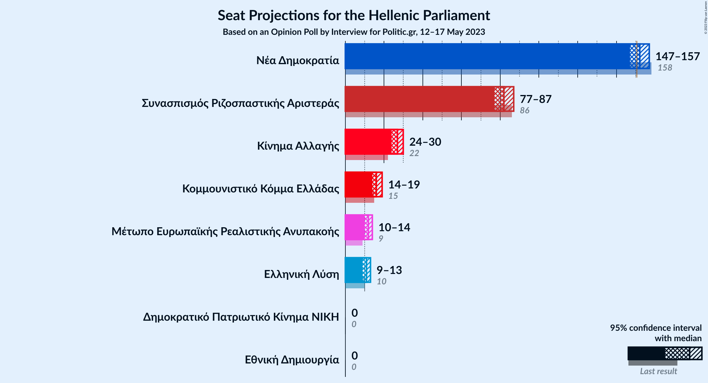

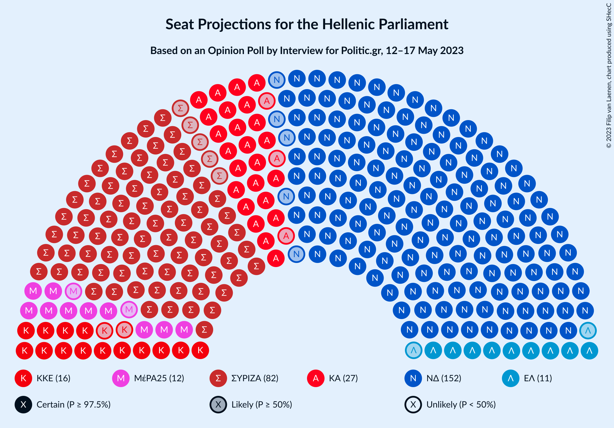

### Confidence Intervals

| Party | Last Result | Median | 80% Confidence Interval | 90% Confidence Interval | 95% Confidence Interval | 99% Confidence Interval |
|:-----:|:-----------:|:------:|:-----------------------:|:-----------------------:|:-----------------------:|:-----------------------:|
| <a href="#νέα-δημοκρατία">Νέα Δημοκρατία</a> | 158 | 152 | 148–155 |148–156 |147–157 |145–159 |
| <a href="#συνασπισμός-ριζοσπαστικής-αριστεράς">Συνασπισμός Ριζοσπαστικής Αριστεράς</a> | 86 | 82 | 79–86 |79–86 |77–87 |76–89 |
| <a href="#κίνημα-αλλαγής">Κίνημα Αλλαγής</a> | 22 | 27 | 25–29 |24–30 |24–30 |23–31 |
| <a href="#κομμουνιστικό-κόμμα-ελλάδας">Κομμουνιστικό Κόμμα Ελλάδας</a> | 15 | 16 | 15–18 |14–19 |14–19 |13–20 |
| <a href="#μέτωπο-ευρωπαϊκής-ρεαλιστικής-ανυπακοής">Μέτωπο Ευρωπαϊκής Ρεαλιστικής Ανυπακοής</a> | 9 | 12 | 11–13 |10–14 |10–14 |9–15 |
| <a href="#ελληνική-λύση">Ελληνική Λύση</a> | 10 | 11 | 9–12 |9–12 |9–13 |0–14 |
| <a href="#εθνική-δημιουργία">Εθνική Δημιουργία</a> | 0 | 0 | 0 |0 |0 |0–8 |
| <a href="#δημοκρατικό-πατριωτικό-κίνημα-νικη">Δημοκρατικό Πατριωτικό Κίνημα ΝΙΚΗ</a> | 0 | 0 | 0 |0 |0 |0 |

### Νέα Δημοκρατία

*For a full overview of the results for this party, see the [Νέα Δημοκρατία](party-νέαδημοκρατία.html) page.*

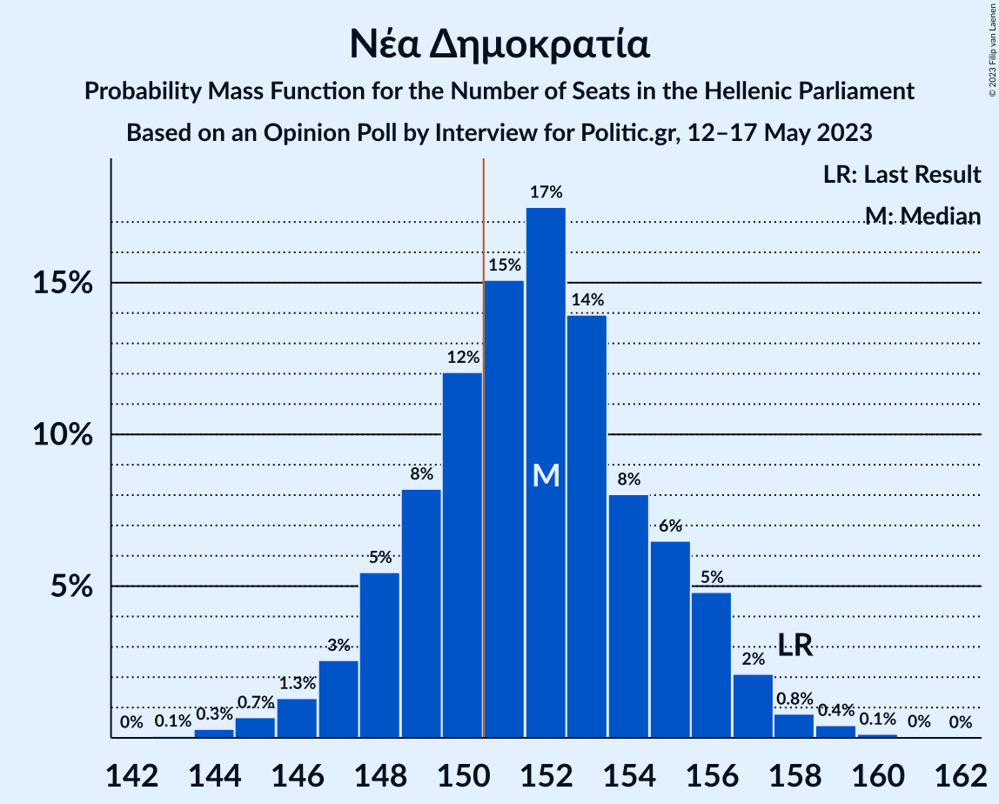

| Number of Seats | Probability | Accumulated | Special Marks |
|:---------------:|:-----------:|:-----------:|:-------------:|
| 143 | 0.1% | 100% |  |
| 144 | 0.3% | 99.9% |  |
| 145 | 0.7% | 99.6% |  |
| 146 | 1.3% | 98.9% |  |
| 147 | 3% | 98% |  |
| 148 | 5% | 95% |  |
| 149 | 8% | 90% |  |
| 150 | 12% | 81% |  |
| 151 | 15% | 69% | Majority |
| 152 | 17% | 54% | Median |
| 153 | 14% | 37% |  |
| 154 | 8% | 23% |  |
| 155 | 6% | 15% |  |
| 156 | 5% | 8% |  |
| 157 | 2% | 4% |  |
| 158 | 0.8% | 1.4% | Last Result |
| 159 | 0.4% | 0.6% |  |
| 160 | 0.1% | 0.2% |  |
| 161 | 0% | 0.1% |  |
| 162 | 0% | 0% |  |

### Συνασπισμός Ριζοσπαστικής Αριστεράς

*For a full overview of the results for this party, see the [Συνασπισμός Ριζοσπαστικής Αριστεράς](party-συνασπισμόςριζοσπαστικήςαριστεράς.html) page.*

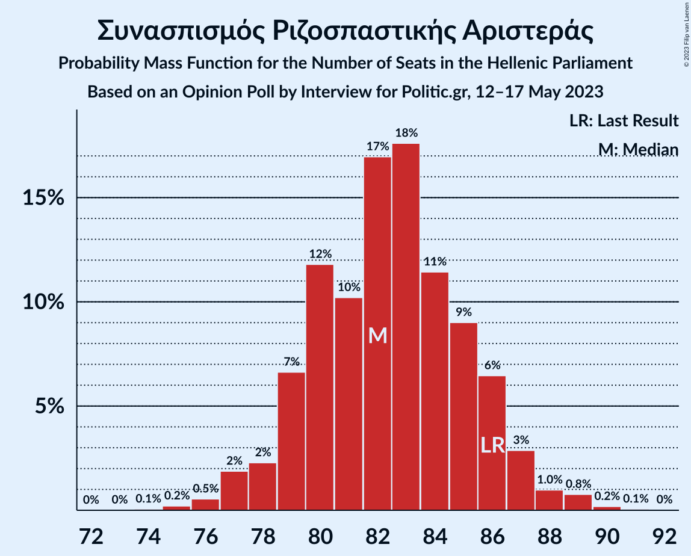

| Number of Seats | Probability | Accumulated | Special Marks |
|:---------------:|:-----------:|:-----------:|:-------------:|
| 74 | 0.1% | 100% |  |
| 75 | 0.2% | 99.9% |  |
| 76 | 0.5% | 99.7% |  |
| 77 | 2% | 99.2% |  |
| 78 | 2% | 97% |  |
| 79 | 7% | 95% |  |
| 80 | 12% | 88% |  |
| 81 | 10% | 77% |  |
| 82 | 17% | 66% | Median |
| 83 | 18% | 49% |  |
| 84 | 11% | 32% |  |
| 85 | 9% | 20% |  |
| 86 | 6% | 11% | Last Result |
| 87 | 3% | 5% |  |
| 88 | 1.0% | 2% |  |
| 89 | 0.8% | 1.0% |  |
| 90 | 0.2% | 0.3% |  |
| 91 | 0.1% | 0.1% |  |
| 92 | 0% | 0% |  |

### Κίνημα Αλλαγής

*For a full overview of the results for this party, see the [Κίνημα Αλλαγής](party-κίνημααλλαγής.html) page.*

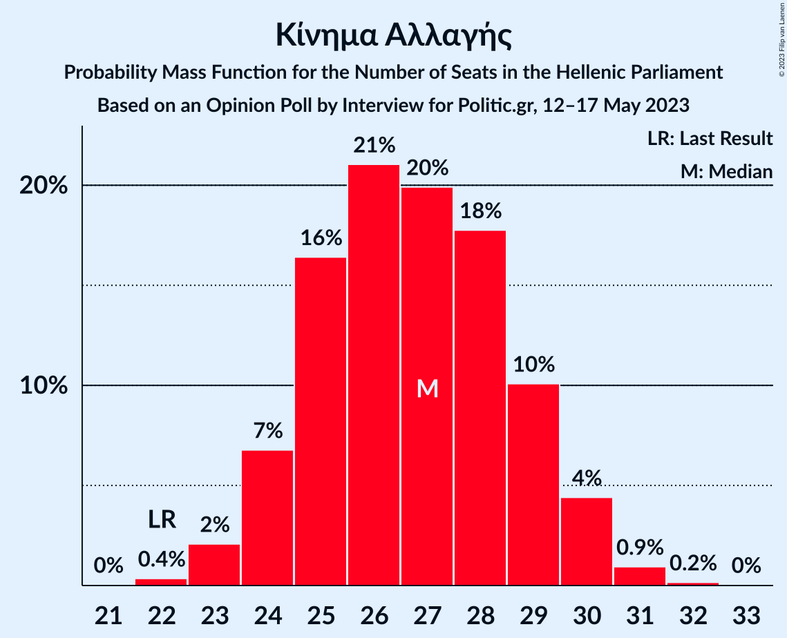

| Number of Seats | Probability | Accumulated | Special Marks |
|:---------------:|:-----------:|:-----------:|:-------------:|
| 22 | 0.4% | 100% | Last Result |
| 23 | 2% | 99.6% |  |
| 24 | 7% | 98% |  |
| 25 | 16% | 91% |  |
| 26 | 21% | 74% |  |
| 27 | 20% | 53% | Median |
| 28 | 18% | 33% |  |
| 29 | 10% | 16% |  |
| 30 | 4% | 6% |  |
| 31 | 0.9% | 1.1% |  |
| 32 | 0.2% | 0.2% |  |
| 33 | 0% | 0% |  |

### Κομμουνιστικό Κόμμα Ελλάδας

*For a full overview of the results for this party, see the [Κομμουνιστικό Κόμμα Ελλάδας](party-κομμουνιστικόκόμμαελλάδας.html) page.*

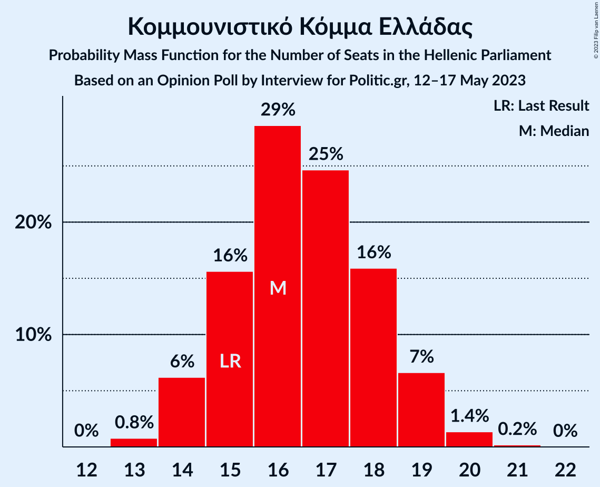

| Number of Seats | Probability | Accumulated | Special Marks |
|:---------------:|:-----------:|:-----------:|:-------------:|
| 13 | 0.8% | 100% |  |
| 14 | 6% | 99.2% |  |
| 15 | 16% | 93% | Last Result |
| 16 | 29% | 77% | Median |
| 17 | 25% | 49% |  |
| 18 | 16% | 24% |  |
| 19 | 7% | 8% |  |
| 20 | 1.4% | 2% |  |
| 21 | 0.2% | 0.2% |  |
| 22 | 0% | 0% |  |

### Μέτωπο Ευρωπαϊκής Ρεαλιστικής Ανυπακοής

*For a full overview of the results for this party, see the [Μέτωπο Ευρωπαϊκής Ρεαλιστικής Ανυπακοής](party-μέτωποευρωπαϊκήςρεαλιστικήςανυπακοής.html) page.*

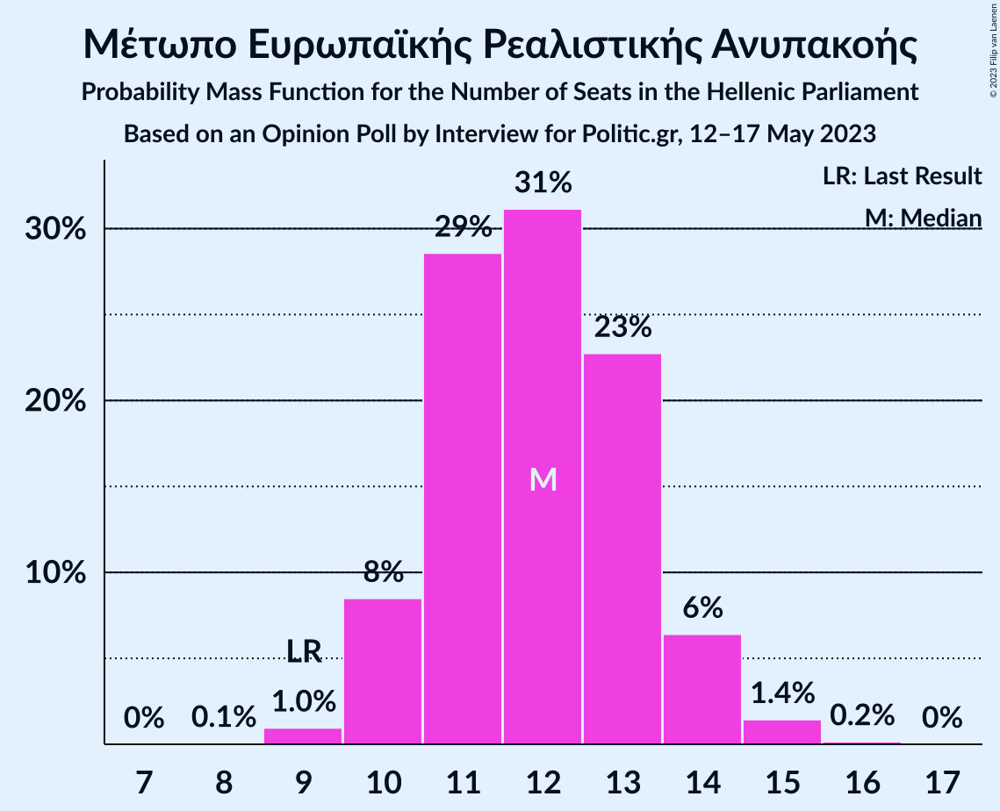

| Number of Seats | Probability | Accumulated | Special Marks |
|:---------------:|:-----------:|:-----------:|:-------------:|
| 8 | 0.1% | 100% |  |
| 9 | 1.0% | 99.9% | Last Result |
| 10 | 8% | 99.0% |  |
| 11 | 29% | 90% |  |
| 12 | 31% | 62% | Median |
| 13 | 23% | 31% |  |
| 14 | 6% | 8% |  |
| 15 | 1.4% | 2% |  |
| 16 | 0.2% | 0.2% |  |
| 17 | 0% | 0% |  |

### Ελληνική Λύση

*For a full overview of the results for this party, see the [Ελληνική Λύση](party-ελληνικήλύση.html) page.*

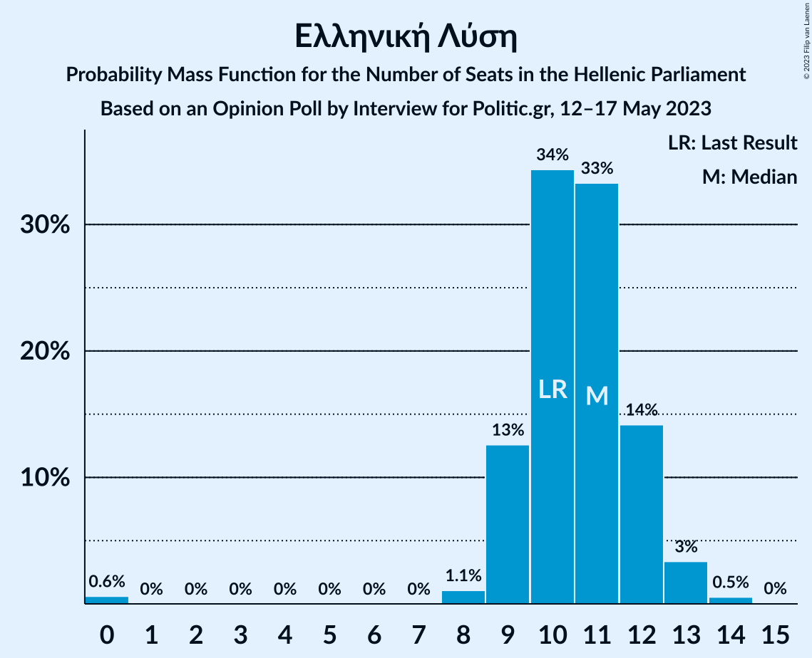

| Number of Seats | Probability | Accumulated | Special Marks |
|:---------------:|:-----------:|:-----------:|:-------------:|
| 0 | 0.6% | 100% |  |
| 1 | 0% | 99.4% |  |
| 2 | 0% | 99.4% |  |
| 3 | 0% | 99.4% |  |
| 4 | 0% | 99.4% |  |
| 5 | 0% | 99.4% |  |
| 6 | 0% | 99.4% |  |
| 7 | 0% | 99.4% |  |
| 8 | 1.1% | 99.4% |  |
| 9 | 13% | 98% |  |
| 10 | 34% | 86% | Last Result |
| 11 | 33% | 51% | Median |
| 12 | 14% | 18% |  |
| 13 | 3% | 4% |  |
| 14 | 0.5% | 0.6% |  |
| 15 | 0% | 0% |  |

### Εθνική Δημιουργία

*For a full overview of the results for this party, see the [Εθνική Δημιουργία](party-εθνικήδημιουργία.html) page.*

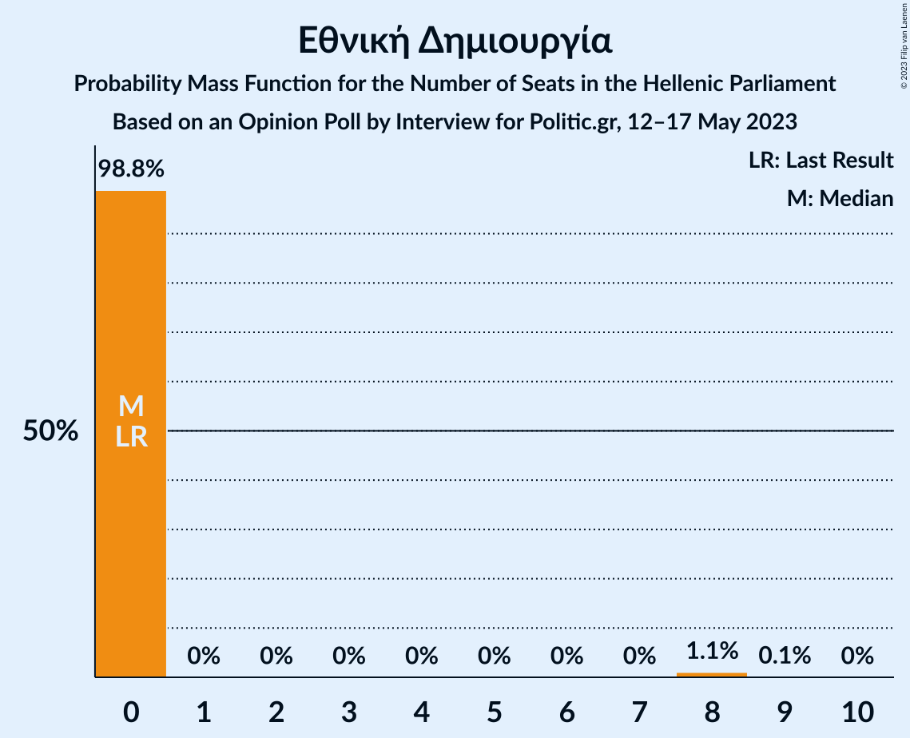

| Number of Seats | Probability | Accumulated | Special Marks |
|:---------------:|:-----------:|:-----------:|:-------------:|
| 0 | 98.8% | 100% | Last Result, Median |
| 1 | 0% | 1.2% |  |
| 2 | 0% | 1.2% |  |
| 3 | 0% | 1.2% |  |
| 4 | 0% | 1.2% |  |
| 5 | 0% | 1.2% |  |
| 6 | 0% | 1.2% |  |
| 7 | 0% | 1.2% |  |
| 8 | 1.1% | 1.2% |  |
| 9 | 0.1% | 0.1% |  |
| 10 | 0% | 0% |  |

### Δημοκρατικό Πατριωτικό Κίνημα ΝΙΚΗ

*For a full overview of the results for this party, see the [Δημοκρατικό Πατριωτικό Κίνημα ΝΙΚΗ](party-δημοκρατικόπατριωτικόκίνημανικη.html) page.*

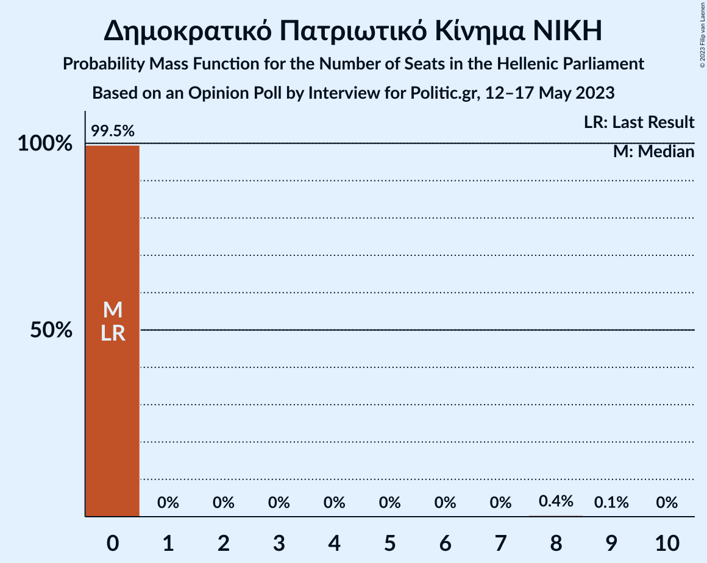

| Number of Seats | Probability | Accumulated | Special Marks |
|:---------------:|:-----------:|:-----------:|:-------------:|
| 0 | 99.5% | 100% | Last Result, Median |
| 1 | 0% | 0.5% |  |
| 2 | 0% | 0.5% |  |
| 3 | 0% | 0.5% |  |
| 4 | 0% | 0.5% |  |
| 5 | 0% | 0.5% |  |
| 6 | 0% | 0.5% |  |
| 7 | 0% | 0.5% |  |
| 8 | 0.4% | 0.5% |  |
| 9 | 0.1% | 0.1% |  |
| 10 | 0% | 0% |  |

## Coalitions

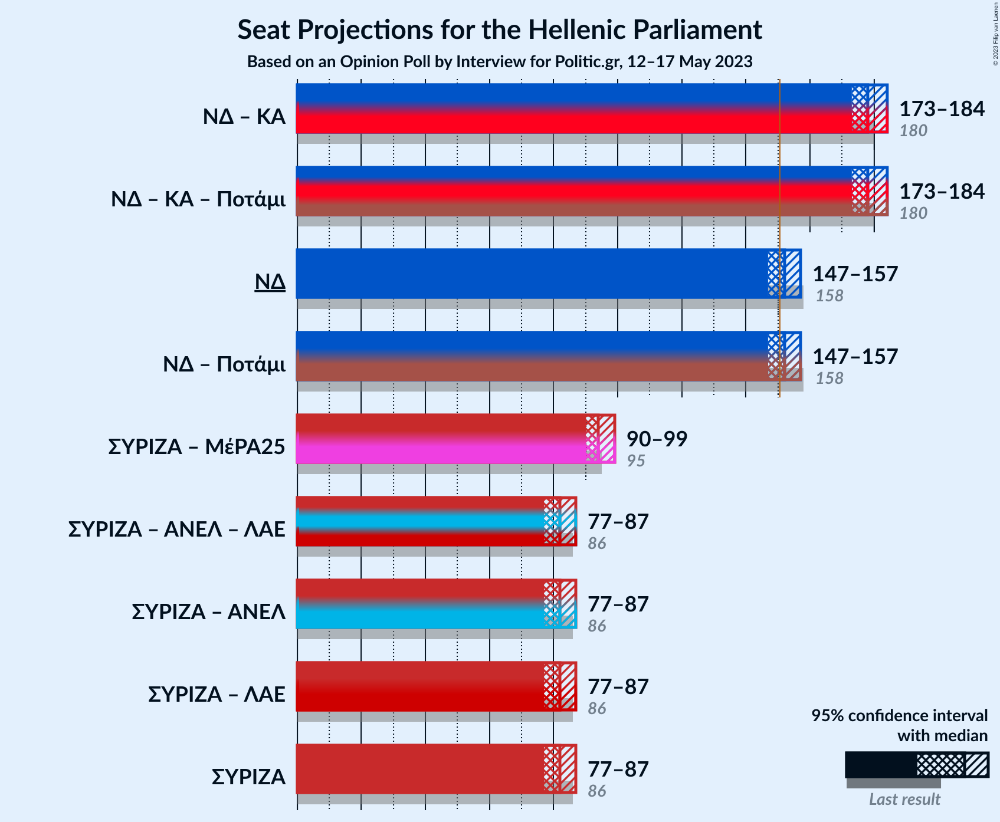

### Confidence Intervals

| Coalition | Last Result | Median | Majority? | 80% Confidence Interval | 90% Confidence Interval | 95% Confidence Interval | 99% Confidence Interval |
|:---------:|:-----------:|:------:|:---------:|:-----------------------:|:-----------------------:|:-----------------------:|:-----------------------:|
| Νέα Δημοκρατία – Κίνημα Αλλαγής | 180 | 178 | 100% | 175–182 | 174–183 | 173–184 | 171–186 |
| Νέα Δημοκρατία | 158 | 152 | 69% | 148–155 | 148–156 | 147–157 | 145–159 |
| Συνασπισμός Ριζοσπαστικής Αριστεράς – Μέτωπο Ευρωπαϊκής Ρεαλιστικής Ανυπακοής | 95 | 94 | 0% | 91–98 | 90–98 | 90–99 | 88–101 |
| Συνασπισμός Ριζοσπαστικής Αριστεράς | 86 | 82 | 0% | 79–86 | 79–86 | 77–87 | 76–89 |

### Νέα Δημοκρατία – Κίνημα Αλλαγής

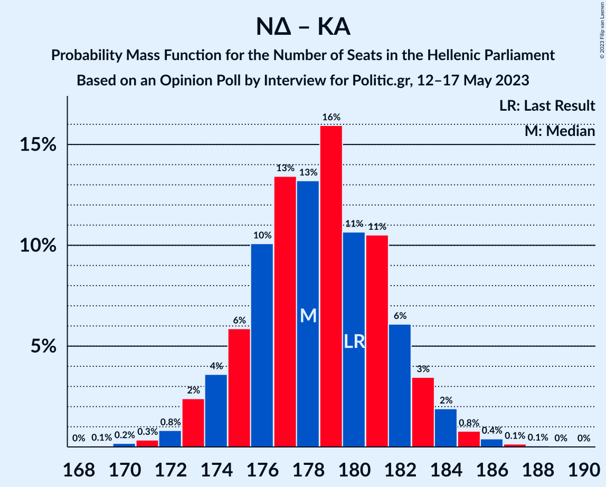

| Number of Seats | Probability | Accumulated | Special Marks |
|:---------------:|:-----------:|:-----------:|:-------------:|
| 169 | 0.1% | 100% |  |
| 170 | 0.2% | 99.9% |  |
| 171 | 0.3% | 99.7% |  |
| 172 | 0.8% | 99.4% |  |
| 173 | 2% | 98.6% |  |
| 174 | 4% | 96% |  |
| 175 | 6% | 93% |  |
| 176 | 10% | 87% |  |
| 177 | 13% | 77% |  |
| 178 | 13% | 63% |  |
| 179 | 16% | 50% | Median |
| 180 | 11% | 34% | Last Result |
| 181 | 11% | 23% |  |
| 182 | 6% | 13% |  |
| 183 | 3% | 7% |  |
| 184 | 2% | 3% |  |
| 185 | 0.8% | 1.4% |  |
| 186 | 0.4% | 0.7% |  |
| 187 | 0.1% | 0.3% |  |
| 188 | 0.1% | 0.1% |  |
| 189 | 0% | 0% |  |

### Νέα Δημοκρατία

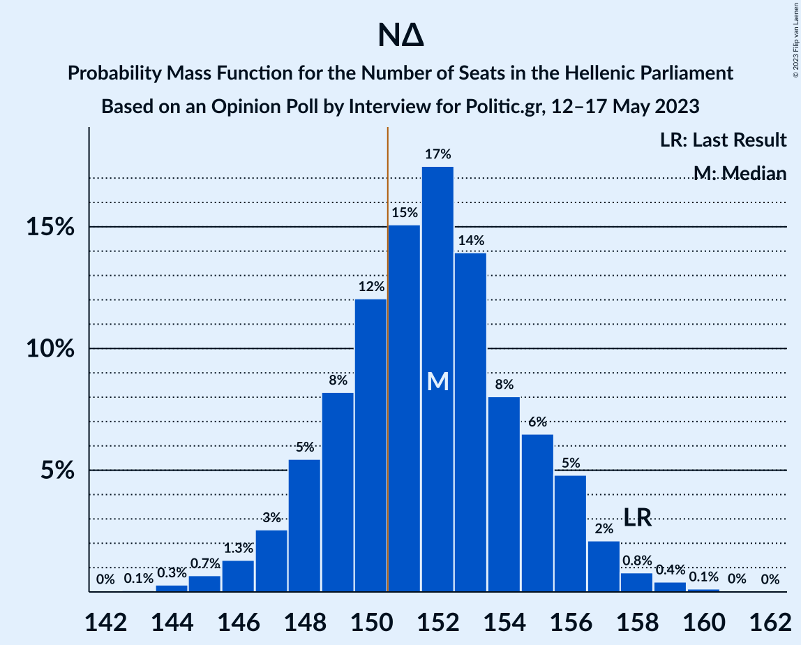

| Number of Seats | Probability | Accumulated | Special Marks |
|:---------------:|:-----------:|:-----------:|:-------------:|
| 143 | 0.1% | 100% |  |
| 144 | 0.3% | 99.9% |  |
| 145 | 0.7% | 99.6% |  |
| 146 | 1.3% | 98.9% |  |
| 147 | 3% | 98% |  |
| 148 | 5% | 95% |  |
| 149 | 8% | 90% |  |
| 150 | 12% | 81% |  |
| 151 | 15% | 69% | Majority |
| 152 | 17% | 54% | Median |
| 153 | 14% | 37% |  |
| 154 | 8% | 23% |  |
| 155 | 6% | 15% |  |
| 156 | 5% | 8% |  |
| 157 | 2% | 4% |  |
| 158 | 0.8% | 1.4% | Last Result |
| 159 | 0.4% | 0.6% |  |
| 160 | 0.1% | 0.2% |  |
| 161 | 0% | 0.1% |  |
| 162 | 0% | 0% |  |

### Συνασπισμός Ριζοσπαστικής Αριστεράς – Μέτωπο Ευρωπαϊκής Ρεαλιστικής Ανυπακοής

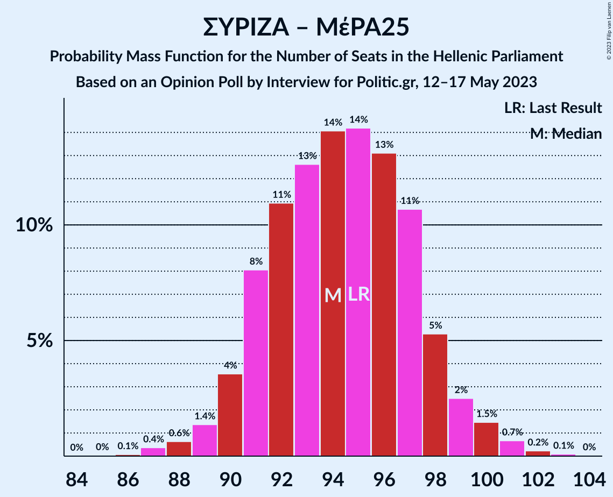

| Number of Seats | Probability | Accumulated | Special Marks |
|:---------------:|:-----------:|:-----------:|:-------------:|
| 86 | 0.1% | 100% |  |
| 87 | 0.4% | 99.9% |  |
| 88 | 0.6% | 99.5% |  |
| 89 | 1.4% | 98.9% |  |
| 90 | 4% | 98% |  |
| 91 | 8% | 94% |  |
| 92 | 11% | 86% |  |
| 93 | 13% | 75% |  |
| 94 | 14% | 62% | Median |
| 95 | 14% | 48% | Last Result |
| 96 | 13% | 34% |  |
| 97 | 11% | 21% |  |
| 98 | 5% | 10% |  |
| 99 | 2% | 5% |  |
| 100 | 1.5% | 2% |  |
| 101 | 0.7% | 1.0% |  |
| 102 | 0.2% | 0.4% |  |
| 103 | 0.1% | 0.1% |  |
| 104 | 0% | 0% |  |

### Συνασπισμός Ριζοσπαστικής Αριστεράς

| Number of Seats | Probability | Accumulated | Special Marks |
|:---------------:|:-----------:|:-----------:|:-------------:|
| 74 | 0.1% | 100% |  |
| 75 | 0.2% | 99.9% |  |
| 76 | 0.5% | 99.7% |  |
| 77 | 2% | 99.2% |  |
| 78 | 2% | 97% |  |
| 79 | 7% | 95% |  |
| 80 | 12% | 88% |  |
| 81 | 10% | 77% |  |
| 82 | 17% | 66% | Median |
| 83 | 18% | 49% |  |
| 84 | 11% | 32% |  |
| 85 | 9% | 20% |  |
| 86 | 6% | 11% | Last Result |
| 87 | 3% | 5% |  |
| 88 | 1.0% | 2% |  |
| 89 | 0.8% | 1.0% |  |
| 90 | 0.2% | 0.3% |  |
| 91 | 0.1% | 0.1% |  |
| 92 | 0% | 0% |  |

## Technical Information

### Opinion Poll

+ **Polling firm:** Interview
+ **Commissioner(s):** Politic.gr
+ **Fieldwork period:** 12–17 May 2023

### Calculations

+ **Sample size:** 2405
+ **Simulations done:** 1,048,576
+ **Error estimate:** 0.99%

