# Opinion Poll by Metron Analysis for Mega TV, 12–17 May 2023

<a href="#voting-intentions">Voting Intentions</a> | <a href="#seats">Seats</a> | <a href="#coalitions">Coalitions</a> | <a href="#technical-information">Technical Information</a>

## Voting Intentions

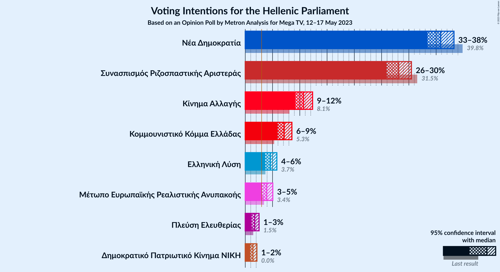

### Confidence Intervals

| Party | Last Result | Poll Result | 80% Confidence Interval | 90% Confidence Interval | 95% Confidence Interval | 99% Confidence Interval |
|:-----:|:-----------:|:-----------:|:-----------------------:|:-----------------------:|:-----------------------:|:-----------------------:|
| Νέα Δημοκρατία | 39.8% | 35.8% | 34.2–37.4% |33.8–37.9% |33.4–38.3% |32.7–39.0% |
| Συνασπισμός Ριζοσπαστικής Αριστεράς | 31.5% | 28.1% | 26.7–29.7% |26.3–30.1% |25.9–30.5% |25.2–31.2% |
| Κίνημα Αλλαγής | 8.1% | 10.7% | 9.7–11.8% |9.4–12.1% |9.2–12.3% |8.7–12.9% |
| Κομμουνιστικό Κόμμα Ελλάδας | 5.3% | 7.1% | 6.3–8.1% |6.1–8.3% |5.9–8.6% |5.6–9.0% |
| Ελληνική Λύση | 3.7% | 4.6% | 4.0–5.4% |3.8–5.6% |3.6–5.8% |3.4–6.2% |
| Μέτωπο Ευρωπαϊκής Ρεαλιστικής Ανυπακοής | 3.4% | 3.9% | 3.4–4.7% |3.2–4.9% |3.1–5.0% |2.8–5.4% |
| Πλεύση Ελευθερίας | 1.5% | 1.7% | 1.4–2.3% |1.3–2.4% |1.2–2.5% |1.0–2.8% |
| Δημοκρατικό Πατριωτικό Κίνημα ΝΙΚΗ | 0.0% | 1.4% | 1.1–1.9% |1.0–2.0% |0.9–2.1% |0.8–2.4% |

*Note:* The poll result column reflects the actual value used in the calculations. Published results may vary slightly, and in addition be rounded to fewer digits.

## Seats

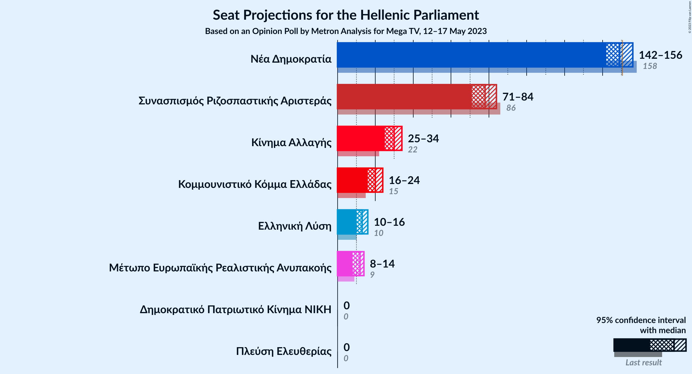

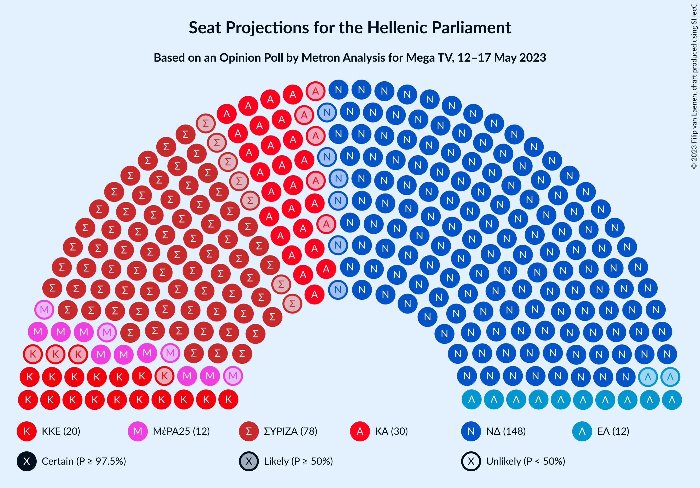

### Confidence Intervals

| Party | Last Result | Median | 80% Confidence Interval | 90% Confidence Interval | 95% Confidence Interval | 99% Confidence Interval |
|:-----:|:-----------:|:------:|:-----------------------:|:-----------------------:|:-----------------------:|:-----------------------:|
| <a href="#νέα-δημοκρατία">Νέα Δημοκρατία</a> | 158 | 149 | 145–153 |143–154 |142–156 |140–158 |
| <a href="#συνασπισμός-ριζοσπαστικής-αριστεράς">Συνασπισμός Ριζοσπαστικής Αριστεράς</a> | 86 | 78 | 73–82 |73–83 |71–84 |70–86 |
| <a href="#κίνημα-αλλαγής">Κίνημα Αλλαγής</a> | 22 | 30 | 27–32 |26–33 |25–34 |24–36 |
| <a href="#κομμουνιστικό-κόμμα-ελλάδας">Κομμουνιστικό Κόμμα Ελλάδας</a> | 15 | 20 | 18–22 |17–23 |16–24 |15–25 |
| <a href="#ελληνική-λύση">Ελληνική Λύση</a> | 10 | 13 | 11–15 |11–15 |10–16 |9–17 |
| <a href="#μέτωπο-ευρωπαϊκής-ρεαλιστικής-ανυπακοής">Μέτωπο Ευρωπαϊκής Ρεαλιστικής Ανυπακοής</a> | 9 | 12 | 9–13 |9–14 |8–14 |0–15 |
| <a href="#πλεύση-ελευθερίας">Πλεύση Ελευθερίας</a> | 0 | 0 | 0 |0 |0 |0 |
| <a href="#δημοκρατικό-πατριωτικό-κίνημα-νικη">Δημοκρατικό Πατριωτικό Κίνημα ΝΙΚΗ</a> | 0 | 0 | 0 |0 |0 |0 |

### Νέα Δημοκρατία

*For a full overview of the results for this party, see the [Νέα Δημοκρατία](party-νέαδημοκρατία.html) page.*

| Number of Seats | Probability | Accumulated | Special Marks |
|:---------------:|:-----------:|:-----------:|:-------------:|
| 138 | 0.1% | 100% |  |
| 139 | 0.2% | 99.9% |  |
| 140 | 0.3% | 99.7% |  |
| 141 | 0.8% | 99.4% |  |
| 142 | 2% | 98.6% |  |
| 143 | 3% | 97% |  |
| 144 | 3% | 94% |  |
| 145 | 6% | 90% |  |
| 146 | 8% | 84% |  |
| 147 | 11% | 76% |  |
| 148 | 14% | 65% |  |
| 149 | 14% | 52% | Median |
| 150 | 8% | 38% |  |
| 151 | 10% | 30% | Majority |
| 152 | 9% | 20% |  |
| 153 | 5% | 12% |  |
| 154 | 2% | 7% |  |
| 155 | 2% | 5% |  |
| 156 | 1.1% | 3% |  |
| 157 | 0.8% | 2% |  |
| 158 | 0.4% | 0.8% | Last Result |
| 159 | 0.1% | 0.4% |  |
| 160 | 0.1% | 0.2% |  |
| 161 | 0.1% | 0.1% |  |
| 162 | 0% | 0% |  |

### Συνασπισμός Ριζοσπαστικής Αριστεράς

*For a full overview of the results for this party, see the [Συνασπισμός Ριζοσπαστικής Αριστεράς](party-συνασπισμόςριζοσπαστικήςαριστεράς.html) page.*

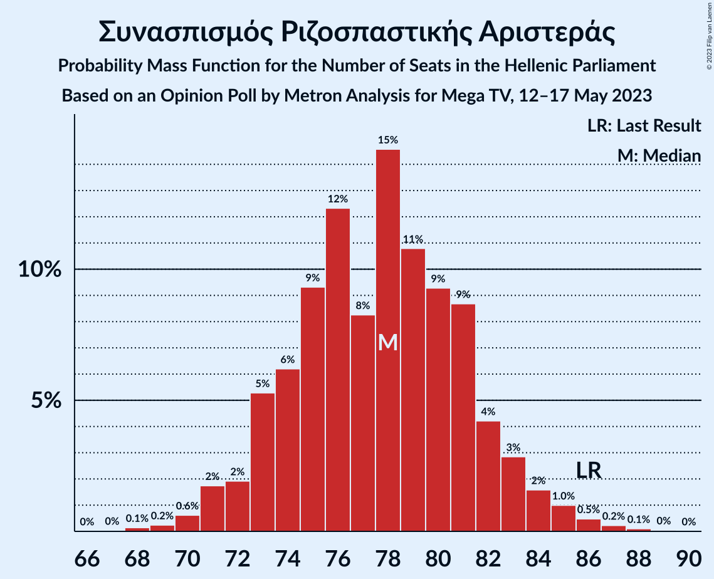

| Number of Seats | Probability | Accumulated | Special Marks |
|:---------------:|:-----------:|:-----------:|:-------------:|
| 67 | 0% | 100% |  |
| 68 | 0.1% | 99.9% |  |
| 69 | 0.2% | 99.8% |  |
| 70 | 0.6% | 99.6% |  |
| 71 | 2% | 98.9% |  |
| 72 | 2% | 97% |  |
| 73 | 5% | 95% |  |
| 74 | 6% | 90% |  |
| 75 | 9% | 84% |  |
| 76 | 12% | 74% |  |
| 77 | 8% | 62% |  |
| 78 | 15% | 54% | Median |
| 79 | 11% | 39% |  |
| 80 | 9% | 29% |  |
| 81 | 9% | 19% |  |
| 82 | 4% | 11% |  |
| 83 | 3% | 6% |  |
| 84 | 2% | 3% |  |
| 85 | 1.0% | 2% |  |
| 86 | 0.5% | 0.9% | Last Result |
| 87 | 0.2% | 0.4% |  |
| 88 | 0.1% | 0.2% |  |
| 89 | 0% | 0.1% |  |
| 90 | 0% | 0% |  |

### Κίνημα Αλλαγής

*For a full overview of the results for this party, see the [Κίνημα Αλλαγής](party-κίνημααλλαγής.html) page.*

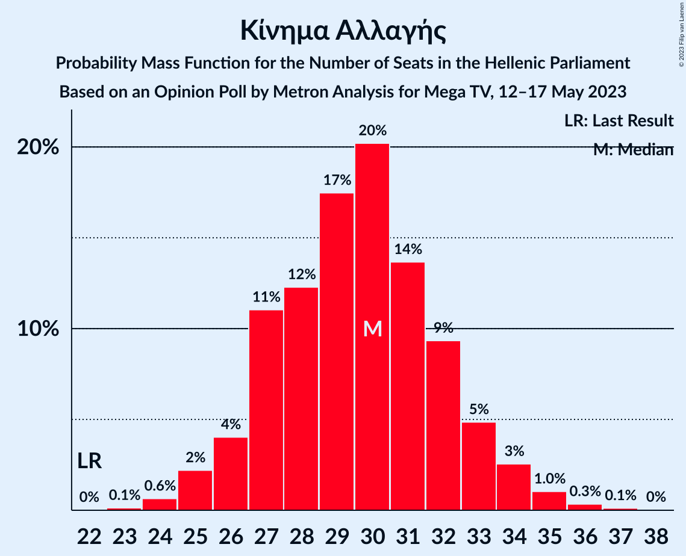

| Number of Seats | Probability | Accumulated | Special Marks |
|:---------------:|:-----------:|:-----------:|:-------------:|
| 22 | 0% | 100% | Last Result |
| 23 | 0.1% | 100% |  |
| 24 | 0.6% | 99.8% |  |
| 25 | 2% | 99.2% |  |
| 26 | 4% | 97% |  |
| 27 | 11% | 93% |  |
| 28 | 12% | 82% |  |
| 29 | 17% | 70% |  |
| 30 | 20% | 52% | Median |
| 31 | 14% | 32% |  |
| 32 | 9% | 18% |  |
| 33 | 5% | 9% |  |
| 34 | 3% | 4% |  |
| 35 | 1.0% | 2% |  |
| 36 | 0.3% | 0.5% |  |
| 37 | 0.1% | 0.2% |  |
| 38 | 0% | 0% |  |

### Κομμουνιστικό Κόμμα Ελλάδας

*For a full overview of the results for this party, see the [Κομμουνιστικό Κόμμα Ελλάδας](party-κομμουνιστικόκόμμαελλάδας.html) page.*

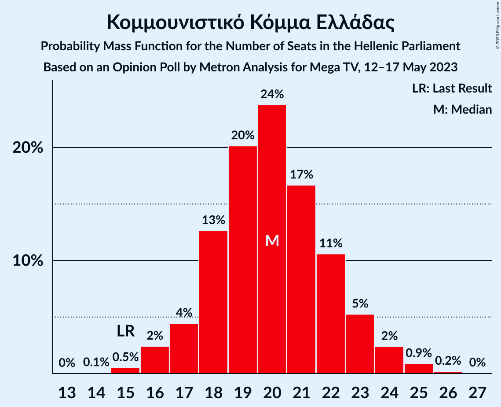

| Number of Seats | Probability | Accumulated | Special Marks |
|:---------------:|:-----------:|:-----------:|:-------------:|
| 14 | 0.1% | 100% |  |
| 15 | 0.5% | 99.9% | Last Result |
| 16 | 2% | 99.4% |  |
| 17 | 4% | 97% |  |
| 18 | 13% | 93% |  |
| 19 | 20% | 80% |  |
| 20 | 24% | 60% | Median |
| 21 | 17% | 36% |  |
| 22 | 11% | 19% |  |
| 23 | 5% | 9% |  |
| 24 | 2% | 4% |  |
| 25 | 0.9% | 1.1% |  |
| 26 | 0.2% | 0.2% |  |
| 27 | 0% | 0% |  |

### Ελληνική Λύση

*For a full overview of the results for this party, see the [Ελληνική Λύση](party-ελληνικήλύση.html) page.*

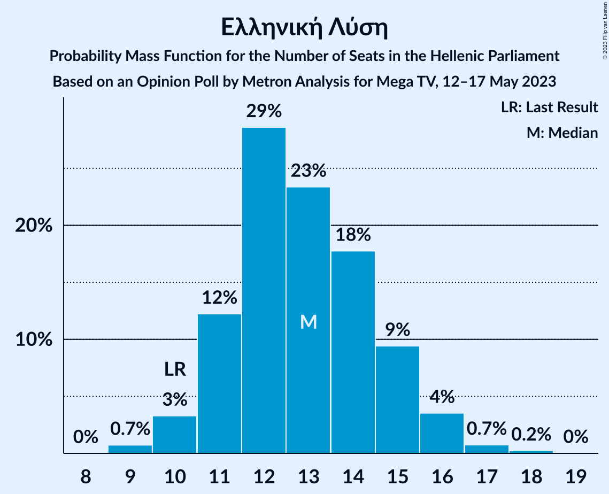

| Number of Seats | Probability | Accumulated | Special Marks |
|:---------------:|:-----------:|:-----------:|:-------------:|
| 9 | 0.7% | 100% |  |
| 10 | 3% | 99.2% | Last Result |
| 11 | 12% | 96% |  |
| 12 | 29% | 84% |  |
| 13 | 23% | 55% | Median |
| 14 | 18% | 32% |  |
| 15 | 9% | 14% |  |
| 16 | 4% | 5% |  |
| 17 | 0.7% | 1.0% |  |
| 18 | 0.2% | 0.3% |  |
| 19 | 0% | 0% |  |

### Μέτωπο Ευρωπαϊκής Ρεαλιστικής Ανυπακοής

*For a full overview of the results for this party, see the [Μέτωπο Ευρωπαϊκής Ρεαλιστικής Ανυπακοής](party-μέτωποευρωπαϊκήςρεαλιστικήςανυπακοής.html) page.*

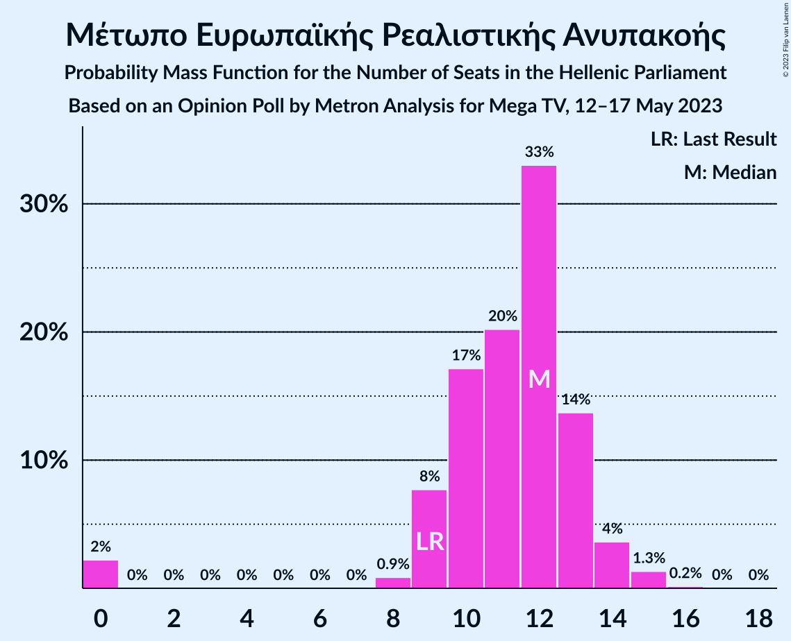

| Number of Seats | Probability | Accumulated | Special Marks |
|:---------------:|:-----------:|:-----------:|:-------------:|
| 0 | 2% | 100% |  |
| 1 | 0% | 98% |  |
| 2 | 0% | 98% |  |
| 3 | 0% | 98% |  |
| 4 | 0% | 98% |  |
| 5 | 0% | 98% |  |
| 6 | 0% | 98% |  |
| 7 | 0% | 98% |  |
| 8 | 0.9% | 98% |  |
| 9 | 8% | 97% | Last Result |
| 10 | 17% | 89% |  |
| 11 | 20% | 72% |  |
| 12 | 33% | 52% | Median |
| 13 | 14% | 19% |  |
| 14 | 4% | 5% |  |
| 15 | 1.3% | 2% |  |
| 16 | 0.2% | 0.2% |  |
| 17 | 0% | 0% |  |

### Πλεύση Ελευθερίας

*For a full overview of the results for this party, see the [Πλεύση Ελευθερίας](party-πλεύσηελευθερίας.html) page.*

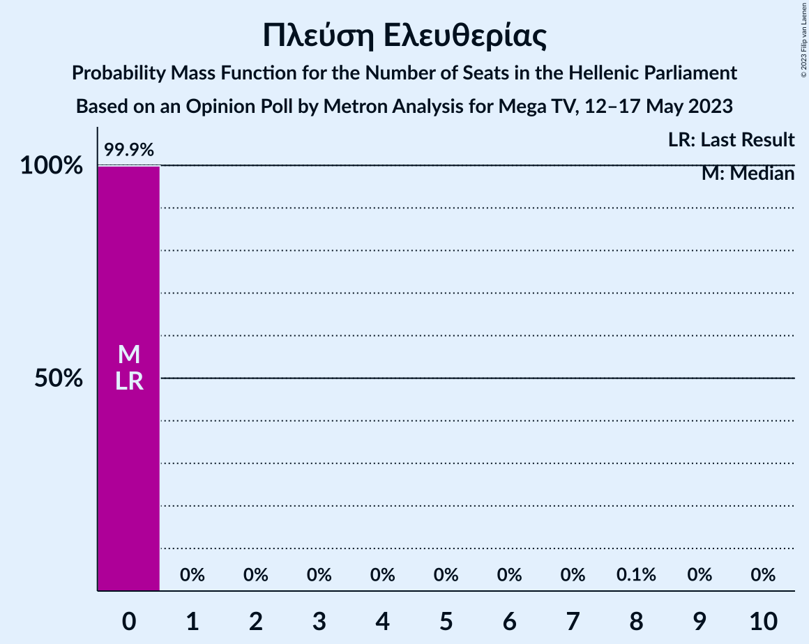

| Number of Seats | Probability | Accumulated | Special Marks |
|:---------------:|:-----------:|:-----------:|:-------------:|
| 0 | 99.9% | 100% | Last Result, Median |
| 1 | 0% | 0.1% |  |
| 2 | 0% | 0.1% |  |
| 3 | 0% | 0.1% |  |
| 4 | 0% | 0.1% |  |
| 5 | 0% | 0.1% |  |
| 6 | 0% | 0.1% |  |
| 7 | 0% | 0.1% |  |
| 8 | 0.1% | 0.1% |  |
| 9 | 0% | 0.1% |  |
| 10 | 0% | 0% |  |

### Δημοκρατικό Πατριωτικό Κίνημα ΝΙΚΗ

*For a full overview of the results for this party, see the [Δημοκρατικό Πατριωτικό Κίνημα ΝΙΚΗ](party-δημοκρατικόπατριωτικόκίνημανικη.html) page.*

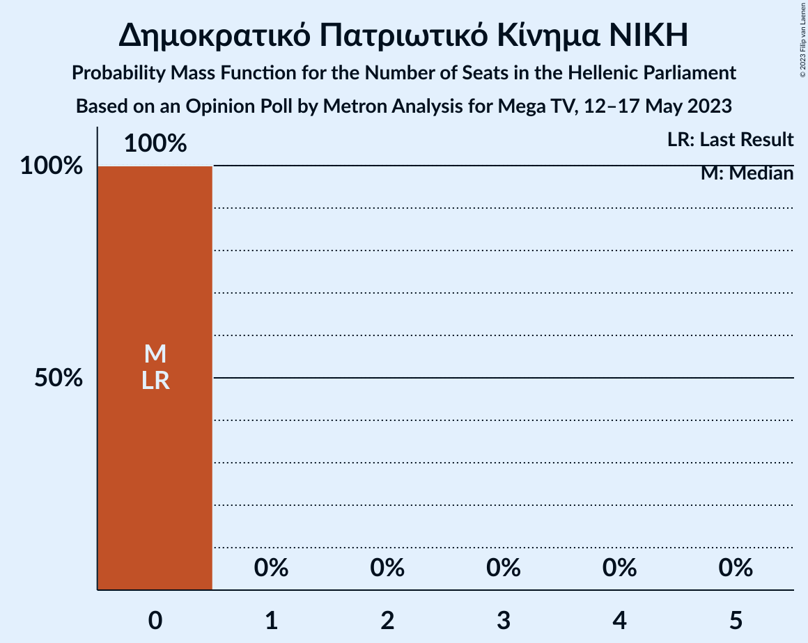

| Number of Seats | Probability | Accumulated | Special Marks |
|:---------------:|:-----------:|:-----------:|:-------------:|
| 0 | 100% | 100% | Last Result, Median |

## Coalitions

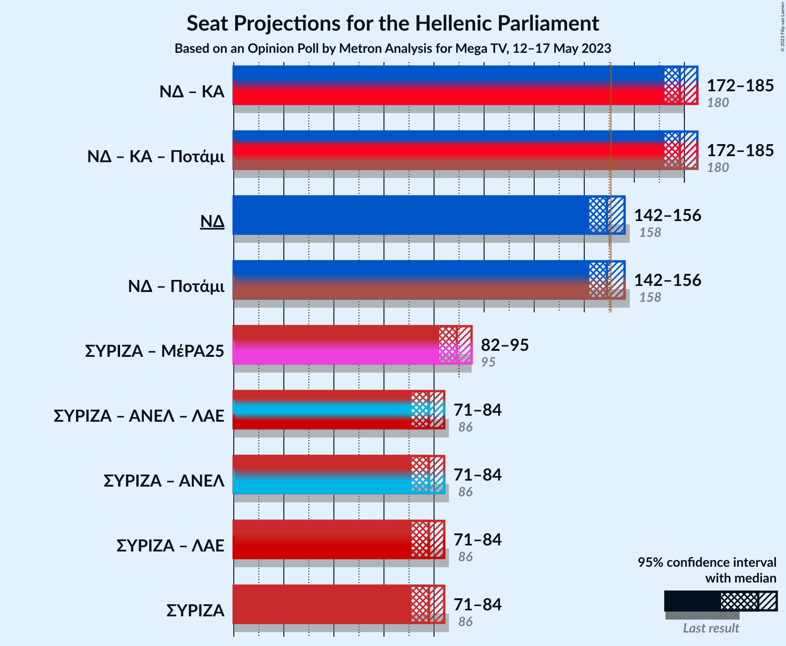

### Confidence Intervals

| Coalition | Last Result | Median | Majority? | 80% Confidence Interval | 90% Confidence Interval | 95% Confidence Interval | 99% Confidence Interval |
|:---------:|:-----------:|:------:|:---------:|:-----------------------:|:-----------------------:|:-----------------------:|:-----------------------:|
| Νέα Δημοκρατία – Κίνημα Αλλαγής | 180 | 178 | 100% | 174–183 | 173–184 | 172–185 | 170–189 |
| Νέα Δημοκρατία | 158 | 149 | 30% | 145–153 | 143–154 | 142–156 | 140–158 |
| Συνασπισμός Ριζοσπαστικής Αριστεράς – Μέτωπο Ευρωπαϊκής Ρεαλιστικής Ανυπακοής | 95 | 89 | 0% | 85–93 | 83–94 | 82–95 | 79–98 |
| Συνασπισμός Ριζοσπαστικής Αριστεράς | 86 | 78 | 0% | 73–82 | 73–83 | 71–84 | 70–86 |

### Νέα Δημοκρατία – Κίνημα Αλλαγής

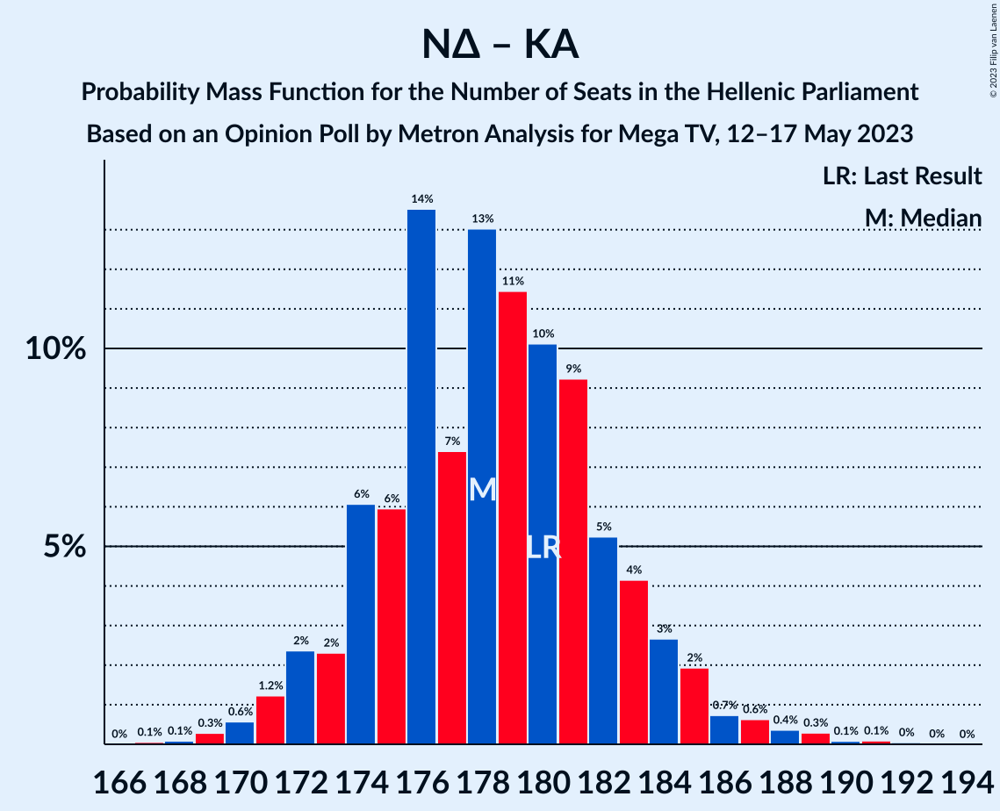

| Number of Seats | Probability | Accumulated | Special Marks |
|:---------------:|:-----------:|:-----------:|:-------------:|
| 167 | 0.1% | 100% |  |
| 168 | 0.1% | 99.9% |  |
| 169 | 0.3% | 99.8% |  |
| 170 | 0.6% | 99.5% |  |
| 171 | 1.2% | 99.0% |  |
| 172 | 2% | 98% |  |
| 173 | 2% | 95% |  |
| 174 | 6% | 93% |  |
| 175 | 6% | 87% |  |
| 176 | 14% | 81% |  |
| 177 | 7% | 68% |  |
| 178 | 13% | 60% |  |
| 179 | 11% | 47% | Median |
| 180 | 10% | 36% | Last Result |
| 181 | 9% | 26% |  |
| 182 | 5% | 16% |  |
| 183 | 4% | 11% |  |
| 184 | 3% | 7% |  |
| 185 | 2% | 4% |  |
| 186 | 0.7% | 2% |  |
| 187 | 0.6% | 2% |  |
| 188 | 0.4% | 0.9% |  |
| 189 | 0.3% | 0.5% |  |
| 190 | 0.1% | 0.2% |  |
| 191 | 0.1% | 0.2% |  |
| 192 | 0% | 0.1% |  |
| 193 | 0% | 0% |  |

### Νέα Δημοκρατία

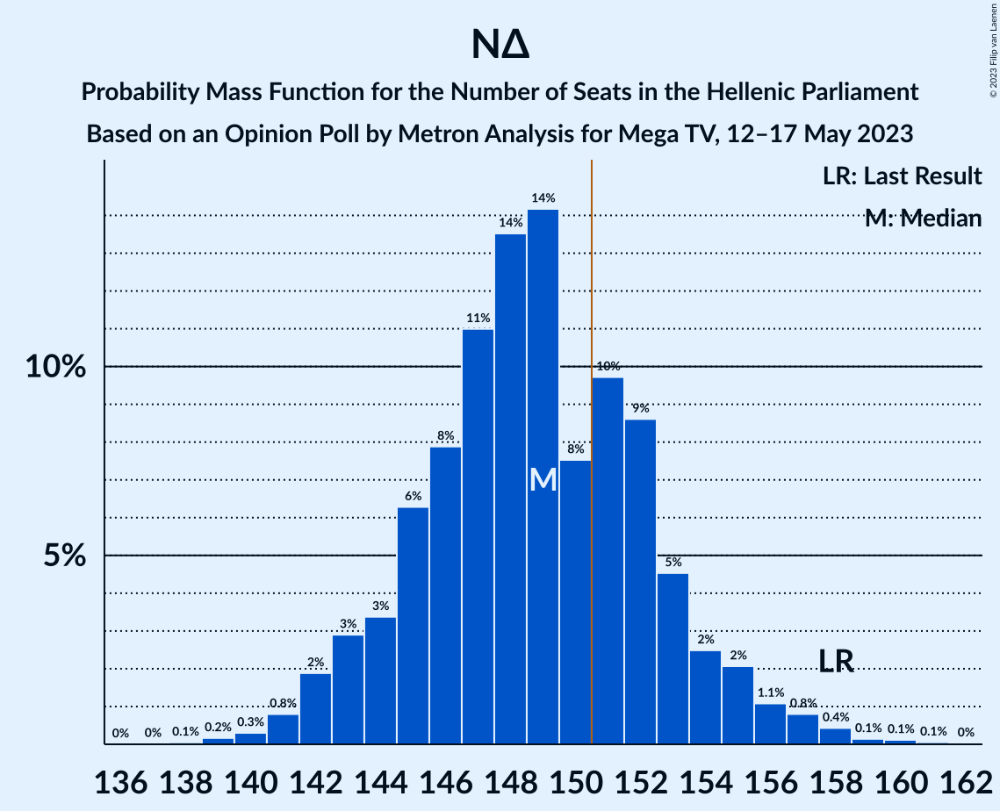

| Number of Seats | Probability | Accumulated | Special Marks |
|:---------------:|:-----------:|:-----------:|:-------------:|
| 138 | 0.1% | 100% |  |
| 139 | 0.2% | 99.9% |  |
| 140 | 0.3% | 99.7% |  |
| 141 | 0.8% | 99.4% |  |
| 142 | 2% | 98.6% |  |
| 143 | 3% | 97% |  |
| 144 | 3% | 94% |  |
| 145 | 6% | 90% |  |
| 146 | 8% | 84% |  |
| 147 | 11% | 76% |  |
| 148 | 14% | 65% |  |
| 149 | 14% | 52% | Median |
| 150 | 8% | 38% |  |
| 151 | 10% | 30% | Majority |
| 152 | 9% | 20% |  |
| 153 | 5% | 12% |  |
| 154 | 2% | 7% |  |
| 155 | 2% | 5% |  |
| 156 | 1.1% | 3% |  |
| 157 | 0.8% | 2% |  |
| 158 | 0.4% | 0.8% | Last Result |
| 159 | 0.1% | 0.4% |  |
| 160 | 0.1% | 0.2% |  |
| 161 | 0.1% | 0.1% |  |
| 162 | 0% | 0% |  |

### Συνασπισμός Ριζοσπαστικής Αριστεράς – Μέτωπο Ευρωπαϊκής Ρεαλιστικής Ανυπακοής

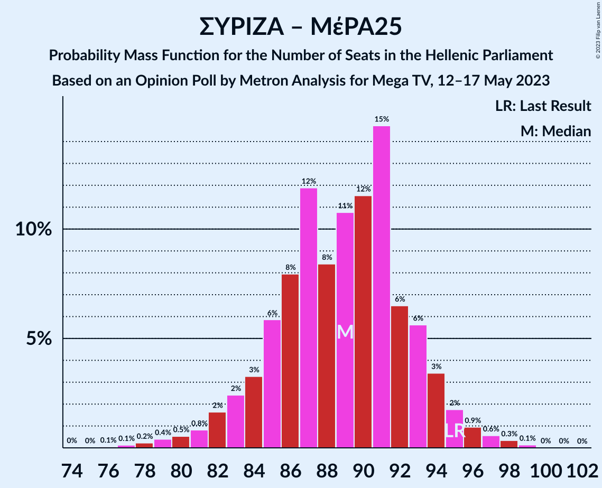

| Number of Seats | Probability | Accumulated | Special Marks |
|:---------------:|:-----------:|:-----------:|:-------------:|
| 75 | 0% | 100% |  |
| 76 | 0.1% | 99.9% |  |
| 77 | 0.1% | 99.9% |  |
| 78 | 0.2% | 99.7% |  |
| 79 | 0.4% | 99.5% |  |
| 80 | 0.5% | 99.1% |  |
| 81 | 0.8% | 98.6% |  |
| 82 | 2% | 98% |  |
| 83 | 2% | 96% |  |
| 84 | 3% | 94% |  |
| 85 | 6% | 90% |  |
| 86 | 8% | 85% |  |
| 87 | 12% | 77% |  |
| 88 | 8% | 65% |  |
| 89 | 11% | 56% |  |
| 90 | 12% | 46% | Median |
| 91 | 15% | 34% |  |
| 92 | 6% | 19% |  |
| 93 | 6% | 13% |  |
| 94 | 3% | 7% |  |
| 95 | 2% | 4% | Last Result |
| 96 | 0.9% | 2% |  |
| 97 | 0.6% | 1.1% |  |
| 98 | 0.3% | 0.5% |  |
| 99 | 0.1% | 0.2% |  |
| 100 | 0% | 0.1% |  |
| 101 | 0% | 0% |  |

### Συνασπισμός Ριζοσπαστικής Αριστεράς

| Number of Seats | Probability | Accumulated | Special Marks |
|:---------------:|:-----------:|:-----------:|:-------------:|
| 67 | 0% | 100% |  |
| 68 | 0.1% | 99.9% |  |
| 69 | 0.2% | 99.8% |  |
| 70 | 0.6% | 99.6% |  |
| 71 | 2% | 98.9% |  |
| 72 | 2% | 97% |  |
| 73 | 5% | 95% |  |
| 74 | 6% | 90% |  |
| 75 | 9% | 84% |  |
| 76 | 12% | 74% |  |
| 77 | 8% | 62% |  |
| 78 | 15% | 54% | Median |
| 79 | 11% | 39% |  |
| 80 | 9% | 29% |  |
| 81 | 9% | 19% |  |
| 82 | 4% | 11% |  |
| 83 | 3% | 6% |  |
| 84 | 2% | 3% |  |
| 85 | 1.0% | 2% |  |
| 86 | 0.5% | 0.9% | Last Result |
| 87 | 0.2% | 0.4% |  |
| 88 | 0.1% | 0.2% |  |
| 89 | 0% | 0.1% |  |
| 90 | 0% | 0% |  |

## Technical Information

### Opinion Poll

+ **Polling firm:** Metron Analysis
+ **Commissioner(s):** Mega TV
+ **Fieldwork period:** 12–17 May 2023

### Calculations

+ **Sample size:** 1500
+ **Simulations done:** 1,048,576
+ **Error estimate:** 0.99%

