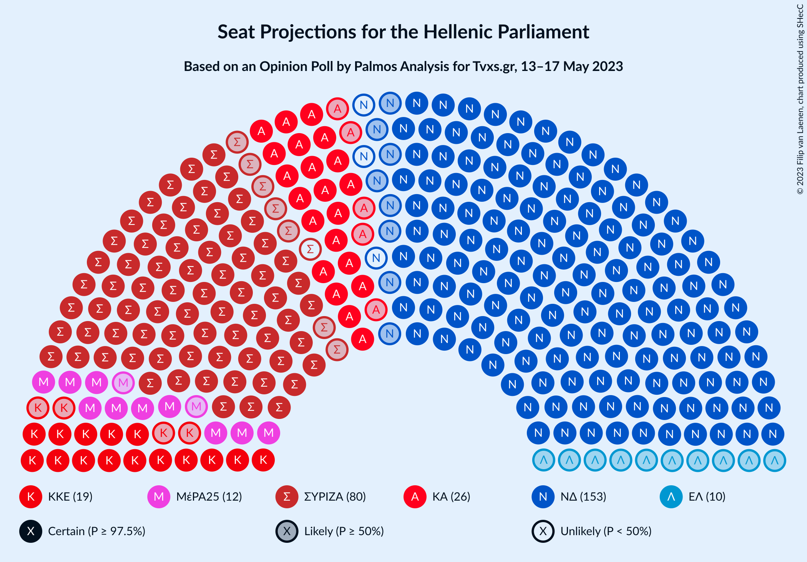
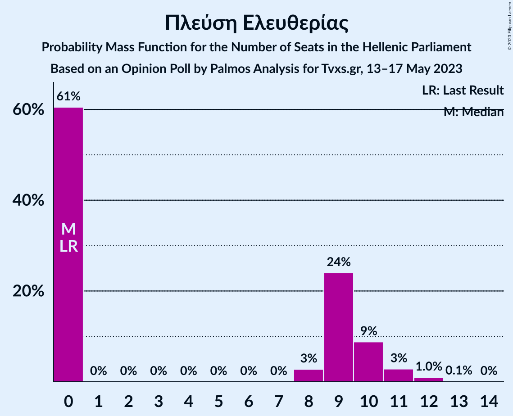

# Opinion Poll by Palmos Analysis for Tvxs.gr, 13–17 May 2023

<a href="#voting-intentions">Voting Intentions</a> | <a href="#seats">Seats</a> | <a href="#coalitions">Coalitions</a> | <a href="#technical-information">Technical Information</a>

## Voting Intentions

### Confidence Intervals

| Party | Last Result | Poll Result | 80% Confidence Interval | 90% Confidence Interval | 95% Confidence Interval | 99% Confidence Interval |
|:-----:|:-----------:|:-----------:|:-----------------------:|:-----------------------:|:-----------------------:|:-----------------------:|
| Νέα Δημοκρατία | 39.8% | 35.4% | 33.7–37.1% |33.2–37.6% |32.8–38.0% |32.0–38.9% |
| Συνασπισμός Ριζοσπαστικής Αριστεράς | 31.5% | 28.0% | 26.5–29.7% |26.0–30.1% |25.7–30.5% |24.9–31.3% |
| Κίνημα Αλλαγής | 8.1% | 9.1% | 8.2–10.2% |7.9–10.5% |7.7–10.8% |7.2–11.4% |
| Κομμουνιστικό Κόμμα Ελλάδας | 5.3% | 6.7% | 5.9–7.7% |5.7–8.0% |5.5–8.2% |5.1–8.7% |
| Μέτωπο Ευρωπαϊκής Ρεαλιστικής Ανυπακοής | 3.4% | 4.4% | 3.7–5.2% |3.5–5.4% |3.4–5.6% |3.1–6.0% |
| Ελληνική Λύση | 3.7% | 3.7% | 3.1–4.4% |2.9–4.6% |2.8–4.8% |2.5–5.2% |
| Πλεύση Ελευθερίας | 1.5% | 2.8% | 2.3–3.5% |2.2–3.7% |2.1–3.9% |1.8–4.2% |
| Εθνική Δημιουργία | 0.0% | 1.7% | 1.3–2.2% |1.2–2.4% |1.1–2.5% |1.0–2.8% |
| Δημοκρατικό Πατριωτικό Κίνημα ΝΙΚΗ | 0.0% | 1.2% | 0.9–1.7% |0.8–1.9% |0.7–2.0% |0.6–2.3% |

*Note:* The poll result column reflects the actual value used in the calculations. Published results may vary slightly, and in addition be rounded to fewer digits.

## Seats

### Confidence Intervals

| Party | Last Result | Median | 80% Confidence Interval | 90% Confidence Interval | 95% Confidence Interval | 99% Confidence Interval |
|:-----:|:-----------:|:------:|:-----------------------:|:-----------------------:|:-----------------------:|:-----------------------:|
| <a href="#νέα-δημοκρατία">Νέα Δημοκρατία</a> | 158 | 150 | 145–155 |143–157 |142–158 |139–161 |
| <a href="#συνασπισμός-ριζοσπαστικής-αριστεράς">Συνασπισμός Ριζοσπαστικής Αριστεράς</a> | 86 | 79 | 74–84 |73–85 |72–87 |70–90 |
| <a href="#κίνημα-αλλαγής">Κίνημα Αλλαγής</a> | 22 | 26 | 23–29 |22–30 |21–31 |20–32 |
| <a href="#κομμουνιστικό-κόμμα-ελλάδας">Κομμουνιστικό Κόμμα Ελλάδας</a> | 15 | 19 | 17–22 |16–22 |15–23 |14–25 |
| <a href="#μέτωπο-ευρωπαϊκής-ρεαλιστικής-ανυπακοής">Μέτωπο Ευρωπαϊκής Ρεαλιστικής Ανυπακοής</a> | 9 | 12 | 11–15 |10–16 |10–16 |9–17 |
| <a href="#ελληνική-λύση">Ελληνική Λύση</a> | 10 | 10 | 9–12 |0–13 |0–14 |0–15 |
| <a href="#πλεύση-ελευθερίας">Πλεύση Ελευθερίας</a> | 0 | 0 | 0–10 |0–10 |0–11 |0–12 |
| <a href="#εθνική-δημιουργία">Εθνική Δημιουργία</a> | 0 | 0 | 0 |0 |0 |0 |
| <a href="#δημοκρατικό-πατριωτικό-κίνημα-νικη">Δημοκρατικό Πατριωτικό Κίνημα ΝΙΚΗ</a> | 0 | 0 | 0 |0 |0 |0 |

### Νέα Δημοκρατία

*For a full overview of the results for this party, see the [Νέα Δημοκρατία](party-νέαδημοκρατία.html) page.*

| Number of Seats | Probability | Accumulated | Special Marks |
|:---------------:|:-----------:|:-----------:|:-------------:|
| 135 | 0% | 100% |  |
| 136 | 0% | 99.9% |  |
| 137 | 0% | 99.9% |  |
| 138 | 0.1% | 99.9% |  |
| 139 | 0.3% | 99.8% |  |
| 140 | 0.7% | 99.5% |  |
| 141 | 1.1% | 98.8% |  |
| 142 | 1.4% | 98% |  |
| 143 | 2% | 96% |  |
| 144 | 3% | 95% |  |
| 145 | 6% | 91% |  |
| 146 | 9% | 85% |  |
| 147 | 10% | 77% |  |
| 148 | 6% | 66% |  |
| 149 | 5% | 61% |  |
| 150 | 9% | 56% | Median |
| 151 | 9% | 47% | Majority |
| 152 | 7% | 38% |  |
| 153 | 10% | 32% |  |
| 154 | 8% | 21% |  |
| 155 | 4% | 13% |  |
| 156 | 3% | 9% |  |
| 157 | 2% | 6% |  |
| 158 | 1.2% | 4% | Last Result |
| 159 | 0.6% | 2% |  |
| 160 | 0.6% | 2% |  |
| 161 | 0.7% | 1.2% |  |
| 162 | 0.2% | 0.5% |  |
| 163 | 0.1% | 0.3% |  |
| 164 | 0.1% | 0.2% |  |
| 165 | 0% | 0.1% |  |
| 166 | 0% | 0% |  |

### Συνασπισμός Ριζοσπαστικής Αριστεράς

*For a full overview of the results for this party, see the [Συνασπισμός Ριζοσπαστικής Αριστεράς](party-συνασπισμόςριζοσπαστικήςαριστεράς.html) page.*

| Number of Seats | Probability | Accumulated | Special Marks |
|:---------------:|:-----------:|:-----------:|:-------------:|
| 67 | 0.1% | 100% |  |
| 68 | 0.1% | 99.9% |  |
| 69 | 0.2% | 99.8% |  |
| 70 | 0.8% | 99.6% |  |
| 71 | 1.2% | 98.8% |  |
| 72 | 2% | 98% |  |
| 73 | 3% | 96% |  |
| 74 | 4% | 92% |  |
| 75 | 7% | 88% |  |
| 76 | 13% | 81% |  |
| 77 | 5% | 68% |  |
| 78 | 8% | 63% |  |
| 79 | 14% | 56% | Median |
| 80 | 12% | 42% |  |
| 81 | 6% | 30% |  |
| 82 | 6% | 24% |  |
| 83 | 5% | 17% |  |
| 84 | 6% | 12% |  |
| 85 | 2% | 6% |  |
| 86 | 1.2% | 4% | Last Result |
| 87 | 1.2% | 3% |  |
| 88 | 0.7% | 2% |  |
| 89 | 0.4% | 0.9% |  |
| 90 | 0.3% | 0.5% |  |
| 91 | 0.1% | 0.2% |  |
| 92 | 0% | 0.1% |  |
| 93 | 0% | 0.1% |  |
| 94 | 0% | 0.1% |  |
| 95 | 0% | 0.1% |  |
| 96 | 0% | 0.1% |  |
| 97 | 0% | 0% |  |

### Κίνημα Αλλαγής

*For a full overview of the results for this party, see the [Κίνημα Αλλαγής](party-κίνημααλλαγής.html) page.*

| Number of Seats | Probability | Accumulated | Special Marks |
|:---------------:|:-----------:|:-----------:|:-------------:|
| 19 | 0.1% | 100% |  |
| 20 | 0.6% | 99.9% |  |
| 21 | 2% | 99.3% |  |
| 22 | 5% | 97% | Last Result |
| 23 | 8% | 92% |  |
| 24 | 11% | 85% |  |
| 25 | 16% | 73% |  |
| 26 | 25% | 57% | Median |
| 27 | 9% | 32% |  |
| 28 | 9% | 24% |  |
| 29 | 8% | 14% |  |
| 30 | 4% | 6% |  |
| 31 | 1.5% | 3% |  |
| 32 | 0.8% | 1.1% |  |
| 33 | 0.2% | 0.3% |  |
| 34 | 0.1% | 0.1% |  |
| 35 | 0% | 0% |  |

### Κομμουνιστικό Κόμμα Ελλάδας

*For a full overview of the results for this party, see the [Κομμουνιστικό Κόμμα Ελλάδας](party-κομμουνιστικόκόμμαελλάδας.html) page.*

| Number of Seats | Probability | Accumulated | Special Marks |
|:---------------:|:-----------:|:-----------:|:-------------:|
| 13 | 0.1% | 100% |  |
| 14 | 0.7% | 99.9% |  |
| 15 | 2% | 99.2% | Last Result |
| 16 | 6% | 97% |  |
| 17 | 12% | 92% |  |
| 18 | 15% | 80% |  |
| 19 | 21% | 64% | Median |
| 20 | 15% | 43% |  |
| 21 | 17% | 28% |  |
| 22 | 6% | 11% |  |
| 23 | 3% | 4% |  |
| 24 | 0.9% | 1.5% |  |
| 25 | 0.4% | 0.6% |  |
| 26 | 0.1% | 0.2% |  |
| 27 | 0% | 0.1% |  |
| 28 | 0% | 0% |  |

### Μέτωπο Ευρωπαϊκής Ρεαλιστικής Ανυπακοής

*For a full overview of the results for this party, see the [Μέτωπο Ευρωπαϊκής Ρεαλιστικής Ανυπακοής](party-μέτωποευρωπαϊκήςρεαλιστικήςανυπακοής.html) page.*

| Number of Seats | Probability | Accumulated | Special Marks |
|:---------------:|:-----------:|:-----------:|:-------------:|
| 0 | 0.2% | 100% |  |
| 1 | 0% | 99.8% |  |
| 2 | 0% | 99.8% |  |
| 3 | 0% | 99.8% |  |
| 4 | 0% | 99.8% |  |
| 5 | 0% | 99.8% |  |
| 6 | 0% | 99.8% |  |
| 7 | 0% | 99.8% |  |
| 8 | 0% | 99.8% |  |
| 9 | 2% | 99.8% | Last Result |
| 10 | 6% | 98% |  |
| 11 | 23% | 92% |  |
| 12 | 22% | 69% | Median |
| 13 | 15% | 47% |  |
| 14 | 21% | 32% |  |
| 15 | 5% | 11% |  |
| 16 | 5% | 6% |  |
| 17 | 0.9% | 1.1% |  |
| 18 | 0.2% | 0.2% |  |
| 19 | 0% | 0.1% |  |
| 20 | 0% | 0% |  |

### Ελληνική Λύση

*For a full overview of the results for this party, see the [Ελληνική Λύση](party-ελληνικήλύση.html) page.*

| Number of Seats | Probability | Accumulated | Special Marks |
|:---------------:|:-----------:|:-----------:|:-------------:|
| 0 | 8% | 100% |  |
| 1 | 0% | 92% |  |
| 2 | 0% | 92% |  |
| 3 | 0% | 92% |  |
| 4 | 0% | 92% |  |
| 5 | 0% | 92% |  |
| 6 | 0% | 92% |  |
| 7 | 0% | 92% |  |
| 8 | 0.3% | 92% |  |
| 9 | 21% | 92% |  |
| 10 | 22% | 70% | Last Result, Median |
| 11 | 18% | 48% |  |
| 12 | 21% | 31% |  |
| 13 | 6% | 10% |  |
| 14 | 3% | 4% |  |
| 15 | 0.4% | 0.5% |  |
| 16 | 0.1% | 0.1% |  |
| 17 | 0% | 0% |  |

### Πλεύση Ελευθερίας

*For a full overview of the results for this party, see the [Πλεύση Ελευθερίας](party-πλεύσηελευθερίας.html) page.*

| Number of Seats | Probability | Accumulated | Special Marks |
|:---------------:|:-----------:|:-----------:|:-------------:|
| 0 | 61% | 100% | Last Result, Median |
| 1 | 0% | 39% |  |
| 2 | 0% | 39% |  |
| 3 | 0% | 39% |  |
| 4 | 0% | 39% |  |
| 5 | 0% | 39% |  |
| 6 | 0% | 39% |  |
| 7 | 0% | 39% |  |
| 8 | 3% | 39% |  |
| 9 | 24% | 37% |  |
| 10 | 9% | 13% |  |
| 11 | 3% | 4% |  |
| 12 | 1.0% | 1.1% |  |
| 13 | 0.1% | 0.1% |  |
| 14 | 0% | 0% |  |

### Εθνική Δημιουργία

*For a full overview of the results for this party, see the [Εθνική Δημιουργία](party-εθνικήδημιουργία.html) page.*

| Number of Seats | Probability | Accumulated | Special Marks |
|:---------------:|:-----------:|:-----------:|:-------------:|
| 0 | 99.8% | 100% | Last Result, Median |
| 1 | 0% | 0.2% |  |
| 2 | 0% | 0.2% |  |
| 3 | 0% | 0.2% |  |
| 4 | 0% | 0.2% |  |
| 5 | 0% | 0.2% |  |
| 6 | 0% | 0.2% |  |
| 7 | 0% | 0.2% |  |
| 8 | 0% | 0.2% |  |
| 9 | 0.2% | 0.2% |  |
| 10 | 0% | 0% |  |

### Δημοκρατικό Πατριωτικό Κίνημα ΝΙΚΗ

*For a full overview of the results for this party, see the [Δημοκρατικό Πατριωτικό Κίνημα ΝΙΚΗ](party-δημοκρατικόπατριωτικόκίνημανικη.html) page.*

| Number of Seats | Probability | Accumulated | Special Marks |
|:---------------:|:-----------:|:-----------:|:-------------:|
| 0 | 100% | 100% | Last Result, Median |

## Coalitions

### Confidence Intervals

| Coalition | Last Result | Median | Majority? | 80% Confidence Interval | 90% Confidence Interval | 95% Confidence Interval | 99% Confidence Interval |
|:---------:|:-----------:|:------:|:---------:|:-----------------------:|:-----------------------:|:-----------------------:|:-----------------------:|
| Νέα Δημοκρατία – Κίνημα Αλλαγής | 180 | 176 | 100% | 170–181 | 169–183 | 168–186 | 164–187 |
| Νέα Δημοκρατία | 158 | 150 | 47% | 145–155 | 143–157 | 142–158 | 139–161 |
| Συνασπισμός Ριζοσπαστικής Αριστεράς – Μέτωπο Ευρωπαϊκής Ρεαλιστικής Ανυπακοής | 95 | 91 | 0% | 87–96 | 85–98 | 84–99 | 81–103 |
| Συνασπισμός Ριζοσπαστικής Αριστεράς | 86 | 79 | 0% | 74–84 | 73–85 | 72–87 | 70–90 |

### Νέα Δημοκρατία – Κίνημα Αλλαγής

| Number of Seats | Probability | Accumulated | Special Marks |
|:---------------:|:-----------:|:-----------:|:-------------:|
| 160 | 0% | 100% |  |
| 161 | 0% | 99.9% |  |
| 162 | 0% | 99.9% |  |
| 163 | 0.2% | 99.9% |  |
| 164 | 0.5% | 99.7% |  |
| 165 | 0.3% | 99.2% |  |
| 166 | 0.4% | 98.9% |  |
| 167 | 0.7% | 98% |  |
| 168 | 2% | 98% |  |
| 169 | 5% | 96% |  |
| 170 | 4% | 91% |  |
| 171 | 5% | 87% |  |
| 172 | 9% | 82% |  |
| 173 | 11% | 73% |  |
| 174 | 4% | 62% |  |
| 175 | 4% | 58% |  |
| 176 | 8% | 54% | Median |
| 177 | 6% | 47% |  |
| 178 | 6% | 41% |  |
| 179 | 12% | 34% |  |
| 180 | 9% | 22% | Last Result |
| 181 | 6% | 14% |  |
| 182 | 2% | 8% |  |
| 183 | 1.0% | 5% |  |
| 184 | 0.5% | 4% |  |
| 185 | 1.2% | 4% |  |
| 186 | 2% | 3% |  |
| 187 | 0.3% | 0.7% |  |
| 188 | 0.2% | 0.4% |  |
| 189 | 0.1% | 0.2% |  |
| 190 | 0% | 0.2% |  |
| 191 | 0% | 0.1% |  |
| 192 | 0.1% | 0.1% |  |
| 193 | 0% | 0% |  |

### Νέα Δημοκρατία

| Number of Seats | Probability | Accumulated | Special Marks |
|:---------------:|:-----------:|:-----------:|:-------------:|
| 135 | 0% | 100% |  |
| 136 | 0% | 99.9% |  |
| 137 | 0% | 99.9% |  |
| 138 | 0.1% | 99.9% |  |
| 139 | 0.3% | 99.8% |  |
| 140 | 0.7% | 99.5% |  |
| 141 | 1.1% | 98.8% |  |
| 142 | 1.4% | 98% |  |
| 143 | 2% | 96% |  |
| 144 | 3% | 95% |  |
| 145 | 6% | 91% |  |
| 146 | 9% | 85% |  |
| 147 | 10% | 77% |  |
| 148 | 6% | 66% |  |
| 149 | 5% | 61% |  |
| 150 | 9% | 56% | Median |
| 151 | 9% | 47% | Majority |
| 152 | 7% | 38% |  |
| 153 | 10% | 32% |  |
| 154 | 8% | 21% |  |
| 155 | 4% | 13% |  |
| 156 | 3% | 9% |  |
| 157 | 2% | 6% |  |
| 158 | 1.2% | 4% | Last Result |
| 159 | 0.6% | 2% |  |
| 160 | 0.6% | 2% |  |
| 161 | 0.7% | 1.2% |  |
| 162 | 0.2% | 0.5% |  |
| 163 | 0.1% | 0.3% |  |
| 164 | 0.1% | 0.2% |  |
| 165 | 0% | 0.1% |  |
| 166 | 0% | 0% |  |

### Συνασπισμός Ριζοσπαστικής Αριστεράς – Μέτωπο Ευρωπαϊκής Ρεαλιστικής Ανυπακοής

| Number of Seats | Probability | Accumulated | Special Marks |
|:---------------:|:-----------:|:-----------:|:-------------:|
| 78 | 0% | 100% |  |
| 79 | 0.1% | 99.9% |  |
| 80 | 0.1% | 99.9% |  |
| 81 | 0.5% | 99.8% |  |
| 82 | 0.6% | 99.2% |  |
| 83 | 0.8% | 98.6% |  |
| 84 | 2% | 98% |  |
| 85 | 2% | 96% |  |
| 86 | 4% | 94% |  |
| 87 | 9% | 90% |  |
| 88 | 4% | 81% |  |
| 89 | 5% | 78% |  |
| 90 | 17% | 72% |  |
| 91 | 8% | 55% | Median |
| 92 | 12% | 48% |  |
| 93 | 7% | 35% |  |
| 94 | 7% | 28% |  |
| 95 | 6% | 21% | Last Result |
| 96 | 6% | 15% |  |
| 97 | 3% | 10% |  |
| 98 | 4% | 7% |  |
| 99 | 1.3% | 4% |  |
| 100 | 0.9% | 2% |  |
| 101 | 0.6% | 1.5% |  |
| 102 | 0.3% | 0.9% |  |
| 103 | 0.3% | 0.6% |  |
| 104 | 0% | 0.2% |  |
| 105 | 0.1% | 0.2% |  |
| 106 | 0% | 0.1% |  |
| 107 | 0% | 0.1% |  |
| 108 | 0% | 0.1% |  |
| 109 | 0% | 0% |  |

### Συνασπισμός Ριζοσπαστικής Αριστεράς

| Number of Seats | Probability | Accumulated | Special Marks |
|:---------------:|:-----------:|:-----------:|:-------------:|
| 67 | 0.1% | 100% |  |
| 68 | 0.1% | 99.9% |  |
| 69 | 0.2% | 99.8% |  |
| 70 | 0.8% | 99.6% |  |
| 71 | 1.2% | 98.8% |  |
| 72 | 2% | 98% |  |
| 73 | 3% | 96% |  |
| 74 | 4% | 92% |  |
| 75 | 7% | 88% |  |
| 76 | 13% | 81% |  |
| 77 | 5% | 68% |  |
| 78 | 8% | 63% |  |
| 79 | 14% | 56% | Median |
| 80 | 12% | 42% |  |
| 81 | 6% | 30% |  |
| 82 | 6% | 24% |  |
| 83 | 5% | 17% |  |
| 84 | 6% | 12% |  |
| 85 | 2% | 6% |  |
| 86 | 1.2% | 4% | Last Result |
| 87 | 1.2% | 3% |  |
| 88 | 0.7% | 2% |  |
| 89 | 0.4% | 0.9% |  |
| 90 | 0.3% | 0.5% |  |
| 91 | 0.1% | 0.2% |  |
| 92 | 0% | 0.1% |  |
| 93 | 0% | 0.1% |  |
| 94 | 0% | 0.1% |  |
| 95 | 0% | 0.1% |  |
| 96 | 0% | 0.1% |  |
| 97 | 0% | 0% |  |

## Technical Information

### Opinion Poll

+ **Polling firm:** Palmos Analysis
+ **Commissioner(s):** Tvxs.gr
+ **Fieldwork period:** 13–17 May 2023

### Calculations

+ **Sample size:** 1306
+ **Simulations done:** 1,048,576
+ **Error estimate:** 0.99%

