# Opinion Poll by Marc for ΑΝΤ1, 16–18 May 2023

<a href="#voting-intentions">Voting Intentions</a> | <a href="#seats">Seats</a> | <a href="#coalitions">Coalitions</a> | <a href="#technical-information">Technical Information</a>

## Voting Intentions

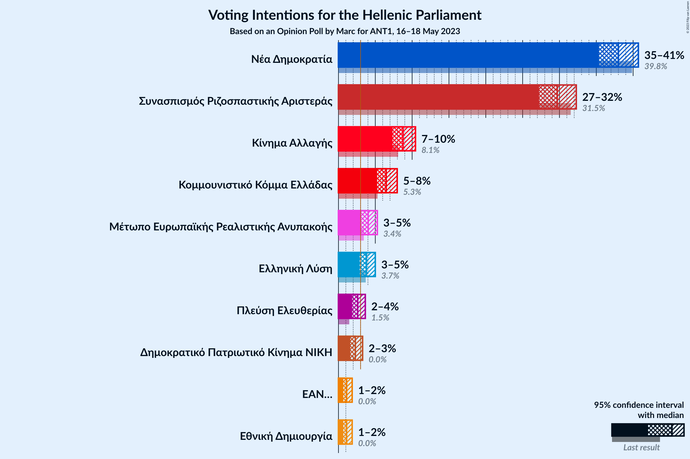

### Confidence Intervals

| Party | Last Result | Poll Result | 80% Confidence Interval | 90% Confidence Interval | 95% Confidence Interval | 99% Confidence Interval |
|:-----:|:-----------:|:-----------:|:-----------------------:|:-----------------------:|:-----------------------:|:-----------------------:|
| Νέα Δημοκρατία | 39.8% | 38.0% | 36.3–39.8% |35.8–40.3% |35.4–40.7% |34.5–41.6% |
| Συνασπισμός Ριζοσπαστικής Αριστεράς | 31.5% | 29.7% | 28.1–31.4% |27.6–31.9% |27.2–32.3% |26.5–33.1% |
| Κίνημα Αλλαγής | 8.1% | 8.8% | 7.8–9.9% |7.6–10.2% |7.3–10.5% |6.9–11.0% |
| Κομμουνιστικό Κόμμα Ελλάδας | 5.3% | 6.5% | 5.7–7.5% |5.4–7.7% |5.2–8.0% |4.9–8.5% |
| Μέτωπο Ευρωπαϊκής Ρεαλιστικής Ανυπακοής | 3.4% | 4.0% | 3.4–4.8% |3.2–5.1% |3.1–5.3% |2.8–5.7% |
| Ελληνική Λύση | 3.7% | 3.8% | 3.2–4.6% |3.0–4.8% |2.9–5.0% |2.6–5.4% |
| Πλεύση Ελευθερίας | 1.5% | 2.6% | 2.1–3.3% |2.0–3.5% |1.9–3.6% |1.6–4.0% |
| Δημοκρατικό Πατριωτικό Κίνημα ΝΙΚΗ | 0.0% | 2.3% | 1.8–2.9% |1.7–3.1% |1.6–3.3% |1.4–3.6% |
| Εθνική Δημιουργία | 0.0% | 1.1% | 0.8–1.6% |0.7–1.7% |0.7–1.9% |0.5–2.1% |
| ΕΑΝ… | 0.0% | 1.1% | 0.8–1.6% |0.7–1.7% |0.7–1.9% |0.5–2.1% |

*Note:* The poll result column reflects the actual value used in the calculations. Published results may vary slightly, and in addition be rounded to fewer digits.

## Seats

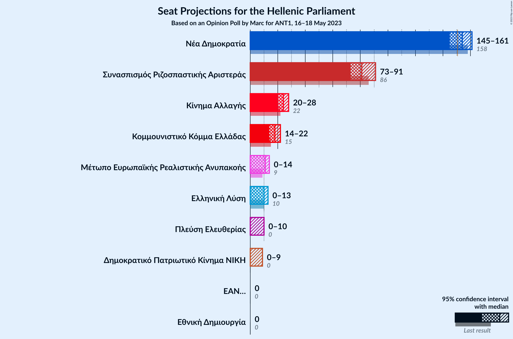

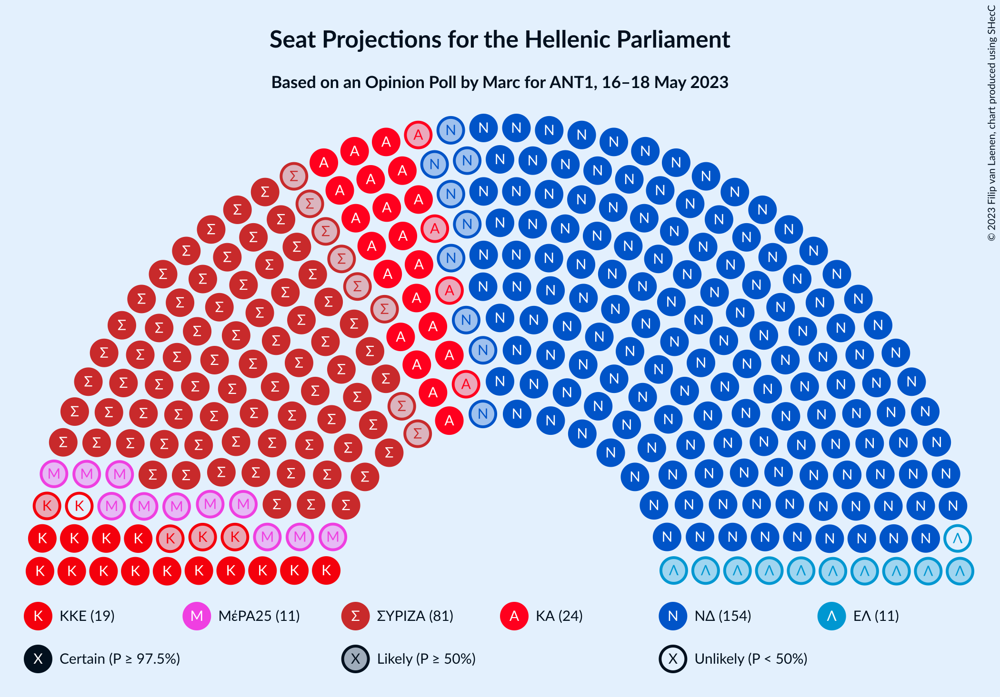

### Confidence Intervals

| Party | Last Result | Median | 80% Confidence Interval | 90% Confidence Interval | 95% Confidence Interval | 99% Confidence Interval |
|:-----:|:-----------:|:------:|:-----------------------:|:-----------------------:|:-----------------------:|:-----------------------:|
| <a href="#νέα-δημοκρατία">Νέα Δημοκρατία</a> | 158 | 154 | 149–159 |146–160 |145–161 |143–164 |
| <a href="#συνασπισμός-ριζοσπαστικής-αριστεράς">Συνασπισμός Ριζοσπαστικής Αριστεράς</a> | 86 | 81 | 76–86 |74–88 |73–91 |71–91 |
| <a href="#κίνημα-αλλαγής">Κίνημα Αλλαγής</a> | 22 | 24 | 22–27 |21–27 |20–28 |18–30 |
| <a href="#κομμουνιστικό-κόμμα-ελλάδας">Κομμουνιστικό Κόμμα Ελλάδας</a> | 15 | 18 | 16–20 |15–21 |14–22 |13–23 |
| <a href="#μέτωπο-ευρωπαϊκής-ρεαλιστικής-ανυπακοής">Μέτωπο Ευρωπαϊκής Ρεαλιστικής Ανυπακοής</a> | 9 | 11 | 9–13 |9–13 |0–14 |0–15 |
| <a href="#ελληνική-λύση">Ελληνική Λύση</a> | 10 | 10 | 8–12 |0–13 |0–13 |0–15 |
| <a href="#πλεύση-ελευθερίας">Πλεύση Ελευθερίας</a> | 0 | 0 | 0–9 |0–9 |0–10 |0–10 |
| <a href="#δημοκρατικό-πατριωτικό-κίνημα-νικη">Δημοκρατικό Πατριωτικό Κίνημα ΝΙΚΗ</a> | 0 | 0 | 0 |0 |0–9 |0–10 |
| <a href="#εθνική-δημιουργία">Εθνική Δημιουργία</a> | 0 | 0 | 0 |0 |0 |0 |
| <a href="#εαν…">ΕΑΝ…</a> | 0 | 0 | 0 |0 |0 |0 |

### Νέα Δημοκρατία

*For a full overview of the results for this party, see the [Νέα Δημοκρατία](party-νέαδημοκρατία.html) page.*

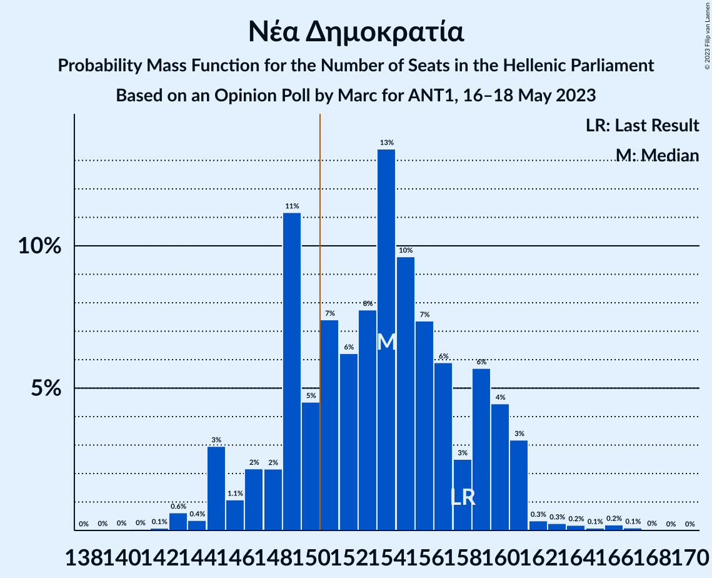

| Number of Seats | Probability | Accumulated | Special Marks |
|:---------------:|:-----------:|:-----------:|:-------------:|
| 139 | 0% | 100% |  |
| 140 | 0% | 99.9% |  |
| 141 | 0% | 99.9% |  |
| 142 | 0.1% | 99.9% |  |
| 143 | 0.6% | 99.8% |  |
| 144 | 0.4% | 99.1% |  |
| 145 | 3% | 98.8% |  |
| 146 | 1.1% | 96% |  |
| 147 | 2% | 95% |  |
| 148 | 2% | 93% |  |
| 149 | 11% | 90% |  |
| 150 | 5% | 79% |  |
| 151 | 7% | 75% | Majority |
| 152 | 6% | 67% |  |
| 153 | 8% | 61% |  |
| 154 | 13% | 53% | Median |
| 155 | 10% | 40% |  |
| 156 | 7% | 30% |  |
| 157 | 6% | 23% |  |
| 158 | 3% | 17% | Last Result |
| 159 | 6% | 15% |  |
| 160 | 4% | 9% |  |
| 161 | 3% | 4% |  |
| 162 | 0.3% | 1.2% |  |
| 163 | 0.3% | 0.9% |  |
| 164 | 0.2% | 0.6% |  |
| 165 | 0.1% | 0.4% |  |
| 166 | 0.2% | 0.3% |  |
| 167 | 0.1% | 0.1% |  |
| 168 | 0% | 0.1% |  |
| 169 | 0% | 0% |  |

### Συνασπισμός Ριζοσπαστικής Αριστεράς

*For a full overview of the results for this party, see the [Συνασπισμός Ριζοσπαστικής Αριστεράς](party-συνασπισμόςριζοσπαστικήςαριστεράς.html) page.*

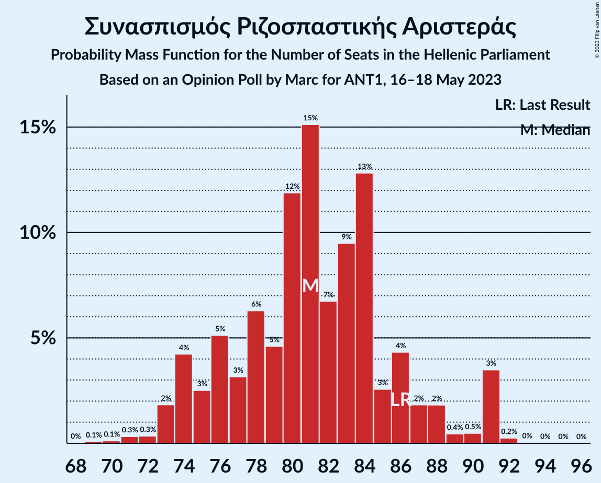

| Number of Seats | Probability | Accumulated | Special Marks |
|:---------------:|:-----------:|:-----------:|:-------------:|
| 69 | 0.1% | 100% |  |
| 70 | 0.1% | 99.9% |  |
| 71 | 0.3% | 99.8% |  |
| 72 | 0.3% | 99.4% |  |
| 73 | 2% | 99.1% |  |
| 74 | 4% | 97% |  |
| 75 | 3% | 93% |  |
| 76 | 5% | 91% |  |
| 77 | 3% | 85% |  |
| 78 | 6% | 82% |  |
| 79 | 5% | 76% |  |
| 80 | 12% | 71% |  |
| 81 | 15% | 59% | Median |
| 82 | 7% | 44% |  |
| 83 | 9% | 38% |  |
| 84 | 13% | 28% |  |
| 85 | 3% | 15% |  |
| 86 | 4% | 13% | Last Result |
| 87 | 2% | 8% |  |
| 88 | 2% | 7% |  |
| 89 | 0.4% | 5% |  |
| 90 | 0.5% | 4% |  |
| 91 | 3% | 4% |  |
| 92 | 0.2% | 0.4% |  |
| 93 | 0% | 0.1% |  |
| 94 | 0% | 0.1% |  |
| 95 | 0% | 0.1% |  |
| 96 | 0% | 0% |  |

### Κίνημα Αλλαγής

*For a full overview of the results for this party, see the [Κίνημα Αλλαγής](party-κίνημααλλαγής.html) page.*

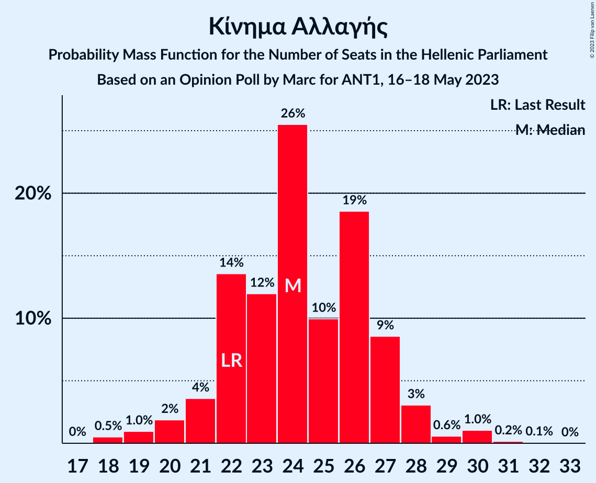

| Number of Seats | Probability | Accumulated | Special Marks |
|:---------------:|:-----------:|:-----------:|:-------------:|
| 18 | 0.5% | 100% |  |
| 19 | 1.0% | 99.4% |  |
| 20 | 2% | 98% |  |
| 21 | 4% | 97% |  |
| 22 | 14% | 93% | Last Result |
| 23 | 12% | 79% |  |
| 24 | 26% | 67% | Median |
| 25 | 10% | 42% |  |
| 26 | 19% | 32% |  |
| 27 | 9% | 13% |  |
| 28 | 3% | 5% |  |
| 29 | 0.6% | 2% |  |
| 30 | 1.0% | 1.3% |  |
| 31 | 0.2% | 0.2% |  |
| 32 | 0.1% | 0.1% |  |
| 33 | 0% | 0% |  |

### Κομμουνιστικό Κόμμα Ελλάδας

*For a full overview of the results for this party, see the [Κομμουνιστικό Κόμμα Ελλάδας](party-κομμουνιστικόκόμμαελλάδας.html) page.*

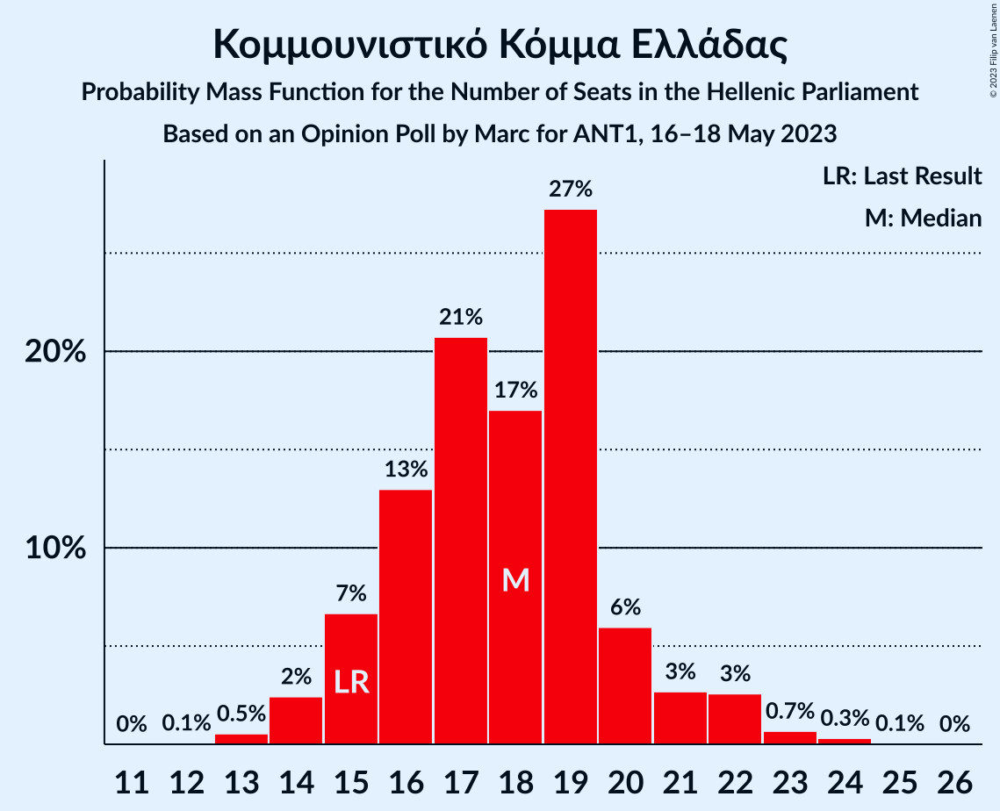

| Number of Seats | Probability | Accumulated | Special Marks |
|:---------------:|:-----------:|:-----------:|:-------------:|
| 12 | 0.1% | 100% |  |
| 13 | 0.5% | 99.9% |  |
| 14 | 2% | 99.4% |  |
| 15 | 7% | 97% | Last Result |
| 16 | 13% | 90% |  |
| 17 | 21% | 77% |  |
| 18 | 17% | 57% | Median |
| 19 | 27% | 40% |  |
| 20 | 6% | 12% |  |
| 21 | 3% | 6% |  |
| 22 | 3% | 4% |  |
| 23 | 0.7% | 1.1% |  |
| 24 | 0.3% | 0.4% |  |
| 25 | 0.1% | 0.1% |  |
| 26 | 0% | 0% |  |

### Μέτωπο Ευρωπαϊκής Ρεαλιστικής Ανυπακοής

*For a full overview of the results for this party, see the [Μέτωπο Ευρωπαϊκής Ρεαλιστικής Ανυπακοής](party-μέτωποευρωπαϊκήςρεαλιστικήςανυπακοής.html) page.*

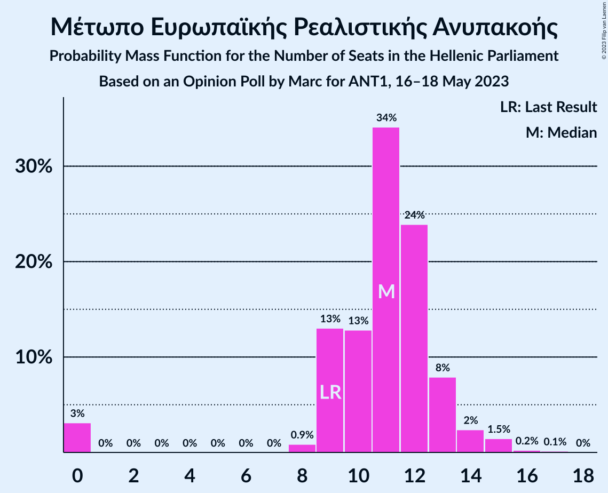

| Number of Seats | Probability | Accumulated | Special Marks |
|:---------------:|:-----------:|:-----------:|:-------------:|
| 0 | 3% | 100% |  |
| 1 | 0% | 97% |  |
| 2 | 0% | 97% |  |
| 3 | 0% | 97% |  |
| 4 | 0% | 97% |  |
| 5 | 0% | 97% |  |
| 6 | 0% | 97% |  |
| 7 | 0% | 97% |  |
| 8 | 0.9% | 97% |  |
| 9 | 13% | 96% | Last Result |
| 10 | 13% | 83% |  |
| 11 | 34% | 70% | Median |
| 12 | 24% | 36% |  |
| 13 | 8% | 12% |  |
| 14 | 2% | 4% |  |
| 15 | 1.5% | 2% |  |
| 16 | 0.2% | 0.4% |  |
| 17 | 0.1% | 0.2% |  |
| 18 | 0% | 0% |  |

### Ελληνική Λύση

*For a full overview of the results for this party, see the [Ελληνική Λύση](party-ελληνικήλύση.html) page.*

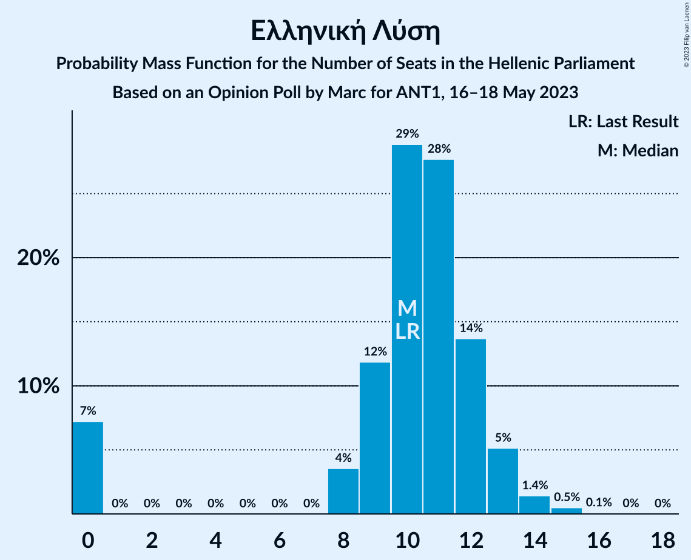

| Number of Seats | Probability | Accumulated | Special Marks |
|:---------------:|:-----------:|:-----------:|:-------------:|
| 0 | 7% | 100% |  |
| 1 | 0% | 93% |  |
| 2 | 0% | 93% |  |
| 3 | 0% | 93% |  |
| 4 | 0% | 93% |  |
| 5 | 0% | 93% |  |
| 6 | 0% | 93% |  |
| 7 | 0% | 93% |  |
| 8 | 4% | 93% |  |
| 9 | 12% | 89% |  |
| 10 | 29% | 77% | Last Result, Median |
| 11 | 28% | 49% |  |
| 12 | 14% | 21% |  |
| 13 | 5% | 7% |  |
| 14 | 1.4% | 2% |  |
| 15 | 0.5% | 0.6% |  |
| 16 | 0.1% | 0.1% |  |
| 17 | 0% | 0% |  |

### Πλεύση Ελευθερίας

*For a full overview of the results for this party, see the [Πλεύση Ελευθερίας](party-πλεύσηελευθερίας.html) page.*

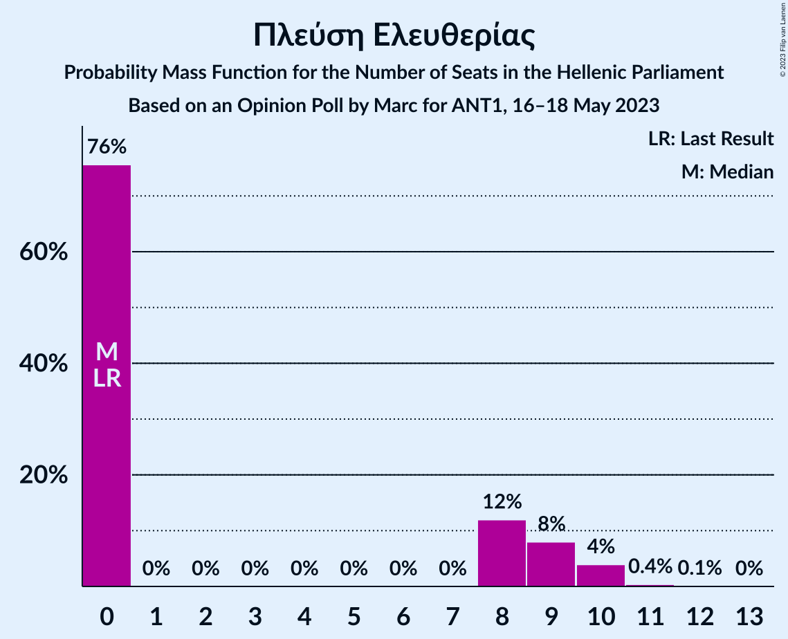

| Number of Seats | Probability | Accumulated | Special Marks |
|:---------------:|:-----------:|:-----------:|:-------------:|
| 0 | 76% | 100% | Last Result, Median |
| 1 | 0% | 24% |  |
| 2 | 0% | 24% |  |
| 3 | 0% | 24% |  |
| 4 | 0% | 24% |  |
| 5 | 0% | 24% |  |
| 6 | 0% | 24% |  |
| 7 | 0% | 24% |  |
| 8 | 12% | 24% |  |
| 9 | 8% | 12% |  |
| 10 | 4% | 4% |  |
| 11 | 0.4% | 0.5% |  |
| 12 | 0.1% | 0.1% |  |
| 13 | 0% | 0% |  |

### Δημοκρατικό Πατριωτικό Κίνημα ΝΙΚΗ

*For a full overview of the results for this party, see the [Δημοκρατικό Πατριωτικό Κίνημα ΝΙΚΗ](party-δημοκρατικόπατριωτικόκίνημανικη.html) page.*

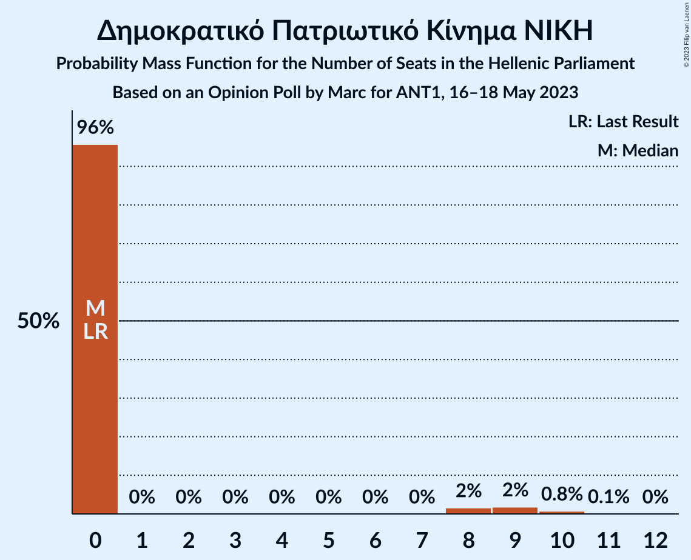

| Number of Seats | Probability | Accumulated | Special Marks |
|:---------------:|:-----------:|:-----------:|:-------------:|
| 0 | 96% | 100% | Last Result, Median |
| 1 | 0% | 4% |  |
| 2 | 0% | 4% |  |
| 3 | 0% | 4% |  |
| 4 | 0% | 4% |  |
| 5 | 0% | 4% |  |
| 6 | 0% | 4% |  |
| 7 | 0% | 4% |  |
| 8 | 2% | 4% |  |
| 9 | 2% | 3% |  |
| 10 | 0.8% | 0.8% |  |
| 11 | 0.1% | 0.1% |  |
| 12 | 0% | 0% |  |

### Εθνική Δημιουργία

*For a full overview of the results for this party, see the [Εθνική Δημιουργία](party-εθνικήδημιουργία.html) page.*

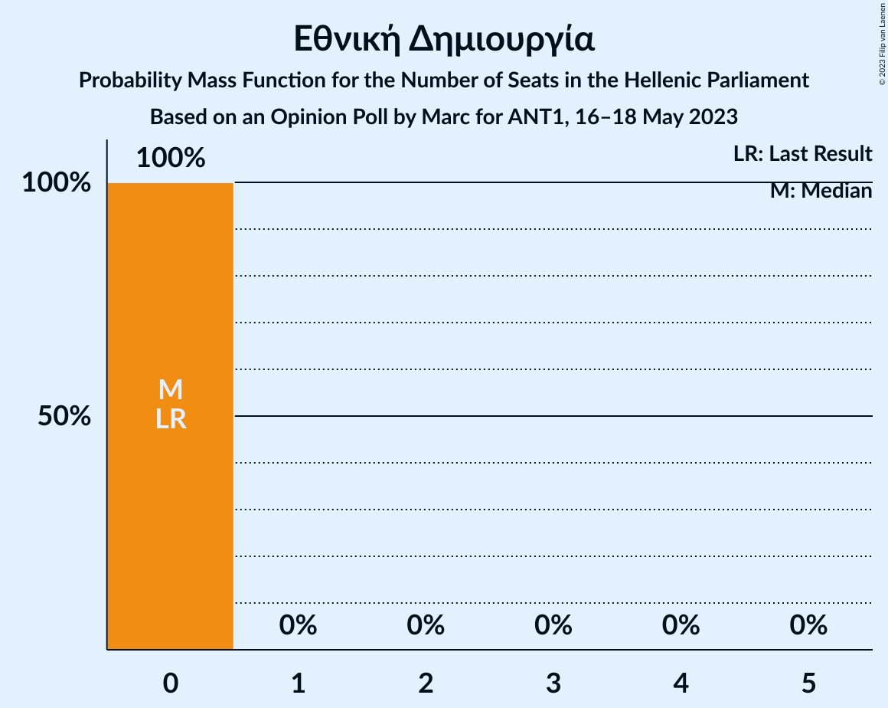

| Number of Seats | Probability | Accumulated | Special Marks |
|:---------------:|:-----------:|:-----------:|:-------------:|
| 0 | 100% | 100% | Last Result, Median |

### ΕΑΝ…

*For a full overview of the results for this party, see the [ΕΑΝ…](party-εαν….html) page.*

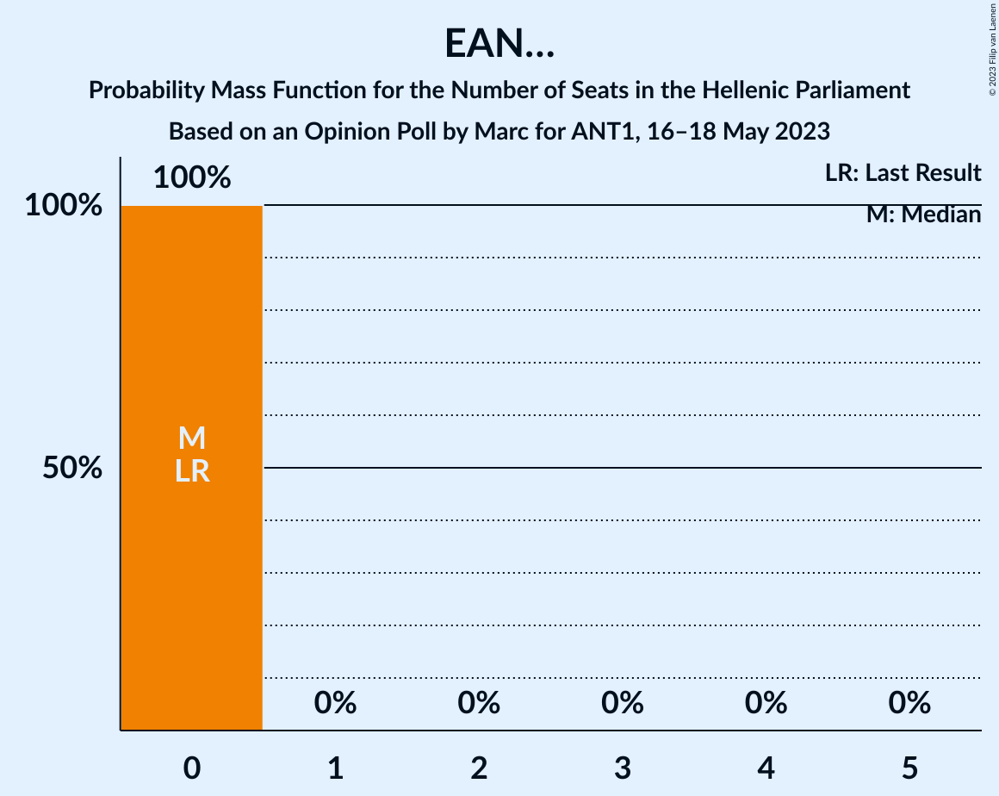

| Number of Seats | Probability | Accumulated | Special Marks |
|:---------------:|:-----------:|:-----------:|:-------------:|
| 0 | 100% | 100% | Last Result, Median |

## Coalitions

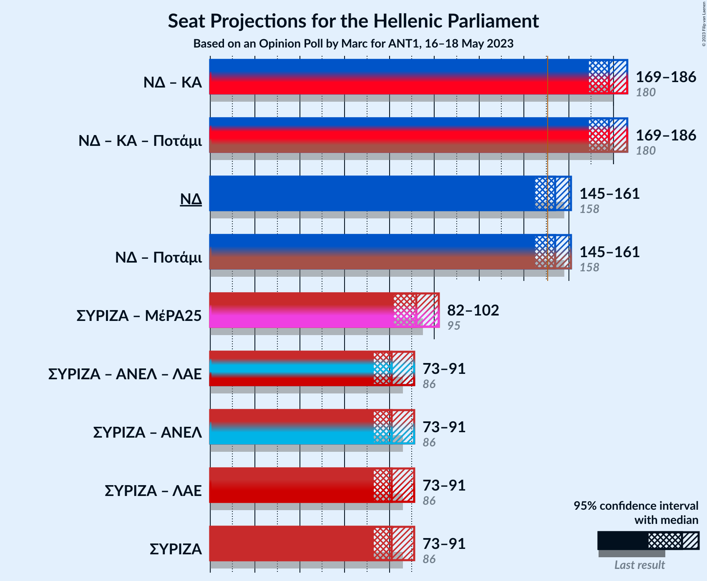

### Confidence Intervals

| Coalition | Last Result | Median | Majority? | 80% Confidence Interval | 90% Confidence Interval | 95% Confidence Interval | 99% Confidence Interval |
|:---------:|:-----------:|:------:|:---------:|:-----------------------:|:-----------------------:|:-----------------------:|:-----------------------:|
| Νέα Δημοκρατία – Κίνημα Αλλαγής | 180 | 178 | 100% | 173–183 | 171–184 | 169–186 | 165–189 |
| Νέα Δημοκρατία | 158 | 154 | 75% | 149–159 | 146–160 | 145–161 | 143–164 |
| Συνασπισμός Ριζοσπαστικής Αριστεράς – Μέτωπο Ευρωπαϊκής Ρεαλιστικής Ανυπακοής | 95 | 92 | 0% | 86–97 | 83–99 | 82–102 | 80–102 |
| Συνασπισμός Ριζοσπαστικής Αριστεράς | 86 | 81 | 0% | 76–86 | 74–88 | 73–91 | 71–91 |

### Νέα Δημοκρατία – Κίνημα Αλλαγής

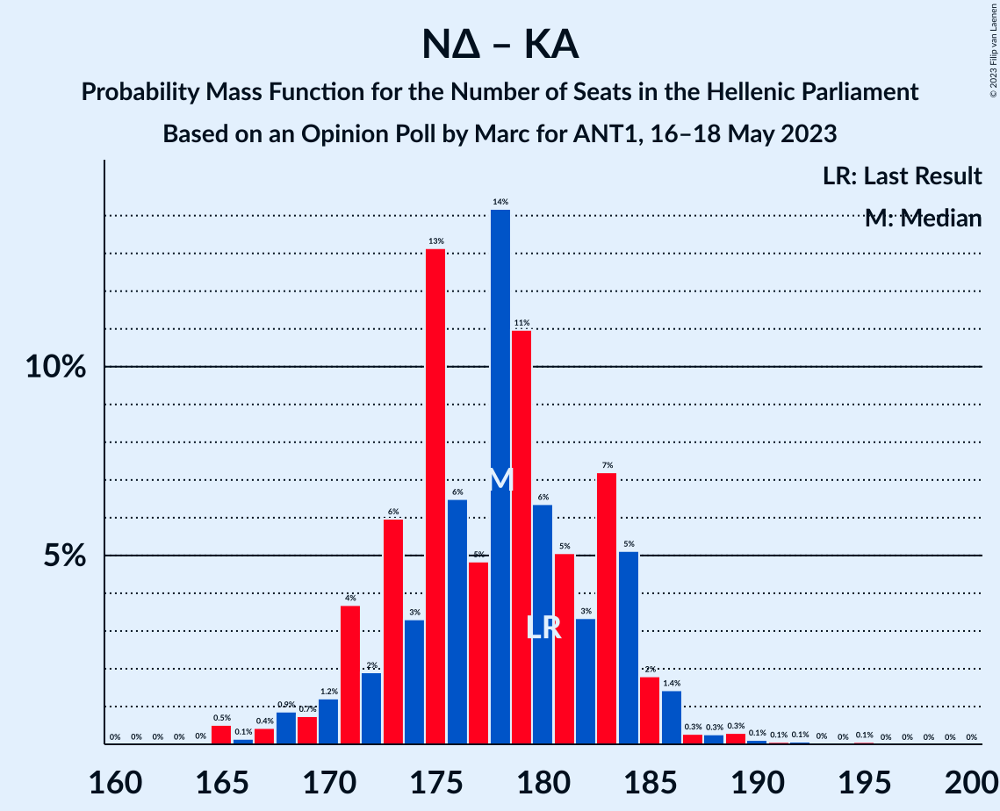

| Number of Seats | Probability | Accumulated | Special Marks |
|:---------------:|:-----------:|:-----------:|:-------------:|
| 162 | 0% | 100% |  |
| 163 | 0% | 99.9% |  |
| 164 | 0% | 99.9% |  |
| 165 | 0.5% | 99.9% |  |
| 166 | 0.1% | 99.4% |  |
| 167 | 0.4% | 99.2% |  |
| 168 | 0.9% | 98.8% |  |
| 169 | 0.7% | 98% |  |
| 170 | 1.2% | 97% |  |
| 171 | 4% | 96% |  |
| 172 | 2% | 92% |  |
| 173 | 6% | 90% |  |
| 174 | 3% | 84% |  |
| 175 | 13% | 81% |  |
| 176 | 6% | 68% |  |
| 177 | 5% | 61% |  |
| 178 | 14% | 57% | Median |
| 179 | 11% | 42% |  |
| 180 | 6% | 31% | Last Result |
| 181 | 5% | 25% |  |
| 182 | 3% | 20% |  |
| 183 | 7% | 17% |  |
| 184 | 5% | 10% |  |
| 185 | 2% | 4% |  |
| 186 | 1.4% | 3% |  |
| 187 | 0.3% | 1.2% |  |
| 188 | 0.3% | 0.9% |  |
| 189 | 0.3% | 0.6% |  |
| 190 | 0.1% | 0.3% |  |
| 191 | 0.1% | 0.2% |  |
| 192 | 0.1% | 0.2% |  |
| 193 | 0% | 0.1% |  |
| 194 | 0% | 0.1% |  |
| 195 | 0.1% | 0.1% |  |
| 196 | 0% | 0% |  |

### Νέα Δημοκρατία

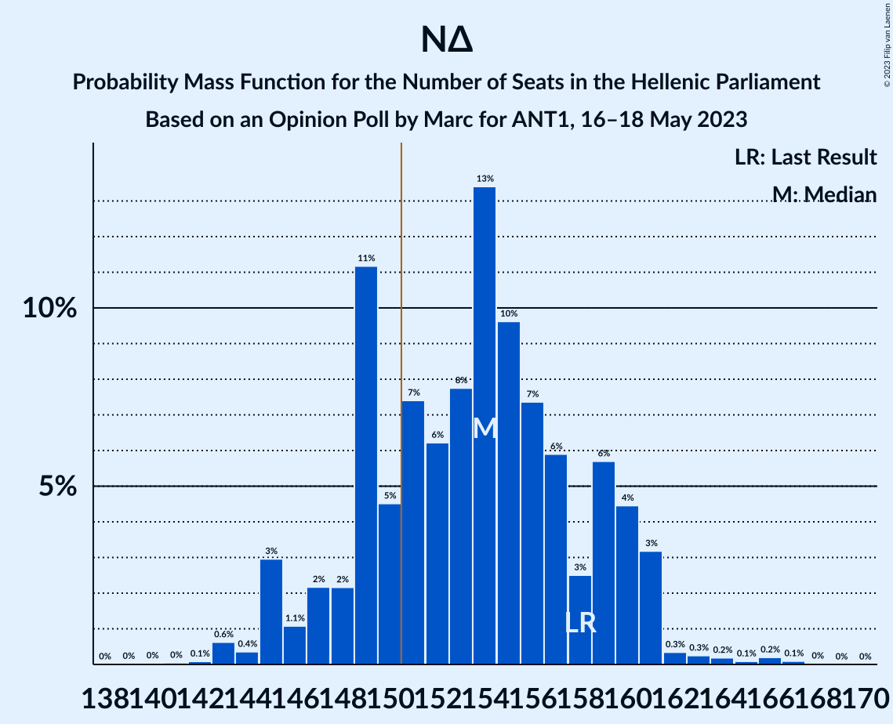

| Number of Seats | Probability | Accumulated | Special Marks |
|:---------------:|:-----------:|:-----------:|:-------------:|
| 139 | 0% | 100% |  |
| 140 | 0% | 99.9% |  |
| 141 | 0% | 99.9% |  |
| 142 | 0.1% | 99.9% |  |
| 143 | 0.6% | 99.8% |  |
| 144 | 0.4% | 99.1% |  |
| 145 | 3% | 98.8% |  |
| 146 | 1.1% | 96% |  |
| 147 | 2% | 95% |  |
| 148 | 2% | 93% |  |
| 149 | 11% | 90% |  |
| 150 | 5% | 79% |  |
| 151 | 7% | 75% | Majority |
| 152 | 6% | 67% |  |
| 153 | 8% | 61% |  |
| 154 | 13% | 53% | Median |
| 155 | 10% | 40% |  |
| 156 | 7% | 30% |  |
| 157 | 6% | 23% |  |
| 158 | 3% | 17% | Last Result |
| 159 | 6% | 15% |  |
| 160 | 4% | 9% |  |
| 161 | 3% | 4% |  |
| 162 | 0.3% | 1.2% |  |
| 163 | 0.3% | 0.9% |  |
| 164 | 0.2% | 0.6% |  |
| 165 | 0.1% | 0.4% |  |
| 166 | 0.2% | 0.3% |  |
| 167 | 0.1% | 0.1% |  |
| 168 | 0% | 0.1% |  |
| 169 | 0% | 0% |  |

### Συνασπισμός Ριζοσπαστικής Αριστεράς – Μέτωπο Ευρωπαϊκής Ρεαλιστικής Ανυπακοής

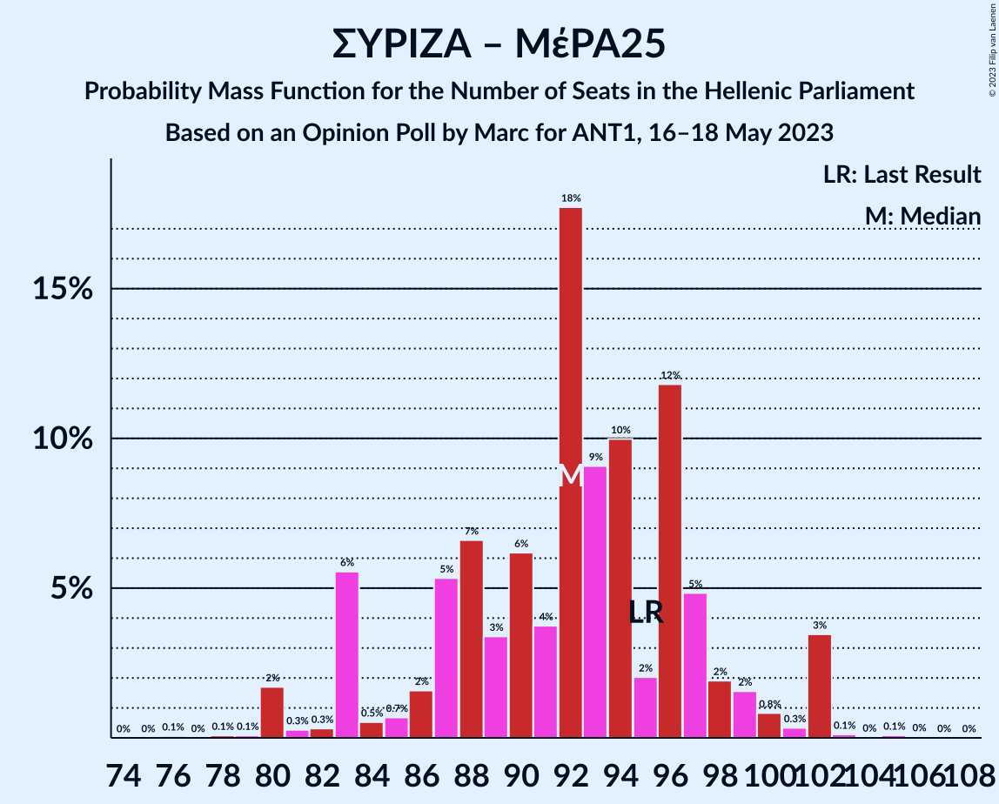

| Number of Seats | Probability | Accumulated | Special Marks |
|:---------------:|:-----------:|:-----------:|:-------------:|
| 76 | 0.1% | 100% |  |
| 77 | 0% | 99.9% |  |
| 78 | 0.1% | 99.9% |  |
| 79 | 0.1% | 99.8% |  |
| 80 | 2% | 99.8% |  |
| 81 | 0.3% | 98% |  |
| 82 | 0.3% | 98% |  |
| 83 | 6% | 97% |  |
| 84 | 0.5% | 92% |  |
| 85 | 0.7% | 91% |  |
| 86 | 2% | 91% |  |
| 87 | 5% | 89% |  |
| 88 | 7% | 84% |  |
| 89 | 3% | 77% |  |
| 90 | 6% | 74% |  |
| 91 | 4% | 68% |  |
| 92 | 18% | 64% | Median |
| 93 | 9% | 46% |  |
| 94 | 10% | 37% |  |
| 95 | 2% | 27% | Last Result |
| 96 | 12% | 25% |  |
| 97 | 5% | 13% |  |
| 98 | 2% | 8% |  |
| 99 | 2% | 6% |  |
| 100 | 0.8% | 5% |  |
| 101 | 0.3% | 4% |  |
| 102 | 3% | 4% |  |
| 103 | 0.1% | 0.3% |  |
| 104 | 0% | 0.2% |  |
| 105 | 0.1% | 0.2% |  |
| 106 | 0% | 0.1% |  |
| 107 | 0% | 0% |  |

### Συνασπισμός Ριζοσπαστικής Αριστεράς

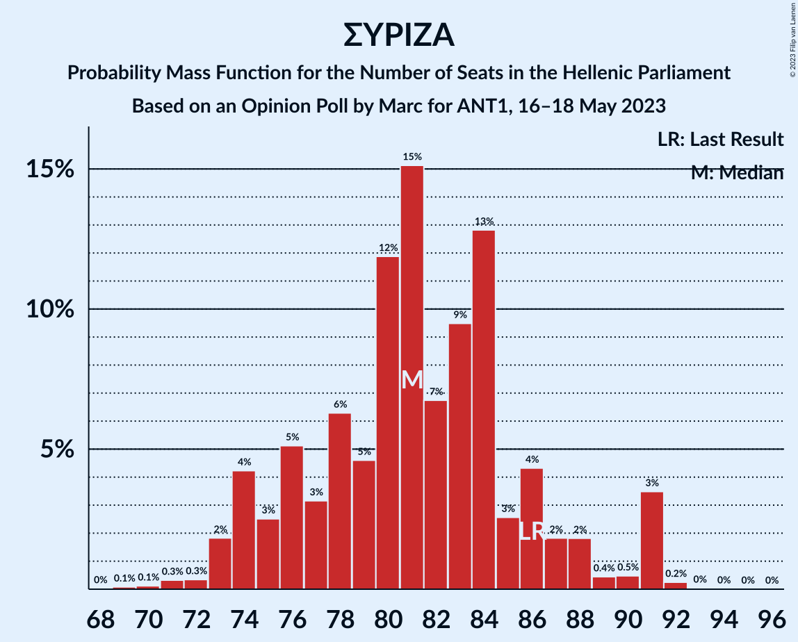

| Number of Seats | Probability | Accumulated | Special Marks |
|:---------------:|:-----------:|:-----------:|:-------------:|
| 69 | 0.1% | 100% |  |
| 70 | 0.1% | 99.9% |  |
| 71 | 0.3% | 99.8% |  |
| 72 | 0.3% | 99.4% |  |
| 73 | 2% | 99.1% |  |
| 74 | 4% | 97% |  |
| 75 | 3% | 93% |  |
| 76 | 5% | 91% |  |
| 77 | 3% | 85% |  |
| 78 | 6% | 82% |  |
| 79 | 5% | 76% |  |
| 80 | 12% | 71% |  |
| 81 | 15% | 59% | Median |
| 82 | 7% | 44% |  |
| 83 | 9% | 38% |  |
| 84 | 13% | 28% |  |
| 85 | 3% | 15% |  |
| 86 | 4% | 13% | Last Result |
| 87 | 2% | 8% |  |
| 88 | 2% | 7% |  |
| 89 | 0.4% | 5% |  |
| 90 | 0.5% | 4% |  |
| 91 | 3% | 4% |  |
| 92 | 0.2% | 0.4% |  |
| 93 | 0% | 0.1% |  |
| 94 | 0% | 0.1% |  |
| 95 | 0% | 0.1% |  |
| 96 | 0% | 0% |  |

## Technical Information

### Opinion Poll

+ **Polling firm:** Marc
+ **Commissioner(s):** ΑΝΤ1
+ **Fieldwork period:** 16–18 May 2023

### Calculations

+ **Sample size:** 1266
+ **Simulations done:** 1,048,576
+ **Error estimate:** 2.59%

