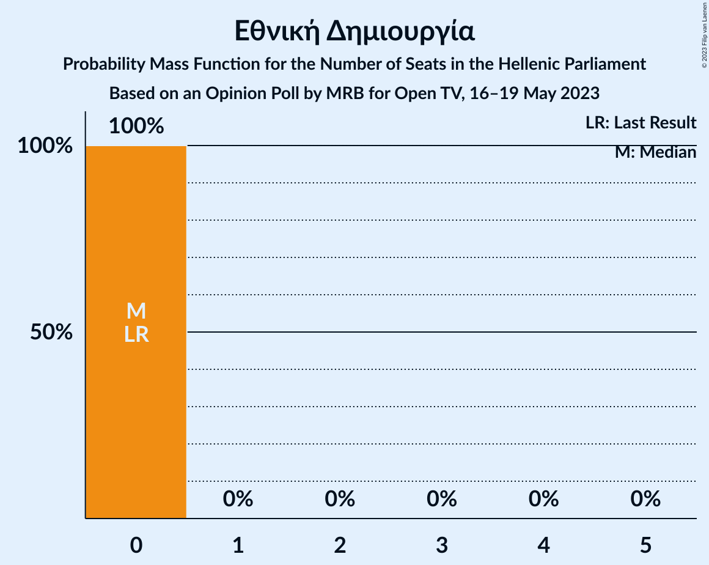

# Opinion Poll by MRB for Open TV, 16–19 May 2023

<a href="#voting-intentions">Voting Intentions</a> | <a href="#seats">Seats</a> | <a href="#coalitions">Coalitions</a> | <a href="#technical-information">Technical Information</a>

## Voting Intentions

### Confidence Intervals

| Party | Last Result | Poll Result | 80% Confidence Interval | 90% Confidence Interval | 95% Confidence Interval | 99% Confidence Interval |
|:-----:|:-----------:|:-----------:|:-----------------------:|:-----------------------:|:-----------------------:|:-----------------------:|
| Νέα Δημοκρατία | 39.8% | 36.1% | 34.3–38.0% |33.7–38.5% |33.3–39.0% |32.4–39.9% |
| Συνασπισμός Ριζοσπαστικής Αριστεράς | 31.5% | 30.3% | 28.5–32.1% |28.0–32.6% |27.6–33.1% |26.8–33.9% |
| Κίνημα Αλλαγής | 8.1% | 9.5% | 8.5–10.8% |8.2–11.1% |7.9–11.4% |7.5–12.0% |
| Κομμουνιστικό Κόμμα Ελλάδας | 5.3% | 6.4% | 5.5–7.4% |5.3–7.7% |5.1–8.0% |4.7–8.5% |
| Ελληνική Λύση | 3.7% | 3.7% | 3.1–4.6% |2.9–4.8% |2.8–5.0% |2.5–5.5% |
| Μέτωπο Ευρωπαϊκής Ρεαλιστικής Ανυπακοής | 3.4% | 3.6% | 3.0–4.5% |2.8–4.7% |2.7–4.9% |2.4–5.3% |
| Δημοκρατικό Πατριωτικό Κίνημα ΝΙΚΗ | 0.0% | 2.6% | 2.1–3.4% |2.0–3.6% |1.8–3.8% |1.6–4.1% |
| Πλεύση Ελευθερίας | 1.5% | 1.7% | 1.3–2.3% |1.2–2.5% |1.1–2.7% |0.9–3.0% |
| Εθνική Δημιουργία | 0.0% | 1.1% | 0.8–1.6% |0.7–1.8% |0.6–1.9% |0.5–2.2% |

*Note:* The poll result column reflects the actual value used in the calculations. Published results may vary slightly, and in addition be rounded to fewer digits.

## Seats

### Confidence Intervals

| Party | Last Result | Median | 80% Confidence Interval | 90% Confidence Interval | 95% Confidence Interval | 99% Confidence Interval |
|:-----:|:-----------:|:------:|:-----------------------:|:-----------------------:|:-----------------------:|:-----------------------:|
| <a href="#νέα-δημοκρατία">Νέα Δημοκρατία</a> | 158 | 150 | 144–155 |143–157 |141–160 |90–162 |
| <a href="#συνασπισμός-ριζοσπαστικής-αριστεράς">Συνασπισμός Ριζοσπαστικής Αριστεράς</a> | 86 | 84 | 78–89 |77–91 |76–92 |74–143 |
| <a href="#κίνημα-αλλαγής">Κίνημα Αλλαγής</a> | 22 | 27 | 23–30 |22–31 |22–32 |21–33 |
| <a href="#κομμουνιστικό-κόμμα-ελλάδας">Κομμουνιστικό Κόμμα Ελλάδας</a> | 15 | 18 | 15–20 |14–21 |14–22 |13–23 |
| <a href="#ελληνική-λύση">Ελληνική Λύση</a> | 10 | 11 | 9–13 |0–13 |0–14 |0–15 |
| <a href="#μέτωπο-ευρωπαϊκής-ρεαλιστικής-ανυπακοής">Μέτωπο Ευρωπαϊκής Ρεαλιστικής Ανυπακοής</a> | 9 | 10 | 9–12 |0–13 |0–14 |0–15 |
| <a href="#δημοκρατικό-πατριωτικό-κίνημα-νικη">Δημοκρατικό Πατριωτικό Κίνημα ΝΙΚΗ</a> | 0 | 0 | 0–9 |0–10 |0–10 |0–11 |
| <a href="#πλεύση-ελευθερίας">Πλεύση Ελευθερίας</a> | 0 | 0 | 0 |0 |0 |0 |
| <a href="#εθνική-δημιουργία">Εθνική Δημιουργία</a> | 0 | 0 | 0 |0 |0 |0 |

### Νέα Δημοκρατία

*For a full overview of the results for this party, see the [Νέα Δημοκρατία](party-νέαδημοκρατία.html) page.*

| Number of Seats | Probability | Accumulated | Special Marks |
|:---------------:|:-----------:|:-----------:|:-------------:|
| 87 | 0.1% | 100% |  |
| 88 | 0% | 99.9% |  |
| 89 | 0.1% | 99.8% |  |
| 90 | 0.3% | 99.8% |  |
| 91 | 0% | 99.5% |  |
| 92 | 0% | 99.5% |  |
| 93 | 0.1% | 99.4% |  |
| 94 | 0.1% | 99.3% |  |
| 95 | 0% | 99.2% |  |
| 96 | 0.1% | 99.2% |  |
| 97 | 0% | 99.2% |  |
| 98 | 0.1% | 99.1% |  |
| 99 | 0% | 99.1% |  |
| 100 | 0% | 99.1% |  |
| 101 | 0% | 99.1% |  |
| 102 | 0% | 99.1% |  |
| 103 | 0% | 99.1% |  |
| 104 | 0% | 99.1% |  |
| 105 | 0% | 99.1% |  |
| 106 | 0% | 99.1% |  |
| 107 | 0% | 99.1% |  |
| 108 | 0% | 99.1% |  |
| 109 | 0% | 99.1% |  |
| 110 | 0% | 99.1% |  |
| 111 | 0% | 99.1% |  |
| 112 | 0% | 99.1% |  |
| 113 | 0% | 99.1% |  |
| 114 | 0% | 99.1% |  |
| 115 | 0% | 99.1% |  |
| 116 | 0% | 99.1% |  |
| 117 | 0% | 99.1% |  |
| 118 | 0% | 99.1% |  |
| 119 | 0% | 99.1% |  |
| 120 | 0% | 99.1% |  |
| 121 | 0% | 99.1% |  |
| 122 | 0% | 99.1% |  |
| 123 | 0% | 99.1% |  |
| 124 | 0% | 99.1% |  |
| 125 | 0% | 99.1% |  |
| 126 | 0% | 99.1% |  |
| 127 | 0% | 99.1% |  |
| 128 | 0% | 99.1% |  |
| 129 | 0% | 99.1% |  |
| 130 | 0% | 99.1% |  |
| 131 | 0% | 99.1% |  |
| 132 | 0% | 99.1% |  |
| 133 | 0% | 99.1% |  |
| 134 | 0% | 99.1% |  |
| 135 | 0% | 99.1% |  |
| 136 | 0% | 99.1% |  |
| 137 | 0.2% | 99.1% |  |
| 138 | 0.2% | 98.9% |  |
| 139 | 0.2% | 98.7% |  |
| 140 | 0.7% | 98.6% |  |
| 141 | 1.1% | 98% |  |
| 142 | 0.7% | 97% |  |
| 143 | 5% | 96% |  |
| 144 | 2% | 90% |  |
| 145 | 2% | 88% |  |
| 146 | 6% | 86% |  |
| 147 | 7% | 80% |  |
| 148 | 8% | 73% |  |
| 149 | 12% | 65% |  |
| 150 | 12% | 52% | Median |
| 151 | 5% | 40% | Majority |
| 152 | 4% | 35% |  |
| 153 | 6% | 31% |  |
| 154 | 9% | 25% |  |
| 155 | 6% | 15% |  |
| 156 | 3% | 10% |  |
| 157 | 2% | 7% |  |
| 158 | 1.1% | 5% | Last Result |
| 159 | 0.5% | 4% |  |
| 160 | 1.2% | 3% |  |
| 161 | 1.4% | 2% |  |
| 162 | 0.1% | 0.6% |  |
| 163 | 0.3% | 0.5% |  |
| 164 | 0% | 0.2% |  |
| 165 | 0% | 0.1% |  |
| 166 | 0% | 0.1% |  |
| 167 | 0% | 0.1% |  |
| 168 | 0% | 0% |  |

### Συνασπισμός Ριζοσπαστικής Αριστεράς

*For a full overview of the results for this party, see the [Συνασπισμός Ριζοσπαστικής Αριστεράς](party-συνασπισμόςριζοσπαστικήςαριστεράς.html) page.*

| Number of Seats | Probability | Accumulated | Special Marks |
|:---------------:|:-----------:|:-----------:|:-------------:|
| 71 | 0% | 100% |  |
| 72 | 0.2% | 99.9% |  |
| 73 | 0.2% | 99.7% |  |
| 74 | 0.3% | 99.5% |  |
| 75 | 1.3% | 99.2% |  |
| 76 | 2% | 98% |  |
| 77 | 3% | 96% |  |
| 78 | 6% | 94% |  |
| 79 | 3% | 87% |  |
| 80 | 4% | 85% |  |
| 81 | 7% | 81% |  |
| 82 | 9% | 74% |  |
| 83 | 11% | 65% |  |
| 84 | 10% | 54% | Median |
| 85 | 10% | 44% |  |
| 86 | 4% | 34% | Last Result |
| 87 | 8% | 30% |  |
| 88 | 10% | 22% |  |
| 89 | 4% | 12% |  |
| 90 | 2% | 8% |  |
| 91 | 1.2% | 6% |  |
| 92 | 2% | 4% |  |
| 93 | 0.8% | 2% |  |
| 94 | 0.2% | 2% |  |
| 95 | 0.2% | 1.4% |  |
| 96 | 0.1% | 1.2% |  |
| 97 | 0% | 1.0% |  |
| 98 | 0.1% | 1.0% |  |
| 99 | 0% | 1.0% |  |
| 100 | 0% | 0.9% |  |
| 101 | 0% | 0.9% |  |
| 102 | 0% | 0.9% |  |
| 103 | 0% | 0.9% |  |
| 104 | 0% | 0.9% |  |
| 105 | 0% | 0.9% |  |
| 106 | 0% | 0.9% |  |
| 107 | 0% | 0.9% |  |
| 108 | 0% | 0.9% |  |
| 109 | 0% | 0.9% |  |
| 110 | 0% | 0.9% |  |
| 111 | 0% | 0.9% |  |
| 112 | 0% | 0.9% |  |
| 113 | 0% | 0.9% |  |
| 114 | 0% | 0.9% |  |
| 115 | 0% | 0.9% |  |
| 116 | 0% | 0.9% |  |
| 117 | 0% | 0.9% |  |
| 118 | 0% | 0.9% |  |
| 119 | 0% | 0.9% |  |
| 120 | 0% | 0.9% |  |
| 121 | 0% | 0.9% |  |
| 122 | 0% | 0.9% |  |
| 123 | 0% | 0.9% |  |
| 124 | 0% | 0.9% |  |
| 125 | 0% | 0.9% |  |
| 126 | 0% | 0.9% |  |
| 127 | 0% | 0.9% |  |
| 128 | 0% | 0.9% |  |
| 129 | 0% | 0.9% |  |
| 130 | 0% | 0.9% |  |
| 131 | 0% | 0.9% |  |
| 132 | 0% | 0.9% |  |
| 133 | 0% | 0.9% |  |
| 134 | 0% | 0.9% |  |
| 135 | 0% | 0.9% |  |
| 136 | 0% | 0.9% |  |
| 137 | 0% | 0.9% |  |
| 138 | 0% | 0.9% |  |
| 139 | 0.1% | 0.9% |  |
| 140 | 0.1% | 0.8% |  |
| 141 | 0% | 0.7% |  |
| 142 | 0% | 0.7% |  |
| 143 | 0.2% | 0.7% |  |
| 144 | 0.2% | 0.5% |  |
| 145 | 0% | 0.3% |  |
| 146 | 0.1% | 0.3% |  |
| 147 | 0% | 0.2% |  |
| 148 | 0.1% | 0.1% |  |
| 149 | 0.1% | 0.1% |  |
| 150 | 0% | 0% |  |

### Κίνημα Αλλαγής

*For a full overview of the results for this party, see the [Κίνημα Αλλαγής](party-κίνημααλλαγής.html) page.*

| Number of Seats | Probability | Accumulated | Special Marks |
|:---------------:|:-----------:|:-----------:|:-------------:|
| 19 | 0.1% | 100% |  |
| 20 | 0.2% | 99.9% |  |
| 21 | 0.7% | 99.7% |  |
| 22 | 5% | 98.9% | Last Result |
| 23 | 6% | 94% |  |
| 24 | 11% | 88% |  |
| 25 | 7% | 77% |  |
| 26 | 14% | 70% |  |
| 27 | 24% | 56% | Median |
| 28 | 14% | 33% |  |
| 29 | 6% | 18% |  |
| 30 | 7% | 12% |  |
| 31 | 2% | 5% |  |
| 32 | 2% | 3% |  |
| 33 | 0.7% | 1.1% |  |
| 34 | 0.2% | 0.4% |  |
| 35 | 0.1% | 0.2% |  |
| 36 | 0% | 0.1% |  |
| 37 | 0% | 0% |  |

### Κομμουνιστικό Κόμμα Ελλάδας

*For a full overview of the results for this party, see the [Κομμουνιστικό Κόμμα Ελλάδας](party-κομμουνιστικόκόμμαελλάδας.html) page.*

| Number of Seats | Probability | Accumulated | Special Marks |
|:---------------:|:-----------:|:-----------:|:-------------:|
| 12 | 0.1% | 100% |  |
| 13 | 0.7% | 99.8% |  |
| 14 | 4% | 99.1% |  |
| 15 | 13% | 95% | Last Result |
| 16 | 17% | 82% |  |
| 17 | 10% | 64% |  |
| 18 | 22% | 55% | Median |
| 19 | 15% | 33% |  |
| 20 | 10% | 18% |  |
| 21 | 4% | 7% |  |
| 22 | 2% | 3% |  |
| 23 | 0.8% | 1.3% |  |
| 24 | 0.3% | 0.5% |  |
| 25 | 0.1% | 0.1% |  |
| 26 | 0% | 0% |  |

### Ελληνική Λύση

*For a full overview of the results for this party, see the [Ελληνική Λύση](party-ελληνικήλύση.html) page.*

| Number of Seats | Probability | Accumulated | Special Marks |
|:---------------:|:-----------:|:-----------:|:-------------:|
| 0 | 7% | 100% |  |
| 1 | 0% | 93% |  |
| 2 | 0% | 93% |  |
| 3 | 0% | 93% |  |
| 4 | 0% | 93% |  |
| 5 | 0% | 93% |  |
| 6 | 0% | 93% |  |
| 7 | 0% | 93% |  |
| 8 | 2% | 93% |  |
| 9 | 22% | 91% |  |
| 10 | 15% | 69% | Last Result |
| 11 | 34% | 54% | Median |
| 12 | 8% | 20% |  |
| 13 | 8% | 12% |  |
| 14 | 3% | 4% |  |
| 15 | 0.9% | 1.1% |  |
| 16 | 0.1% | 0.2% |  |
| 17 | 0.1% | 0.1% |  |
| 18 | 0% | 0% |  |

### Μέτωπο Ευρωπαϊκής Ρεαλιστικής Ανυπακοής

*For a full overview of the results for this party, see the [Μέτωπο Ευρωπαϊκής Ρεαλιστικής Ανυπακοής](party-μέτωποευρωπαϊκήςρεαλιστικήςανυπακοής.html) page.*

| Number of Seats | Probability | Accumulated | Special Marks |
|:---------------:|:-----------:|:-----------:|:-------------:|
| 0 | 8% | 100% |  |
| 1 | 0% | 92% |  |
| 2 | 0% | 92% |  |
| 3 | 0% | 92% |  |
| 4 | 0% | 92% |  |
| 5 | 0% | 92% |  |
| 6 | 0% | 92% |  |
| 7 | 0% | 92% |  |
| 8 | 1.3% | 92% |  |
| 9 | 26% | 90% | Last Result |
| 10 | 24% | 65% | Median |
| 11 | 18% | 41% |  |
| 12 | 14% | 23% |  |
| 13 | 6% | 8% |  |
| 14 | 2% | 3% |  |
| 15 | 0.6% | 0.9% |  |
| 16 | 0.3% | 0.3% |  |
| 17 | 0% | 0% |  |

### Δημοκρατικό Πατριωτικό Κίνημα ΝΙΚΗ

*For a full overview of the results for this party, see the [Δημοκρατικό Πατριωτικό Κίνημα ΝΙΚΗ](party-δημοκρατικόπατριωτικόκίνημανικη.html) page.*

| Number of Seats | Probability | Accumulated | Special Marks |
|:---------------:|:-----------:|:-----------:|:-------------:|
| 0 | 75% | 100% | Last Result, Median |
| 1 | 0% | 25% |  |
| 2 | 0% | 25% |  |
| 3 | 0% | 25% |  |
| 4 | 0% | 25% |  |
| 5 | 0% | 25% |  |
| 6 | 0% | 25% |  |
| 7 | 0% | 25% |  |
| 8 | 6% | 25% |  |
| 9 | 12% | 18% |  |
| 10 | 5% | 6% |  |
| 11 | 1.1% | 1.4% |  |
| 12 | 0.2% | 0.3% |  |
| 13 | 0% | 0.1% |  |
| 14 | 0% | 0% |  |

### Πλεύση Ελευθερίας

*For a full overview of the results for this party, see the [Πλεύση Ελευθερίας](party-πλεύσηελευθερίας.html) page.*

| Number of Seats | Probability | Accumulated | Special Marks |
|:---------------:|:-----------:|:-----------:|:-------------:|
| 0 | 99.6% | 100% | Last Result, Median |
| 1 | 0% | 0.4% |  |
| 2 | 0% | 0.4% |  |
| 3 | 0% | 0.4% |  |
| 4 | 0% | 0.4% |  |
| 5 | 0% | 0.4% |  |
| 6 | 0% | 0.4% |  |
| 7 | 0% | 0.4% |  |
| 8 | 0.1% | 0.4% |  |
| 9 | 0.2% | 0.3% |  |
| 10 | 0% | 0% |  |

### Εθνική Δημιουργία

*For a full overview of the results for this party, see the [Εθνική Δημιουργία](party-εθνικήδημιουργία.html) page.*

| Number of Seats | Probability | Accumulated | Special Marks |
|:---------------:|:-----------:|:-----------:|:-------------:|
| 0 | 100% | 100% | Last Result, Median |

## Coalitions

### Confidence Intervals

| Coalition | Last Result | Median | Majority? | 80% Confidence Interval | 90% Confidence Interval | 95% Confidence Interval | 99% Confidence Interval |
|:---------:|:-----------:|:------:|:---------:|:-----------------------:|:-----------------------:|:-----------------------:|:-----------------------:|
| Νέα Δημοκρατία – Κίνημα Αλλαγής | 180 | 176 | 99.1% | 170–183 | 169–185 | 167–189 | 117–190 |
| Νέα Δημοκρατία | 158 | 150 | 40% | 144–155 | 143–157 | 141–160 | 90–162 |
| Συνασπισμός Ριζοσπαστικής Αριστεράς – Μέτωπο Ευρωπαϊκής Ρεαλιστικής Ανυπακοής | 95 | 94 | 0.8% | 87–99 | 86–101 | 84–102 | 81–153 |
| Συνασπισμός Ριζοσπαστικής Αριστεράς | 86 | 84 | 0% | 78–89 | 77–91 | 76–92 | 74–143 |

### Νέα Δημοκρατία – Κίνημα Αλλαγής

| Number of Seats | Probability | Accumulated | Special Marks |
|:---------------:|:-----------:|:-----------:|:-------------:|
| 112 | 0% | 100% |  |
| 113 | 0% | 99.9% |  |
| 114 | 0.1% | 99.9% |  |
| 115 | 0% | 99.8% |  |
| 116 | 0.1% | 99.8% |  |
| 117 | 0.3% | 99.8% |  |
| 118 | 0.1% | 99.4% |  |
| 119 | 0.1% | 99.3% |  |
| 120 | 0% | 99.3% |  |
| 121 | 0% | 99.2% |  |
| 122 | 0% | 99.2% |  |
| 123 | 0% | 99.2% |  |
| 124 | 0% | 99.1% |  |
| 125 | 0.1% | 99.1% |  |
| 126 | 0% | 99.1% |  |
| 127 | 0% | 99.1% |  |
| 128 | 0% | 99.1% |  |
| 129 | 0% | 99.1% |  |
| 130 | 0% | 99.1% |  |
| 131 | 0% | 99.1% |  |
| 132 | 0% | 99.1% |  |
| 133 | 0% | 99.1% |  |
| 134 | 0% | 99.1% |  |
| 135 | 0% | 99.1% |  |
| 136 | 0% | 99.1% |  |
| 137 | 0% | 99.1% |  |
| 138 | 0% | 99.1% |  |
| 139 | 0% | 99.1% |  |
| 140 | 0% | 99.1% |  |
| 141 | 0% | 99.1% |  |
| 142 | 0% | 99.1% |  |
| 143 | 0% | 99.1% |  |
| 144 | 0% | 99.1% |  |
| 145 | 0% | 99.1% |  |
| 146 | 0% | 99.1% |  |
| 147 | 0% | 99.1% |  |
| 148 | 0% | 99.1% |  |
| 149 | 0% | 99.1% |  |
| 150 | 0% | 99.1% |  |
| 151 | 0% | 99.1% | Majority |
| 152 | 0% | 99.1% |  |
| 153 | 0% | 99.1% |  |
| 154 | 0% | 99.1% |  |
| 155 | 0% | 99.1% |  |
| 156 | 0% | 99.1% |  |
| 157 | 0% | 99.1% |  |
| 158 | 0% | 99.1% |  |
| 159 | 0% | 99.1% |  |
| 160 | 0% | 99.1% |  |
| 161 | 0% | 99.1% |  |
| 162 | 0% | 99.0% |  |
| 163 | 0.2% | 99.0% |  |
| 164 | 0.4% | 98.8% |  |
| 165 | 0.4% | 98% |  |
| 166 | 0.3% | 98% |  |
| 167 | 0.9% | 98% |  |
| 168 | 1.3% | 97% |  |
| 169 | 3% | 96% |  |
| 170 | 3% | 93% |  |
| 171 | 4% | 89% |  |
| 172 | 6% | 85% |  |
| 173 | 4% | 79% |  |
| 174 | 4% | 75% |  |
| 175 | 6% | 71% |  |
| 176 | 19% | 65% |  |
| 177 | 8% | 46% | Median |
| 178 | 5% | 38% |  |
| 179 | 6% | 34% |  |
| 180 | 10% | 28% | Last Result |
| 181 | 4% | 18% |  |
| 182 | 4% | 14% |  |
| 183 | 2% | 10% |  |
| 184 | 3% | 8% |  |
| 185 | 1.1% | 5% |  |
| 186 | 0.8% | 4% |  |
| 187 | 0.6% | 3% |  |
| 188 | 0.2% | 3% |  |
| 189 | 1.3% | 3% |  |
| 190 | 0.8% | 1.2% |  |
| 191 | 0.2% | 0.4% |  |
| 192 | 0% | 0.2% |  |
| 193 | 0.1% | 0.2% |  |
| 194 | 0% | 0.1% |  |
| 195 | 0% | 0% |  |

### Νέα Δημοκρατία

| Number of Seats | Probability | Accumulated | Special Marks |
|:---------------:|:-----------:|:-----------:|:-------------:|
| 87 | 0.1% | 100% |  |
| 88 | 0% | 99.9% |  |
| 89 | 0.1% | 99.8% |  |
| 90 | 0.3% | 99.8% |  |
| 91 | 0% | 99.5% |  |
| 92 | 0% | 99.5% |  |
| 93 | 0.1% | 99.4% |  |
| 94 | 0.1% | 99.3% |  |
| 95 | 0% | 99.2% |  |
| 96 | 0.1% | 99.2% |  |
| 97 | 0% | 99.2% |  |
| 98 | 0.1% | 99.1% |  |
| 99 | 0% | 99.1% |  |
| 100 | 0% | 99.1% |  |
| 101 | 0% | 99.1% |  |
| 102 | 0% | 99.1% |  |
| 103 | 0% | 99.1% |  |
| 104 | 0% | 99.1% |  |
| 105 | 0% | 99.1% |  |
| 106 | 0% | 99.1% |  |
| 107 | 0% | 99.1% |  |
| 108 | 0% | 99.1% |  |
| 109 | 0% | 99.1% |  |
| 110 | 0% | 99.1% |  |
| 111 | 0% | 99.1% |  |
| 112 | 0% | 99.1% |  |
| 113 | 0% | 99.1% |  |
| 114 | 0% | 99.1% |  |
| 115 | 0% | 99.1% |  |
| 116 | 0% | 99.1% |  |
| 117 | 0% | 99.1% |  |
| 118 | 0% | 99.1% |  |
| 119 | 0% | 99.1% |  |
| 120 | 0% | 99.1% |  |
| 121 | 0% | 99.1% |  |
| 122 | 0% | 99.1% |  |
| 123 | 0% | 99.1% |  |
| 124 | 0% | 99.1% |  |
| 125 | 0% | 99.1% |  |
| 126 | 0% | 99.1% |  |
| 127 | 0% | 99.1% |  |
| 128 | 0% | 99.1% |  |
| 129 | 0% | 99.1% |  |
| 130 | 0% | 99.1% |  |
| 131 | 0% | 99.1% |  |
| 132 | 0% | 99.1% |  |
| 133 | 0% | 99.1% |  |
| 134 | 0% | 99.1% |  |
| 135 | 0% | 99.1% |  |
| 136 | 0% | 99.1% |  |
| 137 | 0.2% | 99.1% |  |
| 138 | 0.2% | 98.9% |  |
| 139 | 0.2% | 98.7% |  |
| 140 | 0.7% | 98.6% |  |
| 141 | 1.1% | 98% |  |
| 142 | 0.7% | 97% |  |
| 143 | 5% | 96% |  |
| 144 | 2% | 90% |  |
| 145 | 2% | 88% |  |
| 146 | 6% | 86% |  |
| 147 | 7% | 80% |  |
| 148 | 8% | 73% |  |
| 149 | 12% | 65% |  |
| 150 | 12% | 52% | Median |
| 151 | 5% | 40% | Majority |
| 152 | 4% | 35% |  |
| 153 | 6% | 31% |  |
| 154 | 9% | 25% |  |
| 155 | 6% | 15% |  |
| 156 | 3% | 10% |  |
| 157 | 2% | 7% |  |
| 158 | 1.1% | 5% | Last Result |
| 159 | 0.5% | 4% |  |
| 160 | 1.2% | 3% |  |
| 161 | 1.4% | 2% |  |
| 162 | 0.1% | 0.6% |  |
| 163 | 0.3% | 0.5% |  |
| 164 | 0% | 0.2% |  |
| 165 | 0% | 0.1% |  |
| 166 | 0% | 0.1% |  |
| 167 | 0% | 0.1% |  |
| 168 | 0% | 0% |  |

### Συνασπισμός Ριζοσπαστικής Αριστεράς – Μέτωπο Ευρωπαϊκής Ρεαλιστικής Ανυπακοής

| Number of Seats | Probability | Accumulated | Special Marks |
|:---------------:|:-----------:|:-----------:|:-------------:|
| 76 | 0% | 100% |  |
| 77 | 0% | 99.9% |  |
| 78 | 0.1% | 99.9% |  |
| 79 | 0.1% | 99.8% |  |
| 80 | 0.1% | 99.7% |  |
| 81 | 0.4% | 99.5% |  |
| 82 | 1.1% | 99.2% |  |
| 83 | 0.5% | 98% |  |
| 84 | 0.8% | 98% |  |
| 85 | 1.5% | 97% |  |
| 86 | 2% | 95% |  |
| 87 | 5% | 94% |  |
| 88 | 3% | 89% |  |
| 89 | 4% | 85% |  |
| 90 | 4% | 81% |  |
| 91 | 5% | 78% |  |
| 92 | 9% | 73% |  |
| 93 | 13% | 64% |  |
| 94 | 7% | 51% | Median |
| 95 | 12% | 44% | Last Result |
| 96 | 6% | 31% |  |
| 97 | 4% | 25% |  |
| 98 | 6% | 21% |  |
| 99 | 5% | 15% |  |
| 100 | 4% | 10% |  |
| 101 | 1.3% | 5% |  |
| 102 | 2% | 4% |  |
| 103 | 0.4% | 2% |  |
| 104 | 0.6% | 2% |  |
| 105 | 0.2% | 1.2% |  |
| 106 | 0.1% | 1.1% |  |
| 107 | 0% | 1.0% |  |
| 108 | 0% | 1.0% |  |
| 109 | 0% | 0.9% |  |
| 110 | 0% | 0.9% |  |
| 111 | 0% | 0.9% |  |
| 112 | 0% | 0.9% |  |
| 113 | 0% | 0.9% |  |
| 114 | 0% | 0.9% |  |
| 115 | 0% | 0.9% |  |
| 116 | 0% | 0.9% |  |
| 117 | 0% | 0.9% |  |
| 118 | 0% | 0.9% |  |
| 119 | 0% | 0.9% |  |
| 120 | 0% | 0.9% |  |
| 121 | 0% | 0.9% |  |
| 122 | 0% | 0.9% |  |
| 123 | 0% | 0.9% |  |
| 124 | 0% | 0.9% |  |
| 125 | 0% | 0.9% |  |
| 126 | 0% | 0.9% |  |
| 127 | 0% | 0.9% |  |
| 128 | 0% | 0.9% |  |
| 129 | 0% | 0.9% |  |
| 130 | 0% | 0.9% |  |
| 131 | 0% | 0.9% |  |
| 132 | 0% | 0.9% |  |
| 133 | 0% | 0.9% |  |
| 134 | 0% | 0.9% |  |
| 135 | 0% | 0.9% |  |
| 136 | 0% | 0.9% |  |
| 137 | 0% | 0.9% |  |
| 138 | 0% | 0.9% |  |
| 139 | 0% | 0.9% |  |
| 140 | 0% | 0.9% |  |
| 141 | 0% | 0.9% |  |
| 142 | 0% | 0.9% |  |
| 143 | 0% | 0.9% |  |
| 144 | 0% | 0.9% |  |
| 145 | 0% | 0.9% |  |
| 146 | 0% | 0.9% |  |
| 147 | 0% | 0.9% |  |
| 148 | 0.1% | 0.9% |  |
| 149 | 0% | 0.8% |  |
| 150 | 0% | 0.8% |  |
| 151 | 0.1% | 0.8% | Majority |
| 152 | 0.1% | 0.7% |  |
| 153 | 0.1% | 0.6% |  |
| 154 | 0.2% | 0.5% |  |
| 155 | 0% | 0.3% |  |
| 156 | 0.1% | 0.2% |  |
| 157 | 0% | 0.2% |  |
| 158 | 0.1% | 0.1% |  |
| 159 | 0% | 0% |  |

### Συνασπισμός Ριζοσπαστικής Αριστεράς

| Number of Seats | Probability | Accumulated | Special Marks |
|:---------------:|:-----------:|:-----------:|:-------------:|
| 71 | 0% | 100% |  |
| 72 | 0.2% | 99.9% |  |
| 73 | 0.2% | 99.7% |  |
| 74 | 0.3% | 99.5% |  |
| 75 | 1.3% | 99.2% |  |
| 76 | 2% | 98% |  |
| 77 | 3% | 96% |  |
| 78 | 6% | 94% |  |
| 79 | 3% | 87% |  |
| 80 | 4% | 85% |  |
| 81 | 7% | 81% |  |
| 82 | 9% | 74% |  |
| 83 | 11% | 65% |  |
| 84 | 10% | 54% | Median |
| 85 | 10% | 44% |  |
| 86 | 4% | 34% | Last Result |
| 87 | 8% | 30% |  |
| 88 | 10% | 22% |  |
| 89 | 4% | 12% |  |
| 90 | 2% | 8% |  |
| 91 | 1.2% | 6% |  |
| 92 | 2% | 4% |  |
| 93 | 0.8% | 2% |  |
| 94 | 0.2% | 2% |  |
| 95 | 0.2% | 1.4% |  |
| 96 | 0.1% | 1.2% |  |
| 97 | 0% | 1.0% |  |
| 98 | 0.1% | 1.0% |  |
| 99 | 0% | 1.0% |  |
| 100 | 0% | 0.9% |  |
| 101 | 0% | 0.9% |  |
| 102 | 0% | 0.9% |  |
| 103 | 0% | 0.9% |  |
| 104 | 0% | 0.9% |  |
| 105 | 0% | 0.9% |  |
| 106 | 0% | 0.9% |  |
| 107 | 0% | 0.9% |  |
| 108 | 0% | 0.9% |  |
| 109 | 0% | 0.9% |  |
| 110 | 0% | 0.9% |  |
| 111 | 0% | 0.9% |  |
| 112 | 0% | 0.9% |  |
| 113 | 0% | 0.9% |  |
| 114 | 0% | 0.9% |  |
| 115 | 0% | 0.9% |  |
| 116 | 0% | 0.9% |  |
| 117 | 0% | 0.9% |  |
| 118 | 0% | 0.9% |  |
| 119 | 0% | 0.9% |  |
| 120 | 0% | 0.9% |  |
| 121 | 0% | 0.9% |  |
| 122 | 0% | 0.9% |  |
| 123 | 0% | 0.9% |  |
| 124 | 0% | 0.9% |  |
| 125 | 0% | 0.9% |  |
| 126 | 0% | 0.9% |  |
| 127 | 0% | 0.9% |  |
| 128 | 0% | 0.9% |  |
| 129 | 0% | 0.9% |  |
| 130 | 0% | 0.9% |  |
| 131 | 0% | 0.9% |  |
| 132 | 0% | 0.9% |  |
| 133 | 0% | 0.9% |  |
| 134 | 0% | 0.9% |  |
| 135 | 0% | 0.9% |  |
| 136 | 0% | 0.9% |  |
| 137 | 0% | 0.9% |  |
| 138 | 0% | 0.9% |  |
| 139 | 0.1% | 0.9% |  |
| 140 | 0.1% | 0.8% |  |
| 141 | 0% | 0.7% |  |
| 142 | 0% | 0.7% |  |
| 143 | 0.2% | 0.7% |  |
| 144 | 0.2% | 0.5% |  |
| 145 | 0% | 0.3% |  |
| 146 | 0.1% | 0.3% |  |
| 147 | 0% | 0.2% |  |
| 148 | 0.1% | 0.1% |  |
| 149 | 0.1% | 0.1% |  |
| 150 | 0% | 0% |  |

## Technical Information

### Opinion Poll

+ **Polling firm:** MRB
+ **Commissioner(s):** Open TV
+ **Fieldwork period:** 16–19 May 2023

### Calculations

+ **Sample size:** 1100
+ **Simulations done:** 1,048,576
+ **Error estimate:** 2.09%

