# Opinion Poll by Pulse RC for ΣΚΑΪ, 14–19 May 2023

<a href="#voting-intentions">Voting Intentions</a> | <a href="#seats">Seats</a> | <a href="#coalitions">Coalitions</a> | <a href="#technical-information">Technical Information</a>

## Voting Intentions

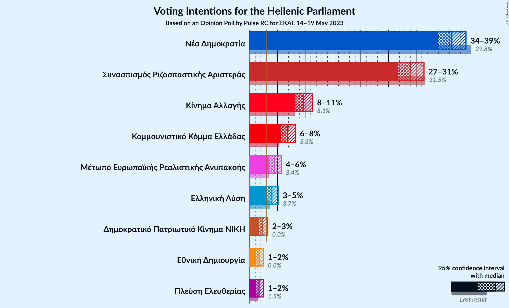

### Confidence Intervals

| Party | Last Result | Poll Result | 80% Confidence Interval | 90% Confidence Interval | 95% Confidence Interval | 99% Confidence Interval |
|:-----:|:-----------:|:-----------:|:-----------------------:|:-----------------------:|:-----------------------:|:-----------------------:|
| Νέα Δημοκρατία | 39.8% | 36.4% | 34.8–38.1% |34.4–38.5% |34.0–39.0% |33.2–39.8% |
| Συνασπισμός Ριζοσπαστικής Αριστεράς | 31.5% | 29.0% | 27.5–30.6% |27.0–31.0% |26.7–31.4% |26.0–32.2% |
| Κίνημα Αλλαγής | 8.1% | 9.7% | 8.7–10.8% |8.5–11.1% |8.2–11.3% |7.8–11.9% |
| Κομμουνιστικό Κόμμα Ελλάδας | 5.3% | 6.8% | 6.0–7.7% |5.8–8.0% |5.6–8.2% |5.3–8.7% |
| Μέτωπο Ευρωπαϊκής Ρεαλιστικής Ανυπακοής | 3.4% | 4.5% | 3.9–5.3% |3.7–5.5% |3.5–5.7% |3.2–6.1% |
| Ελληνική Λύση | 3.7% | 4.0% | 3.4–4.8% |3.2–5.0% |3.1–5.2% |2.8–5.5% |
| Δημοκρατικό Πατριωτικό Κίνημα ΝΙΚΗ | 0.0% | 2.3% | 1.9–2.9% |1.8–3.1% |1.6–3.2% |1.5–3.6% |
| Πλεύση Ελευθερίας | 1.5% | 1.7% | 1.3–2.2% |1.2–2.4% |1.1–2.5% |1.0–2.8% |
| Εθνική Δημιουργία | 0.0% | 1.7% | 1.3–2.2% |1.2–2.4% |1.1–2.5% |1.0–2.8% |

*Note:* The poll result column reflects the actual value used in the calculations. Published results may vary slightly, and in addition be rounded to fewer digits.

## Seats

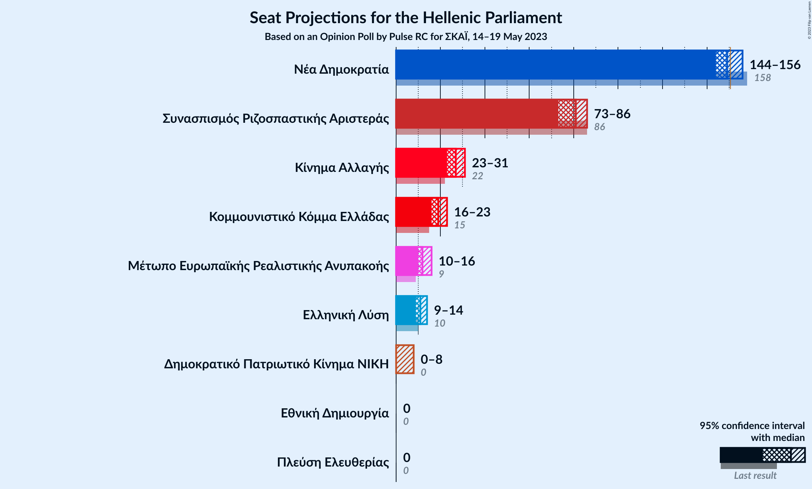

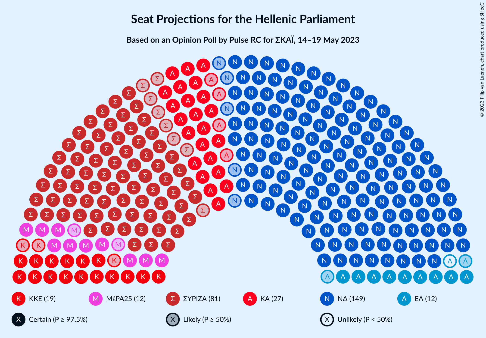

### Confidence Intervals

| Party | Last Result | Median | 80% Confidence Interval | 90% Confidence Interval | 95% Confidence Interval | 99% Confidence Interval |
|:-----:|:-----------:|:------:|:-----------------------:|:-----------------------:|:-----------------------:|:-----------------------:|
| <a href="#νέα-δημοκρατία">Νέα Δημοκρατία</a> | 158 | 149 | 146–154 |145–155 |144–156 |142–159 |
| <a href="#συνασπισμός-ριζοσπαστικής-αριστεράς">Συνασπισμός Ριζοσπαστικής Αριστεράς</a> | 86 | 81 | 76–85 |74–85 |73–86 |72–89 |
| <a href="#κίνημα-αλλαγής">Κίνημα Αλλαγής</a> | 22 | 27 | 25–30 |24–31 |23–31 |22–32 |
| <a href="#κομμουνιστικό-κόμμα-ελλάδας">Κομμουνιστικό Κόμμα Ελλάδας</a> | 15 | 19 | 17–21 |16–22 |16–23 |15–24 |
| <a href="#μέτωπο-ευρωπαϊκής-ρεαλιστικής-ανυπακοής">Μέτωπο Ευρωπαϊκής Ρεαλιστικής Ανυπακοής</a> | 9 | 12 | 11–15 |10–16 |10–16 |9–16 |
| <a href="#ελληνική-λύση">Ελληνική Λύση</a> | 10 | 11 | 10–13 |9–13 |9–14 |0–15 |
| <a href="#δημοκρατικό-πατριωτικό-κίνημα-νικη">Δημοκρατικό Πατριωτικό Κίνημα ΝΙΚΗ</a> | 0 | 0 | 0 |0 |0–8 |0–9 |
| <a href="#πλεύση-ελευθερίας">Πλεύση Ελευθερίας</a> | 0 | 0 | 0 |0 |0 |0 |
| <a href="#εθνική-δημιουργία">Εθνική Δημιουργία</a> | 0 | 0 | 0 |0 |0 |0 |

### Νέα Δημοκρατία

*For a full overview of the results for this party, see the [Νέα Δημοκρατία](party-νέαδημοκρατία.html) page.*

| Number of Seats | Probability | Accumulated | Special Marks |
|:---------------:|:-----------:|:-----------:|:-------------:|
| 139 | 0.1% | 100% |  |
| 140 | 0.1% | 99.8% |  |
| 141 | 0.1% | 99.8% |  |
| 142 | 0.4% | 99.6% |  |
| 143 | 2% | 99.2% |  |
| 144 | 0.8% | 98% |  |
| 145 | 3% | 97% |  |
| 146 | 8% | 94% |  |
| 147 | 4% | 86% |  |
| 148 | 14% | 82% |  |
| 149 | 23% | 68% | Median |
| 150 | 6% | 45% |  |
| 151 | 10% | 39% | Majority |
| 152 | 8% | 29% |  |
| 153 | 6% | 21% |  |
| 154 | 8% | 15% |  |
| 155 | 4% | 7% |  |
| 156 | 0.7% | 3% |  |
| 157 | 1.1% | 2% |  |
| 158 | 0.5% | 1.1% | Last Result |
| 159 | 0.3% | 0.6% |  |
| 160 | 0.2% | 0.3% |  |
| 161 | 0.1% | 0.1% |  |
| 162 | 0% | 0% |  |

### Συνασπισμός Ριζοσπαστικής Αριστεράς

*For a full overview of the results for this party, see the [Συνασπισμός Ριζοσπαστικής Αριστεράς](party-συνασπισμόςριζοσπαστικήςαριστεράς.html) page.*

| Number of Seats | Probability | Accumulated | Special Marks |
|:---------------:|:-----------:|:-----------:|:-------------:|
| 69 | 0% | 100% |  |
| 70 | 0.1% | 99.9% |  |
| 71 | 0.3% | 99.8% |  |
| 72 | 0.5% | 99.5% |  |
| 73 | 2% | 99.0% |  |
| 74 | 4% | 97% |  |
| 75 | 2% | 93% |  |
| 76 | 6% | 91% |  |
| 77 | 6% | 85% |  |
| 78 | 12% | 79% |  |
| 79 | 8% | 67% |  |
| 80 | 9% | 59% |  |
| 81 | 13% | 50% | Median |
| 82 | 12% | 37% |  |
| 83 | 8% | 24% |  |
| 84 | 4% | 16% |  |
| 85 | 8% | 12% |  |
| 86 | 2% | 4% | Last Result |
| 87 | 1.1% | 2% |  |
| 88 | 0.5% | 1.1% |  |
| 89 | 0.2% | 0.6% |  |
| 90 | 0.2% | 0.4% |  |
| 91 | 0.1% | 0.1% |  |
| 92 | 0% | 0.1% |  |
| 93 | 0% | 0% |  |

### Κίνημα Αλλαγής

*For a full overview of the results for this party, see the [Κίνημα Αλλαγής](party-κίνημααλλαγής.html) page.*

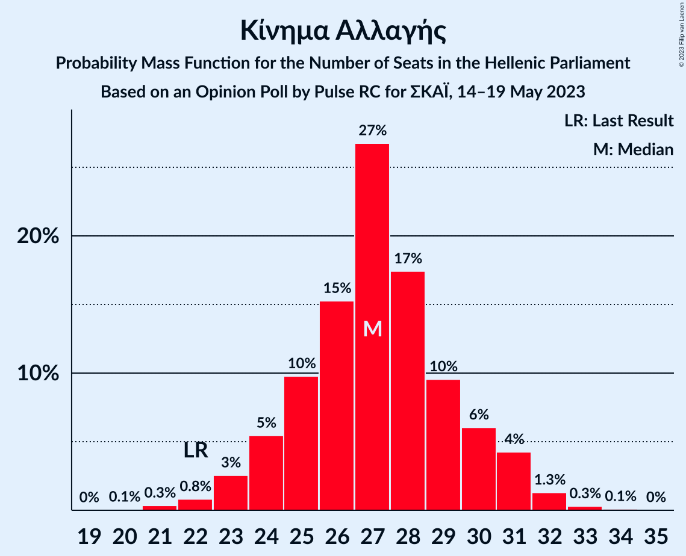

| Number of Seats | Probability | Accumulated | Special Marks |
|:---------------:|:-----------:|:-----------:|:-------------:|
| 20 | 0.1% | 100% |  |
| 21 | 0.3% | 99.9% |  |
| 22 | 0.8% | 99.6% | Last Result |
| 23 | 3% | 98.8% |  |
| 24 | 5% | 96% |  |
| 25 | 10% | 91% |  |
| 26 | 15% | 81% |  |
| 27 | 27% | 66% | Median |
| 28 | 17% | 39% |  |
| 29 | 10% | 22% |  |
| 30 | 6% | 12% |  |
| 31 | 4% | 6% |  |
| 32 | 1.3% | 2% |  |
| 33 | 0.3% | 0.4% |  |
| 34 | 0.1% | 0.1% |  |
| 35 | 0% | 0% |  |

### Κομμουνιστικό Κόμμα Ελλάδας

*For a full overview of the results for this party, see the [Κομμουνιστικό Κόμμα Ελλάδας](party-κομμουνιστικόκόμμαελλάδας.html) page.*

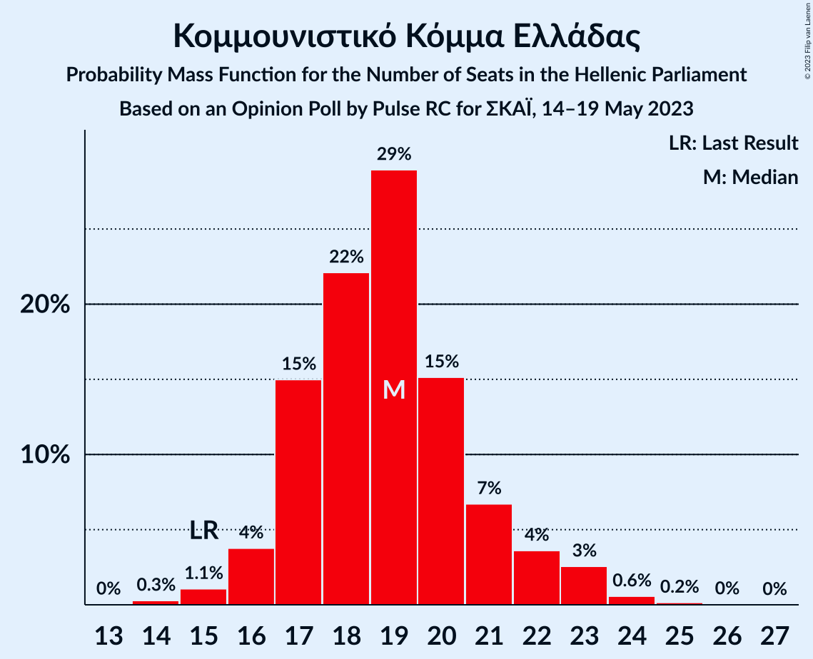

| Number of Seats | Probability | Accumulated | Special Marks |
|:---------------:|:-----------:|:-----------:|:-------------:|
| 14 | 0.3% | 100% |  |
| 15 | 1.1% | 99.7% | Last Result |
| 16 | 4% | 98.6% |  |
| 17 | 15% | 95% |  |
| 18 | 22% | 80% |  |
| 19 | 29% | 58% | Median |
| 20 | 15% | 29% |  |
| 21 | 7% | 14% |  |
| 22 | 4% | 7% |  |
| 23 | 3% | 3% |  |
| 24 | 0.6% | 0.8% |  |
| 25 | 0.2% | 0.2% |  |
| 26 | 0% | 0.1% |  |
| 27 | 0% | 0% |  |

### Μέτωπο Ευρωπαϊκής Ρεαλιστικής Ανυπακοής

*For a full overview of the results for this party, see the [Μέτωπο Ευρωπαϊκής Ρεαλιστικής Ανυπακοής](party-μέτωποευρωπαϊκήςρεαλιστικήςανυπακοής.html) page.*

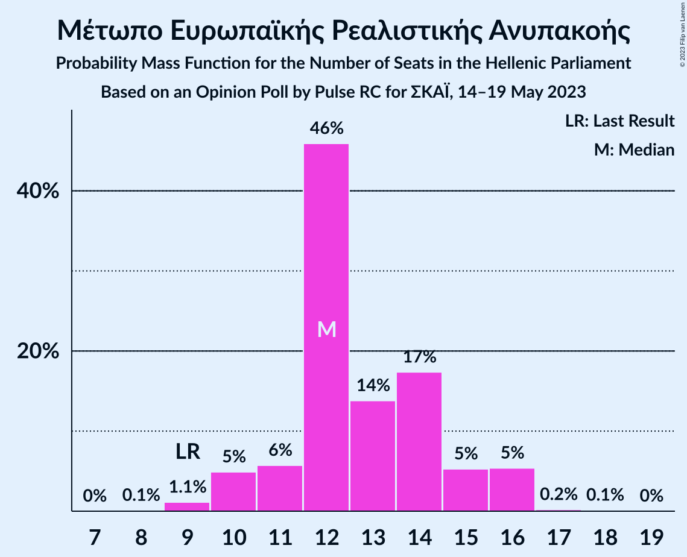

| Number of Seats | Probability | Accumulated | Special Marks |
|:---------------:|:-----------:|:-----------:|:-------------:|
| 8 | 0.1% | 100% |  |
| 9 | 1.1% | 99.9% | Last Result |
| 10 | 5% | 98.7% |  |
| 11 | 6% | 94% |  |
| 12 | 46% | 88% | Median |
| 13 | 14% | 42% |  |
| 14 | 17% | 28% |  |
| 15 | 5% | 11% |  |
| 16 | 5% | 6% |  |
| 17 | 0.2% | 0.3% |  |
| 18 | 0.1% | 0.1% |  |
| 19 | 0% | 0% |  |

### Ελληνική Λύση

*For a full overview of the results for this party, see the [Ελληνική Λύση](party-ελληνικήλύση.html) page.*

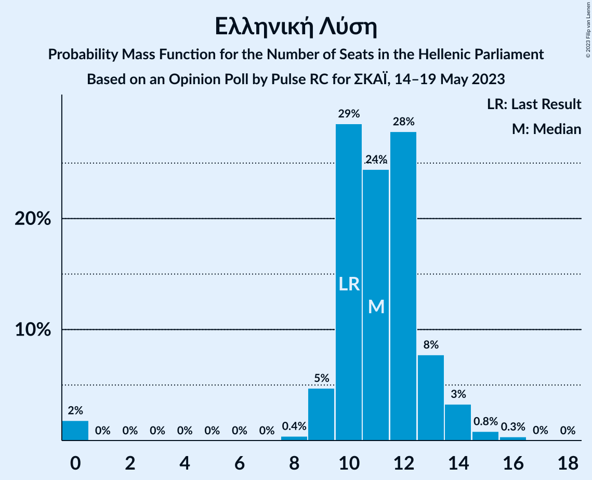

| Number of Seats | Probability | Accumulated | Special Marks |
|:---------------:|:-----------:|:-----------:|:-------------:|
| 0 | 2% | 100% |  |
| 1 | 0% | 98% |  |
| 2 | 0% | 98% |  |
| 3 | 0% | 98% |  |
| 4 | 0% | 98% |  |
| 5 | 0% | 98% |  |
| 6 | 0% | 98% |  |
| 7 | 0% | 98% |  |
| 8 | 0.4% | 98% |  |
| 9 | 5% | 98% |  |
| 10 | 29% | 93% | Last Result |
| 11 | 24% | 65% | Median |
| 12 | 28% | 40% |  |
| 13 | 8% | 12% |  |
| 14 | 3% | 4% |  |
| 15 | 0.8% | 1.2% |  |
| 16 | 0.3% | 0.4% |  |
| 17 | 0% | 0% |  |

### Δημοκρατικό Πατριωτικό Κίνημα ΝΙΚΗ

*For a full overview of the results for this party, see the [Δημοκρατικό Πατριωτικό Κίνημα ΝΙΚΗ](party-δημοκρατικόπατριωτικόκίνημανικη.html) page.*

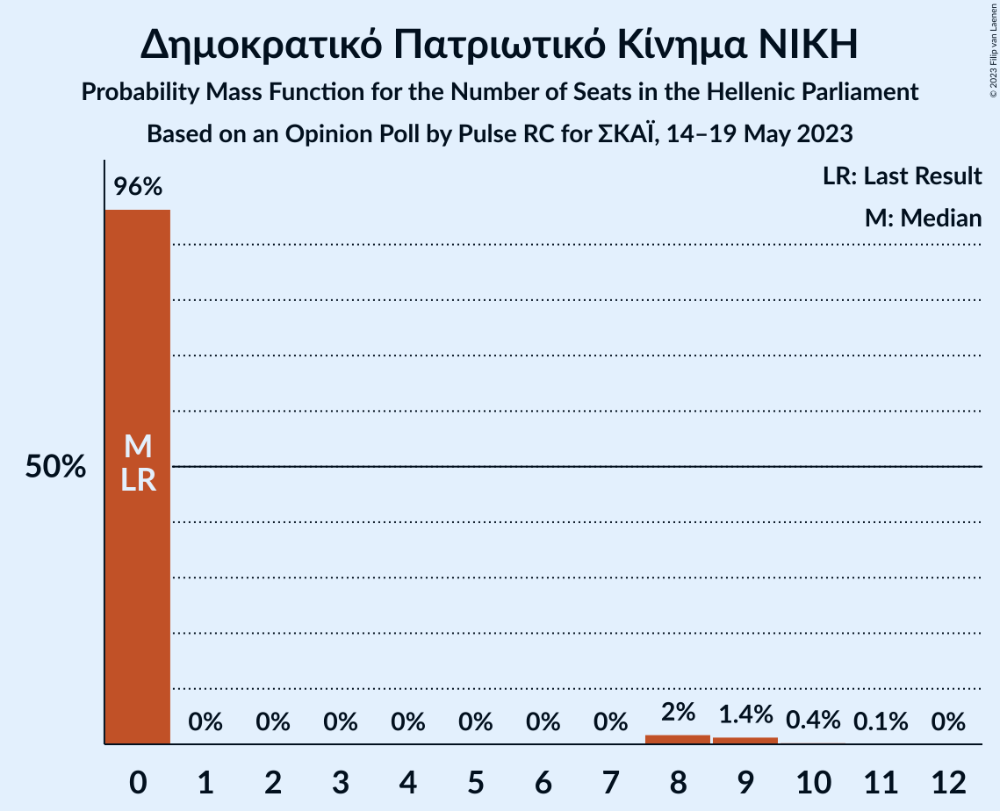

| Number of Seats | Probability | Accumulated | Special Marks |
|:---------------:|:-----------:|:-----------:|:-------------:|
| 0 | 96% | 100% | Last Result, Median |
| 1 | 0% | 4% |  |
| 2 | 0% | 4% |  |
| 3 | 0% | 4% |  |
| 4 | 0% | 4% |  |
| 5 | 0% | 4% |  |
| 6 | 0% | 4% |  |
| 7 | 0% | 4% |  |
| 8 | 2% | 4% |  |
| 9 | 1.4% | 2% |  |
| 10 | 0.4% | 0.4% |  |
| 11 | 0.1% | 0.1% |  |
| 12 | 0% | 0% |  |

### Πλεύση Ελευθερίας

*For a full overview of the results for this party, see the [Πλεύση Ελευθερίας](party-πλεύσηελευθερίας.html) page.*

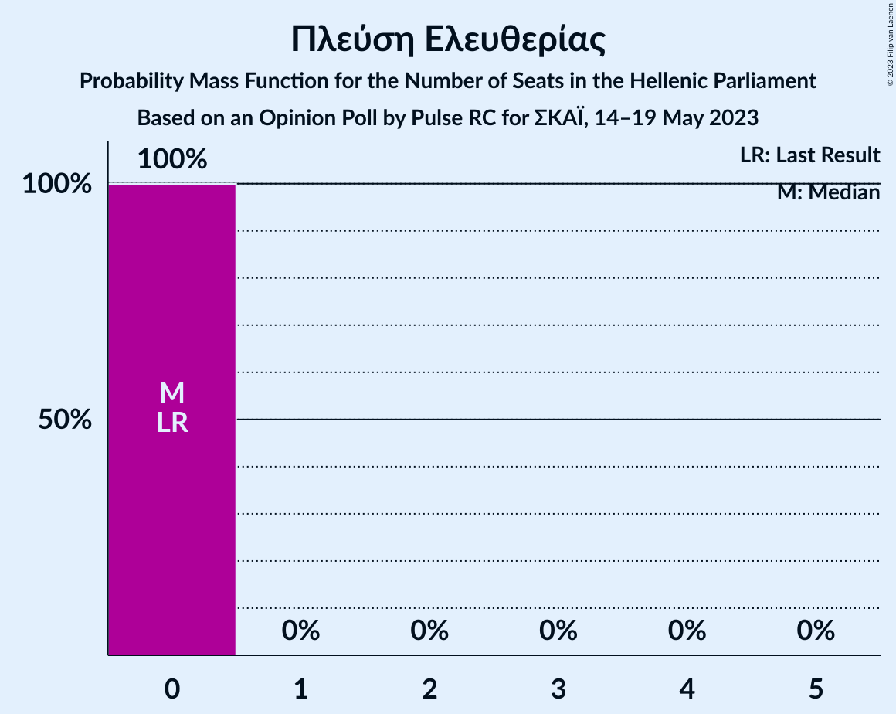

| Number of Seats | Probability | Accumulated | Special Marks |
|:---------------:|:-----------:|:-----------:|:-------------:|
| 0 | 100% | 100% | Last Result, Median |

### Εθνική Δημιουργία

*For a full overview of the results for this party, see the [Εθνική Δημιουργία](party-εθνικήδημιουργία.html) page.*

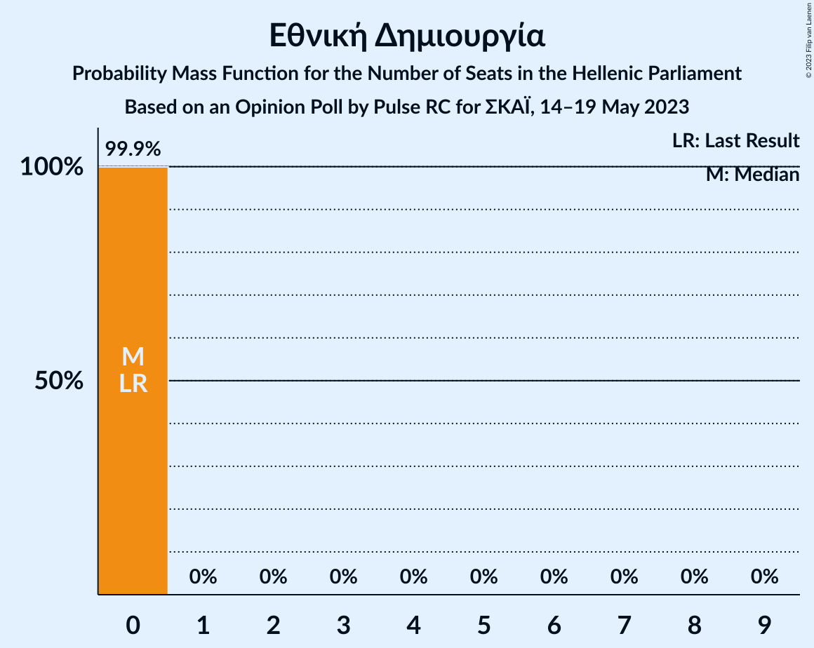

| Number of Seats | Probability | Accumulated | Special Marks |
|:---------------:|:-----------:|:-----------:|:-------------:|
| 0 | 99.9% | 100% | Last Result, Median |
| 1 | 0% | 0.1% |  |
| 2 | 0% | 0.1% |  |
| 3 | 0% | 0.1% |  |
| 4 | 0% | 0.1% |  |
| 5 | 0% | 0.1% |  |
| 6 | 0% | 0.1% |  |
| 7 | 0% | 0.1% |  |
| 8 | 0% | 0.1% |  |
| 9 | 0% | 0% |  |

## Coalitions

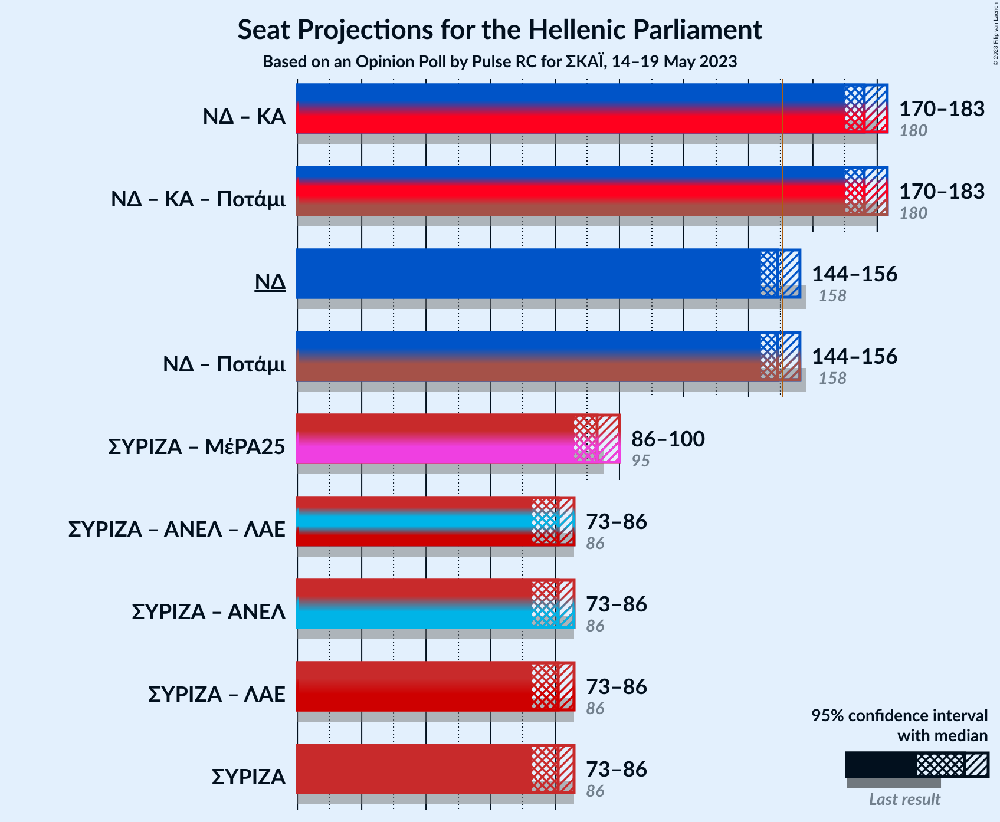

### Confidence Intervals

| Coalition | Last Result | Median | Majority? | 80% Confidence Interval | 90% Confidence Interval | 95% Confidence Interval | 99% Confidence Interval |
|:---------:|:-----------:|:------:|:---------:|:-----------------------:|:-----------------------:|:-----------------------:|:-----------------------:|
| Νέα Δημοκρατία – Κίνημα Αλλαγής | 180 | 176 | 100% | 173–182 | 171–182 | 170–183 | 168–187 |
| Νέα Δημοκρατία | 158 | 149 | 39% | 146–154 | 145–155 | 144–156 | 142–159 |
| Συνασπισμός Ριζοσπαστικής Αριστεράς – Μέτωπο Ευρωπαϊκής Ρεαλιστικής Ανυπακοής | 95 | 93 | 0% | 88–97 | 87–98 | 86–100 | 84–101 |
| Συνασπισμός Ριζοσπαστικής Αριστεράς | 86 | 81 | 0% | 76–85 | 74–85 | 73–86 | 72–89 |

### Νέα Δημοκρατία – Κίνημα Αλλαγής

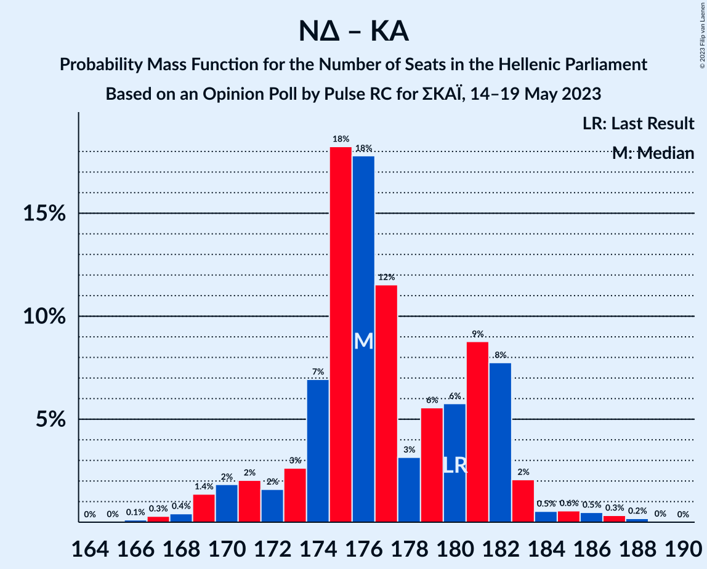

| Number of Seats | Probability | Accumulated | Special Marks |
|:---------------:|:-----------:|:-----------:|:-------------:|
| 165 | 0% | 100% |  |
| 166 | 0.1% | 99.9% |  |
| 167 | 0.3% | 99.8% |  |
| 168 | 0.4% | 99.5% |  |
| 169 | 1.4% | 99.1% |  |
| 170 | 2% | 98% |  |
| 171 | 2% | 96% |  |
| 172 | 2% | 94% |  |
| 173 | 3% | 92% |  |
| 174 | 7% | 90% |  |
| 175 | 18% | 83% |  |
| 176 | 18% | 65% | Median |
| 177 | 12% | 47% |  |
| 178 | 3% | 35% |  |
| 179 | 6% | 32% |  |
| 180 | 6% | 26% | Last Result |
| 181 | 9% | 21% |  |
| 182 | 8% | 12% |  |
| 183 | 2% | 4% |  |
| 184 | 0.5% | 2% |  |
| 185 | 0.6% | 2% |  |
| 186 | 0.5% | 1.0% |  |
| 187 | 0.3% | 0.6% |  |
| 188 | 0.2% | 0.2% |  |
| 189 | 0% | 0.1% |  |
| 190 | 0% | 0% |  |

### Νέα Δημοκρατία

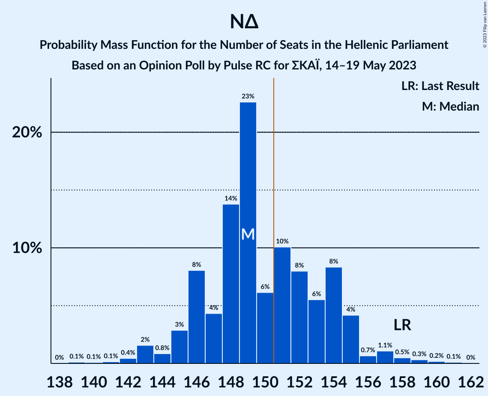

| Number of Seats | Probability | Accumulated | Special Marks |
|:---------------:|:-----------:|:-----------:|:-------------:|
| 139 | 0.1% | 100% |  |
| 140 | 0.1% | 99.8% |  |
| 141 | 0.1% | 99.8% |  |
| 142 | 0.4% | 99.6% |  |
| 143 | 2% | 99.2% |  |
| 144 | 0.8% | 98% |  |
| 145 | 3% | 97% |  |
| 146 | 8% | 94% |  |
| 147 | 4% | 86% |  |
| 148 | 14% | 82% |  |
| 149 | 23% | 68% | Median |
| 150 | 6% | 45% |  |
| 151 | 10% | 39% | Majority |
| 152 | 8% | 29% |  |
| 153 | 6% | 21% |  |
| 154 | 8% | 15% |  |
| 155 | 4% | 7% |  |
| 156 | 0.7% | 3% |  |
| 157 | 1.1% | 2% |  |
| 158 | 0.5% | 1.1% | Last Result |
| 159 | 0.3% | 0.6% |  |
| 160 | 0.2% | 0.3% |  |
| 161 | 0.1% | 0.1% |  |
| 162 | 0% | 0% |  |

### Συνασπισμός Ριζοσπαστικής Αριστεράς – Μέτωπο Ευρωπαϊκής Ρεαλιστικής Ανυπακοής

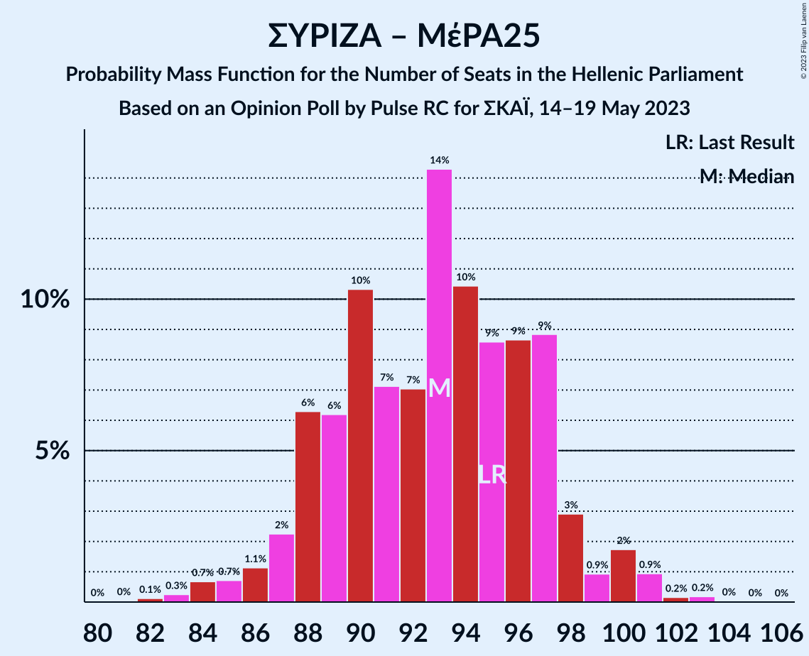

| Number of Seats | Probability | Accumulated | Special Marks |
|:---------------:|:-----------:|:-----------:|:-------------:|
| 81 | 0% | 100% |  |
| 82 | 0.1% | 99.9% |  |
| 83 | 0.3% | 99.8% |  |
| 84 | 0.7% | 99.5% |  |
| 85 | 0.7% | 98.9% |  |
| 86 | 1.1% | 98% |  |
| 87 | 2% | 97% |  |
| 88 | 6% | 95% |  |
| 89 | 6% | 88% |  |
| 90 | 10% | 82% |  |
| 91 | 7% | 72% |  |
| 92 | 7% | 65% |  |
| 93 | 14% | 58% | Median |
| 94 | 10% | 43% |  |
| 95 | 9% | 33% | Last Result |
| 96 | 9% | 24% |  |
| 97 | 9% | 16% |  |
| 98 | 3% | 7% |  |
| 99 | 0.9% | 4% |  |
| 100 | 2% | 3% |  |
| 101 | 0.9% | 1.4% |  |
| 102 | 0.2% | 0.4% |  |
| 103 | 0.2% | 0.3% |  |
| 104 | 0% | 0.1% |  |
| 105 | 0% | 0% |  |

### Συνασπισμός Ριζοσπαστικής Αριστεράς

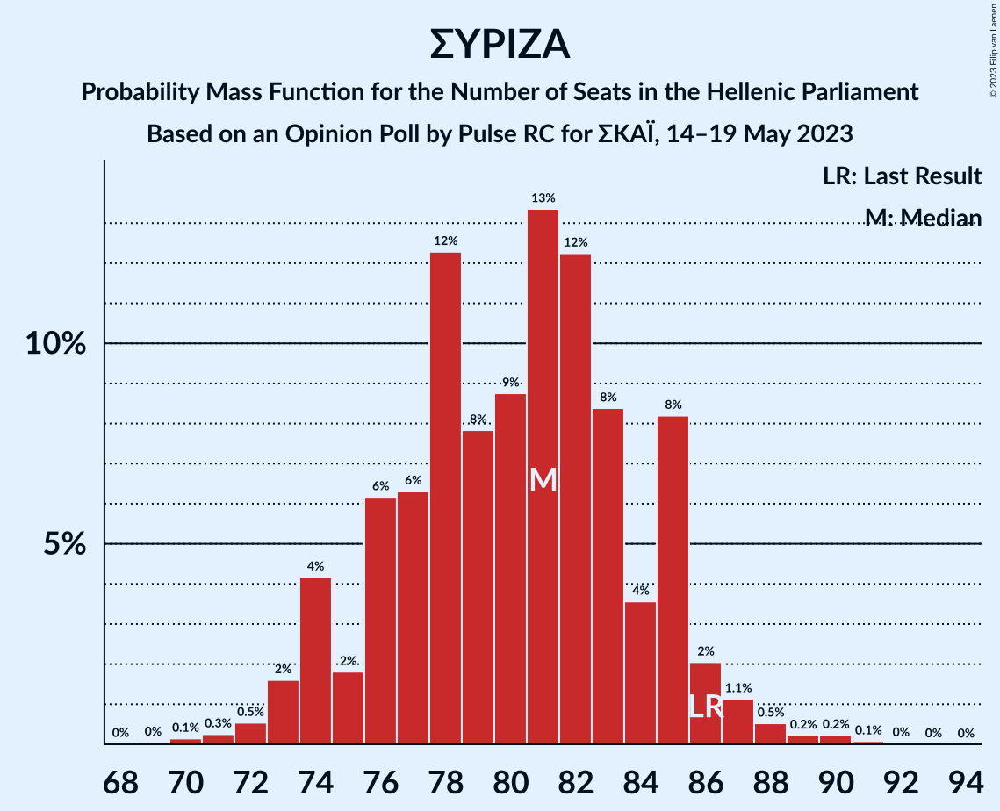

| Number of Seats | Probability | Accumulated | Special Marks |
|:---------------:|:-----------:|:-----------:|:-------------:|
| 69 | 0% | 100% |  |
| 70 | 0.1% | 99.9% |  |
| 71 | 0.3% | 99.8% |  |
| 72 | 0.5% | 99.5% |  |
| 73 | 2% | 99.0% |  |
| 74 | 4% | 97% |  |
| 75 | 2% | 93% |  |
| 76 | 6% | 91% |  |
| 77 | 6% | 85% |  |
| 78 | 12% | 79% |  |
| 79 | 8% | 67% |  |
| 80 | 9% | 59% |  |
| 81 | 13% | 50% | Median |
| 82 | 12% | 37% |  |
| 83 | 8% | 24% |  |
| 84 | 4% | 16% |  |
| 85 | 8% | 12% |  |
| 86 | 2% | 4% | Last Result |
| 87 | 1.1% | 2% |  |
| 88 | 0.5% | 1.1% |  |
| 89 | 0.2% | 0.6% |  |
| 90 | 0.2% | 0.4% |  |
| 91 | 0.1% | 0.1% |  |
| 92 | 0% | 0.1% |  |
| 93 | 0% | 0% |  |

## Technical Information

### Opinion Poll

+ **Polling firm:** Pulse RC
+ **Commissioner(s):** ΣΚΑΪ
+ **Fieldwork period:** 14–19 May 2023

### Calculations

+ **Sample size:** 1425
+ **Simulations done:** 1,048,576
+ **Error estimate:** 0.52%

