# Poll Average

<a href="#voting-intentions">Voting Intentions</a> | <a href="#seats">Seats</a> | <a href="#coalitions">Coalitions</a> | <a href="#technical-information">Technical Information</a>

## Summary

The table below lists the polls on which the average is based. They are the most recent polls (less than 90 days old) registered and analyzed so far.

| Period     | Polling firm/Commissioner(s) | ΣΥΡΙΖΑ | ΝΔ | ΧΑ | ΚΑ | ΚΚΕ | Ποτάμι | ΑΝΕΛ | ΕΚ | ΛΑΕ | ΠΕ | ΕΛ | ΜέΡΑ25 |
|:----------:|:----------------------------:|:--:|:--:|:--:|:--:|:--:|:--:|:--:|:--:|:--:|:--:|:--:|:--:|
| 20 September 2015 | General Election | 35.5%   145 | 28.1%   75 | 7.0%   18 | 6.3%   17 | 5.6%   15 | 4.1%   11 | 3.7%   10 | 3.4%   9 | 2.9%   0 | 0.0%   0 | 0.0%   0 | 0.0%   0 |
| N/A | Poll Average | 25–31%   69–85 | 34–42%   143–172 | 2–6%   0–18 | 5–8%   14–23 | 4–6%   10–18 | 2–3%   0–9 | N/A   N/A | 1–3%   0 | N/A   N/A | 1–3%   0–9 | 3–6%   0–16 | 3–6%   9–15 |
| [1–5 July 2019](2019-07-05-ΚάπαResearch.html) | Κάπα Research   ΕΘΝΟΣ | 26–31%   N/A | 37–43%   N/A | 3–5%   N/A | 6–9%   N/A | 4–7%   N/A | N/A   N/A | N/A   N/A | 1–2%   N/A | N/A   N/A | 1–2%   N/A | 2–4%   N/A | 3–5%   N/A |
| [1–4 July 2019](2019-07-04-RASS.html) | RASS   Action24 | N/A   N/A | N/A   N/A | N/A   N/A | N/A   N/A | N/A   N/A | N/A   N/A | N/A   N/A | N/A   N/A | N/A   N/A | N/A   N/A | N/A   N/A | N/A   N/A |
| [2–4 July 2019](2019-07-04-Marc.html) | Marc   ANT1 | N/A   N/A | N/A   N/A | N/A   N/A | N/A   N/A | N/A   N/A | N/A   N/A | N/A   N/A | N/A   N/A | N/A   N/A | N/A   N/A | N/A   N/A | N/A   N/A |
| [1–4 July 2019](2019-07-04-MRB.html) | MRB   Star | N/A   N/A | N/A   N/A | N/A   N/A | N/A   N/A | N/A   N/A | N/A   N/A | N/A   N/A | N/A   N/A | N/A   N/A | N/A   N/A | N/A   N/A | N/A   N/A |
| [2–3 July 2019](2019-07-03-PulseRC.html) | Pulse RC   ΣΚΑΪ | N/A   N/A | N/A   N/A | N/A   N/A | N/A   N/A | N/A   N/A | N/A   N/A | N/A   N/A | N/A   N/A | N/A   N/A | N/A   N/A | N/A   N/A | N/A   N/A |
| [18 June–3 July 2019](2019-07-03-PublicIssue.html) | Public Issue | N/A   N/A | N/A   N/A | N/A   N/A | N/A   N/A | N/A   N/A | N/A   N/A | N/A   N/A | N/A   N/A | N/A   N/A | N/A   N/A | N/A   N/A | N/A   N/A |
| [3 July 2019](2019-07-03-MetronAnalysis.html) | Metron Analysis   Alpha TV | N/A   N/A | N/A   N/A | N/A   N/A | N/A   N/A | N/A   N/A | N/A   N/A | N/A   N/A | N/A   N/A | N/A   N/A | N/A   N/A | N/A   N/A | N/A   N/A |
| [1–3 July 2019](2019-07-03-Interview.html) | Interview   Βεργίνα TV | N/A   N/A | N/A   N/A | N/A   N/A | N/A   N/A | N/A   N/A | N/A   N/A | N/A   N/A | N/A   N/A | N/A   N/A | N/A   N/A | N/A   N/A | N/A   N/A |
| [28 June–2 July 2019](2019-07-02-Alco.html) | Alco   Open TV | N/A   N/A | N/A   N/A | N/A   N/A | N/A   N/A | N/A   N/A | N/A   N/A | N/A   N/A | N/A   N/A | N/A   N/A | N/A   N/A | N/A   N/A | N/A   N/A |
| [28 June–1 July 2019](2019-07-01-Prorata.html) | Prorata | N/A   N/A | N/A   N/A | N/A   N/A | N/A   N/A | N/A   N/A | N/A   N/A | N/A   N/A | N/A   N/A | N/A   N/A | N/A   N/A | N/A   N/A | N/A   N/A |
| [19–21 June 2019](2019-06-21-PalmosAnalysis.html) | Palmos Analysis | 26–31%   71–86 | 33–39%   141–156 | 4–7%   11–18 | 5–8%   14–22 | 4–7%   11–18 | 2–3%   0–9 | N/A   N/A | 1–3%   0 | N/A   N/A | 1–3%   0–8 | 3–6%   9–16 | 3–6%   9–15 |
| [17–19 June 2019](2019-06-19-OpinionPoll.html) | Opinion Poll | 24–30%   69–85 | 37–43%   153–172 | 2–5%   0–13 | 5–8%   15–23 | 3–6%   10–18 | N/A   N/A | N/A   N/A | 1–2%   0 | N/A   N/A | 2–3%   0–9 | 3–5%   0–14 | 3–6%   8–15 |
| 20 September 2015 | General Election | 35.5%   145 | 28.1%   75 | 7.0%   18 | 6.3%   17 | 5.6%   15 | 4.1%   11 | 3.7%   10 | 3.4%   9 | 2.9%   0 | 0.0%   0 | 0.0%   0 | 0.0%   0 |

Only polls for which at least the sample size has been published are included in the table above.

**Legend:**
+ **Top half of each row:** Voting intentions (95% confidence interval)
+ **Bottom half of each row:** Seat projections for the Hellenic Parliament (95% confidence interval)
+ **ΣΥΡΙΖΑ:** Συνασπισμός Ριζοσπαστικής Αριστεράς
+ **ΝΔ:** Νέα Δημοκρατία
+ **ΧΑ:** Χρυσή Αυγή
+ **ΚΑ:** Κίνημα Αλλαγής
+ **ΚΚΕ:** Κομμουνιστικό Κόμμα Ελλάδας
+ **Ποτάμι:** Το Ποτάμι
+ **ΑΝΕΛ:** Ανεξάρτητοι Έλληνες
+ **ΕΚ:** Ένωση Κεντρώων
+ **ΛΑΕ:** Λαϊκή Ενότητα
+ **ΠΕ:** Πλεύση Ελευθερίας
+ **ΕΛ:** Ελληνική Λύση
+ **ΜέΡΑ25:** Μέτωπο Ευρωπαϊκής Ρεαλιστικής Ανυπακοής
+ **N/A (single party):** Party not included the published results
+ **N/A (entire row):** Calculation for this opinion poll not started yet

## Voting Intentions

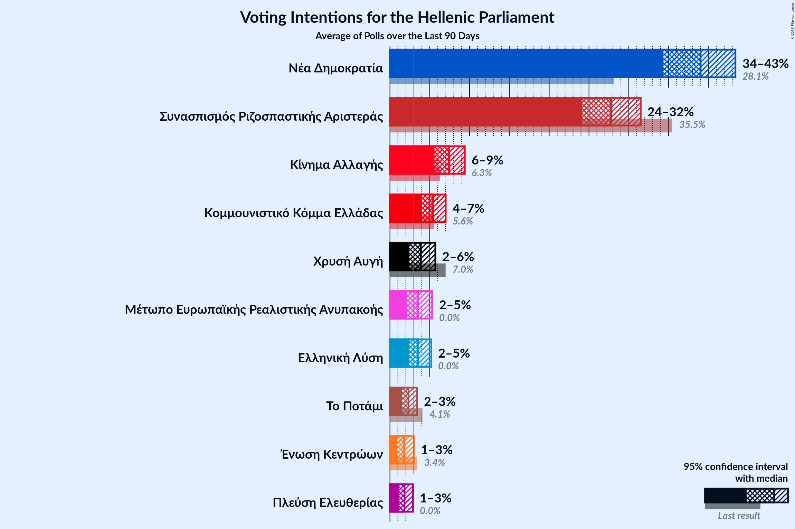

### Confidence Intervals

| Party | Last Result | Median | 80% Confidence Interval | 90% Confidence Interval | 95% Confidence Interval | 99% Confidence Interval |
|:-----:|:-----------:|:------:|:-----------------------:|:-----------------------:|:-----------------------:|:-----------------------:|
| <a href="#συνασπισμός-ριζοσπαστικής-αριστεράς">Συνασπισμός Ριζοσπαστικής Αριστεράς</a> | 35.5% | 27.8% | 25.9–29.7% |25.4–30.2% | 24.9–30.7% | 24.0–31.6% |
| <a href="#νέα-δημοκρατία">Νέα Δημοκρατία</a> | 28.1% | 39.0% | 35.3–41.4% |34.5–42.0% | 33.9–42.5% | 32.8–43.5% |
| <a href="#χρυσή-αυγή">Χρυσή Αυγή</a> | 7.0% | 4.3% | 2.9–5.8% |2.7–6.1% | 2.5–6.4% | 2.2–7.0% |
| <a href="#κίνημα-αλλαγής">Κίνημα Αλλαγής</a> | 6.3% | 6.5% | 5.6–7.6% |5.3–7.9% | 5.1–8.2% | 4.7–8.7% |
| <a href="#κομμουνιστικό-κόμμα-ελλάδας">Κομμουνιστικό Κόμμα Ελλάδας</a> | 5.6% | 4.9% | 4.0–5.9% |3.8–6.2% | 3.6–6.5% | 3.3–7.0% |
| <a href="#το-ποτάμι">Το Ποτάμι</a> | 4.1% | 2.3% | 1.8–3.0% |1.6–3.2% | 1.5–3.4% | 1.3–3.8% |
| <a href="#ανεξάρτητοι-έλληνες">Ανεξάρτητοι Έλληνες</a> | 3.7% | N/A | N/A |N/A | N/A | N/A |
| <a href="#ένωση-κεντρώων">Ένωση Κεντρώων</a> | 3.4% | 1.5% | 0.9–2.2% |0.8–2.4% | 0.7–2.6% | 0.5–3.0% |
| <a href="#λαϊκή-ενότητα">Λαϊκή Ενότητα</a> | 2.9% | N/A | N/A |N/A | N/A | N/A |
| <a href="#πλεύση-ελευθερίας">Πλεύση Ελευθερίας</a> | 0.0% | 2.2% | 1.7–2.9% |1.5–3.1% | 1.4–3.3% | 1.2–3.7% |
| <a href="#ελληνική-λύση">Ελληνική Λύση</a> | 0.0% | 4.1% | 3.2–5.2% |2.9–5.5% | 2.8–5.8% | 2.4–6.3% |
| <a href="#μέτωπο-ευρωπαϊκής-ρεαλιστικής-ανυπακοής">Μέτωπο Ευρωπαϊκής Ρεαλιστικής Ανυπακοής</a> | 0.0% | 4.2% | 3.5–5.1% |3.3–5.4% | 3.1–5.6% | 2.8–6.1% |

### Συνασπισμός Ριζοσπαστικής Αριστεράς

*For a full overview of the results for this party, see the [Συνασπισμός Ριζοσπαστικής Αριστεράς](party-συνασπισμόςριζοσπαστικήςαριστεράς.html) page.*

| Voting Intentions | Probability | Accumulated | Special Marks |
|:-----------------:|:-----------:|:-----------:|:-------------:|
| 21.5–22.5% | 0% | 100% |  |
| 22.5–23.5% | 0.2% | 100% |  |
| 23.5–24.5% | 1.2% | 99.8% |  |
| 24.5–25.5% | 5% | 98.6% |  |
| 25.5–26.5% | 14% | 94% |  |
| 26.5–27.5% | 24% | 80% |  |
| 27.5–28.5% | 26% | 56% | Median |
| 28.5–29.5% | 19% | 31% |  |
| 29.5–30.5% | 9% | 12% |  |
| 30.5–31.5% | 3% | 3% |  |
| 31.5–32.5% | 0.5% | 0.6% |  |
| 32.5–33.5% | 0.1% | 0.1% |  |
| 33.5–34.5% | 0% | 0% |  |
| 34.5–35.5% | 0% | 0% | Last Result |

### Νέα Δημοκρατία

*For a full overview of the results for this party, see the [Νέα Δημοκρατία](party-νέαδημοκρατία.html) page.*

| Voting Intentions | Probability | Accumulated | Special Marks |
|:-----------------:|:-----------:|:-----------:|:-------------:|
| 27.5–28.5% | 0% | 100% | Last Result |
| 28.5–29.5% | 0% | 100% |  |
| 29.5–30.5% | 0% | 100% |  |
| 30.5–31.5% | 0% | 100% |  |
| 31.5–32.5% | 0.3% | 100% |  |
| 32.5–33.5% | 1.2% | 99.7% |  |
| 33.5–34.5% | 4% | 98% |  |
| 34.5–35.5% | 7% | 95% |  |
| 35.5–36.5% | 9% | 88% |  |
| 36.5–37.5% | 10% | 78% |  |
| 37.5–38.5% | 12% | 68% |  |
| 38.5–39.5% | 17% | 57% | Median |
| 39.5–40.5% | 18% | 40% |  |
| 40.5–41.5% | 13% | 22% |  |
| 41.5–42.5% | 6% | 9% |  |
| 42.5–43.5% | 2% | 2% |  |
| 43.5–44.5% | 0.4% | 0.5% |  |
| 44.5–45.5% | 0.1% | 0.1% |  |
| 45.5–46.5% | 0% | 0% |  |

### Χρυσή Αυγή

*For a full overview of the results for this party, see the [Χρυσή Αυγή](party-χρυσήαυγή.html) page.*

| Voting Intentions | Probability | Accumulated | Special Marks |
|:-----------------:|:-----------:|:-----------:|:-------------:|
| 0.5–1.5% | 0% | 100% |  |
| 1.5–2.5% | 3% | 100% |  |
| 2.5–3.5% | 29% | 97% |  |
| 3.5–4.5% | 25% | 68% | Median |
| 4.5–5.5% | 27% | 43% |  |
| 5.5–6.5% | 14% | 16% |  |
| 6.5–7.5% | 2% | 2% | Last Result |
| 7.5–8.5% | 0.1% | 0.1% |  |
| 8.5–9.5% | 0% | 0% |  |

### Κίνημα Αλλαγής

*For a full overview of the results for this party, see the [Κίνημα Αλλαγής](party-κίνημααλλαγής.html) page.*

| Voting Intentions | Probability | Accumulated | Special Marks |
|:-----------------:|:-----------:|:-----------:|:-------------:|
| 2.5–3.5% | 0% | 100% |  |
| 3.5–4.5% | 0.2% | 100% |  |
| 4.5–5.5% | 9% | 99.7% |  |
| 5.5–6.5% | 42% | 91% | Last Result |
| 6.5–7.5% | 38% | 49% | Median |
| 7.5–8.5% | 10% | 11% |  |
| 8.5–9.5% | 0.8% | 0.9% |  |
| 9.5–10.5% | 0% | 0% |  |

### Κομμουνιστικό Κόμμα Ελλάδας

*For a full overview of the results for this party, see the [Κομμουνιστικό Κόμμα Ελλάδας](party-κομμουνιστικόκόμμαελλάδας.html) page.*

| Voting Intentions | Probability | Accumulated | Special Marks |
|:-----------------:|:-----------:|:-----------:|:-------------:|
| 1.5–2.5% | 0% | 100% |  |
| 2.5–3.5% | 2% | 100% |  |
| 3.5–4.5% | 28% | 98% |  |
| 4.5–5.5% | 49% | 70% | Median |
| 5.5–6.5% | 19% | 21% | Last Result |
| 6.5–7.5% | 2% | 2% |  |
| 7.5–8.5% | 0.1% | 0.1% |  |
| 8.5–9.5% | 0% | 0% |  |

### Το Ποτάμι

*For a full overview of the results for this party, see the [Το Ποτάμι](party-τοποτάμι.html) page.*

| Voting Intentions | Probability | Accumulated | Special Marks |
|:-----------------:|:-----------:|:-----------:|:-------------:|
| 0.0–0.5% | 0% | 100% |  |
| 0.5–1.5% | 3% | 100% |  |
| 1.5–2.5% | 63% | 97% | Median |
| 2.5–3.5% | 32% | 34% |  |
| 3.5–4.5% | 1.3% | 1.3% | Last Result |
| 4.5–5.5% | 0% | 0% |  |

### Ένωση Κεντρώων

*For a full overview of the results for this party, see the [Ένωση Κεντρώων](party-ένωσηκεντρώων.html) page.*

| Voting Intentions | Probability | Accumulated | Special Marks |
|:-----------------:|:-----------:|:-----------:|:-------------:|
| 0.0–0.5% | 0.5% | 100% |  |
| 0.5–1.5% | 54% | 99.5% | Median |
| 1.5–2.5% | 42% | 46% |  |
| 2.5–3.5% | 3% | 3% | Last Result |
| 3.5–4.5% | 0% | 0% |  |

### Πλεύση Ελευθερίας

*For a full overview of the results for this party, see the [Πλεύση Ελευθερίας](party-πλεύσηελευθερίας.html) page.*

| Voting Intentions | Probability | Accumulated | Special Marks |
|:-----------------:|:-----------:|:-----------:|:-------------:|
| 0.0–0.5% | 0% | 100% | Last Result |
| 0.5–1.5% | 5% | 100% |  |
| 1.5–2.5% | 67% | 95% | Median |
| 2.5–3.5% | 27% | 28% |  |
| 3.5–4.5% | 1.0% | 1.0% |  |
| 4.5–5.5% | 0% | 0% |  |

### Ελληνική Λύση

*For a full overview of the results for this party, see the [Ελληνική Λύση](party-ελληνικήλύση.html) page.*

| Voting Intentions | Probability | Accumulated | Special Marks |
|:-----------------:|:-----------:|:-----------:|:-------------:|
| 0.0–0.5% | 0% | 100% | Last Result |
| 0.5–1.5% | 0% | 100% |  |
| 1.5–2.5% | 0.9% | 100% |  |
| 2.5–3.5% | 22% | 99.1% |  |
| 3.5–4.5% | 46% | 77% | Median |
| 4.5–5.5% | 26% | 31% |  |
| 5.5–6.5% | 4% | 5% |  |
| 6.5–7.5% | 0.2% | 0.2% |  |
| 7.5–8.5% | 0% | 0% |  |

### Μέτωπο Ευρωπαϊκής Ρεαλιστικής Ανυπακοής

*For a full overview of the results for this party, see the [Μέτωπο Ευρωπαϊκής Ρεαλιστικής Ανυπακοής](party-μέτωποευρωπαϊκήςρεαλιστικήςανυπακοής.html) page.*

| Voting Intentions | Probability | Accumulated | Special Marks |
|:-----------------:|:-----------:|:-----------:|:-------------:|
| 0.0–0.5% | 0% | 100% | Last Result |
| 0.5–1.5% | 0% | 100% |  |
| 1.5–2.5% | 0.1% | 100% |  |
| 2.5–3.5% | 13% | 99.9% |  |
| 3.5–4.5% | 56% | 87% | Median |
| 4.5–5.5% | 28% | 31% |  |
| 5.5–6.5% | 3% | 3% |  |
| 6.5–7.5% | 0.1% | 0.1% |  |
| 7.5–8.5% | 0% | 0% |  |

## Seats

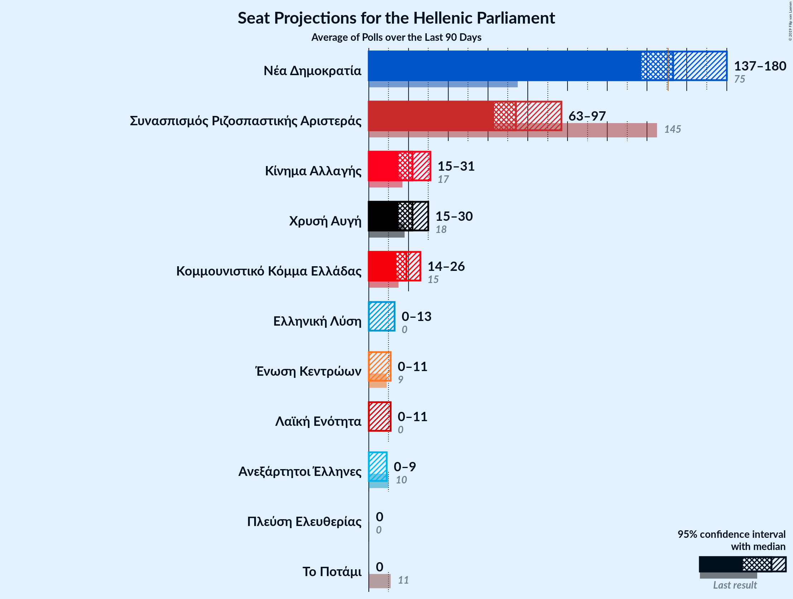

### Confidence Intervals

| Party | Last Result | Median | 80% Confidence Interval | 90% Confidence Interval | 95% Confidence Interval | 99% Confidence Interval |
|:-----:|:-----------:|:------:|:-----------------------:|:-----------------------:|:-----------------------:|:-----------------------:|
| <a href="#συνασπισμός-ριζοσπαστικής-αριστεράς">Συνασπισμός Ριζοσπαστικής Αριστεράς</a> | 145 | 77 | 72–82 |71–84 | 69–85 | 67–88 |
| <a href="#νέα-δημοκρατία">Νέα Δημοκρατία</a> | 75 | 156 | 146–166 |145–170 | 143–172 | 140–175 |
| <a href="#χρυσή-αυγή">Χρυσή Αυγή</a> | 18 | 12 | 0–15 |0–17 | 0–18 | 0–19 |
| <a href="#κίνημα-αλλαγής">Κίνημα Αλλαγής</a> | 17 | 18 | 16–21 |15–22 | 14–23 | 13–24 |
| <a href="#κομμουνιστικό-κόμμα-ελλάδας">Κομμουνιστικό Κόμμα Ελλάδας</a> | 15 | 14 | 11–16 |11–17 | 10–18 | 9–19 |
| <a href="#το-ποτάμι">Το Ποτάμι</a> | 11 | 0 | 0 |0–8 | 0–9 | 0–10 |
| <a href="#ανεξάρτητοι-έλληνες">Ανεξάρτητοι Έλληνες</a> | 10 | N/A | N/A |N/A | N/A | N/A |
| <a href="#ένωση-κεντρώων">Ένωση Κεντρώων</a> | 9 | 0 | 0 |0 | 0 | 0 |
| <a href="#λαϊκή-ενότητα">Λαϊκή Ενότητα</a> | 0 | N/A | N/A |N/A | N/A | N/A |
| <a href="#πλεύση-ελευθερίας">Πλεύση Ελευθερίας</a> | 0 | 0 | 0 |0–8 | 0–9 | 0–10 |
| <a href="#ελληνική-λύση">Ελληνική Λύση</a> | 0 | 12 | 9–15 |0–15 | 0–16 | 0–17 |
| <a href="#μέτωπο-ευρωπαϊκής-ρεαλιστικής-ανυπακοής">Μέτωπο Ευρωπαϊκής Ρεαλιστικής Ανυπακοής</a> | 0 | 12 | 10–14 |9–15 | 9–15 | 0–17 |

### Συνασπισμός Ριζοσπαστικής Αριστεράς

*For a full overview of the results for this party, see the [Συνασπισμός Ριζοσπαστικής Αριστεράς](party-συνασπισμόςριζοσπαστικήςαριστεράς.html) page.*

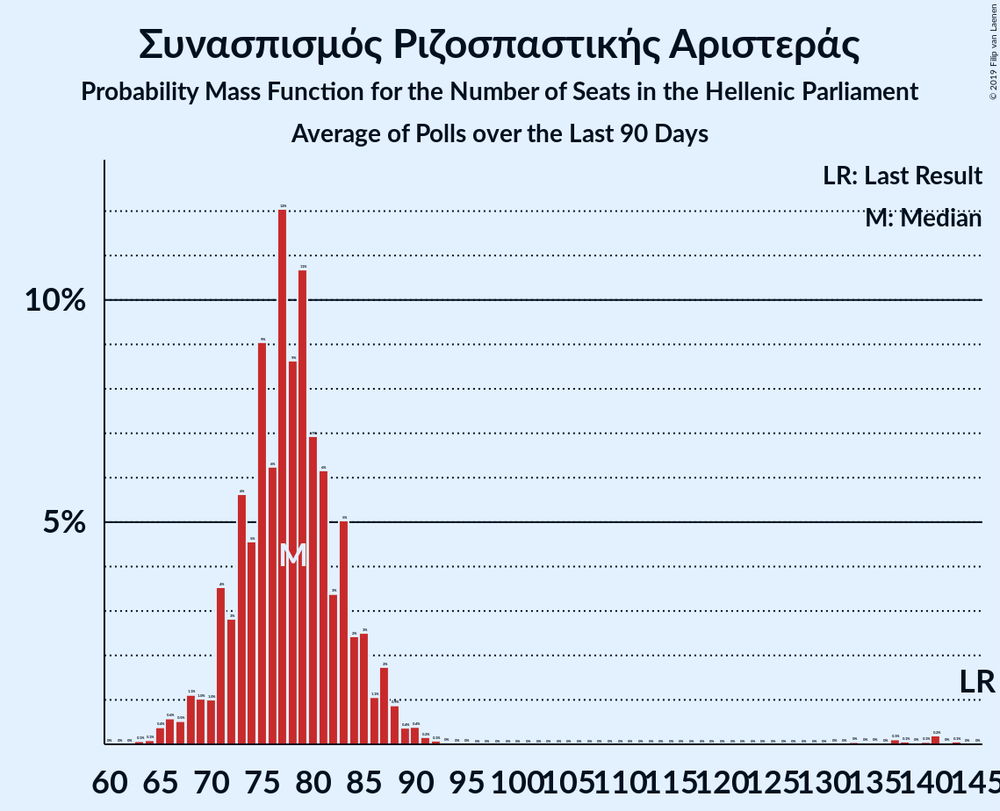

| Number of Seats | Probability | Accumulated | Special Marks |
|:---------------:|:-----------:|:-----------:|:-------------:|
| 64 | 0% | 100% |  |
| 65 | 0.1% | 99.9% |  |
| 66 | 0.2% | 99.8% |  |
| 67 | 0.4% | 99.6% |  |
| 68 | 0.6% | 99.2% |  |
| 69 | 1.4% | 98.5% |  |
| 70 | 1.3% | 97% |  |
| 71 | 3% | 96% |  |
| 72 | 5% | 93% |  |
| 73 | 10% | 89% |  |
| 74 | 7% | 79% |  |
| 75 | 7% | 72% |  |
| 76 | 12% | 65% |  |
| 77 | 10% | 54% | Median |
| 78 | 7% | 43% |  |
| 79 | 13% | 37% |  |
| 80 | 4% | 24% |  |
| 81 | 8% | 20% |  |
| 82 | 4% | 12% |  |
| 83 | 2% | 8% |  |
| 84 | 2% | 6% |  |
| 85 | 1.5% | 4% |  |
| 86 | 1.0% | 2% |  |
| 87 | 0.5% | 1.2% |  |
| 88 | 0.3% | 0.6% |  |
| 89 | 0.2% | 0.3% |  |
| 90 | 0% | 0.2% |  |
| 91 | 0% | 0.1% |  |
| 92 | 0% | 0.1% |  |
| 93 | 0% | 0.1% |  |
| 94 | 0% | 0.1% |  |
| 95 | 0% | 0.1% |  |
| 96 | 0% | 0.1% |  |
| 97 | 0% | 0.1% |  |
| 98 | 0% | 0.1% |  |
| 99 | 0% | 0.1% |  |
| 100 | 0% | 0.1% |  |
| 101 | 0% | 0.1% |  |
| 102 | 0% | 0.1% |  |
| 103 | 0% | 0.1% |  |
| 104 | 0% | 0.1% |  |
| 105 | 0% | 0.1% |  |
| 106 | 0% | 0.1% |  |
| 107 | 0% | 0.1% |  |
| 108 | 0% | 0.1% |  |
| 109 | 0% | 0.1% |  |
| 110 | 0% | 0.1% |  |
| 111 | 0% | 0.1% |  |
| 112 | 0% | 0.1% |  |
| 113 | 0% | 0.1% |  |
| 114 | 0% | 0.1% |  |
| 115 | 0% | 0.1% |  |
| 116 | 0% | 0.1% |  |
| 117 | 0% | 0.1% |  |
| 118 | 0% | 0.1% |  |
| 119 | 0% | 0.1% |  |
| 120 | 0% | 0.1% |  |
| 121 | 0% | 0.1% |  |
| 122 | 0% | 0.1% |  |
| 123 | 0% | 0.1% |  |
| 124 | 0% | 0.1% |  |
| 125 | 0% | 0.1% |  |
| 126 | 0% | 0.1% |  |
| 127 | 0% | 0.1% |  |
| 128 | 0% | 0.1% |  |
| 129 | 0% | 0.1% |  |
| 130 | 0% | 0.1% |  |
| 131 | 0% | 0.1% |  |
| 132 | 0% | 0.1% |  |
| 133 | 0% | 0.1% |  |
| 134 | 0% | 0.1% |  |
| 135 | 0% | 0.1% |  |
| 136 | 0% | 0.1% |  |
| 137 | 0% | 0.1% |  |
| 138 | 0% | 0.1% |  |
| 139 | 0% | 0% |  |
| 140 | 0% | 0% |  |
| 141 | 0% | 0% |  |
| 142 | 0% | 0% |  |
| 143 | 0% | 0% |  |
| 144 | 0% | 0% |  |
| 145 | 0% | 0% | Last Result |

### Νέα Δημοκρατία

*For a full overview of the results for this party, see the [Νέα Δημοκρατία](party-νέαδημοκρατία.html) page.*

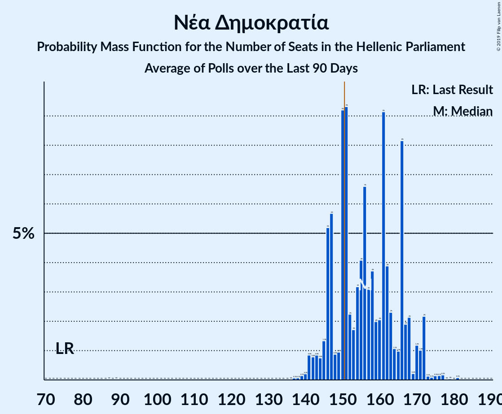

| Number of Seats | Probability | Accumulated | Special Marks |
|:---------------:|:-----------:|:-----------:|:-------------:|
| 75 | 0% | 100% | Last Result |
| 76 | 0% | 100% |  |
| 77 | 0% | 100% |  |
| 78 | 0% | 100% |  |
| 79 | 0% | 100% |  |
| 80 | 0% | 100% |  |
| 81 | 0% | 100% |  |
| 82 | 0% | 100% |  |
| 83 | 0% | 100% |  |
| 84 | 0% | 100% |  |
| 85 | 0% | 100% |  |
| 86 | 0% | 100% |  |
| 87 | 0% | 100% |  |
| 88 | 0% | 100% |  |
| 89 | 0% | 100% |  |
| 90 | 0% | 99.9% |  |
| 91 | 0% | 99.9% |  |
| 92 | 0% | 99.9% |  |
| 93 | 0% | 99.9% |  |
| 94 | 0% | 99.9% |  |
| 95 | 0% | 99.9% |  |
| 96 | 0% | 99.9% |  |
| 97 | 0% | 99.9% |  |
| 98 | 0% | 99.9% |  |
| 99 | 0% | 99.9% |  |
| 100 | 0% | 99.9% |  |
| 101 | 0% | 99.9% |  |
| 102 | 0% | 99.9% |  |
| 103 | 0% | 99.9% |  |
| 104 | 0% | 99.9% |  |
| 105 | 0% | 99.9% |  |
| 106 | 0% | 99.9% |  |
| 107 | 0% | 99.9% |  |
| 108 | 0% | 99.9% |  |
| 109 | 0% | 99.9% |  |
| 110 | 0% | 99.9% |  |
| 111 | 0% | 99.9% |  |
| 112 | 0% | 99.9% |  |
| 113 | 0% | 99.9% |  |
| 114 | 0% | 99.9% |  |
| 115 | 0% | 99.9% |  |
| 116 | 0% | 99.9% |  |
| 117 | 0% | 99.9% |  |
| 118 | 0% | 99.9% |  |
| 119 | 0% | 99.9% |  |
| 120 | 0% | 99.9% |  |
| 121 | 0% | 99.9% |  |
| 122 | 0% | 99.9% |  |
| 123 | 0% | 99.9% |  |
| 124 | 0% | 99.9% |  |
| 125 | 0% | 99.9% |  |
| 126 | 0% | 99.9% |  |
| 127 | 0% | 99.9% |  |
| 128 | 0% | 99.9% |  |
| 129 | 0% | 99.9% |  |
| 130 | 0% | 99.9% |  |
| 131 | 0% | 99.9% |  |
| 132 | 0% | 99.9% |  |
| 133 | 0% | 99.9% |  |
| 134 | 0% | 99.9% |  |
| 135 | 0% | 99.9% |  |
| 136 | 0% | 99.9% |  |
| 137 | 0.1% | 99.9% |  |
| 138 | 0.1% | 99.8% |  |
| 139 | 0.1% | 99.8% |  |
| 140 | 0.2% | 99.6% |  |
| 141 | 0.8% | 99.4% |  |
| 142 | 0.8% | 98.6% |  |
| 143 | 0.8% | 98% |  |
| 144 | 0.8% | 97% |  |
| 145 | 1.3% | 96% |  |
| 146 | 5% | 95% |  |
| 147 | 6% | 90% |  |
| 148 | 0.9% | 84% |  |
| 149 | 0.9% | 83% |  |
| 150 | 9% | 82% |  |
| 151 | 9% | 73% | Majority |
| 152 | 2% | 64% |  |
| 153 | 2% | 61% |  |
| 154 | 3% | 60% |  |
| 155 | 4% | 57% |  |
| 156 | 7% | 52% | Median |
| 157 | 3% | 46% |  |
| 158 | 4% | 43% |  |
| 159 | 2% | 39% |  |
| 160 | 2% | 37% |  |
| 161 | 9% | 35% |  |
| 162 | 4% | 26% |  |
| 163 | 2% | 22% |  |
| 164 | 1.1% | 20% |  |
| 165 | 1.0% | 19% |  |
| 166 | 8% | 18% |  |
| 167 | 2% | 9% |  |
| 168 | 2% | 8% |  |
| 169 | 0.2% | 5% |  |
| 170 | 1.2% | 5% |  |
| 171 | 1.0% | 4% |  |
| 172 | 2% | 3% |  |
| 173 | 0.1% | 0.8% |  |
| 174 | 0.1% | 0.7% |  |
| 175 | 0.1% | 0.6% |  |
| 176 | 0.1% | 0.5% |  |
| 177 | 0.2% | 0.3% |  |
| 178 | 0% | 0.2% |  |
| 179 | 0% | 0.1% |  |
| 180 | 0% | 0.1% |  |
| 181 | 0.1% | 0.1% |  |
| 182 | 0% | 0% |  |

### Χρυσή Αυγή

*For a full overview of the results for this party, see the [Χρυσή Αυγή](party-χρυσήαυγή.html) page.*

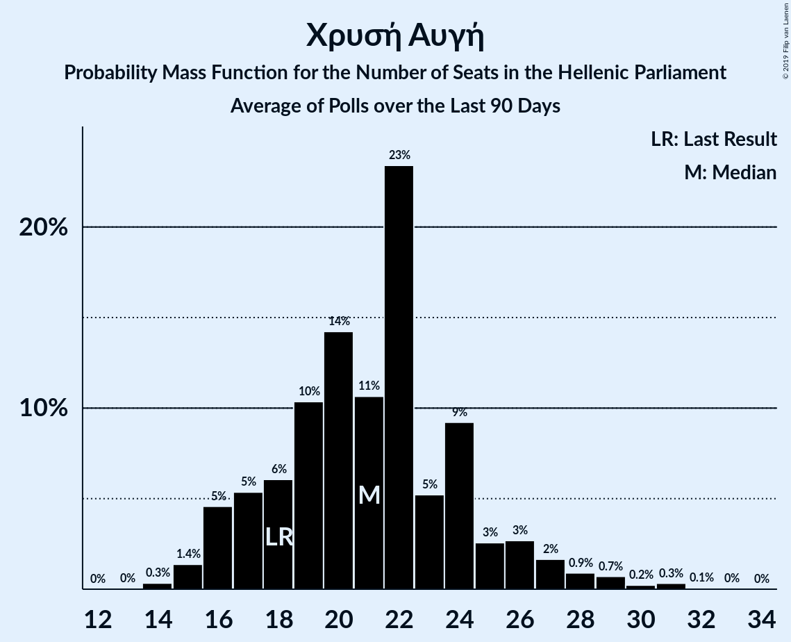

| Number of Seats | Probability | Accumulated | Special Marks |
|:---------------:|:-----------:|:-----------:|:-------------:|
| 0 | 11% | 100% |  |
| 1 | 0% | 89% |  |
| 2 | 0% | 89% |  |
| 3 | 0% | 89% |  |
| 4 | 0% | 89% |  |
| 5 | 0% | 89% |  |
| 6 | 0% | 89% |  |
| 7 | 0% | 89% |  |
| 8 | 1.5% | 89% |  |
| 9 | 13% | 88% |  |
| 10 | 18% | 75% |  |
| 11 | 6% | 57% |  |
| 12 | 4% | 52% | Median |
| 13 | 15% | 47% |  |
| 14 | 18% | 32% |  |
| 15 | 7% | 14% |  |
| 16 | 2% | 7% |  |
| 17 | 2% | 5% |  |
| 18 | 2% | 3% | Last Result |
| 19 | 0.8% | 1.1% |  |
| 20 | 0.2% | 0.3% |  |
| 21 | 0% | 0% |  |

### Κίνημα Αλλαγής

*For a full overview of the results for this party, see the [Κίνημα Αλλαγής](party-κίνημααλλαγής.html) page.*

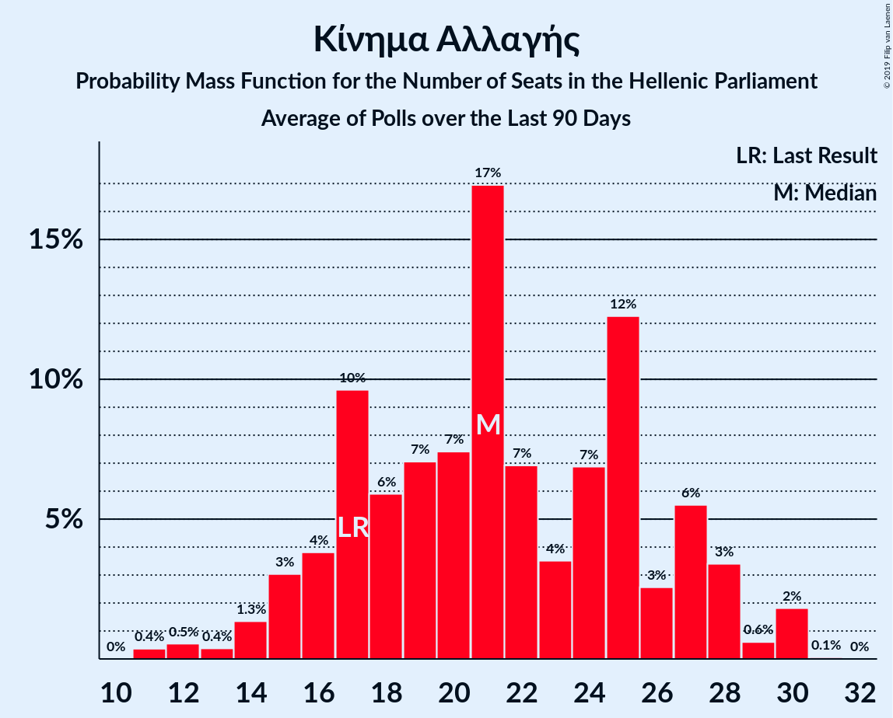

| Number of Seats | Probability | Accumulated | Special Marks |
|:---------------:|:-----------:|:-----------:|:-------------:|
| 12 | 0.2% | 100% |  |
| 13 | 0.7% | 99.8% |  |
| 14 | 2% | 99.1% |  |
| 15 | 6% | 97% |  |
| 16 | 18% | 91% |  |
| 17 | 14% | 74% | Last Result |
| 18 | 22% | 60% | Median |
| 19 | 9% | 38% |  |
| 20 | 14% | 29% |  |
| 21 | 8% | 15% |  |
| 22 | 5% | 7% |  |
| 23 | 2% | 3% |  |
| 24 | 0.6% | 0.9% |  |
| 25 | 0.3% | 0.4% |  |
| 26 | 0.1% | 0.1% |  |
| 27 | 0% | 0% |  |

### Κομμουνιστικό Κόμμα Ελλάδας

*For a full overview of the results for this party, see the [Κομμουνιστικό Κόμμα Ελλάδας](party-κομμουνιστικόκόμμαελλάδας.html) page.*

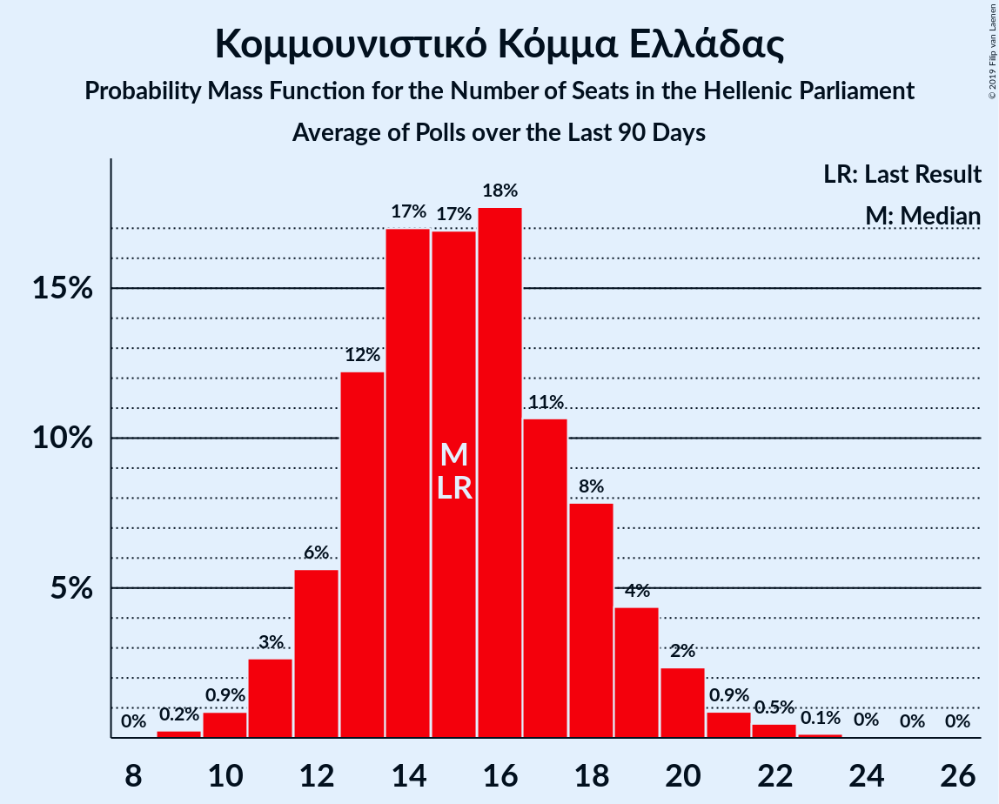

| Number of Seats | Probability | Accumulated | Special Marks |
|:---------------:|:-----------:|:-----------:|:-------------:|
| 0 | 0.1% | 100% |  |
| 1 | 0% | 99.9% |  |
| 2 | 0% | 99.9% |  |
| 3 | 0% | 99.9% |  |
| 4 | 0% | 99.9% |  |
| 5 | 0% | 99.9% |  |
| 6 | 0% | 99.9% |  |
| 7 | 0% | 99.9% |  |
| 8 | 0% | 99.9% |  |
| 9 | 1.0% | 99.9% |  |
| 10 | 3% | 98.9% |  |
| 11 | 8% | 96% |  |
| 12 | 13% | 88% |  |
| 13 | 22% | 75% |  |
| 14 | 21% | 54% | Median |
| 15 | 11% | 33% | Last Result |
| 16 | 12% | 21% |  |
| 17 | 6% | 9% |  |
| 18 | 2% | 3% |  |
| 19 | 0.9% | 1.1% |  |
| 20 | 0.2% | 0.3% |  |
| 21 | 0.1% | 0.1% |  |
| 22 | 0% | 0% |  |

### Το Ποτάμι

*For a full overview of the results for this party, see the [Το Ποτάμι](party-τοποτάμι.html) page.*

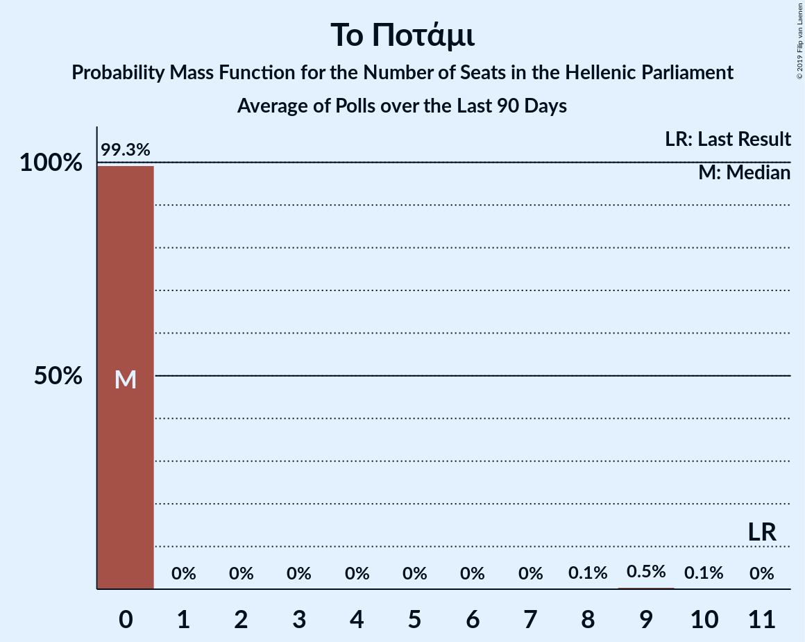

| Number of Seats | Probability | Accumulated | Special Marks |
|:---------------:|:-----------:|:-----------:|:-------------:|
| 0 | 94% | 100% | Median |
| 1 | 0% | 6% |  |
| 2 | 0% | 6% |  |
| 3 | 0% | 6% |  |
| 4 | 0% | 6% |  |
| 5 | 0% | 6% |  |
| 6 | 0% | 6% |  |
| 7 | 0% | 6% |  |
| 8 | 2% | 6% |  |
| 9 | 3% | 4% |  |
| 10 | 0.9% | 1.2% |  |
| 11 | 0.2% | 0.3% | Last Result |
| 12 | 0% | 0% |  |

### Ένωση Κεντρώων

*For a full overview of the results for this party, see the [Ένωση Κεντρώων](party-ένωσηκεντρώων.html) page.*

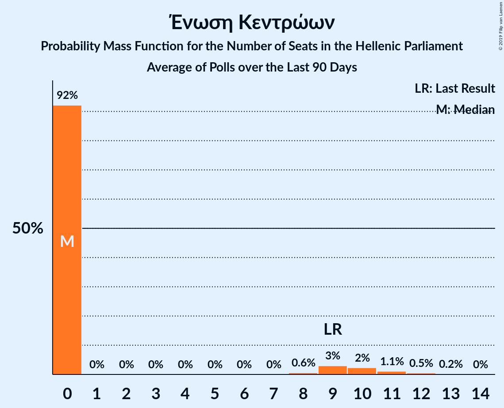

| Number of Seats | Probability | Accumulated | Special Marks |
|:---------------:|:-----------:|:-----------:|:-------------:|
| 0 | 99.7% | 100% | Median |
| 1 | 0% | 0.3% |  |
| 2 | 0% | 0.3% |  |
| 3 | 0% | 0.3% |  |
| 4 | 0% | 0.3% |  |
| 5 | 0% | 0.3% |  |
| 6 | 0% | 0.3% |  |
| 7 | 0% | 0.3% |  |
| 8 | 0.1% | 0.3% |  |
| 9 | 0.1% | 0.1% | Last Result |
| 10 | 0% | 0% |  |

### Πλεύση Ελευθερίας

*For a full overview of the results for this party, see the [Πλεύση Ελευθερίας](party-πλεύσηελευθερίας.html) page.*

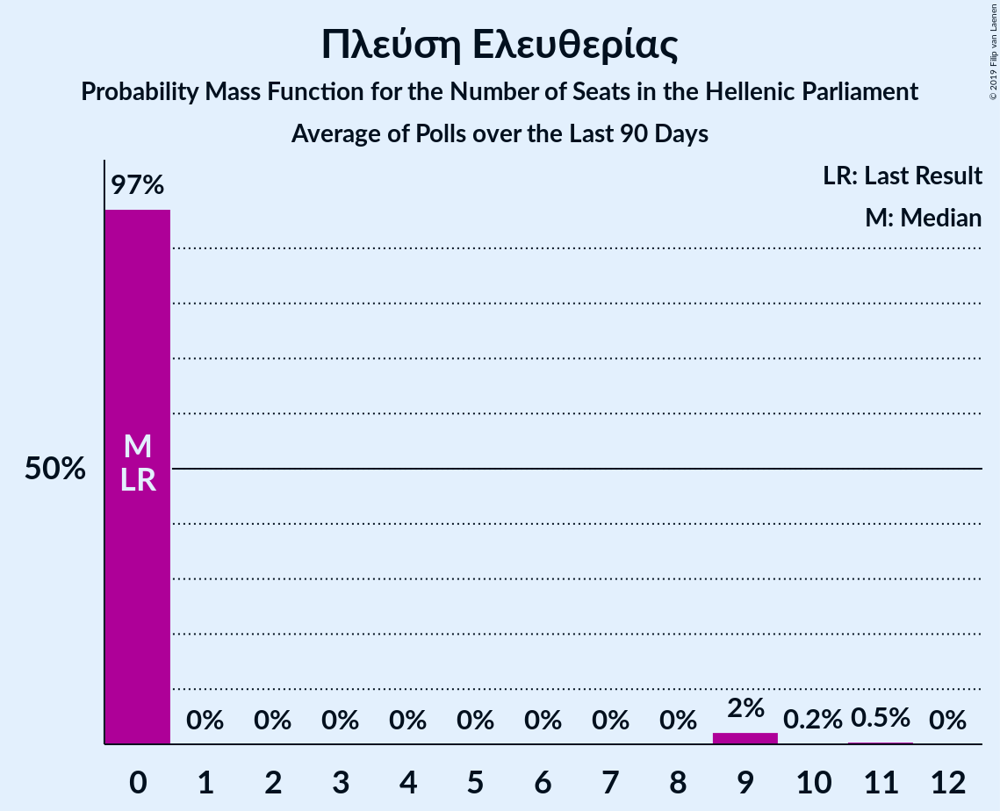

| Number of Seats | Probability | Accumulated | Special Marks |
|:---------------:|:-----------:|:-----------:|:-------------:|
| 0 | 93% | 100% | Last Result, Median |
| 1 | 0% | 7% |  |
| 2 | 0% | 7% |  |
| 3 | 0% | 7% |  |
| 4 | 0% | 7% |  |
| 5 | 0% | 7% |  |
| 6 | 0% | 7% |  |
| 7 | 0% | 7% |  |
| 8 | 2% | 7% |  |
| 9 | 3% | 5% |  |
| 10 | 0.8% | 1.2% |  |
| 11 | 0.3% | 0.3% |  |
| 12 | 0.1% | 0.1% |  |
| 13 | 0% | 0% |  |

### Ελληνική Λύση

*For a full overview of the results for this party, see the [Ελληνική Λύση](party-ελληνικήλύση.html) page.*

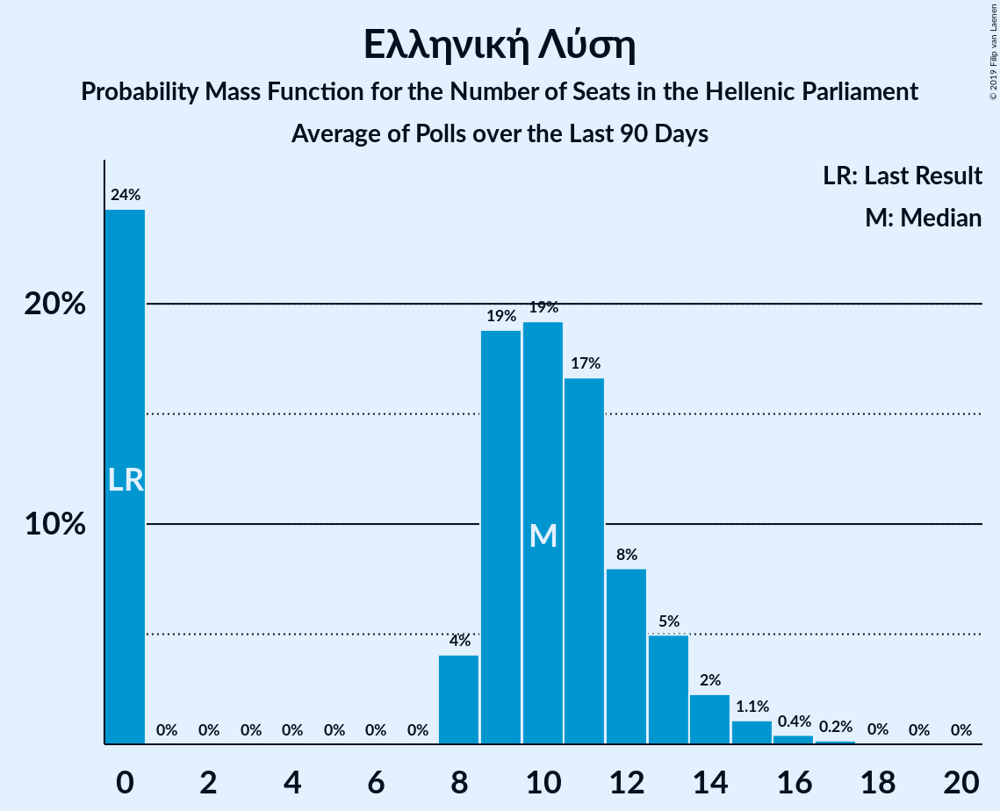

| Number of Seats | Probability | Accumulated | Special Marks |
|:---------------:|:-----------:|:-----------:|:-------------:|
| 0 | 6% | 100% | Last Result |
| 1 | 0% | 94% |  |
| 2 | 0% | 94% |  |
| 3 | 0% | 94% |  |
| 4 | 0% | 94% |  |
| 5 | 0% | 94% |  |
| 6 | 0% | 94% |  |
| 7 | 0% | 94% |  |
| 8 | 0.4% | 94% |  |
| 9 | 9% | 93% |  |
| 10 | 12% | 84% |  |
| 11 | 17% | 72% |  |
| 12 | 20% | 55% | Median |
| 13 | 8% | 34% |  |
| 14 | 10% | 26% |  |
| 15 | 12% | 15% |  |
| 16 | 2% | 3% |  |
| 17 | 0.5% | 1.0% |  |
| 18 | 0.4% | 0.5% |  |
| 19 | 0.1% | 0.1% |  |
| 20 | 0% | 0% |  |

### Μέτωπο Ευρωπαϊκής Ρεαλιστικής Ανυπακοής

*For a full overview of the results for this party, see the [Μέτωπο Ευρωπαϊκής Ρεαλιστικής Ανυπακοής](party-μέτωποευρωπαϊκήςρεαλιστικήςανυπακοής.html) page.*

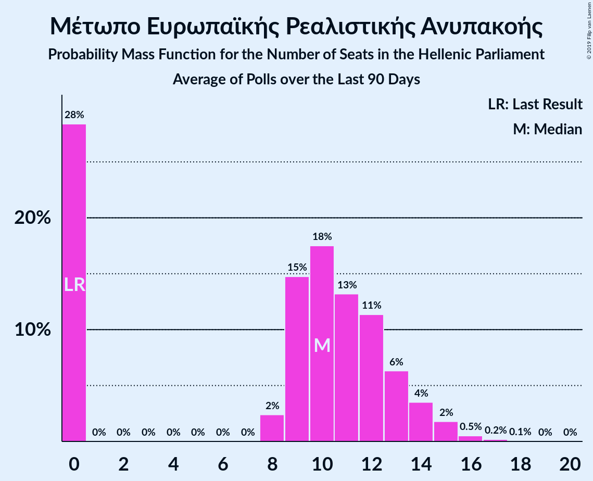

| Number of Seats | Probability | Accumulated | Special Marks |
|:---------------:|:-----------:|:-----------:|:-------------:|
| 0 | 2% | 100% | Last Result |
| 1 | 0% | 98% |  |
| 2 | 0% | 98% |  |
| 3 | 0% | 98% |  |
| 4 | 0% | 98% |  |
| 5 | 0% | 98% |  |
| 6 | 0% | 98% |  |
| 7 | 0% | 98% |  |
| 8 | 0.6% | 98% |  |
| 9 | 6% | 98% |  |
| 10 | 13% | 91% |  |
| 11 | 24% | 79% |  |
| 12 | 29% | 55% | Median |
| 13 | 13% | 26% |  |
| 14 | 8% | 13% |  |
| 15 | 4% | 6% |  |
| 16 | 1.5% | 2% |  |
| 17 | 0.3% | 0.5% |  |
| 18 | 0.1% | 0.2% |  |
| 19 | 0% | 0.1% |  |
| 20 | 0% | 0% |  |

## Coalitions

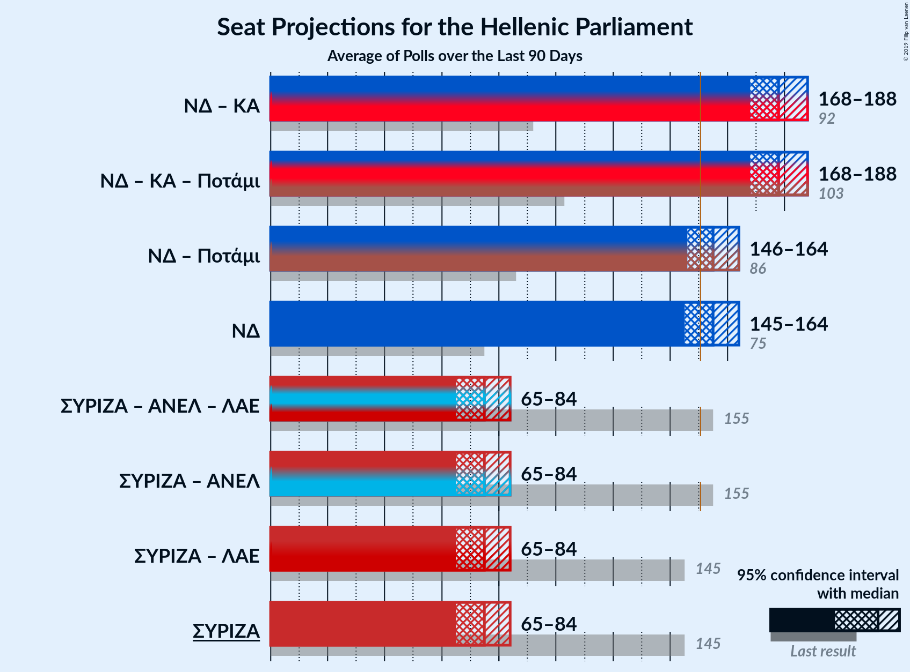

### Confidence Intervals

| Coalition | Last Result | Median | Majority? | 80% Confidence Interval | 90% Confidence Interval | 95% Confidence Interval | 99% Confidence Interval |
|:---------:|:-----------:|:------:|:---------:|:-----------------------:|:-----------------------:|:-----------------------:|:-----------------------:|
| Νέα Δημοκρατία – Κίνημα Αλλαγής – Το Ποτάμι | 103 | 176 | 99.9% | 165–186 | 163–188 | 162–189 | 158–194 |
| Νέα Δημοκρατία – Κίνημα Αλλαγής | 92 | 176 | 99.9% | 165–186 | 163–188 | 161–189 | 157–194 |
| Νέα Δημοκρατία – Το Ποτάμι | 86 | 156 | 75% | 147–166 | 146–170 | 144–172 | 141–175 |
| Νέα Δημοκρατία | 75 | 156 | 73% | 146–166 | 145–170 | 143–172 | 140–175 |
| Συνασπισμός Ριζοσπαστικής Αριστεράς – Μέτωπο Ευρωπαϊκής Ρεαλιστικής Ανυπακοής | 145 | 88 | 0% | 84–94 | 82–96 | 80–97 | 77–101 |
| Συνασπισμός Ριζοσπαστικής Αριστεράς – Ανεξάρτητοι Έλληνες – Λαϊκή Ενότητα | 155 | 77 | 0% | 72–82 | 71–84 | 69–85 | 67–88 |
| Συνασπισμός Ριζοσπαστικής Αριστεράς – Ανεξάρτητοι Έλληνες | 155 | 77 | 0% | 72–82 | 71–84 | 69–85 | 67–88 |
| Συνασπισμός Ριζοσπαστικής Αριστεράς – Λαϊκή Ενότητα | 145 | 77 | 0% | 72–82 | 71–84 | 69–85 | 67–88 |
| Συνασπισμός Ριζοσπαστικής Αριστεράς | 145 | 77 | 0% | 72–82 | 71–84 | 69–85 | 67–88 |

### Νέα Δημοκρατία – Κίνημα Αλλαγής – Το Ποτάμι

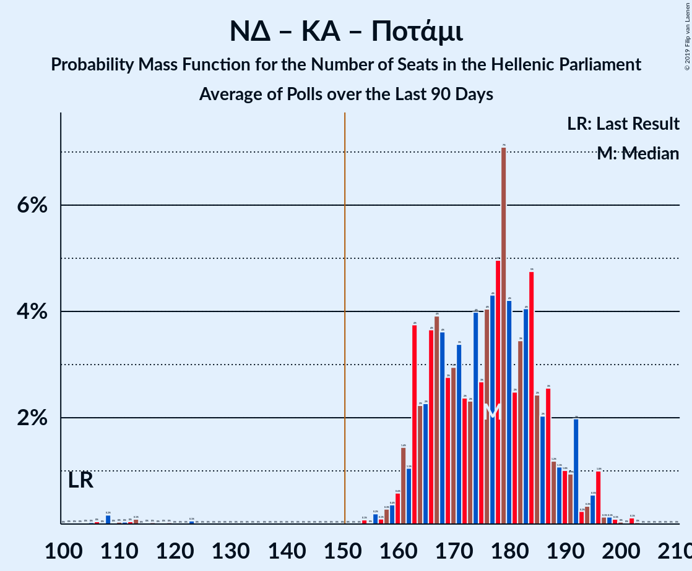

| Number of Seats | Probability | Accumulated | Special Marks |
|:---------------:|:-----------:|:-----------:|:-------------:|
| 103 | 0% | 100% | Last Result |
| 104 | 0% | 100% |  |
| 105 | 0% | 100% |  |
| 106 | 0% | 100% |  |
| 107 | 0% | 100% |  |
| 108 | 0% | 100% |  |
| 109 | 0% | 100% |  |
| 110 | 0% | 99.9% |  |
| 111 | 0% | 99.9% |  |
| 112 | 0% | 99.9% |  |
| 113 | 0% | 99.9% |  |
| 114 | 0% | 99.9% |  |
| 115 | 0% | 99.9% |  |
| 116 | 0% | 99.9% |  |
| 117 | 0% | 99.9% |  |
| 118 | 0% | 99.9% |  |
| 119 | 0% | 99.9% |  |
| 120 | 0% | 99.9% |  |
| 121 | 0% | 99.9% |  |
| 122 | 0% | 99.9% |  |
| 123 | 0% | 99.9% |  |
| 124 | 0% | 99.9% |  |
| 125 | 0% | 99.9% |  |
| 126 | 0% | 99.9% |  |
| 127 | 0% | 99.9% |  |
| 128 | 0% | 99.9% |  |
| 129 | 0% | 99.9% |  |
| 130 | 0% | 99.9% |  |
| 131 | 0% | 99.9% |  |
| 132 | 0% | 99.9% |  |
| 133 | 0% | 99.9% |  |
| 134 | 0% | 99.9% |  |
| 135 | 0% | 99.9% |  |
| 136 | 0% | 99.9% |  |
| 137 | 0% | 99.9% |  |
| 138 | 0% | 99.9% |  |
| 139 | 0% | 99.9% |  |
| 140 | 0% | 99.9% |  |
| 141 | 0% | 99.9% |  |
| 142 | 0% | 99.9% |  |
| 143 | 0% | 99.9% |  |
| 144 | 0% | 99.9% |  |
| 145 | 0% | 99.9% |  |
| 146 | 0% | 99.9% |  |
| 147 | 0% | 99.9% |  |
| 148 | 0% | 99.9% |  |
| 149 | 0% | 99.9% |  |
| 150 | 0% | 99.9% |  |
| 151 | 0% | 99.9% | Majority |
| 152 | 0% | 99.9% |  |
| 153 | 0% | 99.9% |  |
| 154 | 0% | 99.9% |  |
| 155 | 0% | 99.9% |  |
| 156 | 0% | 99.9% |  |
| 157 | 0.2% | 99.8% |  |
| 158 | 0.2% | 99.6% |  |
| 159 | 0.4% | 99.4% |  |
| 160 | 0.6% | 99.0% |  |
| 161 | 0.9% | 98% |  |
| 162 | 0.7% | 98% |  |
| 163 | 2% | 97% |  |
| 164 | 0.9% | 95% |  |
| 165 | 4% | 94% |  |
| 166 | 7% | 90% |  |
| 167 | 11% | 83% |  |
| 168 | 2% | 72% |  |
| 169 | 3% | 70% |  |
| 170 | 1.4% | 66% |  |
| 171 | 5% | 65% |  |
| 172 | 2% | 60% |  |
| 173 | 4% | 59% |  |
| 174 | 1.2% | 55% | Median |
| 175 | 3% | 53% |  |
| 176 | 7% | 51% |  |
| 177 | 6% | 43% |  |
| 178 | 4% | 38% |  |
| 179 | 8% | 33% |  |
| 180 | 2% | 26% |  |
| 181 | 2% | 24% |  |
| 182 | 3% | 21% |  |
| 183 | 4% | 18% |  |
| 184 | 2% | 14% |  |
| 185 | 1.3% | 12% |  |
| 186 | 2% | 10% |  |
| 187 | 2% | 9% |  |
| 188 | 3% | 7% |  |
| 189 | 2% | 4% |  |
| 190 | 1.1% | 2% |  |
| 191 | 0.2% | 1.3% |  |
| 192 | 0.3% | 1.1% |  |
| 193 | 0.2% | 0.8% |  |
| 194 | 0.2% | 0.6% |  |
| 195 | 0.2% | 0.4% |  |
| 196 | 0% | 0.2% |  |
| 197 | 0% | 0.2% |  |
| 198 | 0% | 0.1% |  |
| 199 | 0% | 0.1% |  |
| 200 | 0% | 0.1% |  |
| 201 | 0.1% | 0.1% |  |
| 202 | 0% | 0% |  |

### Νέα Δημοκρατία – Κίνημα Αλλαγής

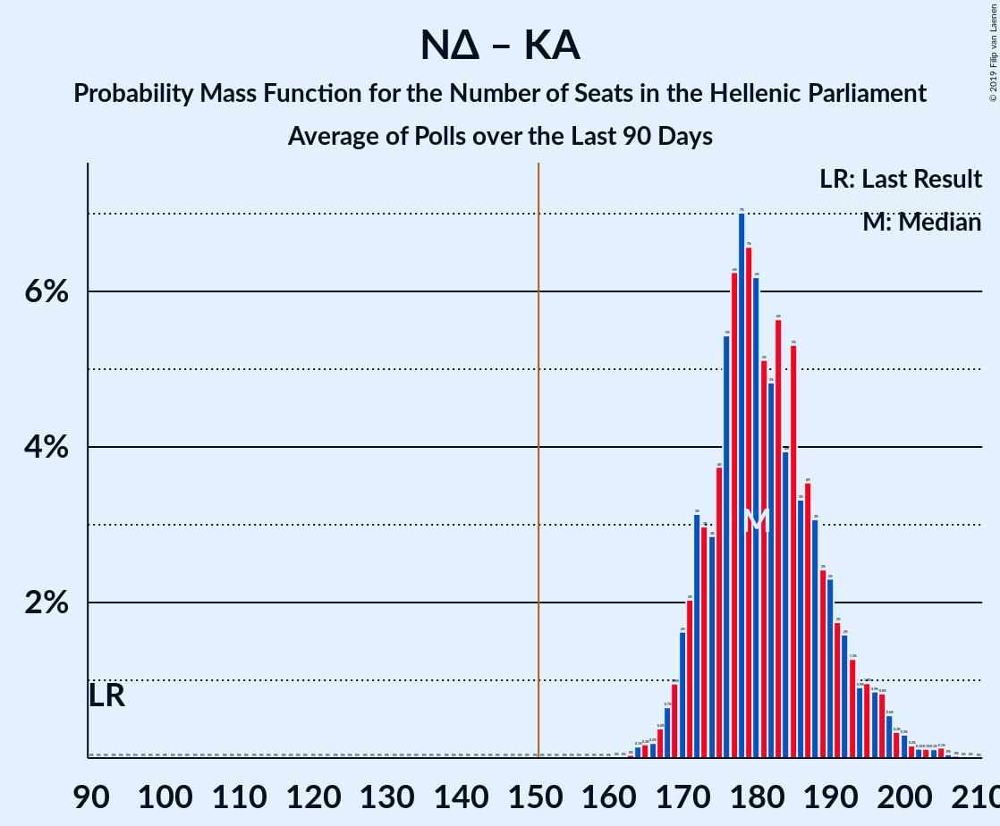

| Number of Seats | Probability | Accumulated | Special Marks |
|:---------------:|:-----------:|:-----------:|:-------------:|
| 92 | 0% | 100% | Last Result |
| 93 | 0% | 100% |  |
| 94 | 0% | 100% |  |
| 95 | 0% | 100% |  |
| 96 | 0% | 100% |  |
| 97 | 0% | 100% |  |
| 98 | 0% | 100% |  |
| 99 | 0% | 100% |  |
| 100 | 0% | 100% |  |
| 101 | 0% | 100% |  |
| 102 | 0% | 100% |  |
| 103 | 0% | 100% |  |
| 104 | 0% | 100% |  |
| 105 | 0% | 100% |  |
| 106 | 0% | 100% |  |
| 107 | 0% | 100% |  |
| 108 | 0% | 100% |  |
| 109 | 0% | 100% |  |
| 110 | 0% | 99.9% |  |
| 111 | 0% | 99.9% |  |
| 112 | 0% | 99.9% |  |
| 113 | 0% | 99.9% |  |
| 114 | 0% | 99.9% |  |
| 115 | 0% | 99.9% |  |
| 116 | 0% | 99.9% |  |
| 117 | 0% | 99.9% |  |
| 118 | 0% | 99.9% |  |
| 119 | 0% | 99.9% |  |
| 120 | 0% | 99.9% |  |
| 121 | 0% | 99.9% |  |
| 122 | 0% | 99.9% |  |
| 123 | 0% | 99.9% |  |
| 124 | 0% | 99.9% |  |
| 125 | 0% | 99.9% |  |
| 126 | 0% | 99.9% |  |
| 127 | 0% | 99.9% |  |
| 128 | 0% | 99.9% |  |
| 129 | 0% | 99.9% |  |
| 130 | 0% | 99.9% |  |
| 131 | 0% | 99.9% |  |
| 132 | 0% | 99.9% |  |
| 133 | 0% | 99.9% |  |
| 134 | 0% | 99.9% |  |
| 135 | 0% | 99.9% |  |
| 136 | 0% | 99.9% |  |
| 137 | 0% | 99.9% |  |
| 138 | 0% | 99.9% |  |
| 139 | 0% | 99.9% |  |
| 140 | 0% | 99.9% |  |
| 141 | 0% | 99.9% |  |
| 142 | 0% | 99.9% |  |
| 143 | 0% | 99.9% |  |
| 144 | 0% | 99.9% |  |
| 145 | 0% | 99.9% |  |
| 146 | 0% | 99.9% |  |
| 147 | 0% | 99.9% |  |
| 148 | 0% | 99.9% |  |
| 149 | 0% | 99.9% |  |
| 150 | 0% | 99.9% |  |
| 151 | 0% | 99.9% | Majority |
| 152 | 0% | 99.9% |  |
| 153 | 0% | 99.9% |  |
| 154 | 0% | 99.9% |  |
| 155 | 0.1% | 99.9% |  |
| 156 | 0.1% | 99.8% |  |
| 157 | 0.3% | 99.7% |  |
| 158 | 0.3% | 99.4% |  |
| 159 | 0.5% | 99.1% |  |
| 160 | 0.7% | 98.7% |  |
| 161 | 2% | 98% |  |
| 162 | 0.8% | 96% |  |
| 163 | 2% | 95% |  |
| 164 | 0.9% | 93% |  |
| 165 | 4% | 92% |  |
| 166 | 7% | 88% |  |
| 167 | 11% | 81% |  |
| 168 | 2% | 70% |  |
| 169 | 2% | 67% |  |
| 170 | 1.4% | 65% |  |
| 171 | 5% | 64% |  |
| 172 | 1.4% | 59% |  |
| 173 | 4% | 58% |  |
| 174 | 1.1% | 53% | Median |
| 175 | 2% | 52% |  |
| 176 | 7% | 50% |  |
| 177 | 6% | 43% |  |
| 178 | 4% | 37% |  |
| 179 | 8% | 33% |  |
| 180 | 2% | 25% |  |
| 181 | 2% | 23% |  |
| 182 | 3% | 21% |  |
| 183 | 4% | 18% |  |
| 184 | 2% | 14% |  |
| 185 | 1.3% | 12% |  |
| 186 | 2% | 10% |  |
| 187 | 2% | 9% |  |
| 188 | 3% | 7% |  |
| 189 | 2% | 4% |  |
| 190 | 1.1% | 2% |  |
| 191 | 0.2% | 1.3% |  |
| 192 | 0.3% | 1.1% |  |
| 193 | 0.2% | 0.8% |  |
| 194 | 0.2% | 0.6% |  |
| 195 | 0.2% | 0.4% |  |
| 196 | 0% | 0.2% |  |
| 197 | 0% | 0.2% |  |
| 198 | 0% | 0.1% |  |
| 199 | 0% | 0.1% |  |
| 200 | 0% | 0.1% |  |
| 201 | 0.1% | 0.1% |  |
| 202 | 0% | 0% |  |

### Νέα Δημοκρατία – Το Ποτάμι

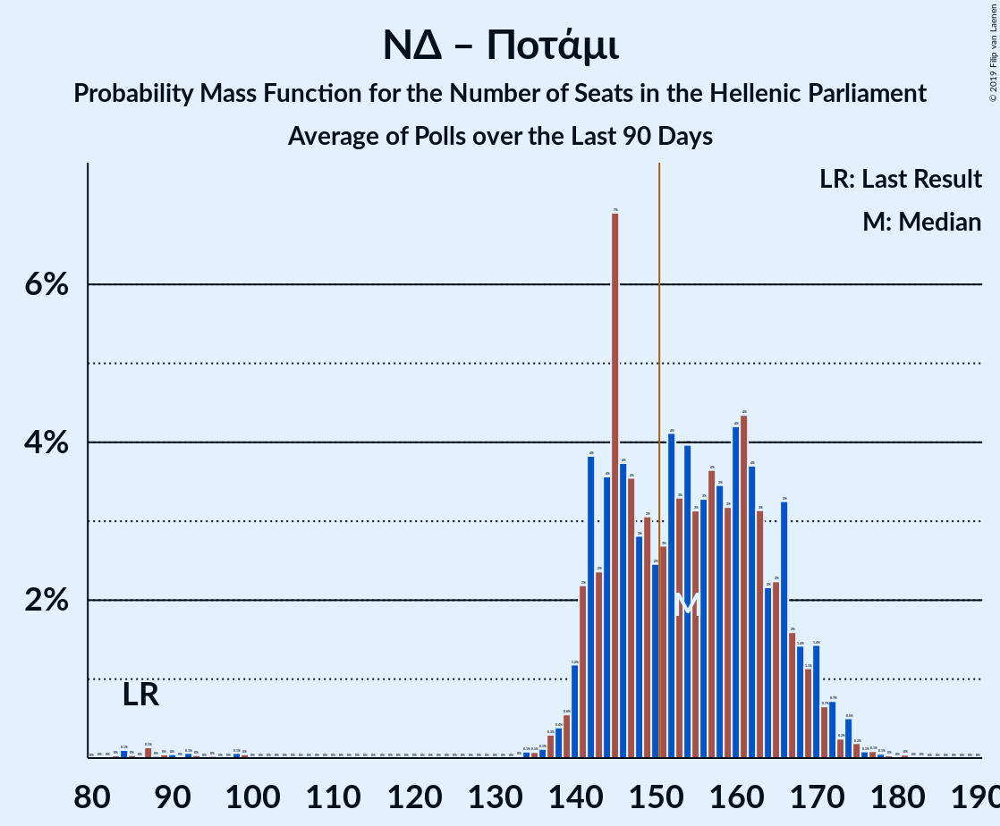

| Number of Seats | Probability | Accumulated | Special Marks |
|:---------------:|:-----------:|:-----------:|:-------------:|
| 86 | 0% | 100% | Last Result |
| 87 | 0% | 100% |  |
| 88 | 0% | 100% |  |
| 89 | 0% | 100% |  |
| 90 | 0% | 99.9% |  |
| 91 | 0% | 99.9% |  |
| 92 | 0% | 99.9% |  |
| 93 | 0% | 99.9% |  |
| 94 | 0% | 99.9% |  |
| 95 | 0% | 99.9% |  |
| 96 | 0% | 99.9% |  |
| 97 | 0% | 99.9% |  |
| 98 | 0% | 99.9% |  |
| 99 | 0% | 99.9% |  |
| 100 | 0% | 99.9% |  |
| 101 | 0% | 99.9% |  |
| 102 | 0% | 99.9% |  |
| 103 | 0% | 99.9% |  |
| 104 | 0% | 99.9% |  |
| 105 | 0% | 99.9% |  |
| 106 | 0% | 99.9% |  |
| 107 | 0% | 99.9% |  |
| 108 | 0% | 99.9% |  |
| 109 | 0% | 99.9% |  |
| 110 | 0% | 99.9% |  |
| 111 | 0% | 99.9% |  |
| 112 | 0% | 99.9% |  |
| 113 | 0% | 99.9% |  |
| 114 | 0% | 99.9% |  |
| 115 | 0% | 99.9% |  |
| 116 | 0% | 99.9% |  |
| 117 | 0% | 99.9% |  |
| 118 | 0% | 99.9% |  |
| 119 | 0% | 99.9% |  |
| 120 | 0% | 99.9% |  |
| 121 | 0% | 99.9% |  |
| 122 | 0% | 99.9% |  |
| 123 | 0% | 99.9% |  |
| 124 | 0% | 99.9% |  |
| 125 | 0% | 99.9% |  |
| 126 | 0% | 99.9% |  |
| 127 | 0% | 99.9% |  |
| 128 | 0% | 99.9% |  |
| 129 | 0% | 99.9% |  |
| 130 | 0% | 99.9% |  |
| 131 | 0% | 99.9% |  |
| 132 | 0% | 99.9% |  |
| 133 | 0% | 99.9% |  |
| 134 | 0% | 99.9% |  |
| 135 | 0% | 99.9% |  |
| 136 | 0% | 99.9% |  |
| 137 | 0% | 99.9% |  |
| 138 | 0% | 99.9% |  |
| 139 | 0.1% | 99.9% |  |
| 140 | 0.1% | 99.8% |  |
| 141 | 0.8% | 99.7% |  |
| 142 | 0.7% | 98.9% |  |
| 143 | 0.4% | 98% |  |
| 144 | 0.7% | 98% |  |
| 145 | 1.1% | 97% |  |
| 146 | 5% | 96% |  |
| 147 | 5% | 91% |  |
| 148 | 0.5% | 86% |  |
| 149 | 0.8% | 85% |  |
| 150 | 9% | 84% |  |
| 151 | 10% | 75% | Majority |
| 152 | 2% | 66% |  |
| 153 | 2% | 63% |  |
| 154 | 3% | 62% |  |
| 155 | 5% | 58% |  |
| 156 | 7% | 54% | Median |
| 157 | 3% | 47% |  |
| 158 | 4% | 44% |  |
| 159 | 2% | 39% |  |
| 160 | 2% | 37% |  |
| 161 | 9% | 35% |  |
| 162 | 4% | 26% |  |
| 163 | 2% | 22% |  |
| 164 | 1.1% | 20% |  |
| 165 | 1.0% | 19% |  |
| 166 | 8% | 18% |  |
| 167 | 2% | 9% |  |
| 168 | 2% | 8% |  |
| 169 | 0.2% | 5% |  |
| 170 | 1.2% | 5% |  |
| 171 | 1.0% | 4% |  |
| 172 | 2% | 3% |  |
| 173 | 0.1% | 0.8% |  |
| 174 | 0.1% | 0.7% |  |
| 175 | 0.1% | 0.6% |  |
| 176 | 0.1% | 0.5% |  |
| 177 | 0.2% | 0.3% |  |
| 178 | 0% | 0.2% |  |
| 179 | 0% | 0.1% |  |
| 180 | 0% | 0.1% |  |
| 181 | 0.1% | 0.1% |  |
| 182 | 0% | 0% |  |

### Νέα Δημοκρατία

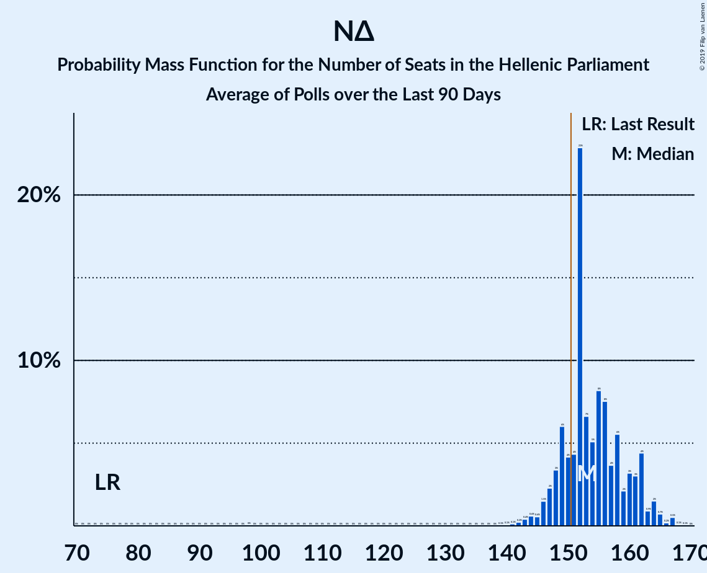

| Number of Seats | Probability | Accumulated | Special Marks |
|:---------------:|:-----------:|:-----------:|:-------------:|
| 75 | 0% | 100% | Last Result |
| 76 | 0% | 100% |  |
| 77 | 0% | 100% |  |
| 78 | 0% | 100% |  |
| 79 | 0% | 100% |  |
| 80 | 0% | 100% |  |
| 81 | 0% | 100% |  |
| 82 | 0% | 100% |  |
| 83 | 0% | 100% |  |
| 84 | 0% | 100% |  |
| 85 | 0% | 100% |  |
| 86 | 0% | 100% |  |
| 87 | 0% | 100% |  |
| 88 | 0% | 100% |  |
| 89 | 0% | 100% |  |
| 90 | 0% | 99.9% |  |
| 91 | 0% | 99.9% |  |
| 92 | 0% | 99.9% |  |
| 93 | 0% | 99.9% |  |
| 94 | 0% | 99.9% |  |
| 95 | 0% | 99.9% |  |
| 96 | 0% | 99.9% |  |
| 97 | 0% | 99.9% |  |
| 98 | 0% | 99.9% |  |
| 99 | 0% | 99.9% |  |
| 100 | 0% | 99.9% |  |
| 101 | 0% | 99.9% |  |
| 102 | 0% | 99.9% |  |
| 103 | 0% | 99.9% |  |
| 104 | 0% | 99.9% |  |
| 105 | 0% | 99.9% |  |
| 106 | 0% | 99.9% |  |
| 107 | 0% | 99.9% |  |
| 108 | 0% | 99.9% |  |
| 109 | 0% | 99.9% |  |
| 110 | 0% | 99.9% |  |
| 111 | 0% | 99.9% |  |
| 112 | 0% | 99.9% |  |
| 113 | 0% | 99.9% |  |
| 114 | 0% | 99.9% |  |
| 115 | 0% | 99.9% |  |
| 116 | 0% | 99.9% |  |
| 117 | 0% | 99.9% |  |
| 118 | 0% | 99.9% |  |
| 119 | 0% | 99.9% |  |
| 120 | 0% | 99.9% |  |
| 121 | 0% | 99.9% |  |
| 122 | 0% | 99.9% |  |
| 123 | 0% | 99.9% |  |
| 124 | 0% | 99.9% |  |
| 125 | 0% | 99.9% |  |
| 126 | 0% | 99.9% |  |
| 127 | 0% | 99.9% |  |
| 128 | 0% | 99.9% |  |
| 129 | 0% | 99.9% |  |
| 130 | 0% | 99.9% |  |
| 131 | 0% | 99.9% |  |
| 132 | 0% | 99.9% |  |
| 133 | 0% | 99.9% |  |
| 134 | 0% | 99.9% |  |
| 135 | 0% | 99.9% |  |
| 136 | 0% | 99.9% |  |
| 137 | 0.1% | 99.9% |  |
| 138 | 0.1% | 99.8% |  |
| 139 | 0.1% | 99.8% |  |
| 140 | 0.2% | 99.6% |  |
| 141 | 0.8% | 99.4% |  |
| 142 | 0.8% | 98.6% |  |
| 143 | 0.8% | 98% |  |
| 144 | 0.8% | 97% |  |
| 145 | 1.3% | 96% |  |
| 146 | 5% | 95% |  |
| 147 | 6% | 90% |  |
| 148 | 0.9% | 84% |  |
| 149 | 0.9% | 83% |  |
| 150 | 9% | 82% |  |
| 151 | 9% | 73% | Majority |
| 152 | 2% | 64% |  |
| 153 | 2% | 61% |  |
| 154 | 3% | 60% |  |
| 155 | 4% | 57% |  |
| 156 | 7% | 52% | Median |
| 157 | 3% | 46% |  |
| 158 | 4% | 43% |  |
| 159 | 2% | 39% |  |
| 160 | 2% | 37% |  |
| 161 | 9% | 35% |  |
| 162 | 4% | 26% |  |
| 163 | 2% | 22% |  |
| 164 | 1.1% | 20% |  |
| 165 | 1.0% | 19% |  |
| 166 | 8% | 18% |  |
| 167 | 2% | 9% |  |
| 168 | 2% | 8% |  |
| 169 | 0.2% | 5% |  |
| 170 | 1.2% | 5% |  |
| 171 | 1.0% | 4% |  |
| 172 | 2% | 3% |  |
| 173 | 0.1% | 0.8% |  |
| 174 | 0.1% | 0.7% |  |
| 175 | 0.1% | 0.6% |  |
| 176 | 0.1% | 0.5% |  |
| 177 | 0.2% | 0.3% |  |
| 178 | 0% | 0.2% |  |
| 179 | 0% | 0.1% |  |
| 180 | 0% | 0.1% |  |
| 181 | 0.1% | 0.1% |  |
| 182 | 0% | 0% |  |

### Συνασπισμός Ριζοσπαστικής Αριστεράς – Μέτωπο Ευρωπαϊκής Ρεαλιστικής Ανυπακοής

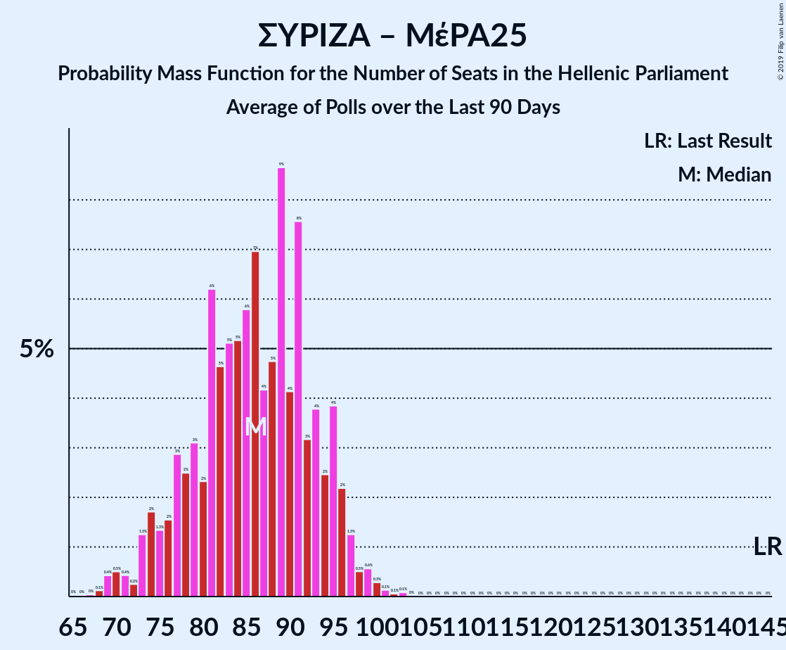

| Number of Seats | Probability | Accumulated | Special Marks |
|:---------------:|:-----------:|:-----------:|:-------------:|
| 73 | 0.1% | 100% |  |
| 74 | 0% | 99.9% |  |
| 75 | 0.2% | 99.8% |  |
| 76 | 0.1% | 99.6% |  |
| 77 | 0.2% | 99.5% |  |
| 78 | 0.4% | 99.3% |  |
| 79 | 0.6% | 98.9% |  |
| 80 | 0.9% | 98% |  |
| 81 | 2% | 97% |  |
| 82 | 1.4% | 95% |  |
| 83 | 3% | 94% |  |
| 84 | 2% | 91% |  |
| 85 | 11% | 88% |  |
| 86 | 8% | 77% |  |
| 87 | 9% | 70% |  |
| 88 | 13% | 61% |  |
| 89 | 10% | 48% | Median |
| 90 | 6% | 38% |  |
| 91 | 10% | 32% |  |
| 92 | 4% | 22% |  |
| 93 | 8% | 18% |  |
| 94 | 3% | 10% |  |
| 95 | 2% | 7% |  |
| 96 | 2% | 5% |  |
| 97 | 1.0% | 3% |  |
| 98 | 0.4% | 2% |  |
| 99 | 0.4% | 1.2% |  |
| 100 | 0.2% | 0.8% |  |
| 101 | 0.3% | 0.6% |  |
| 102 | 0.1% | 0.3% |  |
| 103 | 0.1% | 0.2% |  |
| 104 | 0% | 0.1% |  |
| 105 | 0% | 0.1% |  |
| 106 | 0% | 0.1% |  |
| 107 | 0% | 0.1% |  |
| 108 | 0% | 0.1% |  |
| 109 | 0% | 0.1% |  |
| 110 | 0% | 0.1% |  |
| 111 | 0% | 0.1% |  |
| 112 | 0% | 0.1% |  |
| 113 | 0% | 0.1% |  |
| 114 | 0% | 0.1% |  |
| 115 | 0% | 0.1% |  |
| 116 | 0% | 0.1% |  |
| 117 | 0% | 0.1% |  |
| 118 | 0% | 0.1% |  |
| 119 | 0% | 0.1% |  |
| 120 | 0% | 0.1% |  |
| 121 | 0% | 0.1% |  |
| 122 | 0% | 0.1% |  |
| 123 | 0% | 0.1% |  |
| 124 | 0% | 0.1% |  |
| 125 | 0% | 0.1% |  |
| 126 | 0% | 0.1% |  |
| 127 | 0% | 0.1% |  |
| 128 | 0% | 0.1% |  |
| 129 | 0% | 0.1% |  |
| 130 | 0% | 0.1% |  |
| 131 | 0% | 0.1% |  |
| 132 | 0% | 0.1% |  |
| 133 | 0% | 0.1% |  |
| 134 | 0% | 0.1% |  |
| 135 | 0% | 0.1% |  |
| 136 | 0% | 0.1% |  |
| 137 | 0% | 0.1% |  |
| 138 | 0% | 0.1% |  |
| 139 | 0% | 0.1% |  |
| 140 | 0% | 0.1% |  |
| 141 | 0% | 0.1% |  |
| 142 | 0% | 0.1% |  |
| 143 | 0% | 0.1% |  |
| 144 | 0% | 0.1% |  |
| 145 | 0% | 0.1% | Last Result |
| 146 | 0% | 0.1% |  |
| 147 | 0% | 0.1% |  |
| 148 | 0% | 0.1% |  |
| 149 | 0% | 0.1% |  |
| 150 | 0% | 0.1% |  |
| 151 | 0% | 0% | Majority |

### Συνασπισμός Ριζοσπαστικής Αριστεράς – Ανεξάρτητοι Έλληνες – Λαϊκή Ενότητα

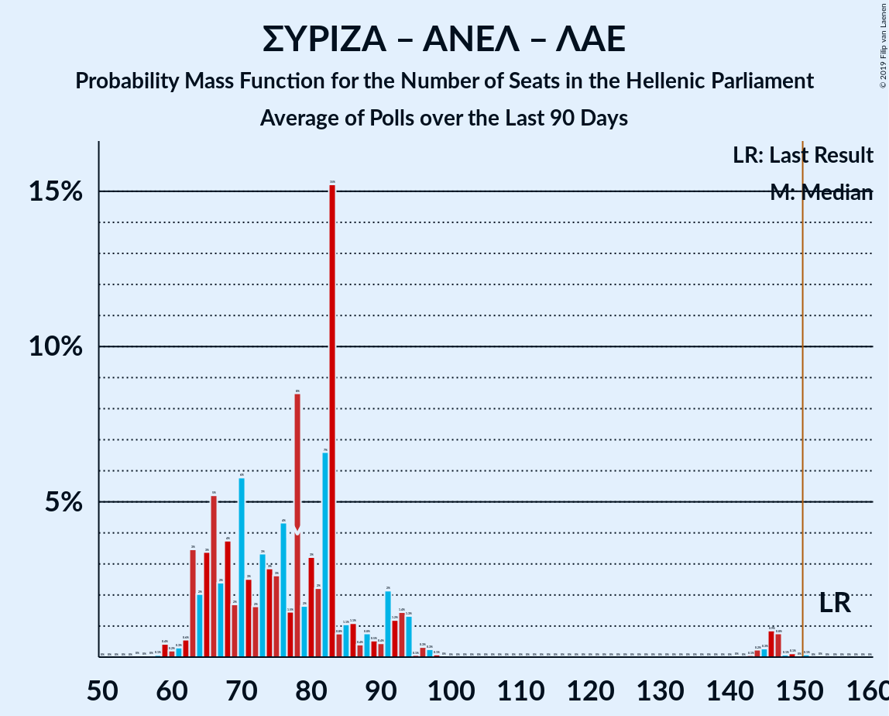

| Number of Seats | Probability | Accumulated | Special Marks |
|:---------------:|:-----------:|:-----------:|:-------------:|
| 64 | 0% | 100% |  |
| 65 | 0.1% | 99.9% |  |
| 66 | 0.2% | 99.8% |  |
| 67 | 0.4% | 99.6% |  |
| 68 | 0.6% | 99.2% |  |
| 69 | 1.4% | 98.5% |  |
| 70 | 1.3% | 97% |  |
| 71 | 3% | 96% |  |
| 72 | 5% | 93% |  |
| 73 | 10% | 89% |  |
| 74 | 7% | 79% |  |
| 75 | 7% | 72% |  |
| 76 | 12% | 65% |  |
| 77 | 10% | 54% | Median |
| 78 | 7% | 43% |  |
| 79 | 13% | 37% |  |
| 80 | 4% | 24% |  |
| 81 | 8% | 20% |  |
| 82 | 4% | 12% |  |
| 83 | 2% | 8% |  |
| 84 | 2% | 6% |  |
| 85 | 1.5% | 4% |  |
| 86 | 1.0% | 2% |  |
| 87 | 0.5% | 1.2% |  |
| 88 | 0.3% | 0.6% |  |
| 89 | 0.2% | 0.3% |  |
| 90 | 0% | 0.2% |  |
| 91 | 0% | 0.1% |  |
| 92 | 0% | 0.1% |  |
| 93 | 0% | 0.1% |  |
| 94 | 0% | 0.1% |  |
| 95 | 0% | 0.1% |  |
| 96 | 0% | 0.1% |  |
| 97 | 0% | 0.1% |  |
| 98 | 0% | 0.1% |  |
| 99 | 0% | 0.1% |  |
| 100 | 0% | 0.1% |  |
| 101 | 0% | 0.1% |  |
| 102 | 0% | 0.1% |  |
| 103 | 0% | 0.1% |  |
| 104 | 0% | 0.1% |  |
| 105 | 0% | 0.1% |  |
| 106 | 0% | 0.1% |  |
| 107 | 0% | 0.1% |  |
| 108 | 0% | 0.1% |  |
| 109 | 0% | 0.1% |  |
| 110 | 0% | 0.1% |  |
| 111 | 0% | 0.1% |  |
| 112 | 0% | 0.1% |  |
| 113 | 0% | 0.1% |  |
| 114 | 0% | 0.1% |  |
| 115 | 0% | 0.1% |  |
| 116 | 0% | 0.1% |  |
| 117 | 0% | 0.1% |  |
| 118 | 0% | 0.1% |  |
| 119 | 0% | 0.1% |  |
| 120 | 0% | 0.1% |  |
| 121 | 0% | 0.1% |  |
| 122 | 0% | 0.1% |  |
| 123 | 0% | 0.1% |  |
| 124 | 0% | 0.1% |  |
| 125 | 0% | 0.1% |  |
| 126 | 0% | 0.1% |  |
| 127 | 0% | 0.1% |  |
| 128 | 0% | 0.1% |  |
| 129 | 0% | 0.1% |  |
| 130 | 0% | 0.1% |  |
| 131 | 0% | 0.1% |  |
| 132 | 0% | 0.1% |  |
| 133 | 0% | 0.1% |  |
| 134 | 0% | 0.1% |  |
| 135 | 0% | 0.1% |  |
| 136 | 0% | 0.1% |  |
| 137 | 0% | 0.1% |  |
| 138 | 0% | 0.1% |  |
| 139 | 0% | 0% |  |
| 140 | 0% | 0% |  |
| 141 | 0% | 0% |  |
| 142 | 0% | 0% |  |
| 143 | 0% | 0% |  |
| 144 | 0% | 0% |  |
| 145 | 0% | 0% |  |
| 146 | 0% | 0% |  |
| 147 | 0% | 0% |  |
| 148 | 0% | 0% |  |
| 149 | 0% | 0% |  |
| 150 | 0% | 0% |  |
| 151 | 0% | 0% | Majority |
| 152 | 0% | 0% |  |
| 153 | 0% | 0% |  |
| 154 | 0% | 0% |  |
| 155 | 0% | 0% | Last Result |

### Συνασπισμός Ριζοσπαστικής Αριστεράς – Ανεξάρτητοι Έλληνες

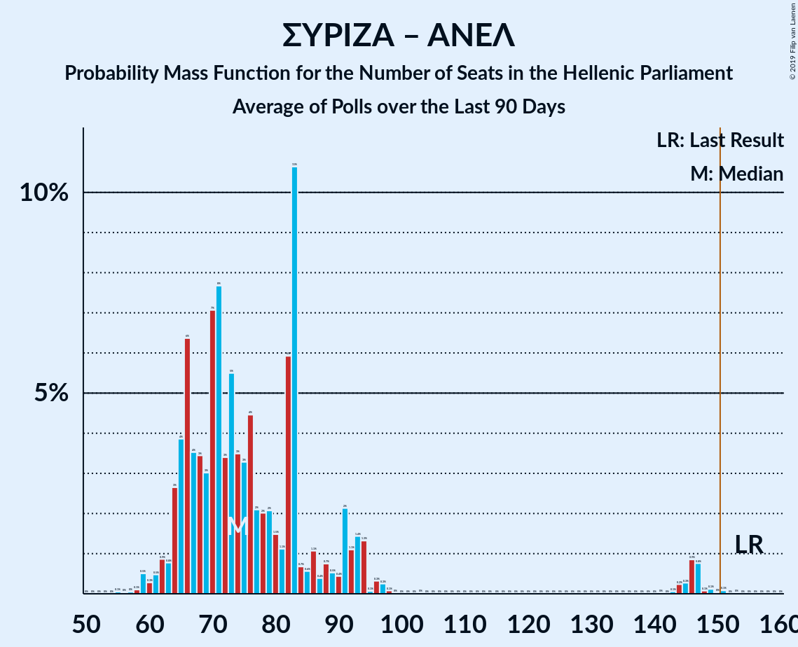

| Number of Seats | Probability | Accumulated | Special Marks |
|:---------------:|:-----------:|:-----------:|:-------------:|
| 64 | 0% | 100% |  |
| 65 | 0.1% | 99.9% |  |
| 66 | 0.2% | 99.8% |  |
| 67 | 0.4% | 99.6% |  |
| 68 | 0.6% | 99.2% |  |
| 69 | 1.4% | 98.5% |  |
| 70 | 1.3% | 97% |  |
| 71 | 3% | 96% |  |
| 72 | 5% | 93% |  |
| 73 | 10% | 89% |  |
| 74 | 7% | 79% |  |
| 75 | 7% | 72% |  |
| 76 | 12% | 65% |  |
| 77 | 10% | 54% | Median |
| 78 | 7% | 43% |  |
| 79 | 13% | 37% |  |
| 80 | 4% | 24% |  |
| 81 | 8% | 20% |  |
| 82 | 4% | 12% |  |
| 83 | 2% | 8% |  |
| 84 | 2% | 6% |  |
| 85 | 1.5% | 4% |  |
| 86 | 1.0% | 2% |  |
| 87 | 0.5% | 1.2% |  |
| 88 | 0.3% | 0.6% |  |
| 89 | 0.2% | 0.3% |  |
| 90 | 0% | 0.2% |  |
| 91 | 0% | 0.1% |  |
| 92 | 0% | 0.1% |  |
| 93 | 0% | 0.1% |  |
| 94 | 0% | 0.1% |  |
| 95 | 0% | 0.1% |  |
| 96 | 0% | 0.1% |  |
| 97 | 0% | 0.1% |  |
| 98 | 0% | 0.1% |  |
| 99 | 0% | 0.1% |  |
| 100 | 0% | 0.1% |  |
| 101 | 0% | 0.1% |  |
| 102 | 0% | 0.1% |  |
| 103 | 0% | 0.1% |  |
| 104 | 0% | 0.1% |  |
| 105 | 0% | 0.1% |  |
| 106 | 0% | 0.1% |  |
| 107 | 0% | 0.1% |  |
| 108 | 0% | 0.1% |  |
| 109 | 0% | 0.1% |  |
| 110 | 0% | 0.1% |  |
| 111 | 0% | 0.1% |  |
| 112 | 0% | 0.1% |  |
| 113 | 0% | 0.1% |  |
| 114 | 0% | 0.1% |  |
| 115 | 0% | 0.1% |  |
| 116 | 0% | 0.1% |  |
| 117 | 0% | 0.1% |  |
| 118 | 0% | 0.1% |  |
| 119 | 0% | 0.1% |  |
| 120 | 0% | 0.1% |  |
| 121 | 0% | 0.1% |  |
| 122 | 0% | 0.1% |  |
| 123 | 0% | 0.1% |  |
| 124 | 0% | 0.1% |  |
| 125 | 0% | 0.1% |  |
| 126 | 0% | 0.1% |  |
| 127 | 0% | 0.1% |  |
| 128 | 0% | 0.1% |  |
| 129 | 0% | 0.1% |  |
| 130 | 0% | 0.1% |  |
| 131 | 0% | 0.1% |  |
| 132 | 0% | 0.1% |  |
| 133 | 0% | 0.1% |  |
| 134 | 0% | 0.1% |  |
| 135 | 0% | 0.1% |  |
| 136 | 0% | 0.1% |  |
| 137 | 0% | 0.1% |  |
| 138 | 0% | 0.1% |  |
| 139 | 0% | 0% |  |
| 140 | 0% | 0% |  |
| 141 | 0% | 0% |  |
| 142 | 0% | 0% |  |
| 143 | 0% | 0% |  |
| 144 | 0% | 0% |  |
| 145 | 0% | 0% |  |
| 146 | 0% | 0% |  |
| 147 | 0% | 0% |  |
| 148 | 0% | 0% |  |
| 149 | 0% | 0% |  |
| 150 | 0% | 0% |  |
| 151 | 0% | 0% | Majority |
| 152 | 0% | 0% |  |
| 153 | 0% | 0% |  |
| 154 | 0% | 0% |  |
| 155 | 0% | 0% | Last Result |

### Συνασπισμός Ριζοσπαστικής Αριστεράς – Λαϊκή Ενότητα

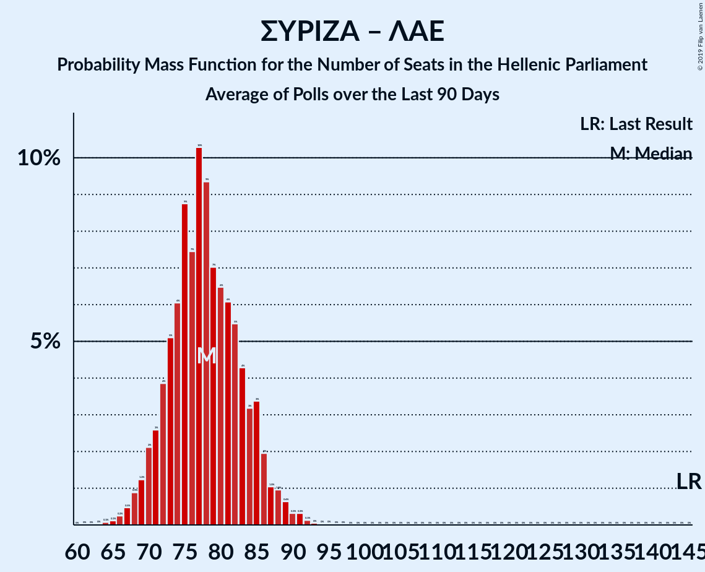

| Number of Seats | Probability | Accumulated | Special Marks |
|:---------------:|:-----------:|:-----------:|:-------------:|
| 64 | 0% | 100% |  |
| 65 | 0.1% | 99.9% |  |
| 66 | 0.2% | 99.8% |  |
| 67 | 0.4% | 99.6% |  |
| 68 | 0.6% | 99.2% |  |
| 69 | 1.4% | 98.5% |  |
| 70 | 1.3% | 97% |  |
| 71 | 3% | 96% |  |
| 72 | 5% | 93% |  |
| 73 | 10% | 89% |  |
| 74 | 7% | 79% |  |
| 75 | 7% | 72% |  |
| 76 | 12% | 65% |  |
| 77 | 10% | 54% | Median |
| 78 | 7% | 43% |  |
| 79 | 13% | 37% |  |
| 80 | 4% | 24% |  |
| 81 | 8% | 20% |  |
| 82 | 4% | 12% |  |
| 83 | 2% | 8% |  |
| 84 | 2% | 6% |  |
| 85 | 1.5% | 4% |  |
| 86 | 1.0% | 2% |  |
| 87 | 0.5% | 1.2% |  |
| 88 | 0.3% | 0.6% |  |
| 89 | 0.2% | 0.3% |  |
| 90 | 0% | 0.2% |  |
| 91 | 0% | 0.1% |  |
| 92 | 0% | 0.1% |  |
| 93 | 0% | 0.1% |  |
| 94 | 0% | 0.1% |  |
| 95 | 0% | 0.1% |  |
| 96 | 0% | 0.1% |  |
| 97 | 0% | 0.1% |  |
| 98 | 0% | 0.1% |  |
| 99 | 0% | 0.1% |  |
| 100 | 0% | 0.1% |  |
| 101 | 0% | 0.1% |  |
| 102 | 0% | 0.1% |  |
| 103 | 0% | 0.1% |  |
| 104 | 0% | 0.1% |  |
| 105 | 0% | 0.1% |  |
| 106 | 0% | 0.1% |  |
| 107 | 0% | 0.1% |  |
| 108 | 0% | 0.1% |  |
| 109 | 0% | 0.1% |  |
| 110 | 0% | 0.1% |  |
| 111 | 0% | 0.1% |  |
| 112 | 0% | 0.1% |  |
| 113 | 0% | 0.1% |  |
| 114 | 0% | 0.1% |  |
| 115 | 0% | 0.1% |  |
| 116 | 0% | 0.1% |  |
| 117 | 0% | 0.1% |  |
| 118 | 0% | 0.1% |  |
| 119 | 0% | 0.1% |  |
| 120 | 0% | 0.1% |  |
| 121 | 0% | 0.1% |  |
| 122 | 0% | 0.1% |  |
| 123 | 0% | 0.1% |  |
| 124 | 0% | 0.1% |  |
| 125 | 0% | 0.1% |  |
| 126 | 0% | 0.1% |  |
| 127 | 0% | 0.1% |  |
| 128 | 0% | 0.1% |  |
| 129 | 0% | 0.1% |  |
| 130 | 0% | 0.1% |  |
| 131 | 0% | 0.1% |  |
| 132 | 0% | 0.1% |  |
| 133 | 0% | 0.1% |  |
| 134 | 0% | 0.1% |  |
| 135 | 0% | 0.1% |  |
| 136 | 0% | 0.1% |  |
| 137 | 0% | 0.1% |  |
| 138 | 0% | 0.1% |  |
| 139 | 0% | 0% |  |
| 140 | 0% | 0% |  |
| 141 | 0% | 0% |  |
| 142 | 0% | 0% |  |
| 143 | 0% | 0% |  |
| 144 | 0% | 0% |  |
| 145 | 0% | 0% | Last Result |

### Συνασπισμός Ριζοσπαστικής Αριστεράς

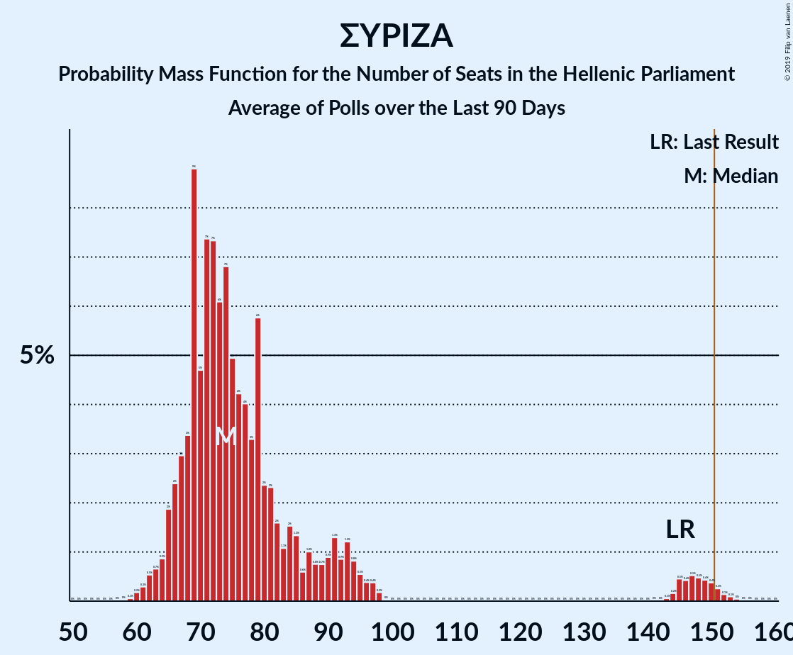

| Number of Seats | Probability | Accumulated | Special Marks |
|:---------------:|:-----------:|:-----------:|:-------------:|
| 64 | 0% | 100% |  |
| 65 | 0.1% | 99.9% |  |
| 66 | 0.2% | 99.8% |  |
| 67 | 0.4% | 99.6% |  |
| 68 | 0.6% | 99.2% |  |
| 69 | 1.4% | 98.5% |  |
| 70 | 1.3% | 97% |  |
| 71 | 3% | 96% |  |
| 72 | 5% | 93% |  |
| 73 | 10% | 89% |  |
| 74 | 7% | 79% |  |
| 75 | 7% | 72% |  |
| 76 | 12% | 65% |  |
| 77 | 10% | 54% | Median |
| 78 | 7% | 43% |  |
| 79 | 13% | 37% |  |
| 80 | 4% | 24% |  |
| 81 | 8% | 20% |  |
| 82 | 4% | 12% |  |
| 83 | 2% | 8% |  |
| 84 | 2% | 6% |  |
| 85 | 1.5% | 4% |  |
| 86 | 1.0% | 2% |  |
| 87 | 0.5% | 1.2% |  |
| 88 | 0.3% | 0.6% |  |
| 89 | 0.2% | 0.3% |  |
| 90 | 0% | 0.2% |  |
| 91 | 0% | 0.1% |  |
| 92 | 0% | 0.1% |  |
| 93 | 0% | 0.1% |  |
| 94 | 0% | 0.1% |  |
| 95 | 0% | 0.1% |  |
| 96 | 0% | 0.1% |  |
| 97 | 0% | 0.1% |  |
| 98 | 0% | 0.1% |  |
| 99 | 0% | 0.1% |  |
| 100 | 0% | 0.1% |  |
| 101 | 0% | 0.1% |  |
| 102 | 0% | 0.1% |  |
| 103 | 0% | 0.1% |  |
| 104 | 0% | 0.1% |  |
| 105 | 0% | 0.1% |  |
| 106 | 0% | 0.1% |  |
| 107 | 0% | 0.1% |  |
| 108 | 0% | 0.1% |  |
| 109 | 0% | 0.1% |  |
| 110 | 0% | 0.1% |  |
| 111 | 0% | 0.1% |  |
| 112 | 0% | 0.1% |  |
| 113 | 0% | 0.1% |  |
| 114 | 0% | 0.1% |  |
| 115 | 0% | 0.1% |  |
| 116 | 0% | 0.1% |  |
| 117 | 0% | 0.1% |  |
| 118 | 0% | 0.1% |  |
| 119 | 0% | 0.1% |  |
| 120 | 0% | 0.1% |  |
| 121 | 0% | 0.1% |  |
| 122 | 0% | 0.1% |  |
| 123 | 0% | 0.1% |  |
| 124 | 0% | 0.1% |  |
| 125 | 0% | 0.1% |  |
| 126 | 0% | 0.1% |  |
| 127 | 0% | 0.1% |  |
| 128 | 0% | 0.1% |  |
| 129 | 0% | 0.1% |  |
| 130 | 0% | 0.1% |  |
| 131 | 0% | 0.1% |  |
| 132 | 0% | 0.1% |  |
| 133 | 0% | 0.1% |  |
| 134 | 0% | 0.1% |  |
| 135 | 0% | 0.1% |  |
| 136 | 0% | 0.1% |  |
| 137 | 0% | 0.1% |  |
| 138 | 0% | 0.1% |  |
| 139 | 0% | 0% |  |
| 140 | 0% | 0% |  |
| 141 | 0% | 0% |  |
| 142 | 0% | 0% |  |
| 143 | 0% | 0% |  |
| 144 | 0% | 0% |  |
| 145 | 0% | 0% | Last Result |

## Technical Information

+ **Number of polls included in this average:** 12
+ **Lowest number of simulations done in a poll included in this average:** 0
+ **Total number of simulations done in the polls included in this average:** 2,097,152
+ **Error estimate:** 1.42%
