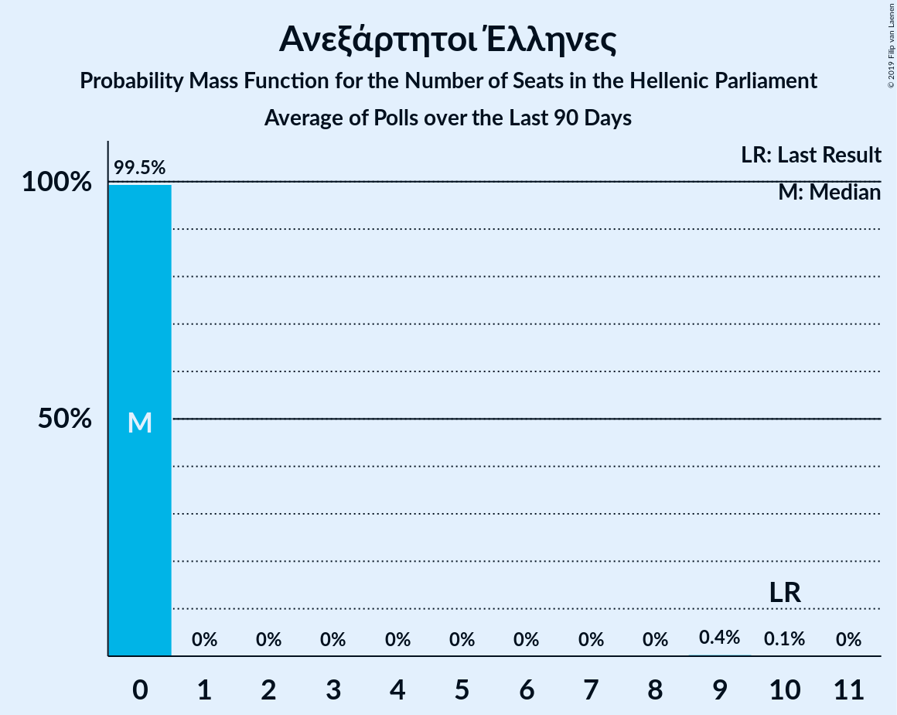
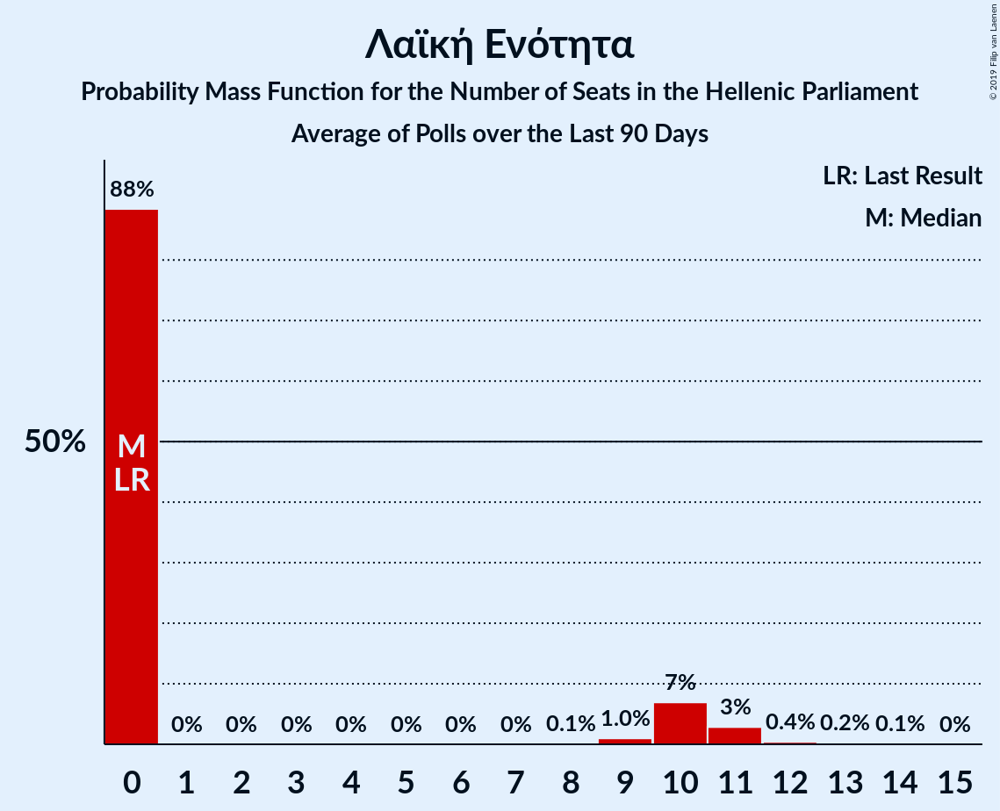

# Poll Average

<a href="#voting-intentions">Voting Intentions</a> | <a href="#seats">Seats</a> | <a href="#coalitions">Coalitions</a> | <a href="#technical-information">Technical Information</a>

## Summary

The table below lists the polls on which the average is based. They are the most recent polls (less than 90 days old) registered and analyzed so far.

| Period     | Polling firm/Commissioner(s) | ΣΥΡΙΖΑ | ΝΔ | ΧΑ | ΚΑ | ΚΚΕ | Ποτάμι | ΑΝΕΛ | ΕΚ | ΛΑΕ | ΠΕ | ΕΛ | ΜέΡΑ25 |
|:----------:|:----------------------------:|:--:|:--:|:--:|:--:|:--:|:--:|:--:|:--:|:--:|:--:|:--:|:--:|
| 20 September 2015 | General Election | 35.5%   145 | 28.1%   75 | 7.0%   18 | 6.3%   17 | 5.6%   15 | 4.1%   11 | 3.7%   10 | 3.4%   9 | 2.9%   0 | 0.0%   0 | 0.0%   0 | 0.0%   0 |
| N/A | Poll Average | 21–31%   68–88 | 30–42%   138–171 | 3–9%   0–27 | 5–10%   17–30 | 4–8%   12–24 | 2–4%   0–12 | 0–3%   0 | 1–4%   0–10 | 1–2%   0 | 1–3%   0–8 | 2–5%   0–14 | 2–6%   0–15 |
| [18–20 June 2019](2019-06-20-Interview.html) | Interview   Βεργίνα TV | 20–25%   65–84 | 31–37%   155–179 | 2–4%   0–15 | 5–8%   16–24 | 4–6%   13–21 | N/A   N/A | N/A   N/A | 1–2%   0 | N/A   N/A | 1–3%   0 | 3–5%   0–18 | 2–4%   0–11 |
| [18–19 June 2019](2019-06-19-PulseRC.html) | Pulse RC   ΣΚΑΪ | 27–32%   69–81 | 35–41%   139–153 | 5–7%   12–19 | 7–10%   17–27 | 6–8%   14–21 | N/A   N/A | N/A   N/A | 2–3%   0–8 | N/A   N/A | 2–3%   0–8 | 3–5%   8–14 | 4–6%   8–14 |
| [17–19 June 2019](2019-06-19-OpinionPoll.html) | Opinion Poll | 24–30%   69–83 | 37–43%   155–170 | 2–5%   0–13 | 5–8%   16–21 | 3–6%   10–16 | N/A   N/A | N/A   N/A | 1–2%   0 | N/A   N/A | 2–3%   0–9 | 3–5%   0–14 | 3–6%   9–15 |
| [13–19 June 2019](2019-06-19-Alco.html) | Alco | 21–26%   68–85 | 30–35%   148–168 | 3–5%   0–18 | 5–8%   17–26 | 4–6%   12–20 | N/A   N/A | N/A   N/A | 1–2%   0 | N/A   N/A | 1–3%   0 | 2–4%   0–14 | 3–5%   0–16 |
| [10–13 June 2019](2019-06-13-Marc.html) | Marc | 26–31%   72–87 | 37–43%   153–170 | 3–5%   8–15 | 7–10%   19–28 | 5–7%   13–20 | N/A   N/A | N/A   N/A | 1–2%   0 | N/A   N/A | N/A   N/A | 3–5%   0–13 | N/A   N/A |
| [10–12 June 2019](2019-06-12-MRB.html) | MRB   Star | 25–31%   70–85 | 34–40%   143–161 | 4–7%   12–19 | 6–9%   15–25 | 5–8%   12–20 | N/A   N/A | N/A   N/A | 1–3%   0–9 | N/A   N/A | N/A   N/A | 2–4%   0–11 | 3–5%   9–15 |
| [3–5 June 2019](2019-06-05-MetronAnalysis.html) | Metron Analysis   Alpha TV | 27–32%   74–90 | 37–43%   151–168 | 4–6%   10–17 | 6–9%   18–26 | 4–6%   10–18 | N/A   N/A | N/A   N/A | N/A   N/A | N/A   N/A | N/A   N/A | 2–4%   0–10 | 3–5%   0–13 |
| [20–23 May 2019](2019-05-23-RB.html) | RB | 22–28%   68–87 | 29–35%   138–160 | 5–8%   16–26 | 6–9%   18–29 | 5–8%   16–26 | 2–4%   0–12 | 1–3%   0 | 2–4%   0–12 | N/A   N/A | 1–2%   0 | 1–3%   0–10 | N/A   N/A |
| [21–23 May 2019](2019-05-23-PalmosAnalysis.html) | Palmos Analysis | 25–30%   72–136 | 29–35%   87–149 | 7–10%   20–29 | 6–9%   18–27 | 6–9%   17–25 | 2–3%   0–9 | 0–2%   0 | 0–2%   0 | 1–2%   0 | N/A   N/A | 3–5%   0–14 | N/A   N/A |
| [21–22 May 2019](2019-05-22-ΚάπαResearch.html) | Κάπα Research | 25–31%   73–141 | 29–35%   87–153 | 6–10%   18–28 | 6–9%   17–26 | 5–8%   13–24 | 2–4%   0–12 | 1–3%   0–9 | 1–3%   0–9 | 1–2%   0 | 1–2%   0 | 2–5%   0–14 | N/A   N/A |
| [2–21 May 2019](2019-05-21-InnovationMetrisis.html) | Innovation Metrisis | 23–28%   65–83 | 32–38%   140–157 | 6–10%   18–27 | 8–11%   23–33 | 6–9%   17–26 | 1–3%   0 | N/A   N/A | 2–4%   0–10 | 1–2%   0 | 1–3%   0 | 2–4%   0–11 | N/A   N/A |
| 20 September 2015 | General Election | 35.5%   145 | 28.1%   75 | 7.0%   18 | 6.3%   17 | 5.6%   15 | 4.1%   11 | 3.7%   10 | 3.4%   9 | 2.9%   0 | 0.0%   0 | 0.0%   0 | 0.0%   0 |

Only polls for which at least the sample size has been published are included in the table above.

**Legend:**
+ **Top half of each row:** Voting intentions (95% confidence interval)
+ **Bottom half of each row:** Seat projections for the Hellenic Parliament (95% confidence interval)
+ **ΣΥΡΙΖΑ:** Συνασπισμός Ριζοσπαστικής Αριστεράς
+ **ΝΔ:** Νέα Δημοκρατία
+ **ΧΑ:** Χρυσή Αυγή
+ **ΚΑ:** Κίνημα Αλλαγής
+ **ΚΚΕ:** Κομμουνιστικό Κόμμα Ελλάδας
+ **Ποτάμι:** Το Ποτάμι
+ **ΑΝΕΛ:** Ανεξάρτητοι Έλληνες
+ **ΕΚ:** Ένωση Κεντρώων
+ **ΛΑΕ:** Λαϊκή Ενότητα
+ **ΠΕ:** Πλεύση Ελευθερίας
+ **ΕΛ:** Ελληνική Λύση
+ **ΜέΡΑ25:** Μέτωπο Ευρωπαϊκής Ρεαλιστικής Ανυπακοής
+ **N/A (single party):** Party not included the published results
+ **N/A (entire row):** Calculation for this opinion poll not started yet

## Voting Intentions

### Confidence Intervals

| Party | Last Result | Median | 80% Confidence Interval | 90% Confidence Interval | 95% Confidence Interval | 99% Confidence Interval |
|:-----:|:-----------:|:------:|:-----------------------:|:-----------------------:|:-----------------------:|:-----------------------:|
| <a href="#συνασπισμός-ριζοσπαστικής-αριστεράς">Συνασπισμός Ριζοσπαστικής Αριστεράς</a> | 35.5% | 27.2% | 22.9–30.0% |22.0–30.7% | 21.3–31.2% | 20.2–32.2% |
| <a href="#νέα-δημοκρατία">Νέα Δημοκρατία</a> | 28.1% | 35.2% | 31.1–40.5% |30.4–41.3% | 29.9–41.9% | 28.8–43.0% |
| <a href="#χρυσή-αυγή">Χρυσή Αυγή</a> | 7.0% | 5.4% | 3.3–8.3% |2.9–8.8% | 2.7–9.2% | 2.3–9.9% |
| <a href="#κίνημα-αλλαγής">Κίνημα Αλλαγής</a> | 6.3% | 7.5% | 6.0–9.2% |5.6–9.7% | 5.3–10.1% | 4.8–11.0% |
| <a href="#κομμουνιστικό-κόμμα-ελλάδας">Κομμουνιστικό Κόμμα Ελλάδας</a> | 5.6% | 5.9% | 4.4–7.7% |4.1–8.1% | 3.9–8.5% | 3.5–9.2% |
| <a href="#το-ποτάμι">Το Ποτάμι</a> | 4.1% | 2.5% | 1.8–3.3% |1.6–3.5% | 1.5–3.7% | 1.2–4.1% |
| <a href="#ανεξάρτητοι-έλληνες">Ανεξάρτητοι Έλληνες</a> | 3.7% | 1.6% | 0.7–2.4% |0.6–2.6% | 0.5–2.8% | 0.4–3.2% |
| <a href="#ένωση-κεντρώων">Ένωση Κεντρώων</a> | 3.4% | 1.7% | 0.9–2.9% |0.7–3.2% | 0.6–3.5% | 0.4–3.9% |
| <a href="#λαϊκή-ενότητα">Λαϊκή Ενότητα</a> | 2.9% | 1.3% | 0.8–1.8% |0.7–2.0% | 0.6–2.2% | 0.5–2.5% |
| <a href="#πλεύση-ελευθερίας">Πλεύση Ελευθερίας</a> | 0.0% | 1.8% | 1.0–2.6% |0.9–2.9% | 0.8–3.1% | 0.6–3.5% |
| <a href="#ελληνική-λύση">Ελληνική Λύση</a> | 0.0% | 3.3% | 2.3–4.4% |2.0–4.7% | 1.8–4.9% | 1.5–5.4% |
| <a href="#μέτωπο-ευρωπαϊκής-ρεαλιστικής-ανυπακοής">Μέτωπο Ευρωπαϊκής Ρεαλιστικής Ανυπακοής</a> | 0.0% | 3.8% | 2.6–4.9% |2.3–5.2% | 2.1–5.5% | 1.7–6.0% |

### Συνασπισμός Ριζοσπαστικής Αριστεράς

*For a full overview of the results for this party, see the [Συνασπισμός Ριζοσπαστικής Αριστεράς](party-συνασπισμόςριζοσπαστικήςαριστεράς.html) page.*

| Voting Intentions | Probability | Accumulated | Special Marks |
|:-----------------:|:-----------:|:-----------:|:-------------:|
| 17.5–18.5% | 0% | 100% |  |
| 18.5–19.5% | 0.1% | 100% |  |
| 19.5–20.5% | 0.7% | 99.9% |  |
| 20.5–21.5% | 2% | 99.2% |  |
| 21.5–22.5% | 5% | 97% |  |
| 22.5–23.5% | 7% | 92% |  |
| 23.5–24.5% | 8% | 85% |  |
| 24.5–25.5% | 9% | 78% |  |
| 25.5–26.5% | 11% | 69% |  |
| 26.5–27.5% | 14% | 58% | Median |
| 27.5–28.5% | 15% | 44% |  |
| 28.5–29.5% | 14% | 29% |  |
| 29.5–30.5% | 9% | 15% |  |
| 30.5–31.5% | 4% | 6% |  |
| 31.5–32.5% | 1.3% | 2% |  |
| 32.5–33.5% | 0.2% | 0.3% |  |
| 33.5–34.5% | 0% | 0% |  |
| 34.5–35.5% | 0% | 0% | Last Result |

### Νέα Δημοκρατία

*For a full overview of the results for this party, see the [Νέα Δημοκρατία](party-νέαδημοκρατία.html) page.*

| Voting Intentions | Probability | Accumulated | Special Marks |
|:-----------------:|:-----------:|:-----------:|:-------------:|
| 26.5–27.5% | 0% | 100% |  |
| 27.5–28.5% | 0.3% | 100% | Last Result |
| 28.5–29.5% | 1.3% | 99.7% |  |
| 29.5–30.5% | 4% | 98% |  |
| 30.5–31.5% | 8% | 94% |  |
| 31.5–32.5% | 11% | 86% |  |
| 32.5–33.5% | 11% | 75% |  |
| 33.5–34.5% | 9% | 64% |  |
| 34.5–35.5% | 7% | 55% | Median |
| 35.5–36.5% | 6% | 48% |  |
| 36.5–37.5% | 7% | 42% |  |
| 37.5–38.5% | 8% | 35% |  |
| 38.5–39.5% | 9% | 27% |  |
| 39.5–40.5% | 8% | 18% |  |
| 40.5–41.5% | 6% | 9% |  |
| 41.5–42.5% | 3% | 4% |  |
| 42.5–43.5% | 0.8% | 1.0% |  |
| 43.5–44.5% | 0.2% | 0.2% |  |
| 44.5–45.5% | 0% | 0% |  |

### Χρυσή Αυγή

*For a full overview of the results for this party, see the [Χρυσή Αυγή](party-χρυσήαυγή.html) page.*

| Voting Intentions | Probability | Accumulated | Special Marks |
|:-----------------:|:-----------:|:-----------:|:-------------:|
| 0.5–1.5% | 0% | 100% |  |
| 1.5–2.5% | 1.4% | 100% |  |
| 2.5–3.5% | 15% | 98.6% |  |
| 3.5–4.5% | 21% | 84% |  |
| 4.5–5.5% | 16% | 63% | Median |
| 5.5–6.5% | 13% | 47% |  |
| 6.5–7.5% | 13% | 34% | Last Result |
| 7.5–8.5% | 13% | 21% |  |
| 8.5–9.5% | 6% | 7% |  |
| 9.5–10.5% | 1.0% | 1.1% |  |
| 10.5–11.5% | 0.1% | 0.1% |  |
| 11.5–12.5% | 0% | 0% |  |

### Κίνημα Αλλαγής

*For a full overview of the results for this party, see the [Κίνημα Αλλαγής](party-κίνημααλλαγής.html) page.*

| Voting Intentions | Probability | Accumulated | Special Marks |
|:-----------------:|:-----------:|:-----------:|:-------------:|
| 2.5–3.5% | 0% | 100% |  |
| 3.5–4.5% | 0.2% | 100% |  |
| 4.5–5.5% | 4% | 99.8% |  |
| 5.5–6.5% | 18% | 96% | Last Result |
| 6.5–7.5% | 29% | 78% | Median |
| 7.5–8.5% | 27% | 49% |  |
| 8.5–9.5% | 15% | 21% |  |
| 9.5–10.5% | 5% | 6% |  |
| 10.5–11.5% | 1.0% | 1.2% |  |
| 11.5–12.5% | 0.1% | 0.1% |  |
| 12.5–13.5% | 0% | 0% |  |

### Κομμουνιστικό Κόμμα Ελλάδας

*For a full overview of the results for this party, see the [Κομμουνιστικό Κόμμα Ελλάδας](party-κομμουνιστικόκόμμαελλάδας.html) page.*

| Voting Intentions | Probability | Accumulated | Special Marks |
|:-----------------:|:-----------:|:-----------:|:-------------:|
| 1.5–2.5% | 0% | 100% |  |
| 2.5–3.5% | 0.7% | 100% |  |
| 3.5–4.5% | 12% | 99.3% |  |
| 4.5–5.5% | 27% | 87% |  |
| 5.5–6.5% | 26% | 60% | Last Result, Median |
| 6.5–7.5% | 21% | 34% |  |
| 7.5–8.5% | 10% | 13% |  |
| 8.5–9.5% | 2% | 2% |  |
| 9.5–10.5% | 0.2% | 0.2% |  |
| 10.5–11.5% | 0% | 0% |  |

### Το Ποτάμι

*For a full overview of the results for this party, see the [Το Ποτάμι](party-τοποτάμι.html) page.*

| Voting Intentions | Probability | Accumulated | Special Marks |
|:-----------------:|:-----------:|:-----------:|:-------------:|
| 0.0–0.5% | 0% | 100% |  |
| 0.5–1.5% | 4% | 100% |  |
| 1.5–2.5% | 50% | 96% | Median |
| 2.5–3.5% | 41% | 46% |  |
| 3.5–4.5% | 4% | 4% | Last Result |
| 4.5–5.5% | 0.1% | 0.1% |  |
| 5.5–6.5% | 0% | 0% |  |

### Ανεξάρτητοι Έλληνες

*For a full overview of the results for this party, see the [Ανεξάρτητοι Έλληνες](party-ανεξάρτητοιέλληνες.html) page.*

| Voting Intentions | Probability | Accumulated | Special Marks |
|:-----------------:|:-----------:|:-----------:|:-------------:|
| 0.0–0.5% | 4% | 100% |  |
| 0.5–1.5% | 45% | 96% |  |
| 1.5–2.5% | 45% | 51% | Median |
| 2.5–3.5% | 6% | 6% |  |
| 3.5–4.5% | 0.1% | 0.1% | Last Result |
| 4.5–5.5% | 0% | 0% |  |

### Ένωση Κεντρώων

*For a full overview of the results for this party, see the [Ένωση Κεντρώων](party-ένωσηκεντρώων.html) page.*

| Voting Intentions | Probability | Accumulated | Special Marks |
|:-----------------:|:-----------:|:-----------:|:-------------:|
| 0.0–0.5% | 1.5% | 100% |  |
| 0.5–1.5% | 41% | 98.5% |  |
| 1.5–2.5% | 37% | 57% | Median |
| 2.5–3.5% | 18% | 20% | Last Result |
| 3.5–4.5% | 2% | 2% |  |
| 4.5–5.5% | 0% | 0% |  |
| 5.5–6.5% | 0% | 0% |  |

### Λαϊκή Ενότητα

*For a full overview of the results for this party, see the [Λαϊκή Ενότητα](party-λαϊκήενότητα.html) page.*

| Voting Intentions | Probability | Accumulated | Special Marks |
|:-----------------:|:-----------:|:-----------:|:-------------:|
| 0.0–0.5% | 1.1% | 100% |  |
| 0.5–1.5% | 74% | 98.9% | Median |
| 1.5–2.5% | 24% | 25% |  |
| 2.5–3.5% | 0.4% | 0.4% | Last Result |
| 3.5–4.5% | 0% | 0% |  |

### Πλεύση Ελευθερίας

*For a full overview of the results for this party, see the [Πλεύση Ελευθερίας](party-πλεύσηελευθερίας.html) page.*

| Voting Intentions | Probability | Accumulated | Special Marks |
|:-----------------:|:-----------:|:-----------:|:-------------:|
| 0.0–0.5% | 0.2% | 100% | Last Result |
| 0.5–1.5% | 36% | 99.8% |  |
| 1.5–2.5% | 51% | 63% | Median |
| 2.5–3.5% | 12% | 12% |  |
| 3.5–4.5% | 0.3% | 0.4% |  |
| 4.5–5.5% | 0% | 0% |  |

### Ελληνική Λύση

*For a full overview of the results for this party, see the [Ελληνική Λύση](party-ελληνικήλύση.html) page.*

| Voting Intentions | Probability | Accumulated | Special Marks |
|:-----------------:|:-----------:|:-----------:|:-------------:|
| 0.0–0.5% | 0% | 100% | Last Result |
| 0.5–1.5% | 0.7% | 100% |  |
| 1.5–2.5% | 17% | 99.3% |  |
| 2.5–3.5% | 43% | 82% | Median |
| 3.5–4.5% | 32% | 39% |  |
| 4.5–5.5% | 7% | 7% |  |
| 5.5–6.5% | 0.3% | 0.3% |  |
| 6.5–7.5% | 0% | 0% |  |

### Μέτωπο Ευρωπαϊκής Ρεαλιστικής Ανυπακοής

*For a full overview of the results for this party, see the [Μέτωπο Ευρωπαϊκής Ρεαλιστικής Ανυπακοής](party-μέτωποευρωπαϊκήςρεαλιστικήςανυπακοής.html) page.*

| Voting Intentions | Probability | Accumulated | Special Marks |
|:-----------------:|:-----------:|:-----------:|:-------------:|
| 0.0–0.5% | 0% | 100% | Last Result |
| 0.5–1.5% | 0.2% | 100% |  |
| 1.5–2.5% | 9% | 99.8% |  |
| 2.5–3.5% | 30% | 91% |  |
| 3.5–4.5% | 42% | 61% | Median |
| 4.5–5.5% | 17% | 19% |  |
| 5.5–6.5% | 2% | 2% |  |
| 6.5–7.5% | 0% | 0.1% |  |
| 7.5–8.5% | 0% | 0% |  |

## Seats

### Confidence Intervals

| Party | Last Result | Median | 80% Confidence Interval | 90% Confidence Interval | 95% Confidence Interval | 99% Confidence Interval |
|:-----:|:-----------:|:------:|:-----------------------:|:-----------------------:|:-----------------------:|:-----------------------:|
| <a href="#συνασπισμός-ριζοσπαστικής-αριστεράς">Συνασπισμός Ριζοσπαστικής Αριστεράς</a> | 145 | 78 | 72–84 |71–86 | 68–88 | 65–137 |
| <a href="#νέα-δημοκρατία">Νέα Δημοκρατία</a> | 75 | 154 | 142–165 |140–168 | 138–171 | 87–175 |
| <a href="#χρυσή-αυγή">Χρυσή Αυγή</a> | 18 | 15 | 9–25 |8–26 | 0–27 | 0–29 |
| <a href="#κίνημα-αλλαγής">Κίνημα Αλλαγής</a> | 17 | 22 | 18–26 |17–28 | 17–30 | 15–32 |
| <a href="#κομμουνιστικό-κόμμα-ελλάδας">Κομμουνιστικό Κόμμα Ελλάδας</a> | 15 | 18 | 13–22 |12–24 | 12–24 | 10–27 |
| <a href="#το-ποτάμι">Το Ποτάμι</a> | 11 | 0 | 0–10 |0–11 | 0–12 | 0–13 |
| <a href="#ανεξάρτητοι-έλληνες">Ανεξάρτητοι Έλληνες</a> | 10 | 0 | 0 |0 | 0 | 0–9 |
| <a href="#ένωση-κεντρώων">Ένωση Κεντρώων</a> | 9 | 0 | 0 |0–9 | 0–10 | 0–12 |
| <a href="#λαϊκή-ενότητα">Λαϊκή Ενότητα</a> | 0 | 0 | 0 |0 | 0 | 0 |
| <a href="#πλεύση-ελευθερίας">Πλεύση Ελευθερίας</a> | 0 | 0 | 0 |0 | 0–8 | 0–10 |
| <a href="#ελληνική-λύση">Ελληνική Λύση</a> | 0 | 9 | 0–12 |0–13 | 0–14 | 0–18 |
| <a href="#μέτωπο-ευρωπαϊκής-ρεαλιστικής-ανυπακοής">Μέτωπο Ευρωπαϊκής Ρεαλιστικής Ανυπακοής</a> | 0 | 11 | 0–13 |0–14 | 0–15 | 0–16 |

### Συνασπισμός Ριζοσπαστικής Αριστεράς

*For a full overview of the results for this party, see the [Συνασπισμός Ριζοσπαστικής Αριστεράς](party-συνασπισμόςριζοσπαστικήςαριστεράς.html) page.*

| Number of Seats | Probability | Accumulated | Special Marks |
|:---------------:|:-----------:|:-----------:|:-------------:|
| 62 | 0% | 100% |  |
| 63 | 0.1% | 99.9% |  |
| 64 | 0.1% | 99.9% |  |
| 65 | 0.4% | 99.8% |  |
| 66 | 0.6% | 99.4% |  |
| 67 | 0.5% | 98.8% |  |
| 68 | 1.1% | 98% |  |
| 69 | 1.0% | 97% |  |
| 70 | 1.0% | 96% |  |
| 71 | 4% | 95% |  |
| 72 | 3% | 92% |  |
| 73 | 6% | 89% |  |
| 74 | 5% | 83% |  |
| 75 | 9% | 79% |  |
| 76 | 6% | 70% |  |
| 77 | 12% | 63% |  |
| 78 | 9% | 51% | Median |
| 79 | 11% | 43% |  |
| 80 | 7% | 32% |  |
| 81 | 6% | 25% |  |
| 82 | 3% | 19% |  |
| 83 | 5% | 15% |  |
| 84 | 2% | 10% |  |
| 85 | 3% | 8% |  |
| 86 | 1.1% | 5% |  |
| 87 | 2% | 4% |  |
| 88 | 0.9% | 3% |  |
| 89 | 0.4% | 2% |  |
| 90 | 0.4% | 1.4% |  |
| 91 | 0.2% | 1.0% |  |
| 92 | 0.1% | 0.9% |  |
| 93 | 0% | 0.8% |  |
| 94 | 0% | 0.8% |  |
| 95 | 0% | 0.8% |  |
| 96 | 0% | 0.7% |  |
| 97 | 0% | 0.7% |  |
| 98 | 0% | 0.7% |  |
| 99 | 0% | 0.7% |  |
| 100 | 0% | 0.7% |  |
| 101 | 0% | 0.7% |  |
| 102 | 0% | 0.7% |  |
| 103 | 0% | 0.7% |  |
| 104 | 0% | 0.7% |  |
| 105 | 0% | 0.7% |  |
| 106 | 0% | 0.7% |  |
| 107 | 0% | 0.7% |  |
| 108 | 0% | 0.7% |  |
| 109 | 0% | 0.7% |  |
| 110 | 0% | 0.7% |  |
| 111 | 0% | 0.7% |  |
| 112 | 0% | 0.7% |  |
| 113 | 0% | 0.7% |  |
| 114 | 0% | 0.7% |  |
| 115 | 0% | 0.7% |  |
| 116 | 0% | 0.7% |  |
| 117 | 0% | 0.7% |  |
| 118 | 0% | 0.7% |  |
| 119 | 0% | 0.7% |  |
| 120 | 0% | 0.7% |  |
| 121 | 0% | 0.7% |  |
| 122 | 0% | 0.7% |  |
| 123 | 0% | 0.7% |  |
| 124 | 0% | 0.7% |  |
| 125 | 0% | 0.7% |  |
| 126 | 0% | 0.7% |  |
| 127 | 0% | 0.7% |  |
| 128 | 0% | 0.7% |  |
| 129 | 0% | 0.7% |  |
| 130 | 0% | 0.7% |  |
| 131 | 0% | 0.7% |  |
| 132 | 0% | 0.7% |  |
| 133 | 0% | 0.7% |  |
| 134 | 0% | 0.7% |  |
| 135 | 0% | 0.6% |  |
| 136 | 0% | 0.6% |  |
| 137 | 0.1% | 0.6% |  |
| 138 | 0.1% | 0.5% |  |
| 139 | 0% | 0.4% |  |
| 140 | 0.1% | 0.4% |  |
| 141 | 0.2% | 0.3% |  |
| 142 | 0% | 0.1% |  |
| 143 | 0.1% | 0.1% |  |
| 144 | 0% | 0% |  |
| 145 | 0% | 0% | Last Result |

### Νέα Δημοκρατία

*For a full overview of the results for this party, see the [Νέα Δημοκρατία](party-νέαδημοκρατία.html) page.*

| Number of Seats | Probability | Accumulated | Special Marks |
|:---------------:|:-----------:|:-----------:|:-------------:|
| 75 | 0% | 100% | Last Result |
| 76 | 0% | 100% |  |
| 77 | 0% | 100% |  |
| 78 | 0% | 100% |  |
| 79 | 0% | 100% |  |
| 80 | 0% | 100% |  |
| 81 | 0% | 99.9% |  |
| 82 | 0.1% | 99.9% |  |
| 83 | 0.1% | 99.9% |  |
| 84 | 0.1% | 99.8% |  |
| 85 | 0.1% | 99.7% |  |
| 86 | 0% | 99.6% |  |
| 87 | 0.2% | 99.6% |  |
| 88 | 0% | 99.5% |  |
| 89 | 0.1% | 99.4% |  |
| 90 | 0% | 99.3% |  |
| 91 | 0% | 99.3% |  |
| 92 | 0% | 99.3% |  |
| 93 | 0% | 99.3% |  |
| 94 | 0% | 99.3% |  |
| 95 | 0% | 99.3% |  |
| 96 | 0% | 99.3% |  |
| 97 | 0% | 99.3% |  |
| 98 | 0% | 99.3% |  |
| 99 | 0% | 99.3% |  |
| 100 | 0% | 99.3% |  |
| 101 | 0% | 99.3% |  |
| 102 | 0% | 99.3% |  |
| 103 | 0% | 99.3% |  |
| 104 | 0% | 99.3% |  |
| 105 | 0% | 99.3% |  |
| 106 | 0% | 99.3% |  |
| 107 | 0% | 99.3% |  |
| 108 | 0% | 99.3% |  |
| 109 | 0% | 99.3% |  |
| 110 | 0% | 99.3% |  |
| 111 | 0% | 99.3% |  |
| 112 | 0% | 99.3% |  |
| 113 | 0% | 99.3% |  |
| 114 | 0% | 99.3% |  |
| 115 | 0% | 99.3% |  |
| 116 | 0% | 99.3% |  |
| 117 | 0% | 99.3% |  |
| 118 | 0% | 99.3% |  |
| 119 | 0% | 99.3% |  |
| 120 | 0% | 99.3% |  |
| 121 | 0% | 99.3% |  |
| 122 | 0% | 99.3% |  |
| 123 | 0% | 99.3% |  |
| 124 | 0% | 99.3% |  |
| 125 | 0% | 99.3% |  |
| 126 | 0% | 99.3% |  |
| 127 | 0% | 99.3% |  |
| 128 | 0% | 99.3% |  |
| 129 | 0% | 99.3% |  |
| 130 | 0% | 99.3% |  |
| 131 | 0% | 99.3% |  |
| 132 | 0.1% | 99.2% |  |
| 133 | 0.1% | 99.2% |  |
| 134 | 0.2% | 99.1% |  |
| 135 | 0.2% | 98.9% |  |
| 136 | 0.6% | 98.7% |  |
| 137 | 0.4% | 98% |  |
| 138 | 0.6% | 98% |  |
| 139 | 0.7% | 97% |  |
| 140 | 2% | 96% |  |
| 141 | 3% | 95% |  |
| 142 | 6% | 92% |  |
| 143 | 2% | 86% |  |
| 144 | 4% | 84% |  |
| 145 | 6% | 80% |  |
| 146 | 3% | 74% |  |
| 147 | 5% | 71% |  |
| 148 | 3% | 66% |  |
| 149 | 2% | 63% |  |
| 150 | 3% | 60% |  |
| 151 | 2% | 57% | Majority |
| 152 | 2% | 55% |  |
| 153 | 2% | 53% |  |
| 154 | 3% | 51% | Median |
| 155 | 3% | 47% |  |
| 156 | 3% | 44% |  |
| 157 | 4% | 41% |  |
| 158 | 3% | 37% |  |
| 159 | 2% | 35% |  |
| 160 | 3% | 33% |  |
| 161 | 7% | 29% |  |
| 162 | 4% | 22% |  |
| 163 | 5% | 18% |  |
| 164 | 1.1% | 13% |  |
| 165 | 2% | 12% |  |
| 166 | 2% | 10% |  |
| 167 | 1.0% | 7% |  |
| 168 | 2% | 6% |  |
| 169 | 0.7% | 4% |  |
| 170 | 0.5% | 3% |  |
| 171 | 0.1% | 3% |  |
| 172 | 0.1% | 2% |  |
| 173 | 0.4% | 2% |  |
| 174 | 0.9% | 2% |  |
| 175 | 0.5% | 1.0% |  |
| 176 | 0% | 0.5% |  |
| 177 | 0.2% | 0.5% |  |
| 178 | 0% | 0.3% |  |
| 179 | 0% | 0.3% |  |
| 180 | 0.1% | 0.2% |  |
| 181 | 0.1% | 0.2% |  |
| 182 | 0% | 0% |  |

### Χρυσή Αυγή

*For a full overview of the results for this party, see the [Χρυσή Αυγή](party-χρυσήαυγή.html) page.*

| Number of Seats | Probability | Accumulated | Special Marks |
|:---------------:|:-----------:|:-----------:|:-------------:|
| 0 | 5% | 100% |  |
| 1 | 0% | 95% |  |
| 2 | 0% | 95% |  |
| 3 | 0% | 95% |  |
| 4 | 0% | 95% |  |
| 5 | 0% | 95% |  |
| 6 | 0% | 95% |  |
| 7 | 0% | 95% |  |
| 8 | 0.2% | 95% |  |
| 9 | 5% | 95% |  |
| 10 | 7% | 90% |  |
| 11 | 6% | 83% |  |
| 12 | 8% | 76% |  |
| 13 | 6% | 68% |  |
| 14 | 10% | 62% |  |
| 15 | 8% | 52% | Median |
| 16 | 4% | 44% |  |
| 17 | 3% | 41% |  |
| 18 | 2% | 38% | Last Result |
| 19 | 3% | 35% |  |
| 20 | 4% | 33% |  |
| 21 | 3% | 28% |  |
| 22 | 5% | 26% |  |
| 23 | 5% | 20% |  |
| 24 | 6% | 16% |  |
| 25 | 4% | 10% |  |
| 26 | 3% | 6% |  |
| 27 | 1.3% | 3% |  |
| 28 | 1.0% | 2% |  |
| 29 | 0.5% | 0.8% |  |
| 30 | 0.2% | 0.3% |  |
| 31 | 0.1% | 0.1% |  |
| 32 | 0% | 0% |  |

### Κίνημα Αλλαγής

*For a full overview of the results for this party, see the [Κίνημα Αλλαγής](party-κίνημααλλαγής.html) page.*

| Number of Seats | Probability | Accumulated | Special Marks |
|:---------------:|:-----------:|:-----------:|:-------------:|
| 13 | 0.1% | 100% |  |
| 14 | 0.2% | 99.9% |  |
| 15 | 0.5% | 99.7% |  |
| 16 | 1.4% | 99.3% |  |
| 17 | 3% | 98% | Last Result |
| 18 | 10% | 94% |  |
| 19 | 6% | 85% |  |
| 20 | 11% | 79% |  |
| 21 | 18% | 68% |  |
| 22 | 12% | 50% | Median |
| 23 | 10% | 38% |  |
| 24 | 10% | 28% |  |
| 25 | 4% | 18% |  |
| 26 | 4% | 14% |  |
| 27 | 3% | 9% |  |
| 28 | 2% | 6% |  |
| 29 | 1.2% | 4% |  |
| 30 | 2% | 3% |  |
| 31 | 0.4% | 1.2% |  |
| 32 | 0.3% | 0.8% |  |
| 33 | 0.4% | 0.5% |  |
| 34 | 0% | 0.1% |  |
| 35 | 0% | 0% |  |

### Κομμουνιστικό Κόμμα Ελλάδας

*For a full overview of the results for this party, see the [Κομμουνιστικό Κόμμα Ελλάδας](party-κομμουνιστικόκόμμαελλάδας.html) page.*

| Number of Seats | Probability | Accumulated | Special Marks |
|:---------------:|:-----------:|:-----------:|:-------------:|
| 9 | 0.1% | 100% |  |
| 10 | 0.8% | 99.8% |  |
| 11 | 2% | 99.0% |  |
| 12 | 4% | 98% |  |
| 13 | 7% | 93% |  |
| 14 | 7% | 86% |  |
| 15 | 8% | 79% | Last Result |
| 16 | 8% | 71% |  |
| 17 | 10% | 63% |  |
| 18 | 12% | 53% | Median |
| 19 | 9% | 41% |  |
| 20 | 12% | 32% |  |
| 21 | 9% | 21% |  |
| 22 | 3% | 12% |  |
| 23 | 3% | 9% |  |
| 24 | 3% | 5% |  |
| 25 | 1.1% | 2% |  |
| 26 | 0.8% | 1.3% |  |
| 27 | 0.3% | 0.5% |  |
| 28 | 0.1% | 0.2% |  |
| 29 | 0.1% | 0.1% |  |
| 30 | 0% | 0% |  |

### Το Ποτάμι

*For a full overview of the results for this party, see the [Το Ποτάμι](party-τοποτάμι.html) page.*

| Number of Seats | Probability | Accumulated | Special Marks |
|:---------------:|:-----------:|:-----------:|:-------------:|
| 0 | 83% | 100% | Median |
| 1 | 0% | 17% |  |
| 2 | 0% | 17% |  |
| 3 | 0% | 17% |  |
| 4 | 0% | 17% |  |
| 5 | 0% | 17% |  |
| 6 | 0% | 17% |  |
| 7 | 0% | 17% |  |
| 8 | 0.1% | 17% |  |
| 9 | 5% | 17% |  |
| 10 | 6% | 12% |  |
| 11 | 3% | 6% | Last Result |
| 12 | 3% | 3% |  |
| 13 | 0.5% | 0.7% |  |
| 14 | 0.1% | 0.1% |  |
| 15 | 0% | 0% |  |

### Ανεξάρτητοι Έλληνες

*For a full overview of the results for this party, see the [Ανεξάρτητοι Έλληνες](party-ανεξάρτητοιέλληνες.html) page.*

| Number of Seats | Probability | Accumulated | Special Marks |
|:---------------:|:-----------:|:-----------:|:-------------:|
| 0 | 98.6% | 100% | Median |
| 1 | 0% | 1.4% |  |
| 2 | 0% | 1.4% |  |
| 3 | 0% | 1.4% |  |
| 4 | 0% | 1.4% |  |
| 5 | 0% | 1.4% |  |
| 6 | 0% | 1.4% |  |
| 7 | 0% | 1.4% |  |
| 8 | 0% | 1.4% |  |
| 9 | 1.1% | 1.4% |  |
| 10 | 0.2% | 0.3% | Last Result |
| 11 | 0.1% | 0.1% |  |
| 12 | 0% | 0% |  |

### Ένωση Κεντρώων

*For a full overview of the results for this party, see the [Ένωση Κεντρώων](party-ένωσηκεντρώων.html) page.*

| Number of Seats | Probability | Accumulated | Special Marks |
|:---------------:|:-----------:|:-----------:|:-------------:|
| 0 | 91% | 100% | Median |
| 1 | 0% | 9% |  |
| 2 | 0% | 9% |  |
| 3 | 0% | 9% |  |
| 4 | 0% | 9% |  |
| 5 | 0% | 9% |  |
| 6 | 0% | 9% |  |
| 7 | 0% | 9% |  |
| 8 | 0.9% | 9% |  |
| 9 | 3% | 8% | Last Result |
| 10 | 2% | 4% |  |
| 11 | 1.1% | 2% |  |
| 12 | 0.5% | 0.8% |  |
| 13 | 0.2% | 0.2% |  |
| 14 | 0% | 0% |  |

### Λαϊκή Ενότητα

*For a full overview of the results for this party, see the [Λαϊκή Ενότητα](party-λαϊκήενότητα.html) page.*

| Number of Seats | Probability | Accumulated | Special Marks |
|:---------------:|:-----------:|:-----------:|:-------------:|
| 0 | 100% | 100% | Last Result, Median |

### Πλεύση Ελευθερίας

*For a full overview of the results for this party, see the [Πλεύση Ελευθερίας](party-πλεύσηελευθερίας.html) page.*

| Number of Seats | Probability | Accumulated | Special Marks |
|:---------------:|:-----------:|:-----------:|:-------------:|
| 0 | 95% | 100% | Last Result, Median |
| 1 | 0% | 5% |  |
| 2 | 0% | 5% |  |
| 3 | 0% | 5% |  |
| 4 | 0% | 5% |  |
| 5 | 0% | 5% |  |
| 6 | 0% | 5% |  |
| 7 | 0% | 5% |  |
| 8 | 4% | 5% |  |
| 9 | 0.7% | 1.3% |  |
| 10 | 0.2% | 0.6% |  |
| 11 | 0.4% | 0.4% |  |
| 12 | 0% | 0% |  |

### Ελληνική Λύση

*For a full overview of the results for this party, see the [Ελληνική Λύση](party-ελληνικήλύση.html) page.*

| Number of Seats | Probability | Accumulated | Special Marks |
|:---------------:|:-----------:|:-----------:|:-------------:|
| 0 | 37% | 100% | Last Result |
| 1 | 0% | 63% |  |
| 2 | 0% | 63% |  |
| 3 | 0% | 63% |  |
| 4 | 0% | 63% |  |
| 5 | 0% | 63% |  |
| 6 | 0% | 63% |  |
| 7 | 0% | 63% |  |
| 8 | 1.2% | 63% |  |
| 9 | 15% | 61% | Median |
| 10 | 13% | 47% |  |
| 11 | 18% | 33% |  |
| 12 | 8% | 16% |  |
| 13 | 3% | 8% |  |
| 14 | 3% | 5% |  |
| 15 | 0.8% | 2% |  |
| 16 | 0.4% | 1.5% |  |
| 17 | 0.6% | 1.1% |  |
| 18 | 0.5% | 0.5% |  |
| 19 | 0% | 0% |  |

### Μέτωπο Ευρωπαϊκής Ρεαλιστικής Ανυπακοής

*For a full overview of the results for this party, see the [Μέτωπο Ευρωπαϊκής Ρεαλιστικής Ανυπακοής](party-μέτωποευρωπαϊκήςρεαλιστικήςανυπακοής.html) page.*

| Number of Seats | Probability | Accumulated | Special Marks |
|:---------------:|:-----------:|:-----------:|:-------------:|
| 0 | 23% | 100% | Last Result |
| 1 | 0% | 77% |  |
| 2 | 0% | 77% |  |
| 3 | 0% | 77% |  |
| 4 | 0% | 77% |  |
| 5 | 0% | 77% |  |
| 6 | 0% | 77% |  |
| 7 | 0% | 77% |  |
| 8 | 3% | 77% |  |
| 9 | 9% | 74% |  |
| 10 | 10% | 66% |  |
| 11 | 25% | 56% | Median |
| 12 | 12% | 31% |  |
| 13 | 13% | 19% |  |
| 14 | 3% | 6% |  |
| 15 | 2% | 3% |  |
| 16 | 0.9% | 1.2% |  |
| 17 | 0.1% | 0.3% |  |
| 18 | 0.1% | 0.1% |  |
| 19 | 0% | 0% |  |

## Coalitions

### Confidence Intervals

| Coalition | Last Result | Median | Majority? | 80% Confidence Interval | 90% Confidence Interval | 95% Confidence Interval | 99% Confidence Interval |
|:---------:|:-----------:|:------:|:---------:|:-----------------------:|:-----------------------:|:-----------------------:|:-----------------------:|
| Νέα Δημοκρατία – Κίνημα Αλλαγής – Το Ποτάμι | 103 | 177 | 99.3% | 164–187 | 163–191 | 161–193 | 113–197 |
| Νέα Δημοκρατία – Κίνημα Αλλαγής | 92 | 176 | 99.3% | 163–187 | 161–191 | 159–193 | 108–197 |
| Νέα Δημοκρατία – Το Ποτάμι | 86 | 155 | 61% | 142–165 | 141–168 | 140–171 | 92–175 |
| Νέα Δημοκρατία | 75 | 154 | 57% | 142–165 | 140–168 | 138–171 | 87–175 |
| Συνασπισμός Ριζοσπαστικής Αριστεράς – Μέτωπο Ευρωπαϊκής Ρεαλιστικής Ανυπακοής | 145 | 87 | 0% | 75–92 | 75–95 | 73–96 | 66–100 |
| Συνασπισμός Ριζοσπαστικής Αριστεράς – Ανεξάρτητοι Έλληνες – Λαϊκή Ενότητα | 155 | 78 | 0% | 72–84 | 71–86 | 68–88 | 65–137 |
| Συνασπισμός Ριζοσπαστικής Αριστεράς – Ανεξάρτητοι Έλληνες | 155 | 78 | 0% | 72–84 | 71–86 | 68–88 | 65–137 |
| Συνασπισμός Ριζοσπαστικής Αριστεράς – Λαϊκή Ενότητα | 145 | 78 | 0% | 72–84 | 71–86 | 68–88 | 65–137 |
| Συνασπισμός Ριζοσπαστικής Αριστεράς | 145 | 78 | 0% | 72–84 | 71–86 | 68–88 | 65–137 |

### Νέα Δημοκρατία – Κίνημα Αλλαγής – Το Ποτάμι

| Number of Seats | Probability | Accumulated | Special Marks |
|:---------------:|:-----------:|:-----------:|:-------------:|
| 103 | 0% | 100% | Last Result |
| 104 | 0% | 100% |  |
| 105 | 0% | 99.9% |  |
| 106 | 0% | 99.9% |  |
| 107 | 0% | 99.9% |  |
| 108 | 0.2% | 99.9% |  |
| 109 | 0% | 99.7% |  |
| 110 | 0% | 99.7% |  |
| 111 | 0% | 99.6% |  |
| 112 | 0% | 99.6% |  |
| 113 | 0.1% | 99.5% |  |
| 114 | 0% | 99.4% |  |
| 115 | 0% | 99.4% |  |
| 116 | 0% | 99.4% |  |
| 117 | 0% | 99.4% |  |
| 118 | 0% | 99.4% |  |
| 119 | 0% | 99.4% |  |
| 120 | 0% | 99.3% |  |
| 121 | 0% | 99.3% |  |
| 122 | 0% | 99.3% |  |
| 123 | 0.1% | 99.3% |  |
| 124 | 0% | 99.3% |  |
| 125 | 0% | 99.3% |  |
| 126 | 0% | 99.3% |  |
| 127 | 0% | 99.3% |  |
| 128 | 0% | 99.3% |  |
| 129 | 0% | 99.3% |  |
| 130 | 0% | 99.3% |  |
| 131 | 0% | 99.3% |  |
| 132 | 0% | 99.3% |  |
| 133 | 0% | 99.3% |  |
| 134 | 0% | 99.3% |  |
| 135 | 0% | 99.3% |  |
| 136 | 0% | 99.3% |  |
| 137 | 0% | 99.3% |  |
| 138 | 0% | 99.3% |  |
| 139 | 0% | 99.3% |  |
| 140 | 0% | 99.3% |  |
| 141 | 0% | 99.3% |  |
| 142 | 0% | 99.3% |  |
| 143 | 0% | 99.3% |  |
| 144 | 0% | 99.3% |  |
| 145 | 0% | 99.3% |  |
| 146 | 0% | 99.3% |  |
| 147 | 0% | 99.3% |  |
| 148 | 0% | 99.3% |  |
| 149 | 0% | 99.3% |  |
| 150 | 0% | 99.3% |  |
| 151 | 0% | 99.3% | Majority |
| 152 | 0% | 99.3% |  |
| 153 | 0% | 99.3% |  |
| 154 | 0.1% | 99.3% |  |
| 155 | 0% | 99.2% |  |
| 156 | 0.2% | 99.2% |  |
| 157 | 0.1% | 99.0% |  |
| 158 | 0.3% | 98.9% |  |
| 159 | 0.4% | 98.6% |  |
| 160 | 0.6% | 98% |  |
| 161 | 1.4% | 98% |  |
| 162 | 1.1% | 96% |  |
| 163 | 4% | 95% |  |
| 164 | 2% | 91% |  |
| 165 | 2% | 89% |  |
| 166 | 4% | 87% |  |
| 167 | 4% | 83% |  |
| 168 | 4% | 79% |  |
| 169 | 3% | 76% |  |
| 170 | 3% | 73% |  |
| 171 | 3% | 70% |  |
| 172 | 2% | 67% |  |
| 173 | 2% | 64% |  |
| 174 | 4% | 62% |  |
| 175 | 3% | 58% |  |
| 176 | 4% | 55% | Median |
| 177 | 4% | 51% |  |
| 178 | 5% | 47% |  |
| 179 | 7% | 42% |  |
| 180 | 4% | 35% |  |
| 181 | 2% | 31% |  |
| 182 | 3% | 28% |  |
| 183 | 4% | 25% |  |
| 184 | 5% | 21% |  |
| 185 | 2% | 16% |  |
| 186 | 2% | 13% |  |
| 187 | 3% | 11% |  |
| 188 | 1.2% | 9% |  |
| 189 | 1.1% | 8% |  |
| 190 | 1.0% | 7% |  |
| 191 | 0.9% | 6% |  |
| 192 | 2% | 5% |  |
| 193 | 0.2% | 3% |  |
| 194 | 0.3% | 2% |  |
| 195 | 0.5% | 2% |  |
| 196 | 1.0% | 2% |  |
| 197 | 0.1% | 0.6% |  |
| 198 | 0.1% | 0.4% |  |
| 199 | 0.1% | 0.3% |  |
| 200 | 0% | 0.2% |  |
| 201 | 0% | 0.2% |  |
| 202 | 0.1% | 0.2% |  |
| 203 | 0% | 0% |  |

### Νέα Δημοκρατία – Κίνημα Αλλαγής

| Number of Seats | Probability | Accumulated | Special Marks |
|:---------------:|:-----------:|:-----------:|:-------------:|
| 92 | 0% | 100% | Last Result |
| 93 | 0% | 100% |  |
| 94 | 0% | 100% |  |
| 95 | 0% | 100% |  |
| 96 | 0% | 100% |  |
| 97 | 0% | 100% |  |
| 98 | 0% | 100% |  |
| 99 | 0% | 100% |  |
| 100 | 0% | 100% |  |
| 101 | 0% | 100% |  |
| 102 | 0% | 100% |  |
| 103 | 0.1% | 99.9% |  |
| 104 | 0% | 99.9% |  |
| 105 | 0% | 99.8% |  |
| 106 | 0.1% | 99.8% |  |
| 107 | 0.1% | 99.7% |  |
| 108 | 0.2% | 99.7% |  |
| 109 | 0% | 99.5% |  |
| 110 | 0% | 99.5% |  |
| 111 | 0% | 99.4% |  |
| 112 | 0% | 99.4% |  |
| 113 | 0% | 99.4% |  |
| 114 | 0.1% | 99.3% |  |
| 115 | 0% | 99.3% |  |
| 116 | 0% | 99.3% |  |
| 117 | 0% | 99.3% |  |
| 118 | 0% | 99.3% |  |
| 119 | 0% | 99.3% |  |
| 120 | 0% | 99.3% |  |
| 121 | 0% | 99.3% |  |
| 122 | 0% | 99.3% |  |
| 123 | 0% | 99.3% |  |
| 124 | 0% | 99.3% |  |
| 125 | 0% | 99.3% |  |
| 126 | 0% | 99.3% |  |
| 127 | 0% | 99.3% |  |
| 128 | 0% | 99.3% |  |
| 129 | 0% | 99.3% |  |
| 130 | 0% | 99.3% |  |
| 131 | 0% | 99.3% |  |
| 132 | 0% | 99.3% |  |
| 133 | 0% | 99.3% |  |
| 134 | 0% | 99.3% |  |
| 135 | 0% | 99.3% |  |
| 136 | 0% | 99.3% |  |
| 137 | 0% | 99.3% |  |
| 138 | 0% | 99.3% |  |
| 139 | 0% | 99.3% |  |
| 140 | 0% | 99.3% |  |
| 141 | 0% | 99.3% |  |
| 142 | 0% | 99.3% |  |
| 143 | 0% | 99.3% |  |
| 144 | 0% | 99.3% |  |
| 145 | 0% | 99.3% |  |
| 146 | 0% | 99.3% |  |
| 147 | 0% | 99.3% |  |
| 148 | 0% | 99.3% |  |
| 149 | 0% | 99.3% |  |
| 150 | 0% | 99.3% |  |
| 151 | 0% | 99.3% | Majority |
| 152 | 0% | 99.2% |  |
| 153 | 0.1% | 99.2% |  |
| 154 | 0.2% | 99.1% |  |
| 155 | 0.1% | 99.0% |  |
| 156 | 0.3% | 98.8% |  |
| 157 | 0.5% | 98.6% |  |
| 158 | 0.4% | 98% |  |
| 159 | 0.5% | 98% |  |
| 160 | 0.9% | 97% |  |
| 161 | 2% | 96% |  |
| 162 | 1.2% | 95% |  |
| 163 | 4% | 94% |  |
| 164 | 2% | 89% |  |
| 165 | 2% | 87% |  |
| 166 | 4% | 85% |  |
| 167 | 4% | 81% |  |
| 168 | 4% | 77% |  |
| 169 | 3% | 73% |  |
| 170 | 3% | 70% |  |
| 171 | 4% | 67% |  |
| 172 | 2% | 64% |  |
| 173 | 3% | 61% |  |
| 174 | 4% | 59% |  |
| 175 | 2% | 55% |  |
| 176 | 4% | 52% | Median |
| 177 | 4% | 48% |  |
| 178 | 5% | 44% |  |
| 179 | 7% | 40% |  |
| 180 | 4% | 33% |  |
| 181 | 2% | 29% |  |
| 182 | 3% | 26% |  |
| 183 | 4% | 23% |  |
| 184 | 4% | 19% |  |
| 185 | 2% | 15% |  |
| 186 | 2% | 13% |  |
| 187 | 2% | 11% |  |
| 188 | 1.1% | 9% |  |
| 189 | 1.0% | 8% |  |
| 190 | 1.0% | 7% |  |
| 191 | 0.9% | 6% |  |
| 192 | 2% | 5% |  |
| 193 | 0.2% | 3% |  |
| 194 | 0.3% | 2% |  |
| 195 | 0.5% | 2% |  |
| 196 | 1.0% | 2% |  |
| 197 | 0.1% | 0.6% |  |
| 198 | 0.1% | 0.4% |  |
| 199 | 0.1% | 0.3% |  |
| 200 | 0% | 0.2% |  |
| 201 | 0% | 0.2% |  |
| 202 | 0.1% | 0.2% |  |
| 203 | 0% | 0% |  |

### Νέα Δημοκρατία – Το Ποτάμι

| Number of Seats | Probability | Accumulated | Special Marks |
|:---------------:|:-----------:|:-----------:|:-------------:|
| 83 | 0% | 100% |  |
| 84 | 0.1% | 99.9% |  |
| 85 | 0% | 99.8% |  |
| 86 | 0% | 99.8% | Last Result |
| 87 | 0.1% | 99.8% |  |
| 88 | 0% | 99.6% |  |
| 89 | 0% | 99.6% |  |
| 90 | 0% | 99.6% |  |
| 91 | 0% | 99.5% |  |
| 92 | 0.1% | 99.5% |  |
| 93 | 0% | 99.4% |  |
| 94 | 0% | 99.4% |  |
| 95 | 0% | 99.4% |  |
| 96 | 0% | 99.4% |  |
| 97 | 0% | 99.4% |  |
| 98 | 0.1% | 99.4% |  |
| 99 | 0% | 99.3% |  |
| 100 | 0% | 99.3% |  |
| 101 | 0% | 99.3% |  |
| 102 | 0% | 99.3% |  |
| 103 | 0% | 99.3% |  |
| 104 | 0% | 99.3% |  |
| 105 | 0% | 99.3% |  |
| 106 | 0% | 99.3% |  |
| 107 | 0% | 99.3% |  |
| 108 | 0% | 99.3% |  |
| 109 | 0% | 99.3% |  |
| 110 | 0% | 99.3% |  |
| 111 | 0% | 99.3% |  |
| 112 | 0% | 99.3% |  |
| 113 | 0% | 99.3% |  |
| 114 | 0% | 99.3% |  |
| 115 | 0% | 99.3% |  |
| 116 | 0% | 99.3% |  |
| 117 | 0% | 99.3% |  |
| 118 | 0% | 99.3% |  |
| 119 | 0% | 99.3% |  |
| 120 | 0% | 99.3% |  |
| 121 | 0% | 99.3% |  |
| 122 | 0% | 99.3% |  |
| 123 | 0% | 99.3% |  |
| 124 | 0% | 99.3% |  |
| 125 | 0% | 99.3% |  |
| 126 | 0% | 99.3% |  |
| 127 | 0% | 99.3% |  |
| 128 | 0% | 99.3% |  |
| 129 | 0% | 99.3% |  |
| 130 | 0% | 99.3% |  |
| 131 | 0% | 99.3% |  |
| 132 | 0% | 99.3% |  |
| 133 | 0% | 99.3% |  |
| 134 | 0.1% | 99.2% |  |
| 135 | 0.1% | 99.2% |  |
| 136 | 0.2% | 99.1% |  |
| 137 | 0.3% | 98.9% |  |
| 138 | 0.4% | 98.6% |  |
| 139 | 0.6% | 98% |  |
| 140 | 1.2% | 98% |  |
| 141 | 2% | 96% |  |
| 142 | 6% | 94% |  |
| 143 | 2% | 88% |  |
| 144 | 3% | 86% |  |
| 145 | 6% | 83% |  |
| 146 | 3% | 77% |  |
| 147 | 4% | 74% |  |
| 148 | 3% | 69% |  |
| 149 | 2% | 66% |  |
| 150 | 3% | 63% |  |
| 151 | 2% | 61% | Majority |
| 152 | 2% | 58% |  |
| 153 | 3% | 56% |  |
| 154 | 3% | 53% | Median |
| 155 | 3% | 50% |  |
| 156 | 3% | 47% |  |
| 157 | 4% | 44% |  |
| 158 | 3% | 39% |  |
| 159 | 2% | 37% |  |
| 160 | 4% | 34% |  |
| 161 | 8% | 30% |  |
| 162 | 4% | 23% |  |
| 163 | 5% | 19% |  |
| 164 | 1.2% | 13% |  |
| 165 | 2% | 12% |  |
| 166 | 2% | 10% |  |
| 167 | 1.1% | 7% |  |
| 168 | 2% | 6% |  |
| 169 | 0.7% | 4% |  |
| 170 | 0.5% | 3% |  |
| 171 | 0.2% | 3% |  |
| 172 | 0.1% | 2% |  |
| 173 | 0.4% | 2% |  |
| 174 | 0.9% | 2% |  |
| 175 | 0.5% | 1.0% |  |
| 176 | 0% | 0.5% |  |
| 177 | 0.2% | 0.5% |  |
| 178 | 0% | 0.3% |  |
| 179 | 0% | 0.3% |  |
| 180 | 0.1% | 0.2% |  |
| 181 | 0.1% | 0.2% |  |
| 182 | 0% | 0% |  |

### Νέα Δημοκρατία

| Number of Seats | Probability | Accumulated | Special Marks |
|:---------------:|:-----------:|:-----------:|:-------------:|
| 75 | 0% | 100% | Last Result |
| 76 | 0% | 100% |  |
| 77 | 0% | 100% |  |
| 78 | 0% | 100% |  |
| 79 | 0% | 100% |  |
| 80 | 0% | 100% |  |
| 81 | 0% | 99.9% |  |
| 82 | 0.1% | 99.9% |  |
| 83 | 0.1% | 99.9% |  |
| 84 | 0.1% | 99.8% |  |
| 85 | 0.1% | 99.7% |  |
| 86 | 0% | 99.6% |  |
| 87 | 0.2% | 99.6% |  |
| 88 | 0% | 99.5% |  |
| 89 | 0.1% | 99.4% |  |
| 90 | 0% | 99.3% |  |
| 91 | 0% | 99.3% |  |
| 92 | 0% | 99.3% |  |
| 93 | 0% | 99.3% |  |
| 94 | 0% | 99.3% |  |
| 95 | 0% | 99.3% |  |
| 96 | 0% | 99.3% |  |
| 97 | 0% | 99.3% |  |
| 98 | 0% | 99.3% |  |
| 99 | 0% | 99.3% |  |
| 100 | 0% | 99.3% |  |
| 101 | 0% | 99.3% |  |
| 102 | 0% | 99.3% |  |
| 103 | 0% | 99.3% |  |
| 104 | 0% | 99.3% |  |
| 105 | 0% | 99.3% |  |
| 106 | 0% | 99.3% |  |
| 107 | 0% | 99.3% |  |
| 108 | 0% | 99.3% |  |
| 109 | 0% | 99.3% |  |
| 110 | 0% | 99.3% |  |
| 111 | 0% | 99.3% |  |
| 112 | 0% | 99.3% |  |
| 113 | 0% | 99.3% |  |
| 114 | 0% | 99.3% |  |
| 115 | 0% | 99.3% |  |
| 116 | 0% | 99.3% |  |
| 117 | 0% | 99.3% |  |
| 118 | 0% | 99.3% |  |
| 119 | 0% | 99.3% |  |
| 120 | 0% | 99.3% |  |
| 121 | 0% | 99.3% |  |
| 122 | 0% | 99.3% |  |
| 123 | 0% | 99.3% |  |
| 124 | 0% | 99.3% |  |
| 125 | 0% | 99.3% |  |
| 126 | 0% | 99.3% |  |
| 127 | 0% | 99.3% |  |
| 128 | 0% | 99.3% |  |
| 129 | 0% | 99.3% |  |
| 130 | 0% | 99.3% |  |
| 131 | 0% | 99.3% |  |
| 132 | 0.1% | 99.2% |  |
| 133 | 0.1% | 99.2% |  |
| 134 | 0.2% | 99.1% |  |
| 135 | 0.2% | 98.9% |  |
| 136 | 0.6% | 98.7% |  |
| 137 | 0.4% | 98% |  |
| 138 | 0.6% | 98% |  |
| 139 | 0.7% | 97% |  |
| 140 | 2% | 96% |  |
| 141 | 3% | 95% |  |
| 142 | 6% | 92% |  |
| 143 | 2% | 86% |  |
| 144 | 4% | 84% |  |
| 145 | 6% | 80% |  |
| 146 | 3% | 74% |  |
| 147 | 5% | 71% |  |
| 148 | 3% | 66% |  |
| 149 | 2% | 63% |  |
| 150 | 3% | 60% |  |
| 151 | 2% | 57% | Majority |
| 152 | 2% | 55% |  |
| 153 | 2% | 53% |  |
| 154 | 3% | 51% | Median |
| 155 | 3% | 47% |  |
| 156 | 3% | 44% |  |
| 157 | 4% | 41% |  |
| 158 | 3% | 37% |  |
| 159 | 2% | 35% |  |
| 160 | 3% | 33% |  |
| 161 | 7% | 29% |  |
| 162 | 4% | 22% |  |
| 163 | 5% | 18% |  |
| 164 | 1.1% | 13% |  |
| 165 | 2% | 12% |  |
| 166 | 2% | 10% |  |
| 167 | 1.0% | 7% |  |
| 168 | 2% | 6% |  |
| 169 | 0.7% | 4% |  |
| 170 | 0.5% | 3% |  |
| 171 | 0.1% | 3% |  |
| 172 | 0.1% | 2% |  |
| 173 | 0.4% | 2% |  |
| 174 | 0.9% | 2% |  |
| 175 | 0.5% | 1.0% |  |
| 176 | 0% | 0.5% |  |
| 177 | 0.2% | 0.5% |  |
| 178 | 0% | 0.3% |  |
| 179 | 0% | 0.3% |  |
| 180 | 0.1% | 0.2% |  |
| 181 | 0.1% | 0.2% |  |
| 182 | 0% | 0% |  |

### Συνασπισμός Ριζοσπαστικής Αριστεράς – Μέτωπο Ευρωπαϊκής Ρεαλιστικής Ανυπακοής

| Number of Seats | Probability | Accumulated | Special Marks |
|:---------------:|:-----------:|:-----------:|:-------------:|
| 65 | 0.3% | 100% |  |
| 66 | 0.2% | 99.7% |  |
| 67 | 0% | 99.5% |  |
| 68 | 0.3% | 99.5% |  |
| 69 | 0.2% | 99.2% |  |
| 70 | 0.1% | 99.0% |  |
| 71 | 0.4% | 98.9% |  |
| 72 | 0.5% | 98% |  |
| 73 | 1.0% | 98% |  |
| 74 | 1.3% | 97% |  |
| 75 | 6% | 96% |  |
| 76 | 3% | 89% |  |
| 77 | 1.4% | 87% |  |
| 78 | 2% | 85% |  |
| 79 | 3% | 83% |  |
| 80 | 1.5% | 80% |  |
| 81 | 4% | 78% |  |
| 82 | 3% | 74% |  |
| 83 | 7% | 71% |  |
| 84 | 4% | 65% |  |
| 85 | 4% | 61% |  |
| 86 | 6% | 57% |  |
| 87 | 4% | 51% |  |
| 88 | 14% | 46% |  |
| 89 | 7% | 33% | Median |
| 90 | 6% | 26% |  |
| 91 | 7% | 20% |  |
| 92 | 4% | 13% |  |
| 93 | 2% | 8% |  |
| 94 | 1.0% | 6% |  |
| 95 | 1.3% | 5% |  |
| 96 | 2% | 4% |  |
| 97 | 0.5% | 2% |  |
| 98 | 0.4% | 2% |  |
| 99 | 0.6% | 1.1% |  |
| 100 | 0.2% | 0.5% |  |
| 101 | 0.1% | 0.4% |  |
| 102 | 0.2% | 0.2% |  |
| 103 | 0% | 0.1% |  |
| 104 | 0% | 0% |  |
| 105 | 0% | 0% |  |
| 106 | 0% | 0% |  |
| 107 | 0% | 0% |  |
| 108 | 0% | 0% |  |
| 109 | 0% | 0% |  |
| 110 | 0% | 0% |  |
| 111 | 0% | 0% |  |
| 112 | 0% | 0% |  |
| 113 | 0% | 0% |  |
| 114 | 0% | 0% |  |
| 115 | 0% | 0% |  |
| 116 | 0% | 0% |  |
| 117 | 0% | 0% |  |
| 118 | 0% | 0% |  |
| 119 | 0% | 0% |  |
| 120 | 0% | 0% |  |
| 121 | 0% | 0% |  |
| 122 | 0% | 0% |  |
| 123 | 0% | 0% |  |
| 124 | 0% | 0% |  |
| 125 | 0% | 0% |  |
| 126 | 0% | 0% |  |
| 127 | 0% | 0% |  |
| 128 | 0% | 0% |  |
| 129 | 0% | 0% |  |
| 130 | 0% | 0% |  |
| 131 | 0% | 0% |  |
| 132 | 0% | 0% |  |
| 133 | 0% | 0% |  |
| 134 | 0% | 0% |  |
| 135 | 0% | 0% |  |
| 136 | 0% | 0% |  |
| 137 | 0% | 0% |  |
| 138 | 0% | 0% |  |
| 139 | 0% | 0% |  |
| 140 | 0% | 0% |  |
| 141 | 0% | 0% |  |
| 142 | 0% | 0% |  |
| 143 | 0% | 0% |  |
| 144 | 0% | 0% |  |
| 145 | 0% | 0% | Last Result |

### Συνασπισμός Ριζοσπαστικής Αριστεράς – Ανεξάρτητοι Έλληνες – Λαϊκή Ενότητα

| Number of Seats | Probability | Accumulated | Special Marks |
|:---------------:|:-----------:|:-----------:|:-------------:|
| 62 | 0% | 100% |  |
| 63 | 0.1% | 99.9% |  |
| 64 | 0.1% | 99.9% |  |
| 65 | 0.4% | 99.8% |  |
| 66 | 0.6% | 99.4% |  |
| 67 | 0.5% | 98.8% |  |
| 68 | 1.1% | 98% |  |
| 69 | 1.0% | 97% |  |
| 70 | 1.0% | 96% |  |
| 71 | 4% | 95% |  |
| 72 | 3% | 92% |  |
| 73 | 6% | 89% |  |
| 74 | 5% | 83% |  |
| 75 | 9% | 79% |  |
| 76 | 6% | 70% |  |
| 77 | 12% | 64% |  |
| 78 | 9% | 52% | Median |
| 79 | 11% | 43% |  |
| 80 | 7% | 32% |  |
| 81 | 6% | 25% |  |
| 82 | 3% | 19% |  |
| 83 | 5% | 16% |  |
| 84 | 3% | 11% |  |
| 85 | 3% | 8% |  |
| 86 | 1.1% | 6% |  |
| 87 | 2% | 4% |  |
| 88 | 0.9% | 3% |  |
| 89 | 0.4% | 2% |  |
| 90 | 0.4% | 1.5% |  |
| 91 | 0.2% | 1.1% |  |
| 92 | 0.1% | 0.9% |  |
| 93 | 0% | 0.8% |  |
| 94 | 0% | 0.8% |  |
| 95 | 0% | 0.8% |  |
| 96 | 0% | 0.7% |  |
| 97 | 0% | 0.7% |  |
| 98 | 0% | 0.7% |  |
| 99 | 0% | 0.7% |  |
| 100 | 0% | 0.7% |  |
| 101 | 0% | 0.7% |  |
| 102 | 0% | 0.7% |  |
| 103 | 0% | 0.7% |  |
| 104 | 0% | 0.7% |  |
| 105 | 0% | 0.7% |  |
| 106 | 0% | 0.7% |  |
| 107 | 0% | 0.7% |  |
| 108 | 0% | 0.7% |  |
| 109 | 0% | 0.7% |  |
| 110 | 0% | 0.7% |  |
| 111 | 0% | 0.7% |  |
| 112 | 0% | 0.7% |  |
| 113 | 0% | 0.7% |  |
| 114 | 0% | 0.7% |  |
| 115 | 0% | 0.7% |  |
| 116 | 0% | 0.7% |  |
| 117 | 0% | 0.7% |  |
| 118 | 0% | 0.7% |  |
| 119 | 0% | 0.7% |  |
| 120 | 0% | 0.7% |  |
| 121 | 0% | 0.7% |  |
| 122 | 0% | 0.7% |  |
| 123 | 0% | 0.7% |  |
| 124 | 0% | 0.7% |  |
| 125 | 0% | 0.7% |  |
| 126 | 0% | 0.7% |  |
| 127 | 0% | 0.7% |  |
| 128 | 0% | 0.7% |  |
| 129 | 0% | 0.7% |  |
| 130 | 0% | 0.7% |  |
| 131 | 0% | 0.7% |  |
| 132 | 0% | 0.7% |  |
| 133 | 0% | 0.7% |  |
| 134 | 0% | 0.7% |  |
| 135 | 0% | 0.6% |  |
| 136 | 0% | 0.6% |  |
| 137 | 0.1% | 0.6% |  |
| 138 | 0.1% | 0.5% |  |
| 139 | 0% | 0.4% |  |
| 140 | 0.1% | 0.4% |  |
| 141 | 0.2% | 0.3% |  |
| 142 | 0% | 0.1% |  |
| 143 | 0.1% | 0.1% |  |
| 144 | 0% | 0% |  |
| 145 | 0% | 0% |  |
| 146 | 0% | 0% |  |
| 147 | 0% | 0% |  |
| 148 | 0% | 0% |  |
| 149 | 0% | 0% |  |
| 150 | 0% | 0% |  |
| 151 | 0% | 0% | Majority |
| 152 | 0% | 0% |  |
| 153 | 0% | 0% |  |
| 154 | 0% | 0% |  |
| 155 | 0% | 0% | Last Result |

### Συνασπισμός Ριζοσπαστικής Αριστεράς – Ανεξάρτητοι Έλληνες

| Number of Seats | Probability | Accumulated | Special Marks |
|:---------------:|:-----------:|:-----------:|:-------------:|
| 62 | 0% | 100% |  |
| 63 | 0.1% | 99.9% |  |
| 64 | 0.1% | 99.9% |  |
| 65 | 0.4% | 99.8% |  |
| 66 | 0.6% | 99.4% |  |
| 67 | 0.5% | 98.8% |  |
| 68 | 1.1% | 98% |  |
| 69 | 1.0% | 97% |  |
| 70 | 1.0% | 96% |  |
| 71 | 4% | 95% |  |
| 72 | 3% | 92% |  |
| 73 | 6% | 89% |  |
| 74 | 5% | 83% |  |
| 75 | 9% | 79% |  |
| 76 | 6% | 70% |  |
| 77 | 12% | 64% |  |
| 78 | 9% | 52% | Median |
| 79 | 11% | 43% |  |
| 80 | 7% | 32% |  |
| 81 | 6% | 25% |  |
| 82 | 3% | 19% |  |
| 83 | 5% | 16% |  |
| 84 | 3% | 11% |  |
| 85 | 3% | 8% |  |
| 86 | 1.1% | 6% |  |
| 87 | 2% | 4% |  |
| 88 | 0.9% | 3% |  |
| 89 | 0.4% | 2% |  |
| 90 | 0.4% | 1.5% |  |
| 91 | 0.2% | 1.1% |  |
| 92 | 0.1% | 0.9% |  |
| 93 | 0% | 0.8% |  |
| 94 | 0% | 0.8% |  |
| 95 | 0% | 0.8% |  |
| 96 | 0% | 0.7% |  |
| 97 | 0% | 0.7% |  |
| 98 | 0% | 0.7% |  |
| 99 | 0% | 0.7% |  |
| 100 | 0% | 0.7% |  |
| 101 | 0% | 0.7% |  |
| 102 | 0% | 0.7% |  |
| 103 | 0% | 0.7% |  |
| 104 | 0% | 0.7% |  |
| 105 | 0% | 0.7% |  |
| 106 | 0% | 0.7% |  |
| 107 | 0% | 0.7% |  |
| 108 | 0% | 0.7% |  |
| 109 | 0% | 0.7% |  |
| 110 | 0% | 0.7% |  |
| 111 | 0% | 0.7% |  |
| 112 | 0% | 0.7% |  |
| 113 | 0% | 0.7% |  |
| 114 | 0% | 0.7% |  |
| 115 | 0% | 0.7% |  |
| 116 | 0% | 0.7% |  |
| 117 | 0% | 0.7% |  |
| 118 | 0% | 0.7% |  |
| 119 | 0% | 0.7% |  |
| 120 | 0% | 0.7% |  |
| 121 | 0% | 0.7% |  |
| 122 | 0% | 0.7% |  |
| 123 | 0% | 0.7% |  |
| 124 | 0% | 0.7% |  |
| 125 | 0% | 0.7% |  |
| 126 | 0% | 0.7% |  |
| 127 | 0% | 0.7% |  |
| 128 | 0% | 0.7% |  |
| 129 | 0% | 0.7% |  |
| 130 | 0% | 0.7% |  |
| 131 | 0% | 0.7% |  |
| 132 | 0% | 0.7% |  |
| 133 | 0% | 0.7% |  |
| 134 | 0% | 0.7% |  |
| 135 | 0% | 0.6% |  |
| 136 | 0% | 0.6% |  |
| 137 | 0.1% | 0.6% |  |
| 138 | 0.1% | 0.5% |  |
| 139 | 0% | 0.4% |  |
| 140 | 0.1% | 0.4% |  |
| 141 | 0.2% | 0.3% |  |
| 142 | 0% | 0.1% |  |
| 143 | 0.1% | 0.1% |  |
| 144 | 0% | 0% |  |
| 145 | 0% | 0% |  |
| 146 | 0% | 0% |  |
| 147 | 0% | 0% |  |
| 148 | 0% | 0% |  |
| 149 | 0% | 0% |  |
| 150 | 0% | 0% |  |
| 151 | 0% | 0% | Majority |
| 152 | 0% | 0% |  |
| 153 | 0% | 0% |  |
| 154 | 0% | 0% |  |
| 155 | 0% | 0% | Last Result |

### Συνασπισμός Ριζοσπαστικής Αριστεράς – Λαϊκή Ενότητα

| Number of Seats | Probability | Accumulated | Special Marks |
|:---------------:|:-----------:|:-----------:|:-------------:|
| 62 | 0% | 100% |  |
| 63 | 0.1% | 99.9% |  |
| 64 | 0.1% | 99.9% |  |
| 65 | 0.4% | 99.8% |  |
| 66 | 0.6% | 99.4% |  |
| 67 | 0.5% | 98.8% |  |
| 68 | 1.1% | 98% |  |
| 69 | 1.0% | 97% |  |
| 70 | 1.0% | 96% |  |
| 71 | 4% | 95% |  |
| 72 | 3% | 92% |  |
| 73 | 6% | 89% |  |
| 74 | 5% | 83% |  |
| 75 | 9% | 79% |  |
| 76 | 6% | 70% |  |
| 77 | 12% | 63% |  |
| 78 | 9% | 51% | Median |
| 79 | 11% | 43% |  |
| 80 | 7% | 32% |  |
| 81 | 6% | 25% |  |
| 82 | 3% | 19% |  |
| 83 | 5% | 15% |  |
| 84 | 2% | 10% |  |
| 85 | 3% | 8% |  |
| 86 | 1.1% | 5% |  |
| 87 | 2% | 4% |  |
| 88 | 0.9% | 3% |  |
| 89 | 0.4% | 2% |  |
| 90 | 0.4% | 1.4% |  |
| 91 | 0.2% | 1.0% |  |
| 92 | 0.1% | 0.9% |  |
| 93 | 0% | 0.8% |  |
| 94 | 0% | 0.8% |  |
| 95 | 0% | 0.8% |  |
| 96 | 0% | 0.7% |  |
| 97 | 0% | 0.7% |  |
| 98 | 0% | 0.7% |  |
| 99 | 0% | 0.7% |  |
| 100 | 0% | 0.7% |  |
| 101 | 0% | 0.7% |  |
| 102 | 0% | 0.7% |  |
| 103 | 0% | 0.7% |  |
| 104 | 0% | 0.7% |  |
| 105 | 0% | 0.7% |  |
| 106 | 0% | 0.7% |  |
| 107 | 0% | 0.7% |  |
| 108 | 0% | 0.7% |  |
| 109 | 0% | 0.7% |  |
| 110 | 0% | 0.7% |  |
| 111 | 0% | 0.7% |  |
| 112 | 0% | 0.7% |  |
| 113 | 0% | 0.7% |  |
| 114 | 0% | 0.7% |  |
| 115 | 0% | 0.7% |  |
| 116 | 0% | 0.7% |  |
| 117 | 0% | 0.7% |  |
| 118 | 0% | 0.7% |  |
| 119 | 0% | 0.7% |  |
| 120 | 0% | 0.7% |  |
| 121 | 0% | 0.7% |  |
| 122 | 0% | 0.7% |  |
| 123 | 0% | 0.7% |  |
| 124 | 0% | 0.7% |  |
| 125 | 0% | 0.7% |  |
| 126 | 0% | 0.7% |  |
| 127 | 0% | 0.7% |  |
| 128 | 0% | 0.7% |  |
| 129 | 0% | 0.7% |  |
| 130 | 0% | 0.7% |  |
| 131 | 0% | 0.7% |  |
| 132 | 0% | 0.7% |  |
| 133 | 0% | 0.7% |  |
| 134 | 0% | 0.7% |  |
| 135 | 0% | 0.6% |  |
| 136 | 0% | 0.6% |  |
| 137 | 0.1% | 0.6% |  |
| 138 | 0.1% | 0.5% |  |
| 139 | 0% | 0.4% |  |
| 140 | 0.1% | 0.4% |  |
| 141 | 0.2% | 0.3% |  |
| 142 | 0% | 0.1% |  |
| 143 | 0.1% | 0.1% |  |
| 144 | 0% | 0% |  |
| 145 | 0% | 0% | Last Result |

### Συνασπισμός Ριζοσπαστικής Αριστεράς

| Number of Seats | Probability | Accumulated | Special Marks |
|:---------------:|:-----------:|:-----------:|:-------------:|
| 62 | 0% | 100% |  |
| 63 | 0.1% | 99.9% |  |
| 64 | 0.1% | 99.9% |  |
| 65 | 0.4% | 99.8% |  |
| 66 | 0.6% | 99.4% |  |
| 67 | 0.5% | 98.8% |  |
| 68 | 1.1% | 98% |  |
| 69 | 1.0% | 97% |  |
| 70 | 1.0% | 96% |  |
| 71 | 4% | 95% |  |
| 72 | 3% | 92% |  |
| 73 | 6% | 89% |  |
| 74 | 5% | 83% |  |
| 75 | 9% | 79% |  |
| 76 | 6% | 70% |  |
| 77 | 12% | 63% |  |
| 78 | 9% | 51% | Median |
| 79 | 11% | 43% |  |
| 80 | 7% | 32% |  |
| 81 | 6% | 25% |  |
| 82 | 3% | 19% |  |
| 83 | 5% | 15% |  |
| 84 | 2% | 10% |  |
| 85 | 3% | 8% |  |
| 86 | 1.1% | 5% |  |
| 87 | 2% | 4% |  |
| 88 | 0.9% | 3% |  |
| 89 | 0.4% | 2% |  |
| 90 | 0.4% | 1.4% |  |
| 91 | 0.2% | 1.0% |  |
| 92 | 0.1% | 0.9% |  |
| 93 | 0% | 0.8% |  |
| 94 | 0% | 0.8% |  |
| 95 | 0% | 0.8% |  |
| 96 | 0% | 0.7% |  |
| 97 | 0% | 0.7% |  |
| 98 | 0% | 0.7% |  |
| 99 | 0% | 0.7% |  |
| 100 | 0% | 0.7% |  |
| 101 | 0% | 0.7% |  |
| 102 | 0% | 0.7% |  |
| 103 | 0% | 0.7% |  |
| 104 | 0% | 0.7% |  |
| 105 | 0% | 0.7% |  |
| 106 | 0% | 0.7% |  |
| 107 | 0% | 0.7% |  |
| 108 | 0% | 0.7% |  |
| 109 | 0% | 0.7% |  |
| 110 | 0% | 0.7% |  |
| 111 | 0% | 0.7% |  |
| 112 | 0% | 0.7% |  |
| 113 | 0% | 0.7% |  |
| 114 | 0% | 0.7% |  |
| 115 | 0% | 0.7% |  |
| 116 | 0% | 0.7% |  |
| 117 | 0% | 0.7% |  |
| 118 | 0% | 0.7% |  |
| 119 | 0% | 0.7% |  |
| 120 | 0% | 0.7% |  |
| 121 | 0% | 0.7% |  |
| 122 | 0% | 0.7% |  |
| 123 | 0% | 0.7% |  |
| 124 | 0% | 0.7% |  |
| 125 | 0% | 0.7% |  |
| 126 | 0% | 0.7% |  |
| 127 | 0% | 0.7% |  |
| 128 | 0% | 0.7% |  |
| 129 | 0% | 0.7% |  |
| 130 | 0% | 0.7% |  |
| 131 | 0% | 0.7% |  |
| 132 | 0% | 0.7% |  |
| 133 | 0% | 0.7% |  |
| 134 | 0% | 0.7% |  |
| 135 | 0% | 0.6% |  |
| 136 | 0% | 0.6% |  |
| 137 | 0.1% | 0.6% |  |
| 138 | 0.1% | 0.5% |  |
| 139 | 0% | 0.4% |  |
| 140 | 0.1% | 0.4% |  |
| 141 | 0.2% | 0.3% |  |
| 142 | 0% | 0.1% |  |
| 143 | 0.1% | 0.1% |  |
| 144 | 0% | 0% |  |
| 145 | 0% | 0% | Last Result |

## Technical Information

+ **Number of polls included in this average:** 11
+ **Lowest number of simulations done in a poll included in this average:** 131,072
+ **Total number of simulations done in the polls included in this average:** 5,505,024
+ **Error estimate:** 2.68%
