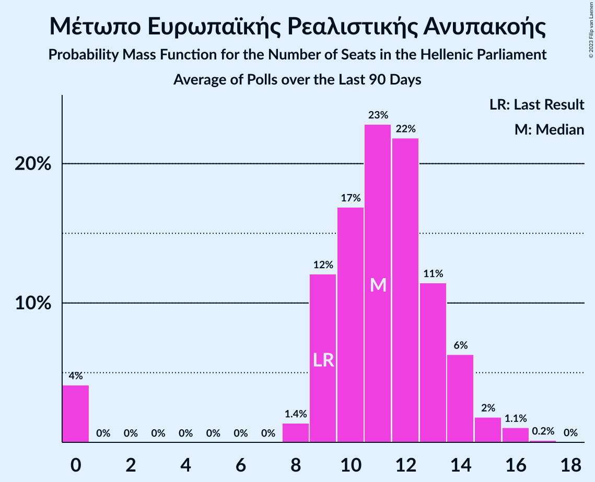
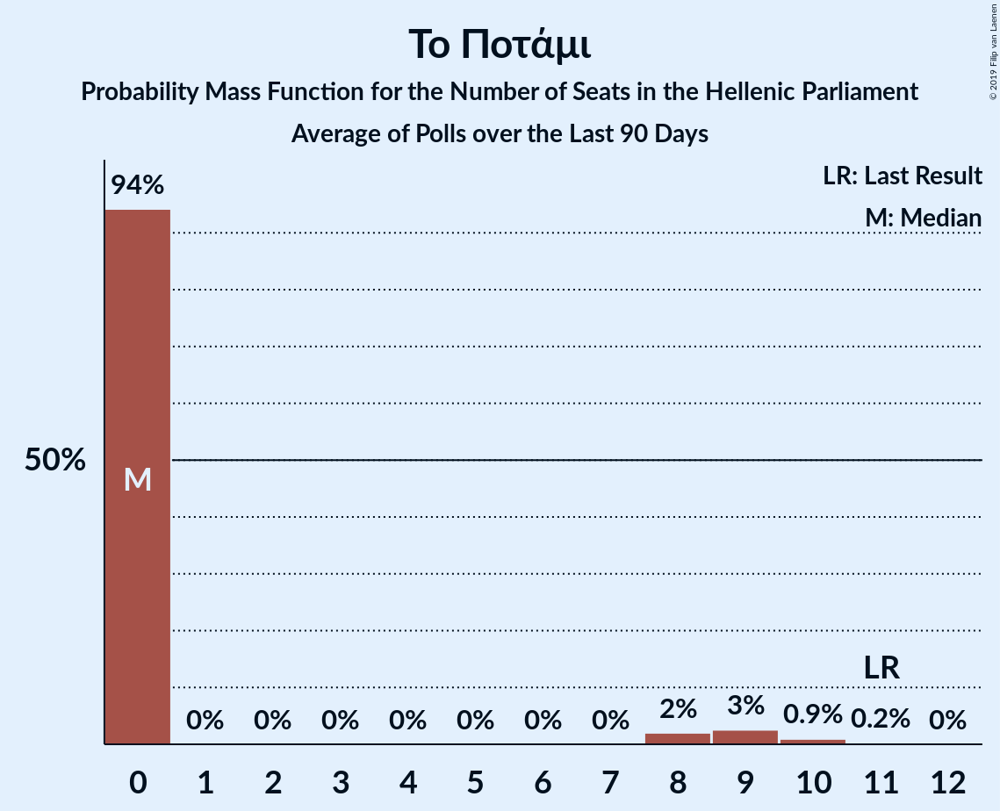

# Poll Average

<a href="#voting-intentions">Voting Intentions</a> | <a href="#seats">Seats</a> | <a href="#coalitions">Coalitions</a> | <a href="#technical-information">Technical Information</a>

## Summary

The table below lists the polls on which the average is based. They are the most recent polls (less than 90 days old) registered and analyzed so far.

| Period     | Polling firm/Commissioner(s) | ΣΥΡΙΖΑ | ΝΔ | ΧΑ | ΚΑ | ΚΚΕ | Ποτάμι | ΑΝΕΛ | ΕΚ | ΛΑΕ | ΠΕ | ΕΛ | ΜέΡΑ25 |
|:----------:|:----------------------------:|:--:|:--:|:--:|:--:|:--:|:--:|:--:|:--:|:--:|:--:|:--:|:--:|
| 7 July 2019 | General Election | 31.5%   86 | 39.8%   158 | 2.9%   0 | 8.1%   22 | 5.3%   15 | 0.0%   0 | 0.0%   0 | 1.2%   0 | 0.0%   0 | 1.5%   0 | 3.7%   10 | 3.4%   9 |
| N/A | Poll Average | 24–29%   64–76 | 42–53%   160–174 | 1–2%   0 | 5–9%   15–24 | 5–8%   13–20 | N/A   N/A | N/A   N/A | N/A   N/A | N/A   N/A | N/A   N/A | 4–7%   12–19 | 2–6%   9–16 |
| [30 March–1 April 2020](2020-04-01-PulseRC.html) | Pulse RC   ΣΚΑΪ | N/A   N/A | N/A   N/A | N/A   N/A | N/A   N/A | N/A   N/A | N/A   N/A | N/A   N/A | N/A   N/A | N/A   N/A | N/A   N/A | N/A   N/A | N/A   N/A |
| [23–26 March 2020](2020-03-26-OpinionPoll.html) | Opinion Poll   Proto Thema | 23–28%   N/A | 48–53%   N/A | N/A   N/A | 5–8%   N/A | 6–9%   N/A | N/A   N/A | N/A   N/A | N/A   N/A | N/A   N/A | N/A   N/A | 4–7%   N/A | 2–4%   N/A |
| [2–7 March 2020](2020-03-07-Alco.html) | Alco   Open TV | N/A   N/A | N/A   N/A | N/A   N/A | N/A   N/A | N/A   N/A | N/A   N/A | N/A   N/A | N/A   N/A | N/A   N/A | N/A   N/A | N/A   N/A | N/A   N/A |
| [20–22 January 2020](2020-01-22-MetronAnalysis.html) | Metron Analysis   Το Βήμα | 24–29%   63–75 | 42–48%   160–175 | N/A   N/A | 6–9%   15–22 | 5–8%   13–20 | N/A   N/A | N/A   N/A | N/A   N/A | N/A   N/A | N/A   N/A | 5–7%   12–19 | 4–6%   10–16 |
| [13–17 January 2020](2020-01-17-MRB.html) | MRB   Star | 24–29%   65–77 | 41–46%   160–174 | 1–2%   0 | 6–9%   17–24 | 5–8%   13–20 | N/A   N/A | N/A   N/A | N/A   N/A | N/A   N/A | N/A   N/A | 4–7%   11–18 | 3–5%   9–14 |
| 7 July 2019 | General Election | 31.5%   86 | 39.8%   158 | 2.9%   0 | 8.1%   22 | 5.3%   15 | 0.0%   0 | 0.0%   0 | 1.2%   0 | 0.0%   0 | 1.5%   0 | 3.7%   10 | 3.4%   9 |

Only polls for which at least the sample size has been published are included in the table above.

**Legend:**
+ **Top half of each row:** Voting intentions (95% confidence interval)
+ **Bottom half of each row:** Seat projections for the Hellenic Parliament (95% confidence interval)
+ **ΣΥΡΙΖΑ:** Συνασπισμός Ριζοσπαστικής Αριστεράς
+ **ΝΔ:** Νέα Δημοκρατία
+ **ΧΑ:** Χρυσή Αυγή
+ **ΚΑ:** Κίνημα Αλλαγής
+ **ΚΚΕ:** Κομμουνιστικό Κόμμα Ελλάδας
+ **Ποτάμι:** Το Ποτάμι
+ **ΑΝΕΛ:** Ανεξάρτητοι Έλληνες
+ **ΕΚ:** Ένωση Κεντρώων
+ **ΛΑΕ:** Λαϊκή Ενότητα
+ **ΠΕ:** Πλεύση Ελευθερίας
+ **ΕΛ:** Ελληνική Λύση
+ **ΜέΡΑ25:** Μέτωπο Ευρωπαϊκής Ρεαλιστικής Ανυπακοής
+ **N/A (single party):** Party not included the published results
+ **N/A (entire row):** Calculation for this opinion poll not started yet

## Voting Intentions

### Confidence Intervals

| Party | Last Result | Median | 80% Confidence Interval | 90% Confidence Interval | 95% Confidence Interval | 99% Confidence Interval |
|:-----:|:-----------:|:------:|:-----------------------:|:-----------------------:|:-----------------------:|:-----------------------:|
| <a href="#νέα-δημοκρατία">Νέα Δημοκρατία</a> | 39.8% | 45.5% | 42.7–51.3% |42.1–52.1% | 41.6–52.7% | 40.7–53.8% |
| <a href="#συνασπισμός-ριζοσπαστικής-αριστεράς">Συνασπισμός Ριζοσπαστικής Αριστεράς</a> | 31.5% | 26.3% | 24.5–28.0% |24.0–28.5% | 23.6–28.9% | 22.7–29.8% |
| <a href="#κίνημα-αλλαγής">Κίνημα Αλλαγής</a> | 8.1% | 7.0% | 5.9–8.2% |5.6–8.5% | 5.3–8.7% | 4.9–9.3% |
| <a href="#κομμουνιστικό-κόμμα-ελλάδας">Κομμουνιστικό Κόμμα Ελλάδας</a> | 5.3% | 6.4% | 5.5–7.5% |5.3–7.9% | 5.1–8.2% | 4.7–8.8% |
| <a href="#ελληνική-λύση">Ελληνική Λύση</a> | 3.7% | 5.6% | 4.8–6.6% |4.6–6.9% | 4.4–7.1% | 4.0–7.6% |
| <a href="#μέτωπο-ευρωπαϊκής-ρεαλιστικής-ανυπακοής">Μέτωπο Ευρωπαϊκής Ρεαλιστικής Ανυπακοής</a> | 3.4% | 4.1% | 2.3–5.3% |2.1–5.6% | 1.9–5.9% | 1.6–6.4% |
| <a href="#χρυσή-αυγή">Χρυσή Αυγή</a> | 2.9% | 1.7% | 1.3–2.2% |1.2–2.3% | 1.1–2.5% | 1.0–2.8% |
| <a href="#πλεύση-ελευθερίας">Πλεύση Ελευθερίας</a> | 1.5% | N/A | N/A |N/A | N/A | N/A |
| <a href="#ένωση-κεντρώων">Ένωση Κεντρώων</a> | 1.2% | N/A | N/A |N/A | N/A | N/A |
| <a href="#το-ποτάμι">Το Ποτάμι</a> | 0.0% | N/A | N/A |N/A | N/A | N/A |
| <a href="#ανεξάρτητοι-έλληνες">Ανεξάρτητοι Έλληνες</a> | 0.0% | N/A | N/A |N/A | N/A | N/A |
| <a href="#λαϊκή-ενότητα">Λαϊκή Ενότητα</a> | 0.0% | N/A | N/A |N/A | N/A | N/A |

### Νέα Δημοκρατία

*For a full overview of the results for this party, see the [Νέα Δημοκρατία](party-νέαδημοκρατία.html) page.*

| Voting Intentions | Probability | Accumulated | Special Marks |
|:-----------------:|:-----------:|:-----------:|:-------------:|
| 38.5–39.5% | 0% | 100% |  |
| 39.5–40.5% | 0.3% | 100% | Last Result |
| 40.5–41.5% | 2% | 99.6% |  |
| 41.5–42.5% | 6% | 98% |  |
| 42.5–43.5% | 12% | 91% |  |
| 43.5–44.5% | 16% | 79% |  |
| 44.5–45.5% | 14% | 63% | Median |
| 45.5–46.5% | 9% | 49% |  |
| 46.5–47.5% | 5% | 40% |  |
| 47.5–48.5% | 4% | 34% |  |
| 48.5–49.5% | 6% | 30% |  |
| 49.5–50.5% | 8% | 24% |  |
| 50.5–51.5% | 8% | 16% |  |
| 51.5–52.5% | 5% | 8% |  |
| 52.5–53.5% | 2% | 3% |  |
| 53.5–54.5% | 0.6% | 0.7% |  |
| 54.5–55.5% | 0.1% | 0.1% |  |
| 55.5–56.5% | 0% | 0% |  |

### Συνασπισμός Ριζοσπαστικής Αριστεράς

*For a full overview of the results for this party, see the [Συνασπισμός Ριζοσπαστικής Αριστεράς](party-συνασπισμόςριζοσπαστικήςαριστεράς.html) page.*

| Voting Intentions | Probability | Accumulated | Special Marks |
|:-----------------:|:-----------:|:-----------:|:-------------:|
| 20.5–21.5% | 0% | 100% |  |
| 21.5–22.5% | 0.3% | 100% |  |
| 22.5–23.5% | 2% | 99.6% |  |
| 23.5–24.5% | 8% | 98% |  |
| 24.5–25.5% | 19% | 89% |  |
| 25.5–26.5% | 29% | 70% | Median |
| 26.5–27.5% | 25% | 41% |  |
| 27.5–28.5% | 12% | 17% |  |
| 28.5–29.5% | 4% | 5% |  |
| 29.5–30.5% | 0.7% | 0.8% |  |
| 30.5–31.5% | 0.1% | 0.1% |  |
| 31.5–32.5% | 0% | 0% | Last Result |

### Κίνημα Αλλαγής

*For a full overview of the results for this party, see the [Κίνημα Αλλαγής](party-κίνημααλλαγής.html) page.*

| Voting Intentions | Probability | Accumulated | Special Marks |
|:-----------------:|:-----------:|:-----------:|:-------------:|
| 2.5–3.5% | 0% | 100% |  |
| 3.5–4.5% | 0.1% | 100% |  |
| 4.5–5.5% | 4% | 99.9% |  |
| 5.5–6.5% | 25% | 96% |  |
| 6.5–7.5% | 42% | 71% | Median |
| 7.5–8.5% | 24% | 29% | Last Result |
| 8.5–9.5% | 4% | 4% |  |
| 9.5–10.5% | 0.2% | 0.2% |  |
| 10.5–11.5% | 0% | 0% |  |

### Κομμουνιστικό Κόμμα Ελλάδας

*For a full overview of the results for this party, see the [Κομμουνιστικό Κόμμα Ελλάδας](party-κομμουνιστικόκόμμαελλάδας.html) page.*

| Voting Intentions | Probability | Accumulated | Special Marks |
|:-----------------:|:-----------:|:-----------:|:-------------:|
| 2.5–3.5% | 0% | 100% |  |
| 3.5–4.5% | 0.3% | 100% |  |
| 4.5–5.5% | 11% | 99.7% | Last Result |
| 5.5–6.5% | 45% | 88% | Median |
| 6.5–7.5% | 34% | 44% |  |
| 7.5–8.5% | 9% | 10% |  |
| 8.5–9.5% | 1.0% | 1.0% |  |
| 9.5–10.5% | 0% | 0% |  |
| 10.5–11.5% | 0% | 0% |  |

### Ελληνική Λύση

*For a full overview of the results for this party, see the [Ελληνική Λύση](party-ελληνικήλύση.html) page.*

| Voting Intentions | Probability | Accumulated | Special Marks |
|:-----------------:|:-----------:|:-----------:|:-------------:|
| 2.5–3.5% | 0% | 100% |  |
| 3.5–4.5% | 5% | 100% | Last Result |
| 4.5–5.5% | 40% | 95% |  |
| 5.5–6.5% | 44% | 55% | Median |
| 6.5–7.5% | 10% | 11% |  |
| 7.5–8.5% | 0.7% | 0.7% |  |
| 8.5–9.5% | 0% | 0% |  |

### Μέτωπο Ευρωπαϊκής Ρεαλιστικής Ανυπακοής

*For a full overview of the results for this party, see the [Μέτωπο Ευρωπαϊκής Ρεαλιστικής Ανυπακοής](party-μέτωποευρωπαϊκήςρεαλιστικήςανυπακοής.html) page.*

| Voting Intentions | Probability | Accumulated | Special Marks |
|:-----------------:|:-----------:|:-----------:|:-------------:|
| 0.0–0.5% | 0% | 100% |  |
| 0.5–1.5% | 0.3% | 100% |  |
| 1.5–2.5% | 17% | 99.7% |  |
| 2.5–3.5% | 19% | 82% | Last Result |
| 3.5–4.5% | 31% | 63% | Median |
| 4.5–5.5% | 26% | 32% |  |
| 5.5–6.5% | 6% | 6% |  |
| 6.5–7.5% | 0.3% | 0.3% |  |
| 7.5–8.5% | 0% | 0% |  |

### Χρυσή Αυγή

*For a full overview of the results for this party, see the [Χρυσή Αυγή](party-χρυσήαυγή.html) page.*

| Voting Intentions | Probability | Accumulated | Special Marks |
|:-----------------:|:-----------:|:-----------:|:-------------:|
| 0.0–0.5% | 0% | 100% |  |
| 0.5–1.5% | 31% | 100% |  |
| 1.5–2.5% | 67% | 69% | Median |
| 2.5–3.5% | 2% | 2% | Last Result |
| 3.5–4.5% | 0% | 0% |  |

## Seats

### Confidence Intervals

| Party | Last Result | Median | 80% Confidence Interval | 90% Confidence Interval | 95% Confidence Interval | 99% Confidence Interval |
|:-----:|:-----------:|:------:|:-----------------------:|:-----------------------:|:-----------------------:|:-----------------------:|
| <a href="#νέα-δημοκρατία">Νέα Δημοκρατία</a> | 158 | 167 | 162–172 |161–173 | 160–174 | 158–177 |
| <a href="#συνασπισμός-ριζοσπαστικής-αριστεράς">Συνασπισμός Ριζοσπαστικής Αριστεράς</a> | 86 | 71 | 65–74 |64–75 | 64–76 | 62–79 |
| <a href="#κίνημα-αλλαγής">Κίνημα Αλλαγής</a> | 22 | 19 | 17–22 |16–23 | 15–24 | 14–25 |
| <a href="#κομμουνιστικό-κόμμα-ελλάδας">Κομμουνιστικό Κόμμα Ελλάδας</a> | 15 | 16 | 14–19 |13–19 | 13–20 | 12–21 |
| <a href="#ελληνική-λύση">Ελληνική Λύση</a> | 10 | 15 | 13–17 |12–18 | 12–19 | 11–20 |
| <a href="#μέτωπο-ευρωπαϊκής-ρεαλιστικής-ανυπακοής">Μέτωπο Ευρωπαϊκής Ρεαλιστικής Ανυπακοής</a> | 9 | 12 | 10–14 |10–15 | 9–16 | 8–17 |
| <a href="#χρυσή-αυγή">Χρυσή Αυγή</a> | 0 | 0 | 0 |0 | 0 | 0 |
| <a href="#πλεύση-ελευθερίας">Πλεύση Ελευθερίας</a> | 0 | N/A | N/A |N/A | N/A | N/A |
| <a href="#ένωση-κεντρώων">Ένωση Κεντρώων</a> | 0 | N/A | N/A |N/A | N/A | N/A |
| <a href="#το-ποτάμι">Το Ποτάμι</a> | 0 | N/A | N/A |N/A | N/A | N/A |
| <a href="#ανεξάρτητοι-έλληνες">Ανεξάρτητοι Έλληνες</a> | 0 | N/A | N/A |N/A | N/A | N/A |
| <a href="#λαϊκή-ενότητα">Λαϊκή Ενότητα</a> | 0 | N/A | N/A |N/A | N/A | N/A |

### Νέα Δημοκρατία

*For a full overview of the results for this party, see the [Νέα Δημοκρατία](party-νέαδημοκρατία.html) page.*

| Number of Seats | Probability | Accumulated | Special Marks |
|:---------------:|:-----------:|:-----------:|:-------------:|
| 156 | 0.1% | 100% |  |
| 157 | 0.2% | 99.9% |  |
| 158 | 0.4% | 99.7% | Last Result |
| 159 | 0.9% | 99.3% |  |
| 160 | 2% | 98% |  |
| 161 | 3% | 97% |  |
| 162 | 4% | 94% |  |
| 163 | 6% | 90% |  |
| 164 | 8% | 84% |  |
| 165 | 9% | 76% |  |
| 166 | 13% | 67% |  |
| 167 | 11% | 54% | Median |
| 168 | 10% | 43% |  |
| 169 | 10% | 33% |  |
| 170 | 7% | 24% |  |
| 171 | 6% | 17% |  |
| 172 | 4% | 10% |  |
| 173 | 2% | 6% |  |
| 174 | 2% | 4% |  |
| 175 | 0.9% | 2% |  |
| 176 | 0.5% | 1.1% |  |
| 177 | 0.3% | 0.5% |  |
| 178 | 0.1% | 0.2% |  |
| 179 | 0.1% | 0.1% |  |
| 180 | 0% | 0% |  |

### Συνασπισμός Ριζοσπαστικής Αριστεράς

*For a full overview of the results for this party, see the [Συνασπισμός Ριζοσπαστικής Αριστεράς](party-συνασπισμόςριζοσπαστικήςαριστεράς.html) page.*

| Number of Seats | Probability | Accumulated | Special Marks |
|:---------------:|:-----------:|:-----------:|:-------------:|
| 61 | 0.1% | 100% |  |
| 62 | 0.4% | 99.9% |  |
| 63 | 2% | 99.4% |  |
| 64 | 4% | 98% |  |
| 65 | 5% | 94% |  |
| 66 | 5% | 90% |  |
| 67 | 4% | 84% |  |
| 68 | 5% | 80% |  |
| 69 | 8% | 75% |  |
| 70 | 10% | 68% |  |
| 71 | 16% | 57% | Median |
| 72 | 16% | 42% |  |
| 73 | 13% | 26% |  |
| 74 | 6% | 13% |  |
| 75 | 3% | 7% |  |
| 76 | 2% | 4% |  |
| 77 | 0.9% | 2% |  |
| 78 | 0.6% | 1.4% |  |
| 79 | 0.4% | 0.8% |  |
| 80 | 0.2% | 0.3% |  |
| 81 | 0.1% | 0.1% |  |
| 82 | 0% | 0% |  |
| 83 | 0% | 0% |  |
| 84 | 0% | 0% |  |
| 85 | 0% | 0% |  |
| 86 | 0% | 0% | Last Result |

### Κίνημα Αλλαγής

*For a full overview of the results for this party, see the [Κίνημα Αλλαγής](party-κίνημααλλαγής.html) page.*

| Number of Seats | Probability | Accumulated | Special Marks |
|:---------------:|:-----------:|:-----------:|:-------------:|
| 13 | 0.1% | 100% |  |
| 14 | 0.5% | 99.9% |  |
| 15 | 2% | 99.4% |  |
| 16 | 5% | 97% |  |
| 17 | 11% | 92% |  |
| 18 | 15% | 82% |  |
| 19 | 20% | 67% | Median |
| 20 | 17% | 47% |  |
| 21 | 14% | 30% |  |
| 22 | 9% | 16% | Last Result |
| 23 | 4% | 7% |  |
| 24 | 2% | 3% |  |
| 25 | 0.6% | 0.9% |  |
| 26 | 0.2% | 0.2% |  |
| 27 | 0% | 0.1% |  |
| 28 | 0% | 0% |  |

### Κομμουνιστικό Κόμμα Ελλάδας

*For a full overview of the results for this party, see the [Κομμουνιστικό Κόμμα Ελλάδας](party-κομμουνιστικόκόμμαελλάδας.html) page.*

| Number of Seats | Probability | Accumulated | Special Marks |
|:---------------:|:-----------:|:-----------:|:-------------:|
| 11 | 0.2% | 100% |  |
| 12 | 1.0% | 99.8% |  |
| 13 | 4% | 98.8% |  |
| 14 | 9% | 95% |  |
| 15 | 18% | 85% | Last Result |
| 16 | 22% | 67% | Median |
| 17 | 19% | 45% |  |
| 18 | 15% | 26% |  |
| 19 | 7% | 12% |  |
| 20 | 3% | 4% |  |
| 21 | 0.9% | 1.3% |  |
| 22 | 0.3% | 0.4% |  |
| 23 | 0.1% | 0.1% |  |
| 24 | 0% | 0% |  |

### Ελληνική Λύση

*For a full overview of the results for this party, see the [Ελληνική Λύση](party-ελληνικήλύση.html) page.*

| Number of Seats | Probability | Accumulated | Special Marks |
|:---------------:|:-----------:|:-----------:|:-------------:|
| 10 | 0.3% | 100% | Last Result |
| 11 | 2% | 99.7% |  |
| 12 | 7% | 98% |  |
| 13 | 14% | 91% |  |
| 14 | 23% | 77% |  |
| 15 | 23% | 54% | Median |
| 16 | 15% | 31% |  |
| 17 | 9% | 16% |  |
| 18 | 4% | 7% |  |
| 19 | 2% | 3% |  |
| 20 | 0.6% | 0.8% |  |
| 21 | 0.1% | 0.2% |  |
| 22 | 0% | 0% |  |

### Μέτωπο Ευρωπαϊκής Ρεαλιστικής Ανυπακοής

*For a full overview of the results for this party, see the [Μέτωπο Ευρωπαϊκής Ρεαλιστικής Ανυπακοής](party-μέτωποευρωπαϊκήςρεαλιστικήςανυπακοής.html) page.*

| Number of Seats | Probability | Accumulated | Special Marks |
|:---------------:|:-----------:|:-----------:|:-------------:|
| 0 | 0.4% | 100% |  |
| 1 | 0% | 99.6% |  |
| 2 | 0% | 99.6% |  |
| 3 | 0% | 99.6% |  |
| 4 | 0% | 99.6% |  |
| 5 | 0% | 99.6% |  |
| 6 | 0% | 99.6% |  |
| 7 | 0% | 99.6% |  |
| 8 | 0.6% | 99.6% |  |
| 9 | 4% | 99.0% | Last Result |
| 10 | 14% | 95% |  |
| 11 | 23% | 81% |  |
| 12 | 21% | 58% | Median |
| 13 | 17% | 37% |  |
| 14 | 12% | 21% |  |
| 15 | 6% | 9% |  |
| 16 | 2% | 3% |  |
| 17 | 0.6% | 0.9% |  |
| 18 | 0.2% | 0.2% |  |
| 19 | 0% | 0.1% |  |
| 20 | 0% | 0% |  |

### Χρυσή Αυγή

*For a full overview of the results for this party, see the [Χρυσή Αυγή](party-χρυσήαυγή.html) page.*

| Number of Seats | Probability | Accumulated | Special Marks |
|:---------------:|:-----------:|:-----------:|:-------------:|
| 0 | 99.9% | 100% | Last Result, Median |
| 1 | 0% | 0.1% |  |
| 2 | 0% | 0.1% |  |
| 3 | 0% | 0.1% |  |
| 4 | 0% | 0.1% |  |
| 5 | 0% | 0.1% |  |
| 6 | 0% | 0.1% |  |
| 7 | 0% | 0.1% |  |
| 8 | 0.1% | 0.1% |  |
| 9 | 0% | 0% |  |

### Πλεύση Ελευθερίας

*For a full overview of the results for this party, see the [Πλεύση Ελευθερίας](party-πλεύσηελευθερίας.html) page.*

### Ένωση Κεντρώων

*For a full overview of the results for this party, see the [Ένωση Κεντρώων](party-ένωσηκεντρώων.html) page.*

### Το Ποτάμι

*For a full overview of the results for this party, see the [Το Ποτάμι](party-τοποτάμι.html) page.*

### Ανεξάρτητοι Έλληνες

*For a full overview of the results for this party, see the [Ανεξάρτητοι Έλληνες](party-ανεξάρτητοιέλληνες.html) page.*

### Λαϊκή Ενότητα

*For a full overview of the results for this party, see the [Λαϊκή Ενότητα](party-λαϊκήενότητα.html) page.*

## Coalitions

### Confidence Intervals

| Coalition | Last Result | Median | Majority? | 80% Confidence Interval | 90% Confidence Interval | 95% Confidence Interval | 99% Confidence Interval |
|:---------:|:-----------:|:------:|:---------:|:-----------------------:|:-----------------------:|:-----------------------:|:-----------------------:|
| Νέα Δημοκρατία – Κίνημα Αλλαγής | 180 | 186 | 100% | 182–191 | 181–192 | 179–194 | 177–196 |
| Νέα Δημοκρατία – Κίνημα Αλλαγής – Το Ποτάμι | 180 | 186 | 100% | 182–191 | 181–192 | 179–194 | 177–196 |
| Νέα Δημοκρατία | 158 | 167 | 100% | 162–172 | 161–173 | 160–174 | 158–177 |
| Νέα Δημοκρατία – Το Ποτάμι | 158 | 167 | 100% | 162–172 | 161–173 | 160–174 | 158–177 |
| Συνασπισμός Ριζοσπαστικής Αριστεράς – Μέτωπο Ευρωπαϊκής Ρεαλιστικής Ανυπακοής | 95 | 83 | 0% | 78–87 | 76–88 | 75–89 | 74–91 |
| Συνασπισμός Ριζοσπαστικής Αριστεράς – Ανεξάρτητοι Έλληνες – Λαϊκή Ενότητα | 86 | 71 | 0% | 65–74 | 64–75 | 64–76 | 62–79 |
| Συνασπισμός Ριζοσπαστικής Αριστεράς – Ανεξάρτητοι Έλληνες | 86 | 71 | 0% | 65–74 | 64–75 | 64–76 | 62–79 |
| Συνασπισμός Ριζοσπαστικής Αριστεράς – Λαϊκή Ενότητα | 86 | 71 | 0% | 65–74 | 64–75 | 64–76 | 62–79 |
| Συνασπισμός Ριζοσπαστικής Αριστεράς | 86 | 71 | 0% | 65–74 | 64–75 | 64–76 | 62–79 |

### Νέα Δημοκρατία – Κίνημα Αλλαγής

| Number of Seats | Probability | Accumulated | Special Marks |
|:---------------:|:-----------:|:-----------:|:-------------:|
| 175 | 0.1% | 100% |  |
| 176 | 0.2% | 99.9% |  |
| 177 | 0.4% | 99.7% |  |
| 178 | 0.6% | 99.4% |  |
| 179 | 1.3% | 98.8% |  |
| 180 | 2% | 97% | Last Result |
| 181 | 4% | 95% |  |
| 182 | 5% | 92% |  |
| 183 | 7% | 86% |  |
| 184 | 9% | 79% |  |
| 185 | 11% | 70% |  |
| 186 | 10% | 59% | Median |
| 187 | 12% | 50% |  |
| 188 | 10% | 37% |  |
| 189 | 9% | 28% |  |
| 190 | 6% | 19% |  |
| 191 | 5% | 13% |  |
| 192 | 4% | 8% |  |
| 193 | 2% | 5% |  |
| 194 | 1.2% | 3% |  |
| 195 | 0.7% | 1.4% |  |
| 196 | 0.4% | 0.7% |  |
| 197 | 0.2% | 0.3% |  |
| 198 | 0.1% | 0.1% |  |
| 199 | 0% | 0.1% |  |
| 200 | 0% | 0% |  |

### Νέα Δημοκρατία – Κίνημα Αλλαγής – Το Ποτάμι

| Number of Seats | Probability | Accumulated | Special Marks |
|:---------------:|:-----------:|:-----------:|:-------------:|
| 175 | 0.1% | 100% |  |
| 176 | 0.2% | 99.9% |  |
| 177 | 0.4% | 99.7% |  |
| 178 | 0.6% | 99.4% |  |
| 179 | 1.3% | 98.8% |  |
| 180 | 2% | 97% | Last Result |
| 181 | 4% | 95% |  |
| 182 | 5% | 92% |  |
| 183 | 7% | 86% |  |
| 184 | 9% | 79% |  |
| 185 | 11% | 70% |  |
| 186 | 10% | 59% | Median |
| 187 | 12% | 50% |  |
| 188 | 10% | 37% |  |
| 189 | 9% | 28% |  |
| 190 | 6% | 19% |  |
| 191 | 5% | 13% |  |
| 192 | 4% | 8% |  |
| 193 | 2% | 5% |  |
| 194 | 1.2% | 3% |  |
| 195 | 0.7% | 1.4% |  |
| 196 | 0.4% | 0.7% |  |
| 197 | 0.2% | 0.3% |  |
| 198 | 0.1% | 0.1% |  |
| 199 | 0% | 0.1% |  |
| 200 | 0% | 0% |  |

### Νέα Δημοκρατία

| Number of Seats | Probability | Accumulated | Special Marks |
|:---------------:|:-----------:|:-----------:|:-------------:|
| 156 | 0.1% | 100% |  |
| 157 | 0.2% | 99.9% |  |
| 158 | 0.4% | 99.7% | Last Result |
| 159 | 0.9% | 99.3% |  |
| 160 | 2% | 98% |  |
| 161 | 3% | 97% |  |
| 162 | 4% | 94% |  |
| 163 | 6% | 90% |  |
| 164 | 8% | 84% |  |
| 165 | 9% | 76% |  |
| 166 | 13% | 67% |  |
| 167 | 11% | 54% | Median |
| 168 | 10% | 43% |  |
| 169 | 10% | 33% |  |
| 170 | 7% | 24% |  |
| 171 | 6% | 17% |  |
| 172 | 4% | 10% |  |
| 173 | 2% | 6% |  |
| 174 | 2% | 4% |  |
| 175 | 0.9% | 2% |  |
| 176 | 0.5% | 1.1% |  |
| 177 | 0.3% | 0.5% |  |
| 178 | 0.1% | 0.2% |  |
| 179 | 0.1% | 0.1% |  |
| 180 | 0% | 0% |  |

### Νέα Δημοκρατία – Το Ποτάμι

| Number of Seats | Probability | Accumulated | Special Marks |
|:---------------:|:-----------:|:-----------:|:-------------:|
| 156 | 0.1% | 100% |  |
| 157 | 0.2% | 99.9% |  |
| 158 | 0.4% | 99.7% | Last Result |
| 159 | 0.9% | 99.3% |  |
| 160 | 2% | 98% |  |
| 161 | 3% | 97% |  |
| 162 | 4% | 94% |  |
| 163 | 6% | 90% |  |
| 164 | 8% | 84% |  |
| 165 | 9% | 76% |  |
| 166 | 13% | 67% |  |
| 167 | 11% | 54% | Median |
| 168 | 10% | 43% |  |
| 169 | 10% | 33% |  |
| 170 | 7% | 24% |  |
| 171 | 6% | 17% |  |
| 172 | 4% | 10% |  |
| 173 | 2% | 6% |  |
| 174 | 2% | 4% |  |
| 175 | 0.9% | 2% |  |
| 176 | 0.5% | 1.1% |  |
| 177 | 0.3% | 0.5% |  |
| 178 | 0.1% | 0.2% |  |
| 179 | 0.1% | 0.1% |  |
| 180 | 0% | 0% |  |

### Συνασπισμός Ριζοσπαστικής Αριστεράς – Μέτωπο Ευρωπαϊκής Ρεαλιστικής Ανυπακοής

| Number of Seats | Probability | Accumulated | Special Marks |
|:---------------:|:-----------:|:-----------:|:-------------:|
| 70 | 0% | 100% |  |
| 71 | 0.1% | 99.9% |  |
| 72 | 0.1% | 99.9% |  |
| 73 | 0.3% | 99.8% |  |
| 74 | 0.8% | 99.5% |  |
| 75 | 1.3% | 98.7% |  |
| 76 | 3% | 97% |  |
| 77 | 3% | 95% |  |
| 78 | 4% | 91% |  |
| 79 | 8% | 87% |  |
| 80 | 7% | 79% |  |
| 81 | 10% | 72% |  |
| 82 | 11% | 62% |  |
| 83 | 10% | 52% | Median |
| 84 | 13% | 42% |  |
| 85 | 10% | 29% |  |
| 86 | 8% | 19% |  |
| 87 | 5% | 11% |  |
| 88 | 2% | 5% |  |
| 89 | 2% | 3% |  |
| 90 | 0.7% | 1.4% |  |
| 91 | 0.3% | 0.7% |  |
| 92 | 0.2% | 0.4% |  |
| 93 | 0.1% | 0.1% |  |
| 94 | 0% | 0.1% |  |
| 95 | 0% | 0% | Last Result |

### Συνασπισμός Ριζοσπαστικής Αριστεράς – Ανεξάρτητοι Έλληνες – Λαϊκή Ενότητα

| Number of Seats | Probability | Accumulated | Special Marks |
|:---------------:|:-----------:|:-----------:|:-------------:|
| 61 | 0.1% | 100% |  |
| 62 | 0.4% | 99.9% |  |
| 63 | 2% | 99.4% |  |
| 64 | 4% | 98% |  |
| 65 | 5% | 94% |  |
| 66 | 5% | 90% |  |
| 67 | 4% | 84% |  |
| 68 | 5% | 80% |  |
| 69 | 8% | 75% |  |
| 70 | 10% | 68% |  |
| 71 | 16% | 57% | Median |
| 72 | 16% | 42% |  |
| 73 | 13% | 26% |  |
| 74 | 6% | 13% |  |
| 75 | 3% | 7% |  |
| 76 | 2% | 4% |  |
| 77 | 0.9% | 2% |  |
| 78 | 0.6% | 1.4% |  |
| 79 | 0.4% | 0.8% |  |
| 80 | 0.2% | 0.3% |  |
| 81 | 0.1% | 0.1% |  |
| 82 | 0% | 0% |  |
| 83 | 0% | 0% |  |
| 84 | 0% | 0% |  |
| 85 | 0% | 0% |  |
| 86 | 0% | 0% | Last Result |

### Συνασπισμός Ριζοσπαστικής Αριστεράς – Ανεξάρτητοι Έλληνες

| Number of Seats | Probability | Accumulated | Special Marks |
|:---------------:|:-----------:|:-----------:|:-------------:|
| 61 | 0.1% | 100% |  |
| 62 | 0.4% | 99.9% |  |
| 63 | 2% | 99.4% |  |
| 64 | 4% | 98% |  |
| 65 | 5% | 94% |  |
| 66 | 5% | 90% |  |
| 67 | 4% | 84% |  |
| 68 | 5% | 80% |  |
| 69 | 8% | 75% |  |
| 70 | 10% | 68% |  |
| 71 | 16% | 57% | Median |
| 72 | 16% | 42% |  |
| 73 | 13% | 26% |  |
| 74 | 6% | 13% |  |
| 75 | 3% | 7% |  |
| 76 | 2% | 4% |  |
| 77 | 0.9% | 2% |  |
| 78 | 0.6% | 1.4% |  |
| 79 | 0.4% | 0.8% |  |
| 80 | 0.2% | 0.3% |  |
| 81 | 0.1% | 0.1% |  |
| 82 | 0% | 0% |  |
| 83 | 0% | 0% |  |
| 84 | 0% | 0% |  |
| 85 | 0% | 0% |  |
| 86 | 0% | 0% | Last Result |

### Συνασπισμός Ριζοσπαστικής Αριστεράς – Λαϊκή Ενότητα

| Number of Seats | Probability | Accumulated | Special Marks |
|:---------------:|:-----------:|:-----------:|:-------------:|
| 61 | 0.1% | 100% |  |
| 62 | 0.4% | 99.9% |  |
| 63 | 2% | 99.4% |  |
| 64 | 4% | 98% |  |
| 65 | 5% | 94% |  |
| 66 | 5% | 90% |  |
| 67 | 4% | 84% |  |
| 68 | 5% | 80% |  |
| 69 | 8% | 75% |  |
| 70 | 10% | 68% |  |
| 71 | 16% | 57% | Median |
| 72 | 16% | 42% |  |
| 73 | 13% | 26% |  |
| 74 | 6% | 13% |  |
| 75 | 3% | 7% |  |
| 76 | 2% | 4% |  |
| 77 | 0.9% | 2% |  |
| 78 | 0.6% | 1.4% |  |
| 79 | 0.4% | 0.8% |  |
| 80 | 0.2% | 0.3% |  |
| 81 | 0.1% | 0.1% |  |
| 82 | 0% | 0% |  |
| 83 | 0% | 0% |  |
| 84 | 0% | 0% |  |
| 85 | 0% | 0% |  |
| 86 | 0% | 0% | Last Result |

### Συνασπισμός Ριζοσπαστικής Αριστεράς

| Number of Seats | Probability | Accumulated | Special Marks |
|:---------------:|:-----------:|:-----------:|:-------------:|
| 61 | 0.1% | 100% |  |
| 62 | 0.4% | 99.9% |  |
| 63 | 2% | 99.4% |  |
| 64 | 4% | 98% |  |
| 65 | 5% | 94% |  |
| 66 | 5% | 90% |  |
| 67 | 4% | 84% |  |
| 68 | 5% | 80% |  |
| 69 | 8% | 75% |  |
| 70 | 10% | 68% |  |
| 71 | 16% | 57% | Median |
| 72 | 16% | 42% |  |
| 73 | 13% | 26% |  |
| 74 | 6% | 13% |  |
| 75 | 3% | 7% |  |
| 76 | 2% | 4% |  |
| 77 | 0.9% | 2% |  |
| 78 | 0.6% | 1.4% |  |
| 79 | 0.4% | 0.8% |  |
| 80 | 0.2% | 0.3% |  |
| 81 | 0.1% | 0.1% |  |
| 82 | 0% | 0% |  |
| 83 | 0% | 0% |  |
| 84 | 0% | 0% |  |
| 85 | 0% | 0% |  |
| 86 | 0% | 0% | Last Result |

## Technical Information

+ **Number of polls included in this average:** 5
+ **Lowest number of simulations done in a poll included in this average:** 0
+ **Total number of simulations done in the polls included in this average:** 1,048,576
+ **Error estimate:** 0.79%
