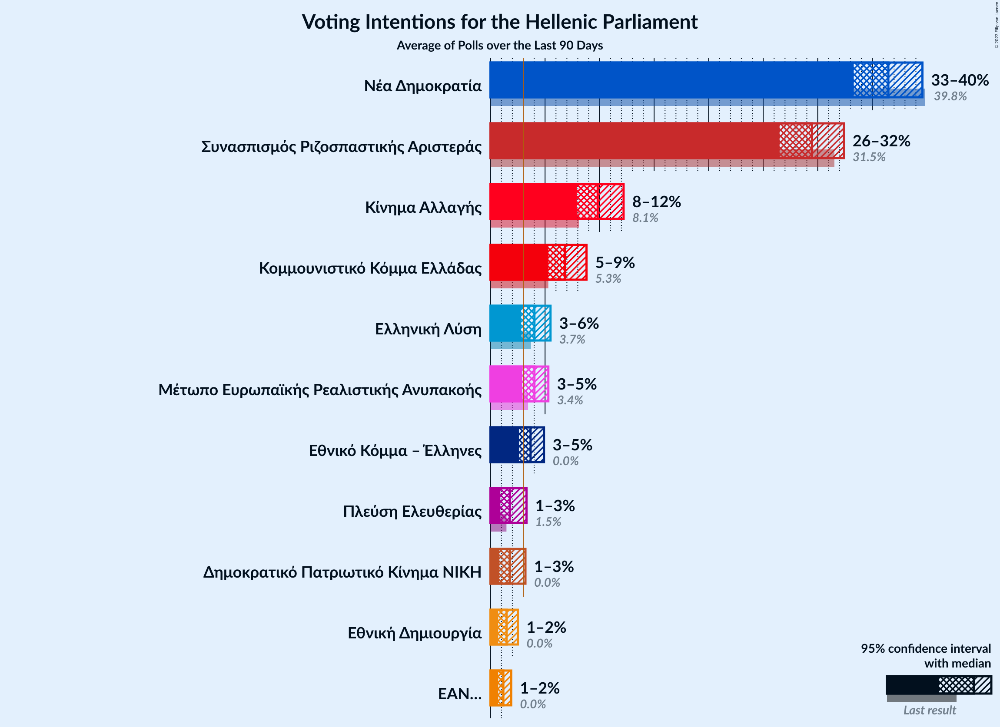

# Poll Average

<a href="#voting-intentions">Voting Intentions</a> | <a href="#seats">Seats</a> | <a href="#coalitions">Coalitions</a> | <a href="#technical-information">Technical Information</a>

## Summary

The table below lists the polls on which the average is based. They are the most recent polls (less than 90 days old) registered and analyzed so far.

| Period     | Polling firm/Commissioner(s) | ΣΥΡΙΖΑ | ΝΔ | ΧΑ | ΚΑ | ΚΚΕ | Ποτάμι | ΑΝΕΛ | ΕΚ | ΛΑΕ | ΠΕ | ΕΛ | ΜέΡΑ25 |
|:----------:|:----------------------------:|:--:|:--:|:--:|:--:|:--:|:--:|:--:|:--:|:--:|:--:|:--:|:--:|
| 7 July 2019 | General Election | 31.5%   86 | 39.8%   158 | 2.9%   0 | 8.1%   22 | 5.3%   15 | 0.0%   0 | 0.0%   0 | 1.2%   0 | 0.0%   0 | 1.5%   0 | 3.7%   10 | 3.4%   9 |
| N/A | Poll Average | 22–30%   60–79 | 42–55%   157–196 | 1–4%   0–12 | 5–8%   13–22 | 4–8%   11–21 | N/A   N/A | N/A   N/A | N/A   N/A | N/A   N/A | 1–2%   0 | 3–7%   0–19 | 2–4%   0–11 |
| [15–17 April 2020](2020-04-17-ΚάπαResearch.html) | Κάπα Research   ΕΘΝΟΣ | 25–30%   64–81 | 46–52%   170–192 | 2–3%   0–9 | 5–8%   12–20 | 4–7%   10–17 | N/A   N/A | N/A   N/A | N/A   N/A | N/A   N/A | N/A   N/A | 3–5%   0–13 | 2–5%   0–12 |
| [11–13 April 2020](2020-04-13-Marc.html) | Marc   Alpha TV | 22–27%   58–73 | 50–56%   182–200 | 1–3%   0 | 5–8%   14–22 | 5–7%   12–20 | N/A   N/A | N/A   N/A | N/A   N/A | N/A   N/A | N/A   N/A | 3–5%   0–14 | 2–3%   0–9 |
| [30 March–1 April 2020](2020-04-01-PulseRC.html) | Pulse RC   ΣΚΑΪ | 22–27%   59–73 | 47–53%   176–193 | 1–2%   0 | 5–7%   13–20 | 4–7%   12–19 | N/A   N/A | N/A   N/A | N/A   N/A | N/A   N/A | N/A   N/A | 4–6%   11–17 | 2–4%   0–11 |
| [23–26 March 2020](2020-03-26-OpinionPoll.html) | Opinion Poll   Proto Thema | 23–28%   60–73 | 48–53%   174–190 | N/A   N/A | 5–8%   13–21 | 6–9%   15–23 | N/A   N/A | N/A   N/A | N/A   N/A | N/A   N/A | N/A   N/A | 4–7%   12–19 | 2–4%   0–9 |
| [2–7 March 2020](2020-03-07-Alco.html) | Alco   Open TV | 25–31%   65–80 | 41–47%   155–172 | 3–5%   0–13 | 6–9%   15–23 | 5–8%   14–21 | N/A   N/A | N/A   N/A | N/A   N/A | N/A   N/A | 1–2%   0 | 5–8%   13–20 | 2–4%   0–10 |
| 7 July 2019 | General Election | 31.5%   86 | 39.8%   158 | 2.9%   0 | 8.1%   22 | 5.3%   15 | 0.0%   0 | 0.0%   0 | 1.2%   0 | 0.0%   0 | 1.5%   0 | 3.7%   10 | 3.4%   9 |

Only polls for which at least the sample size has been published are included in the table above.

**Legend:**
+ **Top half of each row:** Voting intentions (95% confidence interval)
+ **Bottom half of each row:** Seat projections for the Hellenic Parliament (95% confidence interval)
+ **ΣΥΡΙΖΑ:** Συνασπισμός Ριζοσπαστικής Αριστεράς
+ **ΝΔ:** Νέα Δημοκρατία
+ **ΧΑ:** Χρυσή Αυγή
+ **ΚΑ:** Κίνημα Αλλαγής
+ **ΚΚΕ:** Κομμουνιστικό Κόμμα Ελλάδας
+ **Ποτάμι:** Το Ποτάμι
+ **ΑΝΕΛ:** Ανεξάρτητοι Έλληνες
+ **ΕΚ:** Ένωση Κεντρώων
+ **ΛΑΕ:** Λαϊκή Ενότητα
+ **ΠΕ:** Πλεύση Ελευθερίας
+ **ΕΛ:** Ελληνική Λύση
+ **ΜέΡΑ25:** Μέτωπο Ευρωπαϊκής Ρεαλιστικής Ανυπακοής
+ **N/A (single party):** Party not included the published results
+ **N/A (entire row):** Calculation for this opinion poll not started yet

## Voting Intentions

### Confidence Intervals

| Party | Last Result | Median | 80% Confidence Interval | 90% Confidence Interval | 95% Confidence Interval | 99% Confidence Interval |
|:-----:|:-----------:|:------:|:-----------------------:|:-----------------------:|:-----------------------:|:-----------------------:|
| <a href="#νέα-δημοκρατία">Νέα Δημοκρατία</a> | 39.8% | 49.8% | 43.9–53.0% |42.9–53.9% | 42.1–54.6% | 40.9–55.8% |
| <a href="#συνασπισμός-ριζοσπαστικής-αριστεράς">Συνασπισμός Ριζοσπαστικής Αριστεράς</a> | 31.5% | 25.9% | 23.5–28.7% |23.0–29.4% | 22.5–30.0% | 21.7–31.1% |
| <a href="#κίνημα-αλλαγής">Κίνημα Αλλαγής</a> | 8.1% | 6.4% | 5.4–7.6% |5.1–8.0% | 4.9–8.3% | 4.5–9.0% |
| <a href="#κομμουνιστικό-κόμμα-ελλάδας">Κομμουνιστικό Κόμμα Ελλάδας</a> | 5.3% | 6.0% | 4.8–7.4% |4.5–7.8% | 4.3–8.1% | 3.9–8.7% |
| <a href="#ελληνική-λύση">Ελληνική Λύση</a> | 3.7% | 5.0% | 3.4–6.5% |3.2–6.9% | 3.0–7.3% | 2.6–7.9% |
| <a href="#μέτωπο-ευρωπαϊκής-ρεαλιστικής-ανυπακοής">Μέτωπο Ευρωπαϊκής Ρεαλιστικής Ανυπακοής</a> | 3.4% | 2.8% | 2.1–3.7% |1.9–3.9% | 1.8–4.2% | 1.5–4.6% |
| <a href="#χρυσή-αυγή">Χρυσή Αυγή</a> | 2.9% | 2.1% | 1.0–3.8% |0.9–4.2% | 0.8–4.5% | 0.6–5.0% |
| <a href="#πλεύση-ελευθερίας">Πλεύση Ελευθερίας</a> | 1.5% | 1.6% | 1.1–2.1% |1.0–2.3% | 0.9–2.5% | 0.8–2.8% |
| <a href="#ένωση-κεντρώων">Ένωση Κεντρώων</a> | 1.2% | N/A | N/A |N/A | N/A | N/A |
| <a href="#το-ποτάμι">Το Ποτάμι</a> | 0.0% | N/A | N/A |N/A | N/A | N/A |
| <a href="#ανεξάρτητοι-έλληνες">Ανεξάρτητοι Έλληνες</a> | 0.0% | N/A | N/A |N/A | N/A | N/A |
| <a href="#λαϊκή-ενότητα">Λαϊκή Ενότητα</a> | 0.0% | N/A | N/A |N/A | N/A | N/A |

### Νέα Δημοκρατία

*For a full overview of the results for this party, see the [Νέα Δημοκρατία](party-νέαδημοκρατία.html) page.*

| Voting Intentions | Probability | Accumulated | Special Marks |
|:-----------------:|:-----------:|:-----------:|:-------------:|
| 38.5–39.5% | 0% | 100% |  |
| 39.5–40.5% | 0.3% | 99.9% | Last Result |
| 40.5–41.5% | 1.0% | 99.7% |  |
| 41.5–42.5% | 3% | 98.7% |  |
| 42.5–43.5% | 4% | 96% |  |
| 43.5–44.5% | 5% | 92% |  |
| 44.5–45.5% | 4% | 87% |  |
| 45.5–46.5% | 3% | 83% |  |
| 46.5–47.5% | 4% | 80% |  |
| 47.5–48.5% | 8% | 75% |  |
| 48.5–49.5% | 13% | 67% |  |
| 49.5–50.5% | 16% | 54% | Median |
| 50.5–51.5% | 14% | 38% |  |
| 51.5–52.5% | 10% | 24% |  |
| 52.5–53.5% | 7% | 14% |  |
| 53.5–54.5% | 4% | 7% |  |
| 54.5–55.5% | 2% | 3% |  |
| 55.5–56.5% | 0.6% | 0.7% |  |
| 56.5–57.5% | 0.1% | 0.1% |  |
| 57.5–58.5% | 0% | 0% |  |

### Συνασπισμός Ριζοσπαστικής Αριστεράς

*For a full overview of the results for this party, see the [Συνασπισμός Ριζοσπαστικής Αριστεράς](party-συνασπισμόςριζοσπαστικήςαριστεράς.html) page.*

| Voting Intentions | Probability | Accumulated | Special Marks |
|:-----------------:|:-----------:|:-----------:|:-------------:|
| 19.5–20.5% | 0% | 100% |  |
| 20.5–21.5% | 0.3% | 100% |  |
| 21.5–22.5% | 2% | 99.6% |  |
| 22.5–23.5% | 8% | 97% |  |
| 23.5–24.5% | 15% | 90% |  |
| 24.5–25.5% | 19% | 74% |  |
| 25.5–26.5% | 18% | 56% | Median |
| 26.5–27.5% | 15% | 38% |  |
| 27.5–28.5% | 12% | 23% |  |
| 28.5–29.5% | 7% | 12% |  |
| 29.5–30.5% | 3% | 4% |  |
| 30.5–31.5% | 0.9% | 1.1% |  |
| 31.5–32.5% | 0.2% | 0.2% | Last Result |
| 32.5–33.5% | 0% | 0% |  |

### Κίνημα Αλλαγής

*For a full overview of the results for this party, see the [Κίνημα Αλλαγής](party-κίνημααλλαγής.html) page.*

| Voting Intentions | Probability | Accumulated | Special Marks |
|:-----------------:|:-----------:|:-----------:|:-------------:|
| 2.5–3.5% | 0% | 100% |  |
| 3.5–4.5% | 0.6% | 100% |  |
| 4.5–5.5% | 14% | 99.4% |  |
| 5.5–6.5% | 43% | 86% | Median |
| 6.5–7.5% | 32% | 43% |  |
| 7.5–8.5% | 10% | 11% | Last Result |
| 8.5–9.5% | 1.5% | 2% |  |
| 9.5–10.5% | 0.1% | 0.1% |  |
| 10.5–11.5% | 0% | 0% |  |

### Κομμουνιστικό Κόμμα Ελλάδας

*For a full overview of the results for this party, see the [Κομμουνιστικό Κόμμα Ελλάδας](party-κομμουνιστικόκόμμαελλάδας.html) page.*

| Voting Intentions | Probability | Accumulated | Special Marks |
|:-----------------:|:-----------:|:-----------:|:-------------:|
| 2.5–3.5% | 0.1% | 100% |  |
| 3.5–4.5% | 5% | 99.9% |  |
| 4.5–5.5% | 28% | 95% | Last Result |
| 5.5–6.5% | 36% | 67% | Median |
| 6.5–7.5% | 23% | 31% |  |
| 7.5–8.5% | 7% | 8% |  |
| 8.5–9.5% | 0.8% | 0.8% |  |
| 9.5–10.5% | 0% | 0% |  |

### Ελληνική Λύση

*For a full overview of the results for this party, see the [Ελληνική Λύση](party-ελληνικήλύση.html) page.*

| Voting Intentions | Probability | Accumulated | Special Marks |
|:-----------------:|:-----------:|:-----------:|:-------------:|
| 0.5–1.5% | 0% | 100% |  |
| 1.5–2.5% | 0.3% | 100% |  |
| 2.5–3.5% | 13% | 99.7% |  |
| 3.5–4.5% | 27% | 87% | Last Result |
| 4.5–5.5% | 27% | 60% | Median |
| 5.5–6.5% | 24% | 33% |  |
| 6.5–7.5% | 9% | 10% |  |
| 7.5–8.5% | 1.2% | 1.3% |  |
| 8.5–9.5% | 0.1% | 0.1% |  |
| 9.5–10.5% | 0% | 0% |  |

### Μέτωπο Ευρωπαϊκής Ρεαλιστικής Ανυπακοής

*For a full overview of the results for this party, see the [Μέτωπο Ευρωπαϊκής Ρεαλιστικής Ανυπακοής](party-μέτωποευρωπαϊκήςρεαλιστικήςανυπακοής.html) page.*

| Voting Intentions | Probability | Accumulated | Special Marks |
|:-----------------:|:-----------:|:-----------:|:-------------:|
| 0.0–0.5% | 0% | 100% |  |
| 0.5–1.5% | 0.6% | 100% |  |
| 1.5–2.5% | 32% | 99.4% |  |
| 2.5–3.5% | 54% | 67% | Last Result, Median |
| 3.5–4.5% | 13% | 14% |  |
| 4.5–5.5% | 0.6% | 0.6% |  |
| 5.5–6.5% | 0% | 0% |  |

### Χρυσή Αυγή

*For a full overview of the results for this party, see the [Χρυσή Αυγή](party-χρυσήαυγή.html) page.*

| Voting Intentions | Probability | Accumulated | Special Marks |
|:-----------------:|:-----------:|:-----------:|:-------------:|
| 0.0–0.5% | 0.3% | 100% |  |
| 0.5–1.5% | 29% | 99.7% |  |
| 1.5–2.5% | 34% | 70% | Median |
| 2.5–3.5% | 21% | 36% | Last Result |
| 3.5–4.5% | 13% | 15% |  |
| 4.5–5.5% | 2% | 2% |  |
| 5.5–6.5% | 0.1% | 0.1% |  |
| 6.5–7.5% | 0% | 0% |  |

### Πλεύση Ελευθερίας

*For a full overview of the results for this party, see the [Πλεύση Ελευθερίας](party-πλεύσηελευθερίας.html) page.*

| Voting Intentions | Probability | Accumulated | Special Marks |
|:-----------------:|:-----------:|:-----------:|:-------------:|
| 0.0–0.5% | 0% | 100% |  |
| 0.5–1.5% | 49% | 100% | Last Result |
| 1.5–2.5% | 49% | 51% | Median |
| 2.5–3.5% | 2% | 2% |  |
| 3.5–4.5% | 0% | 0% |  |

## Seats

### Confidence Intervals

| Party | Last Result | Median | 80% Confidence Interval | 90% Confidence Interval | 95% Confidence Interval | 99% Confidence Interval |
|:-----:|:-----------:|:------:|:-----------------------:|:-----------------------:|:-----------------------:|:-----------------------:|
| <a href="#νέα-δημοκρατία">Νέα Δημοκρατία</a> | 158 | 182 | 164–192 |161–194 | 157–196 | 155–200 |
| <a href="#συνασπισμός-ριζοσπαστικής-αριστεράς">Συνασπισμός Ριζοσπαστικής Αριστεράς</a> | 86 | 68 | 62–76 |61–78 | 60–79 | 58–82 |
| <a href="#κίνημα-αλλαγής">Κίνημα Αλλαγής</a> | 22 | 17 | 14–20 |14–21 | 13–22 | 12–23 |
| <a href="#κομμουνιστικό-κόμμα-ελλάδας">Κομμουνιστικό Κόμμα Ελλάδας</a> | 15 | 16 | 13–19 |12–20 | 11–21 | 10–23 |
| <a href="#ελληνική-λύση">Ελληνική Λύση</a> | 10 | 13 | 9–17 |8–18 | 0–19 | 0–20 |
| <a href="#μέτωπο-ευρωπαϊκής-ρεαλιστικής-ανυπακοής">Μέτωπο Ευρωπαϊκής Ρεαλιστικής Ανυπακοής</a> | 9 | 0 | 0–10 |0–10 | 0–11 | 0–12 |
| <a href="#χρυσή-αυγή">Χρυσή Αυγή</a> | 0 | 0 | 0–10 |0–10 | 0–12 | 0–13 |
| <a href="#πλεύση-ελευθερίας">Πλεύση Ελευθερίας</a> | 0 | 0 | 0 |0 | 0 | 0 |
| <a href="#ένωση-κεντρώων">Ένωση Κεντρώων</a> | 0 | N/A | N/A |N/A | N/A | N/A |
| <a href="#το-ποτάμι">Το Ποτάμι</a> | 0 | N/A | N/A |N/A | N/A | N/A |
| <a href="#ανεξάρτητοι-έλληνες">Ανεξάρτητοι Έλληνες</a> | 0 | N/A | N/A |N/A | N/A | N/A |
| <a href="#λαϊκή-ενότητα">Λαϊκή Ενότητα</a> | 0 | N/A | N/A |N/A | N/A | N/A |

### Νέα Δημοκρατία

*For a full overview of the results for this party, see the [Νέα Δημοκρατία](party-νέαδημοκρατία.html) page.*

| Number of Seats | Probability | Accumulated | Special Marks |
|:---------------:|:-----------:|:-----------:|:-------------:|
| 151 | 0% | 100% | Majority |
| 152 | 0.1% | 99.9% |  |
| 153 | 0.1% | 99.9% |  |
| 154 | 0.1% | 99.7% |  |
| 155 | 0.2% | 99.6% |  |
| 156 | 1.4% | 99.5% |  |
| 157 | 0.7% | 98% |  |
| 158 | 0.4% | 97% | Last Result |
| 159 | 1.3% | 97% |  |
| 160 | 0.3% | 96% |  |
| 161 | 1.0% | 95% |  |
| 162 | 1.0% | 94% |  |
| 163 | 3% | 93% |  |
| 164 | 3% | 91% |  |
| 165 | 1.1% | 88% |  |
| 166 | 1.2% | 87% |  |
| 167 | 2% | 86% |  |
| 168 | 0.5% | 83% |  |
| 169 | 0.5% | 83% |  |
| 170 | 2% | 82% |  |
| 171 | 0.9% | 80% |  |
| 172 | 0.9% | 80% |  |
| 173 | 0.8% | 79% |  |
| 174 | 1.1% | 78% |  |
| 175 | 2% | 77% |  |
| 176 | 3% | 75% |  |
| 177 | 3% | 73% |  |
| 178 | 3% | 69% |  |
| 179 | 3% | 66% |  |
| 180 | 4% | 63% |  |
| 181 | 6% | 58% |  |
| 182 | 6% | 53% | Median |
| 183 | 5% | 47% |  |
| 184 | 5% | 43% |  |
| 185 | 5% | 38% |  |
| 186 | 6% | 33% |  |
| 187 | 5% | 27% |  |
| 188 | 3% | 23% |  |
| 189 | 4% | 19% |  |
| 190 | 3% | 16% |  |
| 191 | 3% | 13% |  |
| 192 | 2% | 10% |  |
| 193 | 2% | 8% |  |
| 194 | 2% | 6% |  |
| 195 | 1.2% | 4% |  |
| 196 | 0.7% | 3% |  |
| 197 | 0.6% | 2% |  |
| 198 | 0.4% | 1.5% |  |
| 199 | 0.3% | 1.1% |  |
| 200 | 0.3% | 0.8% |  |
| 201 | 0.2% | 0.5% |  |
| 202 | 0.1% | 0.3% |  |
| 203 | 0.1% | 0.2% |  |
| 204 | 0% | 0.1% |  |
| 205 | 0% | 0% |  |

### Συνασπισμός Ριζοσπαστικής Αριστεράς

*For a full overview of the results for this party, see the [Συνασπισμός Ριζοσπαστικής Αριστεράς](party-συνασπισμόςριζοσπαστικήςαριστεράς.html) page.*

| Number of Seats | Probability | Accumulated | Special Marks |
|:---------------:|:-----------:|:-----------:|:-------------:|
| 55 | 0% | 100% |  |
| 56 | 0.1% | 99.9% |  |
| 57 | 0.3% | 99.8% |  |
| 58 | 0.5% | 99.5% |  |
| 59 | 1.1% | 99.0% |  |
| 60 | 2% | 98% |  |
| 61 | 3% | 96% |  |
| 62 | 4% | 94% |  |
| 63 | 5% | 90% |  |
| 64 | 6% | 85% |  |
| 65 | 7% | 78% |  |
| 66 | 7% | 72% |  |
| 67 | 8% | 65% |  |
| 68 | 8% | 56% | Median |
| 69 | 7% | 48% |  |
| 70 | 6% | 42% |  |
| 71 | 5% | 35% |  |
| 72 | 7% | 31% |  |
| 73 | 5% | 24% |  |
| 74 | 3% | 19% |  |
| 75 | 2% | 16% |  |
| 76 | 4% | 13% |  |
| 77 | 4% | 9% |  |
| 78 | 2% | 5% |  |
| 79 | 1.4% | 3% |  |
| 80 | 0.7% | 2% |  |
| 81 | 0.4% | 1.1% |  |
| 82 | 0.4% | 0.7% |  |
| 83 | 0.1% | 0.2% |  |
| 84 | 0.1% | 0.1% |  |
| 85 | 0% | 0.1% |  |
| 86 | 0% | 0% | Last Result |

### Κίνημα Αλλαγής

*For a full overview of the results for this party, see the [Κίνημα Αλλαγής](party-κίνημααλλαγής.html) page.*

| Number of Seats | Probability | Accumulated | Special Marks |
|:---------------:|:-----------:|:-----------:|:-------------:|
| 11 | 0.2% | 100% |  |
| 12 | 1.2% | 99.8% |  |
| 13 | 3% | 98.6% |  |
| 14 | 7% | 96% |  |
| 15 | 14% | 88% |  |
| 16 | 17% | 75% |  |
| 17 | 16% | 57% | Median |
| 18 | 15% | 41% |  |
| 19 | 11% | 26% |  |
| 20 | 7% | 15% |  |
| 21 | 3% | 8% |  |
| 22 | 3% | 4% | Last Result |
| 23 | 0.8% | 1.2% |  |
| 24 | 0.3% | 0.5% |  |
| 25 | 0.1% | 0.2% |  |
| 26 | 0% | 0% |  |

### Κομμουνιστικό Κόμμα Ελλάδας

*For a full overview of the results for this party, see the [Κομμουνιστικό Κόμμα Ελλάδας](party-κομμουνιστικόκόμμαελλάδας.html) page.*

| Number of Seats | Probability | Accumulated | Special Marks |
|:---------------:|:-----------:|:-----------:|:-------------:|
| 9 | 0.2% | 100% |  |
| 10 | 0.8% | 99.8% |  |
| 11 | 3% | 99.1% |  |
| 12 | 4% | 97% |  |
| 13 | 7% | 93% |  |
| 14 | 12% | 86% |  |
| 15 | 16% | 74% | Last Result |
| 16 | 17% | 58% | Median |
| 17 | 12% | 41% |  |
| 18 | 10% | 29% |  |
| 19 | 11% | 19% |  |
| 20 | 4% | 9% |  |
| 21 | 3% | 5% |  |
| 22 | 1.1% | 2% |  |
| 23 | 0.5% | 0.7% |  |
| 24 | 0.2% | 0.2% |  |
| 25 | 0.1% | 0.1% |  |
| 26 | 0% | 0% |  |

### Ελληνική Λύση

*For a full overview of the results for this party, see the [Ελληνική Λύση](party-ελληνικήλύση.html) page.*

| Number of Seats | Probability | Accumulated | Special Marks |
|:---------------:|:-----------:|:-----------:|:-------------:|
| 0 | 4% | 100% |  |
| 1 | 0% | 96% |  |
| 2 | 0% | 96% |  |
| 3 | 0% | 96% |  |
| 4 | 0% | 96% |  |
| 5 | 0% | 96% |  |
| 6 | 0% | 96% |  |
| 7 | 0% | 96% |  |
| 8 | 3% | 96% |  |
| 9 | 7% | 94% |  |
| 10 | 11% | 87% | Last Result |
| 11 | 9% | 76% |  |
| 12 | 10% | 66% |  |
| 13 | 11% | 57% | Median |
| 14 | 11% | 46% |  |
| 15 | 11% | 35% |  |
| 16 | 10% | 23% |  |
| 17 | 7% | 13% |  |
| 18 | 3% | 6% |  |
| 19 | 2% | 3% |  |
| 20 | 1.2% | 2% |  |
| 21 | 0.3% | 0.4% |  |
| 22 | 0.1% | 0.2% |  |
| 23 | 0.1% | 0.1% |  |
| 24 | 0% | 0% |  |

### Μέτωπο Ευρωπαϊκής Ρεαλιστικής Ανυπακοής

*For a full overview of the results for this party, see the [Μέτωπο Ευρωπαϊκής Ρεαλιστικής Ανυπακοής](party-μέτωποευρωπαϊκήςρεαλιστικήςανυπακοής.html) page.*

| Number of Seats | Probability | Accumulated | Special Marks |
|:---------------:|:-----------:|:-----------:|:-------------:|
| 0 | 64% | 100% | Median |
| 1 | 0% | 36% |  |
| 2 | 0% | 36% |  |
| 3 | 0% | 36% |  |
| 4 | 0% | 36% |  |
| 5 | 0% | 36% |  |
| 6 | 0% | 36% |  |
| 7 | 0% | 36% |  |
| 8 | 11% | 36% |  |
| 9 | 12% | 24% | Last Result |
| 10 | 8% | 12% |  |
| 11 | 3% | 4% |  |
| 12 | 0.9% | 1.2% |  |
| 13 | 0.3% | 0.3% |  |
| 14 | 0% | 0.1% |  |
| 15 | 0% | 0% |  |

### Χρυσή Αυγή

*For a full overview of the results for this party, see the [Χρυσή Αυγή](party-χρυσήαυγή.html) page.*

| Number of Seats | Probability | Accumulated | Special Marks |
|:---------------:|:-----------:|:-----------:|:-------------:|
| 0 | 77% | 100% | Last Result, Median |
| 1 | 0% | 23% |  |
| 2 | 0% | 23% |  |
| 3 | 0% | 23% |  |
| 4 | 0% | 23% |  |
| 5 | 0% | 23% |  |
| 6 | 0% | 23% |  |
| 7 | 0% | 23% |  |
| 8 | 5% | 23% |  |
| 9 | 6% | 18% |  |
| 10 | 7% | 12% |  |
| 11 | 2% | 5% |  |
| 12 | 2% | 3% |  |
| 13 | 0.7% | 0.9% |  |
| 14 | 0.1% | 0.2% |  |
| 15 | 0.1% | 0.1% |  |
| 16 | 0% | 0% |  |

### Πλεύση Ελευθερίας

*For a full overview of the results for this party, see the [Πλεύση Ελευθερίας](party-πλεύσηελευθερίας.html) page.*

| Number of Seats | Probability | Accumulated | Special Marks |
|:---------------:|:-----------:|:-----------:|:-------------:|
| 0 | 99.9% | 100% | Last Result, Median |
| 1 | 0% | 0.1% |  |
| 2 | 0% | 0.1% |  |
| 3 | 0% | 0.1% |  |
| 4 | 0% | 0.1% |  |
| 5 | 0% | 0.1% |  |
| 6 | 0% | 0.1% |  |
| 7 | 0% | 0.1% |  |
| 8 | 0.1% | 0.1% |  |
| 9 | 0% | 0% |  |

### Ένωση Κεντρώων

*For a full overview of the results for this party, see the [Ένωση Κεντρώων](party-ένωσηκεντρώων.html) page.*

### Το Ποτάμι

*For a full overview of the results for this party, see the [Το Ποτάμι](party-τοποτάμι.html) page.*

### Ανεξάρτητοι Έλληνες

*For a full overview of the results for this party, see the [Ανεξάρτητοι Έλληνες](party-ανεξάρτητοιέλληνες.html) page.*

### Λαϊκή Ενότητα

*For a full overview of the results for this party, see the [Λαϊκή Ενότητα](party-λαϊκήενότητα.html) page.*

## Coalitions

### Confidence Intervals

| Coalition | Last Result | Median | Majority? | 80% Confidence Interval | 90% Confidence Interval | 95% Confidence Interval | 99% Confidence Interval |
|:---------:|:-----------:|:------:|:---------:|:-----------------------:|:-----------------------:|:-----------------------:|:-----------------------:|
| Νέα Δημοκρατία – Κίνημα Αλλαγής | 180 | 198 | 100% | 183–209 | 179–211 | 176–213 | 173–218 |
| Νέα Δημοκρατία – Κίνημα Αλλαγής – Το Ποτάμι | 180 | 198 | 100% | 183–209 | 179–211 | 176–213 | 173–218 |
| Νέα Δημοκρατία | 158 | 182 | 100% | 164–192 | 161–194 | 157–196 | 155–200 |
| Νέα Δημοκρατία – Το Ποτάμι | 158 | 182 | 100% | 164–192 | 161–194 | 157–196 | 155–200 |
| Συνασπισμός Ριζοσπαστικής Αριστεράς – Μέτωπο Ευρωπαϊκής Ρεαλιστικής Ανυπακοής | 95 | 72 | 0% | 64–81 | 62–84 | 61–86 | 58–90 |
| Συνασπισμός Ριζοσπαστικής Αριστεράς – Ανεξάρτητοι Έλληνες – Λαϊκή Ενότητα | 86 | 68 | 0% | 62–76 | 61–78 | 60–79 | 58–82 |
| Συνασπισμός Ριζοσπαστικής Αριστεράς – Ανεξάρτητοι Έλληνες | 86 | 68 | 0% | 62–76 | 61–78 | 60–79 | 58–82 |
| Συνασπισμός Ριζοσπαστικής Αριστεράς – Λαϊκή Ενότητα | 86 | 68 | 0% | 62–76 | 61–78 | 60–79 | 58–82 |
| Συνασπισμός Ριζοσπαστικής Αριστεράς | 86 | 68 | 0% | 62–76 | 61–78 | 60–79 | 58–82 |

### Νέα Δημοκρατία – Κίνημα Αλλαγής

| Number of Seats | Probability | Accumulated | Special Marks |
|:---------------:|:-----------:|:-----------:|:-------------:|
| 169 | 0% | 100% |  |
| 170 | 0.1% | 99.9% |  |
| 171 | 0% | 99.9% |  |
| 172 | 0.1% | 99.9% |  |
| 173 | 0.3% | 99.8% |  |
| 174 | 0.9% | 99.5% |  |
| 175 | 0.4% | 98.6% |  |
| 176 | 1.0% | 98% |  |
| 177 | 0.3% | 97% |  |
| 178 | 1.4% | 97% |  |
| 179 | 1.1% | 95% |  |
| 180 | 2% | 94% | Last Result |
| 181 | 0.6% | 92% |  |
| 182 | 0.6% | 92% |  |
| 183 | 1.3% | 91% |  |
| 184 | 4% | 90% |  |
| 185 | 0.7% | 86% |  |
| 186 | 0.9% | 85% |  |
| 187 | 1.1% | 84% |  |
| 188 | 1.5% | 83% |  |
| 189 | 3% | 82% |  |
| 190 | 1.3% | 79% |  |
| 191 | 1.5% | 78% |  |
| 192 | 4% | 76% |  |
| 193 | 3% | 72% |  |
| 194 | 3% | 69% |  |
| 195 | 3% | 67% |  |
| 196 | 4% | 64% |  |
| 197 | 4% | 60% |  |
| 198 | 6% | 56% |  |
| 199 | 5% | 50% | Median |
| 200 | 3% | 44% |  |
| 201 | 4% | 41% |  |
| 202 | 6% | 37% |  |
| 203 | 5% | 31% |  |
| 204 | 4% | 26% |  |
| 205 | 4% | 22% |  |
| 206 | 2% | 19% |  |
| 207 | 3% | 16% |  |
| 208 | 3% | 14% |  |
| 209 | 3% | 11% |  |
| 210 | 2% | 8% |  |
| 211 | 2% | 6% |  |
| 212 | 0.6% | 4% |  |
| 213 | 1.2% | 4% |  |
| 214 | 0.6% | 2% |  |
| 215 | 0.5% | 2% |  |
| 216 | 0.5% | 1.4% |  |
| 217 | 0.2% | 0.9% |  |
| 218 | 0.3% | 0.7% |  |
| 219 | 0.2% | 0.4% |  |
| 220 | 0.1% | 0.2% |  |
| 221 | 0% | 0.1% |  |
| 222 | 0% | 0.1% |  |
| 223 | 0% | 0% |  |

### Νέα Δημοκρατία – Κίνημα Αλλαγής – Το Ποτάμι

| Number of Seats | Probability | Accumulated | Special Marks |
|:---------------:|:-----------:|:-----------:|:-------------:|
| 169 | 0% | 100% |  |
| 170 | 0.1% | 99.9% |  |
| 171 | 0% | 99.9% |  |
| 172 | 0.1% | 99.9% |  |
| 173 | 0.3% | 99.8% |  |
| 174 | 0.9% | 99.5% |  |
| 175 | 0.4% | 98.6% |  |
| 176 | 1.0% | 98% |  |
| 177 | 0.3% | 97% |  |
| 178 | 1.4% | 97% |  |
| 179 | 1.1% | 95% |  |
| 180 | 2% | 94% | Last Result |
| 181 | 0.6% | 92% |  |
| 182 | 0.6% | 92% |  |
| 183 | 1.3% | 91% |  |
| 184 | 4% | 90% |  |
| 185 | 0.7% | 86% |  |
| 186 | 0.9% | 85% |  |
| 187 | 1.1% | 84% |  |
| 188 | 1.5% | 83% |  |
| 189 | 3% | 82% |  |
| 190 | 1.3% | 79% |  |
| 191 | 1.5% | 78% |  |
| 192 | 4% | 76% |  |
| 193 | 3% | 72% |  |
| 194 | 3% | 69% |  |
| 195 | 3% | 67% |  |
| 196 | 4% | 64% |  |
| 197 | 4% | 60% |  |
| 198 | 6% | 56% |  |
| 199 | 5% | 50% | Median |
| 200 | 3% | 44% |  |
| 201 | 4% | 41% |  |
| 202 | 6% | 37% |  |
| 203 | 5% | 31% |  |
| 204 | 4% | 26% |  |
| 205 | 4% | 22% |  |
| 206 | 2% | 19% |  |
| 207 | 3% | 16% |  |
| 208 | 3% | 14% |  |
| 209 | 3% | 11% |  |
| 210 | 2% | 8% |  |
| 211 | 2% | 6% |  |
| 212 | 0.6% | 4% |  |
| 213 | 1.2% | 4% |  |
| 214 | 0.6% | 2% |  |
| 215 | 0.5% | 2% |  |
| 216 | 0.5% | 1.4% |  |
| 217 | 0.2% | 0.9% |  |
| 218 | 0.3% | 0.7% |  |
| 219 | 0.2% | 0.4% |  |
| 220 | 0.1% | 0.2% |  |
| 221 | 0% | 0.1% |  |
| 222 | 0% | 0.1% |  |
| 223 | 0% | 0% |  |

### Νέα Δημοκρατία

| Number of Seats | Probability | Accumulated | Special Marks |
|:---------------:|:-----------:|:-----------:|:-------------:|
| 151 | 0% | 100% | Majority |
| 152 | 0.1% | 99.9% |  |
| 153 | 0.1% | 99.9% |  |
| 154 | 0.1% | 99.7% |  |
| 155 | 0.2% | 99.6% |  |
| 156 | 1.4% | 99.5% |  |
| 157 | 0.7% | 98% |  |
| 158 | 0.4% | 97% | Last Result |
| 159 | 1.3% | 97% |  |
| 160 | 0.3% | 96% |  |
| 161 | 1.0% | 95% |  |
| 162 | 1.0% | 94% |  |
| 163 | 3% | 93% |  |
| 164 | 3% | 91% |  |
| 165 | 1.1% | 88% |  |
| 166 | 1.2% | 87% |  |
| 167 | 2% | 86% |  |
| 168 | 0.5% | 83% |  |
| 169 | 0.5% | 83% |  |
| 170 | 2% | 82% |  |
| 171 | 0.9% | 80% |  |
| 172 | 0.9% | 80% |  |
| 173 | 0.8% | 79% |  |
| 174 | 1.1% | 78% |  |
| 175 | 2% | 77% |  |
| 176 | 3% | 75% |  |
| 177 | 3% | 73% |  |
| 178 | 3% | 69% |  |
| 179 | 3% | 66% |  |
| 180 | 4% | 63% |  |
| 181 | 6% | 58% |  |
| 182 | 6% | 53% | Median |
| 183 | 5% | 47% |  |
| 184 | 5% | 43% |  |
| 185 | 5% | 38% |  |
| 186 | 6% | 33% |  |
| 187 | 5% | 27% |  |
| 188 | 3% | 23% |  |
| 189 | 4% | 19% |  |
| 190 | 3% | 16% |  |
| 191 | 3% | 13% |  |
| 192 | 2% | 10% |  |
| 193 | 2% | 8% |  |
| 194 | 2% | 6% |  |
| 195 | 1.2% | 4% |  |
| 196 | 0.7% | 3% |  |
| 197 | 0.6% | 2% |  |
| 198 | 0.4% | 1.5% |  |
| 199 | 0.3% | 1.1% |  |
| 200 | 0.3% | 0.8% |  |
| 201 | 0.2% | 0.5% |  |
| 202 | 0.1% | 0.3% |  |
| 203 | 0.1% | 0.2% |  |
| 204 | 0% | 0.1% |  |
| 205 | 0% | 0% |  |

### Νέα Δημοκρατία – Το Ποτάμι

| Number of Seats | Probability | Accumulated | Special Marks |
|:---------------:|:-----------:|:-----------:|:-------------:|
| 151 | 0% | 100% | Majority |
| 152 | 0.1% | 99.9% |  |
| 153 | 0.1% | 99.9% |  |
| 154 | 0.1% | 99.7% |  |
| 155 | 0.2% | 99.6% |  |
| 156 | 1.4% | 99.5% |  |
| 157 | 0.7% | 98% |  |
| 158 | 0.4% | 97% | Last Result |
| 159 | 1.3% | 97% |  |
| 160 | 0.3% | 96% |  |
| 161 | 1.0% | 95% |  |
| 162 | 1.0% | 94% |  |
| 163 | 3% | 93% |  |
| 164 | 3% | 91% |  |
| 165 | 1.1% | 88% |  |
| 166 | 1.2% | 87% |  |
| 167 | 2% | 86% |  |
| 168 | 0.5% | 83% |  |
| 169 | 0.5% | 83% |  |
| 170 | 2% | 82% |  |
| 171 | 0.9% | 80% |  |
| 172 | 0.9% | 80% |  |
| 173 | 0.8% | 79% |  |
| 174 | 1.1% | 78% |  |
| 175 | 2% | 77% |  |
| 176 | 3% | 75% |  |
| 177 | 3% | 73% |  |
| 178 | 3% | 69% |  |
| 179 | 3% | 66% |  |
| 180 | 4% | 63% |  |
| 181 | 6% | 58% |  |
| 182 | 6% | 53% | Median |
| 183 | 5% | 47% |  |
| 184 | 5% | 43% |  |
| 185 | 5% | 38% |  |
| 186 | 6% | 33% |  |
| 187 | 5% | 27% |  |
| 188 | 3% | 23% |  |
| 189 | 4% | 19% |  |
| 190 | 3% | 16% |  |
| 191 | 3% | 13% |  |
| 192 | 2% | 10% |  |
| 193 | 2% | 8% |  |
| 194 | 2% | 6% |  |
| 195 | 1.2% | 4% |  |
| 196 | 0.7% | 3% |  |
| 197 | 0.6% | 2% |  |
| 198 | 0.4% | 1.5% |  |
| 199 | 0.3% | 1.1% |  |
| 200 | 0.3% | 0.8% |  |
| 201 | 0.2% | 0.5% |  |
| 202 | 0.1% | 0.3% |  |
| 203 | 0.1% | 0.2% |  |
| 204 | 0% | 0.1% |  |
| 205 | 0% | 0% |  |

### Συνασπισμός Ριζοσπαστικής Αριστεράς – Μέτωπο Ευρωπαϊκής Ρεαλιστικής Ανυπακοής

| Number of Seats | Probability | Accumulated | Special Marks |
|:---------------:|:-----------:|:-----------:|:-------------:|
| 56 | 0.1% | 100% |  |
| 57 | 0.1% | 99.9% |  |
| 58 | 0.3% | 99.8% |  |
| 59 | 0.5% | 99.5% |  |
| 60 | 0.8% | 99.0% |  |
| 61 | 1.4% | 98% |  |
| 62 | 2% | 97% |  |
| 63 | 4% | 95% |  |
| 64 | 4% | 91% |  |
| 65 | 5% | 88% |  |
| 66 | 5% | 83% |  |
| 67 | 6% | 78% |  |
| 68 | 6% | 72% | Median |
| 69 | 6% | 66% |  |
| 70 | 5% | 61% |  |
| 71 | 5% | 56% |  |
| 72 | 6% | 51% |  |
| 73 | 7% | 45% |  |
| 74 | 4% | 38% |  |
| 75 | 4% | 35% |  |
| 76 | 6% | 31% |  |
| 77 | 5% | 25% |  |
| 78 | 4% | 20% |  |
| 79 | 2% | 17% |  |
| 80 | 3% | 14% |  |
| 81 | 2% | 11% |  |
| 82 | 2% | 10% |  |
| 83 | 2% | 8% |  |
| 84 | 1.5% | 6% |  |
| 85 | 2% | 5% |  |
| 86 | 1.3% | 3% |  |
| 87 | 0.5% | 2% |  |
| 88 | 0.3% | 1.3% |  |
| 89 | 0.2% | 1.0% |  |
| 90 | 0.6% | 0.7% |  |
| 91 | 0% | 0.2% |  |
| 92 | 0.1% | 0.1% |  |
| 93 | 0% | 0% |  |
| 94 | 0% | 0% |  |
| 95 | 0% | 0% | Last Result |

### Συνασπισμός Ριζοσπαστικής Αριστεράς – Ανεξάρτητοι Έλληνες – Λαϊκή Ενότητα

| Number of Seats | Probability | Accumulated | Special Marks |
|:---------------:|:-----------:|:-----------:|:-------------:|
| 55 | 0% | 100% |  |
| 56 | 0.1% | 99.9% |  |
| 57 | 0.3% | 99.8% |  |
| 58 | 0.5% | 99.5% |  |
| 59 | 1.1% | 99.0% |  |
| 60 | 2% | 98% |  |
| 61 | 3% | 96% |  |
| 62 | 4% | 94% |  |
| 63 | 5% | 90% |  |
| 64 | 6% | 85% |  |
| 65 | 7% | 78% |  |
| 66 | 7% | 72% |  |
| 67 | 8% | 65% |  |
| 68 | 8% | 56% | Median |
| 69 | 7% | 48% |  |
| 70 | 6% | 42% |  |
| 71 | 5% | 35% |  |
| 72 | 7% | 31% |  |
| 73 | 5% | 24% |  |
| 74 | 3% | 19% |  |
| 75 | 2% | 16% |  |
| 76 | 4% | 13% |  |
| 77 | 4% | 9% |  |
| 78 | 2% | 5% |  |
| 79 | 1.4% | 3% |  |
| 80 | 0.7% | 2% |  |
| 81 | 0.4% | 1.1% |  |
| 82 | 0.4% | 0.7% |  |
| 83 | 0.1% | 0.2% |  |
| 84 | 0.1% | 0.1% |  |
| 85 | 0% | 0.1% |  |
| 86 | 0% | 0% | Last Result |

### Συνασπισμός Ριζοσπαστικής Αριστεράς – Ανεξάρτητοι Έλληνες

| Number of Seats | Probability | Accumulated | Special Marks |
|:---------------:|:-----------:|:-----------:|:-------------:|
| 55 | 0% | 100% |  |
| 56 | 0.1% | 99.9% |  |
| 57 | 0.3% | 99.8% |  |
| 58 | 0.5% | 99.5% |  |
| 59 | 1.1% | 99.0% |  |
| 60 | 2% | 98% |  |
| 61 | 3% | 96% |  |
| 62 | 4% | 94% |  |
| 63 | 5% | 90% |  |
| 64 | 6% | 85% |  |
| 65 | 7% | 78% |  |
| 66 | 7% | 72% |  |
| 67 | 8% | 65% |  |
| 68 | 8% | 56% | Median |
| 69 | 7% | 48% |  |
| 70 | 6% | 42% |  |
| 71 | 5% | 35% |  |
| 72 | 7% | 31% |  |
| 73 | 5% | 24% |  |
| 74 | 3% | 19% |  |
| 75 | 2% | 16% |  |
| 76 | 4% | 13% |  |
| 77 | 4% | 9% |  |
| 78 | 2% | 5% |  |
| 79 | 1.4% | 3% |  |
| 80 | 0.7% | 2% |  |
| 81 | 0.4% | 1.1% |  |
| 82 | 0.4% | 0.7% |  |
| 83 | 0.1% | 0.2% |  |
| 84 | 0.1% | 0.1% |  |
| 85 | 0% | 0.1% |  |
| 86 | 0% | 0% | Last Result |

### Συνασπισμός Ριζοσπαστικής Αριστεράς – Λαϊκή Ενότητα

| Number of Seats | Probability | Accumulated | Special Marks |
|:---------------:|:-----------:|:-----------:|:-------------:|
| 55 | 0% | 100% |  |
| 56 | 0.1% | 99.9% |  |
| 57 | 0.3% | 99.8% |  |
| 58 | 0.5% | 99.5% |  |
| 59 | 1.1% | 99.0% |  |
| 60 | 2% | 98% |  |
| 61 | 3% | 96% |  |
| 62 | 4% | 94% |  |
| 63 | 5% | 90% |  |
| 64 | 6% | 85% |  |
| 65 | 7% | 78% |  |
| 66 | 7% | 72% |  |
| 67 | 8% | 65% |  |
| 68 | 8% | 56% | Median |
| 69 | 7% | 48% |  |
| 70 | 6% | 42% |  |
| 71 | 5% | 35% |  |
| 72 | 7% | 31% |  |
| 73 | 5% | 24% |  |
| 74 | 3% | 19% |  |
| 75 | 2% | 16% |  |
| 76 | 4% | 13% |  |
| 77 | 4% | 9% |  |
| 78 | 2% | 5% |  |
| 79 | 1.4% | 3% |  |
| 80 | 0.7% | 2% |  |
| 81 | 0.4% | 1.1% |  |
| 82 | 0.4% | 0.7% |  |
| 83 | 0.1% | 0.2% |  |
| 84 | 0.1% | 0.1% |  |
| 85 | 0% | 0.1% |  |
| 86 | 0% | 0% | Last Result |

### Συνασπισμός Ριζοσπαστικής Αριστεράς

| Number of Seats | Probability | Accumulated | Special Marks |
|:---------------:|:-----------:|:-----------:|:-------------:|
| 55 | 0% | 100% |  |
| 56 | 0.1% | 99.9% |  |
| 57 | 0.3% | 99.8% |  |
| 58 | 0.5% | 99.5% |  |
| 59 | 1.1% | 99.0% |  |
| 60 | 2% | 98% |  |
| 61 | 3% | 96% |  |
| 62 | 4% | 94% |  |
| 63 | 5% | 90% |  |
| 64 | 6% | 85% |  |
| 65 | 7% | 78% |  |
| 66 | 7% | 72% |  |
| 67 | 8% | 65% |  |
| 68 | 8% | 56% | Median |
| 69 | 7% | 48% |  |
| 70 | 6% | 42% |  |
| 71 | 5% | 35% |  |
| 72 | 7% | 31% |  |
| 73 | 5% | 24% |  |
| 74 | 3% | 19% |  |
| 75 | 2% | 16% |  |
| 76 | 4% | 13% |  |
| 77 | 4% | 9% |  |
| 78 | 2% | 5% |  |
| 79 | 1.4% | 3% |  |
| 80 | 0.7% | 2% |  |
| 81 | 0.4% | 1.1% |  |
| 82 | 0.4% | 0.7% |  |
| 83 | 0.1% | 0.2% |  |
| 84 | 0.1% | 0.1% |  |
| 85 | 0% | 0.1% |  |
| 86 | 0% | 0% | Last Result |

## Technical Information

+ **Number of polls included in this average:** 5
+ **Lowest number of simulations done in a poll included in this average:** 131,072
+ **Total number of simulations done in the polls included in this average:** 2,228,224
+ **Error estimate:** 2.09%
