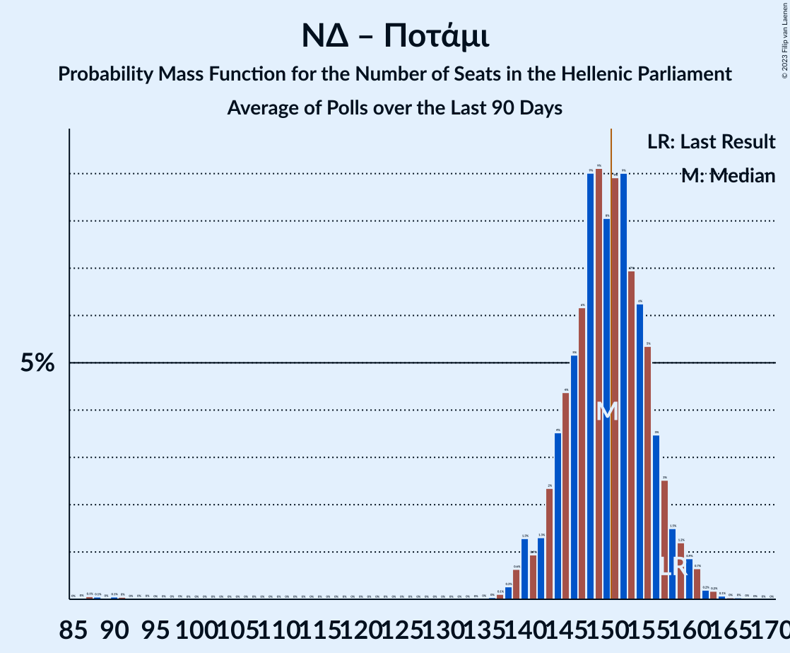

# Poll Average

<a href="#voting-intentions">Voting Intentions</a> | <a href="#seats">Seats</a> | <a href="#coalitions">Coalitions</a> | <a href="#technical-information">Technical Information</a>

## Summary

The table below lists the polls on which the average is based. They are the most recent polls (less than 90 days old) registered and analyzed so far.

| Period     | Polling firm/Commissioner(s) | ΣΥΡΙΖΑ | ΝΔ | ΧΑ | ΚΑ | ΚΚΕ | Ποτάμι | ΑΝΕΛ | ΕΚ | ΛΑΕ | ΠΕ | ΕΛ | ΜέΡΑ25 |
|:----------:|:----------------------------:|:--:|:--:|:--:|:--:|:--:|:--:|:--:|:--:|:--:|:--:|:--:|:--:|
| 7 July 2019 | General Election | 31.5%   86 | 39.8%   158 | 2.9%   0 | 8.1%   22 | 5.3%   15 | 0.0%   0 | 0.0%   0 | 1.2%   0 | 0.0%   0 | 1.5%   0 | 3.7%   10 | 3.4%   9 |
| N/A | Poll Average | 22–31%   60–86 | 34–40%   142–161 | 2–4%   0–10 | 12–20%   34–53 | 4–8%   12–21 | N/A   N/A | N/A   N/A | N/A   N/A | N/A   N/A | 1–2%   0 | 3–6%   9–17 | 2–5%   0–14 |
| [12–18 January 2022](2022-01-18-MetronAnalysis.html) | Metron Analysis   Mega TV | 22–27%   59–71 | 34–39%   139–153 | N/A   N/A | 17–21%   44–55 | 4–7%   12–18 | N/A   N/A | N/A   N/A | N/A   N/A | N/A   N/A | N/A   N/A | 4–6%   11–17 | 3–5%   8–14 |
| [14–16 January 2022](2022-01-16-Prorata.html) | Prorata   iEidiseis | 27–32%   73–89 | 34–40%   145–162 | N/A   N/A | 12–16%   33–45 | 4–7%   11–19 | N/A   N/A | N/A   N/A | N/A   N/A | N/A   N/A | N/A   N/A | 3–5%   0–15 | 2–3%   0–9 |
| [10–12 January 2022](2022-01-12-Interview.html) | Interview   Politic.gr | 23–28%   64–76 | 35–40%   147–161 | N/A   N/A | 12–16%   34–43 | 4–7%   12–18 | N/A   N/A | N/A   N/A | N/A   N/A | N/A   N/A | N/A   N/A | 4–6%   11–17 | 3–5%   0–13 |
| [13–18 December 2021](2021-12-18-Alco.html) | Alco   Open TV | 22–27%   58–73 | 34–40%   143–159 | 2–4%   0–10 | 13–18%   36–49 | 5–8%   13–22 | N/A   N/A | N/A   N/A | N/A   N/A | N/A   N/A | 1–2%   0 | 3–6%   8–15 | 3–5%   0–15 |
| [13–17 December 2021](2021-12-17-GPO.html) | GPO   Powergame.gr | 23–28%   61–76 | 35–41%   144–161 | N/A   N/A | 13–18%   36–48 | 5–8%   14–22 | N/A   N/A | N/A   N/A | N/A   N/A | N/A   N/A | N/A   N/A | 3–6%   9–16 | 2–5%   0–13 |
| 7 July 2019 | General Election | 31.5%   86 | 39.8%   158 | 2.9%   0 | 8.1%   22 | 5.3%   15 | 0.0%   0 | 0.0%   0 | 1.2%   0 | 0.0%   0 | 1.5%   0 | 3.7%   10 | 3.4%   9 |

Only polls for which at least the sample size has been published are included in the table above.

**Legend:**
+ **Top half of each row:** Voting intentions (95% confidence interval)
+ **Bottom half of each row:** Seat projections for the Hellenic Parliament (95% confidence interval)
+ **ΣΥΡΙΖΑ:** Συνασπισμός Ριζοσπαστικής Αριστεράς
+ **ΝΔ:** Νέα Δημοκρατία
+ **ΧΑ:** Χρυσή Αυγή
+ **ΚΑ:** Κίνημα Αλλαγής
+ **ΚΚΕ:** Κομμουνιστικό Κόμμα Ελλάδας
+ **Ποτάμι:** Το Ποτάμι
+ **ΑΝΕΛ:** Ανεξάρτητοι Έλληνες
+ **ΕΚ:** Ένωση Κεντρώων
+ **ΛΑΕ:** Λαϊκή Ενότητα
+ **ΠΕ:** Πλεύση Ελευθερίας
+ **ΕΛ:** Ελληνική Λύση
+ **ΜέΡΑ25:** Μέτωπο Ευρωπαϊκής Ρεαλιστικής Ανυπακοής
+ **N/A (single party):** Party not included the published results
+ **N/A (entire row):** Calculation for this opinion poll not started yet

## Voting Intentions

### Confidence Intervals

| Party | Last Result | Median | 80% Confidence Interval | 90% Confidence Interval | 95% Confidence Interval | 99% Confidence Interval |
|:-----:|:-----------:|:------:|:-----------------------:|:-----------------------:|:-----------------------:|:-----------------------:|
| <a href="#νέα-δημοκρατία">Νέα Δημοκρατία</a> | 39.8% | 37.4% | 35.3–39.4% |34.7–40.0% | 34.2–40.5% | 33.3–41.4% |
| <a href="#συνασπισμός-ριζοσπαστικής-αριστεράς">Συνασπισμός Ριζοσπαστικής Αριστεράς</a> | 31.5% | 25.3% | 23.3–29.3% |22.7–30.3% | 22.3–31.0% | 21.4–32.2% |
| <a href="#κίνημα-αλλαγής">Κίνημα Αλλαγής</a> | 8.1% | 15.2% | 13.2–18.7% |12.8–19.4% | 12.4–19.9% | 11.7–20.8% |
| <a href="#κομμουνιστικό-κόμμα-ελλάδας">Κομμουνιστικό Κόμμα Ελλάδας</a> | 5.3% | 5.8% | 4.8–7.0% |4.5–7.4% | 4.3–7.7% | 3.9–8.3% |
| <a href="#ελληνική-λύση">Ελληνική Λύση</a> | 3.7% | 4.7% | 3.7–5.7% |3.4–5.9% | 3.2–6.2% | 2.9–6.7% |
| <a href="#μέτωπο-ευρωπαϊκής-ρεαλιστικής-ανυπακοής">Μέτωπο Ευρωπαϊκής Ρεαλιστικής Ανυπακοής</a> | 3.4% | 3.7% | 2.3–4.6% |2.0–4.9% | 1.9–5.1% | 1.5–5.6% |
| <a href="#χρυσή-αυγή">Χρυσή Αυγή</a> | 2.9% | 2.6% | 2.0–3.3% |1.8–3.5% | 1.7–3.7% | 1.5–4.1% |
| <a href="#πλεύση-ελευθερίας">Πλεύση Ελευθερίας</a> | 1.5% | 1.4% | 1.0–1.9% |0.8–2.0% | 0.8–2.2% | 0.6–2.5% |
| <a href="#ένωση-κεντρώων">Ένωση Κεντρώων</a> | 1.2% | N/A | N/A |N/A | N/A | N/A |
| <a href="#το-ποτάμι">Το Ποτάμι</a> | 0.0% | N/A | N/A |N/A | N/A | N/A |
| <a href="#ανεξάρτητοι-έλληνες">Ανεξάρτητοι Έλληνες</a> | 0.0% | N/A | N/A |N/A | N/A | N/A |
| <a href="#λαϊκή-ενότητα">Λαϊκή Ενότητα</a> | 0.0% | N/A | N/A |N/A | N/A | N/A |

### Νέα Δημοκρατία

*For a full overview of the results for this party, see the [Νέα Δημοκρατία](party-νέαδημοκρατία.html) page.*

| Voting Intentions | Probability | Accumulated | Special Marks |
|:-----------------:|:-----------:|:-----------:|:-------------:|
| 30.5–31.5% | 0% | 100% |  |
| 31.5–32.5% | 0.1% | 100% |  |
| 32.5–33.5% | 0.7% | 99.9% |  |
| 33.5–34.5% | 3% | 99.2% |  |
| 34.5–35.5% | 9% | 96% |  |
| 35.5–36.5% | 18% | 87% |  |
| 36.5–37.5% | 24% | 69% | Median |
| 37.5–38.5% | 22% | 45% |  |
| 38.5–39.5% | 15% | 23% |  |
| 39.5–40.5% | 6% | 8% | Last Result |
| 40.5–41.5% | 2% | 2% |  |
| 41.5–42.5% | 0.4% | 0.4% |  |
| 42.5–43.5% | 0.1% | 0.1% |  |
| 43.5–44.5% | 0% | 0% |  |

### Συνασπισμός Ριζοσπαστικής Αριστεράς

*For a full overview of the results for this party, see the [Συνασπισμός Ριζοσπαστικής Αριστεράς](party-συνασπισμόςριζοσπαστικήςαριστεράς.html) page.*

| Voting Intentions | Probability | Accumulated | Special Marks |
|:-----------------:|:-----------:|:-----------:|:-------------:|
| 19.5–20.5% | 0.1% | 100% |  |
| 20.5–21.5% | 0.6% | 99.9% |  |
| 21.5–22.5% | 3% | 99.4% |  |
| 22.5–23.5% | 10% | 96% |  |
| 23.5–24.5% | 19% | 86% |  |
| 24.5–25.5% | 22% | 67% | Median |
| 25.5–26.5% | 17% | 46% |  |
| 26.5–27.5% | 9% | 29% |  |
| 27.5–28.5% | 6% | 20% |  |
| 28.5–29.5% | 6% | 15% |  |
| 29.5–30.5% | 5% | 9% |  |
| 30.5–31.5% | 3% | 4% |  |
| 31.5–32.5% | 1.0% | 1.3% | Last Result |
| 32.5–33.5% | 0.2% | 0.3% |  |
| 33.5–34.5% | 0% | 0% |  |

### Κίνημα Αλλαγής

*For a full overview of the results for this party, see the [Κίνημα Αλλαγής](party-κίνημααλλαγής.html) page.*

| Voting Intentions | Probability | Accumulated | Special Marks |
|:-----------------:|:-----------:|:-----------:|:-------------:|
| 7.5–8.5% | 0% | 100% | Last Result |
| 8.5–9.5% | 0% | 100% |  |
| 9.5–10.5% | 0% | 100% |  |
| 10.5–11.5% | 0.3% | 100% |  |
| 11.5–12.5% | 3% | 99.7% |  |
| 12.5–13.5% | 12% | 97% |  |
| 13.5–14.5% | 21% | 85% |  |
| 14.5–15.5% | 21% | 64% | Median |
| 15.5–16.5% | 15% | 43% |  |
| 16.5–17.5% | 9% | 28% |  |
| 17.5–18.5% | 8% | 19% |  |
| 18.5–19.5% | 7% | 11% |  |
| 19.5–20.5% | 3% | 4% |  |
| 20.5–21.5% | 0.8% | 0.8% |  |
| 21.5–22.5% | 0.1% | 0.1% |  |
| 22.5–23.5% | 0% | 0% |  |

### Κομμουνιστικό Κόμμα Ελλάδας

*For a full overview of the results for this party, see the [Κομμουνιστικό Κόμμα Ελλάδας](party-κομμουνιστικόκόμμαελλάδας.html) page.*

| Voting Intentions | Probability | Accumulated | Special Marks |
|:-----------------:|:-----------:|:-----------:|:-------------:|
| 2.5–3.5% | 0.1% | 100% |  |
| 3.5–4.5% | 6% | 99.9% |  |
| 4.5–5.5% | 35% | 94% | Last Result |
| 5.5–6.5% | 39% | 59% | Median |
| 6.5–7.5% | 16% | 20% |  |
| 7.5–8.5% | 3% | 3% |  |
| 8.5–9.5% | 0.2% | 0.3% |  |
| 9.5–10.5% | 0% | 0% |  |

### Ελληνική Λύση

*For a full overview of the results for this party, see the [Ελληνική Λύση](party-ελληνικήλύση.html) page.*

| Voting Intentions | Probability | Accumulated | Special Marks |
|:-----------------:|:-----------:|:-----------:|:-------------:|
| 1.5–2.5% | 0.1% | 100% |  |
| 2.5–3.5% | 7% | 99.9% |  |
| 3.5–4.5% | 38% | 93% | Last Result |
| 4.5–5.5% | 42% | 55% | Median |
| 5.5–6.5% | 12% | 13% |  |
| 6.5–7.5% | 0.7% | 0.7% |  |
| 7.5–8.5% | 0% | 0% |  |

### Μέτωπο Ευρωπαϊκής Ρεαλιστικής Ανυπακοής

*For a full overview of the results for this party, see the [Μέτωπο Ευρωπαϊκής Ρεαλιστικής Ανυπακοής](party-μέτωποευρωπαϊκήςρεαλιστικήςανυπακοής.html) page.*

| Voting Intentions | Probability | Accumulated | Special Marks |
|:-----------------:|:-----------:|:-----------:|:-------------:|
| 0.0–0.5% | 0% | 100% |  |
| 0.5–1.5% | 0.5% | 100% |  |
| 1.5–2.5% | 13% | 99.5% |  |
| 2.5–3.5% | 31% | 86% | Last Result |
| 3.5–4.5% | 44% | 56% | Median |
| 4.5–5.5% | 11% | 12% |  |
| 5.5–6.5% | 0.6% | 0.6% |  |
| 6.5–7.5% | 0% | 0% |  |

### Χρυσή Αυγή

*For a full overview of the results for this party, see the [Χρυσή Αυγή](party-χρυσήαυγή.html) page.*

| Voting Intentions | Probability | Accumulated | Special Marks |
|:-----------------:|:-----------:|:-----------:|:-------------:|
| 0.0–0.5% | 0% | 100% |  |
| 0.5–1.5% | 0.9% | 100% |  |
| 1.5–2.5% | 48% | 99.1% |  |
| 2.5–3.5% | 48% | 51% | Last Result, Median |
| 3.5–4.5% | 4% | 4% |  |
| 4.5–5.5% | 0% | 0% |  |
| 5.5–6.5% | 0% | 0% |  |

### Πλεύση Ελευθερίας

*For a full overview of the results for this party, see the [Πλεύση Ελευθερίας](party-πλεύσηελευθερίας.html) page.*

| Voting Intentions | Probability | Accumulated | Special Marks |
|:-----------------:|:-----------:|:-----------:|:-------------:|
| 0.0–0.5% | 0.2% | 100% |  |
| 0.5–1.5% | 69% | 99.8% | Last Result, Median |
| 1.5–2.5% | 31% | 31% |  |
| 2.5–3.5% | 0.5% | 0.5% |  |
| 3.5–4.5% | 0% | 0% |  |

## Seats

### Confidence Intervals

| Party | Last Result | Median | 80% Confidence Interval | 90% Confidence Interval | 95% Confidence Interval | 99% Confidence Interval |
|:-----:|:-----------:|:------:|:-----------------------:|:-----------------------:|:-----------------------:|:-----------------------:|
| <a href="#νέα-δημοκρατία">Νέα Δημοκρατία</a> | 158 | 151 | 145–157 |143–159 | 142–161 | 139–164 |
| <a href="#συνασπισμός-ριζοσπαστικής-αριστεράς">Συνασπισμός Ριζοσπαστικής Αριστεράς</a> | 86 | 68 | 62–81 |61–84 | 60–86 | 57–89 |
| <a href="#κίνημα-αλλαγής">Κίνημα Αλλαγής</a> | 22 | 42 | 36–50 |35–52 | 34–53 | 32–55 |
| <a href="#κομμουνιστικό-κόμμα-ελλάδας">Κομμουνιστικό Κόμμα Ελλάδας</a> | 15 | 16 | 13–19 |12–20 | 12–21 | 11–23 |
| <a href="#ελληνική-λύση">Ελληνική Λύση</a> | 10 | 13 | 10–15 |9–16 | 9–17 | 0–18 |
| <a href="#μέτωπο-ευρωπαϊκής-ρεαλιστικής-ανυπακοής">Μέτωπο Ευρωπαϊκής Ρεαλιστικής Ανυπακοής</a> | 9 | 10 | 0–12 |0–13 | 0–14 | 0–15 |
| <a href="#χρυσή-αυγή">Χρυσή Αυγή</a> | 0 | 0 | 0–9 |0–9 | 0–10 | 0–11 |
| <a href="#πλεύση-ελευθερίας">Πλεύση Ελευθερίας</a> | 0 | 0 | 0 |0 | 0 | 0 |
| <a href="#ένωση-κεντρώων">Ένωση Κεντρώων</a> | 0 | N/A | N/A |N/A | N/A | N/A |
| <a href="#το-ποτάμι">Το Ποτάμι</a> | 0 | N/A | N/A |N/A | N/A | N/A |
| <a href="#ανεξάρτητοι-έλληνες">Ανεξάρτητοι Έλληνες</a> | 0 | N/A | N/A |N/A | N/A | N/A |
| <a href="#λαϊκή-ενότητα">Λαϊκή Ενότητα</a> | 0 | N/A | N/A |N/A | N/A | N/A |

### Νέα Δημοκρατία

*For a full overview of the results for this party, see the [Νέα Δημοκρατία](party-νέαδημοκρατία.html) page.*

| Number of Seats | Probability | Accumulated | Special Marks |
|:---------------:|:-----------:|:-----------:|:-------------:|
| 136 | 0% | 100% |  |
| 137 | 0.1% | 99.9% |  |
| 138 | 0.2% | 99.8% |  |
| 139 | 0.4% | 99.6% |  |
| 140 | 0.6% | 99.3% |  |
| 141 | 1.0% | 98.7% |  |
| 142 | 2% | 98% |  |
| 143 | 2% | 96% |  |
| 144 | 3% | 94% |  |
| 145 | 4% | 90% |  |
| 146 | 5% | 86% |  |
| 147 | 5% | 82% |  |
| 148 | 7% | 76% |  |
| 149 | 7% | 69% |  |
| 150 | 8% | 62% |  |
| 151 | 8% | 55% | Median, Majority |
| 152 | 8% | 46% |  |
| 153 | 7% | 39% |  |
| 154 | 7% | 32% |  |
| 155 | 6% | 25% |  |
| 156 | 5% | 19% |  |
| 157 | 4% | 14% |  |
| 158 | 3% | 10% | Last Result |
| 159 | 2% | 7% |  |
| 160 | 2% | 4% |  |
| 161 | 1.1% | 3% |  |
| 162 | 0.6% | 2% |  |
| 163 | 0.4% | 0.9% |  |
| 164 | 0.2% | 0.5% |  |
| 165 | 0.1% | 0.3% |  |
| 166 | 0.1% | 0.1% |  |
| 167 | 0% | 0.1% |  |
| 168 | 0% | 0% |  |

### Συνασπισμός Ριζοσπαστικής Αριστεράς

*For a full overview of the results for this party, see the [Συνασπισμός Ριζοσπαστικής Αριστεράς](party-συνασπισμόςριζοσπαστικήςαριστεράς.html) page.*

| Number of Seats | Probability | Accumulated | Special Marks |
|:---------------:|:-----------:|:-----------:|:-------------:|
| 55 | 0.1% | 100% |  |
| 56 | 0.2% | 99.9% |  |
| 57 | 0.4% | 99.8% |  |
| 58 | 0.6% | 99.4% |  |
| 59 | 1.1% | 98.8% |  |
| 60 | 2% | 98% |  |
| 61 | 3% | 96% |  |
| 62 | 4% | 93% |  |
| 63 | 5% | 89% |  |
| 64 | 6% | 84% |  |
| 65 | 7% | 78% |  |
| 66 | 7% | 71% |  |
| 67 | 8% | 63% |  |
| 68 | 7% | 56% | Median |
| 69 | 7% | 48% |  |
| 70 | 6% | 42% |  |
| 71 | 5% | 36% |  |
| 72 | 4% | 31% |  |
| 73 | 3% | 27% |  |
| 74 | 2% | 24% |  |
| 75 | 2% | 22% |  |
| 76 | 2% | 20% |  |
| 77 | 2% | 18% |  |
| 78 | 2% | 17% |  |
| 79 | 2% | 15% |  |
| 80 | 2% | 13% |  |
| 81 | 2% | 12% |  |
| 82 | 2% | 9% |  |
| 83 | 2% | 8% |  |
| 84 | 2% | 6% |  |
| 85 | 1.3% | 4% |  |
| 86 | 1.0% | 3% | Last Result |
| 87 | 0.7% | 2% |  |
| 88 | 0.5% | 1.3% |  |
| 89 | 0.3% | 0.8% |  |
| 90 | 0.2% | 0.5% |  |
| 91 | 0.1% | 0.3% |  |
| 92 | 0.1% | 0.1% |  |
| 93 | 0% | 0.1% |  |
| 94 | 0% | 0% |  |

### Κίνημα Αλλαγής

*For a full overview of the results for this party, see the [Κίνημα Αλλαγής](party-κίνημααλλαγής.html) page.*

| Number of Seats | Probability | Accumulated | Special Marks |
|:---------------:|:-----------:|:-----------:|:-------------:|
| 22 | 0% | 100% | Last Result |
| 23 | 0% | 100% |  |
| 24 | 0% | 100% |  |
| 25 | 0% | 100% |  |
| 26 | 0% | 100% |  |
| 27 | 0% | 100% |  |
| 28 | 0% | 100% |  |
| 29 | 0% | 100% |  |
| 30 | 0% | 100% |  |
| 31 | 0.2% | 99.9% |  |
| 32 | 0.4% | 99.8% |  |
| 33 | 0.9% | 99.4% |  |
| 34 | 2% | 98% |  |
| 35 | 3% | 97% |  |
| 36 | 5% | 93% |  |
| 37 | 7% | 88% |  |
| 38 | 8% | 82% |  |
| 39 | 8% | 74% |  |
| 40 | 8% | 66% |  |
| 41 | 8% | 59% |  |
| 42 | 7% | 51% | Median |
| 43 | 6% | 44% |  |
| 44 | 6% | 39% |  |
| 45 | 5% | 33% |  |
| 46 | 4% | 27% |  |
| 47 | 5% | 23% |  |
| 48 | 4% | 18% |  |
| 49 | 3% | 14% |  |
| 50 | 3% | 10% |  |
| 51 | 3% | 8% |  |
| 52 | 2% | 5% |  |
| 53 | 1.4% | 3% |  |
| 54 | 0.8% | 2% |  |
| 55 | 0.5% | 1.0% |  |
| 56 | 0.3% | 0.5% |  |
| 57 | 0.1% | 0.2% |  |
| 58 | 0% | 0.1% |  |
| 59 | 0% | 0% |  |

### Κομμουνιστικό Κόμμα Ελλάδας

*For a full overview of the results for this party, see the [Κομμουνιστικό Κόμμα Ελλάδας](party-κομμουνιστικόκόμμαελλάδας.html) page.*

| Number of Seats | Probability | Accumulated | Special Marks |
|:---------------:|:-----------:|:-----------:|:-------------:|
| 10 | 0.3% | 100% |  |
| 11 | 1.4% | 99.7% |  |
| 12 | 4% | 98% |  |
| 13 | 10% | 94% |  |
| 14 | 14% | 84% |  |
| 15 | 16% | 69% | Last Result |
| 16 | 16% | 53% | Median |
| 17 | 14% | 37% |  |
| 18 | 10% | 23% |  |
| 19 | 6% | 12% |  |
| 20 | 3% | 7% |  |
| 21 | 2% | 3% |  |
| 22 | 1.1% | 2% |  |
| 23 | 0.4% | 0.6% |  |
| 24 | 0.1% | 0.2% |  |
| 25 | 0% | 0% |  |

### Ελληνική Λύση

*For a full overview of the results for this party, see the [Ελληνική Λύση](party-ελληνικήλύση.html) page.*

| Number of Seats | Probability | Accumulated | Special Marks |
|:---------------:|:-----------:|:-----------:|:-------------:|
| 0 | 1.2% | 100% |  |
| 1 | 0% | 98.8% |  |
| 2 | 0% | 98.8% |  |
| 3 | 0% | 98.8% |  |
| 4 | 0% | 98.8% |  |
| 5 | 0% | 98.8% |  |
| 6 | 0% | 98.8% |  |
| 7 | 0% | 98.8% |  |
| 8 | 0.6% | 98.8% |  |
| 9 | 5% | 98% |  |
| 10 | 9% | 93% | Last Result |
| 11 | 15% | 84% |  |
| 12 | 18% | 69% |  |
| 13 | 18% | 51% | Median |
| 14 | 15% | 33% |  |
| 15 | 10% | 18% |  |
| 16 | 5% | 8% |  |
| 17 | 2% | 3% |  |
| 18 | 0.7% | 0.9% |  |
| 19 | 0.2% | 0.2% |  |
| 20 | 0% | 0% |  |

### Μέτωπο Ευρωπαϊκής Ρεαλιστικής Ανυπακοής

*For a full overview of the results for this party, see the [Μέτωπο Ευρωπαϊκής Ρεαλιστικής Ανυπακοής](party-μέτωποευρωπαϊκήςρεαλιστικήςανυπακοής.html) page.*

| Number of Seats | Probability | Accumulated | Special Marks |
|:---------------:|:-----------:|:-----------:|:-------------:|
| 0 | 24% | 100% |  |
| 1 | 0% | 76% |  |
| 2 | 0% | 76% |  |
| 3 | 0% | 76% |  |
| 4 | 0% | 76% |  |
| 5 | 0% | 76% |  |
| 6 | 0% | 76% |  |
| 7 | 0% | 76% |  |
| 8 | 4% | 76% |  |
| 9 | 15% | 71% | Last Result |
| 10 | 19% | 56% | Median |
| 11 | 17% | 38% |  |
| 12 | 10% | 20% |  |
| 13 | 6% | 10% |  |
| 14 | 3% | 4% |  |
| 15 | 0.8% | 1.1% |  |
| 16 | 0.3% | 0.4% |  |
| 17 | 0.1% | 0.1% |  |
| 18 | 0% | 0% |  |

### Χρυσή Αυγή

*For a full overview of the results for this party, see the [Χρυσή Αυγή](party-χρυσήαυγή.html) page.*

| Number of Seats | Probability | Accumulated | Special Marks |
|:---------------:|:-----------:|:-----------:|:-------------:|
| 0 | 83% | 100% | Last Result, Median |
| 1 | 0% | 17% |  |
| 2 | 0% | 17% |  |
| 3 | 0% | 17% |  |
| 4 | 0% | 17% |  |
| 5 | 0% | 17% |  |
| 6 | 0% | 17% |  |
| 7 | 0% | 17% |  |
| 8 | 6% | 17% |  |
| 9 | 8% | 11% |  |
| 10 | 3% | 3% |  |
| 11 | 0.5% | 0.6% |  |
| 12 | 0.1% | 0.1% |  |
| 13 | 0% | 0% |  |

### Πλεύση Ελευθερίας

*For a full overview of the results for this party, see the [Πλεύση Ελευθερίας](party-πλεύσηελευθερίας.html) page.*

| Number of Seats | Probability | Accumulated | Special Marks |
|:---------------:|:-----------:|:-----------:|:-------------:|
| 0 | 100% | 100% | Last Result, Median |

### Ένωση Κεντρώων

*For a full overview of the results for this party, see the [Ένωση Κεντρώων](party-ένωσηκεντρώων.html) page.*

### Το Ποτάμι

*For a full overview of the results for this party, see the [Το Ποτάμι](party-τοποτάμι.html) page.*

### Ανεξάρτητοι Έλληνες

*For a full overview of the results for this party, see the [Ανεξάρτητοι Έλληνες](party-ανεξάρτητοιέλληνες.html) page.*

### Λαϊκή Ενότητα

*For a full overview of the results for this party, see the [Λαϊκή Ενότητα](party-λαϊκήενότητα.html) page.*

## Coalitions

### Confidence Intervals

| Coalition | Last Result | Median | Majority? | 80% Confidence Interval | 90% Confidence Interval | 95% Confidence Interval | 99% Confidence Interval |
|:---------:|:-----------:|:------:|:---------:|:-----------------------:|:-----------------------:|:-----------------------:|:-----------------------:|
| Νέα Δημοκρατία – Κίνημα Αλλαγής | 180 | 193 | 100% | 188–199 | 186–201 | 185–202 | 182–206 |
| Νέα Δημοκρατία – Κίνημα Αλλαγής – Το Ποτάμι | 180 | 193 | 100% | 188–199 | 186–201 | 185–202 | 182–206 |
| Νέα Δημοκρατία | 158 | 151 | 55% | 145–157 | 143–159 | 142–161 | 139–164 |
| Νέα Δημοκρατία – Το Ποτάμι | 158 | 151 | 55% | 145–157 | 143–159 | 142–161 | 139–164 |
| Συνασπισμός Ριζοσπαστικής Αριστεράς – Μέτωπο Ευρωπαϊκής Ρεαλιστικής Ανυπακοής | 95 | 78 | 0% | 72–84 | 70–86 | 68–88 | 65–91 |
| Συνασπισμός Ριζοσπαστικής Αριστεράς – Ανεξάρτητοι Έλληνες – Λαϊκή Ενότητα | 86 | 68 | 0% | 62–81 | 61–84 | 60–86 | 57–89 |
| Συνασπισμός Ριζοσπαστικής Αριστεράς – Ανεξάρτητοι Έλληνες | 86 | 68 | 0% | 62–81 | 61–84 | 60–86 | 57–89 |
| Συνασπισμός Ριζοσπαστικής Αριστεράς – Λαϊκή Ενότητα | 86 | 68 | 0% | 62–81 | 61–84 | 60–86 | 57–89 |
| Συνασπισμός Ριζοσπαστικής Αριστεράς | 86 | 68 | 0% | 62–81 | 61–84 | 60–86 | 57–89 |

### Νέα Δημοκρατία – Κίνημα Αλλαγής

| Number of Seats | Probability | Accumulated | Special Marks |
|:---------------:|:-----------:|:-----------:|:-------------:|
| 178 | 0% | 100% |  |
| 179 | 0.1% | 99.9% |  |
| 180 | 0.1% | 99.9% | Last Result |
| 181 | 0.2% | 99.8% |  |
| 182 | 0.4% | 99.6% |  |
| 183 | 0.6% | 99.2% |  |
| 184 | 1.0% | 98.6% |  |
| 185 | 1.5% | 98% |  |
| 186 | 2% | 96% |  |
| 187 | 3% | 94% |  |
| 188 | 4% | 91% |  |
| 189 | 6% | 87% |  |
| 190 | 7% | 81% |  |
| 191 | 8% | 74% |  |
| 192 | 9% | 66% |  |
| 193 | 9% | 58% | Median |
| 194 | 9% | 49% |  |
| 195 | 8% | 40% |  |
| 196 | 7% | 32% |  |
| 197 | 7% | 25% |  |
| 198 | 6% | 18% |  |
| 199 | 3% | 12% |  |
| 200 | 3% | 9% |  |
| 201 | 2% | 6% |  |
| 202 | 1.2% | 4% |  |
| 203 | 0.9% | 2% |  |
| 204 | 0.6% | 2% |  |
| 205 | 0.4% | 0.9% |  |
| 206 | 0.2% | 0.5% |  |
| 207 | 0.1% | 0.3% |  |
| 208 | 0.1% | 0.2% |  |
| 209 | 0% | 0.1% |  |
| 210 | 0% | 0% |  |

### Νέα Δημοκρατία – Κίνημα Αλλαγής – Το Ποτάμι

| Number of Seats | Probability | Accumulated | Special Marks |
|:---------------:|:-----------:|:-----------:|:-------------:|
| 178 | 0% | 100% |  |
| 179 | 0.1% | 99.9% |  |
| 180 | 0.1% | 99.9% | Last Result |
| 181 | 0.2% | 99.8% |  |
| 182 | 0.4% | 99.6% |  |
| 183 | 0.6% | 99.2% |  |
| 184 | 1.0% | 98.6% |  |
| 185 | 1.5% | 98% |  |
| 186 | 2% | 96% |  |
| 187 | 3% | 94% |  |
| 188 | 4% | 91% |  |
| 189 | 6% | 87% |  |
| 190 | 7% | 81% |  |
| 191 | 8% | 74% |  |
| 192 | 9% | 66% |  |
| 193 | 9% | 58% | Median |
| 194 | 9% | 49% |  |
| 195 | 8% | 40% |  |
| 196 | 7% | 32% |  |
| 197 | 7% | 25% |  |
| 198 | 6% | 18% |  |
| 199 | 3% | 12% |  |
| 200 | 3% | 9% |  |
| 201 | 2% | 6% |  |
| 202 | 1.2% | 4% |  |
| 203 | 0.9% | 2% |  |
| 204 | 0.6% | 2% |  |
| 205 | 0.4% | 0.9% |  |
| 206 | 0.2% | 0.5% |  |
| 207 | 0.1% | 0.3% |  |
| 208 | 0.1% | 0.2% |  |
| 209 | 0% | 0.1% |  |
| 210 | 0% | 0% |  |

### Νέα Δημοκρατία

| Number of Seats | Probability | Accumulated | Special Marks |
|:---------------:|:-----------:|:-----------:|:-------------:|
| 136 | 0% | 100% |  |
| 137 | 0.1% | 99.9% |  |
| 138 | 0.2% | 99.8% |  |
| 139 | 0.4% | 99.6% |  |
| 140 | 0.6% | 99.3% |  |
| 141 | 1.0% | 98.7% |  |
| 142 | 2% | 98% |  |
| 143 | 2% | 96% |  |
| 144 | 3% | 94% |  |
| 145 | 4% | 90% |  |
| 146 | 5% | 86% |  |
| 147 | 5% | 82% |  |
| 148 | 7% | 76% |  |
| 149 | 7% | 69% |  |
| 150 | 8% | 62% |  |
| 151 | 8% | 55% | Median, Majority |
| 152 | 8% | 46% |  |
| 153 | 7% | 39% |  |
| 154 | 7% | 32% |  |
| 155 | 6% | 25% |  |
| 156 | 5% | 19% |  |
| 157 | 4% | 14% |  |
| 158 | 3% | 10% | Last Result |
| 159 | 2% | 7% |  |
| 160 | 2% | 4% |  |
| 161 | 1.1% | 3% |  |
| 162 | 0.6% | 2% |  |
| 163 | 0.4% | 0.9% |  |
| 164 | 0.2% | 0.5% |  |
| 165 | 0.1% | 0.3% |  |
| 166 | 0.1% | 0.1% |  |
| 167 | 0% | 0.1% |  |
| 168 | 0% | 0% |  |

### Νέα Δημοκρατία – Το Ποτάμι

| Number of Seats | Probability | Accumulated | Special Marks |
|:---------------:|:-----------:|:-----------:|:-------------:|
| 136 | 0% | 100% |  |
| 137 | 0.1% | 99.9% |  |
| 138 | 0.2% | 99.8% |  |
| 139 | 0.4% | 99.6% |  |
| 140 | 0.6% | 99.3% |  |
| 141 | 1.0% | 98.7% |  |
| 142 | 2% | 98% |  |
| 143 | 2% | 96% |  |
| 144 | 3% | 94% |  |
| 145 | 4% | 90% |  |
| 146 | 5% | 86% |  |
| 147 | 5% | 82% |  |
| 148 | 7% | 76% |  |
| 149 | 7% | 69% |  |
| 150 | 8% | 62% |  |
| 151 | 8% | 55% | Median, Majority |
| 152 | 8% | 46% |  |
| 153 | 7% | 39% |  |
| 154 | 7% | 32% |  |
| 155 | 6% | 25% |  |
| 156 | 5% | 19% |  |
| 157 | 4% | 14% |  |
| 158 | 3% | 10% | Last Result |
| 159 | 2% | 7% |  |
| 160 | 2% | 4% |  |
| 161 | 1.1% | 3% |  |
| 162 | 0.6% | 2% |  |
| 163 | 0.4% | 0.9% |  |
| 164 | 0.2% | 0.5% |  |
| 165 | 0.1% | 0.3% |  |
| 166 | 0.1% | 0.1% |  |
| 167 | 0% | 0.1% |  |
| 168 | 0% | 0% |  |

### Συνασπισμός Ριζοσπαστικής Αριστεράς – Μέτωπο Ευρωπαϊκής Ρεαλιστικής Ανυπακοής

| Number of Seats | Probability | Accumulated | Special Marks |
|:---------------:|:-----------:|:-----------:|:-------------:|
| 61 | 0% | 100% |  |
| 62 | 0.1% | 99.9% |  |
| 63 | 0.1% | 99.9% |  |
| 64 | 0.2% | 99.8% |  |
| 65 | 0.3% | 99.6% |  |
| 66 | 0.4% | 99.3% |  |
| 67 | 0.7% | 99.0% |  |
| 68 | 0.9% | 98% |  |
| 69 | 1.2% | 97% |  |
| 70 | 2% | 96% |  |
| 71 | 3% | 94% |  |
| 72 | 4% | 92% |  |
| 73 | 5% | 88% |  |
| 74 | 6% | 83% |  |
| 75 | 7% | 77% |  |
| 76 | 8% | 70% |  |
| 77 | 8% | 62% |  |
| 78 | 9% | 54% | Median |
| 79 | 9% | 45% |  |
| 80 | 8% | 36% |  |
| 81 | 7% | 28% |  |
| 82 | 6% | 22% |  |
| 83 | 4% | 16% |  |
| 84 | 3% | 12% |  |
| 85 | 3% | 8% |  |
| 86 | 2% | 6% |  |
| 87 | 1.3% | 4% |  |
| 88 | 0.9% | 3% |  |
| 89 | 0.6% | 2% |  |
| 90 | 0.4% | 1.2% |  |
| 91 | 0.3% | 0.8% |  |
| 92 | 0.2% | 0.5% |  |
| 93 | 0.1% | 0.3% |  |
| 94 | 0.1% | 0.2% |  |
| 95 | 0% | 0.1% | Last Result |
| 96 | 0% | 0.1% |  |
| 97 | 0% | 0% |  |

### Συνασπισμός Ριζοσπαστικής Αριστεράς – Ανεξάρτητοι Έλληνες – Λαϊκή Ενότητα

| Number of Seats | Probability | Accumulated | Special Marks |
|:---------------:|:-----------:|:-----------:|:-------------:|
| 55 | 0.1% | 100% |  |
| 56 | 0.2% | 99.9% |  |
| 57 | 0.4% | 99.8% |  |
| 58 | 0.6% | 99.4% |  |
| 59 | 1.1% | 98.8% |  |
| 60 | 2% | 98% |  |
| 61 | 3% | 96% |  |
| 62 | 4% | 93% |  |
| 63 | 5% | 89% |  |
| 64 | 6% | 84% |  |
| 65 | 7% | 78% |  |
| 66 | 7% | 71% |  |
| 67 | 8% | 63% |  |
| 68 | 7% | 56% | Median |
| 69 | 7% | 48% |  |
| 70 | 6% | 42% |  |
| 71 | 5% | 36% |  |
| 72 | 4% | 31% |  |
| 73 | 3% | 27% |  |
| 74 | 2% | 24% |  |
| 75 | 2% | 22% |  |
| 76 | 2% | 20% |  |
| 77 | 2% | 18% |  |
| 78 | 2% | 17% |  |
| 79 | 2% | 15% |  |
| 80 | 2% | 13% |  |
| 81 | 2% | 12% |  |
| 82 | 2% | 9% |  |
| 83 | 2% | 8% |  |
| 84 | 2% | 6% |  |
| 85 | 1.3% | 4% |  |
| 86 | 1.0% | 3% | Last Result |
| 87 | 0.7% | 2% |  |
| 88 | 0.5% | 1.3% |  |
| 89 | 0.3% | 0.8% |  |
| 90 | 0.2% | 0.5% |  |
| 91 | 0.1% | 0.3% |  |
| 92 | 0.1% | 0.1% |  |
| 93 | 0% | 0.1% |  |
| 94 | 0% | 0% |  |

### Συνασπισμός Ριζοσπαστικής Αριστεράς – Ανεξάρτητοι Έλληνες

| Number of Seats | Probability | Accumulated | Special Marks |
|:---------------:|:-----------:|:-----------:|:-------------:|
| 55 | 0.1% | 100% |  |
| 56 | 0.2% | 99.9% |  |
| 57 | 0.4% | 99.8% |  |
| 58 | 0.6% | 99.4% |  |
| 59 | 1.1% | 98.8% |  |
| 60 | 2% | 98% |  |
| 61 | 3% | 96% |  |
| 62 | 4% | 93% |  |
| 63 | 5% | 89% |  |
| 64 | 6% | 84% |  |
| 65 | 7% | 78% |  |
| 66 | 7% | 71% |  |
| 67 | 8% | 63% |  |
| 68 | 7% | 56% | Median |
| 69 | 7% | 48% |  |
| 70 | 6% | 42% |  |
| 71 | 5% | 36% |  |
| 72 | 4% | 31% |  |
| 73 | 3% | 27% |  |
| 74 | 2% | 24% |  |
| 75 | 2% | 22% |  |
| 76 | 2% | 20% |  |
| 77 | 2% | 18% |  |
| 78 | 2% | 17% |  |
| 79 | 2% | 15% |  |
| 80 | 2% | 13% |  |
| 81 | 2% | 12% |  |
| 82 | 2% | 9% |  |
| 83 | 2% | 8% |  |
| 84 | 2% | 6% |  |
| 85 | 1.3% | 4% |  |
| 86 | 1.0% | 3% | Last Result |
| 87 | 0.7% | 2% |  |
| 88 | 0.5% | 1.3% |  |
| 89 | 0.3% | 0.8% |  |
| 90 | 0.2% | 0.5% |  |
| 91 | 0.1% | 0.3% |  |
| 92 | 0.1% | 0.1% |  |
| 93 | 0% | 0.1% |  |
| 94 | 0% | 0% |  |

### Συνασπισμός Ριζοσπαστικής Αριστεράς – Λαϊκή Ενότητα

| Number of Seats | Probability | Accumulated | Special Marks |
|:---------------:|:-----------:|:-----------:|:-------------:|
| 55 | 0.1% | 100% |  |
| 56 | 0.2% | 99.9% |  |
| 57 | 0.4% | 99.8% |  |
| 58 | 0.6% | 99.4% |  |
| 59 | 1.1% | 98.8% |  |
| 60 | 2% | 98% |  |
| 61 | 3% | 96% |  |
| 62 | 4% | 93% |  |
| 63 | 5% | 89% |  |
| 64 | 6% | 84% |  |
| 65 | 7% | 78% |  |
| 66 | 7% | 71% |  |
| 67 | 8% | 63% |  |
| 68 | 7% | 56% | Median |
| 69 | 7% | 48% |  |
| 70 | 6% | 42% |  |
| 71 | 5% | 36% |  |
| 72 | 4% | 31% |  |
| 73 | 3% | 27% |  |
| 74 | 2% | 24% |  |
| 75 | 2% | 22% |  |
| 76 | 2% | 20% |  |
| 77 | 2% | 18% |  |
| 78 | 2% | 17% |  |
| 79 | 2% | 15% |  |
| 80 | 2% | 13% |  |
| 81 | 2% | 12% |  |
| 82 | 2% | 9% |  |
| 83 | 2% | 8% |  |
| 84 | 2% | 6% |  |
| 85 | 1.3% | 4% |  |
| 86 | 1.0% | 3% | Last Result |
| 87 | 0.7% | 2% |  |
| 88 | 0.5% | 1.3% |  |
| 89 | 0.3% | 0.8% |  |
| 90 | 0.2% | 0.5% |  |
| 91 | 0.1% | 0.3% |  |
| 92 | 0.1% | 0.1% |  |
| 93 | 0% | 0.1% |  |
| 94 | 0% | 0% |  |

### Συνασπισμός Ριζοσπαστικής Αριστεράς

| Number of Seats | Probability | Accumulated | Special Marks |
|:---------------:|:-----------:|:-----------:|:-------------:|
| 55 | 0.1% | 100% |  |
| 56 | 0.2% | 99.9% |  |
| 57 | 0.4% | 99.8% |  |
| 58 | 0.6% | 99.4% |  |
| 59 | 1.1% | 98.8% |  |
| 60 | 2% | 98% |  |
| 61 | 3% | 96% |  |
| 62 | 4% | 93% |  |
| 63 | 5% | 89% |  |
| 64 | 6% | 84% |  |
| 65 | 7% | 78% |  |
| 66 | 7% | 71% |  |
| 67 | 8% | 63% |  |
| 68 | 7% | 56% | Median |
| 69 | 7% | 48% |  |
| 70 | 6% | 42% |  |
| 71 | 5% | 36% |  |
| 72 | 4% | 31% |  |
| 73 | 3% | 27% |  |
| 74 | 2% | 24% |  |
| 75 | 2% | 22% |  |
| 76 | 2% | 20% |  |
| 77 | 2% | 18% |  |
| 78 | 2% | 17% |  |
| 79 | 2% | 15% |  |
| 80 | 2% | 13% |  |
| 81 | 2% | 12% |  |
| 82 | 2% | 9% |  |
| 83 | 2% | 8% |  |
| 84 | 2% | 6% |  |
| 85 | 1.3% | 4% |  |
| 86 | 1.0% | 3% | Last Result |
| 87 | 0.7% | 2% |  |
| 88 | 0.5% | 1.3% |  |
| 89 | 0.3% | 0.8% |  |
| 90 | 0.2% | 0.5% |  |
| 91 | 0.1% | 0.3% |  |
| 92 | 0.1% | 0.1% |  |
| 93 | 0% | 0.1% |  |
| 94 | 0% | 0% |  |

## Technical Information

+ **Number of polls included in this average:** 5
+ **Lowest number of simulations done in a poll included in this average:** 1,048,576
+ **Total number of simulations done in the polls included in this average:** 5,242,880
+ **Error estimate:** 1.19%
