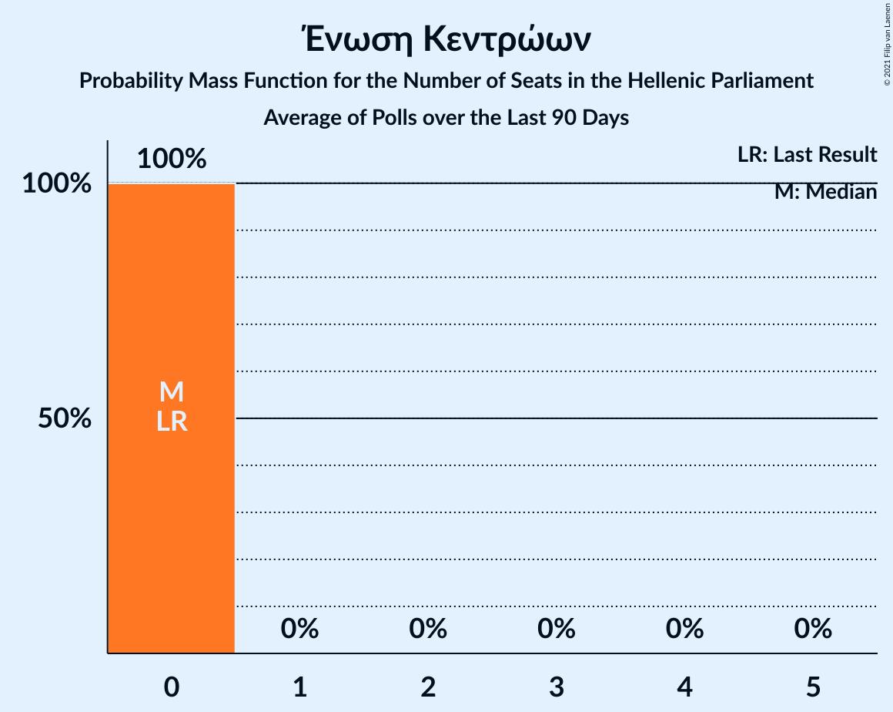

# Poll Average

<a href="#voting-intentions">Voting Intentions</a> | <a href="#seats">Seats</a> | <a href="#coalitions">Coalitions</a> | <a href="#technical-information">Technical Information</a>

## Summary

The table below lists the polls on which the average is based. They are the most recent polls (less than 90 days old) registered and analyzed so far.

| Period     | Polling firm/Commissioner(s) | ΣΥΡΙΖΑ | ΝΔ | ΧΑ | ΚΑ | ΚΚΕ | Ποτάμι | ΑΝΕΛ | ΕΚ | ΛΑΕ | ΠΕ | ΕΛ | ΜέΡΑ25 |
|:----------:|:----------------------------:|:--:|:--:|:--:|:--:|:--:|:--:|:--:|:--:|:--:|:--:|:--:|:--:|
| 7 July 2019 | General Election | 31.5%   86 | 39.8%   158 | 2.9%   0 | 8.1%   22 | 5.3%   15 | 0.0%   0 | 0.0%   0 | 1.2%   0 | 0.0%   0 | 1.5%   0 | 3.7%   10 | 3.4%   9 |
| N/A | Poll Average | 22–29%   58–77 | 46–54%   172–195 | 1–3%   0–8 | 5–9%   13–23 | 4–7%   11–19 | N/A   N/A | N/A   N/A | N/A   N/A | N/A   N/A | N/A   N/A | 3–6%   0–16 | 2–5%   0–12 |
| [4–6 May 2020](2020-05-06-PulseRC.html) | Pulse RC   ΣΚΑΪ | 23–28%   61–76 | 45–51%   171–189 | 1–2%   0 | 6–9%   15–23 | 5–7%   13–20 | N/A   N/A | N/A   N/A | N/A   N/A | N/A   N/A | N/A   N/A | 3–6%   9–16 | 2–4%   0–11 |
| [3–6 May 2020](2020-05-06-Interview.html) | Interview   Βεργίνα TV | 21–26%   56–69 | 46–52%   173–190 | N/A   N/A | 6–9%   16–24 | 4–7%   11–19 | N/A   N/A | N/A   N/A | N/A   N/A | N/A   N/A | N/A   N/A | 4–7%   11–18 | 3–5%   0–13 |
| [24–29 April 2020](2020-04-29-Prorata.html) | Prorata | N/A   N/A | N/A   N/A | N/A   N/A | N/A   N/A | N/A   N/A | N/A   N/A | N/A   N/A | N/A   N/A | N/A   N/A | N/A   N/A | N/A   N/A | N/A   N/A |
| [22–28 April 2020](2020-04-28-MetronAnalysis.html) | Metron Analysis   MEGA TV | 23–28%   61–75 | 48–53%   175–193 | 1–3%   0 | 5–7%   13–20 | 4–7%   12–19 | N/A   N/A | N/A   N/A | N/A   N/A | N/A   N/A | N/A   N/A | 3–5%   0–12 | 3–5%   0–13 |
| [14–22 April 2020](2020-04-22-GPO.html) | GPO   Παραπολιτικά | 23–29%   60–75 | 47–53%   171–189 | N/A   N/A | 6–9%   15–24 | 4–7%   11–19 | N/A   N/A | N/A   N/A | N/A   N/A | N/A   N/A | N/A   N/A | 4–6%   10–17 | 2–4%   0–11 |
| [15–17 April 2020](2020-04-17-ΚάπαResearch.html) | Κάπα Research   ΕΘΝΟΣ | 25–30%   64–81 | 46–52%   170–192 | 2–3%   0–9 | 5–8%   12–20 | 4–7%   10–17 | N/A   N/A | N/A   N/A | N/A   N/A | N/A   N/A | N/A   N/A | 3–5%   0–13 | 2–5%   0–12 |
| [11–13 April 2020](2020-04-13-Marc.html) | Marc   Alpha TV | 22–27%   58–73 | 50–56%   182–200 | 1–3%   0 | 5–8%   14–22 | 5–7%   12–20 | N/A   N/A | N/A   N/A | N/A   N/A | N/A   N/A | N/A   N/A | 3–5%   0–14 | 2–3%   0–9 |
| 7 July 2019 | General Election | 31.5%   86 | 39.8%   158 | 2.9%   0 | 8.1%   22 | 5.3%   15 | 0.0%   0 | 0.0%   0 | 1.2%   0 | 0.0%   0 | 1.5%   0 | 3.7%   10 | 3.4%   9 |

Only polls for which at least the sample size has been published are included in the table above.

**Legend:**
+ **Top half of each row:** Voting intentions (95% confidence interval)
+ **Bottom half of each row:** Seat projections for the Hellenic Parliament (95% confidence interval)
+ **ΣΥΡΙΖΑ:** Συνασπισμός Ριζοσπαστικής Αριστεράς
+ **ΝΔ:** Νέα Δημοκρατία
+ **ΧΑ:** Χρυσή Αυγή
+ **ΚΑ:** Κίνημα Αλλαγής
+ **ΚΚΕ:** Κομμουνιστικό Κόμμα Ελλάδας
+ **Ποτάμι:** Το Ποτάμι
+ **ΑΝΕΛ:** Ανεξάρτητοι Έλληνες
+ **ΕΚ:** Ένωση Κεντρώων
+ **ΛΑΕ:** Λαϊκή Ενότητα
+ **ΠΕ:** Πλεύση Ελευθερίας
+ **ΕΛ:** Ελληνική Λύση
+ **ΜέΡΑ25:** Μέτωπο Ευρωπαϊκής Ρεαλιστικής Ανυπακοής
+ **N/A (single party):** Party not included the published results
+ **N/A (entire row):** Calculation for this opinion poll not started yet

## Voting Intentions

### Confidence Intervals

| Party | Last Result | Median | 80% Confidence Interval | 90% Confidence Interval | 95% Confidence Interval | 99% Confidence Interval |
|:-----:|:-----------:|:------:|:-----------------------:|:-----------------------:|:-----------------------:|:-----------------------:|
| <a href="#νέα-δημοκρατία">Νέα Δημοκρατία</a> | 39.8% | 49.6% | 47.2–52.7% |46.6–53.7% | 46.0–54.4% | 45.0–55.7% |
| <a href="#συνασπισμός-ριζοσπαστικής-αριστεράς">Συνασπισμός Ριζοσπαστικής Αριστεράς</a> | 31.5% | 25.2% | 22.9–27.6% |22.2–28.3% | 21.7–28.9% | 20.8–30.0% |
| <a href="#κίνημα-αλλαγής">Κίνημα Αλλαγής</a> | 8.1% | 6.7% | 5.5–8.0% |5.2–8.4% | 5.0–8.7% | 4.5–9.3% |
| <a href="#κομμουνιστικό-κόμμα-ελλάδας">Κομμουνιστικό Κόμμα Ελλάδας</a> | 5.3% | 5.6% | 4.7–6.6% |4.4–6.9% | 4.2–7.2% | 3.8–7.7% |
| <a href="#ελληνική-λύση">Ελληνική Λύση</a> | 3.7% | 4.3% | 3.2–5.5% |3.0–5.9% | 2.8–6.1% | 2.5–6.7% |
| <a href="#μέτωπο-ευρωπαϊκής-ρεαλιστικής-ανυπακοής">Μέτωπο Ευρωπαϊκής Ρεαλιστικής Ανυπακοής</a> | 3.4% | 3.2% | 2.3–4.1% |2.1–4.4% | 1.9–4.6% | 1.6–5.1% |
| <a href="#χρυσή-αυγή">Χρυσή Αυγή</a> | 2.9% | 1.9% | 1.3–2.7% |1.2–2.9% | 1.1–3.1% | 0.9–3.5% |
| <a href="#πλεύση-ελευθερίας">Πλεύση Ελευθερίας</a> | 1.5% | N/A | N/A |N/A | N/A | N/A |
| <a href="#ένωση-κεντρώων">Ένωση Κεντρώων</a> | 1.2% | N/A | N/A |N/A | N/A | N/A |
| <a href="#το-ποτάμι">Το Ποτάμι</a> | 0.0% | N/A | N/A |N/A | N/A | N/A |
| <a href="#ανεξάρτητοι-έλληνες">Ανεξάρτητοι Έλληνες</a> | 0.0% | N/A | N/A |N/A | N/A | N/A |
| <a href="#λαϊκή-ενότητα">Λαϊκή Ενότητα</a> | 0.0% | N/A | N/A |N/A | N/A | N/A |

### Νέα Δημοκρατία

*For a full overview of the results for this party, see the [Νέα Δημοκρατία](party-νέαδημοκρατία.html) page.*

| Voting Intentions | Probability | Accumulated | Special Marks |
|:-----------------:|:-----------:|:-----------:|:-------------:|
| 39.5–40.5% | 0% | 100% | Last Result |
| 40.5–41.5% | 0% | 100% |  |
| 41.5–42.5% | 0% | 100% |  |
| 42.5–43.5% | 0% | 100% |  |
| 43.5–44.5% | 0.2% | 100% |  |
| 44.5–45.5% | 1.0% | 99.8% |  |
| 45.5–46.5% | 4% | 98.8% |  |
| 46.5–47.5% | 9% | 95% |  |
| 47.5–48.5% | 15% | 86% |  |
| 48.5–49.5% | 19% | 71% |  |
| 49.5–50.5% | 18% | 52% | Median |
| 50.5–51.5% | 13% | 34% |  |
| 51.5–52.5% | 9% | 20% |  |
| 52.5–53.5% | 6% | 11% |  |
| 53.5–54.5% | 3% | 5% |  |
| 54.5–55.5% | 2% | 2% |  |
| 55.5–56.5% | 0.5% | 0.6% |  |
| 56.5–57.5% | 0.1% | 0.1% |  |
| 57.5–58.5% | 0% | 0% |  |

### Συνασπισμός Ριζοσπαστικής Αριστεράς

*For a full overview of the results for this party, see the [Συνασπισμός Ριζοσπαστικής Αριστεράς](party-συνασπισμόςριζοσπαστικήςαριστεράς.html) page.*

| Voting Intentions | Probability | Accumulated | Special Marks |
|:-----------------:|:-----------:|:-----------:|:-------------:|
| 18.5–19.5% | 0% | 100% |  |
| 19.5–20.5% | 0.3% | 100% |  |
| 20.5–21.5% | 2% | 99.7% |  |
| 21.5–22.5% | 5% | 98% |  |
| 22.5–23.5% | 11% | 93% |  |
| 23.5–24.5% | 18% | 82% |  |
| 24.5–25.5% | 22% | 64% | Median |
| 25.5–26.5% | 19% | 43% |  |
| 26.5–27.5% | 13% | 23% |  |
| 27.5–28.5% | 7% | 10% |  |
| 28.5–29.5% | 3% | 4% |  |
| 29.5–30.5% | 0.8% | 1.0% |  |
| 30.5–31.5% | 0.2% | 0.2% |  |
| 31.5–32.5% | 0% | 0% | Last Result |

### Κίνημα Αλλαγής

*For a full overview of the results for this party, see the [Κίνημα Αλλαγής](party-κίνημααλλαγής.html) page.*

| Voting Intentions | Probability | Accumulated | Special Marks |
|:-----------------:|:-----------:|:-----------:|:-------------:|
| 2.5–3.5% | 0% | 100% |  |
| 3.5–4.5% | 0.5% | 100% |  |
| 4.5–5.5% | 10% | 99.5% |  |
| 5.5–6.5% | 33% | 89% |  |
| 6.5–7.5% | 35% | 56% | Median |
| 7.5–8.5% | 17% | 21% | Last Result |
| 8.5–9.5% | 3% | 4% |  |
| 9.5–10.5% | 0.2% | 0.3% |  |
| 10.5–11.5% | 0% | 0% |  |

### Κομμουνιστικό Κόμμα Ελλάδας

*For a full overview of the results for this party, see the [Κομμουνιστικό Κόμμα Ελλάδας](party-κομμουνιστικόκόμμαελλάδας.html) page.*

| Voting Intentions | Probability | Accumulated | Special Marks |
|:-----------------:|:-----------:|:-----------:|:-------------:|
| 1.5–2.5% | 0% | 100% |  |
| 2.5–3.5% | 0.1% | 100% |  |
| 3.5–4.5% | 7% | 99.9% |  |
| 4.5–5.5% | 40% | 93% | Last Result |
| 5.5–6.5% | 42% | 53% | Median |
| 6.5–7.5% | 10% | 11% |  |
| 7.5–8.5% | 0.8% | 0.8% |  |
| 8.5–9.5% | 0% | 0% |  |

### Ελληνική Λύση

*For a full overview of the results for this party, see the [Ελληνική Λύση](party-ελληνικήλύση.html) page.*

| Voting Intentions | Probability | Accumulated | Special Marks |
|:-----------------:|:-----------:|:-----------:|:-------------:|
| 0.5–1.5% | 0% | 100% |  |
| 1.5–2.5% | 0.7% | 100% |  |
| 2.5–3.5% | 21% | 99.3% |  |
| 3.5–4.5% | 40% | 79% | Last Result, Median |
| 4.5–5.5% | 29% | 39% |  |
| 5.5–6.5% | 9% | 10% |  |
| 6.5–7.5% | 0.8% | 0.8% |  |
| 7.5–8.5% | 0% | 0% |  |

### Μέτωπο Ευρωπαϊκής Ρεαλιστικής Ανυπακοής

*For a full overview of the results for this party, see the [Μέτωπο Ευρωπαϊκής Ρεαλιστικής Ανυπακοής](party-μέτωποευρωπαϊκήςρεαλιστικήςανυπακοής.html) page.*

| Voting Intentions | Probability | Accumulated | Special Marks |
|:-----------------:|:-----------:|:-----------:|:-------------:|
| 0.0–0.5% | 0% | 100% |  |
| 0.5–1.5% | 0.3% | 100% |  |
| 1.5–2.5% | 16% | 99.7% |  |
| 2.5–3.5% | 51% | 83% | Last Result, Median |
| 3.5–4.5% | 29% | 32% |  |
| 4.5–5.5% | 3% | 3% |  |
| 5.5–6.5% | 0.1% | 0.1% |  |
| 6.5–7.5% | 0% | 0% |  |

### Χρυσή Αυγή

*For a full overview of the results for this party, see the [Χρυσή Αυγή](party-χρυσήαυγή.html) page.*

| Voting Intentions | Probability | Accumulated | Special Marks |
|:-----------------:|:-----------:|:-----------:|:-------------:|
| 0.0–0.5% | 0% | 100% |  |
| 0.5–1.5% | 24% | 100% |  |
| 1.5–2.5% | 63% | 76% | Median |
| 2.5–3.5% | 13% | 13% | Last Result |
| 3.5–4.5% | 0.4% | 0.5% |  |
| 4.5–5.5% | 0% | 0% |  |

## Seats

### Confidence Intervals

| Party | Last Result | Median | 80% Confidence Interval | 90% Confidence Interval | 95% Confidence Interval | 99% Confidence Interval |
|:-----:|:-----------:|:------:|:-----------------------:|:-----------------------:|:-----------------------:|:-----------------------:|
| <a href="#νέα-δημοκρατία">Νέα Δημοκρατία</a> | 158 | 182 | 175–191 |174–193 | 172–195 | 169–200 |
| <a href="#συνασπισμός-ριζοσπαστικής-αριστεράς">Συνασπισμός Ριζοσπαστικής Αριστεράς</a> | 86 | 67 | 61–74 |59–75 | 58–77 | 56–81 |
| <a href="#κίνημα-αλλαγής">Κίνημα Αλλαγής</a> | 22 | 18 | 15–21 |14–22 | 13–23 | 12–25 |
| <a href="#κομμουνιστικό-κόμμα-ελλάδας">Κομμουνιστικό Κόμμα Ελλάδας</a> | 15 | 15 | 12–18 |12–19 | 11–19 | 10–21 |
| <a href="#ελληνική-λύση">Ελληνική Λύση</a> | 10 | 11 | 9–15 |0–16 | 0–16 | 0–18 |
| <a href="#μέτωπο-ευρωπαϊκής-ρεαλιστικής-ανυπακοής">Μέτωπο Ευρωπαϊκής Ρεαλιστικής Ανυπακοής</a> | 9 | 8 | 0–11 |0–12 | 0–12 | 0–13 |
| <a href="#χρυσή-αυγή">Χρυσή Αυγή</a> | 0 | 0 | 0 |0 | 0–8 | 0–9 |
| <a href="#πλεύση-ελευθερίας">Πλεύση Ελευθερίας</a> | 0 | N/A | N/A |N/A | N/A | N/A |
| <a href="#ένωση-κεντρώων">Ένωση Κεντρώων</a> | 0 | N/A | N/A |N/A | N/A | N/A |
| <a href="#το-ποτάμι">Το Ποτάμι</a> | 0 | N/A | N/A |N/A | N/A | N/A |
| <a href="#ανεξάρτητοι-έλληνες">Ανεξάρτητοι Έλληνες</a> | 0 | N/A | N/A |N/A | N/A | N/A |
| <a href="#λαϊκή-ενότητα">Λαϊκή Ενότητα</a> | 0 | N/A | N/A |N/A | N/A | N/A |

### Νέα Δημοκρατία

*For a full overview of the results for this party, see the [Νέα Δημοκρατία](party-νέαδημοκρατία.html) page.*

| Number of Seats | Probability | Accumulated | Special Marks |
|:---------------:|:-----------:|:-----------:|:-------------:|
| 158 | 0% | 100% | Last Result |
| 159 | 0% | 100% |  |
| 160 | 0% | 100% |  |
| 161 | 0% | 100% |  |
| 162 | 0% | 100% |  |
| 163 | 0% | 100% |  |
| 164 | 0% | 100% |  |
| 165 | 0% | 100% |  |
| 166 | 0% | 100% |  |
| 167 | 0.1% | 99.9% |  |
| 168 | 0.1% | 99.9% |  |
| 169 | 0.3% | 99.7% |  |
| 170 | 0.5% | 99.4% |  |
| 171 | 1.0% | 98.9% |  |
| 172 | 1.3% | 98% |  |
| 173 | 1.4% | 97% |  |
| 174 | 2% | 95% |  |
| 175 | 3% | 93% |  |
| 176 | 5% | 90% |  |
| 177 | 5% | 85% |  |
| 178 | 6% | 80% |  |
| 179 | 5% | 74% |  |
| 180 | 6% | 69% |  |
| 181 | 8% | 63% |  |
| 182 | 6% | 55% | Median |
| 183 | 8% | 49% |  |
| 184 | 6% | 41% |  |
| 185 | 5% | 35% |  |
| 186 | 6% | 30% |  |
| 187 | 4% | 24% |  |
| 188 | 3% | 20% |  |
| 189 | 3% | 17% |  |
| 190 | 3% | 14% |  |
| 191 | 2% | 11% |  |
| 192 | 2% | 9% |  |
| 193 | 2% | 7% |  |
| 194 | 2% | 5% |  |
| 195 | 1.0% | 3% |  |
| 196 | 0.6% | 2% |  |
| 197 | 0.5% | 2% |  |
| 198 | 0.3% | 1.3% |  |
| 199 | 0.3% | 1.0% |  |
| 200 | 0.3% | 0.7% |  |
| 201 | 0.2% | 0.4% |  |
| 202 | 0.1% | 0.2% |  |
| 203 | 0.1% | 0.2% |  |
| 204 | 0% | 0.1% |  |
| 205 | 0% | 0% |  |

### Συνασπισμός Ριζοσπαστικής Αριστεράς

*For a full overview of the results for this party, see the [Συνασπισμός Ριζοσπαστικής Αριστεράς](party-συνασπισμόςριζοσπαστικήςαριστεράς.html) page.*

| Number of Seats | Probability | Accumulated | Special Marks |
|:---------------:|:-----------:|:-----------:|:-------------:|
| 53 | 0.1% | 100% |  |
| 54 | 0.1% | 99.9% |  |
| 55 | 0.1% | 99.8% |  |
| 56 | 0.5% | 99.6% |  |
| 57 | 1.0% | 99.1% |  |
| 58 | 1.4% | 98% |  |
| 59 | 2% | 97% |  |
| 60 | 3% | 95% |  |
| 61 | 3% | 91% |  |
| 62 | 4% | 88% |  |
| 63 | 5% | 84% |  |
| 64 | 8% | 79% |  |
| 65 | 8% | 71% |  |
| 66 | 8% | 63% |  |
| 67 | 7% | 55% | Median |
| 68 | 10% | 49% |  |
| 69 | 6% | 39% |  |
| 70 | 6% | 32% |  |
| 71 | 7% | 26% |  |
| 72 | 4% | 19% |  |
| 73 | 5% | 15% |  |
| 74 | 3% | 10% |  |
| 75 | 2% | 7% |  |
| 76 | 1.3% | 5% |  |
| 77 | 1.3% | 4% |  |
| 78 | 0.7% | 2% |  |
| 79 | 0.6% | 2% |  |
| 80 | 0.4% | 1.0% |  |
| 81 | 0.3% | 0.5% |  |
| 82 | 0.2% | 0.3% |  |
| 83 | 0% | 0.1% |  |
| 84 | 0% | 0.1% |  |
| 85 | 0% | 0% |  |
| 86 | 0% | 0% | Last Result |

### Κίνημα Αλλαγής

*For a full overview of the results for this party, see the [Κίνημα Αλλαγής](party-κίνημααλλαγής.html) page.*

| Number of Seats | Probability | Accumulated | Special Marks |
|:---------------:|:-----------:|:-----------:|:-------------:|
| 11 | 0.2% | 100% |  |
| 12 | 0.8% | 99.8% |  |
| 13 | 2% | 99.0% |  |
| 14 | 6% | 97% |  |
| 15 | 12% | 91% |  |
| 16 | 10% | 79% |  |
| 17 | 12% | 68% |  |
| 18 | 15% | 57% | Median |
| 19 | 15% | 41% |  |
| 20 | 10% | 26% |  |
| 21 | 7% | 16% |  |
| 22 | 5% | 10% | Last Result |
| 23 | 3% | 5% |  |
| 24 | 1.2% | 2% |  |
| 25 | 0.6% | 0.8% |  |
| 26 | 0.2% | 0.2% |  |
| 27 | 0.1% | 0.1% |  |
| 28 | 0% | 0% |  |

### Κομμουνιστικό Κόμμα Ελλάδας

*For a full overview of the results for this party, see the [Κομμουνιστικό Κόμμα Ελλάδας](party-κομμουνιστικόκόμμαελλάδας.html) page.*

| Number of Seats | Probability | Accumulated | Special Marks |
|:---------------:|:-----------:|:-----------:|:-------------:|
| 9 | 0.2% | 100% |  |
| 10 | 1.0% | 99.8% |  |
| 11 | 3% | 98.8% |  |
| 12 | 7% | 96% |  |
| 13 | 12% | 89% |  |
| 14 | 17% | 77% |  |
| 15 | 19% | 60% | Last Result, Median |
| 16 | 20% | 40% |  |
| 17 | 9% | 20% |  |
| 18 | 5% | 11% |  |
| 19 | 4% | 6% |  |
| 20 | 1.3% | 2% |  |
| 21 | 0.4% | 0.7% |  |
| 22 | 0.2% | 0.2% |  |
| 23 | 0% | 0% |  |

### Ελληνική Λύση

*For a full overview of the results for this party, see the [Ελληνική Λύση](party-ελληνικήλύση.html) page.*

| Number of Seats | Probability | Accumulated | Special Marks |
|:---------------:|:-----------:|:-----------:|:-------------:|
| 0 | 6% | 100% |  |
| 1 | 0% | 94% |  |
| 2 | 0% | 94% |  |
| 3 | 0% | 94% |  |
| 4 | 0% | 94% |  |
| 5 | 0% | 94% |  |
| 6 | 0% | 94% |  |
| 7 | 0% | 94% |  |
| 8 | 3% | 94% |  |
| 9 | 11% | 91% |  |
| 10 | 18% | 80% | Last Result |
| 11 | 14% | 61% | Median |
| 12 | 14% | 47% |  |
| 13 | 10% | 33% |  |
| 14 | 9% | 23% |  |
| 15 | 7% | 13% |  |
| 16 | 4% | 6% |  |
| 17 | 2% | 2% |  |
| 18 | 0.6% | 0.8% |  |
| 19 | 0.1% | 0.2% |  |
| 20 | 0% | 0.1% |  |
| 21 | 0% | 0% |  |

### Μέτωπο Ευρωπαϊκής Ρεαλιστικής Ανυπακοής

*For a full overview of the results for this party, see the [Μέτωπο Ευρωπαϊκής Ρεαλιστικής Ανυπακοής](party-μέτωποευρωπαϊκήςρεαλιστικήςανυπακοής.html) page.*

| Number of Seats | Probability | Accumulated | Special Marks |
|:---------------:|:-----------:|:-----------:|:-------------:|
| 0 | 40% | 100% |  |
| 1 | 0% | 60% |  |
| 2 | 0% | 60% |  |
| 3 | 0% | 60% |  |
| 4 | 0% | 60% |  |
| 5 | 0% | 60% |  |
| 6 | 0% | 60% |  |
| 7 | 0% | 60% |  |
| 8 | 11% | 60% | Median |
| 9 | 18% | 50% | Last Result |
| 10 | 17% | 31% |  |
| 11 | 8% | 14% |  |
| 12 | 4% | 6% |  |
| 13 | 2% | 2% |  |
| 14 | 0.3% | 0.5% |  |
| 15 | 0.1% | 0.2% |  |
| 16 | 0% | 0% |  |

### Χρυσή Αυγή

*For a full overview of the results for this party, see the [Χρυσή Αυγή](party-χρυσήαυγή.html) page.*

| Number of Seats | Probability | Accumulated | Special Marks |
|:---------------:|:-----------:|:-----------:|:-------------:|
| 0 | 97% | 100% | Last Result, Median |
| 1 | 0% | 3% |  |
| 2 | 0% | 3% |  |
| 3 | 0% | 3% |  |
| 4 | 0% | 3% |  |
| 5 | 0% | 3% |  |
| 6 | 0% | 3% |  |
| 7 | 0% | 3% |  |
| 8 | 2% | 3% |  |
| 9 | 1.0% | 1.4% |  |
| 10 | 0.3% | 0.4% |  |
| 11 | 0% | 0% |  |

### Πλεύση Ελευθερίας

*For a full overview of the results for this party, see the [Πλεύση Ελευθερίας](party-πλεύσηελευθερίας.html) page.*

### Ένωση Κεντρώων

*For a full overview of the results for this party, see the [Ένωση Κεντρώων](party-ένωσηκεντρώων.html) page.*

### Το Ποτάμι

*For a full overview of the results for this party, see the [Το Ποτάμι](party-τοποτάμι.html) page.*

### Ανεξάρτητοι Έλληνες

*For a full overview of the results for this party, see the [Ανεξάρτητοι Έλληνες](party-ανεξάρτητοιέλληνες.html) page.*

### Λαϊκή Ενότητα

*For a full overview of the results for this party, see the [Λαϊκή Ενότητα](party-λαϊκήενότητα.html) page.*

## Coalitions

### Confidence Intervals

| Coalition | Last Result | Median | Majority? | 80% Confidence Interval | 90% Confidence Interval | 95% Confidence Interval | 99% Confidence Interval |
|:---------:|:-----------:|:------:|:---------:|:-----------------------:|:-----------------------:|:-----------------------:|:-----------------------:|
| Νέα Δημοκρατία – Κίνημα Αλλαγής | 180 | 200 | 100% | 193–209 | 192–211 | 190–213 | 186–218 |
| Νέα Δημοκρατία – Κίνημα Αλλαγής – Το Ποτάμι | 180 | 200 | 100% | 193–209 | 192–211 | 190–213 | 186–218 |
| Νέα Δημοκρατία | 158 | 182 | 100% | 175–191 | 174–193 | 172–195 | 169–200 |
| Νέα Δημοκρατία – Το Ποτάμι | 158 | 182 | 100% | 175–191 | 174–193 | 172–195 | 169–200 |
| Συνασπισμός Ριζοσπαστικής Αριστεράς – Μέτωπο Ευρωπαϊκής Ρεαλιστικής Ανυπακοής | 95 | 73 | 0% | 65–81 | 63–84 | 61–86 | 58–90 |
| Συνασπισμός Ριζοσπαστικής Αριστεράς – Ανεξάρτητοι Έλληνες – Λαϊκή Ενότητα | 86 | 67 | 0% | 61–74 | 59–75 | 58–77 | 56–81 |
| Συνασπισμός Ριζοσπαστικής Αριστεράς – Ανεξάρτητοι Έλληνες | 86 | 67 | 0% | 61–74 | 59–75 | 58–77 | 56–81 |
| Συνασπισμός Ριζοσπαστικής Αριστεράς – Λαϊκή Ενότητα | 86 | 67 | 0% | 61–74 | 59–75 | 58–77 | 56–81 |
| Συνασπισμός Ριζοσπαστικής Αριστεράς | 86 | 67 | 0% | 61–74 | 59–75 | 58–77 | 56–81 |

### Νέα Δημοκρατία – Κίνημα Αλλαγής

| Number of Seats | Probability | Accumulated | Special Marks |
|:---------------:|:-----------:|:-----------:|:-------------:|
| 180 | 0% | 100% | Last Result |
| 181 | 0% | 100% |  |
| 182 | 0% | 100% |  |
| 183 | 0% | 100% |  |
| 184 | 0.1% | 99.9% |  |
| 185 | 0.2% | 99.8% |  |
| 186 | 0.3% | 99.7% |  |
| 187 | 0.3% | 99.3% |  |
| 188 | 0.9% | 99.0% |  |
| 189 | 0.5% | 98% |  |
| 190 | 1.1% | 98% |  |
| 191 | 2% | 97% |  |
| 192 | 3% | 95% |  |
| 193 | 4% | 92% |  |
| 194 | 4% | 88% |  |
| 195 | 5% | 84% |  |
| 196 | 6% | 79% |  |
| 197 | 4% | 73% |  |
| 198 | 8% | 69% |  |
| 199 | 8% | 61% |  |
| 200 | 4% | 54% | Median |
| 201 | 7% | 50% |  |
| 202 | 6% | 43% |  |
| 203 | 6% | 36% |  |
| 204 | 5% | 31% |  |
| 205 | 4% | 26% |  |
| 206 | 5% | 22% |  |
| 207 | 3% | 17% |  |
| 208 | 3% | 13% |  |
| 209 | 2% | 10% |  |
| 210 | 2% | 8% |  |
| 211 | 2% | 6% |  |
| 212 | 0.7% | 4% |  |
| 213 | 1.2% | 3% |  |
| 214 | 0.6% | 2% |  |
| 215 | 0.4% | 2% |  |
| 216 | 0.4% | 1.2% |  |
| 217 | 0.2% | 0.8% |  |
| 218 | 0.3% | 0.6% |  |
| 219 | 0.2% | 0.3% |  |
| 220 | 0.1% | 0.2% |  |
| 221 | 0% | 0.1% |  |
| 222 | 0% | 0% |  |

### Νέα Δημοκρατία – Κίνημα Αλλαγής – Το Ποτάμι

| Number of Seats | Probability | Accumulated | Special Marks |
|:---------------:|:-----------:|:-----------:|:-------------:|
| 180 | 0% | 100% | Last Result |
| 181 | 0% | 100% |  |
| 182 | 0% | 100% |  |
| 183 | 0% | 100% |  |
| 184 | 0.1% | 99.9% |  |
| 185 | 0.2% | 99.8% |  |
| 186 | 0.3% | 99.7% |  |
| 187 | 0.3% | 99.3% |  |
| 188 | 0.9% | 99.0% |  |
| 189 | 0.5% | 98% |  |
| 190 | 1.1% | 98% |  |
| 191 | 2% | 97% |  |
| 192 | 3% | 95% |  |
| 193 | 4% | 92% |  |
| 194 | 4% | 88% |  |
| 195 | 5% | 84% |  |
| 196 | 6% | 79% |  |
| 197 | 4% | 73% |  |
| 198 | 8% | 69% |  |
| 199 | 8% | 61% |  |
| 200 | 4% | 54% | Median |
| 201 | 7% | 50% |  |
| 202 | 6% | 43% |  |
| 203 | 6% | 36% |  |
| 204 | 5% | 31% |  |
| 205 | 4% | 26% |  |
| 206 | 5% | 22% |  |
| 207 | 3% | 17% |  |
| 208 | 3% | 13% |  |
| 209 | 2% | 10% |  |
| 210 | 2% | 8% |  |
| 211 | 2% | 6% |  |
| 212 | 0.7% | 4% |  |
| 213 | 1.2% | 3% |  |
| 214 | 0.6% | 2% |  |
| 215 | 0.4% | 2% |  |
| 216 | 0.4% | 1.2% |  |
| 217 | 0.2% | 0.8% |  |
| 218 | 0.3% | 0.6% |  |
| 219 | 0.2% | 0.3% |  |
| 220 | 0.1% | 0.2% |  |
| 221 | 0% | 0.1% |  |
| 222 | 0% | 0% |  |

### Νέα Δημοκρατία

| Number of Seats | Probability | Accumulated | Special Marks |
|:---------------:|:-----------:|:-----------:|:-------------:|
| 158 | 0% | 100% | Last Result |
| 159 | 0% | 100% |  |
| 160 | 0% | 100% |  |
| 161 | 0% | 100% |  |
| 162 | 0% | 100% |  |
| 163 | 0% | 100% |  |
| 164 | 0% | 100% |  |
| 165 | 0% | 100% |  |
| 166 | 0% | 100% |  |
| 167 | 0.1% | 99.9% |  |
| 168 | 0.1% | 99.9% |  |
| 169 | 0.3% | 99.7% |  |
| 170 | 0.5% | 99.4% |  |
| 171 | 1.0% | 98.9% |  |
| 172 | 1.3% | 98% |  |
| 173 | 1.4% | 97% |  |
| 174 | 2% | 95% |  |
| 175 | 3% | 93% |  |
| 176 | 5% | 90% |  |
| 177 | 5% | 85% |  |
| 178 | 6% | 80% |  |
| 179 | 5% | 74% |  |
| 180 | 6% | 69% |  |
| 181 | 8% | 63% |  |
| 182 | 6% | 55% | Median |
| 183 | 8% | 49% |  |
| 184 | 6% | 41% |  |
| 185 | 5% | 35% |  |
| 186 | 6% | 30% |  |
| 187 | 4% | 24% |  |
| 188 | 3% | 20% |  |
| 189 | 3% | 17% |  |
| 190 | 3% | 14% |  |
| 191 | 2% | 11% |  |
| 192 | 2% | 9% |  |
| 193 | 2% | 7% |  |
| 194 | 2% | 5% |  |
| 195 | 1.0% | 3% |  |
| 196 | 0.6% | 2% |  |
| 197 | 0.5% | 2% |  |
| 198 | 0.3% | 1.3% |  |
| 199 | 0.3% | 1.0% |  |
| 200 | 0.3% | 0.7% |  |
| 201 | 0.2% | 0.4% |  |
| 202 | 0.1% | 0.2% |  |
| 203 | 0.1% | 0.2% |  |
| 204 | 0% | 0.1% |  |
| 205 | 0% | 0% |  |

### Νέα Δημοκρατία – Το Ποτάμι

| Number of Seats | Probability | Accumulated | Special Marks |
|:---------------:|:-----------:|:-----------:|:-------------:|
| 158 | 0% | 100% | Last Result |
| 159 | 0% | 100% |  |
| 160 | 0% | 100% |  |
| 161 | 0% | 100% |  |
| 162 | 0% | 100% |  |
| 163 | 0% | 100% |  |
| 164 | 0% | 100% |  |
| 165 | 0% | 100% |  |
| 166 | 0% | 100% |  |
| 167 | 0.1% | 99.9% |  |
| 168 | 0.1% | 99.9% |  |
| 169 | 0.3% | 99.7% |  |
| 170 | 0.5% | 99.4% |  |
| 171 | 1.0% | 98.9% |  |
| 172 | 1.3% | 98% |  |
| 173 | 1.4% | 97% |  |
| 174 | 2% | 95% |  |
| 175 | 3% | 93% |  |
| 176 | 5% | 90% |  |
| 177 | 5% | 85% |  |
| 178 | 6% | 80% |  |
| 179 | 5% | 74% |  |
| 180 | 6% | 69% |  |
| 181 | 8% | 63% |  |
| 182 | 6% | 55% | Median |
| 183 | 8% | 49% |  |
| 184 | 6% | 41% |  |
| 185 | 5% | 35% |  |
| 186 | 6% | 30% |  |
| 187 | 4% | 24% |  |
| 188 | 3% | 20% |  |
| 189 | 3% | 17% |  |
| 190 | 3% | 14% |  |
| 191 | 2% | 11% |  |
| 192 | 2% | 9% |  |
| 193 | 2% | 7% |  |
| 194 | 2% | 5% |  |
| 195 | 1.0% | 3% |  |
| 196 | 0.6% | 2% |  |
| 197 | 0.5% | 2% |  |
| 198 | 0.3% | 1.3% |  |
| 199 | 0.3% | 1.0% |  |
| 200 | 0.3% | 0.7% |  |
| 201 | 0.2% | 0.4% |  |
| 202 | 0.1% | 0.2% |  |
| 203 | 0.1% | 0.2% |  |
| 204 | 0% | 0.1% |  |
| 205 | 0% | 0% |  |

### Συνασπισμός Ριζοσπαστικής Αριστεράς – Μέτωπο Ευρωπαϊκής Ρεαλιστικής Ανυπακοής

| Number of Seats | Probability | Accumulated | Special Marks |
|:---------------:|:-----------:|:-----------:|:-------------:|
| 56 | 0.1% | 100% |  |
| 57 | 0.2% | 99.9% |  |
| 58 | 0.3% | 99.7% |  |
| 59 | 0.4% | 99.4% |  |
| 60 | 0.6% | 99.0% |  |
| 61 | 1.0% | 98% |  |
| 62 | 1.3% | 97% |  |
| 63 | 2% | 96% |  |
| 64 | 3% | 94% |  |
| 65 | 4% | 91% |  |
| 66 | 3% | 87% |  |
| 67 | 4% | 83% |  |
| 68 | 5% | 79% |  |
| 69 | 4% | 74% |  |
| 70 | 5% | 70% |  |
| 71 | 5% | 65% |  |
| 72 | 5% | 60% |  |
| 73 | 8% | 55% |  |
| 74 | 5% | 47% |  |
| 75 | 6% | 42% | Median |
| 76 | 4% | 36% |  |
| 77 | 4% | 32% |  |
| 78 | 6% | 27% |  |
| 79 | 4% | 21% |  |
| 80 | 4% | 17% |  |
| 81 | 3% | 13% |  |
| 82 | 3% | 10% |  |
| 83 | 2% | 7% |  |
| 84 | 2% | 5% |  |
| 85 | 0.9% | 4% |  |
| 86 | 1.2% | 3% |  |
| 87 | 0.4% | 2% |  |
| 88 | 0.3% | 1.1% |  |
| 89 | 0.2% | 0.8% |  |
| 90 | 0.5% | 0.6% |  |
| 91 | 0% | 0.1% |  |
| 92 | 0.1% | 0.1% |  |
| 93 | 0% | 0% |  |
| 94 | 0% | 0% |  |
| 95 | 0% | 0% | Last Result |

### Συνασπισμός Ριζοσπαστικής Αριστεράς – Ανεξάρτητοι Έλληνες – Λαϊκή Ενότητα

| Number of Seats | Probability | Accumulated | Special Marks |
|:---------------:|:-----------:|:-----------:|:-------------:|
| 53 | 0.1% | 100% |  |
| 54 | 0.1% | 99.9% |  |
| 55 | 0.1% | 99.8% |  |
| 56 | 0.5% | 99.6% |  |
| 57 | 1.0% | 99.1% |  |
| 58 | 1.4% | 98% |  |
| 59 | 2% | 97% |  |
| 60 | 3% | 95% |  |
| 61 | 3% | 91% |  |
| 62 | 4% | 88% |  |
| 63 | 5% | 84% |  |
| 64 | 8% | 79% |  |
| 65 | 8% | 71% |  |
| 66 | 8% | 63% |  |
| 67 | 7% | 55% | Median |
| 68 | 10% | 49% |  |
| 69 | 6% | 39% |  |
| 70 | 6% | 32% |  |
| 71 | 7% | 26% |  |
| 72 | 4% | 19% |  |
| 73 | 5% | 15% |  |
| 74 | 3% | 10% |  |
| 75 | 2% | 7% |  |
| 76 | 1.3% | 5% |  |
| 77 | 1.3% | 4% |  |
| 78 | 0.7% | 2% |  |
| 79 | 0.6% | 2% |  |
| 80 | 0.4% | 1.0% |  |
| 81 | 0.3% | 0.5% |  |
| 82 | 0.2% | 0.3% |  |
| 83 | 0% | 0.1% |  |
| 84 | 0% | 0.1% |  |
| 85 | 0% | 0% |  |
| 86 | 0% | 0% | Last Result |

### Συνασπισμός Ριζοσπαστικής Αριστεράς – Ανεξάρτητοι Έλληνες

| Number of Seats | Probability | Accumulated | Special Marks |
|:---------------:|:-----------:|:-----------:|:-------------:|
| 53 | 0.1% | 100% |  |
| 54 | 0.1% | 99.9% |  |
| 55 | 0.1% | 99.8% |  |
| 56 | 0.5% | 99.6% |  |
| 57 | 1.0% | 99.1% |  |
| 58 | 1.4% | 98% |  |
| 59 | 2% | 97% |  |
| 60 | 3% | 95% |  |
| 61 | 3% | 91% |  |
| 62 | 4% | 88% |  |
| 63 | 5% | 84% |  |
| 64 | 8% | 79% |  |
| 65 | 8% | 71% |  |
| 66 | 8% | 63% |  |
| 67 | 7% | 55% | Median |
| 68 | 10% | 49% |  |
| 69 | 6% | 39% |  |
| 70 | 6% | 32% |  |
| 71 | 7% | 26% |  |
| 72 | 4% | 19% |  |
| 73 | 5% | 15% |  |
| 74 | 3% | 10% |  |
| 75 | 2% | 7% |  |
| 76 | 1.3% | 5% |  |
| 77 | 1.3% | 4% |  |
| 78 | 0.7% | 2% |  |
| 79 | 0.6% | 2% |  |
| 80 | 0.4% | 1.0% |  |
| 81 | 0.3% | 0.5% |  |
| 82 | 0.2% | 0.3% |  |
| 83 | 0% | 0.1% |  |
| 84 | 0% | 0.1% |  |
| 85 | 0% | 0% |  |
| 86 | 0% | 0% | Last Result |

### Συνασπισμός Ριζοσπαστικής Αριστεράς – Λαϊκή Ενότητα

| Number of Seats | Probability | Accumulated | Special Marks |
|:---------------:|:-----------:|:-----------:|:-------------:|
| 53 | 0.1% | 100% |  |
| 54 | 0.1% | 99.9% |  |
| 55 | 0.1% | 99.8% |  |
| 56 | 0.5% | 99.6% |  |
| 57 | 1.0% | 99.1% |  |
| 58 | 1.4% | 98% |  |
| 59 | 2% | 97% |  |
| 60 | 3% | 95% |  |
| 61 | 3% | 91% |  |
| 62 | 4% | 88% |  |
| 63 | 5% | 84% |  |
| 64 | 8% | 79% |  |
| 65 | 8% | 71% |  |
| 66 | 8% | 63% |  |
| 67 | 7% | 55% | Median |
| 68 | 10% | 49% |  |
| 69 | 6% | 39% |  |
| 70 | 6% | 32% |  |
| 71 | 7% | 26% |  |
| 72 | 4% | 19% |  |
| 73 | 5% | 15% |  |
| 74 | 3% | 10% |  |
| 75 | 2% | 7% |  |
| 76 | 1.3% | 5% |  |
| 77 | 1.3% | 4% |  |
| 78 | 0.7% | 2% |  |
| 79 | 0.6% | 2% |  |
| 80 | 0.4% | 1.0% |  |
| 81 | 0.3% | 0.5% |  |
| 82 | 0.2% | 0.3% |  |
| 83 | 0% | 0.1% |  |
| 84 | 0% | 0.1% |  |
| 85 | 0% | 0% |  |
| 86 | 0% | 0% | Last Result |

### Συνασπισμός Ριζοσπαστικής Αριστεράς

| Number of Seats | Probability | Accumulated | Special Marks |
|:---------------:|:-----------:|:-----------:|:-------------:|
| 53 | 0.1% | 100% |  |
| 54 | 0.1% | 99.9% |  |
| 55 | 0.1% | 99.8% |  |
| 56 | 0.5% | 99.6% |  |
| 57 | 1.0% | 99.1% |  |
| 58 | 1.4% | 98% |  |
| 59 | 2% | 97% |  |
| 60 | 3% | 95% |  |
| 61 | 3% | 91% |  |
| 62 | 4% | 88% |  |
| 63 | 5% | 84% |  |
| 64 | 8% | 79% |  |
| 65 | 8% | 71% |  |
| 66 | 8% | 63% |  |
| 67 | 7% | 55% | Median |
| 68 | 10% | 49% |  |
| 69 | 6% | 39% |  |
| 70 | 6% | 32% |  |
| 71 | 7% | 26% |  |
| 72 | 4% | 19% |  |
| 73 | 5% | 15% |  |
| 74 | 3% | 10% |  |
| 75 | 2% | 7% |  |
| 76 | 1.3% | 5% |  |
| 77 | 1.3% | 4% |  |
| 78 | 0.7% | 2% |  |
| 79 | 0.6% | 2% |  |
| 80 | 0.4% | 1.0% |  |
| 81 | 0.3% | 0.5% |  |
| 82 | 0.2% | 0.3% |  |
| 83 | 0% | 0.1% |  |
| 84 | 0% | 0.1% |  |
| 85 | 0% | 0% |  |
| 86 | 0% | 0% | Last Result |

## Technical Information

+ **Number of polls included in this average:** 7
+ **Lowest number of simulations done in a poll included in this average:** 0
+ **Total number of simulations done in the polls included in this average:** 1,179,648
+ **Error estimate:** 2.09%
