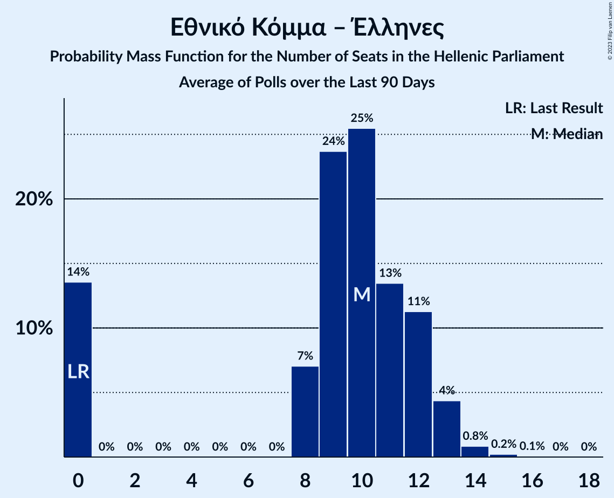

# Poll Average

<a href="#voting-intentions">Voting Intentions</a> | <a href="#seats">Seats</a> | <a href="#coalitions">Coalitions</a> | <a href="#technical-information">Technical Information</a>

## Summary

The table below lists the polls on which the average is based. They are the most recent polls (less than 90 days old) registered and analyzed so far.

| Period     | Polling firm/Commissioner(s) | ΣΥΡΙΖΑ | ΝΔ | ΧΑ | ΚΑ | ΚΚΕ | Ποτάμι | ΑΝΕΛ | ΕΚ | ΛΑΕ | ΠΕ | ΕΛ | ΜέΡΑ25 | ΕΚΕ | ΕΔ |
|:----------:|:----------------------------:|:--:|:--:|:--:|:--:|:--:|:--:|:--:|:--:|:--:|:--:|:--:|:--:|:--:|:--:|
| 7 July 2019 | General Election | 31.5%   86 | 39.8%   158 | 2.9%   0 | 8.1%   22 | 5.3%   15 | 0.0%   0 | 0.0%   0 | 1.2%   0 | 0.0%   0 | 1.5%   0 | 3.7%   10 | 3.4%   9 | 0.0%   0 | 0.0%   0 |
| N/A | Poll Average | 25–32%   66–87 | 31–39%   131–153 | N/A   N/A | 8–14%   23–37 | 5–9%   14–24 | N/A   N/A | N/A   N/A | N/A   N/A | N/A   N/A | 1–2%   0 | 3–6%   0–17 | 3–6%   0–17 | 3–6%   0–15 | 1–3%   0 |
| [27–30 April 2023](2023-04-30-Prorata.html) | Prorata   Attica TV | 28–33%   74–137 | 33–38%   88–152 | N/A   N/A | 9–13%   24–33 | 5–8%   14–22 | N/A   N/A | N/A   N/A | N/A   N/A | N/A   N/A | N/A   N/A | 2–5%   0–12 | 3–5%   8–13 | 3–5%   0–14 | N/A   N/A |
| [27–30 April 2023](2023-04-30-Interview.html) | Interview   Politic.gr | 27–31%   70–82 | 33–38%   140–152 | N/A   N/A | 9–12%   25–33 | 6–8%   16–22 | N/A   N/A | N/A   N/A | N/A   N/A | N/A   N/A | N/A   N/A | 3–5%   9–14 | 4–5%   9–14 | 3–4%   0–11 | 2–3%   0 |
| [24–26 April 2023](2023-04-26-MRB.html) | MRB   Open TV | 26–31%   72–89 | 31–37%   136–154 | N/A   N/A | 8–11%   22–32 | 5–8%   13–22 | N/A   N/A | N/A   N/A | N/A   N/A | N/A   N/A | 1–2%   0 | 2–5%   0–13 | 3–5%   0–14 | 3–6%   10–17 | 1–2%   0 |
| [19–23 April 2023](2023-04-23-PulseRC.html) | Pulse RC   ΣΚΑΪ | 27–32%   69–84 | 33–39%   138–154 | N/A   N/A | 9–12%   23–33 | 5–8%   13–21 | N/A   N/A | N/A   N/A | N/A   N/A | N/A   N/A | N/A   N/A | 3–5%   8–14 | 4–7%   11–18 | 3–5%   0–13 | N/A   N/A |
| [18–22 April 2023](2023-04-22-Alco.html) | Alco   Alpha TV | 26–32%   69–85 | 33–39%   137–154 | N/A   N/A | 8–12%   22–32 | 5–9%   15–23 | N/A   N/A | N/A   N/A | N/A   N/A | N/A   N/A | N/A   N/A | 3–6%   9–16 | 3–6%   8–15 | 3–5%   0–13 | 1–2%   0 |
| [18–21 April 2023](2023-04-21-OpinionPoll.html) | Opinion Poll   The TOC | 27–32%   70–86 | 33–39%   138–155 | N/A   N/A | 9–13%   24–35 | 5–8%   12–20 | N/A   N/A | N/A   N/A | N/A   N/A | N/A   N/A | 1–2%   0 | 4–6%   10–17 | 3–5%   0–14 | 3–5%   0–13 | 1–2%   0 |
| [19–20 April 2023](2023-04-20-MetronAnalysis.html) | Metron Analysis   Το Βήμα | 24–30%   65–80 | 31–37%   133–149 | N/A   N/A | 9–12%   23–33 | 6–9%   16–24 | N/A   N/A | N/A   N/A | N/A   N/A | N/A   N/A | N/A   N/A | 4–6%   10–17 | 4–7%   11–18 | 3–6%   8–15 | N/A   N/A |
| [3–5 April 2023](2023-04-05-GPO.html) | GPO   Παραπολιτικά | 27–33%   73–90 | 33–39%   136–155 | N/A   N/A | 9–13%   24–34 | 6–9%   15–24 | N/A   N/A | N/A   N/A | N/A   N/A | N/A   N/A | N/A   N/A | 3–6%   8–15 | 3–5%   0–13 | 2–4%   0–12 | 1–2%   0 |
| [27–31 March 2023](2023-03-31-Rass.html) | Rass   Action 24 | 24–30%   63–78 | 30–36%   128–143 | N/A   N/A | 11–16%   29–41 | 6–10%   17–25 | N/A   N/A | N/A   N/A | N/A   N/A | N/A   N/A | N/A   N/A | 4–7%   11–19 | 4–7%   10–17 | 3–6%   8–14 | N/A   N/A |
| 7 July 2019 | General Election | 31.5%   86 | 39.8%   158 | 2.9%   0 | 8.1%   22 | 5.3%   15 | 0.0%   0 | 0.0%   0 | 1.2%   0 | 0.0%   0 | 1.5%   0 | 3.7%   10 | 3.4%   9 | 0.0%   0 | 0.0%   0 |

Only polls for which at least the sample size has been published are included in the table above.

**Legend:**
+ **Top half of each row:** Voting intentions (95% confidence interval)
+ **Bottom half of each row:** Seat projections for the Hellenic Parliament (95% confidence interval)
+ **ΣΥΡΙΖΑ:** Συνασπισμός Ριζοσπαστικής Αριστεράς
+ **ΝΔ:** Νέα Δημοκρατία
+ **ΧΑ:** Χρυσή Αυγή
+ **ΚΑ:** Κίνημα Αλλαγής
+ **ΚΚΕ:** Κομμουνιστικό Κόμμα Ελλάδας
+ **Ποτάμι:** Το Ποτάμι
+ **ΑΝΕΛ:** Ανεξάρτητοι Έλληνες
+ **ΕΚ:** Ένωση Κεντρώων
+ **ΛΑΕ:** Λαϊκή Ενότητα
+ **ΠΕ:** Πλεύση Ελευθερίας
+ **ΕΛ:** Ελληνική Λύση
+ **ΜέΡΑ25:** Μέτωπο Ευρωπαϊκής Ρεαλιστικής Ανυπακοής
+ **ΕΚΕ:** Εθνικό Κόμμα – Έλληνες
+ **ΕΔ:** Εθνική Δημιουργία
+ **N/A (single party):** Party not included the published results
+ **N/A (entire row):** Calculation for this opinion poll not started yet

## Voting Intentions

### Confidence Intervals

| Party | Last Result | Median | 80% Confidence Interval | 90% Confidence Interval | 95% Confidence Interval | 99% Confidence Interval |
|:-----:|:-----------:|:------:|:-----------------------:|:-----------------------:|:-----------------------:|:-----------------------:|
| <a href="#νέα-δημοκρατία">Νέα Δημοκρατία</a> | 39.8% | 35.2% | 32.6–37.4% |31.9–38.1% | 31.3–38.6% | 30.2–39.6% |
| <a href="#συνασπισμός-ριζοσπαστικής-αριστεράς">Συνασπισμός Ριζοσπαστικής Αριστεράς</a> | 31.5% | 28.9% | 26.5–31.2% |25.8–31.9% | 25.2–32.4% | 24.2–33.4% |
| <a href="#κίνημα-αλλαγής">Κίνημα Αλλαγής</a> | 8.1% | 10.7% | 9.3–12.7% |8.9–13.5% | 8.5–14.2% | 7.9–15.2% |
| <a href="#κομμουνιστικό-κόμμα-ελλάδας">Κομμουνιστικό Κόμμα Ελλάδας</a> | 5.3% | 6.9% | 5.7–8.1% |5.4–8.6% | 5.1–8.9% | 4.7–9.6% |
| <a href="#ελληνική-λύση">Ελληνική Λύση</a> | 3.7% | 4.3% | 3.3–5.6% |3.0–6.0% | 2.8–6.4% | 2.4–7.0% |
| <a href="#μέτωπο-ευρωπαϊκής-ρεαλιστικής-ανυπακοής">Μέτωπο Ευρωπαϊκής Ρεαλιστικής Ανυπακοής</a> | 3.4% | 4.4% | 3.3–5.7% |3.1–6.1% | 2.9–6.4% | 2.6–7.0% |
| <a href="#χρυσή-αυγή">Χρυσή Αυγή</a> | 2.9% | N/A | N/A |N/A | N/A | N/A |
| <a href="#πλεύση-ελευθερίας">Πλεύση Ελευθερίας</a> | 1.5% | 1.3% | 0.9–1.8% |0.8–1.9% | 0.7–2.1% | 0.6–2.4% |
| <a href="#ένωση-κεντρώων">Ένωση Κεντρώων</a> | 1.2% | N/A | N/A |N/A | N/A | N/A |
| <a href="#το-ποτάμι">Το Ποτάμι</a> | 0.0% | N/A | N/A |N/A | N/A | N/A |
| <a href="#ανεξάρτητοι-έλληνες">Ανεξάρτητοι Έλληνες</a> | 0.0% | N/A | N/A |N/A | N/A | N/A |
| <a href="#λαϊκή-ενότητα">Λαϊκή Ενότητα</a> | 0.0% | N/A | N/A |N/A | N/A | N/A |
| <a href="#εθνικό-κόμμα-–-έλληνες">Εθνικό Κόμμα – Έλληνες</a> | 0.0% | 3.8% | 2.9–4.9% |2.7–5.2% | 2.6–5.5% | 2.2–6.0% |
| <a href="#εθνική-δημιουργία">Εθνική Δημιουργία</a> | 0.0% | 1.4% | 0.9–2.2% |0.8–2.4% | 0.7–2.6% | 0.6–2.9% |

### Νέα Δημοκρατία

*For a full overview of the results for this party, see the [Νέα Δημοκρατία](party-νέαδημοκρατία.html) page.*

| Voting Intentions | Probability | Accumulated | Special Marks |
|:-----------------:|:-----------:|:-----------:|:-------------:|
| 27.5–28.5% | 0% | 100% |  |
| 28.5–29.5% | 0.1% | 100% |  |
| 29.5–30.5% | 0.7% | 99.8% |  |
| 30.5–31.5% | 2% | 99.2% |  |
| 31.5–32.5% | 6% | 97% |  |
| 32.5–33.5% | 11% | 91% |  |
| 33.5–34.5% | 17% | 80% |  |
| 34.5–35.5% | 21% | 63% | Median |
| 35.5–36.5% | 20% | 42% |  |
| 36.5–37.5% | 13% | 22% |  |
| 37.5–38.5% | 6% | 9% |  |
| 38.5–39.5% | 2% | 3% |  |
| 39.5–40.5% | 0.5% | 0.6% | Last Result |
| 40.5–41.5% | 0.1% | 0.1% |  |
| 41.5–42.5% | 0% | 0% |  |

### Συνασπισμός Ριζοσπαστικής Αριστεράς

*For a full overview of the results for this party, see the [Συνασπισμός Ριζοσπαστικής Αριστεράς](party-συνασπισμόςριζοσπαστικήςαριστεράς.html) page.*

| Voting Intentions | Probability | Accumulated | Special Marks |
|:-----------------:|:-----------:|:-----------:|:-------------:|
| 21.5–22.5% | 0% | 100% |  |
| 22.5–23.5% | 0.1% | 100% |  |
| 23.5–24.5% | 0.8% | 99.9% |  |
| 24.5–25.5% | 3% | 99.1% |  |
| 25.5–26.5% | 7% | 96% |  |
| 26.5–27.5% | 13% | 89% |  |
| 27.5–28.5% | 19% | 76% |  |
| 28.5–29.5% | 22% | 57% | Median |
| 29.5–30.5% | 18% | 36% |  |
| 30.5–31.5% | 11% | 18% |  |
| 31.5–32.5% | 5% | 7% | Last Result |
| 32.5–33.5% | 2% | 2% |  |
| 33.5–34.5% | 0.4% | 0.4% |  |
| 34.5–35.5% | 0.1% | 0.1% |  |
| 35.5–36.5% | 0% | 0% |  |

### Κίνημα Αλλαγής

*For a full overview of the results for this party, see the [Κίνημα Αλλαγής](party-κίνημααλλαγής.html) page.*

| Voting Intentions | Probability | Accumulated | Special Marks |
|:-----------------:|:-----------:|:-----------:|:-------------:|
| 5.5–6.5% | 0% | 100% |  |
| 6.5–7.5% | 0.1% | 100% |  |
| 7.5–8.5% | 2% | 99.9% | Last Result |
| 8.5–9.5% | 13% | 97% |  |
| 9.5–10.5% | 29% | 84% |  |
| 10.5–11.5% | 30% | 55% | Median |
| 11.5–12.5% | 14% | 25% |  |
| 12.5–13.5% | 6% | 11% |  |
| 13.5–14.5% | 3% | 5% |  |
| 14.5–15.5% | 1.2% | 2% |  |
| 15.5–16.5% | 0.2% | 0.3% |  |
| 16.5–17.5% | 0% | 0% |  |

### Κομμουνιστικό Κόμμα Ελλάδας

*For a full overview of the results for this party, see the [Κομμουνιστικό Κόμμα Ελλάδας](party-κομμουνιστικόκόμμαελλάδας.html) page.*

| Voting Intentions | Probability | Accumulated | Special Marks |
|:-----------------:|:-----------:|:-----------:|:-------------:|
| 2.5–3.5% | 0% | 100% |  |
| 3.5–4.5% | 0.3% | 100% |  |
| 4.5–5.5% | 7% | 99.7% | Last Result |
| 5.5–6.5% | 30% | 93% |  |
| 6.5–7.5% | 39% | 63% | Median |
| 7.5–8.5% | 19% | 24% |  |
| 8.5–9.5% | 4% | 5% |  |
| 9.5–10.5% | 0.5% | 0.6% |  |
| 10.5–11.5% | 0% | 0% |  |

### Ελληνική Λύση

*For a full overview of the results for this party, see the [Ελληνική Λύση](party-ελληνικήλύση.html) page.*

| Voting Intentions | Probability | Accumulated | Special Marks |
|:-----------------:|:-----------:|:-----------:|:-------------:|
| 0.5–1.5% | 0% | 100% |  |
| 1.5–2.5% | 0.8% | 100% |  |
| 2.5–3.5% | 17% | 99.2% |  |
| 3.5–4.5% | 42% | 82% | Last Result, Median |
| 4.5–5.5% | 29% | 40% |  |
| 5.5–6.5% | 10% | 11% |  |
| 6.5–7.5% | 2% | 2% |  |
| 7.5–8.5% | 0.1% | 0.1% |  |
| 8.5–9.5% | 0% | 0% |  |

### Μέτωπο Ευρωπαϊκής Ρεαλιστικής Ανυπακοής

*For a full overview of the results for this party, see the [Μέτωπο Ευρωπαϊκής Ρεαλιστικής Ανυπακοής](party-μέτωποευρωπαϊκήςρεαλιστικήςανυπακοής.html) page.*

| Voting Intentions | Probability | Accumulated | Special Marks |
|:-----------------:|:-----------:|:-----------:|:-------------:|
| 0.5–1.5% | 0% | 100% |  |
| 1.5–2.5% | 0.5% | 100% |  |
| 2.5–3.5% | 17% | 99.5% | Last Result |
| 3.5–4.5% | 41% | 83% | Median |
| 4.5–5.5% | 29% | 42% |  |
| 5.5–6.5% | 11% | 13% |  |
| 6.5–7.5% | 2% | 2% |  |
| 7.5–8.5% | 0.1% | 0.1% |  |
| 8.5–9.5% | 0% | 0% |  |

### Πλεύση Ελευθερίας

*For a full overview of the results for this party, see the [Πλεύση Ελευθερίας](party-πλεύσηελευθερίας.html) page.*

| Voting Intentions | Probability | Accumulated | Special Marks |
|:-----------------:|:-----------:|:-----------:|:-------------:|
| 0.0–0.5% | 0.4% | 100% |  |
| 0.5–1.5% | 78% | 99.6% | Last Result, Median |
| 1.5–2.5% | 22% | 22% |  |
| 2.5–3.5% | 0.2% | 0.2% |  |
| 3.5–4.5% | 0% | 0% |  |

### Εθνικό Κόμμα – Έλληνες

*For a full overview of the results for this party, see the [Εθνικό Κόμμα – Έλληνες](party-εθνικόκόμμα–έλληνες.html) page.*

| Voting Intentions | Probability | Accumulated | Special Marks |
|:-----------------:|:-----------:|:-----------:|:-------------:|
| 0.0–0.5% | 0% | 100% | Last Result |
| 0.5–1.5% | 0% | 100% |  |
| 1.5–2.5% | 2% | 100% |  |
| 2.5–3.5% | 34% | 98% |  |
| 3.5–4.5% | 46% | 63% | Median |
| 4.5–5.5% | 16% | 18% |  |
| 5.5–6.5% | 2% | 2% |  |
| 6.5–7.5% | 0.1% | 0.1% |  |
| 7.5–8.5% | 0% | 0% |  |

### Εθνική Δημιουργία

*For a full overview of the results for this party, see the [Εθνική Δημιουργία](party-εθνικήδημιουργία.html) page.*

| Voting Intentions | Probability | Accumulated | Special Marks |
|:-----------------:|:-----------:|:-----------:|:-------------:|
| 0.0–0.5% | 0.3% | 100% | Last Result |
| 0.5–1.5% | 59% | 99.7% | Median |
| 1.5–2.5% | 38% | 41% |  |
| 2.5–3.5% | 3% | 3% |  |
| 3.5–4.5% | 0% | 0% |  |

## Seats

### Confidence Intervals

| Party | Last Result | Median | 80% Confidence Interval | 90% Confidence Interval | 95% Confidence Interval | 99% Confidence Interval |
|:-----:|:-----------:|:------:|:-----------------------:|:-----------------------:|:-----------------------:|:-----------------------:|
| <a href="#νέα-δημοκρατία">Νέα Δημοκρατία</a> | 158 | 144 | 137–150 |134–152 | 131–153 | 86–157 |
| <a href="#συνασπισμός-ριζοσπαστικής-αριστεράς">Συνασπισμός Ριζοσπαστικής Αριστεράς</a> | 86 | 77 | 70–84 |68–85 | 66–87 | 64–138 |
| <a href="#κίνημα-αλλαγής">Κίνημα Αλλαγής</a> | 22 | 28 | 25–33 |24–35 | 23–37 | 21–40 |
| <a href="#κομμουνιστικό-κόμμα-ελλάδας">Κομμουνιστικό Κόμμα Ελλάδας</a> | 15 | 18 | 15–22 |14–23 | 14–24 | 12–25 |
| <a href="#ελληνική-λύση">Ελληνική Λύση</a> | 10 | 11 | 9–15 |0–16 | 0–17 | 0–18 |
| <a href="#μέτωπο-ευρωπαϊκής-ρεαλιστικής-ανυπακοής">Μέτωπο Ευρωπαϊκής Ρεαλιστικής Ανυπακοής</a> | 9 | 12 | 9–15 |8–16 | 0–17 | 0–18 |
| <a href="#χρυσή-αυγή">Χρυσή Αυγή</a> | 0 | N/A | N/A |N/A | N/A | N/A |
| <a href="#πλεύση-ελευθερίας">Πλεύση Ελευθερίας</a> | 0 | 0 | 0 |0 | 0 | 0 |
| <a href="#ένωση-κεντρώων">Ένωση Κεντρώων</a> | 0 | N/A | N/A |N/A | N/A | N/A |
| <a href="#το-ποτάμι">Το Ποτάμι</a> | 0 | N/A | N/A |N/A | N/A | N/A |
| <a href="#ανεξάρτητοι-έλληνες">Ανεξάρτητοι Έλληνες</a> | 0 | N/A | N/A |N/A | N/A | N/A |
| <a href="#λαϊκή-ενότητα">Λαϊκή Ενότητα</a> | 0 | N/A | N/A |N/A | N/A | N/A |
| <a href="#εθνικό-κόμμα-–-έλληνες">Εθνικό Κόμμα – Έλληνες</a> | 0 | 10 | 0–13 |0–14 | 0–15 | 0–16 |
| <a href="#εθνική-δημιουργία">Εθνική Δημιουργία</a> | 0 | 0 | 0 |0 | 0 | 0 |

### Νέα Δημοκρατία

*For a full overview of the results for this party, see the [Νέα Δημοκρατία](party-νέαδημοκρατία.html) page.*

| Number of Seats | Probability | Accumulated | Special Marks |
|:---------------:|:-----------:|:-----------:|:-------------:|
| 77 | 0% | 100% |  |
| 78 | 0% | 99.9% |  |
| 79 | 0% | 99.9% |  |
| 80 | 0% | 99.9% |  |
| 81 | 0% | 99.9% |  |
| 82 | 0% | 99.9% |  |
| 83 | 0.1% | 99.8% |  |
| 84 | 0.1% | 99.8% |  |
| 85 | 0.1% | 99.7% |  |
| 86 | 0.1% | 99.6% |  |
| 87 | 0.1% | 99.5% |  |
| 88 | 0.1% | 99.4% |  |
| 89 | 0.1% | 99.3% |  |
| 90 | 0% | 99.2% |  |
| 91 | 0% | 99.2% |  |
| 92 | 0% | 99.1% |  |
| 93 | 0% | 99.1% |  |
| 94 | 0% | 99.1% |  |
| 95 | 0% | 99.1% |  |
| 96 | 0% | 99.1% |  |
| 97 | 0% | 99.1% |  |
| 98 | 0% | 99.1% |  |
| 99 | 0% | 99.1% |  |
| 100 | 0% | 99.1% |  |
| 101 | 0% | 99.1% |  |
| 102 | 0% | 99.1% |  |
| 103 | 0% | 99.1% |  |
| 104 | 0% | 99.1% |  |
| 105 | 0% | 99.1% |  |
| 106 | 0% | 99.1% |  |
| 107 | 0% | 99.1% |  |
| 108 | 0% | 99.1% |  |
| 109 | 0% | 99.1% |  |
| 110 | 0% | 99.1% |  |
| 111 | 0% | 99.1% |  |
| 112 | 0% | 99.1% |  |
| 113 | 0% | 99.1% |  |
| 114 | 0% | 99.1% |  |
| 115 | 0% | 99.1% |  |
| 116 | 0% | 99.1% |  |
| 117 | 0% | 99.1% |  |
| 118 | 0% | 99.1% |  |
| 119 | 0% | 99.1% |  |
| 120 | 0% | 99.1% |  |
| 121 | 0% | 99.1% |  |
| 122 | 0% | 99.1% |  |
| 123 | 0% | 99.1% |  |
| 124 | 0% | 99.1% |  |
| 125 | 0% | 99.1% |  |
| 126 | 0% | 99.1% |  |
| 127 | 0.1% | 99.1% |  |
| 128 | 0.1% | 99.0% |  |
| 129 | 0.3% | 98.9% |  |
| 130 | 0.5% | 98.6% |  |
| 131 | 0.8% | 98% |  |
| 132 | 1.0% | 97% |  |
| 133 | 1.2% | 96% |  |
| 134 | 1.3% | 95% |  |
| 135 | 2% | 94% |  |
| 136 | 2% | 92% |  |
| 137 | 2% | 90% |  |
| 138 | 4% | 88% |  |
| 139 | 4% | 84% |  |
| 140 | 6% | 80% |  |
| 141 | 6% | 73% |  |
| 142 | 7% | 68% |  |
| 143 | 7% | 61% |  |
| 144 | 8% | 54% | Median |
| 145 | 9% | 46% |  |
| 146 | 8% | 37% |  |
| 147 | 7% | 29% |  |
| 148 | 5% | 22% |  |
| 149 | 4% | 17% |  |
| 150 | 4% | 13% |  |
| 151 | 3% | 9% | Majority |
| 152 | 2% | 6% |  |
| 153 | 1.2% | 4% |  |
| 154 | 0.8% | 2% |  |
| 155 | 0.6% | 2% |  |
| 156 | 0.4% | 1.0% |  |
| 157 | 0.3% | 0.6% |  |
| 158 | 0.1% | 0.3% | Last Result |
| 159 | 0.1% | 0.2% |  |
| 160 | 0% | 0.1% |  |
| 161 | 0% | 0% |  |

### Συνασπισμός Ριζοσπαστικής Αριστεράς

*For a full overview of the results for this party, see the [Συνασπισμός Ριζοσπαστικής Αριστεράς](party-συνασπισμόςριζοσπαστικήςαριστεράς.html) page.*

| Number of Seats | Probability | Accumulated | Special Marks |
|:---------------:|:-----------:|:-----------:|:-------------:|
| 61 | 0.1% | 100% |  |
| 62 | 0.1% | 99.9% |  |
| 63 | 0.3% | 99.8% |  |
| 64 | 0.3% | 99.5% |  |
| 65 | 0.7% | 99.2% |  |
| 66 | 1.0% | 98% |  |
| 67 | 1.4% | 97% |  |
| 68 | 2% | 96% |  |
| 69 | 2% | 94% |  |
| 70 | 3% | 92% |  |
| 71 | 4% | 89% |  |
| 72 | 5% | 85% |  |
| 73 | 6% | 80% |  |
| 74 | 7% | 74% |  |
| 75 | 7% | 67% |  |
| 76 | 7% | 60% |  |
| 77 | 8% | 53% | Median |
| 78 | 6% | 45% |  |
| 79 | 7% | 39% |  |
| 80 | 7% | 32% |  |
| 81 | 6% | 25% |  |
| 82 | 4% | 19% |  |
| 83 | 5% | 15% |  |
| 84 | 3% | 10% |  |
| 85 | 2% | 7% |  |
| 86 | 2% | 5% | Last Result |
| 87 | 1.2% | 3% |  |
| 88 | 0.6% | 2% |  |
| 89 | 0.4% | 2% |  |
| 90 | 0.2% | 1.3% |  |
| 91 | 0.1% | 1.1% |  |
| 92 | 0% | 1.0% |  |
| 93 | 0% | 0.9% |  |
| 94 | 0% | 0.9% |  |
| 95 | 0% | 0.9% |  |
| 96 | 0% | 0.9% |  |
| 97 | 0% | 0.9% |  |
| 98 | 0% | 0.9% |  |
| 99 | 0% | 0.9% |  |
| 100 | 0% | 0.9% |  |
| 101 | 0% | 0.9% |  |
| 102 | 0% | 0.9% |  |
| 103 | 0% | 0.9% |  |
| 104 | 0% | 0.9% |  |
| 105 | 0% | 0.9% |  |
| 106 | 0% | 0.9% |  |
| 107 | 0% | 0.9% |  |
| 108 | 0% | 0.9% |  |
| 109 | 0% | 0.9% |  |
| 110 | 0% | 0.9% |  |
| 111 | 0% | 0.9% |  |
| 112 | 0% | 0.9% |  |
| 113 | 0% | 0.9% |  |
| 114 | 0% | 0.9% |  |
| 115 | 0% | 0.9% |  |
| 116 | 0% | 0.9% |  |
| 117 | 0% | 0.9% |  |
| 118 | 0% | 0.9% |  |
| 119 | 0% | 0.9% |  |
| 120 | 0% | 0.9% |  |
| 121 | 0% | 0.9% |  |
| 122 | 0% | 0.9% |  |
| 123 | 0% | 0.9% |  |
| 124 | 0% | 0.9% |  |
| 125 | 0% | 0.9% |  |
| 126 | 0% | 0.9% |  |
| 127 | 0% | 0.9% |  |
| 128 | 0% | 0.9% |  |
| 129 | 0% | 0.9% |  |
| 130 | 0% | 0.8% |  |
| 131 | 0% | 0.8% |  |
| 132 | 0% | 0.8% |  |
| 133 | 0% | 0.8% |  |
| 134 | 0% | 0.8% |  |
| 135 | 0.1% | 0.8% |  |
| 136 | 0.1% | 0.7% |  |
| 137 | 0.1% | 0.6% |  |
| 138 | 0.1% | 0.5% |  |
| 139 | 0.1% | 0.4% |  |
| 140 | 0.1% | 0.3% |  |
| 141 | 0.1% | 0.2% |  |
| 142 | 0% | 0.1% |  |
| 143 | 0.1% | 0.1% |  |
| 144 | 0% | 0% |  |

### Κίνημα Αλλαγής

*For a full overview of the results for this party, see the [Κίνημα Αλλαγής](party-κίνημααλλαγής.html) page.*

| Number of Seats | Probability | Accumulated | Special Marks |
|:---------------:|:-----------:|:-----------:|:-------------:|
| 20 | 0.1% | 100% |  |
| 21 | 0.4% | 99.9% |  |
| 22 | 1.0% | 99.5% | Last Result |
| 23 | 2% | 98% |  |
| 24 | 5% | 96% |  |
| 25 | 6% | 92% |  |
| 26 | 10% | 85% |  |
| 27 | 11% | 75% |  |
| 28 | 15% | 64% | Median |
| 29 | 11% | 49% |  |
| 30 | 11% | 38% |  |
| 31 | 8% | 27% |  |
| 32 | 6% | 19% |  |
| 33 | 4% | 13% |  |
| 34 | 3% | 10% |  |
| 35 | 2% | 7% |  |
| 36 | 2% | 5% |  |
| 37 | 1.0% | 3% |  |
| 38 | 1.0% | 2% |  |
| 39 | 0.6% | 1.2% |  |
| 40 | 0.3% | 0.6% |  |
| 41 | 0.2% | 0.3% |  |
| 42 | 0.1% | 0.1% |  |
| 43 | 0% | 0% |  |

### Κομμουνιστικό Κόμμα Ελλάδας

*For a full overview of the results for this party, see the [Κομμουνιστικό Κόμμα Ελλάδας](party-κομμουνιστικόκόμμαελλάδας.html) page.*

| Number of Seats | Probability | Accumulated | Special Marks |
|:---------------:|:-----------:|:-----------:|:-------------:|
| 11 | 0.1% | 100% |  |
| 12 | 0.7% | 99.9% |  |
| 13 | 1.2% | 99.2% |  |
| 14 | 3% | 98% |  |
| 15 | 5% | 95% | Last Result |
| 16 | 12% | 90% |  |
| 17 | 14% | 77% |  |
| 18 | 16% | 63% | Median |
| 19 | 14% | 46% |  |
| 20 | 12% | 32% |  |
| 21 | 9% | 20% |  |
| 22 | 5% | 11% |  |
| 23 | 3% | 6% |  |
| 24 | 1.5% | 3% |  |
| 25 | 0.7% | 1.1% |  |
| 26 | 0.3% | 0.4% |  |
| 27 | 0.1% | 0.1% |  |
| 28 | 0% | 0% |  |

### Ελληνική Λύση

*For a full overview of the results for this party, see the [Ελληνική Λύση](party-ελληνικήλύση.html) page.*

| Number of Seats | Probability | Accumulated | Special Marks |
|:---------------:|:-----------:|:-----------:|:-------------:|
| 0 | 5% | 100% |  |
| 1 | 0% | 95% |  |
| 2 | 0% | 95% |  |
| 3 | 0% | 95% |  |
| 4 | 0% | 95% |  |
| 5 | 0% | 95% |  |
| 6 | 0% | 95% |  |
| 7 | 0% | 95% |  |
| 8 | 3% | 95% |  |
| 9 | 10% | 91% |  |
| 10 | 15% | 82% | Last Result |
| 11 | 17% | 67% | Median |
| 12 | 16% | 49% |  |
| 13 | 13% | 33% |  |
| 14 | 9% | 20% |  |
| 15 | 5% | 11% |  |
| 16 | 3% | 6% |  |
| 17 | 2% | 3% |  |
| 18 | 1.0% | 1.4% |  |
| 19 | 0.3% | 0.4% |  |
| 20 | 0.1% | 0.1% |  |
| 21 | 0% | 0% |  |

### Μέτωπο Ευρωπαϊκής Ρεαλιστικής Ανυπακοής

*For a full overview of the results for this party, see the [Μέτωπο Ευρωπαϊκής Ρεαλιστικής Ανυπακοής](party-μέτωποευρωπαϊκήςρεαλιστικήςανυπακοής.html) page.*

| Number of Seats | Probability | Accumulated | Special Marks |
|:---------------:|:-----------:|:-----------:|:-------------:|
| 0 | 4% | 100% |  |
| 1 | 0% | 96% |  |
| 2 | 0% | 96% |  |
| 3 | 0% | 96% |  |
| 4 | 0% | 96% |  |
| 5 | 0% | 96% |  |
| 6 | 0% | 96% |  |
| 7 | 0% | 96% |  |
| 8 | 2% | 96% |  |
| 9 | 11% | 94% | Last Result |
| 10 | 14% | 83% |  |
| 11 | 18% | 69% |  |
| 12 | 15% | 51% | Median |
| 13 | 12% | 36% |  |
| 14 | 9% | 24% |  |
| 15 | 7% | 15% |  |
| 16 | 5% | 8% |  |
| 17 | 2% | 4% |  |
| 18 | 0.9% | 1.3% |  |
| 19 | 0.3% | 0.4% |  |
| 20 | 0.1% | 0.1% |  |
| 21 | 0% | 0% |  |

### Χρυσή Αυγή

*For a full overview of the results for this party, see the [Χρυσή Αυγή](party-χρυσήαυγή.html) page.*

### Πλεύση Ελευθερίας

*For a full overview of the results for this party, see the [Πλεύση Ελευθερίας](party-πλεύσηελευθερίας.html) page.*

| Number of Seats | Probability | Accumulated | Special Marks |
|:---------------:|:-----------:|:-----------:|:-------------:|
| 0 | 100% | 100% | Last Result, Median |

### Ένωση Κεντρώων

*For a full overview of the results for this party, see the [Ένωση Κεντρώων](party-ένωσηκεντρώων.html) page.*

### Το Ποτάμι

*For a full overview of the results for this party, see the [Το Ποτάμι](party-τοποτάμι.html) page.*

### Ανεξάρτητοι Έλληνες

*For a full overview of the results for this party, see the [Ανεξάρτητοι Έλληνες](party-ανεξάρτητοιέλληνες.html) page.*

### Λαϊκή Ενότητα

*For a full overview of the results for this party, see the [Λαϊκή Ενότητα](party-λαϊκήενότητα.html) page.*

### Εθνικό Κόμμα – Έλληνες

*For a full overview of the results for this party, see the [Εθνικό Κόμμα – Έλληνες](party-εθνικόκόμμα–έλληνες.html) page.*

| Number of Seats | Probability | Accumulated | Special Marks |
|:---------------:|:-----------:|:-----------:|:-------------:|
| 0 | 11% | 100% | Last Result |
| 1 | 0% | 89% |  |
| 2 | 0% | 89% |  |
| 3 | 0% | 89% |  |
| 4 | 0% | 89% |  |
| 5 | 0% | 89% |  |
| 6 | 0% | 89% |  |
| 7 | 0% | 89% |  |
| 8 | 8% | 89% |  |
| 9 | 18% | 80% |  |
| 10 | 21% | 62% | Median |
| 11 | 16% | 41% |  |
| 12 | 12% | 25% |  |
| 13 | 6% | 13% |  |
| 14 | 4% | 7% |  |
| 15 | 2% | 3% |  |
| 16 | 0.8% | 1.2% |  |
| 17 | 0.3% | 0.4% |  |
| 18 | 0.1% | 0.1% |  |
| 19 | 0% | 0% |  |

### Εθνική Δημιουργία

*For a full overview of the results for this party, see the [Εθνική Δημιουργία](party-εθνικήδημιουργία.html) page.*

| Number of Seats | Probability | Accumulated | Special Marks |
|:---------------:|:-----------:|:-----------:|:-------------:|
| 0 | 99.7% | 100% | Last Result, Median |
| 1 | 0% | 0.3% |  |
| 2 | 0% | 0.3% |  |
| 3 | 0% | 0.3% |  |
| 4 | 0% | 0.3% |  |
| 5 | 0% | 0.3% |  |
| 6 | 0% | 0.3% |  |
| 7 | 0% | 0.3% |  |
| 8 | 0.2% | 0.3% |  |
| 9 | 0% | 0% |  |

## Coalitions

### Confidence Intervals

| Coalition | Last Result | Median | Majority? | 80% Confidence Interval | 90% Confidence Interval | 95% Confidence Interval | 99% Confidence Interval |
|:---------:|:-----------:|:------:|:---------:|:-----------------------:|:-----------------------:|:-----------------------:|:-----------------------:|
| Νέα Δημοκρατία – Κίνημα Αλλαγής | 180 | 172 | 99.1% | 166–179 | 164–181 | 163–182 | 115–186 |
| Νέα Δημοκρατία – Κίνημα Αλλαγής – Το Ποτάμι | 180 | 172 | 99.1% | 166–179 | 164–181 | 163–182 | 115–186 |
| Νέα Δημοκρατία | 158 | 144 | 9% | 137–150 | 134–152 | 131–153 | 86–157 |
| Νέα Δημοκρατία – Το Ποτάμι | 158 | 144 | 9% | 137–150 | 134–152 | 131–153 | 86–157 |
| Συνασπισμός Ριζοσπαστικής Αριστεράς – Μέτωπο Ευρωπαϊκής Ρεαλιστικής Ανυπακοής | 95 | 88 | 0.2% | 83–95 | 80–96 | 79–98 | 76–148 |
| Συνασπισμός Ριζοσπαστικής Αριστεράς – Ανεξάρτητοι Έλληνες – Λαϊκή Ενότητα | 86 | 77 | 0% | 70–84 | 68–85 | 66–87 | 64–138 |
| Συνασπισμός Ριζοσπαστικής Αριστεράς – Ανεξάρτητοι Έλληνες | 86 | 77 | 0% | 70–84 | 68–85 | 66–87 | 64–138 |
| Συνασπισμός Ριζοσπαστικής Αριστεράς – Λαϊκή Ενότητα | 86 | 77 | 0% | 70–84 | 68–85 | 66–87 | 64–138 |
| Συνασπισμός Ριζοσπαστικής Αριστεράς | 86 | 77 | 0% | 70–84 | 68–85 | 66–87 | 64–138 |

### Νέα Δημοκρατία – Κίνημα Αλλαγής

| Number of Seats | Probability | Accumulated | Special Marks |
|:---------------:|:-----------:|:-----------:|:-------------:|
| 108 | 0% | 100% |  |
| 109 | 0% | 99.9% |  |
| 110 | 0% | 99.9% |  |
| 111 | 0.1% | 99.9% |  |
| 112 | 0.1% | 99.8% |  |
| 113 | 0.1% | 99.7% |  |
| 114 | 0.1% | 99.6% |  |
| 115 | 0.1% | 99.5% |  |
| 116 | 0% | 99.4% |  |
| 117 | 0.1% | 99.4% |  |
| 118 | 0.1% | 99.3% |  |
| 119 | 0% | 99.2% |  |
| 120 | 0% | 99.2% |  |
| 121 | 0% | 99.2% |  |
| 122 | 0% | 99.1% |  |
| 123 | 0% | 99.1% |  |
| 124 | 0% | 99.1% |  |
| 125 | 0% | 99.1% |  |
| 126 | 0% | 99.1% |  |
| 127 | 0% | 99.1% |  |
| 128 | 0% | 99.1% |  |
| 129 | 0% | 99.1% |  |
| 130 | 0% | 99.1% |  |
| 131 | 0% | 99.1% |  |
| 132 | 0% | 99.1% |  |
| 133 | 0% | 99.1% |  |
| 134 | 0% | 99.1% |  |
| 135 | 0% | 99.1% |  |
| 136 | 0% | 99.1% |  |
| 137 | 0% | 99.1% |  |
| 138 | 0% | 99.1% |  |
| 139 | 0% | 99.1% |  |
| 140 | 0% | 99.1% |  |
| 141 | 0% | 99.1% |  |
| 142 | 0% | 99.1% |  |
| 143 | 0% | 99.1% |  |
| 144 | 0% | 99.1% |  |
| 145 | 0% | 99.1% |  |
| 146 | 0% | 99.1% |  |
| 147 | 0% | 99.1% |  |
| 148 | 0% | 99.1% |  |
| 149 | 0% | 99.1% |  |
| 150 | 0% | 99.1% |  |
| 151 | 0% | 99.1% | Majority |
| 152 | 0% | 99.1% |  |
| 153 | 0% | 99.1% |  |
| 154 | 0% | 99.1% |  |
| 155 | 0% | 99.1% |  |
| 156 | 0% | 99.1% |  |
| 157 | 0% | 99.1% |  |
| 158 | 0.1% | 99.1% |  |
| 159 | 0.1% | 99.0% |  |
| 160 | 0.2% | 98.9% |  |
| 161 | 0.4% | 98.7% |  |
| 162 | 0.6% | 98% |  |
| 163 | 1.1% | 98% |  |
| 164 | 2% | 97% |  |
| 165 | 2% | 95% |  |
| 166 | 3% | 93% |  |
| 167 | 4% | 89% |  |
| 168 | 6% | 85% |  |
| 169 | 7% | 79% |  |
| 170 | 7% | 72% |  |
| 171 | 7% | 65% |  |
| 172 | 8% | 58% | Median |
| 173 | 9% | 50% |  |
| 174 | 9% | 41% |  |
| 175 | 7% | 32% |  |
| 176 | 6% | 25% |  |
| 177 | 4% | 19% |  |
| 178 | 4% | 15% |  |
| 179 | 3% | 11% |  |
| 180 | 3% | 8% | Last Result |
| 181 | 2% | 6% |  |
| 182 | 2% | 4% |  |
| 183 | 0.7% | 2% |  |
| 184 | 0.5% | 2% |  |
| 185 | 0.5% | 1.2% |  |
| 186 | 0.2% | 0.7% |  |
| 187 | 0.2% | 0.5% |  |
| 188 | 0.1% | 0.3% |  |
| 189 | 0.1% | 0.2% |  |
| 190 | 0% | 0.1% |  |
| 191 | 0% | 0.1% |  |
| 192 | 0% | 0% |  |

### Νέα Δημοκρατία – Κίνημα Αλλαγής – Το Ποτάμι

| Number of Seats | Probability | Accumulated | Special Marks |
|:---------------:|:-----------:|:-----------:|:-------------:|
| 108 | 0% | 100% |  |
| 109 | 0% | 99.9% |  |
| 110 | 0% | 99.9% |  |
| 111 | 0.1% | 99.9% |  |
| 112 | 0.1% | 99.8% |  |
| 113 | 0.1% | 99.7% |  |
| 114 | 0.1% | 99.6% |  |
| 115 | 0.1% | 99.5% |  |
| 116 | 0% | 99.4% |  |
| 117 | 0.1% | 99.4% |  |
| 118 | 0.1% | 99.3% |  |
| 119 | 0% | 99.2% |  |
| 120 | 0% | 99.2% |  |
| 121 | 0% | 99.2% |  |
| 122 | 0% | 99.1% |  |
| 123 | 0% | 99.1% |  |
| 124 | 0% | 99.1% |  |
| 125 | 0% | 99.1% |  |
| 126 | 0% | 99.1% |  |
| 127 | 0% | 99.1% |  |
| 128 | 0% | 99.1% |  |
| 129 | 0% | 99.1% |  |
| 130 | 0% | 99.1% |  |
| 131 | 0% | 99.1% |  |
| 132 | 0% | 99.1% |  |
| 133 | 0% | 99.1% |  |
| 134 | 0% | 99.1% |  |
| 135 | 0% | 99.1% |  |
| 136 | 0% | 99.1% |  |
| 137 | 0% | 99.1% |  |
| 138 | 0% | 99.1% |  |
| 139 | 0% | 99.1% |  |
| 140 | 0% | 99.1% |  |
| 141 | 0% | 99.1% |  |
| 142 | 0% | 99.1% |  |
| 143 | 0% | 99.1% |  |
| 144 | 0% | 99.1% |  |
| 145 | 0% | 99.1% |  |
| 146 | 0% | 99.1% |  |
| 147 | 0% | 99.1% |  |
| 148 | 0% | 99.1% |  |
| 149 | 0% | 99.1% |  |
| 150 | 0% | 99.1% |  |
| 151 | 0% | 99.1% | Majority |
| 152 | 0% | 99.1% |  |
| 153 | 0% | 99.1% |  |
| 154 | 0% | 99.1% |  |
| 155 | 0% | 99.1% |  |
| 156 | 0% | 99.1% |  |
| 157 | 0% | 99.1% |  |
| 158 | 0.1% | 99.1% |  |
| 159 | 0.1% | 99.0% |  |
| 160 | 0.2% | 98.9% |  |
| 161 | 0.4% | 98.7% |  |
| 162 | 0.6% | 98% |  |
| 163 | 1.1% | 98% |  |
| 164 | 2% | 97% |  |
| 165 | 2% | 95% |  |
| 166 | 3% | 93% |  |
| 167 | 4% | 89% |  |
| 168 | 6% | 85% |  |
| 169 | 7% | 79% |  |
| 170 | 7% | 72% |  |
| 171 | 7% | 65% |  |
| 172 | 8% | 58% | Median |
| 173 | 9% | 50% |  |
| 174 | 9% | 41% |  |
| 175 | 7% | 32% |  |
| 176 | 6% | 25% |  |
| 177 | 4% | 19% |  |
| 178 | 4% | 15% |  |
| 179 | 3% | 11% |  |
| 180 | 3% | 8% | Last Result |
| 181 | 2% | 6% |  |
| 182 | 2% | 4% |  |
| 183 | 0.7% | 2% |  |
| 184 | 0.5% | 2% |  |
| 185 | 0.5% | 1.2% |  |
| 186 | 0.2% | 0.7% |  |
| 187 | 0.2% | 0.5% |  |
| 188 | 0.1% | 0.3% |  |
| 189 | 0.1% | 0.2% |  |
| 190 | 0% | 0.1% |  |
| 191 | 0% | 0.1% |  |
| 192 | 0% | 0% |  |

### Νέα Δημοκρατία

| Number of Seats | Probability | Accumulated | Special Marks |
|:---------------:|:-----------:|:-----------:|:-------------:|
| 77 | 0% | 100% |  |
| 78 | 0% | 99.9% |  |
| 79 | 0% | 99.9% |  |
| 80 | 0% | 99.9% |  |
| 81 | 0% | 99.9% |  |
| 82 | 0% | 99.9% |  |
| 83 | 0.1% | 99.8% |  |
| 84 | 0.1% | 99.8% |  |
| 85 | 0.1% | 99.7% |  |
| 86 | 0.1% | 99.6% |  |
| 87 | 0.1% | 99.5% |  |
| 88 | 0.1% | 99.4% |  |
| 89 | 0.1% | 99.3% |  |
| 90 | 0% | 99.2% |  |
| 91 | 0% | 99.2% |  |
| 92 | 0% | 99.1% |  |
| 93 | 0% | 99.1% |  |
| 94 | 0% | 99.1% |  |
| 95 | 0% | 99.1% |  |
| 96 | 0% | 99.1% |  |
| 97 | 0% | 99.1% |  |
| 98 | 0% | 99.1% |  |
| 99 | 0% | 99.1% |  |
| 100 | 0% | 99.1% |  |
| 101 | 0% | 99.1% |  |
| 102 | 0% | 99.1% |  |
| 103 | 0% | 99.1% |  |
| 104 | 0% | 99.1% |  |
| 105 | 0% | 99.1% |  |
| 106 | 0% | 99.1% |  |
| 107 | 0% | 99.1% |  |
| 108 | 0% | 99.1% |  |
| 109 | 0% | 99.1% |  |
| 110 | 0% | 99.1% |  |
| 111 | 0% | 99.1% |  |
| 112 | 0% | 99.1% |  |
| 113 | 0% | 99.1% |  |
| 114 | 0% | 99.1% |  |
| 115 | 0% | 99.1% |  |
| 116 | 0% | 99.1% |  |
| 117 | 0% | 99.1% |  |
| 118 | 0% | 99.1% |  |
| 119 | 0% | 99.1% |  |
| 120 | 0% | 99.1% |  |
| 121 | 0% | 99.1% |  |
| 122 | 0% | 99.1% |  |
| 123 | 0% | 99.1% |  |
| 124 | 0% | 99.1% |  |
| 125 | 0% | 99.1% |  |
| 126 | 0% | 99.1% |  |
| 127 | 0.1% | 99.1% |  |
| 128 | 0.1% | 99.0% |  |
| 129 | 0.3% | 98.9% |  |
| 130 | 0.5% | 98.6% |  |
| 131 | 0.8% | 98% |  |
| 132 | 1.0% | 97% |  |
| 133 | 1.2% | 96% |  |
| 134 | 1.3% | 95% |  |
| 135 | 2% | 94% |  |
| 136 | 2% | 92% |  |
| 137 | 2% | 90% |  |
| 138 | 4% | 88% |  |
| 139 | 4% | 84% |  |
| 140 | 6% | 80% |  |
| 141 | 6% | 73% |  |
| 142 | 7% | 68% |  |
| 143 | 7% | 61% |  |
| 144 | 8% | 54% | Median |
| 145 | 9% | 46% |  |
| 146 | 8% | 37% |  |
| 147 | 7% | 29% |  |
| 148 | 5% | 22% |  |
| 149 | 4% | 17% |  |
| 150 | 4% | 13% |  |
| 151 | 3% | 9% | Majority |
| 152 | 2% | 6% |  |
| 153 | 1.2% | 4% |  |
| 154 | 0.8% | 2% |  |
| 155 | 0.6% | 2% |  |
| 156 | 0.4% | 1.0% |  |
| 157 | 0.3% | 0.6% |  |
| 158 | 0.1% | 0.3% | Last Result |
| 159 | 0.1% | 0.2% |  |
| 160 | 0% | 0.1% |  |
| 161 | 0% | 0% |  |

### Νέα Δημοκρατία – Το Ποτάμι

| Number of Seats | Probability | Accumulated | Special Marks |
|:---------------:|:-----------:|:-----------:|:-------------:|
| 77 | 0% | 100% |  |
| 78 | 0% | 99.9% |  |
| 79 | 0% | 99.9% |  |
| 80 | 0% | 99.9% |  |
| 81 | 0% | 99.9% |  |
| 82 | 0% | 99.9% |  |
| 83 | 0.1% | 99.8% |  |
| 84 | 0.1% | 99.8% |  |
| 85 | 0.1% | 99.7% |  |
| 86 | 0.1% | 99.6% |  |
| 87 | 0.1% | 99.5% |  |
| 88 | 0.1% | 99.4% |  |
| 89 | 0.1% | 99.3% |  |
| 90 | 0% | 99.2% |  |
| 91 | 0% | 99.2% |  |
| 92 | 0% | 99.1% |  |
| 93 | 0% | 99.1% |  |
| 94 | 0% | 99.1% |  |
| 95 | 0% | 99.1% |  |
| 96 | 0% | 99.1% |  |
| 97 | 0% | 99.1% |  |
| 98 | 0% | 99.1% |  |
| 99 | 0% | 99.1% |  |
| 100 | 0% | 99.1% |  |
| 101 | 0% | 99.1% |  |
| 102 | 0% | 99.1% |  |
| 103 | 0% | 99.1% |  |
| 104 | 0% | 99.1% |  |
| 105 | 0% | 99.1% |  |
| 106 | 0% | 99.1% |  |
| 107 | 0% | 99.1% |  |
| 108 | 0% | 99.1% |  |
| 109 | 0% | 99.1% |  |
| 110 | 0% | 99.1% |  |
| 111 | 0% | 99.1% |  |
| 112 | 0% | 99.1% |  |
| 113 | 0% | 99.1% |  |
| 114 | 0% | 99.1% |  |
| 115 | 0% | 99.1% |  |
| 116 | 0% | 99.1% |  |
| 117 | 0% | 99.1% |  |
| 118 | 0% | 99.1% |  |
| 119 | 0% | 99.1% |  |
| 120 | 0% | 99.1% |  |
| 121 | 0% | 99.1% |  |
| 122 | 0% | 99.1% |  |
| 123 | 0% | 99.1% |  |
| 124 | 0% | 99.1% |  |
| 125 | 0% | 99.1% |  |
| 126 | 0% | 99.1% |  |
| 127 | 0.1% | 99.1% |  |
| 128 | 0.1% | 99.0% |  |
| 129 | 0.3% | 98.9% |  |
| 130 | 0.5% | 98.6% |  |
| 131 | 0.8% | 98% |  |
| 132 | 1.0% | 97% |  |
| 133 | 1.2% | 96% |  |
| 134 | 1.3% | 95% |  |
| 135 | 2% | 94% |  |
| 136 | 2% | 92% |  |
| 137 | 2% | 90% |  |
| 138 | 4% | 88% |  |
| 139 | 4% | 84% |  |
| 140 | 6% | 80% |  |
| 141 | 6% | 73% |  |
| 142 | 7% | 68% |  |
| 143 | 7% | 61% |  |
| 144 | 8% | 54% | Median |
| 145 | 9% | 46% |  |
| 146 | 8% | 37% |  |
| 147 | 7% | 29% |  |
| 148 | 5% | 22% |  |
| 149 | 4% | 17% |  |
| 150 | 4% | 13% |  |
| 151 | 3% | 9% | Majority |
| 152 | 2% | 6% |  |
| 153 | 1.2% | 4% |  |
| 154 | 0.8% | 2% |  |
| 155 | 0.6% | 2% |  |
| 156 | 0.4% | 1.0% |  |
| 157 | 0.3% | 0.6% |  |
| 158 | 0.1% | 0.3% | Last Result |
| 159 | 0.1% | 0.2% |  |
| 160 | 0% | 0.1% |  |
| 161 | 0% | 0% |  |

### Συνασπισμός Ριζοσπαστικής Αριστεράς – Μέτωπο Ευρωπαϊκής Ρεαλιστικής Ανυπακοής

| Number of Seats | Probability | Accumulated | Special Marks |
|:---------------:|:-----------:|:-----------:|:-------------:|
| 72 | 0% | 100% |  |
| 73 | 0.1% | 99.9% |  |
| 74 | 0.1% | 99.9% |  |
| 75 | 0.2% | 99.8% |  |
| 76 | 0.3% | 99.6% |  |
| 77 | 0.6% | 99.3% |  |
| 78 | 0.9% | 98.7% |  |
| 79 | 1.1% | 98% |  |
| 80 | 2% | 97% |  |
| 81 | 2% | 95% |  |
| 82 | 3% | 93% |  |
| 83 | 5% | 90% |  |
| 84 | 5% | 86% |  |
| 85 | 7% | 80% |  |
| 86 | 8% | 73% |  |
| 87 | 8% | 65% |  |
| 88 | 8% | 57% |  |
| 89 | 7% | 49% | Median |
| 90 | 8% | 42% |  |
| 91 | 8% | 34% |  |
| 92 | 6% | 26% |  |
| 93 | 5% | 20% |  |
| 94 | 5% | 15% |  |
| 95 | 4% | 11% | Last Result |
| 96 | 2% | 7% |  |
| 97 | 2% | 5% |  |
| 98 | 0.9% | 3% |  |
| 99 | 0.5% | 2% |  |
| 100 | 0.4% | 2% |  |
| 101 | 0.2% | 1.3% |  |
| 102 | 0.1% | 1.1% |  |
| 103 | 0.1% | 1.0% |  |
| 104 | 0% | 0.9% |  |
| 105 | 0% | 0.9% |  |
| 106 | 0% | 0.9% |  |
| 107 | 0% | 0.9% |  |
| 108 | 0% | 0.9% |  |
| 109 | 0% | 0.9% |  |
| 110 | 0% | 0.9% |  |
| 111 | 0% | 0.9% |  |
| 112 | 0% | 0.9% |  |
| 113 | 0% | 0.9% |  |
| 114 | 0% | 0.9% |  |
| 115 | 0% | 0.9% |  |
| 116 | 0% | 0.9% |  |
| 117 | 0% | 0.9% |  |
| 118 | 0% | 0.9% |  |
| 119 | 0% | 0.9% |  |
| 120 | 0% | 0.9% |  |
| 121 | 0% | 0.9% |  |
| 122 | 0% | 0.9% |  |
| 123 | 0% | 0.9% |  |
| 124 | 0% | 0.9% |  |
| 125 | 0% | 0.9% |  |
| 126 | 0% | 0.9% |  |
| 127 | 0% | 0.9% |  |
| 128 | 0% | 0.9% |  |
| 129 | 0% | 0.9% |  |
| 130 | 0% | 0.9% |  |
| 131 | 0% | 0.9% |  |
| 132 | 0% | 0.9% |  |
| 133 | 0% | 0.9% |  |
| 134 | 0% | 0.9% |  |
| 135 | 0% | 0.9% |  |
| 136 | 0% | 0.9% |  |
| 137 | 0% | 0.9% |  |
| 138 | 0% | 0.9% |  |
| 139 | 0% | 0.9% |  |
| 140 | 0% | 0.9% |  |
| 141 | 0% | 0.9% |  |
| 142 | 0% | 0.8% |  |
| 143 | 0% | 0.8% |  |
| 144 | 0% | 0.8% |  |
| 145 | 0% | 0.8% |  |
| 146 | 0.1% | 0.7% |  |
| 147 | 0.1% | 0.7% |  |
| 148 | 0.1% | 0.6% |  |
| 149 | 0.1% | 0.4% |  |
| 150 | 0.1% | 0.3% |  |
| 151 | 0.1% | 0.2% | Majority |
| 152 | 0.1% | 0.2% |  |
| 153 | 0% | 0.1% |  |
| 154 | 0% | 0.1% |  |
| 155 | 0% | 0% |  |

### Συνασπισμός Ριζοσπαστικής Αριστεράς – Ανεξάρτητοι Έλληνες – Λαϊκή Ενότητα

| Number of Seats | Probability | Accumulated | Special Marks |
|:---------------:|:-----------:|:-----------:|:-------------:|
| 61 | 0.1% | 100% |  |
| 62 | 0.1% | 99.9% |  |
| 63 | 0.3% | 99.8% |  |
| 64 | 0.3% | 99.5% |  |
| 65 | 0.7% | 99.2% |  |
| 66 | 1.0% | 98% |  |
| 67 | 1.4% | 97% |  |
| 68 | 2% | 96% |  |
| 69 | 2% | 94% |  |
| 70 | 3% | 92% |  |
| 71 | 4% | 89% |  |
| 72 | 5% | 85% |  |
| 73 | 6% | 80% |  |
| 74 | 7% | 74% |  |
| 75 | 7% | 67% |  |
| 76 | 7% | 60% |  |
| 77 | 8% | 53% | Median |
| 78 | 6% | 45% |  |
| 79 | 7% | 39% |  |
| 80 | 7% | 32% |  |
| 81 | 6% | 25% |  |
| 82 | 4% | 19% |  |
| 83 | 5% | 15% |  |
| 84 | 3% | 10% |  |
| 85 | 2% | 7% |  |
| 86 | 2% | 5% | Last Result |
| 87 | 1.2% | 3% |  |
| 88 | 0.6% | 2% |  |
| 89 | 0.4% | 2% |  |
| 90 | 0.2% | 1.3% |  |
| 91 | 0.1% | 1.1% |  |
| 92 | 0% | 1.0% |  |
| 93 | 0% | 0.9% |  |
| 94 | 0% | 0.9% |  |
| 95 | 0% | 0.9% |  |
| 96 | 0% | 0.9% |  |
| 97 | 0% | 0.9% |  |
| 98 | 0% | 0.9% |  |
| 99 | 0% | 0.9% |  |
| 100 | 0% | 0.9% |  |
| 101 | 0% | 0.9% |  |
| 102 | 0% | 0.9% |  |
| 103 | 0% | 0.9% |  |
| 104 | 0% | 0.9% |  |
| 105 | 0% | 0.9% |  |
| 106 | 0% | 0.9% |  |
| 107 | 0% | 0.9% |  |
| 108 | 0% | 0.9% |  |
| 109 | 0% | 0.9% |  |
| 110 | 0% | 0.9% |  |
| 111 | 0% | 0.9% |  |
| 112 | 0% | 0.9% |  |
| 113 | 0% | 0.9% |  |
| 114 | 0% | 0.9% |  |
| 115 | 0% | 0.9% |  |
| 116 | 0% | 0.9% |  |
| 117 | 0% | 0.9% |  |
| 118 | 0% | 0.9% |  |
| 119 | 0% | 0.9% |  |
| 120 | 0% | 0.9% |  |
| 121 | 0% | 0.9% |  |
| 122 | 0% | 0.9% |  |
| 123 | 0% | 0.9% |  |
| 124 | 0% | 0.9% |  |
| 125 | 0% | 0.9% |  |
| 126 | 0% | 0.9% |  |
| 127 | 0% | 0.9% |  |
| 128 | 0% | 0.9% |  |
| 129 | 0% | 0.9% |  |
| 130 | 0% | 0.8% |  |
| 131 | 0% | 0.8% |  |
| 132 | 0% | 0.8% |  |
| 133 | 0% | 0.8% |  |
| 134 | 0% | 0.8% |  |
| 135 | 0.1% | 0.8% |  |
| 136 | 0.1% | 0.7% |  |
| 137 | 0.1% | 0.6% |  |
| 138 | 0.1% | 0.5% |  |
| 139 | 0.1% | 0.4% |  |
| 140 | 0.1% | 0.3% |  |
| 141 | 0.1% | 0.2% |  |
| 142 | 0% | 0.1% |  |
| 143 | 0.1% | 0.1% |  |
| 144 | 0% | 0% |  |

### Συνασπισμός Ριζοσπαστικής Αριστεράς – Ανεξάρτητοι Έλληνες

| Number of Seats | Probability | Accumulated | Special Marks |
|:---------------:|:-----------:|:-----------:|:-------------:|
| 61 | 0.1% | 100% |  |
| 62 | 0.1% | 99.9% |  |
| 63 | 0.3% | 99.8% |  |
| 64 | 0.3% | 99.5% |  |
| 65 | 0.7% | 99.2% |  |
| 66 | 1.0% | 98% |  |
| 67 | 1.4% | 97% |  |
| 68 | 2% | 96% |  |
| 69 | 2% | 94% |  |
| 70 | 3% | 92% |  |
| 71 | 4% | 89% |  |
| 72 | 5% | 85% |  |
| 73 | 6% | 80% |  |
| 74 | 7% | 74% |  |
| 75 | 7% | 67% |  |
| 76 | 7% | 60% |  |
| 77 | 8% | 53% | Median |
| 78 | 6% | 45% |  |
| 79 | 7% | 39% |  |
| 80 | 7% | 32% |  |
| 81 | 6% | 25% |  |
| 82 | 4% | 19% |  |
| 83 | 5% | 15% |  |
| 84 | 3% | 10% |  |
| 85 | 2% | 7% |  |
| 86 | 2% | 5% | Last Result |
| 87 | 1.2% | 3% |  |
| 88 | 0.6% | 2% |  |
| 89 | 0.4% | 2% |  |
| 90 | 0.2% | 1.3% |  |
| 91 | 0.1% | 1.1% |  |
| 92 | 0% | 1.0% |  |
| 93 | 0% | 0.9% |  |
| 94 | 0% | 0.9% |  |
| 95 | 0% | 0.9% |  |
| 96 | 0% | 0.9% |  |
| 97 | 0% | 0.9% |  |
| 98 | 0% | 0.9% |  |
| 99 | 0% | 0.9% |  |
| 100 | 0% | 0.9% |  |
| 101 | 0% | 0.9% |  |
| 102 | 0% | 0.9% |  |
| 103 | 0% | 0.9% |  |
| 104 | 0% | 0.9% |  |
| 105 | 0% | 0.9% |  |
| 106 | 0% | 0.9% |  |
| 107 | 0% | 0.9% |  |
| 108 | 0% | 0.9% |  |
| 109 | 0% | 0.9% |  |
| 110 | 0% | 0.9% |  |
| 111 | 0% | 0.9% |  |
| 112 | 0% | 0.9% |  |
| 113 | 0% | 0.9% |  |
| 114 | 0% | 0.9% |  |
| 115 | 0% | 0.9% |  |
| 116 | 0% | 0.9% |  |
| 117 | 0% | 0.9% |  |
| 118 | 0% | 0.9% |  |
| 119 | 0% | 0.9% |  |
| 120 | 0% | 0.9% |  |
| 121 | 0% | 0.9% |  |
| 122 | 0% | 0.9% |  |
| 123 | 0% | 0.9% |  |
| 124 | 0% | 0.9% |  |
| 125 | 0% | 0.9% |  |
| 126 | 0% | 0.9% |  |
| 127 | 0% | 0.9% |  |
| 128 | 0% | 0.9% |  |
| 129 | 0% | 0.9% |  |
| 130 | 0% | 0.8% |  |
| 131 | 0% | 0.8% |  |
| 132 | 0% | 0.8% |  |
| 133 | 0% | 0.8% |  |
| 134 | 0% | 0.8% |  |
| 135 | 0.1% | 0.8% |  |
| 136 | 0.1% | 0.7% |  |
| 137 | 0.1% | 0.6% |  |
| 138 | 0.1% | 0.5% |  |
| 139 | 0.1% | 0.4% |  |
| 140 | 0.1% | 0.3% |  |
| 141 | 0.1% | 0.2% |  |
| 142 | 0% | 0.1% |  |
| 143 | 0.1% | 0.1% |  |
| 144 | 0% | 0% |  |

### Συνασπισμός Ριζοσπαστικής Αριστεράς – Λαϊκή Ενότητα

| Number of Seats | Probability | Accumulated | Special Marks |
|:---------------:|:-----------:|:-----------:|:-------------:|
| 61 | 0.1% | 100% |  |
| 62 | 0.1% | 99.9% |  |
| 63 | 0.3% | 99.8% |  |
| 64 | 0.3% | 99.5% |  |
| 65 | 0.7% | 99.2% |  |
| 66 | 1.0% | 98% |  |
| 67 | 1.4% | 97% |  |
| 68 | 2% | 96% |  |
| 69 | 2% | 94% |  |
| 70 | 3% | 92% |  |
| 71 | 4% | 89% |  |
| 72 | 5% | 85% |  |
| 73 | 6% | 80% |  |
| 74 | 7% | 74% |  |
| 75 | 7% | 67% |  |
| 76 | 7% | 60% |  |
| 77 | 8% | 53% | Median |
| 78 | 6% | 45% |  |
| 79 | 7% | 39% |  |
| 80 | 7% | 32% |  |
| 81 | 6% | 25% |  |
| 82 | 4% | 19% |  |
| 83 | 5% | 15% |  |
| 84 | 3% | 10% |  |
| 85 | 2% | 7% |  |
| 86 | 2% | 5% | Last Result |
| 87 | 1.2% | 3% |  |
| 88 | 0.6% | 2% |  |
| 89 | 0.4% | 2% |  |
| 90 | 0.2% | 1.3% |  |
| 91 | 0.1% | 1.1% |  |
| 92 | 0% | 1.0% |  |
| 93 | 0% | 0.9% |  |
| 94 | 0% | 0.9% |  |
| 95 | 0% | 0.9% |  |
| 96 | 0% | 0.9% |  |
| 97 | 0% | 0.9% |  |
| 98 | 0% | 0.9% |  |
| 99 | 0% | 0.9% |  |
| 100 | 0% | 0.9% |  |
| 101 | 0% | 0.9% |  |
| 102 | 0% | 0.9% |  |
| 103 | 0% | 0.9% |  |
| 104 | 0% | 0.9% |  |
| 105 | 0% | 0.9% |  |
| 106 | 0% | 0.9% |  |
| 107 | 0% | 0.9% |  |
| 108 | 0% | 0.9% |  |
| 109 | 0% | 0.9% |  |
| 110 | 0% | 0.9% |  |
| 111 | 0% | 0.9% |  |
| 112 | 0% | 0.9% |  |
| 113 | 0% | 0.9% |  |
| 114 | 0% | 0.9% |  |
| 115 | 0% | 0.9% |  |
| 116 | 0% | 0.9% |  |
| 117 | 0% | 0.9% |  |
| 118 | 0% | 0.9% |  |
| 119 | 0% | 0.9% |  |
| 120 | 0% | 0.9% |  |
| 121 | 0% | 0.9% |  |
| 122 | 0% | 0.9% |  |
| 123 | 0% | 0.9% |  |
| 124 | 0% | 0.9% |  |
| 125 | 0% | 0.9% |  |
| 126 | 0% | 0.9% |  |
| 127 | 0% | 0.9% |  |
| 128 | 0% | 0.9% |  |
| 129 | 0% | 0.9% |  |
| 130 | 0% | 0.8% |  |
| 131 | 0% | 0.8% |  |
| 132 | 0% | 0.8% |  |
| 133 | 0% | 0.8% |  |
| 134 | 0% | 0.8% |  |
| 135 | 0.1% | 0.8% |  |
| 136 | 0.1% | 0.7% |  |
| 137 | 0.1% | 0.6% |  |
| 138 | 0.1% | 0.5% |  |
| 139 | 0.1% | 0.4% |  |
| 140 | 0.1% | 0.3% |  |
| 141 | 0.1% | 0.2% |  |
| 142 | 0% | 0.1% |  |
| 143 | 0.1% | 0.1% |  |
| 144 | 0% | 0% |  |

### Συνασπισμός Ριζοσπαστικής Αριστεράς

| Number of Seats | Probability | Accumulated | Special Marks |
|:---------------:|:-----------:|:-----------:|:-------------:|
| 61 | 0.1% | 100% |  |
| 62 | 0.1% | 99.9% |  |
| 63 | 0.3% | 99.8% |  |
| 64 | 0.3% | 99.5% |  |
| 65 | 0.7% | 99.2% |  |
| 66 | 1.0% | 98% |  |
| 67 | 1.4% | 97% |  |
| 68 | 2% | 96% |  |
| 69 | 2% | 94% |  |
| 70 | 3% | 92% |  |
| 71 | 4% | 89% |  |
| 72 | 5% | 85% |  |
| 73 | 6% | 80% |  |
| 74 | 7% | 74% |  |
| 75 | 7% | 67% |  |
| 76 | 7% | 60% |  |
| 77 | 8% | 53% | Median |
| 78 | 6% | 45% |  |
| 79 | 7% | 39% |  |
| 80 | 7% | 32% |  |
| 81 | 6% | 25% |  |
| 82 | 4% | 19% |  |
| 83 | 5% | 15% |  |
| 84 | 3% | 10% |  |
| 85 | 2% | 7% |  |
| 86 | 2% | 5% | Last Result |
| 87 | 1.2% | 3% |  |
| 88 | 0.6% | 2% |  |
| 89 | 0.4% | 2% |  |
| 90 | 0.2% | 1.3% |  |
| 91 | 0.1% | 1.1% |  |
| 92 | 0% | 1.0% |  |
| 93 | 0% | 0.9% |  |
| 94 | 0% | 0.9% |  |
| 95 | 0% | 0.9% |  |
| 96 | 0% | 0.9% |  |
| 97 | 0% | 0.9% |  |
| 98 | 0% | 0.9% |  |
| 99 | 0% | 0.9% |  |
| 100 | 0% | 0.9% |  |
| 101 | 0% | 0.9% |  |
| 102 | 0% | 0.9% |  |
| 103 | 0% | 0.9% |  |
| 104 | 0% | 0.9% |  |
| 105 | 0% | 0.9% |  |
| 106 | 0% | 0.9% |  |
| 107 | 0% | 0.9% |  |
| 108 | 0% | 0.9% |  |
| 109 | 0% | 0.9% |  |
| 110 | 0% | 0.9% |  |
| 111 | 0% | 0.9% |  |
| 112 | 0% | 0.9% |  |
| 113 | 0% | 0.9% |  |
| 114 | 0% | 0.9% |  |
| 115 | 0% | 0.9% |  |
| 116 | 0% | 0.9% |  |
| 117 | 0% | 0.9% |  |
| 118 | 0% | 0.9% |  |
| 119 | 0% | 0.9% |  |
| 120 | 0% | 0.9% |  |
| 121 | 0% | 0.9% |  |
| 122 | 0% | 0.9% |  |
| 123 | 0% | 0.9% |  |
| 124 | 0% | 0.9% |  |
| 125 | 0% | 0.9% |  |
| 126 | 0% | 0.9% |  |
| 127 | 0% | 0.9% |  |
| 128 | 0% | 0.9% |  |
| 129 | 0% | 0.9% |  |
| 130 | 0% | 0.8% |  |
| 131 | 0% | 0.8% |  |
| 132 | 0% | 0.8% |  |
| 133 | 0% | 0.8% |  |
| 134 | 0% | 0.8% |  |
| 135 | 0.1% | 0.8% |  |
| 136 | 0.1% | 0.7% |  |
| 137 | 0.1% | 0.6% |  |
| 138 | 0.1% | 0.5% |  |
| 139 | 0.1% | 0.4% |  |
| 140 | 0.1% | 0.3% |  |
| 141 | 0.1% | 0.2% |  |
| 142 | 0% | 0.1% |  |
| 143 | 0.1% | 0.1% |  |
| 144 | 0% | 0% |  |

## Technical Information

+ **Number of polls included in this average:** 9
+ **Lowest number of simulations done in a poll included in this average:** 1,048,576
+ **Total number of simulations done in the polls included in this average:** 9,437,184
+ **Error estimate:** 4.27%
