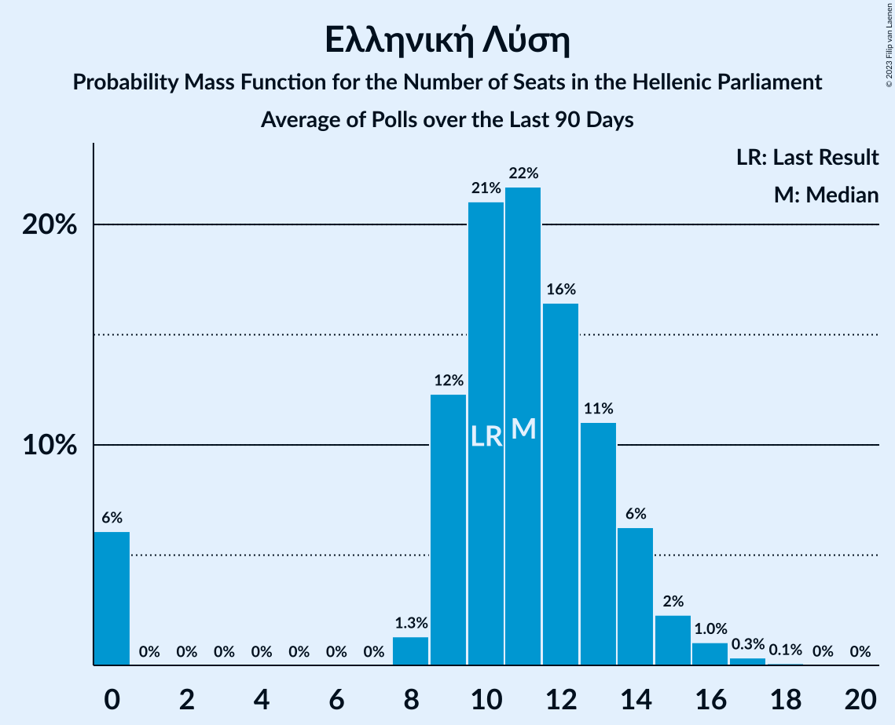

# Poll Average

<a href="#voting-intentions">Voting Intentions</a> | <a href="#seats">Seats</a> | <a href="#coalitions">Coalitions</a> | <a href="#technical-information">Technical Information</a>

## Summary

The table below lists the polls on which the average is based. They are the most recent polls (less than 90 days old) registered and analyzed so far.

| Period     | Polling firm/Commissioner(s) | ΣΥΡΙΖΑ | ΝΔ | ΧΑ | ΚΑ | ΚΚΕ | Ποτάμι | ΑΝΕΛ | ΕΚ | ΛΑΕ | ΠΕ | ΕΛ | ΜέΡΑ25 |
|:----------:|:----------------------------:|:--:|:--:|:--:|:--:|:--:|:--:|:--:|:--:|:--:|:--:|:--:|:--:|
| 7 July 2019 | General Election | 31.5%   86 | 39.8%   158 | 2.9%   0 | 8.1%   22 | 5.3%   15 | 0.0%   0 | 0.0%   0 | 1.2%   0 | 0.0%   0 | 1.5%   0 | 3.7%   10 | 3.4%   9 |
| N/A | Poll Average | 24–32%   67–90 | 38–44%   155–170 | N/A   N/A | 6–9%   17–26 | 5–8%   13–22 | N/A   N/A | N/A   N/A | N/A   N/A | N/A   N/A | 1–3%   0 | 4–6%   10–18 | 2–5%   0–15 |
| [23–27 August 2021](2021-08-27-Interview.html) | Interview   Politic.gr | 23–28%   67–78 | 37–42%   156–170 | N/A   N/A | 6–9%   17–24 | 5–7%   14–21 | N/A   N/A | N/A   N/A | N/A   N/A | N/A   N/A | N/A   N/A | 4–6%   12–18 | 3–6%   10–16 |
| [20–25 August 2021](2021-08-25-GPO.html) | GPO   Τα Νέα | 26–31%   70–86 | 37–43%   152–169 | N/A   N/A | 6–9%   16–26 | 6–9%   15–24 | N/A   N/A | N/A   N/A | N/A   N/A | N/A   N/A | N/A   N/A | 4–6%   10–18 | 3–5%   0–13 |
| [23–24 August 2021](2021-08-24-Prorata.html) | Prorata   iEidiseis | 28–32%   80–92 | 38–42%   157–170 | N/A   N/A | 7–9%   19–26 | 5–7%   13–19 | N/A   N/A | N/A   N/A | N/A   N/A | N/A   N/A | N/A   N/A | 3–5%   10–15 | 2–3%   0–9 |
| [12–17 July 2021](2021-07-17-Alco.html) | Alco   Open TV | 25–30%   66–81 | 39–45%   154–171 | N/A   N/A | 6–10%   17–26 | 5–8%   13–21 | N/A   N/A | N/A   N/A | N/A   N/A | N/A   N/A | 1–3%   0 | 4–7%   11–18 | 3–6%   0–15 |
| [27 June–7 July 2021](2021-07-07-PulseRC.html) | Pulse RC   ΣΚΑΪ | N/A   N/A | N/A   N/A | N/A   N/A | N/A   N/A | N/A   N/A | N/A   N/A | N/A   N/A | N/A   N/A | N/A   N/A | N/A   N/A | N/A   N/A | N/A   N/A |
| 7 July 2019 | General Election | 31.5%   86 | 39.8%   158 | 2.9%   0 | 8.1%   22 | 5.3%   15 | 0.0%   0 | 0.0%   0 | 1.2%   0 | 0.0%   0 | 1.5%   0 | 3.7%   10 | 3.4%   9 |

Only polls for which at least the sample size has been published are included in the table above.

**Legend:**
+ **Top half of each row:** Voting intentions (95% confidence interval)
+ **Bottom half of each row:** Seat projections for the Hellenic Parliament (95% confidence interval)
+ **ΣΥΡΙΖΑ:** Συνασπισμός Ριζοσπαστικής Αριστεράς
+ **ΝΔ:** Νέα Δημοκρατία
+ **ΧΑ:** Χρυσή Αυγή
+ **ΚΑ:** Κίνημα Αλλαγής
+ **ΚΚΕ:** Κομμουνιστικό Κόμμα Ελλάδας
+ **Ποτάμι:** Το Ποτάμι
+ **ΑΝΕΛ:** Ανεξάρτητοι Έλληνες
+ **ΕΚ:** Ένωση Κεντρώων
+ **ΛΑΕ:** Λαϊκή Ενότητα
+ **ΠΕ:** Πλεύση Ελευθερίας
+ **ΕΛ:** Ελληνική Λύση
+ **ΜέΡΑ25:** Μέτωπο Ευρωπαϊκής Ρεαλιστικής Ανυπακοής
+ **N/A (single party):** Party not included the published results
+ **N/A (entire row):** Calculation for this opinion poll not started yet

## Voting Intentions

### Confidence Intervals

| Party | Last Result | Median | 80% Confidence Interval | 90% Confidence Interval | 95% Confidence Interval | 99% Confidence Interval |
|:-----:|:-----------:|:------:|:-----------------------:|:-----------------------:|:-----------------------:|:-----------------------:|
| <a href="#νέα-δημοκρατία">Νέα Δημοκρατία</a> | 39.8% | 40.3% | 38.4–42.5% |37.9–43.2% | 37.5–43.8% | 36.6–45.0% |
| <a href="#συνασπισμός-ριζοσπαστικής-αριστεράς">Συνασπισμός Ριζοσπαστικής Αριστεράς</a> | 31.5% | 27.9% | 25.0–30.7% |24.4–31.3% | 23.9–31.8% | 23.0–32.6% |
| <a href="#κίνημα-αλλαγής">Κίνημα Αλλαγής</a> | 8.1% | 7.6% | 6.6–8.7% |6.3–9.1% | 6.0–9.4% | 5.6–10.0% |
| <a href="#κομμουνιστικό-κόμμα-ελλάδας">Κομμουνιστικό Κόμμα Ελλάδας</a> | 5.3% | 6.2% | 5.2–7.5% |4.9–7.9% | 4.8–8.2% | 4.4–8.9% |
| <a href="#ελληνική-λύση">Ελληνική Λύση</a> | 3.7% | 4.9% | 4.0–5.9% |3.8–6.2% | 3.6–6.4% | 3.3–7.0% |
| <a href="#μέτωπο-ευρωπαϊκής-ρεαλιστικής-ανυπακοής">Μέτωπο Ευρωπαϊκής Ρεαλιστικής Ανυπακοής</a> | 3.4% | 3.7% | 2.3–4.8% |2.1–5.1% | 2.0–5.3% | 1.8–5.8% |
| <a href="#χρυσή-αυγή">Χρυσή Αυγή</a> | 2.9% | N/A | N/A |N/A | N/A | N/A |
| <a href="#πλεύση-ελευθερίας">Πλεύση Ελευθερίας</a> | 1.5% | 1.9% | 1.4–2.5% |1.2–2.7% | 1.2–2.8% | 1.0–3.2% |
| <a href="#ένωση-κεντρώων">Ένωση Κεντρώων</a> | 1.2% | N/A | N/A |N/A | N/A | N/A |
| <a href="#το-ποτάμι">Το Ποτάμι</a> | 0.0% | N/A | N/A |N/A | N/A | N/A |
| <a href="#ανεξάρτητοι-έλληνες">Ανεξάρτητοι Έλληνες</a> | 0.0% | N/A | N/A |N/A | N/A | N/A |
| <a href="#λαϊκή-ενότητα">Λαϊκή Ενότητα</a> | 0.0% | N/A | N/A |N/A | N/A | N/A |

### Νέα Δημοκρατία

*For a full overview of the results for this party, see the [Νέα Δημοκρατία](party-νέαδημοκρατία.html) page.*

| Voting Intentions | Probability | Accumulated | Special Marks |
|:-----------------:|:-----------:|:-----------:|:-------------:|
| 34.5–35.5% | 0% | 100% |  |
| 35.5–36.5% | 0.4% | 99.9% |  |
| 36.5–37.5% | 2% | 99.5% |  |
| 37.5–38.5% | 8% | 97% |  |
| 38.5–39.5% | 19% | 89% |  |
| 39.5–40.5% | 25% | 70% | Last Result, Median |
| 40.5–41.5% | 22% | 44% |  |
| 41.5–42.5% | 13% | 23% |  |
| 42.5–43.5% | 6% | 10% |  |
| 43.5–44.5% | 3% | 4% |  |
| 44.5–45.5% | 0.8% | 0.9% |  |
| 45.5–46.5% | 0.2% | 0.2% |  |
| 46.5–47.5% | 0% | 0% |  |

### Συνασπισμός Ριζοσπαστικής Αριστεράς

*For a full overview of the results for this party, see the [Συνασπισμός Ριζοσπαστικής Αριστεράς](party-συνασπισμόςριζοσπαστικήςαριστεράς.html) page.*

| Voting Intentions | Probability | Accumulated | Special Marks |
|:-----------------:|:-----------:|:-----------:|:-------------:|
| 20.5–21.5% | 0% | 100% |  |
| 21.5–22.5% | 0.2% | 100% |  |
| 22.5–23.5% | 1.2% | 99.8% |  |
| 23.5–24.5% | 5% | 98.6% |  |
| 24.5–25.5% | 10% | 94% |  |
| 25.5–26.5% | 14% | 83% |  |
| 26.5–27.5% | 15% | 69% |  |
| 27.5–28.5% | 14% | 54% | Median |
| 28.5–29.5% | 14% | 40% |  |
| 29.5–30.5% | 13% | 26% |  |
| 30.5–31.5% | 9% | 12% |  |
| 31.5–32.5% | 3% | 4% | Last Result |
| 32.5–33.5% | 0.5% | 0.6% |  |
| 33.5–34.5% | 0% | 0% |  |
| 34.5–35.5% | 0% | 0% |  |

### Κίνημα Αλλαγής

*For a full overview of the results for this party, see the [Κίνημα Αλλαγής](party-κίνημααλλαγής.html) page.*

| Voting Intentions | Probability | Accumulated | Special Marks |
|:-----------------:|:-----------:|:-----------:|:-------------:|
| 3.5–4.5% | 0% | 100% |  |
| 4.5–5.5% | 0.4% | 100% |  |
| 5.5–6.5% | 9% | 99.6% |  |
| 6.5–7.5% | 36% | 90% |  |
| 7.5–8.5% | 40% | 54% | Last Result, Median |
| 8.5–9.5% | 13% | 14% |  |
| 9.5–10.5% | 1.4% | 1.5% |  |
| 10.5–11.5% | 0.1% | 0.1% |  |
| 11.5–12.5% | 0% | 0% |  |

### Κομμουνιστικό Κόμμα Ελλάδας

*For a full overview of the results for this party, see the [Κομμουνιστικό Κόμμα Ελλάδας](party-κομμουνιστικόκόμμαελλάδας.html) page.*

| Voting Intentions | Probability | Accumulated | Special Marks |
|:-----------------:|:-----------:|:-----------:|:-------------:|
| 2.5–3.5% | 0% | 100% |  |
| 3.5–4.5% | 1.0% | 100% |  |
| 4.5–5.5% | 22% | 99.0% | Last Result |
| 5.5–6.5% | 43% | 77% | Median |
| 6.5–7.5% | 25% | 34% |  |
| 7.5–8.5% | 8% | 9% |  |
| 8.5–9.5% | 1.1% | 1.1% |  |
| 9.5–10.5% | 0.1% | 0.1% |  |
| 10.5–11.5% | 0% | 0% |  |

### Ελληνική Λύση

*For a full overview of the results for this party, see the [Ελληνική Λύση](party-ελληνικήλύση.html) page.*

| Voting Intentions | Probability | Accumulated | Special Marks |
|:-----------------:|:-----------:|:-----------:|:-------------:|
| 1.5–2.5% | 0% | 100% |  |
| 2.5–3.5% | 2% | 100% |  |
| 3.5–4.5% | 32% | 98% | Last Result |
| 4.5–5.5% | 46% | 66% | Median |
| 5.5–6.5% | 18% | 20% |  |
| 6.5–7.5% | 2% | 2% |  |
| 7.5–8.5% | 0.1% | 0.1% |  |
| 8.5–9.5% | 0% | 0% |  |

### Μέτωπο Ευρωπαϊκής Ρεαλιστικής Ανυπακοής

*For a full overview of the results for this party, see the [Μέτωπο Ευρωπαϊκής Ρεαλιστικής Ανυπακοής](party-μέτωποευρωπαϊκήςρεαλιστικήςανυπακοής.html) page.*

| Voting Intentions | Probability | Accumulated | Special Marks |
|:-----------------:|:-----------:|:-----------:|:-------------:|
| 0.5–1.5% | 0.1% | 100% |  |
| 1.5–2.5% | 16% | 99.9% |  |
| 2.5–3.5% | 26% | 84% | Last Result |
| 3.5–4.5% | 40% | 57% | Median |
| 4.5–5.5% | 16% | 17% |  |
| 5.5–6.5% | 1.2% | 1.2% |  |
| 6.5–7.5% | 0% | 0% |  |

### Πλεύση Ελευθερίας

*For a full overview of the results for this party, see the [Πλεύση Ελευθερίας](party-πλεύσηελευθερίας.html) page.*

| Voting Intentions | Probability | Accumulated | Special Marks |
|:-----------------:|:-----------:|:-----------:|:-------------:|
| 0.0–0.5% | 0% | 100% |  |
| 0.5–1.5% | 22% | 100% | Last Result |
| 1.5–2.5% | 70% | 78% | Median |
| 2.5–3.5% | 7% | 8% |  |
| 3.5–4.5% | 0.1% | 0.1% |  |
| 4.5–5.5% | 0% | 0% |  |

## Seats

### Confidence Intervals

| Party | Last Result | Median | 80% Confidence Interval | 90% Confidence Interval | 95% Confidence Interval | 99% Confidence Interval |
|:-----:|:-----------:|:------:|:-----------------------:|:-----------------------:|:-----------------------:|:-----------------------:|
| <a href="#νέα-δημοκρατία">Νέα Δημοκρατία</a> | 158 | 162 | 157–167 |156–169 | 155–170 | 151–173 |
| <a href="#συνασπισμός-ριζοσπαστικής-αριστεράς">Συνασπισμός Ριζοσπαστικής Αριστεράς</a> | 86 | 76 | 69–87 |68–88 | 67–90 | 65–92 |
| <a href="#κίνημα-αλλαγής">Κίνημα Αλλαγής</a> | 22 | 21 | 18–24 |17–25 | 17–26 | 16–27 |
| <a href="#κομμουνιστικό-κόμμα-ελλάδας">Κομμουνιστικό Κόμμα Ελλάδας</a> | 15 | 17 | 15–20 |14–21 | 13–22 | 12–24 |
| <a href="#ελληνική-λύση">Ελληνική Λύση</a> | 10 | 14 | 11–16 |11–17 | 10–18 | 9–19 |
| <a href="#μέτωπο-ευρωπαϊκής-ρεαλιστικής-ανυπακοής">Μέτωπο Ευρωπαϊκής Ρεαλιστικής Ανυπακοής</a> | 9 | 10 | 0–13 |0–14 | 0–15 | 0–16 |
| <a href="#χρυσή-αυγή">Χρυσή Αυγή</a> | 0 | N/A | N/A |N/A | N/A | N/A |
| <a href="#πλεύση-ελευθερίας">Πλεύση Ελευθερίας</a> | 0 | 0 | 0 |0 | 0 | 0–8 |
| <a href="#ένωση-κεντρώων">Ένωση Κεντρώων</a> | 0 | N/A | N/A |N/A | N/A | N/A |
| <a href="#το-ποτάμι">Το Ποτάμι</a> | 0 | N/A | N/A |N/A | N/A | N/A |
| <a href="#ανεξάρτητοι-έλληνες">Ανεξάρτητοι Έλληνες</a> | 0 | N/A | N/A |N/A | N/A | N/A |
| <a href="#λαϊκή-ενότητα">Λαϊκή Ενότητα</a> | 0 | N/A | N/A |N/A | N/A | N/A |

### Νέα Δημοκρατία

*For a full overview of the results for this party, see the [Νέα Δημοκρατία](party-νέαδημοκρατία.html) page.*

| Number of Seats | Probability | Accumulated | Special Marks |
|:---------------:|:-----------:|:-----------:|:-------------:|
| 147 | 0% | 100% |  |
| 148 | 0% | 99.9% |  |
| 149 | 0.1% | 99.9% |  |
| 150 | 0.1% | 99.8% |  |
| 151 | 0.3% | 99.7% | Majority |
| 152 | 0.4% | 99.4% |  |
| 153 | 0.6% | 99.1% |  |
| 154 | 0.9% | 98% |  |
| 155 | 3% | 98% |  |
| 156 | 3% | 95% |  |
| 157 | 5% | 92% |  |
| 158 | 6% | 87% | Last Result |
| 159 | 8% | 80% |  |
| 160 | 9% | 73% |  |
| 161 | 9% | 64% |  |
| 162 | 8% | 54% | Median |
| 163 | 7% | 47% |  |
| 164 | 9% | 39% |  |
| 165 | 9% | 30% |  |
| 166 | 8% | 21% |  |
| 167 | 5% | 14% |  |
| 168 | 3% | 9% |  |
| 169 | 2% | 6% |  |
| 170 | 1.5% | 3% |  |
| 171 | 0.8% | 2% |  |
| 172 | 0.5% | 1.1% |  |
| 173 | 0.4% | 0.7% |  |
| 174 | 0.2% | 0.3% |  |
| 175 | 0.1% | 0.1% |  |
| 176 | 0% | 0.1% |  |
| 177 | 0% | 0% |  |

### Συνασπισμός Ριζοσπαστικής Αριστεράς

*For a full overview of the results for this party, see the [Συνασπισμός Ριζοσπαστικής Αριστεράς](party-συνασπισμόςριζοσπαστικήςαριστεράς.html) page.*

| Number of Seats | Probability | Accumulated | Special Marks |
|:---------------:|:-----------:|:-----------:|:-------------:|
| 62 | 0.1% | 100% |  |
| 63 | 0.1% | 99.9% |  |
| 64 | 0.2% | 99.8% |  |
| 65 | 0.3% | 99.6% |  |
| 66 | 0.6% | 99.3% |  |
| 67 | 2% | 98.7% |  |
| 68 | 3% | 97% |  |
| 69 | 5% | 94% |  |
| 70 | 5% | 90% |  |
| 71 | 5% | 85% |  |
| 72 | 4% | 80% |  |
| 73 | 6% | 76% |  |
| 74 | 6% | 70% |  |
| 75 | 8% | 64% |  |
| 76 | 7% | 57% | Median |
| 77 | 5% | 50% |  |
| 78 | 4% | 44% |  |
| 79 | 4% | 40% |  |
| 80 | 3% | 36% |  |
| 81 | 5% | 33% |  |
| 82 | 2% | 27% |  |
| 83 | 4% | 26% |  |
| 84 | 2% | 22% |  |
| 85 | 5% | 19% |  |
| 86 | 4% | 14% | Last Result |
| 87 | 3% | 10% |  |
| 88 | 3% | 8% |  |
| 89 | 1.3% | 5% |  |
| 90 | 2% | 4% |  |
| 91 | 0.3% | 1.2% |  |
| 92 | 0.7% | 1.0% |  |
| 93 | 0.1% | 0.2% |  |
| 94 | 0.1% | 0.2% |  |
| 95 | 0% | 0.1% |  |
| 96 | 0% | 0% |  |

### Κίνημα Αλλαγής

*For a full overview of the results for this party, see the [Κίνημα Αλλαγής](party-κίνημααλλαγής.html) page.*

| Number of Seats | Probability | Accumulated | Special Marks |
|:---------------:|:-----------:|:-----------:|:-------------:|
| 15 | 0.3% | 100% |  |
| 16 | 1.2% | 99.6% |  |
| 17 | 5% | 98% |  |
| 18 | 5% | 94% |  |
| 19 | 9% | 89% |  |
| 20 | 15% | 80% |  |
| 21 | 22% | 64% | Median |
| 22 | 16% | 42% | Last Result |
| 23 | 10% | 27% |  |
| 24 | 8% | 17% |  |
| 25 | 5% | 8% |  |
| 26 | 2% | 3% |  |
| 27 | 0.7% | 1.1% |  |
| 28 | 0.2% | 0.3% |  |
| 29 | 0.1% | 0.1% |  |
| 30 | 0% | 0% |  |

### Κομμουνιστικό Κόμμα Ελλάδας

*For a full overview of the results for this party, see the [Κομμουνιστικό Κόμμα Ελλάδας](party-κομμουνιστικόκόμμαελλάδας.html) page.*

| Number of Seats | Probability | Accumulated | Special Marks |
|:---------------:|:-----------:|:-----------:|:-------------:|
| 11 | 0.1% | 100% |  |
| 12 | 0.6% | 99.9% |  |
| 13 | 2% | 99.4% |  |
| 14 | 7% | 97% |  |
| 15 | 13% | 90% | Last Result |
| 16 | 18% | 78% |  |
| 17 | 16% | 60% | Median |
| 18 | 15% | 44% |  |
| 19 | 14% | 29% |  |
| 20 | 8% | 16% |  |
| 21 | 4% | 8% |  |
| 22 | 2% | 4% |  |
| 23 | 1.2% | 2% |  |
| 24 | 0.5% | 0.9% |  |
| 25 | 0.2% | 0.4% |  |
| 26 | 0.1% | 0.2% |  |
| 27 | 0% | 0% |  |

### Ελληνική Λύση

*For a full overview of the results for this party, see the [Ελληνική Λύση](party-ελληνικήλύση.html) page.*

| Number of Seats | Probability | Accumulated | Special Marks |
|:---------------:|:-----------:|:-----------:|:-------------:|
| 0 | 0.1% | 100% |  |
| 1 | 0% | 99.9% |  |
| 2 | 0% | 99.9% |  |
| 3 | 0% | 99.9% |  |
| 4 | 0% | 99.9% |  |
| 5 | 0% | 99.9% |  |
| 6 | 0% | 99.9% |  |
| 7 | 0% | 99.9% |  |
| 8 | 0% | 99.9% |  |
| 9 | 0.7% | 99.9% |  |
| 10 | 4% | 99.2% | Last Result |
| 11 | 9% | 95% |  |
| 12 | 15% | 86% |  |
| 13 | 19% | 71% |  |
| 14 | 21% | 51% | Median |
| 15 | 12% | 31% |  |
| 16 | 9% | 18% |  |
| 17 | 6% | 9% |  |
| 18 | 2% | 4% |  |
| 19 | 0.8% | 1.2% |  |
| 20 | 0.2% | 0.3% |  |
| 21 | 0.1% | 0.1% |  |
| 22 | 0% | 0% |  |

### Μέτωπο Ευρωπαϊκής Ρεαλιστικής Ανυπακοής

*For a full overview of the results for this party, see the [Μέτωπο Ευρωπαϊκής Ρεαλιστικής Ανυπακοής](party-μέτωποευρωπαϊκήςρεαλιστικήςανυπακοής.html) page.*

| Number of Seats | Probability | Accumulated | Special Marks |
|:---------------:|:-----------:|:-----------:|:-------------:|
| 0 | 29% | 100% |  |
| 1 | 0% | 71% |  |
| 2 | 0% | 71% |  |
| 3 | 0% | 71% |  |
| 4 | 0% | 71% |  |
| 5 | 0% | 71% |  |
| 6 | 0% | 71% |  |
| 7 | 0% | 71% |  |
| 8 | 0.8% | 71% |  |
| 9 | 10% | 71% | Last Result |
| 10 | 11% | 61% | Median |
| 11 | 18% | 50% |  |
| 12 | 12% | 32% |  |
| 13 | 11% | 19% |  |
| 14 | 5% | 9% |  |
| 15 | 3% | 4% |  |
| 16 | 0.8% | 1.1% |  |
| 17 | 0.2% | 0.3% |  |
| 18 | 0.1% | 0.1% |  |
| 19 | 0% | 0% |  |

### Χρυσή Αυγή

*For a full overview of the results for this party, see the [Χρυσή Αυγή](party-χρυσήαυγή.html) page.*

### Πλεύση Ελευθερίας

*For a full overview of the results for this party, see the [Πλεύση Ελευθερίας](party-πλεύσηελευθερίας.html) page.*

| Number of Seats | Probability | Accumulated | Special Marks |
|:---------------:|:-----------:|:-----------:|:-------------:|
| 0 | 98.8% | 100% | Last Result, Median |
| 1 | 0% | 1.2% |  |
| 2 | 0% | 1.2% |  |
| 3 | 0% | 1.2% |  |
| 4 | 0% | 1.2% |  |
| 5 | 0% | 1.2% |  |
| 6 | 0% | 1.2% |  |
| 7 | 0% | 1.2% |  |
| 8 | 0.7% | 1.2% |  |
| 9 | 0.4% | 0.5% |  |
| 10 | 0.1% | 0.1% |  |
| 11 | 0% | 0% |  |

### Ένωση Κεντρώων

*For a full overview of the results for this party, see the [Ένωση Κεντρώων](party-ένωσηκεντρώων.html) page.*

### Το Ποτάμι

*For a full overview of the results for this party, see the [Το Ποτάμι](party-τοποτάμι.html) page.*

### Ανεξάρτητοι Έλληνες

*For a full overview of the results for this party, see the [Ανεξάρτητοι Έλληνες](party-ανεξάρτητοιέλληνες.html) page.*

### Λαϊκή Ενότητα

*For a full overview of the results for this party, see the [Λαϊκή Ενότητα](party-λαϊκήενότητα.html) page.*

## Coalitions

### Confidence Intervals

| Coalition | Last Result | Median | Majority? | 80% Confidence Interval | 90% Confidence Interval | 95% Confidence Interval | 99% Confidence Interval |
|:---------:|:-----------:|:------:|:---------:|:-----------------------:|:-----------------------:|:-----------------------:|:-----------------------:|
| Νέα Δημοκρατία – Κίνημα Αλλαγής | 180 | 184 | 100% | 178–189 | 176–190 | 175–192 | 172–194 |
| Νέα Δημοκρατία – Κίνημα Αλλαγής – Το Ποτάμι | 180 | 184 | 100% | 178–189 | 176–190 | 175–192 | 172–194 |
| Νέα Δημοκρατία | 158 | 162 | 99.7% | 157–167 | 156–169 | 155–170 | 151–173 |
| Νέα Δημοκρατία – Το Ποτάμι | 158 | 162 | 99.7% | 157–167 | 156–169 | 155–170 | 151–173 |
| Συνασπισμός Ριζοσπαστικής Αριστεράς – Μέτωπο Ευρωπαϊκής Ρεαλιστικής Ανυπακοής | 95 | 86 | 0% | 81–90 | 79–92 | 78–93 | 74–96 |
| Συνασπισμός Ριζοσπαστικής Αριστεράς – Ανεξάρτητοι Έλληνες – Λαϊκή Ενότητα | 86 | 76 | 0% | 69–87 | 68–88 | 67–90 | 65–92 |
| Συνασπισμός Ριζοσπαστικής Αριστεράς – Ανεξάρτητοι Έλληνες | 86 | 76 | 0% | 69–87 | 68–88 | 67–90 | 65–92 |
| Συνασπισμός Ριζοσπαστικής Αριστεράς – Λαϊκή Ενότητα | 86 | 76 | 0% | 69–87 | 68–88 | 67–90 | 65–92 |
| Συνασπισμός Ριζοσπαστικής Αριστεράς | 86 | 76 | 0% | 69–87 | 68–88 | 67–90 | 65–92 |

### Νέα Δημοκρατία – Κίνημα Αλλαγής

| Number of Seats | Probability | Accumulated | Special Marks |
|:---------------:|:-----------:|:-----------:|:-------------:|
| 168 | 0% | 100% |  |
| 169 | 0.1% | 99.9% |  |
| 170 | 0.1% | 99.9% |  |
| 171 | 0.1% | 99.8% |  |
| 172 | 0.4% | 99.7% |  |
| 173 | 0.4% | 99.3% |  |
| 174 | 0.8% | 98.9% |  |
| 175 | 1.4% | 98% |  |
| 176 | 2% | 97% |  |
| 177 | 3% | 94% |  |
| 178 | 7% | 91% |  |
| 179 | 4% | 84% |  |
| 180 | 8% | 80% | Last Result |
| 181 | 9% | 73% |  |
| 182 | 5% | 63% |  |
| 183 | 8% | 58% | Median |
| 184 | 8% | 50% |  |
| 185 | 9% | 43% |  |
| 186 | 9% | 34% |  |
| 187 | 7% | 25% |  |
| 188 | 6% | 18% |  |
| 189 | 5% | 11% |  |
| 190 | 2% | 7% |  |
| 191 | 2% | 5% |  |
| 192 | 1.1% | 3% |  |
| 193 | 0.7% | 1.4% |  |
| 194 | 0.3% | 0.7% |  |
| 195 | 0.2% | 0.4% |  |
| 196 | 0.1% | 0.2% |  |
| 197 | 0% | 0.1% |  |
| 198 | 0% | 0.1% |  |
| 199 | 0% | 0% |  |

### Νέα Δημοκρατία – Κίνημα Αλλαγής – Το Ποτάμι

| Number of Seats | Probability | Accumulated | Special Marks |
|:---------------:|:-----------:|:-----------:|:-------------:|
| 168 | 0% | 100% |  |
| 169 | 0.1% | 99.9% |  |
| 170 | 0.1% | 99.9% |  |
| 171 | 0.1% | 99.8% |  |
| 172 | 0.4% | 99.7% |  |
| 173 | 0.4% | 99.3% |  |
| 174 | 0.8% | 98.9% |  |
| 175 | 1.4% | 98% |  |
| 176 | 2% | 97% |  |
| 177 | 3% | 94% |  |
| 178 | 7% | 91% |  |
| 179 | 4% | 84% |  |
| 180 | 8% | 80% | Last Result |
| 181 | 9% | 73% |  |
| 182 | 5% | 63% |  |
| 183 | 8% | 58% | Median |
| 184 | 8% | 50% |  |
| 185 | 9% | 43% |  |
| 186 | 9% | 34% |  |
| 187 | 7% | 25% |  |
| 188 | 6% | 18% |  |
| 189 | 5% | 11% |  |
| 190 | 2% | 7% |  |
| 191 | 2% | 5% |  |
| 192 | 1.1% | 3% |  |
| 193 | 0.7% | 1.4% |  |
| 194 | 0.3% | 0.7% |  |
| 195 | 0.2% | 0.4% |  |
| 196 | 0.1% | 0.2% |  |
| 197 | 0% | 0.1% |  |
| 198 | 0% | 0.1% |  |
| 199 | 0% | 0% |  |

### Νέα Δημοκρατία

| Number of Seats | Probability | Accumulated | Special Marks |
|:---------------:|:-----------:|:-----------:|:-------------:|
| 147 | 0% | 100% |  |
| 148 | 0% | 99.9% |  |
| 149 | 0.1% | 99.9% |  |
| 150 | 0.1% | 99.8% |  |
| 151 | 0.3% | 99.7% | Majority |
| 152 | 0.4% | 99.4% |  |
| 153 | 0.6% | 99.1% |  |
| 154 | 0.9% | 98% |  |
| 155 | 3% | 98% |  |
| 156 | 3% | 95% |  |
| 157 | 5% | 92% |  |
| 158 | 6% | 87% | Last Result |
| 159 | 8% | 80% |  |
| 160 | 9% | 73% |  |
| 161 | 9% | 64% |  |
| 162 | 8% | 54% | Median |
| 163 | 7% | 47% |  |
| 164 | 9% | 39% |  |
| 165 | 9% | 30% |  |
| 166 | 8% | 21% |  |
| 167 | 5% | 14% |  |
| 168 | 3% | 9% |  |
| 169 | 2% | 6% |  |
| 170 | 1.5% | 3% |  |
| 171 | 0.8% | 2% |  |
| 172 | 0.5% | 1.1% |  |
| 173 | 0.4% | 0.7% |  |
| 174 | 0.2% | 0.3% |  |
| 175 | 0.1% | 0.1% |  |
| 176 | 0% | 0.1% |  |
| 177 | 0% | 0% |  |

### Νέα Δημοκρατία – Το Ποτάμι

| Number of Seats | Probability | Accumulated | Special Marks |
|:---------------:|:-----------:|:-----------:|:-------------:|
| 147 | 0% | 100% |  |
| 148 | 0% | 99.9% |  |
| 149 | 0.1% | 99.9% |  |
| 150 | 0.1% | 99.8% |  |
| 151 | 0.3% | 99.7% | Majority |
| 152 | 0.4% | 99.4% |  |
| 153 | 0.6% | 99.1% |  |
| 154 | 0.9% | 98% |  |
| 155 | 3% | 98% |  |
| 156 | 3% | 95% |  |
| 157 | 5% | 92% |  |
| 158 | 6% | 87% | Last Result |
| 159 | 8% | 80% |  |
| 160 | 9% | 73% |  |
| 161 | 9% | 64% |  |
| 162 | 8% | 54% | Median |
| 163 | 7% | 47% |  |
| 164 | 9% | 39% |  |
| 165 | 9% | 30% |  |
| 166 | 8% | 21% |  |
| 167 | 5% | 14% |  |
| 168 | 3% | 9% |  |
| 169 | 2% | 6% |  |
| 170 | 1.5% | 3% |  |
| 171 | 0.8% | 2% |  |
| 172 | 0.5% | 1.1% |  |
| 173 | 0.4% | 0.7% |  |
| 174 | 0.2% | 0.3% |  |
| 175 | 0.1% | 0.1% |  |
| 176 | 0% | 0.1% |  |
| 177 | 0% | 0% |  |

### Συνασπισμός Ριζοσπαστικής Αριστεράς – Μέτωπο Ευρωπαϊκής Ρεαλιστικής Ανυπακοής

| Number of Seats | Probability | Accumulated | Special Marks |
|:---------------:|:-----------:|:-----------:|:-------------:|
| 70 | 0% | 100% |  |
| 71 | 0.1% | 99.9% |  |
| 72 | 0.1% | 99.9% |  |
| 73 | 0.1% | 99.8% |  |
| 74 | 0.2% | 99.6% |  |
| 75 | 0.4% | 99.4% |  |
| 76 | 0.7% | 99.0% |  |
| 77 | 0.7% | 98% |  |
| 78 | 1.3% | 98% |  |
| 79 | 2% | 96% |  |
| 80 | 4% | 94% |  |
| 81 | 5% | 90% |  |
| 82 | 8% | 85% |  |
| 83 | 7% | 77% |  |
| 84 | 6% | 70% |  |
| 85 | 9% | 64% |  |
| 86 | 10% | 55% | Median |
| 87 | 11% | 45% |  |
| 88 | 10% | 34% |  |
| 89 | 7% | 24% |  |
| 90 | 7% | 17% |  |
| 91 | 4% | 9% |  |
| 92 | 2% | 6% |  |
| 93 | 1.5% | 3% |  |
| 94 | 0.8% | 2% |  |
| 95 | 0.6% | 1.2% | Last Result |
| 96 | 0.3% | 0.6% |  |
| 97 | 0.2% | 0.3% |  |
| 98 | 0% | 0.1% |  |
| 99 | 0% | 0.1% |  |
| 100 | 0% | 0% |  |

### Συνασπισμός Ριζοσπαστικής Αριστεράς – Ανεξάρτητοι Έλληνες – Λαϊκή Ενότητα

| Number of Seats | Probability | Accumulated | Special Marks |
|:---------------:|:-----------:|:-----------:|:-------------:|
| 62 | 0.1% | 100% |  |
| 63 | 0.1% | 99.9% |  |
| 64 | 0.2% | 99.8% |  |
| 65 | 0.3% | 99.6% |  |
| 66 | 0.6% | 99.3% |  |
| 67 | 2% | 98.7% |  |
| 68 | 3% | 97% |  |
| 69 | 5% | 94% |  |
| 70 | 5% | 90% |  |
| 71 | 5% | 85% |  |
| 72 | 4% | 80% |  |
| 73 | 6% | 76% |  |
| 74 | 6% | 70% |  |
| 75 | 8% | 64% |  |
| 76 | 7% | 57% | Median |
| 77 | 5% | 50% |  |
| 78 | 4% | 44% |  |
| 79 | 4% | 40% |  |
| 80 | 3% | 36% |  |
| 81 | 5% | 33% |  |
| 82 | 2% | 27% |  |
| 83 | 4% | 26% |  |
| 84 | 2% | 22% |  |
| 85 | 5% | 19% |  |
| 86 | 4% | 14% | Last Result |
| 87 | 3% | 10% |  |
| 88 | 3% | 8% |  |
| 89 | 1.3% | 5% |  |
| 90 | 2% | 4% |  |
| 91 | 0.3% | 1.2% |  |
| 92 | 0.7% | 1.0% |  |
| 93 | 0.1% | 0.2% |  |
| 94 | 0.1% | 0.2% |  |
| 95 | 0% | 0.1% |  |
| 96 | 0% | 0% |  |

### Συνασπισμός Ριζοσπαστικής Αριστεράς – Ανεξάρτητοι Έλληνες

| Number of Seats | Probability | Accumulated | Special Marks |
|:---------------:|:-----------:|:-----------:|:-------------:|
| 62 | 0.1% | 100% |  |
| 63 | 0.1% | 99.9% |  |
| 64 | 0.2% | 99.8% |  |
| 65 | 0.3% | 99.6% |  |
| 66 | 0.6% | 99.3% |  |
| 67 | 2% | 98.7% |  |
| 68 | 3% | 97% |  |
| 69 | 5% | 94% |  |
| 70 | 5% | 90% |  |
| 71 | 5% | 85% |  |
| 72 | 4% | 80% |  |
| 73 | 6% | 76% |  |
| 74 | 6% | 70% |  |
| 75 | 8% | 64% |  |
| 76 | 7% | 57% | Median |
| 77 | 5% | 50% |  |
| 78 | 4% | 44% |  |
| 79 | 4% | 40% |  |
| 80 | 3% | 36% |  |
| 81 | 5% | 33% |  |
| 82 | 2% | 27% |  |
| 83 | 4% | 26% |  |
| 84 | 2% | 22% |  |
| 85 | 5% | 19% |  |
| 86 | 4% | 14% | Last Result |
| 87 | 3% | 10% |  |
| 88 | 3% | 8% |  |
| 89 | 1.3% | 5% |  |
| 90 | 2% | 4% |  |
| 91 | 0.3% | 1.2% |  |
| 92 | 0.7% | 1.0% |  |
| 93 | 0.1% | 0.2% |  |
| 94 | 0.1% | 0.2% |  |
| 95 | 0% | 0.1% |  |
| 96 | 0% | 0% |  |

### Συνασπισμός Ριζοσπαστικής Αριστεράς – Λαϊκή Ενότητα

| Number of Seats | Probability | Accumulated | Special Marks |
|:---------------:|:-----------:|:-----------:|:-------------:|
| 62 | 0.1% | 100% |  |
| 63 | 0.1% | 99.9% |  |
| 64 | 0.2% | 99.8% |  |
| 65 | 0.3% | 99.6% |  |
| 66 | 0.6% | 99.3% |  |
| 67 | 2% | 98.7% |  |
| 68 | 3% | 97% |  |
| 69 | 5% | 94% |  |
| 70 | 5% | 90% |  |
| 71 | 5% | 85% |  |
| 72 | 4% | 80% |  |
| 73 | 6% | 76% |  |
| 74 | 6% | 70% |  |
| 75 | 8% | 64% |  |
| 76 | 7% | 57% | Median |
| 77 | 5% | 50% |  |
| 78 | 4% | 44% |  |
| 79 | 4% | 40% |  |
| 80 | 3% | 36% |  |
| 81 | 5% | 33% |  |
| 82 | 2% | 27% |  |
| 83 | 4% | 26% |  |
| 84 | 2% | 22% |  |
| 85 | 5% | 19% |  |
| 86 | 4% | 14% | Last Result |
| 87 | 3% | 10% |  |
| 88 | 3% | 8% |  |
| 89 | 1.3% | 5% |  |
| 90 | 2% | 4% |  |
| 91 | 0.3% | 1.2% |  |
| 92 | 0.7% | 1.0% |  |
| 93 | 0.1% | 0.2% |  |
| 94 | 0.1% | 0.2% |  |
| 95 | 0% | 0.1% |  |
| 96 | 0% | 0% |  |

### Συνασπισμός Ριζοσπαστικής Αριστεράς

| Number of Seats | Probability | Accumulated | Special Marks |
|:---------------:|:-----------:|:-----------:|:-------------:|
| 62 | 0.1% | 100% |  |
| 63 | 0.1% | 99.9% |  |
| 64 | 0.2% | 99.8% |  |
| 65 | 0.3% | 99.6% |  |
| 66 | 0.6% | 99.3% |  |
| 67 | 2% | 98.7% |  |
| 68 | 3% | 97% |  |
| 69 | 5% | 94% |  |
| 70 | 5% | 90% |  |
| 71 | 5% | 85% |  |
| 72 | 4% | 80% |  |
| 73 | 6% | 76% |  |
| 74 | 6% | 70% |  |
| 75 | 8% | 64% |  |
| 76 | 7% | 57% | Median |
| 77 | 5% | 50% |  |
| 78 | 4% | 44% |  |
| 79 | 4% | 40% |  |
| 80 | 3% | 36% |  |
| 81 | 5% | 33% |  |
| 82 | 2% | 27% |  |
| 83 | 4% | 26% |  |
| 84 | 2% | 22% |  |
| 85 | 5% | 19% |  |
| 86 | 4% | 14% | Last Result |
| 87 | 3% | 10% |  |
| 88 | 3% | 8% |  |
| 89 | 1.3% | 5% |  |
| 90 | 2% | 4% |  |
| 91 | 0.3% | 1.2% |  |
| 92 | 0.7% | 1.0% |  |
| 93 | 0.1% | 0.2% |  |
| 94 | 0.1% | 0.2% |  |
| 95 | 0% | 0.1% |  |
| 96 | 0% | 0% |  |

## Technical Information

+ **Number of polls included in this average:** 5
+ **Lowest number of simulations done in a poll included in this average:** 0
+ **Total number of simulations done in the polls included in this average:** 1,441,792
+ **Error estimate:** 1.69%
