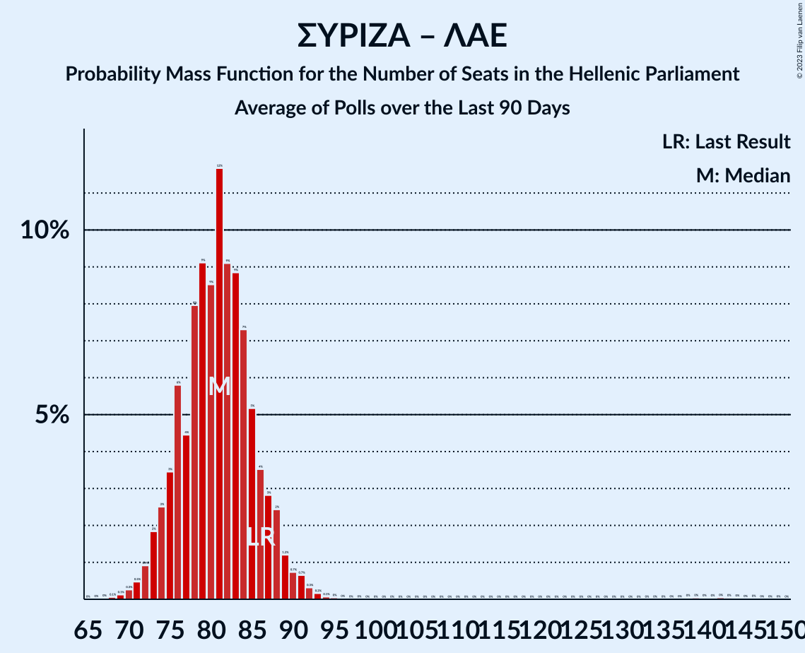

# Poll Average

<a href="#voting-intentions">Voting Intentions</a> | <a href="#seats">Seats</a> | <a href="#coalitions">Coalitions</a> | <a href="#technical-information">Technical Information</a>

## Summary

The table below lists the polls on which the average is based. They are the most recent polls (less than 90 days old) registered and analyzed so far.

| Period     | Polling firm/Commissioner(s) | ΣΥΡΙΖΑ | ΝΔ | ΧΑ | ΚΑ | ΚΚΕ | Ποτάμι | ΑΝΕΛ | ΕΚ | ΛΑΕ | ΠΕ | ΕΛ | ΜέΡΑ25 |
|:----------:|:----------------------------:|:--:|:--:|:--:|:--:|:--:|:--:|:--:|:--:|:--:|:--:|:--:|:--:|
| 7 July 2019 | General Election | 31.5%   86 | 39.8%   158 | 2.9%   0 | 8.1%   22 | 5.3%   15 | 0.0%   0 | 0.0%   0 | 1.2%   0 | 0.0%   0 | 1.5%   0 | 3.7%   10 | 3.4%   9 |
| N/A | Poll Average | 24–32%   67–86 | 33–40%   141–160 | N/A   N/A | 11–15%   29–42 | 4–8%   12–22 | N/A   N/A | N/A   N/A | N/A   N/A | N/A   N/A | N/A   N/A | 3–7%   9–19 | 2–5%   0–13 |
| [13–19 October 2022](2022-10-19-Interview.html) | Interview   Politic.gr | 25–30%   70–83 | 33–38%   141–156 | N/A   N/A | 10–14%   29–38 | 6–8%   16–23 | N/A   N/A | N/A   N/A | N/A   N/A | N/A   N/A | N/A   N/A | 4–7%   12–19 | 3–4%   0–12 |
| [12–15 October 2022](2022-10-15-GPO.html) | GPO   Powergame.gr | 27–32%   73–88 | 35–40%   145–161 | N/A   N/A | 10–14%   27–38 | 5–8%   14–21 | N/A   N/A | N/A   N/A | N/A   N/A | N/A   N/A | N/A   N/A | 3–6%   9–16 | 2–4%   0–11 |
| [10–14 October 2022](2022-10-14-Alco.html) | Alco   Alpha TV | 24–29%   65–80 | 33–39%   140–157 | N/A   N/A | 11–15%   30–42 | 5–8%   14–22 | N/A   N/A | N/A   N/A | N/A   N/A | N/A   N/A | N/A   N/A | 4–7%   12–20 | 3–5%   0–14 |
| [10–12 October 2022](2022-10-12-MRB.html) | MRB   Newsbomb | 25–30%   68–83 | 33–39%   139–156 | N/A   N/A | 12–16%   31–43 | 5–8%   13–21 | N/A   N/A | N/A   N/A | N/A   N/A | N/A   N/A | N/A   N/A | 4–7%   11–19 | 3–5%   0–14 |
| [22–26 September 2022](2022-09-26-MetronAnalysis.html) | Metron Analysis   Mega TV | N/A   N/A | N/A   N/A | N/A   N/A | N/A   N/A | N/A   N/A | N/A   N/A | N/A   N/A | N/A   N/A | N/A   N/A | N/A   N/A | N/A   N/A | N/A   N/A |
| [20–24 September 2022](2022-09-24-Marc.html) | Marc   ANT1 | N/A   N/A | N/A   N/A | N/A   N/A | N/A   N/A | N/A   N/A | N/A   N/A | N/A   N/A | N/A   N/A | N/A   N/A | N/A   N/A | N/A   N/A | N/A   N/A |
| [20–23 September 2022](2022-09-23-PalmosAnalysis.html) | Palmos Analysis   The Caller | N/A   N/A | N/A   N/A | N/A   N/A | N/A   N/A | N/A   N/A | N/A   N/A | N/A   N/A | N/A   N/A | N/A   N/A | N/A   N/A | N/A   N/A | N/A   N/A |
| [18–20 September 2022](2022-09-20-PulseRC.html) | Pulse RC   ΣΚΑΪ | 27–32%   72–88 | 35–41%   144–162 | N/A   N/A | 11–15%   30–41 | 4–7%   11–18 | N/A   N/A | N/A   N/A | N/A   N/A | N/A   N/A | N/A   N/A | 3–5%   0–14 | 2–5%   0–13 |
| 7 July 2019 | General Election | 31.5%   86 | 39.8%   158 | 2.9%   0 | 8.1%   22 | 5.3%   15 | 0.0%   0 | 0.0%   0 | 1.2%   0 | 0.0%   0 | 1.5%   0 | 3.7%   10 | 3.4%   9 |

Only polls for which at least the sample size has been published are included in the table above.

**Legend:**
+ **Top half of each row:** Voting intentions (95% confidence interval)
+ **Bottom half of each row:** Seat projections for the Hellenic Parliament (95% confidence interval)
+ **ΣΥΡΙΖΑ:** Συνασπισμός Ριζοσπαστικής Αριστεράς
+ **ΝΔ:** Νέα Δημοκρατία
+ **ΧΑ:** Χρυσή Αυγή
+ **ΚΑ:** Κίνημα Αλλαγής
+ **ΚΚΕ:** Κομμουνιστικό Κόμμα Ελλάδας
+ **Ποτάμι:** Το Ποτάμι
+ **ΑΝΕΛ:** Ανεξάρτητοι Έλληνες
+ **ΕΚ:** Ένωση Κεντρώων
+ **ΛΑΕ:** Λαϊκή Ενότητα
+ **ΠΕ:** Πλεύση Ελευθερίας
+ **ΕΛ:** Ελληνική Λύση
+ **ΜέΡΑ25:** Μέτωπο Ευρωπαϊκής Ρεαλιστικής Ανυπακοής
+ **N/A (single party):** Party not included the published results
+ **N/A (entire row):** Calculation for this opinion poll not started yet

## Voting Intentions

### Confidence Intervals

| Party | Last Result | Median | 80% Confidence Interval | 90% Confidence Interval | 95% Confidence Interval | 99% Confidence Interval |
|:-----:|:-----------:|:------:|:-----------------------:|:-----------------------:|:-----------------------:|:-----------------------:|
| <a href="#νέα-δημοκρατία">Νέα Δημοκρατία</a> | 39.8% | 36.4% | 34.3–38.9% |33.7–39.5% | 33.2–40.1% | 32.2–41.2% |
| <a href="#συνασπισμός-ριζοσπαστικής-αριστεράς">Συνασπισμός Ριζοσπαστικής Αριστεράς</a> | 31.5% | 28.0% | 25.7–30.4% |25.0–31.1% | 24.5–31.6% | 23.5–32.6% |
| <a href="#κίνημα-αλλαγής">Κίνημα Αλλαγής</a> | 8.1% | 12.7% | 11.3–14.3% |10.9–14.8% | 10.6–15.2% | 10.0–16.0% |
| <a href="#κομμουνιστικό-κόμμα-ελλάδας">Κομμουνιστικό Κόμμα Ελλάδας</a> | 5.3% | 6.3% | 5.0–7.5% |4.7–7.8% | 4.4–8.1% | 3.9–8.6% |
| <a href="#ελληνική-λύση">Ελληνική Λύση</a> | 3.7% | 5.1% | 3.8–6.3% |3.5–6.6% | 3.3–6.9% | 2.9–7.5% |
| <a href="#μέτωπο-ευρωπαϊκής-ρεαλιστικής-ανυπακοής">Μέτωπο Ευρωπαϊκής Ρεαλιστικής Ανυπακοής</a> | 3.4% | 3.4% | 2.7–4.3% |2.6–4.5% | 2.4–4.8% | 2.1–5.3% |
| <a href="#χρυσή-αυγή">Χρυσή Αυγή</a> | 2.9% | N/A | N/A |N/A | N/A | N/A |
| <a href="#πλεύση-ελευθερίας">Πλεύση Ελευθερίας</a> | 1.5% | N/A | N/A |N/A | N/A | N/A |
| <a href="#ένωση-κεντρώων">Ένωση Κεντρώων</a> | 1.2% | N/A | N/A |N/A | N/A | N/A |
| <a href="#το-ποτάμι">Το Ποτάμι</a> | 0.0% | N/A | N/A |N/A | N/A | N/A |
| <a href="#ανεξάρτητοι-έλληνες">Ανεξάρτητοι Έλληνες</a> | 0.0% | N/A | N/A |N/A | N/A | N/A |
| <a href="#λαϊκή-ενότητα">Λαϊκή Ενότητα</a> | 0.0% | N/A | N/A |N/A | N/A | N/A |

### Νέα Δημοκρατία

*For a full overview of the results for this party, see the [Νέα Δημοκρατία](party-νέαδημοκρατία.html) page.*

| Voting Intentions | Probability | Accumulated | Special Marks |
|:-----------------:|:-----------:|:-----------:|:-------------:|
| 29.5–30.5% | 0% | 100% |  |
| 30.5–31.5% | 0.1% | 100% |  |
| 31.5–32.5% | 0.8% | 99.9% |  |
| 32.5–33.5% | 3% | 99.1% |  |
| 33.5–34.5% | 10% | 96% |  |
| 34.5–35.5% | 17% | 86% |  |
| 35.5–36.5% | 22% | 69% | Median |
| 36.5–37.5% | 20% | 47% |  |
| 37.5–38.5% | 14% | 28% |  |
| 38.5–39.5% | 8% | 13% |  |
| 39.5–40.5% | 4% | 5% | Last Result |
| 40.5–41.5% | 1.1% | 1.3% |  |
| 41.5–42.5% | 0.2% | 0.3% |  |
| 42.5–43.5% | 0% | 0% |  |

### Συνασπισμός Ριζοσπαστικής Αριστεράς

*For a full overview of the results for this party, see the [Συνασπισμός Ριζοσπαστικής Αριστεράς](party-συνασπισμόςριζοσπαστικήςαριστεράς.html) page.*

| Voting Intentions | Probability | Accumulated | Special Marks |
|:-----------------:|:-----------:|:-----------:|:-------------:|
| 20.5–21.5% | 0% | 100% |  |
| 21.5–22.5% | 0.1% | 100% |  |
| 22.5–23.5% | 0.5% | 99.9% |  |
| 23.5–24.5% | 2% | 99.4% |  |
| 24.5–25.5% | 6% | 97% |  |
| 25.5–26.5% | 12% | 91% |  |
| 26.5–27.5% | 19% | 79% |  |
| 27.5–28.5% | 21% | 60% | Median |
| 28.5–29.5% | 18% | 39% |  |
| 29.5–30.5% | 12% | 21% |  |
| 30.5–31.5% | 6% | 9% |  |
| 31.5–32.5% | 2% | 3% | Last Result |
| 32.5–33.5% | 0.5% | 0.6% |  |
| 33.5–34.5% | 0.1% | 0.1% |  |
| 34.5–35.5% | 0% | 0% |  |

### Κίνημα Αλλαγής

*For a full overview of the results for this party, see the [Κίνημα Αλλαγής](party-κίνημααλλαγής.html) page.*

| Voting Intentions | Probability | Accumulated | Special Marks |
|:-----------------:|:-----------:|:-----------:|:-------------:|
| 7.5–8.5% | 0% | 100% | Last Result |
| 8.5–9.5% | 0.1% | 100% |  |
| 9.5–10.5% | 2% | 99.9% |  |
| 10.5–11.5% | 14% | 98% |  |
| 11.5–12.5% | 30% | 84% |  |
| 12.5–13.5% | 30% | 54% | Median |
| 13.5–14.5% | 17% | 24% |  |
| 14.5–15.5% | 6% | 7% |  |
| 15.5–16.5% | 1.1% | 1.3% |  |
| 16.5–17.5% | 0.1% | 0.1% |  |
| 17.5–18.5% | 0% | 0% |  |

### Κομμουνιστικό Κόμμα Ελλάδας

*For a full overview of the results for this party, see the [Κομμουνιστικό Κόμμα Ελλάδας](party-κομμουνιστικόκόμμαελλάδας.html) page.*

| Voting Intentions | Probability | Accumulated | Special Marks |
|:-----------------:|:-----------:|:-----------:|:-------------:|
| 2.5–3.5% | 0.1% | 100% |  |
| 3.5–4.5% | 4% | 99.9% |  |
| 4.5–5.5% | 20% | 96% | Last Result |
| 5.5–6.5% | 37% | 76% | Median |
| 6.5–7.5% | 30% | 39% |  |
| 7.5–8.5% | 8% | 9% |  |
| 8.5–9.5% | 0.6% | 0.6% |  |
| 9.5–10.5% | 0% | 0% |  |

### Ελληνική Λύση

*For a full overview of the results for this party, see the [Ελληνική Λύση](party-ελληνικήλύση.html) page.*

| Voting Intentions | Probability | Accumulated | Special Marks |
|:-----------------:|:-----------:|:-----------:|:-------------:|
| 1.5–2.5% | 0.1% | 100% |  |
| 2.5–3.5% | 5% | 99.9% |  |
| 3.5–4.5% | 26% | 95% | Last Result |
| 4.5–5.5% | 37% | 69% | Median |
| 5.5–6.5% | 26% | 31% |  |
| 6.5–7.5% | 5% | 5% |  |
| 7.5–8.5% | 0.4% | 0.4% |  |
| 8.5–9.5% | 0% | 0% |  |

### Μέτωπο Ευρωπαϊκής Ρεαλιστικής Ανυπακοής

*For a full overview of the results for this party, see the [Μέτωπο Ευρωπαϊκής Ρεαλιστικής Ανυπακοής](party-μέτωποευρωπαϊκήςρεαλιστικήςανυπακοής.html) page.*

| Voting Intentions | Probability | Accumulated | Special Marks |
|:-----------------:|:-----------:|:-----------:|:-------------:|
| 0.5–1.5% | 0% | 100% |  |
| 1.5–2.5% | 5% | 100% |  |
| 2.5–3.5% | 53% | 95% | Last Result, Median |
| 3.5–4.5% | 38% | 42% |  |
| 4.5–5.5% | 4% | 5% |  |
| 5.5–6.5% | 0.2% | 0.2% |  |
| 6.5–7.5% | 0% | 0% |  |

## Seats

### Confidence Intervals

| Party | Last Result | Median | 80% Confidence Interval | 90% Confidence Interval | 95% Confidence Interval | 99% Confidence Interval |
|:-----:|:-----------:|:------:|:-----------------------:|:-----------------------:|:-----------------------:|:-----------------------:|
| <a href="#νέα-δημοκρατία">Νέα Δημοκρατία</a> | 158 | 150 | 144–156 |142–158 | 141–160 | 138–163 |
| <a href="#συνασπισμός-ριζοσπαστικής-αριστεράς">Συνασπισμός Ριζοσπαστικής Αριστεράς</a> | 86 | 77 | 71–83 |69–85 | 67–86 | 65–89 |
| <a href="#κίνημα-αλλαγής">Κίνημα Αλλαγής</a> | 22 | 35 | 31–39 |30–40 | 29–42 | 27–44 |
| <a href="#κομμουνιστικό-κόμμα-ελλάδας">Κομμουνιστικό Κόμμα Ελλάδας</a> | 15 | 17 | 14–21 |13–22 | 12–22 | 11–24 |
| <a href="#ελληνική-λύση">Ελληνική Λύση</a> | 10 | 14 | 10–17 |10–18 | 9–19 | 0–21 |
| <a href="#μέτωπο-ευρωπαϊκής-ρεαλιστικής-ανυπακοής">Μέτωπο Ευρωπαϊκής Ρεαλιστικής Ανυπακοής</a> | 9 | 9 | 0–12 |0–12 | 0–13 | 0–14 |
| <a href="#χρυσή-αυγή">Χρυσή Αυγή</a> | 0 | N/A | N/A |N/A | N/A | N/A |
| <a href="#πλεύση-ελευθερίας">Πλεύση Ελευθερίας</a> | 0 | N/A | N/A |N/A | N/A | N/A |
| <a href="#ένωση-κεντρώων">Ένωση Κεντρώων</a> | 0 | N/A | N/A |N/A | N/A | N/A |
| <a href="#το-ποτάμι">Το Ποτάμι</a> | 0 | N/A | N/A |N/A | N/A | N/A |
| <a href="#ανεξάρτητοι-έλληνες">Ανεξάρτητοι Έλληνες</a> | 0 | N/A | N/A |N/A | N/A | N/A |
| <a href="#λαϊκή-ενότητα">Λαϊκή Ενότητα</a> | 0 | N/A | N/A |N/A | N/A | N/A |

### Νέα Δημοκρατία

*For a full overview of the results for this party, see the [Νέα Δημοκρατία](party-νέαδημοκρατία.html) page.*

| Number of Seats | Probability | Accumulated | Special Marks |
|:---------------:|:-----------:|:-----------:|:-------------:|
| 135 | 0% | 100% |  |
| 136 | 0.1% | 99.9% |  |
| 137 | 0.1% | 99.9% |  |
| 138 | 0.3% | 99.7% |  |
| 139 | 0.5% | 99.4% |  |
| 140 | 0.9% | 99.0% |  |
| 141 | 1.3% | 98% |  |
| 142 | 2% | 97% |  |
| 143 | 3% | 95% |  |
| 144 | 4% | 91% |  |
| 145 | 6% | 87% |  |
| 146 | 7% | 81% |  |
| 147 | 8% | 75% |  |
| 148 | 8% | 67% |  |
| 149 | 8% | 59% |  |
| 150 | 8% | 51% | Median |
| 151 | 8% | 43% | Majority |
| 152 | 7% | 35% |  |
| 153 | 6% | 28% |  |
| 154 | 5% | 22% |  |
| 155 | 4% | 17% |  |
| 156 | 4% | 12% |  |
| 157 | 3% | 9% |  |
| 158 | 2% | 6% | Last Result |
| 159 | 1.3% | 4% |  |
| 160 | 0.9% | 3% |  |
| 161 | 0.7% | 2% |  |
| 162 | 0.4% | 0.9% |  |
| 163 | 0.2% | 0.5% |  |
| 164 | 0.1% | 0.3% |  |
| 165 | 0.1% | 0.2% |  |
| 166 | 0% | 0.1% |  |
| 167 | 0% | 0% |  |

### Συνασπισμός Ριζοσπαστικής Αριστεράς

*For a full overview of the results for this party, see the [Συνασπισμός Ριζοσπαστικής Αριστεράς](party-συνασπισμόςριζοσπαστικήςαριστεράς.html) page.*

| Number of Seats | Probability | Accumulated | Special Marks |
|:---------------:|:-----------:|:-----------:|:-------------:|
| 62 | 0.1% | 100% |  |
| 63 | 0.1% | 99.9% |  |
| 64 | 0.2% | 99.8% |  |
| 65 | 0.4% | 99.5% |  |
| 66 | 0.7% | 99.1% |  |
| 67 | 1.0% | 98% |  |
| 68 | 2% | 97% |  |
| 69 | 2% | 96% |  |
| 70 | 3% | 93% |  |
| 71 | 4% | 90% |  |
| 72 | 5% | 86% |  |
| 73 | 6% | 81% |  |
| 74 | 7% | 75% |  |
| 75 | 8% | 68% |  |
| 76 | 8% | 59% |  |
| 77 | 8% | 51% | Median |
| 78 | 8% | 43% |  |
| 79 | 7% | 36% |  |
| 80 | 7% | 28% |  |
| 81 | 5% | 22% |  |
| 82 | 4% | 16% |  |
| 83 | 4% | 12% |  |
| 84 | 3% | 8% |  |
| 85 | 2% | 5% |  |
| 86 | 1.5% | 4% | Last Result |
| 87 | 0.9% | 2% |  |
| 88 | 0.5% | 1.3% |  |
| 89 | 0.3% | 0.7% |  |
| 90 | 0.2% | 0.4% |  |
| 91 | 0.1% | 0.2% |  |
| 92 | 0.1% | 0.1% |  |
| 93 | 0% | 0.1% |  |
| 94 | 0% | 0.1% |  |
| 95 | 0% | 0% |  |

### Κίνημα Αλλαγής

*For a full overview of the results for this party, see the [Κίνημα Αλλαγής](party-κίνημααλλαγής.html) page.*

| Number of Seats | Probability | Accumulated | Special Marks |
|:---------------:|:-----------:|:-----------:|:-------------:|
| 22 | 0% | 100% | Last Result |
| 23 | 0% | 100% |  |
| 24 | 0% | 100% |  |
| 25 | 0% | 100% |  |
| 26 | 0.1% | 100% |  |
| 27 | 0.5% | 99.8% |  |
| 28 | 1.2% | 99.3% |  |
| 29 | 2% | 98% |  |
| 30 | 4% | 96% |  |
| 31 | 7% | 92% |  |
| 32 | 10% | 85% |  |
| 33 | 11% | 75% |  |
| 34 | 12% | 64% |  |
| 35 | 12% | 52% | Median |
| 36 | 11% | 41% |  |
| 37 | 9% | 30% |  |
| 38 | 7% | 21% |  |
| 39 | 6% | 14% |  |
| 40 | 3% | 8% |  |
| 41 | 2% | 5% |  |
| 42 | 1.3% | 3% |  |
| 43 | 0.7% | 1.4% |  |
| 44 | 0.4% | 0.7% |  |
| 45 | 0.2% | 0.3% |  |
| 46 | 0.1% | 0.1% |  |
| 47 | 0% | 0% |  |

### Κομμουνιστικό Κόμμα Ελλάδας

*For a full overview of the results for this party, see the [Κομμουνιστικό Κόμμα Ελλάδας](party-κομμουνιστικόκόμμαελλάδας.html) page.*

| Number of Seats | Probability | Accumulated | Special Marks |
|:---------------:|:-----------:|:-----------:|:-------------:|
| 9 | 0.1% | 100% |  |
| 10 | 0.3% | 99.9% |  |
| 11 | 1.2% | 99.6% |  |
| 12 | 3% | 98% |  |
| 13 | 5% | 95% |  |
| 14 | 8% | 90% |  |
| 15 | 11% | 82% | Last Result |
| 16 | 13% | 72% |  |
| 17 | 14% | 59% | Median |
| 18 | 13% | 45% |  |
| 19 | 12% | 31% |  |
| 20 | 9% | 20% |  |
| 21 | 6% | 11% |  |
| 22 | 3% | 5% |  |
| 23 | 1.3% | 2% |  |
| 24 | 0.5% | 0.7% |  |
| 25 | 0.1% | 0.2% |  |
| 26 | 0% | 0% |  |

### Ελληνική Λύση

*For a full overview of the results for this party, see the [Ελληνική Λύση](party-ελληνικήλύση.html) page.*

| Number of Seats | Probability | Accumulated | Special Marks |
|:---------------:|:-----------:|:-----------:|:-------------:|
| 0 | 0.8% | 100% |  |
| 1 | 0% | 99.2% |  |
| 2 | 0% | 99.2% |  |
| 3 | 0% | 99.2% |  |
| 4 | 0% | 99.2% |  |
| 5 | 0% | 99.2% |  |
| 6 | 0% | 99.2% |  |
| 7 | 0% | 99.2% |  |
| 8 | 0.6% | 99.2% |  |
| 9 | 3% | 98.5% |  |
| 10 | 7% | 95% | Last Result |
| 11 | 9% | 88% |  |
| 12 | 12% | 79% |  |
| 13 | 12% | 67% |  |
| 14 | 14% | 55% | Median |
| 15 | 14% | 42% |  |
| 16 | 12% | 28% |  |
| 17 | 8% | 16% |  |
| 18 | 5% | 8% |  |
| 19 | 2% | 4% |  |
| 20 | 1.0% | 2% |  |
| 21 | 0.4% | 0.6% |  |
| 22 | 0.1% | 0.2% |  |
| 23 | 0% | 0.1% |  |
| 24 | 0% | 0% |  |

### Μέτωπο Ευρωπαϊκής Ρεαλιστικής Ανυπακοής

*For a full overview of the results for this party, see the [Μέτωπο Ευρωπαϊκής Ρεαλιστικής Ανυπακοής](party-μέτωποευρωπαϊκήςρεαλιστικήςανυπακοής.html) page.*

| Number of Seats | Probability | Accumulated | Special Marks |
|:---------------:|:-----------:|:-----------:|:-------------:|
| 0 | 23% | 100% |  |
| 1 | 0% | 77% |  |
| 2 | 0% | 77% |  |
| 3 | 0% | 77% |  |
| 4 | 0% | 77% |  |
| 5 | 0% | 77% |  |
| 6 | 0% | 77% |  |
| 7 | 0% | 77% |  |
| 8 | 7% | 77% |  |
| 9 | 24% | 70% | Last Result, Median |
| 10 | 21% | 46% |  |
| 11 | 14% | 25% |  |
| 12 | 7% | 11% |  |
| 13 | 3% | 4% |  |
| 14 | 1.0% | 1.3% |  |
| 15 | 0.3% | 0.4% |  |
| 16 | 0.1% | 0.1% |  |
| 17 | 0% | 0% |  |

### Χρυσή Αυγή

*For a full overview of the results for this party, see the [Χρυσή Αυγή](party-χρυσήαυγή.html) page.*

### Πλεύση Ελευθερίας

*For a full overview of the results for this party, see the [Πλεύση Ελευθερίας](party-πλεύσηελευθερίας.html) page.*

### Ένωση Κεντρώων

*For a full overview of the results for this party, see the [Ένωση Κεντρώων](party-ένωσηκεντρώων.html) page.*

### Το Ποτάμι

*For a full overview of the results for this party, see the [Το Ποτάμι](party-τοποτάμι.html) page.*

### Ανεξάρτητοι Έλληνες

*For a full overview of the results for this party, see the [Ανεξάρτητοι Έλληνες](party-ανεξάρτητοιέλληνες.html) page.*

### Λαϊκή Ενότητα

*For a full overview of the results for this party, see the [Λαϊκή Ενότητα](party-λαϊκήενότητα.html) page.*

## Coalitions

### Confidence Intervals

| Coalition | Last Result | Median | Majority? | 80% Confidence Interval | 90% Confidence Interval | 95% Confidence Interval | 99% Confidence Interval |
|:---------:|:-----------:|:------:|:---------:|:-----------------------:|:-----------------------:|:-----------------------:|:-----------------------:|
| Νέα Δημοκρατία – Κίνημα Αλλαγής | 180 | 184 | 100% | 178–191 | 177–193 | 175–195 | 173–199 |
| Νέα Δημοκρατία – Κίνημα Αλλαγής – Το Ποτάμι | 180 | 184 | 100% | 178–191 | 177–193 | 175–195 | 173–199 |
| Νέα Δημοκρατία | 158 | 150 | 43% | 144–156 | 142–158 | 141–160 | 138–163 |
| Νέα Δημοκρατία – Το Ποτάμι | 158 | 150 | 43% | 144–156 | 142–158 | 141–160 | 138–163 |
| Συνασπισμός Ριζοσπαστικής Αριστεράς – Μέτωπο Ευρωπαϊκής Ρεαλιστικής Ανυπακοής | 95 | 85 | 0% | 78–91 | 76–92 | 74–94 | 71–97 |
| Συνασπισμός Ριζοσπαστικής Αριστεράς – Ανεξάρτητοι Έλληνες – Λαϊκή Ενότητα | 86 | 77 | 0% | 71–83 | 69–85 | 67–86 | 65–89 |
| Συνασπισμός Ριζοσπαστικής Αριστεράς – Ανεξάρτητοι Έλληνες | 86 | 77 | 0% | 71–83 | 69–85 | 67–86 | 65–89 |
| Συνασπισμός Ριζοσπαστικής Αριστεράς – Λαϊκή Ενότητα | 86 | 77 | 0% | 71–83 | 69–85 | 67–86 | 65–89 |
| Συνασπισμός Ριζοσπαστικής Αριστεράς | 86 | 77 | 0% | 71–83 | 69–85 | 67–86 | 65–89 |

### Νέα Δημοκρατία – Κίνημα Αλλαγής

| Number of Seats | Probability | Accumulated | Special Marks |
|:---------------:|:-----------:|:-----------:|:-------------:|
| 169 | 0% | 100% |  |
| 170 | 0% | 99.9% |  |
| 171 | 0.1% | 99.9% |  |
| 172 | 0.2% | 99.9% |  |
| 173 | 0.3% | 99.7% |  |
| 174 | 0.5% | 99.3% |  |
| 175 | 1.3% | 98.8% |  |
| 176 | 2% | 97% |  |
| 177 | 2% | 96% |  |
| 178 | 4% | 94% |  |
| 179 | 5% | 90% |  |
| 180 | 5% | 85% | Last Result |
| 181 | 8% | 80% |  |
| 182 | 7% | 72% |  |
| 183 | 7% | 65% |  |
| 184 | 8% | 58% |  |
| 185 | 8% | 50% | Median |
| 186 | 7% | 42% |  |
| 187 | 7% | 35% |  |
| 188 | 6% | 28% |  |
| 189 | 5% | 21% |  |
| 190 | 4% | 17% |  |
| 191 | 3% | 12% |  |
| 192 | 3% | 9% |  |
| 193 | 2% | 6% |  |
| 194 | 1.4% | 4% |  |
| 195 | 1.0% | 3% |  |
| 196 | 0.8% | 2% |  |
| 197 | 0.5% | 1.3% |  |
| 198 | 0.3% | 0.8% |  |
| 199 | 0.2% | 0.5% |  |
| 200 | 0.1% | 0.3% |  |
| 201 | 0.1% | 0.2% |  |
| 202 | 0% | 0.1% |  |
| 203 | 0% | 0.1% |  |
| 204 | 0% | 0% |  |

### Νέα Δημοκρατία – Κίνημα Αλλαγής – Το Ποτάμι

| Number of Seats | Probability | Accumulated | Special Marks |
|:---------------:|:-----------:|:-----------:|:-------------:|
| 169 | 0% | 100% |  |
| 170 | 0% | 99.9% |  |
| 171 | 0.1% | 99.9% |  |
| 172 | 0.2% | 99.9% |  |
| 173 | 0.3% | 99.7% |  |
| 174 | 0.5% | 99.3% |  |
| 175 | 1.3% | 98.8% |  |
| 176 | 2% | 97% |  |
| 177 | 2% | 96% |  |
| 178 | 4% | 94% |  |
| 179 | 5% | 90% |  |
| 180 | 5% | 85% | Last Result |
| 181 | 8% | 80% |  |
| 182 | 7% | 72% |  |
| 183 | 7% | 65% |  |
| 184 | 8% | 58% |  |
| 185 | 8% | 50% | Median |
| 186 | 7% | 42% |  |
| 187 | 7% | 35% |  |
| 188 | 6% | 28% |  |
| 189 | 5% | 21% |  |
| 190 | 4% | 17% |  |
| 191 | 3% | 12% |  |
| 192 | 3% | 9% |  |
| 193 | 2% | 6% |  |
| 194 | 1.4% | 4% |  |
| 195 | 1.0% | 3% |  |
| 196 | 0.8% | 2% |  |
| 197 | 0.5% | 1.3% |  |
| 198 | 0.3% | 0.8% |  |
| 199 | 0.2% | 0.5% |  |
| 200 | 0.1% | 0.3% |  |
| 201 | 0.1% | 0.2% |  |
| 202 | 0% | 0.1% |  |
| 203 | 0% | 0.1% |  |
| 204 | 0% | 0% |  |

### Νέα Δημοκρατία

| Number of Seats | Probability | Accumulated | Special Marks |
|:---------------:|:-----------:|:-----------:|:-------------:|
| 135 | 0% | 100% |  |
| 136 | 0.1% | 99.9% |  |
| 137 | 0.1% | 99.9% |  |
| 138 | 0.3% | 99.7% |  |
| 139 | 0.5% | 99.4% |  |
| 140 | 0.9% | 99.0% |  |
| 141 | 1.3% | 98% |  |
| 142 | 2% | 97% |  |
| 143 | 3% | 95% |  |
| 144 | 4% | 91% |  |
| 145 | 6% | 87% |  |
| 146 | 7% | 81% |  |
| 147 | 8% | 75% |  |
| 148 | 8% | 67% |  |
| 149 | 8% | 59% |  |
| 150 | 8% | 51% | Median |
| 151 | 8% | 43% | Majority |
| 152 | 7% | 35% |  |
| 153 | 6% | 28% |  |
| 154 | 5% | 22% |  |
| 155 | 4% | 17% |  |
| 156 | 4% | 12% |  |
| 157 | 3% | 9% |  |
| 158 | 2% | 6% | Last Result |
| 159 | 1.3% | 4% |  |
| 160 | 0.9% | 3% |  |
| 161 | 0.7% | 2% |  |
| 162 | 0.4% | 0.9% |  |
| 163 | 0.2% | 0.5% |  |
| 164 | 0.1% | 0.3% |  |
| 165 | 0.1% | 0.2% |  |
| 166 | 0% | 0.1% |  |
| 167 | 0% | 0% |  |

### Νέα Δημοκρατία – Το Ποτάμι

| Number of Seats | Probability | Accumulated | Special Marks |
|:---------------:|:-----------:|:-----------:|:-------------:|
| 135 | 0% | 100% |  |
| 136 | 0.1% | 99.9% |  |
| 137 | 0.1% | 99.9% |  |
| 138 | 0.3% | 99.7% |  |
| 139 | 0.5% | 99.4% |  |
| 140 | 0.9% | 99.0% |  |
| 141 | 1.3% | 98% |  |
| 142 | 2% | 97% |  |
| 143 | 3% | 95% |  |
| 144 | 4% | 91% |  |
| 145 | 6% | 87% |  |
| 146 | 7% | 81% |  |
| 147 | 8% | 75% |  |
| 148 | 8% | 67% |  |
| 149 | 8% | 59% |  |
| 150 | 8% | 51% | Median |
| 151 | 8% | 43% | Majority |
| 152 | 7% | 35% |  |
| 153 | 6% | 28% |  |
| 154 | 5% | 22% |  |
| 155 | 4% | 17% |  |
| 156 | 4% | 12% |  |
| 157 | 3% | 9% |  |
| 158 | 2% | 6% | Last Result |
| 159 | 1.3% | 4% |  |
| 160 | 0.9% | 3% |  |
| 161 | 0.7% | 2% |  |
| 162 | 0.4% | 0.9% |  |
| 163 | 0.2% | 0.5% |  |
| 164 | 0.1% | 0.3% |  |
| 165 | 0.1% | 0.2% |  |
| 166 | 0% | 0.1% |  |
| 167 | 0% | 0% |  |

### Συνασπισμός Ριζοσπαστικής Αριστεράς – Μέτωπο Ευρωπαϊκής Ρεαλιστικής Ανυπακοής

| Number of Seats | Probability | Accumulated | Special Marks |
|:---------------:|:-----------:|:-----------:|:-------------:|
| 67 | 0% | 100% |  |
| 68 | 0.1% | 99.9% |  |
| 69 | 0.1% | 99.9% |  |
| 70 | 0.2% | 99.8% |  |
| 71 | 0.3% | 99.6% |  |
| 72 | 0.4% | 99.3% |  |
| 73 | 0.6% | 98.9% |  |
| 74 | 0.9% | 98% |  |
| 75 | 1.3% | 97% |  |
| 76 | 2% | 96% |  |
| 77 | 2% | 94% |  |
| 78 | 3% | 92% |  |
| 79 | 4% | 88% |  |
| 80 | 5% | 84% |  |
| 81 | 6% | 80% |  |
| 82 | 7% | 74% |  |
| 83 | 8% | 67% |  |
| 84 | 8% | 59% |  |
| 85 | 8% | 51% |  |
| 86 | 8% | 42% | Median |
| 87 | 8% | 35% |  |
| 88 | 6% | 27% |  |
| 89 | 6% | 20% |  |
| 90 | 4% | 15% |  |
| 91 | 3% | 11% |  |
| 92 | 3% | 7% |  |
| 93 | 2% | 5% |  |
| 94 | 1.1% | 3% |  |
| 95 | 0.7% | 2% | Last Result |
| 96 | 0.5% | 1.0% |  |
| 97 | 0.3% | 0.6% |  |
| 98 | 0.1% | 0.3% |  |
| 99 | 0.1% | 0.2% |  |
| 100 | 0% | 0.1% |  |
| 101 | 0% | 0.1% |  |
| 102 | 0% | 0% |  |

### Συνασπισμός Ριζοσπαστικής Αριστεράς – Ανεξάρτητοι Έλληνες – Λαϊκή Ενότητα

| Number of Seats | Probability | Accumulated | Special Marks |
|:---------------:|:-----------:|:-----------:|:-------------:|
| 62 | 0.1% | 100% |  |
| 63 | 0.1% | 99.9% |  |
| 64 | 0.2% | 99.8% |  |
| 65 | 0.4% | 99.5% |  |
| 66 | 0.7% | 99.1% |  |
| 67 | 1.0% | 98% |  |
| 68 | 2% | 97% |  |
| 69 | 2% | 96% |  |
| 70 | 3% | 93% |  |
| 71 | 4% | 90% |  |
| 72 | 5% | 86% |  |
| 73 | 6% | 81% |  |
| 74 | 7% | 75% |  |
| 75 | 8% | 68% |  |
| 76 | 8% | 59% |  |
| 77 | 8% | 51% | Median |
| 78 | 8% | 43% |  |
| 79 | 7% | 36% |  |
| 80 | 7% | 28% |  |
| 81 | 5% | 22% |  |
| 82 | 4% | 16% |  |
| 83 | 4% | 12% |  |
| 84 | 3% | 8% |  |
| 85 | 2% | 5% |  |
| 86 | 1.5% | 4% | Last Result |
| 87 | 0.9% | 2% |  |
| 88 | 0.5% | 1.3% |  |
| 89 | 0.3% | 0.7% |  |
| 90 | 0.2% | 0.4% |  |
| 91 | 0.1% | 0.2% |  |
| 92 | 0.1% | 0.1% |  |
| 93 | 0% | 0.1% |  |
| 94 | 0% | 0.1% |  |
| 95 | 0% | 0% |  |

### Συνασπισμός Ριζοσπαστικής Αριστεράς – Ανεξάρτητοι Έλληνες

| Number of Seats | Probability | Accumulated | Special Marks |
|:---------------:|:-----------:|:-----------:|:-------------:|
| 62 | 0.1% | 100% |  |
| 63 | 0.1% | 99.9% |  |
| 64 | 0.2% | 99.8% |  |
| 65 | 0.4% | 99.5% |  |
| 66 | 0.7% | 99.1% |  |
| 67 | 1.0% | 98% |  |
| 68 | 2% | 97% |  |
| 69 | 2% | 96% |  |
| 70 | 3% | 93% |  |
| 71 | 4% | 90% |  |
| 72 | 5% | 86% |  |
| 73 | 6% | 81% |  |
| 74 | 7% | 75% |  |
| 75 | 8% | 68% |  |
| 76 | 8% | 59% |  |
| 77 | 8% | 51% | Median |
| 78 | 8% | 43% |  |
| 79 | 7% | 36% |  |
| 80 | 7% | 28% |  |
| 81 | 5% | 22% |  |
| 82 | 4% | 16% |  |
| 83 | 4% | 12% |  |
| 84 | 3% | 8% |  |
| 85 | 2% | 5% |  |
| 86 | 1.5% | 4% | Last Result |
| 87 | 0.9% | 2% |  |
| 88 | 0.5% | 1.3% |  |
| 89 | 0.3% | 0.7% |  |
| 90 | 0.2% | 0.4% |  |
| 91 | 0.1% | 0.2% |  |
| 92 | 0.1% | 0.1% |  |
| 93 | 0% | 0.1% |  |
| 94 | 0% | 0.1% |  |
| 95 | 0% | 0% |  |

### Συνασπισμός Ριζοσπαστικής Αριστεράς – Λαϊκή Ενότητα

| Number of Seats | Probability | Accumulated | Special Marks |
|:---------------:|:-----------:|:-----------:|:-------------:|
| 62 | 0.1% | 100% |  |
| 63 | 0.1% | 99.9% |  |
| 64 | 0.2% | 99.8% |  |
| 65 | 0.4% | 99.5% |  |
| 66 | 0.7% | 99.1% |  |
| 67 | 1.0% | 98% |  |
| 68 | 2% | 97% |  |
| 69 | 2% | 96% |  |
| 70 | 3% | 93% |  |
| 71 | 4% | 90% |  |
| 72 | 5% | 86% |  |
| 73 | 6% | 81% |  |
| 74 | 7% | 75% |  |
| 75 | 8% | 68% |  |
| 76 | 8% | 59% |  |
| 77 | 8% | 51% | Median |
| 78 | 8% | 43% |  |
| 79 | 7% | 36% |  |
| 80 | 7% | 28% |  |
| 81 | 5% | 22% |  |
| 82 | 4% | 16% |  |
| 83 | 4% | 12% |  |
| 84 | 3% | 8% |  |
| 85 | 2% | 5% |  |
| 86 | 1.5% | 4% | Last Result |
| 87 | 0.9% | 2% |  |
| 88 | 0.5% | 1.3% |  |
| 89 | 0.3% | 0.7% |  |
| 90 | 0.2% | 0.4% |  |
| 91 | 0.1% | 0.2% |  |
| 92 | 0.1% | 0.1% |  |
| 93 | 0% | 0.1% |  |
| 94 | 0% | 0.1% |  |
| 95 | 0% | 0% |  |

### Συνασπισμός Ριζοσπαστικής Αριστεράς

| Number of Seats | Probability | Accumulated | Special Marks |
|:---------------:|:-----------:|:-----------:|:-------------:|
| 62 | 0.1% | 100% |  |
| 63 | 0.1% | 99.9% |  |
| 64 | 0.2% | 99.8% |  |
| 65 | 0.4% | 99.5% |  |
| 66 | 0.7% | 99.1% |  |
| 67 | 1.0% | 98% |  |
| 68 | 2% | 97% |  |
| 69 | 2% | 96% |  |
| 70 | 3% | 93% |  |
| 71 | 4% | 90% |  |
| 72 | 5% | 86% |  |
| 73 | 6% | 81% |  |
| 74 | 7% | 75% |  |
| 75 | 8% | 68% |  |
| 76 | 8% | 59% |  |
| 77 | 8% | 51% | Median |
| 78 | 8% | 43% |  |
| 79 | 7% | 36% |  |
| 80 | 7% | 28% |  |
| 81 | 5% | 22% |  |
| 82 | 4% | 16% |  |
| 83 | 4% | 12% |  |
| 84 | 3% | 8% |  |
| 85 | 2% | 5% |  |
| 86 | 1.5% | 4% | Last Result |
| 87 | 0.9% | 2% |  |
| 88 | 0.5% | 1.3% |  |
| 89 | 0.3% | 0.7% |  |
| 90 | 0.2% | 0.4% |  |
| 91 | 0.1% | 0.2% |  |
| 92 | 0.1% | 0.1% |  |
| 93 | 0% | 0.1% |  |
| 94 | 0% | 0.1% |  |
| 95 | 0% | 0% |  |

## Technical Information

+ **Number of polls included in this average:** 8
+ **Lowest number of simulations done in a poll included in this average:** 0
+ **Total number of simulations done in the polls included in this average:** 5,242,880
+ **Error estimate:** 1.22%
