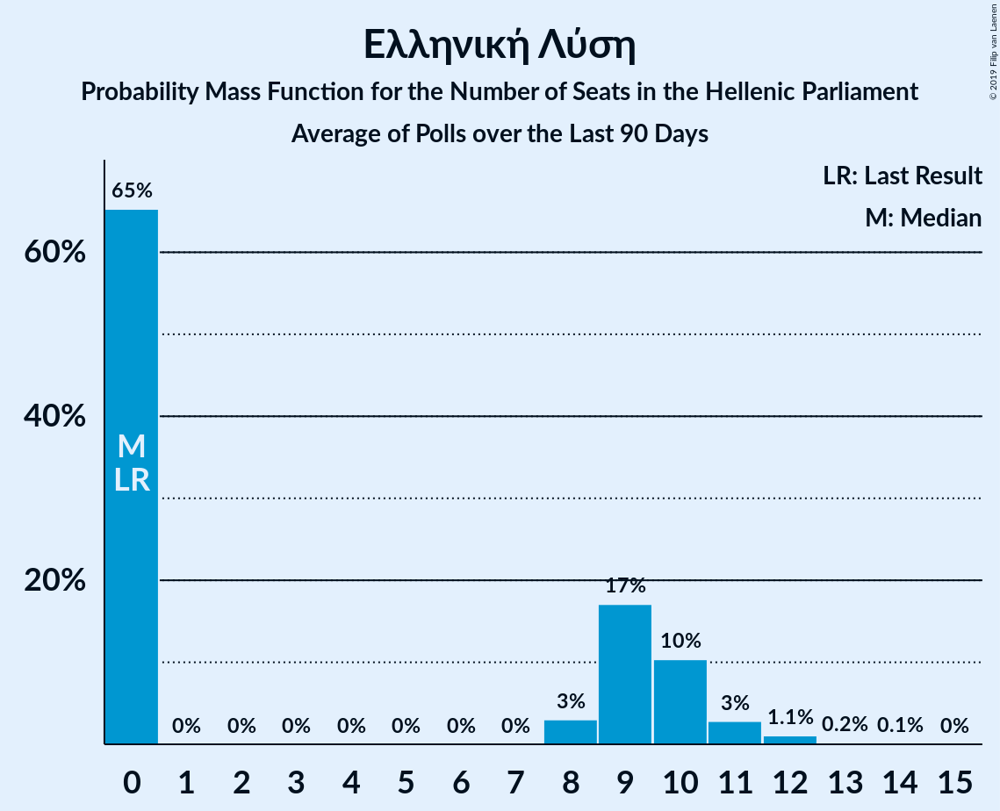

# Ελληνική Λύση

<a href="#voting-intentions">Voting Intentions</a> | <a href="#seats">Seats</a>

## Voting Intentions

Last result: **3.7%** (General Election of 7 July 2019)

### Confidence Intervals

| Period     | Polling firm/Commissioner(s) | Median | 80% Confidence Interval | 90% Confidence Interval | 95% Confidence Interval | 99% Confidence Interval |
|:----------:|:----------------:|:-----------:|:-----------------------:|:-----------------------:|:-----------------------:|:-----------------------:|
| N/A | [Poll Average](average.html) | 4.0% | 3.2–4.9% | 2.9–5.2% | 2.8–5.5% | 2.4–6.1% |
| [14–19 May 2023](2023-05-19-PulseRC.html) | Pulse RC   ΣΚΑΪ | 4.0% | 3.4–4.8% | 3.2–5.0% | 3.1–5.2% | 2.8–5.5% |
| [16–19 May 2023](2023-05-19-MRB.html) | MRB   Open TV | 3.7% | 3.1–4.6% | 2.9–4.8% | 2.8–5.0% | 2.5–5.5% |
| [15–18 May 2023](2023-05-18-Rass.html) | Rass   iefimerida | 3.4% | 2.9–4.2% | 2.7–4.4% | 2.5–4.6% | 2.3–5.0% |
| [16–18 May 2023](2023-05-18-Marc.html) | Marc   ΑΝΤ1 | 3.8% | 3.2–4.6% | 3.0–4.8% | 2.9–5.0% | 2.6–5.4% |
| [13–17 May 2023](2023-05-17-PalmosAnalysis.html) | Palmos Analysis   Tvxs.gr | 3.7% | 3.1–4.4% | 2.9–4.6% | 2.8–4.8% | 2.5–5.2% |
| [12–17 May 2023](2023-05-17-MetronAnalysis.html) | Metron Analysis   Mega TV | 4.6% | 4.0–5.4% | 3.8–5.6% | 3.6–5.8% | 3.4–6.2% |
| [12–17 May 2023](2023-05-17-Interview.html) | Interview   Politic.gr | 3.9% | 3.4–4.5% | 3.3–4.6% | 3.2–4.8% | 3.0–5.0% |
| [15–17 May 2023](2023-05-17-GPO.html) | GPO   Παραπολιτικά | 3.9% | 3.3–4.7% | 3.1–5.0% | 3.0–5.2% | 2.7–5.6% |
| [11–16 May 2023](2023-05-16-Alco.html) | Alco   Alpha TV | 4.2% | 3.5–5.0% | 3.3–5.2% | 3.2–5.5% | 2.9–5.9% |
| [28–11 May 2023](2023-05-11-Prorata.html) | Prorata   Η Εφημερίδα των Συντακτών | 3.3% | 2.7–4.1% | 2.5–4.4% | 2.4–4.6% | 2.1–5.0% |
| [4–11 May 2023](2023-05-11-MetronAnalysis.html) | Metron Analysis   Mega TV | 3.3% | N/A | N/A | N/A | N/A |
| [9–11 May 2023](2023-05-11-Marc.html) | Marc   Πρώτο ΘΕΜΑ | 3.8% | N/A | N/A | N/A | N/A |
| [10–11 May 2023](2023-05-11-GPO.html) | GPO   Παραπολιτικά | 3.7% | N/A | N/A | N/A | N/A |
| [5 May 2022–9 May 2023](2023-05-09-ΚάπαResearch.html) | Κάπα Research | 4.4% | N/A | N/A | N/A | N/A |
| [5–9 May 2023](2023-05-09-Marc.html) | Marc   ΑΝΤ1 | 3.8% | N/A | N/A | N/A | N/A |
| [4–7 May 2023](2023-05-07-PulseRC.html) | Pulse RC   ΣΚΑΪ | 3.5% | N/A | N/A | N/A | N/A |
| [3–6 May 2023](2023-05-06-Alco.html) | Alco   Alpha TV | 4.3% | N/A | N/A | N/A | N/A |
| [25 April–5 May 2023](2023-05-05-MetronAnalysis.html) | Metron Analysis   Mega TV | 3.1% | 2.5–3.8% | 2.4–4.0% | 2.3–4.2% | 2.0–4.5% |
| [2–3 May 2023](2023-05-03-GPO.html) | GPO   Τα Νέα | 3.5% | N/A | N/A | N/A | N/A |
| [27–30 April 2023](2023-04-30-Prorata.html) | Prorata   Attica TV | 3.4% | 2.8–4.2% | 2.6–4.4% | 2.5–4.6% | 2.2–5.0% |
| [27–30 April 2023](2023-04-30-Interview.html) | Interview   Politic.gr | 4.2% | 3.7–4.9% | 3.5–5.1% | 3.4–5.3% | 3.1–5.6% |
| [24–26 April 2023](2023-04-26-MRB.html) | MRB   Open TV | 3.4% | 2.8–4.3% | 2.6–4.5% | 2.4–4.7% | 2.2–5.2% |
| [19–23 April 2023](2023-04-23-PulseRC.html) | Pulse RC   ΣΚΑΪ | 4.1% | 3.4–5.0% | 3.2–5.2% | 3.0–5.5% | 2.7–5.9% |
| [18–22 April 2023](2023-04-22-Alco.html) | Alco   Alpha TV | 4.4% | 3.7–5.3% | 3.5–5.6% | 3.3–5.9% | 3.0–6.4% |
| [18–21 April 2023](2023-04-21-OpinionPoll.html) | Opinion Poll   The TOC | 4.8% | 4.0–5.8% | 3.8–6.1% | 3.6–6.3% | 3.3–6.8% |
| [19–20 April 2023](2023-04-20-MetronAnalysis.html) | Metron Analysis   Το Βήμα | 4.9% | 4.1–5.9% | 3.9–6.1% | 3.7–6.4% | 3.4–6.9% |
| [3–5 April 2023](2023-04-05-GPO.html) | GPO   Παραπολιτικά | 4.1% | 3.4–5.0% | 3.2–5.3% | 3.0–5.5% | 2.7–6.0% |
| [30 March–3 April 2023](2023-04-03-PulseRC.html) | Pulse RC   ΣΚΑΪ | 4.2% | 3.5–5.0% | 3.3–5.3% | 3.1–5.5% | 2.8–6.0% |
| [28 March–1 April 2023](2023-04-01-Interview.html) | Interview   Politic.gr | 4.5% | 3.9–5.3% | 3.7–5.5% | 3.6–5.7% | 3.3–6.1% |
| [27–31 March 2023](2023-03-31-Rass.html) | Rass   Action 24 | 5.6% | 4.8–6.6% | 4.5–6.9% | 4.3–7.2% | 4.0–7.7% |
| [27–30 March 2023](2023-03-30-PalmosAnalysis.html) | Palmos Analysis   Tvxs.gr | 4.8% | 4.1–5.7% | 3.9–6.0% | 3.7–6.2% | 3.4–6.7% |
| [27–30 March 2023](2023-03-30-Marc.html) | Marc   Πρώτο ΘΕΜΑ | 4.4% | 3.7–5.2% | 3.5–5.5% | 3.4–5.7% | 3.1–6.1% |
| [24–28 March 2023](2023-03-28-Prorata.html) | Prorata   Η Εφημερίδα των Συντακτών | 4.2% | 3.6–5.1% | 3.4–5.4% | 3.2–5.6% | 2.9–6.1% |
| [22–28 March 2023](2023-03-28-MetronAnalysis.html) | Metron Analysis   Mega TV | 5.2% | 4.5–6.1% | 4.3–6.3% | 4.1–6.6% | 3.8–7.0% |
| [24–28 March 2023](2023-03-28-MRB.html) | MRB   Newsbomb | 5.5% | 4.7–6.5% | 4.4–6.8% | 4.3–7.1% | 3.9–7.6% |
| [24–27 March 2023](2023-03-27-Rass.html) | Rass   iefimerida | 4.1% | N/A | N/A | N/A | N/A |
| [18–21 March 2023](2023-03-21-GPO.html) | GPO   Star TV | 4.0% | 3.4–4.8% | 3.2–5.1% | 3.0–5.3% | 2.7–5.7% |
| [13–17 March 2023](2023-03-17-Alco.html) | Alco   Alpha TV | 4.4% | 3.7–5.3% | 3.5–5.6% | 3.3–5.9% | 3.0–6.3% |
| [13–15 March 2023](2023-03-15-PulseRC.html) | Pulse RC   ΣΚΑΪ | 4.2% | 3.5–5.1% | 3.3–5.3% | 3.2–5.5% | 2.9–6.0% |
| [7–13 March 2023](2023-03-13-MetronAnalysis.html) | Metron Analysis   Mega TV | 5.1% | 4.3–6.0% | 4.1–6.2% | 4.0–6.5% | 3.6–6.9% |
| [6–13 March 2023](2023-03-13-MRB.html) | MRB   Open TV | 5.4% | 4.7–6.2% | 4.5–6.5% | 4.3–6.7% | 4.0–7.1% |
| [8–11 March 2023](2023-03-11-Prorata.html) | Prorata   Attica TV | 4.1% | 3.4–5.0% | 3.2–5.2% | 3.1–5.4% | 2.8–5.9% |
| [6–9 March 2023](2023-03-09-Interview.html) | Interview   Politic.gr | 5.1% | 4.4–6.0% | 4.2–6.3% | 4.1–6.5% | 3.7–6.9% |
| [6–8 March 2023](2023-03-08-GPO.html) | GPO   Παραπολιτικά | 3.6% | 2.9–4.5% | 2.8–4.7% | 2.6–5.0% | 2.3–5.4% |
| [4–7 March 2023](2023-03-07-Marc.html) | Marc   ANT1 | 4.6% | 3.9–5.5% | 3.7–5.7% | 3.6–5.9% | 3.3–6.4% |
| [16–20 February 2023](2023-02-20-Interview.html) | Interview   Politic.gr | 4.9% | 4.3–5.7% | 4.1–5.9% | 3.9–6.1% | 3.6–6.5% |
| [14–17 February 2023](2023-02-17-OpinionPoll.html) | Opinion Poll   The TOC | 4.6% | 3.8–5.5% | 3.6–5.8% | 3.4–6.1% | 3.1–6.6% |
| [13–17 February 2023](2023-02-17-Alco.html) | Alco   Alpha TV | 4.2% | 3.5–5.1% | 3.3–5.4% | 3.1–5.6% | 2.8–6.1% |
| [7–9 February 2023](2023-02-09-GPO.html) | GPO   Παραπολιτικά | 3.4% | 2.8–4.3% | 2.6–4.5% | 2.4–4.7% | 2.2–5.2% |
| [3–8 February 2023](2023-02-08-Marc.html) | Marc   Πρώτο ΘΕΜΑ | 4.1% | 3.4–5.0% | 3.2–5.2% | 3.0–5.5% | 2.7–5.9% |
| [24–31 January 2023](2023-01-31-Marc.html) | Marc   ANT1 | 4.5% | 3.9–5.2% | 3.7–5.4% | 3.6–5.6% | 3.3–6.0% |
| [23–24 January 2023](2023-01-24-MRB.html) | MRB   Open TV | 5.2% | 4.4–6.2% | 4.2–6.5% | 4.0–6.8% | 3.6–7.3% |
| [20–24 January 2023](2023-01-24-GPO.html) | GPO   Star TV | 3.9% | 3.3–4.7% | 3.1–5.0% | 3.0–5.2% | 2.7–5.6% |
| [19–23 January 2023](2023-01-23-PulseRC.html) | Pulse RC   ΣΚΑΪ | 4.1% | 3.4–4.9% | 3.2–5.1% | 3.1–5.3% | 2.8–5.8% |
| [19–23 January 2023](2023-01-23-Prorata.html) | Prorata   Attica TV | 4.1% | 3.4–5.0% | 3.2–5.3% | 3.1–5.5% | 2.8–6.0% |
| [16–20 January 2023](2023-01-20-Rass.html) | Rass   Action 24 | 3.7% | 3.0–4.6% | 2.8–4.8% | 2.7–5.0% | 2.4–5.5% |
| [11–17 January 2023](2023-01-17-MetronAnalysis.html) | Metron Analysis   Mega TV | 4.4% | 3.8–5.3% | 3.6–5.5% | 3.4–5.7% | 3.2–6.1% |
| [12–16 January 2023](2023-01-16-Interview.html) | Interview   Politic.gr | 5.0% | 4.4–5.8% | 4.2–6.0% | 4.1–6.2% | 3.8–6.6% |
| [11–13 January 2023](2023-01-13-OpinionPoll.html) | Opinion Poll   The TOC | 4.7% | 3.9–5.7% | 3.7–5.9% | 3.5–6.2% | 3.2–6.7% |
| [9–13 January 2023](2023-01-13-Alco.html) | Alco   Alpha TV | 5.1% | 4.3–6.1% | 4.1–6.4% | 3.9–6.6% | 3.5–7.1% |
| [16–21 December 2022](2022-12-21-Marc.html) | Marc   Πρώτο ΘΕΜΑ | 4.6% | 3.8–5.5% | 3.6–5.8% | 3.4–6.1% | 3.1–6.6% |
| [18–19 December 2022](2022-12-19-PulseRC.html) | Pulse RC   ΣΚΑΪ | 4.0% | 3.3–4.9% | 3.1–5.1% | 3.0–5.3% | 2.7–5.8% |
| [15–19 December 2022](2022-12-19-Interview.html) | Interview   Politic.gr | 5.3% | 4.7–6.1% | 4.5–6.3% | 4.3–6.5% | 4.0–6.9% |
| [13–15 December 2022](2022-12-15-GPO.html) | GPO   Powergame.gr | 4.5% | 3.8–5.5% | 3.6–5.7% | 3.4–6.0% | 3.0–6.5% |
| [1–9 December 2022](2022-12-09-MRB.html) | MRB | 5.3% | 4.7–6.0% | 4.5–6.2% | 4.4–6.4% | 4.1–6.7% |
| [28 November–2 December 2022](2022-12-02-RASS.html) | RASS   Action 24 | 4.3% | 3.6–5.2% | 3.4–5.5% | 3.2–5.7% | 2.9–6.2% |
| [29 November–2 December 2022](2022-12-02-OpinionPoll.html) | Opinion Poll   Lykavitos | 4.6% | 3.9–5.5% | 3.8–5.7% | 3.6–6.0% | 3.3–6.4% |
| [24–28 November 2022](2022-11-28-GPO.html) | GPO   Star TV | 3.9% | 3.3–4.7% | 3.1–5.0% | 3.0–5.2% | 2.7–5.6% |
| [22–27 November 2022](2022-11-27-Marc.html) | Marc   ANT1 | 4.7% | 3.9–5.6% | 3.7–5.9% | 3.5–6.1% | 3.2–6.6% |
| [19–22 November 2022](2022-11-22-PulseRC.html) | Pulse RC   ΣΚΑΪ | 4.0% | 3.3–4.8% | 3.2–5.0% | 3.0–5.2% | 2.7–5.7% |
| [19–22 November 2022](2022-11-22-Prorata.html) | Prorata   Η Εφημερίδα των Συντακτών | 4.8% | 4.2–5.5% | 4.0–5.7% | 3.9–5.8% | 3.6–6.2% |
| [16–22 November 2022](2022-11-22-MetronAnalysis.html) | Metron Analysis   Mega TV | 4.3% | 3.6–5.2% | 3.4–5.5% | 3.2–5.7% | 2.9–6.2% |
| [17–21 November 2022](2022-11-21-Interview.html) | Interview   Politic.gr | 5.3% | 4.6–6.1% | 4.5–6.3% | 4.3–6.5% | 4.0–6.9% |
| [14–18 November 2022](2022-11-18-Alco.html) | Alco   Alpha TV | 5.7% | 4.9–6.8% | 4.6–7.1% | 4.4–7.3% | 4.1–7.9% |
| [8–10 November 2022](2022-11-10-GPO.html) | GPO   Παραπολιτικά | 4.2% | 3.5–5.1% | 3.3–5.4% | 3.1–5.6% | 2.8–6.1% |
| [31 October–2 November 2022](2022-11-02-MRB.html) | MRB   Open TV | 5.5% | 4.7–6.5% | 4.4–6.8% | 4.3–7.1% | 3.9–7.6% |
| [23–25 October 2022](2022-10-25-PulseRC.html) | Pulse RC   ΣΚΑΪ | 4.0% | 3.3–4.8% | 3.2–5.0% | 3.0–5.2% | 2.7–5.7% |
| [18–22 October 2022](2022-10-22-Marc.html) | Marc   ANT1 | 5.1% | 4.4–6.1% | 4.1–6.4% | 4.0–6.7% | 3.6–7.2% |
| [13–19 October 2022](2022-10-19-Interview.html) | Interview   Politic.gr | 5.5% | 4.8–6.3% | 4.6–6.6% | 4.5–6.8% | 4.2–7.2% |
| [12–15 October 2022](2022-10-15-GPO.html) | GPO   Powergame.gr | 4.4% | 3.7–5.3% | 3.6–5.5% | 3.4–5.7% | 3.1–6.2% |
| [10–14 October 2022](2022-10-14-Alco.html) | Alco   Alpha TV | 5.8% | 4.9–6.9% | 4.7–7.1% | 4.5–7.4% | 4.1–8.0% |
| [10–12 October 2022](2022-10-12-MRB.html) | MRB   Newsbomb | 5.2% | 4.4–6.2% | 4.2–6.5% | 4.0–6.8% | 3.6–7.3% |
| [22–27 September 2022](2022-09-27-Interview.html) | Interview   Politic.gr | 5.6% | 4.9–6.4% | 4.7–6.7% | 4.5–6.9% | 4.2–7.3% |
| [22–26 September 2022](2022-09-26-MetronAnalysis.html) | Metron Analysis   Mega TV | 5.9% | 5.2–6.9% | 4.9–7.1% | 4.8–7.3% | 4.4–7.8% |
| [20–24 September 2022](2022-09-24-Marc.html) | Marc   ANT1 | 4.7% | 4.0–5.6% | 3.8–5.9% | 3.6–6.1% | 3.3–6.6% |
| [20–23 September 2022](2022-09-23-PalmosAnalysis.html) | Palmos Analysis   The Caller | 4.8% | 4.0–5.7% | 3.8–6.0% | 3.6–6.3% | 3.3–6.8% |
| [19–23 September 2022](2022-09-23-Alco.html) | Alco   Alpha TV | 5.0% | 4.2–6.0% | 4.0–6.3% | 3.8–6.5% | 3.5–7.0% |
| [19–21 September 2022](2022-09-21-MRB.html) | MRB   Open TV | 5.0% | 4.2–6.0% | 4.0–6.3% | 3.8–6.5% | 3.5–7.1% |
| [18–20 September 2022](2022-09-20-PulseRC.html) | Pulse RC   ΣΚΑΪ | 4.0% | 3.3–4.9% | 3.1–5.1% | 2.9–5.3% | 2.6–5.8% |
| [12–15 September 2022](2022-09-15-PulseRC.html) | Pulse RC   ΣΚΑΪ | 4.5% | N/A | N/A | N/A | N/A |
| [12–14 September 2022](2022-09-14-OpinionPoll.html) | Opinion Poll   Mononews | 5.7% | 4.8–6.7% | 4.6–7.0% | 4.4–7.3% | 4.0–7.8% |
| [12–14 September 2022](2022-09-14-GPO.html) | GPO   Παραπολιτικά | 4.6% | 3.9–5.6% | 3.6–5.9% | 3.5–6.1% | 3.1–6.6% |
| [8–9 September 2022](2022-09-09-PulseRC.html) | Pulse RC   ΣΚΑΪ | 4.0% | N/A | N/A | N/A | N/A |
| [2–5 September 2022](2022-09-05-Prorata.html) | Prorata   Η Εφημερίδα των Συντακτών | 4.2% | 3.4–5.1% | 3.2–5.3% | 3.1–5.6% | 2.8–6.1% |
| [31 August–5 September 2022](2022-09-05-MRB.html) | MRB   Newsbomb | 5.4% | N/A | N/A | N/A | N/A |
| [29–31 August 2022](2022-08-31-MetronAnalysis.html) | Metron Analysis   Mega TV | 4.2% | 3.5–5.1% | 3.3–5.4% | 3.1–5.6% | 2.8–6.1% |
| [23–29 August 2022](2022-08-29-Interview.html) | Interview   Politic.gr | 6.0% | 5.3–6.8% | 5.1–7.1% | 4.9–7.3% | 4.6–7.7% |
| [22–25 August 2022](2022-08-25-Marc.html) | Marc   Πρώτο ΘΕΜΑ | 5.7% | 4.8–6.8% | 4.6–7.1% | 4.4–7.3% | 4.0–7.8% |
| [22–24 August 2022](2022-08-24-GPO.html) | GPO   Τα Νέα | 5.5% | 4.7–6.5% | 4.4–6.8% | 4.3–7.1% | 3.9–7.6% |
| [21–24 July 2022](2022-07-24-Prorata.html) | Prorata   Η Εφημερίδα των Συντακτών | 4.0% | 3.4–4.8% | 3.2–5.0% | 3.1–5.2% | 2.8–5.6% |
| [16–20 July 2022](2022-07-20-Marc.html) | Marc   Πρώτο ΘΕΜΑ | 5.5% | 4.6–6.5% | 4.4–6.8% | 4.2–7.0% | 3.8–7.6% |
| [12–15 July 2022](2022-07-15-OpinionPoll.html) | Opinion Poll   tomanifesto.gr | 5.6% | 4.8–6.7% | 4.6–7.0% | 4.4–7.2% | 4.0–7.7% |
| [11–13 July 2022](2022-07-13-PulseRC.html) | Pulse RC   ΣΚΑΪ | 4.0% | 3.4–4.8% | 3.2–5.0% | 3.1–5.2% | 2.8–5.6% |
| [4–6 July 2022](2022-07-06-Interview.html) | Interview   Politic.gr | 5.6% | 4.8–6.5% | 4.6–6.8% | 4.5–7.0% | 4.1–7.4% |
| [27 June–4 July 2022](2022-07-04-Alco.html) | Alco   Open TV | 5.9% | 5.2–6.8% | 5.0–7.1% | 4.8–7.3% | 4.5–7.7% |
| [28 June–1 July 2022](2022-07-01-GPO.html) | GPO   Powergame.gr | 5.3% | 4.6–6.3% | 4.4–6.5% | 4.2–6.8% | 3.9–7.2% |
| [22–30 June 2022](2022-06-30-MRB.html) | MRB | 5.2% | 4.6–5.9% | 4.5–6.1% | 4.3–6.3% | 4.0–6.6% |
| [22–25 June 2022](2022-06-25-Marc.html) | Marc   ANT1 | 5.3% | 4.5–6.3% | 4.3–6.6% | 4.1–6.8% | 3.7–7.3% |
| [6–8 June 2022](2022-06-08-PulseRC.html) | Pulse RC   ΣΚΑΪ | 4.5% | 3.8–5.3% | 3.6–5.6% | 3.4–5.8% | 3.1–6.2% |
| [27 May–1 June 2022](2022-06-01-ΚάπαResearch.html) | Κάπα Research | 4.7% | 3.9–5.7% | 3.7–5.9% | 3.5–6.2% | 3.2–6.7% |
| [30 May–1 June 2022](2022-06-01-Prorata.html) | Prorata   Η Εφημερίδα των Συντακτών | 4.1% | 3.4–5.0% | 3.2–5.3% | 3.1–5.5% | 2.8–5.9% |
| [24–31 May 2022](2022-05-31-Interview.html) | Interview   Politic.gr | 5.9% | 5.2–6.8% | 5.0–7.0% | 4.8–7.3% | 4.5–7.7% |
| [23–28 May 2022](2022-05-28-Alco.html) | Alco   Open TV | 5.2% | 4.4–6.2% | 4.2–6.5% | 4.0–6.8% | 3.6–7.3% |
| [16–23 May 2022](2022-05-23-MetronAnalysis.html) | Metron Analysis   Mega TV | 5.2% | 4.5–6.1% | 4.3–6.4% | 4.1–6.6% | 3.8–7.0% |
| [18–22 May 2022](2022-05-22-Marc.html) | Marc   ANT1 | 5.3% | 4.5–6.3% | 4.3–6.6% | 4.1–6.8% | 3.7–7.4% |
| [16–18 May 2022](2022-05-18-MRB.html) | MRB   Newsbomb | 5.5% | 4.6–6.5% | 4.4–6.8% | 4.2–7.1% | 3.9–7.6% |
| [16–18 May 2022](2022-05-18-GPO.html) | GPO   Τα Νέα | 5.2% | 4.4–6.2% | 4.2–6.5% | 4.0–6.8% | 3.6–7.3% |
| [11–13 May 2022](2022-05-13-OpinionPoll.html) | Opinion Poll   tomanifesto.gr | 6.3% | 5.4–7.4% | 5.2–7.7% | 4.9–8.0% | 4.6–8.5% |
| [9–11 May 2022](2022-05-11-PulseRC.html) | Pulse RC   ΣΚΑΪ | 4.5% | 3.8–5.3% | 3.6–5.6% | 3.4–5.8% | 3.1–6.2% |
| [7–11 May 2022](2022-05-11-Marc.html) | Marc   Πρώτο ΘΕΜΑ | 5.1% | 4.3–6.1% | 4.1–6.4% | 3.9–6.7% | 3.6–7.2% |
| [4–9 May 2022](2022-05-09-Interview.html) | Interview   Politic.gr | 6.2% | 5.5–7.1% | 5.2–7.3% | 5.1–7.5% | 4.7–8.0% |
| [4–7 May 2022](2022-05-07-GPO.html) | GPO   Powergame.gr | 5.4% | N/A | N/A | N/A | N/A |
| [26–30 April 2022](2022-04-30-Alco.html) | Alco   Open TV | 5.7% | 4.9–6.8% | 4.6–7.1% | 4.4–7.3% | 4.1–7.9% |
| [28 March–15 April 2022](2022-04-15-DATARC.html) | DATA RC   Πελοπόννησος & Dnews | 4.5% | 3.7–5.4% | 3.6–5.7% | 3.4–5.9% | 3.0–6.4% |
| [8–11 April 2022](2022-04-11-Prorata.html) | Prorata   Η Εφημερίδα των Συντακτών | 4.1% | 3.5–5.0% | 3.3–5.2% | 3.2–5.4% | 2.9–5.8% |
| [30 March–5 April 2022](2022-04-05-Interview.html) | Interview   Politic.gr | 5.6% | 4.9–6.5% | 4.7–6.7% | 4.5–6.9% | 4.2–7.4% |
| [30 March–1 April 2022](2022-04-01-OpinionPoll.html) | Opinion Poll   Mononews | 5.7% | 4.8–6.8% | 4.6–7.1% | 4.4–7.3% | 4.0–7.8% |
| [27–29 March 2022](2022-03-29-PulseRC.html) | Pulse RC   ΣΚΑΪ | 4.6% | 3.9–5.5% | 3.7–5.8% | 3.6–6.0% | 3.3–6.4% |
| [18–26 March 2022](2022-03-26-MRB.html) | MRB   Newsbomb | 6.0% | 5.1–7.1% | 4.9–7.4% | 4.7–7.7% | 4.3–8.2% |
| [21–26 March 2022](2022-03-26-Alco.html) | Alco   Open TV | 5.2% | 4.4–6.2% | 4.2–6.5% | 4.0–6.8% | 3.6–7.3% |
| [16–21 March 2022](2022-03-21-MetronAnalysis.html) | Metron Analysis   Mega TV | 5.9% | 5.1–6.8% | 4.9–7.1% | 4.7–7.3% | 4.4–7.8% |
| [16–21 March 2022](2022-03-21-Marc.html) | Marc   ANT1 | 5.4% | 4.6–6.4% | 4.4–6.7% | 4.2–7.0% | 3.9–7.5% |
| [11–14 March 2022](2022-03-14-Prorata.html) | Prorata   Η Εφημερίδα των Συντακτών | 4.1% | 3.4–5.0% | 3.2–5.3% | 3.0–5.5% | 2.7–6.0% |
| [9–11 March 2022](2022-03-11-GPO.html) | GPO   Powergame.gr | 4.9% | 4.1–5.9% | 3.9–6.2% | 3.7–6.4% | 3.4–6.9% |
| [8–10 March 2022](2022-03-10-Marc.html) | Marc   Πρώτο ΘΕΜΑ | 5.4% | N/A | N/A | N/A | N/A |
| [2–8 March 2022](2022-03-08-AbacusResearch.html) | Abacus Research   Alpha TV | 4.5% | 3.7–5.4% | 3.6–5.7% | 3.4–5.9% | 3.0–6.4% |
| [2–6 March 2022](2022-03-06-Interview.html) | Interview   Politic.gr | 5.3% | 4.6–6.1% | 4.4–6.4% | 4.2–6.6% | 3.9–7.0% |
| [25–28 February 2022](2022-02-28-PulseRC.html) | Pulse RC   ΣΚΑΪ | 4.5% | 3.8–5.3% | 3.6–5.6% | 3.4–5.8% | 3.1–6.2% |
| [14–18 February 2022](2022-02-18-Alco.html) | Alco   Open TV | 4.2% | 3.5–5.1% | 3.3–5.4% | 3.1–5.6% | 2.8–6.1% |
| [10–14 February 2022](2022-02-14-Interview.html) | Interview   Politic.gr | 5.6% | 4.9–6.5% | 4.7–6.7% | 4.5–7.0% | 4.2–7.4% |
| [7–12 February 2022](2022-02-12-OpinionPoll.html) | Opinion Poll   tomanifesto.gr | 4.9% | 4.2–5.8% | 4.0–6.0% | 3.8–6.2% | 3.5–6.7% |
| [8–12 February 2022](2022-02-12-Marc.html) | Marc   ANT1 | 5.4% | 4.6–6.4% | 4.4–6.7% | 4.2–7.0% | 3.8–7.5% |
| [31 January–3 February 2022](2022-02-03-GPO.html) | GPO   Powergame.gr | 4.5% | 3.8–5.5% | 3.6–5.7% | 3.4–6.0% | 3.0–6.5% |
| [28–31 January 2022](2022-01-31-Prorata.html) | Prorata   Η Εφημερίδα των Συντακτών | 4.0% | 3.3–4.9% | 3.1–5.2% | 2.9–5.4% | 2.7–5.9% |
| [26–29 January 2022](2022-01-29-PulseRC.html) | Pulse RC   ΣΚΑΪ | 5.1% | 4.4–6.0% | 4.2–6.2% | 4.1–6.5% | 3.7–6.9% |
| [19–23 January 2022](2022-01-23-AbacusResearch.html) | Abacus Research   Alpha TV | 2.4% | 1.9–3.1% | 1.7–3.3% | 1.6–3.5% | 1.4–3.9% |
| [18–22 January 2022](2022-01-22-Marc.html) | Marc   ANT1 | 5.4% | 4.6–6.4% | 4.3–6.7% | 4.1–7.0% | 3.8–7.5% |
| [12–18 January 2022](2022-01-18-MetronAnalysis.html) | Metron Analysis   Mega TV | 5.1% | 4.4–6.0% | 4.2–6.2% | 4.1–6.5% | 3.7–6.9% |
| [14–16 January 2022](2022-01-16-Prorata.html) | Prorata   iEidiseis | 4.0% | 3.3–4.9% | 3.1–5.2% | 2.9–5.4% | 2.7–5.9% |
| [10–12 January 2022](2022-01-12-Interview.html) | Interview   Politic.gr | 5.1% | 4.4–5.9% | 4.2–6.2% | 4.1–6.4% | 3.7–6.8% |
| [13–18 December 2021](2021-12-18-Alco.html) | Alco   Open TV | 4.2% | 3.5–5.1% | 3.3–5.4% | 3.1–5.6% | 2.8–6.1% |
| [13–17 December 2021](2021-12-17-GPO.html) | GPO   Powergame.gr | 4.5% | 3.8–5.5% | 3.6–5.7% | 3.4–6.0% | 3.0–6.5% |
| [13–16 December 2021](2021-12-16-Marc.html) | Marc   Πρώτο ΘΕΜΑ | 5.4% | 4.6–6.5% | 4.4–6.8% | 4.2–7.0% | 3.8–7.6% |
| [14–15 December 2021](2021-12-15-Prorata.html) | Prorata   Η Εφημερίδα των Συντακτών | 4.0% | 3.4–4.6% | 3.3–4.8% | 3.2–5.0% | 2.9–5.3% |
| [13–15 December 2021](2021-12-15-Interview.html) | Interview   Politic.gr | 5.5% | 4.8–6.4% | 4.6–6.6% | 4.4–6.8% | 4.1–7.3% |
| [13–14 December 2021](2021-12-14-ΚάπαResearch.html) | Κάπα Research | 4.3% | 3.6–5.2% | 3.4–5.5% | 3.2–5.7% | 2.9–6.2% |
| [13–14 December 2021](2021-12-14-MRB.html) | MRB | 4.7% | 3.9–5.7% | 3.7–6.0% | 3.6–6.2% | 3.2–6.7% |
| [1–10 December 2021](2021-12-10-MRB.html) | MRB | 4.8% | N/A | N/A | N/A | N/A |
| [20–25 November 2021](2021-11-25-PulseRC.html) | Pulse RC   ΣΚΑΪ | 4.6% | 4.2–5.1% | 4.1–5.2% | 4.0–5.3% | 3.8–5.5% |
| [22–25 November 2021](2021-11-25-GPO.html) | GPO   Παραπολιτικά | 4.1% | 3.4–5.0% | 3.2–5.3% | 3.0–5.5% | 2.7–6.0% |
| [16–23 November 2021](2021-11-23-MetronAnalysis.html) | Metron Analysis   Mega TV | 5.6% | 4.9–6.4% | 4.7–6.7% | 4.5–6.9% | 4.2–7.3% |
| [15–20 November 2021](2021-11-20-Alco.html) | Alco   Open TV | 4.9% | 4.1–5.9% | 3.9–6.2% | 3.7–6.4% | 3.4–6.9% |
| [14–18 November 2021](2021-11-18-Marc.html) | Marc   Πρώτο ΘΕΜΑ | 5.5% | 4.7–6.5% | 4.4–6.8% | 4.2–7.1% | 3.9–7.6% |
| [12–17 November 2021](2021-11-17-MRB.html) | MRB   Star | 5.1% | 4.6–5.6% | 4.5–5.8% | 4.4–5.9% | 4.2–6.2% |
| [8–13 November 2021](2021-11-13-Marc.html) | Marc   ANT1 | 5.3% | N/A | N/A | N/A | N/A |
| [1–9 November 2021](2021-11-09-MetronAnalysis.html) | Metron Analysis   Το Βήμα | 5.7% | N/A | N/A | N/A | N/A |
| [3–8 November 2021](2021-11-08-Interview.html) | Interview   Politic.gr | 5.9% | 5.2–6.7% | 5.0–6.9% | 4.9–7.1% | 4.6–7.5% |
| [27–29 October 2021](2021-10-29-GPO.html) | GPO   Powergame.gr | 4.1% | 3.4–5.0% | 3.2–5.3% | 3.0–5.5% | 2.7–6.0% |
| [22–25 October 2021](2021-10-25-PulseRC.html) | Pulse RC   ΣΚΑΪ | 4.1% | N/A | N/A | N/A | N/A |
| [13–19 October 2021](2021-10-19-OpinionPoll.html) | Opinion Poll   Mononews | 5.0% | 4.2–6.0% | 4.0–6.2% | 3.8–6.5% | 3.4–7.0% |
| [11–16 October 2021](2021-10-16-Alco.html) | Alco   Open TV | 5.0% | N/A | N/A | N/A | N/A |
| [11–14 October 2021](2021-10-14-Interview.html) | Interview   Political | 5.4% | N/A | N/A | N/A | N/A |
| [5–12 October 2021](2021-10-12-Prorata.html) | Prorata   Η Εφημερίδα των Συντακτών | 3.6% | 3.0–4.5% | 2.8–4.7% | 2.7–4.9% | 2.4–5.3% |
| [6–11 October 2021](2021-10-11-Marc.html) | Marc   ANT1 | 5.4% | N/A | N/A | N/A | N/A |
| [27–30 September 2021](2021-09-30-Interview.html) | Interview   Politic.gr | 4.8% | N/A | N/A | N/A | N/A |
| [21–27 September 2021](2021-09-27-MetronAnalysis.html) | Metron Analysis   Mega TV | 5.3% | N/A | N/A | N/A | N/A |
| [20–24 September 2021](2021-09-24-GPO.html) | GPO   Powergame.gr | 4.0% | N/A | N/A | N/A | N/A |
| [19–23 September 2021](2021-09-23-Marc.html) | Marc   Πρώτο ΘΕΜΑ | 5.5% | N/A | N/A | N/A | N/A |
| [19–21 September 2021](2021-09-21-PulseRC.html) | Pulse RC   ΣΚΑΪ | 5.2% | N/A | N/A | N/A | N/A |
| [20–21 September 2021](2021-09-21-MRB.html) | MRB   Star | 4.6% | 3.9–5.6% | 3.6–5.9% | 3.5–6.1% | 3.1–6.6% |
| [13–17 September 2021](2021-09-17-Alco.html) | Alco   Open TV | 5.3% | N/A | N/A | N/A | N/A |
| [13–15 September 2021](2021-09-15-MRB.html) | MRB   Star | 4.4% | N/A | N/A | N/A | N/A |
| [13–15 September 2021](2021-09-15-GPO.html) | GPO   Παραπολιτικά | 4.2% | N/A | N/A | N/A | N/A |
| [2–7 September 2021](2021-09-07-OpinionPoll.html) | Opinion Poll   Political | 4.5% | N/A | N/A | N/A | N/A |
| [23–27 August 2021](2021-08-27-Interview.html) | Interview   Politic.gr | 5.1% | N/A | N/A | N/A | N/A |
| [20–25 August 2021](2021-08-25-GPO.html) | GPO   Τα Νέα | 4.8% | N/A | N/A | N/A | N/A |
| [23–24 August 2021](2021-08-24-Prorata.html) | Prorata   iEidiseis | 4.2% | N/A | N/A | N/A | N/A |
| [12–17 July 2021](2021-07-17-Alco.html) | Alco   Open TV | 5.2% | 4.4–6.2% | 4.2–6.5% | 4.0–6.8% | 3.6–7.3% |
| [9–12 July 2021](2021-07-12-Interview.html) | Interview   Βεργίνα TV | 6.9% | 6.0–8.0% | 5.7–8.4% | 5.5–8.7% | 5.1–9.2% |
| [7–11 July 2021](2021-07-11-Prorata.html) | Prorata | 3.6% | 3.1–4.2% | 2.9–4.4% | 2.8–4.6% | 2.6–4.9% |
| [7–11 July 2021](2021-07-11-GPO.html) | GPO   ANT1 | 4.3% | 3.6–5.2% | 3.4–5.5% | 3.2–5.7% | 2.9–6.2% |
| [7–10 July 2021](2021-07-10-GPO.html) | GPO   Powergame.gr | 4.3% | N/A | N/A | N/A | N/A |
| [27 June–7 July 2021](2021-07-07-PulseRC.html) | Pulse RC   ΣΚΑΪ | 5.2% | 4.5–6.1% | 4.3–6.3% | 4.1–6.6% | 3.8–7.0% |
| [30 June–7 July 2021](2021-07-07-OpinionPoll.html) | Opinion Poll   tomanifesto.gr | 4.3% | 3.7–5.1% | 3.5–5.3% | 3.3–5.5% | 3.0–6.0% |
| [4–7 July 2021](2021-07-07-MRB.html) | MRB   Star | 4.2% | 3.5–5.1% | 3.3–5.4% | 3.1–5.6% | 2.8–6.1% |
| [1–2 July 2021](2021-07-02-GPO.html) | GPO   Τα Νέα | 4.8% | 4.0–5.8% | 3.8–6.1% | 3.6–6.3% | 3.3–6.8% |
| [23 June–1 July 2021](2021-07-01-MRB.html) | MRB | 4.2% | N/A | N/A | N/A | N/A |
| [26–29 June 2021](2021-06-29-GPO.html) | GPO   Τα Νέα | 4.8% | N/A | N/A | N/A | N/A |
| [20–25 June 2021](2021-06-25-Marc.html) | Marc   Πρώτο ΘΕΜΑ | 4.5% | 3.8–5.5% | 3.6–5.7% | 3.4–6.0% | 3.0–6.5% |
| [18–24 June 2021](2021-06-24-Marc.html) | Marc   Πρώτο ΘΕΜΑ | 4.3% | N/A | N/A | N/A | N/A |
| [17–23 June 2021](2021-06-23-Interview.html) | Interview   Βεργίνα TV | 5.2% | 4.4–6.1% | 4.2–6.4% | 4.0–6.7% | 3.7–7.1% |
| [15–19 June 2021](2021-06-19-Alco.html) | Alco   Open TV | 4.7% | 3.9–5.7% | 3.7–6.0% | 3.6–6.2% | 3.2–6.7% |
| [4–7 June 2021](2021-06-07-GPO.html) | GPO   ANT1 | 4.1% | 3.4–5.0% | 3.2–5.3% | 3.0–5.5% | 2.7–6.0% |
| [3–5 June 2021](2021-06-05-GPO.html) | GPO   Powergame.gr | 4.1% | N/A | N/A | N/A | N/A |
| [31 May–2 June 2021](2021-06-02-PulseRC.html) | Pulse RC   ΣΚΑΪ | 4.6% | 3.7–5.2% | 3.5–5.4% | 3.4–5.6% | 3.1–6.1% |
| [27–30 May 2021](2021-05-30-OpinionPoll.html) | Opinion Poll | 5.2% | 4.5–6.0% | 4.4–6.2% | 4.2–6.4% | 3.9–6.8% |
| [18–28 May 2021](2021-05-28-OpinionPoll.html) | Opinion Poll | 5.2% | N/A | N/A | N/A | N/A |
| [18–24 May 2021](2021-05-24-MetronAnalysis.html) | Metron Analysis   Mega TV | 5.1% | 4.3–6.1% | 4.1–6.4% | 3.9–6.6% | 3.6–7.2% |
| [17–21 May 2021](2021-05-21-Alco.html) | Alco   Open TV | 4.7% | 4.1–5.9% | 3.9–6.2% | 3.7–6.4% | 3.4–6.9% |
| [11–17 May 2021](2021-05-17-Interview.html) | Interview   Βεργίνα TV | 5.8% | 5.0–6.9% | 4.7–7.2% | 4.5–7.4% | 4.1–8.0% |
| [5–7 May 2021](2021-05-07-GPO.html) | GPO   Powergame.gr | 4.6% | 3.9–5.6% | 3.6–5.9% | 3.5–6.1% | 3.1–6.6% |
| [27–29 April 2021](2021-04-29-Marc.html) | Marc   Πρώτο ΘΕΜΑ | 5.3% | 4.5–6.3% | 4.3–6.6% | 4.1–6.9% | 3.7–7.4% |
| [22–27 April 2021](2021-04-27-Marc.html) | Marc   Πρώτο ΘΕΜΑ | 5.3% | N/A | N/A | N/A | N/A |
| [23–25 April 2021](2021-04-25-PulseRC.html) | Pulse RC   ΣΚΑΪ | 4.6% | 4.2–6.0% | 4.0–6.3% | 3.8–6.5% | 3.5–7.1% |
| [21–24 April 2021](2021-04-24-OpinionPoll.html) | Opinion Poll | 5.2% | 4.4–6.2% | 4.2–6.5% | 4.0–6.8% | 3.6–7.3% |
| [19–23 April 2021](2021-04-23-OpinionPoll.html) | Opinion Poll | 5.2% | N/A | N/A | N/A | N/A |
| [19–22 April 2021](2021-04-22-Interview.html) | Interview   Politic.gr | 5.5% | 4.7–6.4% | 4.5–6.7% | 4.3–7.0% | 3.9–7.5% |
| [13–19 April 2021](2021-04-19-Interview.html) | Interview   Βεργίνα TV | 5.9% | 5.1–6.9% | 4.9–7.2% | 4.7–7.5% | 4.3–8.0% |
| [12–16 April 2021](2021-04-16-Alco.html) | Alco   Open TV | 4.9% | 4.1–5.9% | 3.9–6.2% | 3.7–6.4% | 3.4–6.9% |
| [10–12 April 2021](2021-04-12-GPO.html) | GPO   powergame.gr | 4.7% | 3.9–5.7% | 3.7–6.0% | 3.6–6.2% | 3.2–6.7% |
| [8–9 April 2021](2021-04-09-Prorata.html) | Prorata   Η Εφημερίδα των Συντακτών | 3.8% | 3.1–4.7% | 2.9–5.0% | 2.8–5.2% | 2.5–5.6% |
| [6–9 April 2021](2021-04-09-GPO.html) | GPO   Powergame.gr | 4.7% | N/A | N/A | N/A | N/A |
| [31 March–6 April 2021](2021-04-06-Prorata.html) | Prorata   Η Εφημερίδα των Συντακτών | 3.8% | N/A | N/A | N/A | N/A |
| [26–28 March 2021](2021-03-28-PulseRC.html) | Pulse RC   ΣΚΑΪ | 5.3% | 4.3–5.8% | 4.1–6.1% | 3.9–6.3% | 3.6–6.7% |
| [17–23 March 2021](2021-03-23-MetronAnalysis.html) | Metron Analysis   Mega | 5.8% | 5.0–6.9% | 4.7–7.2% | 4.5–7.4% | 4.1–8.0% |
| [16–22 March 2021](2021-03-22-MetronAnalysis.html) | Metron Analysis   Mega TV | 5.8% | N/A | N/A | N/A | N/A |
| [19–22 March 2021](2021-03-22-Marc.html) | Marc   Alpha TV | 5.3% | 4.5–6.3% | 4.3–6.6% | 4.1–6.9% | 3.7–7.4% |
| [17–22 March 2021](2021-03-22-Interview.html) | Interview   Βεργίνα TV | 5.9% | 5.0–7.0% | 4.8–7.3% | 4.6–7.5% | 4.2–8.1% |
| [14–18 March 2021](2021-03-18-Alco.html) | Alco   Open TV | 4.9% | 4.1–5.9% | 3.9–6.2% | 3.7–6.4% | 3.4–6.9% |
| [12–17 March 2021](2021-03-17-Alco.html) | Alco   Open TV | 4.9% | N/A | N/A | N/A | N/A |
| [3–5 March 2021](2021-03-05-GPO.html) | GPO   Powergame.gr | 4.9% | 4.1–5.9% | 3.9–6.2% | 3.7–6.4% | 3.4–6.9% |
| [1–3 March 2021](2021-03-03-MRB.html) | MRB   Star | 5.7% | 4.9–6.8% | 4.6–7.1% | 4.4–7.3% | 4.1–7.9% |
| [1–3 March 2021](2021-03-03-GPO.html) | GPO   Τα Νέα | 4.9% | N/A | N/A | N/A | N/A |
| [26–28 February 2021](2021-02-28-PulseRC.html) | Pulse RC   ΣΚΑΪ | 5.2% | 4.3–5.8% | 4.1–6.1% | 3.9–6.3% | 3.6–6.7% |
| [22–27 February 2021](2021-02-27-MetronAnalysis.html) | Metron Analysis   Mega | 4.2% | 3.6–5.1% | 3.4–5.3% | 3.2–5.5% | 2.9–6.0% |
| [23–26 February 2021](2021-02-26-Prorata.html) | Prorata   Η Εφημερίδα των Συντακτών | 3.0% | 2.4–3.8% | 2.2–4.1% | 2.1–4.3% | 1.9–4.7% |
| [22–26 February 2021](2021-02-26-OpinionPoll.html) | Opinion Poll   Political | 5.2% | 4.4–6.2% | 4.2–6.5% | 4.0–6.8% | 3.6–7.3% |
| [20–24 February 2021](2021-02-24-ΚάπαResearch.html) | Κάπα Research | 4.4% | 3.9–5.0% | 3.7–5.2% | 3.6–5.4% | 3.4–5.7% |
| [14–22 February 2021](2021-02-22-Prorata.html) | Prorata   Η Εφημερίδα των Συντακτών | 3.2% | N/A | N/A | N/A | N/A |
| [15–19 February 2021](2021-02-19-OpinionPoll.html) | Opinion Poll | 5.5% | 4.7–6.5% | 4.4–6.8% | 4.2–7.1% | 3.9–7.6% |
| [15–18 February 2021](2021-02-18-Alco.html) | Alco   Open TV | 5.2% | 4.4–6.2% | 4.2–6.5% | 4.0–6.8% | 3.6–7.3% |
| [15–17 February 2021](2021-02-17-Interview.html) | Interview   Βεργίνα TV | 5.7% | 4.9–6.8% | 4.6–7.1% | 4.4–7.3% | 4.1–7.9% |
| [25–27 January 2021](2021-01-27-PulseRC.html) | Pulse RC   ΣΚΑΪ | 5.2% | 4.4–5.7% | 4.2–5.9% | 4.0–6.1% | 3.8–6.5% |
| [19–25 January 2021](2021-01-25-MetronAnalysis.html) | Metron Analysis   Mega TV | 4.6% | 3.9–5.5% | 3.7–5.7% | 3.5–5.9% | 3.2–6.4% |
| [19–22 January 2021](2021-01-22-GPO.html) | GPO   Παραπολιτικά | 4.7% | 3.9–5.7% | 3.7–6.0% | 3.6–6.2% | 3.2–6.7% |
| [19–20 January 2021](2021-01-20-GPO.html) | GPO   Παραπολιτικά | 4.7% | N/A | N/A | N/A | N/A |
| [14–19 January 2021](2021-01-19-Alco.html) | Alco   Open TV | 4.6% | 3.9–5.6% | 3.6–5.9% | 3.5–6.1% | 3.1–6.6% |
| [7–16 January 2021](2021-01-16-ToThePoint.html) | To The Point   Voria.gr | 5.5% | 4.6–6.6% | 4.4–6.9% | 4.2–7.2% | 3.8–7.8% |
| [7–11 January 2021](2021-01-11-Marc.html) | Marc   Αlpha TV | 4.8% | 4.0–5.7% | 3.8–6.0% | 3.6–6.2% | 3.3–6.8% |
| [4–8 January 2021](2021-01-08-OpinionPoll.html) | Opinion Poll   Political | 4.0% | 3.3–4.9% | 3.1–5.2% | 2.9–5.4% | 2.6–5.9% |
| [12–16 December 2020](2020-12-16-PulseRC.html) | Pulse RC   ΣΚΑΪ | 4.6% | 4.2–5.7% | 4.0–6.0% | 3.8–6.2% | 3.5–6.6% |
| [27 November–11 December 2020](2020-12-11-MRB.html) | MRB   Star | 4.8% | 4.1–5.7% | 3.9–6.0% | 3.7–6.2% | 3.4–6.6% |
| [3–9 December 2020](2020-12-09-Alco.html) | Alco   Open TV | 4.9% | 4.1–5.9% | 3.9–6.2% | 3.7–6.4% | 3.4–6.9% |
| [3–7 December 2020](2020-12-07-Interview.html) | Interview   Political | 5.5% | 4.7–6.4% | 4.5–6.7% | 4.3–6.9% | 4.0–7.4% |
| [26 November–2 December 2020](2020-12-02-Interview.html) | Interview   Βεργίνα TV | 5.9% | 5.1–6.9% | 4.8–7.2% | 4.7–7.5% | 4.3–8.0% |
| [24–27 November 2020](2020-11-27-Prorata.html) | Prorata | 3.7% | 3.3–4.2% | 3.2–4.4% | 3.0–4.5% | 2.9–4.7% |
| [24–26 November 2020](2020-11-26-PulseRC.html) | Pulse RC   ΣΚΑΪ | 6.0% | 5.3–7.0% | 5.0–7.2% | 4.8–7.5% | 4.5–7.9% |
| [18–24 November 2020](2020-11-24-MetronAnalysis.html) | Metron Analysis   MEGA TV | 5.5% | 4.7–6.4% | 4.5–6.7% | 4.3–6.9% | 4.0–7.4% |
| [22–24 November 2020](2020-11-24-MRB.html) | MRB   Star | 5.3% | 4.5–6.3% | 4.2–6.6% | 4.1–6.8% | 3.7–7.4% |
| [17–19 November 2020](2020-11-19-ΚάπαResearch.html) | Κάπα Research | 4.2% | 3.5–5.1% | 3.3–5.3% | 3.1–5.6% | 2.8–6.0% |
| [10–13 November 2020](2020-11-13-GPO.html) | GPO   Παραπολιτικά | 4.3% | 3.6–5.2% | 3.4–5.5% | 3.2–5.7% | 2.9–6.2% |
| [4–11 November 2020](2020-11-11-OpinionPoll.html) | Opinion Poll | 4.0% | 3.3–4.9% | 3.1–5.2% | 2.9–5.4% | 2.7–5.9% |
| [6–11 November 2020](2020-11-11-Alco.html) | Alco   Open TV | 3.6% | 2.9–4.5% | 2.8–4.7% | 2.6–5.0% | 2.3–5.4% |
| [26–28 October 2020](2020-10-28-GPO.html) | GPO   Action24 | 3.7% | 3.0–4.6% | 2.9–4.8% | 2.7–5.1% | 2.4–5.5% |
| [18–22 October 2020](2020-10-22-PulseRC.html) | Pulse RC   ΣΚΑΪ | 4.9% | 4.1–5.9% | 3.9–6.2% | 3.7–6.4% | 3.4–6.9% |
| [16–21 October 2020](2020-10-21-Interview.html) | Interview   Βεργίνα TV | 5.2% | 4.5–6.2% | 4.3–6.4% | 4.1–6.7% | 3.8–7.1% |
| [11–15 October 2020](2020-10-15-OpinionPoll.html) | Opinion Poll | 4.2% | 3.5–5.1% | 3.3–5.4% | 3.1–5.6% | 2.8–6.1% |
| [10–14 October 2020](2020-10-14-Marc.html) | Marc   Αlpha TV | 4.1% | 3.4–5.0% | 3.2–5.3% | 3.0–5.5% | 2.7–6.0% |
| [6–10 October 2020](2020-10-10-Alco.html) | Alco   Open TV | 4.8% | 4.0–5.8% | 3.8–6.1% | 3.6–6.3% | 3.3–6.8% |
| [23–29 September 2020](2020-09-29-MetronAnalysis.html) | Metron Analysis   MEGA TV | 5.7% | 5.0–6.7% | 4.7–7.0% | 4.6–7.2% | 4.2–7.7% |
| [22–23 September 2020](2020-09-23-PulseRC.html) | Pulse RC   ΣΚΑΪ | 4.6% | 3.9–5.4% | 3.7–5.7% | 3.6–5.9% | 3.3–6.3% |
| [21–23 September 2020](2020-09-23-MRB.html) | MRB   Star | 5.0% | 4.2–5.9% | 4.0–6.2% | 3.8–6.5% | 3.4–7.0% |
| [21–23 September 2020](2020-09-23-Interview.html) | Interview   Βεργίνα TV | 5.2% | 4.5–6.2% | 4.2–6.4% | 4.1–6.7% | 3.7–7.2% |
| [14–16 September 2020](2020-09-16-GPO.html) | GPO   Παραπολιτικά | 3.9% | 3.2–4.8% | 3.0–5.1% | 2.9–5.3% | 2.6–5.8% |
| [14–16 September 2020](2020-09-16-Alco.html) | Alco   Open TV | 5.2% | 4.4–6.2% | 4.2–6.5% | 4.0–6.8% | 3.6–7.3% |
| [10–12 September 2020](2020-09-12-Marc.html) | Marc   Πρώτο ΘΕΜΑ | 3.7% | 3.1–4.4% | 3.0–4.6% | 2.8–4.7% | 2.6–5.1% |
| [7–10 September 2020](2020-09-10-OpinionPoll.html) | Opinion Poll | 3.8% | 3.1–4.7% | 2.9–4.9% | 2.8–5.2% | 2.5–5.6% |
| [30 August–2 September 2020](2020-09-02-GPO.html) | GPO   Τα Νέα | 4.2% | 3.5–5.1% | 3.3–5.4% | 3.1–5.6% | 2.8–6.1% |
| [13–15 July 2020](2020-07-15-Interview.html) | Interview   Βεργίνα TV | 5.2% | 4.5–6.2% | 4.2–6.4% | 4.1–6.7% | 3.7–7.2% |
| [10–13 July 2020](2020-07-13-Marc.html) | Marc   Αlpha TV | 4.1% | 3.4–5.0% | 3.2–5.3% | 3.1–5.5% | 2.8–6.0% |
| [6–8 July 2020](2020-07-08-PulseRC.html) | Pulse RC   ΣΚΑΪ | 4.0% | 3.4–4.8% | 3.2–5.0% | 3.0–5.2% | 2.8–5.6% |
| [29 June–4 July 2020](2020-07-04-Alco.html) | Alco   Open TV | 3.7% | 3.0–4.6% | 2.9–4.8% | 2.7–5.1% | 2.4–5.5% |
| [1–3 July 2020](2020-07-03-OpinionPoll.html) | Opinion Poll | 4.2% | 3.5–5.1% | 3.3–5.3% | 3.1–5.5% | 2.9–6.0% |
| [2 July 2020](2020-07-02-ΚάπαResearch.html) | Κάπα Research | 3.8% | 3.1–4.7% | 2.9–5.0% | 2.8–5.2% | 2.5–5.6% |
| [1–2 July 2020](2020-07-02-Marc.html) | Marc | 4.4% | 3.9–5.0% | 3.7–5.2% | 3.6–5.4% | 3.3–5.7% |
| [24–29 June 2020](2020-06-29-MetronAnalysis.html) | Metron Analysis   Το Βήμα | 3.9% | 3.3–4.6% | 3.1–4.9% | 3.0–5.0% | 2.7–5.4% |
| [22–26 June 2020](2020-06-26-Prorata.html) | Prorata | 3.5% | 3.0–4.1% | 2.9–4.2% | 2.8–4.4% | 2.6–4.6% |
| [22–26 June 2020](2020-06-26-GPO.html) | GPO   Τα Νέα | 5.0% | 4.3–5.8% | 4.2–6.0% | 4.0–6.2% | 3.7–6.6% |
| [17–25 June 2020](2020-06-25-MRB.html) | MRB   Star | 4.4% | 3.9–5.0% | 3.7–5.2% | 3.6–5.4% | 3.4–5.7% |
| [4–9 June 2020](2020-06-09-Interview.html) | Interview   Βεργίνα TV | 5.2% | 4.4–6.1% | 4.2–6.4% | 4.0–6.7% | 3.7–7.1% |
| [2–8 June 2020](2020-06-08-Alco.html) | Alco   Open TV | 4.2% | 3.5–5.1% | 3.3–5.4% | 3.1–5.6% | 2.8–6.1% |
| [1–3 June 2020](2020-06-03-PulseRC.html) | Pulse RC   ΣΚΑΪ | 4.0% | 3.3–4.8% | 3.2–5.0% | 3.0–5.2% | 2.7–5.7% |
| [1–3 June 2020](2020-06-03-OpinionPoll.html) | Opinion Poll   paraskhnio.gr | 4.4% | 3.7–5.4% | 3.5–5.6% | 3.4–5.9% | 3.0–6.3% |
| [22–27 May 2020](2020-05-27-MetronAnalysis.html) | Metron Analysis   MEGA TV | 3.2% | 2.6–3.9% | 2.4–4.1% | 2.3–4.3% | 2.1–4.7% |
| [22–27 May 2020](2020-05-27-GPO.html) | GPO   Παραπολιτικά | 4.8% | 4.0–5.8% | 3.8–6.1% | 3.6–6.3% | 3.3–6.8% |
| [8–13 May 2020](2020-05-13-MRB.html) | MRB   Star | 4.8% | 4.1–5.7% | 3.9–5.9% | 3.7–6.2% | 3.4–6.6% |
| [5–10 May 2020](2020-05-10-Alco.html) | Alco   Open TV | 4.4% | 3.7–5.3% | 3.5–5.6% | 3.3–5.9% | 3.0–6.4% |
| [7–9 May 2020](2020-05-09-OpinionPoll.html) | Opinion Poll | 5.0% | 4.2–6.0% | 4.0–6.2% | 3.8–6.5% | 3.5–7.0% |
| [4–6 May 2020](2020-05-06-PulseRC.html) | Pulse RC   ΣΚΑΪ | 4.5% | 3.8–5.3% | 3.6–5.6% | 3.4–5.8% | 3.1–6.2% |
| [3–6 May 2020](2020-05-06-Interview.html) | Interview   Βεργίνα TV | 5.2% | 4.4–6.1% | 4.2–6.4% | 4.0–6.6% | 3.7–7.1% |
| [24–29 April 2020](2020-04-29-Prorata.html) | Prorata | 5.0% | 4.5–5.6% | 4.3–5.8% | 4.2–5.9% | 4.0–6.2% |
| [22–28 April 2020](2020-04-28-MetronAnalysis.html) | Metron Analysis   MEGA TV | 3.4% | 2.8–4.2% | 2.7–4.4% | 2.5–4.6% | 2.3–5.0% |
| [14–22 April 2020](2020-04-22-GPO.html) | GPO   Παραπολιτικά | 4.9% | 4.1–5.9% | 3.9–6.2% | 3.7–6.4% | 3.4–6.9% |
| [15–17 April 2020](2020-04-17-ΚάπαResearch.html) | Κάπα Research   ΕΘΝΟΣ | 3.8% | 3.1–4.6% | 2.9–4.9% | 2.8–5.1% | 2.5–5.5% |
| [11–13 April 2020](2020-04-13-Marc.html) | Marc   Alpha TV | 3.7% | 3.1–4.6% | 2.9–4.9% | 2.7–5.1% | 2.4–5.5% |
| [30 March–1 April 2020](2020-04-01-PulseRC.html) | Pulse RC   ΣΚΑΪ | 5.0% | 4.3–5.9% | 4.1–6.2% | 3.9–6.4% | 3.6–6.9% |
| [23–26 March 2020](2020-03-26-OpinionPoll.html) | Opinion Poll   Πρώτο ΘΕΜΑ | 5.7% | 4.8–6.7% | 4.6–7.0% | 4.4–7.2% | 4.1–7.7% |
| [6–7 March 2020](2020-03-07-OpinionPoll.html) | Opinion Poll   Πρώτο ΘΕΜΑ | 5.7% | 4.9–6.6% | 4.7–6.9% | 4.5–7.1% | 4.1–7.6% |
| [2–7 March 2020](2020-03-07-Alco.html) | Alco   Open TV | 6.2% | 5.3–7.3% | 5.1–7.6% | 4.9–7.9% | 4.5–8.4% |
| [3–4 March 2020](2020-03-04-PulseRC.html) | Pulse RC   ΣΚΑΪ | 6.0% | 5.2–6.9% | 5.0–7.2% | 4.8–7.4% | 4.4–7.9% |
| [22–27 January 2020](2020-01-27-OpinionPoll.html) | Opinion Poll | 5.4% | 4.6–6.4% | 4.4–6.6% | 4.2–6.9% | 3.8–7.4% |
| [21–22 January 2020](2020-01-22-PulseRC.html) | Pulse RC   ΣΚΑΪ | 5.0% | 4.3–5.9% | 4.1–6.2% | 3.9–6.4% | 3.6–6.9% |
| [20–22 January 2020](2020-01-22-MetronAnalysis.html) | Metron Analysis   Το Βήμα | 5.8% | 5.0–6.8% | 4.8–7.1% | 4.6–7.3% | 4.3–7.8% |
| [13–17 January 2020](2020-01-17-MRB.html) | MRB   Star | 5.3% | 4.6–6.1% | 4.4–6.4% | 4.2–6.6% | 3.9–7.0% |
| [7–8 January 2020](2020-01-08-Interview.html) | Interview   Βεργίνα TV | 4.7% | 3.9–5.7% | 3.7–5.9% | 3.5–6.2% | 3.2–6.7% |
| [16–18 December 2019](2019-12-18-PulseRC.html) | Pulse RC   ΣΚΑΪ | 5.0% | 4.3–5.9% | 4.1–6.2% | 3.9–6.4% | 3.6–6.8% |
| [27 November–5 December 2019](2019-12-05-MRB.html) | MRB   Star | 4.8% | 4.2–5.5% | 4.1–5.7% | 3.9–5.8% | 3.7–6.2% |
| [25–28 November 2019](2019-11-28-OpinionPoll.html) | Opinion Poll | 5.4% | 4.6–6.4% | 4.4–6.7% | 4.2–6.9% | 3.8–7.4% |
| [18–20 November 2019](2019-11-20-ΜetronAnalysis.html) | Μetron Analysis   Το Βήμα | 5.1% | 4.3–6.0% | 4.1–6.2% | 4.0–6.5% | 3.6–6.9% |
| [18–20 November 2019](2019-11-20-PulseRC.html) | Pulse RC   ΣΚΑΪ | 4.6% | 3.9–5.5% | 3.7–5.7% | 3.6–6.0% | 3.3–6.4% |
| [11–14 November 2019](2019-11-14-PalmosAnalysis.html) | Palmos Analysis   GUE–NGL | 4.3% | 3.6–5.3% | 3.4–5.5% | 3.2–5.8% | 2.9–6.3% |
| [29–31 October 2019](2019-10-31-Marc.html) | Marc   Πρώτο ΘΕΜΑ | 3.4% | 2.8–4.3% | 2.6–4.5% | 2.4–4.7% | 2.2–5.2% |
| [22–23 October 2019](2019-10-23-PulseRC.html) | Pulse RC   ΣΚΑΪ | 4.0% | 3.3–4.9% | 3.1–5.1% | 3.0–5.3% | 2.7–5.8% |
| [16–18 September 2019](2019-09-18-ΜetronAnalysis.html) | Μetron Analysis   Το Βήμα | 3.9% | 3.3–4.7% | 3.1–5.0% | 2.9–5.2% | 2.7–5.6% |
| [17–18 September 2019](2019-09-18-PulseRC.html) | Pulse RC   ΣΚΑΪ | 3.5% | 2.9–4.3% | 2.7–4.6% | 2.6–4.8% | 2.3–5.2% |
| [14–16 September 2019](2019-09-16-MRB.html) | MRB   Star | 3.8% | 3.2–4.7% | 3.0–5.0% | 2.8–5.2% | 2.5–5.7% |
| [2–5 September 2019](2019-09-05-Marc.html) | Marc   Πρώτο ΘΕΜΑ | 3.3% | 2.7–4.1% | 2.5–4.4% | 2.3–4.6% | 2.1–5.0% |
| [2–4 September 2019](2019-09-04-OpinionPoll.html) | Opinion Poll | 3.7% | 3.1–4.6% | 2.9–4.8% | 2.7–5.0% | 2.5–5.5% |

### Probability Mass Function

The following table shows the probability mass function per percentage block of voting intentions for the [poll average](average.html) for Ελληνική Λύση.

| Voting Intentions | Probability | Accumulated | Special Marks |
|:-----------------:|:-----------:|:-----------:|:-------------:|
| 0.5–1.5% | 0% | 100% |  |
| 1.5–2.5% | 0.9% | 100% |  |
| 2.5–3.5% | 25% | 99.1% |  |
| 3.5–4.5% | 54% | 74% | Last Result, Median |
| 4.5–5.5% | 18% | 20% |  |
| 5.5–6.5% | 2% | 2% |  |
| 6.5–7.5% | 0.1% | 0.1% |  |
| 7.5–8.5% | 0% | 0% |  |

## Seats

Last result: **10** seats (General Election of 7 July 2019)

### Confidence Intervals

| Period     | Polling firm/Commissioner(s) | Median | 80% Confidence Interval | 90% Confidence Interval | 95% Confidence Interval | 99% Confidence Interval |
|:----------:|:----------------:|:------:|:-----------------------:|:-----------------------:|:-----------------------:|:-----------------------:|
| N/A | [Poll Average](average.html) | 11 | 9–13 | 0–14 | 0–15 | 0–16 |
| [14–19 May 2023](2023-05-19-PulseRC.html) | Pulse RC   ΣΚΑΪ | 11 | 10–13 | 9–13 | 9–14 | 0–15 |
| [16–19 May 2023](2023-05-19-MRB.html) | MRB   Open TV | 11 | 9–13 | 0–13 | 0–14 | 0–15 |
| [15–18 May 2023](2023-05-18-Rass.html) | Rass   iefimerida | 10 | 0–12 | 0–13 | 0–13 | 0–14 |
| [16–18 May 2023](2023-05-18-Marc.html) | Marc   ΑΝΤ1 | 10 | 8–12 | 0–13 | 0–13 | 0–15 |
| [13–17 May 2023](2023-05-17-PalmosAnalysis.html) | Palmos Analysis   Tvxs.gr | 10 | 9–12 | 0–13 | 0–14 | 0–15 |
| [12–17 May 2023](2023-05-17-MetronAnalysis.html) | Metron Analysis   Mega TV | 13 | 11–15 | 11–15 | 10–16 | 9–17 |
| [12–17 May 2023](2023-05-17-Interview.html) | Interview   Politic.gr | 11 | 9–12 | 9–12 | 9–13 | 0–14 |
| [15–17 May 2023](2023-05-17-GPO.html) | GPO   Παραπολιτικά | 11 | 9–14 | 8–14 | 0–14 | 0–15 |
| [11–16 May 2023](2023-05-16-Alco.html) | Alco   Alpha TV | 12 | 10–14 | 9–14 | 9–15 | 0–16 |
| [28–11 May 2023](2023-05-11-Prorata.html) | Prorata   Η Εφημερίδα των Συντακτών | 9 | 0–11 | 0–12 | 0–13 | 0–14 |
| [4–11 May 2023](2023-05-11-MetronAnalysis.html) | Metron Analysis   Mega TV |  |  |  |  |  |
| [9–11 May 2023](2023-05-11-Marc.html) | Marc   Πρώτο ΘΕΜΑ |  |  |  |  |  |
| [10–11 May 2023](2023-05-11-GPO.html) | GPO   Παραπολιτικά |  |  |  |  |  |
| [5 May 2022–9 May 2023](2023-05-09-ΚάπαResearch.html) | Κάπα Research |  |  |  |  |  |
| [5–9 May 2023](2023-05-09-Marc.html) | Marc   ΑΝΤ1 |  |  |  |  |  |
| [4–7 May 2023](2023-05-07-PulseRC.html) | Pulse RC   ΣΚΑΪ |  |  |  |  |  |
| [3–6 May 2023](2023-05-06-Alco.html) | Alco   Alpha TV |  |  |  |  |  |
| [25 April–5 May 2023](2023-05-05-MetronAnalysis.html) | Metron Analysis   Mega TV | 9 | 0–11 | 0–11 | 0–12 | 0–13 |
| [2–3 May 2023](2023-05-03-GPO.html) | GPO   Τα Νέα |  |  |  |  |  |
| [27–30 April 2023](2023-04-30-Prorata.html) | Prorata   Attica TV | 9 | 0–11 | 0–12 | 0–12 | 0–13 |
| [27–30 April 2023](2023-04-30-Interview.html) | Interview   Politic.gr | 11 | 10–13 | 9–13 | 9–14 | 8–15 |
| [24–26 April 2023](2023-04-26-MRB.html) | MRB   Open TV | 9 | 0–12 | 0–13 | 0–13 | 0–14 |
| [19–23 April 2023](2023-04-23-PulseRC.html) | Pulse RC   ΣΚΑΪ | 11 | 9–13 | 8–14 | 8–14 | 0–16 |
| [18–22 April 2023](2023-04-22-Alco.html) | Alco   Alpha TV | 12 | 10–14 | 9–15 | 9–16 | 0–17 |
| [18–21 April 2023](2023-04-21-OpinionPoll.html) | Opinion Poll   The TOC | 13 | 10–15 | 10–16 | 10–17 | 9–18 |
| [19–20 April 2023](2023-04-20-MetronAnalysis.html) | Metron Analysis   Το Βήμα | 13 | 11–15 | 10–16 | 10–17 | 9–19 |
| [3–5 April 2023](2023-04-05-GPO.html) | GPO   Παραπολιτικά | 11 | 9–13 | 9–14 | 8–15 | 0–16 |
| [30 March–3 April 2023](2023-04-03-PulseRC.html) | Pulse RC   ΣΚΑΪ | 11 | 10–13 | 9–14 | 8–15 | 0–16 |
| [28 March–1 April 2023](2023-04-01-Interview.html) | Interview   Politic.gr | 12 | 11–14 | 10–15 | 10–16 | 9–17 |
| [27–31 March 2023](2023-03-31-Rass.html) | Rass   Action 24 | 15 | 12–17 | 12–18 | 11–19 | 10–20 |
| [27–30 March 2023](2023-03-30-PalmosAnalysis.html) | Palmos Analysis   Tvxs.gr | 14 | 11–16 | 11–16 | 10–17 | 10–18 |
| [27–30 March 2023](2023-03-30-Marc.html) | Marc   Πρώτο ΘΕΜΑ | 12 | 10–13 | 9–14 | 9–15 | 8–16 |
| [24–28 March 2023](2023-03-28-Prorata.html) | Prorata   Η Εφημερίδα των Συντακτών | 12 | 10–14 | 9–15 | 9–15 | 0–16 |
| [22–28 March 2023](2023-03-28-MetronAnalysis.html) | Metron Analysis   Mega TV | 15 | 13–17 | 12–18 | 12–19 | 11–20 |
| [24–28 March 2023](2023-03-28-MRB.html) | MRB   Newsbomb | 15 | 13–18 | 13–18 | 12–19 | 11–21 |
| [24–27 March 2023](2023-03-27-Rass.html) | Rass   iefimerida |  |  |  |  |  |
| [18–21 March 2023](2023-03-21-GPO.html) | GPO   Star TV | 11 | 9–13 | 9–14 | 8–14 | 0–15 |
| [13–17 March 2023](2023-03-17-Alco.html) | Alco   Alpha TV | 13 | 10–15 | 10–16 | 9–17 | 0–18 |
| [13–15 March 2023](2023-03-15-PulseRC.html) | Pulse RC   ΣΚΑΪ | 12 | 10–14 | 9–15 | 9–15 | 0–16 |
| [7–13 March 2023](2023-03-13-MetronAnalysis.html) | Metron Analysis   Mega TV | 14 | 12–17 | 12–17 | 11–18 | 10–19 |
| [6–13 March 2023](2023-03-13-MRB.html) | MRB   Open TV | 15 | 13–17 | 12–18 | 12–19 | 11–20 |
| [8–11 March 2023](2023-03-11-Prorata.html) | Prorata   Attica TV | 12 | 10–14 | 9–15 | 8–15 | 0–16 |
| [6–9 March 2023](2023-03-09-Interview.html) | Interview   Politic.gr | 14 | 12–17 | 12–17 | 11–18 | 10–19 |
| [6–8 March 2023](2023-03-08-GPO.html) | GPO   Παραπολιτικά | 10 | 0–12 | 0–13 | 0–13 | 0–15 |
| [4–7 March 2023](2023-03-07-Marc.html) | Marc   ANT1 | 13 | 11–15 | 10–16 | 10–16 | 9–17 |
| [16–20 February 2023](2023-02-20-Interview.html) | Interview   Politic.gr | 14 | 12–16 | 11–16 | 11–17 | 10–18 |
| [14–17 February 2023](2023-02-17-OpinionPoll.html) | Opinion Poll   The TOC | 13 | 11–15 | 10–16 | 10–17 | 9–18 |
| [13–17 February 2023](2023-02-17-Alco.html) | Alco   Alpha TV | 12 | 10–14 | 9–15 | 9–16 | 0–17 |
| [7–9 February 2023](2023-02-09-GPO.html) | GPO   Παραπολιτικά | 10 | 0–12 | 0–12 | 0–13 | 0–14 |
| [3–8 February 2023](2023-02-08-Marc.html) | Marc   Πρώτο ΘΕΜΑ | 11 | 9–14 | 9–14 | 8–15 | 0–16 |
| [24–31 January 2023](2023-01-31-Marc.html) | Marc   ANT1 | 12 | 11–14 | 10–15 | 10–16 | 9–17 |
| [23–24 January 2023](2023-01-24-MRB.html) | MRB   Open TV | 14 | 12–17 | 11–18 | 11–18 | 10–20 |
| [20–24 January 2023](2023-01-24-GPO.html) | GPO   Star TV | 11 | 9–13 | 9–14 | 0–14 | 0–15 |
| [19–23 January 2023](2023-01-23-PulseRC.html) | Pulse RC   ΣΚΑΪ | 11 | 10–13 | 9–14 | 9–15 | 0–16 |
| [19–23 January 2023](2023-01-23-Prorata.html) | Prorata   Attica TV | 11 | 9–14 | 9–15 | 8–15 | 0–16 |
| [16–20 January 2023](2023-01-20-Rass.html) | Rass   Action 24 | 10 | 8–12 | 0–13 | 0–14 | 0–15 |
| [11–17 January 2023](2023-01-17-MetronAnalysis.html) | Metron Analysis   Mega TV | 12 | 10–15 | 10–15 | 10–16 | 9–17 |
| [12–16 January 2023](2023-01-16-Interview.html) | Interview   Politic.gr | 14 | 12–16 | 12–16 | 11–17 | 10–18 |
| [11–13 January 2023](2023-01-13-OpinionPoll.html) | Opinion Poll   The TOC | 13 | 11–15 | 10–16 | 10–17 | 9–18 |
| [9–13 January 2023](2023-01-13-Alco.html) | Alco   Alpha TV | 14 | 12–17 | 11–17 | 11–18 | 10–20 |
| [16–21 December 2022](2022-12-21-Marc.html) | Marc   Πρώτο ΘΕΜΑ | 13 | 10–15 | 10–16 | 9–17 | 9–18 |
| [18–19 December 2022](2022-12-19-PulseRC.html) | Pulse RC   ΣΚΑΪ | 11 | 9–13 | 9–14 | 0–15 | 0–16 |
| [15–19 December 2022](2022-12-19-Interview.html) | Interview   Politic.gr | 15 | 13–17 | 13–18 | 12–18 | 11–19 |
| [13–15 December 2022](2022-12-15-GPO.html) | GPO   Powergame.gr | 12 | 10–15 | 10–16 | 9–16 | 8–18 |
| [1–9 December 2022](2022-12-09-MRB.html) | MRB | 15 | 13–17 | 13–18 | 12–18 | 12–19 |
| [28 November–2 December 2022](2022-12-02-RASS.html) | RASS   Action 24 | 12 | 10–14 | 9–15 | 9–15 | 0–17 |
| [29 November–2 December 2022](2022-12-02-OpinionPoll.html) | Opinion Poll   Lykavitos | 13 | 11–15 | 10–16 | 10–16 | 9–17 |
| [24–28 November 2022](2022-11-28-GPO.html) | GPO   Star TV | 11 | 9–13 | 9–14 | 0–14 | 0–16 |
| [22–27 November 2022](2022-11-27-Marc.html) | Marc   ANT1 | 13 | 11–15 | 10–16 | 10–17 | 9–18 |
| [19–22 November 2022](2022-11-22-PulseRC.html) | Pulse RC   ΣΚΑΪ | 11 | 9–13 | 9–14 | 0–14 | 0–16 |
| [19–22 November 2022](2022-11-22-Prorata.html) | Prorata   Η Εφημερίδα των Συντακτών | 13 | 12–15 | 11–16 | 11–16 | 10–17 |
| [16–22 November 2022](2022-11-22-MetronAnalysis.html) | Metron Analysis   Mega TV | 12 | 10–14 | 9–15 | 9–16 | 0–17 |
| [17–21 November 2022](2022-11-21-Interview.html) | Interview   Politic.gr | 15 | 13–17 | 12–17 | 12–18 | 11–19 |
| [14–18 November 2022](2022-11-18-Alco.html) | Alco   Alpha TV | 16 | 14–19 | 13–20 | 12–20 | 11–22 |
| [8–10 November 2022](2022-11-10-GPO.html) | GPO   Παραπολιτικά | 12 | 10–14 | 9–15 | 9–15 | 0–17 |
| [31 October–2 November 2022](2022-11-02-MRB.html) | MRB   Open TV | 15 | 13–18 | 12–18 | 11–19 | 10–21 |
| [23–25 October 2022](2022-10-25-PulseRC.html) | Pulse RC   ΣΚΑΪ | 11 | 9–13 | 9–14 | 0–15 | 0–16 |
| [18–22 October 2022](2022-10-22-Marc.html) | Marc   ANT1 | 14 | 12–17 | 11–17 | 11–18 | 10–19 |
| [13–19 October 2022](2022-10-19-Interview.html) | Interview   Politic.gr | 15 | 13–17 | 13–18 | 12–19 | 12–20 |
| [12–15 October 2022](2022-10-15-GPO.html) | GPO   Powergame.gr | 12 | 10–14 | 10–15 | 9–16 | 8–17 |
| [10–14 October 2022](2022-10-14-Alco.html) | Alco   Alpha TV | 16 | 14–19 | 13–20 | 12–20 | 11–22 |
| [10–12 October 2022](2022-10-12-MRB.html) | MRB   Newsbomb | 14 | 12–17 | 11–18 | 11–19 | 10–20 |
| [22–27 September 2022](2022-09-27-Interview.html) | Interview   Politic.gr | 16 | 14–18 | 13–19 | 13–19 | 12–20 |
| [22–26 September 2022](2022-09-26-MetronAnalysis.html) | Metron Analysis   Mega TV | 16 | 14–18 | 13–19 | 13–20 | 12–21 |
| [20–24 September 2022](2022-09-24-Marc.html) | Marc   ANT1 | 13 | 11–15 | 10–16 | 10–17 | 9–18 |
| [20–23 September 2022](2022-09-23-PalmosAnalysis.html) | Palmos Analysis   The Caller | 13 | 11–15 | 10–16 | 10–17 | 9–18 |
| [19–23 September 2022](2022-09-23-Alco.html) | Alco   Alpha TV | 14 | 11–16 | 11–17 | 10–18 | 9–19 |
| [19–21 September 2022](2022-09-21-MRB.html) | MRB   Open TV | 14 | 12–16 | 11–17 | 10–18 | 9–19 |
| [18–20 September 2022](2022-09-20-PulseRC.html) | Pulse RC   ΣΚΑΪ | 11 | 9–13 | 8–14 | 0–14 | 0–16 |
| [12–15 September 2022](2022-09-15-PulseRC.html) | Pulse RC   ΣΚΑΪ |  |  |  |  |  |
| [12–14 September 2022](2022-09-14-OpinionPoll.html) | Opinion Poll   Mononews | 15 | 13–18 | 12–19 | 12–20 | 11–21 |
| [12–14 September 2022](2022-09-14-GPO.html) | GPO   Παραπολιτικά | 13 | 11–15 | 10–16 | 10–17 | 9–18 |
| [8–9 September 2022](2022-09-09-PulseRC.html) | Pulse RC   ΣΚΑΪ |  |  |  |  |  |
| [2–5 September 2022](2022-09-05-Prorata.html) | Prorata   Η Εφημερίδα των Συντακτών | 12 | 9–14 | 9–15 | 8–15 | 0–17 |
| [31 August–5 September 2022](2022-09-05-MRB.html) | MRB   Newsbomb |  |  |  |  |  |
| [29–31 August 2022](2022-08-31-MetronAnalysis.html) | Metron Analysis   Mega TV | 12 | 10–14 | 9–15 | 9–15 | 0–17 |
| [23–29 August 2022](2022-08-29-Interview.html) | Interview   Politic.gr | 17 | 14–19 | 14–19 | 14–20 | 13–21 |
| [22–25 August 2022](2022-08-25-Marc.html) | Marc   Πρώτο ΘΕΜΑ | 16 | 13–18 | 13–19 | 12–20 | 11–21 |
| [22–24 August 2022](2022-08-24-GPO.html) | GPO   Τα Νέα | 15 | 13–18 | 12–19 | 12–19 | 11–21 |
| [21–24 July 2022](2022-07-24-Prorata.html) | Prorata   Η Εφημερίδα των Συντακτών | 11 | 9–13 | 9–14 | 8–14 | 0–16 |
| [16–20 July 2022](2022-07-20-Marc.html) | Marc   Πρώτο ΘΕΜΑ | 15 | 13–18 | 12–18 | 11–19 | 10–20 |
| [12–15 July 2022](2022-07-15-OpinionPoll.html) | Opinion Poll   tomanifesto.gr | 16 | 13–18 | 13–19 | 12–20 | 11–21 |
| [11–13 July 2022](2022-07-13-PulseRC.html) | Pulse RC   ΣΚΑΪ | 11 | 9–13 | 9–14 | 8–14 | 0–15 |
| [4–6 July 2022](2022-07-06-Interview.html) | Interview   Politic.gr | 16 | 13–18 | 13–19 | 12–19 | 11–21 |
| [27 June–4 July 2022](2022-07-04-Alco.html) | Alco   Open TV | 16 | 14–19 | 14–20 | 13–20 | 12–21 |
| [28 June–1 July 2022](2022-07-01-GPO.html) | GPO   Powergame.gr | 15 | 13–17 | 12–18 | 12–19 | 11–20 |
| [22–30 June 2022](2022-06-30-MRB.html) | MRB | 15 | 13–17 | 13–17 | 12–18 | 11–19 |
| [22–25 June 2022](2022-06-25-Marc.html) | Marc   ANT1 | 15 | 12–17 | 12–18 | 11–19 | 10–20 |
| [6–8 June 2022](2022-06-08-PulseRC.html) | Pulse RC   ΣΚΑΪ | 12 | 10–15 | 10–15 | 9–16 | 9–17 |
| [27 May–1 June 2022](2022-06-01-ΚάπαResearch.html) | Κάπα Research | 13 | 10–15 | 10–16 | 9–16 | 8–18 |
| [30 May–1 June 2022](2022-06-01-Prorata.html) | Prorata   Η Εφημερίδα των Συντακτών | 12 | 10–14 | 9–15 | 9–15 | 0–16 |
| [24–31 May 2022](2022-05-31-Interview.html) | Interview   Politic.gr | 17 | 14–19 | 14–20 | 13–20 | 13–21 |
| [23–28 May 2022](2022-05-28-Alco.html) | Alco   Open TV | 14 | 12–17 | 11–18 | 11–18 | 10–20 |
| [16–23 May 2022](2022-05-23-MetronAnalysis.html) | Metron Analysis   Mega TV | 14 | 12–17 | 12–17 | 11–18 | 10–19 |
| [18–22 May 2022](2022-05-22-Marc.html) | Marc   ANT1 | 15 | 12–17 | 12–18 | 11–19 | 10–20 |
| [16–18 May 2022](2022-05-18-MRB.html) | MRB   Newsbomb | 15 | 13–18 | 12–19 | 12–20 | 11–21 |
| [16–18 May 2022](2022-05-18-GPO.html) | GPO   Τα Νέα | 14 | 12–17 | 11–18 | 11–19 | 10–20 |
| [11–13 May 2022](2022-05-13-OpinionPoll.html) | Opinion Poll   tomanifesto.gr | 17 | 15–20 | 14–21 | 14–22 | 12–23 |
| [9–11 May 2022](2022-05-11-PulseRC.html) | Pulse RC   ΣΚΑΪ | 12 | 11–15 | 10–15 | 9–16 | 9–17 |
| [7–11 May 2022](2022-05-11-Marc.html) | Marc   Πρώτο ΘΕΜΑ | 14 | 12–17 | 11–17 | 11–18 | 10–19 |
| [4–9 May 2022](2022-05-09-Interview.html) | Interview   Politic.gr | 17 | 15–20 | 15–20 | 14–21 | 13–22 |
| [4–7 May 2022](2022-05-07-GPO.html) | GPO   Powergame.gr |  |  |  |  |  |
| [26–30 April 2022](2022-04-30-Alco.html) | Alco   Open TV | 15 | 13–18 | 13–19 | 12–20 | 11–21 |
| [28 March–15 April 2022](2022-04-15-DATARC.html) | DATA RC   Πελοπόννησος & Dnews | 13 | 10–15 | 10–16 | 9–16 | 8–18 |
| [8–11 April 2022](2022-04-11-Prorata.html) | Prorata   Η Εφημερίδα των Συντακτών | 12 | 10–14 | 9–15 | 9–15 | 0–16 |
| [30 March–5 April 2022](2022-04-05-Interview.html) | Interview   Politic.gr | 15 | 14–18 | 13–19 | 12–19 | 12–20 |
| [30 March–1 April 2022](2022-04-01-OpinionPoll.html) | Opinion Poll   Mononews | 16 | 13–18 | 12–19 | 12–20 | 11–21 |
| [27–29 March 2022](2022-03-29-PulseRC.html) | Pulse RC   ΣΚΑΪ | 13 | 11–15 | 10–16 | 10–17 | 9–18 |
| [18–26 March 2022](2022-03-26-MRB.html) | MRB   Newsbomb | 16 | 14–19 | 13–20 | 13–21 | 12–22 |
| [21–26 March 2022](2022-03-26-Alco.html) | Alco   Open TV | 14 | 12–17 | 11–18 | 11–18 | 10–20 |
| [16–21 March 2022](2022-03-21-MetronAnalysis.html) | Metron Analysis   Mega TV | 16 | 14–19 | 13–19 | 13–20 | 12–21 |
| [16–21 March 2022](2022-03-21-Marc.html) | Marc   ANT1 | 15 | 13–18 | 12–18 | 12–19 | 11–20 |
| [11–14 March 2022](2022-03-14-Prorata.html) | Prorata   Η Εφημερίδα των Συντακτών | 12 | 9–14 | 9–15 | 8–15 | 0–17 |
| [9–11 March 2022](2022-03-11-GPO.html) | GPO   Powergame.gr | 13 | 11–16 | 11–17 | 10–17 | 9–19 |
| [8–10 March 2022](2022-03-10-Marc.html) | Marc   Πρώτο ΘΕΜΑ |  |  |  |  |  |
| [2–8 March 2022](2022-03-08-AbacusResearch.html) | Abacus Research   Alpha TV | 13 | 11–16 | 10–16 | 10–17 | 9–19 |
| [2–6 March 2022](2022-03-06-Interview.html) | Interview   Politic.gr | 15 | 13–17 | 12–17 | 11–18 | 11–19 |
| [25–28 February 2022](2022-02-28-PulseRC.html) | Pulse RC   ΣΚΑΪ | 12 | 10–15 | 10–15 | 9–16 | 9–17 |
| [14–18 February 2022](2022-02-18-Alco.html) | Alco   Open TV | 11 | 9–14 | 9–14 | 8–15 | 0–16 |
| [10–14 February 2022](2022-02-14-Interview.html) | Interview   Politic.gr | 15 | 13–18 | 13–18 | 12–19 | 11–20 |
| [7–12 February 2022](2022-02-12-OpinionPoll.html) | Opinion Poll   tomanifesto.gr | 13 | 11–15 | 11–16 | 10–17 | 9–18 |
| [8–12 February 2022](2022-02-12-Marc.html) | Marc   ANT1 | 14 | 12–17 | 12–18 | 11–19 | 10–20 |
| [31 January–3 February 2022](2022-02-03-GPO.html) | GPO   Powergame.gr | 12 | 10–15 | 10–15 | 9–16 | 8–17 |
| [28–31 January 2022](2022-01-31-Prorata.html) | Prorata   Η Εφημερίδα των Συντακτών | 11 | 9–13 | 9–14 | 0–15 | 0–16 |
| [26–29 January 2022](2022-01-29-PulseRC.html) | Pulse RC   ΣΚΑΪ | 15 | 12–17 | 12–18 | 11–18 | 10–19 |
| [19–23 January 2022](2022-01-23-AbacusResearch.html) | Abacus Research   Alpha TV | 0 | 0–9 | 0–9 | 0–9 | 0–11 |
| [18–22 January 2022](2022-01-22-Marc.html) | Marc   ANT1 | 15 | 12–17 | 12–18 | 11–19 | 10–20 |
| [12–18 January 2022](2022-01-18-MetronAnalysis.html) | Metron Analysis   Mega TV | 14 | 12–16 | 11–17 | 11–17 | 10–18 |
| [14–16 January 2022](2022-01-16-Prorata.html) | Prorata   iEidiseis | 11 | 9–14 | 9–14 | 0–15 | 0–16 |
| [10–12 January 2022](2022-01-12-Interview.html) | Interview   Politic.gr | 14 | 12–16 | 12–17 | 11–17 | 10–19 |
| [13–18 December 2021](2021-12-18-Alco.html) | Alco   Open TV | 11 | 9–14 | 9–14 | 8–15 | 0–16 |
| [13–17 December 2021](2021-12-17-GPO.html) | GPO   Powergame.gr | 12 | 10–15 | 9–15 | 9–16 | 8–17 |
| [13–16 December 2021](2021-12-16-Marc.html) | Marc   Πρώτο ΘΕΜΑ | 15 | 13–18 | 12–19 | 12–19 | 11–21 |
| [14–15 December 2021](2021-12-15-Prorata.html) | Prorata   Η Εφημερίδα των Συντακτών | 11 | 10–13 | 9–14 | 9–14 | 0–15 |
| [13–15 December 2021](2021-12-15-Interview.html) | Interview   Politic.gr | 15 | 13–17 | 12–18 | 12–18 | 11–20 |
| [13–14 December 2021](2021-12-14-ΚάπαResearch.html) | Κάπα Research | 12 | 9–14 | 9–14 | 8–15 | 0–16 |
| [13–14 December 2021](2021-12-14-MRB.html) | MRB | 13 | 11–16 | 10–16 | 10–17 | 9–18 |
| [1–10 December 2021](2021-12-10-MRB.html) | MRB |  |  |  |  |  |
| [20–25 November 2021](2021-11-25-PulseRC.html) | Pulse RC   ΣΚΑΪ | 13 | 12–14 | 11–14 | 11–15 | 11–15 |
| [22–25 November 2021](2021-11-25-GPO.html) | GPO   Παραπολιτικά | 11 | 9–13 | 9–14 | 8–15 | 0–16 |
| [16–23 November 2021](2021-11-23-MetronAnalysis.html) | Metron Analysis   Mega TV | 15 | 13–17 | 12–18 | 12–18 | 11–19 |
| [15–20 November 2021](2021-11-20-Alco.html) | Alco   Open TV | 13 | 11–16 | 11–17 | 10–18 | 9–19 |
| [14–18 November 2021](2021-11-18-Marc.html) | Marc   Πρώτο ΘΕΜΑ | 14 | 12–17 | 12–18 | 11–19 | 10–20 |
| [12–17 November 2021](2021-11-17-MRB.html) | MRB   Star | 14 | 13–15 | 12–16 | 12–16 | 11–17 |
| [8–13 November 2021](2021-11-13-Marc.html) | Marc   ANT1 |  |  |  |  |  |
| [1–9 November 2021](2021-11-09-MetronAnalysis.html) | Metron Analysis   Το Βήμα |  |  |  |  |  |
| [3–8 November 2021](2021-11-08-Interview.html) | Interview   Politic.gr | 16 | 14–18 | 14–19 | 13–19 | 12–20 |
| [27–29 October 2021](2021-10-29-GPO.html) | GPO   Powergame.gr | 11 | 9–14 | 9–14 | 8–15 | 0–16 |
| [22–25 October 2021](2021-10-25-PulseRC.html) | Pulse RC   ΣΚΑΪ |  |  |  |  |  |
| [13–19 October 2021](2021-10-19-OpinionPoll.html) | Opinion Poll   Mononews | 14 | 11–16 | 11–17 | 10–18 | 9–19 |
| [11–16 October 2021](2021-10-16-Alco.html) | Alco   Open TV |  |  |  |  |  |
| [11–14 October 2021](2021-10-14-Interview.html) | Interview   Political |  |  |  |  |  |
| [5–12 October 2021](2021-10-12-Prorata.html) | Prorata   Η Εφημερίδα των Συντακτών | 10 | 0–12 | 0–13 | 0–14 | 0–15 |
| [6–11 October 2021](2021-10-11-Marc.html) | Marc   ANT1 |  |  |  |  |  |
| [27–30 September 2021](2021-09-30-Interview.html) | Interview   Politic.gr |  |  |  |  |  |
| [21–27 September 2021](2021-09-27-MetronAnalysis.html) | Metron Analysis   Mega TV |  |  |  |  |  |
| [20–24 September 2021](2021-09-24-GPO.html) | GPO   Powergame.gr |  |  |  |  |  |
| [19–23 September 2021](2021-09-23-Marc.html) | Marc   Πρώτο ΘΕΜΑ |  |  |  |  |  |
| [19–21 September 2021](2021-09-21-PulseRC.html) | Pulse RC   ΣΚΑΪ |  |  |  |  |  |
| [20–21 September 2021](2021-09-21-MRB.html) | MRB   Star | 12 | 10–15 | 10–16 | 9–17 | 8–18 |
| [13–17 September 2021](2021-09-17-Alco.html) | Alco   Open TV |  |  |  |  |  |
| [13–15 September 2021](2021-09-15-MRB.html) | MRB   Star |  |  |  |  |  |
| [13–15 September 2021](2021-09-15-GPO.html) | GPO   Παραπολιτικά |  |  |  |  |  |
| [2–7 September 2021](2021-09-07-OpinionPoll.html) | Opinion Poll   Political |  |  |  |  |  |
| [23–27 August 2021](2021-08-27-Interview.html) | Interview   Politic.gr |  |  |  |  |  |
| [20–25 August 2021](2021-08-25-GPO.html) | GPO   Τα Νέα |  |  |  |  |  |
| [23–24 August 2021](2021-08-24-Prorata.html) | Prorata   iEidiseis |  |  |  |  |  |
| [12–17 July 2021](2021-07-17-Alco.html) | Alco   Open TV | 14 | 12–17 | 11–18 | 11–18 | 10–20 |
| [9–12 July 2021](2021-07-12-Interview.html) | Interview   Βεργίνα TV | 19 | 16–22 | 16–23 | 15–23 | 14–25 |
| [7–11 July 2021](2021-07-11-Prorata.html) | Prorata | 10 | 9–12 | 0–12 | 0–13 | 0–14 |
| [7–11 July 2021](2021-07-11-GPO.html) | GPO   ANT1 | 12 | 10–14 | 9–15 | 9–15 | 0–17 |
| [7–10 July 2021](2021-07-10-GPO.html) | GPO   Powergame.gr |  |  |  |  |  |
| [27 June–7 July 2021](2021-07-07-PulseRC.html) | Pulse RC   ΣΚΑΪ | 14 | 12–17 | 12–17 | 11–18 | 10–19 |
| [30 June–7 July 2021](2021-07-07-OpinionPoll.html) | Opinion Poll   tomanifesto.gr | 11 | 10–13 | 9–14 | 9–15 | 8–16 |
| [4–7 July 2021](2021-07-07-MRB.html) | MRB   Star | 11 | 9–14 | 9–14 | 8–15 | 0–16 |
| [1–2 July 2021](2021-07-02-GPO.html) | GPO   Τα Νέα | 13 | 11–15 | 10–16 | 10–17 | 9–18 |
| [23 June–1 July 2021](2021-07-01-MRB.html) | MRB |  |  |  |  |  |
| [26–29 June 2021](2021-06-29-GPO.html) | GPO   Τα Νέα |  |  |  |  |  |
| [20–25 June 2021](2021-06-25-Marc.html) | Marc   Πρώτο ΘΕΜΑ | 12 | 9–14 | 9–14 | 8–15 | 8–16 |
| [18–24 June 2021](2021-06-24-Marc.html) | Marc   Πρώτο ΘΕΜΑ |  |  |  |  |  |
| [17–23 June 2021](2021-06-23-Interview.html) | Interview   Βεργίνα TV | 14 | 12–17 | 12–18 | 11–18 | 10–20 |
| [15–19 June 2021](2021-06-19-Alco.html) | Alco   Open TV | 13 | 10–15 | 10–16 | 9–16 | 8–18 |
| [4–7 June 2021](2021-06-07-GPO.html) | GPO   ANT1 | 12 | 11–13 | 8–13 | 0–13 | 0–14 |
| [3–5 June 2021](2021-06-05-GPO.html) | GPO   Powergame.gr |  |  |  |  |  |
| [31 May–2 June 2021](2021-06-02-PulseRC.html) | Pulse RC   ΣΚΑΪ | 12 | 10–14 | 10–15 | 9–15 | 8–17 |
| [27–30 May 2021](2021-05-30-OpinionPoll.html) | Opinion Poll | 14 | 12–16 | 11–16 | 11–17 | 10–18 |
| [18–28 May 2021](2021-05-28-OpinionPoll.html) | Opinion Poll |  |  |  |  |  |
| [18–24 May 2021](2021-05-24-MetronAnalysis.html) | Metron Analysis   Mega TV | 14 | 11–16 | 11–17 | 10–18 | 9–19 |
| [17–21 May 2021](2021-05-21-Alco.html) | Alco   Open TV | 13 | 11–15 | 10–16 | 10–16 | 9–18 |
| [11–17 May 2021](2021-05-17-Interview.html) | Interview   Βεργίνα TV | 16 | 14–19 | 13–20 | 12–20 | 11–22 |
| [5–7 May 2021](2021-05-07-GPO.html) | GPO   Powergame.gr | 12 | 10–15 | 10–15 | 9–16 | 8–17 |
| [27–29 April 2021](2021-04-29-Marc.html) | Marc   Πρώτο ΘΕΜΑ | 14 | 12–17 | 11–18 | 11–18 | 10–20 |
| [22–27 April 2021](2021-04-27-Marc.html) | Marc   Πρώτο ΘΕΜΑ |  |  |  |  |  |
| [23–25 April 2021](2021-04-25-PulseRC.html) | Pulse RC   ΣΚΑΪ | 14 | 12–16 | 11–17 | 10–18 | 10–19 |
| [21–24 April 2021](2021-04-24-OpinionPoll.html) | Opinion Poll | 14 | 12–16 | 11–17 | 10–18 | 10–19 |
| [19–23 April 2021](2021-04-23-OpinionPoll.html) | Opinion Poll |  |  |  |  |  |
| [19–22 April 2021](2021-04-22-Interview.html) | Interview   Politic.gr | 15 | 13–17 | 12–18 | 12–19 | 11–20 |
| [13–19 April 2021](2021-04-19-Interview.html) | Interview   Βεργίνα TV | 16 | 14–19 | 13–20 | 13–20 | 12–22 |
| [12–16 April 2021](2021-04-16-Alco.html) | Alco   Open TV | 13 | 11–16 | 11–17 | 10–17 | 9–19 |
| [10–12 April 2021](2021-04-12-GPO.html) | GPO   powergame.gr | 13 | 10–15 | 10–16 | 9–16 | 8–18 |
| [8–9 April 2021](2021-04-09-Prorata.html) | Prorata   Η Εφημερίδα των Συντακτών | 8 | 0–14 | 0–15 | 0–15 | 0–16 |
| [6–9 April 2021](2021-04-09-GPO.html) | GPO   Powergame.gr |  |  |  |  |  |
| [31 March–6 April 2021](2021-04-06-Prorata.html) | Prorata   Η Εφημερίδα των Συντακτών |  |  |  |  |  |
| [26–28 March 2021](2021-03-28-PulseRC.html) | Pulse RC   ΣΚΑΪ | 14 | 12–16 | 11–17 | 11–17 | 10–18 |
| [17–23 March 2021](2021-03-23-MetronAnalysis.html) | Metron Analysis   Mega | 15 | 13–18 | 12–19 | 12–19 | 11–21 |
| [16–22 March 2021](2021-03-22-MetronAnalysis.html) | Metron Analysis   Mega TV |  |  |  |  |  |
| [19–22 March 2021](2021-03-22-Marc.html) | Marc   Alpha TV | 14 | 12–17 | 11–18 | 11–18 | 10–20 |
| [17–22 March 2021](2021-03-22-Interview.html) | Interview   Βεργίνα TV | 16 | 14–19 | 13–20 | 13–21 | 12–22 |
| [14–18 March 2021](2021-03-18-Alco.html) | Alco   Open TV | 14 | 11–16 | 11–17 | 10–18 | 9–19 |
| [12–17 March 2021](2021-03-17-Alco.html) | Alco   Open TV |  |  |  |  |  |
| [3–5 March 2021](2021-03-05-GPO.html) | GPO   Powergame.gr | 13 | 11–15 | 10–16 | 10–17 | 9–18 |
| [1–3 March 2021](2021-03-03-MRB.html) | MRB   Star | 15 | 13–17 | 12–18 | 11–19 | 10–20 |
| [1–3 March 2021](2021-03-03-GPO.html) | GPO   Τα Νέα |  |  |  |  |  |
| [26–28 February 2021](2021-02-28-PulseRC.html) | Pulse RC   ΣΚΑΪ | 14 | 12–16 | 11–17 | 11–17 | 10–18 |
| [22–27 February 2021](2021-02-27-MetronAnalysis.html) | Metron Analysis   Mega | 12 | 10–14 | 9–14 | 9–15 | 0–16 |
| [23–26 February 2021](2021-02-26-Prorata.html) | Prorata   Η Εφημερίδα των Συντακτών | 8 | 0–10 | 0–11 | 0–11 | 0–13 |
| [22–26 February 2021](2021-02-26-OpinionPoll.html) | Opinion Poll   Political | 14 | 12–16 | 11–17 | 10–18 | 10–19 |
| [20–24 February 2021](2021-02-24-ΚάπαResearch.html) | Κάπα Research | 12 | 10–13 | 10–14 | 10–14 | 9–15 |
| [14–22 February 2021](2021-02-22-Prorata.html) | Prorata   Η Εφημερίδα των Συντακτών |  |  |  |  |  |
| [15–19 February 2021](2021-02-19-OpinionPoll.html) | Opinion Poll | 14 | 12–17 | 12–18 | 11–18 | 10–20 |
| [15–18 February 2021](2021-02-18-Alco.html) | Alco   Open TV | 14 | 12–17 | 11–18 | 11–18 | 10–20 |
| [15–17 February 2021](2021-02-17-Interview.html) | Interview   Βεργίνα TV | 16 | 13–18 | 13–19 | 12–20 | 11–21 |
| [25–27 January 2021](2021-01-27-PulseRC.html) | Pulse RC   ΣΚΑΪ | 14 | 12–16 | 11–16 | 11–17 | 10–18 |
| [19–25 January 2021](2021-01-25-MetronAnalysis.html) | Metron Analysis   Mega TV | 12 | 10–15 | 10–15 | 9–16 | 9–17 |
| [19–22 January 2021](2021-01-22-GPO.html) | GPO   Παραπολιτικά | 13 | 11–15 | 10–16 | 9–16 | 8–18 |
| [19–20 January 2021](2021-01-20-GPO.html) | GPO   Παραπολιτικά |  |  |  |  |  |
| [14–19 January 2021](2021-01-19-Alco.html) | Alco   Open TV | 13 | 10–15 | 10–16 | 10–17 | 9–18 |
| [7–16 January 2021](2021-01-16-ToThePoint.html) | To The Point   Voria.gr | 15 | 13–18 | 12–19 | 11–20 | 10–21 |
| [7–11 January 2021](2021-01-11-Marc.html) | Marc   Αlpha TV | 13 | 11–15 | 10–16 | 10–17 | 9–18 |
| [4–8 January 2021](2021-01-08-OpinionPoll.html) | Opinion Poll   Political | 11 | 9–13 | 8–14 | 0–14 | 0–15 |
| [12–16 December 2020](2020-12-16-PulseRC.html) | Pulse RC   ΣΚΑΪ | 13 | 11–16 | 11–16 | 10–17 | 10–18 |
| [27 November–11 December 2020](2020-12-11-MRB.html) | MRB   Star | 13 | 11–15 | 10–16 | 10–16 | 9–18 |
| [3–9 December 2020](2020-12-09-Alco.html) | Alco   Open TV | 13 | 11–16 | 10–17 | 10–17 | 9–19 |
| [3–7 December 2020](2020-12-07-Interview.html) | Interview   Political | 15 | 13–18 | 12–18 | 12–19 | 11–20 |
| [26 November–2 December 2020](2020-12-02-Interview.html) | Interview   Βεργίνα TV | 16 | 14–19 | 13–20 | 13–20 | 12–22 |
| [24–27 November 2020](2020-11-27-Prorata.html) | Prorata | 10 | 9–11 | 9–12 | 0–12 | 0–12 |
| [24–26 November 2020](2020-11-26-PulseRC.html) | Pulse RC   ΣΚΑΪ | 16 | 14–19 | 14–19 | 13–20 | 12–21 |
| [18–24 November 2020](2020-11-24-MetronAnalysis.html) | Metron Analysis   MEGA TV | 15 | 12–17 | 12–18 | 11–18 | 11–20 |
| [22–24 November 2020](2020-11-24-MRB.html) | MRB   Star | 14 | 12–17 | 11–17 | 11–18 | 10–19 |
| [17–19 November 2020](2020-11-19-ΚάπαResearch.html) | Κάπα Research | 11 | 9–13 | 9–14 | 8–15 | 0–16 |
| [10–13 November 2020](2020-11-13-GPO.html) | GPO   Παραπολιτικά | 12 | 10–14 | 9–15 | 9–16 | 0–17 |
| [4–11 November 2020](2020-11-11-OpinionPoll.html) | Opinion Poll | 11 | 9–13 | 8–14 | 0–14 | 0–15 |
| [6–11 November 2020](2020-11-11-Alco.html) | Alco   Open TV | 10 | 0–13 | 0–13 | 0–14 | 0–15 |
| [26–28 October 2020](2020-10-28-GPO.html) | GPO   Action24 | 10 | 8–12 | 0–13 | 0–13 | 0–15 |
| [18–22 October 2020](2020-10-22-PulseRC.html) | Pulse RC   ΣΚΑΪ | 13 | 11–16 | 11–17 | 10–17 | 9–19 |
| [16–21 October 2020](2020-10-21-Interview.html) | Interview   Βεργίνα TV | 15 | 12–17 | 12–18 | 11–18 | 10–20 |
| [11–15 October 2020](2020-10-15-OpinionPoll.html) | Opinion Poll | 11 | 9–13 | 8–14 | 8–14 | 0–16 |
| [10–14 October 2020](2020-10-14-Marc.html) | Marc   Αlpha TV | 11 | 9–13 | 8–14 | 8–15 | 0–16 |
| [6–10 October 2020](2020-10-10-Alco.html) | Alco   Open TV | 13 | 11–16 | 10–16 | 10–17 | 9–18 |
| [23–29 September 2020](2020-09-29-MetronAnalysis.html) | Metron Analysis   MEGA TV | 15 | 13–18 | 12–18 | 12–19 | 11–20 |
| [22–23 September 2020](2020-09-23-PulseRC.html) | Pulse RC   ΣΚΑΪ | 13 | 11–15 | 10–15 | 10–16 | 9–17 |
| [21–23 September 2020](2020-09-23-MRB.html) | MRB   Star | 13 | 11–16 | 10–17 | 10–17 | 9–18 |
| [21–23 September 2020](2020-09-23-Interview.html) | Interview   Βεργίνα TV | 14 | 12–17 | 12–18 | 11–19 | 10–20 |
| [14–16 September 2020](2020-09-16-GPO.html) | GPO   Παραπολιτικά | 10 | 9–13 | 8–13 | 0–14 | 0–15 |
| [14–16 September 2020](2020-09-16-Alco.html) | Alco   Open TV | 14 | 12–17 | 11–18 | 11–18 | 10–20 |
| [10–12 September 2020](2020-09-12-Marc.html) | Marc   Πρώτο ΘΕΜΑ | 10 | 8–12 | 0–12 | 0–13 | 0–14 |
| [7–10 September 2020](2020-09-10-OpinionPoll.html) | Opinion Poll | 10 | 8–12 | 0–13 | 0–14 | 0–15 |
| [30 August–2 September 2020](2020-09-02-GPO.html) | GPO   Τα Νέα | 11 | 9–14 | 9–14 | 8–15 | 0–16 |
| [13–15 July 2020](2020-07-15-Interview.html) | Interview   Βεργίνα TV | 14 | 12–17 | 11–17 | 11–18 | 10–19 |
| [10–13 July 2020](2020-07-13-Marc.html) | Marc   Αlpha TV | 11 | 9–14 | 9–14 | 8–15 | 0–16 |
| [6–8 July 2020](2020-07-08-PulseRC.html) | Pulse RC   ΣΚΑΪ | 11 | 9–13 | 9–14 | 8–14 | 0–15 |
| [29 June–4 July 2020](2020-07-04-Alco.html) | Alco   Open TV | 10 | 8–12 | 0–13 | 0–14 | 0–15 |
| [1–3 July 2020](2020-07-03-OpinionPoll.html) | Opinion Poll | 11 | 9–14 | 9–14 | 8–15 | 0–16 |
| [2 July 2020](2020-07-02-ΚάπαResearch.html) | Κάπα Research | 10 | 8–13 | 0–13 | 0–14 | 0–15 |
| [1–2 July 2020](2020-07-02-Marc.html) | Marc | 12 | 10–13 | 10–14 | 9–14 | 9–15 |
| [24–29 June 2020](2020-06-29-MetronAnalysis.html) | Metron Analysis   Το Βήμα | 10 | 8–12 | 8–12 | 0–13 | 0–14 |
| [22–26 June 2020](2020-06-26-Prorata.html) | Prorata | 10 | 8–11 | 0–12 | 0–12 | 0–13 |
| [22–26 June 2020](2020-06-26-GPO.html) | GPO   Τα Νέα | 13 | 11–15 | 11–16 | 11–16 | 10–17 |
| [17–25 June 2020](2020-06-25-MRB.html) | MRB   Star | 12 | 11–14 | 10–14 | 10–15 | 9–15 |
| [4–9 June 2020](2020-06-09-Interview.html) | Interview   Βεργίνα TV | 14 | 12–17 | 11–17 | 11–18 | 10–19 |
| [2–8 June 2020](2020-06-08-Alco.html) | Alco   Open TV | 12 | 9–14 | 9–15 | 8–15 | 0–17 |
| [1–3 June 2020](2020-06-03-PulseRC.html) | Pulse RC   ΣΚΑΪ | 11 | 9–13 | 8–14 | 8–14 | 0–15 |
| [1–3 June 2020](2020-06-03-OpinionPoll.html) | Opinion Poll   paraskhnio.gr | 12 | 10–14 | 9–15 | 9–15 | 8–17 |
| [22–27 May 2020](2020-05-27-MetronAnalysis.html) | Metron Analysis   MEGA TV | 9 | 0–11 | 0–11 | 0–12 | 0–13 |
| [22–27 May 2020](2020-05-27-GPO.html) | GPO   Παραπολιτικά | 13 | 11–15 | 10–16 | 10–17 | 9–18 |
| [8–13 May 2020](2020-05-13-MRB.html) | MRB   Star | 13 | 11–15 | 10–16 | 10–16 | 9–17 |
| [5–10 May 2020](2020-05-10-Alco.html) | Alco   Open TV | 12 | 10–14 | 9–15 | 9–16 | 0–17 |
| [7–9 May 2020](2020-05-09-OpinionPoll.html) | Opinion Poll | 13 | 11–16 | 10–16 | 10–17 | 9–18 |
| [4–6 May 2020](2020-05-06-PulseRC.html) | Pulse RC   ΣΚΑΪ | 12 | 10–15 | 10–15 | 9–16 | 8–17 |
| [3–6 May 2020](2020-05-06-Interview.html) | Interview   Βεργίνα TV | 14 | 12–16 | 11–17 | 11–18 | 10–19 |
| [24–29 April 2020](2020-04-29-Prorata.html) | Prorata | 14 | 12–15 | 12–16 | 11–16 | 11–17 |
| [22–28 April 2020](2020-04-28-MetronAnalysis.html) | Metron Analysis   MEGA TV | 9 | 0–11 | 0–12 | 0–12 | 0–13 |
| [14–22 April 2020](2020-04-22-GPO.html) | GPO   Παραπολιτικά | 13 | 11–15 | 10–16 | 10–17 | 9–18 |
| [15–17 April 2020](2020-04-17-ΚάπαResearch.html) | Κάπα Research   ΕΘΝΟΣ | 10 | 8–12 | 0–13 | 0–13 | 0–15 |
| [11–13 April 2020](2020-04-13-Marc.html) | Marc   Alpha TV | 10 | 8–12 | 0–13 | 0–14 | 0–15 |
| [30 March–1 April 2020](2020-04-01-PulseRC.html) | Pulse RC   ΣΚΑΪ | 14 | 12–16 | 11–17 | 11–17 | 10–18 |
| [23–26 March 2020](2020-03-26-OpinionPoll.html) | Opinion Poll   Πρώτο ΘΕΜΑ | 15 | 13–17 | 12–18 | 12–19 | 11–20 |
| [6–7 March 2020](2020-03-07-OpinionPoll.html) | Opinion Poll   Πρώτο ΘΕΜΑ | 15 | 13–17 | 12–18 | 12–19 | 11–20 |
| [2–7 March 2020](2020-03-07-Alco.html) | Alco   Open TV | 16 | 13–19 | 13–20 | 12–20 | 11–22 |
| [3–4 March 2020](2020-03-04-PulseRC.html) | Pulse RC   ΣΚΑΪ | 16 | 14–19 | 13–19 | 13–20 | 12–21 |
| [22–27 January 2020](2020-01-27-OpinionPoll.html) | Opinion Poll | 14 | 12–17 | 11–17 | 11–18 | 10–19 |
| [21–22 January 2020](2020-01-22-PulseRC.html) | Pulse RC   ΣΚΑΪ | 13 | 11–16 | 11–17 | 11–17 | 10–19 |
| [20–22 January 2020](2020-01-22-MetronAnalysis.html) | Metron Analysis   Το Βήμα | 15 | 13–18 | 12–18 | 12–19 | 11–20 |
| [13–17 January 2020](2020-01-17-MRB.html) | MRB   Star | 14 | 12–16 | 12–17 | 11–18 | 11–19 |
| [7–8 January 2020](2020-01-08-Interview.html) | Interview   Βεργίνα TV | 13 | 11–15 | 10–16 | 10–17 | 9–18 |
| [16–18 December 2019](2019-12-18-PulseRC.html) | Pulse RC   ΣΚΑΪ | 14 | 11–16 | 11–17 | 10–17 | 10–18 |
| [27 November–5 December 2019](2019-12-05-MRB.html) | MRB   Star | 13 | 11–15 | 11–15 | 10–16 | 10–16 |
| [25–28 November 2019](2019-11-28-OpinionPoll.html) | Opinion Poll | 14 | 12–16 | 11–17 | 11–18 | 10–19 |
| [18–20 November 2019](2019-11-20-ΜetronAnalysis.html) | Μetron Analysis   Το Βήμα | 14 | 11–16 | 11–17 | 11–17 | 10–18 |
| [18–20 November 2019](2019-11-20-PulseRC.html) | Pulse RC   ΣΚΑΪ | 13 | 10–15 | 10–15 | 9–16 | 9–17 |
| [11–14 November 2019](2019-11-14-PalmosAnalysis.html) | Palmos Analysis   GUE–NGL | 12 | 10–14 | 9–15 | 9–16 | 0–17 |
| [29–31 October 2019](2019-10-31-Marc.html) | Marc   Πρώτο ΘΕΜΑ | 9 | 0–11 | 0–12 | 0–13 | 0–14 |
| [22–23 October 2019](2019-10-23-PulseRC.html) | Pulse RC   ΣΚΑΪ | 11 | 9–13 | 8–14 | 0–14 | 0–15 |
| [16–18 September 2019](2019-09-18-ΜetronAnalysis.html) | Μetron Analysis   Το Βήμα | 10 | 9–12 | 8–13 | 0–13 | 0–15 |
| [17–18 September 2019](2019-09-18-PulseRC.html) | Pulse RC   ΣΚΑΪ | 9 | 0–11 | 0–12 | 0–13 | 0–14 |
| [14–16 September 2019](2019-09-16-MRB.html) | MRB   Star | 10 | 8–12 | 0–13 | 0–14 | 0–15 |
| [2–5 September 2019](2019-09-05-Marc.html) | Marc   Πρώτο ΘΕΜΑ | 9 | 0–11 | 0–12 | 0–12 | 0–14 |
| [2–4 September 2019](2019-09-04-OpinionPoll.html) | Opinion Poll | 10 | 0–12 | 0–13 | 0–14 | 0–14 |

### Probability Mass Function

The following table shows the probability mass function per seat for the [poll average](average.html) for Ελληνική Λύση.

| Number of Seats | Probability | Accumulated | Special Marks |
|:---------------:|:-----------:|:-----------:|:-------------:|
| 0 | 7% | 100% |  |
| 1 | 0% | 93% |  |
| 2 | 0% | 93% |  |
| 3 | 0% | 93% |  |
| 4 | 0% | 93% |  |
| 5 | 0% | 93% |  |
| 6 | 0% | 93% |  |
| 7 | 0% | 93% |  |
| 8 | 1.3% | 93% |  |
| 9 | 13% | 92% |  |
| 10 | 20% | 79% | Last Result |
| 11 | 22% | 58% | Median |
| 12 | 16% | 36% |  |
| 13 | 10% | 20% |  |
| 14 | 6% | 10% |  |
| 15 | 2% | 4% |  |
| 16 | 1.0% | 1.4% |  |
| 17 | 0.3% | 0.4% |  |
| 18 | 0.1% | 0.1% |  |
| 19 | 0% | 0% |  |

